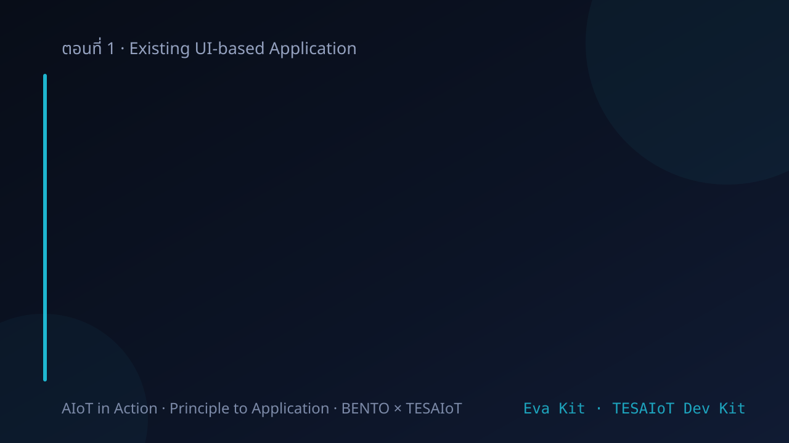
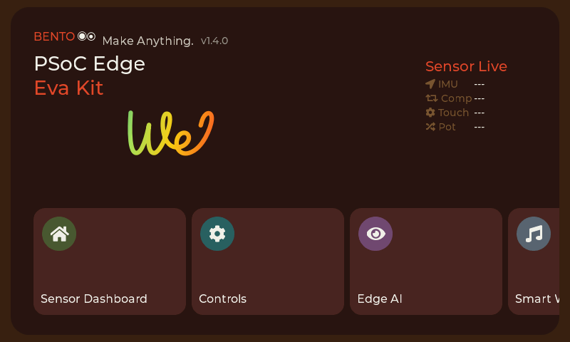
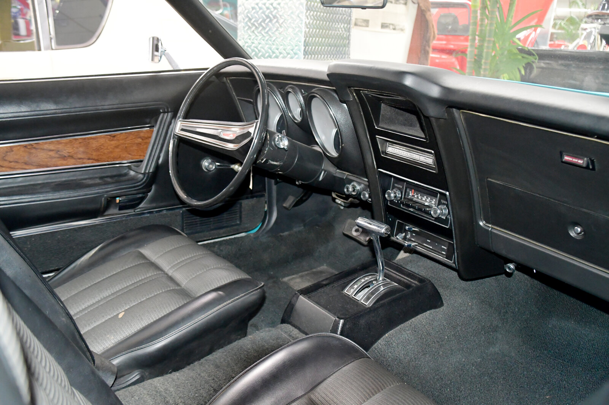
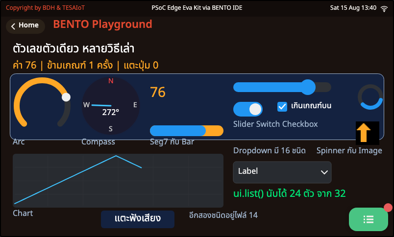

<!-- _class: cover -->

# บทเรียน 1.1 — ทัวร์บอร์ด: เล่นของจริงก่อน

## ทัวร์บอร์ดครบทุกเมนู แล้วส่งข้อความแรกขึ้นจอ

**โมดูล 1 — แอปพลิเคชันบนจอที่มีอยู่แล้ว**

> คาถาประจำบทเรียน: **เล่นของจริงให้เห็นภาพก่อน แล้วค่อยถามว่ามันทำงานยังไง**

---

## ดูของจริงก่อน — บอร์ดนี้ทำอะไรได้บ้าง

<svg viewBox="0 0 940 250" xmlns="http://www.w3.org/2000/svg">
  <rect x="384" y="52" width="172" height="146" rx="10" fill="#132033" stroke="#3d5a80" stroke-width="2"/>
  <rect x="395" y="88" width="150" height="90" rx="5" fill="#0b1b2b" stroke="#4a90d9" stroke-width="2"/>
  <text x="470" y="76" text-anchor="middle" font-size="17" fill="#6b8fb5">Eva Kit</text>
  <text x="470" y="126" text-anchor="middle" font-size="18" fill="#8fb8e0">จอสัมผัส</text>
  <text x="470" y="150" text-anchor="middle" font-size="18" fill="#8fb8e0">4.3 นิ้ว</text>
  <circle cx="368" cy="46" r="9" fill="#22d3ee"><animate attributeName="r" values="7;12;7" dur="2s" repeatCount="indefinite"/></circle>
  <text x="348" y="52" text-anchor="end" font-size="19" fill="#37474f">IMU เอียง/เขย่า</text>
  <circle cx="368" cy="102" r="9" fill="#a3c93a"><animate attributeName="r" values="7;12;7" dur="2s" begin="0.4s" repeatCount="indefinite"/></circle>
  <text x="348" y="108" text-anchor="end" font-size="19" fill="#37474f">เข็มทิศ</text>
  <circle cx="368" cy="158" r="9" fill="#ffb066"><animate attributeName="r" values="7;12;7" dur="2s" begin="0.8s" repeatCount="indefinite"/></circle>
  <text x="348" y="164" text-anchor="end" font-size="19" fill="#37474f">ปุ่มสัมผัส + ลูกบิด</text>
  <circle cx="368" cy="214" r="9" fill="#ff84cf"><animate attributeName="r" values="7;12;7" dur="2s" begin="1.2s" repeatCount="indefinite"/></circle>
  <text x="348" y="220" text-anchor="end" font-size="19" fill="#37474f">ไมโครโฟน</text>
  <circle cx="572" cy="46" r="9" fill="#6cb2f5"><animate attributeName="r" values="7;12;7" dur="2s" begin="0.2s" repeatCount="indefinite"/></circle>
  <text x="592" y="52" font-size="19" fill="#37474f">WiFi + Bluetooth</text>
  <circle cx="572" cy="102" r="9" fill="#c4a6ff"><animate attributeName="r" values="7;12;7" dur="2s" begin="0.6s" repeatCount="indefinite"/></circle>
  <text x="592" y="108" font-size="19" fill="#37474f">เทอร์มิสเตอร์วัดอุณหภูมิ</text>
  <circle cx="572" cy="158" r="9" fill="#ecc14a"><animate attributeName="r" values="7;12;7" dur="2s" begin="1.0s" repeatCount="indefinite"/></circle>
  <text x="592" y="164" font-size="19" fill="#37474f">LED + ปุ่มผู้ใช้</text>
  <circle cx="572" cy="214" r="9" fill="#94a1bf"><animate attributeName="r" values="7;12;7" dur="2s" begin="1.4s" repeatCount="indefinite"/></circle>
  <text x="592" y="220" font-size="19" fill="#37474f">ช่องเสียบ SD card</text>
</svg>

วันนี้ยังไม่ต้องเขียนโปรแกรมอะไรยาว ๆ เราจะ **เล่นก่อน** และเราจะเริ่มเล่นตั้งแต่สไลด์ถัดไป ไม่ใช่ตอนกลางบทเรียน

บอร์ดที่อยู่ตรงหน้าผู้เรียนตอนนี้ ข้างในมีของครบทุกอย่างที่ระบบ AIoT จริงต้องมี — เซนเซอร์วัดการเคลื่อนไหว เข็มทิศ ปุ่มสัมผัส หน้าจอ ไมโครโฟน และวิทยุ WiFi

คอร์สนี้ใช้บอร์ดสองรุ่น — **PSoC Edge Eval Kit (Eva Kit)** และ **TESAIoT Dev Kit** — ภาพร่างข้างบนวาดจาก Eva Kit ส่วน Dev Kit มีของชุดเดียวกันนี้ครบ และเพิ่มเซนเซอร์อุณหภูมิ/ความชื้น ความกดอากาศ เรดาร์ ลูกบิดสี่ตัว และ RGB dot matrix เข้ามา โค้ดที่เขียนในคอร์สนี้รันได้ทั้งสองบอร์ด ที่ต่างกันจะบอกไว้ตรงจุด

สิ่งที่เราจะทำในชุดบทเรียนนี้คือ กดมันให้ทั่ว จดว่าอะไรทำงานยังไง แล้วปิดท้ายด้วยการส่งข้อความของทีมเราเองขึ้นจอ

> ของทุกอย่างที่เห็นบนจอวันนี้ อีกสิบเอ็ดชุดบทเรียนข้างหน้าเราจะสร้างมันขึ้นมาเองทีละชิ้น

---

## เป้าหมายของชุดบทเรียนนี้

1. เล่นเมนูหลักบนบอร์ดให้ครบ แล้วบอกได้ว่า **เมนูไหนใช้เซนเซอร์ตัวไหน**
2. รู้จักสมองสองก้อนของบอร์ด (CM33 กับ CM55) ว่าใครทำหน้าที่อะไร
3. ใช้โมดูล `lcd` กับ `ui` ส่งข้อความและตัวเลขของทีมขึ้นจอได้
4. ต่อบอร์ดเข้ากับ BENTO IDE แล้ว **รันไฟล์ตัวอย่างของชุดบทเรียนนี้ได้ครบ**

ปลายทางของวันนี้: จอบอร์ดขึ้นชื่อทีมเรา ชื่อสมาชิกไล่ทีละคน และบรรทัดสีเขียวว่าสำเร็จ

> ชุดบทเรียนนี้วัดกันที่ "เล่นเป็น + อธิบายได้" ไม่ใช่ "เขียนโค้ดยาว" — เปิดบอร์ดได้เลยตั้งแต่สไลด์หน้า

---

## รอบที่ 1 — เล่นหน้า Home ให้ทั่ว

<svg viewBox="0 0 900 132" xmlns="http://www.w3.org/2000/svg">
  <rect x="20" y="10" width="250" height="112" rx="7" fill="#101a28" stroke="#22d3ee" stroke-width="2"/>
  <text x="36" y="34" font-size="19" font-weight="700" fill="#22d3ee">Sensor Live</text>
  <text x="36" y="58" font-size="17" fill="#c9d3e8">IMU  x <tspan fill="#ffb066">+0.02</tspan></text>
  <text x="36" y="78" font-size="17" fill="#c9d3e8">Comp <tspan fill="#ffb066">137°</tspan></text>
  <text x="36" y="98" font-size="17" fill="#c9d3e8">Touch <tspan fill="#ffb066">--</tspan></text>
  <text x="36" y="116" font-size="17" fill="#c9d3e8">Pot  <tspan fill="#ffb066">48%</tspan></text>
  <circle cx="248" cy="53" r="5" fill="#ffb066"><animate attributeName="r" values="6;11;6" dur="1.2s" repeatCount="indefinite"/></circle>
  <text x="300" y="40" font-size="19" fill="#455a64">เอียงบอร์ด → แถว IMU วิ่ง</text>
  <text x="300" y="66" font-size="19" fill="#455a64">หมุนบอร์ด → เข็มทิศเปลี่ยน</text>
  <text x="300" y="92" font-size="19" fill="#455a64">แตะปุ่มสัมผัส → Touch เปลี่ยน</text>
  <text x="300" y="118" font-size="19" fill="#455a64">หมุนลูกบิด → Pot เปลี่ยน</text>
  <text x="690" y="70" font-size="18" font-weight="700" fill="#2e7d32">ยังไม่มีโค้ดของเรา</text>
  <text x="690" y="90" font-size="18" fill="#4a7c4e">แต่ค่าวิ่งอยู่แล้ว</text>
</svg>

เปิดบอร์ด รอจอติด แล้วอยู่ที่หน้า Home ก่อน อย่าเพิ่งกดเข้าเมนูไหน

**ลองทีละอย่างแล้วสังเกตแผง Sensor Live ทางขวาของจอ:**

1. เอียงบอร์ดไปทางซ้าย-ขวา แล้วดูแถว IMU — ตัวเลขวิ่งตามไหม
2. หมุนบอร์ดรอบตัวเอง แล้วดูแถว Comp (เข็มทิศ) — ค่าองศาเปลี่ยนไหม
3. แตะแผ่นสัมผัส CapSense แล้วดูแถว Touch (Eva Kit: ปุ่มสัมผัสสองปุ่มด้านขวาของบอร์ด · Dev Kit: ดูที่บอร์ดของทีมว่าแผ่นสัมผัสอยู่ตรงไหน)
4. ลากนิ้วบนแถบเลื่อน (Eva Kit: ใต้ปุ่มสัมผัส · Dev Kit: ถ้าบอร์ดของทีมมี) — ค่าเปลี่ยนจาก 0 ถึง 100 ไหม
5. หมุนลูกบิด แล้วดูแถว Pot (Eva Kit: ลูกบิดสีน้ำเงินตัวเดียว · Dev Kit: VR1 — ลูกบิดตัวอื่นไม่ขึ้นแถวนี้)

ภาพถ่ายจอจริงของบอร์ด Eva Kit หน้า Home ในวินาทีที่เพิ่งเปิดเครื่อง — บันทึกโดยผู้สอน · ตัวอักษร "Welcome" ยังลากไม่จบ กำลังเขียนอยู่ตอนกดชัตเตอร์ · แผง Sensor Live อยู่ <b>มุมขวาบน</b> ไม่ใช่ซ้ายอย่างในภาพร่าง และตอนนี้ยังเป็นขีดทั้งสี่แถว เพราะเซนเซอร์ยังไม่ส่งค่ารอบแรกกลับมา — ทำตามห้าข้อทางซ้ายแล้วขีดจะกลายเป็นตัวเลข · บน Dev Kit แผงนี้มีหกแถว เพิ่ม Temp กับ Humid จากเซนเซอร์ที่ Eva Kit ไม่มี · มุมขวาบนสุดยังไม่มีไอคอน WiFi และไม่มีนาฬิกา เพราะชุดบทเรียนนี้ยังไม่ได้ต่อเน็ต

> ยังไม่มีโค้ดของเราสักบรรทัด แต่ค่าพวกนี้วิ่งอยู่แล้ว — เพราะเฟิร์มแวร์อ่านเซนเซอร์ให้ตลอดเวลา

---

## รอบที่ 2 — สามเมนูที่ต้องเล่นให้ครบ

<svg viewBox="0 0 920 108" xmlns="http://www.w3.org/2000/svg">
  <rect x="10" y="10" width="280" height="88" rx="7" fill="#f1f8e9" stroke="#558b2f" stroke-width="2"/>
  <text x="150" y="34" text-anchor="middle" font-size="19" font-weight="700" fill="#558b2f">Controls (Eva Kit)</text>
  <circle cx="100" cy="62" r="13" fill="#e53935"/><circle cx="150" cy="62" r="13" fill="#43a047"/>
  <circle cx="200" cy="62" r="13" fill="#1e88e5"><animate attributeName="fill" values="#1e88e5;#0d2b45;#1e88e5" dur="1.8s" repeatCount="indefinite"/></circle>
  <text x="150" y="90" text-anchor="middle" font-size="16" fill="#6b8e23">แตะจอ ไฟจริงติด</text>
  <rect x="310" y="10" width="290" height="88" rx="7" fill="#e3f2fd" stroke="#1565c0" stroke-width="2"/>
  <text x="455" y="34" text-anchor="middle" font-size="19" font-weight="700" fill="#1565c0">Sensor Dashboard</text>
  <polyline points="335,80 365,64 395,74 425,54 455,68 485,58 515,72 575,62" fill="none" stroke="#1565c0" stroke-width="2"/>
  <text x="455" y="94" text-anchor="middle" font-size="16" fill="#5472a3">กราฟ + เข็มทิศ</text>
  <rect x="620" y="10" width="290" height="88" rx="7" fill="#f3e5f5" stroke="#6a1b9a" stroke-width="2"/>
  <text x="765" y="34" text-anchor="middle" font-size="19" font-weight="700" fill="#6a1b9a">Smart Watch</text>
  <circle cx="765" cy="64" r="20" fill="none" stroke="#6a1b9a" stroke-width="2"/>
  <line x1="765" y1="64" x2="765" y2="50" stroke="#6a1b9a" stroke-width="2"/>
  <line x1="765" y1="64" x2="777" y2="72" stroke="#6a1b9a" stroke-width="2" opacity="0.45"/>
  <text x="765" y="94" text-anchor="middle" font-size="16" fill="#7e5a94">ปัดเปลี่ยน 6 หน้า</text>
</svg>

**Controls** (Eva Kit เท่านั้น) — แตะวงกลมสีบนจอ แล้วมอง **หลอด LED จริงบนบอร์ด** ว่าติดตาม
นี่คือครั้งแรกที่ผู้เรียนเห็นว่า "แตะกระจก" ทำให้ "ของจริงเปลี่ยนสถานะ" ได้ (บทเรียน 2.1–2.3 กับ 2.4–2.6 เราจะสร้างหน้านี้เอง) · **Dev Kit ไม่มีการ์ด Controls** — ทีมที่ถือ Dev Kit ให้ข้ามไปเมนูถัดไปก่อน แล้วดูไฟจริงติดจากโค้ดตอนรัน [`11_lights_and_a_button.py`](https://github.com/tesaiot/tesa-qualification-program/blob/main/courses/aiot-micropython/m01-ui-application/l03-inside-the-box/examples/11_lights_and_a_button.py) ในครึ่งหลังของชุดบทเรียนแทน

**Sensor Dashboard** — เขย่าบอร์ดเบา ๆ แล้วดูกราฟทางซ้ายกระเพื่อม เข็มทิศทางขวาหมุนตามการหันบอร์ด
(บทเรียน 3.4–3.6 กับ 3.7–3.9 เราจะสร้างกราฟและเข็มทิศแบบนี้เอง)

**Smart Watch** — ปัดนิ้วซ้าย-ขวาเพื่อเปลี่ยนหน้า มีทั้งหน้านาฬิกา สุขภาพ เพลง อากาศ
ตัวนับก้าวคำนวณจากเซนเซอร์ความเร่งตัวเดียวกับที่เราจะใช้ในบทเรียน 3.1–3.3 · **เวลาบนหน้าปัดยังไม่ตรง** เพราะบอร์ดตั้งนาฬิกาจากอินเทอร์เน็ตเท่านั้น และยังไม่ได้ต่อ WiFi (ชุดบทเรียนถัดไปต่อแล้วจะตรงเอง)

แผงหน้าปัดรถยนต์จริง เกจกลม สวิตช์ และวิทยุอยู่ครบในหน้าเดียว — คือสิ่งที่เมนู Sensor Dashboard บนบอร์ดกำลังเลียนแบบ ระหว่างเล่นให้เทียบดูว่า พอย้ายทุกอย่างขึ้นจอเดียวแล้ว **อะไรหายไป** จากการหมุนลูกบิดจริงบ้าง (ภาพ: Eric Friedebach, Wikimedia Commons, CC BY 2.0)

> เล่นแล้วจดลงบันทึกการเรียน ทันที — ความจำจากการเล่นหายเร็วกว่าที่คิด

---

## รอบที่ 3 — เมนูที่ต้องรู้ว่ามีอยู่

<svg viewBox="0 0 900 96" xmlns="http://www.w3.org/2000/svg">
  <rect x="14" y="12" width="205" height="72" rx="7" fill="#eceff1" stroke="#607d8b" stroke-width="2"/>
  <text x="116" y="38" text-anchor="middle" font-size="19" font-weight="700" fill="#455a64">Audio Player</text>
  <text x="116" y="62" text-anchor="middle" font-size="16" fill="#c62828">Eva Kit · No SD Card</text>
  <rect x="237" y="12" width="205" height="72" rx="7" fill="#e1f5fe" stroke="#0277bd" stroke-width="2"/>
  <text x="339" y="38" text-anchor="middle" font-size="19" font-weight="700" fill="#0277bd">Wi-Fi Setting</text>
  <text x="339" y="62" text-anchor="middle" font-size="16" fill="#0277bd">บทเรียน 1.4–1.6 ค่อยต่อ</text>
  <rect x="460" y="12" width="205" height="72" rx="7" fill="#ede7f6" stroke="#4527a0" stroke-width="3"/>
  <text x="562" y="38" text-anchor="middle" font-size="19" font-weight="700" fill="#4527a0">Playground</text>
  <text x="562" y="62" text-anchor="middle" font-size="16" fill="#4527a0">ประตูของเราทุกบทเรียน</text>
  <circle cx="655" cy="22" r="6" fill="#4527a0"><animate attributeName="r" values="6;11;6" dur="1.4s" repeatCount="indefinite"/></circle>
  <rect x="683" y="12" width="205" height="72" rx="7" fill="#fce4ec" stroke="#ad1457" stroke-width="2"/>
  <text x="785" y="38" text-anchor="middle" font-size="19" font-weight="700" fill="#ad1457">TESAIoT Connect</text>
  <text x="785" y="62" text-anchor="middle" font-size="16" fill="#ad1457">Eva Kit · บทเรียน 4.4–4.9</text>
</svg>

**Audio Player** (Eva Kit เท่านั้น — Dev Kit ไม่มีการ์ดนี้) — เครื่องเล่นเพลงจริงจาก SD card
ถ้าไม่ได้เสียบ SD card หน้านี้จะขึ้น `Now Playing: No SD Card` และบรรทัด **สีแดง** `SD Card failed: step 2 (InitCard)` — **นี่ไม่ใช่บอร์ดเสีย** ปุ่มเล่นและแถบเสียงยังอยู่ครบ ขาดแค่รายชื่อไฟล์

**Wi-Fi Setting** — สแกนหาเครือข่าย เลือก แล้วใส่รหัส
ชุดบทเรียนนี้ยังไม่ต้องต่อ (บทเรียน 1.4–1.6 จะต่อด้วยโค้ดของเราเอง) แต่ให้กดเข้าไปดูว่าหน้าตาเป็นยังไง — เมนูนี้มีทั้งสองบอร์ด และอยู่ในเกณฑ์ผ่านของชุดบทเรียน

**BENTO Playground** — หน้าที่สำคัญที่สุดสำหรับเรา
ทุกครั้งที่เราส่งโค้ดจากคอมมาที่บอร์ด ผลลัพธ์จะมาโผล่ที่หน้านี้ ถ้าไม่เปิดหน้านี้ค้างไว้ จะงงว่าทำไมส่งโค้ดแล้วไม่เห็นอะไร

**TESAIoT Connectivity** (Eva Kit เท่านั้น — Dev Kit ไม่มีการ์ดนี้) — แดชบอร์ดสถานะการเชื่อมต่อกับแพลตฟอร์ม IoT
ปลายทางของบทเรียน 4.4–4.9 อยู่ตรงนี้ กดเข้าไปดูไว้ก่อนได้ว่าเราจะไปจบที่ไหน — ทีมที่ถือ Dev Kit จะได้เห็นปลายทางเดียวกันผ่านโค้ดของตัวเองในบทเรียน 4.4–4.9

> เมนู Playground คือประตูที่เราจะเดินผ่านทุกบทเรียนตั้งแต่วันนี้เป็นต้นไป

---

## ปลายทางของชุดบทเรียนนี้ — จอที่เราจะได้ตอนจบชุดบทเรียน

หน้าจอจริงจากการรัน <a href="https://github.com/tesaiot/tesa-qualification-program/blob/main/courses/aiot-micropython/m01-ui-application/l03-inside-the-box/examples/15_one_number_many_faces.py"><code>15_one_number_many_faces.py</code></a> บน BENTO Emulator ที่ 800x480 เท่าจอของทั้งสองบอร์ด — ไม่ใช่ภาพวาด ไม่ใช่ mock-up · <b>ภาพนี้เก่า</b> ถ่ายตอนไฟล์ยังพิมพ์ว่า "จาก 32" ปัจจุบันไฟล์พิมพ์ "จาก 64" แล้ว รอถ่ายใหม่

- **เลขตัวเดียว 76 ขับทุกอย่างบนจอพร้อมกัน** — Arc, Compass, Seg7, Bar, Slider, Switch, Checkbox, Chart, Spinner
- มุมล่างเขียนว่า `ui.list() นับได้ 24 ตัว จาก 64` — บอร์ดนับ widget ของตัวเองได้ · 64 คือเพดานของเฟิร์มแวร์ ส่วนงบที่คอร์สตั้งให้ตัวเองคือ 32 ต่อหน้า (บทเรียน 2.4–2.6 อธิบายว่าทำไม)
- ปุ่ม "แตะฟังเสียง" มีจริง กดแล้วดัง — บน Eva Kit ดังจากลำโพงบนบอร์ด (Dev Kit: ฟังที่บอร์ดของทีม)

> ทั้งหมดนี้เขียนด้วย Python บนบอร์ด ไม่มี LVGL ไม่มี C สักบรรทัด — และวันนี้ผู้เรียนจะได้เขียนเอง
