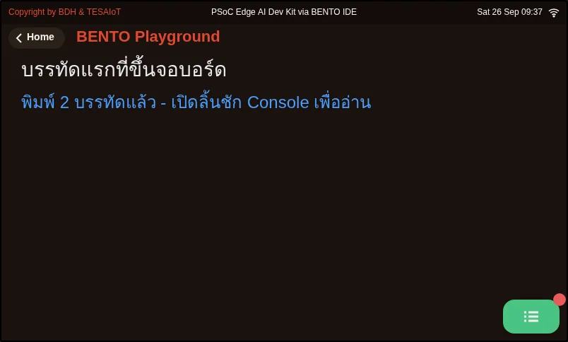
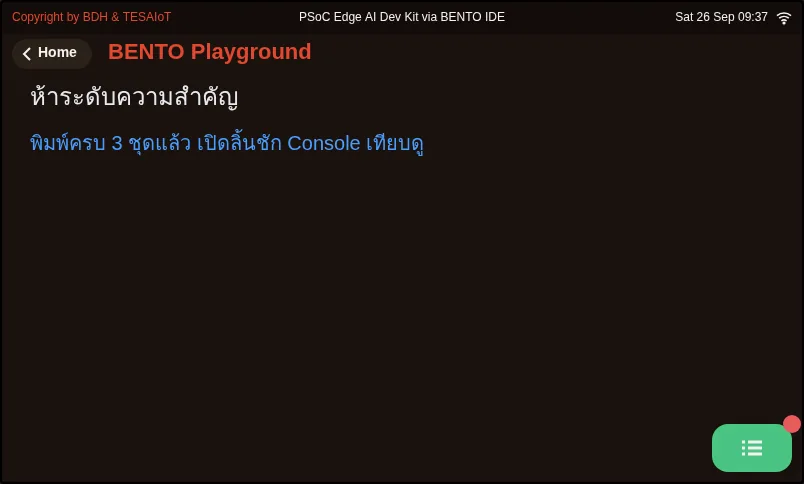
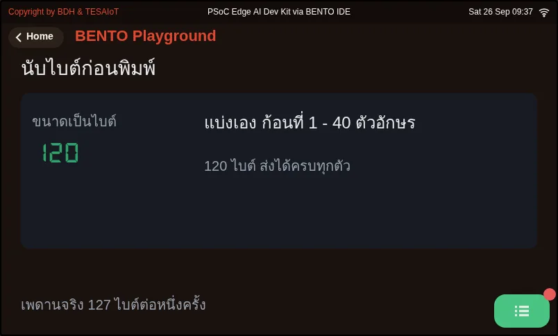
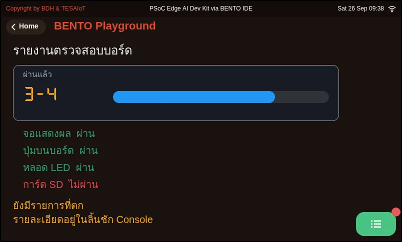
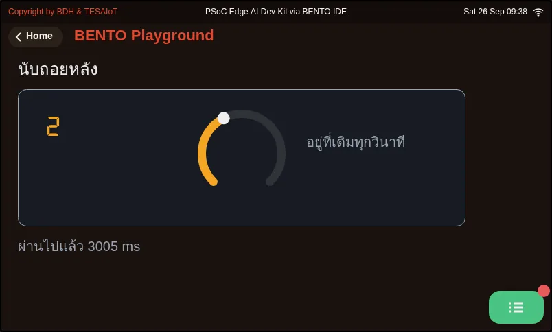
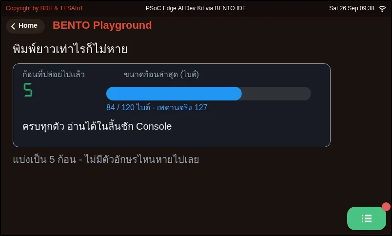
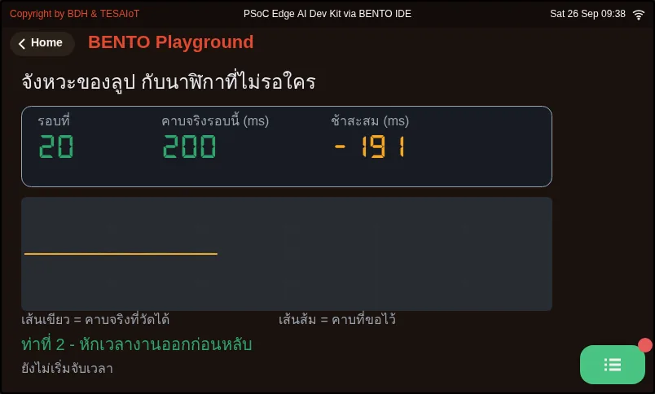
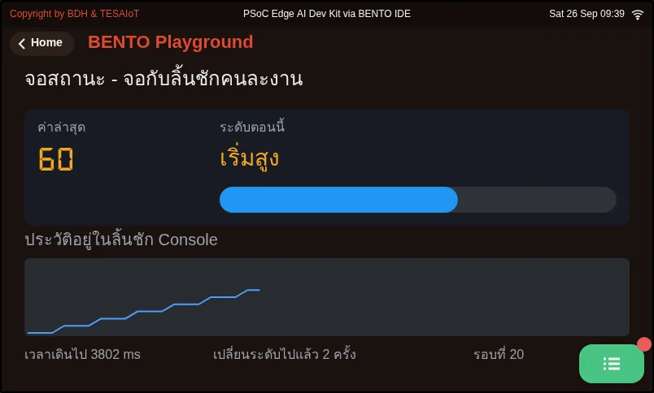
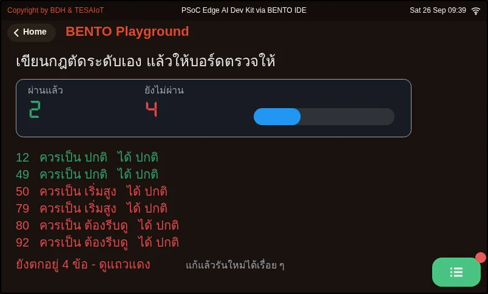

# บทเรียน 1.2 — ข้อความแรกขึ้นจอ: โมดูล lcd กับ ui

> โมดูล 1 — แอปพลิเคชันบนจอที่มีอยู่แล้ว · สไลด์: [slides.md](slides.md) · [ภาพรวมโมดูล](../README.md) · [หน้าหลักสูตร](../../README.md)

ส่งข้อความแรกขึ้นจอบอร์ดด้วยโมดูล lcd ui และ time แล้วเรียนกติกาที่ทำให้ข้อความหายเงียบ ๆ ก่อนจะประกอบทั้งหมดเป็นจอสถานะหนึ่งใบ

## เป้าหมาย

เมื่อจบบทเรียนนี้ คุณจะ:

1. ส่งข้อความหนึ่งบรรทัดออกสามปลายทาง (print, lcd.print, ui.Label) แล้วหาเจอครบทั้งสามที่ โดยเรียก ui.poll() หลังสร้างหรือแก้ widget ทุกครั้ง
2. ทำนายได้ว่าข้อความภาษาไทยหนึ่งก้อนจะพอดีกับ lcd.print() หนึ่งครั้ง (127 ไบต์) หรือไม่ โดยนับด้วย len(text.encode()) แล้วแบ่งข้อความที่ยาวเกินก่อนส่ง
3. อธิบายและใช้โครงของ 08_status_screen.py ได้ คือสร้าง widget ครั้งเดียวนอกลูปแล้วเขียนทับด้วย .text() หรือ .value() และพิมพ์ลงลิ้นชัก Console เฉพาะตอนระดับเปลี่ยน
4. เติม level_name() ใน 09_your_level_rule.py จนหกแถวใน CASES เป็นสีเขียวครบ รวมค่าที่อยู่ตรงเส้น 49 50 79 และ 80

## ก่อนเริ่ม

เปิดบันทึกการเรียนจากบทเรียน 1.1 ไว้ บนจอบอร์ดแตะการ์ด **BENTO Playground** เปิดค้างไว้ก่อนส่งโค้ดทุกครั้ง
แล้วเปิด BENTO IDE บนคอมให้เจอบอร์ด ทีมละหนึ่งบอร์ดก็พอ แต่สลับกันเป็นคนพิมพ์ทุกช่วง

- **อุปกรณ์:** บอร์ด Eva Kit หรือ TESAIoT Dev Kit ที่ลงเฟิร์มแวร์ MicroPython ของ BENTO แล้ว หรือ BENTO Emulator ใน [BENTO IDE](https://ide.tesaiot.dev/)
- **เรียนมาก่อน:** [บทเรียน 1.1 — ทัวร์บอร์ด: เล่นของจริงก่อน](../l01-board-tour/README.md)

## ดูของจริงก่อน

ส่ง `01_first_line.py` ขึ้นบอร์ด แล้ว **หันไปมองจอบอร์ด ไม่ใช่จอคอม** ป้ายหนึ่งใบขึ้นบนหน้า Playground ทันที
แต่บรรทัดที่เหลือหายไปไหน ลองหาให้เจอก่อนอ่านต่อ: บรรทัดหนึ่งอยู่ในคอนโซลของ BENTO IDE ฝั่งคอม
อีกสองบรรทัดรออยู่ในลิ้นชัก Console ซึ่งเปิดด้วยปุ่มไอคอนสีเขียวมุมขวาล่างของหน้า Playground
(จุดแดงเล็ก ๆ ที่มุมปุ่มแปลว่ามีข้อความรออยู่) จอเงียบมักแปลว่าเรามองผิดที่ ไม่ใช่โค้ดพัง

## แนวคิด

เฟิร์มแวร์ทำงานหนักให้แล้วราว 70% ทั้งอ่านเซนเซอร์ วาดทุกเมนู คุย IPC ระหว่างสองคอร์ และรัน MicroPython
งานของเราคืออีก 30% ที่เหลือ: ตัดสินใจว่าจะเอาข้อมูลอะไรมาแสดง แสดงอย่างไร และส่งไปไหนต่อ
บทเรียนนี้ 30% ของเรายังเล็กมาก คือแค่พิมพ์ลงจอ แต่กลไกเบื้องหลังเหมือนกันทุกบทเรียนต่อจากนี้

ข้อความหนึ่งบรรทัดไปได้สามที่ คนละที่กัน: `print()` ขึ้นคอนโซลฝั่งคอม · `lcd.print()` ลงลิ้นชัก Console บนบอร์ด ·
`ui.Label` ขึ้นบนหน้าจอตรง ๆ กฎข้อเดียวที่ต้องจำ: สร้างหรือแก้ `ui.*` แล้วเคาะ `ui.poll()` หนึ่งครั้ง
ไม่งั้นจอจะนิ่งไปราวสองวินาที และ `value=` บน `ui.Label` คือขนาดตัวอักษร ไม่ใช่ตัวเลขที่จะแสดง
พื้นที่วาดของเราคือ 792 x 398 พิกเซล มุมขวาล่างราว 100x58 เป็นของปุ่ม Console ห้ามวาง widget ทับ

จอนับ **ไบต์** ไม่ได้นับตัวอักษร `lcd.print()` ส่งได้ 127 ไบต์ต่อครั้ง ป้าย `ui` พาได้ 126 ไบต์ทั้งตอนสร้างและตอนเรียก `.text()`
ไทยหนึ่งตัวกิน 3 ไบต์ จึงได้ราว 42 ตัวอักษร ส่วนที่เกินถูกตัดทิ้งโดยไม่มี error และ `\n` ท้ายบรรทัดหายไปด้วย
สีในลิ้นชักก็เช่นกัน ห้าคลาสของ `span` (muted info ok warn error) คือห้าระดับความสำคัญ ไม่ใช่สีให้เลือกตามชอบ
และชื่อคลาสที่พิมพ์ผิดจะออกมาเป็นสีปกติเฉย ๆ ไม่มี error ให้จับ

ค่าที่เปลี่ยนตลอดเวลามีสองท่า ท่าลิ้นชักคือ `lcd.clear()` แล้ววาดใหม่ทั้งหน้า (ถี่กว่าราว 5 ครั้งต่อวินาทีตาจะเห็นเป็นจอกระพริบ)
ท่า widget คือสร้างครั้งเดียวนอกลูปแล้วเขียนทับด้วย `.text()` หรือ `.value()` ซึ่งถูกกว่ามากเพราะส่งข้ามคอร์แค่ค่าใหม่
อย่าสร้าง `ui.Label` ด้วยข้อความว่าง เพราะจอจะเติมคำว่า `Label` ให้เอง ส่วนเรื่องเวลา `sleep_ms()` แปลว่าหลับ
*อย่างน้อย* เท่านี้ งานก่อนหลับกินเวลาของมันเอง ลูปจึงเดินช้ากว่าที่ขอและช้าสะสม วัดด้วย `ticks_diff()` เสมอ ไม่ใช่ลบกันตรง ๆ

`08_status_screen.py` ไม่มีคำสั่งใหม่เลยสักตัว ของใหม่คือการเอาชิ้นส่วนมาต่อกัน: จอตอบว่า "ตอนนี้เป็นอย่างไร"
ลิ้นชักตอบว่า "ที่ผ่านมาเกิดอะไรขึ้น" และพิมพ์ลงลิ้นชักเฉพาะตอนระดับเปลี่ยน นี่คือไฟล์ที่ควรอ่านซ้ำที่สุดในชุด

## ตัวอย่างสมบูรณ์

สไลด์แนะนำให้เปิดตามลำดับนี้: `01_first_line.py` → `02_markup_tags.py` → `03_byte_limit.py` → `08_status_screen.py`
→ `09_your_level_rule.py` ทุกไฟล์จบด้วยบล็อก **ตาคุณ** ให้แก้แล้วรันซ้ำ ใน `03` และ `07` ให้ **ทำนายก่อนรัน**
แล้วจดตัวเลขที่ทำนายลงบันทึกการเรียนก่อนกดส่ง ไฟล์ที่เหลือเปิดเมื่อเจออาการตรงกัน: ข้อความขาดหายท้ายบรรทัด
เปิด `06_safe_print.py` · รายงานยาวจนตอบไม่ได้ว่าผ่านหรือไม่ เปิด `04_console_drawer.py` · ค่าไหลลงจนเต็มจอ
เปิด `05_clear_and_refresh.py` · ลูปเดินช้ากว่าที่สั่งและยิ่งนานยิ่งเพี้ยน เปิด `07_ticks_and_beat.py`

| ไฟล์ | ไฟล์นี้สอน |
|---|---|
| [examples/01_first_line.py](examples/01_first_line.py) | บรรทัดแรกที่ขึ้นจอบอร์ด |
| [examples/02_markup_tags.py](examples/02_markup_tags.py) | ทำให้บรรทัดที่ต้องรีบอ่าน เด่นออกมาจากบรรทัดอื่น |
| [examples/03_byte_limit.py](examples/03_byte_limit.py) | ข้อความยาวเกิน 127 ไบต์ จะถูกตัดหายเงียบ ๆ |
| [examples/04_console_drawer.py](examples/04_console_drawer.py) | ลิ้นชัก Console กับการ์ดสรุปที่ไม่ต้องเปิดลิ้นชัก |
| [examples/05_clear_and_refresh.py](examples/05_clear_and_refresh.py) | อัปเดตซ้ำที่เดิม ต่างจากไล่พิมพ์ลงมา |
| [examples/06_safe_print.py](examples/06_safe_print.py) | ฟังก์ชันช่วยพิมพ์ที่ไม่มีวันโดนตัดเงียบ |
| [examples/07_ticks_and_beat.py](examples/07_ticks_and_beat.py) | ลูปที่สั่ง sleep เท่าเดิมทุกรอบ ไม่ได้เดินตรงเวลา |
| [examples/08_status_screen.py](examples/08_status_screen.py) | จอสถานะหนึ่งใบ ที่สามโมดูลแบ่งงานกันทำ |
| [examples/09_your_level_rule.py](examples/09_your_level_rule.py) | ไฟล์นี้รันได้ แต่ยังตอบผิดทุกข้อ งานของคุณคือทำให้มันถูก |

**ภาพจอจาก BENTO Emulator** ของตัวอย่างในบทนี้ (คลิกชื่อไฟล์เพื่อเปิดโค้ด)

<figure><figcaption><a href="examples/01_first_line.py"><code>01_first_line.py</code></a> บรรทัดแรกที่ขึ้นจอบอร์ด</figcaption></figure>
<figure><figcaption><a href="examples/02_markup_tags.py"><code>02_markup_tags.py</code></a> ทำให้บรรทัดที่ต้องรีบอ่าน เด่นออกมาจากบรรทัดอื่น</figcaption></figure>
<figure><figcaption><a href="examples/03_byte_limit.py"><code>03_byte_limit.py</code></a> ข้อความยาวเกิน 127 ไบต์ จะถูกตัดหายเงียบ ๆ</figcaption></figure>
<figure><figcaption><a href="examples/04_console_drawer.py"><code>04_console_drawer.py</code></a> ลิ้นชัก Console กับการ์ดสรุปที่ไม่ต้องเปิดลิ้นชัก</figcaption></figure>
<figure><figcaption><a href="examples/05_clear_and_refresh.py"><code>05_clear_and_refresh.py</code></a> อัปเดตซ้ำที่เดิม ต่างจากไล่พิมพ์ลงมา</figcaption></figure>
<figure><figcaption><a href="examples/06_safe_print.py"><code>06_safe_print.py</code></a> ฟังก์ชันช่วยพิมพ์ที่ไม่มีวันโดนตัดเงียบ</figcaption></figure>
<figure><figcaption><a href="examples/07_ticks_and_beat.py"><code>07_ticks_and_beat.py</code></a> ลูปที่สั่ง sleep เท่าเดิมทุกรอบ ไม่ได้เดินตรงเวลา</figcaption></figure>
<figure><figcaption><a href="examples/08_status_screen.py"><code>08_status_screen.py</code></a> จอสถานะหนึ่งใบ ที่สามโมดูลแบ่งงานกันทำ</figcaption></figure>
<figure><figcaption><a href="examples/09_your_level_rule.py"><code>09_your_level_rule.py</code></a> ไฟล์นี้รันได้ แต่ยังตอบผิดทุกข้อ งานของคุณคือทำให้มันถูก</figcaption></figure>

## เช็กความเข้าใจ

คำถามชุดเดียวกันอยู่ใน [quiz.yaml](quiz.yaml) สำหรับระบบที่ตรวจอัตโนมัติ

1. คุณสร้าง ui.Label บนหน้า Playground แล้วจอนิ่งไปราวสองวินาทีกว่าป้ายจะโผล่ สาเหตุที่น่าจะเป็นที่สุดคืออะไร *(เลือกหนึ่งข้อ · เป้าหมายข้อ 1)*
   - ก) ยังไม่ได้เรียก ui.poll() หลังสร้าง widget
   - ข) ตั้ง value= ผิด เพราะ value= คือตัวเลขที่ป้ายจะแสดง
   - ค) ป้ายต้องใช้ lcd.print() แทนจึงจะขึ้นทันที
   - ง) บอร์ดยังไม่ได้ต่อ WiFi

   

เฉลย

   **ก** — สร้างหรือแก้ ui.* แล้วต้องเคาะ ui.poll() หนึ่งครั้ง ถ้าไม่เคาะ ป้ายก็ยังมาแต่ช้าไปราวสองวินาที ส่วน value= บน ui.Label คือขนาดตัวอักษร

   

2. ข้อใดบอกปลายทางของข้อความได้ถูกต้อง เลือกทุกข้อที่ถูก *(เลือกได้หลายข้อ · เป้าหมายข้อ 1)*
   - ก) print() ขึ้นที่คอนโซลของ BENTO IDE ฝั่งคอม ไม่ได้ขึ้นบนจอบอร์ด
   - ข) lcd.print() ไปรอในลิ้นชัก Console ต้องแตะปุ่มไอคอนสีเขียวมุมขวาล่างจึงจะเห็น
   - ค) ui.Label ขึ้นบนหน้า Playground ได้โดยไม่ต้องกดอะไร
   - ง) ทั้งสามคำสั่งขึ้นที่เดียวกัน ต่างกันแค่สีตัวอักษร

   

เฉลย

   **ก, ข, ค** — หนึ่งบรรทัดไปได้สามที่คนละที่กัน print() อยู่บนคอม lcd.print() อยู่ในลิ้นชัก Console และ ui.Label อยู่บนหน้าจอ จอเงียบจึงมักแปลว่าเรามองผิดที่

   

3. คุณเรียก lcd.print() ครั้งเดียวกับข้อความภาษาไทยยาว 50 ตัวอักษร จะเกิดอะไรขึ้น *(เลือกหนึ่งข้อ · เป้าหมายข้อ 2)*
   - ก) ข้อความถูกตัดที่ 127 ไบต์โดยไม่มี error และ \n ท้ายบรรทัดหายไปด้วย
   - ข) ได้ error บอกว่าข้อความยาวเกิน
   - ค) จอขึ้นบรรทัดใหม่ให้เองจนครบทุกตัว
   - ง) แสดงครบ เพราะ 50 ตัวอักษรยังไม่ถึง 127

   

เฉลย

   **ก** — ไทยหนึ่งตัวกิน 3 ไบต์ 50 ตัวจึงเป็น 150 ไบต์ เกินเพดาน 127 ไบต์ต่อครั้ง ส่วนเกินถูกตัดเงียบ ๆ นับด้วย len(text.encode()) ไม่ใช่ len(text)

   

4. จอสถานะที่ค่าเปลี่ยนทุก 200 ms ควรเขียนแบบไหน *(เลือกหนึ่งข้อ · เป้าหมายข้อ 3)*
   - ก) สร้าง widget ครั้งเดียวนอกลูป เขียนทับด้วย .text() หรือ .value() และพิมพ์ลงลิ้นชักเฉพาะตอนระดับเปลี่ยน
   - ข) สร้าง ui.Label ใหม่ในลูปทุกรอบ จะได้ค่าล่าสุดเสมอ
   - ค) lcd.clear() แล้ววาดใหม่ทั้งหน้าทุก 200 ms
   - ง) lcd.print() ทุกรอบ ประวัติจะได้ครบที่สุด

   

เฉลย

   **ก** — widget ที่สร้างในลูปคือ widget ใหม่ทุกรอบ ล้างจอถี่กว่าราว 5 ครั้งต่อวินาทีจะกระพริบ และลิ้นชักที่ยิงทุกรอบมีแต่บรรทัดซ้ำจนไม่มีใครอ่านไหว 08_status_screen.py จึงแยกงานจอกับงานลิ้นชักออกจากกัน

   

5. ใน level_name() คุณเขียน if v >= 50 คืน "เริ่มสูง" ไว้ก่อน if v >= 80 คืน "ต้องรีบดู" ค่า 92 จะได้ผลอะไร *(เลือกหนึ่งข้อ · เป้าหมายข้อ 4)*
   - ก) "เริ่มสูง" โดยไม่มี error ใด ๆ
   - ข) "ต้องรีบดู" เพราะ 92 มากกว่า 80
   - ค) SyntaxError เพราะเงื่อนไขซ้อนกัน
   - ง) "ปกติ"

   

เฉลย

   **ก** — 92 ผ่านเงื่อนไข 50 ก่อนจึงตกช่องกลาง และไม่มีวันไปถึงช่องบน โดยไม่มี error ให้จับ ต้องเรียง if จากเงื่อนไขที่เข้มที่สุดลงมา

   

## แล็บ

**ตาคุณ ของไฟล์ที่ต้องทำ** จดผลลงบันทึกการเรียนทุกข้อ

- [ ] `01`: เพิ่มชื่อทีมเข้าไปในทั้งสามปลายทาง แล้วจดว่าต้องเปิดดูที่ไหนบ้างถึงเห็นครบ
- [ ] `02`: หาบรรทัดใน `REPORT` ที่ติดระดับผิดแล้วแก้ จากนั้นเพิ่มข่าวของทีมอีกหนึ่งบรรทัดพร้อมเลือกระดับ
- [ ] `03`: ใส่ชื่อสมาชิกภาษาไทยลงใน `ITEMS` ทำนายก่อนว่าได้กี่ไบต์และจะเป็นเขียวหรือแดง แล้วรันเทียบ
- [ ] `08`: ย้าย `lcd.print()` ออกจาก `if` ให้ยิงทุกรอบ แล้วตอบว่าประวัติแบบไหนใช้งานได้จริงกว่า
- [ ] `09`: เติม `level_name()` จนหกแถวเขียว แล้วเพิ่มแถวใน `CASES` ที่คิดว่ากฎของตัวเองน่าจะตก

## ไปต่อ

บทเรียน 1.3 เปิดโมดูลที่เหลือในกล่อง (`gpio` `sensors` `dsp` `mic` `machine`) แล้วให้ทีมเติมไฟล์ฝึก
`s01_hello_lcd.py` จนชื่อทีมขึ้นจอ กติกาที่เหลือของ `ui` อยู่ในบทเรียน 2.4–2.6 และค่าจำลองใน `08`
จะถูกแทนด้วยค่าจากเซนเซอร์จริงตั้งแต่บทเรียน 2.7–2.9

บทเรียนถัดไป: [บทเรียน 1.3 — เปิดกล่อง: สองคอร์ งาน AIoT และป้ายของทีม](../l03-inside-the-box/README.md)

## สะท้อนคิด

- บรรทัดแบบไหนในงานของคุณที่ทำให้คนเดินผ่านต้องลุกจากเก้าอี้ และควรติดคลาสอะไร
- ความรู้ข้อไหนในบทเรียนนี้ที่ต้องอาศัยวินัยของคนทุกครั้ง และจะย้ายมันไปไว้ในฟังก์ชันได้อย่างไร
- ประวัติที่ยิงทุกรอบกับประวัติที่ยิงเฉพาะตอนเปลี่ยน แบบไหนตอบได้ว่า "ค่าขึ้นถึงระดับต้องรีบดูตอนวินาทีที่เท่าไร"
