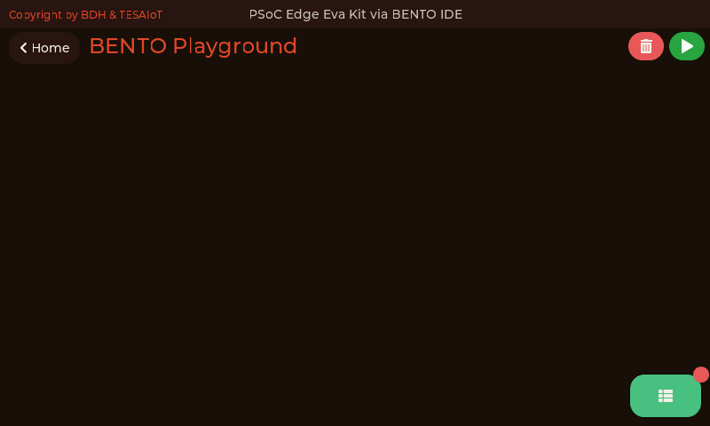
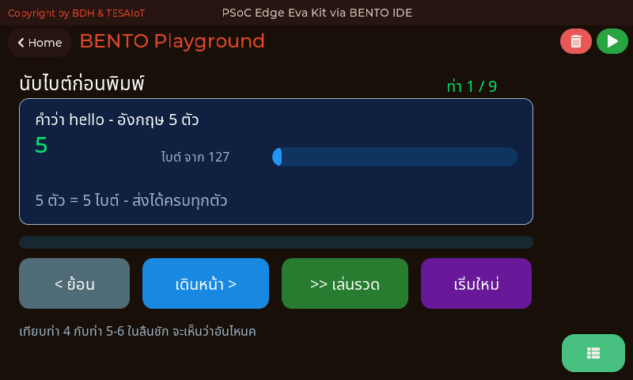
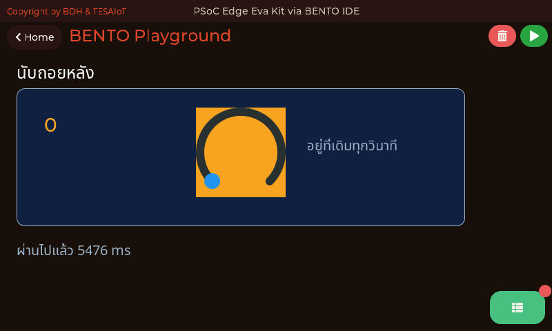
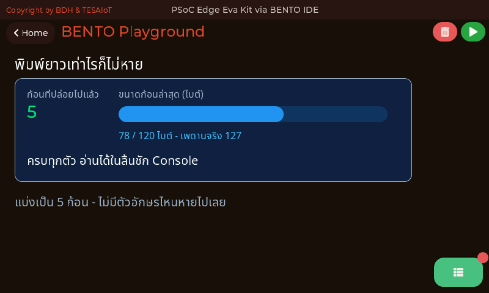

<style>
section { font-size: 24px; padding: 40px 52px; justify-content: flex-start; }
section h1 { font-size: 1.45em; line-height: 1.12; margin: 0 0 .22em; }
section h2 { font-size: 1.12em; margin: .15em 0; }
section h3 { font-size: 1.0em; margin: .12em 0; }
section p, section li { margin: .16em 0; line-height: 1.32; }
section img { max-width: 100%; height: auto; }
section svg { max-height: 330px; width: 100%; }
section table { font-size: .78em; }
section pre { font-size: .70em; line-height: 1.32; background:#0d1117; color:#e6edf3; border:1px solid #30363d; border-radius:8px; padding:12px 16px; box-shadow:0 2px 8px rgba(0,0,0,.25); }
section pre code { white-space: pre-wrap; background:transparent; color:inherit; } section pre .hljs-comment{color:#8b949e;font-style:italic} section pre .hljs-keyword,section pre .hljs-built_in,section pre .hljs-literal{color:#ff7b72} section pre .hljs-string{color:#a5d6ff} section pre .hljs-number{color:#79c0ff} section pre .hljs-title,section pre .hljs-title.function_,section pre .hljs-section{color:#d2a8ff} section pre .hljs-meta{color:#ffa657} section pre .hljs-attr,section pre .hljs-attribute,section pre .hljs-name{color:#7ee787}
section blockquote { margin: .25em 0; font-size: .92em; }
/* two images on a line (parity / 2x2 grids) stay side-by-side and small */
section p > img + img { margin-left: 10px; }
/* scroll-within-slide: dense slides scroll instead of clipping */
section { overflow-y: auto; overflow-x: hidden; }
section::-webkit-scrollbar { width: 11px; }
section::-webkit-scrollbar-thumb { background:#4a90d9; border-radius:6px; }
section::-webkit-scrollbar-track { background:rgba(0,0,0,.06); }
/* image drop-shadow + cover-slide readability (auto) */
section img{filter:drop-shadow(0 3px 12px rgba(0,0,0,.5))}
/* พื้นสำรองของสไลด์ปก: ถ้า img/cover_sNN.svg โหลดไม่ขึ้น ธีมจะคืนพื้นขาว
   แล้วตัวอักษรสีขาวของปกจะหายไปทั้งแผ่น — ปักสีเข้มไว้ให้ภาพเป็นแค่ของประดับ */
section.cover{background-color:#0b1426}
section.cover *{color:#fff !important}
section.cover h1,section.cover h2,section.cover h3,section.cover p,section.cover li,section.cover strong,section.cover em,section.cover blockquote,section.cover div{text-shadow:0 2px 9px rgba(0,0,0,.92),0 0 3px rgba(0,0,0,.8)}
section.cover div[style*="background:#"],section.cover div[style*="background: #"]{background:rgba(10,14,20,.66) !important;border-color:rgba(120,200,255,.45) !important;max-width:62%}
section.cover blockquote{border-left:4px solid rgba(120,200,255,.6) !important;background:rgba(13,17,23,.55) !important;border-radius:6px;padding:.3em .6em}
section.cover h1,section.cover h2,section.cover h3,section.cover p,section.cover blockquote{max-width:60%}
section.cover div:not(:has(img)){max-width:62%}
section.cover img{filter:none}
</style>


<!-- _class: cover -->

# บทเรียน 1.2 — ข้อความแรกขึ้นจอ: โมดูล lcd กับ ui

## AIoT รอบตัวเรา · ทัวร์บอร์ดครบทุกเมนู แล้วส่งข้อความแรกขึ้นจอ

**โมดูล 1 — แอปพลิเคชันบนจอที่มีอยู่แล้ว**

> ต่อจากบทเรียน 1.1 — ทัวร์บอร์ด: เล่นของจริงก่อน

---

## เรื่องที่เราให้ 70% ผู้เรียนเขียน 30%

<svg viewBox="0 0 900 92" xmlns="http://www.w3.org/2000/svg">
  <rect x="20" y="20" width="600" height="52" rx="8" fill="#e3f2fd" stroke="#1565c0" stroke-width="2"/>
  <text x="320" y="52" text-anchor="middle" font-size="23" font-weight="700" fill="#1565c0">70% — เฟิร์มแวร์ทำให้แล้ว</text>
  <rect x="628" y="20" width="252" height="52" rx="8" fill="#fff3e0" stroke="#ef6c00" stroke-width="2"/>
  <text x="754" y="52" text-anchor="middle" font-size="23" font-weight="700" fill="#ef6c00">30% — งานของเรา</text>
</svg>

**สิ่งที่เฟิร์มแวร์ทำให้แล้ว (70%)**
อ่านเซนเซอร์ตลอดเวลา, วาดหน้าจอทุกเมนู, จัดการ IPC ระหว่างสองคอร์, ระบบไฟล์บนบอร์ด, รัน MicroPython, จัดการวิทยุ WiFi

**สิ่งที่เป็นงานของเรา (30%)**
ตัดสินใจว่า *จะเอาข้อมูลอะไร* มาแสดง *ยังไง* และ *ส่งไปไหนต่อ*

วันนี้ 30% ของเราเล็กมาก คือแค่ "พิมพ์อะไรลงจอ" แต่กลไกเบื้องหลังเหมือนกันทุกบทเรียน

> เราไม่ได้เรียนเขียนไดรเวอร์ เราเรียน **ออกแบบระบบ AIoT** โดยยืนบนไดรเวอร์ที่มีอยู่แล้ว

---

## สามโมดูลที่จะลงมือจริงก่อน — แล้วครึ่งหลังจะเปิดที่เหลือทั้งกล่อง

<svg viewBox="0 0 940 200" xmlns="http://www.w3.org/2000/svg">
  <rect x="20" y="20" width="285" height="160" rx="10" fill="#e8f5e9" stroke="#2e7d32" stroke-width="2.5"/>
  <text x="162" y="54" text-anchor="middle" font-size="24" font-weight="700" fill="#2e7d32">lcd</text>
  <text x="162" y="86" text-anchor="middle" font-size="19" fill="#1b5e20">ลิ้นชัก Console</text>
  <text x="162" y="112" text-anchor="middle" font-size="18" fill="#1b5e20">clear() · print() · console()</text>
  <text x="162" y="146" text-anchor="middle" font-size="18" fill="#4a7c4e">ประวัติที่ไล่ลงมาเรื่อย ๆ</text>
  <text x="162" y="168" text-anchor="middle" font-size="18" fill="#4a7c4e">ตอบว่า "ที่ผ่านมาเกิดอะไร"</text>
  <rect x="325" y="20" width="285" height="160" rx="10" fill="#e3f2fd" stroke="#1565c0" stroke-width="2.5"/>
  <text x="467" y="54" text-anchor="middle" font-size="24" font-weight="700" fill="#1565c0">ui</text>
  <text x="467" y="86" text-anchor="middle" font-size="19" fill="#0d47a1">ป้ายบนหน้า Playground</text>
  <text x="467" y="112" text-anchor="middle" font-size="18" fill="#0d47a1">Label · Seg7 · Bar · Chart</text>
  <text x="467" y="146" text-anchor="middle" font-size="18" fill="#5472a3">ค่าที่เขียนทับที่เดิมได้</text>
  <text x="467" y="168" text-anchor="middle" font-size="18" fill="#5472a3">ตอบว่า "ตอนนี้เป็นยังไง"</text>
  <rect x="630" y="20" width="285" height="160" rx="10" fill="#fff3e0" stroke="#ef6c00" stroke-width="2.5"/>
  <text x="772" y="54" text-anchor="middle" font-size="24" font-weight="700" fill="#ef6c00">time</text>
  <text x="772" y="86" text-anchor="middle" font-size="19" fill="#e65100">จังหวะและนาฬิกา</text>
  <text x="772" y="112" text-anchor="middle" font-size="18" fill="#e65100">sleep_ms · ticks_ms · ticks_diff</text>
  <text x="772" y="146" text-anchor="middle" font-size="18" fill="#a1683a">คุมว่าคนดูจะอ่านทันไหม</text>
  <text x="772" y="168" text-anchor="middle" font-size="18" fill="#a1683a">และวัดว่าเราช้าไปเท่าไร</text>
</svg>

สามตัวนี้คือของที่จะ**พิมพ์เองครบทุกบรรทัด**ในครึ่งแรก ส่วนครึ่งหลังของชุดบทเรียนจะเปิดอีกห้าโมดูล — `gpio` `sensors` `dsp` `mic` `machine` — และ widget อีกสิบกว่าชนิด ให้เห็นว่ากล่องนี้มีอะไรอยู่จริงบ้าง ก่อนจะไปลงลึกทีละตัวในบทเรียนต่อ ๆ ไป

> `print()` ขึ้นที่คอนโซลฝั่งคอม · `lcd.print()` ลงลิ้นชักบนบอร์ด · `ui.Label` ขึ้นบนหน้าจอตรง ๆ — สามที่ คนละที่กัน

---

## สามโมดูลที่จะลงมือจริงก่อน (ต่อ) — กฎข้อเดียวที่ต้องจำวันนี้

```python
import lcd
import time
import ui
...
ui.screen()                    # ล้าง widget เดิมทิ้ง เริ่มจากจอเปล่าที่เรารู้แน่
time.sleep_ms(200)
...
say = ui.Label("กำลังพิมพ์ลงลิ้นชัก Console...", x=24, y=56,
               color=COL_ACCENT, value=24)
...
ui.poll()                      # เคาะหนึ่งครั้ง ป้ายถึงจะโผล่ทันที
...
lcd.clear()
lcd.print("สวัสดี บอร์ด PSoC Edge")
```

**กฎข้อเดียวที่ต้องจำวันนี้:** สร้างหรือแก้ `ui.*` แล้วต้องเคาะ `ui.poll()` หนึ่งครั้ง ไม่งั้นจอจะนิ่งไปราวสองวินาทีจนกลไกกันเหนียวปลดล็อกเอง หลายทีมสรุปว่า "โค้ดพัง" ทั้งที่แค่ยังไม่ได้เคาะ (กติกาที่เหลือของ `ui` รอบทเรียน 2.4–2.6) · บรรทัดพวกนี้ตัดมาจาก [`01_first_line.py`](https://github.com/tesaiot/tesa-qualification-program/blob/main/courses/aiot-micropython/m01-ui-application/l02-first-lines-on-screen/examples/01_first_line.py) ตรง ๆ — `COL_ACCENT` คือสีเน้น `0x4A9EFF` ที่หัวไฟล์ประกาศไว้

`value=` บน `ui.Label` **คือขนาดตัวอักษร** ไม่ใช่ตัวเลขที่จะเอาไปแสดง — จุดนี้ทำคนสะดุดทุกรุ่น

---

## วิธีรันบนบอร์ด

<style scoped>
section img { max-height: 180px; }
section li, section p { margin: .04em 0; line-height: 1.20; font-size: .92em; }
section blockquote { font-size: .80em; }
</style>



<div style="font-size:.55em;color:#78909c;margin-top:-.3em">ภาพถ่ายจอจริงของบอร์ด Eva Kit หน้า BENTO Playground ที่เพิ่งเปิด — พื้นที่แสดงผลกลางจอยังดำสนิททั้งผืน ไม่มีข้อความสักบรรทัด · มุมขวาล่างคือปุ่มสี่เหลี่ยมมนสีเขียวรูปไอคอนรายการ ไม่มีตัวหนังสือกำกับ และมีจุดแดงเล็ก ๆ เกาะอยู่ที่มุมขวาบนของปุ่ม — นั่นคือขั้นที่ 6 ที่ต้องแตะ · มุมขวาบนของหน้ามีปุ่มกลมสองปุ่ม แดงรูปถังขยะ กับเขียวรูปสามเหลี่ยมเล่น · แถบบนสุดยังไม่มีไอคอน WiFi และไม่มีนาฬิกา เพราะชุดบทเรียนนี้ยังไม่ได้ต่อเน็ต</div>

1. **บนจอบอร์ด** แตะการ์ด **BENTO Playground** เปิดค้างไว้ (เฟิร์มแวร์เด้งมาหน้านี้ให้เองตอนสคริปต์เรียก `lcd` ครั้งแรก แต่เปิดรอไว้จะเห็นผลตั้งแต่วินาทีแรก)
2. **บนคอม** เปิด BENTO IDE เชื่อมต่อบอร์ด (ดูไฟสถานะว่าเจอบอร์ดแล้ว)
3. เปิดไฟล์ตัวอย่างของชุดบทเรียนนี้จาก โฟลเดอร์ `examples/` ของบทเรียน 1.1–1.3 แล้วกด **Program to Device**
4. **หันไปมองจอบอร์ด** ไม่ใช่จอคอม
5. **แตะปุ่มไอคอนสีเขียวที่มุมขวาล่างของหน้า Playground** เพื่อเปิดลิ้นชัก Console — หน้านี้เปิดมาที่โหมด UI เป็นค่าเริ่มต้น ข้อความจาก `lcd` จะรออยู่จนกว่าจะกดสลับ สังเกตจุดแดงเล็ก ๆ ที่มุมปุ่มเมื่อมีข้อความรอ
6. อยากเริ่มใหม่ ปุ่ม RESTART บนหน้า Playground รันสคริปต์ซ้ำได้เลย

**พื้นที่วาดของเราคือ 792 x 398 พิกเซล** และมุมขวาล่างราว 100x58 เป็นของปุ่ม Console ที่เฟิร์มแวร์จองไว้ — วาง widget ทับตรงนั้นแล้วจะกดเปิดลิ้นชักไม่ได้

> ทีมละหนึ่งบอร์ด — สลับกันเป็นคนพิมพ์ทุกช่วง อย่าให้ใครนั่งดูอย่างเดียวทั้งบทเรียน

---

## ไฟล์ที่ 1 · [`01_first_line.py`](https://github.com/tesaiot/tesa-qualification-program/blob/main/courses/aiot-micropython/m01-ui-application/l02-first-lines-on-screen/examples/01_first_line.py) — หนึ่งบรรทัด สามปลายทาง

<style scoped>
section pre { font-size: .58em; }
section svg { max-height: 148px; }
section p { margin: .08em 0; }
</style>

```python
say = ui.Label("กำลังพิมพ์ลงลิ้นชัก Console...", x=24, y=56,
               color=COL_ACCENT, value=24)
ui.poll()

lcd.clear()
lcd.print("สวัสดี บอร์ด PSoC Edge")
lcd.print("หนึ่งบวกหนึ่งได้", 1 + 1)

print("บรรทัดนี้อยู่บนคอม ไม่ได้อยู่บนจอบอร์ด")
```

<svg viewBox="0 0 940 168" xmlns="http://www.w3.org/2000/svg">
  <rect x="20" y="26" width="290" height="112" rx="10" fill="#e3f2fd" stroke="#1565c0" stroke-width="2.5"/>
  <text x="165" y="56" text-anchor="middle" font-size="20" font-weight="700" fill="#1565c0">1 · ป้ายบนหน้า Playground</text>
  <text x="165" y="86" text-anchor="middle" font-size="18" fill="#0d47a1">ui.Label + ui.poll()</text>
  <text x="165" y="114" text-anchor="middle" font-size="18" fill="#5472a3">เห็นทันที ไม่ต้องกดอะไร</text>
  <rect x="325" y="26" width="290" height="112" rx="10" fill="#e8f5e9" stroke="#2e7d32" stroke-width="2.5"/>
  <text x="470" y="56" text-anchor="middle" font-size="20" font-weight="700" fill="#2e7d32">2 · ลิ้นชัก Console</text>
  <text x="470" y="86" text-anchor="middle" font-size="18" fill="#1b5e20">lcd.print()</text>
  <text x="470" y="114" text-anchor="middle" font-size="18" fill="#4a7c4e">รออยู่จนกว่าจะแตะปุ่มมุมขวาล่าง</text>
  <rect x="630" y="26" width="290" height="112" rx="10" fill="#eceff1" stroke="#607d8b" stroke-width="2.5"/>
  <text x="775" y="56" text-anchor="middle" font-size="20" font-weight="700" fill="#455a64">3 · คอนโซลฝั่งคอม</text>
  <text x="775" y="86" text-anchor="middle" font-size="18" fill="#37474f">print()</text>
  <text x="775" y="114" text-anchor="middle" font-size="18" fill="#607d8b">ไม่ได้อยู่บนบอร์ดเลย</text>
  <text x="470" y="162" text-anchor="middle" font-size="19" font-weight="700" fill="#37474f">โปรแกรมเดียว พูดสามช่อง ที่อยู่คนละที่กัน — ตามหาให้เจอครบทั้งสาม</text>
</svg>

`lcd.print()` รับหลายค่าคั่นด้วยจุลภาคเหมือน `print()` ทุกประการ และเติมช่องว่างให้เอง ตัวเลขส่งได้เลยไม่ต้องแปลงก่อน

ท้ายไฟล์มี `say.text(...)` — **แก้ข้อความบนป้ายเดิม ไม่ใช่วางป้ายใหม่ทับ** ป้ายหนึ่งใบที่เปลี่ยนค่าได้ อ่านง่ายกว่าป้ายสิบใบที่กองทับกัน

**ตาคุณ (ท้ายไฟล์):** เพิ่มชื่อทีมเข้าไปในทั้งสามปลายทาง แล้วตอบว่าต้องเปิดดูที่ไหนบ้างถึงจะเห็นครบทั้งสามที่

> จอเงียบมักแปลว่าเรายืนผิดหน้า ไม่ใช่โค้ดพัง — ไฟล์นี้มีไว้พิสูจน์ประโยคนั้นด้วยตาตัวเอง

---

## ไฟล์ที่ 2 · [`02_markup_tags.py`](https://github.com/tesaiot/tesa-qualification-program/blob/main/courses/aiot-micropython/m01-ui-application/l02-first-lines-on-screen/examples/02_markup_tags.py) — สีคือระดับ ไม่ใช่ของตกแต่ง

<svg viewBox="0 0 940 190" xmlns="http://www.w3.org/2000/svg">
  <rect x="20" y="14" width="440" height="162" rx="8" fill="#0d1117" stroke="#30363d" stroke-width="2"/>
  <text x="40" y="42" font-size="18" font-family="monospace" fill="#8b949e">&lt;span class=muted&gt;</text>
  <text x="290" y="42" font-size="18" fill="#8b949e">รุ่นเฟิร์มแวร์ 1.7.0</text>
  <text x="40" y="70" font-size="18" font-family="monospace" fill="#40c4ff">&lt;span class=info&gt;</text>
  <text x="290" y="70" font-size="18" fill="#40c4ff">เริ่มรอบตรวจใหม่</text>
  <text x="40" y="98" font-size="18" font-family="monospace" fill="#00e676">&lt;span class=ok&gt;</text>
  <text x="290" y="98" font-size="18" fill="#00e676">ต่อเน็ตสำเร็จ</text>
  <text x="40" y="126" font-size="18" font-family="monospace" fill="#ffa726">&lt;span class=warn&gt;</text>
  <text x="290" y="126" font-size="18" fill="#ffa726">แบตเตอรี่เหลือ 12%</text>
  <text x="40" y="154" font-size="18" font-family="monospace" fill="#ff5252">&lt;span class=error&gt;</text>
  <text x="290" y="154" font-size="18" fill="#ff5252">อ่านเซนเซอร์ไม่ได้</text>
  <text x="500" y="42" font-size="19" font-weight="700" fill="#37474f">เรียงจากเรื่องที่ไม่ต้องสนใจ</text>
  <text x="500" y="66" font-size="19" font-weight="700" fill="#37474f">ไปหาเรื่องที่ต้องลุกจากเก้าอี้</text>
  <text x="500" y="102" font-size="18" fill="#546e7a">ไฟล์นี้พิมพ์เนื้อความชุดเดียวกันสามรอบ</text>
  <text x="500" y="126" font-size="18" fill="#546e7a">ชุดที่ 1 ติดระดับครบ · ชุดที่ 2 ไม่ติดเลย</text>
  <text x="500" y="150" font-size="18" fill="#546e7a">ชุดที่ 3 ข่าวดีที่ทาสีแดง</text>
  <text x="500" y="176" font-size="18" fill="#c62828">เปิดลิ้นชักแล้วเทียบสามชุดจากบนลงล่าง</text>
</svg>

```python
for cls, text in REPORT:
    # แท็กเปิดกับแท็กปิดต้องอยู่ในการเรียกครั้งเดียวกันเสมอ
    lcd.print("<span class=" + cls + ">" + text + "</span>")
```

ห้าคลาสนี้คือ **ห้าระดับความสำคัญ** ไม่ใช่ห้าสีให้เลือกตามชอบ ชุดที่ 3 ในไฟล์จงใจทาข่าวดีเป็นสีแดง เพื่อให้เห็นว่าสีผิดทำร้ายคนอ่านก่อนที่เขาจะทันได้อ่านตัวหนังสือ

ฝั่งจอแกะแท็กทีละบรรทัด จบบรรทัดแล้วสถานะเริ่มใหม่หมด ลืมปิด `</h2>` **ผลกระทบจำกัดอยู่ในบรรทัดนั้นบรรทัดเดียว**

**กับดัก:** พิมพ์ชื่อคลาสผิด เช่น `class=okay` ไม่มี error ให้จับสักตัว บรรทัดนั้นแค่ออกมาเป็นสีปกติ — เจอบรรทัดที่ไม่มีสี ให้สงสัยชื่อคลาสก่อน

**ตาคุณ:** ใน `REPORT` มีบรรทัดหนึ่งติดระดับไว้ผิด หาให้เจอแล้วแก้ จากนั้นเพิ่มข่าวของทีมเองอีกหนึ่งบรรทัดพร้อมเลือกระดับให้มัน

> เกณฑ์ตัดสินง่าย ๆ: บรรทัดนี้ทำให้คนที่เดินผ่านต้องลุกจากเก้าอี้ไหม ถ้าไม่ ก็ไม่ใช่ `error`

---

## ไฟล์ที่ 3 · [`03_byte_limit.py`](https://github.com/tesaiot/tesa-qualification-program/blob/main/courses/aiot-micropython/m01-ui-application/l02-first-lines-on-screen/examples/03_byte_limit.py) — เพดาน 127 ไบต์

<div style="display:flex;gap:14px;align-items:flex-start">
<div style="flex:0 0 300px">



<div style="font-size:.56em;color:#78909c">ภาพหน้าจอจริงจากบอร์ด Eva Kit ขณะรัน <a href="https://github.com/tesaiot/tesa-qualification-program/blob/main/courses/aiot-micropython/m01-ui-application/l02-first-lines-on-screen/examples/03_byte_limit.py"><code>03_byte_limit.py</code></a> — บันทึกโดยผู้สอน</div>

</div>
<div>

```python
nbytes = len(text.encode())      # นับไบต์ ไม่ใช่นับตัวอักษร
seg.text(str(nbytes))

if nbytes > LIMIT:
    seg.color(COL_BAD)
else:
    seg.color(COL_OK)
```

`len()` ของสตริงนับ **ตัวอักษร** ส่วน `len()` ของ bytes นับ **ไบต์** สองค่านี้ไม่เท่ากันเมื่อเป็นภาษาไทย เพราะไทยหนึ่งตัวกิน 3 ไบต์

เพดานที่ต้องจำมีสามตัว: `lcd.print()` ส่งได้ **127 ไบต์** ต่อครั้ง · `ui.Label(...)` ตอนสร้างพาได้ **126 ไบต์** · `.text()` พาได้ **126 ไบต์** เท่ากัน

ไทยจึงได้ราว **42 ตัวอักษร** ต่อครั้ง เกินแล้วถูกตัดทิ้ง **เงียบ ๆ ไม่มี error** และ `\n` ท้ายบรรทัดหายไปด้วย บรรทัดถัดไปจึงมาต่อท้ายกันเละ

</div>
</div>

`ui.Seg7` รับได้ทั้ง `.text()` และ `.value()` — แต่ `.value(198)` ขึ้น 198 เท่านั้น ถ้าอยากได้ `198.0` หรือ `0198` ต้องส่งเป็นข้อความ

**ตาคุณ:** ใส่ชื่อสมาชิกภาษาไทยลงใน `ITEMS` อีกหนึ่งแถว **ทำนายก่อนรัน** ว่าจะได้กี่ไบต์และจะเป็นเขียวหรือแดง แล้วรันเทียบกับที่ทำนาย

> การตัดที่ต้องตัด ให้ตัดที่ **ตัวอักษร** ไม่ใช่ที่ไบต์ — ตัดกลางไบต์ของตัวอักษรหนึ่งตัวแล้วจอจะแสดงเป็นขยะ

---

## ไฟล์ที่ 4 · [`04_console_drawer.py`](https://github.com/tesaiot/tesa-qualification-program/blob/main/courses/aiot-micropython/m01-ui-application/l02-first-lines-on-screen/examples/04_console_drawer.py) — บทสรุปที่ไม่ต้องเปิดลิ้นชัก

<style scoped>
section pre { font-size: .48em; line-height: 1.22; }
section svg { max-height: 118px; }
section p { margin: .04em 0; font-size: .86em; line-height: 1.26; }
section blockquote { font-size: .78em; margin: .06em 0; }
</style>

<div style="display:flex;gap:16px;align-items:flex-start">
<div style="flex:1 1 52%">

```python
CHECKS = [
    ("จอแสดงผล", True),
    ("ปุ่มบนบอร์ด", True),
    ("หลอด LED", True),
    ("การ์ด SD", False),
]
...
for name, ok in CHECKS:
    if ok:
        passed = passed + 1
        ...
        lcd.print(name, "<span class=ok>ผ่าน</span>")
    else:
        ...
        lcd.print(name, "<span class=error>ไม่ผ่าน</span>")
    seg.text(str(passed) + "-" + str(TOTAL))
    bar.value(passed)
    ...
    ui.poll()
```

</div>
<div style="flex:0 0 46%">

คนหน้างานไม่ได้อยากอ่านรายงานสิบบรรทัด เขาอยากรู้บรรทัดเดียวว่า **ผ่านกี่ข้อจากกี่ข้อ** แล้วค่อยเจาะเฉพาะข้อที่ตก · `lcd.console()` ใช้กับสิ่งที่ "จัดหน้า" เช่นหัวเรื่องกับเส้นคั่น ส่วน `lcd.print()` ใช้กับ "ข้อมูล" — ทั้งคู่ลงลิ้นชักเดียวกัน

**ป้ายสรุปสองใบสร้างไว้ตั้งแต่ต้น แล้วค่อยเขียนทับตอนรู้ผล** ถ้าไปสร้างข้างใน `if/else` ทีหลัง จะได้ป้ายคนละใบวางที่พิกัดเดียวกันสองใบ ซึ่งบนจอจริงคือตัวหนังสือซ้อนกันอ่านไม่ออก แม้ตอนรันจะเข้าแค่ทางเดียวก็ตาม

</div>
</div>

<svg viewBox="0 0 940 158" xmlns="http://www.w3.org/2000/svg">
  <rect x="20" y="18" width="470" height="122" rx="10" fill="#142240" stroke="#3d5a80" stroke-width="2"/>
  <text x="42" y="44" font-size="17" fill="#a0b4cc">ผ่านแล้ว</text>
  <rect x="42" y="54" width="120" height="44" rx="5" fill="#0d1a2e" stroke="#ffa726" stroke-width="2"/>
  <text x="102" y="86" text-anchor="middle" font-size="26" font-weight="700" fill="#ffa726">3-4</text>
  <rect x="182" y="66" width="280" height="22" rx="6" fill="#22303f"/>
  <rect x="182" y="66" width="210" height="22" rx="6" fill="#ffa726"/>
  <text x="42" y="126" font-size="17" fill="#a0b4cc">การ์ดสรุปที่เห็นได้โดยไม่ต้องกดอะไร</text>
  <rect x="520" y="18" width="400" height="122" rx="10" fill="#0d1117" stroke="#30363d" stroke-width="2"/>
  <text x="540" y="44" font-size="16" fill="#8b949e">ลิ้นชัก Console</text>
  <text x="540" y="68" font-size="16" fill="#7ee787">จอแสดงผล ผ่าน</text>
  <text x="540" y="90" font-size="16" fill="#7ee787">ปุ่มบนบอร์ด ผ่าน</text>
  <text x="540" y="112" font-size="16" fill="#7ee787">หลอด LED ผ่าน</text>
  <text x="540" y="134" font-size="16" fill="#ff7b72">การ์ด SD ไม่ผ่าน</text>
  <text x="470" y="154" text-anchor="middle" font-size="18" font-weight="700" fill="#37474f">การ์ดกับลิ้นชักต้องเล่าเรื่องเดียวกันเสมอ</text>
</svg>

**ตาคุณ:** แก้ `CHECKS` ให้ผ่านครบทุกข้อ ดูว่าการ์ดข้างบนเปลี่ยนไปยังไง แล้วเพิ่มรายการที่ห้า สังเกตว่าต้องแก้อะไรบ้างนอกจาก `CHECKS` (ใบ้: `y` ของแถวสุดท้ายยังอยู่ในจอ 398 พิกเซลหรือเปล่า)

> โปรแกรมที่พูดเฉพาะตอนสำเร็จ จะเงียบสนิทตอนล้มเหลว ซึ่งคือจังหวะที่คนใช้อยากรู้ที่สุด

---

## ไฟล์ที่ 5 · [`05_clear_and_refresh.py`](https://github.com/tesaiot/tesa-qualification-program/blob/main/courses/aiot-micropython/m01-ui-application/l02-first-lines-on-screen/examples/05_clear_and_refresh.py) — เขียนทับที่เดิม

<div style="display:flex;gap:14px;align-items:flex-start">
<div style="flex:0 0 300px">



<div style="font-size:.56em;color:#78909c">ภาพหน้าจอจริงจากบอร์ด Eva Kit ขณะรัน <a href="https://github.com/tesaiot/tesa-qualification-program/blob/main/courses/aiot-micropython/m01-ui-application/l02-first-lines-on-screen/examples/05_clear_and_refresh.py"><code>05_clear_and_refresh.py</code></a> — บันทึกโดยผู้สอน</div>

</div>
<div>

```python
for left in range(TOTAL, -1, -1):
    seg.text(str(left))          # ท่า widget: ทับค่าเดิม
    arc.value(left)

    lcd.clear()                  # ท่าลิ้นชัก: ล้างแล้ววาดใหม่ทั้งหน้า
    lcd.console("<h2>นับถอยหลัง</h2>")
    lcd.print("เหลืออีก", left, "วินาที")

    ui.poll()
    time.sleep_ms(TICK_MS)
```

ค่าที่เปลี่ยนตลอดเวลา ถ้าไล่พิมพ์ลงมาเรื่อย ๆ จอจะเต็มไปด้วยประวัติ แล้วคนดูต้องไล่หาเองว่าบรรทัดไหนคือค่าล่าสุด

ท่า widget ถูกกว่ามาก เพราะส่งข้ามคอร์ไปแค่ค่าใหม่ ไม่ได้ส่งทั้งหน้า

</div>
</div>

**สร้าง widget ไว้นอกลูปเสมอ** ถ้าย้ายสามบรรทัดนั้นเข้าไปในลูป จะได้ widget ใหม่ทุกวินาที

**ห้ามสร้าง `ui.Label` ด้วยข้อความว่าง** ระบบวาดจะเติมคำว่า `Label` ให้เอง แล้วคำนั้นค้างบนจอจนกว่าจะมีการเขียนทับครั้งแรก

**ตาคุณ:** ตั้ง `TICK_MS = 150` แล้วขยาย `TOTAL` เป็น 20 รันดูแล้วตอบว่าท่าไหนอ่านออก ท่าไหนกลายเป็นจอกระพริบ

> โปรแกรมที่ล้างจอเป็นสิ่งสุดท้ายก่อนจบ จะทิ้งจอว่างให้คนงงว่าเกิดอะไรขึ้น — ไฟล์นี้จึงปล่อยค่าสุดท้ายค้างไว้

---

## ไฟล์ที่ 6 · [`06_safe_print.py`](https://github.com/tesaiot/tesa-qualification-program/blob/main/courses/aiot-micropython/m01-ui-application/l02-first-lines-on-screen/examples/06_safe_print.py) — ย้ายกฎเข้าไปอยู่ในฟังก์ชัน

<style scoped>
section pre { font-size: .58em; }
section p { margin: .06em 0; font-size: .94em; }
section blockquote { font-size: .82em; }
</style>

<div style="display:flex;gap:14px;align-items:flex-start">
<div style="flex:0 0 300px">



<div style="font-size:.56em;color:#78909c">ภาพหน้าจอจริงจากบอร์ด Eva Kit ขณะรัน <a href="https://github.com/tesaiot/tesa-qualification-program/blob/main/courses/aiot-micropython/m01-ui-application/l02-first-lines-on-screen/examples/06_safe_print.py"><code>06_safe_print.py</code></a> — บันทึกโดยผู้สอน</div>

</div>
<div>

```python
for ch in text:
    size = len(ch.encode())      # ไทย 3 · อังกฤษ 1

    # เช็ก "ก่อนใส่" ไม่ใช่ "หลังใส่"
    if used + size > SAFE_BYTES:
        flush(chunk)
        chunk = ""
        used = 0

    chunk = chunk + ch
    used = used + size

if chunk != "":                  # ก้อนสุดท้ายต้องส่งด้วย
    flush(chunk)
```

รู้เพดาน 127 ไบต์แล้วก็จริง แต่ถ้าต้องนั่งนับไบต์ด้วยมือทุกบรรทัด สักวันจะลืมสักบรรทัด แล้วรายงานจะขาดครึ่งโดยไม่มี error ให้จับ

**ความรู้ที่ต้องใช้วินัยของคนทุกครั้ง คือความรู้ที่จะพังในวันที่คนเหนื่อย** ย้ายมันเข้าไปในฟังก์ชันเดียว แล้วโค้ดจำแทนให้

</div>
</div>

ไฟล์นี้เผื่อไว้ที่ `SAFE_BYTES = 120` ต่ำกว่าเพดานจริง 127 อยู่ 7 ไบต์ เป็นระยะปลอดภัย

**ข้อจำกัดที่ต้องรู้:** ฟังก์ชันนี้ตัดที่ตัวอักษร ไม่ใช่ตัดที่คำ และมันไม่รู้จักแท็ก — ห้ามส่งข้อความที่มีแท็กเข้ามา เพราะแท็กอาจถูกตัดครึ่งกลางคัน

**ตาคุณ:** ลด `SAFE_BYTES` เหลือ 40 แล้วรันใหม่ จำนวนก้อนจะเพิ่มขึ้นแต่ตัวข้อความยังครบ ตอบว่าทำไมการแบ่งถี่ขึ้นถึงไม่ทำให้ตัวอักษรหายสักตัว

> บรรทัด `if chunk != "":` ท้ายฟังก์ชันคือบรรทัดที่คนลืมบ่อยที่สุด ลืมเมื่อไรท้ายประโยคหายทันที

---

## ไฟล์ที่ 7 · [`07_ticks_and_beat.py`](https://github.com/tesaiot/tesa-qualification-program/blob/main/courses/aiot-micropython/m01-ui-application/l02-first-lines-on-screen/examples/07_ticks_and_beat.py) — ลูปที่สั่ง sleep เท่าเดิม ไม่ได้เดินตรงเวลา

<style scoped>
section pre { font-size: .56em; }
section svg { max-height: 128px; }
section p { margin: .06em 0; font-size: .92em; }
section blockquote { font-size: .82em; }
</style>

<svg viewBox="0 0 940 210" xmlns="http://www.w3.org/2000/svg">
  <rect x="20" y="20" width="900" height="140" rx="8" fill="#142240" stroke="#3d5a80" stroke-width="2"/>
  <line x1="60" y1="120" x2="900" y2="120" stroke="#ffa726" stroke-width="3"/>
  <text x="72" y="112" font-size="17" fill="#ffa726">เส้นส้ม = คาบที่ขอไว้ 200 ms</text>
  <polyline points="60,86 100,84 140,88 180,85 220,87 260,84 300,88 340,86 380,85 420,87 460,84"
            fill="none" stroke="#00e676" stroke-width="3"/>
  <polyline points="460,84 480,118 520,120 560,119 600,120 640,121 680,119 720,120 760,120 800,121 840,119 890,120"
            fill="none" stroke="#00e676" stroke-width="3"/>
  <line x1="466" y1="34" x2="466" y2="150" stroke="#ff5252" stroke-width="2" stroke-dasharray="6 4"/>
  <text x="240" y="60" text-anchor="middle" font-size="18" font-weight="700" fill="#00e676">ท่าที่ 1 — หลับเท่าเดิมทุกรอบ</text>
  <text x="240" y="150" text-anchor="middle" font-size="17" fill="#a0b4cc">เส้นเขียวลอยเหนือเส้นส้ม ช้าสะสมโตขึ้นเรื่อย ๆ</text>
  <text x="690" y="60" text-anchor="middle" font-size="18" font-weight="700" fill="#00e676">ท่าที่ 2 — หักเวลางานออกก่อนหลับ</text>
  <text x="690" y="150" text-anchor="middle" font-size="17" fill="#a0b4cc">เส้นเขียวทรุดลงมาทาบเส้นส้ม ช้าสะสมหยุดโต</text>
  <text x="470" y="188" text-anchor="middle" font-size="19" font-weight="700" fill="#37474f">งานต่อรอบเท่าเดิมทุกอย่าง เปลี่ยนแค่วิธีคิดเวลาหลับ</text>
</svg>

```python
work = time.ticks_diff(time.ticks_ms(), t_work)   # งานรอบนี้กินไปกี่ ms
left = TARGET_MS - work                           # เหลือให้หลับเท่าไร
if left > 0:
    time.sleep_ms(left)
```

`sleep_ms()` แปลว่า "หลับ**อย่างน้อย**เท่านี้" ไม่ได้แปลว่า "รอบละเท่านี้" งานที่ทำก่อนหลับกินเวลาของมันเอง คาบจริงจึงยาวกว่าที่ขอเสมอ และส่วนเกินนั้น **สะสมทุกรอบ**

**ห้ามลบเวลาสองค่าด้วยเครื่องหมายลบธรรมดา** นาฬิกานี้นับขึ้นแล้ววนกลับ `ticks_diff()` รู้เรื่องการวน ส่วน `t2 - t1` ไม่รู้ แล้วจะได้เลขติดลบมหาศาล

`ui.Chart` รับเฉพาะจำนวนเต็ม ช่วงแกนตั้งกำหนดตอนสร้างแล้วเปลี่ยนทีหลังไม่ได้ และมันเกิดมาพร้อมเส้นที่ 0 อยู่แล้ว `add_series()` จึงคืนเลข 1 เป็นเส้นแรกที่เราเพิ่ม — **เก็บเลขที่มันคืนมาไว้ในตัวแปร อย่าเดาเอง**

**ตาคุณ:** ตั้ง `SWITCH_AT = 41` เพื่อปิดท่าที่ 2 ทิ้ง ทำนายก่อนรันว่าเลขช้าสะสมตอนจบจะออกมาราวเท่าไร แล้วรันเทียบ

> นี่คือไฟล์แรกของชุดที่ไม่ได้แค่ให้ดู แต่ให้ **ตั้งสมมติฐานแล้วรันพิสูจน์** — จดตัวเลขที่ทำนายไว้ก่อนกดรันเสมอ

---

## ไฟล์ที่ 8 · [`08_status_screen.py`](https://github.com/tesaiot/tesa-qualification-program/blob/main/courses/aiot-micropython/m01-ui-application/l02-first-lines-on-screen/examples/08_status_screen.py) — จอบอกตอนนี้ ลิ้นชักบอกที่ผ่านมา

<style scoped>
section pre { font-size: .54em; }
section svg { max-height: 100px; }
section p { margin: .05em 0; font-size: .90em; }
section blockquote { font-size: .80em; }
</style>

<svg viewBox="0 0 940 210" xmlns="http://www.w3.org/2000/svg">
  <rect x="20" y="30" width="420" height="150" rx="10" fill="#e3f2fd" stroke="#1565c0" stroke-width="2.5"/>
  <text x="230" y="62" text-anchor="middle" font-size="21" font-weight="700" fill="#1565c0">งานของจอ · ทำทุกรอบ</text>
  <text x="230" y="92" text-anchor="middle" font-size="19" fill="#0d47a1">ตอบว่า "ตอนนี้เป็นยังไง"</text>
  <text x="230" y="120" text-anchor="middle" font-size="18" fill="#0d47a1">Seg7 · Label · Bar · Chart</text>
  <text x="230" y="150" text-anchor="middle" font-size="18" fill="#5472a3">จอไม่สะสมอะไรไว้ จึงเขียนทับได้</text>
  <text x="230" y="172" text-anchor="middle" font-size="18" fill="#5472a3">ถี่เท่าไรก็ได้ ไม่มีอะไรรก</text>
  <rect x="500" y="30" width="420" height="150" rx="10" fill="#e8f5e9" stroke="#2e7d32" stroke-width="2.5"/>
  <text x="710" y="62" text-anchor="middle" font-size="21" font-weight="700" fill="#2e7d32">งานของลิ้นชัก · เฉพาะตอนเปลี่ยน</text>
  <text x="710" y="92" text-anchor="middle" font-size="19" fill="#1b5e20">ตอบว่า "ที่ผ่านมาเกิดอะไร"</text>
  <text x="710" y="120" text-anchor="middle" font-size="18" fill="#1b5e20">lcd.print เมื่อระดับเปลี่ยนเท่านั้น</text>
  <text x="710" y="150" text-anchor="middle" font-size="18" fill="#4a7c4e">ลิ้นชักสะสม จึงต้องเลือกว่าจะเล่าอะไร</text>
  <text x="710" y="172" text-anchor="middle" font-size="18" fill="#4a7c4e">ประวัติที่ไม่มีใครอ่านไหว = ไม่มีประวัติ</text>
  <text x="470" y="204" text-anchor="middle" font-size="19" font-weight="700" fill="#37474f">คำถามต่างกัน โมดูลต่างกัน จังหวะการเขียนต่างกัน</text>
</svg>

```python
    # --- งานของจอ: ทำทุกรอบ ---
    seg.text(str(value))
    seg.color(color)
    level_lbl.text(name)
    level_lbl.color(color)
    bar.value(value)
    chart.set_next(s_value, value)
    ...
    # --- งานของลิ้นชัก: ทำเฉพาะตอนมีเรื่องให้เล่า ---
    if lv != last_level:
        changes = changes + 1
        last_level = lv
        lcd.print("<span class=" + cls + ">" + str(elapsed) + " ms  " +
                  name + "  ค่า " + str(value) + "</span>")
```

**ไฟล์นี้ไม่มีคำสั่งใหม่เลยสักตัว** ทุกอย่างในนี้เคยผ่านตามาแล้วในไฟล์ 01 ถึง 07 ของใหม่คือ **"จะเอามันมาต่อกันยังไง"** ซึ่งเป็นคำถามที่ไฟล์เดี่ยว ๆ ไม่เคยตอบ

`LEVELS` เก็บชื่อ สี และคลาสของ `span` ไว้ด้วยกันในตารางเดียว จอกับลิ้นชักจึงเล่าเรื่องเดียวกันเสมอ เพราะทั้งคู่อ่านจากตารางนั้น

`last_level = -1` แปลว่า "ยังไม่เคยรู้ระดับมาก่อน" รอบแรกจึงนับเป็นการเปลี่ยนเสมอ ถ้าตั้งต้นเป็น 0 ประวัติจะไม่มีบรรทัดแรกบอกว่าเริ่มที่ระดับไหน

> ลูปในไฟล์นี้ใช้ท่าที่ 2 ของไฟล์ 07 ตรง ๆ — ของที่เรียนมาแล้วต้องกลับมาใช้ ไม่ใช่เรียนแล้วทิ้ง

---

## ทำไมไฟล์ที่ 8 เป็นไฟล์ที่สำคัญที่สุดในชุด

<svg viewBox="0 0 940 175" xmlns="http://www.w3.org/2000/svg">
  <rect x="20" y="18" width="130" height="40" rx="7" fill="#e8f5e9" stroke="#2e7d32" stroke-width="2"/>
  <text x="85" y="44" text-anchor="middle" font-size="18" font-weight="700" fill="#2e7d32">lcd</text>
  <rect x="20" y="68" width="130" height="40" rx="7" fill="#e3f2fd" stroke="#1565c0" stroke-width="2"/>
  <text x="85" y="94" text-anchor="middle" font-size="18" font-weight="700" fill="#1565c0">ui</text>
  <rect x="20" y="118" width="130" height="40" rx="7" fill="#fff3e0" stroke="#ef6c00" stroke-width="2"/>
  <text x="85" y="144" text-anchor="middle" font-size="18" font-weight="700" fill="#ef6c00">time</text>
  <line x1="152" y1="38" x2="238" y2="82" stroke="#90a4ae" stroke-width="2"/>
  <line x1="152" y1="88" x2="238" y2="88" stroke="#90a4ae" stroke-width="2"/>
  <line x1="152" y1="138" x2="238" y2="94" stroke="#90a4ae" stroke-width="2"/>
  <rect x="248" y="52" width="240" height="72" rx="9" fill="#f3e5f5" stroke="#6a1b9a" stroke-width="3"/>
  <text x="368" y="82" text-anchor="middle" font-size="19" font-weight="700" fill="#6a1b9a">จอสถานะหนึ่งใบ</text>
  <text x="368" y="108" text-anchor="middle" font-size="18" fill="#4a148c">ที่คนหน้างานใช้ได้จริง</text>
  <text x="520" y="60" font-size="18" fill="#455a64">บทเรียน 2.7–2.9 เสียบค่าจากลูกบิดเข้ามาแทน</text>
  <text x="520" y="88" font-size="18" fill="#455a64">บทเรียน 3.1–3.3 เสียบค่าจากเซนเซอร์เอียง</text>
  <text x="520" y="116" font-size="18" fill="#455a64">บทเรียน 3.7–3.9 กลายเป็นแดชบอร์ดสี่การ์ด</text>
  <text x="470" y="164" text-anchor="middle" font-size="19" font-weight="700" fill="#37474f">โครงเดิม เปลี่ยนแค่ต้นทางของตัวเลข</text>
</svg>

มีงานวิจัยที่ไปสัมภาษณ์นักพัฒนามืออาชีพ 80 คนว่า ตัวอย่างโค้ดที่หาเจอบนเน็ตทำให้หงุดหงิดตรงไหนที่สุด คำตอบอันดับหนึ่งไม่ใช่ "โค้ดผิด" และไม่ใช่ "อธิบายน้อยไป" แต่คือ **ตัวอย่างพวกนั้นไม่ช่วยให้คิดออกว่าจะเอาชิ้นส่วนมาต่อกันยังไง**

ไฟล์ 01 ถึง 07 สอนชิ้นส่วนทีละชิ้น ซึ่งจำเป็นแต่ไม่พอ ไฟล์ 08 คือไฟล์เดียวในชุดที่ตอบคำถามว่าชิ้นส่วนพวกนั้นมาอยู่ในโปรแกรมเดียวกันได้ยังไง โดยไม่มีคำสั่งใหม่เข้ามาเลย

`reading_at()` ในไฟล์นั้นเป็นค่าอ่านจำลอง **บทเรียน 2.7–2.9 เป็นต้นไปจะถอดฟังก์ชันนี้ทิ้งแล้วเสียบค่าจากเซนเซอร์จริงเข้ามาแทน** ที่ยังจำลองไว้ก่อน เพราะชุดบทเรียนนี้เรากำลังเรียนเรื่องการรายงานผล ไม่ใช่การวัด

**ตาคุณ:** ย้ายบล็อก `lcd.print()` ออกจาก `if` ให้มันยิงทุกรอบ แล้วรันใหม่ เปิดลิ้นชักดู แล้วตอบว่าประวัติแบบไหนที่คนเดินมาดูหน้างานใช้งานได้จริงกว่ากัน (ใบ้: ลองหาคำตอบจากลิ้นชักว่า "ค่าขึ้นถึงระดับต้องรีบดูตอนวินาทีที่เท่าไร")

> ถ้าจะเลือกอ่านซ้ำนอกเวลาแค่ไฟล์เดียวจากทั้งเก้าไฟล์ ให้เลือกไฟล์นี้

---

## ไฟล์ที่ 9 · [`09_your_level_rule.py`](https://github.com/tesaiot/tesa-qualification-program/blob/main/courses/aiot-micropython/m01-ui-application/l02-first-lines-on-screen/examples/09_your_level_rule.py) — รันได้ แต่ยังตอบผิดทุกข้อ

<style scoped>
section pre { font-size: .50em; line-height: 1.25; }
section svg { max-height: 92px; }
section p { margin: .04em 0; font-size: .86em; }
section blockquote { font-size: .78em; }
</style>

<svg viewBox="0 0 940 200" xmlns="http://www.w3.org/2000/svg">
  <rect x="20" y="20" width="900" height="150" rx="8" fill="#142240" stroke="#3d5a80" stroke-width="2"/>
  <text x="44" y="52" font-size="19" font-weight="700" fill="#ffffff">ผลตรวจกฎของคุณ — หกแถว หกค่า</text>
  <rect x="44" y="66" width="400" height="24" rx="4" fill="#0d1a2e"/>
  <text x="56" y="84" font-size="17" fill="#00e676">12   ควรเป็น ปกติ      ได้ ปกติ</text>
  <rect x="44" y="94" width="400" height="24" rx="4" fill="#0d1a2e"/>
  <text x="56" y="112" font-size="17" fill="#00e676">49   ควรเป็น ปกติ      ได้ ปกติ</text>
  <rect x="44" y="122" width="400" height="24" rx="4" fill="#0d1a2e"/>
  <text x="56" y="140" font-size="17" fill="#ff5252">50   ควรเป็น เริ่มสูง   ได้ ปกติ</text>
  <rect x="470" y="66" width="400" height="24" rx="4" fill="#0d1a2e"/>
  <text x="482" y="84" font-size="17" fill="#ff5252">79   ควรเป็น เริ่มสูง   ได้ ปกติ</text>
  <rect x="470" y="94" width="400" height="24" rx="4" fill="#0d1a2e"/>
  <text x="482" y="112" font-size="17" fill="#ff5252">80   ควรเป็น ต้องรีบดู  ได้ ปกติ</text>
  <rect x="470" y="122" width="400" height="24" rx="4" fill="#0d1a2e"/>
  <text x="482" y="140" font-size="17" fill="#ff5252">92   ควรเป็น ต้องรีบดู  ได้ ปกติ</text>
  <text x="482" y="164" font-size="18" font-weight="700" fill="#a0b4cc">รันครั้งแรกได้เขียว 2 แดง 4 — นั่นถูกแล้ว</text>
  <text x="470" y="192" text-anchor="middle" font-size="19" font-weight="700" fill="#37474f">บอร์ดเป็นคนตรวจให้ ไม่ต้องรอผู้สอนเดินมาถึงโต๊ะ</text>
</svg>

```python
CASES = (
    (12, "ปกติ"),
    (49, "ปกติ"),
    (50, "เริ่มสูง"),
    (79, "เริ่มสูง"),
    (80, "ต้องรีบดู"),
    (92, "ต้องรีบดู"),
)
...
# ----- เติมส่วนนี้เอง (งานของคุณ) -----
def level_name(v):
    ...                    # docstring ในไฟล์บอกโจทย์และใบ้วิธีเรียง if ไว้แล้ว
    return "ปกติ"          # ตอนนี้ตอบ "ปกติ" ทุกค่า จึงผ่านแค่สองข้อแรก
# ----- จบส่วนที่ต้องเติม -----
```

ไฟล์นี้เป็นคู่ฝึกของไฟล์ 08 ในนั้นกฎตัดระดับเขียนไว้ให้แล้ว **ส่วนในนี้ยังว่าง และลอกจาก 08 มาตรง ๆ ไม่ได้ เพราะโจทย์คนละเจ้าใช้เส้นคนละที่**

โจทย์มาจากทีมซ่อมบำรุง: ต่ำกว่า 50 คือปกติ · ตั้งแต่ 50 ถึง 79 ให้จับตาไว้ · ตั้งแต่ 80 ขึ้นไปต้องเข้าไปดูทันที นี่คือที่มาของตัวเลข ไม่ใช่เลขที่เราคิดขึ้นเอง

`CASES` เลือกไว้ให้มีค่าที่อยู่ **ตรงเส้นพอดี** (49, 50, 79, 80) เพราะนั่นคือจุดที่กฎผิดกันบ่อยที่สุด `>=` กับ `>` ต่างกันแค่ตัวเดียว

**กับดักที่ต้องระวัง:** ลำดับของ `if` สำคัญกว่าที่คิด ถ้าเช็กเงื่อนไข 50 ก่อน 80 ค่า 92 จะตกลงช่องกลางแล้วไม่มีวันไปถึงช่องบนเลย และไม่มี error ให้จับสักตัว

**ตาคุณ (หลังผ่านครบหกข้อ):** เพิ่มลงใน `CASES` อีกหนึ่งแถวที่คุณคิดว่ากฎของตัวเองน่าจะตก แล้วรันดูว่าตกจริงไหม ถ้าไม่ตก แปลว่ากฎแข็งกว่าที่คิด

<!-- ไฟล์นี้ไม่มีเฉลยแยกให้ เพราะจอบนบอร์ดคือเฉลย — แก้แล้วรันใหม่ได้เรื่อย ๆ จนหกแถวเขียวหมด -->

---

## เก้าไฟล์เรียงแบบนี้เพราะอะไร

<style scoped>
section svg { max-height: 108px; }
section table { font-size: .60em; }
section table td, section table th { padding: .12em .5em; }
section p { margin: .06em 0; font-size: .94em; }
section blockquote { font-size: .82em; }
</style>

<svg viewBox="0 0 940 150" xmlns="http://www.w3.org/2000/svg">
  <rect x="20" y="46" width="300" height="58" rx="8" fill="#e8f5e9" stroke="#2e7d32" stroke-width="2.5"/>
  <text x="170" y="72" text-anchor="middle" font-size="19" font-weight="700" fill="#2e7d32">01-06 · เราทำให้ดูจนจบ</text>
  <text x="170" y="94" text-anchor="middle" font-size="17" fill="#1b5e20">อ่านแล้วรัน แล้วแก้ตามที่ท้ายไฟล์ชวน</text>
  <rect x="336" y="46" width="240" height="58" rx="8" fill="#e3f2fd" stroke="#1565c0" stroke-width="2.5"/>
  <text x="456" y="72" text-anchor="middle" font-size="19" font-weight="700" fill="#1565c0">07 · มีการทดลอง</text>
  <text x="456" y="94" text-anchor="middle" font-size="17" fill="#0d47a1">ทำนายก่อน แล้วรันพิสูจน์</text>
  <rect x="592" y="46" width="150" height="58" rx="8" fill="#f3e5f5" stroke="#6a1b9a" stroke-width="2.5"/>
  <text x="667" y="72" text-anchor="middle" font-size="19" font-weight="700" fill="#6a1b9a">08 · ประกอบ</text>
  <text x="667" y="94" text-anchor="middle" font-size="17" fill="#4a148c">ไม่มีคำสั่งใหม่</text>
  <rect x="758" y="46" width="162" height="58" rx="8" fill="#fff3e0" stroke="#ef6c00" stroke-width="3"/>
  <text x="839" y="72" text-anchor="middle" font-size="19" font-weight="700" fill="#ef6c00">09 · คุณเขียนเอง</text>
  <text x="839" y="94" text-anchor="middle" font-size="17" fill="#e65100">บอร์ดตรวจให้</text>
  <line x1="322" y1="75" x2="334" y2="75" stroke="#90a4ae" stroke-width="3"/>
  <line x1="578" y1="75" x2="590" y2="75" stroke="#90a4ae" stroke-width="3"/>
  <line x1="744" y1="75" x2="756" y2="75" stroke="#90a4ae" stroke-width="3"/>
  <text x="470" y="28" text-anchor="middle" font-size="20" font-weight="700" fill="#37474f">ความช่วยเหลือลดลงทีละขั้น จนขั้นสุดท้ายไม่มีเหลือ</text>
  <text x="470" y="134" text-anchor="middle" font-size="18" fill="#78909c">ไฟล์แต่ละไฟล์เพิ่มของใหม่ไม่เกินสามอย่าง — ที่เหลือคือของเดิมที่เอามาใช้ซ้ำ</text>
</svg>

**ต้องทำในบทเรียน** · เปิดตามลำดับนี้

| ลำดับ · เวลา | ไฟล์ | ลงมือทำอะไร แล้วจะเข้าใจอะไร |
|---|---|---|
| **1** · 10 นาที | [`01_first_line.py`](https://github.com/tesaiot/tesa-qualification-program/blob/main/courses/aiot-micropython/m01-ui-application/l02-first-lines-on-screen/examples/01_first_line.py) | ตามหาข้อความให้เจอทั้งสามปลายทาง · จะรู้ว่าจอเงียบมักแปลว่าเรายืนผิดหน้า ไม่ใช่โค้ดพัง |
| **2** · 10 นาที | [`02_markup_tags.py`](https://github.com/tesaiot/tesa-qualification-program/blob/main/courses/aiot-micropython/m01-ui-application/l02-first-lines-on-screen/examples/02_markup_tags.py) | เทียบรายงานสามชุดในลิ้นชัก · จะเข้าใจว่าสีคือระดับความสำคัญ ไม่ใช่ของตกแต่ง |
| **3** · 15 นาที | [`03_byte_limit.py`](https://github.com/tesaiot/tesa-qualification-program/blob/main/courses/aiot-micropython/m01-ui-application/l02-first-lines-on-screen/examples/03_byte_limit.py) | พิมพ์ชื่อไทยเข้าไปแล้วดูว่าตัวเลขไบต์เปลี่ยนเป็นแดงตอนไหน · จะรู้ว่าจอนับไบต์ ไม่ได้นับตัวอักษร |
| **4** · 15 นาที | [`08_status_screen.py`](https://github.com/tesaiot/tesa-qualification-program/blob/main/courses/aiot-micropython/m01-ui-application/l02-first-lines-on-screen/examples/08_status_screen.py) | ประกอบสามโมดูลเป็นจอเดียว · ไฟล์ที่ควรอ่านซ้ำที่สุดในชุด |
| **5** · 20 นาที | [`09_your_level_rule.py`](https://github.com/tesaiot/tesa-qualification-program/blob/main/courses/aiot-micropython/m01-ui-application/l02-first-lines-on-screen/examples/09_your_level_rule.py) | เขียนกฎเอง แล้วให้บอร์ดตรวจจนหกแถวเขียวหมด |

**ติดตรงไหน เปิดอันนี้**

| อาการที่เจอ | ไฟล์ที่ตอบอาการนั้น |
|---|---|
| ข้อความของทีมขาดหายท้ายบรรทัด ทั้งที่ไม่มี error ให้จับสักตัว | [`06_safe_print.py`](https://github.com/tesaiot/tesa-qualification-program/blob/main/courses/aiot-micropython/m01-ui-application/l02-first-lines-on-screen/examples/06_safe_print.py) |
| รายงานยาวจนคนดูตอบไม่ได้ว่าตกลงผ่านหรือไม่ผ่าน | [`04_console_drawer.py`](https://github.com/tesaiot/tesa-qualification-program/blob/main/courses/aiot-micropython/m01-ui-application/l02-first-lines-on-screen/examples/04_console_drawer.py) |
| ค่าที่เปลี่ยนทุกวินาทีไหลลงจนเต็มจอ อ่านไม่ทัน | [`05_clear_and_refresh.py`](https://github.com/tesaiot/tesa-qualification-program/blob/main/courses/aiot-micropython/m01-ui-application/l02-first-lines-on-screen/examples/05_clear_and_refresh.py) |
| ลูปเดินช้ากว่าที่สั่งไว้ และยิ่งนานยิ่งเพี้ยน | [`07_ticks_and_beat.py`](https://github.com/tesaiot/tesa-qualification-program/blob/main/courses/aiot-micropython/m01-ui-application/l02-first-lines-on-screen/examples/07_ticks_and_beat.py) |

> ทุกไฟล์จบด้วยบล็อก **ตาคุณ** — อ่านแล้วรันแล้วยังไม่จบ ต้องแก้แล้วรันซ้ำถึงจะจบ
