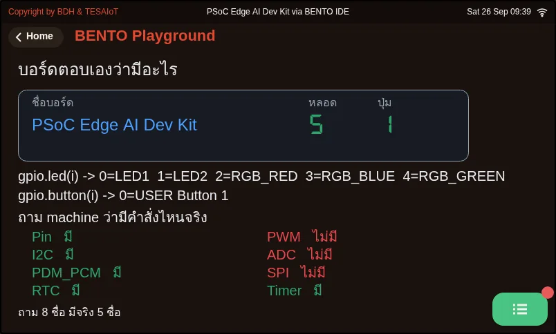
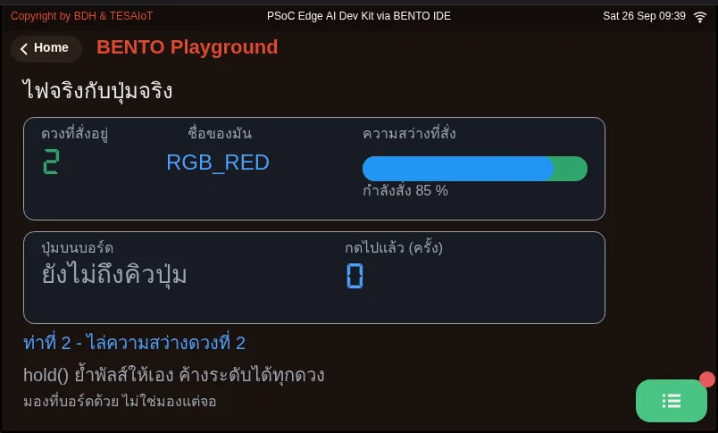
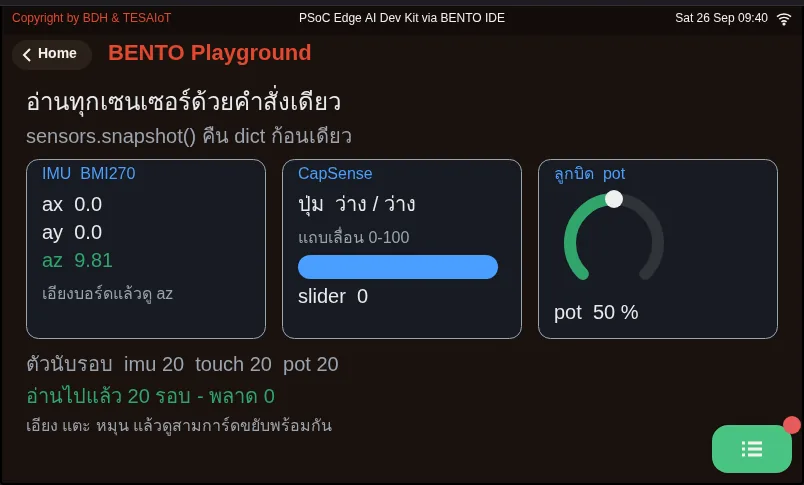
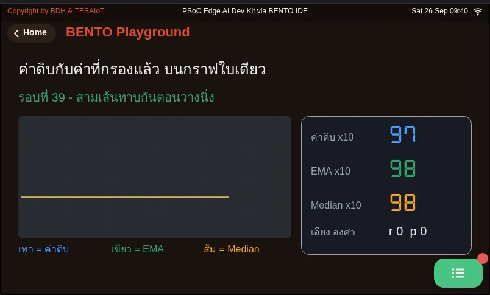
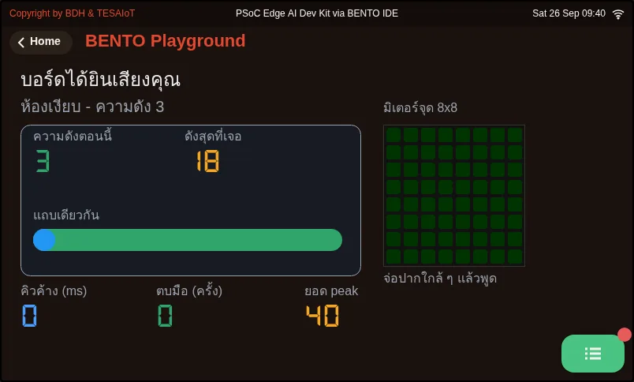
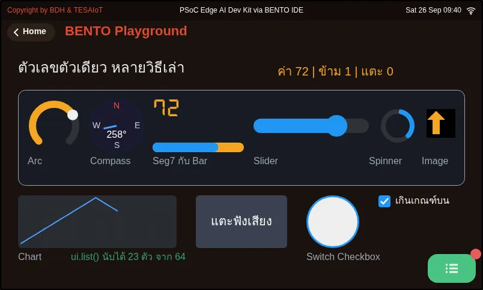

# Lesson 1.3 — Inside the box: two cores, AIoT and your team's screen

> Module 1 — Existing UI-based Application · Slides: [slides.md](slides.md) · [Module overview](../README.md) · [Course page](../../README.md)

Run six files that open the remaining modules in the box to see what the board can do, understand why the board has two cores and where AIoT differs from IoT, then complete the practice file until your team name appears on screen.

## Objectives

By the end of this lesson you will be able to:

1. Run files 10 to 15, say which module each file opens (gpio machine sensors dsp mic ui), and answer the question "what could this do in your work?" in your learning log for at least three files
2. Explain that our Python code lives on the CM33 core and has to pass messages across IPC for the CM55 to draw the screen, and say why sensors.init() is refused on the Eva Kit while sensors.snapshot() works on both boards
3. Explain the difference between IoT and AIoT with the example of a machine that vibrates abnormally: where the decision is made and what is sent up to the cloud
4. Fill the seven blanks in s01_hello_lcd.py one at a time until the Console drawer shows an h2 title, the team name, the members' names one by one and a closing green line, without any lcd.print() call going over 127 bytes

## Before you start

Have ready your learning log with the menu table from lesson 1.1, and `09_your_level_rule.py` from lesson 1.2 (it must pass all six rows for you to pass this set of lessons).
First review three things from lesson 1.2: `ui.poll()` after creating a widget · the 127-byte ceiling of `lcd.print()` · the five `span` classes.
Then touch the BENTO Playground card on the board's screen and leave it open.

- **Equipment:** an Eva Kit or TESAIoT Dev Kit board with the BENTO MicroPython firmware installed, or the BENTO Emulator in [BENTO IDE](https://ide.tesaiot.dev/)
- **Before this:** [Lesson 1.2 — First lines on screen: the lcd and ui modules](../l02-first-lines-on-screen/README.md)

## See it work first

Run `12_every_sense_at_once.py` and play with the board: tilt it and watch the `az` number, touch the touch pads and watch the middle card, turn the knob and watch the ring on the right.
The bottom line is a round counter; if it keeps going up, the values you see are really live. All of this comes from a single command, `sensors.snapshot()`,
which returns one dict holding `bmi270`, `capsense` and `pot`, read at the same moment.

## Concepts

The nine files in lesson 1.2 use only `lcd` `time` `ui`, three of the board's eleven modules. The six files in this lesson are not for typing along;
they are for **running and watching**, no more than five minutes each. The goal is to know what is in this box, not to memorise every function. For numbers that differ between the two boards,
always ask the board in code, for example `gpio.num_leds()` (Eva Kit 3 LEDs · Dev Kit 5 LEDs) and the button's name from `gpio.button(0).name()`.
Code from the internet that starts with `machine.PWM` or `machine.ADC` will get an `AttributeError` straight away, because this port has neither.

Inside a single chip there are two cores that work in different ways. Our Python code always lives on the **CM33** side, while the **CM55** draws the screen. To get anything onto the screen,
we have to leave a message in the IPC mailbox for the CM55, and `ui.poll()` is the moment we open the box so the other side can collect it.
The two boards differ when it comes to sensors: on the Eva Kit the CM55 owns the whole sensor bus, so `sensors.init()` is refused
to stop Python from fighting over the bus until the board hangs. On the Dev Kit the CM33 can read the IMU and compass itself, so `sensors.init()` works.
`sensors.snapshot()` hides this difference and returns a dict of the same shape on both boards.

**IoT** is a device with sensors and a network connection that sends data up to a central system. **AIoT** moves the *decision* down into the device itself.
A machine that vibrates abnormally is a clear example: the IoT way sends the vibration value every second for the cloud to judge, which wastes network, is slow, and goes blind when the network drops.
The AIoT way has the board judge on the spot within a fraction of a second, and send to the cloud only when something is abnormal. Files 08 and 09 in lesson 1.2
already have this shape: measure a value, classify its level, then report.

The practice file arranges the work into five moves from easy to hard, and each move confirms the one before it: clearing the screen and the title prove the path to the screen works ·
a fixed message separates whether a problem is in `lcd` or in the logic · the loop over the names · the closing status says it finished successfully ·
the team sign made with `ui` is what stays behind for passers-by to read after the program ends. The same data can go to two places: the drawer and the screen.

## Worked example

Open one file at a time, run it and watch for no more than five minutes, then ask a single question: "what could this do in your work?" The answers are the raw material for the final project in lessons 5.1–5.3.
If time is short, the two files you must play with are `12` (how many ways the board senses the world) and `15` (how many ways one number can tell a story).
Things to notice: `10` the left-right table of what `machine` has and does not have · `11` `brightness()` can hold a level only on the RGB LED,
the other LEDs use `hold(pct, ms)` · `12` at the end of the file it tries calling `sensors.init()` and prints the answer of the board in front of you ·
`13` grey raw, green EMA and orange Median lines on one chart (Chart accepts integers only) · `14` the microphone's "คิวค้าง" (queue backlog) number ·
`15` the `ui.list()` line tells you how many widgets the screen has, and `seg.value(50)` gives 50, not 50.0

| File | What this file teaches |
|---|---|
| [examples/10_board_knows_itself.py](examples/10_board_knows_itself.py) | Ask the board what it has, instead of looking it up in the manual |
| [examples/11_lights_and_a_button.py](examples/11_lights_and_a_button.py) | Real lights and a real button, controlled from one line of Python |
| [examples/12_every_sense_at_once.py](examples/12_every_sense_at_once.py) | One command, every sensor at once |
| [examples/13_raw_and_filtered.py](examples/13_raw_and_filtered.py) | A raw line that shakes and the same line held steady, on one chart |
| [examples/14_the_board_hears_you.py](examples/14_the_board_hears_you.py) | Talk to the board and watch it move along |
| [examples/15_one_number_many_faces.py](examples/15_one_number_many_faces.py) | A single number, and ten ways the screen can tell it |

The slides for this lesson also refer to files that live in other lessons:

- [m01-ui-application/l02-first-lines-on-screen/examples/05_clear_and_refresh.py](../l02-first-lines-on-screen/examples/05_clear_and_refresh.py) — updating in the same place, as opposed to printing line after line downwards
- [m01-ui-application/l02-first-lines-on-screen/examples/08_status_screen.py](../l02-first-lines-on-screen/examples/08_status_screen.py) — one status screen, with three modules sharing the work
- [m01-ui-application/l02-first-lines-on-screen/examples/09_your_level_rule.py](../l02-first-lines-on-screen/examples/09_your_level_rule.py) — this file runs, but still gets every answer wrong; your job is to make it right
- [shared/web/my_first_reader.html](../../shared/web/my_first_reader.html) — reads values from the board

**Screens from the BENTO Emulator** for this lesson's examples (click a file name to open the code)

<figure><figcaption><a href="examples/10_board_knows_itself.py"><code>10_board_knows_itself.py</code></a> Ask the board what it has, instead of looking it up in the manual</figcaption></figure>
<figure><figcaption><a href="examples/11_lights_and_a_button.py"><code>11_lights_and_a_button.py</code></a> Real lights and a real button, controlled from one line of Python</figcaption></figure>
<figure><figcaption><a href="examples/12_every_sense_at_once.py"><code>12_every_sense_at_once.py</code></a> One command, every sensor at once</figcaption></figure>
<figure><figcaption><a href="examples/13_raw_and_filtered.py"><code>13_raw_and_filtered.py</code></a> A raw line that shakes and the same line held steady, on one chart</figcaption></figure>
<figure><figcaption><a href="examples/14_the_board_hears_you.py"><code>14_the_board_hears_you.py</code></a> Talk to the board and watch it move along</figcaption></figure>
<figure><figcaption><a href="examples/15_one_number_many_faces.py"><code>15_one_number_many_faces.py</code></a> A single number, and ten ways the screen can tell it</figcaption></figure>

## Practice

Open `practice/s01_hello_lcd.py` and work in three steps: **one**, edit the three team-data lines at the top (`TEAM_NAME` `MEMBERS` `MOTTO`).
**Two**, fill the seven blanks following the `# เติม:` (fill in) hints **one at a time**, sending to the board each time; do not fill them all and run once.
**Three**, when everything is filled, try adding lines of your own. Moves 1–4 write to the Console drawer, while move 5 is already written for you:
it places the team sign, a table, two lights and a byte meter on the Playground page. Read it through before you run it.
You are done when the drawer shows the title, the greeting, the members' names appearing one by one about 800 ms apart, and two green lines,
and the screen shows the table of names, with the "กำลังเขียน" (writing) light dimmed and the "เขียนครบแล้ว" (all written) light on.

| Practice file | Topic |
|---|---|
| [practice/s01_hello_lcd.py](practice/s01_hello_lcd.py) | The team's first message on the board's screen (fill-in version) |

## Solution

Open the solution after trying on your own at least once, and read [how to use the solutions](../../README.md#วิธีใช้เฉลย) first.

| Solution | Goes with |
|---|---|
| [solution/s01_hello_lcd.py](solution/s01_hello_lcd.py) | [practice/s01_hello_lcd.py](practice/s01_hello_lcd.py) |

## Check your understanding

The same questions are in [quiz.yaml](quiz.yaml) for automatic marking.

1. You want every LED to run in a chasing pattern, with one set of code on both the Eva Kit and the Dev Kit. How should you write the loop? *(choose one · objective 1)*
   - A) Loop over range(gpio.num_leds()) and let the board say how many LEDs it has
   - B) Loop over range(3), because the Eva Kit has three
   - C) Loop over range(5), because the Dev Kit has the most
   - D) Look in the board manual and write the number in a separate file for each board

   

Solution

   **A** — The number of LEDs differs between the two boards (Eva 3 · Dev Kit 5). The slides stress always asking the board in code rather than remembering numbers, so one set of code runs through every LED on any board.

   

2. On the Eva Kit, calling sensors.init() raises OSError. Which explanation is correct? *(choose one · objective 2)*
   - A) On the Eva Kit the CM55 core owns the sensor bus; this refusal stops Python from fighting over the bus. Use sensors.snapshot() instead
   - B) The sensors on the board are broken and must be sent for repair
   - C) You forgot to import sensors before calling it
   - D) The Eva Kit has no IMU sensor

   

Solution

   **A** — Python code lives on the CM33 side. On the Eva Kit every sensor sits under the CM55, so values must be requested through IPC. The Dev Kit does allow init() to be called, but snapshot() returns a dict of the same shape on both boards.

   

3. A machine vibrates abnormally. How does an AIoT system differ from an IoT one? *(choose one · objective 3)*
   - A) The board decides on the spot within a fraction of a second, sends to the cloud only when something is abnormal, and keeps working when the network drops
   - B) The board sends the vibration value to the cloud every second and the cloud decides
   - C) AIoT needs no sensors, because the cloud can guess by itself
   - D) AIoT is IoT with faster WiFi

   

Solution

   **A** — The heart of AIoT is moving the decision down close to where things happen, and sending to the cloud only what is meaningful. The IoT way of sending every second wastes network, is slow, and goes blind when the network drops.

   

4. In move 3 of s01_hello_lcd.py, if you move time.sleep_ms(800) out of the loop (reduce the line's indentation), what do you see on the screen? *(choose one · objective 4)*
   - A) Everyone's name appears at once, followed by a single delay
   - B) The names appear one by one, as before
   - C) A SyntaxError
   - D) Only the last person's name appears

   

Solution

   **A** — In Python, indentation is meaning. A delay inside the loop makes the names appear one by one; moved out of the loop, it runs once after every name has been printed.

   

5. Why is the closing green line in the practice file split into two lcd.print() calls? *(choose one · objective 4)*
   - A) Combined, a long team name might go over 127 bytes, which is cut off silently, and the \n disappears too
   - B) lcd.print() can use a span tag only once per program
   - C) So that the two lines have different colours
   - D) Because lcd.print() cannot join strings with +

   

Solution

   **A** — Thai takes 3 bytes per character, so a line that looks short uses up the quota quickly. Splitting from the start keeps the end of the message from vanishing without an error, and move 5 of the file measures the length of TAIL so you can see it on the byte meter.

   

## Lab

**The MVP checkpoint for lessons 1.1–1.3.** The team demonstrates the five menus, explains which menu uses which sensor, and runs `lcd.print()` so the team's message appears on the screen.

- [ ] Play all five menus: Home, Sensor Dashboard, Smart Watch, Wi-Fi Setting, BENTO Playground (Controls exists only on the Eva Kit, so it is not part of the criteria)
- [ ] The menu survey table in the learning log has its first five rows filled in (the Controls row is filled only by teams with an Eva Kit)
- [ ] You can point out which menu uses which sensor and answer out loud
- [ ] The board's screen shows the `<h2>` title of this set of lessons
- [ ] The board's screen shows the team name and every member's name, one after another
- [ ] The board's screen shows the closing green line
- [ ] `09_your_level_rule.py` from lesson 1.2 passes all six rows
- [ ] Take a photo of the board's screen and attach it to your learning log

## Going further

Lessons 1.4–1.6 take the board onto the internet with our own code, then send the numbers from `sensors.snapshot()` out to the public broker
`broker.hivemq.com`, for the `my_first_reader.html` web page on a laptop to read back. Write down in your learning log the team name (`team01` to `team19`) the educator hands out.
If you want to keep going, the slides offer four options to choose one from: the team's welcome screen · a countdown based on `05_clear_and_refresh.py` · exploring the 127-byte trap · a menu map.

Next lesson: [Lesson 1.4 — Leaving the desk: the first WiFi connection](../l04-wifi-first-connect/README.md)

## Reflect

- Which menu you played in this set of lessons would you most like to build yourself, and what else do you need to know?
- Data from which sensor would be most useful for the work your team actually does?
- In your work, what decision should move from the cloud down into the device?
