<style>
section { font-size: 24px; padding: 40px 52px; justify-content: flex-start; }
section h1 { font-size: 1.45em; line-height: 1.12; margin: 0 0 .22em; }
section h2 { font-size: 1.12em; margin: .15em 0; }
section h3 { font-size: 1.0em; margin: .12em 0; }
section p, section li { margin: .16em 0; line-height: 1.32; }
section img { max-width: 100%; height: auto; }
section svg { max-height: 330px; width: 100%; }
section table { font-size: .78em; }
section pre { font-size: .70em; line-height: 1.32; background:#0d1117; color:#e6edf3; border:1px solid #30363d; border-radius:8px; padding:12px 16px; box-shadow:0 2px 8px rgba(0,0,0,.25); }
section pre code { white-space: pre-wrap; background:transparent; color:inherit; } section pre .hljs-comment{color:#8b949e;font-style:italic} section pre .hljs-keyword,section pre .hljs-built_in,section pre .hljs-literal{color:#ff7b72} section pre .hljs-string{color:#a5d6ff} section pre .hljs-number{color:#79c0ff} section pre .hljs-title,section pre .hljs-title.function_,section pre .hljs-section{color:#d2a8ff} section pre .hljs-meta{color:#ffa657} section pre .hljs-attr,section pre .hljs-attribute,section pre .hljs-name{color:#7ee787}
section blockquote { margin: .25em 0; font-size: .92em; }
/* two images on a line (parity / 2x2 grids) stay side-by-side and small */
section p > img + img { margin-left: 10px; }
/* scroll-within-slide: dense slides scroll instead of clipping */
section { overflow-y: auto; overflow-x: hidden; }
section::-webkit-scrollbar { width: 11px; }
section::-webkit-scrollbar-thumb { background:#4a90d9; border-radius:6px; }
section::-webkit-scrollbar-track { background:rgba(0,0,0,.06); }
/* image drop-shadow + cover-slide readability (auto) */
section img{filter:drop-shadow(0 3px 12px rgba(0,0,0,.5))}
/* พื้นสำรองของสไลด์ปก: ถ้า img/cover_sNN.svg โหลดไม่ขึ้น ธีมจะคืนพื้นขาว
   แล้วตัวอักษรสีขาวของปกจะหายไปทั้งแผ่น — ปักสีเข้มไว้ให้ภาพเป็นแค่ของประดับ */
section.cover{background-color:#0b1426}
section.cover *{color:#fff !important}
section.cover h1,section.cover h2,section.cover h3,section.cover p,section.cover li,section.cover strong,section.cover em,section.cover blockquote,section.cover div{text-shadow:0 2px 9px rgba(0,0,0,.92),0 0 3px rgba(0,0,0,.8)}
section.cover div[style*="background:#"],section.cover div[style*="background: #"]{background:rgba(10,14,20,.66) !important;border-color:rgba(120,200,255,.45) !important;max-width:62%}
section.cover blockquote{border-left:4px solid rgba(120,200,255,.6) !important;background:rgba(13,17,23,.55) !important;border-radius:6px;padding:.3em .6em}
section.cover h1,section.cover h2,section.cover h3,section.cover p,section.cover blockquote{max-width:60%}
section.cover div:not(:has(img)){max-width:62%}
section.cover img{filter:none}
</style>


<!-- _class: cover -->

# บทเรียน 1.3 — เปิดกล่อง: สองคอร์ งาน AIoT และป้ายของทีม

## AIoT รอบตัวเรา · ทัวร์บอร์ดครบทุกเมนู แล้วส่งข้อความแรกขึ้นจอ

**โมดูล 1 — แอปพลิเคชันบนจอที่มีอยู่แล้ว**

> ต่อจากบทเรียน 1.2 — ข้อความแรกขึ้นจอ: โมดูล lcd กับ ui

---

## ครึ่งหลัง — เปิดกล่องให้เห็นทั้งใบ

<style scoped>
section table { font-size: .56em; }
section table td, section table th { padding: .1em .45em; }
section p { margin: .05em 0; font-size: .90em; line-height: 1.26; }
section blockquote { font-size: .78em; margin: .1em 0; }
</style>

เก้าไฟล์ที่ผ่านมาใช้ `lcd` `time` `ui` สามตัว ซึ่งเป็นแค่**สามในสิบเอ็ดโมดูล**ที่บอร์ดนี้มี

หกไฟล์ต่อไปนี้ไม่ได้ให้พิมพ์ตาม — **ให้รันแล้วดู** ไฟล์ละไม่เกินห้านาที เป้าหมายคือจบชุดบทเรียนนี้แล้วรู้ว่าอีกสิบเอ็ดชุดบทเรียนข้างหน้าจะได้เล่นอะไรบ้าง ไม่ใช่รู้ทุกฟังก์ชัน

| ไฟล์ | เปิดโมดูล | ชื่อที่จะได้เห็นทำงานจริง |
|---|---|---|
| [`10_board_knows_itself.py`](https://github.com/tesaiot/tesa-qualification-program/blob/main/courses/aiot-micropython/m01-ui-application/l03-inside-the-box/examples/10_board_knows_itself.py) | **`gpio` · `machine`** | `gpio.board_info()` `gpio.led()` `gpio.button()` — และพิสูจน์ว่า `machine.PWM` กับ `machine.ADC` **ไม่มีอยู่จริง**ในพอร์ตนี้ |
| [`11_lights_and_a_button.py`](https://github.com/tesaiot/tesa-qualification-program/blob/main/courses/aiot-micropython/m01-ui-application/l03-inside-the-box/examples/11_lights_and_a_button.py) | **`gpio`** | `gpio.num_leds()` `gpio.num_buttons()` · เมธอดของหลอด `on() off() toggle()` |
| [`12_every_sense_at_once.py`](https://github.com/tesaiot/tesa-qualification-program/blob/main/courses/aiot-micropython/m01-ui-application/l03-inside-the-box/examples/12_every_sense_at_once.py) | **`sensors`** | `sensors.snapshot()` คืนทุกเซนเซอร์ในครั้งเดียว (ทั้งสองบอร์ด) · และ `init()` `scan()` ที่ **Eva Kit ปฏิเสธ** พร้อมบอกเหตุผล ส่วน **Dev Kit ยอมให้เรียก** — ไฟล์พิมพ์คำตอบของบอร์ดตรงหน้า ไม่ได้เดาให้ |
| [`13_raw_and_filtered.py`](https://github.com/tesaiot/tesa-qualification-program/blob/main/courses/aiot-micropython/m01-ui-application/l03-inside-the-box/examples/13_raw_and_filtered.py) | **`dsp`** | `dsp.EMA` `dsp.Median` `dsp.tilt` — ค่าดิบกับค่ากรอง วาดทับกันบนกราฟเดียว |
| [`14_the_board_hears_you.py`](https://github.com/tesaiot/tesa-qualification-program/blob/main/courses/aiot-micropython/m01-ui-application/l03-inside-the-box/examples/14_the_board_hears_you.py) | **`mic`** | `mic.start()` `mic.level()` `mic.stats()` `mic.lag()` — และหน้าจอ DotMatrix |
| [`15_one_number_many_faces.py`](https://github.com/tesaiot/tesa-qualification-program/blob/main/courses/aiot-micropython/m01-ui-application/l03-inside-the-box/examples/15_one_number_many_faces.py) | **`ui` เต็มรูปแบบ** | เลขตัวเดียวขับ **เก้า widget พร้อมกัน** — Arc Bar Chart Seg7 Slider Switch Checkbox Spinner Compass · บวก `ui.sfx()` `ui.tone()` |

**เปิดทีละไฟล์ รันตาม แล้วตอบคำถามเดียวต่อไฟล์** (ถ้าเรียนเป็นห้อง ผู้สอนเปิดบนจอหน้าห้องให้ทุกทีมรันตามพร้อมกัน) — "ของนี้เอาไปทำอะไรได้ในงานของคุณ" คำตอบที่ได้คือวัตถุดิบของโปรเจกต์จบในบทเรียน 5.1–5.3

> ไฟล์ [`12_every_sense_at_once.py`](https://github.com/tesaiot/tesa-qualification-program/blob/main/courses/aiot-micropython/m01-ui-application/l03-inside-the-box/examples/12_every_sense_at_once.py) กับ [`15_one_number_many_faces.py`](https://github.com/tesaiot/tesa-qualification-program/blob/main/courses/aiot-micropython/m01-ui-application/l03-inside-the-box/examples/15_one_number_many_faces.py) คือสองไฟล์ที่ต้องได้เล่นแน่ ๆ ถ้าเวลาไม่พอ — ตัวแรกแสดงว่าบอร์ดรับรู้โลกได้กี่ทาง ตัวหลังแสดงว่าเลขหนึ่งตัวเล่าเรื่องได้กี่แบบ

---

## ข้อมูลไหลไปทางไหน — ตั้งแต่คีย์บอร์ดถึงจอ

<svg viewBox="0 0 940 220" xmlns="http://www.w3.org/2000/svg">
  <defs><marker id="a2" markerWidth="12" markerHeight="9" refX="12" refY="4.5" orient="auto" markerUnits="userSpaceOnUse">
    <path d="M0,0 L12,4.5 L0,9 z" fill="#6a1b9a"/></marker></defs>
  <rect x="10" y="70" width="160" height="80" rx="10" fill="#f3e5f5" stroke="#6a1b9a" stroke-width="2"/>
  <text x="90" y="105" text-anchor="middle" font-size="21" font-weight="700" fill="#6a1b9a">BENTO IDE</text>
  <text x="90" y="130" text-anchor="middle" font-size="18" fill="#4a148c">เราพิมพ์โค้ด</text>
  <rect x="205" y="70" width="160" height="80" rx="10" fill="#e3f2fd" stroke="#1565c0" stroke-width="2"/>
  <text x="285" y="98" text-anchor="middle" font-size="21" font-weight="700" fill="#1565c0">CM33</text>
  <text x="285" y="122" text-anchor="middle" font-size="18" fill="#0d47a1">MicroPython รัน</text>
  <text x="285" y="142" text-anchor="middle" font-size="18" fill="#0d47a1">lcd.print()</text>
  <rect x="400" y="70" width="150" height="80" rx="10" fill="#fff3e0" stroke="#ef6c00" stroke-width="2"/>
  <text x="475" y="105" text-anchor="middle" font-size="21" font-weight="700" fill="#ef6c00">IPC</text>
  <text x="475" y="130" text-anchor="middle" font-size="18" fill="#e65100">กล่องจดหมาย</text>
  <rect x="585" y="70" width="160" height="80" rx="10" fill="#e8f5e9" stroke="#2e7d32" stroke-width="2"/>
  <text x="665" y="98" text-anchor="middle" font-size="21" font-weight="700" fill="#2e7d32">CM55</text>
  <text x="665" y="122" text-anchor="middle" font-size="18" fill="#1b5e20">วาดตัวอักษรจริง</text>
  <rect x="780" y="70" width="150" height="80" rx="10" fill="#eceff1" stroke="#455a64" stroke-width="2"/>
  <text x="855" y="105" text-anchor="middle" font-size="21" font-weight="700" fill="#455a64">จอ 4.3"</text>
  <text x="855" y="130" text-anchor="middle" font-size="18" fill="#37474f">เราเห็นผล</text>
  <line x1="170" y1="110" x2="205" y2="110" stroke="#6a1b9a" stroke-width="2.5" marker-end="url(#a2)"/>
  <line x1="365" y1="110" x2="400" y2="110" stroke="#6a1b9a" stroke-width="2.5" marker-end="url(#a2)"/>
  <line x1="550" y1="110" x2="585" y2="110" stroke="#6a1b9a" stroke-width="2.5" marker-end="url(#a2)"/>
  <line x1="745" y1="110" x2="780" y2="110" stroke="#6a1b9a" stroke-width="2.5" marker-end="url(#a2)"/>
  <circle cx="90" cy="110" r="9" fill="#e91e63">
    <animateMotion path="M0,0 L195,0 L385,0 L575,0 L765,0" dur="4s" repeatCount="indefinite"/>
  </circle>
  <text x="470" y="42" text-anchor="middle" font-size="20" font-weight="700" fill="#455a64">โค้ดหนึ่งบรรทัดของเรา เดินทางผ่านห้าจุดกว่าจะเป็นตัวอักษรบนจอ</text>
  <text x="470" y="196" text-anchor="middle" font-size="19" fill="#78909c">ถ้าไม่เห็นข้อความ ให้ไล่หาว่าขาดตอนที่จุดไหน — เกือบทุกครั้งคือ "ยังไม่ได้เปิดหน้า Playground"</text>
</svg>

> เข้าใจเส้นทางนี้แล้ว การดีบักจะเลิกเป็นการเดา — และเข้าใจด้วยว่าทำไม `ui.poll()` ถึงจำเป็น มันคือจังหวะที่เราเปิดกล่องจดหมายให้อีกฝั่งหยิบของไป

---

## เข้าใจฮาร์ดแวร์ · ทำไมบอร์ดนี้ต้องมีสมองสองก้อน

ในชิปตัวเดียวกันมีซีพียูสองตัวที่ทำงานคนละแบบ

<svg viewBox="0 0 900 260" xmlns="http://www.w3.org/2000/svg">
  <defs><marker id="ar" markerWidth="10" markerHeight="8" refX="9" refY="4" orient="auto">
    <path d="M0,0 L10,4 L0,8 z" fill="#1565c0"/></marker></defs>
  <rect x="30" y="40" width="330" height="170" rx="12" fill="#e3f2fd" stroke="#1565c0" stroke-width="2"/>
  <text x="195" y="72" text-anchor="middle" font-size="26" font-weight="700" fill="#1565c0">CM33 — สมองฝั่งงานระบบ</text>
  <text x="195" y="108" text-anchor="middle" font-size="21" fill="#0d47a1">รัน MicroPython (โค้ดที่เราเขียน)</text>
  <text x="195" y="136" text-anchor="middle" font-size="21" fill="#0d47a1">คุม WiFi · MQTT · ไฟล์</text>
  <text x="195" y="164" text-anchor="middle" font-size="21" fill="#0d47a1">อ่านเซนเซอร์บางตัว</text>
  <text x="195" y="192" text-anchor="middle" font-size="19" fill="#5472a3">เป็นคอร์ที่รับคำสั่งจากเรา</text>
  <rect x="540" y="40" width="330" height="170" rx="12" fill="#e8f5e9" stroke="#2e7d32" stroke-width="2"/>
  <text x="705" y="72" text-anchor="middle" font-size="26" font-weight="700" fill="#2e7d32">CM55 — สมองฝั่งงานหนัก</text>
  <text x="705" y="108" text-anchor="middle" font-size="21" fill="#1b5e20">วาดทุกอย่างบนจอ</text>
  <text x="705" y="136" text-anchor="middle" font-size="21" fill="#1b5e20">อ่านแผ่นสัมผัส/ลูกบิดให้ Home</text>
  <text x="705" y="164" text-anchor="middle" font-size="21" fill="#1b5e20">Eva: เจ้าของบัส อ่าน IMU ด้วย</text>
  <text x="705" y="192" text-anchor="middle" font-size="19" fill="#4a7c4e">เป็นคอร์ที่ไม่เคยคุยกับเราตรง ๆ</text>
  <line x1="365" y1="105" x2="533" y2="105" stroke="#1565c0" stroke-width="3" marker-end="url(#ar)"/>
  <line x1="533" y1="150" x2="367" y2="150" stroke="#2e7d32" stroke-width="3" marker-end="url(#ar)"/>
  <circle cx="365" cy="105" r="7" fill="#1565c0">
    <animateMotion path="M0,0 L160,0" dur="1.6s" repeatCount="indefinite"/>
    <animate attributeName="r" values="6;11;6" dur="1.6s" repeatCount="indefinite"/>
  </circle>
  <circle cx="533" cy="150" r="7" fill="#2e7d32">
    <animateMotion path="M0,0 L-158,0" dur="1.6s" begin="0.8s" repeatCount="indefinite"/>
    <animate attributeName="r" values="6;11;6" dur="1.6s" begin="0.8s" repeatCount="indefinite"/>
  </circle>
  <text x="449" y="95" text-anchor="middle" font-size="19" fill="#1565c0">คำสั่ง</text>
  <text x="449" y="176" text-anchor="middle" font-size="19" fill="#2e7d32">ค่าที่วัดได้</text>
  <text x="449" y="232" text-anchor="middle" font-size="20" font-weight="700" fill="#455a64">IPC — กล่องจดหมายระหว่างสองคอร์</text>
</svg>

ใครอ่านเซนเซอร์ตัวไหน ต่างกันระหว่างสองบอร์ด: บน **Eva Kit** CM55 เป็นเจ้าของบัสเซนเซอร์ทั้งหมด (IMU แผ่นสัมผัส ลูกบิด) Python จึงต้องขอค่าผ่าน IPC และ `sensors.init()` ถูกปฏิเสธ · บน **Dev Kit** CM33 อ่าน IMU/เข็มทิศเองได้ (`sensors.init()` ทำงาน) ส่วนแผ่นสัมผัสกับลูกบิดยังอ่านผ่าน CM55 เหมือนกัน — `sensors.snapshot()` ซ่อนความต่างนี้ให้ คืน dict รูปเดียวกันทั้งสองบอร์ด

> โค้ด Python ของเราอยู่ฝั่ง CM33 เสมอ อยากให้อะไรขึ้นจอ ต้อง **ฝากข้อความข้ามไปให้ CM55 วาด**

---

## AIoT คืออะไร — ตัดสินใจใกล้จุดเกิดเหตุ

<style scoped>
section svg { max-height: 200px; }
</style>

**IoT** = อุปกรณ์มีเซนเซอร์ + ต่อเน็ต ส่งข้อมูลขึ้นระบบกลาง
**AIoT** = ย้าย *การตัดสินใจ* ลงมาไว้ที่ตัวอุปกรณ์เอง ไม่ต้องรอถามคลาวด์ทุกครั้ง

<svg viewBox="0 0 940 200" xmlns="http://www.w3.org/2000/svg">
  <defs>
    <marker id="flowIoT" markerWidth="14" markerHeight="10" refX="14" refY="5" orient="auto" markerUnits="userSpaceOnUse"><path d="M0,0 L14,5 L0,10 z" fill="#c62828"/></marker>
    <marker id="flowAIoT" markerWidth="14" markerHeight="10" refX="14" refY="5" orient="auto" markerUnits="userSpaceOnUse"><path d="M0,0 L14,5 L0,10 z" fill="#2e7d32"/></marker>
  </defs>
  <text x="18" y="22" font-size="20" font-weight="700" fill="#c62828">แบบ IoT — ส่งทุกอย่างขึ้นคลาวด์แล้วรอคำตอบ</text>
  <rect x="30" y="34" width="202" height="52" rx="8" fill="#ffebee" stroke="#c62828" stroke-width="2"/>
  <text x="131" y="57" text-anchor="middle" font-size="19" fill="#b71c1c">เซนเซอร์</text>
  <text x="131" y="78" text-anchor="middle" font-size="17" fill="#8d4a4a">ไม่มีสมองในตัว</text>
  <rect x="700" y="34" width="190" height="52" rx="8" fill="#ffebee" stroke="#c62828" stroke-width="2"/>
  <text x="795" y="57" text-anchor="middle" font-size="19" fill="#b71c1c">คลาวด์</text>
  <text x="795" y="78" text-anchor="middle" font-size="17" fill="#8d4a4a">ตัดสินใจแทน · ตอบช้า</text>
  <line x1="232" y1="60" x2="700" y2="60" stroke="#ef5350" stroke-width="2.5" stroke-dasharray="8 5" marker-end="url(#flowIoT)"/>
  <text x="466" y="48" text-anchor="middle" font-size="16" fill="#b71c1c">จุดแดง = ข้อมูลดิบหนึ่งชุด ส่งทุกวินาที</text>
  <circle cx="232" cy="60" r="7" fill="#c62828"><animateMotion path="M0,0 L454,0" dur="2.6s" repeatCount="indefinite"/></circle>
  <text x="18" y="128" font-size="20" font-weight="700" fill="#2e7d32">แบบ AIoT — ตัดสินใจตรงจุดเกิดเหตุ</text>
  <rect x="30" y="140" width="202" height="52" rx="8" fill="#e8f5e9" stroke="#2e7d32" stroke-width="2"/>
  <text x="131" y="163" text-anchor="middle" font-size="19" fill="#1b5e20">เซนเซอร์ + สมอง</text>
  <text x="131" y="184" text-anchor="middle" font-size="17" fill="#4a7c4e">รู้ผลทันทีในตัวเอง</text>
  <rect x="700" y="140" width="190" height="52" rx="8" fill="#e8f5e9" stroke="#2e7d32" stroke-width="2"/>
  <text x="795" y="163" text-anchor="middle" font-size="19" fill="#1b5e20">คลาวด์</text>
  <text x="795" y="184" text-anchor="middle" font-size="17" fill="#4a7c4e">รับแต่สรุปที่สำคัญ</text>
  <line x1="232" y1="166" x2="700" y2="166" stroke="#66bb6a" stroke-width="2.5" stroke-dasharray="8 5" marker-end="url(#flowAIoT)"/>
  <text x="466" y="154" text-anchor="middle" font-size="16" fill="#1b5e20">จุดเขียว = ส่งเฉพาะตอนที่ผิดปกติ</text>
  <circle cx="232" cy="166" r="7" fill="#2e7d32"><animateMotion path="M0,0 L454,0" dur="2.6s" begin="1.5s" repeatCount="indefinite"/></circle>
</svg>

ตัวอย่างที่จับต้องได้: เครื่องจักรตัวหนึ่งสั่นผิดปกติ

- แบบ IoT: ส่งค่าความสั่นทุกวินาทีขึ้นคลาวด์ ให้คลาวด์ตัดสิน — เปลืองเน็ต ช้า และถ้าเน็ตหลุดคือตาบอด
- แบบ AIoT: บอร์ดตัดสินเองที่หน้างานภายในเสี้ยววินาที ส่งขึ้นคลาวด์เฉพาะตอน "ผิดปกติ" — ประหยัด เร็ว และเน็ตหลุดก็ยังทำงาน

<div style="display:flex;gap:14px;align-items:flex-start">
<div style="flex:0 0 170px">

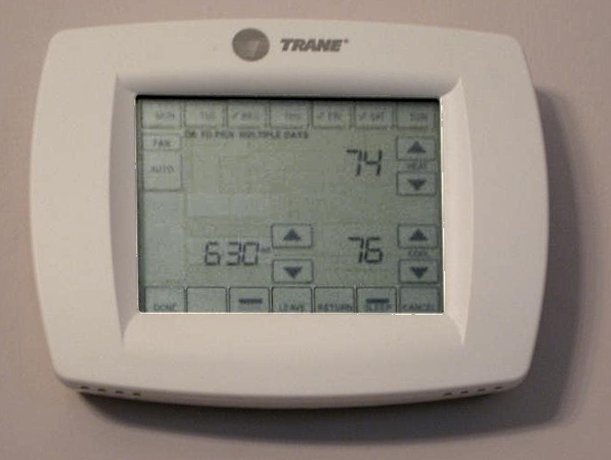

</div>
<div>

เทอร์โมสตัทสัมผัสในบ้านจริงตัวนี้ทำครบวงในกล่องเดียว — วัดอุณหภูมิ ตัดสินว่าร้อนไปหรือเย็นไป แล้วสั่งคอมเพรสเซอร์ทำงาน ลองชี้ให้ได้ว่าสามหน้าที่นั้นอยู่ตรงไหนของกล่องนี้

**และนี่คือรูปร่างของไฟล์ที่ 8 กับ 9 ที่เพิ่งรันไปเป๊ะ ๆ** — วัดค่า ตัดระดับ แล้วรายงาน

<div style="font-size:.58em;color:#78909c">ภาพ: Flarn2006, Wikimedia Commons, CC BY-SA 3.0</div>

</div>
</div>

<!-- หัวใจของ AIoT คือ ตัดสินใจใกล้จุดเกิดเหตุ ส่งขึ้นคลาวด์เฉพาะสิ่งที่มีความหมาย -->

---

## ใช้จริงที่ไหน — สามอุตสาหกรรมที่ของแบบนี้ทำงานอยู่จริง

<style scoped>
section svg { max-height: 148px; }
section img { max-height: 118px; }
section p { margin: .05em 0; font-size: .88em; }
section blockquote { font-size: .78em; }
</style>

<svg viewBox="0 0 940 200" xmlns="http://www.w3.org/2000/svg">
  <rect x="10" y="10" width="290" height="180" rx="10" fill="#e3f2fd" stroke="#0d47a1" stroke-width="2.5"/>
  <text x="155" y="45" text-anchor="middle" font-size="24" font-weight="700" fill="#0d47a1">โรงงาน</text>
  <path d="M40,105 Q62,88 84,105 T128,105 T172,105 T216,105 T268,105" fill="none" stroke="#0d47a1" stroke-width="3">
    <animate attributeName="d" dur="1.6s" repeatCount="indefinite" values="M40,105 Q62,95 84,105 T128,105 T172,105 T216,105 T268,105;M40,105 Q62,62 84,105 T128,105 T172,105 T216,105 T268,105;M40,105 Q62,95 84,105 T128,105 T172,105 T216,105 T268,105"/>
  </path>
  <text x="155" y="155" text-anchor="middle" font-size="19" fill="#1a3a6b">ความสั่นเปลี่ยน</text>
  <text x="155" y="178" text-anchor="middle" font-size="19" fill="#1a3a6b">ก่อนพังจริง 2-3 สัปดาห์</text>
  <rect x="325" y="10" width="290" height="180" rx="10" fill="#e8f5e9" stroke="#1b5e20" stroke-width="2.5"/>
  <text x="470" y="45" text-anchor="middle" font-size="24" font-weight="700" fill="#1b5e20">อาคาร</text>
  <circle cx="390" cy="102" r="11" fill="#1b5e20"/>
  <circle cx="430" cy="102" r="11" fill="#1b5e20"/>
  <circle cx="470" cy="102" r="11" fill="#1b5e20"><animate attributeName="r" values="6;11;6" dur="2.6s" repeatCount="indefinite"/></circle>
  <circle cx="510" cy="102" r="11" fill="#1b5e20"><animate attributeName="r" values="6;11;6" dur="2.6s" begin="0.9s" repeatCount="indefinite"/></circle>
  <circle cx="550" cy="102" r="11" fill="#1b5e20"><animate attributeName="r" values="6;11;6" dur="2.6s" begin="1.8s" repeatCount="indefinite"/></circle>
  <text x="470" y="155" text-anchor="middle" font-size="19" fill="#1b4d1f">นับคนจริงในห้อง</text>
  <text x="470" y="178" text-anchor="middle" font-size="19" fill="#1b4d1f">แล้วสั่งแอร์ตามนั้น</text>
  <rect x="640" y="10" width="290" height="180" rx="10" fill="#fff3e0" stroke="#bf360c" stroke-width="2.5"/>
  <text x="785" y="45" text-anchor="middle" font-size="24" font-weight="700" fill="#bf360c">สุขภาพ</text>
  <line x1="690" y1="118" x2="740" y2="82" stroke="#bf360c" stroke-width="4"/>
  <line x1="760" y1="82" x2="810" y2="118" stroke="#bf360c" stroke-width="4" opacity="0.25"/>
  <text x="785" y="155" text-anchor="middle" font-size="19" fill="#7a2408">แยก "นั่งลงเร็ว"</text>
  <text x="785" y="178" text-anchor="middle" font-size="19" fill="#7a2408">ออกจาก "ล้ม" ให้ได้</text>
</svg>

**โรงงาน — Predictive Maintenance**
มอเตอร์ปั๊มน้ำมีเซนเซอร์ความสั่นติดอยู่ ระบบบนตัวมันรู้ว่า "เสียงสั่นปกติ" หน้าตาแบบไหน พอลูกปืนเริ่มสึก รูปแบบการสั่นเปลี่ยนก่อนพัง 2-3 สัปดาห์ ระบบแจ้งซ่อมล่วงหน้า แทนที่จะรอสายพานหยุดกลางกะ

**อาคาร — Smart Building**
เซนเซอร์ในห้องประชุมนับคนจากความเคลื่อนไหวและเสียง แล้วสั่งแอร์ให้แรงตามจำนวนคนจริง ไม่ใช่ตั้งไว้ 22 องศาทั้งวัน ค่าไฟลดได้ 20-30% โดยไม่มีใครต้องกดสวิตช์

**สุขภาพ — Fall Detection**
อุปกรณ์ติดตัวผู้สูงอายุ แยกให้ออกระหว่าง "นั่งลงเร็ว" กับ "ล้ม" — สองอย่างนี้กราฟความเร่งคล้ายกันมาก ค่าเดียวที่จุดเดียวแยกไม่ออก ต้องดูรูปร่างของสัญญาณทั้งช่วง

<div style="display:flex;gap:10px;align-items:flex-start">
<div style="flex:1 1 0">

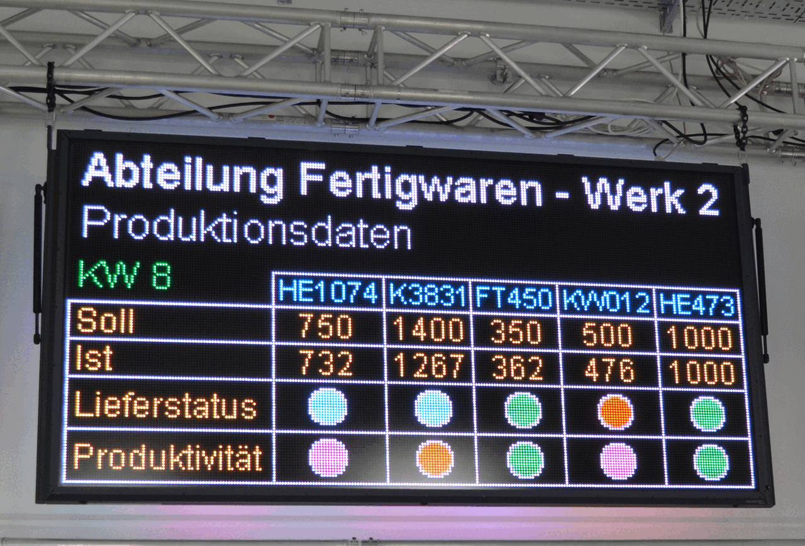

<div style="font-size:.56em;color:#78909c">ภาพ: MicroSYST GmbH, Wikimedia Commons, CC BY-SA 4.0 — เสาไฟสถานะบนสายการผลิตจริง "แจ้งสถานะ" ในโรงงานคือไฟไม่กี่ดวงที่อ่านได้จากอีกฝั่งโรงงาน ไม่ใช่หน้าจอสวย ๆ</div>

</div>
<div style="flex:1 1 0">

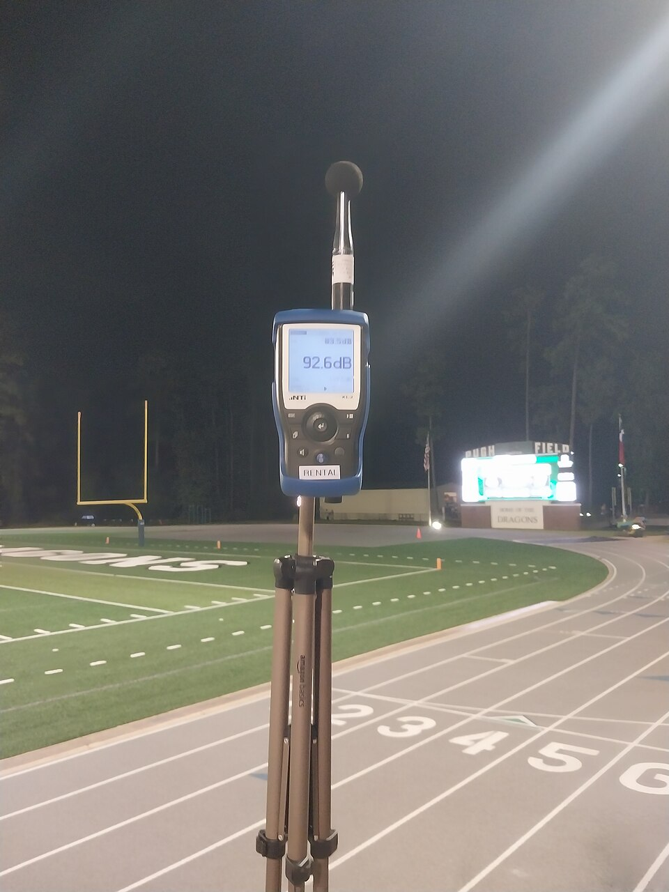

<div style="font-size:.56em;color:#78909c">ภาพ: RandomKatze, Wikimedia Commons, CC0 1.0 — ป้ายวัดระดับเสียงในสนามกีฬาจริง เซนเซอร์ตัวเดียวถูกติดตั้งถาวรเพื่อเฝ้าค่าเดียว ไม่ใช่การทดลองบนโต๊ะ</div>

</div>
<div style="flex:1 1 0">

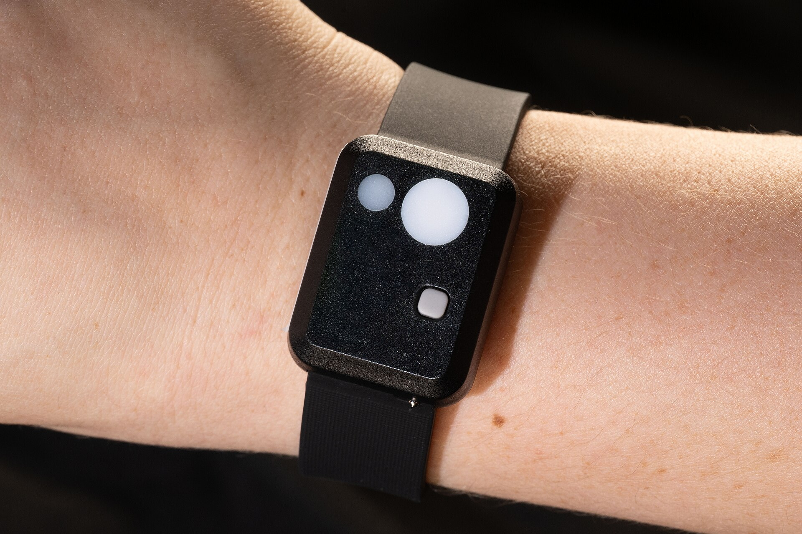

<div style="font-size:.56em;color:#78909c">ภาพ: NASA / Helen Arase Vargas, Wikimedia Commons, สาธารณสมบัติ — เครื่อง actigraphy ที่นักบินอวกาศใส่จริง เล็กได้ขนาดนี้เพราะประมวลผลอยู่ในตัวมันเอง</div>

</div>
</div>

> ทั้งสามเคสนี้ ตัวเซนเซอร์กับตัวตัดสินใจอยู่ที่เดียวกัน — นั่นแหละ AIoT

---

## บอร์ดของเรา: มีอะไรอยู่บ้าง — Eva Kit กับ Dev Kit ต่างกันตรงไหน

<style scoped>
section img { max-height: 150px; width: auto; }
section table { font-size: .52em; }
section table td, section table th { padding: .08em .4em; line-height: 1.25; }
section p { margin: .04em 0; }
section blockquote { font-size: .76em; margin: .1em 0; }
</style>


<div style="font-size:.52em;color:#78909c;margin-top:-.3em">ภาพ: KIT_PSE84_EVAL PSOC™ Edge E84 Evaluation Kit guide, Infineon 002-39007 Rev.*B, รูปที่ 2 (หน้า 9) — ใช้เพื่อการเรียนการสอน · ภาพนี้คือ Eva Kit — ทีมที่ถือ TESAIoT Dev Kit ให้ดูของจริงบนโต๊ะประกอบตาราง (ภาพ Dev Kit จะเพิ่มเมื่อถ่ายจริง)</div>

| ของบนบอร์ด | มันวัด/ทำอะไร | เจอในเมนูไหน · ใช้เองบทเรียนไหน |
|---|---|---|
| BMI270 | ความเร่ง 3 แกน + การหมุน 3 แกน (ทั้งสองบอร์ด) | Home, Dashboard, Smart Watch · เราใช้เองบทเรียน 3.1–3.6 |
| BMM350 | สนามแม่เหล็กโลก → ทิศเหนือ (ทั้งสองบอร์ด) | Dashboard (เข็มทิศ) · บทเรียน 3.7–3.9 |
| CapSense | แผ่นสัมผัส — Eva: ปุ่มสัมผัส 2 ปุ่ม + แถบเลื่อน (5 อิเล็กโทรด อ่านเป็นค่าเดียว 0–100) · Dev Kit: ดูตำแหน่งที่บอร์ดของทีม | Home (Eva: Controls ด้วย) · บทเรียน 2.7–2.9 |
| Potentiometer | ลูกบิดหมุน → ค่าอนาล็อก — Eva: ลูกบิดสีน้ำเงิน 1 ตัว · Dev Kit: VR1–VR4 (`sensors.pot` อ่าน VR1) | Home (Eva: Controls ด้วย) · บทเรียน 2.7–2.9 |
| LED + ปุ่มผู้ใช้ | LED — Eva 3 ดวง · Dev Kit 5 ดวง (ถาม `gpio.num_leds()` อย่าจำเลข) · ปุ่มที่ Python ใช้ได้ 1 ปุ่ม เรียกด้วยชื่อจาก `gpio.button(0).name()` ไม่ใช่ป้ายบนแผ่นวงจร | Eva: Controls · บทเรียน 2.1–2.3 |
| ไมโครโฟน PDM | เสียงรอบตัว | ยังไม่มีเมนูของตัวเอง · บทเรียน 3.7–3.9 ใช้ผ่านโมดูล `mic` |
| WiFi/BT (Eva: CYW55513IUBG) | Wi-Fi + Bluetooth ใช้วิทยุร่วมกัน (Eva: Wi-Fi 6 2.4/5 GHz + Bluetooth 5.4) | Wi-Fi Setting · **ชุดบทเรียนถัดไปเราต่อเอง** |
| จอสัมผัส 4.3" | หน้าต่างของทุกอย่าง — พื้นที่วาด 792×398 เท่ากันทั้งสองบอร์ด | ทุกเมนู · วันนี้เลย |
| เฉพาะ Dev Kit | SHT40 (อุณหภูมิ/ความชื้น) · DPS368 (ความกดอากาศ) · เรดาร์ · RGB dot matrix · CAN · ปุ่มเสริมสองปุ่ม (`import buttons`) | Home (แถว Temp / Humid) · บทเรียน 4.1–5.3 ใช้ SHT40 เมื่อบอร์ดมี |

> จำตารางนี้ไว้ — คอลัมน์ขวาคือแผนที่ของทั้งหลักสูตร เราจะไล่หยิบของในตารางนี้มาสั่งงานเองทีละตัว · ตัวเลขที่ต่างกันระหว่างสองบอร์ด (จำนวน LED, จำนวนลูกบิด) ให้ถามบอร์ดด้วยโค้ดเสมอ ไม่ต้องจำ

---

## ก่อนเริ่มบทเรียน — ผู้สอนตรวจให้ครบ

<svg viewBox="0 0 900 190" xmlns="http://www.w3.org/2000/svg">
  <rect x="20" y="14" width="200" height="76" rx="8" fill="#e8f5e9" stroke="#2e7d32" stroke-width="2"/>
  <text x="120" y="44" text-anchor="middle" font-size="20" font-weight="700" fill="#2e7d32">บอร์ด + สายไฟ</text>
  <text x="120" y="70" text-anchor="middle" font-size="17" fill="#1b5e20">จอติด เห็นหน้า Home</text>
  <rect x="240" y="14" width="200" height="76" rx="8" fill="#e3f2fd" stroke="#1565c0" stroke-width="2"/>
  <text x="340" y="44" text-anchor="middle" font-size="20" font-weight="700" fill="#1565c0">BENTO IDE</text>
  <text x="340" y="70" text-anchor="middle" font-size="17" fill="#0d47a1">ติดตั้งบนคอมทุกกลุ่ม</text>
  <rect x="460" y="14" width="200" height="76" rx="8" fill="#fff3e0" stroke="#ef6c00" stroke-width="3"/>
  <text x="560" y="44" text-anchor="middle" font-size="20" font-weight="700" fill="#ef6c00">แถว Touch ตอบไหม</text>
  <text x="560" y="70" text-anchor="middle" font-size="17" fill="#e65100">ทั้งสองบอร์ด: flash ชิปก่อน</text>
  <rect x="680" y="14" width="200" height="76" rx="8" fill="#f3e5f5" stroke="#6a1b9a" stroke-width="2"/>
  <text x="780" y="44" text-anchor="middle" font-size="20" font-weight="700" fill="#6a1b9a">SD card (Eva)</text>
  <text x="780" y="70" text-anchor="middle" font-size="17" fill="#4a148c">ถ้าจะเล่น Audio Player</text>
  <text x="450" y="126" text-anchor="middle" font-size="19" font-weight="700" fill="#c62828">ชิป CapSense ที่ยังไม่ถูก flash ทำให้แถว Touch ขึ้น -- ตลอดกาล ไม่ว่าบอร์ดไหน</text>
  <text x="450" y="154" text-anchor="middle" font-size="17" fill="#8d6e63">ผู้เรียนจะเข้าใจว่าบอร์ดเสีย ทั้งที่เป็นเรื่องการเตรียมของ</text>
  <text x="450" y="178" text-anchor="middle" font-size="17" fill="#607d8b">ตรวจทุกบอร์ดก่อนเปิดบทเรียน อย่าปล่อยให้ไปเจอกลางบทเรียน</text>
</svg>

สี่อย่างนี้เป็นงานของผู้สอน ไม่ใช่ของผู้เรียน ตรวจให้ครบก่อนเริ่ม แล้วบทเรียนจะเดินได้ตลอดชุดบทเรียนโดยไม่สะดุด · ข้อที่สามตรวจเหมือนกันทั้งสองบอร์ด: แตะแผ่นสัมผัสแล้วแถว Touch บนหน้า Home ต้องเปลี่ยน — ถ้าไม่เปลี่ยน สาเหตุที่ต้องสงสัยก่อนคือชิป CapSense ยังไม่ถูก flash ซึ่งเกิดได้กับทั้งสองบอร์ด เพราะแผ่นสัมผัสของทั้งคู่ต่อกับชิป PSoC 4000T แยกต่างหาก ที่ต้องโปรแกรมคนละรอบกับตัวบอร์ดหลัก · ข้อที่สี่มีเฉพาะ Eva Kit เพราะ Dev Kit ไม่มีการ์ด Audio Player

> ข้อที่พลาดบ่อยที่สุดคือชิป CapSense — มันเป็นชิปแยกที่ต้องโปรแกรมต่างหากจากตัวบอร์ดหลัก ทั้งสองบอร์ดเหมือนกัน

---

## MVP checkpoint — ผ่านชุดบทเรียนนี้เมื่อ


**ทีมสาธิตการใช้ 5 เมนูพร้อมอธิบายว่าเมนูใดใช้เซนเซอร์ใด + รัน `lcd.print()` ข้อความของทีมขึ้นจอสำเร็จ**

แปลเป็นสิ่งที่ตรวจได้จริง:

- [ ] เล่นครบ 5 เมนู: Home, Sensor Dashboard, Smart Watch, Wi-Fi Setting, BENTO Playground (ห้าเมนูนี้มีทั้งบน Eva Kit และ Dev Kit — Controls มีเฉพาะ Eva Kit จึงไม่อยู่ในเกณฑ์)
- [ ] ตารางสำรวจเมนูในบันทึกการเรียน กรอกครบ 5 แถวแรก (แถว Controls กรอกเฉพาะทีมที่ถือ Eva Kit)
- [ ] ชี้ได้ว่าเมนูไหนใช้เซนเซอร์ตัวไหน (อธิบายปากเปล่าได้)
- [ ] จอบอร์ดขึ้นหัวเรื่อง `<h2>` ของชุดบทเรียนนี้
- [ ] จอบอร์ดขึ้นชื่อทีมและชื่อสมาชิกครบทุกคน ไล่ทีละคน
- [ ] จอบอร์ดขึ้นบรรทัดสีเขียวปิดท้าย
- [ ] [`09_your_level_rule.py`](https://github.com/tesaiot/tesa-qualification-program/blob/main/courses/aiot-micropython/m01-ui-application/l02-first-lines-on-screen/examples/09_your_level_rule.py) ผ่านครบหกแถว (เขียวหมด)
- [ ] ถ่ายรูปหน้าจอบอร์ดแนบในบันทึกการเรียน

> ไม่มีข้อไหนต้องใช้โค้ดเกินสามสิบบรรทัด — ชุดบทเรียนนี้วัดความเข้าใจ ไม่ใช่ปริมาณ

---

## กับดักที่เจอบ่อย

<style scoped>
section table { font-size: .54em; }
section table td, section table th { padding: .08em .45em; line-height: 1.25; }
section blockquote { font-size: .78em; margin: .1em 0; }
</style>

| อาการ | สาเหตุที่แท้จริง | วิธีแก้ |
|---|---|---|
| อยู่หน้า Playground แล้ว แต่พื้นที่แสดงผลว่าง **มีจุดแดงเล็ก ๆ ที่ปุ่มไอคอนมุมขวาล่าง** | หน้านี้เปิดมาที่โหมด UI ข้อความ `lcd` ถูกพักไว้ | **แตะปุ่มไอคอนสีเขียวมุมขวาล่าง** เพื่อสลับเป็นโหมดข้อความ |
| สร้าง `ui.Label` แล้วจอนิ่งไปราวสองวินาที | ยังไม่ได้เคาะ `ui.poll()` | เติม `ui.poll()` หนึ่งครั้งหลังสร้าง/แก้ widget |
| ป้ายบนจอขึ้นคำว่า `Label` ที่เราไม่ได้พิมพ์ | สร้าง `ui.Label` ด้วยข้อความว่าง | ตั้งข้อความเริ่มต้นให้มันเสมอ |
| ส่งโค้ดแล้วเงียบสนิท ไม่มีแม้แต่จุดแดง | โค้ดยังไม่ถึงบอร์ด หรือสคริปต์ error ก่อนถึงบรรทัด `lcd` | ดู error ที่คอนโซล IDE แล้วส่งใหม่ |
| ข้อความไปโผล่ที่คอนโซลคอมแทน | ใช้ `print()` แทน `lcd.print()` | เปลี่ยนเป็น `lcd.print()` |
| ตัวอักษรโตผิดปกติเฉพาะบรรทัดนั้น | ลืมปิดแท็ก `</h2>` | ตรวจว่าแท็กเปิด-ปิดครบคู่ |
| ข้อความยาวถูกตัดหาย แถวถัดไปต่อท้ายมาเลย | เกิน **127 ไบต์**/ครั้ง (ไทย ≈ 42 ตัวอักษร) — ตัดแล้ว `\n` หายด้วย | แบ่งเป็นหลาย `lcd.print()` หรือใช้ท่าของไฟล์ 06 |
| เรียก `seg.value(12)` แล้วได้ `12` ไม่ใช่ `12.0` | `.value()` ส่งได้แต่จำนวนเต็ม | ใช้ `seg.text("12.0")` |
| หน้า Audio Player ว่างเปล่า (Eva Kit) | บอร์ดไม่ได้เสียบ SD card | ไม่ใช่ความผิดพลาด ข้ามไปเมนูอื่น |
| หาการ์ด Controls / Audio Player / TESAIoT Connect ไม่เจอ | ถือ Dev Kit อยู่ — build ของคอร์สไม่มีสามการ์ดนี้ | ไม่ใช่ความผิดพลาด เกณฑ์ผ่านใช้เฉพาะเมนูที่มีทั้งสองบอร์ด |
| แตะการ์ดแล้วจอค้างแวบหนึ่ง | บางหน้าใช้เวลาสร้างครั้งแรก | รอสองวินาที อย่ารัวแตะซ้ำ |

> เกือบทุกข้อในตารางนี้ ไม่ใช่ความผิดของโค้ด แต่เป็นความไม่รู้ลำดับขั้นตอน

---

## ลงมือทำ — เติมช่องว่างในไฟล์ฝึก

<style scoped>
section pre { font-size: .60em; }
</style>

<svg viewBox="0 0 900 130" xmlns="http://www.w3.org/2000/svg">
  <rect x="150" y="8" width="600" height="114" rx="6" fill="#0d1117" stroke="#30363d" stroke-width="2"/>
  <text x="168" y="30" font-size="17" font-family="monospace" fill="#8b949e">s01_hello_lcd.py</text>
  <g font-family="monospace" font-size="17">
    <rect x="168" y="38" width="56" height="16" rx="3" fill="#ff7b72" opacity="0.85"/><text x="196" y="50" text-anchor="middle" fill="#0d1117">pass</text>
    <text x="240" y="50" fill="#8b949e">ท่า 1 — ล้างจอ + หัวเรื่อง (2 จุด)</text>
    <rect x="168" y="60" width="56" height="16" rx="3" fill="#ffa657" opacity="0.85"/><text x="196" y="72" text-anchor="middle" fill="#0d1117">pass</text>
    <text x="240" y="72" fill="#8b949e">ท่า 2 — ทักทายจากทีม (1 จุด)</text>
    <rect x="188" y="82" width="56" height="16" rx="3" fill="#79c0ff" opacity="0.85"/><text x="216" y="94" text-anchor="middle" fill="#0d1117">pass</text>
    <text x="260" y="94" fill="#8b949e">ท่า 3 — ในลูป เยื้องเข้าไป (2 จุด)</text>
  </g>
  <text x="168" y="110" font-size="16" fill="#7ee787">ท่า 4 — ปิดท้ายสีเขียว แยกสองบรรทัด (2 จุด)</text>
  <text x="790" y="60" font-size="18" font-weight="700" fill="#455a64">รวม 7 จุด</text>
  <text x="790" y="80" font-size="16" fill="#78909c">เติมทีละจุด</text>
  <text x="790" y="96" font-size="16" fill="#78909c">แล้วรันทุกครั้ง</text>
</svg>

เปิด [`s01_hello_lcd.py`](https://github.com/tesaiot/tesa-qualification-program/blob/main/courses/aiot-micropython/m01-ui-application/l03-inside-the-box/practice/s01_hello_lcd.py) มีช่องว่างให้เติม 7 จุด (ท่าที่ 4 แยกเป็นสองบรรทัดเพราะเรื่อง 127 ไบต์)

```python
# เติม: lcd.clear()
pass

# เติม: lcd.console("<h2>AIoT in Action - ชุด 1</h2>")
pass

for i in range(len(MEMBERS)):
    # เติม: lcd.print("สมาชิกคนที่", i + 1, ":", MEMBERS[i])
    pass
    # เติม: time.sleep_ms(800)
    pass
```

ทำสามขั้น: **หนึ่ง** แก้ข้อมูลทีมสามบรรทัดบนสุด **สอง** เติมทีละจุดแล้วส่งขึ้นบอร์ดทุกครั้ง **สาม** ครบแล้วลองเพิ่มบรรทัดของตัวเอง

> อย่าเติมครบเจ็ดจุดแล้วค่อยรันทีเดียว — เติมทีละจุดแล้วรัน จะรู้ทันทีว่าจุดไหนพัง

---

## เฉลย [`s01_hello_lcd.py`](https://github.com/tesaiot/tesa-qualification-program/blob/main/courses/aiot-micropython/m01-ui-application/l03-inside-the-box/solution/s01_hello_lcd.py) — ส่วนที่หนึ่ง

อ่านให้เข้าใจ **แล้วพิมพ์เอง** อย่าคัดลอกวาง การพิมพ์เองคือตอนที่มือกับสมองจำโครงสร้างได้

```python
# s01_hello_lcd.py - ข้อความแรกของทีม ขึ้นจอบอร์ด
import lcd
import time
import ui

TEAM_NAME = "BentoBuilders"
MEMBERS = ["สมชาย", "สมหญิง", "สมศรี"]
MOTTO = "เล่นของจริงก่อน แล้วค่อยแกะ"
```

<svg viewBox="0 0 900 96" xmlns="http://www.w3.org/2000/svg">
  <rect x="20" y="12" width="250" height="72" rx="6" fill="#e8f5e9" stroke="#2e7d32" stroke-width="2"/>
  <text x="145" y="38" text-anchor="middle" font-size="19" font-weight="700" fill="#2e7d32">ส่วนที่ 1 — ประกาศ</text>
  <text x="145" y="60" text-anchor="middle" font-size="17" fill="#1b5e20">import + ข้อมูลทีม</text>
  <text x="145" y="77" text-anchor="middle" font-size="16" fill="#4a7c4e">คนมาแก้ทีหลังหาเจอทันที</text>
  <rect x="292" y="12" width="250" height="72" rx="6" fill="#eceff1" stroke="#90a4ae" stroke-width="2" stroke-dasharray="5 4"/>
  <text x="417" y="38" text-anchor="middle" font-size="19" fill="#78909c">ส่วนที่ 2 — สั่งจอ</text>
  <rect x="564" y="12" width="250" height="72" rx="6" fill="#eceff1" stroke="#90a4ae" stroke-width="2" stroke-dasharray="5 4"/>
  <text x="689" y="38" text-anchor="middle" font-size="19" fill="#78909c">ส่วนที่ 3 — ลูป + ปิดท้าย</text>
</svg>

`import lcd` ต้องมาก่อนใช้งานเสมอ ส่วน `import time` เอาไว้ใช้ `sleep_ms()` ในท่าที่ 3 และ `import ui` เอาไว้วางป้ายลงหน้าจอในท่าที่ 5

การประกาศข้อมูลทีมไว้บนสุดแยกจากโค้ดข้างล่าง ทำให้คนที่มาอ่านทีหลังแก้ข้อมูลได้โดยไม่ต้องเข้าใจตรรกะทั้งไฟล์

> การวางค่าที่ต้องแก้บ่อยไว้บนสุด เป็นมารยาทที่ดีต่อคนอ่านคนถัดไป (ซึ่งมักคือตัวเราเองในอีกสองสัปดาห์)

---

## เฉลย — ส่วนที่สอง: หัวเรื่องและคำทักทาย

```python
lcd.clear()
lcd.console("<h2>AIoT in Action - ชุด 1</h2>")
lcd.console("<span class=muted>ทดสอบจอครั้งแรกของทีม " + TEAM_NAME + "</span>")

lcd.print("สวัสดีจากทีม", TEAM_NAME)
lcd.print("คำขวัญของเรา:", MOTTO)
print("ส่งข้อความทักทายขึ้นจอบอร์ดแล้ว ดูที่จอ ไม่ใช่ที่หน้าคอม")
```

<svg viewBox="0 0 900 100" xmlns="http://www.w3.org/2000/svg">
  <rect x="18" y="12" width="420" height="76" rx="7" fill="#e8f5e9" stroke="#2e7d32" stroke-width="2"/>
  <text x="36" y="36" font-size="18" font-weight="700" fill="#2e7d32">มีแท็กมาเกี่ยว → ใช้ +</text>
  <text x="36" y="58" font-size="17" font-family="monospace" fill="#1b5e20">"&lt;span&gt;ทีม " + NAME + "&lt;/span&gt;"</text>
  <text x="36" y="78" font-size="16" fill="#4a7c4e">ชื่อไปอยู่กลางแท็กพอดี ไม่มีช่องว่างแทรก</text>
  <rect x="458" y="12" width="424" height="76" rx="7" fill="#fff3e0" stroke="#ef6c00" stroke-width="2"/>
  <text x="476" y="36" font-size="18" font-weight="700" fill="#ef6c00">ไม่มีแท็ก → ใช้จุลภาค</text>
  <text x="476" y="58" font-size="17" font-family="monospace" fill="#e65100">lcd.print("สวัสดีจากทีม", NAME)</text>
  <text x="476" y="78" font-size="16" fill="#a1683a">ระบบเติมช่องว่างให้เอง ไม่ต้องต่อเอง</text>
</svg>

สังเกตความต่างสองแบบของการประกอบข้อความ: บรรทัด `<span class=muted>` ใช้ `+` เพราะต้องแทรกชื่อทีม **ไว้กลางแท็ก** ส่วน `lcd.print("สวัสดีจากทีม", TEAM_NAME)` ใช้จุลภาคเพราะไม่มีแท็กมาเกี่ยว

ถ้าใช้จุลภาคกับแท็ก จะได้ `<span class=muted> ทีม </span>` ที่มีช่องว่างเกินติดขอบแท็ก

ทำไมต้อง `lcd.clear()` ก่อนเสมอ — ลิ้นชักอาจมีข้อความจากโปรแกรมที่รันก่อนหน้าค้างอยู่ **การเริ่มจากสถานะที่เรารู้แน่นอน** เป็นนิสัยของงาน embedded จริง ไม่ใช่แค่ความเรียบร้อย

> เลือกวิธีต่อสตริงตามว่า "มีแท็กมาเกี่ยวไหม" ไม่ใช่ตามความเคยชิน

---

## เฉลย — ส่วนที่สาม: ลูปและการปิดท้าย

```python
for i in range(len(MEMBERS)):
    lcd.print("สมาชิกคนที่", i + 1, ":", MEMBERS[i])
    time.sleep_ms(800)

TAIL = "ทีม " + TEAM_NAME + " พร้อมลุยชุดต่อไป"
lcd.print("<span class=ok>ขึ้นจอสำเร็จ</span>")
lcd.print("<span class=ok>" + TAIL + "</span>")
```

<svg viewBox="0 0 900 104" xmlns="http://www.w3.org/2000/svg">
  <rect x="18" y="10" width="420" height="84" rx="7" fill="#e8f5e9" stroke="#2e7d32" stroke-width="2"/>
  <text x="36" y="32" font-size="18" font-weight="700" fill="#2e7d32">หน่วงอยู่ในลูป (ถูก)</text>
  <text x="36" y="54" font-size="17" font-family="monospace" fill="#1b5e20">for i in ...:</text>
  <text x="60" y="72" font-size="17" font-family="monospace" fill="#1b5e20">lcd.print(...)</text>
  <text x="60" y="88" font-size="17" font-family="monospace" fill="#1b5e20">time.sleep_ms(800)</text>
  <text x="330" y="60" font-size="17" fill="#4a7c4e">ชื่อขึ้น</text>
  <text x="330" y="78" font-size="17" fill="#4a7c4e">ทีละคน</text>
  <rect x="458" y="10" width="424" height="84" rx="7" fill="#ffebee" stroke="#c62828" stroke-width="2"/>
  <text x="476" y="32" font-size="18" font-weight="700" fill="#c62828">หน่วงนอกลูป (ผิด)</text>
  <text x="476" y="54" font-size="17" font-family="monospace" fill="#b71c1c">for i in ...:</text>
  <text x="500" y="72" font-size="17" font-family="monospace" fill="#b71c1c">lcd.print(...)</text>
  <text x="476" y="88" font-size="17" font-family="monospace" fill="#b71c1c">time.sleep_ms(800)</text>
  <text x="772" y="60" font-size="17" fill="#8d6e63">ขึ้นพรึ่บ</text>
  <text x="772" y="78" font-size="17" fill="#8d6e63">เดียวหมด</text>
</svg>

`range(len(MEMBERS))` ให้ตัวเลข 0, 1, 2 ตามจำนวนสมาชิกจริง — ถ้าทีมมีสองคน ลูปจะวนสองรอบเอง ไม่ต้องแก้อะไร **ข้อมูลเป็นตัวขับการแสดงผล**

การหน่วง 800 ms อยู่ **ในลูป** ไม่ใช่นอกลูป ถ้าย้ายออกไปข้างนอก ชื่อทุกคนจะขึ้นพร้อมกันแล้วค่อยหน่วงครั้งเดียว — ลองย้ายดูแล้วสังเกตความต่าง จะเข้าใจเรื่อง indent ในภาษา Python ทันที

บรรทัดปิดท้ายแยกเป็นสอง `lcd.print()` ตั้งแต่ต้น เพราะรวมกันแล้วเสี่ยงเกิน 127 ไบต์ถ้าชื่อทีมยาว ประโยคปิดท้ายถูกยกออกมาเก็บไว้ในตัวแปร `TAIL` เพราะท่าที่ 5 ต้องเอาความยาวของมันไปวัด

> ใน Python **การเยื้องบรรทัดคือความหมาย** ไม่ใช่แค่ความสวยงาม

---

## เฉลย — ส่วนที่สี่: ป้ายทีมบนหน้าจอ ที่ `lcd` ทำแทนไม่ได้

<style scoped>
section pre { font-size: .44em; line-height: 1.2; }
section p { margin: .04em 0; font-size: .84em; line-height: 1.24; }
section blockquote { font-size: .76em; }
</style>

<div style="display:flex;gap:14px;align-items:flex-start">
<div style="flex:1 1 66%">

```python
ui.screen()
time.sleep_ms(200)
COL_TEXT, COL_DIM = 0xE8EAED, 0x9AA3AF
COL_CARD, COL_OK, COL_RUN = 0x171B22, 0x30A46C, 0x4A9EFF
BYTE_LIMIT = 127
ui.Panel(x=16, y=8, w=760, h=372, color=COL_CARD, min=COL_DIM, max=12, value=1)
ui.Label("ป้ายประจำทีม", x=32, y=16, color=COL_DIM, value=20)
ui.Label(TEAM_NAME, x=32, y=40, color=COL_TEXT, value=28)
ui.Label(MOTTO, x=32, y=84, color=COL_DIM, value=20)
tbl = ui.Table(x=32, y=116, w=340, h=252, cols=2)
tbl.col_width(0, 100)
tbl.col_width(1, 230)
tbl.add_row("ลำดับ", "ชื่อสมาชิก")
ui.Label("สถานะการเขียนตาราง", x=400, y=116, color=COL_DIM, value=20)
led_run = ui.Led(x=408, y=144, w=48, h=48, color=COL_RUN, value=1)
ui.Label("กำลังเขียน", x=452, y=148, color=COL_DIM, value=20)
led_done = ui.Led(x=408, y=188, w=48, h=48, color=COL_OK, value=0)
ui.Label("เขียนครบแล้ว", x=452, y=192, color=COL_DIM, value=20)
for i in range(len(MEMBERS)):
    tbl.add_row(str(i + 1), MEMBERS[i])
    ui.poll()
    time.sleep_ms(500)
led_run.value(0)
led_done.value(1)
```

</div>
<div style="flex:0 0 32%">
<svg viewBox="0 0 440 200" xmlns="http://www.w3.org/2000/svg">
  <rect x="10" y="10" width="420" height="82" rx="7" fill="#eceff1" stroke="#90a4ae" stroke-width="2"/>
  <text x="28" y="36" font-size="18" font-weight="700" fill="#455a64">lcd.print() → ลิ้นชัก Console</text>
  <text x="28" y="60" font-size="17" fill="#607d8b">ต้องกดเปิดลิ้นชักเองถึงจะเห็น</text>
  <text x="28" y="82" font-size="16" fill="#78909c">ตอบว่า "ที่ผ่านมาเกิดอะไรขึ้นบ้าง"</text>
  <rect x="10" y="108" width="420" height="82" rx="7" fill="#e8f5e9" stroke="#2e7d32" stroke-width="2"/>
  <text x="28" y="134" font-size="18" font-weight="700" fill="#2e7d32">ui.* → หน้า Playground</text>
  <text x="28" y="158" font-size="17" fill="#1b5e20">เห็นทันที และค้างอยู่หลังโปรแกรมจบ</text>
  <text x="28" y="180" font-size="16" fill="#4a7c4e">ตอบว่า "ตอนนี้เป็นยังไง"</text>
</svg>
</div>
</div>

ลูปนี้เดินรายชื่อ **ชุดเดียวกัน** กับท่าที่ 3 แต่ปลายทางคนละที่ — ท่าที่ 3 พิมพ์เข้าลิ้นชัก ท่านี้เขียนลงตารางบนจอ ข้อมูลชุดเดียวไปได้สองที่พร้อมกัน และนั่นคือสิ่งที่ชุดบทเรียนนี้อยากให้เห็น · `ui.Table` จัดคอลัมน์ให้เอง ถ้าเรียง `ui.Label` เองต้องนับพิกเซลทุกแถว พอชื่อยาวไม่เท่ากันคอลัมน์ที่สองจะเยื้องจนอ่านไม่ออก แถวหนึ่งสูงราว 62 พิกเซล หัวตารางบวกสมาชิกสามคนจึงต้องการ `h=252`

ไฟสองดวงบอกสถานะแทนการเปลี่ยนสีตัวอักษร เหตุผลอยู่ที่ **การทดสอบขาวดำ** — ถ่ายรูปจอแล้วแปลงเป็นเกรย์สเกล ไฟที่ติดกับไฟที่หรี่ยังแยกออกด้วยความสว่าง ส่วนตัวหนังสือสีเขียวกับสีเทากลายเป็นสีเดียวกัน · `led_run.value(0)` ทำให้ไฟ **หรี่ ไม่ใช่หาย** โดยตั้งใจ ไฟแผงควบคุมที่หายไปตอนดับ ทำให้คนดูแยกไม่ออกว่าดับจริงหรือจอเสีย

<!-- สีทั้งห้าตัวบนสุดคือจานสีของหลักสูตร บทบาทละหนึ่งค่า — ห้ามหยิบสีสถานะมาแต่งจอ -->

<!-- ผู้สอน: ท่าที่ 5 นี้ในไฟล์ฝึกเขียนมาให้ครบแล้ว ไม่มีช่องว่าง ให้ทีมอ่านให้จบก่อนรัน แล้วเทียบว่าของที่ ui วางกับของที่ lcd พิมพ์ไปคนละที่กันอย่างไร -->

---

## เฉลย — ส่วนที่ห้า: มาตรวัดไบต์ ตัวเลขที่มีพิสัยกำกับ

<style scoped>
section pre { font-size: .56em; }
section p { margin: .10em 0; }
</style>

```python
used = len(TAIL.encode())
ui.Label("ความยาวบรรทัดปิดท้าย จากเพดาน 127", x=400, y=240, color=COL_DIM, value=20)
ui.Bar(x=408, y=272, w=332, h=16, color=COL_OK, min=0, max=BYTE_LIMIT, value=used)
ui.Scale(x=408, y=288, w=332, h=44, color=COL_TEXT, min=0, max=BYTE_LIMIT)
ui.Label(str(used) + " ไบต์", x=408, y=336, color=COL_TEXT, value=20)
ui.poll()
```

เลข `72` ลอย ๆ ไม่บอกอะไรเลย เลข `72` ที่มีไม้บรรทัด `0–127` อยู่ใต้มันบอกทันทีว่าเหลือที่อีกเกินครึ่ง นี่คือกฎเดียวกับที่หน้าจอโรงงานใช้ — **ค่าที่วัดได้ต้องมาพร้อมพิสัยหรือเกณฑ์ของมัน**

`ui.Scale` ไม่รับ `.value()` มันคือไม้บรรทัด ตัวที่ขยับคือ `ui.Bar` ที่เราวางทับไว้ข้างบน (แบบวงกลมมีเข็มจริงผ่าน prop — บทเรียน 3.1–3.3 สอน) ลองเรียก `.value(50)` ใส่ Scale ดูก็ได้ แล้วจะเห็นว่าไม่มีอะไรเกิดขึ้น

> ภาษาไทยตัวละ 3 ไบต์ บรรทัดที่ดูสั้นบนจอคอมจึงกินโควตาเร็วกว่าที่ตาประเมิน — มาตรวัดนี้ทำให้เรื่องนั้นมองเห็นได้แทนที่จะต้องจำ

---

## เฉลย · ทำไมเรียงห้าท่าแบบนี้ ไม่ใช่สุ่มเรียง

<svg viewBox="0 0 900 116" xmlns="http://www.w3.org/2000/svg">
  <rect x="40" y="86" width="180" height="22" rx="4" fill="#c8e6c9" stroke="#2e7d32"/>
  <text x="130" y="102" text-anchor="middle" font-size="17" fill="#1b5e20">ท่า 1 — ช่องทางถึงจอใช้ได้</text>
  <rect x="240" y="64" width="180" height="22" rx="4" fill="#bbdefb" stroke="#1565c0"/>
  <text x="330" y="80" text-anchor="middle" font-size="17" fill="#0d47a1">ท่า 2 — ข้อความคงที่ผ่าน</text>
  <rect x="440" y="42" width="180" height="22" rx="4" fill="#ffe0b2" stroke="#ef6c00"/>
  <text x="530" y="58" text-anchor="middle" font-size="17" fill="#e65100">ท่า 3 — ตรรกะลูปผ่าน</text>
  <rect x="640" y="20" width="180" height="22" rx="4" fill="#e1bee7" stroke="#6a1b9a"/>
  <text x="730" y="36" text-anchor="middle" font-size="17" fill="#4a148c">ท่า 4 — ประกาศว่าสำเร็จ</text>
  <rect x="640" y="86" width="220" height="22" rx="4" fill="#b2dfdb" stroke="#00695c"/>
  <text x="750" y="102" text-anchor="middle" font-size="17" fill="#004d40">ท่า 5 — ป้ายที่คนอ่านได้เอง</text>
  <path d="M225,97 L238,86 M425,75 L438,64 M625,53 L638,42" stroke="#90a4ae" stroke-width="2"/>
  <text x="450" y="14" text-anchor="middle" font-size="18" font-weight="700" fill="#455a64">แต่ละขั้นยืนยันขั้นก่อนหน้า — พังตรงไหนรู้ทันที</text>
</svg>

**ท่า 1 ล้างจอ + หัวเรื่อง** มาก่อน เพราะต้องพิสูจน์ให้ได้ก่อนว่า "ช่องทางสื่อสารกับจอใช้ได้จริง" ถ้าท่านี้ไม่ขึ้น ท่าที่เหลือไม่มีประโยชน์ที่จะเขียนต่อ

**ท่า 2 ข้อความคงที่** มาก่อนลูป เพราะการพิมพ์ค่าตายตัวง่ายกว่า และแยกได้ว่าปัญหาอยู่ที่ `lcd` หรืออยู่ที่ตรรกะของเรา

**ท่า 3 ลูป** มาหลังจากพิสูจน์สองข้อบนแล้ว ตอนนี้ถ้าพัง เรารู้แน่ว่าพังที่ลูป ไม่ใช่ที่จอ

**ท่า 4 สถานะปิดท้าย** มาก่อนป้าย เพราะมันคือ "สัญญาณว่าทุกอย่างข้างบนผ่านหมดแล้ว" โปรแกรมที่ดีต้องบอกให้รู้ว่า **มันจบแล้ว และจบแบบสำเร็จ** ไม่ใช่เงียบหายไปเฉย ๆ

**ท่า 5 ป้ายบนหน้าจอ** มาสุดท้าย เพราะมันคือของที่เหลือไว้ให้คนอื่นอ่าน หลังโปรแกรมจบและหลังลิ้นชักถูกปิดไปแล้ว สี่ท่าแรกคุยกับคนที่นั่งดูตอนรัน ท่านี้คุยกับคนที่เดินผ่านโต๊ะทีหลัง

นี่คือวิธีคิดแบบ **ไล่จากง่ายไปยาก แล้วให้แต่ละขั้นยืนยันขั้นก่อนหน้า** ซึ่งเป็นวิธีดีบักงาน embedded มาตรฐาน

> ถ้าเขียนรวดเดียวสี่สิบบรรทัดแล้วรัน พอมันเงียบ ผู้เรียนจะไม่รู้เลยว่าต้องเริ่มหาจากตรงไหน

---

## เชื่อมโยงรากฐาน — วันนี้เราแตะอะไรไปบ้าง

<svg viewBox="0 0 900 104" xmlns="http://www.w3.org/2000/svg">
  <rect x="10" y="12" width="285" height="80" rx="8" fill="#e3f2fd" stroke="#1565c0" stroke-width="2"/>
  <text x="152" y="38" text-anchor="middle" font-size="20" font-weight="700" fill="#1565c0">ฝั่งสมองกลฝังตัว</text>
  <text x="152" y="60" text-anchor="middle" font-size="17" fill="#0d47a1">หลายคอร์ · IPC</text>
  <text x="152" y="80" text-anchor="middle" font-size="17" fill="#0d47a1">เฟิร์มแวร์ซ่อนความยุ่งยาก</text>
  <rect x="307" y="12" width="285" height="80" rx="8" fill="#e8f5e9" stroke="#2e7d32" stroke-width="2"/>
  <text x="450" y="38" text-anchor="middle" font-size="20" font-weight="700" fill="#2e7d32">ฝั่ง Python</text>
  <text x="450" y="60" text-anchor="middle" font-size="17" fill="#1b5e20">import · list · for · def</text>
  <text x="450" y="80" text-anchor="middle" font-size="17" fill="#1b5e20">การเยื้องบรรทัดคือความหมาย</text>
  <rect x="604" y="12" width="285" height="80" rx="8" fill="#fff3e0" stroke="#ef6c00" stroke-width="2"/>
  <text x="746" y="38" text-anchor="middle" font-size="20" font-weight="700" fill="#ef6c00">ฝั่งออกแบบระบบ</text>
  <text x="746" y="60" text-anchor="middle" font-size="17" fill="#e65100">เริ่มจากสถานะที่รู้แน่</text>
  <text x="746" y="80" text-anchor="middle" font-size="17" fill="#e65100">แยกข้อมูลออกจากตรรกะ</text>
</svg>

**ฝั่งระบบสมองกลฝังตัว**
สถาปัตยกรรมหลายคอร์และการแบ่งงานตามความถนัด · การสื่อสารระหว่างคอร์ผ่าน IPC · แนวคิดว่าเฟิร์มแวร์คือชั้นที่ซ่อนความยุ่งยากของฮาร์ดแวร์ไว้ให้เรา

**ฝั่ง Python และวิทยาการคอมพิวเตอร์**
`import` โมดูล · ตัวแปร list และ tuple · ลูป `for` กับ `range()` · การเขียนฟังก์ชันด้วย `def` · การเข้ารหัสข้อความเป็นไบต์ · นาฬิกาที่วนกลับกับ `ticks_diff()`

**ฝั่งการออกแบบระบบ**
การเริ่มจากสถานะที่รู้แน่ · การรายงานสถานะเมื่อจบงาน · การแยกข้อมูลออกจากตรรกะ · การแบ่งหน้าที่ว่าจอตอบ "ตอนนี้" ลิ้นชักตอบ "ที่ผ่านมา"

> สามบรรทัดสุดท้ายคือของที่จะติดตัวไปใช้ได้แม้เปลี่ยนภาษาและเปลี่ยนบอร์ด

---

## งานทำเอง 30% + สรุปบทเรียน

<svg viewBox="0 0 900 92" xmlns="http://www.w3.org/2000/svg">
  <circle cx="110" cy="46" r="26" fill="#e3f2fd" stroke="#1565c0" stroke-width="2" />
  <text x="110" y="52" text-anchor="middle" font-size="18" font-weight="700" fill="#1565c0">เล่น</text>
  <line x1="140" y1="46" x2="188" y2="46" stroke="#90a4ae" stroke-width="2" /><polygon points="194,46 182,40 182,52" fill="#90a4ae" />
  <circle cx="224" cy="46" r="26" fill="#e8f5e9" stroke="#2e7d32" stroke-width="2" />
  <text x="224" y="52" text-anchor="middle" font-size="18" font-weight="700" fill="#2e7d32">เข้าใจ</text>
  <line x1="254" y1="46" x2="302" y2="46" stroke="#90a4ae" stroke-width="2" /><polygon points="308,46 296,40 296,52" fill="#90a4ae" />
  <circle cx="338" cy="46" r="26" fill="#fff3e0" stroke="#ef6c00" stroke-width="2" />
  <text x="338" y="52" text-anchor="middle" font-size="18" font-weight="700" fill="#ef6c00">ส่งโค้ด</text>
  <line x1="368" y1="46" x2="416" y2="46" stroke="#90a4ae" stroke-width="2" /><polygon points="422,46 410,40 410,52" fill="#90a4ae" />
  <circle cx="452" cy="46" r="26" fill="#f3e5f5" stroke="#6a1b9a" stroke-width="2">
    <animate attributeName="stroke-width" values="2;4;2" dur="1.8s" repeatCount="indefinite" /></circle>
  <text x="452" y="52" text-anchor="middle" font-size="17" font-weight="700" fill="#6a1b9a">ขึ้นจอ</text>
  <text x="520" y="40" font-size="19" font-weight="700" fill="#455a64">ชุดบทเรียนถัดไป: บอร์ดคุยกับโลกด้วยโค้ดเรา</text>
  <text x="520" y="64" font-size="17" fill="#78909c">แล้ววงจรนี้จะยาวขึ้นทีละชุดบทเรียนจนถึงแพลตฟอร์ม</text>
</svg>

**วันนี้เราได้:**<br> เล่นบอร์ดครบทุกเมนูหลักและรู้ว่าแต่ละเมนูกินข้อมูลจากเซนเซอร์ตัวไหน · รู้จักสมองสองก้อนและเส้นทางที่ข้อความเดินทางไปถึงจอ · ใช้ `lcd` `ui` และ `time` ประกอบเป็นจอสถานะหนึ่งใบได้ · เขียนกฎตัดระดับเองแล้วให้บอร์ดตรวจจนผ่าน

**การบ้านของทีม:** เลือกทำ 1 ข้อจากสี่ข้อในสไลด์ "ต่อยอด" จดลงบันทึกการเรียน

**ชุดบทเรียนถัดไป:** เราจะพาบอร์ดออกอินเทอร์เน็ต **ด้วยโค้ดของเราเอง** ไม่ใช่กดผ่านเมนู — `wifi.connect()` ให้ค่าอะไรกลับมา `wifi.ip()` คืออะไร แล้วทำไม "ต่อติดแล้ว" กับ "ยังต่ออยู่" ถึงเป็นคนละคำถาม · แล้วเลขที่วันนี้จบอยู่บนจอบอร์ด จะออกไปโผล่บนหน้าเว็บ (สไลด์ถัดไป)

> เก็บโค้ดของวันนี้ไว้ให้ดี บทเรียนต่อ ๆ ไปเราจะต่อยอดจากไฟล์เดิมเรื่อย ๆ — โดยเฉพาะโครงของไฟล์ 08

---

## ชุดบทเรียนถัดไป — เลขบนจอนี้จะออกจากบอร์ด

<svg viewBox="0 0 940 190" xmlns="http://www.w3.org/2000/svg">
  <defs><marker id="s1h" markerWidth="10" markerHeight="8" refX="9" refY="4" orient="auto"><path d="M0,0 L10,4 L0,8 z" fill="#455a64" /></marker></defs>
  <rect x="16" y="40" width="250" height="110" rx="10" fill="#e3f2fd" stroke="#1565c0" stroke-width="2" />
  <text x="141" y="76" text-anchor="middle" font-size="20" font-weight="700" fill="#1565c0">บอร์ดของทีม</text>
  <text x="141" y="104" text-anchor="middle" font-size="18" fill="#0d47a1">sensors.snapshot()</text>
  <text x="141" y="130" text-anchor="middle" font-size="18" fill="#5472a3">วันนี้จบที่จอนี้</text>
  <rect x="345" y="40" width="250" height="110" rx="10" fill="#fff3e0" stroke="#ef6c00" stroke-width="2" />
  <text x="470" y="76" text-anchor="middle" font-size="20" font-weight="700" fill="#bf360c">broker สาธารณะ</text>
  <text x="470" y="104" text-anchor="middle" font-size="18" fill="#a1683a">broker.hivemq.com</text>
  <text x="470" y="130" text-anchor="middle" font-size="18" fill="#a1683a">ตู้ไปรษณีย์กลาง</text>
  <rect x="674" y="40" width="250" height="110" rx="10" fill="#e8f5e9" stroke="#2e7d32" stroke-width="2" />
  <text x="799" y="76" text-anchor="middle" font-size="20" font-weight="700" fill="#2e7d32">หน้าเว็บ</text>
  <text x="799" y="104" text-anchor="middle" font-size="18" fill="#1b5e20">บนโน้ตบุ๊กของเรา</text>
  <text x="799" y="130" text-anchor="middle" font-size="18" fill="#4a7c4e">ไม่ต้องติดตั้งอะไร</text>
  <line x1="270" y1="95" x2="339" y2="95" stroke="#455a64" stroke-width="3" marker-end="url(#s1h)" />
  <line x1="599" y1="95" x2="668" y2="95" stroke="#455a64" stroke-width="3" marker-end="url(#s1h)" />
  <text x="305" y="178" text-anchor="middle" font-size="17" fill="#78909c">พอร์ต 1883</text>
  <text x="634" y="178" text-anchor="middle" font-size="17" fill="#78909c">เบราว์เซอร์</text>
  <text x="470" y="24" text-anchor="middle" font-size="19" font-weight="700" fill="#37474f">บทเรียน 1.4–1.6: ค่าเดียวกับที่เห็นวันนี้ เดินทางออกจากโต๊ะ</text>
</svg>

วันนี้ตัวเลขทุกตัวจบที่จอบอร์ด [`12_every_sense_at_once.py`](https://github.com/tesaiot/tesa-qualification-program/blob/main/courses/aiot-micropython/m01-ui-application/l03-inside-the-box/examples/12_every_sense_at_once.py) อ่านลูกบิด แผ่นสัมผัส และ IMU ได้ในคำสั่งเดียว แต่คนที่เห็นมีแค่คนที่ยืนอยู่หน้าบอร์ด

ชุดบทเรียนถัดไปเราเอาเลขชุดเดียวกันนี้ส่งออกไปที่ broker สาธารณะ `broker.hivemq.com` แล้วเปิดหน้าเว็บ [`my_first_reader.html`](https://github.com/tesaiot/tesa-qualification-program/blob/main/courses/aiot-micropython/shared/web/my_first_reader.html) บนโน้ตบุ๊กของเราเองอ่านกลับมา ใช้แค่เบราว์เซอร์ ไม่ต้องติดตั้งอะไรเพิ่ม

**ของที่ติดมือไปชุดบทเรียนถัดไป:** `sensors.snapshot()` จากไฟล์ 12 คือแหล่งตัวเลข · โครงจอสถานะของไฟล์ 08 คือหน้าตาของบันได WiFi → broker → ส่ง ที่ต้องเห็นบนจอทีละขั้น · ชื่อทีม `team01` ถึง `team19` ที่ผู้สอนแจก ให้จดลงบันทึกการเรียน

> Emulator ใน ide.tesaiot.dev มีโมดูล `mqtt` ที่ต่อ broker สาธารณะตัวจริงผ่าน WebSocket ได้ เลขจาก Emulator จึงขึ้นหน้าเว็บได้เหมือนเลขจากบอร์ด

---

## เชื่อมจุดให้เห็นภาพ — วันนี้อยู่ตรงไหนของเส้นทาง

<svg viewBox="0 0 940 210" xmlns="http://www.w3.org/2000/svg">
  <line x1="40" y1="120" x2="900" y2="120" stroke="#b0bec5" stroke-width="4"/>
  <circle cx="150" cy="120" r="16" fill="#22d3ee"/>
  <circle cx="390" cy="120" r="16" fill="#a3c93a"/>
  <circle cx="630" cy="120" r="16" fill="#6cb2f5"/>
  <circle cx="850" cy="120" r="16" fill="#ffb066"/>
  <text x="150" y="88" text-anchor="middle" font-size="18" font-weight="700" fill="#0e7490">วันนี้ · บทเรียน 1.1–1.6</text>
  <text x="150" y="160" text-anchor="middle" font-size="19" fill="#455a64">เล่นของที่มีอยู่</text>
  <text x="150" y="182" text-anchor="middle" font-size="19" fill="#455a64">แล้วส่งค่าออกไปถึงคนอื่น</text>
  <text x="390" y="88" text-anchor="middle" font-size="18" font-weight="700" fill="#5b7c14">บทเรียน 2.1–2.9</text>
  <text x="390" y="160" text-anchor="middle" font-size="19" fill="#455a64">สั่งฮาร์ดแวร์เอง</text>
  <text x="390" y="182" text-anchor="middle" font-size="19" fill="#455a64">ไฟ ปุ่ม จอสัมผัส</text>
  <text x="630" y="88" text-anchor="middle" font-size="18" font-weight="700" fill="#1565c0">บทเรียน 3.1–3.9</text>
  <text x="630" y="160" text-anchor="middle" font-size="19" fill="#455a64">อ่านเซนเซอร์</text>
  <text x="630" y="182" text-anchor="middle" font-size="19" fill="#455a64">วาดเป็นแดชบอร์ด</text>
  <text x="850" y="88" text-anchor="middle" font-size="18" font-weight="700" fill="#b45309">บทเรียน 4.1–5.3</text>
  <text x="850" y="160" text-anchor="middle" font-size="19" fill="#455a64">ส่งขึ้นแพลตฟอร์ม</text>
  <text x="850" y="182" text-anchor="middle" font-size="19" fill="#455a64">แล้วสร้างของจริง</text>
  <text x="470" y="36" text-anchor="middle" font-size="21" font-weight="700" fill="#37474f">เราเดินย้อนศร: เห็นของสำเร็จก่อน แล้วค่อยไล่แกะจนสร้างเองได้</text>
</svg>

**คำถามคิดต่อ:** เมนูไหนที่เล่นวันนี้ ที่อยากสร้างเองมากที่สุด · ถ้าจะสร้างมัน ต้องรู้อะไรเพิ่มบ้าง · ข้อมูลจากเซนเซอร์ตัวไหนที่น่าจะมีประโยชน์กับงานที่ทีมทำอยู่จริง

---

## บทเรียนที่เหลือ — ทีละชุด ได้อะไรกลับบ้าง

<style scoped>
section table { font-size: .58em; }
section table td, section table th { padding: .1em .5em; }
</style>

| บทเรียน | เรื่อง | จบบทเรียนแล้วทำอะไรได้ |
|---|---|---|
| **3** | ควบคุมฮาร์ดแวร์ — LED ปุ่ม จอ | สั่งไฟติดดับ อ่านปุ่มโดยไม่โดนสัญญาณเด้งหลอก |
| **4** | สร้าง Touch UI คุมฮาร์ดแวร์ | แตะปุ่มบนจอแล้วไฟบนบอร์ดติดจริง |
| **5** | อนาล็อก + สัมผัส + กรองสัญญาณ | หมุนลูกบิดคุมค่า และทำให้เลขที่สั่นนิ่งลงได้ |
| **6** | IMU กับมุมเอียง | ทำเครื่องวัดระดับดิจิทัลที่เอียงตามบอร์ดจริง |
| **7** | กราฟเรียลไทม์หลายเส้น | วาดสัญญาณที่วิ่งอยู่ และรู้ว่าสุ่มช้าไปแล้วภาพหลอกยังไง |
| **8** | Mini-HMI ประกอบทุกอย่าง | หน้าจอเดียวที่รวมทุกเซนเซอร์ และไม่ตายเมื่อตัวใดตัวหนึ่งเงียบ |
| **9** | WiFi และเครือข่าย | จอสถานะเครือข่ายที่บอกได้ว่าหลุดตอนไหน และกลับมาเมื่อไร |
| **10** | MQTT — ส่งค่าและรับคำสั่ง | ค่าจากโต๊ะเราขึ้นจอคนอื่น และคำสั่งจากคนอื่นสั่งบอร์ดเราได้ |
| **11** | MQTTs เข้ารหัส สู่แพลตฟอร์ม | ส่งข้อมูลแบบที่คนกลางดักอ่านไม่ได้ ขึ้นแพลตฟอร์มจริง |
| **12** | **Capstone — สร้างของจริงของทีม** | ผลิตภัณฑ์ AIoT ย่อมหนึ่งชิ้นที่ทีมออกแบบเอง ตั้งแต่เซนเซอร์ถึงหน้าจอถึงคลาวด์ |

**เส้นเรื่องคือเส้นเดียว** — บทเรียน 2.1–3.9 ทำให้บอร์ด*รับรู้และแสดงผล*ได้ครบ · บทเรียน 4.1–4.9 พา*ออกไปหาโลก* · บทเรียน 5.1–5.3 คือวันที่ทีมเอาทุกชิ้นมาประกอบเป็นของตัวเอง

> รายละเอียดเต็ม พร้อมภาพหน้าจอของแต่ละบทเรียน อยู่ที่ หน้าหลักสูตร (README.md) — เปิดดูล่วงหน้าได้เลย

---

## ดูเพิ่มเติมนอกเวลา — ของจริงที่อยู่ในบอร์ดเรา

<style scoped>
section { font-size: 20px; }
section p, section li { margin: .04em 0; line-height: 1.24; }
section blockquote { font-size: .84em; }
</style>

ทั้งหมดนี้เป็นการบ้านแบบสมัครใจ ไม่ต้องเปิดในบทเรียน เนื้อหาวันนี้เข้าใจได้ครบโดยไม่ต้องดู

<div style="display:flex;gap:12px;align-items:flex-start">
<div style="flex:1 1 0">

<iframe width="280" height="158" src="https://www.youtube.com/embed/MzolAmXYf90" title="InvenSense Digital MEMS Microphones Explainer" loading="lazy" frameborder="0" allowfullscreen></iframe>

**ไมโครโฟน MEMS ดิจิทัลหน้าตาเป็นอย่างไร**
InvenSense (TDK) · 2 นาที 16 วินาที · อังกฤษ

บอร์ดเรามีไมโครโฟนแบบนี้ (Eva Kit มีสองตัว · Dev Kit ดูที่บอร์ดของทีม) คลิปนี้เปิดให้เห็นว่าข้างในมีอะไรและมันส่งอะไรออกมา — บทเรียน 3.7–3.9 เราจะอ่านค่าจากมันด้วยโมดูล `mic`

</div>
<div style="flex:1 1 0">

<iframe width="280" height="158" src="https://www.youtube.com/embed/9X4frIQo7x0" title="The Micro Mechanisms in Your Phone" loading="lazy" frameborder="0" allowfullscreen></iframe>

**ข้างในเซนเซอร์วัดการเคลื่อนไหวมีอะไรอยู่จริง ๆ**
Breaking Taps · ความยาว: ยังไม่ยืนยัน · อังกฤษ

แกะฝาชิป IMU แล้วส่องด้วยกล้องจุลทรรศน์อิเล็กตรอน เห็นมวลกับซี่หวีที่ขยับได้จริง — ตอบข้อสงสัยที่เกือบทุกคนมีว่า "มันวัดการเอียงได้ยังไงในเมื่อไม่มีอะไรหมุน"

</div>
<div style="flex:1 1 0">

<iframe width="280" height="158" src="https://www.youtube.com/embed/6T2-5Ufjx9g" title="Product Showcase: SparkFun BMI270 6DoF IMU" loading="lazy" frameborder="0" allowfullscreen></iframe>

**BMI270 ตัวเดียวกับที่อยู่บนบอร์ดเรา**
SparkFun Electronics · ความยาว: ยังไม่ยืนยัน · อังกฤษ

เบอร์ชิปตรงกับ U5 ในตารางเมื่อครู่เป๊ะ ๆ คลิปนี้ต่อสายจริงแล้วอ่านค่าออกมา — เห็นว่าสิ่งที่แถว IMU บนหน้า Home แสดงอยู่ มาจากชิ้นส่วนที่ซื้อแยกได้ ไม่ใช่ของวิเศษเฉพาะบอร์ดนี้

</div>
</div>

**อ่านต่อสำหรับคนอยากรู้ลึก**

- ชิปบนบอร์ดเราคือใคร — Infineon PSOC™ Edge E84: <https://www.infineon.com/products/microcontroller/32-bit-psoc-arm-cortex/32-bit-psoc-edge-arm/psoc-edge-e84>
- คู่มือบอร์ด Eva Kit ฉบับเว็บ เปิดง่ายกว่าไฟล์ PDF: <https://documentation.infineon.com/psocedge/docs/lne1762692969598>

> คลิปพวกนี้ไม่ได้อยู่ในเกณฑ์ผ่าน แต่คนที่ดูจะเข้าใจบทเรียนหลัง ๆ ได้เร็วกว่าเพื่อน

---

## ต่อยอด — คิดต่อเอง (เลือกทำ 1 ข้อ)

<svg viewBox="0 0 900 92" xmlns="http://www.w3.org/2000/svg">
  <rect x="14" y="14" width="205" height="64" rx="7" fill="#e3f2fd" stroke="#1565c0" stroke-width="2"/>
  <text x="116" y="40" text-anchor="middle" font-size="19" font-weight="700" fill="#1565c0">1 · จอต้อนรับ</text>
  <text x="116" y="64" text-anchor="middle" font-size="16" fill="#5472a3">หน้าที่ในทีม + สี</text>
  <rect x="237" y="14" width="205" height="64" rx="7" fill="#e8f5e9" stroke="#2e7d32" stroke-width="2"/>
  <text x="339" y="40" text-anchor="middle" font-size="19" font-weight="700" fill="#2e7d32">2 · นับถอยหลัง</text>
  <text x="339" y="64" text-anchor="middle" font-size="16" fill="#4a7c4e">5 → 1 แล้วจบสีเขียว</text>
  <rect x="460" y="14" width="205" height="64" rx="7" fill="#fff3e0" stroke="#ef6c00" stroke-width="2"/>
  <text x="562" y="40" text-anchor="middle" font-size="19" font-weight="700" fill="#ef6c00">3 · วัดกับดัก 127 ไบต์</text>
  <text x="562" y="64" text-anchor="middle" font-size="16" fill="#a1683a">ไทยได้กี่ตัวกันแน่</text>
  <rect x="683" y="14" width="205" height="64" rx="7" fill="#f3e5f5" stroke="#6a1b9a" stroke-width="2"/>
  <text x="785" y="40" text-anchor="middle" font-size="19" font-weight="700" fill="#6a1b9a">4 · แผนที่เมนู</text>
  <text x="785" y="64" text-anchor="middle" font-size="16" fill="#7e5a94">เมนูที่หกของทีมเรา</text>
</svg>

**ข้อ 1 · จอต้อนรับของทีม**
ทำหน้าจอต้อนรับที่มีหัวเรื่อง ชื่อทีม คำขวัญ และรายชื่อสมาชิกพร้อม "หน้าที่ในทีม" ของแต่ละคน ใช้ระดับสีให้ตรงความหมาย ไม่ใช่เลือกตามชอบ

**ข้อ 2 · นับถอยหลัง**
ดัดแปลง [`05_clear_and_refresh.py`](https://github.com/tesaiot/tesa-qualification-program/blob/main/courses/aiot-micropython/m01-ui-application/l02-first-lines-on-screen/examples/05_clear_and_refresh.py) ให้นับถอยหลังจากเวลาที่ทีมตั้งเอง แล้วจบด้วยข้อความสีเขียว ลองปรับ `TICK_MS` แล้วสังเกตความรู้สึกที่ต่างกัน

**ข้อ 3 · สำรวจกับดัก 127 ไบต์**
จงใจพิมพ์ข้อความไทยยาวเกิน 42 ตัวอักษรในครั้งเดียว วัดดูว่าตัดที่ตัวอักษรที่เท่าไร แล้วอธิบายว่าทำไมภาษาไทยกับภาษาอังกฤษได้จำนวนตัวอักษรไม่เท่ากัน

**ข้อ 4 · แผนที่เมนู**
ทำตารางในสมุดว่าเมนูทั้งหมดที่เล่นวันนี้ ใช้เซนเซอร์อะไร แสดงผลแบบไหน และถ้าเป็นทีมเรา จะเพิ่มเมนูที่หกเป็นอะไรเพื่อแก้ปัญหาในงานจริงของเรา

> เขียนคำตอบลงบันทึกการเรียน แล้วเอามาเล่าให้เพื่อนฟังต้นชุดบทเรียนถัดไป

---

## หน้าจอของทุกไฟล์ในชุดบทเรียนนี้ (1/5)

<style scoped>
section img { margin: 0 .3em; }
section p { margin: .2em 0; }
</style>

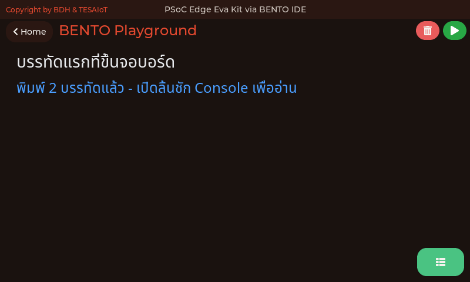 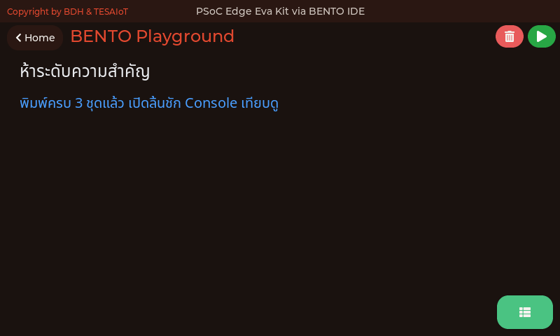 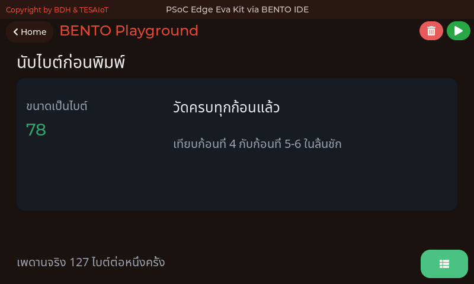

<div style="font-size:.56em;color:#90a4ae"><b>01</b> บรรทัดแรกที่ขึ้นจอบอร์ด · <b>02</b> ทำให้บรรทัดที่ต้องรีบอ่าน เด่นออกมาจากบรรทัดอื่น · <b>03</b> ข้อความยาวเกิน 127 ไบต์ จะถูกตัดหายเงียบ ๆ</div>

<div style="font-size:.52em;color:#78909c;margin-top:.4em">ภาพจากตัวจำลอง bento_sim ซึ่งเรนเดอร์ด้วยโค้ด CM55 ชุดเดียวกับที่รันบนบอร์ด ที่ 800x480 เท่าจอของทั้งสองบอร์ด — แสดง<b>หน้าจอที่ตัวอย่างสร้าง</b> ค่าจากเซนเซอร์ WiFi และไมค์เป็นค่าแทนบนเครื่องโฮสต์ ไม่ใช่ผลการวัดของบอร์ด</div>

---

## หน้าจอของทุกไฟล์ในชุดบทเรียนนี้ (2/5)

<style scoped>
section img { margin: 0 .3em; }
section p { margin: .2em 0; }
</style>

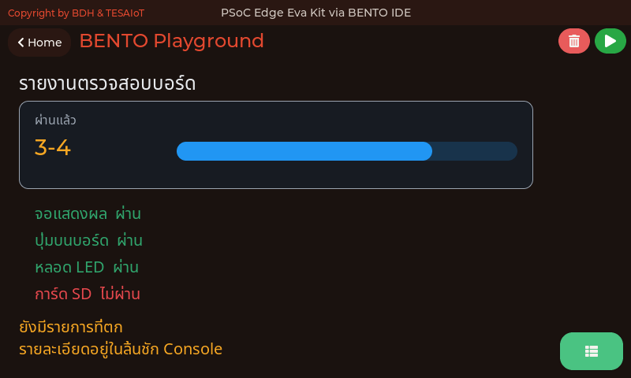 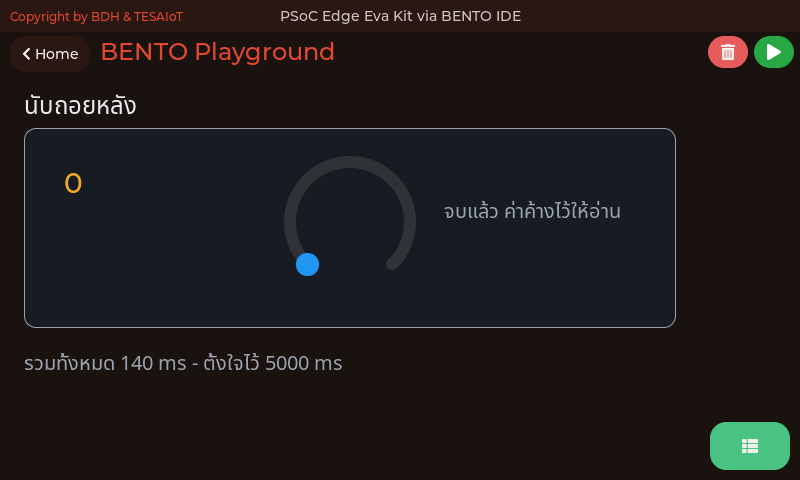 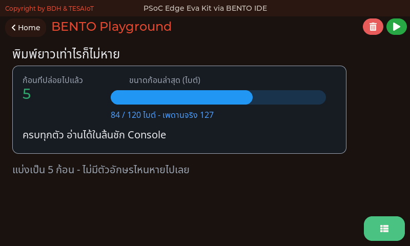

<div style="font-size:.56em;color:#90a4ae"><b>04</b> ลิ้นชัก Console กับการ์ดสรุปที่ไม่ต้องเปิดลิ้นชัก · <b>05</b> อัปเดตซ้ำที่เดิม ต่างจากไล่พิมพ์ลงมา · <b>06</b> ฟังก์ชันช่วยพิมพ์ที่ไม่มีวันโดนตัดเงียบ</div>

<div style="font-size:.52em;color:#78909c;margin-top:.4em">ภาพจากตัวจำลอง bento_sim ซึ่งเรนเดอร์ด้วยโค้ด CM55 ชุดเดียวกับที่รันบนบอร์ด ที่ 800x480 เท่าจอของทั้งสองบอร์ด — แสดง<b>หน้าจอที่ตัวอย่างสร้าง</b> ค่าจากเซนเซอร์ WiFi และไมค์เป็นค่าแทนบนเครื่องโฮสต์ ไม่ใช่ผลการวัดของบอร์ด</div>

---

## หน้าจอของทุกไฟล์ในชุดบทเรียนนี้ (3/5)

<style scoped>
section img { margin: 0 .3em; }
section p { margin: .2em 0; }
</style>

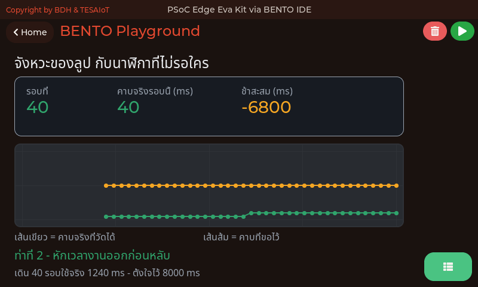 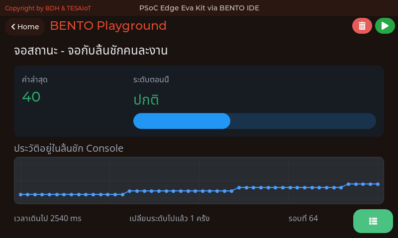 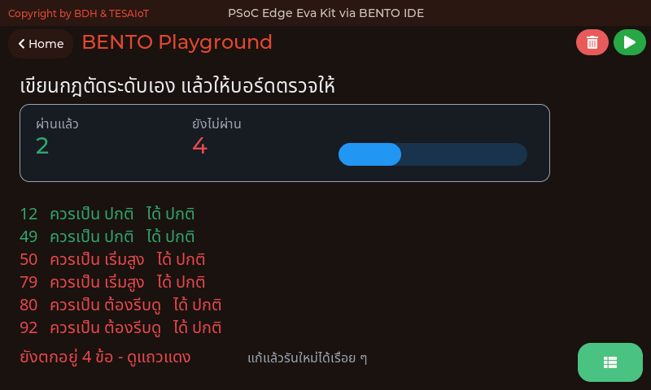

<div style="font-size:.56em;color:#90a4ae"><b>07</b> ลูปที่สั่ง sleep เท่าเดิมทุกรอบ ไม่ได้เดินตรงเวลา · <b>08</b> จอสถานะหนึ่งใบ ที่สามโมดูลแบ่งงานกันทำ · <b>09</b> ไฟล์นี้รันได้ แต่ยังตอบผิดทุกข้อ งานของคุณคือทำให้มันถูก</div>

<div style="font-size:.52em;color:#78909c;margin-top:.4em">ภาพจากตัวจำลอง bento_sim ซึ่งเรนเดอร์ด้วยโค้ด CM55 ชุดเดียวกับที่รันบนบอร์ด ที่ 800x480 เท่าจอของทั้งสองบอร์ด — แสดง<b>หน้าจอที่ตัวอย่างสร้าง</b> ค่าจากเซนเซอร์ WiFi และไมค์เป็นค่าแทนบนเครื่องโฮสต์ ไม่ใช่ผลการวัดของบอร์ด</div>

---

## หน้าจอของทุกไฟล์ในชุดบทเรียนนี้ (4/5)

<style scoped>
section img { margin: 0 .3em; }
section p { margin: .2em 0; }
</style>

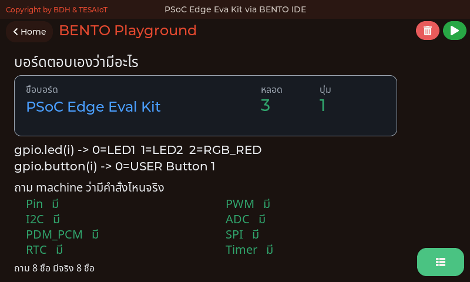 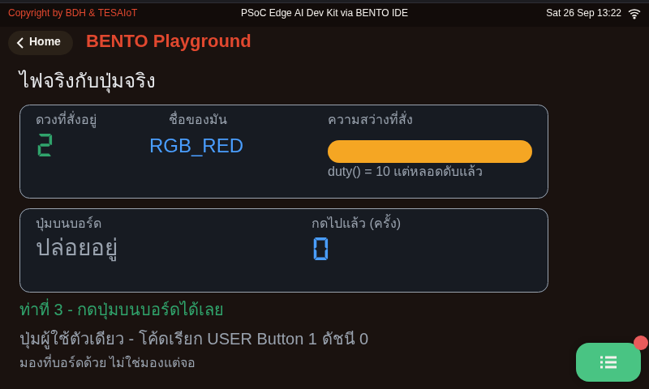 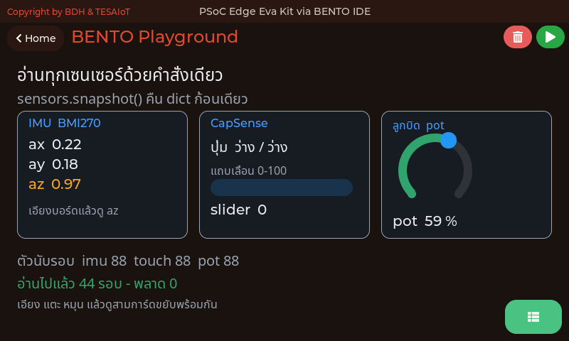

<div style="font-size:.56em;color:#90a4ae"><b>10</b> ถามบอร์ดว่าตัวเองมีอะไร แทนที่จะเปิดคู่มือหา · <b>11</b> หลอดไฟกับปุ่มจริง สั่งได้จาก Python บรรทัดเดียว (ชื่อปุ่มบนจอมาจาก <code>.name()</code> คือ "USER Button 1") · <b>12</b> คำสั่งเดียว ได้ทุกเซนเซอร์พร้อมกัน</div>

<div style="font-size:.52em;color:#78909c;margin-top:.4em">ภาพจากตัวจำลอง bento_sim ซึ่งเรนเดอร์ด้วยโค้ด CM55 ชุดเดียวกับที่รันบนบอร์ด ที่ 800x480 เท่าจอของทั้งสองบอร์ด — แสดง<b>หน้าจอที่ตัวอย่างสร้าง</b> ค่าจากเซนเซอร์ WiFi และไมค์เป็นค่าแทนบนเครื่องโฮสต์ ไม่ใช่ผลการวัดของบอร์ด</div>

---

## หน้าจอของทุกไฟล์ในชุดบทเรียนนี้ (5/5)

<style scoped>
section img { margin: 0 .3em; }
section p { margin: .2em 0; }
</style>

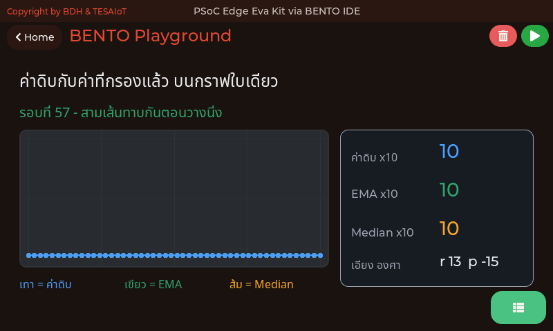 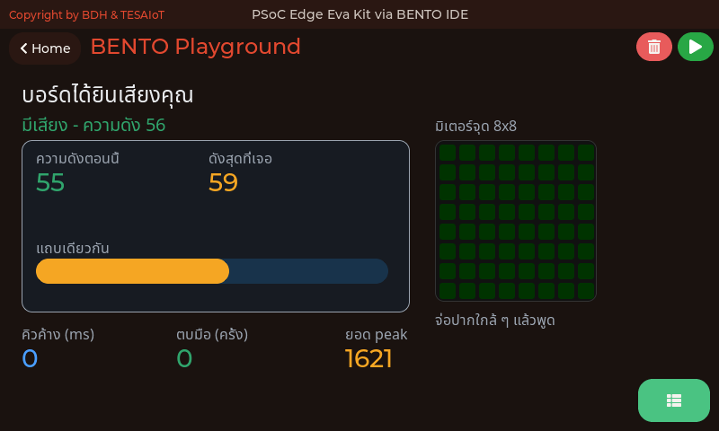 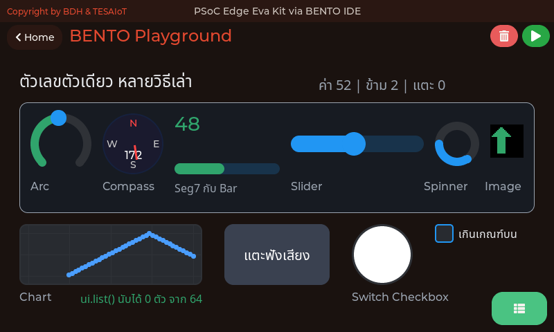

<div style="font-size:.56em;color:#90a4ae"><b>13</b> เส้นดิบที่สั่น กับเส้นเดียวกันที่นิ่ง อยู่บนกราฟใบเดียว · <b>14</b> พูดใส่บอร์ด แล้วดูมันขยับตาม · <b>15</b> ตัวเลขตัวเดียว กับสิบวิธีที่จอเล่ามันออกมา</div>

<div style="font-size:.52em;color:#78909c;margin-top:.4em">ภาพจากตัวจำลอง bento_sim ซึ่งเรนเดอร์ด้วยโค้ด CM55 ชุดเดียวกับที่รันบนบอร์ด ที่ 800x480 เท่าจอของทั้งสองบอร์ด — แสดง<b>หน้าจอที่ตัวอย่างสร้าง</b> ค่าจากเซนเซอร์ WiFi และไมค์เป็นค่าแทนบนเครื่องโฮสต์ ไม่ใช่ผลการวัดของบอร์ด</div>

---

## อ้างอิงและเครดิต

<style scoped>
section { font-size: 16px; }
section p, section li { margin: .04em 0; line-height: 1.26; }
</style>

**เอกสารของผู้ผลิต**

- KIT_PSE84_EVAL PSOC™ Edge E84 Evaluation Kit guide — Infineon, 002-39007 Rev. *B (2025-09-10)
  §3.2.2.12 IMU BMI270 (หน้า 86) · §3.2.2.13 Magnetometer BMM350 (หน้า 87) · §3.2.2.14 Potentiometer และ Thermistor (หน้า 88) · §3.2.2.15 User LEDs (หน้า 88) · §3.2.2.16 Reset and user buttons (หน้า 89) · §3.2.2.5 CAPSENSE™ (หน้า 64) · §3.2.2.7 Audio subsystem (หน้า 72–74)
- PSOC™ Edge E84 product page — Infineon: <https://www.infineon.com/products/microcontroller/32-bit-psoc-arm-cortex/32-bit-psoc-edge-arm/psoc-edge-e84>
- KIT_PSE84_EVAL product page — Infineon: <https://www.infineon.com/product-information/kit_pse84_eval>
- PSOC™ Edge E8x datasheet — Infineon: <https://www.infineon.com/assets/row/public/documents/30/49/infineon-psoc-edge-e8x-consumer-datasheet-datasheet-en.pdf>

**งานวิจัยที่กำหนดรูปร่างของชุดบทเรียนนี้**

- Carroll, J. M. et al. (1987–1990) — งานทดลองแบบมีกลุ่มควบคุมเรื่องคู่มือแบบ minimalist: คู่มือที่ให้ผู้เรียนลงมือทำงานจริงตั้งแต่หน้าแรก ๆ ใช้เวลาเรียนน้อยกว่าและทำงานสำเร็จได้มากกว่าคู่มือที่ให้อ่านทฤษฎีก่อน · นี่คือเหตุผลที่ชุดบทเรียนนี้ให้จับบอร์ดตั้งแต่สไลด์ที่สี่ ไม่ใช่ตอนกลางบทเรียน
- Mayer, R. E. — หลักการ pre-training: การบอก *ชื่อและหน้าที่* ของชิ้นส่วนสั้น ๆ ก่อนลงมือ ช่วยการเรียนอย่างมีนัยสำคัญ · สไลด์ "สามโมดูลที่วันนี้ต้องรู้จัก" ยาวแค่หน้าเดียวด้วยเหตุผลนี้
- ผลสำรวจนักพัฒนามืออาชีพ 80 คนเรื่องตัวอย่างโค้ด — ข้อร้องเรียนอันดับหนึ่งคือตัวอย่างไม่ช่วยให้คิดออกว่าจะประกอบชิ้นส่วนเข้าด้วยกันอย่างไร · นี่คือเหตุผลที่ [`08_status_screen.py`](https://github.com/tesaiot/tesa-qualification-program/blob/main/courses/aiot-micropython/m01-ui-application/l02-first-lines-on-screen/examples/08_status_screen.py) ได้พื้นที่สองสไลด์

**หมายเหตุเรื่องภาพ**

ไดอะแกรม SVG ทุกภาพในเด็คนี้วาดขึ้นใหม่สำหรับหลักสูตรนี้ โดยอ้างอิงตำแหน่งอุปกรณ์และหมายเลขขาจากคู่มือบอร์ดข้างต้น

ภาพถ่ายและภาพเคลื่อนไหวที่นำมาประกอบ มาจาก Wikimedia Commons และหน่วยงานรัฐ ภายใต้สัญญาอนุญาต CC0 · CC BY · CC BY-SA หรือสาธารณสมบัติ ระบุผู้สร้างและสัญญาอนุญาตไว้ใต้ภาพทุกภาพ

ภาพหน้าจอในเด็คนี้มาจากสามแหล่ง และคำบรรยายใต้ภาพระบุไว้ทุกใบว่าใบไหนมาจากไหน — **ภาพถ่ายจากบอร์ด Eva Kit จริง** บันทึกโดยผู้สอน · **ภาพจาก BENTO Emulator** ที่ 800×480 เท่าจอของทั้งสองบอร์ด · และ **ภาพจากตัวจำลอง `bento_sim`** ซึ่งเรนเดอร์ด้วยโค้ด CM55 ชุดเดียวกับที่รันบนบอร์ด แต่ค่าจากเซนเซอร์ WiFi และไมโครโฟนเป็นค่าแทนบนเครื่องโฮสต์ — ภาพจากตัวจำลองแสดง**หน้าจอที่ตัวอย่างสร้าง** ไม่ใช่ผลการวัดของบอร์ด

ข้อเท็จจริงเกี่ยวกับพฤติกรรมของ `lcd` `ui` เมนู และเฟิร์มแวร์ ตรวจสอบจากซอร์สโค้ดของโปรเจกต์ `KIT_PSE84_EVAL_EPC2-MicroPython-BentoClaw` (Eva Kit) `TESAIoT_KIT_PSE84_AI-Micropython-BentoClaw` (Dev Kit) และ `BENTO-TESAIoT-libraries` โดยตรง

> ทุกตัวเลขบนสไลด์นี้สืบกลับไปที่เอกสารต้นทางหรือซอร์สโค้ดได้ ถ้าเจอที่ไม่ตรง บอกผู้สอนได้เลย
