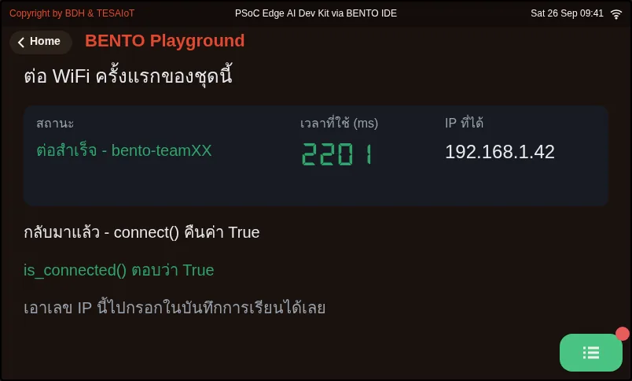
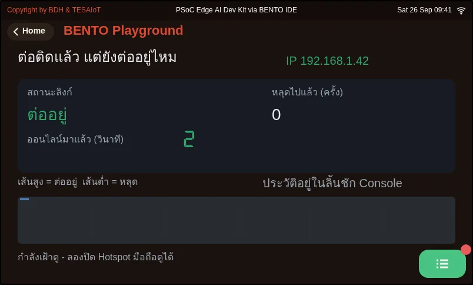
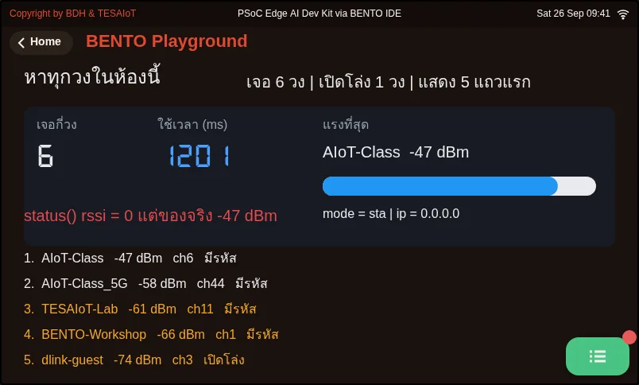

# บทเรียน 1.4 — บอร์ดออกจากโต๊ะ: ต่อ WiFi ครั้งแรก

> โมดูล 1 — แอปพลิเคชันบนจอที่มีอยู่แล้ว · สไลด์: [slides.md](slides.md) · [ภาพรวมโมดูล](../README.md) · [หน้าหลักสูตร](../../README.md)

พาบอร์ดขึ้น WiFi ครั้งแรกด้วย Hotspot มือถือของทีม อ่านเลข IP ของตัวเอง ให้บอร์ดสำรวจคลื่นทั้งห้องเพื่อหาสาเหตุเมื่อต่อไม่ติด แล้วแยก "ต่อติดตอนนั้น" ออกจาก "ยังต่ออยู่ตอนนี้"

## เป้าหมาย

เมื่อจบบทเรียนนี้ คุณจะ:

1. ต่อบอร์ดเข้า Hotspot ของทีมด้วย wifi.connect() โดยขึ้นป้ายสถานะและเรียก ui.poll() ก่อนบรรทัดที่บล็อก แล้วรายงานเวลาที่ใช้เป็น ms ด้วย ticks_diff() พร้อมเลข IP บนจอ ทั้งรอบที่รหัสถูกและรอบที่รหัสผิด
2. ตรวจว่าบอร์ดได้เลข IP จริงแล้วหรือยัง โดยเทียบ wifi.ip() กับ "0.0.0.0" ตรง ๆ และอธิบายได้ว่าทำไม if wifi.ip() จึงผ่านทั้งที่ยังไม่มีเลข
3. ใช้ wifi.scan() แยกกรณี "บอร์ดไม่ได้ยินวง" ออกจาก "ได้ยินแต่ต่อไม่ผ่าน" โดยเรียงผลตาม rssi เอง และเอาความแรงสัญญาณจาก scan() เท่านั้น ไม่ใช่จาก wifi.status()
4. อธิบายความต่างระหว่าง connect() (ตอนนั้นสำเร็จไหม) กับ is_connected() (ตอนนี้ยังต่ออยู่ไหม) และใช้โครงของ 02_link_uptime.py ถามซ้ำทุกรอบ แล้วบันทึกลงลิ้นชัก Console เฉพาะตอนสถานะเปลี่ยน

## ก่อนเริ่ม

WiFi ขององค์กรต้อง login ผ่านหน้าเว็บก่อนใช้งาน แต่บอร์ดไม่มีเบราว์เซอร์ให้กดยอมรับ วันนี้บอร์ดของทุกทีมจึงต่อ **Hotspot มือถือ** ของคนในทีมหนึ่งเครื่อง
ตั้งชื่อ Hotspot เป็นตัวอักษรอังกฤษสั้น ๆ ไม่มีช่องว่าง เช่น `bento-team05` รหัสอย่างน้อย 8 ตัว บน iPhone เปิด **เพิ่มความเข้ากันได้สูงสุด** (Maximize Compatibility)
บน Android เลือกย่าน **2.4 GHz** ถ้ามีให้เลือก แล้วเปิดหน้า Hotspot ค้างไว้ตอนบอร์ดต่อครั้งแรก จากนั้นแก้ `WIFI_SSID` กับ `WIFI_PASS` บนหัวทุกไฟล์ที่ต่อเน็ต
ทบทวนสองเรื่องจากบทเรียน 1.2 ก่อน: `ui.poll()` หลังสร้างหรือแก้ widget และการจับเวลาด้วย `time.ticks_ms()` คู่กับ `ticks_diff()` (ยังไม่ได้ทดสอบกับ Hotspot ครบทุกรุ่น)

- **อุปกรณ์:** บอร์ด Eva Kit หรือ TESAIoT Dev Kit ที่ลงเฟิร์มแวร์ MicroPython ของ BENTO แล้ว หรือ BENTO Emulator ใน [BENTO IDE](https://ide.tesaiot.dev/)
- **เรียนมาก่อน:** [บทเรียน 1.3 — เปิดกล่อง: สองคอร์ งาน AIoT และป้ายของทีม](../l03-inside-the-box/README.md)

## ดูของจริงก่อน

ชุดบทเรียนนี้ของจริงมาก่อนทฤษฎีทุกเรื่อง ถ้าห้องมีบอร์ดหน้าห้องรัน `06_command_comes_back.py` เป็น `team00` อยู่ ให้เปิดหน้ารวม `mqtt_dashboard.html` บนเครื่องตัวเอง
พิมพ์ `team00` ในช่องทีม แล้วกด **บี๊บ** หรือส่งข้อความสั้น ๆ พร้อมกันทั้งห้อง แต่ **เขียนคำทายลงบันทึกการเรียนก่อน** ว่าตัวเลข "ได้รับแล้ว" บนบอร์ดหน้าห้องจะขึ้นเท่าไร
จากนั้นเปิด `01_wifi_first_connect.py` แก้สองบรรทัดบนสุด แล้วส่งขึ้นบอร์ดทันที ระหว่างที่จอนิ่ง นับในใจว่านานแค่ไหน แล้วเทียบกับเลข ms ที่บอร์ดรายงานตอนกลับมา
จอที่นิ่งไปนานไม่ใช่บอร์ดแฮงก์ อย่าเพิ่งกดรีเซ็ต อย่าเพิ่งถอดสาย

## แนวคิด

ชุดบทเรียน 1.4–1.6 เล่าเรื่องเดียวเป็นเจ็ดไฟล์ และมีสองลูกศรที่วิ่งสวนทางกัน: ค่าจริงจากบอร์ดออกไปให้คนอื่นเห็น กับคำสั่งจากที่ไกลกลับมาสั่งของบนโต๊ะเรา
ตรงกลางคือ broker ที่ทำให้สองฝั่งไม่ต้องรู้จักกัน รู้แค่ชื่อหัวข้อเดียวกัน บทเรียนนี้คือตอนแรกของเรื่อง: พาบอร์ดขึ้นวงให้ได้ (ไฟล์ `01` `04`)
และถามให้ถูกว่าลิงก์ยังอยู่ไหม (ไฟล์ `02`) ส่วนการส่งค่าออกและรับคำสั่งกลับอยู่ในบทเรียน 1.5

โมดูล `wifi` ที่ใช้วันนี้มีห้าตัว สามตัวแรกใช้ตอนต่อ และต่างกันที่ **เวลาของคำถาม** ไม่ใช่ที่ข้อมูลที่คืนมา: `wifi.connect(ssid, pw)` บล็อกแล้วคืน `True` หรือ `False`
ตอบว่า "ตอนนั้นสำเร็จไหม" · `wifi.ip()` คืนสตริงเสมอ ไม่เคยคืน `None` · `wifi.is_connected()` ไม่บล็อก ถามได้ทุกรอบ ตอบว่า "ตอนนี้ยังต่ออยู่ไหม"
อีกสองตัวใช้ตอนสำรวจคือ `wifi.scan()` กับ `wifi.status()` ส่วน `disconnect()` `ping()` `softap()` ไว้เรียนในบทเรียน 4.1–4.3 และตรวจเองได้เสมอด้วย `print(dir(wifi))`

`connect()` บล็อกได้นานถึงราว 85 วินาที ระหว่างนั้นจอไม่ขยับเลยแม้แต่พิกเซล ป้ายบอกสถานะกับ `ui.poll()` จึงต้องมา **ก่อน** บรรทัดนั้น
ป้ายที่สร้างไว้แต่ยังไม่ได้เคาะจะไปโผล่หลัง `connect()` จบ ซึ่งคือตอนที่ไม่มีใครต้องการมันแล้ว เราจับเวลาคร่อมบรรทัดนั้นด้วย `ticks_diff()` เพราะ "นานจัง" ไม่ใช่ข้อมูล
ถ้าได้ `False` ไฟล์รายงานแล้ว `raise SystemExit` ทันที โปรแกรมที่พูดเฉพาะตอนสำเร็จจะเงียบในจังหวะที่คนอยากรู้ที่สุด และรหัสผิดใช้เวลา *มากกว่า* รหัสถูก
เพราะบอร์ดลองใหม่ให้เองหลายรอบก่อนจะยอมคืน `False` ระบบจริงจึงต้องมีเพดานว่าจะลองกี่ครั้ง
อีกกับดักหนึ่งไม่มี error ให้จับ: การเข้าร่วมวงกับการได้เลขที่อยู่เป็นคนละขั้น ช่วงที่ยังรอ DHCP `wifi.ip()` คืน `"0.0.0.0"` ซึ่ง Python ถือว่าจริง
`if wifi.ip():` จึงผ่านทั้งที่ยังส่งอะไรออกไม่ได้ ต้องเทียบกับ `"0.0.0.0"` ตรง ๆ เท่านั้น

ก่อนถามว่า "ต่อไม่ติดเพราะอะไร" ต้องตอบให้ได้ก่อนว่า **บอร์ดได้ยินวงนั้นไหม** สองปัญหานี้แก้คนละทาง `wifi.scan()` ไม่ต้องรู้รหัสผ่านของใคร
คืน list ของ `(ssid, rssi, security, channel)` ตามลำดับที่ชิปเจอ ไม่เรียงให้ ต้อง `sort` เอง และบล็อกราว 3 ถึง 10 วินาที (ย่าน 5 GHz นานกว่า)
`rssi` ติดลบเสมอ ยิ่งใกล้ศูนย์ยิ่งแรง ส่วน `wifi.status()` คืน dict ที่มีคีย์ `ssid` กับ `rssi` ก็จริง แต่เฟิร์มแวร์ยัด `""` กับ `0` ไว้ตายตัว
เอาไปวาดกราฟจะได้เส้นศูนย์ตลอดกาลโดยไม่มี error ความแรงจริงมาจาก `scan()` เท่านั้น

`02_link_uptime.py` ไม่มีคำสั่งใหม่เลย โครงเป็นของ `08_status_screen.py` จากบทเรียน 1.2 เปลี่ยนแค่ต้นทางของค่า: ถาม `is_connected()` ใหม่ทุกรอบ
จอตอบว่า "ตอนนี้เป็นอย่างไร" (ป้าย IP วินาทีที่ออนไลน์ เส้นกราฟ) ลิ้นชักตอบว่า "ที่ผ่านมาเกิดอะไร" และเขียนเฉพาะตอนสถานะเปลี่ยน
`last = -1` แปลว่ายังไม่เคยรู้สถานะมาก่อน รอบแรกจึงนับเป็นการเปลี่ยนเสมอ ถามครั้งเดียวตอนต้นแล้วเชื่อไปตลอด คือการรายงานสถานะของอดีต

## ตัวอย่างสมบูรณ์

สไลด์เดินตามลำดับ `01_wifi_first_connect.py` → `04_scan_the_room.py` → `02_link_uptime.py` (ไฟล์ `03` อยู่ในบทเรียน 1.5)
ใน `01` **ทำนายก่อนรัน** ว่าจอจะนิ่งนานเท่าไร แล้วเทียบกับเลข ms บนจอ จากนั้นอ่านว่าป้ายกับ `ui.poll()` อยู่ก่อนบรรทัด `connect()` อย่างไร
ถ้าบอร์ดหา Hotspot ไม่เจอ อย่าเพิ่งเดา ให้รัน `04` ดูว่าบอร์ดได้ยินชื่อวงของทีมไหม ในไฟล์นี้สังเกตบรรทัด `nets.sort(...)`
และบรรทัดที่เอา `status()["rssi"]` มาเทียบกับความแรงจริงให้เห็นกับตา ส่วน `02` ให้ปล่อยเฝ้าดูครบ 30 วินาที แล้วเปิดลิ้นชักอ่านประวัติ
ทุกไฟล์จบด้วยบล็อก **ตาคุณ** ให้แก้หรือทดลองแล้วรันซ้ำ

| ไฟล์ | ไฟล์นี้สอน |
|---|---|
| [examples/01_wifi_first_connect.py](examples/01_wifi_first_connect.py) | พาบอร์ดออกเน็ตครั้งแรก แล้วอ่านเลขที่อยู่ของมัน |
| [examples/02_link_uptime.py](examples/02_link_uptime.py) | ต่อติดแล้ว กับยังต่ออยู่ ไม่ใช่คำถามเดียวกัน |
| [examples/04_scan_the_room.py](examples/04_scan_the_room.py) | ให้บอร์ดฟังคลื่นทั้งห้อง แล้วบอกว่าใครอยู่ตรงไหนบ้าง |

สไลด์ของบทเรียนนี้อ้างถึงไฟล์ที่อยู่ในบทเรียนอื่นด้วย:

- [m01-ui-application/l02-first-lines-on-screen/examples/08_status_screen.py](../l02-first-lines-on-screen/examples/08_status_screen.py) — จอสถานะหนึ่งใบ ที่สามโมดูลแบ่งงานกันทำ
- [m01-ui-application/l05-values-out-commands-back/examples/05_value_leaves_the_board.py](../l05-values-out-commands-back/examples/05_value_leaves_the_board.py) — ค่าที่วัดได้บนโต๊ะนี้ ไปโผล่บนเครื่องคนอื่น
- [m01-ui-application/l05-values-out-commands-back/examples/06_command_comes_back.py](../l05-values-out-commands-back/examples/06_command_comes_back.py) — คนอื่นพิมพ์คำสั่งจากที่ไกล แล้วไฟบนโต๊ะเราติด
- [m04-iot-connectivity/l03-network-status-lab/examples/04_ping_two_targets.py](../../m04-iot-connectivity/l03-network-status-lab/examples/04_ping_two_targets.py) — เกตเวย์ตอบ แต่อินเทอร์เน็ตไม่ตอบ แปลว่าอะไร
- [shared/web/my_first_reader.html](../../shared/web/my_first_reader.html) — อ่านค่าจากบอร์ด

**ภาพจอจาก BENTO Emulator** ของตัวอย่างในบทนี้ (คลิกชื่อไฟล์เพื่อเปิดโค้ด)

<figure><figcaption><a href="examples/01_wifi_first_connect.py"><code>01_wifi_first_connect.py</code></a> พาบอร์ดออกเน็ตครั้งแรก แล้วอ่านเลขที่อยู่ของมัน</figcaption></figure>
<figure><figcaption><a href="examples/02_link_uptime.py"><code>02_link_uptime.py</code></a> ต่อติดแล้ว กับยังต่ออยู่ ไม่ใช่คำถามเดียวกัน</figcaption></figure>
<figure><figcaption><a href="examples/04_scan_the_room.py"><code>04_scan_the_room.py</code></a> ให้บอร์ดฟังคลื่นทั้งห้อง แล้วบอกว่าใครอยู่ตรงไหนบ้าง</figcaption></figure>

## เช็กความเข้าใจ

คำถามชุดเดียวกันอยู่ใน [quiz.yaml](quiz.yaml) สำหรับระบบที่ตรวจอัตโนมัติ

1. คุณสร้าง ui.Label ข้อความ "กำลังต่อ" แล้วเรียก wifi.connect() ทันทีโดยไม่ได้เรียก ui.poll() คนที่ยืนดูจอจะเห็นอะไร *(เลือกหนึ่งข้อ · เป้าหมายข้อ 1)*
   - ก) จอนิ่งโดยไม่มีป้ายตลอดช่วงที่รอ แล้วป้ายไปโผล่หลัง connect() จบ ซึ่งสายเกินไปแล้ว
   - ข) ป้ายขึ้นทันที เพราะ connect() เรียก ui.poll() ให้เองระหว่างรอ
   - ค) ได้ error เพราะห้ามสร้าง widget ก่อนต่อ WiFi
   - ง) ป้ายขึ้นแล้วหายไปเองเมื่อ connect() คืน True

   

เฉลย

   **ก** — connect() บล็อกได้นานถึงราว 85 วินาทีและจอไม่ขยับเลยระหว่างนั้น ป้ายที่ยังไม่ได้เคาะ ui.poll() จะไปโผล่หลัง connect() จบ ป้ายกับ ui.poll() จึงต้องมาก่อนบรรทัดที่บล็อก

   

2. ทีมหนึ่งพิมพ์รหัสผ่านผิดไปหนึ่งตัว แล้วพบว่า connect() ใช้เวลานานกว่ารอบที่รหัสถูกมาก เหตุผลคืออะไร *(เลือกหนึ่งข้อ · เป้าหมายข้อ 1)*
   - ก) บอร์ดไม่ได้ยอมแพ้ตั้งแต่ครั้งแรก มันลองใหม่ให้เองหลายรอบก่อนจะคืน False
   - ข) บอร์ดแฮงก์ ต้องกดรีเซ็ตเสมอเมื่อรหัสผิด
   - ค) ticks_diff() นับผิดเมื่อ connect() คืน False
   - ง) Hotspot ส่งรหัสที่ถูกกลับมาให้บอร์ดลองใหม่ จึงช้า

   

เฉลย

   **ก** — ความล้มเหลวแพงกว่าความสำเร็จในงานเครือข่าย เพราะมีการลองใหม่ซ่อนอยู่หลายรอบ นี่คือเหตุผลที่ระบบจริงต้องมีเพดานว่าจะลองกี่ครั้ง

   

3. ลิงก์ขึ้นแล้วแต่ยังรอ DHCP อยู่ โค้ดแบบไหนจับได้ถูกว่าบอร์ดยังไม่มีเลข IP *(เลือกหนึ่งข้อ · เป้าหมายข้อ 2)*
   - ก) if not wifi.ip()
   - ข) if wifi.ip() is None
   - ค) if wifi.ip() == "0.0.0.0"
   - ง) if wifi.ip() == ""

   

เฉลย

   **ค** — wifi.ip() คืนสตริงเสมอ ไม่เคยคืน None และตอนยังไม่มีที่อยู่มันคืน "0.0.0.0" ซึ่งไม่ใช่สตริงว่าง Python จึงถือว่าจริง ต้องเทียบกับ "0.0.0.0" ตรง ๆ เท่านั้น

   

4. ข้อใดถูกต้องเกี่ยวกับ wifi.scan() และ wifi.status() เลือกทุกข้อที่ถูก *(เลือกได้หลายข้อ · เป้าหมายข้อ 3)*
   - ก) scan() สแกนได้โดยไม่ต้องรู้รหัสผ่านของวงไหนเลย
   - ข) scan() คืนรายชื่อเรียงจากแรงไปอ่อนมาให้แล้ว
   - ค) status()["rssi"] ตอบ 0 เท่าเดิมเสมอ ความแรงจริงต้องมาจาก scan()
   - ง) rssi ยิ่งติดลบมาก สัญญาณยิ่งแรง

   

เฉลย

   **ก, ค** — scan() ไม่ต้องรู้รหัสผ่านใคร แต่คืนตามลำดับที่ชิปเจอ ต้อง sort เอง rssi ติดลบเสมอและยิ่งใกล้ศูนย์ยิ่งแรง ส่วนคีย์ ssid กับ rssi ของ status() เป็นค่าตายตัว "" กับ 0

   

5. จอที่แขวนหน้างานต้องบอกคนเดินผ่านว่าบอร์ดยังออนไลน์อยู่ไหม และเก็บประวัติว่าหลุดตอนไหน วิธีใดถูกต้อง *(เลือกหนึ่งข้อ · เป้าหมายข้อ 4)*
   - ก) เก็บค่าที่ connect() คืนมาตอนต้นโปรแกรม แล้วแสดงค่านั้นไปตลอด
   - ข) ถาม is_connected() ใหม่ทุกรอบ อัปเดตจอทุกรอบ และพิมพ์ลงลิ้นชักเฉพาะตอนสถานะเปลี่ยน
   - ค) ถาม is_connected() ทุกรอบ แล้วพิมพ์ลงลิ้นชักทุกรอบด้วย ประวัติจะได้ครบ
   - ง) เรียก connect() ซ้ำทุกรอบเพื่อยืนยันว่ายังต่ออยู่

   

เฉลย

   **ข** — connect() ตอบว่าตอนนั้นสำเร็จไหม ส่วน is_connected() ตอบว่าตอนนี้ยังต่ออยู่ไหม จอต้องตอบเรื่องปัจจุบันจึงถามซ้ำทุกรอบ ถ้ายิงลงลิ้นชักทุกรอบจะได้บรรทัดเดิมซ้ำสามสิบบรรทัดจนหาไม่เจอว่าหลุดตอนไหน

   

## แล็บ

**ขึ้นวงให้ได้ แล้วพิสูจน์ด้วยตัวเลข** จดผลลงบันทึกการเรียนทุกข้อ

- [ ] ตั้ง Hotspot ตามตาราง (ชื่อภาษาอังกฤษ รหัสอย่างน้อย 8 ตัว 2.4 GHz หรือ Maximize Compatibility) แล้วแก้ `WIFI_SSID` `WIFI_PASS`
- [ ] `01`: จอขึ้นเวลาที่ใช้เป็น ms และเลข IP ของบอร์ด จดทั้งสองค่า พร้อมเวลาที่นับในใจระหว่างรอ
- [ ] `01` ตาคุณ: พิมพ์รหัสผ่านผิดหนึ่งตัวแล้วรันใหม่ จดเวลาเทียบกับรอบที่ถูก แล้วเขียนคำอธิบายว่าทำไมรอบที่ผิดนานกว่า
- [ ] `04` ตาคุณ: เดินถือบอร์ดไปสุดห้องแล้วรันซ้ำ จดชื่อวงเดิมกับตัวเลข dBm ทั้งสองจุด แล้วดูว่าอันดับของมันเลื่อนไหม
- [ ] `02` ตาคุณ: ระหว่างที่โปรแกรมเฝ้าดู เดินถือบอร์ดออกไปจนสุดห้องแล้วเดินกลับ เปิดลิ้นชักนับบรรทัด และจดว่าหลุดตอนวินาทีที่เท่าไร (ลิ้นชักว่างแปลว่าลิงก์ไม่เคยหลุด ไม่ใช่โปรแกรมไม่ทำงาน)

## ไปต่อ

บทเรียน 1.5 เริ่มจากไฟล์ `03` ให้ทีมเขียนกฎเองว่าลิงก์แบบไหนเรียกว่าใช้ได้ แล้วพาค่าลูกบิดจริงออกไปที่ `broker.hivemq.com` ด้วย `mqtt` และ `json`
และรับคำสั่งจากหน้าเว็บกลับมาสั่งหลอดไฟบนบอร์ด เก็บเลข IP กับชื่อ Hotspot ของทีมไว้ในบันทึกการเรียน เพราะจะใช้ต่อทันที

บทเรียนถัดไป: [บทเรียน 1.5 — ค่าออกไป คำสั่งกลับมา: MQTT บน broker สาธารณะ](../l05-values-out-commands-back/README.md)

## สะท้อนคิด

- ในงานของคุณมีจุดไหนบ้างที่ถ้าล้มเหลว จอจะเงียบ แล้วคนดูจะรู้ได้อย่างไรว่าหยุดที่ขั้นไหน
- ถ้าบอร์ดลองต่อใหม่ไปเรื่อย ๆ โดยไม่มีเพดาน ระบบที่ติดอยู่หน้างานจะเสียอะไรบ้าง
- จอที่แขวนอยู่หน้างานของคุณกำลังตอบเรื่องปัจจุบัน หรือเรื่องที่เป็นจริงแค่ตอนเปิดเครื่อง
