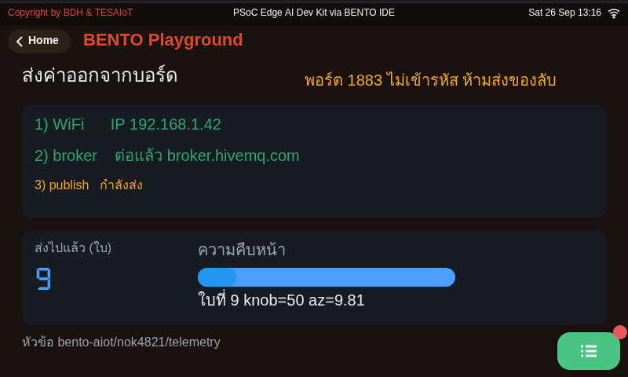

<style>
section { font-size: 24px; padding: 40px 52px; justify-content: flex-start; }
section h1 { font-size: 1.45em; line-height: 1.12; margin: 0 0 .22em; }
section h2 { font-size: 1.12em; margin: .15em 0; }
section h3 { font-size: 1.0em; margin: .12em 0; }
section p, section li { margin: .16em 0; line-height: 1.32; }
section img { max-width: 100%; height: auto; }
section svg { max-height: 252px; width: 100%; }
section iframe { border: 0; border-radius: 8px; box-shadow: 0 2px 10px rgba(0,0,0,.28); float: left; margin: 0 14px 4px 0; }
section blockquote { clear: both; }
section table { font-size: .78em; }
section pre { font-size: .70em; line-height: 1.32; background:#0d1117; color:#e6edf3; border:1px solid #30363d; border-radius:8px; padding:12px 16px; box-shadow:0 2px 8px rgba(0,0,0,.25); }
section pre code { white-space: pre-wrap; background:transparent; color:inherit; } section pre .hljs-comment{color:#8b949e;font-style:italic} section pre .hljs-keyword,section pre .hljs-built_in,section pre .hljs-literal{color:#ff7b72} section pre .hljs-string{color:#a5d6ff} section pre .hljs-number{color:#79c0ff} section pre .hljs-title,section pre .hljs-title.function_,section pre .hljs-section{color:#d2a8ff} section pre .hljs-meta{color:#ffa657} section pre .hljs-attr,section pre .hljs-attribute,section pre .hljs-name{color:#7ee787}
section blockquote { margin: .25em 0; font-size: .92em; }
/* two images on a line (parity / 2x2 grids) stay side-by-side and small */
section p > img + img { margin-left: 10px; }
/* scroll-within-slide: dense slides scroll instead of clipping */
section { overflow-y: auto; overflow-x: hidden; }
section::-webkit-scrollbar { width: 11px; }
section::-webkit-scrollbar-thumb { background:#4a90d9; border-radius:6px; }
section::-webkit-scrollbar-track { background:rgba(0,0,0,.06); }
/* image drop-shadow + cover-slide readability (auto) */
section img{filter:drop-shadow(0 3px 12px rgba(0,0,0,.5))}
/* พื้นสำรองของสไลด์ปก: ถ้า img/cover_sNN.svg โหลดไม่ขึ้น ธีมจะคืนพื้นขาว
   แล้วตัวอักษรสีขาวของปกจะหายไปทั้งแผ่น — ปักสีเข้มไว้ให้ภาพเป็นแค่ของประดับ */
section.cover{background-color:#0b1426}
section.cover *{color:#fff !important}
section.cover h1,section.cover h2,section.cover h3,section.cover p,section.cover li,section.cover strong,section.cover em,section.cover blockquote,section.cover div{text-shadow:0 2px 9px rgba(0,0,0,.92),0 0 3px rgba(0,0,0,.8)}
section.cover div[style*="background:#"],section.cover div[style*="background: #"]{background:rgba(10,14,20,.66) !important;border-color:rgba(120,200,255,.45) !important;max-width:62%}
section.cover blockquote{border-left:4px solid rgba(120,200,255,.6) !important;background:rgba(13,17,23,.55) !important;border-radius:6px;padding:.3em .6em}
section.cover h1,section.cover h2,section.cover h3,section.cover p,section.cover blockquote{max-width:60%}
section.cover div:not(:has(img)){max-width:62%}
section.cover img{filter:none}
</style>


<!-- _class: cover -->

# บทเรียน 1.4 — บอร์ดออกจากโต๊ะ: ต่อ WiFi ครั้งแรก

## ค่าที่วัดบนโต๊ะนี้ไปโผล่บนเครื่องคนอื่น แล้วคำสั่งจากที่ไกลกลับมาสั่งของบนโต๊ะเรา

**โมดูล 1 — แอปพลิเคชันบนจอที่มีอยู่แล้ว**

> คาถาประจำบทเรียน: **ชุดบทเรียนก่อนหน้าบอร์ดพูดกับเรา ชุดบทเรียนนี้มันพูดกับคนที่ไม่ได้อยู่ในห้องนี้**

---

## ดูของจริงก่อน — วันนี้ค่าหนึ่งค่าจะเดินทางออกจากโต๊ะนี้

<svg viewBox="0 0 940 230" xmlns="http://www.w3.org/2000/svg">
  <defs><marker id="a1" markerWidth="12" markerHeight="9" refX="12" refY="4.5" orient="auto" markerUnits="userSpaceOnUse">
    <path d="M0,0 L12,4.5 L0,9 z" fill="#2e7d32" /></marker>
  <marker id="a2" markerWidth="12" markerHeight="9" refX="12" refY="4.5" orient="auto" markerUnits="userSpaceOnUse">
    <path d="M0,0 L12,4.5 L0,9 z" fill="#6a1b9a" /></marker></defs>
  <text x="470" y="24" text-anchor="middle" font-size="20" font-weight="700" fill="#37474f">เรื่องทั้งบทเรียนมีสองลูกศร และมันวิ่งสวนทางกัน</text>
  <rect x="20" y="44" width="230" height="120" rx="10" fill="#e8f5e9" stroke="#2e7d32" stroke-width="2.5" />
  <text x="135" y="74" text-anchor="middle" font-size="20" font-weight="700" fill="#2e7d32">บอร์ดบนโต๊ะเรา</text>
  <text x="135" y="102" text-anchor="middle" font-size="18" fill="#1b5e20">หมุนลูกบิดจริง</text>
  <text x="135" y="128" text-anchor="middle" font-size="18" fill="#1b5e20">หลอด LED จริง</text>
  <text x="135" y="152" text-anchor="middle" font-size="17" fill="#4a7c4e">sensors · gpio</text>
  <rect x="355" y="44" width="230" height="120" rx="10" fill="#eceff1" stroke="#455a64" stroke-width="2.5" />
  <text x="470" y="74" text-anchor="middle" font-size="20" font-weight="700" fill="#455a64">ที่พักข้อความ</text>
  <text x="470" y="102" text-anchor="middle" font-size="18" fill="#37474f">broker.hivemq.com</text>
  <text x="470" y="128" text-anchor="middle" font-size="18" fill="#37474f">ใครฟังหัวข้อไหน ก็ได้ของ</text>
  <text x="470" y="152" text-anchor="middle" font-size="17" fill="#78909c">สาธารณะ ไม่ต้องตั้งเอง</text>
  <rect x="690" y="44" width="230" height="120" rx="10" fill="#e3f2fd" stroke="#1565c0" stroke-width="2.5" />
  <text x="805" y="74" text-anchor="middle" font-size="20" font-weight="700" fill="#1565c0">คนที่อยู่คนละที่</text>
  <text x="805" y="102" text-anchor="middle" font-size="18" fill="#0d47a1">เห็นเลขของเราขยับ</text>
  <text x="805" y="128" text-anchor="middle" font-size="18" fill="#0d47a1">แล้วพิมพ์คำสั่งกลับมา</text>
  <text x="805" y="152" text-anchor="middle" font-size="17" fill="#5472a3">หน้าเว็บ ไม่ต้องลงโปรแกรม</text>
  <line x1="252" y1="78" x2="352" y2="78" stroke="#2e7d32" stroke-width="3.5" marker-end="url(#a1)" />
  <line x1="587" y1="78" x2="687" y2="78" stroke="#2e7d32" stroke-width="3.5" marker-end="url(#a1)" />
  <line x1="688" y1="140" x2="588" y2="140" stroke="#6a1b9a" stroke-width="3.5" marker-end="url(#a2)" />
  <line x1="353" y1="140" x2="253" y2="140" stroke="#6a1b9a" stroke-width="3.5" marker-end="url(#a2)" />
  <text x="470" y="192" text-anchor="middle" font-size="19" font-weight="700" fill="#2e7d32">เขียวคือไฟล์ 05 ค่าออกไป</text>
  <text x="470" y="216" text-anchor="middle" font-size="19" font-weight="700" fill="#6a1b9a">ม่วงคือไฟล์ 06 คำสั่งกลับมา</text>
</svg>

ชุดบทเรียนก่อนหน้าทุกอย่างจบอยู่บนจอบอร์ด เราสั่ง บอร์ดตอบ แล้วก็จบกันตรงนั้น วันนี้เราจะพาของออกจากโต๊ะนี้ไปให้คนอื่นเห็น แล้วเปิดทางให้เขาสั่งของบนโต๊ะเรากลับมาได้ด้วย

ตรงกลางภาพคือ **สิ่งที่ทำให้สองฝั่งไม่ต้องรู้จักกัน** เราไม่ต้องรู้ว่าใครจะมาอ่านค่าของเรา และคนที่สั่งกลับมาก็ไม่ต้องรู้ว่าบอร์ดเราอยู่ที่ไหนบนโลก ทั้งคู่รู้แค่ชื่อหัวข้อเดียวกัน

> ระบบ IoT จริงทั้งโลกวางบนภาพนี้ ไม่ว่าจะเป็นมิเตอร์ไฟหน้าบ้าน หรือรถบรรทุกที่วิ่งอยู่อีกจังหวัด

---

<style scoped>section p, section li { font-size:.9em;line-height:1.28 } section li { margin:.04em 0 } section blockquote { font-size:.78em;margin:.06em 0 }</style>

## ปลายทางของชุดบทเรียนนี้ — และภาพจริงภาพเดียวที่เรามีตอนนี้



<div style="font-size:.55em;color:#78909c;margin-top:-.3em">หน้าจอจริงจากการรัน <a href="https://github.com/tesaiot/tesa-qualification-program/blob/main/courses/aiot-micropython/m01-ui-application/l05-values-out-commands-back/examples/05_value_leaves_the_board.py"><code>05_value_leaves_the_board.py</code></a> บน BENTO Emulator ที่ 800x480 เท่าจอของทั้งสองบอร์ด ถ่ายจากไฟล์ปัจจุบันโดยตั้ง `TEAM = "nok4821"` — ภาพนี้แสดงหน้าตาจอ ไม่ใช่หลักฐานว่าบอร์ดจริงส่งผ่านเน็ตของห้องได้</div>

- ภาพนี้คือไฟล์ที่ 4 ของชุดบทเรียน และคือปลายทางจริง: **บันไดสามขั้น** — WiFi ได้ IP · broker ต่อแล้วที่ `broker.hivemq.com` · publish กำลังส่ง — เลขใบที่ส่งเดินขึ้นพร้อมค่าลูกบิดและค่าเอียง `az` ที่เพิ่งออกจากบอร์ดไป
- แถวล่างคือหัวข้อที่ส่งขึ้น broker (`bento-aiot/<TEAM>/telemetry`) และมุมขวาบนคือคำเตือนที่ไฟล์เขียนไว้บนจอตลอดเวลาที่รัน — พอร์ต 1883 ไม่เข้ารหัส ห้ามส่งของลับ
- ภาพนี้เกิดได้ต่อเมื่อเน็ตของห้องปล่อยพอร์ต 1883 ออกไปถึง `broker.hivemq.com` — ถ้าถูกกัน ขั้นที่ 2 จะเป็นแดงพร้อมบอกเหตุผล แล้วโปรแกรมจบตรงนั้นอย่างสุภาพ ส่วนฝั่งผู้รับ วันนี้คือหน้าเว็บ [`my_first_reader.html`](https://github.com/tesaiot/tesa-qualification-program/blob/main/courses/aiot-micropython/shared/web/my_first_reader.html) ไม่ต้องลงโปรแกรมใดในเครื่อง

> **ยังไม่มีใครรันไฟล์ 05 กับ 06 บนบอร์ดกับ broker.hivemq.com** สิ่งที่วัดแล้วคือเวลาไปกลับของ broker จาก Mac บนโต๊ะผู้สอน ไม่ใช่จากเน็ตขององค์กร ถ้าไปไม่ถึง ไฟล์จะขึ้นบนจอตรง ๆ ว่าหยุดที่ขั้นไหนและเพราะอะไร — ผลแบบนั้นก็ยังเป็นผลที่ใช้ได้

---

## เจ็ดไฟล์ · เรื่องเดียวเล่าเป็นเจ็ดตอน

<svg viewBox="0 0 940 246" xmlns="http://www.w3.org/2000/svg">
  <text x="470" y="22" text-anchor="middle" font-size="20" font-weight="700" fill="#37474f">ชุดบทเรียนนี้ไม่ได้สอนโมดูล wifi มันพาบอร์ดไปให้ถึงคนอื่น</text>
  <rect x="20" y="38" width="292" height="88" rx="9" fill="#e8f5e9" stroke="#2e7d32" stroke-width="2.5"/>
  <text x="166" y="64" text-anchor="middle" font-size="19" font-weight="700" fill="#2e7d32">ตอนที่หนึ่ง · ขึ้นวงให้ได้</text>
  <text x="166" y="90" text-anchor="middle" font-size="18" fill="#1b5e20">01 ต่อ · 04 ฟังทั้งห้อง</text>
  <text x="166" y="114" text-anchor="middle" font-size="17" fill="#4a7c4e">wifi · lcd · ui · time</text>
  <rect x="324" y="38" width="292" height="88" rx="9" fill="#e3f2fd" stroke="#1565c0" stroke-width="2.5"/>
  <text x="470" y="64" text-anchor="middle" font-size="19" font-weight="700" fill="#1565c0">ตอนที่สอง · เชื่อได้แค่ไหน</text>
  <text x="470" y="90" text-anchor="middle" font-size="18" fill="#0d47a1">02 เฝ้าลิงก์ · 03 เขียนกฎเอง</text>
  <text x="470" y="114" text-anchor="middle" font-size="17" fill="#5472a3">ของเดิมทั้งชุด ไม่มีคำสั่งใหม่</text>
  <rect x="628" y="38" width="292" height="88" rx="9" fill="#f3e5f5" stroke="#6a1b9a" stroke-width="3"/>
  <text x="774" y="64" text-anchor="middle" font-size="19" font-weight="700" fill="#6a1b9a">ตอนที่สาม · ออกไปถึงคนอื่น</text>
  <text x="774" y="90" text-anchor="middle" font-size="18" fill="#4a148c">05 ส่งออก · 06 รับกลับ · 07 จำเอง</text>
  <text x="774" y="114" text-anchor="middle" font-size="17" fill="#7e5a94">mqtt · json · sensors · gpio</text>
  <line x1="314" y1="82" x2="322" y2="82" stroke="#90a4ae" stroke-width="3"/>
  <line x1="618" y1="82" x2="626" y2="82" stroke="#90a4ae" stroke-width="3"/>
  <rect x="20" y="146" width="900" height="52" rx="8" fill="#fff8e1" stroke="#f57f17" stroke-width="2.5"/>
  <text x="470" y="170" text-anchor="middle" font-size="19" font-weight="700" fill="#e65100">โมดูลที่ชุดบทเรียนนี้แตะจริงทั้งหมด</text>
  <text x="470" y="192" text-anchor="middle" font-size="18" fill="#a1683a">wifi · mqtt · tesaiot · json · sensors · gpio · lcd · ui · time</text>
  <text x="470" y="226" text-anchor="middle" font-size="18" fill="#78909c">สี่ตัวแรกเป็นของใหม่วันนี้ ห้าตัวหลังคือของเดิมจากชุดบทเรียนก่อนหน้าที่กลับมาใช้อีก</text>
</svg>

สี่โมดูลใหม่วันนี้ทำหน้าที่คนละอย่างกันชัดเจน `wifi` พาบอร์ดขึ้นวง · `mqtt` ส่งข้อความออกและรับกลับ · `json` แปลงข้อมูลของเราให้เป็นข้อความที่ทุกภาษาอ่านได้ · `tesaiot` เก็บค่าตั้งไว้บนแฟลชของบอร์ดเอง

ที่เหลือเป็นของเดิม `sensors` อ่านลูกบิด `gpio` สั่งหลอดไฟ ส่วน `lcd` `ui` `time` คือชุดเดิมจากชุดบทเรียนก่อนหน้าทุกประการ

> ไม่ต้องจำรายชื่อนี้ตอนนี้ แต่ละไฟล์จะแนะนำของของมันเองตอนที่ถึงคิว

---

## เป้าหมายของชุดบทเรียนนี้

1. พาบอร์ดขึ้นเครือข่ายด้วย `wifi.connect()` แล้วอ่านหมายเลข IP ของบอร์ดตัวเองได้
2. ให้บอร์ดสำรวจคลื่นทั้งห้องด้วย `wifi.scan()` แล้ววินิจฉัยเองได้ว่าต่อไม่ติดเพราะอะไร
3. แยก "ต่อติดตอนนั้น" ออกจาก "ยังต่ออยู่ตอนนี้" แล้วเขียนกฎเองว่าลิงก์แบบไหนเรียกว่าใช้ได้
4. **ส่งค่าจริงจากบอร์ดออกไปให้เครื่องอื่นเห็น แล้วรับคำสั่งจากที่ไกลกลับมาสั่งของบนบอร์ด**

ปลายทางของวันนี้: จอบอร์ดขึ้นหมายเลข IP ของทีม เลขใบที่ส่งออกไปเดินขึ้น และหลอดไฟบนบอร์ดติดเพราะมีคนพิมพ์คำสั่งมาจากอีกเครื่อง

> **เปิดบอร์ดรอไว้ได้เลย** เล่นเกมเปิดบทเรียนเสร็จ เรารันไฟล์แรกทันที — ชุดบทเรียนนี้ทฤษฎีมาทีหลังของจริงทุกเรื่อง

---

<style scoped>section p, section li { font-size:.86em;line-height:1.3;margin:.05em 0 } section table { font-size:.72em } section blockquote { font-size:.78em;margin:.08em 0 }</style>

## ก่อนเริ่ม — ทุกทีมเปิด Hotspot มือถือให้บอร์ด

**WiFi ขององค์กรต้อง login ผ่านหน้าเว็บก่อนใช้งาน บอร์ดไม่มีเบราว์เซอร์ให้กดยอมรับ** บอร์ดจะได้เลข IP แต่ออกอินเทอร์เน็ตไม่ได้ ไปไม่ถึง broker · วันนี้**บอร์ดของทุกทีมต่อ Hotspot จากมือถือของคนในทีม**หนึ่งเครื่อง

| ขั้น | iPhone | Android |
|---|---|---|
| 1 · ตั้งชื่อ | ชื่อ Hotspot คือชื่อเครื่อง: การตั้งค่า > ทั่วไป > เกี่ยวกับ > ชื่อ ตั้งเป็น `bento-team05` | การตั้งค่า Hotspot > ชื่อเครือข่าย ตั้งเป็น `bento-team05` |
| 2 · ตั้งรหัส | ฮอตสปอตส่วนบุคคล > รหัสผ่าน Wi-Fi (อย่างน้อย 8 ตัว) | รหัสผ่าน อย่างน้อย 8 ตัว ความปลอดภัย WPA2 |
| 3 · ย่านความถี่ | เปิด **เพิ่มความเข้ากันได้สูงสุด** (Maximize Compatibility) | เลือกย่าน **2.4 GHz** ถ้ามีให้เลือก |
| 4 · เปิดค้าง | เปิดหน้าฮอตสปอตค้างไว้ตอนบอร์ดต่อครั้งแรก | เปิด Hotspot ค้างไว้ |

แล้วแก้สองบรรทัดบนหัว**ทุกไฟล์ที่ต่อเน็ต**ให้ตรงกับมือถือ:

```python
WIFI_SSID = "bento-team05"          # ชื่อ Hotspot ตัวอักษรอังกฤษ ไม่มีช่องว่าง
WIFI_PASS = "<รหัส Hotspot ของทีม>"
```

- ตั้งชื่อเป็นตัวอักษรอังกฤษสั้น ๆ เพราะชื่อวงขึ้นบนจอบอร์ด ชื่อเครื่องแบบ `สมชาย’s iPhone` มีอักขระที่จอวาดไม่ได้ และยาวจนข้อความบนจอถูกตัด
- บอร์ดใช้เน็ตน้อยมาก ส่งข้อความสั้น ๆ ราวใบละร้อยไบต์ทุก 2 วินาที
- โน้ตบุ๊กที่เปิดหน้าเว็บ ต่อ WiFi ขององค์กร (login ตามปกติ) ได้ ถ้าหน้าเว็บต่อ broker ไม่ได้ ให้ย้ายมาต่อ Hotspot เดียวกับบอร์ด

> **ยังไม่ได้ทดสอบกับ Hotspot ครบทุกรุ่น** ถ้าบอร์ดหา Hotspot ไม่เจอ ให้เช็กข้อ 3 และข้อ 4 ก่อน แล้วลองรันไฟล์ `04_scan_the_room.py` ดูว่าบอร์ดได้ยินชื่อนั้นไหม

---

<style scoped>section svg { max-height:160px } section p { margin:.06em 0;font-size:.9em;line-height:1.26 } section table { font-size:.74em } section blockquote { font-size:.78em;margin:.08em 0 }</style>

## ก่อนเริ่ม — ส่งข้อความถึงบอร์ดหน้าห้อง

<svg viewBox="0 0 940 170" xmlns="http://www.w3.org/2000/svg">
  <defs><marker id="m1" markerWidth="12" markerHeight="9" refX="12" refY="4.5" orient="auto" markerUnits="userSpaceOnUse">
    <path d="M0,0 L12,4.5 L0,9 z" fill="#1565c0" /></marker></defs>
  <rect x="20" y="20" width="200" height="40" rx="7" fill="#e3f2fd" stroke="#1565c0" stroke-width="2" />
  <text x="120" y="46" text-anchor="middle" font-size="17" fill="#0d47a1">เครื่องของคุณ</text>
  <rect x="20" y="70" width="200" height="40" rx="7" fill="#e3f2fd" stroke="#1565c0" stroke-width="2" />
  <text x="120" y="96" text-anchor="middle" font-size="17" fill="#0d47a1">เครื่องของเพื่อน</text>
  <rect x="20" y="120" width="200" height="40" rx="7" fill="#e3f2fd" stroke="#1565c0" stroke-width="2" />
  <text x="120" y="146" text-anchor="middle" font-size="17" fill="#0d47a1">อีกราว 40 เครื่อง</text>
  <line x1="222" y1="40" x2="352" y2="82" stroke="#1565c0" stroke-width="3" marker-end="url(#m1)" />
  <line x1="222" y1="90" x2="352" y2="90" stroke="#1565c0" stroke-width="3" marker-end="url(#m1)" />
  <line x1="222" y1="140" x2="352" y2="98" stroke="#1565c0" stroke-width="3" marker-end="url(#m1)" />
  <rect x="355" y="50" width="230" height="80" rx="10" fill="#eceff1" stroke="#455a64" stroke-width="2.5" />
  <text x="470" y="84" text-anchor="middle" font-size="19" font-weight="700" fill="#455a64">broker.hivemq.com</text>
  <text x="470" y="112" text-anchor="middle" font-size="17" fill="#37474f">bento-aiot/team00/cmd</text>
  <line x1="587" y1="90" x2="687" y2="90" stroke="#1565c0" stroke-width="3" marker-end="url(#m1)" />
  <rect x="690" y="30" width="230" height="120" rx="10" fill="#e8f5e9" stroke="#2e7d32" stroke-width="3">
    <animate attributeName="stroke-width" values="3;5;3" dur="1.6s" repeatCount="indefinite" /></rect>
  <text x="805" y="62" text-anchor="middle" font-size="19" font-weight="700" fill="#2e7d32">บอร์ดหน้าห้อง</text>
  <text x="805" y="90" text-anchor="middle" font-size="17" fill="#1b5e20">ไฟล์ 06 · team00</text>
  <text x="805" y="118" text-anchor="middle" font-size="17" fill="#c62828">กล่องรับกี่ช่อง</text>
</svg>

เปิดหน้ารวม <https://advance-innovation-centre-aic.github.io/embedded-systems-for-aiot-developer/examples/web/mqtt_dashboard.html> บนเครื่องตัวเอง ไม่ต้องติดตั้งอะไร หน้าจะต่อ broker เอง ช่อง **ทีม** ในหัวข้อ "ส่งคำสั่ง" พิมพ์ `team00` แล้วกด **บี๊บ** หรือพิมพ์ข้อความสั้น ๆ แล้วกด **ส่งข้อความ (say)** บอร์ดบนโต๊ะผู้สอนรัน [`06_command_comes_back.py`](https://github.com/tesaiot/tesa-qualification-program/blob/main/courses/aiot-micropython/m01-ui-application/l05-values-out-commands-back/examples/06_command_comes_back.py) เป็น `team00` อยู่ มันจะร้อง หรือขึ้นข้อความของคุณ (ตัดที่ 24 ตัวอักษร)

**ทายก่อน แล้วค่อยดู** ผู้สอนนับหนึ่งถึงสาม ทุกคนกดส่งพร้อมกัน ทีมเขียนคำทายลงบันทึกการเรียน ก่อน เขียนแล้วห้ามแก้

| ทีมเราทายว่าตัวเลข "ได้รับแล้ว" บนจอบอร์ดหน้าห้องจะขึ้น | ☐ น้อยกว่า 10 | ☐ 10 ถึง 30 | ☐ ครบทุกคน |
|---|---|---|---|

> พิมพ์ภาษาไทยหรืออังกฤษเท่านั้น จอบอร์ดไม่มีตัวอักษรอื่น · ส่งจากหน้าเว็บ · ยังไม่มีใครนับว่าจริง ๆ จะขึ้นกี่ใบ ผลที่เห็นในห้องคือคำตอบ แล้วเราจะกลับมาดูว่าทำไมที่สไลด์ไฟล์ 06

---

## ลงมือ 15 นาทีแรก — รันไฟล์แรกก่อนฟังอะไรทั้งนั้น

<svg viewBox="0 0 940 175" xmlns="http://www.w3.org/2000/svg">
  <rect x="20" y="24" width="200" height="66" rx="8" fill="#e8f5e9" stroke="#2e7d32" stroke-width="2" />
  <text x="120" y="52" text-anchor="middle" font-size="19" font-weight="700" fill="#2e7d32">1 · เปิด Playground</text>
  <text x="120" y="76" text-anchor="middle" font-size="17" fill="#1b5e20">ค้างไว้บนจอบอร์ด</text>
  <rect x="245" y="24" width="230" height="66" rx="8" fill="#e3f2fd" stroke="#1565c0" stroke-width="2" />
  <text x="360" y="52" text-anchor="middle" font-size="19" font-weight="700" fill="#1565c0">2 · แก้สองบรรทัดบนสุด</text>
  <text x="360" y="76" text-anchor="middle" font-size="17" fill="#0d47a1">WIFI_SSID · WIFI_PASS</text>
  <rect x="500" y="24" width="200" height="66" rx="8" fill="#fff3e0" stroke="#ef6c00" stroke-width="2" />
  <text x="600" y="52" text-anchor="middle" font-size="19" font-weight="700" fill="#ef6c00">3 · Program to Device</text>
  <text x="600" y="76" text-anchor="middle" font-size="17" fill="#e65100">แล้วมองจอบอร์ด</text>
  <rect x="725" y="24" width="195" height="66" rx="8" fill="#f3e5f5" stroke="#6a1b9a" stroke-width="3" />
  <text x="822" y="52" text-anchor="middle" font-size="19" font-weight="700" fill="#6a1b9a">4 · จับเวลาที่จอนิ่ง</text>
  <text x="822" y="76" text-anchor="middle" font-size="17" fill="#4a148c">นับในใจก็ได้</text>
  <text x="470" y="122" text-anchor="middle" font-size="20" font-weight="700" fill="#c62828">จอจะนิ่งไปนาน นั่นไม่ใช่บอร์ดแฮงก์</text>
  <text x="470" y="150" text-anchor="middle" font-size="18" fill="#546e7a">อย่าเพิ่งกดรีเซ็ต อย่าเพิ่งถอดสาย รอให้มันตอบกลับมาเอง</text>
</svg>

เปิด [`01_wifi_first_connect.py`](https://github.com/tesaiot/tesa-qualification-program/blob/main/courses/aiot-micropython/m01-ui-application/l04-wifi-first-connect/examples/01_wifi_first_connect.py) แก้สองบรรทัดบนสุดให้ตรงกับ Hotspot มือถือของทีม แล้วส่งขึ้นบอร์ดเลย

```python
# แก้สองบรรทัดนี้ให้ตรงกับ Hotspot มือถือของทีม
WIFI_SSID = "bento-teamXX"            # ชื่อ Hotspot มือถือของทีม (WiFi ขององค์กรต้อง login บอร์ดใช้ไม่ได้)
WIFI_PASS = "<รหัส Hotspot ของทีม>"     # อย่างน้อย 8 ตัว
```

**สิ่งที่ต้องจดระหว่างรอ:** จอค้างนานแค่ไหน (นับในใจก็ได้) แล้วเทียบกับตัวเลข ms ที่บอร์ดรายงานตอนกลับมา ตรงกันไหม

ยังไม่เข้าใจว่าทำไมต้องรอ ไม่เป็นไร สองสไลด์ถัดไปเราจะแกะทีละบรรทัด แต่ต้องเห็นมันเกิดขึ้นกับตาก่อน

> ทีมที่ต่อติดตั้งแต่ยี่สิบนาทีแรก จะมีเวลาเหลือไปถึงไฟล์ 05 กับ 06 อย่างสบาย ๆ ซึ่งเป็นสองไฟล์ที่สนุกที่สุดของชุดบทเรียน

---

## โมดูล `wifi` มีแปดตัว — ห้าตัวนี้ใช้วันนี้

<svg viewBox="0 0 940 214" xmlns="http://www.w3.org/2000/svg">
  <rect x="20" y="18" width="285" height="122" rx="10" fill="#e8f5e9" stroke="#2e7d32" stroke-width="2.5"/>
  <text x="162" y="48" text-anchor="middle" font-size="21" font-weight="700" fill="#2e7d32">wifi.connect(ssid, pw)</text>
  <text x="162" y="76" text-anchor="middle" font-size="18" fill="#1b5e20">คืน True หรือ False</text>
  <text x="162" y="102" text-anchor="middle" font-size="18" fill="#c62828">บล็อก โปรแกรมหยุดรอ</text>
  <text x="162" y="128" text-anchor="middle" font-size="17" fill="#4a7c4e">ตอบว่า ตอนนั้นสำเร็จไหม</text>
  <rect x="325" y="18" width="285" height="122" rx="10" fill="#e3f2fd" stroke="#1565c0" stroke-width="2.5"/>
  <text x="467" y="48" text-anchor="middle" font-size="21" font-weight="700" fill="#1565c0">wifi.ip()</text>
  <text x="467" y="76" text-anchor="middle" font-size="18" fill="#0d47a1">คืนสตริงเสมอ ไม่เคยคืน None</text>
  <text x="467" y="102" text-anchor="middle" font-size="18" fill="#c62828">ยังไม่มีที่อยู่ = "0.0.0.0"</text>
  <text x="467" y="128" text-anchor="middle" font-size="17" fill="#5472a3">ตอบว่า เลขที่อยู่ของเราคือ</text>
  <rect x="630" y="18" width="285" height="122" rx="10" fill="#fff3e0" stroke="#ef6c00" stroke-width="2.5"/>
  <text x="772" y="48" text-anchor="middle" font-size="21" font-weight="700" fill="#ef6c00">wifi.is_connected()</text>
  <text x="772" y="76" text-anchor="middle" font-size="18" fill="#e65100">คืน True หรือ False</text>
  <text x="772" y="102" text-anchor="middle" font-size="18" fill="#a1683a">ไม่บล็อก ถามได้ทุกรอบ</text>
  <text x="772" y="128" text-anchor="middle" font-size="17" fill="#a1683a">ตอบว่า ตอนนี้ยังต่ออยู่ไหม</text>
  <rect x="20" y="150" width="440" height="54" rx="9" fill="#f3e5f5" stroke="#6a1b9a" stroke-width="2.5"/>
  <text x="240" y="174" text-anchor="middle" font-size="21" font-weight="700" fill="#6a1b9a">wifi.scan()</text>
  <text x="240" y="196" text-anchor="middle" font-size="18" fill="#4a148c">ทุกวงที่ได้ยิน พร้อมความแรงจริง</text>
  <rect x="475" y="150" width="440" height="54" rx="9" fill="#eceff1" stroke="#455a64" stroke-width="2.5"/>
  <text x="695" y="174" text-anchor="middle" font-size="21" font-weight="700" fill="#455a64">wifi.status()</text>
  <text x="695" y="196" text-anchor="middle" font-size="18" fill="#c62828">มี ssid กับ rssi แต่สองคีย์นั้นปลอม</text>
</svg>

สามตัวบนใช้ตอนต่อ สองตัวล่างใช้ตอนสำรวจและตอนหาสาเหตุว่าทำไมต่อไม่ติด

**อีกสามตัวที่เหลือ** — `wifi.disconnect()` ตัดการเชื่อมต่อเอง · `wifi.ping(host)` วัดว่าปลายทางตอบไหมและช้าแค่ไหน · `wifi.softap()` เปลี่ยนบอร์ดเป็นตัวปล่อยสัญญาณเองเมื่อไม่มีเราเตอร์ให้เกาะ ทั้งสามอยู่ในบทเรียน 4.1–4.3 ([`04_ping_two_targets.py`](https://github.com/tesaiot/tesa-qualification-program/blob/main/courses/aiot-micropython/m04-iot-connectivity/l03-network-status-lab/examples/04_ping_two_targets.py), `07`, `08`)

> ตรวจเองได้เสมอว่าโมดูลไหนมีอะไร — พิมพ์ `print(dir(wifi))` บนบอร์ด แล้วนับเอง อย่าเชื่อสไลด์รวมทั้งแผ่นนี้

`lcd` `ui` และ `time` ยังเป็นชุดเดิมจากชุดบทเรียนก่อนหน้าทุกประการ — `ui.poll()` หลังแก้ widget · `ui.Seg7` รับข้อความ · `ui.Chart` เกิดมาพร้อมเส้นที่ 0 อยู่แล้ว · `lcd.print()` ส่งได้ 127 ไบต์ต่อครั้ง ส่วนป้าย `ui` พาได้ 126 ไบต์ทั้งตอนสร้างและตอนเรียก `.text()`

> ความต่างของสามตัวบนอยู่ที่ **เวลาของคำถาม** ไม่ใช่ที่ข้อมูลที่มันคืนมา จำประโยคนี้ไว้แล้วทั้งบทเรียนจะง่ายขึ้น

---

## แกะไฟล์ 01 — ป้ายต้องขึ้น "ก่อน" บรรทัดที่บล็อก แล้วจับเวลาคร่อมมัน

<style scoped>
section pre { font-size: .56em; }
section svg { max-height: 128px; }
section p { margin: .08em 0; font-size: .94em; }
</style>

```python
step_lbl = ui.Label("ป้ายนี้ขึ้นก่อน แล้วจอจะนิ่ง", x=24, y=208, color=COL_TEXT,
                    value=20)
...
ui.poll()                        # เคาะให้ป้ายขึ้นจอจริง ๆ ก่อนเข้าบรรทัดที่บล็อก
...
t0 = time.ticks_ms()
ok = wifi.connect(WIFI_SSID, WIFI_PASS)
elapsed = time.ticks_diff(time.ticks_ms(), t0)
...
seg.text(str(elapsed))           # Seg7 รับข้อความ จึงคุมรูปแบบได้ seg.value(4218) ได้แค่จำนวนเต็ม
```

<svg viewBox="0 0 940 168" xmlns="http://www.w3.org/2000/svg">
  <text x="470" y="24" text-anchor="middle" font-size="19" font-weight="700" fill="#37474f">ท่านี้บล็อกได้นานถึงราว 85 วินาที จึงต้องบอกคนดูก่อน ไม่ใช่หลัง</text>
  <rect x="30" y="40" width="200" height="48" rx="8" fill="#eceff1" stroke="#78909c" stroke-width="2"/>
  <text x="130" y="70" text-anchor="middle" font-size="19" fill="#546e7a">ป้าย + ui.poll()</text>
  <rect x="270" y="40" width="330" height="48" rx="8" fill="#fff8e1" stroke="#f57f17" stroke-width="3"/>
  <text x="435" y="62" text-anchor="middle" font-size="19" font-weight="700" fill="#e65100">wifi.connect(ssid, pw)</text>
  <text x="435" y="82" text-anchor="middle" font-size="17" fill="#e65100">โปรแกรมหยุดรอตรงนี้</text>
  <rect x="640" y="40" width="130" height="48" rx="8" fill="#e8f5e9" stroke="#2e7d32" stroke-width="2"/>
  <text x="705" y="70" text-anchor="middle" font-size="19" font-weight="700" fill="#2e7d32">True → IP</text>
  <rect x="790" y="40" width="130" height="48" rx="8" fill="#ffebee" stroke="#c62828" stroke-width="2"/>
  <text x="855" y="70" text-anchor="middle" font-size="19" font-weight="700" fill="#c62828">False → แจ้ง</text>
  <line x1="232" y1="64" x2="266" y2="64" stroke="#455a64" stroke-width="3"/>
  <line x1="602" y1="64" x2="636" y2="64" stroke="#2e7d32" stroke-width="3"/>
  <rect x="290" y="100" width="290" height="12" rx="6" fill="#ffe0b2"/>
  <rect x="290" y="100" width="185" height="12" rx="6" fill="#f57f17"><animate attributeName="opacity" values="1;0.35;1" dur="2.2s" repeatCount="indefinite"/></rect>
  <text x="435" y="134" text-anchor="middle" font-size="17" fill="#c62828">ระหว่างแถบนี้เดิน จอไม่ขยับเลยแม้แต่พิกเซล</text>
  <text x="750" y="112" text-anchor="middle" font-size="18" font-weight="700" fill="#2e7d32">4218 ms รหัสถูก</text>
  <text x="750" y="136" text-anchor="middle" font-size="18" font-weight="700" fill="#c62828">85310 ms รหัสผิด</text>
  <text x="470" y="160" text-anchor="middle" font-size="18" fill="#546e7a">ตัวเลขบนจอเป็นของบอร์ดเอง ไม่ใช่ความรู้สึกว่า "นานจัง"</text>
</svg>

ป้ายที่สร้างไว้แต่ยังไม่ได้เคาะ จะไปโผล่ **หลัง** `connect()` จบ ซึ่งคือตอนที่ไม่มีใครต้องการมันแล้ว กฎ `ui.poll()` จากชุดบทเรียนก่อนหน้ากลายเป็นเรื่องเป็นเรื่องตายขึ้นมาตรงนี้

`time.ticks_ms()` กับ `ticks_diff()` เป็นคู่เดิมจากไฟล์ 07 ของชุดบทเรียนที่แล้ว ที่ต่างคือคราวนี้เราเอามันมาคร่อมบรรทัดที่ควบคุมไม่ได้ เพราะ "นานจัง" ไม่ใช่ข้อมูล ส่วน "4218 ms" เอาไปเทียบกันได้ทั้งระหว่างทีมและระหว่างรหัสถูกกับรหัสผิด

> ถ้า `ok` เป็น `False` ไฟล์นี้รายงานแล้ว `raise SystemExit` ทันที **โปรแกรมที่พูดเฉพาะตอนสำเร็จ จะเงียบในจังหวะที่คนอยากรู้ที่สุด**

---

## กับดักที่ชื่อ `"0.0.0.0"` — และทำไมรหัสผิดถึงช้ากว่ารหัสถูก

<div style="display:flex;gap:16px;align-items:flex-start">
<div style="flex:0 0 300px">


<div style="font-size:.52em;color:#78909c">ภาพ: Wikimedia Commons — ลำดับการเข้าร่วมเครือข่ายไร้สาย จากการค้นหา ไปแนะนำตัว แล้วจึงขอเข้าร่วม · บทเรียน 4.1–4.3 เราจะเจาะสามจังหวะนี้ทีละขั้น วันนี้แค่รู้ว่ามันมีหลายขั้นก็พอ</div>

</div>
<div>

```python
ip = wifi.ip()
# ip() คืนสตริงเสมอ ตอนยังไม่มีที่อยู่มันคืน "0.0.0.0"
# ซึ่งเป็นสตริงที่ if ถือว่าจริง — ต้องเทียบตรง ๆ เท่านั้น
if ip == "0.0.0.0":
    note.text("ลิงก์ขึ้นแล้วแต่ยังไม่ได้เลข IP กำลังรอ DHCP")
```

การเข้าร่วมเครือข่ายกับการได้เลขที่อยู่เป็นคนละขั้น ลิงก์อาจขึ้นแล้วแต่ยังไม่มีใครแจกเลขให้ ช่วงนั้น `wifi.ip()` คืน `"0.0.0.0"` ซึ่ง Python ถือว่าจริง เพราะมันไม่ใช่สตริงว่าง เขียน `if wifi.ip():` จึงผ่านทั้งที่ยังส่งอะไรออกไม่ได้

นี่คือความล้มเหลวแบบที่ **ไม่มี error ให้จับ** โปรแกรมเดินผ่านไปตามปกติ แล้วรายงานเลขที่อยู่ปลอมขึ้นจออย่างมั่นใจ

</div>
</div>

**ตาคุณ อยู่ท้ายไฟล์ 01** พิมพ์รหัสผ่านผิดไปหนึ่งตัวแล้วรันใหม่ จับเวลาเทียบกับรอบที่ถูก แล้วตอบว่าทำไมกรณีผิดถึงใช้เวลา **มากกว่า** ไม่ใช่น้อยกว่า

> ความล้มเหลวแพงกว่าความสำเร็จเสมอในงานเครือข่าย เพราะมีการลองใหม่ซ่อนอยู่หลายรอบ — และนั่นคือเหตุผลที่ระบบจริงต้องมีเพดานว่าจะลองกี่ครั้ง

---

## ไฟล์ 04 · [`04_scan_the_room.py`](https://github.com/tesaiot/tesa-qualification-program/blob/main/courses/aiot-micropython/m01-ui-application/l04-wifi-first-connect/examples/04_scan_the_room.py) — บอร์ดได้ยินทั้งห้อง

<style scoped>
section pre { font-size: .56em; }
section svg { max-height: 140px; }
section p { margin: .08em 0; font-size: .94em; }
</style>

```python
nets = wifi.scan()                       # คืน list ของ (ssid, rssi, security, channel)
...
nets.sort(key=lambda net: net[1], reverse=True)   # เรียงเอง scan() ไม่เรียงให้
...
st = wifi.status()
...
trap.text("status() rssi = " + str(st["rssi"]) + " แต่ของจริง " +
          str(top_rssi) + " dBm")
```

<svg viewBox="0 0 940 156" xmlns="http://www.w3.org/2000/svg">
  <rect x="20" y="18" width="440" height="120" rx="9" fill="#e8f5e9" stroke="#2e7d32" stroke-width="2.5"/>
  <text x="240" y="44" text-anchor="middle" font-size="20" font-weight="700" fill="#2e7d32">scan() ไม่ต้องรู้รหัสผ่านใครเลย</text>
  <text x="240" y="72" text-anchor="middle" font-size="18" fill="#1b5e20">ได้ชื่อวง ความแรงจริง ช่อง และมีรหัสไหม</text>
  <text x="240" y="98" text-anchor="middle" font-size="18" fill="#1b5e20">บล็อกราว 3 ถึง 10 วินาที ย่าน 5 GHz นานกว่า</text>
  <text x="240" y="124" text-anchor="middle" font-size="17" fill="#4a7c4e">ป้ายกับ ui.poll() จึงต้องมาก่อนบรรทัดนี้อีกครั้ง</text>
  <rect x="480" y="18" width="440" height="120" rx="9" fill="#ffebee" stroke="#c62828" stroke-width="2.5"/>
  <text x="700" y="44" text-anchor="middle" font-size="20" font-weight="700" fill="#c62828">status() มีสองคีย์ที่เชื่อไม่ได้</text>
  <text x="700" y="72" text-anchor="middle" font-size="18" font-family="monospace" fill="#b71c1c">ssid = ""   rssi = 0</text>
  <text x="700" y="98" text-anchor="middle" font-size="18" fill="#8d4a4a">เฟิร์มแวร์ยัดค่าตายตัวไว้ ไม่ใช่ค่าที่วัดมา</text>
  <text x="700" y="124" text-anchor="middle" font-size="17" fill="#8d4a4a">เอาไปวาดกราฟ จะได้เส้นศูนย์ตลอดกาลโดยไม่มี error</text>
</svg>

ก่อนจะถามว่า "ต่อไม่ติดเพราะอะไร" ต้องตอบให้ได้ก่อนว่า **บอร์ดได้ยินวงนั้นไหม** — สองปัญหานี้แก้คนละทางกันสิ้นเชิง "ไม่ได้ยินเลย" ต้องกลับไปดูที่ Hotspot (ย่าน 2.4 GHz และเปิดค้างไว้ ตามข้อ 3–4 ของสไลด์ก่อนเริ่ม) ส่วน "ได้ยินแต่ต่อไม่ผ่าน" คือเรื่องรหัสผ่านของทีมเอง

ไฟล์นี้สร้างป้ายห้าแถวไว้ครบตั้งแต่ต้น **ก่อน** จะรู้ว่าเจอกี่วง เพราะถ้าไปสร้างข้างในลูป จำนวน widget จะขึ้นกับจำนวนวงที่บังเอิญเจอในห้องนั้น ห้องที่มีวงเกินงบของคอร์ส 32 ตัว (เพดานเฟิร์มแวร์ 64) จะทำให้โปรแกรมตายกลางคัน ทั้งที่โค้ดไม่ได้ผิด

> **ตาคุณ อยู่ท้ายไฟล์** เดินถือบอร์ดไปสุดห้องแล้วรันซ้ำ จดชื่อวงเดิมกับตัวเลข dBm ทั้งสองจุด แล้วดูว่าอันดับของมันเลื่อนไหม

---

## ไฟล์ 02 · [`02_link_uptime.py`](https://github.com/tesaiot/tesa-qualification-program/blob/main/courses/aiot-micropython/m01-ui-application/l04-wifi-first-connect/examples/02_link_uptime.py) — ต่อติดแล้ว กับ ยังต่ออยู่

<style scoped>
section pre { font-size: .46em; line-height: 1.2; }
section svg { max-height: 100px; }
section p { margin: .04em 0; font-size: .86em; line-height: 1.26; }
section blockquote { font-size: .78em; margin: .06em 0; }
</style>

<svg viewBox="0 0 940 186" xmlns="http://www.w3.org/2000/svg">
  <rect x="20" y="18" width="420" height="140" rx="10" fill="#e3f2fd" stroke="#1565c0" stroke-width="2.5"/>
  <text x="230" y="46" text-anchor="middle" font-size="21" font-weight="700" fill="#1565c0">งานของจอ · ทำทุกรอบ</text>
  <text x="230" y="76" text-anchor="middle" font-size="19" fill="#0d47a1">ตอบว่า "ตอนนี้เป็นยังไง"</text>
  <text x="230" y="104" text-anchor="middle" font-size="18" fill="#0d47a1">ป้าย IP · วินาทีที่ออนไลน์ · เส้นกราฟ</text>
  <text x="230" y="132" text-anchor="middle" font-size="18" fill="#5472a3">ถาม is_connected() ใหม่ทุกรอบ</text>
  <text x="230" y="152" text-anchor="middle" font-size="17" fill="#5472a3">ไม่เชื่อคำตอบเดิมจากรอบก่อน</text>
  <rect x="500" y="18" width="420" height="140" rx="10" fill="#e8f5e9" stroke="#2e7d32" stroke-width="2.5"/>
  <text x="710" y="46" text-anchor="middle" font-size="21" font-weight="700" fill="#2e7d32">งานของลิ้นชัก · เฉพาะตอนเปลี่ยน</text>
  <text x="710" y="76" text-anchor="middle" font-size="19" fill="#1b5e20">ตอบว่า "ที่ผ่านมาเกิดอะไร"</text>
  <text x="710" y="104" text-anchor="middle" font-size="18" fill="#1b5e20">หลุดวินาทีที่เท่าไร กลับมาเมื่อไร</text>
  <text x="710" y="132" text-anchor="middle" font-size="18" fill="#4a7c4e">ยิงทุกรอบเมื่อไร ได้บรรทัดเดิมสามสิบบรรทัด</text>
  <text x="710" y="152" text-anchor="middle" font-size="17" fill="#4a7c4e">แล้วคำถาม "หลุดตอนไหน" หาคำตอบไม่เจอ</text>
</svg>

```python
    up = wifi.is_connected()          # ถามใหม่ทุกรอบ นี่คือทั้งบทเรียนของไฟล์นี้
    now = 1 if up else 0
    ...
    if up:                            # --- งานของจอ ---
        ...
        link_lbl.text("ต่ออยู่")
        ...
        chart.set_next(s_link, 100)
    else:
        link_lbl.text("หลุด")
        ...
        chart.set_next(s_link, 0)
    ...
    if now != last:                   # --- งานของลิ้นชัก ---
        last = now
        ...
            lcd.print("<span class=error>" + str(elapsed // 1000) +
                      " s  ลิงก์หลุด</span>")
```

**ไฟล์นี้ไม่มีคำสั่งใหม่เลยสักตัว** โครงเป็นของ [`08_status_screen.py`](https://github.com/tesaiot/tesa-qualification-program/blob/main/courses/aiot-micropython/m01-ui-application/l02-first-lines-on-screen/examples/08_status_screen.py) เป๊ะ ๆ เปลี่ยนแค่ต้นทางของค่า ของใหม่คือการเอาสี่โมดูลมาต่อกันบนจอใบเดียว ซึ่งเป็นสิ่งที่นักพัฒนามืออาชีพ 80 คนบอกว่าตัวอย่างโค้ดทั่วโลกขาดไปมากที่สุด

`last = -1` แปลว่า "ยังไม่เคยรู้สถานะมาก่อน" รอบแรกจึงนับเป็นการเปลี่ยนเสมอ ตั้งต้นเป็น 1 เมื่อไร ประวัติจะไม่มีบรรทัดแรก

> **ตาคุณ อยู่ท้ายไฟล์** ระหว่างที่โปรแกรมกำลังเฝ้าดู เดินถือบอร์ดออกไปจนสุดห้องแล้วเดินกลับมา แล้วเปิดลิ้นชักดูว่าได้กี่บรรทัด และหลุดตอนวินาทีที่เท่าไร
