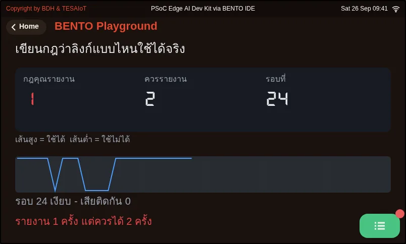
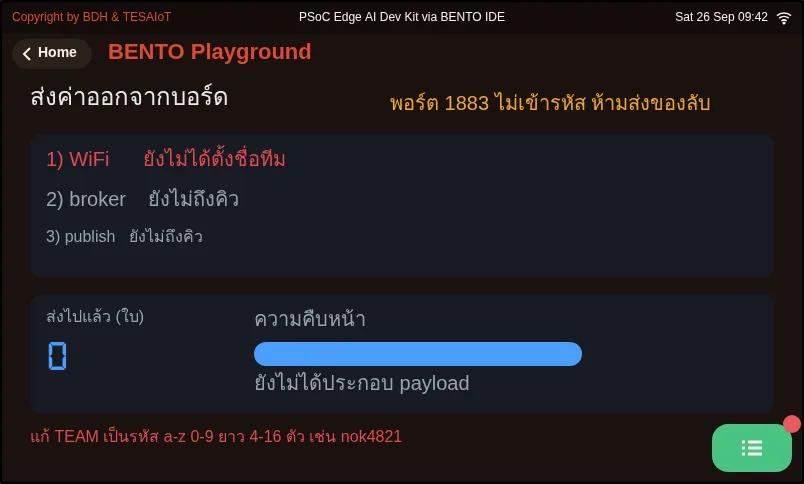
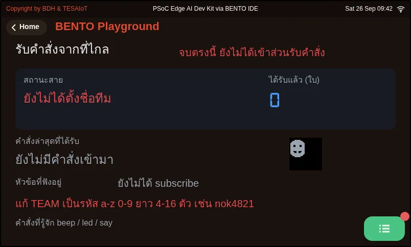
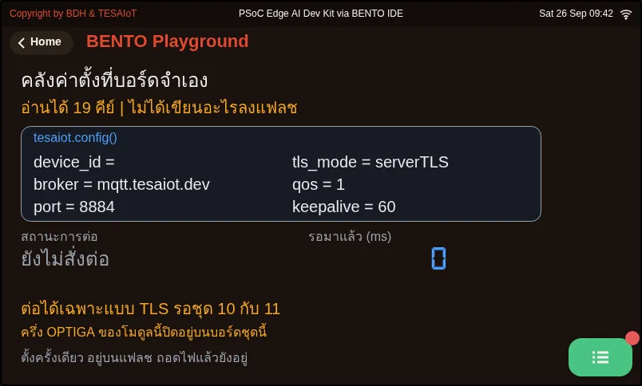

# Lesson 1.5 — Values out, commands back: MQTT on a public broker

> Module 1 — Existing UI-based Application · Slides: [slides.md](slides.md) · [Module overview](../README.md) · [Course page](../../README.md)

Publish real knob and tilt values from the board to a public MQTT broker for your team's web page to read, then take commands from that page back to drive the buzzer and LEDs on the board, trusting the sender on no line at all.

## Objectives

By the end of this lesson you will be able to:

1. Run 05_value_leaves_the_board.py until all three steps of the ladder (WiFi has an IP, broker connected, publishing) are green and the knob and az values on your team's web page move with your hand, or, if it fails, tell from the screen which step it stopped at and why
2. Explain the four rules of a public broker (a unique topic, never subscribe to everything with #, no secrets, a client_id that never collides) and what happens when each one is broken
3. Run 06_command_comes_back.py and trigger beep and led from the web page, and explain why get_message() must be polled often and why non-JSON messages or LED numbers the board does not have must end as text on the screen, not a crash
4. Complete is_usable() in 03_your_link_rule.py so it checks both "connected" and "has a usable IP" until "your rule reported" equals "should report" (2), and explain which problem in the tape is missed when NEED becomes 5

## Before you start

You must already have file `01` from lesson 1.4 working: the board can join your team's hotspot and has an IP address. Also set up a value for `TEAM` first: lowercase English letters and digits, 4–16 characters, unique to you —
for example a nickname followed by a random 4-digit number (`nok4821`) — because other learners are also using the same public broker and the same set of topics (if you are learning in a group, use the team number your organiser hands out).
In files `05` and `06`, edit the top three lines `WIFI_SSID`, `WIFI_PASS`, `TEAM` (`BROKER` is already set). If you forget to edit `TEAM`, the file stops at the very first step and says so on screen.
On a laptop or phone, open the `my_first_reader.html` page and add `?team=` to the end of the link, followed by the same code as `TEAM` — nothing to install.
(The page published on the AIC website only accepts the `teamNN` shape; if you are using your own code, download this repo's own `shared/web/my_first_reader.html` and open that instead.)
A fact worth knowing beforehand: the round-trip time to the broker was measured from the educator's Mac on the desk (188–191 ms), but **nobody has yet run files 05 and 06 on the board with this broker**, and it is not yet known whether your organisation's network lets ports 1883 and 8884 out.

- **Equipment:** an Eva Kit or TESAIoT Dev Kit board with the BENTO MicroPython firmware installed, or the BENTO Emulator in [BENTO IDE](https://ide.tesaiot.dev/) (the Emulator at ide.tesaiot.dev can now reach the real broker over wss 8884; it appends `-emu` to its own client_id so it never kicks your team's real board off, and if it cannot connect within 5 seconds it falls back to its built-in simulated broker and says so in the Console)
- **Before this:** [Lesson 1.4 — Leaving the desk: the first WiFi connection](../l04-wifi-first-connect/README.md)

## See it work first

Run `05_value_leaves_the_board.py` and watch the three-step ladder on the board's screen turn from grey to green, then turn to your team's web page.
Have one person turn the knob and another tilt the board, and watch the `knob` and `az` numbers on the web page follow along. This is a real value that just left this desk, not a random number anyone could argue with.
Note the `n` at which the web page saw its first message. If any step turns red, read the reason on screen and write it down — that outcome is a valid result too.

## Concepts

Today's messages travel two ways over two different ports. The board speaks plain MQTT on port 1883, but a web page cannot open a raw TCP socket, so it speaks MQTT over WebSocket instead,
at `wss://broker.hivemq.com:8884/mqtt`. Both directions publish to the same set of topics; the broker forwards them regardless of which way each side came in.
This broker is public with no password — anyone who knows the topic name can read and write instantly, so there are four rules: the topic must be unique to you (`bento-aiot/<team>/telemetry` and `.../cmd`),
never subscribe to `#`, because that means asking for every message in the world, never send a secret, because every message travels unencrypted, and `client_id` can collide with anyone on the whole internet,
and when it collides the broker kicks the old one off with no warning message. That is why the file sets `DEVICE_ID = "bento-aiot-" + TEAM`.

`05` is a three-step ladder that must never be reordered: WiFi must have an IP first, then `mqtt.connect(BROKER, port=1883, client_id=DEVICE_ID, keepalive=60)` can introduce the board to the broker,
and only then can `mqtt.publish(TOPIC, body)` send anything. Whichever step fails turns red with a reason, and the program then ends politely instead of hanging silently — this is the shape a real front-line program must be written in.
The value sent is a real one from `sensors.snapshot()` (the knob, and the z-axis acceleration from the BMI270); it checks with `in` before picking out a key, and uses `-1` and `-99` to mean "could not read this round".
`json.dumps()` turns our dict into text every language can read. There are two traps: the argument name is `username=`, not `user=` (get it wrong and you get an immediate `TypeError`),
and when the link drops, `publish()` does not return `False` — it raises `OSError`, so you must catch both. The firmware cannot publish with retain, so a web page that opens late only sees the next message onward, which is why the file sends 60 messages, 2 seconds apart.
Watch out for a network that needs a browser login: `wifi.connect()` returns `True` and gets a normal IP address, but the clock in the top bar never appears, and `mqtt.connect()` never reaches the broker.
The WiFi icon in the top bar answers "can it join the network", while the clock that follows answers "can it actually reach the internet".

`06` completes the loop with a way back. `mqtt.subscribe(TOPIC_CMD)` must always come after `connect()`, and must be repeated if the link drops and reconnects. `mqtt.get_message()` never blocks;
it returns `None` right away when nothing has arrived, so the loop must ask again often (`POLL_MS = 100`), because the inbox has room for only one message — a message that arrives before we pick up the old one overwrites it, it is not queued.
This is the answer to the "everyone sends a message at once" game from lesson 1.4. The message you get back is `(topic, payload)`, where payload is bytes and must be `.decode()`d before `json.loads()`.
The board understands three commands, `beep`, `led`, `say`. Half of this file is about **not trusting the sender**: a message that is not JSON, JSON that is not an object, an LED number the board does not have,
and text too long for the label — all of these must end as text on the screen, and before the file ends it always turns every light off. `05` paired with `06` closes the whole loop; our job is not about radios or protocols,
because the firmware already handles all of that — our job is deciding what to send out, and which commands to accept back.

`03` is the practice companion to `02` in lesson 1.4, but without a real network connection. It replays a 24-round tape of link checks recorded from a real board, so running it again and again gives the same result every time — a rule you cannot test repeatably is a rule you do not yet know is right.
A usable link must be connected **and** have a usable IP address; the `"0.0.0.0"` trap from file `01` comes back as a problem here, because a link with no IP is a link `publish()` can never reach anywhere with.
The code reports when `bad_streak == NEED` (using `==`, not `>=`, so you get exactly one line at the moment things start going wrong). `07` is optional further reading: the settings store of `tesaiot` lives on flash and survives a power cycle,
but `tesaiot.connect()` always connects over TLS on port 8883 or 8884; it never reads the `port` key and never blocks. The value it returns means "the command was accepted", not "connected already" — so today it cannot reach `broker.hivemq.com`.

## Worked example

The slides continue on from lesson 1.4 in this order: `05_value_leaves_the_board.py` (about 25 minutes) → `06_command_comes_back.py` (about 25 minutes) → `03_your_link_rule.py` (about 20 minutes).
`07_platform_in_one_call.py` is optional further reading. The help gets smaller step by step: `05` and `06` are the full real thing, while `03` and `07` are up to you.
Before running `06` with `POLL_MS = 3000`, **predict first** how many messages will show up if you press the button three times in quick succession within one second, then count and compare.
In `03`, the board's own screen is the answer key — edit and rerun until the two numbers match. You do not need to wait for the educator. If your team's web page does not work, you can use HiveMQ's own test page instead: set host `broker.hivemq.com`, port `8884`,
turn SSL on, and subscribe to `bento-aiot/<your team>/#`. Use the backup broker `test.mosquitto.org` only when the educator announces it.

| File | What this file teaches |
|---|---|
| [examples/03_your_link_rule.py](examples/03_your_link_rule.py) | This file runs, but it cannot see the second kind of problem |
| [examples/05_value_leaves_the_board.py](examples/05_value_leaves_the_board.py) | A value measured on this desk shows up on someone else's machine |
| [examples/06_command_comes_back.py](examples/06_command_comes_back.py) | Someone else types a command from far away, and a light on our desk turns on |
| [examples/07_platform_in_one_call.py](examples/07_platform_in_one_call.py) | The board remembers on its own where to connect, even after a power cycle |

The slides for this lesson also refer to files that live in other lessons:

- [m01-ui-application/l04-wifi-first-connect/examples/01_wifi_first_connect.py](../l04-wifi-first-connect/examples/01_wifi_first_connect.py) — take the board online for the first time, then read its own address
- [m01-ui-application/l04-wifi-first-connect/examples/02_link_uptime.py](../l04-wifi-first-connect/examples/02_link_uptime.py) — "connected" and "still connected" are not the same question
- [m01-ui-application/l04-wifi-first-connect/examples/04_scan_the_room.py](../l04-wifi-first-connect/examples/04_scan_the_room.py) — have the board listen to the whole room, and say who is where
- [shared/web/my_first_reader.html](../../shared/web/my_first_reader.html) — reads values from the board

**Screens from the BENTO Emulator** for this lesson's examples (click a file name to open the code)

<figure><figcaption><a href="examples/03_your_link_rule.py"><code>03_your_link_rule.py</code></a> This file runs, but it cannot see the second kind of problem</figcaption></figure>
<figure><figcaption><a href="examples/05_value_leaves_the_board.py"><code>05_value_leaves_the_board.py</code></a> A value measured on this desk shows up on someone else&#x27;s machine</figcaption></figure>
<figure><figcaption><a href="examples/06_command_comes_back.py"><code>06_command_comes_back.py</code></a> Someone else types a command from far away, and a light on our desk turns on</figcaption></figure>
<figure><figcaption><a href="examples/07_platform_in_one_call.py"><code>07_platform_in_one_call.py</code></a> The board remembers on its own where to connect, even after a power cycle</figcaption></figure>

## Check your understanding

The same questions are in [quiz.yaml](quiz.yaml) for automatic marking.

1. The board connects to an organisation's WiFi that needs a browser login. Step 1 of file 05 turns green with an IP address, but step 2 turns red, saying it cannot connect to the broker. What is the most likely cause? *(choose one · objective 1)*
   - A) The board has an IP address but cannot actually reach the internet, because there is no browser to click "accept" with, so it never reaches the broker
   - B) user= was written instead of username= in mqtt.connect()
   - C) It forgot to subscribe to the topic before connecting
   - D) The knob value could not be read, so it is -1

   

Solution

   **A** — A network that needs a login lets connect() return True and get a normal IP address, but the clock never appears and mqtt.connect() never reaches the broker. This is a case of passing the first check but failing the second, which is why every team uses a phone hotspot today.

   

2. Which statements are correct about using the public broker broker.hivemq.com in this lesson? Choose every correct one. *(choose all that apply · objective 2)*
   - A) Your team's web page should listen to bento-aiot/team03/#, not a bare #, which is the same as asking for every message in the world
   - B) You can put your team's WiFi password in the payload, because your team's topic is unique
   - C) If your client_id collides with anyone else's on the same broker, the broker kicks the old one off with no warning message
   - D) The broker keeps the latest message for you, so a web page opened later sees the value right away

   

Solution

   **A, C** — Listen only to your team's topic, and set a client_id that never collides with anyone on the whole internet. Every message travels unencrypted and anyone who subscribes to the same topic can see it, so you must never send a secret. The firmware cannot publish with retain, so a web page opened late only sees the next message onward.

   

3. You set POLL_MS = 3000 in file 06, then press the button on the web page three times in quick succession within one second. What is the counter on the board's screen likely to show? *(choose one · objective 3)*
   - A) All three messages, because the broker queues them for you
   - B) Fewer than three, because the inbox has room for only one message, and a message that arrives before we pick up the old one overwrites it
   - C) Nothing at all, because get_message() blocks until it times out
   - D) The program crashes with OSError from sending too fast

   

Solution

   **B** — get_message() never blocks and returns None when nothing has arrived. The inbox has room for only one message; a new one is not queued, it overwrites the old one, which is why the loop must ask often, such as the default 100 ms.

   

4. What does file 06 do to stop a message from a stranger from crashing the program? Choose every correct one. *(choose all that apply · objective 3)*
   - A) Call .decode() on the payload, which is bytes, before handing it to json.loads()
   - B) Catch ValueError when the message is not JSON, and show "not JSON" on screen
   - C) Check that the LED number n is an integer and within the range this board actually has before calling gpio.led(n)
   - D) No checking is needed, because only your team's own web page knows the cmd topic name

   

Solution

   **A, B, C** — On a public broker, anyone who knows the topic name can send to it. The sender might make a typo, send something that is not JSON, or command a light that does not exist. Every one of these cases must end as text on screen, not a program crash.

   

5. Which is_usable(online, ip) makes file 03 report exactly 2 times, matching the tape? *(choose one · objective 4)*
   - A) return online and ip != "0.0.0.0"
   - B) return online and ip
   - C) return online
   - D) return online or ip != "0.0.0.0"

   

Solution

   **A** — A usable link must be connected and have a usable IP address at the same time. "0.0.0.0" is a non-empty string, so Python treats it as true, which means "and ip" alone would let everything through. You must compare it with "0.0.0.0" directly.

   

## Lab

**Values out, commands back.** Record every result in your learning log.

- [ ] `05`: all three steps of the ladder turn green; turning the knob or tilting the board moves `knob` or `az` on your team's web page. Note the `n` at which you saw the first message (if any step is red, note the step and the reason on screen)
- [ ] `05` your turn: agree with a nearby team to temporarily set `TEAM` to the same value on purpose, run both boards at once, note who gets kicked off and what your side sees, then change it back
- [ ] `06`: press to sound the buzzer and switch LED 0 on and off from the web page; the board beeps and the light follows (if you cannot see LED 0, try the numbers whose names start with `RGB_` from the shared `mqtt_dashboard.html` page)
- [ ] `06` your turn: set `POLL_MS = 3000`, press the button three times in quick succession within one second, and count how many messages appear on screen compared with the three actually sent
- [ ] `03`: complete `is_usable()` until "your rule reported" equals 2, matching "should report", then change `NEED` to 5 and write down which stretch of the tape gets missed
- [ ] (optional further reading) `07`: run it with `PLATFORM_BROKER` left empty, note the `port` and `tls_mode` the screen shows, and explain why that `port` might not be the port `connect()` actually uses

## Going further

Lesson 1.6 is module 1's closing lab: take a real value off the board using your team's practice file, then wrap up everything the module has covered.
The `.../event` topic starts being used in lessons 2.1–2.3, and the access-control and encryption a public broker does not offer waits in lessons 4.4–4.6 and 4.7–4.9.

Next lesson: [Lesson 1.6 — Hands-on: a real value leaves the board, module 1 wrap-up](../l06-link-lab/README.md)

## Reflect

- In your own work, what values should be sent out for others to see, and what must never leave the board at all until it is encrypted?
- Anyone can publish to the `cmd` topic. What kind of command should your board never obey, even if it arrives as perfectly valid JSON?
- What is the difference between "connected" and "able to send data" in your own system, and does your screen show viewers these as two separate things yet?
