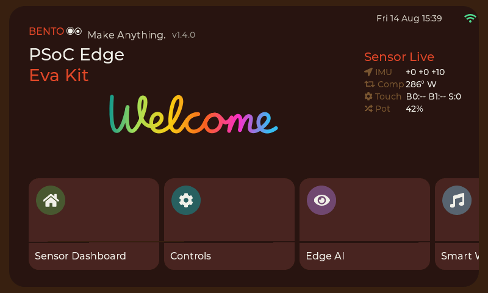
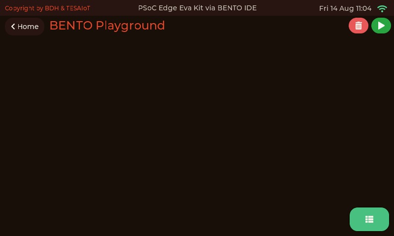
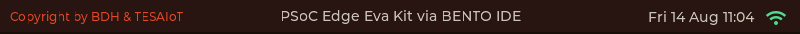

<style>
section { font-size: 24px; padding: 40px 52px; justify-content: flex-start; }
section h1 { font-size: 1.45em; line-height: 1.12; margin: 0 0 .22em; }
section h2 { font-size: 1.12em; margin: .15em 0; }
section h3 { font-size: 1.0em; margin: .12em 0; }
section p, section li { margin: .16em 0; line-height: 1.32; }
section img { max-width: 100%; height: auto; }
section svg { max-height: 252px; width: 100%; }
section iframe { border: 0; border-radius: 8px; box-shadow: 0 2px 10px rgba(0,0,0,.28); float: left; margin: 0 14px 4px 0; }
section blockquote { clear: both; }
section table { font-size: .78em; }
section pre { font-size: .70em; line-height: 1.32; background:#0d1117; color:#e6edf3; border:1px solid #30363d; border-radius:8px; padding:12px 16px; box-shadow:0 2px 8px rgba(0,0,0,.25); }
section pre code { white-space: pre-wrap; background:transparent; color:inherit; } section pre .hljs-comment{color:#8b949e;font-style:italic} section pre .hljs-keyword,section pre .hljs-built_in,section pre .hljs-literal{color:#ff7b72} section pre .hljs-string{color:#a5d6ff} section pre .hljs-number{color:#79c0ff} section pre .hljs-title,section pre .hljs-title.function_,section pre .hljs-section{color:#d2a8ff} section pre .hljs-meta{color:#ffa657} section pre .hljs-attr,section pre .hljs-attribute,section pre .hljs-name{color:#7ee787}
section blockquote { margin: .25em 0; font-size: .92em; }
/* two images on a line (parity / 2x2 grids) stay side-by-side and small */
section p > img + img { margin-left: 10px; }
/* scroll-within-slide: dense slides scroll instead of clipping */
section { overflow-y: auto; overflow-x: hidden; }
section::-webkit-scrollbar { width: 11px; }
section::-webkit-scrollbar-thumb { background:#4a90d9; border-radius:6px; }
section::-webkit-scrollbar-track { background:rgba(0,0,0,.06); }
/* image drop-shadow + cover-slide readability (auto) */
section img{filter:drop-shadow(0 3px 12px rgba(0,0,0,.5))}
/* พื้นสำรองของสไลด์ปก: ถ้า img/cover_sNN.svg โหลดไม่ขึ้น ธีมจะคืนพื้นขาว
   แล้วตัวอักษรสีขาวของปกจะหายไปทั้งแผ่น — ปักสีเข้มไว้ให้ภาพเป็นแค่ของประดับ */
section.cover{background-color:#0b1426}
section.cover *{color:#fff !important}
section.cover h1,section.cover h2,section.cover h3,section.cover p,section.cover li,section.cover strong,section.cover em,section.cover blockquote,section.cover div{text-shadow:0 2px 9px rgba(0,0,0,.92),0 0 3px rgba(0,0,0,.8)}
section.cover div[style*="background:#"],section.cover div[style*="background: #"]{background:rgba(10,14,20,.66) !important;border-color:rgba(120,200,255,.45) !important;max-width:62%}
section.cover blockquote{border-left:4px solid rgba(120,200,255,.6) !important;background:rgba(13,17,23,.55) !important;border-radius:6px;padding:.3em .6em}
section.cover h1,section.cover h2,section.cover h3,section.cover p,section.cover blockquote{max-width:60%}
section.cover div:not(:has(img)){max-width:62%}
section.cover img{filter:none}
</style>


<!-- _class: cover -->

# บทเรียน 1.5 — ค่าออกไป คำสั่งกลับมา: MQTT บน broker สาธารณะ

## บอร์ดคุยกับโลก · ค่าที่วัดบนโต๊ะนี้ไปโผล่บนเครื่องคนอื่น แล้วคำสั่งจากที่ไกลกลับมาสั่งของบนโต๊ะเรา

**โมดูล 1 — แอปพลิเคชันบนจอที่มีอยู่แล้ว**

> ต่อจากบทเรียน 1.4 — บอร์ดออกจากโต๊ะ: ต่อ WiFi ครั้งแรก

---

<style scoped>section svg { max-height:206px } section p { margin:.05em 0;font-size:.84em;line-height:1.26 } section blockquote { font-size:.76em;margin:.08em 0 }</style>

## วันนี้ข้อความเดินสองทาง — บอร์ดใช้ 1883 เบราว์เซอร์ใช้ wss 8884

<svg viewBox="0 0 940 230" xmlns="http://www.w3.org/2000/svg">
  <defs><marker id="r1" markerWidth="12" markerHeight="9" refX="12" refY="4.5" orient="auto" markerUnits="userSpaceOnUse">
    <path d="M0,0 L12,4.5 L0,9 z" fill="#2e7d32" /></marker>
  <marker id="r2" markerWidth="12" markerHeight="9" refX="12" refY="4.5" orient="auto" markerUnits="userSpaceOnUse">
    <path d="M0,0 L12,4.5 L0,9 z" fill="#6a1b9a" /></marker></defs>
  <text x="470" y="24" text-anchor="middle" font-size="20" font-weight="700" fill="#37474f">สองทางคนละพอร์ต แต่ไปเจอกันที่ broker ตัวเดียวกัน หัวข้อเดียวกัน</text>
  <rect x="20" y="44" width="230" height="110" rx="10" fill="#e8f5e9" stroke="#2e7d32" stroke-width="2.5" />
  <text x="135" y="74" text-anchor="middle" font-size="20" font-weight="700" fill="#2e7d32">บอร์ดของทีม</text>
  <text x="135" y="102" text-anchor="middle" font-size="18" fill="#1b5e20">ไฟล์ 05 · 06</text>
  <text x="135" y="130" text-anchor="middle" font-size="17" fill="#4a7c4e">mqtt ไม่เข้ารหัส</text>
  <rect x="355" y="44" width="230" height="110" rx="10" fill="#eceff1" stroke="#455a64" stroke-width="2.5" />
  <text x="470" y="74" text-anchor="middle" font-size="20" font-weight="700" fill="#455a64">broker.hivemq.com</text>
  <text x="470" y="102" text-anchor="middle" font-size="18" fill="#37474f">สาธารณะ ไม่มีรหัสผ่าน</text>
  <text x="470" y="130" text-anchor="middle" font-size="17" fill="#78909c">bento-aiot/team03/...</text>
  <rect x="690" y="44" width="230" height="110" rx="10" fill="#e3f2fd" stroke="#1565c0" stroke-width="2.5" />
  <text x="805" y="74" text-anchor="middle" font-size="20" font-weight="700" fill="#1565c0">เบราว์เซอร์</text>
  <text x="805" y="102" text-anchor="middle" font-size="17" fill="#0d47a1">my_first_reader.html</text>
  <text x="805" y="130" text-anchor="middle" font-size="17" fill="#5472a3">ไม่ต้องลงโปรแกรม</text>
  <line x1="252" y1="72" x2="352" y2="72" stroke="#2e7d32" stroke-width="3.5" marker-end="url(#r1)" />
  <line x1="352" y1="128" x2="252" y2="128" stroke="#6a1b9a" stroke-width="3.5" marker-end="url(#r2)" />
  <text x="302" y="106" text-anchor="middle" font-size="17" font-weight="700" fill="#37474f">TCP 1883</text>
  <line x1="688" y1="72" x2="588" y2="72" stroke="#6a1b9a" stroke-width="3.5" marker-end="url(#r2)" />
  <line x1="588" y1="128" x2="688" y2="128" stroke="#2e7d32" stroke-width="3.5" marker-end="url(#r1)" />
  <text x="638" y="106" text-anchor="middle" font-size="17" font-weight="700" fill="#37474f">wss 8884</text>
  <circle cx="262" cy="72" r="6" fill="#2e7d32">
    <animate attributeName="cx" values="262;342;262" dur="2.4s" repeatCount="indefinite" /></circle>
  <rect x="20" y="170" width="230" height="52" rx="8" fill="#fff3e0" stroke="#ef6c00" stroke-width="2" stroke-dasharray="7 5" />
  <text x="135" y="202" text-anchor="middle" font-size="18" font-weight="700" fill="#e65100">Emulator: wss 8884</text>
  <text x="270" y="192" font-size="17" fill="#8d4a4a">ต่อ hivemq จริงผ่าน wss และเติม -emu ท้าย client_id ไม่เตะบอร์ดของทีม</text>
  <text x="270" y="216" font-size="17" fill="#8d4a4a">ต่อไม่ได้ภายใน 5 วินาที ถอยไปใช้ broker จำลองในตัว และบอกใน Console</text>
</svg>

บอร์ดพูด MQTT ธรรมดาที่พอร์ต 1883 ส่วนหน้าเว็บเปิดสาย TCP ดิบไม่ได้ จึงพูด MQTT ผ่าน WebSocket ที่ `wss://broker.hivemq.com:8884/mqtt` ทั้งสองทางลงหัวข้อชุดเดียวกัน broker ส่งต่อให้เองโดยไม่สนว่าแต่ละฝั่งมาทางไหน

**วัดแล้ว** 24 ก.ย. 2026 จาก Mac บนโต๊ะผู้สอน ไม่ใช่จากเน็ตขององค์กร: 1883 ไป wss และ wss ไป 1883 ส่งถึงทั้งคู่ ไปกลับ 188-191 ms · **ยังไม่ได้วัด**: ยังไม่มีใครรันไฟล์ 05 กับ 06 บนบอร์ดกับ broker นี้ และยังไม่รู้ว่าเน็ตขององค์กรปล่อยพอร์ต 1883 กับ 8884 ออกไปหรือไม่

**ตัวสำรอง** ใช้เมื่อผู้สอนประกาศเท่านั้น: บอร์ด `BROKER = "test.mosquitto.org"` พอร์ต 1883 · หน้าเว็บ `wss://test.mosquitto.org:8081/mqtt` (วัดแบบเดียวกัน 185-201 ms) · อย่าใช้ `broker.mqttdashboard.com` ใบรับรองไม่ตรงชื่อ หน้าเว็บต่อไม่ได้

> **ผู้สอน ก่อนเข้าห้อง** ให้บอร์ดของผู้สอนต่อ Hotspot มือถือ (WiFi ขององค์กรต้อง login บอร์ดใช้ไม่ได้) เปิดหน้ารวม <https://advance-innovation-centre-aic.github.io/embedded-systems-for-aiot-developer/examples/web/mqtt_dashboard.html> แล้วให้บอร์ดหนึ่งตัวรัน [`05_value_leaves_the_board.py`](https://github.com/tesaiot/tesa-qualification-program/blob/main/courses/aiot-micropython/m01-ui-application/l05-values-out-commands-back/examples/05_value_leaves_the_board.py) สักใบ การ์ดของทีมขึ้น = ทั้งสองทางผ่าน · ไม่ขึ้น = ลองตัวสำรอง

---

<style scoped>section svg { max-height:150px } section li { margin:.04em 0;font-size:.86em;line-height:1.26 } section blockquote { font-size:.78em;margin:.08em 0 }</style>

## broker สาธารณะ: ใครก็อ่านได้ ใครก็เขียนได้

<svg viewBox="0 0 940 150" xmlns="http://www.w3.org/2000/svg">
  <text x="470" y="24" text-anchor="middle" font-size="20" font-weight="700" fill="#37474f">broker นี้ไม่มีรหัสผ่าน ใครรู้ชื่อหัวข้อก็อ่านและเขียนได้ทันที</text>
  <rect x="20" y="42" width="212" height="84" rx="8" fill="#e8f5e9" stroke="#2e7d32" stroke-width="2.5" />
  <text x="126" y="72" text-anchor="middle" font-size="18" font-weight="700" fill="#2e7d32">หัวข้อไม่ซ้ำใคร</text>
  <text x="126" y="100" text-anchor="middle" font-size="16" fill="#1b5e20">bento-aiot/team03/...</text>
  <rect x="248" y="42" width="212" height="84" rx="8" fill="#e3f2fd" stroke="#1565c0" stroke-width="2.5" />
  <text x="354" y="72" text-anchor="middle" font-size="18" font-weight="700" fill="#1565c0">ห้าม subscribe #</text>
  <text x="354" y="100" text-anchor="middle" font-size="16" fill="#0d47a1">เท่ากับขอรับทั้งโลก</text>
  <rect x="476" y="42" width="212" height="84" rx="8" fill="#ffebee" stroke="#c62828" stroke-width="3">
    <animate attributeName="stroke-width" values="3;5;3" dur="1.8s" repeatCount="indefinite" /></rect>
  <text x="582" y="72" text-anchor="middle" font-size="18" font-weight="700" fill="#c62828">ห้ามส่งความลับ</text>
  <text x="582" y="100" text-anchor="middle" font-size="16" fill="#8d4a4a">ไม่เข้ารหัส ใครก็อ่านได้</text>
  <rect x="704" y="42" width="212" height="84" rx="8" fill="#fff3e0" stroke="#ef6c00" stroke-width="2.5" />
  <text x="810" y="72" text-anchor="middle" font-size="18" font-weight="700" fill="#ef6c00">client_id ไม่ชน</text>
  <text x="810" y="100" text-anchor="middle" font-size="16" fill="#e65100">ชนได้กับทุกคนในโลก</text>
</svg>

- **หัวข้อต้องไม่ซ้ำใคร** ทุกคนใช้ชุดเดียว `bento-aiot/<ทีม>/telemetry` (บอร์ดส่งค่า) · `bento-aiot/<ทีม>/event` (เหตุการณ์ เริ่มใช้บทเรียน 2.1–2.3) · `bento-aiot/<ทีม>/cmd` (คำสั่งเข้าบอร์ด) ผู้เรียนคนอื่นก็ใช้ broker และหัวข้อชุดนี้ จึงตั้ง `TEAM` เป็นรหัสที่ไม่ซ้ำใคร a-z 0-9 ยาว 4–16 ตัว เช่นชื่อเล่นต่อด้วยเลขสุ่ม 4 หลัก (`nok4821`) · ถ้าเรียนเป็นกลุ่ม ผู้จัดอาจแจก `team01` ถึง `team19`
- **ห้าม subscribe `#`** เครื่องหมายนี้แปลว่าทุกหัวข้อบน broker ข้อความของคนแปลกหน้าทั้งโลกจะไหลเข้ามา และกล่องรับของบอร์ดมีช่องเดียว ใบใหม่ทับใบเก่า · หน้าเว็บของทีมฟัง `bento-aiot/team03/#` หน้ารวมของผู้สอนฟัง `bento-aiot/+/telemetry`
- **ห้ามส่งความลับ** ไม่ว่ารหัส WiFi ชื่อจริง หรือเบอร์โทร ทุกใบวิ่งแบบไม่เข้ารหัส และใครที่ subscribe หัวข้อเดียวกันก็เห็น
- **client\_id ชนกันได้กับทุกคนบนอินเทอร์เน็ต** ไม่ใช่แค่เพื่อนในห้อง ชนเมื่อไร broker เตะตัวเก่าออก (วัดแล้วว่าเป็นแบบนี้ทุกตัว) ไฟล์จึงตั้ง `DEVICE_ID = "bento-aiot-" + TEAM` ยาว 17 ตัวอักษร (เฟิร์มแวร์ตัดที่ 31) ส่วนหน้าเว็บสุ่ม `web-` ตามด้วยเลขสุ่มทุกครั้ง จึงไม่เตะบอร์ด

> ใครก็ส่งเข้า `bento-aiot/team03/cmd` ได้ ไม่ใช่แค่หน้าเว็บของเรา — นี่คือเหตุผลที่ไฟล์ 06 ไม่เชื่อคนส่งเลยสักบรรทัด และคือเหตุผลที่บทเรียน 4.4–4.6 กับ 4.7–4.9 ต้องมีเรื่องสิทธิ์และการเข้ารหัส

---

<style scoped>section :is(pre, marp-pre) { font-size:.54em } section svg { max-height:142px } section p { margin:.06em 0;font-size:.92em }</style>

## ไฟล์ 05 · [`05_value_leaves_the_board.py`](https://github.com/tesaiot/tesa-qualification-program/blob/main/courses/aiot-micropython/m01-ui-application/l05-values-out-commands-back/examples/05_value_leaves_the_board.py) — บันไดสามขั้นที่ห้ามสลับ

<svg viewBox="0 0 940 182" xmlns="http://www.w3.org/2000/svg">
  <rect x="20" y="96" width="280" height="56" rx="9" fill="#e8f5e9" stroke="#2e7d32" stroke-width="2.5" />
  <text x="160" y="120" text-anchor="middle" font-size="20" font-weight="700" fill="#2e7d32">1 · WiFi ต้องให้ IP ก่อน</text>
  <text x="160" y="142" text-anchor="middle" font-size="17" fill="#1b5e20">ไม่มีเลขที่อยู่ = ไปต่อไม่ได้เลย</text>
  <rect x="330" y="60" width="280" height="56" rx="9" fill="#e3f2fd" stroke="#1565c0" stroke-width="2.5" />
  <text x="470" y="84" text-anchor="middle" font-size="20" font-weight="700" fill="#1565c0">2 · แนะนำตัวกับ broker</text>
  <text x="470" y="106" text-anchor="middle" font-size="17" fill="#0d47a1">mqtt.connect(BROKER, port=1883)</text>
  <rect x="640" y="24" width="280" height="56" rx="9" fill="#f3e5f5" stroke="#6a1b9a" stroke-width="3" />
  <text x="780" y="48" text-anchor="middle" font-size="20" font-weight="700" fill="#6a1b9a">3 · ส่งของจริงออกไป</text>
  <text x="780" y="70" text-anchor="middle" font-size="17" fill="#4a148c">mqtt.publish(TOPIC, body)</text>
  <line x1="302" y1="112" x2="328" y2="98" stroke="#90a4ae" stroke-width="3" />
  <line x1="612" y1="76" x2="638" y2="62" stroke="#90a4ae" stroke-width="3" />
  <text x="470" y="176" text-anchor="middle" font-size="18" font-weight="700" fill="#c62828">ขั้นที่ยังไม่ผ่าน ต้องเห็นบนจอว่ายังไม่ผ่าน ไม่ใช่ค้างเงียบ</text>
</svg>

```python
    linked = mqtt.connect(BROKER, port=1883, client_id=DEVICE_ID, keepalive=60)
...
    payload = {"id": TEAM,          # คีย์สั้นตัวเล็ก มี id กับ n เสมอ
               "n": i,
               "knob": knob,
               "az": az,
               "uptime_s": time.ticks_ms() // 1000}
    body = json.dumps(payload)      # dict ของเรา -> ข้อความที่ทุกภาษาอ่านออก
...
    try:
        ok = mqtt.publish(TOPIC, body)
    except OSError:                 # สายหลุดแล้ว publish ไม่คืน False มันโยน OSError
        ...
```

ป้ายสามขั้นบนจอไล่เปลี่ยนจากเทาเป็นเขียวตามลำดับ ขั้นไหนไม่ผ่านจะเป็นแดงพร้อมบอกเหตุผล แล้วโปรแกรมจบตรงนั้นอย่างสุภาพ ไม่ค้างรอ **นี่คือแบบที่โปรแกรมหน้างานต้องเขียน** ทุกทางออกของไฟล์นี้เขียนบนจอไว้เสมอว่าไปติดที่ขั้นไหน

`json.dumps()` แปลง `dict` ของเราเป็นข้อความ ทำให้เครื่องปลายทางจะเขียนด้วยภาษาอะไรก็อ่านออก — นี่คือเหตุผลที่ IoT ทั้งโลกส่ง JSON กันไปมา ไม่ใช่ส่งโครงสร้างข้อมูลของภาษาใดภาษาหนึ่ง

> `mqtt.connect()` ใช้ชื่อ `username=` ไม่ใช่ `user=` ใส่ผิดได้ `TypeError` ทันที · และ `client_id` ที่ซ้ำกับใครก็ตามบน broker เดียวกัน ทำให้ผลัดกันเตะกันออกโดยไม่มีข้อความเตือน · บน broker สาธารณะ "ใครก็ตาม" คือทั้งอินเทอร์เน็ต

---

<style scoped>section :is(pre, marp-pre) { font-size:.54em } section svg { max-height:120px } section p { margin:.08em 0;font-size:.9em }</style>

## ไฟล์ 05 (ต่อ) — ค่าที่ส่งออกไปต้องเป็นค่าจริง ไม่ใช่ตัวเลขสุ่ม

```python
knob = -1                           # -1 = รอบนี้อ่านลูกบิดไม่ได้
az = -99.0                          # -99 = อ่านค่าเอียงไม่ได้
try:
    s = sensors.snapshot()          # ของเดิมจาก m01-ui-application/l03-inside-the-box/examples/12_every_sense_at_once.py
    if "pot" in s:                  # ถามด้วย in ก่อนหยิบ รอบที่ไม่มีคีย์จะไม่ตาย
        knob = int(s["pot"]["percent"])
    if "bmi270" in s:
        az = round(s["bmi270"]["az"], 2)   # m/s^2 วางราบราว 9.8
except OSError:
    pass                            # อ่านไม่ได้รอบนี้ ไม่ใช่เหตุให้หยุดส่ง ค่าข้างบนบอกให้รู้แล้ว
```

<svg viewBox="0 0 940 162" xmlns="http://www.w3.org/2000/svg">
  <rect x="20" y="10" width="900" height="112" rx="8" fill="#142240" stroke="#3d5a80" stroke-width="2" />
  <text x="44" y="38" font-size="19" font-weight="700" fill="#ffffff">ใบที่ 7 ที่เพิ่งออกจากบอร์ดไปเมื่อกี้</text>
  <text x="44" y="70" font-size="18" font-family="monospace" fill="#7ee787">{"id": "team03", "n": 7, "knob": 63, "az": 9.79, "uptime_s": 41}</text>
  <text x="44" y="100" font-size="17" fill="#a0b4cc">หมุนลูกบิดหรือเอียงบอร์ดที่โต๊ะนี้ แล้วดูเลขบนหน้าเว็บของทีมขยับตาม</text>
  <text x="470" y="152" text-anchor="middle" font-size="18" font-weight="700" fill="#37474f">ค่าที่พิสูจน์ได้ด้วยมือตัวเอง ต่างจากตัวเลขสุ่มที่ใครก็เถียงได้</text>
</svg>

ไฟล์นี้ส่ง**ค่าจริงสองค่า** ลูกบิด (Eva Kit: ลูกบิดสีน้ำเงิน · Dev Kit: VR1 — `sensors.pot` อ่านตัวนี้ตัวเดียว) กับ**ค่าเอียงแกน z จาก BMI270** ทั้งสองบอร์ดมีทั้งคู่ คนหนึ่งหมุน อีกคนเอียง คนที่นั่งดูอีกฝั่งจึงพิสูจน์ได้ด้วยมือตัวเองว่าขยับที่นี่แล้วเลขที่โน่นขยับตาม ไม่ใช่ตัวเลขสุ่มที่ใครก็เถียงได้

`mqtt` ของบอร์ด**ไม่เข้ารหัส** และ broker วันนี้เป็นของสาธารณะ ห้ามส่งของที่เป็นความลับ (บทเรียน 4.7–4.9 ค่อยย้ายไปทางเข้ารหัส) · เฟิร์มแวร์ส่งแบบ retain ไม่ได้ หน้าเว็บที่เปิดช้าเห็นแค่ใบถัดไป ไฟล์จึงส่ง 60 ใบ ใบละ 2 วินาที

> **ตาคุณ อยู่ท้ายไฟล์** เปิดหน้าเว็บของทีม หมุนลูกบิดหรือเอียงบอร์ด จดว่าเห็นใบแรกที่ `n` เท่าไร แล้วลองตั้ง `TEAM` ชนกับทีมข้าง ๆ ชั่วคราว ดูว่าใครถูกเตะออก

---

<style scoped>section svg { max-height:118px } section :is(pre, marp-pre) { font-size:.56em } section li { margin:.03em 0;font-size:.84em;line-height:1.24 } section blockquote { font-size:.76em;margin:.06em 0 }</style>

## เปิดหน้าเว็บอ่านค่าของทีม — [`my_first_reader.html`](https://github.com/tesaiot/tesa-qualification-program/blob/main/courses/aiot-micropython/shared/web/my_first_reader.html)

<svg viewBox="0 0 940 130" xmlns="http://www.w3.org/2000/svg">
  <rect x="20" y="20" width="212" height="72" rx="8" fill="#e8f5e9" stroke="#2e7d32" stroke-width="2" />
  <text x="126" y="50" text-anchor="middle" font-size="18" font-weight="700" fill="#2e7d32">1 · เปิดลิงก์ของหลักสูตร</text>
  <text x="126" y="76" text-anchor="middle" font-size="16" fill="#1b5e20">ในเบราว์เซอร์ใดก็ได้</text>
  <rect x="248" y="20" width="212" height="72" rx="8" fill="#e3f2fd" stroke="#1565c0" stroke-width="2" />
  <text x="354" y="50" text-anchor="middle" font-size="18" font-weight="700" fill="#1565c0">2 · ต่อท้าย ?team=</text>
  <text x="354" y="76" text-anchor="middle" font-size="16" fill="#0d47a1">รหัสเดียวกับ TEAM ในไฟล์ 05 06</text>
  <rect x="476" y="20" width="212" height="72" rx="8" fill="#fff3e0" stroke="#ef6c00" stroke-width="2" />
  <text x="582" y="50" text-anchor="middle" font-size="18" font-weight="700" fill="#ef6c00">3 · กด Enter</text>
  <text x="582" y="76" text-anchor="middle" font-size="16" fill="#e65100">ไม่ต้องบันทึกไฟล์</text>
  <rect x="704" y="20" width="212" height="72" rx="8" fill="#f3e5f5" stroke="#6a1b9a" stroke-width="3">
    <animate attributeName="stroke-width" values="3;5;3" dur="1.8s" repeatCount="indefinite" /></rect>
  <text x="810" y="50" text-anchor="middle" font-size="18" font-weight="700" fill="#6a1b9a">4 · สถานะ ต่อแล้ว</text>
  <text x="810" y="76" text-anchor="middle" font-size="16" fill="#4a148c">รอใบถัดไปจากบอร์ด</text>
  <text x="470" y="120" text-anchor="middle" font-size="18" fill="#546e7a">เปิดได้ทุกเครื่องที่มีเบราว์เซอร์ รวมถึงมือถือ ไม่ต้องติดตั้งอะไร</text>
</svg>

ลิงก์ของหน้าอ่านค่า เปลี่ยน `team05` ท้ายลิงก์เป็นรหัสของคุณ · หน้านี้บนเว็บ AIC รับเฉพาะรหัสรูป `teamNN` ถ้าใช้รหัสของตัวเองอย่าง `nok4821` ให้ดาวน์โหลด [`my_first_reader.html`](https://github.com/tesaiot/tesa-qualification-program/blob/main/courses/aiot-micropython/shared/web/my_first_reader.html) ของรีโพนี้ไปเปิดในเบราว์เซอร์แทน

<https://advance-innovation-centre-aic.github.io/embedded-systems-for-aiot-developer/examples/web/my_first_reader.html?team=team05>

```js
// ถ้าดาวน์โหลดไฟล์ไปเปิดเอง แก้บรรทัดนี้แทนการต่อท้ายลิงก์
let TEAM = "teamXX";          // รหัสเดียวกับ TEAM ในไฟล์ Python เช่น "nok4821" (เรียนเป็นกลุ่มใช้เลขที่ผู้จัดแจก เช่น "team05")
```

- หน้านี้ฟัง `bento-aiot/<TEAM>/#` แล้ววาดหนึ่งกล่องต่อหนึ่งคีย์ของ JSON (`knob` `az` `n` ...) และมีปุ่มส่งเสียงกับเปิดปิดไฟ LED 0 ที่ส่งเข้า `.../cmd` ให้ไฟล์ 06
- เปิดหน้านี้หลังบอร์ดส่งไปแล้ว จะว่างจนกว่าใบถัดไปมาถึง เพราะเฟิร์มแวร์ส่งแบบ retain ไม่ได้ broker จึงไม่เก็บใบล่าสุดไว้ให้ ไฟล์ 05 ส่งทุก 2 วินาทีนานสองนาทีด้วยเหตุนี้
- ผู้สอนฉายหน้ารวม <https://advance-innovation-centre-aic.github.io/embedded-systems-for-aiot-developer/examples/web/mqtt_dashboard.html> ซึ่งฟัง `bento-aiot/+/telemetry` กับ `bento-aiot/+/event` เห็นทุกทีมเป็นการ์ด และส่งคำสั่งเข้า `bento-aiot/<ทีม>/cmd` ได้
- **Emulator ต่อ broker จริงได้** รันไฟล์ 05 06 บน Emulator ใน ide.tesaiot.dev แล้วข้อความขึ้นบนหน้าเว็บของทีมจริง และคำสั่งจากหน้าเว็บวิ่งกลับมาที่ Emulator ได้ (ทดสอบแล้วทั้งสองทาง) · Emulator เติม `-emu` ท้าย client\_id เอง จึงไม่เตะบอร์ดจริงของทีม · ถ้าต่อไม่ได้ภายใน 5 วินาที มันถอยไปใช้ broker จำลองในตัวและบอกใน Console

> ไม่มีไฟล์หน้าเว็บของเรา ใช้หน้าทดลองของผู้ให้บริการแทนได้ <https://www.hivemq.com/demos/websocket-client/> ตั้ง host `broker.hivemq.com` port `8884` เปิด SSL แล้ว subscribe `bento-aiot/<ทีมของคุณ>/#`

---

<style scoped>section :is(pre, marp-pre) { font-size:.46em;line-height:1.2 } section svg { max-height:96px } section p { margin:.04em 0;font-size:.8em;line-height:1.22 } section blockquote { font-size:.78em;margin:.06em 0 }</style>

## ไฟล์ 06 · [`06_command_comes_back.py`](https://github.com/tesaiot/tesa-qualification-program/blob/main/courses/aiot-micropython/m01-ui-application/l05-values-out-commands-back/examples/06_command_comes_back.py) — คำสั่งเดินทางกลับมา

```python
if not mqtt.subscribe(TOPIC_CMD):   # ต้องมาหลัง connect() เสมอ และต้องทำซ้ำถ้าสายหลุดแล้วต่อใหม่
    stop_here("subscribe ไม่ผ่าน", "broker ไม่ยอมให้ฟังหัวข้อ " + TOPIC_CMD)
...
    msg = mqtt.get_message()        # ไม่บล็อก คืน None ทันทีเมื่อยังไม่มีอะไรมา
...
    if msg is not None:
        ...
        topic, raw = msg            # topic เป็น str ส่วน payload เป็น bytes
        ...
            cmd = json.loads(raw.decode())  # ต้อง .decode() ก่อนเสมอ
        ...
        action = cmd.get("cmd", "")
        ...
        elif action == "led":
            ...
                led = gpio.led(n)   # ของบนโต๊ะเราขยับ เพราะคนที่อยู่คนละที่พิมพ์มา
                if on:
                    led.on()
```

<svg viewBox="0 0 940 148" xmlns="http://www.w3.org/2000/svg">
  <rect x="20" y="16" width="440" height="112" rx="9" fill="#fff8e1" stroke="#f57f17" stroke-width="2.5" />
  <text x="240" y="42" text-anchor="middle" font-size="20" font-weight="700" fill="#e65100">กล่องรับมีช่องเดียว</text>
  <text x="240" y="70" text-anchor="middle" font-size="18" fill="#a1683a">ใบที่สองที่มาถึงก่อนเราหยิบใบแรก</text>
  <text x="240" y="94" text-anchor="middle" font-size="18" fill="#c62828">ทับใบแรกทิ้งไปเลย ไม่ได้ต่อคิว</text>
  <text x="240" y="118" text-anchor="middle" font-size="17" fill="#a1683a">ลูปจึงห้ามหลับยาว ต้องถามซ้ำถี่ ๆ</text>
  <rect x="480" y="16" width="440" height="112" rx="9" fill="#ffebee" stroke="#c62828" stroke-width="2.5" />
  <text x="700" y="42" text-anchor="middle" font-size="20" font-weight="700" fill="#c62828">คนส่งพิมพ์มั่วได้เสมอ</text>
  <text x="700" y="70" text-anchor="middle" font-size="18" fill="#8d4a4a">ของที่ไม่ใช่ JSON ต้องไม่ทำให้โปรแกรมตาย</text>
  <text x="700" y="94" text-anchor="middle" font-size="18" fill="#8d4a4a">เลขดวงไฟที่บอร์ดนี้ไม่มี ต้องกันเอง</text>
  <text x="700" y="118" text-anchor="middle" font-size="17" fill="#8d4a4a">ข้อความยาวเกินป้าย ต้องตัดก่อนเสมอ</text>
</svg>

ไฟล์ 05 ส่งออกอย่างเดียว ไฟล์นี้เติมทางกลับให้ครบวง คำสั่งที่บอร์ดรู้จักมีสาม `beep` ให้ร้อง `led` ให้ไฟติดหรือดับ และ `say` ให้ขึ้นข้อความบนจอ ทุกคำสั่งมาในรูป JSON เช่น `{"cmd":"led","n":0}` — `n` คือดัชนีดวงตาม `gpio.board_info()["led_names"]` ของบอร์ดนั้น ถ้าสั่งดวง 0 แล้วมองไม่เห็นบนบอร์ดของทีม (บน Dev Kit ดวง 0 คือ LED1 บนโมดูล) ให้ลอง `n` ของดวงที่ชื่อขึ้นต้นด้วย `RGB_` จากช่อง LED ของหน้ารวม `mqtt_dashboard.html` เพราะหน้าอ่านค่าของทีมมีปุ่มแค่ดวง 0 · วันนี้คนส่งคือปุ่มบนหน้าเว็บ [`my_first_reader.html`](https://github.com/tesaiot/tesa-qualification-program/blob/main/courses/aiot-micropython/shared/web/my_first_reader.html) ซึ่งส่งเข้า `bento-aiot/<ทีม>/cmd`

ครึ่งหนึ่งของไฟล์นี้คือ **การไม่เชื่อคนส่ง** เพราะบน broker สาธารณะ ใครที่รู้ชื่อหัวข้อก็ส่งเข้ามาได้ ข้อความจึงมาจากคนที่เราไม่รู้จักได้จริง เขาอาจพิมพ์ผิด อาจส่งของที่ไม่ใช่ JSON หรืออาจสั่งดวงไฟที่บอร์ดนี้ไม่มี ทั้งสามกรณีต้องจบลงที่ข้อความบนจอ ไม่ใช่ที่โปรแกรมตาย · ก่อนจบ ไฟล์นี้ปิดไฟทุกดวงเสมอ ไม่ทิ้งบอร์ดไว้ในสถานะที่คำสั่งสุดท้ายบังเอิญตั้งไว้ — เป็นนิสัยที่ระบบซึ่งต้องแขวนอยู่หน้างานหกเดือนขาดไม่ได้

> **นี่คือคำตอบของเกมต้นบทเรียน** ทั้งห้องส่งพร้อมกัน แต่บอร์ดถามกล่องทุก 100 ms และกล่องมีช่องเดียว ใบที่มาถึงระหว่างนั้นทับกันเอง · **ตาคุณ อยู่ท้ายไฟล์** ตั้ง `POLL_MS = 3000` แล้วกดปุ่มบนหน้าเว็บสามครั้งรวดในวินาทีเดียว แล้วนับว่าตัวเลขบนจอขึ้นกี่ใบ เทียบกับสามใบที่ส่งไปจริง

---

## 05 คู่กับ 06 คือจุดขายของทั้งไลบรารี

<svg viewBox="0 0 940 236" xmlns="http://www.w3.org/2000/svg">
  <defs><marker id="c1" markerWidth="11" markerHeight="8" refX="11" refY="4" orient="auto" markerUnits="userSpaceOnUse">
    <path d="M0,0 L11,4 L0,8 z" fill="#455a64" /></marker></defs>
  <text x="470" y="22" text-anchor="middle" font-size="20" font-weight="700" fill="#37474f">สองไฟล์นี้ต่อกันแล้วได้วงจรที่ปิดครบ</text>
  <rect x="30" y="40" width="200" height="150" rx="10" fill="#e8f5e9" stroke="#2e7d32" stroke-width="2.5" />
  <text x="130" y="68" text-anchor="middle" font-size="19" font-weight="700" fill="#2e7d32">โต๊ะของเรา</text>
  <text x="130" y="96" text-anchor="middle" font-size="18" fill="#1b5e20">หมุนลูกบิด</text>
  <text x="130" y="122" text-anchor="middle" font-size="17" fill="#4a7c4e">sensors.snapshot()</text>
  <text x="130" y="152" text-anchor="middle" font-size="18" fill="#1b5e20">หลอด LED ติด</text>
  <text x="130" y="176" text-anchor="middle" font-size="17" fill="#4a7c4e">gpio.led(n).on()</text>
  <rect x="380" y="40" width="180" height="150" rx="10" fill="#eceff1" stroke="#455a64" stroke-width="2.5" />
  <text x="470" y="68" text-anchor="middle" font-size="19" font-weight="700" fill="#455a64">broker</text>
  <text x="470" y="100" text-anchor="middle" font-size="17" fill="#37474f">team03/telemetry</text>
  <text x="470" y="128" text-anchor="middle" font-size="17" fill="#37474f">team03/cmd</text>
  <text x="470" y="164" text-anchor="middle" font-size="17" fill="#78909c">สองหัวข้อ สองทิศทาง</text>
  <rect x="710" y="40" width="200" height="150" rx="10" fill="#e3f2fd" stroke="#1565c0" stroke-width="2.5" />
  <text x="810" y="68" text-anchor="middle" font-size="19" font-weight="700" fill="#1565c0">หน้าเว็บของทีม</text>
  <text x="810" y="96" text-anchor="middle" font-size="18" fill="#0d47a1">เห็นเลข knob ขยับ</text>
  <text x="810" y="126" text-anchor="middle" font-size="18" fill="#0d47a1">กดปุ่มส่งคำสั่ง</text>
  <text x="810" y="156" text-anchor="middle" font-size="17" fill="#5472a3">{"cmd":"led","n":0}</text>
  <path d="M232,72 L378,72" stroke="#2e7d32" stroke-width="3.5" fill="none" marker-end="url(#c1)" />
  <path d="M562,72 L708,72" stroke="#2e7d32" stroke-width="3.5" fill="none" marker-end="url(#c1)" />
  <path d="M708,158 L562,158" stroke="#6a1b9a" stroke-width="3.5" fill="none" marker-end="url(#c1)" />
  <path d="M378,158 L232,158" stroke="#6a1b9a" stroke-width="3.5" fill="none" marker-end="url(#c1)" />
  <text x="470" y="216" text-anchor="middle" font-size="19" font-weight="700" fill="#37474f">หกโมดูลทำงานพร้อมกันในเรื่องเดียว sensors gpio json mqtt wifi ui</text>
</svg>

ชุดบทเรียนก่อนหน้าเราเห็นบอร์ดอ่านของจริงและวาดขึ้นจอได้ วันนี้เราเห็นว่าของจริงตัวเดียวกันนั้น**เดินทางออกไปได้ไกลแค่ไหน** และ**เดินกลับมาสั่งงานได้ด้วย** โดยที่โค้ดฝั่งเรายังเป็นภาษาไพทอนไม่กี่สิบบรรทัดเหมือนเดิม

ไม่มีบรรทัดไหนในสองไฟล์นี้ที่ต้องเขียนเรื่องคลื่นวิทยุ เรื่องโปรโตคอล หรือเรื่องการต่อ TCP เลย เพราะเฟิร์มแวร์ทำให้หมดแล้ว งานที่เหลือของเราคือ **ตัดสินใจว่าจะส่งอะไรออกไป และจะยอมรับคำสั่งอะไรกลับมา**

> อีกสิบชุดบทเรียนข้างหน้าไม่มีอะไรใหญ่กว่าภาพนี้ มีแต่การทำให้มันปลอดภัยขึ้น เร็วขึ้น และฉลาดขึ้น — โครงยังเป็นภาพเดิม

---

<style scoped>section :is(pre, marp-pre) { font-size:.46em;line-height:1.2 } section svg { max-height:92px } section p { margin:.04em 0;font-size:.84em;line-height:1.24 } section blockquote { font-size:.76em;margin:.06em 0 }</style>

## ไฟล์ 07 · [`07_platform_in_one_call.py`](https://github.com/tesaiot/tesa-qualification-program/blob/main/courses/aiot-micropython/m01-ui-application/l05-values-out-commands-back/examples/07_platform_in_one_call.py) — อ่านนอกเวลา วันนี้ยังต่อไม่ได้

<svg viewBox="0 0 940 150" xmlns="http://www.w3.org/2000/svg">
  <rect x="20" y="20" width="270" height="92" rx="9" fill="#fff3e0" stroke="#ef6c00" stroke-width="2.5" />
  <text x="155" y="54" text-anchor="middle" font-size="20" font-weight="700" fill="#ef6c00">tesaiot.connect()</text>
  <text x="155" y="86" text-anchor="middle" font-size="18" fill="#e65100">TLS พอร์ต 8883 / 8884</text>
  <rect x="650" y="20" width="270" height="92" rx="9" fill="#eceff1" stroke="#455a64" stroke-width="2.5" />
  <text x="785" y="54" text-anchor="middle" font-size="20" font-weight="700" fill="#455a64">broker.hivemq.com</text>
  <text x="785" y="86" text-anchor="middle" font-size="18" fill="#37474f">บอร์ดเข้าที่ 1883 ไม่เข้ารหัส</text>
  <line x1="294" y1="66" x2="646" y2="66" stroke="#c62828" stroke-width="3" stroke-dasharray="10 8">
    <animate attributeName="stroke-dashoffset" values="0;36" dur="1.5s" repeatCount="indefinite" /></line>
  <text x="470" y="56" text-anchor="middle" font-size="20" font-weight="700" fill="#c62828">คนละพอร์ต เข้ารหัสกับไม่เข้ารหัส</text>
  <text x="470" y="140" text-anchor="middle" font-size="18" fill="#546e7a">วันนี้ไฟล์นี้อ่านคลังค่าตั้งอย่างเดียว ต่อจริงในบทเรียน 4.4–4.6 กับ 4.7–4.9</text>
</svg>

```python
cfg = tesaiot.config()               # คลังค่าตั้งอยู่บนแฟลชของบอร์ด อ่านได้โดยไม่ต้องมีเน็ต
...
if PLATFORM_BROKER == "":            # วันนี้ยังว่าง: แสดงคลังค่าตั้งแล้วจบ ไม่เขียนแฟลช
    ...
    raise SystemExit
tesaiot.config_set("broker", PLATFORM_BROKER)   # รับข้อความทั้งสองอาร์กิวเมนต์
...
tesaiot.connect()                    # TLS พอร์ต 8883/8884 เสมอ ไม่อ่านคีย์ "port"
                                     # สั่งให้เริ่มต่อ แล้วคืนค่าทันที ไม่ได้รอให้ต่อเสร็จ
...
    if tesaiot.is_connected():       # จึงต้องวนถามเอง
        ...
    if waited >= WAIT_MS:            # และต้องมีกำหนดเวลาเลิกรอเสมอ
        break
...
    if tesaiot.publish(body):        # ไม่ต้องบอกหัวข้อ เฟิร์มแวร์ประกอบให้จาก device_id
```

**ไฟล์นี้ต่อ `broker.hivemq.com` ไม่ได้ และไม่ได้ตั้งใจให้ต่อ** `tesaiot.connect()` ต่อแบบเข้ารหัส TLS เสมอ ที่พอร์ต 8883 หรือ 8884 ตามโหมด และไม่อ่านคีย์ `port` ในคลังค่าตั้งเลย (`mqtt_client_config.c:233-242` ในไลบรารีร่วม) ส่วน broker ของวันนี้รับบอร์ดที่ 1883 แบบไม่เข้ารหัส ไฟล์นี้จึงเป็นการอ่านนอกเวลาที่ชี้ไปบทเรียน 4.4–4.6 กับ 4.7–4.9 ถ้ารันวันนี้ มันแสดงคลังค่าตั้งแล้วจบ ไม่เขียนอะไรลงแฟลช

สิ่งที่มันสอนยังใช้ได้: ไฟล์ 05 กับ 06 ต้องพิมพ์ชื่อ broker ลงในโค้ดตรง ๆ ส่วนคลังค่าตั้งนี้ **ตั้งครั้งเดียว เก็บบนแฟลชของบอร์ด ถอดไฟแล้วยังอยู่** โปรแกรมตัวถัดไปถาม `config()` เอาได้เลย

`tesaiot.connect()` ต่างจาก `wifi.connect()` ตรงที่มัน **ไม่บล็อก** ค่าที่คืนมาแปลว่า "รับคำสั่งไปแล้ว" ไม่ได้แปลว่า "ต่อได้แล้ว" ใครเขียน `if tesaiot.connect():` แล้วส่งต่อทันทีจะได้ `OSError` เพราะสายยังไม่ขึ้น `WAIT_MS` คือกำหนดเวลาเลิกรอ ซึ่งแยกโปรแกรมที่ล้มเหลวอย่างสุภาพ ออกจากโปรแกรมที่ค้างจนคนดูต้องถอดไฟ

> **ตาคุณ อยู่ท้ายไฟล์** วันนี้จดค่า `port` กับ `tls_mode` ที่จอแสดง แล้วตอบว่าทำไม `port` ที่เห็นอาจไม่ใช่พอร์ตที่ `connect()` ใช้จริง · วันที่ได้ชื่อ broker ของแพลตฟอร์มในบทเรียน 4.4–4.6 ค่อยทำข้อถอดสาย USB แล้วดูว่าค่ายังอยู่ไหม

<!-- ผู้สอน: ครึ่งหนึ่งของโมดูลนี้เป็นเรื่องชิปนิรภัย OPTIGA — ทั้งสองบอร์ดคอมไพล์โมดูล `optiga` มาเหมือนกัน ที่ต่างคือสวิตช์บิลด์ `ENABLE_OPTIGA_CLM` ฝั่ง CM33 ซึ่ง Dev Kit เปิดเป็นค่าปริยาย ส่วน Eva Kit ปิดไว้ และ Makefile ของ Eva เขียนกำกับว่ายังไม่ได้พิสูจน์บนฮาร์ดแวร์ · ส่วน `ENABLE_OPTIGA ?= 0` ที่หัวไฟล์ 07 พูดถึงเป็นอีกสวิตช์หนึ่งของฝั่ง CM55 ซึ่งปิดไว้ทั้งสองบอร์ด ไฟล์นี้จึงไม่แตะฝั่งนั้นเลยสักตัวไม่ว่าบอร์ดไหน เรื่องความปลอดภัยของจริงเป็นงานของบทเรียน 4.7–4.9 -->

---

## ไฟล์ 03 · [`03_your_link_rule.py`](https://github.com/tesaiot/tesa-qualification-program/blob/main/courses/aiot-micropython/m01-ui-application/l05-values-out-commands-back/examples/03_your_link_rule.py) — กฎที่คุณเขียนเอง บอร์ดตรวจให้

<style scoped>
section pre { font-size: .54em; }
section svg { max-height: 128px; }
section p { margin: .06em 0; font-size: .92em; }
</style>

<svg viewBox="0 0 940 152" xmlns="http://www.w3.org/2000/svg">
  <rect x="20" y="14" width="900" height="106" rx="8" fill="#142240" stroke="#3d5a80" stroke-width="2"/>
  <text x="44" y="40" font-size="18" font-weight="700" fill="#ffffff">เทปผลตรวจ 24 รอบ — แต่ละช่องคือหนึ่งรอบของลูป รันซ้ำกี่รอบก็ได้ผลเดิม</text>
  <g>
    <rect x="44" y="54" width="26" height="30" rx="3" fill="#00e676"/>
    <rect x="74" y="54" width="26" height="30" rx="3" fill="#00e676"/>
    <rect x="104" y="54" width="26" height="30" rx="3" fill="#00e676"/>
    <rect x="134" y="54" width="26" height="30" rx="3" fill="#00e676"/>
    <rect x="164" y="54" width="26" height="30" rx="3" fill="#00e676"/>
    <rect x="194" y="54" width="26" height="30" rx="3" fill="#ff5252"/>
    <rect x="224" y="54" width="26" height="30" rx="3" fill="#00e676"/>
    <rect x="254" y="54" width="26" height="30" rx="3" fill="#00e676"/>
    <rect x="284" y="54" width="26" height="30" rx="3" fill="#00e676"/>
    <rect x="314" y="54" width="26" height="30" rx="3" fill="#ff5252"/>
    <rect x="344" y="54" width="26" height="30" rx="3" fill="#ff5252"/>
    <rect x="374" y="54" width="26" height="30" rx="3" fill="#ff5252"/>
    <rect x="404" y="54" width="26" height="30" rx="3" fill="#ff5252"/>
    <rect x="434" y="54" width="26" height="30" rx="3" fill="#00e676"/>
    <rect x="464" y="54" width="26" height="30" rx="3" fill="#00e676"/>
    <rect x="494" y="54" width="26" height="30" rx="3" fill="#00e676"/>
    <rect x="524" y="54" width="26" height="30" rx="3" fill="#ffa726"/>
    <rect x="554" y="54" width="26" height="30" rx="3" fill="#ffa726"/>
    <rect x="584" y="54" width="26" height="30" rx="3" fill="#ffa726"/>
    <rect x="614" y="54" width="26" height="30" rx="3" fill="#ffa726"/>
    <rect x="644" y="54" width="26" height="30" rx="3" fill="#ffa726"/>
    <rect x="674" y="54" width="26" height="30" rx="3" fill="#00e676"/>
    <rect x="704" y="54" width="26" height="30" rx="3" fill="#00e676"/>
    <rect x="734" y="54" width="26" height="30" rx="3" fill="#00e676"/>
  </g>
  <text x="207" y="104" text-anchor="middle" font-size="16" fill="#ff5252">สะดุดรอบเดียว</text>
  <text x="374" y="104" text-anchor="middle" font-size="16" fill="#ff5252">หลุดจริง 4 รอบ</text>
  <text x="584" y="104" text-anchor="middle" font-size="16" fill="#ffa726">ต่ออยู่ แต่ไม่มีเลข IP</text>
  <text x="470" y="142" text-anchor="middle" font-size="18" font-weight="700" fill="#37474f">ช่วงสีส้มคือช่วงที่กฎตั้งต้นมองไม่เห็น รายงานได้ 1 จากที่ควรได้ 2</text>
</svg>

```python
NEED = 3             # ต้องเสียติดกันกี่รอบถึงจะรายงาน
WANT_REPORTS = 2     # เทปชุดนี้มีปัญหาจริงอยู่สองช่วง
...
# ----- เติมส่วนนี้เอง (งานของคุณ) -----
def is_usable(online, ip):
    ...                # docstring ในไฟล์บอกว่า online กับ ip คืออะไร และใบ้วิธีเทียบสตริงไว้แล้ว
    return online      # ตอนนี้มันดูแค่ครึ่งเดียวของโจทย์
# ----- จบส่วนที่ต้องเติม -----
```

ไฟล์นี้ **ไม่ต้องต่อเน็ตจริงและไม่ต้องไปปิดเราเตอร์** เพราะมันเล่นเทปผลตรวจลิงก์ที่บันทึกไว้แล้วจากบอร์ดจริง ระหว่างที่มีคนเดินถือมันออกนอกห้องแล้วเดินกลับมา รันซ้ำกี่รอบก็ได้ผลเดิม ซึ่งเป็นสิ่งที่การทดลองกับเน็ตจริงให้ไม่ได้ — **กฎที่ทดสอบซ้ำไม่ได้ คือกฎที่ยังไม่รู้ว่าถูก**

โจทย์คือลิงก์ที่ใช้ได้จริงต้องครบสองอย่างพร้อมกัน ต่ออยู่ **และ** มีเลข IP ที่ใช้ได้ — ซึ่งคือกับดัก `"0.0.0.0"` จากไฟล์ 01 ที่กลับมาอีกครั้ง คราวนี้มาในรูปของโจทย์ และหลังจากรันไฟล์ 05 มาแล้ว ทุกคนจะรู้ว่าทำไมมันสำคัญ เพราะลิงก์ที่ไม่มี IP คือลิงก์ที่ `publish()` ไปไม่ถึงไหน

> จอบนบอร์ดคือเฉลย แก้แล้วรันใหม่จนเลขสองตัวตรงกัน ไม่ต้องรอผู้สอน · **ตาคุณ** อยู่ท้ายไฟล์ ลองเปลี่ยน `NEED` เป็น 5 แล้วดูว่าเราพลาดอะไรไป

---

<style scoped>section svg { max-height:150px } section table { font-size:.72em } section table td, section table th { padding:.12em .45em;line-height:1.25 }</style>

## เจ็ดไฟล์เรียงแบบนี้เพราะอะไร

<svg viewBox="0 0 940 146" xmlns="http://www.w3.org/2000/svg">
  <text x="470" y="24" text-anchor="middle" font-size="20" font-weight="700" fill="#37474f">ความช่วยเหลือลดลงทีละขั้น จนขั้นสุดท้ายไม่มีเหลือ</text>
  <rect x="30" y="40" width="270" height="58" rx="8" fill="#e8f5e9" stroke="#2e7d32" stroke-width="2.5" />
  <text x="165" y="66" text-anchor="middle" font-size="19" font-weight="700" fill="#2e7d32">01 · 04 · 02 เราทำให้ดู</text>
  <text x="165" y="88" text-anchor="middle" font-size="17" fill="#1b5e20">อ่านแล้วรันแล้วแก้ตามท้ายไฟล์</text>
  <rect x="335" y="40" width="270" height="58" rx="8" fill="#f3e5f5" stroke="#6a1b9a" stroke-width="2.5" />
  <text x="470" y="66" text-anchor="middle" font-size="19" font-weight="700" fill="#6a1b9a">05 · 06 ของจริงเต็มวง</text>
  <text x="470" y="88" text-anchor="middle" font-size="17" fill="#4a148c">ส่งออกไป แล้วรับกลับมา</text>
  <rect x="640" y="40" width="270" height="58" rx="8" fill="#fff3e0" stroke="#ef6c00" stroke-width="3" />
  <text x="775" y="66" text-anchor="middle" font-size="19" font-weight="700" fill="#ef6c00">03 · 07 คุณตัดสินใจเอง</text>
  <text x="775" y="88" text-anchor="middle" font-size="17" fill="#e65100">เขียนกฎ และตั้งค่าที่บอร์ดจำ</text>
  <line x1="302" y1="69" x2="332" y2="69" stroke="#90a4ae" stroke-width="3" />
  <line x1="607" y1="69" x2="637" y2="69" stroke="#90a4ae" stroke-width="3" />
  <text x="470" y="132" text-anchor="middle" font-size="18" fill="#78909c">รูปแบบเดียวกับชุดบทเรียนก่อนหน้า แค่ชุดบทเรียนนี้ปลายทางไม่ได้จบอยู่บนจอบอร์ดแล้ว</text>
</svg>

**ต้องทำในบทเรียน** · เปิดตามลำดับนี้ ทั้งชุดราว 135 นาที โดยสไลด์แทรกอยู่ระหว่างการรันแต่ละไฟล์

| ลำดับ · เวลา | ไฟล์ | ลงมือทำอะไร แล้วจะเข้าใจอะไร |
|---|---|---|
| **1** · 25 นาที | [`01_wifi_first_connect.py`](https://github.com/tesaiot/tesa-qualification-program/blob/main/courses/aiot-micropython/m01-ui-application/l04-wifi-first-connect/examples/01_wifi_first_connect.py) | ต่อเน็ตให้ได้ จับเวลาทั้งรหัสถูกและรหัสผิด · รู้ว่าจอที่นิ่งไม่ได้แปลว่าแฮงก์ และ `"0.0.0.0"` หลอกเราได้ |
| **2** · 15 นาที | [`04_scan_the_room.py`](https://github.com/tesaiot/tesa-qualification-program/blob/main/courses/aiot-micropython/m01-ui-application/l04-wifi-first-connect/examples/04_scan_the_room.py) | ให้บอร์ดฟังคลื่นทั้งห้อง · แยก "ไม่ได้ยินวงนั้นเลย" ออกจาก "ได้ยินแต่รหัสผิด" ได้ด้วยตัวเอง |
| **3** · 25 นาที | [`02_link_uptime.py`](https://github.com/tesaiot/tesa-qualification-program/blob/main/courses/aiot-micropython/m01-ui-application/l04-wifi-first-connect/examples/02_link_uptime.py) | ประกอบสี่โมดูลเป็นจอเฝ้าลิงก์หนึ่งใบ แล้วเดินถือบอร์ดออกไปให้มันหลุดจริง |
| **4** · 25 นาที | [`05_value_leaves_the_board.py`](https://github.com/tesaiot/tesa-qualification-program/blob/main/courses/aiot-micropython/m01-ui-application/l05-values-out-commands-back/examples/05_value_leaves_the_board.py) | ส่งค่าลูกบิดจริงออกจากบอร์ด · เห็นบันไดสามขั้นและรู้ว่าตัวเองไปหยุดที่ขั้นไหน |
| **5** · 25 นาที | [`06_command_comes_back.py`](https://github.com/tesaiot/tesa-qualification-program/blob/main/courses/aiot-micropython/m01-ui-application/l05-values-out-commands-back/examples/06_command_comes_back.py) | รับคำสั่งจากที่ไกลมาสั่งไฟบนบอร์ด · เข้าใจว่ากล่องรับมีช่องเดียวแปลว่าอะไร |
| **6** · 20 นาที | [`03_your_link_rule.py`](https://github.com/tesaiot/tesa-qualification-program/blob/main/courses/aiot-micropython/m01-ui-application/l05-values-out-commands-back/examples/03_your_link_rule.py) | เขียนกฎ `is_usable()` เองจนเลขสองตัวบนจอตรงกัน · "ต่ออยู่" ไม่ได้แปลว่า "ส่งข้อมูลออกได้" |
| อ่านนอกเวลา | [`07_platform_in_one_call.py`](https://github.com/tesaiot/tesa-qualification-program/blob/main/courses/aiot-micropython/m01-ui-application/l05-values-out-commands-back/examples/07_platform_in_one_call.py) | คลังค่าตั้งบนแฟลช · วันนี้อ่านอย่างเดียว `tesaiot.connect()` เป็น TLS เสมอ ต่อจริงบทเรียน 4.4–4.9 |

> ทุกไฟล์จบด้วยบล็อก **ตาคุณ** — อ่านแล้วรันแล้วยังไม่จบ ต้องแก้แล้วรันซ้ำถึงจะจบ

---

## เรื่องที่เราให้ 70% ผู้เรียนเขียน 30%

<svg viewBox="0 0 940 165" xmlns="http://www.w3.org/2000/svg">
  <text x="470" y="26" text-anchor="middle" font-size="19" font-weight="700" fill="#37474f">30% ของชุดบทเรียนนี้ไม่ใช่การเขียนโค้ดคุมวิทยุ — มันไม่มี API แบบนั้นให้เรียก</text>
  <rect x="20" y="42" width="616" height="56" rx="8" fill="#e3f2fd" stroke="#1565c0" stroke-width="2"/>
  <text x="328" y="78" text-anchor="middle" font-size="20" font-weight="700" fill="#1565c0">70% · เฟิร์มแวร์ทำให้แล้ว</text>
  <rect x="650" y="42" width="270" height="56" rx="8" fill="#e8f5e9" stroke="#2e7d32" stroke-width="3"/>
  <text x="785" y="78" text-anchor="middle" font-size="20" font-weight="700" fill="#2e7d32">30% · งานของเรา</text>
  <text x="328" y="124" text-anchor="middle" font-size="18" fill="#0d47a1">คุมวิทยุ · จับมือกับเราเตอร์ · ขอเลข IP</text>
  <text x="328" y="148" text-anchor="middle" font-size="18" fill="#0d47a1">ต่อ TCP · พูดโปรโตคอล MQTT · ซิงก์นาฬิกา</text>
  <text x="785" y="124" text-anchor="middle" font-size="18" fill="#1b5e20">ส่งอะไรออกไป รับคำสั่งอะไร</text>
  <text x="785" y="148" text-anchor="middle" font-size="18" fill="#1b5e20">และนิยามว่า "ใช้ได้" แปลว่าอะไร</text>
</svg>

<div style="display:flex;gap:16px;align-items:flex-start">
<div style="flex:1;min-width:0">

**สิ่งที่เฟิร์มแวร์ทำให้แล้ว (70%)**
คุมชิปวิทยุ · จับมือกับเราเตอร์ · ขอและต่ออายุเลข IP · ต่อ TCP ไปหา broker · พูดโปรโตคอล MQTT ทั้ง publish และ subscribe · ต่อ WiFi ใหม่เองเมื่อหลุด (ส่วน MQTT client ที่หลุดหรือถูกเตะไม่ต่อใหม่เอง) · ซิงก์นาฬิกาจากอินเทอร์เน็ต · วาดไอคอนบนแถบบนสุด

**สิ่งที่เป็นงานของเรา (30%)**
ตัดสินใจว่าจะส่ง **ค่าอะไร** ออกไป และในรูปแบบไหน · ยอมรับคำสั่งอะไรบ้าง และจะทำอย่างไรกับคำสั่งที่พิมพ์มาผิด · นิยามว่า "ลิงก์ใช้ได้" แปลว่าอะไรสำหรับงานของเรา · แล้วรายงานออกมาให้คนที่เดินผ่านหน้าจออ่านรู้เรื่องภายในสายตาเดียว

</div>
<div style="flex:0 0 290px">



<div style="font-size:.52em;color:#78909c;margin-top:-.3em">ภาพถ่ายจอจริงของบอร์ด Eva Kit หน้า Home หลังต่อเน็ตสำเร็จ — บันทึกโดยผู้สอน · สองอย่างสุดท้ายในรายการ 70% อยู่ในภาพนี้ครบ คือนาฬิกา "Fri 14 Aug 15:39" กับไอคอน WiFi มุมขวาบน ทั้งคู่เฟิร์มแวร์วาดเอง ไม่มีโค้ดของเราสักบรรทัดไปสั่ง · ชุดบทเรียนก่อนหน้าสองช่องนั้นว่างเปล่า และเราบอกไว้ว่า "ชุดบทเรียนถัดไปต่อแล้วจะตรงเอง" — นี่คือหน้าตาของคำนั้นตอนเป็นจริง</div>

</div>
</div>

สี่เรื่องนั้นไม่มีคำตอบสำเร็จรูปในเอกสารของผู้ผลิต เพราะมันขึ้นกับว่าเราจะเอาระบบนี้ไปทำอะไร

> `mqtt.publish()` ใครก็เรียกได้ แต่การตอบว่า "ตกลงเราควรส่งอะไรออกไปให้คนอื่นเห็น" คือส่วนที่ไม่มีใครทำแทนเราได้

---

<style scoped>section img { max-height:180px } section li, section p { margin:.04em 0;line-height:1.20;font-size:.88em } section blockquote { font-size:.80em }</style>

## วิธีรันบนบอร์ด



<div style="font-size:.52em;color:#78909c;margin-top:-.3em">ภาพถ่ายจอจริงของบอร์ด Eva Kit หน้า BENTO Playground หลังต่อเน็ตสำเร็จ — แถบบนสุดขวาสุดมีนาฬิกา "Fri 14 Aug 11:04" กับไอคอน WiFi สีเขียวแล้ว ต่างจากชุดบทเรียนก่อนหน้าที่สองช่องนั้นว่างเปล่า · มุมขวาล่างคือปุ่มเปิดลิ้นชัก Console</div>

1. **บนจอบอร์ด** แตะการ์ด **BENTO Playground** เปิดค้างไว้ก่อนส่งโค้ดเสมอ
2. **บนคอม** เปิด BENTO IDE เชื่อมต่อบอร์ด
3. เปิดไฟล์จาก โฟลเดอร์ `examples/` ของบทเรียน 1.4–1.6 **แก้ `WIFI_SSID` กับ `WIFI_PASS` ให้ตรงกับ Hotspot มือถือของทีม** และในไฟล์ 05 กับ 06 แก้ `TEAM` จาก `teamXX` เป็นเลขทีมที่ผู้สอนแจก ถ้าลืม ไฟล์จะหยุดตั้งแต่ขั้นแรกพร้อมบอกบนจอ เพราะชื่อทีมซ้ำจะเตะบอร์ดของทีมอื่นหลุด (`BROKER` ตั้งไว้แล้ว ไม่ต้องแก้) แล้วกด Program to Device
4. **หันไปมองจอบอร์ด** แล้วรอ อย่ากดรีเซ็ตระหว่างที่จอนิ่ง
5. แตะปุ่มไอคอนสีเขียวมุมขวาล่างเพื่อเปิดลิ้นชัก Console — ประวัติของทุกไฟล์อยู่ในนั้น
6. ต่อสำเร็จแล้ว **มองแถบบนสุด**: ไอคอน WiFi ติดคือ "ต่อเครือข่ายได้" ส่วนนาฬิกาที่โผล่ตามมาคือ "ออกอินเทอร์เน็ตได้จริง" สองอย่างนี้ตอบคนละคำถาม



<div style="font-size:.52em;color:#78909c;margin-top:-.3em">ภาพถ่ายจอจริงของบอร์ด Eva Kit เฉพาะแถบบนสุด ตัดมาจากภาพเดียวกันกับข้างบนเพื่อให้อ่านออก — บันทึกโดยผู้สอน · นี่คือสิ่งที่ข้อ 6 ให้มอง ขวาสุดคือนาฬิกากับไอคอน WiFi สีเขียว ซ้ายสุดคือบรรทัดลิขสิทธิ์ที่อยู่ตรงนั้นตลอดเวลา ไม่เกี่ยวกับสถานะเครือข่าย</div>

พื้นที่วาดของเรายังเป็น **792 x 398 พิกเซล** เท่าเดิม งบ widget ยังเป็น **งบของคอร์ส 32 ตัว (เพดานเฟิร์มแวร์ 64)** และมุมขวาล่างราว 100x58 ยังเป็นของปุ่ม Console ที่เฟิร์มแวร์จองไว้

**ข้อควรระวังเรื่องเครือข่ายของห้อง:** เครือข่ายที่ต้อง login หรือกดยอมรับเงื่อนไขบนหน้าเว็บก่อน เช่น WiFi ขององค์กร จะทำให้ `connect()` คืน `True` และได้เลข IP ตามปกติ แต่นาฬิกาไม่ขึ้น และ `mqtt.connect()` จะไปไม่ถึง broker — นั่นคือกรณี "ติดข้อแรก ไม่ผ่านข้อสอง" · เน็ตที่กันพอร์ต 1883 ขาออกก็ไปไม่ถึงเช่นกัน

<!-- ทีมละหนึ่งบอร์ด สลับกันเป็นคนพิมพ์ทุกช่วง คนที่ไม่ได้พิมพ์รับหน้าที่จับเวลาและจดตัวเลข -->

---

## ข้อมูลไหลไปทางไหน — วิทยุอยู่ฝั่งเดียวกับโค้ดเรา

<svg viewBox="0 0 940 230" xmlns="http://www.w3.org/2000/svg">
  <defs><marker id="w1" markerWidth="12" markerHeight="9" refX="12" refY="4.5" orient="auto" markerUnits="userSpaceOnUse">
    <path d="M0,0 L12,4.5 L0,9 z" fill="#455a64"/></marker></defs>
  <text x="470" y="30" text-anchor="middle" font-size="18" font-weight="700" fill="#6a1b9a">ผลของ wifi.* และ mqtt.* เดินทางไปขึ้นจอด้วยเส้นทาง IPC เส้นเดิมจากชุดบทเรียนก่อนหน้า</text>
  <rect x="20" y="70" width="170" height="86" rx="10" fill="#e3f2fd" stroke="#1565c0" stroke-width="2.5"/>
  <text x="105" y="102" text-anchor="middle" font-size="21" font-weight="700" fill="#1565c0">CM33</text>
  <text x="105" y="126" text-anchor="middle" font-size="18" fill="#0d47a1">โค้ด Python ของเรา</text>
  <text x="105" y="146" text-anchor="middle" font-size="18" fill="#0d47a1">และตัวคุมวิทยุ</text>
  <rect x="230" y="70" width="160" height="86" rx="10" fill="#fff3e0" stroke="#ef6c00" stroke-width="2"/>
  <text x="310" y="102" text-anchor="middle" font-size="21" font-weight="700" fill="#ef6c00">ชิปวิทยุ</text>
  <text x="310" y="126" text-anchor="middle" font-size="16" fill="#e65100">Eva: CYW55513IUBG</text>
  <text x="310" y="146" text-anchor="middle" font-size="17" fill="#e65100">WiFi + BT ใช้เสาร่วมกัน</text>
  <rect x="430" y="70" width="150" height="86" rx="10" fill="#eceff1" stroke="#455a64" stroke-width="2"/>
  <text x="505" y="110" text-anchor="middle" font-size="21" font-weight="700" fill="#455a64">เราเตอร์</text>
  <text x="505" y="136" text-anchor="middle" font-size="18" fill="#37474f">แจกเลข IP</text>
  <rect x="620" y="70" width="150" height="86" rx="10" fill="#f3e5f5" stroke="#6a1b9a" stroke-width="2"/>
  <text x="695" y="110" text-anchor="middle" font-size="21" font-weight="700" fill="#6a1b9a">broker</text>
  <text x="695" y="136" text-anchor="middle" font-size="18" fill="#4a148c">พอร์ต 1883</text>
  <rect x="760" y="24" width="160" height="66" rx="10" fill="#e8f5e9" stroke="#2e7d32" stroke-width="2"/>
  <text x="840" y="50" text-anchor="middle" font-size="20" font-weight="700" fill="#2e7d32">CM55</text>
  <text x="840" y="74" text-anchor="middle" font-size="17" fill="#1b5e20">วาดจอ ไม่ยุ่งกับเน็ต</text>
  <line x1="190" y1="113" x2="228" y2="113" stroke="#455a64" stroke-width="3" marker-end="url(#w1)"/>
  <line x1="390" y1="113" x2="428" y2="113" stroke="#455a64" stroke-width="3" marker-end="url(#w1)"/>
  <line x1="580" y1="113" x2="618" y2="113" stroke="#455a64" stroke-width="3" marker-end="url(#w1)"/>
  <line x1="190" y1="88" x2="758" y2="60" stroke="#6a1b9a" stroke-width="3" marker-end="url(#w1)"/>
  <text x="470" y="192" text-anchor="middle" font-size="19" font-weight="700" fill="#37474f">เน็ตทั้งเส้นอยู่ฝั่ง CM33 คอร์ที่รันโค้ดของเรา</text>
  <text x="470" y="216" text-anchor="middle" font-size="18" fill="#78909c">จึงบล็อกได้ทั้งโปรแกรม และจึงต้องเคาะ ui.poll() ให้จอทันก่อนเข้าบรรทัดนั้น</text>
</svg>

ชุดบทเรียนก่อนหน้าเราเห็นแล้วว่า CM33 รันโค้ดของเรา ส่วน CM55 วาดจอ วันนี้มีข้อเท็จจริงเพิ่มมาข้อเดียว: **ทั้งวิทยุ WiFi และงาน MQTT อยู่ฝั่ง CM33 เหมือนกัน**

นั่นอธิบายทุกอย่างที่เราเจอวันนี้ — `wifi.connect()` บล็อกได้ทั้งโปรแกรม เพราะมันบล็อกคอร์เดียวกับที่รัน Python ของเรา และระหว่างที่มันบล็อก ไม่มีใครเหลือไปเคาะกล่องจดหมายให้ CM55 วาดอะไรใหม่ ส่วน `mqtt.get_message()` ตรงกันข้าม มันไม่บล็อกเลย จึงต้องเป็นเราที่วนถามเอง

> ถ้าเข้าใจสไลด์นี้ จะไม่มีวันเขียนป้ายบอกสถานะไว้หลังบรรทัดที่บล็อกอีกเลย
