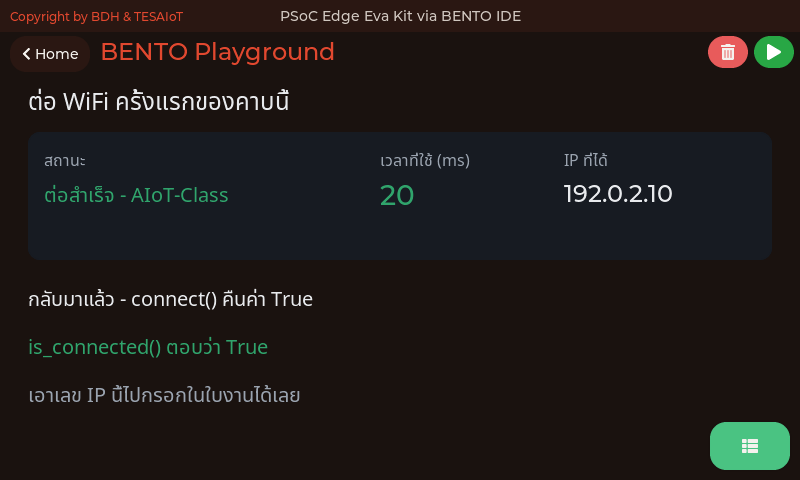
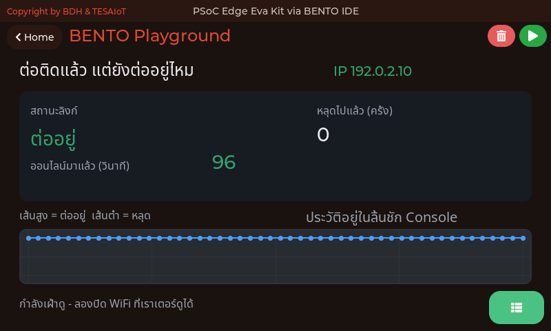
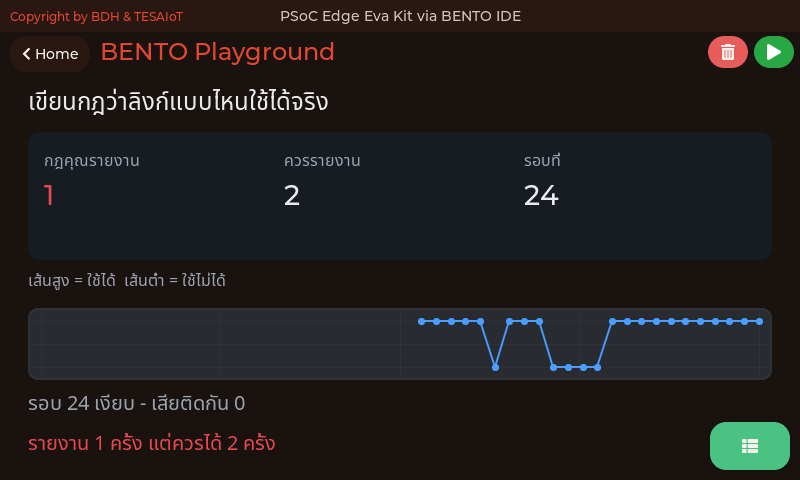
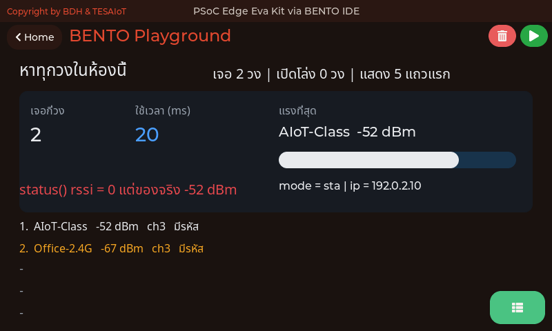
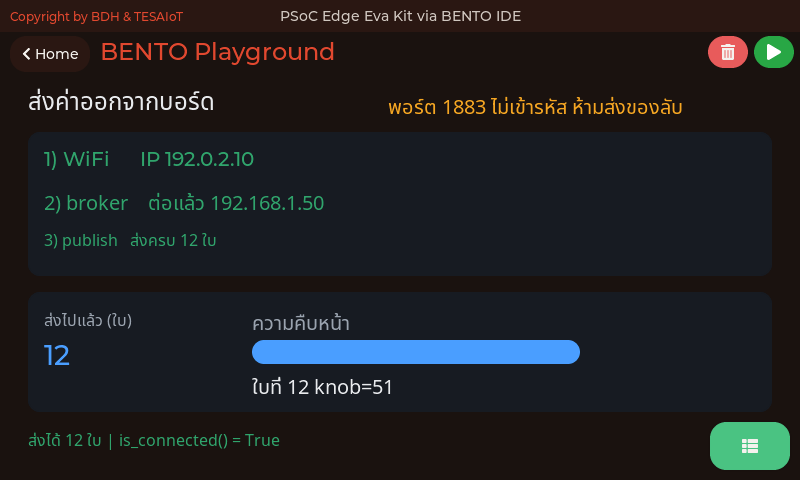
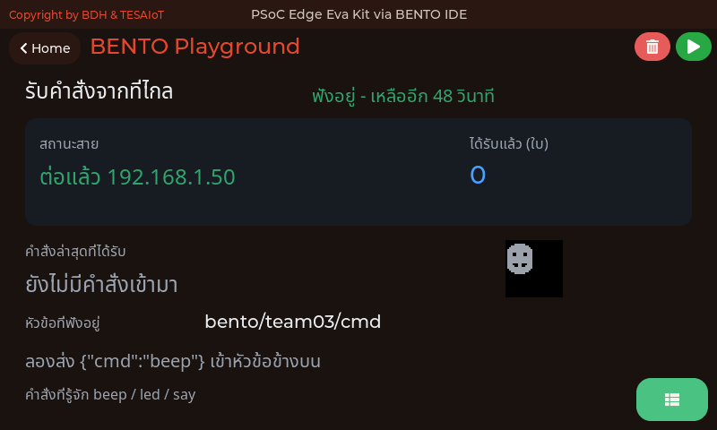
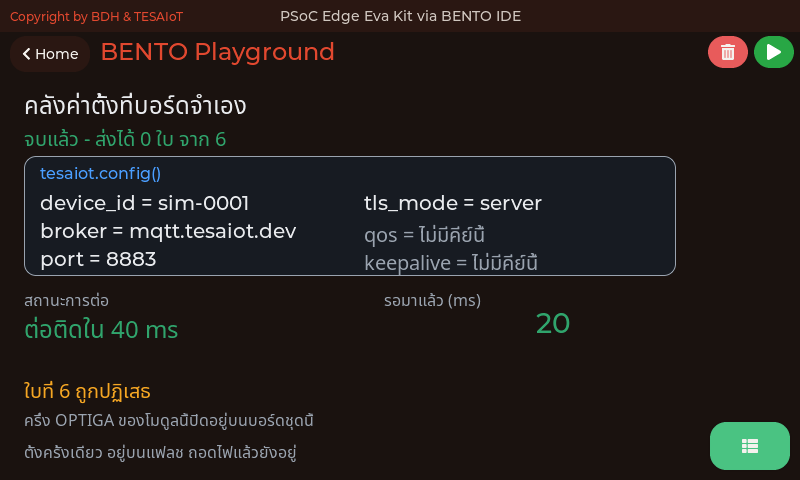

<!-- _class: cover -->

# บทเรียน 1.6 — ลงมือทำ: พาค่าจริงออกจากบอร์ด และสรุปโมดูล 1

## บอร์ดคุยกับโลก · ค่าที่วัดบนโต๊ะนี้ไปโผล่บนเครื่องคนอื่น แล้วคำสั่งจากที่ไกลกลับมาสั่งของบนโต๊ะเรา

**โมดูล 1 — แอปพลิเคชันบนจอที่มีอยู่แล้ว**

> ต่อจากบทเรียน 1.5 — ค่าออกไป คำสั่งกลับมา: MQTT บน broker สาธารณะ

---

## MVP checkpoint — ผ่านชุดบทเรียนนี้เมื่อ

**ทีมต่อบอร์ดเข้าเครือข่ายด้วย `wifi.connect()` แล้วรายงานหมายเลข IP ขึ้นจอสำเร็จ**

แปลเป็นสิ่งที่ตรวจได้จริง:

- [ ] แก้ `WIFI_SSID` และ `WIFI_PASS` ให้ตรงกับ Hotspot มือถือของทีมได้เอง
- [ ] [`01_wifi_first_connect.py`](https://github.com/tesaiot/tesa-qualification-program/blob/main/courses/aiot-micropython/m01-ui-application/l04-wifi-first-connect/examples/01_wifi_first_connect.py) ขึ้นเลข IP ที่ **ไม่ใช่** `0.0.0.0` บนจอ
- [ ] จดเวลาที่ `connect()` ใช้ทั้งกรณีรหัสถูกและรหัสผิด พร้อมอธิบายว่าทำไมต่างกัน
- [ ] [`04_scan_the_room.py`](https://github.com/tesaiot/tesa-qualification-program/blob/main/courses/aiot-micropython/m01-ui-application/l04-wifi-first-connect/examples/04_scan_the_room.py) ขึ้นรายชื่อวงในห้อง และชี้ได้ว่าเลข `status()` กับเลขจาก `scan()` ต่างกันตรงไหน
- [ ] [`02_link_uptime.py`](https://github.com/tesaiot/tesa-qualification-program/blob/main/courses/aiot-micropython/m01-ui-application/l04-wifi-first-connect/examples/02_link_uptime.py) เดินครบ 30 วินาที ทำให้ลิงก์หลุดจริงหนึ่งครั้ง แล้วชี้ได้ว่าหลุดวินาทีที่เท่าไร
- [ ] [`05_value_leaves_the_board.py`](https://github.com/tesaiot/tesa-qualification-program/blob/main/courses/aiot-micropython/m01-ui-application/l05-values-out-commands-back/examples/05_value_leaves_the_board.py) รันแล้ว**เห็นค่าของทีมตัวเองบนหน้าเว็บ** [`my_first_reader.html`](https://github.com/tesaiot/tesa-qualification-program/blob/main/courses/aiot-micropython/shared/web/my_first_reader.html) — หรือถ้าเน็ตของห้องกันไว้ อ่านจากจอได้ว่าสายขาดที่ขั้นไหนและเพราะอะไร
- [ ] [`06_command_comes_back.py`](https://github.com/tesaiot/tesa-qualification-program/blob/main/courses/aiot-micropython/m01-ui-application/l05-values-out-commands-back/examples/06_command_comes_back.py) รันแล้วบอกได้ว่าบอร์ดกำลังฟังหัวข้ออะไร และคำสั่งที่มันรู้จักมีอะไรบ้าง
- [ ] [`03_your_link_rule.py`](https://github.com/tesaiot/tesa-qualification-program/blob/main/courses/aiot-micropython/m01-ui-application/l05-values-out-commands-back/examples/03_your_link_rule.py) รายงานครบ 2 ครั้ง (เลขสองตัวบนจอตรงกัน)
- [ ] ถ่ายรูปหน้าจอบอร์ดแนบในบันทึกการเรียน

> ข้อที่ทีมส่วนใหญ่ตกคือข้อที่ห้า เพราะต้องออกแรงทำให้มันพังจริง · ข้อ 05 กับ 06 ผ่านเมื่อเห็นค่าของทีมบนหน้าเว็บ หรือถ้าเน็ตขององค์กรกันพอร์ตไว้ทั้งห้อง ทีมชี้จากจอได้ว่าสายขาดที่ขั้นไหน

---

## กับดักที่เจอบ่อย

| อาการ | สาเหตุที่แท้จริง | วิธีแก้ |
|---|---|---|
| จอนิ่งค้างนาน คิดว่าบอร์ดแฮงก์ | `wifi.connect()` กำลังทำงาน มันบล็อกได้ถึงราว 85 วินาที | รอให้จบ **อย่ากดรีเซ็ต** และคราวหน้าใส่ป้าย + `ui.poll()` ไว้ก่อนบรรทัดนั้น |
| จอว่างเปล่าตลอดช่วงที่รอ ทั้งที่เขียนป้ายไว้แล้ว | ลืมเคาะ `ui.poll()` ก่อนเข้าบรรทัดที่บล็อก | ย้าย `ui.poll()` ขึ้นมาไว้ก่อน `wifi.connect()` และก่อน `wifi.scan()` |
| โค้ดบอกว่าได้ IP แล้ว แต่ส่งอะไรก็ไม่ออก | เขียน `if wifi.ip():` — `"0.0.0.0"` เป็นสตริงที่ไม่ว่าง จึงถือว่าจริง | เทียบตรง ๆ `if wifi.ip() == "0.0.0.0":` |
| `connect()` คืน `False` ทุกครั้ง | SSID หรือรหัสผ่านผิด หรือบอร์ดไม่ได้ยินวงนั้นเลย | เปิด [`04_scan_the_room.py`](https://github.com/tesaiot/tesa-qualification-program/blob/main/courses/aiot-micropython/m01-ui-application/l04-wifi-first-connect/examples/04_scan_the_room.py) ก่อน แล้วดูว่าชื่อวงโผล่ในรายการไหม |
| กราฟความแรงสัญญาณเป็นเส้นศูนย์ตลอด | หยิบ `wifi.status()["rssi"]` มาใช้ ซึ่งเป็นค่าตายตัว | ความแรงจริงมาจาก `wifi.scan()` เท่านั้น |
| `mqtt.connect()` ได้ `TypeError` | ใส่ชื่ออาร์กิวเมนต์เป็น `user=` | ชื่อจริงคือ `username=` |
| ส่งไปได้สองสามใบแล้วโปรแกรมตาย | `publish()` ตอนสายหลุดไม่คืน `False` มันโยน `OSError` | ครอบด้วย `try / except OSError` ทุกครั้ง ไม่ใช่เช็กแค่ค่าที่คืน |
| ยิงคำสั่งมาสามใบ แต่บอร์ดนับได้ใบเดียว | กล่องรับของ `get_message()` มีช่องเดียว ใบใหม่ทับใบเก่า | ลด `POLL_MS` ให้ถามถี่ขึ้น และห้ามหลับยาวในลูป |
| สองบอร์ดผลัดกันหลุดทั้งบทเรียน | `client_id` ซ้ำกัน broker เตะตัวเก่าออกทุกครั้งที่ตัวใหม่เข้ามา บน broker สาธารณะชนได้กับทุกคนในโลก | ใช้ `TEAM` ที่ผู้สอนแจก ไม่ซ้ำกับทีมอื่น และคง `"bento-aiot-"` ไว้หน้า `DEVICE_ID` |
| บอร์ดส่งครบแต่หน้าเว็บว่าง | `TEAM` ในหน้าเว็บกับในไฟล์ไม่ตรงกัน หรือเปิดหน้าเว็บหลังบอร์ดส่งจบแล้ว (เฟิร์มแวร์ส่ง retain ไม่ได้) | ตรวจ `TEAM` สองที่ให้ตรงกัน แล้วรันไฟล์ 05 ใหม่ขณะหน้าเว็บเปิดอยู่ |
| หน้าเว็บขึ้นว่าผิดพลาดหรือต่อไม่ได้ | เน็ตกันพอร์ต 8884 ของเบราว์เซอร์ | ลองตัวสำรองที่ผู้สอนประกาศ `wss://test.mosquitto.org:8081/mqtt` หรือต่อฮอตสปอตมือถือ |
| ตั้ง `tesaiot.config_set("port", "1883")` แล้วไม่มีผล | `tesaiot.connect()` เลือกพอร์ตจากโหมด TLS เอง (8883/8884) ไม่อ่านคีย์ `port` | ใช้โมดูล `mqtt` กับ broker 1883 ส่วน `tesaiot` รอบทเรียน 4.4–4.6 กับ 4.7–4.9 |
| `seg.value(4218)` ขึ้น 4218 แต่ไม่ได้ 4218.0 | `.value()` ส่งได้แต่จำนวนเต็ม | ใช้ `seg.text("4218.0")` เมื่อต้องการทศนิยม |
| ข้อความไทยยาว ๆ ขาดหายท้ายบรรทัด | เกินเพดาน — `lcd.print()` 127 ไบต์ ป้าย `ui` 126 ไบต์ ไทยตัวละ 3 ไบต์ | แบ่งเป็นสองบรรทัด หรือใช้ท่าของ [`06_safe_print.py`](https://github.com/tesaiot/tesa-qualification-program/blob/main/courses/aiot-micropython/m01-ui-application/l02-first-lines-on-screen/examples/06_safe_print.py) |

> ครึ่งหนึ่งของตารางนี้ **ไม่มี error ให้จับสักตัว** โปรแกรมเดินผ่านไปเงียบ ๆ แล้วรายงานสิ่งที่ไม่จริง นั่นคือประเภทของบั๊กที่แพงที่สุดในงานเครือข่าย

---

## ลงมือทำ — งานของทีมในชุดบทเรียนนี้

<svg viewBox="0 0 940 132" xmlns="http://www.w3.org/2000/svg">
  <rect x="20" y="24" width="212" height="80" rx="8" fill="#e8f5e9" stroke="#2e7d32" stroke-width="2.5"/>
  <text x="126" y="54" text-anchor="middle" font-size="18" font-weight="700" fill="#2e7d32">ขั้นที่ 1 · ขึ้นวงให้ได้</text>
  <text x="126" y="80" text-anchor="middle" font-size="16" fill="#1b5e20">ไฟล์ 01 · 04</text>
  <rect x="248" y="24" width="212" height="80" rx="8" fill="#e3f2fd" stroke="#1565c0" stroke-width="2.5"/>
  <text x="354" y="54" text-anchor="middle" font-size="18" font-weight="700" fill="#1565c0">ขั้นที่ 2 · เฝ้าให้เห็นหลุด</text>
  <text x="354" y="80" text-anchor="middle" font-size="16" fill="#0d47a1">ไฟล์ 02 · เดินให้สุดห้อง</text>
  <rect x="476" y="24" width="212" height="80" rx="8" fill="#f3e5f5" stroke="#6a1b9a" stroke-width="3"/>
  <text x="582" y="54" text-anchor="middle" font-size="18" font-weight="700" fill="#6a1b9a">ขั้นที่ 3 · ออกไปกลับมา</text>
  <text x="582" y="80" text-anchor="middle" font-size="16" fill="#4a148c">ไฟล์ 05 · 06</text>
  <rect x="704" y="24" width="212" height="80" rx="8" fill="#fff3e0" stroke="#ef6c00" stroke-width="2.5"/>
  <text x="810" y="54" text-anchor="middle" font-size="18" font-weight="700" fill="#ef6c00">ขั้นที่ 4 · นิยามเอง</text>
  <text x="810" y="80" text-anchor="middle" font-size="16" fill="#e65100">ไฟล์ 03 · จนสองเลขตรงกัน</text>
</svg>

ชุดบทเรียนนี้ไม่มีไฟล์ฝึกแยกต่างหาก **งานของทีมคือไฟล์ตัวอย่างของชุดบทเรียนนี้เอง** ทำตามลำดับในตารางแล้วทำบล็อก "ตาคุณ" ท้ายไฟล์ให้ครบทุกไฟล์

ทำสี่ขั้น: **หนึ่ง** ขึ้นวงให้ได้และรู้ว่าบอร์ดได้ยินอะไรบ้าง **สอง** เฝ้าลิงก์แล้วออกแรงทำให้มันหลุดจริง **สาม** ส่งค่าออกไปแล้วรับคำสั่งกลับมา **สี่** เขียนกฎ `is_usable()` ของทีมเองจนบอร์ดบอกว่าผ่าน

**ทีมที่เสร็จก่อน** ลองรัน 05 กับ 06 พร้อมกันสองบอร์ดในทีมข้าง ๆ โดยให้บอร์ดหนึ่งส่งค่าลูกบิด แล้วอีกบอร์ดหนึ่งเป็นคนสั่งไฟกลับมา สองทีมจะได้เห็นว่าระบบที่มีอุปกรณ์มากกว่าหนึ่งตัวหน้าตาเป็นอย่างไร

> อย่าแก้หลายไฟล์พร้อมกันแล้วค่อยรันทีเดียว — ไฟล์ละครั้ง รันครั้ง จะรู้ทันทีว่าพังที่ไหน

---

## ส่งต่อข้อความรอบห้อง — เวลานี้เป็นของทั้งห้อง

<svg viewBox="0 0 940 150" xmlns="http://www.w3.org/2000/svg">
  <defs><marker id="k1" markerWidth="11" markerHeight="8" refX="11" refY="4" orient="auto" markerUnits="userSpaceOnUse">
    <path d="M0,0 L11,4 L0,8 z" fill="#6a1b9a" /></marker></defs>
  <rect x="20" y="30" width="130" height="56" rx="8" fill="#fff3e0" stroke="#ef6c00" stroke-width="2.5" />
  <text x="85" y="64" text-anchor="middle" font-size="18" font-weight="700" fill="#ef6c00">ผู้สอน</text>
  <rect x="190" y="30" width="120" height="56" rx="8" fill="#e8f5e9" stroke="#2e7d32" stroke-width="2" />
  <text x="250" y="64" text-anchor="middle" font-size="18" fill="#1b5e20">team01</text>
  <rect x="350" y="30" width="120" height="56" rx="8" fill="#e8f5e9" stroke="#2e7d32" stroke-width="2" />
  <text x="410" y="64" text-anchor="middle" font-size="18" fill="#1b5e20">team02</text>
  <text x="520" y="66" text-anchor="middle" font-size="22" font-weight="700" fill="#78909c">...</text>
  <rect x="570" y="30" width="120" height="56" rx="8" fill="#e8f5e9" stroke="#2e7d32" stroke-width="2" />
  <text x="630" y="64" text-anchor="middle" font-size="18" fill="#1b5e20">team19</text>
  <rect x="730" y="30" width="190" height="56" rx="8" fill="#fff3e0" stroke="#ef6c00" stroke-width="2.5" />
  <text x="825" y="64" text-anchor="middle" font-size="18" font-weight="700" fill="#ef6c00">team00 หยุดนาฬิกา</text>
  <line x1="152" y1="58" x2="188" y2="58" stroke="#6a1b9a" stroke-width="3" marker-end="url(#k1)" />
  <line x1="312" y1="58" x2="348" y2="58" stroke="#6a1b9a" stroke-width="3" marker-end="url(#k1)" />
  <line x1="472" y1="58" x2="496" y2="58" stroke="#6a1b9a" stroke-width="3" />
  <line x1="544" y1="58" x2="568" y2="58" stroke="#6a1b9a" stroke-width="3" marker-end="url(#k1)" />
  <line x1="692" y1="58" x2="728" y2="58" stroke="#6a1b9a" stroke-width="3" marker-end="url(#k1)" />
  <circle cx="160" cy="58" r="6" fill="#6a1b9a">
    <animate attributeName="cx" values="160;720;160" dur="4s" repeatCount="indefinite" /></circle>
  <text x="470" y="120" text-anchor="middle" font-size="18" fill="#546e7a">ทุกทอดต้องผ่านบอร์ดจริงของทีม หน้าเว็บรวมไม่เห็นหัวข้อ cmd จึงลัดทางไม่ได้</text>
</svg>

ทุกบอร์ดรัน [`06_command_comes_back.py`](https://github.com/tesaiot/tesa-qualification-program/blob/main/courses/aiot-micropython/m01-ui-application/l05-values-out-commands-back/examples/06_command_comes_back.py) ด้วย `TEAM` ของตัวเอง ไฟล์ 06 ฟังนาน 15 นาที (`LISTEN_MS = 900000`) พอสำหรับสองรอบ ถ้ารันค้างไว้นานกว่านั้นก่อนเกม ให้กดรันใหม่ก่อนเริ่ม

1. ผู้สอนส่งคำลับสั้น ๆ เป็น `say` ไปที่ `team01` จากหน้ารวม <https://advance-innovation-centre-aic.github.io/embedded-systems-for-aiot-developer/examples/web/mqtt_dashboard.html>
2. ทีมที่เห็นคำบนจอบอร์ดตัวเอง ให้**ศูนย์ควบคุม**ส่งคำเดิมไปทีมถัดไปจากหน้าเดียวกัน
3. ทีมสุดท้ายส่งกลับไป `team00` บนโต๊ะผู้สอน นาฬิกาหยุดเมื่อคำขึ้นจอหน้าห้อง · รอบสองแข่งกับเวลารอบแรกของห้องเราเอง

| คนนั่งบอร์ด | ศูนย์ควบคุม | คนจด | คนแก้ |
|---|---|---|---|
| ดูจอ อ่านคำออกเสียง | พิมพ์แล้วส่งต่อ | เวลาของห้องทั้งสองรอบ | คำไม่ขึ้น ดูลิ้นชัก Console ว่ามาถึงไหม |

> ถ้ามีคำที่ไม่มีใครในห้องส่งโผล่ขึ้นมา นั่นคือ broker สาธารณะทำงานตามที่มันเป็น ใครก็เขียนเข้ามาได้ · ห้องที่มีไม่ถึงสิบเก้าทีม ทีมสุดท้ายคือทีมที่เลขสูงสุด

---

## เชื่อมโยงรากฐาน — วันนี้เราแตะอะไรไปบ้าง

<svg viewBox="0 0 900 104" xmlns="http://www.w3.org/2000/svg">
  <rect x="10" y="12" width="285" height="80" rx="8" fill="#e3f2fd" stroke="#1565c0" stroke-width="2"/>
  <text x="152" y="38" text-anchor="middle" font-size="20" font-weight="700" fill="#1565c0">ฝั่งเครือข่าย</text>
  <text x="152" y="60" text-anchor="middle" font-size="17" fill="#0d47a1">เข้าร่วมวง · ขอเลขที่อยู่</text>
  <text x="152" y="80" text-anchor="middle" font-size="17" fill="#0d47a1">ส่งขึ้นหัวข้อ · ขอฟังหัวข้อ</text>
  <rect x="307" y="12" width="285" height="80" rx="8" fill="#e8f5e9" stroke="#2e7d32" stroke-width="2"/>
  <text x="450" y="38" text-anchor="middle" font-size="20" font-weight="700" fill="#2e7d32">ฝั่ง Python</text>
  <text x="450" y="60" text-anchor="middle" font-size="17" fill="#1b5e20">dict · JSON · bytes กับ str</text>
  <text x="450" y="80" text-anchor="middle" font-size="17" fill="#1b5e20">try/except · เทียบสตริง</text>
  <rect x="604" y="12" width="285" height="80" rx="8" fill="#fff3e0" stroke="#ef6c00" stroke-width="2"/>
  <text x="746" y="38" text-anchor="middle" font-size="20" font-weight="700" fill="#ef6c00">ฝั่งออกแบบระบบ</text>
  <text x="746" y="60" text-anchor="middle" font-size="17" fill="#e65100">ล้มเหลวแล้วต้องบอกว่าที่ขั้นไหน</text>
  <text x="746" y="80" text-anchor="middle" font-size="17" fill="#e65100">ไม่เชื่อข้อมูลที่คนอื่นส่งมา</text>
</svg>

**ฝั่งเครือข่าย**
การเข้าร่วมเครือข่ายเป็นกระบวนการหลายจังหวะ ไม่ใช่คำสั่งเดียวจบ · การได้เลขที่อยู่เป็นคนละขั้นกับการเข้าร่วมได้ · การส่งข้อความผ่านคนกลางที่เรียกว่า broker ทำให้ผู้ส่งกับผู้รับไม่ต้องรู้จักกัน · ความล้มเหลวใช้เวลามากกว่าความสำเร็จเสมอ เพราะมีการลองใหม่ซ่อนอยู่

**ฝั่ง Python และวิทยาการคอมพิวเตอร์**
`dict` กับการแปลงเป็น JSON · ความต่างระหว่าง `bytes` กับ `str` และเหตุที่ต้อง `.decode()` · `try/except` กับความล้มเหลวที่คาดไว้แล้ว · การเทียบสตริงตรง ๆ แทนการพึ่ง truthiness · การจับเวลาคร่อมคำสั่งที่เราควบคุมไม่ได้

**ฝั่งการออกแบบระบบ**
โปรแกรมที่ล้มเหลวต้องบอกให้ได้ว่าล้มที่ขั้นไหน · ข้อมูลที่มาจากคนอื่นต้องตรวจก่อนใช้เสมอ · การรอหลักฐานหลายรอบก่อนรายงาน · การใช้ข้อมูลที่บันทึกไว้แล้วเป็นชุดทดสอบ แทนการหวังพึ่งสภาพจริงที่ควบคุมไม่ได้

> ข้อสุดท้ายคือของที่ทีมทดสอบซอฟต์แวร์ทั่วโลกใช้ทุกวัน และวันนี้ผู้เรียนได้ใช้มันไปแล้วโดยไม่รู้ตัว

---

## งานทำเอง 30% + สรุปบทเรียน

<svg viewBox="0 0 900 92" xmlns="http://www.w3.org/2000/svg">
  <circle cx="110" cy="46" r="26" fill="#e3f2fd" stroke="#1565c0" stroke-width="2" />
  <text x="110" y="52" text-anchor="middle" font-size="17" font-weight="700" fill="#1565c0">ขึ้นวง</text>
  <line x1="140" y1="46" x2="188" y2="46" stroke="#90a4ae" stroke-width="2" /><polygon points="194,46 182,40 182,52" fill="#90a4ae" />
  <circle cx="224" cy="46" r="26" fill="#e8f5e9" stroke="#2e7d32" stroke-width="2" />
  <text x="224" y="52" text-anchor="middle" font-size="17" font-weight="700" fill="#2e7d32">เฝ้าเป็น</text>
  <line x1="254" y1="46" x2="302" y2="46" stroke="#90a4ae" stroke-width="2" /><polygon points="308,46 296,40 296,52" fill="#90a4ae" />
  <circle cx="338" cy="46" r="26" fill="#f3e5f5" stroke="#6a1b9a" stroke-width="2" />
  <text x="338" y="52" text-anchor="middle" font-size="16" font-weight="700" fill="#6a1b9a">ส่งออก</text>
  <line x1="368" y1="46" x2="416" y2="46" stroke="#90a4ae" stroke-width="2" /><polygon points="422,46 410,40 410,52" fill="#90a4ae" />
  <circle cx="452" cy="46" r="26" fill="#fff3e0" stroke="#ef6c00" stroke-width="2">
    <animate attributeName="stroke-width" values="2;4;2" dur="1.8s" repeatCount="indefinite" /></circle>
  <text x="452" y="52" text-anchor="middle" font-size="16" font-weight="700" fill="#ef6c00">รับกลับ</text>
  <text x="520" y="40" font-size="19" font-weight="700" fill="#455a64">ชุดบทเรียนถัดไป: สั่งฮาร์ดแวร์เองเป็นครั้งแรก</text>
  <text x="520" y="64" font-size="17" fill="#78909c">หลอด LED บนบอร์ด กับปุ่มผู้ใช้จริง</text>
</svg>

**วันนี้เราได้:**  พาบอร์ดขึ้นเครือข่ายด้วยโค้ดของเราเอง · ให้บอร์ดสำรวจคลื่นทั้งห้องแล้ววินิจฉัยตัวเองได้ · แยก "ต่อติดตอนนั้น" ออกจาก "ยังต่ออยู่ตอนนี้" · **ส่งค่าจริงออกไปให้เครื่องอื่นเห็น และรับคำสั่งจากที่ไกลกลับมาสั่งของบนบอร์ด** · เขียนกฎเองว่าลิงก์แบบไหนเรียกว่าใช้ได้

**การบ้านของทีม:** เลือกทำ 1 ข้อจากสี่ข้อในสไลด์ถัดไป จดลงบันทึกการเรียน

**บทเรียนถัดไปเราจะให้ปุ่มกับไฟขึ้น broker ด้วย** ชื่อชุดเดิมทั้งหมด `broker.hivemq.com` · `TEAM` · `bento-aiot/<ทีม>/...` ไฟล์ [`07_button_to_broker.py`](https://github.com/tesaiot/tesa-qualification-program/blob/main/courses/aiot-micropython/m02-ui-to-hardware/l03-led-button-lab/examples/07_button_to_broker.py) ส่งการกดปุ่มเป็น `event` และสถานะไฟใน `telemetry` แล้วรับ `cmd` จากหน้าเว็บเดิมมาเปิดปิดไฟ **เก็บหน้าเว็บของทีมไว้ ไม่ต้องปิด**

**ชุดบทเรียนถัดไป:** สองชุดบทเรียนแรกเราเล่นของที่ไลบรารีมีให้ครบแล้ว ตั้งแต่บทเรียน 2.1–2.3 เราจะ **สร้างมันขึ้นมาเองทีละชิ้น** เริ่มที่หลอด LED ทุกดวงบนบอร์ด (`gpio.num_leds()` บอกว่ากี่ดวง — Eva 3 · Dev Kit 5) กับปุ่มผู้ใช้จริงหนึ่งปุ่ม ผ่านโมดูล `gpio` ที่วันนี้เพิ่งได้เห็นผ่านตาในไฟล์ 06

> โครงลูป "อ่าน → ตัดสิน → รายงาน" ที่ใช้มาสองชุดบทเรียนแล้ว จะเป็นโครงเดียวกับชุดบทเรียนถัดไปเป๊ะ ๆ เปลี่ยนแค่ว่าปลายทางของการตัดสินคือหลอดไฟ ไม่ใช่ตัวหนังสือ

---

## เชื่อมจุดให้เห็นภาพ — วันนี้อยู่ตรงไหนของเส้นทาง

<svg viewBox="0 0 940 210" xmlns="http://www.w3.org/2000/svg">
  <line x1="40" y1="120" x2="900" y2="120" stroke="#b0bec5" stroke-width="4"/>
  <circle cx="150" cy="120" r="16" fill="#22d3ee"/>
  <circle cx="390" cy="120" r="16" fill="#a3c93a"/>
  <circle cx="630" cy="120" r="16" fill="#6cb2f5"/>
  <circle cx="850" cy="120" r="16" fill="#ffb066"/>
  <text x="150" y="88" text-anchor="middle" font-size="18" font-weight="700" fill="#0e7490">วันนี้ · บทเรียน 1.1–1.6</text>
  <text x="150" y="160" text-anchor="middle" font-size="19" fill="#455a64">เห็นของครบทั้งชุด</text>
  <text x="150" y="182" text-anchor="middle" font-size="19" fill="#455a64">แล้วพาบอร์ดถึงคนอื่น</text>
  <text x="390" y="88" text-anchor="middle" font-size="18" font-weight="700" fill="#5b7c14">บทเรียน 2.1–2.9</text>
  <text x="390" y="160" text-anchor="middle" font-size="19" fill="#455a64">สั่งฮาร์ดแวร์เอง</text>
  <text x="390" y="182" text-anchor="middle" font-size="19" fill="#455a64">ไฟ ปุ่ม จอสัมผัส</text>
  <text x="630" y="88" text-anchor="middle" font-size="18" font-weight="700" fill="#1565c0">บทเรียน 3.1–3.9</text>
  <text x="630" y="160" text-anchor="middle" font-size="19" fill="#455a64">อ่านเซนเซอร์</text>
  <text x="630" y="182" text-anchor="middle" font-size="19" fill="#455a64">วาดเป็นแดชบอร์ด</text>
  <text x="850" y="88" text-anchor="middle" font-size="18" font-weight="700" fill="#b45309">บทเรียน 4.1–5.3</text>
  <text x="850" y="160" text-anchor="middle" font-size="19" fill="#455a64">ส่งขึ้นแพลตฟอร์ม</text>
  <text x="850" y="182" text-anchor="middle" font-size="19" fill="#455a64">แล้วสร้างของจริง</text>
  <text x="470" y="36" text-anchor="middle" font-size="20" font-weight="700" fill="#37474f">ทุกอย่างที่เห็นวันนี้ อีกสิบชุดบทเรียนข้างหน้าเราจะสร้างมันขึ้นมาเองทีละชิ้น</text>
</svg>

สองชุดบทเรียนแรกจบแล้ว ผู้เรียนได้เห็นของทั้งชุดที่ไลบรารีนี้มีให้ ตั้งแต่จอ เซนเซอร์ เสียง ไปจนถึงการส่งข้อมูลออกไปให้คนที่อยู่คนละที่ **ไม่ใช่เพื่อให้จำได้หมด แต่เพื่อให้รู้ว่าปลายทางหน้าตาเป็นอย่างไร** ตั้งแต่ชุดบทเรียนถัดไปเราจะย้อนกลับไปสร้างมันทีละชิ้นด้วยมือตัวเอง

**คำถามคิดต่อ:** ถ้าบอร์ดของทีมต้องแขวนอยู่ในโรงงานหกเดือน แล้วส่งค่าออกไปทุกนาที · จะรู้ได้อย่างไรว่ามันหยุดส่งตอนตีสาม · และคำสั่งที่ส่งกลับมาได้ ควรมีใครสั่งได้บ้าง

---

## ต่อยอด — คิดต่อเอง (เลือกทำ 1 ข้อ)

<svg viewBox="0 0 900 92" xmlns="http://www.w3.org/2000/svg">
  <rect x="14" y="14" width="205" height="64" rx="7" fill="#e3f2fd" stroke="#1565c0" stroke-width="2" />
  <text x="116" y="40" text-anchor="middle" font-size="19" font-weight="700" fill="#1565c0">1 · จอหน้าประตู</text>
  <text x="116" y="64" text-anchor="middle" font-size="16" fill="#5472a3">อ่านได้ในสายตาเดียว</text>
  <rect x="237" y="14" width="205" height="64" rx="7" fill="#f3e5f5" stroke="#6a1b9a" stroke-width="2" />
  <text x="339" y="40" text-anchor="middle" font-size="19" font-weight="700" fill="#6a1b9a">2 · ส่งของทีมเอง</text>
  <text x="339" y="64" text-anchor="middle" font-size="16" fill="#7e5a94">เปลี่ยนสิ่งที่อยู่ใน payload</text>
  <rect x="460" y="14" width="205" height="64" rx="7" fill="#e8f5e9" stroke="#2e7d32" stroke-width="2" />
  <text x="562" y="40" text-anchor="middle" font-size="19" font-weight="700" fill="#2e7d32">3 · คำสั่งของทีมเอง</text>
  <text x="562" y="64" text-anchor="middle" font-size="16" fill="#4a7c4e">เพิ่มคำสั่งที่สี่ให้บอร์ด</text>
  <rect x="683" y="14" width="205" height="64" rx="7" fill="#fff3e0" stroke="#ef6c00" stroke-width="2" />
  <text x="785" y="40" text-anchor="middle" font-size="19" font-weight="700" fill="#ef6c00">4 · เทปของทีมเอง</text>
  <text x="785" y="64" text-anchor="middle" font-size="16" fill="#a1683a">บันทึกแล้วเอาไปทดสอบ</text>
</svg>

**ข้อ 1 · จอหน้าประตู**  ดัดแปลง [`02_link_uptime.py`](https://github.com/tesaiot/tesa-qualification-program/blob/main/courses/aiot-micropython/m01-ui-application/l04-wifi-first-connect/examples/02_link_uptime.py) ให้เหลือข้อมูลน้อยที่สุดเท่าที่จะยังตอบคำถาม "ตอนนี้บอร์ดออนไลน์อยู่ไหม" ได้จากระยะสามเมตร ตัดอะไรออกไปบ้าง แล้วทำไมถึงกล้าตัดสิ่งนั้น

**ข้อ 2 · ส่งของทีมเอง**  แก้ `payload` ใน [`05_value_leaves_the_board.py`](https://github.com/tesaiot/tesa-qualification-program/blob/main/courses/aiot-micropython/m01-ui-application/l05-values-out-commands-back/examples/05_value_leaves_the_board.py) ให้ส่งค่าที่ทีมเลือกเองเพิ่มอีกอย่างจาก `sensors.snapshot()` แล้วเปิดหน้าเว็บ [`my_first_reader.html`](https://github.com/tesaiot/tesa-qualification-program/blob/main/courses/aiot-micropython/shared/web/my_first_reader.html) ดูว่าฝั่งรับเห็นคีย์ใหม่เป็นกล่องใหม่จริงไหม และคีย์นั้นควรตั้งชื่อว่าอะไรคนอื่นถึงจะเข้าใจ

**ข้อ 3 · คำสั่งของทีมเอง**  เพิ่มคำสั่งที่สี่ให้ [`06_command_comes_back.py`](https://github.com/tesaiot/tesa-qualification-program/blob/main/courses/aiot-micropython/m01-ui-application/l05-values-out-commands-back/examples/06_command_comes_back.py) นอกจาก `beep` `led` `say` ที่มีอยู่ แล้วอธิบายว่าถ้าคนส่งพิมพ์คำสั่งนั้นมาผิดรูปแบบ โปรแกรมของทีมจะทำอย่างไร

**ข้อ 4 · เทปของทีมเอง**  จดผลของ `wifi.is_connected()` กับ `wifi.ip()` จากการเดินจริงของทีม ลงเป็น `TAPE` ชุดใหม่ใน [`03_your_link_rule.py`](https://github.com/tesaiot/tesa-qualification-program/blob/main/courses/aiot-micropython/m01-ui-application/l05-values-out-commands-back/examples/03_your_link_rule.py) แล้วตั้ง `WANT_REPORTS` ให้ตรงกับที่ควรจะเป็น พร้อมอธิบายว่านับมาได้อย่างไร

> เขียนคำตอบลงบันทึกการเรียน แล้วเอามาเล่าให้เพื่อนฟังต้นชุดบทเรียนถัดไป

---

## หน้าจอของทุกไฟล์ในชุดบทเรียนนี้ (1/3)

  

<b>01</b> พาบอร์ดออกเน็ตครั้งแรก แล้วอ่านเลขที่อยู่ของมัน · <b>02</b> ต่อติดแล้ว กับยังต่ออยู่ ไม่ใช่คำถามเดียวกัน · <b>03</b> ไฟล์นี้รันได้ แต่มันมองไม่เห็นปัญหาแบบที่สอง

ภาพจากตัวจำลอง bento_sim ซึ่งเรนเดอร์ด้วยโค้ด CM55 ชุดเดียวกับที่รันบนบอร์ด ที่ 800x480 เท่าจอของทั้งสองบอร์ด — แสดง<b>หน้าจอที่ตัวอย่างสร้าง</b> ค่าจากเซนเซอร์ WiFi และไมค์เป็นค่าแทนบนเครื่องโฮสต์ ไม่ใช่ผลการวัดของบอร์ด

---

## หน้าจอของทุกไฟล์ในชุดบทเรียนนี้ (2/3)

  

**04** ให้บอร์ดฟังคลื่นทั้งห้อง แล้วบอกว่าใครอยู่ตรงไหนบ้าง · **05** ค่าที่วัดได้บนโต๊ะนี้ ไปโผล่บนเครื่องคนอื่น (ภาพเก่า ในภาพ broker ยังเป็นเลขแลนและหัวข้อเป็น `bento/eva-team03/...` ไฟล์ปัจจุบันใช้ `broker.hivemq.com` กับ `bento-aiot/team03/telemetry` รอถ่ายใหม่) · **06** คนอื่นพิมพ์คำสั่งจากที่ไกล แล้วไฟบนโต๊ะเราติด (ภาพเก่า ไฟล์ปัจจุบันฟัง `bento-aiot/team03/cmd` รอถ่ายใหม่)

ภาพจากตัวจำลอง bento\_sim ซึ่งเรนเดอร์ด้วยโค้ด CM55 ชุดเดียวกับที่รันบนบอร์ด ที่ 800x480 เท่าจอของทั้งสองบอร์ด — แสดง**หน้าจอที่ตัวอย่างสร้าง** ค่าจากเซนเซอร์ WiFi และไมค์เป็นค่าแทนบนเครื่องโฮสต์ ไม่ใช่ผลการวัดของบอร์ด

---

## หน้าจอของทุกไฟล์ในชุดบทเรียนนี้ (3/3)

**07** บอร์ดจำได้เองว่าจะต่อไปที่ไหน แม้ถอดไฟแล้วเสียบใหม่ (**ภาพเก่า** ถ่ายก่อนไฟล์เปลี่ยนเป็นอ่านอย่างเดียว ไฟล์ปัจจุบันจบหลังแสดงคลังค่าตั้งถ้ายังไม่ใส่ `PLATFORM_BROKER` รอถ่ายใหม่)

ภาพจากตัวจำลอง bento\_sim ซึ่งเรนเดอร์ด้วยโค้ด CM55 ชุดเดียวกับที่รันบนบอร์ด ที่ 800x480 เท่าจอของทั้งสองบอร์ด — แสดง**หน้าจอที่ตัวอย่างสร้าง** ค่าจากเซนเซอร์ WiFi และไมค์เป็นค่าแทนบนเครื่องโฮสต์ ไม่ใช่ผลการวัดของบอร์ด

---

## อ้างอิงและเครดิต

**เอกสารของผู้ผลิต**

- KIT\_PSE84\_EVAL PSOC™ Edge E84 Evaluation Kit guide (Eva Kit) — Infineon, 002-39007 Rev. \*B (2025-09-10) · §3.2.1 ระบบเชื่อมต่อไร้สาย และโมดูล CYW55513IUBG
- คู่มือบอร์ดฉบับเว็บ: <https://documentation.infineon.com/psocedge/docs/lne1762692969598>
- AIROC™ CYW55513 product page — Infineon: <https://www.infineon.com/products/wireless-connectivity/airoc-wi-fi-plus-bluetooth-combos>

**มาตรฐานและเอกสารเปิด**

- IEEE 802.11 — ลำดับ Scanning / Authentication / Association ที่อธิบายว่าทำไม `connect()` ถึงกินเวลาหลายวินาที และทำไมความล้มเหลวถึงกินเวลามากกว่า
- RFC 2131 (DHCP) — เหตุผลที่ลิงก์ขึ้นแล้วยังอาจไม่มีเลขที่อยู่ และที่มาของค่า `"0.0.0.0"`
- MQTT Version 3.1.1 — OASIS Standard: หัวข้อ (topic) การ publish และ subscribe ที่ไฟล์ 05 กับ 06 ใช้ · บทเรียน 4.4–4.6 เราจะกลับมาที่เอกสารนี้อย่างละเอียด
- RFC 8259 (JSON) — รูปแบบข้อความที่ `json.dumps()` กับ `json.loads()` ผลิตและอ่าน
- HiveMQ public broker `broker.hivemq.com` (1883 TCP · 8884 wss) ไม่มีรหัสผ่าน <https://www.hivemq.com/demos/websocket-client/> · หน้าเว็บ `examples/web/` ใช้ MQTT.js 5.16.0
- MicroPython documentation — <https://docs.micropython.org/>

**งานวิจัยที่กำหนดรูปร่างของชุดบทเรียนนี้**

- Carroll, J. M. et al. (1987–1990) — งานทดลองแบบมีกลุ่มควบคุม: คู่มือที่พาผู้เรียนลงมือทำงานจริงตั้งแต่ต้น ใช้เวลาเรียนน้อยกว่าและทำงานสำเร็จได้มากกว่าคู่มือที่ให้อ่านทฤษฎีก่อน · นี่คือเหตุผลที่ชุดบทเรียนนี้ให้รันไฟล์แรกตั้งแต่สไลด์ที่เจ็ด
- Mayer, R. E. — หลักการ pre-training: บอกชื่อและหน้าที่ของชิ้นส่วนสั้น ๆ ก่อนลงมือ · สไลด์ "โมดูล `wifi` มีอะไรให้ใช้บ้าง" จึงมีแค่ห้าช่อง ไม่ใช่สารบัญของทั้งไลบรารี
- ผลสำรวจนักพัฒนามืออาชีพ 80 คนเรื่องตัวอย่างโค้ด — ข้อร้องเรียนอันดับหนึ่งคือตัวอย่างไม่ช่วยให้คิดออกว่าจะประกอบชิ้นส่วนเข้าด้วยกันอย่างไร · นี่คือเหตุผลที่ไฟล์ 02 กับคู่ 05-06 ได้พื้นที่มากที่สุดในเด็คนี้

**หมายเหตุเรื่องภาพ**

ไดอะแกรม SVG ทุกภาพในเด็คนี้วาดขึ้นใหม่สำหรับหลักสูตรนี้ · ภาพลำดับการเข้าร่วมเครือข่ายมาจาก Wikimedia Commons ระบุที่มาไว้ใต้ภาพ · ภาพหน้าจอของ `04_scan_the_room.py` เป็นภาพจริงจากการรันที่ความละเอียดเท่าจอของทั้งสองบอร์ด · ภาพหน้า Playground เป็นภาพถ่ายจากบอร์ด Eva Kit จริง บันทึกโดยผู้สอน

ข้อเท็จจริงเกี่ยวกับพฤติกรรมของโมดูล `wifi` `mqtt` `tesaiot` `sensors` `gpio` `lcd` และ `ui` ตรวจสอบจากซอร์สโค้ดของโปรเจกต์ `KIT_PSE84_EVAL_EPC2-MicroPython-BentoClaw` (Eva Kit) `TESAIoT_KIT_PSE84_AI-Micropython-BentoClaw` (Dev Kit) และ `BENTO-TESAIoT-libraries` โดยตรง

> ตัวเลข 85 วินาทีคือเพดานที่วัดได้จริงบนบอร์ดตอนใส่รหัสผิด ไม่ใช่ค่าจากเอกสาร ทีมที่วัดได้ต่างจากนี้ บอกผู้สอนได้เลย
