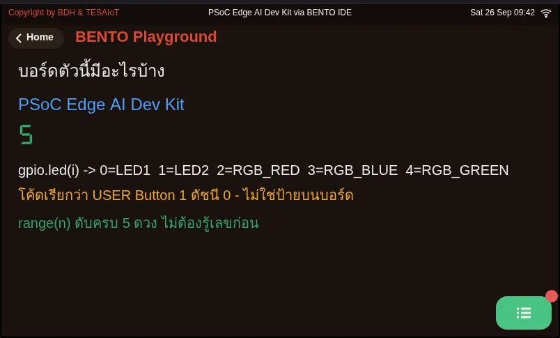
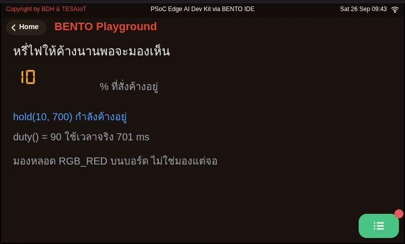

# Lesson 2.1 — The gpio module: LEDs, a button and a board that describes itself

> Module 2 — From Screen to Hardware · Slides: [slides.md](slides.md) · [Module overview](../README.md) · [Course page](../../README.md)

Open up all 18 names of the gpio module, drive the LEDs and read the real button from Python, then write code that asks the board itself how many LEDs it has, so one file runs on both the Eva Kit and the Dev Kit.

## Objectives

By the end of this lesson you will be able to:

1. Drive LEDs with gpio.led(n) using on(), off(), toggle() and value(n), looping over range(gpio.num_leds()) so one file turns off every LED on both the Eva Kit (3) and the Dev Kit (5)
2. Tell which methods report something measured (value() on an LED or the button, is_pressed()) and which only echo what you commanded (duty()), and state how they disagree with the visible LED after toggle() or hold()
3. Choose brightness(pct) or hold(pct, ms) correctly for LEDs with and without a hardware PWM route, and explain why dimming on this board goes through gpio rather than machine.PWM
4. Refer to the user button by gpio.button(0).name() ("USER Button 1") instead of the silkscreen label, and give the reason the name deliberately differs from the label

## Before you start

The first half of lessons 2.1–2.3 stays entirely on the desk — LEDs, a button and time — no WiFi needed yet.
Have your learning log ready to write down three things about your team's board: how many LEDs it has, what colour each one is, and what the code calls the button.
Your team's phone hotspot (the same name and password from lessons 1.4–1.6) and the team name your educator handed out will be needed again when you publish to the broker in lesson 2.3.

- **Equipment:** an Eva Kit or TESAIoT Dev Kit board with the BENTO MicroPython firmware installed, or the BENTO Emulator in [BENTO IDE](https://ide.tesaiot.dev/)
- **Before this:** [Lesson 1.6 — Hands-on: a real value leaves the board, module 1 wrap-up](../../m01-ui-application/l06-link-lab/README.md)

## See it work first

On the Eva Kit, open the **Controls** card and touch a coloured circle on screen — the real LED on the board follows your finger.
Teams with a Dev Kit have no such card; run `11_lights_and_a_button.py` from lesson 1.3 again instead and watch the LEDs.
Both paths show the same thing: a real thing changes state because of a command, but one that someone else already wrote for you.
In this lesson we open up the module behind it in full, so your team can write its own loop in lessons 2.2–2.3.

## Concepts

An embedded program is **a loop that reads something real, decides, and commands something real back**. The first tool is the `gpio` module,
which needs no init, no pin numbers, no mode to set: `gpio.led(n).on()`, `.off()`, `.toggle()`, `.value(1)`,
and `gpio.button(0).is_pressed()` all work right away. The number `n` runs from 0 to `gpio.num_leds() - 1`
(Eva Kit 3 LEDs, Dev Kit 5 LEDs); out of range raises `ValueError`, and there is only one button, index 0 — calling `gpio.button(1)` also raises `ValueError` on both boards.

The whole module has 18 names, no more: five functions (`board_info`, `num_leds`, `num_buttons`, `led`, `button`),
two types (`gpio.LED`, `gpio.Button`), eight LED methods and three button methods. What you must tell apart is which method reports
something measured and which only echoes what you commanded. `led.value()` reads the real pin level, but always returns 0 after `hold()`,
while `led.duty()` is the percentage you last commanded — it never measures the LED, and `toggle()` does not change this number.
On the button side, `is_pressed()` has already interpreted the reading for you (pressed = `True`), while `value()` is the raw electrical level, which reads 0 when pressed.

Dimming does not lower the pin's voltage; it switches on and off faster than the eye can follow, and the eye sees the average.
`brightness(pct)`, with pct from 1–99, picks a path depending on the LED's wiring: an LED on a hardware PWM route (Eva LED 0–2, Dev Kit RGB LEDs 2–4)
holds its level without blocking; other LEDs get a pulse of about 12 ms and then end with the LED off. If you need every LED to hold, use `hold(pct, ms)`,
which blocks for the full time (leave out `ms` and it defaults to 500) and also ends with the LED off; the button is not read while it blocks. If you just called `brightness()`
at a middle value on a PWM LED, you must call `off()` before `hold()` to release the pin. `brightness(100)` leaves the LED lit and held. This firmware has no
`machine.PWM`, `machine.ADC`, `machine.SPI`, and does not expose `machine.Timer` either; calling them raises `AttributeError`.
An answer you find online that starts with `machine.PWM(...)` is not for our board.

The habit of embedded work is **ask the device, never guess from memory**. `gpio.board_info()` returns a five-field dict
(`name`, `leds`, `buttons`, `led_names`, `btn_names`), and `for i in range(3)` fails silently on a Dev Kit that has five LEDs,
but `for i in range(gpio.num_leds())` stays correct even after you move to a different board.

Watch out for two name traps with different causes. On the Eva Kit, LED 2 is named `RGB_RED` but lights up blue, because the name is inherited from a table shared across the firmware.
The button's name, `USER Button 1`, was **deliberately chosen** to differ from the silkscreen label, because on the Dev Kit the word "SW2"
points to a power-cutoff switch on the base — never flip any switch on the base that a lesson has not told you to. The engineer's way is to command `on()` one LED at a time and watch with your own eyes,
write the result down once, and name your team's own constants.

## Worked example

Open the files in this order and record the results in your learning log.

1. **`01_board_info.py`** — guess first how many LEDs your team's board will report and what it calls the button, then run it and compare.
   Read the list of LEDs by index on screen, and the full dict in the computer's console. Then uncomment the `gpio.button(1)` line
   and run it once so you see the `ValueError` with your own eyes.
2. **Command `on()` one LED at a time** and watch the real board. Make a three-column table: index · name from `led_names` · colour seen with your eyes
   (Dev Kit: LED1/LED2 are on the module, the RGB LEDs are indexes 2–4).
3. **`03_led_brightness.py`** — move 1 commands `brightness(40)` once; watch the LED yourself and see whether it holds or blinks briefly.
   Move 2 compares `hold(10, …)` with `hold(90, …)`, and note how long `hold()` actually takes. Move 3 commands `on()` then `toggle()`,
   and shows that `duty()` still reports the old number even though the LED is off. Try changing `LOW`, `HIGH`, `HOLD_MS` and running it again.

| File | What this file teaches |
|---|---|
| [examples/01_board_info.py](examples/01_board_info.py) | Ask the board first what there is to play with |
| [examples/03_led_brightness.py](examples/03_led_brightness.py) | Hold a dimmed LED long enough for your eyes to compare two levels |

The slides for this lesson also refer to a file that lives in another lesson:

- [m01-ui-application/l03-inside-the-box/examples/11_lights_and_a_button.py](../../m01-ui-application/l03-inside-the-box/examples/11_lights_and_a_button.py) — real lights and a real button, controlled from one line of Python

**Screens from the BENTO Emulator** for this lesson's examples (click a file name to open the code)

<figure><figcaption><a href="examples/01_board_info.py"><code>01_board_info.py</code></a> Ask the board first what there is to play with</figcaption></figure>
<figure><figcaption><a href="examples/03_led_brightness.py"><code>03_led_brightness.py</code></a> Hold a dimmed LED long enough for your eyes to compare two levels</figcaption></figure>

## Check your understanding

The same questions are in [quiz.yaml](quiz.yaml) for automatic marking.

1. A team writes `for i in range(3): gpio.led(i).off()` on the Eva Kit, then runs the same file on the Dev Kit. What happens? *(choose one · objective 1)*
   - A) All five turn off, because the firmware adjusts the range for you
   - B) Only LEDs 0–2 turn off; LEDs 3–4 keep their previous state, with no error visible
   - C) It raises ValueError the moment i equals 3
   - D) The board resets itself, because the LED count does not match the code

   

Solution

   **B** — range(3) fails silently on a board with five LEDs; 0–2 are still in range so there is no ValueError, but LEDs 3–4 are never touched at all. Writing range(gpio.num_leds()) instead makes the same file run correctly on either board.

   

2. You command `led.hold(80, 700)` and it runs to completion. Which of these are correct? Choose every correct one. *(choose all that apply · objective 2)*
   - A) The LED is off
   - B) `led.value()` reports 0
   - C) `led.duty()` still reports 80
   - D) `led.value()` reports 80, because it reads back the brightness
   - E) `led.duty()` reports 0, because it measures the now-off LED

   

Solution

   **A, B, C** — hold() always ends with the pin low, so value(), which reads the pin level, gives 0. duty() is the number you last commanded — it never measures the LED — so it still reports 80. The number on screen is therefore not proof that the LED is actually lit.

   

3. A team commands `brightness(40)` on an LED with a hardware PWM route, then immediately calls `hold(80, 700)`. The LED does not change and does not turn off at the end. What should they do? *(choose one · objective 3)*
   - A) Change 700 to 0.7, because hold() takes time in seconds
   - B) Call `off()` before `hold()`, to release the pin from the PWM route
   - C) Import machine.PWM first, then call hold()
   - D) Use brightness(100) instead, because it ends with the LED off

   

Solution

   **B** — After brightness() at a middle value on a PWM LED, the pin is still held by PWM, so hold(), which toggles the GPIO pin directly, has no visible effect. You must call off() first. brightness(100) leaves the LED lit and held, and this board has no machine.PWM at all.

   

4. A teammate with a Dev Kit asks which button to press. What should you tell them? *(choose one · objective 4)*
   - A) Press the button printed SW2 on the base
   - B) Press the button the code calls USER Button 1, following the name btn.name() prints on screen
   - C) Flip the switches on the base one at a time until a number appears
   - D) Use gpio.button(1), because the Dev Kit has more buttons

   

Solution

   **B** — The name USER Button 1 was deliberately chosen to differ from the silkscreen label, because on the Dev Kit several switches printed "SW" are power-cutoff switches. Never flip a switch a lesson has not told you to, and gpio.button(1) raises ValueError on either board.

   

5. Which statements about dimming on this board are correct? Choose every correct one. *(choose all that apply · objective 3)*
   - A) brightness(40) on an LED with a hardware PWM route holds its level without blocking
   - B) brightness(40) on an LED without a PWM route gets a pulse of about 12 ms and then ends with the LED off
   - C) hold(pct, ms) blocks for the full time; the button is not read during that time
   - D) For finer dimming, call machine.PWM
   - E) brightness(100) ends with the LED off, like a middle value does

   

Solution

   **A, B, C** — brightness() picks a path depending on the LED's wiring: LEDs with a PWM route can hold, others get a short pulse and turn off. hold() can hold on any LED but blocks. machine.PWM does not exist in this port (calling it raises AttributeError), and brightness(100) leaves the LED lit and held.

   

## Going further

Lesson 2.2 opens up what happens behind the pin: why commanding 1 turns the LED on but pressing the button reads 0, why one press can be counted several times, and why a good loop must stop using `sleep` as its clock.

Next lesson: [Lesson 2.2 — Behind LEDs and buttons: active-low, debouncing and the endless loop](../l02-active-low-debounce/README.md)

## Reflect

- If you had to write one set of code to run on three board models with different numbers of LEDs, what would you ask the board before issuing any command?
- `duty()` answers what was commanded; `value()` answers the pin level. If you had to report the LED's status on screen, which would you trust — or would you trust neither, and why?
