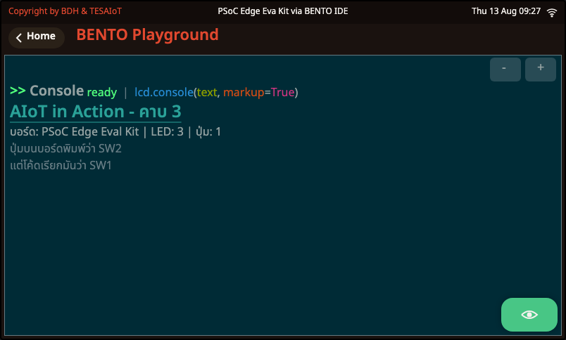
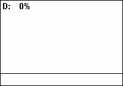
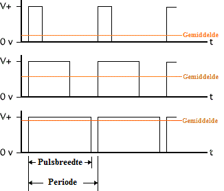
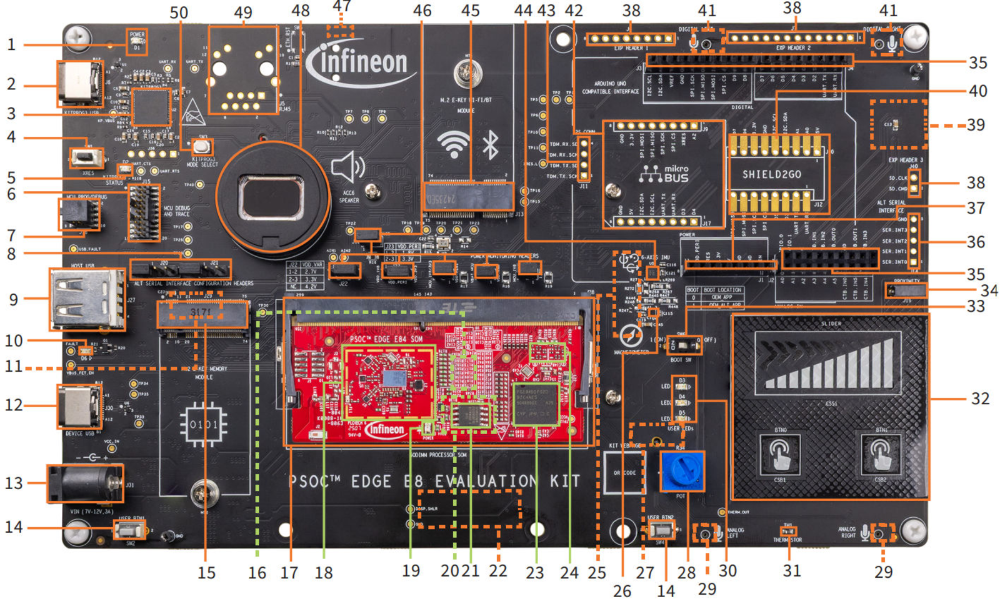

<style>
section { font-size: 24px; padding: 40px 52px; justify-content: flex-start; }
section h1 { font-size: 1.45em; line-height: 1.12; margin: 0 0 .22em; }
section h2 { font-size: 1.12em; margin: .15em 0; }
section h3 { font-size: 1.0em; margin: .12em 0; }
section p, section li { margin: .16em 0; line-height: 1.32; }
section img { max-width: 100%; height: auto; }
section svg { max-height: 252px; width: 100%; }
section iframe { border: 0; border-radius: 8px; box-shadow: 0 2px 10px rgba(0,0,0,.28); }
section table { font-size: .78em; }
section pre { font-size: .70em; line-height: 1.32; background:#0d1117; color:#e6edf3; border:1px solid #30363d; border-radius:8px; padding:12px 16px; box-shadow:0 2px 8px rgba(0,0,0,.25); }
section pre code { white-space: pre-wrap; background:transparent; color:inherit; } section pre .hljs-comment{color:#8b949e;font-style:italic} section pre .hljs-keyword,section pre .hljs-built_in,section pre .hljs-literal{color:#ff7b72} section pre .hljs-string{color:#a5d6ff} section pre .hljs-number{color:#79c0ff} section pre .hljs-title,section pre .hljs-title.function_,section pre .hljs-section{color:#d2a8ff} section pre .hljs-meta{color:#ffa657} section pre .hljs-attr,section pre .hljs-attribute,section pre .hljs-name{color:#7ee787}
section blockquote { margin: .25em 0; font-size: .92em; }
/* two images on a line (parity / 2x2 grids) stay side-by-side and small */
section p > img + img { margin-left: 10px; }
/* scroll-within-slide: dense slides scroll instead of clipping */
section { overflow-y: auto; overflow-x: hidden; }
section::-webkit-scrollbar { width: 11px; }
section::-webkit-scrollbar-thumb { background:#4a90d9; border-radius:6px; }
section::-webkit-scrollbar-track { background:rgba(0,0,0,.06); }
/* image drop-shadow + cover-slide readability (auto) */
section img{filter:drop-shadow(0 3px 12px rgba(0,0,0,.5))}
/* พื้นสำรองของสไลด์ปก: ถ้า img/cover_sNN.svg โหลดไม่ขึ้น ธีมจะคืนพื้นขาว
   แล้วตัวอักษรสีขาวของปกจะหายไปทั้งแผ่น — ปักสีเข้มไว้ให้ภาพเป็นแค่ของประดับ */
section.cover{background-color:#0b1426}
section.cover *{color:#fff !important}
section.cover h1,section.cover h2,section.cover h3,section.cover p,section.cover li,section.cover strong,section.cover em,section.cover blockquote,section.cover div{text-shadow:0 2px 9px rgba(0,0,0,.92),0 0 3px rgba(0,0,0,.8)}
section.cover div[style*="background:#"],section.cover div[style*="background: #"]{background:rgba(10,14,20,.66) !important;border-color:rgba(120,200,255,.45) !important;max-width:62%}
section.cover blockquote{border-left:4px solid rgba(120,200,255,.6) !important;background:rgba(13,17,23,.55) !important;border-radius:6px;padding:.3em .6em}
section.cover h1,section.cover h2,section.cover h3,section.cover p,section.cover blockquote{max-width:60%}
section.cover div:not(:has(img)){max-width:62%}
section.cover img{filter:none}
</style>


<!-- _class: cover -->

# บทเรียน 2.1 — โมดูล gpio: LED ปุ่ม และบอร์ดที่บอกได้ว่ามีอะไร

## LED ทุกดวงบนบอร์ด ปุ่มหนึ่งปุ่ม และลูปที่ไม่มีวันหยุด

**โมดูล 2 — จากจอสู่ฮาร์ดแวร์**

> คาถาประจำบทเรียน: **โปรแกรมฝังตัวคือลูปที่อ่านของจริง ตัดสิน แล้วสั่งของจริงกลับไป**

---

## เริ่มจากของที่เราเคยแตะแล้ว


<svg viewBox="0 0 940 260" xmlns="http://www.w3.org/2000/svg">
  <text x="470" y="28" text-anchor="middle" font-size="19" font-weight="700" fill="#37474f">วันนี้เราแทนที่ "นิ้ว + หน้า Controls (Eva)" ด้วย "ลูป Python ของเราเอง"</text>
  <rect x="30" y="52" width="230" height="150" rx="12" fill="#132033" stroke="#3d5a80" stroke-width="2"/>
  <text x="145" y="80" text-anchor="middle" font-size="18" fill="#8fb8e0">หน้า Controls (Eva Kit)</text>
  <circle cx="90" cy="130" r="26" fill="#4a2226"><animate attributeName="fill" values="#4a2226;#ef5350;#4a2226" dur="2.4s" repeatCount="indefinite"/></circle>
  <circle cx="145" cy="130" r="26" fill="#24402a"><animate attributeName="fill" values="#24402a;#66bb6a;#24402a" dur="2.4s" begin="0.8s" repeatCount="indefinite"/></circle>
  <circle cx="200" cy="130" r="26" fill="#1e3550"><animate attributeName="fill" values="#1e3550;#64b5f6;#1e3550" dur="2.4s" begin="1.6s" repeatCount="indefinite"/></circle>
  <text x="145" y="186" text-anchor="middle" font-size="17" fill="#6b8fb5">แตะด้วยนิ้ว</text>
  <rect x="345" y="52" width="250" height="150" rx="12" fill="#e3f2fd" stroke="#1565c0" stroke-width="2"/>
  <text x="470" y="82" text-anchor="middle" font-size="19" font-weight="700" fill="#1565c0">s03_led_button.py</text>
  <text x="470" y="112" text-anchor="middle" font-size="18" fill="#0d47a1">gpio.led(i).on()</text>
  <text x="470" y="140" text-anchor="middle" font-size="18" fill="#0d47a1">btn.is_pressed()</text>
  <text x="470" y="168" text-anchor="middle" font-size="17" fill="#5472a3">ลูปของทีมเรา บน CM33</text>
  <text x="470" y="192" text-anchor="middle" font-size="17" fill="#5472a3">ไม่ต้องพึ่งหน้า Controls</text>
  <rect x="680" y="52" width="230" height="150" rx="12" fill="#fff8e1" stroke="#f57f17" stroke-width="2"/>
  <text x="795" y="82" text-anchor="middle" font-size="19" font-weight="700" fill="#f57f17">หลอดจริงบนบอร์ด</text>
  <circle cx="740" cy="132" r="20" fill="#c62828"><animate attributeName="fill" values="#c62828;#f2dcd8;#f2dcd8;#c62828" dur="2.4s" repeatCount="indefinite"/></circle>
  <circle cx="795" cy="132" r="20" fill="#dcecdd"><animate attributeName="fill" values="#dcecdd;#43a047;#dcecdd;#dcecdd" dur="2.4s" repeatCount="indefinite"/></circle>
  <circle cx="850" cy="132" r="20" fill="#dae5ef"><animate attributeName="fill" values="#dae5ef;#dae5ef;#1e88e5;#dae5ef" dur="2.4s" repeatCount="indefinite"/></circle>
  <text x="795" y="186" text-anchor="middle" font-size="15" fill="#a1683a">Eva: D3 D4 D5 · Dev Kit: 5 ดวง</text>
  <line x1="262" y1="127" x2="341" y2="127" stroke="#90a4ae" stroke-width="3" stroke-dasharray="7 6"/>
  <text x="302" y="118" text-anchor="middle" font-size="17" fill="#78909c">เดิม</text>
  <line x1="597" y1="127" x2="676" y2="127" stroke="#455a64" stroke-width="4"/>
  <text x="637" y="118" text-anchor="middle" font-size="17" font-weight="700" fill="#37474f">วันนี้</text>
  <text x="470" y="234" text-anchor="middle" font-size="17" fill="#78909c">หลอดเดียวกัน ปุ่มเดียวกัน เปลี่ยนแค่ว่าใครเป็นคนสั่ง</text>
</svg>

เปิดบอร์ด แตะการ์ด **Controls** แล้วแตะวงกลมสีบนจอ หลอด LED จริงบนบอร์ดติดตามนิ้วเรา (การ์ดนี้มีเฉพาะ **Eva Kit** — ทีมที่ถือ **Dev Kit** ให้รัน [`11_lights_and_a_button.py`](https://github.com/tesaiot/tesa-qualification-program/blob/main/courses/aiot-micropython/m01-ui-application/l03-inside-the-box/examples/11_lights_and_a_button.py) ซ้ำอีกรอบแล้วมองหลอดแทน ได้เห็นสิ่งเดียวกัน: ของจริงเปลี่ยนสถานะเพราะคำสั่ง)

บทเรียน 1.1–1.3 เราเรียกสิ่งนี้ว่า "แตะกระจกแล้วของจริงเปลี่ยนสถานะ" วันนี้เราจะทำสิ่งเดียวกัน แต่ไม่ผ่านนิ้ว

**วันนี้เราจะสั่งไฟดวงเดียวกันนี้ด้วยลูปที่ทีมเขียนเอง** — บทเรียน 1.1–1.3 เรารัน [`11_lights_and_a_button.py`](https://github.com/tesaiot/tesa-qualification-program/blob/main/courses/aiot-micropython/m01-ui-application/l03-inside-the-box/examples/11_lights_and_a_button.py) ไปแล้ว และเห็นไฟติดจริง แต่นั่นคือโค้ดที่เขียนมาให้ วันนี้เราเปิดโมดูล `gpio` ออกดูให้ครบทุกคำสั่ง แล้วประกอบลูปของเราขึ้นมาใหม่

หน้า Controls (บน Eva Kit) เป็นโปรแกรมที่คนอื่นเขียนไว้ให้ พอจบชุดบทเรียนนี้เราจะมีโปรแกรมของเราเองที่ทำงานกับหลอดไฟและปุ่มเดียวกัน โดยไม่ต้องพึ่งหน้านั้นอีก — และรันได้ทั้งสองบอร์ด

> ของบนบอร์ดไม่ได้เป็นของหน้าจอไหนเป็นเจ้าของ — ใครสั่งก่อนก็ได้ไป

---

<style scoped>section p, section li { font-size:.9em } section blockquote { font-size:.8em }</style>

## จากชุดบทเรียนก่อนหน้า — บันไดสามขั้นของบทเรียน 1.4–1.6 ยังอยู่ในมือเรา

<svg viewBox="0 0 940 230" xmlns="http://www.w3.org/2000/svg">
  <defs><marker id="pv3" markerUnits="userSpaceOnUse" markerWidth="12" markerHeight="10" refX="11" refY="5" orient="auto">
    <path d="M0,0 L12,5 L0,10 z" fill="#455a64" /></marker></defs>
  <text x="470" y="26" text-anchor="middle" font-size="19" font-weight="700" fill="#37474f">บทเรียน 1.4–1.6 ปีนบันไดนี้ไปแล้ว ท้ายบทเรียนวันนี้เราจะปีนซ้ำ แล้ววางปุ่มกับไฟไว้บนยอด</text>
  <rect x="20" y="140" width="190" height="70" rx="10" fill="#e3f2fd" stroke="#1565c0" stroke-width="2" />
  <text x="115" y="170" text-anchor="middle" font-size="18" font-weight="700" fill="#1565c0">1 · WiFi</text>
  <text x="115" y="196" text-anchor="middle" font-size="17" fill="#0d47a1">wifi.connect()</text>
  <rect x="245" y="100" width="190" height="70" rx="10" fill="#e3f2fd" stroke="#1565c0" stroke-width="2" />
  <text x="340" y="130" text-anchor="middle" font-size="18" font-weight="700" fill="#1565c0">2 · ได้ IP</text>
  <text x="340" y="156" text-anchor="middle" font-size="17" fill="#0d47a1">ไม่ใช่ "0.0.0.0"</text>
  <rect x="470" y="60" width="190" height="70" rx="10" fill="#e3f2fd" stroke="#1565c0" stroke-width="2" />
  <text x="565" y="90" text-anchor="middle" font-size="18" font-weight="700" fill="#1565c0">3 · broker</text>
  <text x="565" y="116" text-anchor="middle" font-size="17" fill="#0d47a1">mqtt.connect()</text>
  <rect x="710" y="60" width="210" height="150" rx="10" fill="#e8f5e9" stroke="#2e7d32" stroke-width="3" />
  <text x="815" y="92" text-anchor="middle" font-size="18" font-weight="700" fill="#2e7d32">ท้ายบทเรียนวันนี้</text>
  <text x="815" y="122" text-anchor="middle" font-size="17" fill="#1b5e20">ปุ่มที่กันเด้งแล้ว</text>
  <text x="815" y="148" text-anchor="middle" font-size="17" fill="#1b5e20">ไฟที่จำสถานะเอง</text>
  <text x="815" y="174" text-anchor="middle" font-size="17" fill="#1b5e20">ขึ้น broker ทั้งคู่</text>
  <line x1="212" y1="160" x2="241" y2="146" stroke="#455a64" stroke-width="3" marker-end="url(#pv3)" />
  <line x1="437" y1="120" x2="466" y2="106" stroke="#455a64" stroke-width="3" marker-end="url(#pv3)" />
  <line x1="662" y1="96" x2="706" y2="112" stroke="#455a64" stroke-width="3" marker-end="url(#pv3)" />
</svg>

ทบทวนสั้น ๆ ก่อนลืม เพราะท้ายบทเรียนเราต้องใช้ทุกขั้น

- `wifi.connect()` บล็อกได้นานราว 85 วินาทีถ้าวงนั้นไม่มีในห้อง ป้าย "กำลังต่อ" จึงต้องขึ้นจอ**ก่อน**บรรทัดนี้
- `wifi.ip()` ที่ยังได้ `"0.0.0.0"` แปลว่ามีลิงก์แต่ยังไม่มีที่อยู่ ส่งอะไรออกไม่ได้
- `mqtt.publish()` ตอนสายหลุดไม่ได้คืน `False` มันโยน `OSError` · `get_message()` มีช่องเดียว ใบใหม่ทับใบเก่า

บอร์ดยังต่อ **Hotspot มือถือของทีม** เหมือนบทเรียน 1.4–1.6 (WiFi ขององค์กรต้อง login บอร์ดใช้ไม่ได้) `WIFI_SSID` `WIFI_PASS` ในไฟล์ 07 กับ 08 ใช้ชื่อกับรหัสชุดเดิม · ชุดบทเรียนนี้ใช้ broker สาธารณะ `broker.hivemq.com` พอร์ต 1883 และชื่อทีมที่ผู้สอนแจก (`team01` ถึง `team19`) ไฟล์ท้ายบทเรียนตั้งต้นเป็น `TEAM = "teamXX"` และไม่ยอมรันจนกว่าจะแก้ ใช้ชื่อทีมคนอื่นเมื่อไร บอร์ดของทีมนั้นถูกเตะหลุดทันที

> วันนี้ครึ่งแรกเป็นเรื่องบนโต๊ะล้วน ๆ ไฟ ปุ่ม และเวลา พอนับปุ่มได้ตรงแล้ว เราค่อยส่งมันออกไป

---

<style scoped>section table { font-size:.62em } section table td, section table th { padding:.16em .55em }</style>

## ทำไม · คืออะไร · ทำยังไง — แผนที่ของชุดบทเรียนนี้

|  | คำถาม | คำตอบของชุดบทเรียนนี้ | อยู่ช่วงไหน |
|---|---|---|---|
| **Why** | ทำไมต้องคุมขาสัญญาณเอง ในเมื่อจอก็แสดงผลได้แล้ว | เพราะ IoT ไม่ได้จบที่การ**แสดง**ค่า มันต้อง**สั่งของจริง**ให้ขยับ ทุกเครื่องจักรที่คุณเคยเห็นเปิดปิดเอง มีบรรทัดแบบนี้อยู่ข้างใน | ครึ่งแรก · ทฤษฎีกระแสสองเส้นทาง |
| **What** | มีอะไรให้ใช้บ้าง | โมดูล `gpio` **ทั้ง 18 ชื่อ** — ตัวไหนตอบ "สิ่งที่วัดได้" ตัวไหนตอบแค่ "สิ่งที่เราสั่งไป" · บวก `time.ticks_ms()` `ticks_diff()` สำหรับคุมจังหวะ | สไลด์บัญชี 18 ชื่อ |
| **How** | ประกอบยังไงให้ใช้งานได้จริง | ลูป polling ที่อ่านปุ่ม กันสัญญาณเด้ง แล้วสั่งไฟตามจังหวะที่ทีมตั้งเอง | หกไฟล์ตัวอย่าง + ไฟล์ฝึก · ท้ายบทเรียนอีกสองไฟล์ที่ส่งขึ้น broker (07 งานประยุกต์ · 08 เกมทั้งห้อง) |

**ปลายทางที่จับต้องได้** — ไฟทุกดวงบนบอร์ดวิ่งไล่กันตามจังหวะที่ทีมตั้ง (Eva 3 ดวง · Dev Kit 5 ดวง — โค้ดชุดเดียวกัน) และทุกครั้งที่กดปุ่มบนบอร์ด ตัวเลขบนจอเพิ่มขึ้นหนึ่ง

> บทเรียน 1.1–1.3 เห็นไฟติดจากโค้ดที่เราเขียนให้ · ชุดบทเรียนนี้เป็นคนเขียนลูปที่สั่งมันเอง

---

## เป้าหมายของชุดบทเรียนนี้

1. สั่ง LED บนบอร์ดด้วย `gpio.led(n)` ได้ทั้ง เปิด ปิด สลับสถานะ และสั่งด้วยตัวเลขที่คำนวณได้
2. อ่านปุ่มจริงด้วย `gpio.button(0).is_pressed()` แล้วบอกได้ว่า **polling** คืออะไร
3. เขียนลูปที่คุมจังหวะด้วย `time.sleep_ms()` และ `time.ticks_ms()/ticks_diff()` เป็น
4. อธิบายได้ว่าทำไมปุ่มถึง "เด้ง" และแก้ด้วยซอฟต์แวร์ได้
5. **บอกได้ว่าโมดูล `gpio` มีอะไรอยู่ทั้งโมดูล** และตัวไหนตอบ "สิ่งที่วัดได้" ตัวไหนตอบแค่ "สิ่งที่เราสั่งไป"
6. รู้จักกับดักชื่อของเฟิร์มแวร์ตัวนี้ — ชื่อที่โค้ดคืนกับป้ายบนแผ่นวงจรไม่ใช่ตัวเดียวกัน และรู้ว่าทำไมถึงจงใจให้เป็นแบบนั้น

ปลายทางของวันนี้: ไฟทุกดวงบนบอร์ดวิ่งไล่กันตามจังหวะที่ทีมตั้งเอง และทุกครั้งที่กดปุ่มบนบอร์ด ตัวเลขบนจอเพิ่มขึ้นหนึ่ง

> บทเรียน 1.1–1.3 เราเห็นไฟติดจากตัวอย่างที่เขียนมาให้ · ชุดบทเรียนนี้เราเป็นคนเขียนลูปที่สั่งมันเอง และรู้ว่าทุกคำสั่งในโมดูลนี้ทำอะไร

---

## ปลายทางของชุดบทเรียนนี้ — สามบรรทัดที่แปลว่าเราคุยกับบอร์ดรู้เรื่องแล้ว



<div style="font-size:.58em;color:#78909c;margin-top:-.3em">หน้าจอจริงจากการรันโค้ดเฉลยบน BENTO Emulator ที่ 800x480 เท่าจอของทั้งสองบอร์ด — ไม่ใช่ภาพวาด ไม่ใช่ mock-up และไม่ใช่ภาพถ่ายจากบอร์ด · <b>ภาพนี้เก่า</b> ถ่ายตอนเฟิร์มแวร์ยังตอบชื่อปุ่มว่า "SW1" และก่อนโค้ดเฉลยเปลี่ยนสองบรรทัดล่าง (16 ก.ย.) — บนบอร์ดจริงวันนี้บรรทัดล่างจะเป็นตามข้อสามข้างล่าง รอถ่ายใหม่</div>

- จอมีแค่ Console สามบรรทัด เพราะผลลัพธ์จริงของชุดบทเรียนนี้อยู่ที่ **LED บนตัวบอร์ด** ไม่ใช่บนจอ
- บรรทัดแรกเป็นค่าที่ถามบอร์ดเอาเอง: Eva Kit ตอบ LED 3 ดวง · Dev Kit ตอบ 5 ดวง · ปุ่ม 1 ปุ่มทั้งคู่
- อีกสองบรรทัดคือกับดักชื่อปุ่ม — โค้ดเรียกมันว่า `USER Button 1` ซึ่ง**ไม่ใช่**ป้ายที่พิมพ์บนแผ่นวงจร และบอร์ดสองรุ่นพิมพ์ต่างกัน (สไลด์ "กับดักชื่อ" เล่าว่าทำไม)

> จอที่ดูเรียบที่สุดในคอร์ส แต่ตอนรันจริงจะมี LED ไล่ดวงและตัวนับการกดปุ่มทำงานอยู่ข้าง ๆ

---

## สองชุดบทเรียนที่ผ่านมาเราสะสมอะไรไว้บ้าง

**บทเรียน 1.1–1.3** เป็นบทเรียนเดินชมของ เราไล่ดูว่าไลบรารีชุดนี้มีอะไรบ้าง และหนึ่งในนั้นคือ [`11_lights_and_a_button.py`](https://github.com/tesaiot/tesa-qualification-program/blob/main/courses/aiot-micropython/m01-ui-application/l03-inside-the-box/examples/11_lights_and_a_button.py) ที่ **สั่งหลอดไฟจริงและอ่านปุ่มจริงไปแล้ว** — ไฟไล่ทีละดวง หรี่ความสว่างด้วย `hold()` แล้วรอปุ่ม

**บทเรียน 1.4–1.6** เราส่งค่าจากบอร์ดออกไปถึงเครื่องอื่น และรับคำสั่งกลับมาจุดไฟบนบอร์ดนี้ ระหว่างทางได้อ่านเลข IP ของมัน แยก "ต่อติดตอนนั้น" ออกจาก "ยังต่ออยู่ตอนนี้" แล้วเขียนกฎของเราเองว่าลิงก์แบบไหนถึงเรียกว่าใช้งานได้

**พูดให้ตรง: วันนี้ไม่ใช่ครั้งแรกที่เราสั่งไฟ** ครั้งแรกอยู่ในบทเรียน 1.1–1.3 แล้ว สิ่งที่ต่างคือบทเรียนนั้นเรา **รันของที่เขียนมาให้** เพื่อดูว่าบอร์ดทำอะไรได้บ้าง วันนี้เราเปิดฝาโมดูล `gpio` ออกดูทั้งใบ แล้วเขียนลูปควบคุมของทีมเราเอง

สามอย่างที่บทเรียน 1.1–1.3 ให้เห็นผ่าน ๆ แล้ววันนี้จะรู้จริง: **เมื่อไร** `hold()` ถึงจำเป็น · **ทำไม** `duty()` ถึงเชื่อไม่ได้ · และ **ทำไม** ปุ่มที่กดครั้งเดียวถึงนับได้หลายครั้ง

เครื่องมือเดิมที่ยังใช้ต่อ: `lcd.print()` กับ markup, `time.sleep_ms()`, ลูป `for` และหน้า Playground

<svg viewBox="0 0 940 190" xmlns="http://www.w3.org/2000/svg">
  <rect x="20" y="46" width="270" height="104" rx="10" fill="#eceff1" stroke="#78909c" stroke-width="2"/>
  <text x="155" y="76" text-anchor="middle" font-size="19" font-weight="700" fill="#546e7a">บทเรียน 1.1–1.6 · เดินชมของ</text>
  <text x="155" y="104" text-anchor="middle" font-size="17" fill="#546e7a">รันตัวอย่างที่เขียนมาให้</text>
  <text x="155" y="130" text-anchor="middle" font-size="17" fill="#546e7a">เห็นไฟติดแล้ว แต่ยังไม่รู้กลไก</text>
  <rect x="335" y="46" width="270" height="104" rx="10" fill="#e8f5e9" stroke="#2e7d32" stroke-width="3"/>
  <text x="470" y="76" text-anchor="middle" font-size="19" font-weight="700" fill="#2e7d32">บทเรียน 2.1–2.3 · ผู้ควบคุม</text>
  <text x="470" y="104" text-anchor="middle" font-size="17" fill="#1b5e20">ลูปของเราสั่งของจริง</text>
  <text x="470" y="130" text-anchor="middle" font-size="17" fill="#1b5e20">อ่าน → ตัดสิน → สั่ง</text>
  <rect x="650" y="46" width="270" height="104" rx="10" fill="#e3f2fd" stroke="#1565c0" stroke-width="2"/>
  <text x="785" y="76" text-anchor="middle" font-size="19" font-weight="700" fill="#1565c0">บทเรียน 2.4–5.3 · โครงเดิม</text>
  <text x="785" y="104" text-anchor="middle" font-size="17" fill="#0d47a1">เปลี่ยนแค่ว่าอ่านอะไร</text>
  <text x="785" y="130" text-anchor="middle" font-size="17" fill="#0d47a1">และสั่งอะไร</text>
  <text x="470" y="28" text-anchor="middle" font-size="19" font-weight="700" fill="#37474f">วันนี้คือจุดที่บทบาทเปลี่ยน</text>
  <circle cx="292" cy="98" r="9" fill="#2e7d32"><animateMotion path="M0,0 L40,0" dur="1.8s" repeatCount="indefinite"/></circle>
  <circle cx="607" cy="98" r="9" fill="#1565c0"><animateMotion path="M0,0 L40,0" dur="1.8s" begin="0.9s" repeatCount="indefinite"/></circle>
  <text x="470" y="176" text-anchor="middle" font-size="17" fill="#78909c">สองชุดบทเรียนแรกสะสม "รู้ว่ามีอะไร" · วันนี้เพิ่ม "สั่งมันได้"</text>
</svg>

> ทุกบทเรียนต่อจากนี้จะมีลูปหลักเป็นแกน — วันนี้คือลูปแรกของเรา

---

## โมดูล gpio — สี่บรรทัดที่คุมของจริงได้

<style scoped>
section pre { font-size: .54em; line-height: 1.22; }
section svg { max-height: 84px; }
section img { max-height: 92px; }
section p { margin: .03em 0; font-size: .84em; line-height: 1.24; }
section blockquote { font-size: .74em; margin: .06em 0; line-height: 1.3; }
</style>

```python
import gpio
gpio.led(0).on()        # ติดค้าง
gpio.led(0).off()       # ดับ
gpio.led(1).toggle()    # สลับสถานะจากเดิม
gpio.led(2).value(1)    # สั่งด้วยตัวเลข 1 = ติด, 0 = ดับ
gpio.led(2).brightness(50)   # หรี่เป็นเปอร์เซ็นต์ของกำลังไฟ 0-100
pressed = gpio.button(0).is_pressed()   # True ตอนที่นิ้วกดอยู่
```

`gpio.led(n)` ไม่ต้อง init ไม่ต้องบอกขา ไม่ต้องตั้งโหมด — เฟิร์มแวร์จัดการให้ตอนเรียกครั้งแรก · `.name()` ขอชื่อของหลอดตามที่เฟิร์มแวร์รู้จัก — เดี๋ยวจะเจอว่าชื่อนี้มีเรื่อง

`n` ใช้ได้ตั้งแต่ **0 ถึง `gpio.num_leds() - 1`** — Eva Kit 3 ดวง (0-2) · Dev Kit 5 ดวง (0-4) นอกช่วงได้ `ValueError` ทันที · ดวงไหนสีอะไร และดวงไหนมองเห็นบนบอร์ดที่ประกอบแล้ว ให้สั่ง `on()` ทีละดวงแล้ว**ดูที่บอร์ดของทีม** (ในบันทึกการเรียน) — บน Dev Kit หลอด LED1/LED2 อยู่บนโมดูล ดวง RGB คือดวง 2-4

<svg viewBox="0 0 940 157" xmlns="http://www.w3.org/2000/svg">
  <text x="18" y="30" font-size="19" font-weight="700" fill="#37474f">สี่คำสั่งนี้ทำอะไรกับสถานะของหลอดหนึ่งดวง</text>
  <rect x="18" y="46" width="200" height="46" rx="8" fill="#e8f5e9" stroke="#2e7d32" stroke-width="2"/>
  <text x="118" y="76" text-anchor="middle" font-size="19" fill="#1b5e20">.on()</text>
  <text x="118" y="118" text-anchor="middle" font-size="17" fill="#546e7a">บังคับเป็น 1</text>
  <rect x="240" y="46" width="200" height="46" rx="8" fill="#eceff1" stroke="#78909c" stroke-width="2"/>
  <text x="340" y="76" text-anchor="middle" font-size="19" fill="#546e7a">.off()</text>
  <text x="340" y="118" text-anchor="middle" font-size="17" fill="#546e7a">บังคับเป็น 0</text>
  <rect x="462" y="46" width="200" height="46" rx="8" fill="#fff8e1" stroke="#f57f17" stroke-width="2"/>
  <text x="562" y="76" text-anchor="middle" font-size="19" fill="#e65100">.toggle()</text>
  <text x="562" y="118" text-anchor="middle" font-size="17" fill="#546e7a">กลับด้านจากเดิม</text>
  <rect x="684" y="46" width="238" height="46" rx="8" fill="#e3f2fd" stroke="#1565c0" stroke-width="2"/>
  <text x="803" y="76" text-anchor="middle" font-size="19" fill="#0d47a1">.value(1) / .value(0)</text>
  <text x="803" y="118" text-anchor="middle" font-size="17" fill="#546e7a">สั่งด้วยตัวเลขที่คำนวณได้</text>
  <circle cx="905" cy="26" r="10" fill="#c62828"><animate attributeName="r" values="6;11;6" dur="1.6s" repeatCount="indefinite"/></circle>
  <text x="885" y="32" text-anchor="end" font-size="17" fill="#78909c">ผลปลายทางคือหลอดจริง</text>
</svg>

<div style="display:flex;gap:14px;align-items:center;margin:.1em 0">
<div style="flex:0 0 296px;display:flex;gap:6px;align-items:center"></div>
<div style="flex:1 1 auto;font-size:.84em;line-height:1.24"><code>.brightness(pct)</code> ไม่ได้ลดแรงดันที่ขา แต่ <b>สลับติด-ดับเร็วกว่าที่ตาจับได้</b> แล้วปล่อยให้ตาเห็นเป็นค่าเฉลี่ย ภาพนิ่งอธิบายเรื่องนี้ไม่ได้ ต้องดูสองภาพซ้ายตอนมันเคลื่อน — ซ้าย สัดส่วนเวลาติดต่อหนึ่งคาบคือสิ่งเดียวที่เปลี่ยน · ขวา เส้นค่าเฉลี่ยไต่ตามความกว้างพัลส์ "ความสว่างที่ตาเห็น" คือค่าเฉลี่ย ไม่ใช่ค่าที่ขาส่งออกจริง <span style="font-size:.72em;color:#78909c">(ภาพ: "PWM duty cycle with label" สาธารณสมบัติ · "PWM gemiddelde waarde" โดย Jef daems CC0 1.0 — Wikimedia Commons)</span></div>
</div>


> `on()/off()` เมื่อรู้ว่าอยากได้สถานะไหน · `toggle()` เมื่อแค่อยากกลับด้าน · `brightness(pct)` ค่ากลาง 1-99 **เลือกทางตามขาของหลอด**: ดวงที่มีเส้น PWM ของฮาร์ดแวร์ (Eva 0-2 · Dev Kit ดวง RGB 2-4) ค้างระดับไว้ ไม่บล็อก · ดวงอื่นได้พัลส์ราว 12 ms แล้ว**จบด้วยหลอดดับ** · ค้างได้ทุกดวงด้วย `hold(pct, ms)` ซึ่งบล็อกจนครบแล้วจบด้วยหลอดดับ — **แต่ถ้าเพิ่งสั่ง `brightness()` ค่ากลางบนดวง PWM ต้องเรียก `off()` คั่นก่อน** ไม่งั้นขายังถูก PWM ถืออยู่ `hold()` ไม่เห็นผลและหลอดไม่ดับตอนจบ ([`03_led_brightness.py`](https://github.com/tesaiot/tesa-qualification-program/blob/main/courses/aiot-micropython/m02-ui-to-hardware/l01-gpio-leds-buttons/examples/03_led_brightness.py) ทำแบบนั้น) · `brightness(0)`/`100` ไม่บล็อก และ `100` ทิ้งหลอดติดค้าง · **มองหลอดจริงเป็นคนตัดสิน**

---

## ทั้งโมดูล gpio มีอยู่เท่านี้ (1/2) — สิบแปดชื่อ ไม่มีมากกว่านี้

<style scoped>
section table { font-size: .54em; }
section table td, section table th { padding: .08em .45em; line-height: 1.22; }
section p { margin: .05em 0; font-size: .9em; }
</style>

สไลด์นี้ไม่ได้ให้ท่อง แต่ให้ **รู้ว่าอะไรมีอยู่** จะได้ไม่ไปเขียนของที่ไม่มี แล้วนั่งงงว่าทำไม error

**ระดับโมดูล — ห้าฟังก์ชัน สองชนิด** (`import gpio` แล้วเรียกได้เลย)

| ชื่อ | คืนอะไร | ใช้ตอนไหน |
|---|---|---|
| `gpio.board_info()` | `dict` ห้าช่อง: `name` `leds` `buttons` `led_names` `btn_names` | เปิดโปรแกรมมา อยากรู้ว่าบอร์ดนี้มีอะไร |
| `gpio.num_leds()` | `int` — Eva Kit ได้ 3 · Dev Kit ได้ 5 | เขียน `range()` ให้ย้ายบอร์ดแล้วยังถูก — คอร์สนี้ย้ายจริง |
| `gpio.num_buttons()` | `int` — ได้ 1 เสมอ เพราะเฟิร์มแวร์ตรึงไว้ที่ 1 (ทั้งสองบอร์ด) | เช็กก่อนวนอ่านปุ่ม |
| `gpio.led(n)` | อ็อบเจกต์ `LED` · `n` นอกช่วง `0..num_leds()-1` โยน `ValueError` | ทุกครั้งที่จะสั่งไฟ |
| `gpio.button(n)` | อ็อบเจกต์ `Button` · `n` ต้องเป็น 0 เท่านั้น | ทุกครั้งที่จะอ่านปุ่ม |
| `gpio.LED` · `gpio.Button` | **ชนิด** ไม่ใช่ฟังก์ชัน เรียกสร้างเองไม่ได้ | `isinstance(x, gpio.LED)` ตอนเขียนฟังก์ชันที่รับได้ทั้งไฟและปุ่ม |

**เมธอดของ `LED` — แปดตัว** · **เมธอดของ `Button` — สามตัว**

| `LED` | ทำอะไร | กับดัก |
|---|---|---|
| `.on()` `.off()` | บังคับเป็น 1 / 0 | — |
| `.toggle()` | กลับด้านจากเดิม | **ไม่ไปแก้ตัวเลขของ `duty()`** พอ `on()` แล้ว `toggle()` หลอดดับแต่ `duty()` ยังตอบ 100 |
| `.value()` | อ่านระดับขาจริงกลับมา | หลัง `hold()` ได้ 0 เสมอ (และหลัง `brightness()` ค่ากลางบนดวงที่ไม่มีเส้น PWM) — ตอบระดับขา ไม่ตอบความสว่าง |
| `.value(n)` | ตัวเดียวกันแต่ใส่อาร์กิวเมนต์ = **สั่ง** 1/0 | ใช้ตอนค่ามาจากการคำนวณ |
| `.name()` | ชื่อในตารางเฟิร์มแวร์ | Eva: ดวงที่ 2 ตอบ `"RGB_RED"` แต่ติดเป็นน้ำเงิน · Dev Kit: มี `RGB_RED` `RGB_BLUE` `RGB_GREEN` ครบ — หาดวงจากชื่อได้ |
| `.brightness(pct)` | 1-99: ดวงที่มีเส้น PWM ของฮาร์ดแวร์ (Eva 0-2 · Dev Kit 2-4) **ค้างระดับไว้ ไม่บล็อก** · ดวงอื่นได้พัลส์ 12 ms หนึ่งชุด (200 µs × 60 รอบ) แล้ว**จบด้วยหลอดดับ** | 0 กับ 100 เป็นทางลัด สั่งขาตรง ๆ แล้วคืนทันที — **`100` จบด้วยหลอดติดค้าง ไม่ได้ดับ** · จะ `hold()` ต่อจาก `brightness()` ค่ากลางบนดวง PWM ให้ `off()` คั่นก่อน ([`03_led_brightness.py`](https://github.com/tesaiot/tesa-qualification-program/blob/main/courses/aiot-micropython/m02-ui-to-hardware/l01-gpio-leds-buttons/examples/03_led_brightness.py) ทำแบบนั้น) |
| `.hold(pct, ms)` | ย้ำพัลส์นั้นจนครบ `ms` · `ms` ไม่ใส่ได้ ปริยาย 500 · ใช้ได้ทุกดวง จบด้วยหลอดดับ | **บล็อกจนครบ** ระหว่างนั้นปุ่มไม่ถูกอ่าน · `100` ก็ค้างติดเหมือนกัน · ไม่ปลดเส้น PWM ให้ — ถ้าเพิ่ง `brightness()` ค่ากลางบนดวง PWM แล้วไม่ `off()` คั่น `hold()` จะไม่เห็นผลและหลอดไม่ดับตอนจบ |
| `.duty()` | เปอร์เซ็นต์ที่ **เราสั่งไปครั้งล่าสุด** | ไม่ได้ไปวัดหลอด · `on() off() value(n) brightness() hold()` เขียนตัวเลขนี้ทั้งหมด แต่ `toggle()` ไม่เขียน มันจึงเก่าได้ |

---

## ทั้งโมดูล gpio มีอยู่เท่านี้ (2/2) — ปุ่ม และของที่ไม่มีให้เรียก

<style scoped>
section table { font-size: .56em; }
section table td, section table th { padding: .08em .45em; line-height: 1.22; }
section p { margin: .05em 0; font-size: .9em; }
section blockquote { font-size: .8em; margin: .08em 0; }
</style>

**เมธอดของ `Button` — สามตัว**

| `Button` | ทำอะไร | กับดัก |
|---|---|---|
| `.is_pressed()` | `True` ตอนกดอยู่ — แปลความหมายให้แล้ว | ใช้ตัวนี้เป็นหลัก |
| `.value()` | ระดับไฟฟ้าดิบ **กด = 0** | `if btn.value():` ทำงานกลับด้านทั้งหมด |
| `.name()` | ชื่อในตารางเฟิร์มแวร์ | ตอบ `"USER Button 1"` ทั้งสองบอร์ด — **จงใจ**ไม่ใช้ป้ายบนแผ่นวงจร (สไลด์กับดักชื่อเล่าว่าทำไม) |

**ของที่เฟิร์มแวร์ตัวนี้ไม่มีให้เรียก** — เอกสาร MicroPython ต้นทางมีครบ แต่ที่นี่ไม่มี เรียกไปได้ `AttributeError` เหมือนกันหมด แม้เหตุผลจะไม่เหมือนกัน

| ชื่อ | สถานะจริง |
|---|---|
| `machine.PWM` · `machine.ADC` · `machine.SPI` | **พอร์ตนี้ไม่ได้เขียนไว้เลย** ไม่มีไฟล์ ไม่มีชื่อ |
| `machine.Timer` | **มีโค้ดอยู่ในพอร์ต แต่เฟิร์มแวร์ชุดนี้ไม่ได้เปิดสวิตช์คอมไพล์ให้** (เครื่องเกมของคอร์สอื่นเปิด) ผลที่เราเจอจึงเหมือนกันคือเรียกไม่ได้ |
| `machine.I2C` | อันนี้**มี** แต่ยังไม่ใช่เรื่องของชุดบทเรียนนี้ |

ไม่มี `machine.PWM` ให้เรียกจาก Python ก็จริง แต่ฝั่งเฟิร์มแวร์ `brightness()` ต่อดวง RGB เข้ากับ TCPWM ในตัวชิปให้แล้ว (ตาราง `s_led_pwm_routes` ใน `modgpio.c`) ดวงที่ไม่มีเส้นนั้นเท่านั้นที่ต้องกะพริบขาเองด้วยซอฟต์แวร์ — ดังนั้นการหรี่ไฟทำผ่าน `gpio` ไม่ใช่ผ่าน `machine`

> เห็นคำตอบใน Stack Overflow ที่ขึ้นต้นด้วย `machine.PWM(...)` เมื่อไร ให้รู้ทันทีว่าคำตอบนั้นไม่ใช่ของบอร์ดเรา

---

## ให้บอร์ดตอบเองว่ามีอะไรอยู่

<style scoped>
section pre { font-size: .54em; line-height: 1.25; }
section img { max-height: 132px; }
section p { margin: .04em 0; font-size: .88em; line-height: 1.26; }
section blockquote { font-size: .78em; margin: .08em 0; }
</style>

```python
info = gpio.board_info()
...
n = gpio.num_leds()        # 3 หรือ 5 แล้วแต่บอร์ด
...
for i in range(n):
    gpio.led(i).off()
...
print("board_info() =", info)
# Eva Kit:  {'name': 'PSoC Edge Eval Kit', 'leds': 3, 'buttons': 1,
#            'led_names': ['LED1', 'LED2', 'RGB_RED'], 'btn_names': ['USER Button 1']}
# Dev Kit:  {'name': 'PSoC Edge AI Dev Kit', 'leds': 5, 'buttons': 1,
#            'led_names': ['LED1', 'LED2', 'RGB_RED', 'RGB_BLUE', 'RGB_GREEN'], 'btn_names': ['USER Button 1']}
```

นิสัยที่ดีของงาน embedded คือ **ถามอุปกรณ์ ไม่ใช่เดาจากความจำ** — `for i in range(3)` จะพังเงียบ ๆ เมื่อย้ายไปบอร์ดที่มีห้าดวง (ซึ่งคือ Dev Kit ในห้องนี้) แต่ `for i in range(n)` ย้ายไปแล้วยังถูก (`gpio.num_buttons()` ตอบ 1 ทั้งสองบอร์ด) · สังเกตชื่อในรายการให้ดี `'RGB_RED'` บน Eva กับ `'USER Button 1'` บนทั้งสองบอร์ด — สองชื่อนี้ไม่ตรงกับสิ่งที่ตาเห็นหรือป้ายที่พิมพ์ไว้ คนละเหตุผลกัน



<div style="font-size:.54em;color:#78909c;margin-top:-.3em">ภาพ: KIT_PSE84_EVAL PSOC™ Edge E84 Evaluation Kit guide, Infineon 002-39007 Rev.*B, รูปที่ 2 (หน้า 9) — ใช้เพื่อการเรียนการสอน · นี่คือ Eva Kit: หลอด D3/D4/D5 และปุ่มผู้ใช้ (ป้ายบนแผ่นวงจร SW2) คือของที่ <code>board_info()</code> รายงานเป็น 3 ดวงกับ 1 ปุ่ม — Dev Kit รายงาน 5 ดวงกับ 1 ปุ่ม และคำตอบที่บอร์ดพูดเองคือคำตอบที่ย้ายบอร์ดแล้วยังถูก · ภาพหน้าจอของ <a href="https://github.com/tesaiot/tesa-qualification-program/blob/main/courses/aiot-micropython/m02-ui-to-hardware/l01-gpio-leds-buttons/examples/01_board_info.py"><code>01_board_info.py</code></a> ถอดออกชั่วคราว ไฟล์ถูกลดจำนวน widget ลงเมื่อ 14 ส.ค. รอถ่ายใหม่</div>

> เขียนโค้ดให้ถามบอร์ด แล้วโค้ดจะรอดตอนย้ายบอร์ด

---

## กับดักชื่อ — เรื่องที่ต้องรู้ก่อนเสียเวลาทั้งบ่าย

<style scoped>
section table { font-size: .52em; }
section table td, section table th { padding: .06em .4em; line-height: 1.22; }
section svg { max-height: 104px; }
section p { margin: .04em 0; font-size: .84em; line-height: 1.24; }
section blockquote { font-size: .74em; margin: .06em 0; }
</style>

| สิ่งที่โค้ดบอก | ความจริงบนบอร์ด | ต้องทำอย่างไร |
|---|---|---|
| `gpio.led(2).name()` คืน `"RGB_RED"` | **Eva Kit:** หลอดที่ติดจริงเป็นสี **น้ำเงิน** (ชื่อตกทอดจากตารางร่วม) · **Dev Kit:** ตารางเฟิร์มแวร์ (`modgpio.c`) บอกว่าดวง 2 คือแดง และมี `RGB_BLUE` `RGB_GREEN` เป็นดวง 3-4 — ยังไม่มีใครยืนยันด้วยตาบนบอร์ดที่ประกอบแล้ว ทีมเป็นคนแรก | เชื่อสายตา — สั่ง `on()` ทีละดวงแล้วดู ไม่ต้องเชื่อชื่อ |
| `gpio.button(0).name()` คืน `"USER Button 1"` | ไม่ใช่ป้ายบนแผ่นวงจร — Eva Kit พิมพ์ว่า **SW2** · **Dev Kit: บนฐาน QWA309 สวิตช์ที่พิมพ์ว่า SW หลายตัวเป็นสวิตช์ตัดไฟเลี้ยง** (ในผังวงจร SW2/SW3/SW4/SW11 คือสวิตช์ไฟของกล้อง/mikroBUS/ADU/RGB) **ห้ามโยกสวิตช์ใดบนฐานที่บทเรียนไม่ได้สั่ง** | **ตั้งใจ** ให้เป็นแบบนี้ — เรียกปุ่มด้วยชื่อจาก `.name()` เสมอ ห้ามบอกเพื่อนว่า "กด SW2" |
| บนบอร์ดมีปุ่มอื่นอีก (Eva: SW4 · Dev Kit: ปุ่มกดสองปุ่มของฐาน ใช้ผ่านโมดูล `buttons` เท่านั้น — ชื่อบนแผ่นรุ่นผลิต SW4/SW5) | `gpio.button(1)` **โยน `ValueError`** ทั้งสองบอร์ด | ชุดบทเรียนนี้ใช้ปุ่มเดียวคือ `gpio.button(0)` |
| `gpio.led(2).value()` คืน 0 ทั้งที่หลอดเพิ่งสว่าง | อ่านกลับได้จริง แต่ `hold()` (และ `brightness()` ค่ากลางบนดวงที่ไม่มี PWM) จบด้วยขาต่ำ | จำสถานะไว้ในตัวแปรของเราเอง |
| `duty()` ตอบ 100 ทั้งที่หลอดดับอยู่ | เพิ่งเรียก `toggle()` ซึ่ง **ไม่ไปแก้ตัวเลขของ `duty()`** | `duty()` คือ "สั่งอะไรไปล่าสุด" ไม่ใช่ "หลอดเป็นอย่างไรตอนนี้" |

**Eva Kit:** `led(0)` แดง · `led(1)` เขียว · `led(2)` น้ำเงิน — จำจากสายตา ไม่ใช่จากชื่อ · **Dev Kit:** ดวง RGB คือ 2-4 ตามชื่อใน `led_names` ส่วน LED1/LED2 อยู่บนโมดูล — ยืนยันด้วยสายตาบนบอร์ดของทีมเหมือนกัน

สองชื่อนี้หลอกด้วยเหตุผลคนละแบบ **`RGB_RED`** มาจากตารางร่วมของเฟิร์มแวร์ที่บอร์ดหลายรุ่นใช้ด้วยกัน ดวงที่สามของ Eva จึงได้ชื่อของดวงแดงบนบอร์ดอื่น · **`USER Button 1`** ตรงกันข้าม มัน**ถูกเลือกโดยตั้งใจ**ให้ไม่ตรงกับป้ายบนแผ่นวงจร เพราะบน Dev Kit คำว่า "SW2" ชี้ไปที่สวิตช์ตัดไฟบนฐาน — ชื่อที่มีไว้ให้คนหาปุ่มด้วยนิ้ว ต้องไม่พาไปกดของผิดชิ้น (เหตุผลเขียนไว้ใน `modgpio.c` ตรงตารางปุ่ม) · สิ่งที่วิศวกรทำคือ **ทดลองหนึ่งครั้งแล้วจดไว้** ไม่ใช่เถียงกับเอกสาร

<svg viewBox="0 0 940 170" xmlns="http://www.w3.org/2000/svg">
  <text x="185" y="28" text-anchor="middle" font-size="19" font-weight="700" fill="#c62828">ชื่อที่โค้ดตอบ</text>
  <text x="755" y="28" text-anchor="middle" font-size="19" font-weight="700" fill="#2e7d32">ของจริงที่ตาเห็น</text>
  <rect x="20" y="42" width="330" height="38" rx="7" fill="#ffebee" stroke="#c62828" stroke-width="2"/>
  <text x="185" y="67" text-anchor="middle" font-size="18" fill="#b71c1c">led(2).name() = "RGB_RED"</text>
  <rect x="590" y="42" width="330" height="38" rx="7" fill="#e8f5e9" stroke="#2e7d32" stroke-width="2"/>
  <text x="755" y="67" text-anchor="middle" font-size="17" fill="#1b5e20">Eva: หลอด D5 สว่างเป็นสีน้ำเงิน</text>
  <line x1="352" y1="61" x2="586" y2="61" stroke="#78909c" stroke-width="3" stroke-dasharray="8 6"/>
  <text x="469" y="52" text-anchor="middle" font-size="17" fill="#c62828">ไม่ตรงกัน (ชื่อตกทอด)</text>
  <rect x="20" y="100" width="330" height="38" rx="7" fill="#ffebee" stroke="#c62828" stroke-width="2"/>
  <text x="185" y="125" text-anchor="middle" font-size="17" fill="#b71c1c">button(0).name() = "USER Button 1"</text>
  <rect x="590" y="100" width="330" height="38" rx="7" fill="#e8f5e9" stroke="#2e7d32" stroke-width="2"/>
  <text x="755" y="125" text-anchor="middle" font-size="15" fill="#1b5e20">Eva พิมพ์ SW2 · Dev Kit: SW2 บนฐานคือสวิตช์ไฟ</text>
  <line x1="352" y1="119" x2="586" y2="119" stroke="#78909c" stroke-width="3" stroke-dasharray="8 6"/>
  <text x="469" y="110" text-anchor="middle" font-size="17" fill="#c62828">ไม่ตรงกัน (ตั้งใจ)</text>
  <text x="470" y="162" text-anchor="middle" font-size="17" fill="#37474f">ทางแก้: ดูสีด้วยตาครั้งเดียว แล้วตั้ง <tspan font-weight="700">LED_BLUE = ดัชนีที่เห็นว่าน้ำเงิน</tspan> · ปุ่มเรียกด้วย btn.name()</text>
</svg>

> อย่าให้ชื่อตัวแปรของทีมเราสืบทอดความสับสนต่อ — หาดัชนีดวงน้ำเงินครั้งเดียว (ตาเห็น หรือชื่อ `RGB_BLUE` ถ้าบอร์ดมี) แล้วตั้งชื่อว่า `LED_BLUE` ไปเลย · ส่วนปุ่ม ให้ป้ายบนจอพิมพ์ `btn.name()` ออกมาตรง ๆ คนก้มดูบอร์ดกับคนมองโค้ดจะได้เรียกปุ่มเดียวกันด้วยชื่อเดียวกัน
