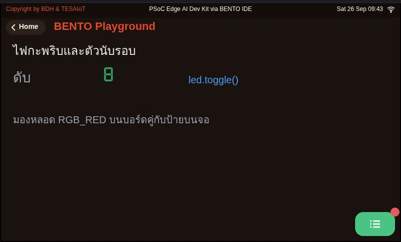
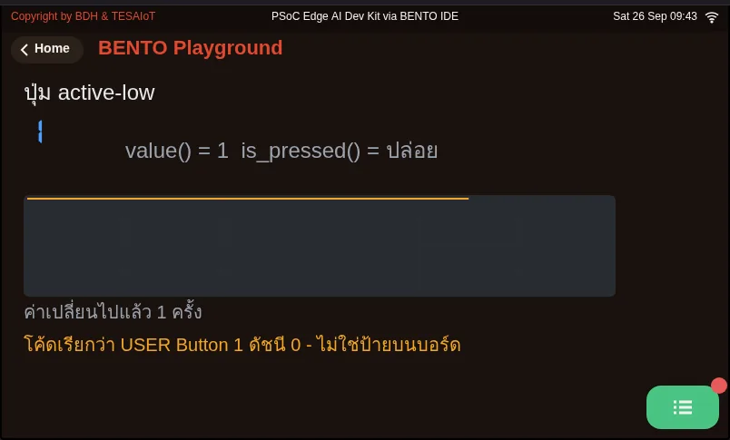
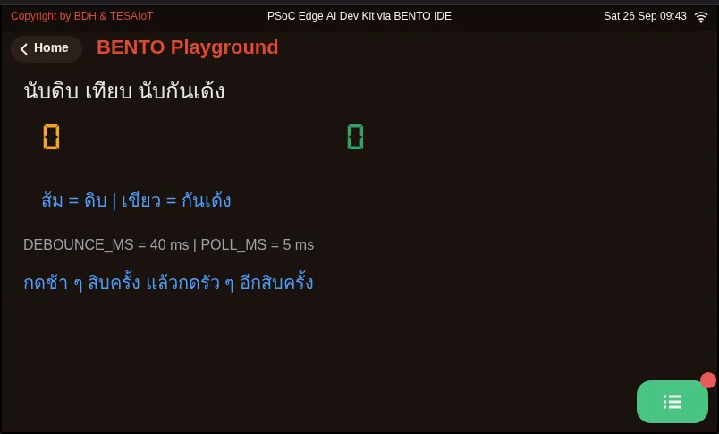
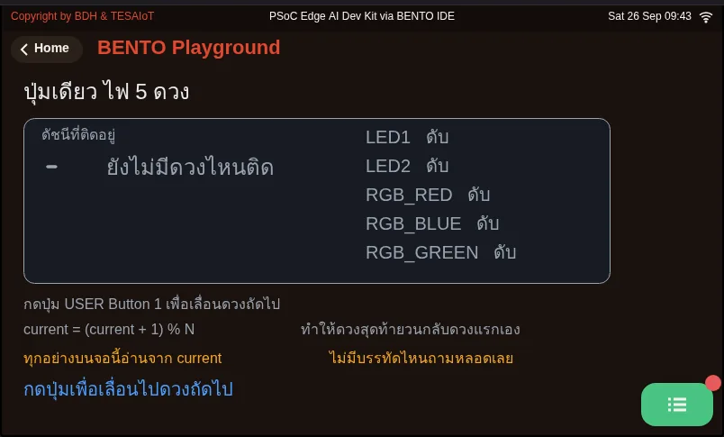

# Lesson 2.2 — Behind LEDs and buttons: active-low, debouncing and the endless loop

> Module 2 — From Screen to Hardware · Slides: [slides.md](slides.md) · [Module overview](../README.md) · [Course page](../../README.md)

Look behind the pins to see why an LED lights on 1 while the button reads 0 when pressed, why one press can count several times, and why a loop that never misses a press must stop using sleep as its timer.

## Objectives

By the end of this lesson you will be able to:

1. Explain the active-high LED circuit (the chip pin drives an n-MOSFET gate) and the active-low button (pull-up), predict btn.value() and btn.is_pressed() when pressed and released, and compute the Eva Kit red LED current from the series-resistor formula as about 5.9 mA
2. Trace debounce logic with raw, last_raw and stable and DEBOUNCE_MS = 40 so ten presses count exactly ten, and explain why count += 1 must sit under if stable
3. Advance an LED chase every STEP_MS with time.ticks_ms() and time.ticks_diff() in the same loop that polls the button every 5 ms without losing a press, and explain why last_step = now must stay inside the if and why times are not subtracted directly
4. Make the program remember which LED is lit (led_index) instead of asking the LED's value() or duty(), and start and end the program with every LED off

## Before you start

Review three things from lesson 2.1: `gpio.led(n)` commands an LED, `btn.is_pressed()` reports meaning, while `btn.value()` reports the raw electrical level,
and `duty()` only reports the number we last commanded. Have your board or Emulator ready with the BENTO Playground page open,
and have your learning log open to write down numbers from pressing the button, because this lesson has your team's own trial results answer several questions.

- **Equipment:** an Eva Kit or TESAIoT Dev Kit board with the BENTO MicroPython firmware installed, or the BENTO Emulator in [BENTO IDE](https://ide.tesaiot.dev/)
- **Before this:** [Lesson 2.1 — The gpio module: LEDs, a button and a board that describes itself](../l01-gpio-leds-buttons/README.md)

## See it work first

Run `04_button_active_low.py` and do not press anything yet. The big number on the left is 1, paired with the word "released".
Now hold the user button down: the number drops to 0, the word changes to "pressed", and the chart line drops at the same moment.
An LED lights when commanded 1, but the button reads 0 when pressed. This lesson starts by answering why these two are inverted.

## Concepts

**Active-high LEDs through a MOSFET.** The chip pin never supplies current to the LED at all — it connects to the **gate of an n-MOSFET**, which draws almost no current.
The LED's current comes from the 3.3 V rail, through a resistor, through the LED, into the drain, and down to ground. Commanding 1 at the gate opens the gate, so the LED lights.
On the Eva Kit (pins P16.7/P16.6/P16.5) the red LED D3 uses a 220 Ω resistor; putting that into the formula $I_F = (3.3 - V_F)/R$ with $V_F \approx 2.0$ V
(a common assumption for a red LED) gives about 5.9 mA. On the Dev Kit, the RGB LEDs sit at P20.6/P20.5/P20.4; the driving circuit there has not yet been checked against the datasheet,
but the code side is exactly the same. And because the gate can switch open and closed very fast, `brightness()` dims by flickering the gate rapidly, not by lowering the voltage.

**Active-low buttons.** When not pressed, a pull-up resistor holds the pin at the positive rail, so the value is 1. When pressed, the switch connects the pin to ground, so the value is 0.
This way the pin is never left floating. `btn.value()` returns this raw level, while `btn.is_pressed()` has already inverted it for you (pressed = `True`).
Use `value()` to understand the circuit, and `is_pressed()` to write logic.

**Polling and bouncing.** A program has no way of knowing on its own that someone pressed a button — all it can do is ask again, often enough. Every loop has three beats: read → decide → command.
A finger's fastest press is roughly 50–80 ms, so asking every 5–20 ms never misses it, but asking every 300 ms lets a press slip through silently, and `time.sleep_ms(5)`
is what returns the CPU to the screen, the sensors and WiFi. The next problem is that the metal contact bounces apart and reconnects for roughly 1–20 ms; a loop that asks every 5 ms
sees every one of those bounces, and if you counted every change, the number would jump by 3–5 for one single press. On the Eva Kit, the footprint for a debounce resistor and
capacitor is marked do-not-install (DNI), so this board depends entirely on the chip's internal pull-up and our own code.

**Debouncing in software** is a single rule: never trust a value that just changed; wait for it to sit still for `DEBOUNCE_MS` first. Three variables must be kept distinct:
`raw`, this round's raw value; `last_raw`, the previous round's raw value; `stable`, the value we have accepted as trustworthy. If `raw` moves, restart the timer; only once it has sat still long enough and differs from
`stable` do we accept it — and only count under `if stable:`, that is, count on the press-down edge, not the release. 40 ms works well for a typical button;
below 10 it still bounces through, above 200 the button starts to feel sluggish.

**Two clocks in one loop.** `sleep_ms(150)` halts the entire program; any press that happens during that sleep is never seen by anyone. `ticks_ms()`,
on the other hand, is the number of milliseconds since the board booted, and answers "is it time yet" without ever stopping. It must be compared with `ticks_diff(now, last_step)`,
because this counter runs up to a ceiling and wraps back around — subtracting directly would give a huge negative number right at the wrap. Our loop therefore sleeps briefly, 5 ms, every round, and lets
`ticks_diff` decide whether it is time to advance the light. Advancing follows an order: turn off the current LED → `led_index = (led_index + 1) % NUM_LEDS` → light the new one,
and `last_step = now` lives only inside the `if`. Finally, the program must **remember the state it commanded itself** (`led_index`), because `value()`
reports the pin level at the instant you ask (0 after `hold()`), and `duty()` only reports the last commanded number. Start with every LED off,
and always end with every LED off too. The loop runs for `RUN_MS` instead of `while True`, so the board is handed back to the team for the next run.

## Worked example

Go through in this order, predict before you run every time, and record the results in your learning log.

1. **`05_debounce_count.py`** — predict first whether the orange number (raw count) and the green number (debounced count) will differ after ten presses.
   Press ten times slowly, then ten more times as fast as you can, and record the difference between the two rounds — a difference of zero does not mean the button never bounces.
   Then lower `DEBOUNCE_MS` by 10 at a time and press ten times again each time, and note the value at which the green number starts to exceed the number of real presses.
   That number is your team's own answer to how much your board's button actually bounces.
2. **`02_led_blink.py`** — watch the label on screen against the real LED, and the round counter climbing by one at a time. Notice that this file keeps time with
   `sleep_ms` and always ends with `off()`, because ending with `toggle()` would leave the LED lit if the count is odd. Think about where a short press would get lost if you added button-reading into this same loop.
3. **`06_button_picks_led.py`** — one button advances the light one LED at a time with `current = (current + 1) % N`. Press until it wraps all the way around,
   and compare the row on screen with the real LEDs — everything on screen is read from the variable `current`, never asked from the LED itself. Try removing `if stable:` once
   and see by how many LEDs the light jumps per single press.

| File | What this file teaches |
|---|---|
| [examples/02_led_blink.py](examples/02_led_blink.py) | Make an LED blink to a rhythm, and count how many times it has blinked |
| [examples/04_button_active_low.py](examples/04_button_active_low.py) | On this button, 0 means pressed, not 1 |
| [examples/05_debounce_count.py](examples/05_debounce_count.py) | Count presses correctly, by waiting for the button to sit still first |
| [examples/06_button_picks_led.py](examples/06_button_picks_led.py) | One button controls every LED, by remembering its own state |

The slides for this lesson also refer to a file that lives in another lesson:

- [m02-ui-to-hardware/l03-led-button-lab/practice/s03_led_button.py](../l03-led-button-lab/practice/s03_led_button.py) — an LED chase over every LED plus a debounced button counter (fill-in version)

**Screens from the BENTO Emulator** for this lesson's examples (click a file name to open the code)

<figure><figcaption><a href="examples/02_led_blink.py"><code>02_led_blink.py</code></a> Make an LED blink to a rhythm, and count how many times it has blinked</figcaption></figure>
<figure><figcaption><a href="examples/04_button_active_low.py"><code>04_button_active_low.py</code></a> On this button, 0 means pressed, not 1</figcaption></figure>
<figure><figcaption><a href="examples/05_debounce_count.py"><code>05_debounce_count.py</code></a> Count presses correctly, by waiting for the button to sit still first</figcaption></figure>
<figure><figcaption><a href="examples/06_button_picks_led.py"><code>06_button_picks_led.py</code></a> One button controls every LED, by remembering its own state</figcaption></figure>

## Check your understanding

The same questions are in [quiz.yaml](quiz.yaml) for automatic marking.

1. You hold the user button down and read both values in the same round. What is the result? *(choose one · objective 1)*
   - A) btn.value() = 1 and btn.is_pressed() = True
   - B) btn.value() = 0 and btn.is_pressed() = True
   - C) btn.value() = 0 and btn.is_pressed() = False
   - D) btn.value() = 1 and btn.is_pressed() = False

   

Solution

   **B** — The button is active-low. When released, the pull-up holds the pin at 1; when pressed, the switch connects the pin to ground, giving 0. is_pressed() has already inverted this, so a press gives True.

   

2. In the circuit for the red LED D3 on the Eva Kit (220 Ω resistor), which statement correctly describes the current path? *(choose one · objective 1)*
   - A) Chip pin P16.7 supplies about 5.9 mA directly into the LED; the resistor is there to protect the chip pin
   - B) The chip pin connects to the gate of an n-MOSFET, which draws almost no current; the LED's roughly 5.9 mA comes from the 3.3 V rail, through the resistor and the LED, down to ground
   - C) The chip pin lowers the voltage at the LED when brightness() is commanded at a middle value, so the LED dims
   - D) Commanding 0 at the chip pin lights the LED, because the LED is active-low like the button

   

Solution

   **B** — The chip pin commands the "gate", not the "water". The LED's current runs from the 3.3 V rail, and plugging in (3.3 - 2.0)/220 gives about 5.9 mA. Commanding 1 at the gate lights the LED; dimming happens by flickering the gate rapidly, not by lowering the voltage.

   

3. A team removes the `if stable:` line, so `count += 1` runs every time stable changes, then presses the button slowly five times. What is the counter likely to show? *(choose one · objective 2)*
   - A) Five, because debouncing is still working
   - B) Ten, because releasing the button is also a debounced state change
   - C) Fifteen to twenty-five, because the button bounces 3–5 times per press
   - D) Zero, because stable never changes

   

Solution

   **B** — Debouncing still filters the bounce, but every press has two settled edges: pressing down and releasing. Without the if stable line, the program counts both edges, so the number jumps by two — which looks like a bouncy button, but is really a bug in our own logic.

   

4. Which statements about a loop that polls the button every 5 ms and advances the light every 150 ms are correct? Choose every correct one. *(choose all that apply · objective 3)*
   - A) If sleep_ms(150) is used to wait for the LED step, a short press during that sleep is lost
   - B) ticks_diff(now, last_step) is used instead of subtracting directly, because the ticks counter runs up to a ceiling and wraps around
   - C) If last_step = now is moved outside the if, the light never advances at all
   - D) sleep_ms(5) in the loop is only a delay; removing it makes everything work better
   - E) Polling the button every 300 ms is enough, because a finger always holds longer than that

   

Solution

   **A, B, C** — sleep halts the entire program, so nobody sees the button; ticks_diff handles the counter wrapping around; and last_step must be recorded only at the moment it actually advances. sleep_ms(5) is what returns the CPU to the screen and WiFi, and a finger typically holds for only about 50–80 ms, so a 300 ms poll can miss it.

   

5. Your team's program needs to print on screen which LED the chase is currently on. Which method is most reliable? *(choose one · objective 4)*
   - A) Loop over gpio.led(i).value() for every LED and pick the one that reads 1
   - B) Loop over gpio.led(i).duty() for every LED and pick the one that reads 100
   - C) Read from the variable led_index, which the program updates itself every time it commands a move
   - D) Call gpio.board_info() and read the led_names field

   

Solution

   **C** — value() reports the pin level at the instant you ask, and gives 0 after hold() even though the LED was just seen lit. duty() only reports the last commanded number, and toggle() does not update it. The program should therefore remember the state it commanded itself, and this same approach still works for a valve or relay that cannot be read back at all.

   

## Going further

Lesson 2.3 brings all of this together into your team's own program: an LED chase with an adjustable tempo, a button that counts correctly, and publishing the result to the broker.
Also try a special round on the Eva Kit: keep the Controls card open instead of Playground, and watch the circle on screen follow our own light.

Next lesson: [Lesson 2.3 — Hands-on: running lights, a button, and the broker](../l03-led-button-lab/README.md)

## Reflect

- How much does the button on your team's board actually bounce, and if you had to pick a `DEBOUNCE_MS` for a user who mashes the button rapidly, what would you weigh against what?
- Many real-world outputs can only be commanded, never read back (a valve, a relay, a motor). Without a state variable, how would your program know what it has already commanded?
