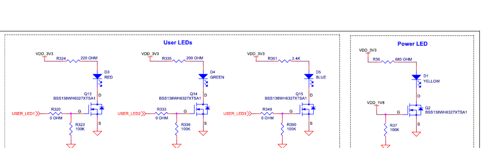
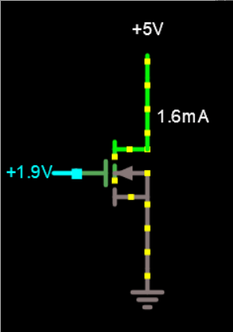
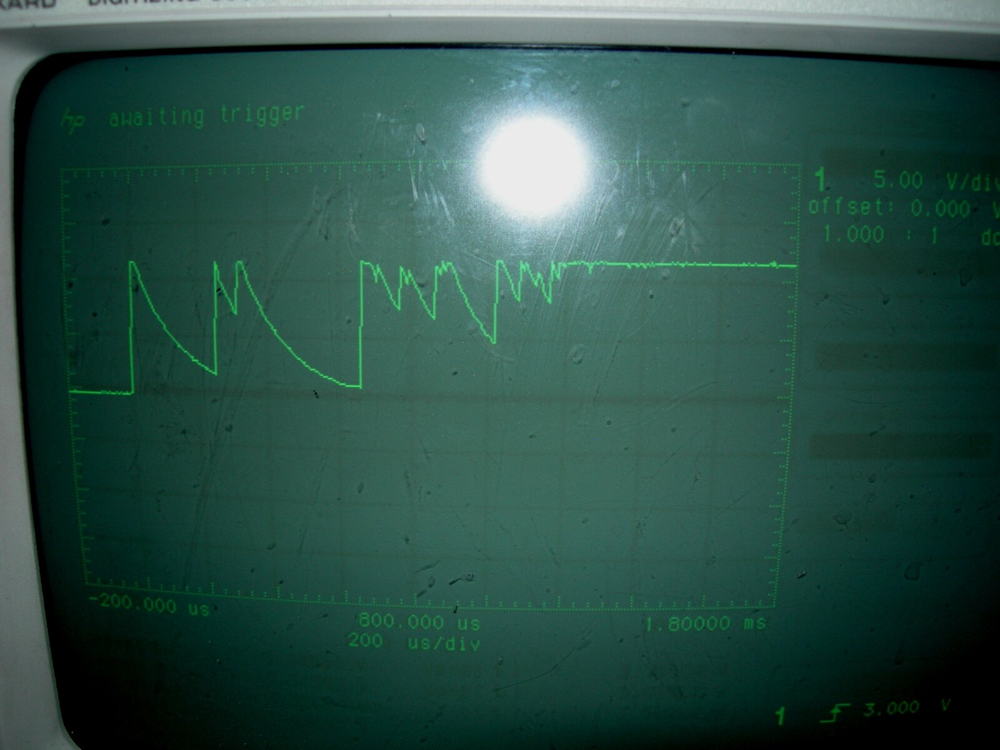
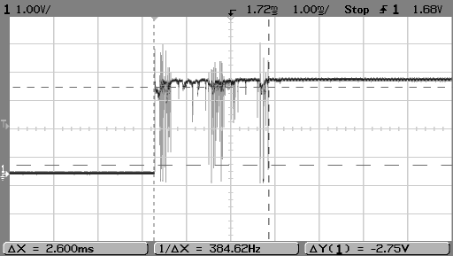
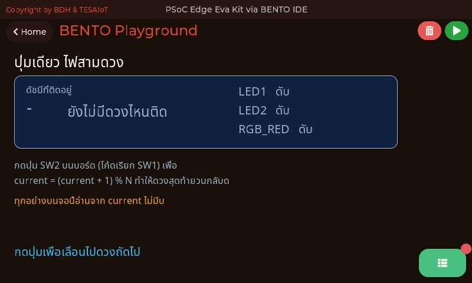

<style>
section { font-size: 24px; padding: 40px 52px; justify-content: flex-start; }
section h1 { font-size: 1.45em; line-height: 1.12; margin: 0 0 .22em; }
section h2 { font-size: 1.12em; margin: .15em 0; }
section h3 { font-size: 1.0em; margin: .12em 0; }
section p, section li { margin: .16em 0; line-height: 1.32; }
section img { max-width: 100%; height: auto; }
section svg { max-height: 252px; width: 100%; }
section iframe { border: 0; border-radius: 8px; box-shadow: 0 2px 10px rgba(0,0,0,.28); }
section table { font-size: .78em; }
section pre { font-size: .70em; line-height: 1.32; background:#0d1117; color:#e6edf3; border:1px solid #30363d; border-radius:8px; padding:12px 16px; box-shadow:0 2px 8px rgba(0,0,0,.25); }
section pre code { white-space: pre-wrap; background:transparent; color:inherit; } section pre .hljs-comment{color:#8b949e;font-style:italic} section pre .hljs-keyword,section pre .hljs-built_in,section pre .hljs-literal{color:#ff7b72} section pre .hljs-string{color:#a5d6ff} section pre .hljs-number{color:#79c0ff} section pre .hljs-title,section pre .hljs-title.function_,section pre .hljs-section{color:#d2a8ff} section pre .hljs-meta{color:#ffa657} section pre .hljs-attr,section pre .hljs-attribute,section pre .hljs-name{color:#7ee787}
section blockquote { margin: .25em 0; font-size: .92em; }
/* two images on a line (parity / 2x2 grids) stay side-by-side and small */
section p > img + img { margin-left: 10px; }
/* scroll-within-slide: dense slides scroll instead of clipping */
section { overflow-y: auto; overflow-x: hidden; }
section::-webkit-scrollbar { width: 11px; }
section::-webkit-scrollbar-thumb { background:#4a90d9; border-radius:6px; }
section::-webkit-scrollbar-track { background:rgba(0,0,0,.06); }
/* image drop-shadow + cover-slide readability (auto) */
section img{filter:drop-shadow(0 3px 12px rgba(0,0,0,.5))}
/* พื้นสำรองของสไลด์ปก: ถ้า img/cover_sNN.svg โหลดไม่ขึ้น ธีมจะคืนพื้นขาว
   แล้วตัวอักษรสีขาวของปกจะหายไปทั้งแผ่น — ปักสีเข้มไว้ให้ภาพเป็นแค่ของประดับ */
section.cover{background-color:#0b1426}
section.cover *{color:#fff !important}
section.cover h1,section.cover h2,section.cover h3,section.cover p,section.cover li,section.cover strong,section.cover em,section.cover blockquote,section.cover div{text-shadow:0 2px 9px rgba(0,0,0,.92),0 0 3px rgba(0,0,0,.8)}
section.cover div[style*="background:#"],section.cover div[style*="background: #"]{background:rgba(10,14,20,.66) !important;border-color:rgba(120,200,255,.45) !important;max-width:62%}
section.cover blockquote{border-left:4px solid rgba(120,200,255,.6) !important;background:rgba(13,17,23,.55) !important;border-radius:6px;padding:.3em .6em}
section.cover h1,section.cover h2,section.cover h3,section.cover p,section.cover blockquote{max-width:60%}
section.cover div:not(:has(img)){max-width:62%}
section.cover img{filter:none}
</style>


<!-- _class: cover -->

# บทเรียน 2.2 — หลังไฟและปุ่ม: active-low กันเด้ง และลูปที่ไม่หยุด

## สั่งฮาร์ดแวร์ด้วยโค้ดของเราเอง · LED ทุกดวงบนบอร์ด ปุ่มหนึ่งปุ่ม และลูปที่ไม่มีวันหยุด

**โมดูล 2 — จากจอสู่ฮาร์ดแวร์**

> ต่อจากบทเรียน 2.1 — โมดูล gpio: LED ปุ่ม และบอร์ดที่บอกได้ว่ามีอะไร

---

## เข้าใจฮาร์ดแวร์ · ทำไมไฟ "1 คือติด" แต่ปุ่ม "0 คือกด"

<style scoped>
section svg { max-height: 190px; }
section p { margin: .04em 0; font-size: .86em; line-height: 1.26; }
section blockquote { font-size: .78em; margin: .06em 0; }
</style>

<svg viewBox="0 0 940 236" xmlns="http://www.w3.org/2000/svg">
  <rect x="14" y="16" width="450" height="210" rx="10" fill="#e8f5e9" stroke="#2e7d32" stroke-width="2"/>
  <text x="239" y="42" text-anchor="middle" font-size="20" font-weight="700" fill="#2e7d32">LED · active-high (ผ่าน MOSFET)</text>
  <line x1="120" y1="60" x2="330" y2="60" stroke="#2e7d32" stroke-width="3"/>
  <text x="112" y="66" text-anchor="end" font-size="18" fill="#1b5e20">3.3 V</text>
  <rect x="315" y="72" width="30" height="34" fill="#fff" stroke="#2e7d32" stroke-width="3"/>
  <line x1="330" y1="60" x2="330" y2="72" stroke="#2e7d32" stroke-width="3"/>
  <text x="356" y="96" font-size="18" fill="#1b5e20">R</text>
  <line x1="330" y1="106" x2="330" y2="118" stroke="#2e7d32" stroke-width="3"/>
  <polygon points="314,118 346,118 330,146" fill="#66bb6a" stroke="#2e7d32" stroke-width="3"/>
  <line x1="314" y1="146" x2="346" y2="146" stroke="#2e7d32" stroke-width="3"/>
  <text x="356" y="140" font-size="18" fill="#1b5e20">LED</text>
  <line x1="330" y1="146" x2="330" y2="160" stroke="#2e7d32" stroke-width="3"/>
  <rect x="308" y="160" width="44" height="30" rx="4" fill="#eceff1" stroke="#455a64" stroke-width="3"/>
  <rect x="60" y="160" width="150" height="30" rx="6" fill="#fff" stroke="#2e7d32" stroke-width="2"/>
  <text x="135" y="182" text-anchor="middle" font-size="18" fill="#1b5e20">ขาชิป P16[7]</text>
  <line x1="212" y1="175" x2="304" y2="175" stroke="#2e7d32" stroke-width="3"/>
  <text x="239" y="203" text-anchor="middle" font-size="19" font-weight="700" fill="#1b5e20">สั่ง 1 = เปิดประตู = หลอดติด</text>
  <rect x="478" y="16" width="448" height="210" rx="10" fill="#e3f2fd" stroke="#1565c0" stroke-width="2"/>
  <text x="702" y="42" text-anchor="middle" font-size="20" font-weight="700" fill="#1565c0">ปุ่ม · active-low (pull-up)</text>
  <line x1="600" y1="58" x2="600" y2="76" stroke="#1565c0" stroke-width="3"/>
  <text x="592" y="66" text-anchor="end" font-size="18" fill="#0d47a1">3.3 V</text>
  <rect x="585" y="76" width="30" height="34" fill="#fff" stroke="#1565c0" stroke-width="3"/>
  <text x="628" y="100" font-size="18" fill="#0d47a1">R ดึงขึ้น</text>
  <line x1="600" y1="110" x2="600" y2="170" stroke="#1565c0" stroke-width="3"/>
  <line x1="600" y1="130" x2="700" y2="130" stroke="#1565c0" stroke-width="3"/>
  <text x="712" y="136" font-size="18" fill="#0d47a1">ไปที่ขาชิป</text>
  <line x1="578" y1="170" x2="622" y2="186" stroke="#1565c0" stroke-width="3"/>
  <line x1="578" y1="192" x2="622" y2="192" stroke="#1565c0" stroke-width="3"/>
  <text x="636" y="198" font-size="18" fill="#0d47a1">ปุ่ม → กราวด์</text>
  <text x="838" y="150" text-anchor="middle" font-size="18" fill="#0d47a1">ไม่กด = 1</text>
  <text x="838" y="180" text-anchor="middle" font-size="19" font-weight="700" fill="#0d47a1">กด = 0 (ลงกราวด์)</text>
</svg>

ฝั่ง LED มีของที่คนส่วนใหญ่ไม่ทันคิด: **ขาชิปไม่ได้จ่ายกระแสให้หลอดเลย** มันไปที่ **gate ของ n-MOSFET** กระแสของหลอดมาจากราง 3.3 V ผ่านตัวต้านทาน ลงหลอด ลง drain แล้วลงกราวด์ — วงจรและเลขขาในหน้านี้มาจากคู่มือ **Eva Kit** (ขา P16.7/P16.6/P16.5) ส่วน Dev Kit ดวง RGB อยู่ที่ P20.6/P20.5/P20.4 ตามตารางในเฟิร์มแวร์ วงจรขับยังไม่ได้เปิดคู่มือตรวจ แต่ฝั่งโค้ดเหมือนกันทุกประการ: สั่ง 1 = ติด

<div style="display:flex;gap:12px;align-items:flex-start">
<div style="flex:0 0 460px"></div>
<div style="flex:1 1 auto;font-size:.6em;color:#78909c;line-height:1.25">ภาพ: KIT_PSE84_EVAL PSOC™ Edge E84 Evaluation Kit guide, Infineon 002-39007 Rev.*B, รูปที่ 78 (หน้า 89) — ใช้เพื่อการเรียนการสอน · วงจรของ Eva Kit อ่านได้เลย <b>D3 แดง 220 Ω · D4 เขียว 200 Ω · D5 น้ำเงิน 2.4 kΩ</b> ขับด้วย MOSFET เบอร์เดียวกันทั้งสามดวง · ฝั่งปุ่ม <code>is_pressed()</code> กลับด้านให้แล้ว กดคืน True ส่วน <code>button(0).value()</code> คืนไฟฟ้าดิบ กดได้ 0 · ภาพหน้าจอของ <a href="https://github.com/tesaiot/tesa-qualification-program/blob/main/courses/aiot-micropython/m02-ui-to-hardware/l02-active-low-debounce/examples/04_button_active_low.py"><code>04_button_active_low.py</code></a> ถอดออกชั่วคราว ไฟล์ถูกลดจำนวน widget ลงเมื่อ 14 ส.ค. รอถ่ายใหม่</div>
</div>

> ขาชิปสั่ง "ประตู" ไม่ได้สั่ง "น้ำ" — และเพราะประตูเปิด-ปิดได้เร็วมาก `brightness()` จึงหรี่ไฟได้ด้วยการกระพริบ gate ถี่ ๆ ไม่ใช่ด้วยการลดแรงดัน

---

## กระแสสองเส้นทางที่แยกกัน — และเลขที่คำนวณได้จริง

<style scoped>
section svg { max-height: 190px; }
section p { margin: .04em 0; font-size: .86em; line-height: 1.26; }
section blockquote { font-size: .78em; margin: .06em 0; }
</style>

<svg viewBox="0 0 940 250" xmlns="http://www.w3.org/2000/svg">
  <text x="470" y="26" text-anchor="middle" font-size="19" font-weight="700" fill="#37474f">ดัดแปลงจาก KIT_PSE84_EVAL user guide รูปที่ 78 — วงจรของ D3 หนึ่งดวงบน Eva Kit</text>
  <line x1="120" y1="52" x2="700" y2="52" stroke="#c62828" stroke-width="4"/>
  <text x="100" y="58" text-anchor="end" font-size="19" font-weight="700" fill="#c62828">VDD_3V3</text>
  <rect x="632" y="70" width="42" height="52" fill="#fff" stroke="#c62828" stroke-width="3"/>
  <line x1="653" y1="52" x2="653" y2="70" stroke="#c62828" stroke-width="4"/>
  <text x="700" y="102" font-size="19" fill="#b71c1c">R324 = 220 Ω</text>
  <line x1="653" y1="122" x2="653" y2="142" stroke="#c62828" stroke-width="4"/>
  <polygon points="633,142 673,142 653,176" fill="#ef5350" stroke="#c62828" stroke-width="3"/>
  <line x1="633" y1="176" x2="673" y2="176" stroke="#c62828" stroke-width="4"/>
  <text x="700" y="166" font-size="19" fill="#b71c1c">D3 แดง</text>
  <line x1="653" y1="176" x2="653" y2="196" stroke="#c62828" stroke-width="4"/>
  <rect x="628" y="196" width="50" height="34" rx="4" fill="#eceff1" stroke="#455a64" stroke-width="3"/>
  <text x="700" y="220" font-size="19" fill="#37474f">Q13 · n-MOSFET</text>
  <rect x="60" y="196" width="180" height="34" rx="7" fill="#e3f2fd" stroke="#1565c0" stroke-width="2"/>
  <text x="150" y="220" text-anchor="middle" font-size="18" fill="#0d47a1">ขาชิป P16[7]</text>
  <line x1="242" y1="213" x2="624" y2="213" stroke="#1565c0" stroke-width="3"/>
  <text x="430" y="205" text-anchor="middle" font-size="18" fill="#1565c0">ไปที่ gate — แทบไม่กินกระแสเลย</text>
  <circle cx="653" cy="56" r="8" fill="#c62828"><animateMotion path="M0,0 L0,174" dur="1.8s" repeatCount="indefinite"/></circle>
  <circle cx="246" cy="213" r="7" fill="#1565c0"><animateMotion path="M0,0 L374,0" dur="2.6s" repeatCount="indefinite"/></circle>
  <text x="330" y="100" text-anchor="middle" font-size="19" font-weight="700" fill="#c62828">เส้นแดง = กระแสของหลอด มาจากราง 3.3 V</text>
  <text x="330" y="132" text-anchor="middle" font-size="19" font-weight="700" fill="#1565c0">เส้นน้ำเงิน = สัญญาณจากชิป ไปสั่งเปิด-ปิดประตู</text>
  <text x="330" y="164" text-anchor="middle" font-size="18" fill="#546e7a">สั่ง 1 ที่ gate → ประตูเปิด → หลอดติด (active-high)</text>
</svg>

$$R_{\text{series}} = \frac{V_{\text{supply}} - V_F}{I_F} \qquad\Longrightarrow\qquad I_F = \frac{3.3 - V_F}{220\,\Omega} \approx \frac{3.3 - 2.0}{220} \approx 5.9\ \text{mA}$$

<div style="display:flex;gap:12px;align-items:flex-start">
<div style="flex:0 0 120px"><div style="font-size:.5em;color:#78909c;line-height:1.2">ภาพ: Osbert Joel, Wikimedia Commons, CC BY-SA 4.0 — ช่องนำกระแสก่อตัวเมื่อแรงดันที่ gate สูงพอ นี่คือ "ประตู" ในภาพบน ต้องดูตอนเคลื่อนไหว</div></div>
<div style="flex:0 0 476px"><iframe width="230" height="129" src="https://www.youtube.com/embed/UWx2BEx7xyI" title="How to Select a Resistor for an LED — DigiKey" loading="lazy" allowfullscreen></iframe> <iframe width="230" height="129" src="https://www.youtube.com/embed/U9JYM1VdF5U" title="การคำนวณค่าตัวต้านทาน R สำหรับใช้กับหลอด LED — KruNarut" loading="lazy" allowfullscreen></iframe><div style="font-size:.54em;color:#546e7a;line-height:1.2">ซ้าย <b>How to Select a Resistor for an LED</b> — DigiKey (EN) · ขวา <b>การคำนวณค่าตัวต้านทาน R สำหรับหลอด LED</b> — KruNarut (ไทย) · ความยาวยังไม่ยืนยันทั้งคู่ · ดูว่าเขาอ่าน <i>V</i><sub>F</sub> กับ <i>I</i><sub>F</sub> จาก datasheet มาแทนในสูตรเดียวกันนี้อย่างไร</div></div>
<div style="flex:1 1 auto;font-size:.84em;line-height:1.26">ตัวเลข 220 Ω มาจากคู่มือ Eva Kit จริง ส่วน <i>V</i><sub>F</sub> ≈ 2.0 V เป็นค่า <b>สมมติทั่วไปของ LED แดง</b> — Dev Kit ยังไม่ได้เปิดคู่มือดูค่าตัวต้านทาน ทีมที่ถือ Dev Kit ใช้สูตรเดียวกันได้ทันทีที่หาค่าเจอ</div>
</div>

> ทำไมน้ำเงินใช้ 2.4 kΩ ทั้งที่แดงใช้ 220 Ω — ลองแทนเลขในสูตรเดียวกัน (สมมติ $V_F$ ของ LED น้ำเงินราว 3.0 V) ดวงน้ำเงินได้กระแสกี่ mA และทำไมผู้ออกแบบยอมให้กระแสต่ำขนาดนั้น · ระวัง: $V_F$ สูงกว่าที่กระแสเท่ากัน ต้องใช้ R **น้อยกว่า** ไม่ใช่มากกว่า

---

## polling — วิธีที่โปรแกรมฝังตัวส่วนใหญ่รับรู้โลก

<style scoped>
section pre { font-size: .62em; }
section svg { max-height: 208px; }
</style>

โปรแกรมของเราไม่มีทางรู้เองว่ามีคนกดปุ่ม สิ่งที่ทำได้คือ **ถามซ้ำ ๆ ให้ถี่พอ**

```python
while True:
    pressed = btn.is_pressed()    # ถาม
    # ...ตัดสินใจจากค่าที่ได้...
    time.sleep_ms(5)              # พักหายใจ แล้วถามใหม่
```

รอบหนึ่งของลูปมีสามจังหวะเสมอ: **อ่านของเข้า → ตัดสิน → สั่งของออก** วนแบบนี้ไปเรื่อย ๆ

ถามถี่แค่ไหนถึงพอ นิ้วคนกดปุ่มเร็วสุดราว 50-80 ms ต่อครั้ง ถ้าเราถามทุก 5-20 ms ก็ไม่มีทางพลาด แต่ถ้าถามทุก 300 ms จะมีการกดที่หลุดหายไปเงียบ ๆ

<svg viewBox="0 0 940 200" xmlns="http://www.w3.org/2000/svg">
  <text x="18" y="26" font-size="19" font-weight="700" fill="#2e7d32">ถามทุก 5 ms — การกดยาว 60 ms ถูกเห็นสิบกว่ารอบ ไม่มีทางพลาด</text>
  <line x1="60" y1="66" x2="900" y2="66" stroke="#b0bec5" stroke-width="2"/>
  <rect x="300" y="52" width="250" height="28" rx="5" fill="#c8e6c9" stroke="#2e7d32" stroke-width="2"/>
  <text x="425" y="72" text-anchor="middle" font-size="18" fill="#1b5e20">นิ้วกดค้าง ~60 ms</text>
  <g fill="#2e7d32"><circle cx="80" cy="96" r="6"/><circle cx="122" cy="96" r="6"/><circle cx="164" cy="96" r="6"/><circle cx="206" cy="96" r="6"/><circle cx="248" cy="96" r="6"/><circle cx="290" cy="96" r="6"/><circle cx="332" cy="96" r="6"/><circle cx="374" cy="96" r="6"/><circle cx="416" cy="96" r="6"/><circle cx="458" cy="96" r="6"/><circle cx="500" cy="96" r="6"/><circle cx="542" cy="96" r="6"/><circle cx="584" cy="96" r="6"/><circle cx="626" cy="96" r="6"/><circle cx="668" cy="96" r="6"/><circle cx="710" cy="96" r="6"/><circle cx="752" cy="96" r="6"/><circle cx="794" cy="96" r="6"/><circle cx="836" cy="96" r="6"/><circle cx="878" cy="96" r="6"/></g>
  <circle cx="80" cy="96" r="11" fill="none" stroke="#1b5e20" stroke-width="3"><animateMotion path="M0,0 L798,0" dur="4s" repeatCount="indefinite"/></circle>
  <text x="18" y="140" font-size="19" font-weight="700" fill="#c62828">ถามทุก 300 ms — รอบถามอยู่ห่างกว่าที่นิ้วกดค้าง การกดหายเงียบ ๆ</text>
  <line x1="60" y1="172" x2="900" y2="172" stroke="#b0bec5" stroke-width="2"/>
  <rect x="300" y="158" width="250" height="28" rx="5" fill="#ffcdd2" stroke="#c62828" stroke-width="2"/>
  <text x="425" y="178" text-anchor="middle" font-size="18" fill="#b71c1c">นิ้วกดค้าง ~60 ms</text>
  <g fill="#c62828"><circle cx="80" cy="196" r="7"/><circle cx="290" cy="196" r="7"/><circle cx="580" cy="196" r="7"/><circle cx="870" cy="196" r="7"/></g>
</svg>

`time.sleep_ms(5)` ในลูปไม่ได้มีไว้ถ่วงเวลาเล่น ๆ — มันคือการคืนซีพียูให้งานอื่น (จอ เซนเซอร์ WiFi) ได้ทำงานด้วย ลูปที่ไม่มีการพักเลยจะกินเครื่องจนของอื่นกระตุก

> ลูปที่ดีไม่ใช่ลูปที่เร็วที่สุด แต่คือลูปที่ **เร็วพอ** และเหลือที่ให้คนอื่นหายใจ

---

## เข้าใจฮาร์ดแวร์ · ปุ่มหนึ่งครั้ง ทำไมนับได้สามครั้ง

<style scoped>
section svg { max-height: 250px; }
</style>

ข้างในปุ่มคือแผ่นโลหะสองชิ้นที่ถูกดันให้ชนกัน โลหะมีความยืดหยุ่น พอชนแล้วมัน **กระเด้งแยกออกแล้วชนใหม่** อีกหลายรอบก่อนจะนิ่ง กินเวลาราว 1-20 ms · ตาเราไม่เห็น แต่ลูปที่ถามทุก 5 ms เห็นครบทุกจังหวะ

<svg viewBox="0 0 900 230" xmlns="http://www.w3.org/2000/svg">
  <line x1="60" y1="180" x2="860" y2="180" stroke="#90a4ae" stroke-width="2"/>
  <line x1="60" y1="60" x2="60" y2="185" stroke="#90a4ae" stroke-width="2"/>
  <text x="34" y="66" font-size="17" fill="#546e7a">1</text>
  <text x="34" y="184" font-size="17" fill="#546e7a">0</text>
  <text x="470" y="212" text-anchor="middle" font-size="17" fill="#546e7a">เวลา (แต่ละช่วง = 5 ms)</text>
  <polyline points="60,60 230,60 230,175 258,175 258,60 282,60 282,172 300,172 300,60 322,60 322,178 336,178 336,60 860,60"
            fill="none" stroke="#c62828" stroke-width="3"/>
  <rect x="230" y="45" width="120" height="145" fill="#ffcdd2" opacity="0.35"/>
  <text x="290" y="36" text-anchor="middle" font-size="17" font-weight="700" fill="#c62828">ช่วงเด้ง 1-20 ms</text>
  <text x="145" y="46" text-anchor="middle" font-size="17" fill="#37474f">ยังไม่กด</text>
  <text x="600" y="46" text-anchor="middle" font-size="17" fill="#37474f">กดค้างอยู่ นิ่งแล้ว</text>
  <rect x="352" y="120" width="160" height="34" rx="6" fill="#e8f5e9" stroke="#2e7d32" stroke-width="2"/>
  <text x="432" y="143" text-anchor="middle" font-size="17" fill="#1b5e20">นับตรงนี้ครั้งเดียว</text>
  <line x1="352" y1="120" x2="345" y2="70" stroke="#2e7d32" stroke-width="2"/>
</svg>

ถ้านับทุกครั้งที่เห็นการเปลี่ยน ตัวเลขจะกระโดดทีละ 3-5 ทั้งที่นิ้วกดครั้งเดียว · ภาพล่างคือ **ของจริง** จากออสซิลโลสโคป



<div style="font-size:.6em;color:#78909c;margin-top:-.3em">ภาพ: Tomoldbury / Wikimedia Commons — สาธารณสมบัติ · หนามที่เห็นคือหน้าสัมผัสโลหะที่ยังเด้งอยู่จริง ไม่ใช่สัญญาณรบกวนจากที่อื่น · ภาพหน้าจอของ <a href="https://github.com/tesaiot/tesa-qualification-program/blob/main/courses/aiot-micropython/m02-ui-to-hardware/l02-active-low-debounce/examples/05_debounce_count.py"><code>05_debounce_count.py</code></a> ถอดออกชั่วคราว ไฟล์ถูกลดจำนวน widget ลงเมื่อ 14 ส.ค. รอถ่ายใหม่ — ตอนรันจริงจะเห็นเลขสองตัววิ่งคู่กัน ส้มคือนับดิบ เขียวคือนับกันเด้ง</div>

<!-- นี่ไม่ใช่บั๊กของโค้ด และไม่ใช่ปุ่มเสีย — เป็นธรรมชาติของหน้าสัมผัสโลหะทุกตัวในโลก -->

---

## กันเด้งด้วยซอฟต์แวร์ — รอให้นิ่งก่อนค่อยเชื่อ

<style scoped>
section pre { font-size: .56em; }
section p { margin: .06em 0; }
section svg { max-height: 200px; }
</style>

วิธีคิด: อย่าเชื่อค่าที่เพิ่งเปลี่ยน **รอให้มันคงที่นานพอ** แล้วค่อยยอมรับว่าเปลี่ยนจริง

```python
raw = btn.is_pressed()              # ค่าดิบจากปุ่มรอบนี้
if raw != last_raw:                 # ค่าเพิ่งขยับ - จับเวลาใหม่ ยังไม่เชื่อ
    last_raw = raw
    last_change = now
elif raw != stable and time.ticks_diff(now, last_change) >= DEBOUNCE_MS:
    stable = raw                    # นิ่งครบ 40 ms แล้ว ยอมรับเป็นของจริง
    if stable:                      # ขอบขาเข้า = เพิ่งเปลี่ยนจากปล่อยเป็นกด
        count += 1
```

ตัวแปรสามตัวที่ต้องแยกให้ออก: `raw` ค่าดิบรอบนี้ · `last_raw` ค่าดิบรอบก่อน · `stable` ค่าที่เรายอมเชื่อแล้ว · `count += 1` อยู่ใต้ `if stable:` เพราะเราต้องการนับ **ตอนกดลง** ไม่ใช่ตอนปล่อย

<svg viewBox="0 0 940 196" xmlns="http://www.w3.org/2000/svg">
  <text x="18" y="22" font-size="19" font-weight="700" fill="#37474f">ค่าดิบเด้ง แต่ค่าที่เรา "เชื่อ" ขยับครั้งเดียว</text>
  <text x="18" y="62" font-size="18" font-weight="700" fill="#c62828">raw</text>
  <polyline points="70,74 250,74 250,44 274,44 274,74 296,74 296,44 318,44 318,74 336,74 336,44 900,44" fill="none" stroke="#c62828" stroke-width="3"/>
  <rect x="250" y="36" width="90" height="46" fill="#ffcdd2" opacity="0.4"/>
  <text x="295" y="102" text-anchor="middle" font-size="17" fill="#c62828">เด้ง</text>
  <text x="18" y="146" font-size="18" font-weight="700" fill="#2e7d32">stable</text>
  <polyline points="70,158 490,158 490,128 900,128" fill="none" stroke="#2e7d32" stroke-width="4"/>
  <line x1="340" y1="36" x2="340" y2="172" stroke="#78909c" stroke-width="2" stroke-dasharray="5 4"/>
  <line x1="490" y1="36" x2="490" y2="172" stroke="#2e7d32" stroke-width="2" stroke-dasharray="5 4"/>
  <text x="415" y="192" text-anchor="middle" font-size="18" fill="#37474f">รอครบ DEBOUNCE_MS = 40 ms</text>
  <circle cx="340" cy="158" r="7" fill="#81c784"><animateMotion path="M0,0 L150,0" dur="3.2s" repeatCount="indefinite"/></circle>
  <circle cx="490" cy="128" r="11" fill="none" stroke="#2e7d32" stroke-width="3"><animate attributeName="r" values="6;15;6" dur="3.2s" repeatCount="indefinite"/></circle>
  <text x="560" y="122" font-size="18" font-weight="700" fill="#2e7d32">count += 1 ตรงนี้ ครั้งเดียว</text>
</svg>

`DEBOUNCE_MS` 40 ms ใช้ได้ดีกับปุ่มทั่วไป น้อยกว่า 10 ยังเด้งหลุด มากกว่า 200 จะรู้สึกว่าปุ่มหน่วง

อยากเห็นตัวเลขจริง เปิด [`05_debounce_count.py`](https://github.com/tesaiot/tesa-qualification-program/blob/main/courses/aiot-micropython/m02-ui-to-hardware/l02-active-low-debounce/examples/05_debounce_count.py) แล้วลดค่า `DEBOUNCE_MS` ลงทีละ 10 จนเลขนับกันเด้งเริ่มเกินจำนวนครั้งที่กดจริง (ไล่เข้าหาเลขนับดิบ) นั่นคือจุดที่หน้าต่างเวลาสั้นเกินไปจนรับการเด้งตอนปล่อยมาเป็นการกดครั้งใหม่

> การกันเด้งคือ **การไม่รีบเชื่อข้อมูลที่เพิ่งมาถึง** — แนวคิดเดียวกันนี้จะกลับมาอีกตอนกรองสัญญาณเซนเซอร์ในบทเรียน 2.7–2.9

---

## นาฬิกาสองแบบในลูปเดียว

```python
time.sleep_ms(150)                        # หยุดโปรแกรมทั้งตัว 150 ms
now = time.ticks_ms()                     # ขอเวลาปัจจุบันของบอร์ด
time.ticks_diff(now, last_step) >= 150    # ผ่านมา 150 ms หรือยัง
```

`sleep_ms` ง่ายแต่หยาบ ระหว่างที่หลับ **ปุ่มกดยังไงก็ไม่มีใครเห็น** ถ้าเราหลับทีละ 150 ms เพื่อรอไฟวิ่ง การกดปุ่มสั้น ๆ จะหายไปเลย

`ticks_ms()` คือมิลลิวินาทีนับจากบอร์ดบูต เอาไว้ตอบคำถามว่า "ถึงเวลาทำอันนั้นหรือยัง" โดยไม่ต้องหยุดโปรแกรม

ทำไมต้อง `ticks_diff(a, b)` แทนการลบตรง ๆ — ตัวเลขนี้วิ่งถึงเพดานแล้ววนกลับไปเริ่มใหม่ ถ้าลบเองจะได้ค่าติดลบมหาศาลตอนวน `ticks_diff` จัดการเรื่องนี้ให้แล้ว

<svg viewBox="0 0 940 200" xmlns="http://www.w3.org/2000/svg">
  <text x="18" y="26" font-size="19" font-weight="700" fill="#c62828">sleep_ms(150) — ตาบอด 150 ms การกดสั้นหายทั้งครั้ง</text>
  <rect x="70" y="40" width="200" height="30" rx="5" fill="#ffcdd2" stroke="#c62828" stroke-width="2"/>
  <text x="170" y="61" text-anchor="middle" font-size="17" fill="#b71c1c">หลับ 150 ms</text>
  <rect x="278" y="40" width="34" height="30" rx="5" fill="#e8f5e9" stroke="#2e7d32" stroke-width="2"/>
  <rect x="320" y="40" width="200" height="30" rx="5" fill="#ffcdd2" stroke="#c62828" stroke-width="2"/>
  <text x="420" y="61" text-anchor="middle" font-size="17" fill="#b71c1c">หลับ 150 ms</text>
  <rect x="528" y="40" width="34" height="30" rx="5" fill="#e8f5e9" stroke="#2e7d32" stroke-width="2"/>
  <rect x="570" y="40" width="200" height="30" rx="5" fill="#ffcdd2" stroke="#c62828" stroke-width="2"/>
  <text x="670" y="61" text-anchor="middle" font-size="17" fill="#b71c1c">หลับ 150 ms</text>
  <rect x="360" y="80" width="70" height="22" rx="4" fill="#fdd835" stroke="#f57f17" stroke-width="2"/>
  <text x="450" y="97" font-size="17" fill="#e65100">การกดตกลงมาตอนหลับ — ไม่มีใครเห็น</text>
  <text x="18" y="140" font-size="19" font-weight="700" fill="#2e7d32">sleep_ms(5) + ticks_diff — ตื่นถี่ แล้วถามนาฬิกาว่าถึงคิวไฟหรือยัง</text>
  <line x1="70" y1="170" x2="900" y2="170" stroke="#b0bec5" stroke-width="2"/>
  <g fill="#2e7d32"><circle cx="80" cy="170" r="5"/><circle cx="108" cy="170" r="5"/><circle cx="136" cy="170" r="5"/><circle cx="164" cy="170" r="5"/><circle cx="192" cy="170" r="5"/><circle cx="220" cy="170" r="5"/><circle cx="248" cy="170" r="5"/><circle cx="276" cy="170" r="5"/><circle cx="304" cy="170" r="5"/><circle cx="332" cy="170" r="5"/><circle cx="360" cy="170" r="5"/><circle cx="388" cy="170" r="5"/><circle cx="416" cy="170" r="5"/><circle cx="444" cy="170" r="5"/><circle cx="472" cy="170" r="5"/><circle cx="500" cy="170" r="5"/><circle cx="528" cy="170" r="5"/><circle cx="556" cy="170" r="5"/><circle cx="584" cy="170" r="5"/><circle cx="612" cy="170" r="5"/><circle cx="640" cy="170" r="5"/><circle cx="668" cy="170" r="5"/><circle cx="696" cy="170" r="5"/><circle cx="724" cy="170" r="5"/><circle cx="752" cy="170" r="5"/><circle cx="780" cy="170" r="5"/><circle cx="808" cy="170" r="5"/><circle cx="836" cy="170" r="5"/><circle cx="864" cy="170" r="5"/></g>
  <g fill="#f57f17"><circle cx="164" cy="170" r="11"/><circle cx="416" cy="170" r="11"/><circle cx="668" cy="170" r="11"/></g>
  <text x="470" y="196" text-anchor="middle" font-size="17" fill="#546e7a">จุดเล็ก = รอบถามปุ่มทุก 5 ms · จุดใหญ่ = ครบ 150 ms แล้วขยับไฟหนึ่งดวง</text>
</svg>

ลูปของเราจึงเป็นแบบนี้: หลับสั้น ๆ 5 ms ทุกรอบ (ปุ่มไม่หลุด) แล้วใช้ `ticks_diff` ตัดสินว่าถึงคิวขยับไฟหรือยัง

> งานสองอย่างที่จังหวะไม่เท่ากัน อยู่ในลูปเดียวกันได้ ถ้าเลิกใช้ `sleep` เป็นตัวจับเวลา

---

## เกร็ด: ปัญหาปุ่มเด้งเก่ากว่าคอมพิวเตอร์

ตู้ชุมสายโทรศัพท์ยุค 1930 ใช้รีเลย์เป็นพัน ๆ ตัว วิศวกรสมัยนั้นเจอปัญหาเดียวกับเรา — หน้าสัมผัสปิดหนึ่งครั้ง แต่วงจรนับได้หลายครั้ง แล้วสายต่อผิดเลขหมาย · ทางแก้ยุคนั้นคือฮาร์ดแวร์ ใส่ตัวเก็บประจุกับตัวต้านทานให้สัญญาณนิ่งก่อนเข้าวงจรนับ ซึ่งก็คือการรอให้คงที่ เหมือนที่เราทำด้วยโค้ดสี่บรรทัดวันนี้

 <iframe width="260" height="146" src="https://www.youtube.com/embed/wxjerCHCEMg" title="Pull Up Resistor Tutorial | AddOhms #15" loading="lazy" allowfullscreen></iframe>

<div style="font-size:.62em;color:#78909c;margin-top:-.3em">ซ้าย รูปคลื่นของหน้าสัมผัสที่เด้ง — ภาพ: Super Rad! / Wikimedia Commons — CC0 1.0 · ขวา <b>Pull Up Resistor Tutorial | AddOhms #15</b> ช่อง AddOhms · ความยาว: ยังไม่ยืนยัน · ดูเพื่อตอบว่า "ถ้าไม่มีตัวต้านทานดึงขึ้น ขาที่ยังไม่ถูกกดจะอ่านค่าอะไร"</div>

**เรื่องเฉพาะของ Eva Kit:** วงจรปุ่มผู้ใช้ (ป้าย SW2/SW4 บนแผ่นวงจร) มีที่ว่างไว้ให้ใส่ตัวต้านทาน 10 kΩ และตัวเก็บประจุ 0.1 µF แต่คู่มือ **ระบุว่าไม่ได้ลงอุปกรณ์จริง (DNI)** — แปลว่าบอร์ดนี้ไม่มีวงจรกันเด้งแบบฮาร์ดแวร์เลย ต้องพึ่ง pull-up ในตัวชิปกับโค้ดของเราล้วน ๆ · Dev Kit ยังไม่ได้เปิดวงจรตรวจ — ให้ผลการทดลองข้อ 4 ของทีมเป็นคนตอบว่าปุ่มของบอร์ดนั้นเด้งแค่ไหน

**เชื่อมกับวันนี้:** บรรทัด `DEBOUNCE_MS = 40` คือค่าที่เมื่อ 90 ปีก่อนต้องเปลี่ยนตัวเก็บประจุถึงจะปรับได้ วันนี้พิมพ์เลขใหม่แล้วกด Program to Device

---

## เรื่องที่เราให้ 70% ผู้เรียนเขียน 30%

**สิ่งที่เฟิร์มแวร์ทำให้แล้ว (70%)**
ตั้งค่าขา GPIO ให้เป็นเอาต์พุต/อินพุตพร้อม pull-up · แปลงระดับไฟฟ้าเป็น `True/False` ให้ · ส่งสถานะ LED ข้าม IPC ไปให้จอวาดตาม · จัดการนาฬิกาของระบบให้ `ticks_ms()` ใช้ได้

**สิ่งที่เป็นงานของเรา (30%)**
ออกแบบว่า *ลูปหนึ่งรอบทำอะไรบ้าง* · ตัดสินว่า *เมื่อไรถึงจะเชื่อค่าที่อ่านได้* · เลือกจังหวะเวลาที่คนใช้รู้สึกดี

<svg viewBox="0 0 940 160" xmlns="http://www.w3.org/2000/svg">
  <rect x="20" y="40" width="616" height="58" rx="8" fill="#e3f2fd" stroke="#1565c0" stroke-width="2"/>
  <text x="328" y="76" text-anchor="middle" font-size="20" font-weight="700" fill="#1565c0">70% · เฟิร์มแวร์ทำให้แล้ว</text>
  <rect x="650" y="40" width="270" height="58" rx="8" fill="#e8f5e9" stroke="#2e7d32" stroke-width="3"/>
  <text x="785" y="76" text-anchor="middle" font-size="20" font-weight="700" fill="#2e7d32">30% · งานของเรา</text>
  <text x="328" y="126" text-anchor="middle" font-size="18" fill="#0d47a1">ตั้งค่าขา · แปลงระดับไฟเป็น True/False · ส่งสถานะข้าม IPC · นาฬิกาของระบบ</text>
  <text x="785" y="126" text-anchor="middle" font-size="18" fill="#1b5e20">ลูปหนึ่งรอบทำอะไร</text>
  <text x="785" y="150" text-anchor="middle" font-size="18" fill="#1b5e20">เมื่อไรถึงจะเชื่อค่าที่อ่านได้</text>
  <text x="470" y="26" text-anchor="middle" font-size="19" font-weight="700" fill="#37474f">30% ของชุดบทเรียนนี้ไม่มีไวยากรณ์ Python ใหม่เลยสักบรรทัด — มีแต่การตัดสินใจ</text>
</svg>

สังเกตว่า 30% ของเราคราวนี้ไม่ใช่ไวยากรณ์ Python เลย แต่เป็น **การตัดสินใจเชิงออกแบบ** ทั้งหมด

> คนที่เขียนไดรเวอร์ GPIO เป็น มีเยอะ · คนที่ออกแบบลูปให้ผู้ใช้รู้สึกว่า "ปุ่มมันตอบสนองดี" มีน้อยกว่ามาก

---

## แกะโค้ดจริง — ท่าที่ 1 ถามบอร์ดก่อนลงมือ

```python
# --- ท่าที่ 1: ถามบอร์ดก่อนว่ามีอะไรให้เล่นบ้าง ---
info = gpio.board_info()
btn = gpio.button(0)

lcd.clear()
lcd.console("<h2>AIoT in Action - ชุด 3</h2>")
lcd.print("บอร์ด:", info["name"], "| LED:", info["leds"], "| ปุ่ม:", info["buttons"])
lcd.print("<span class=muted>ปุ่มผู้ใช้มีตัวเดียว ดัชนี 0</span>")
lcd.print("<span class=muted>โค้ดเรียกมันว่า " + btn.name() + "</span>")
```

เราเก็บ `gpio.button(0)` ไว้ในตัวแปร `btn` ครั้งเดียว แล้วใช้ซ้ำทั้งโปรแกรม แทนที่จะเรียก `gpio.button(0)` ใหม่ทุกรอบลูป — อ่านง่ายกว่า และไม่ต้องเสียเวลาค้นหาซ้ำหลายพันครั้งต่อนาที

บรรทัด `btn.name()` มีไว้ให้เห็นกับตาว่าเฟิร์มแวร์ตอบว่า `USER Button 1` ซึ่งไม่ใช่ป้ายที่พิมพ์บนแผ่นวงจร — และเป็นชื่อเดียวที่ควรใช้เวลาบอกเพื่อนว่าให้กดปุ่มไหน (บน Dev Kit "SW2" คือสวิตช์ตัดไฟบนฐาน) เจอครั้งเดียวแล้วจะไม่ลืม

<svg viewBox="0 0 940 157" xmlns="http://www.w3.org/2000/svg">
  <text x="18" y="26" font-size="19" font-weight="700" fill="#37474f">ผลของท่านี้บนจอ Playground</text>
  <rect x="18" y="40" width="904" height="98" rx="10" fill="#0b1b2b" stroke="#4a90d9" stroke-width="2"/>
  <text x="42" y="72" font-size="21" font-weight="700" fill="#8fd0ff">AIoT in Action - บทเรียน 2.1–2.3</text>
  <text x="42" y="102" font-size="19" fill="#e6edf3">บอร์ด: PSoC Edge Eval Kit | LED: 3 | ปุ่ม: 1   (Dev Kit: PSoC Edge AI Dev Kit | LED: 5)</text>
  <text x="42" y="128" font-size="19" fill="#8b949e">ปุ่มผู้ใช้มีตัวเดียว ดัชนี 0 · โค้ดเรียกมันว่า USER Button 1</text>
  <circle cx="890" cy="60" r="8" fill="#a3c93a"><animate attributeName="r" values="5;10;5" dur="2s" repeatCount="indefinite"/></circle>
</svg>

> เริ่มโปรแกรมด้วยการ **รายงานสิ่งที่เรารู้เกี่ยวกับฮาร์ดแวร์** ทำให้ตอนดีบักไม่ต้องเดา

---

## แกะโค้ดจริง — ท่าที่ 2 ตั้งต้นจากสถานะที่รู้แน่

<style scoped>
section pre { font-size: .54em; line-height: 1.22; }
section svg { max-height: 108px; }
section p { margin: .04em 0; font-size: .86em; line-height: 1.26; }
section blockquote { font-size: .78em; margin: .06em 0; }
</style>

```python
# --- ท่าที่ 2: ดับไฟให้หมดก่อน แล้วเตรียมตัวแปรสถานะ ---
for i in range(NUM_LEDS):
    gpio.led(i).off()
led_index = 0          # ตอนนี้ไฟดวงไหนกำลังติด
count = 0              # จำนวนครั้งที่กดปุ่ม
last_raw = False       # ค่าดิบของปุ่มรอบก่อน
stable = False         # ค่าปุ่มที่ผ่านการกันเด้งแล้ว
```

โปรแกรมก่อนหน้าอาจทิ้งไฟติดค้างไว้ การดับให้หมดก่อนทำให้รอบแรกของไฟวิ่งเริ่มจากจุดที่เรารู้แน่ — หลักการเดียวกับ `lcd.clear()` ในบทเรียน 1.1–1.3

ทำไมต้องมีตัวแปร `led_index` ทั้งที่ถามหลอดไฟเองก็ได้ — `gpio.led(2).value()` **อ่านกลับได้จริง** (เฟิร์มแวร์เรียก `Cy_GPIO_Read()`) แต่มันตอบระดับของขา ณ วินาทีที่ถาม ไม่ใช่ความสว่างที่เราตั้งใจ · `hold()` จบด้วยขาต่ำเสมอ (และ `brightness()` ค่ากลาง 1-99 ก็เช่นกันบนดวงที่ไม่มีเส้น PWM) อ่านตามหลังไปจึงได้ 0 ทั้งที่เพิ่งเห็นหลอดสว่าง

ถาม `duty()` แทนได้ไหม — ไม่ได้เหมือนกัน แต่คนละเหตุผล `duty()` ไม่ได้วัดหลอด มันคืน **ตัวเลขที่เราสั่งไปครั้งล่าสุด** และ `toggle()` ไม่ได้แก้ตัวเลขนั้น เรียก `on()` แล้ว `toggle()` หลอดดับ แต่ `duty()` ยังตอบ 100 · สองทางนี้ผิดคนละแบบ และทั้งคู่ชี้ไปที่คำตอบเดียวกัน

<svg viewBox="0 0 940 170" xmlns="http://www.w3.org/2000/svg">
  <rect x="20" y="34" width="420" height="118" rx="10" fill="#ffebee" stroke="#c62828" stroke-width="2"/>
  <text x="230" y="62" text-anchor="middle" font-size="19" font-weight="700" fill="#c62828">ถามหลอดว่าตอนนี้ติดอยู่ไหม</text>
  <text x="230" y="92" text-anchor="middle" font-size="18" fill="#b71c1c">led(2).value() บอกแค่ระดับขา</text>
  <text x="230" y="120" text-anchor="middle" font-size="18" fill="#b71c1c">หลัง hold() ขาต่ำ จึงได้ 0</text>
  <text x="230" y="144" text-anchor="middle" font-size="17" fill="#78909c">ทั้งที่เพิ่งเห็นหลอดสว่าง</text>
  <rect x="500" y="34" width="420" height="118" rx="10" fill="#e8f5e9" stroke="#2e7d32" stroke-width="3"/>
  <text x="710" y="62" text-anchor="middle" font-size="19" font-weight="700" fill="#2e7d32">จำไว้ในตัวแปรของเราเอง</text>
  <text x="710" y="92" text-anchor="middle" font-size="18" fill="#1b5e20">led_index = 0</text>
  <text x="710" y="120" text-anchor="middle" font-size="18" fill="#1b5e20">count · last_raw · stable</text>
  <text x="710" y="144" text-anchor="middle" font-size="17" fill="#4a7c4e">ถูกเสมอ เพราะเราเป็นคนเขียนเอง</text>
  <text x="470" y="24" text-anchor="middle" font-size="19" font-weight="700" fill="#37474f">สถานะที่โปรแกรมสั่งเอง เชื่อได้กว่าค่าที่อ่านกลับมา</text>
</svg>

> บทเรียนที่ใหญ่กว่ากับดักตัวมันเอง: **โปรแกรมควรจำสถานะที่ตัวเองสั่งไว้เสมอ** — หลอดชุดนี้อ่านกลับได้ แต่เอาต์พุตอีกหลายชนิดในโลกจริงสั่งได้อย่างเดียว (วาล์ว รีเลย์ มอเตอร์) โปรแกรมที่จำสถานะของตัวเองไว้ ย้ายไปคุมของพวกนั้นได้ทันที

---

<style scoped>section :is(pre, marp-pre) { font-size:.54em;line-height:1.22 } section svg { max-height:118px } section p { margin:.04em 0;font-size:.86em;line-height:1.26 } section blockquote { font-size:.78em;margin:.06em 0 }</style>

## แกะโค้ดจริง — ท่าที่ 3 ไฟวิ่งที่ไม่หยุดโปรแกรม

```python
# --- ท่าที่ 3: ไฟวิ่งตามนาฬิกา ไม่ใช่ตาม sleep ---
if chase_on and time.ticks_diff(now, last_step) >= STEP_MS:
    gpio.led(led_index).off()              # ดับดวงเดิมก่อน
    led_index = (led_index + 1) % NUM_LEDS # เลื่อนไปดวงถัดไป วนกลับที่ 0 เอง
    gpio.led(led_index).on()               # จุดดวงใหม่
    last_step = now                        # จดเวลาไว้สำหรับรอบหน้า
    for k in range(NUM_LEDS):              # ไฟบนจอสะท้อนหลอดจริง
        led_ui[k].value(1 if k == led_index else 0)
```

<svg viewBox="0 0 940 170" xmlns="http://www.w3.org/2000/svg">
  <text x="470" y="26" text-anchor="middle" font-size="19" font-weight="700" fill="#37474f">ผลของท่านี้: ดับดวงเดิม → เลื่อน index → จุดดวงใหม่ ทุก STEP_MS</text>
  <circle cx="260" cy="86" r="34" fill="#c62828"><animate attributeName="fill" values="#c62828;#c62828;#f4e0e0;#f4e0e0;#f4e0e0;#c62828" dur="3s" repeatCount="indefinite" /></circle>
  <circle cx="470" cy="86" r="34" fill="#e2efe3"><animate attributeName="fill" values="#e2efe3;#e2efe3;#43a047;#43a047;#e2efe3;#e2efe3" dur="3s" repeatCount="indefinite" /></circle>
  <circle cx="680" cy="86" r="34" fill="#dfe9f3"><animate attributeName="fill" values="#dfe9f3;#dfe9f3;#dfe9f3;#dfe9f3;#1e88e5;#1e88e5" dur="3s" repeatCount="indefinite" /></circle>
  <text x="260" y="150" text-anchor="middle" font-size="19" fill="#546e7a">led_index = 0</text>
  <text x="470" y="150" text-anchor="middle" font-size="19" fill="#546e7a">1</text>
  <text x="680" y="150" text-anchor="middle" font-size="19" fill="#546e7a">2</text>
  <path d="M700,44 C790,44 790,128 700,128" fill="none" stroke="#78909c" stroke-width="3" stroke-dasharray="7 6" />
  <path d="M240,128 C150,128 150,44 240,44" fill="none" stroke="#78909c" stroke-width="3" stroke-dasharray="7 6" />
  <text x="840" y="92" text-anchor="middle" font-size="18" fill="#78909c">(2+1) % 3 = 0</text>
  <text x="840" y="116" text-anchor="middle" font-size="16" font-weight="700" fill="#37474f">Dev Kit: (4+1) % 5 = 0</text>
</svg>

`% NUM_LEDS` คือหัวใจของคำว่า "วิ่งวน" — พอ `led_index` ถึง 3 เศษของการหารด้วย 3 คือ 0 มันจึงกลับไปเริ่มดวงแรกเองโดยไม่ต้องเขียน `if` (บน Dev Kit `NUM_LEDS` เป็น 5 บรรทัดเดียวกันวนที่ 5 เอง — นี่คือเหตุผลที่ไม่เขียนเลข 3 ลงไปตรง ๆ)

ลำดับ ดับก่อน-เลื่อน-จุดใหม่ สำคัญมาก ถ้าสลับเป็นจุดใหม่ก่อนแล้วค่อยดับ จะมีเสี้ยวเวลาที่ไฟติดพร้อมกันสองดวง ตาอาจไม่ทัน แต่มันคือความไม่ตรงกับที่เราตั้งใจ · `chase_on` คือธงที่ปุ่ม "หยุดไฟวิ่ง" บนจอเป็นคนพลิก (ท่าที่ 4 ครึ่งหลังในไฟล์เฉลย) — ไฟหยุดได้โดยลูปยังเดินอ่านปุ่มต่อ · สองบรรทัดท้ายให้ไฟบนจอ `led_ui` สะท้อนหลอดจริง ดวงที่ดับหรี่ ไม่ใช่หาย

`last_step = now` ต้องอยู่ใน `if` เท่านั้น ถ้าเลื่อนออกไปนอก `if` เงื่อนไขจะไม่มีวันเป็นจริง แล้วไฟจะไม่วิ่งเลย

เทียบกับ [`02_led_blink.py`](https://github.com/tesaiot/tesa-qualification-program/blob/main/courses/aiot-micropython/m02-ui-to-hardware/l02-active-low-debounce/examples/02_led_blink.py) ได้เลย ไฟล์นั้นกะพริบดวงเดียวพร้อมนับรอบขึ้นจอ แต่จับเวลาด้วย `time.sleep_ms()` ซึ่งบล็อกทั้งลูประหว่างรอ ตัวเลขที่เดินขึ้นบอกแค่ว่าโปรแกรมยังไม่ค้าง ส่วนท่าไฟวิ่งนี้ใช้ `ticks_diff` ลูปจึงยังว่างไปอ่านปุ่มระหว่างรอ

> ปรับ `STEP_MS` แล้วรันใหม่ — นี่คือ "ปรับจังหวะได้" ตามเกณฑ์ผ่านของชุดบทเรียนนี้

---

## แกะโค้ดจริง — ท่าที่ 4 อ่านปุ่ม กันเด้ง แล้วนับ

<style scoped>
section pre { font-size: .52em; line-height: 1.22; }
section svg { max-height: 120px; }
section p { margin: .04em 0; font-size: .86em; line-height: 1.26; }
section blockquote { font-size: .78em; margin: .06em 0; }
</style>

<div style="display:flex;gap:14px;align-items:flex-start">
<div style="flex:1 1 62%">

```python
# --- ท่าที่ 4: อ่านปุ่มทุกรอบ แต่เชื่อเฉพาะค่าที่นิ่งแล้ว ---
raw = btn.is_pressed()

if raw != last_raw:
    last_raw = raw
    last_change = now
elif raw != stable and time.ticks_diff(now, last_change) >= DEBOUNCE_MS:
    stable = raw
    if stable:
        count += 1
        lcd.print("กดครั้งที่", count)
```

</div>
<div style="flex:0 0 36%"><div style="font-size:.56em;color:#78909c;line-height:1.2">ภาพหน้าจอจริงจากบอร์ด Eva Kit ขณะรัน <a href="https://github.com/tesaiot/tesa-qualification-program/blob/main/courses/aiot-micropython/m02-ui-to-hardware/l02-active-low-debounce/examples/06_button_picks_led.py"><code>06_button_picks_led.py</code></a> — บันทึกโดยผู้สอน · จำนวนครั้งที่นับได้ตรงกับจำนวนครั้งที่กดจริง คือหลักฐานว่าโค้ดกันเด้งทำงาน · ไฟล์นั้นยังสอนว่าความจริงเรื่อง "ดวงไหนติดอยู่" ควรอยู่ที่ตัวแปรของเรา เพราะ <code>led().value()</code> ตอบแค่ระดับของขา ณ วินาทีที่ถาม ซึ่งเป็น 0 หลัง <code>hold()</code> (และหลัง <code>brightness()</code> ค่ากลางบนดวงที่ไม่มีเส้น PWM) · <b>ภาพนี้เก่า</b> ยังพิมพ์ "กดปุ่ม SW2 บนบอร์ด (โค้ดเรียก SW1)" — ไฟล์ปัจจุบันพิมพ์ชื่อจาก <code>btn.name()</code> รอถ่ายใหม่</div></div>
</div>

บล็อกนี้ทำงานทุกรอบลูป คือทุก 5 ms ในขณะที่ไฟวิ่งขยับทุก 150 ms — สองจังหวะอยู่ในลูปเดียวกันได้เพราะไม่มีใครใช้ `sleep` ยาว · `lcd.print` อยู่ในบล็อกนี้เพราะเราอยากพิมพ์ **เฉพาะตอนที่มีเหตุการณ์จริง** ถ้าย้ายออกไปพิมพ์ทุกรอบ จอจะถูกยิง 200 บรรทัดต่อวินาทีจนอ่านอะไรไม่ได้

<svg viewBox="0 0 940 160" xmlns="http://www.w3.org/2000/svg">
  <text x="470" y="24" text-anchor="middle" font-size="19" font-weight="700" fill="#37474f">เครื่องสถานะเล็ก ๆ ที่มีสามตัวแปร และทางออกทางเดียวที่นับ</text>
  <rect x="30" y="52" width="220" height="66" rx="10" fill="#eceff1" stroke="#78909c" stroke-width="2"/>
  <text x="140" y="82" text-anchor="middle" font-size="19" font-weight="700" fill="#546e7a">raw ขยับ</text>
  <text x="140" y="106" text-anchor="middle" font-size="18" fill="#546e7a">จับเวลาใหม่ ยังไม่เชื่อ</text>
  <rect x="330" y="52" width="250" height="66" rx="10" fill="#fff8e1" stroke="#f57f17" stroke-width="2"/>
  <text x="455" y="82" text-anchor="middle" font-size="19" font-weight="700" fill="#e65100">raw นิ่งครบ 40 ms</text>
  <text x="455" y="106" text-anchor="middle" font-size="18" fill="#e65100">ยอมรับเป็น stable</text>
  <rect x="660" y="52" width="250" height="66" rx="10" fill="#e8f5e9" stroke="#2e7d32" stroke-width="3"/>
  <text x="785" y="82" text-anchor="middle" font-size="19" font-weight="700" fill="#2e7d32">stable เป็น True</text>
  <text x="785" y="106" text-anchor="middle" font-size="18" fill="#1b5e20">count += 1 · พิมพ์หนึ่งบรรทัด</text>
  <line x1="252" y1="85" x2="326" y2="85" stroke="#455a64" stroke-width="3"/>
  <line x1="582" y1="85" x2="656" y2="85" stroke="#455a64" stroke-width="3"/>
  <circle cx="256" cy="85" r="8" fill="#f57f17"><animateMotion path="M0,0 L66,0" dur="2.4s" repeatCount="indefinite"/></circle>
  <circle cx="586" cy="85" r="8" fill="#2e7d32"><animateMotion path="M0,0 L66,0" dur="2.4s" begin="1.2s" repeatCount="indefinite"/></circle>
  <text x="470" y="150" text-anchor="middle" font-size="18" fill="#c62828">ถ้าเอา if stable: ออก — ตอนปล่อยปุ่มก็ผ่านทางนี้ด้วย เลขจะเพิ่มทีละสอง</text>
</svg>

> ลองเอา `if stable:` ออกดูสักครั้ง แล้วจะเห็นเลขกระโดดทีละสอง — เพราะปล่อยปุ่มก็คือการเปลี่ยนสถานะเหมือนกัน

---

## แกะโค้ดจริง — ท่าที่ 5 จบให้สะอาด

```python
# --- ท่าที่ 5: ดับไฟ แล้วสรุปผลปิดท้าย ---
for i in range(NUM_LEDS):
    gpio.led(i).off()

lcd.print("<span class=ok>จบรอบทดสอบ กดปุ่มทั้งหมด " + str(count) + " ครั้ง</span>")
print("โปรแกรมจบแล้ว - ไฟทุกดวงถูกดับเรียบร้อย")
```

<svg viewBox="0 0 940 165" xmlns="http://www.w3.org/2000/svg">
  <text x="235" y="26" text-anchor="middle" font-size="19" font-weight="700" fill="#c62828">จบแบบไม่เก็บของ</text>
  <rect x="30" y="40" width="410" height="106" rx="10" fill="#ffebee" stroke="#c62828" stroke-width="2"/>
  <circle cx="140" cy="80" r="18" fill="#c62828"/>
  <circle cx="200" cy="80" r="18" fill="#43a047" opacity="0.15"/>
  <circle cx="260" cy="80" r="18" fill="#1e88e5" opacity="0.15"/>
  <text x="235" y="122" text-anchor="middle" font-size="18" fill="#b71c1c">ไฟค้างอยู่ ทีมถัดไปไม่รู้ว่ามาจากใคร</text>
  <text x="705" y="26" text-anchor="middle" font-size="19" font-weight="700" fill="#2e7d32">จบแบบเก็บของ</text>
  <rect x="500" y="40" width="410" height="106" rx="10" fill="#e8f5e9" stroke="#2e7d32" stroke-width="3"/>
  <circle cx="610" cy="80" r="18" fill="#c62828" opacity="0.15"/>
  <circle cx="670" cy="80" r="18" fill="#43a047" opacity="0.15"/>
  <circle cx="730" cy="80" r="18" fill="#1e88e5" opacity="0.15"/>
  <text x="705" y="122" text-anchor="middle" font-size="18" fill="#1b5e20">ดับหมด + บรรทัดสรุปสีเขียวบนจอ</text>
  <line x1="444" y1="90" x2="496" y2="90" stroke="#455a64" stroke-width="3"/>
  <circle cx="448" cy="90" r="8" fill="#2e7d32"><animateMotion path="M0,0 L44,0" dur="2s" repeatCount="indefinite"/></circle>
  <text x="470" y="160" text-anchor="middle" font-size="17" fill="#78909c">ลูปจบเมื่อครบ RUN_MS ไม่ใช่ while True — บอร์ดถูกคืนให้ทีมทดลองรอบต่อไปได้ทันที</text>
</svg>

โปรแกรมฝังตัวที่จบแล้วทิ้งไฟติดค้างไว้ ถือว่าจบไม่เรียบร้อย คนถัดไปที่มาใช้บอร์ดจะไม่รู้ว่าไฟที่ติดอยู่มาจากโปรแกรมไหน

`str(count)` จำเป็นเพราะเรากำลังต่อสตริงด้วย `+` เพื่อแทรกตัวเลขไว้กลางแท็ก `<span>` — ถ้าใช้จุลภาคแบบ `lcd.print("...", count)` จะได้ช่องว่างเกินติดขอบแท็ก แบบเดียวกับที่เจอในบทเรียน 1.1–1.3

<b>ทำไมโปรแกรมต้องมีวันจบ</b> — ลูปของเราวิ่งตามเวลาที่ตั้งไว้ใน `RUN_MS` ไม่ใช่ `while True` เพราะเราอยากให้มันคืนบอร์ดให้ทีมได้ทดลองรอบต่อไปโดยไม่ต้องกด RESTART ทุกครั้ง

> เขียนโปรแกรมที่ <b>เก็บของก่อนกลับบ้าน</b> — นิสัยนี้จะช่วยชีวิตตอนโปรเจกต์ใหญ่

---

## ข้อมูลไหลไปทางไหน — นิ้ว ไฟ และจอ ในรอบเดียวกัน

<svg viewBox="0 0 940 250" xmlns="http://www.w3.org/2000/svg">
  <defs><marker id="a3" markerWidth="10" markerHeight="8" refX="9" refY="4" orient="auto">
    <path d="M0,0 L10,4 L0,8 z" fill="#455a64"/></marker></defs>
  <rect x="10" y="90" width="150" height="76" rx="10" fill="#fff3e0" stroke="#ef6c00" stroke-width="2"/>
  <text x="85" y="122" text-anchor="middle" font-size="17" font-weight="700" fill="#ef6c00">ปุ่มผู้ใช้</text>
  <text x="85" y="146" text-anchor="middle" font-size="17" fill="#e65100">นิ้วกด = ขาลง 0</text>
  <rect x="205" y="60" width="220" height="136" rx="10" fill="#e3f2fd" stroke="#1565c0" stroke-width="2"/>
  <text x="315" y="90" text-anchor="middle" font-size="17" font-weight="700" fill="#1565c0">ลูปของเรา บน CM33</text>
  <text x="315" y="116" text-anchor="middle" font-size="17" fill="#0d47a1">is_pressed() ทุก 5 ms</text>
  <text x="315" y="138" text-anchor="middle" font-size="17" fill="#0d47a1">กันเด้ง 40 ms แล้วนับ</text>
  <text x="315" y="160" text-anchor="middle" font-size="17" fill="#0d47a1">ticks_diff ครบ 150 ms</text>
  <text x="315" y="182" text-anchor="middle" font-size="17" fill="#0d47a1">แล้วขยับไฟหนึ่งดวง</text>
  <rect x="470" y="30" width="180" height="70" rx="10" fill="#e8f5e9" stroke="#2e7d32" stroke-width="2"/>
  <text x="560" y="60" text-anchor="middle" font-size="17" font-weight="700" fill="#2e7d32">LED จริงบนบอร์ด</text>
  <text x="560" y="84" text-anchor="middle" font-size="17" fill="#1b5e20">ติดทันที ไม่ผ่านใคร</text>
  <rect x="470" y="150" width="180" height="70" rx="10" fill="#f3e5f5" stroke="#6a1b9a" stroke-width="2"/>
  <text x="560" y="180" text-anchor="middle" font-size="17" font-weight="700" fill="#6a1b9a">IPC</text>
  <text x="560" y="204" text-anchor="middle" font-size="17" fill="#4a148c">แจ้งสถานะไฟให้ CM55</text>
  <rect x="700" y="84" width="230" height="90" rx="10" fill="#eceff1" stroke="#455a64" stroke-width="2"/>
  <text x="815" y="112" text-anchor="middle" font-size="17" font-weight="700" fill="#455a64">จอ 4.3 นิ้ว</text>
  <text x="815" y="136" text-anchor="middle" font-size="17" fill="#37474f">Playground: ตัวนับ</text>
  <text x="815" y="160" text-anchor="middle" font-size="17" fill="#37474f">Controls (Eva): ไฟ</text>
  <line x1="162" y1="128" x2="201" y2="128" stroke="#455a64" stroke-width="3" marker-end="url(#a3)"/>
  <line x1="427" y1="100" x2="466" y2="72" stroke="#455a64" stroke-width="3" marker-end="url(#a3)"/>
  <line x1="427" y1="160" x2="466" y2="180" stroke="#455a64" stroke-width="3" marker-end="url(#a3)"/>
  <line x1="652" y1="185" x2="696" y2="166" stroke="#455a64" stroke-width="3" marker-end="url(#a3)"/>
  <text x="470" y="248" text-anchor="middle" font-size="17" fill="#78909c">คำสั่ง LED หนึ่งครั้ง เดินสองเส้นทางพร้อมกัน: ไปที่ขาไฟจริง และไปที่จอ</text>
</svg>

> `gpio.led(n).on()` ส่งสถานะข้าม IPC ให้ CM55 ทุกครั้งโดยเราไม่ต้องสั่ง — ของแถมที่ทำให้เห็นภาพ

---

## วิธีรันบนบอร์ด — และรอบพิเศษที่ต้องลอง

<style scoped>
section svg { max-height: 120px; }
section p, section li { font-size: .92em; }
section blockquote { font-size: .8em; margin: .1em 0; }
</style>

1. เปิดไฟล์ [`s03_led_button.py`](https://github.com/tesaiot/tesa-qualification-program/blob/main/courses/aiot-micropython/m02-ui-to-hardware/l03-led-button-lab/practice/s03_led_button.py) เติมช่องว่าง `pass` ให้ครบตามคำใบ้ `# เติม:`
2. <b>บนจอบอร์ด</b> แตะการ์ด <b>BENTO Playground</b> ค้างหน้านี้ไว้
3. กด <b>Program to Device</b> แล้วมองสองที่สลับกัน: หลอดไฟบนบอร์ด กับตัวเลขบนจอ
4. กดปุ่มผู้ใช้บนบอร์ดสิบครั้ง (ชื่อปุ่มขึ้นในลิ้นชัก Console ตั้งแต่บรรทัดแรก — บน Dev Kit ห้ามโยกสวิตช์บนฐาน หลายตัวคือสวิตช์ตัดไฟ) แล้วเช็กว่าตัวเลขขึ้นสิบพอดี ไม่ใช่ยี่สิบหรือสามสิบ

<b>รอบพิเศษ — ดู IPC ด้วยตาตัวเอง (Eva Kit เท่านั้น — Dev Kit ไม่มีการ์ด Controls ข้ามรอบนี้ได้)</b>
รันซ้ำอีกครั้ง แต่คราวนี้ก่อนกด Program to Device ให้แตะการ์ด <b>Controls</b> ค้างไว้แทน Playground แล้วมองวงกลมสีบนหน้า Controls ระหว่างที่โปรแกรมของเราวิ่ง

วงกลมบนจอจะติด-ดับตามไฟวิ่งของเรา ทั้งที่โค้ดเราไม่ได้สั่งจออะไรเลยสักบรรทัด — เพราะทุกครั้งที่เราสั่ง LED เฟิร์มแวร์ส่งสถานะข้าม IPC ไปบอก CM55 ให้เอง

<svg viewBox="0 0 940 157" xmlns="http://www.w3.org/2000/svg">
  <rect x="20" y="34" width="168" height="60" rx="8" fill="#e3f2fd" stroke="#1565c0" stroke-width="2"/>
  <text x="104" y="60" text-anchor="middle" font-size="18" font-weight="700" fill="#1565c0">1 · เติม pass</text>
  <text x="104" y="82" text-anchor="middle" font-size="17" fill="#0d47a1">ครบ 6 จุด</text>
  <rect x="205" y="34" width="168" height="60" rx="8" fill="#e8f5e9" stroke="#2e7d32" stroke-width="2"/>
  <text x="289" y="60" text-anchor="middle" font-size="18" font-weight="700" fill="#2e7d32">2 · เปิด Playground</text>
  <text x="289" y="82" text-anchor="middle" font-size="17" fill="#1b5e20">ค้างหน้าไว้</text>
  <rect x="390" y="34" width="168" height="60" rx="8" fill="#fff8e1" stroke="#f57f17" stroke-width="2"/>
  <text x="474" y="60" text-anchor="middle" font-size="18" font-weight="700" fill="#e65100">3 · Program</text>
  <text x="474" y="82" text-anchor="middle" font-size="17" fill="#e65100">มองไฟ + มองจอ</text>
  <rect x="575" y="34" width="168" height="60" rx="8" fill="#f3e5f5" stroke="#6a1b9a" stroke-width="2"/>
  <text x="659" y="60" text-anchor="middle" font-size="18" font-weight="700" fill="#6a1b9a">4 · กดปุ่ม ×10</text>
  <text x="659" y="82" text-anchor="middle" font-size="17" fill="#4a148c">ต้องได้ 10 พอดี</text>
  <rect x="760" y="34" width="162" height="60" rx="8" fill="#eceff1" stroke="#455a64" stroke-width="3"/>
  <text x="841" y="60" text-anchor="middle" font-size="18" font-weight="700" fill="#455a64">5 · พิเศษ (Eva)</text>
  <text x="841" y="82" text-anchor="middle" font-size="17" fill="#37474f">เปิด Controls แทน</text>
  <circle cx="104" cy="110" r="8" fill="#455a64"><animateMotion path="M0,0 L737,0" dur="5s" repeatCount="indefinite"/></circle>
  <line x1="60" y1="110" x2="890" y2="110" stroke="#cfd8dc" stroke-width="3"/>
  <text x="470" y="24" text-anchor="middle" font-size="19" font-weight="700" fill="#37474f">รอบที่ 5 คือรอบที่ทำให้เห็น IPC ด้วยตา ไม่ใช่แค่ได้ยินว่ามี</text>
</svg>

ดูรอบพิเศษเสร็จแล้วกลับมาที่หน้า Playground เพื่ออ่านตัวนับ แล้วกด RESTART รันใหม่

> โปรแกรมเดียวกัน แต่เปิดคนละหน้า เห็นคนละด้านของระบบ — ลองทั้งสองรอบก่อนสรุปว่าเข้าใจแล้ว
