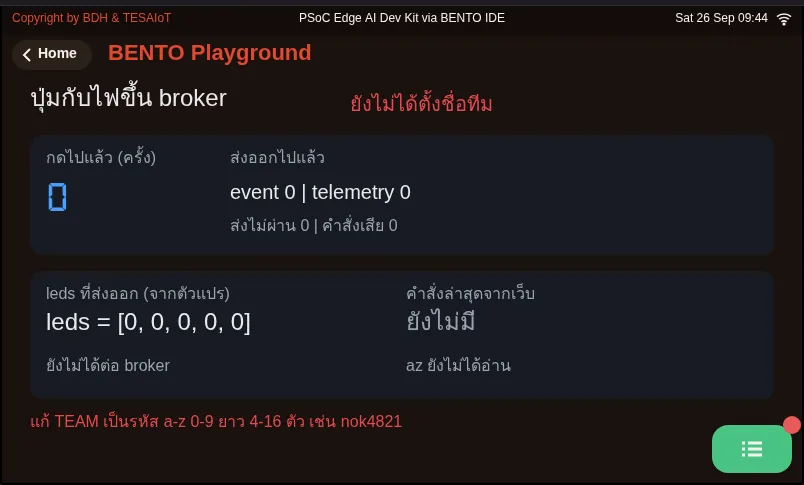
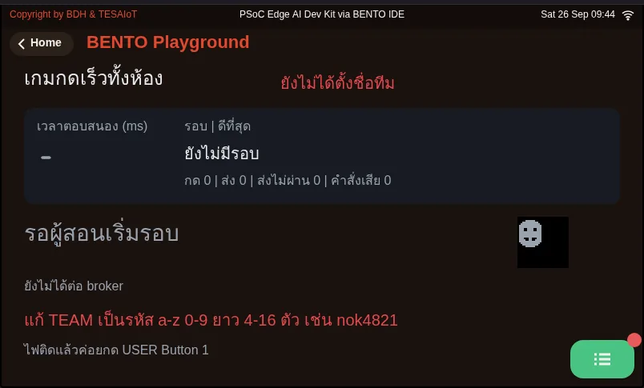

# Lesson 2.3 — Hands-on: running lights, a button, and the broker

> Module 2 — From Screen to Hardware · Slides: [slides.md](slides.md) · [Module overview](../README.md) · [Course page](../../README.md)

Fill six blanks to get an LED chase over every LED with an adjustable tempo and a button that counts ten presses as exactly ten, then carry one press to a web page through a broker while coding around the firmware's real limits.

## Objectives

By the end of this lesson you will be able to:

1. Fill the six blanks in practice/s03_led_button.py until it passes the MVP: a chase over every LED gpio.num_leds() reports, a tempo that changes with at least two STEP_MS values, ten presses of the user button showing exactly ten, and every LED off with a green summary line at the end
2. Match the common symptoms (count jumps by 3-5, by 2, not at all, chase stuck on one LED, two LEDs lit) to their causes and fixes, and explain to the instructor what happens without the debounce code and why
3. Run 07_button_to_broker.py with your own team name until my_first_reader.html shows telemetry every 2 seconds and an event on each press, and explain how always-false retain, the one-slot inbox, OSError on a dropped link and unique client_id shape the code
4. Explain why the class reaction game times each press on the board rather than by arrival order, and why it records the time when the pin first changes rather than when debounce confirms

## Before you start

You must have finished lesson 2.2, because this lesson assembles the five moves of that lesson's solution file, walked through there piece by piece, into your team's own program.
The broker uses the same setup from lessons 1.4–1.6: your team's phone hotspot (name and password) and the same unique `TEAM` code, such as `nok4821` (if learning in a group, use the team number your organiser hands out).
On the board's screen, keep the BENTO Playground card open, and have your phone camera ready to photograph the lights and screen for your learning log.

- **Equipment:** an Eva Kit or TESAIoT Dev Kit board with the BENTO MicroPython firmware installed, or the BENTO Emulator in [BENTO IDE](https://ide.tesaiot.dev/) (07_button_to_broker.py on the Emulator can now reach the real broker — it appends `-emu` to its client_id so it never kicks your team's board off; 08_class_race.py has not yet been tried on the Emulator and does not hear commands from the front of the room)
- **Before this:** [Lesson 2.2 — Behind LEDs and buttons: active-low, debouncing and the endless loop](../l02-active-low-debounce/README.md)

## Concepts

**The MVP for lessons 2.1–2.3** is a chase running over every LED the board has, with an adjustable tempo, plus a user button (referred to by the name from `.name()`)
that counts presses on screen. The hardest part is not making it work, but being able to **explain** what happens if the debounce code is removed —
and notice that the first three traps in the slides' table are matters of *timing logic*, not syntax, which is a defining trait of embedded work.

The solution file puts the four values you adjust most often at the top, as the **program's dashboard** (`STEP_MS`, `DEBOUNCE_MS`, `POLL_MS`, `RUN_MS`),
so the "adjustable tempo" requirement comes down to editing just `STEP_MS`. Inside the loop there are four unequal beats: the button is polled every 5 ms, the light advances every 150 ms,
the screen refreshes every `UI_MS` = 100 ms (calling `ui.poll()` every loop round fires IPC across the cores 200 times a second, waiting for a finger that arrives maybe once a second),
and the number a person has to read is rewritten no more than once a second. All of this uses a single `now = time.ticks_ms()` value per round,
and `time.sleep_ms(POLL_MS)` at the end of the loop is the only point where the program agrees to rest. The panel on screen is built once before entering the loop;
the "run" and "stop" buttons for the chase are deliberately separate, and the confirmation box is created and hidden from the very start.

The five moves are ordered as **layer-by-layer bring-up**: ask the board → turn everything off → run the chase (work that depends on no input from anyone; if it runs, the loop structure and clock are correct)
→ the button (if something breaks here, you know for certain it broke at the button or the debounce) → wrap-up. Filling the blanks follows this same order.

Reaching the broker takes just three additions to the same loop: two `send()` calls and one `get_message()` call. Each team gets three topics:
`bento-aiot/<team>/event` (the instant a debounced press happens), `…/telemetry` (every 2 seconds), and `…/cmd` (the web page commanding the board).
Every message carries a running `n`; the other side seeing the number jump knows a message went missing. Four firmware limits are design facts, not flaws to blame:
`publish()` always sends with retain = false, so telemetry must be resent every 2 seconds · `get_message()` is a one-slot inbox, a new message overwrites the old,
so it must be picked up every loop round · `publish()` raises `OSError` when the link drops, which `send()` catches and turns into returning `False`, so the loop can stop politely
· it never reconnects on its own and `clean_session` is always true, so `is_connected()` must be asked every round, and `client_id` cannot collide —
whoever connects later kicks the earlier one off — so file 07 can only run on one board per team.

## Worked example

1. **`07_button_to_broker.py`** — edit the top four lines (`WIFI_SSID`, `WIFI_PASS`, `BROKER`, `TEAM`); never edit `ROOT` or `DEVICE_ID`.
   If `TEAM` is not changed from `teamXX`, the program refuses to run. Open `my_first_reader.html` using the link in the slides with `?team=` appended, followed by the same code as `TEAM`.
   Wait for the status line to say connected, then run it on the board. Predict first what will change on the web page after one press of the button.
   The public broker is unencrypted; anyone can subscribe and read it — never send anything secret — and listen only to `bento-aiot/<team>/#`, never subscribe to `#`.
2. **`08_class_race.py`** — use this when several teams are learning at once and the educator projects `class_game.html`. Before the first round, write your guess in your learning log:
   is the team whose result appears first on the front-of-room screen actually the fastest, and why or why not? Then try item 2 in the "your turn" block at the end of the file to measure the effect of the 40 ms debounce for yourself.
   During a round, try to find which line in the file rejects an `led` or `beep` command another team sends in to interfere.

| File | What this file teaches |
|---|---|
| [examples/07_button_to_broker.py](examples/07_button_to_broker.py) | A button and a light on our desk end up on the broker, for a web page to read |
| [examples/08_class_race.py](examples/08_class_race.py) | A class-wide reaction game; the educator starts the round, and every team's board times itself |

The slides for this lesson also refer to files that live in other lessons:

- [m02-ui-to-hardware/l01-gpio-leds-buttons/examples/01_board_info.py](../l01-gpio-leds-buttons/examples/01_board_info.py) — ask the board first what there is to play with
- [m02-ui-to-hardware/l01-gpio-leds-buttons/examples/03_led_brightness.py](../l01-gpio-leds-buttons/examples/03_led_brightness.py) — hold a dimmed LED long enough for your eyes to compare two levels
- [m02-ui-to-hardware/l02-active-low-debounce/examples/02_led_blink.py](../l02-active-low-debounce/examples/02_led_blink.py) — make an LED blink to a rhythm, and count how many times it has blinked
- [m02-ui-to-hardware/l02-active-low-debounce/examples/04_button_active_low.py](../l02-active-low-debounce/examples/04_button_active_low.py) — on this button, 0 means pressed, not 1
- [m02-ui-to-hardware/l02-active-low-debounce/examples/05_debounce_count.py](../l02-active-low-debounce/examples/05_debounce_count.py) — count presses correctly, by waiting for the button to sit still first
- [m02-ui-to-hardware/l02-active-low-debounce/examples/06_button_picks_led.py](../l02-active-low-debounce/examples/06_button_picks_led.py) — one button controls every LED, by remembering its own state
- [shared/usecase/01_andon_severity_lamp.py](../../shared/usecase/01_andon_severity_lamp.py) — a factory-style status tower light (andon light)
- [shared/web/class_game.html](../../shared/web/class_game.html) — a class-wide reaction game
- [shared/web/mqtt_dashboard.html](../../shared/web/mqtt_dashboard.html) — a class-wide dashboard
- [shared/web/my_first_reader.html](../../shared/web/my_first_reader.html) — reads values from the board

**Screens from the BENTO Emulator** for this lesson's examples (click a file name to open the code)

<figure><figcaption><a href="examples/07_button_to_broker.py"><code>07_button_to_broker.py</code></a> A button and a light on our desk end up on the broker, for a web page to read</figcaption></figure>
<figure><figcaption><a href="examples/08_class_race.py"><code>08_class_race.py</code></a> A class-wide reaction game; the educator starts the round, and every team&#x27;s board times itself</figcaption></figure>

## Practice

The practice file has six `# เติม:` (fill in) blanks. Watch your indentation carefully — the middle three sit at different nesting levels, and getting the indentation wrong makes Python put the code under the wrong condition.

- Blank 1: `gpio.led(i).off()` in the loop that turns off the lights before starting
- Blank 2: `led_index = (led_index + 1) % NUM_LEDS` between turning off the current LED and lighting the new one
- Blank 3: `raw = btn.is_pressed()` at the start of move 4
- Blank 4: `last_change = now` in the branch where the raw value has just moved
- Blank 5: `count += 1` under `if stable:`
- Blank 6: the green summary `lcd.print` line after the loop

Fill in blanks 1–2 and run it first — the chase must run over every LED (pressing the button does nothing yet at this point, because `raw` is preset to `False` so the file can still run).
Then fill in blanks 3–5 and press ten times — you must get exactly ten. Finally fill in blank 6. Once the chase works but the button is broken, you know right away the problem is not the lights.
If you get stuck, open the files from lesson 2.2: for a light stuck on or left lit at the end, see `02_led_blink.py`; for an inverted button, see `04_button_active_low.py`;
for an inflated count, see `05_debounce_count.py`; and for not remembering which LED is lit, see `06_button_picks_led.py`.

| Practice file | Topic |
|---|---|
| [practice/s03_led_button.py](practice/s03_led_button.py) | An LED chase over every LED plus a debounced button counter (fill-in version) |

## Solution

Open the solution after trying on your own at least once, and read [how to use the solutions](../../README.md#วิธีใช้เฉลย) first.

| Solution | Goes with |
|---|---|
| [solution/s03_led_button.py](solution/s03_led_button.py) | [practice/s03_led_button.py](practice/s03_led_button.py) |

## Check your understanding

The same questions are in [quiz.yaml](quiz.yaml) for automatic marking.

1. A team fills in only blanks 1–2 in the practice file and presses Program to Device. What do they see? *(choose one · objective 1)*
   - A) The chase runs over every LED, but pressing the button does not move the counter, because raw is still the False it was preset to
   - B) The program stops immediately with NameError, because the line raw = btn.is_pressed() does not exist yet
   - C) The chase does not run, because the loop must wait for a press before it moves the light
   - D) The chase runs and the button counts, but it overcounts, because the debounce part has not been filled in yet

   

Solution

   **A** — The chase is work that depends on no input from anyone, so it runs right away after blanks 1–2. raw is preset to False so the file does not crash, but the button is not yet read at all. Filling in group by group like this lets you know that if the button breaks later, the problem is not the lights.

   

2. Which symptom-to-cause pairs are correct? Choose every correct one. *(choose all that apply · objective 2)*
   - A) One press, the count jumps by 3-5 ← not debounced yet, or DEBOUNCE_MS is too low
   - B) Pressing does the count nothing at all ← a long sleep_ms in the loop; the press is missed during the sleep
   - C) Two LEDs light at once ← lighting the new one before turning off the current one
   - D) The screen shows no number but the chase runs fine ← DEBOUNCE_MS is too high
   - E) The chase does not run, stuck on one LED ← forgot if stable

   

Solution

   **A, B, C** — the first three match the traps table. The screen showing no number while the chase runs fine is really caused by not keeping the Playground page open, and the chase stuck on one LED is caused by last_step = now sitting outside the if. Forgetting if stable makes the count jump by two instead.

   

3. Why does 07_button_to_broker.py resend telemetry every 2 seconds, even when the state may not have changed at all? *(choose one · objective 3)*
   - A) Because this firmware's publish() always sends with retain = false; the broker keeps no last message, so a web page opened later must wait for the next one
   - B) Because the public broker disconnects if no data arrives within 2 seconds
   - C) Because the board's inbox has only one slot, and must send before it can receive
   - D) Because an event might be sent twice, so telemetry is needed to remove the duplicate

   

Solution

   **A** — publish() always sends with retain = false, even though the docstring appears to accept a retain= argument. If it only sent on a change, a web page opened later would see a blank screen. Resending every 2 seconds means even the slowest web page to open catches up within 2 seconds.

   

4. Which statements are correct about writing 07_button_to_broker.py around the firmware's limits? Choose every correct one. *(choose all that apply · objective 3)*
   - A) You must debounce before publishing, or one press becomes several messages on the broker, and a reader on the other side cannot tell which message is the real press
   - B) Send the LED status from the leds variable that handle() records, not from gpio.led(i).value()
   - C) Pick up get_message() every loop round, because the inbox has only one slot and a new message overwrites the old
   - D) Two people on a team can run file 07 with the same TEAM on two boards at once, because the broker separates them automatically
   - E) If the link drops, publish() already returns False on its own, so nothing needs to be caught

   

Solution

   **A, B, C** — client_id cannot collide; whoever connects later kicks the earlier one off. File 07 uses bento-aiot- followed by the team name, so it can only run on one board per team, and publish() raises OSError when the link drops rather than returning False, so send() must catch it.

   

5. Which statements about timing in the class-wide reaction game (08_class_race.py) are correct? Choose every correct one. *(choose all that apply · objective 4)*
   - A) The team whose result appears first on the front-of-room screen may not be the fastest, because each board picks its own random wait and messages travel for different amounts of time
   - B) The board records the time when the pin first changes, then uses that time once debounce confirms it was a real press
   - C) If timed at the moment debounce confirms it, every team would get a time 40 ms faster than reality
   - D) Pressing faster than 100 ms after the light turns on counts as the best result of the round

   

Solution

   **A, B** — We measure on the board, between its own LED and its own button, so the message's travel time is not part of the number. The 40 ms debounce makes the board believe a press later than the finger did; timing at the moment of belief would make every team's time slower than reality, not faster, and a press faster than 100 ms counts as a false start.

   

## Lab

**The MVP for lessons 2.1–2.3.** Do this on a real board or the Emulator, and record the results in your learning log.

- [ ] The chase runs in a full loop over every LED `gpio.num_leds()` reports, with no LED stuck on or skipped (Dev Kit: if you cannot see LED1/LED2 on the module, watch mainly the three RGB LEDs, and note how many you can see)
- [ ] Edit `STEP_MS` and rerun — the tempo really changes, for at least two values
- [ ] Press the user button (`gpio.button(0)`) ten times — the number on screen shows exactly ten. On the Dev Kit, never flip any switch on the base, since several of them are power-cutoff switches
- [ ] Explain to the instructor or a teammate what happens, and why, if the debounce code is removed
- [ ] When the program ends, every LED is off, with a green summary line on screen
- [ ] Attach a photo or a short clip to your learning log
- [ ] (Eva Kit) Run it again with the Controls card open instead of Playground, and watch the circle on screen turn on and off following the chase, even though the code never commands the screen at all

**Reaching the broker** (following on from the MVP)

- [ ] The `my_first_reader.html` page shows "connected (bento-aiot/<team>)", and within 2 seconds of running 07 you see the `presses`, `btn`, `leds` boxes
- [ ] Press the button on the board — the "last event" field changes immediately
- [ ] Press "turn on LED 0" on the web page, and `leds` in the next message changes to match (on the Dev Kit, LED 0 is on the module and may not be visible, but `leds` still changes visibly)
- [ ] If it cannot connect, switch both sides to the backup broker `test.mosquitto.org` (board: 1883, web: `wss://test.mosquitto.org:8081/mqtt`), and note which side worked

## Going further

Team homework: pick one extension from the slides (a button that cycles speed through 400/200/100 ms · a back-and-forth pattern built from `gpio.num_leds()`
· telling a short press apart from a long press at 800 ms · trying `DEBOUNCE_MS` at 0, 5, 40, 200 and making a table) or build an application that publishes a value your team chooses as telemetry
and edits `my_first_reader.html` to respond to it. Lesson 2.4 moves from one real button to a button you build yourself on the touch screen.

Next lesson: [Lesson 2.4 — The touch screen and your first widgets](../l04-touch-widgets/README.md)

## Reflect

- While filling in the blanks, which time did filling them in group by group help you find a break faster? If you filled all six in and ran it only once, where would you start looking?
- If you changed from "read the button" to "read acceleration from the IMU", how many lines of this loop would need to change, and where is debouncing similar to filtering a sensor signal?
- On a public broker, anyone can publish to any team's topic. What data of your team's should never end up there?
