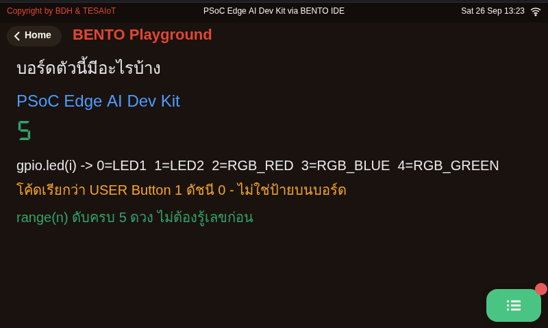
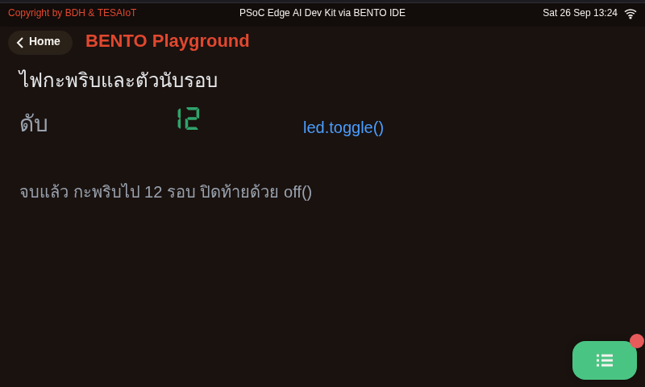
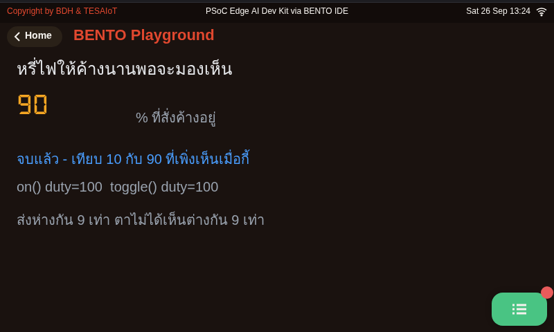
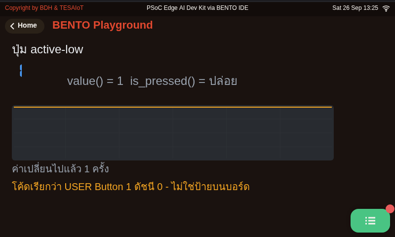
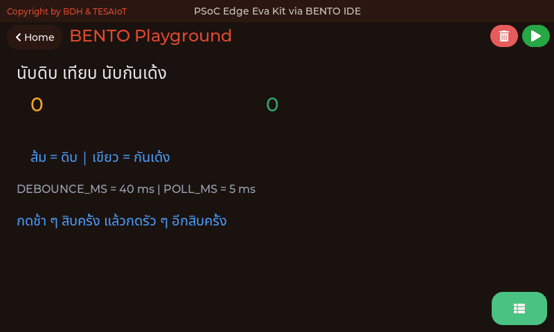
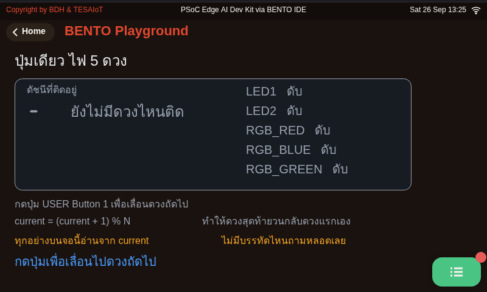

<style>
section { font-size: 24px; padding: 40px 52px; justify-content: flex-start; }
section h1 { font-size: 1.45em; line-height: 1.12; margin: 0 0 .22em; }
section h2 { font-size: 1.12em; margin: .15em 0; }
section h3 { font-size: 1.0em; margin: .12em 0; }
section p, section li { margin: .16em 0; line-height: 1.32; }
section img { max-width: 100%; height: auto; }
section svg { max-height: 252px; width: 100%; }
section iframe { border: 0; border-radius: 8px; box-shadow: 0 2px 10px rgba(0,0,0,.28); }
section table { font-size: .78em; }
section pre { font-size: .70em; line-height: 1.32; background:#0d1117; color:#e6edf3; border:1px solid #30363d; border-radius:8px; padding:12px 16px; box-shadow:0 2px 8px rgba(0,0,0,.25); }
section pre code { white-space: pre-wrap; background:transparent; color:inherit; } section pre .hljs-comment{color:#8b949e;font-style:italic} section pre .hljs-keyword,section pre .hljs-built_in,section pre .hljs-literal{color:#ff7b72} section pre .hljs-string{color:#a5d6ff} section pre .hljs-number{color:#79c0ff} section pre .hljs-title,section pre .hljs-title.function_,section pre .hljs-section{color:#d2a8ff} section pre .hljs-meta{color:#ffa657} section pre .hljs-attr,section pre .hljs-attribute,section pre .hljs-name{color:#7ee787}
section blockquote { margin: .25em 0; font-size: .92em; }
/* two images on a line (parity / 2x2 grids) stay side-by-side and small */
section p > img + img { margin-left: 10px; }
/* scroll-within-slide: dense slides scroll instead of clipping */
section { overflow-y: auto; overflow-x: hidden; }
section::-webkit-scrollbar { width: 11px; }
section::-webkit-scrollbar-thumb { background:#4a90d9; border-radius:6px; }
section::-webkit-scrollbar-track { background:rgba(0,0,0,.06); }
/* image drop-shadow + cover-slide readability (auto) */
section img{filter:drop-shadow(0 3px 12px rgba(0,0,0,.5))}
/* พื้นสำรองของสไลด์ปก: ถ้า img/cover_sNN.svg โหลดไม่ขึ้น ธีมจะคืนพื้นขาว
   แล้วตัวอักษรสีขาวของปกจะหายไปทั้งแผ่น — ปักสีเข้มไว้ให้ภาพเป็นแค่ของประดับ */
section.cover{background-color:#0b1426}
section.cover *{color:#fff !important}
section.cover h1,section.cover h2,section.cover h3,section.cover p,section.cover li,section.cover strong,section.cover em,section.cover blockquote,section.cover div{text-shadow:0 2px 9px rgba(0,0,0,.92),0 0 3px rgba(0,0,0,.8)}
section.cover div[style*="background:#"],section.cover div[style*="background: #"]{background:rgba(10,14,20,.66) !important;border-color:rgba(120,200,255,.45) !important;max-width:62%}
section.cover blockquote{border-left:4px solid rgba(120,200,255,.6) !important;background:rgba(13,17,23,.55) !important;border-radius:6px;padding:.3em .6em}
section.cover h1,section.cover h2,section.cover h3,section.cover p,section.cover blockquote{max-width:60%}
section.cover div:not(:has(img)){max-width:62%}
section.cover img{filter:none}
</style>


<!-- _class: cover -->

# บทเรียน 2.3 — ลงมือทำ: ไฟวิ่งกับปุ่ม แล้วส่งขึ้น broker

## สั่งฮาร์ดแวร์ด้วยโค้ดของเราเอง · LED ทุกดวงบนบอร์ด ปุ่มหนึ่งปุ่ม และลูปที่ไม่มีวันหยุด

**โมดูล 2 — จากจอสู่ฮาร์ดแวร์**

> ต่อจากบทเรียน 2.2 — หลังไฟและปุ่ม: active-low กันเด้ง และลูปที่ไม่หยุด

---

## MVP checkpoint — ผ่านชุดบทเรียนนี้เมื่อ


<b>LED chaser ครบทุกดวงของบอร์ด ปรับจังหวะได้ + กดปุ่มผู้ใช้ (เรียกด้วยชื่อจาก <code>.name()</code>) นับครั้งแสดงบน LCD</b>

แปลเป็นสิ่งที่ตรวจได้จริง:

- [ ] ไฟวิ่งไล่กันเป็นวงครบทุกดวงที่ `gpio.num_leds()` บอก ไม่มีดวงไหนค้างติดหรือข้ามดวง (Dev Kit: ดวง LED1/LED2 อยู่บนโมดูล ถ้ามองไม่เห็นให้ดูดวง RGB สามดวงเป็นหลัก แล้วจดไว้ว่าเห็นกี่ดวง)
- [ ] แก้ค่า `STEP_MS` แล้วรันใหม่ จังหวะไฟเปลี่ยนตามจริง (สาธิตอย่างน้อยสองค่า)
- [ ] กดปุ่มผู้ใช้ (`gpio.button(0)`) สิบครั้ง ตัวเลขบนจอขึ้นสิบพอดี
- [ ] อธิบายให้ผู้สอนฟังได้ว่าถ้าเอาโค้ดกันเด้งออก จะเกิดอะไรขึ้นและเพราะอะไร
- [ ] จบโปรแกรมแล้วไฟทุกดวงดับ พร้อมบรรทัดสรุปสีเขียวบนจอ
- [ ] ถ่ายรูปหรือคลิปสั้นแนบในบันทึกการเรียน

> ข้อที่ยากที่สุดคือข้อสี่ — ทำได้ไม่ยาก แต่ <b>อธิบายได้</b> ต้องเข้าใจจริง

---

## กับดักที่เจอบ่อย

<style scoped>
section table { font-size: .50em; }
section table td, section table th { padding: .06em .4em; line-height: 1.22; }
section blockquote { font-size: .78em; margin: .1em 0; }
</style>

| อาการ | สาเหตุที่แท้จริง | วิธีแก้ |
|---|---|---|
| กดหนึ่งครั้ง เลขขึ้น 3-5 | ยังไม่ได้กันเด้ง หรือ `DEBOUNCE_MS` น้อยเกิน | ตั้ง `DEBOUNCE_MS = 40` แล้วลองใหม่ |
| กดหนึ่งครั้ง เลขขึ้นทีละ 2 | ลืม `if stable:` จึงนับทั้งตอนกดและตอนปล่อย | นับเฉพาะขอบขาเข้า |
| กดแล้วเลขไม่ขึ้นเลย | ใช้ `sleep_ms` ยาวในลูป ปุ่มหลุดตอนหลับ | ใช้ `ticks_diff` คุมจังหวะ หลับแค่ 5 ms |
| ไฟไม่วิ่ง ค้างดวงเดียว | `last_step = now` อยู่นอก `if` | ย้ายเข้าไปในบล็อก `if` |
| ไฟติดพร้อมกันสองดวง | จุดดวงใหม่ก่อนดับดวงเดิม | เรียง off → เลื่อน index → on |
| (Eva) ไฟดวงที่ 3 เป็นสีน้ำเงิน ทั้งที่ชื่อ RGB_RED | ชื่อในตารางร่วมของเฟิร์มแวร์ ตกทอดมาจากบอร์ดรุ่นอื่น | เชื่อสายตา ตั้งค่าคงที่ของทีมเอง |
| (Dev Kit) สั่ง `led(0)`/`led(1)` แล้วมองไม่เห็นอะไรติด | LED1/LED2 อยู่บนโมดูล — มองเห็นบนบอร์ดที่ประกอบแล้วหรือไม่ ยังไม่ได้วัด | ดูดวง RGB (ดัชนี 2-4) เป็นหลัก แล้วจดผลที่เห็นลงบันทึกการเรียน |
| กดปุ่มอื่นบนบอร์ดแล้วไม่มีอะไรเกิดขึ้น | Python เข้าถึงได้ปุ่มเดียวคือ index 0 | ใช้ปุ่มที่ `gpio.button(0).name()` บอก — บน Dev Kit **ห้ามโยกสวิตช์ใดบนฐานที่บทเรียนไม่ได้สั่ง** หลายตัวคือสวิตช์ตัดไฟเลี้ยง · ปุ่มกดสองปุ่มของฐานใช้ผ่านโมดูล `buttons` เท่านั้น |
| จอไม่ขึ้นตัวเลข แต่ไฟวิ่งปกติ | ไม่ได้เปิดหน้า Playground ไว้ | แตะการ์ด Playground แล้ว RESTART |
| `duty()` ตอบไม่ตรงกับหลอดที่เห็น | `toggle()` ไม่ได้ไปแก้ตัวเลขของ `duty()` | อ่าน `duty()` ว่า "สั่งอะไรไปล่าสุด" เท่านั้น |
| `AttributeError` ตอนเรียก `machine.PWM` | `PWM` `ADC` `SPI` ไม่มีในพอร์ตนี้ · `Timer` มีโค้ดแต่เฟิร์มแวร์ชุดนี้ไม่ได้เปิดให้ | หรี่ไฟด้วย `gpio.led().brightness()` (ดวง RGB ค้างระดับได้) หรือ `hold(pct, ms)` แทน |
| เรียก `hold(80, 3000)` แล้วปุ่มกดไม่ติดสามวินาที | `hold()` บล็อกจนครบ `ms` ระหว่างนั้นไม่มีใครอ่านปุ่ม | แบ่งเป็น `hold()` สั้น ๆ หลายครั้งในลูป |

> สังเกตว่ากับดักสามข้อแรกคือ *ตรรกะเวลา* ไม่ใช่ไวยากรณ์ — นี่คือลักษณะเฉพาะของงานฝังตัว

---

## ลงมือทำ — เติมช่องว่างในไฟล์ฝึก

<style scoped>
section pre { font-size: .50em; }
section p { margin: .06em 0; }
section svg { max-height: 148px; }
</style>

เปิด [`s03_led_button.py`](https://github.com/tesaiot/tesa-qualification-program/blob/main/courses/aiot-micropython/m02-ui-to-hardware/l03-led-button-lab/practice/s03_led_button.py) มีช่องว่างให้เติม 6 จุด

```python
for i in range(NUM_LEDS):
    # เติม: gpio.led(i).off()
    pass

    # เติม: led_index = (led_index + 1) % NUM_LEDS
    pass

    # เติม: raw = btn.is_pressed()
    pass

        # เติม: last_change = now
        pass

            # เติม: count += 1
            pass

# เติม: lcd.print("<span class=ok>จบรอบทดสอบ กดปุ่มทั้งหมด " + str(count) + " ครั้ง</span>")
pass
```

<svg viewBox="0 0 940 172" xmlns="http://www.w3.org/2000/svg">
  <text x="470" y="24" text-anchor="middle" font-size="19" font-weight="700" fill="#37474f">หกจุด แบ่งเป็นสามกลุ่ม — เติมแล้วรันทีละกลุ่ม อย่ารวดเดียว</text>
  <rect x="20" y="40" width="286" height="88" rx="10" fill="#e8f5e9" stroke="#2e7d32" stroke-width="2"/>
  <text x="163" y="68" text-anchor="middle" font-size="19" font-weight="700" fill="#2e7d32">กลุ่มไฟ · จุด 1-2</text>
  <text x="163" y="94" text-anchor="middle" font-size="18" fill="#1b5e20">ดับให้หมด + เลื่อน index</text>
  <text x="163" y="118" text-anchor="middle" font-size="17" fill="#4a7c4e">รันแล้วต้องเห็นไฟวิ่ง</text>
  <rect x="326" y="40" width="288" height="88" rx="10" fill="#fff8e1" stroke="#f57f17" stroke-width="2"/>
  <text x="470" y="68" text-anchor="middle" font-size="19" font-weight="700" fill="#e65100">กลุ่มปุ่ม · จุด 3-5</text>
  <text x="470" y="94" text-anchor="middle" font-size="18" fill="#e65100">อ่านดิบ + จับเวลา + นับ</text>
  <text x="470" y="118" text-anchor="middle" font-size="17" fill="#a1683a">ระวังการเยื้องสามชั้น</text>
  <rect x="634" y="40" width="288" height="88" rx="10" fill="#e3f2fd" stroke="#1565c0" stroke-width="2"/>
  <text x="778" y="68" text-anchor="middle" font-size="19" font-weight="700" fill="#1565c0">กลุ่มปิดท้าย · จุด 6</text>
  <text x="778" y="94" text-anchor="middle" font-size="18" fill="#0d47a1">บรรทัดสรุปสีเขียว</text>
  <text x="778" y="118" text-anchor="middle" font-size="17" fill="#5472a3">ใส่ str(count) ให้ถูก</text>
  <circle cx="163" cy="148" r="7" fill="#455a64"><animateMotion path="M0,0 L307,0 L615,0" dur="4s" repeatCount="indefinite"/></circle>
</svg>

ระวังการเยื้องบรรทัด — สามจุดกลางอยู่คนละชั้นกัน ถ้าเยื้องผิด Python จะเอาโค้ดไปไว้ผิดเงื่อนไข · ลำดับที่แนะนำ: เติมจุด 1-2 ให้ไฟวิ่งก่อน แล้วค่อยจุด 3-5 เรื่องปุ่ม สุดท้ายจุด 6

> เติมทีละกลุ่มแล้วรัน — พอไฟวิ่งได้แล้วปุ่มพัง เรารู้ทันทีว่าปัญหาไม่ได้อยู่ที่ไฟ

---

## ตัวอย่างของบทเรียน 2.1–2.3 — สามไฟล์แรกคือชุดที่กันไม่ให้ MVP พังทั้งวัน

<style scoped>
section table { font-size: .50em; }
section table td, section table th { padding: .06em .4em; line-height: 1.22; }
section p { margin: .05em 0; font-size: .86em; line-height: 1.26; }
section blockquote { font-size: .78em; margin: .06em 0; }
</style>

**ต้องทำในบทเรียน** · เปิดตามลำดับนี้ ทั้งชุดราว 35 นาที

| ลำดับ · เรื่อง · เวลา | ไฟล์ | ลงมือทำอะไร แล้วจะเข้าใจอะไร |
|---|---|---|
| **1 · ถามบอร์ดก่อนว่ามีอะไร** · 10 นาที | [`01_board_info.py`](https://github.com/tesaiot/tesa-qualification-program/blob/main/courses/aiot-micropython/m02-ui-to-hardware/l01-gpio-leds-buttons/examples/01_board_info.py) | รันแล้วจดว่ามีไฟกี่ดวง ปุ่มกี่ปุ่ม ชื่อไหนคู่กับดัชนีอะไร · จะไม่ตกหลุมชื่อปุ่มกับชื่อสีที่ไม่ตรงกับความจริง เพราะเขียนจากค่าที่ถามมา |
| **2 · ปุ่มนี้ 0 คือกด** · 10 นาที | [`04_button_active_low.py`](https://github.com/tesaiot/tesa-qualification-program/blob/main/courses/aiot-micropython/m02-ui-to-hardware/l02-active-low-debounce/examples/04_button_active_low.py) | กดปุ่มผู้ใช้ค้างไว้แล้วดูเลขกับเส้นกราฟตกลงพร้อมกัน · จะรู้ว่า `value()` คืนแรงดันดิบ ส่วน `is_pressed()` คืนความหมาย และ `if btn.value():` ทำงานกลับด้านหมด |
| **3 · นับให้ตรงด้วยการรอให้นิ่ง** · 15 นาที | [`05_debounce_count.py`](https://github.com/tesaiot/tesa-qualification-program/blob/main/courses/aiot-micropython/m02-ui-to-hardware/l02-active-low-debounce/examples/05_debounce_count.py) | กดสิบครั้งแล้วเทียบเลขนับดิบกับเลขนับกันเด้ง · จะอธิบายได้ว่าถ้าถอดโค้ดกันเด้งออกจะเกิดอะไร ซึ่งเป็นข้อที่ตกกันมากที่สุดของ MVP |

**ติดตรงไหน เปิดอันนี้**

| อาการที่เจอ | ไฟล์ที่ตอบอาการนั้น |
|---|---|
| ไฟยังกะพริบไม่เป็นจังหวะ หรือจบโปรแกรมแล้วไฟค้างติดโดยไม่ตั้งใจ | [`02_led_blink.py`](https://github.com/tesaiot/tesa-qualification-program/blob/main/courses/aiot-micropython/m02-ui-to-hardware/l02-active-low-debounce/examples/02_led_blink.py) — กะพริบจริงพร้อมนับรอบขึ้นจอ `toggle()` ขึ้นกับค่าเดิมเสมอ ส่วน `on()` กับ `off()` ไม่สนใจค่าเดิม จึงต้องปิดท้ายด้วย `off()` |
| สั่งหรี่ไฟแล้วเงยหน้าไปมองหลอด ไม่เห็นความต่างสักระดับ | [`03_led_brightness.py`](https://github.com/tesaiot/tesa-qualification-program/blob/main/courses/aiot-micropython/m02-ui-to-hardware/l01-gpio-leds-buttons/examples/03_led_brightness.py) — ไฟล์เลือกดวง RGB ให้ แล้วสั่ง `brightness(40)` ครั้งเดียวให้**มองหลอดเอง**ว่าค้างหรือวูบ (ดวงที่มีเส้น PWM ค้าง ดวงอื่นวูบ 12 ms แล้วดับ) จากนั้นเทียบสองระดับด้วย `led.hold(pct, ms)` ที่ค้างได้ทุกดวง และไฟล์นี้ยังพิสูจน์ให้เห็นว่า `duty()` ตอบเลขที่เราสั่ง ไม่ได้ไปวัดหลอด |
| ปุ่มเดียวต้องคุมไฟหลายดวง แต่จำไม่ได้ว่าตอนนี้ดวงไหนติด | [`06_button_picks_led.py`](https://github.com/tesaiot/tesa-qualification-program/blob/main/courses/aiot-micropython/m02-ui-to-hardware/l02-active-low-debounce/examples/06_button_picks_led.py) — กดปุ่มเดิมซ้ำ ๆ แล้วดูดัชนีเลื่อนไปทีละดวง สถานะที่โปรแกรมจำไว้เองคือของที่เชื่อได้ที่สุด |

**อ่านเสริมนอกเวลา** — เรื่องนี้อยู่นอกเกณฑ์ผ่านของบทเรียน 2.1–2.3 แต่คือรูปร่างที่ลูปวันนี้ไปโผล่ในโรงงานจริง: [`01_andon_severity_lamp.py`](https://github.com/tesaiot/tesa-qualification-program/blob/main/courses/aiot-micropython/shared/usecase/01_andon_severity_lamp.py) เสาไฟ andon หนึ่งระดับความรุนแรงคือไฟหนึ่งดวง และต้องดับทุกดวงก่อนจุดดวงใหม่เสมอ ไม่งั้นคนที่มองจากอีกฝั่งโรงงานจะอ่านระดับผิด

> สามไฟล์แรกคือของที่ต้องเปิดจริงในบทเรียน ตารางล่างเปิดเฉพาะตอนเจออาการนั้น

---

## เชื่อมโยงรากฐาน — วันนี้เราแตะอะไรไปบ้าง

**ฝั่งระบบสมองกลฝังตัว**
GPIO เอาต์พุตกับอินพุต · แนวคิด active-high / active-low และตัวต้านทาน pull-up · polling loop กับการเลือกคาบเวลาสุ่มตัวอย่าง · contact bounce และการกันเด้ง · ค่าที่อ่านกลับจากขา บอกระดับของขา ไม่ได้บอกความตั้งใจของโปรแกรม

**ฝั่ง Python และวิทยาการคอมพิวเตอร์**
`while` ที่มีเงื่อนไขจบ · ตัวดำเนินการมอดุโล `%` สำหรับการวนเป็นวง · state machine ขนาดเล็กด้วยตัวแปรสามตัว (`last_raw`, `stable`, `count`) · edge detection เทียบกับ level detection

**ฝั่งการออกแบบระบบ**
แยกค่าที่ปรับได้ไว้บนสุดของไฟล์ · ให้โปรแกรมจำสถานะของตัวเอง ไม่ฝากไว้กับอุปกรณ์ · รายงานเมื่อมีเหตุการณ์ ไม่ใช่รายงานตามเวลา · เก็บกวาดสถานะก่อนจบโปรแกรม

<svg viewBox="0 0 940 157" xmlns="http://www.w3.org/2000/svg">
  <rect x="20" y="34" width="286" height="100" rx="10" fill="#e3f2fd" stroke="#1565c0" stroke-width="2"/>
  <text x="163" y="64" text-anchor="middle" font-size="19" font-weight="700" fill="#1565c0">ฮาร์ดแวร์</text>
  <text x="163" y="92" text-anchor="middle" font-size="18" fill="#0d47a1">active-high / active-low</text>
  <text x="163" y="116" text-anchor="middle" font-size="18" fill="#0d47a1">pull-up · contact bounce</text>
  <rect x="326" y="34" width="288" height="100" rx="10" fill="#e8f5e9" stroke="#2e7d32" stroke-width="2"/>
  <text x="470" y="64" text-anchor="middle" font-size="19" font-weight="700" fill="#2e7d32">วิทยาการคอมพิวเตอร์</text>
  <text x="470" y="92" text-anchor="middle" font-size="18" fill="#1b5e20">state machine 3 ตัวแปร</text>
  <text x="470" y="116" text-anchor="middle" font-size="18" fill="#1b5e20">edge เทียบกับ level · %</text>
  <rect x="634" y="34" width="288" height="100" rx="10" fill="#fff8e1" stroke="#f57f17" stroke-width="2"/>
  <text x="778" y="64" text-anchor="middle" font-size="19" font-weight="700" fill="#e65100">การออกแบบ</text>
  <text x="778" y="92" text-anchor="middle" font-size="18" fill="#e65100">จำสถานะของตัวเอง</text>
  <text x="778" y="116" text-anchor="middle" font-size="18" fill="#e65100">รายงานตามเหตุการณ์</text>
  <text x="470" y="24" text-anchor="middle" font-size="19" font-weight="700" fill="#37474f">สามรากที่ชุดบทเรียนนี้ปักลงไป และจะโผล่อีกทุกบทเรียนที่เหลือ</text>
</svg>

> `%` ที่ใช้วนไฟทุกดวงวันนี้ คือตัวเดียวกับที่ใช้วน buffer ข้อมูลเซนเซอร์ในบทเรียน 3.4–3.6

---

<style scoped>section table { font-size:.62em } section table td, section table th { padding:.08em .5em } section p { font-size:.9em;margin:.1em 0 } section blockquote { font-size:.78em;margin:.1em 0 }</style>

## ปุ่มกับไฟขึ้น broker — ภาพทั้งวง

<svg viewBox="0 0 940 262" xmlns="http://www.w3.org/2000/svg">
  <defs><marker id="ab3" markerUnits="userSpaceOnUse" markerWidth="12" markerHeight="10" refX="11" refY="5" orient="auto">
    <path d="M0,0 L12,5 L0,10 z" fill="#455a64" /></marker></defs>
  <rect x="8" y="34" width="584" height="198" rx="12" fill="#fafafa" stroke="#90a4ae" stroke-width="2" stroke-dasharray="6 5" />
  <text x="300" y="24" text-anchor="middle" font-size="18" font-weight="700" fill="#455a64">บอร์ดของทีม (07_button_to_broker.py)</text>
  <rect x="20" y="56" width="88" height="70" rx="8" fill="#fff3e0" stroke="#ef6c00" stroke-width="2" />
  <text x="64" y="86" text-anchor="middle" font-size="18" font-weight="700" fill="#ef6c00">ปุ่ม</text>
  <text x="64" y="110" text-anchor="middle" font-size="17" fill="#e65100">ทุก 5 ms</text>
  <rect x="132" y="56" width="112" height="70" rx="8" fill="#e3f2fd" stroke="#1565c0" stroke-width="2" />
  <text x="188" y="86" text-anchor="middle" font-size="18" font-weight="700" fill="#1565c0">กันเด้ง</text>
  <text x="188" y="110" text-anchor="middle" font-size="17" fill="#0d47a1">นิ่ง 40 ms</text>
  <rect x="268" y="56" width="136" height="70" rx="8" fill="#e8f5e9" stroke="#2e7d32" stroke-width="2" />
  <text x="336" y="86" text-anchor="middle" font-size="18" font-weight="700" fill="#2e7d32">ตัวแปร</text>
  <text x="336" y="110" text-anchor="middle" font-size="17" fill="#1b5e20">presses, leds</text>
  <rect x="428" y="56" width="152" height="70" rx="8" fill="#e3f2fd" stroke="#1565c0" stroke-width="2" />
  <text x="504" y="86" text-anchor="middle" font-size="18" font-weight="700" fill="#1565c0">publish</text>
  <text x="504" y="110" text-anchor="middle" font-size="17" fill="#0d47a1">event, telemetry</text>
  <rect x="132" y="148" width="112" height="70" rx="8" fill="#fff8e1" stroke="#f57f17" stroke-width="2" />
  <text x="188" y="178" text-anchor="middle" font-size="18" font-weight="700" fill="#e65100">LED จริง</text>
  <text x="188" y="202" text-anchor="middle" font-size="17" fill="#e65100">gpio.led(n)</text>
  <rect x="268" y="148" width="136" height="70" rx="8" fill="#e8f5e9" stroke="#2e7d32" stroke-width="2" />
  <text x="336" y="178" text-anchor="middle" font-size="18" font-weight="700" fill="#2e7d32">ตรวจ n</text>
  <text x="336" y="202" text-anchor="middle" font-size="17" fill="#1b5e20">แล้วจด leds[n]</text>
  <rect x="428" y="148" width="152" height="70" rx="8" fill="#e3f2fd" stroke="#1565c0" stroke-width="2" />
  <text x="504" y="178" text-anchor="middle" font-size="18" font-weight="700" fill="#1565c0">get_message</text>
  <text x="504" y="202" text-anchor="middle" font-size="17" fill="#0d47a1">หยิบทุกรอบ</text>
  <rect x="616" y="56" width="172" height="162" rx="12" fill="#f3e5f5" stroke="#6a1b9a" stroke-width="3" />
  <text x="702" y="88" text-anchor="middle" font-size="18" font-weight="700" fill="#6a1b9a">broker</text>
  <text x="702" y="116" text-anchor="middle" font-size="17" fill="#4a148c">broker.hivemq.com</text>
  <text x="702" y="146" text-anchor="middle" font-size="17" fill="#4a148c">บอร์ด: 1883</text>
  <text x="702" y="172" text-anchor="middle" font-size="17" fill="#4a148c">เว็บ: wss 8884</text>
  <text x="702" y="200" text-anchor="middle" font-size="17" fill="#7e5a94">ไม่เก็บใบล่าสุด</text>
  <rect x="808" y="56" width="126" height="162" rx="12" fill="#eceff1" stroke="#455a64" stroke-width="2" />
  <text x="871" y="88" text-anchor="middle" font-size="18" font-weight="700" fill="#455a64">หน้าเว็บ</text>
  <text x="871" y="116" text-anchor="middle" font-size="17" fill="#37474f">telemetry</text>
  <text x="871" y="142" text-anchor="middle" font-size="17" fill="#37474f">event</text>
  <text x="871" y="200" text-anchor="middle" font-size="17" fill="#37474f">ส่ง cmd</text>
  <line x1="110" y1="91" x2="130" y2="91" stroke="#455a64" stroke-width="3" marker-end="url(#ab3)" />
  <line x1="246" y1="91" x2="266" y2="91" stroke="#455a64" stroke-width="3" marker-end="url(#ab3)" />
  <line x1="406" y1="91" x2="426" y2="91" stroke="#455a64" stroke-width="3" marker-end="url(#ab3)" />
  <line x1="582" y1="91" x2="614" y2="91" stroke="#455a64" stroke-width="3" marker-end="url(#ab3)" />
  <line x1="790" y1="116" x2="806" y2="116" stroke="#455a64" stroke-width="3" marker-end="url(#ab3)" />
  <line x1="806" y1="194" x2="790" y2="194" stroke="#455a64" stroke-width="3" marker-end="url(#ab3)" />
  <line x1="614" y1="183" x2="582" y2="183" stroke="#455a64" stroke-width="3" marker-end="url(#ab3)" />
  <line x1="426" y1="183" x2="406" y2="183" stroke="#455a64" stroke-width="3" marker-end="url(#ab3)" />
  <line x1="266" y1="183" x2="246" y2="183" stroke="#455a64" stroke-width="3" marker-end="url(#ab3)" />
  <text x="470" y="256" text-anchor="middle" font-size="17" fill="#78909c">แถวบนคือของที่ขึ้น แถวล่างคือของที่ลง ทั้งสองแถววิ่งอยู่ในลูปเดียวกัน</text>
</svg>

| topic | ทาง | ส่งเมื่อไร | JSON ตัวอย่าง |
|---|---|---|---|
| `bento-aiot/team03/event` | บอร์ด → เว็บ | ทันทีที่กด (ผ่านกันเด้งแล้ว) | `{"ev":"press","presses":4,"id":"team03","n":17}` |
| `bento-aiot/team03/telemetry` | บอร์ด → เว็บ | ทุก 2 วินาที | `{"presses":4,"btn":0,"leds":[1,0,0],"az":9.79,"id":"team03","n":18}` |
| `bento-aiot/team03/cmd` | เว็บ → บอร์ด | ตอนมีคนกดบนหน้าเว็บ | `{"cmd":"led","n":0,"on":1}` · `{"cmd":"beep"}` |

> `team03` คือตัวอย่าง ใช้รหัส `TEAM` ของคุณ · `n` คือเลขใบที่เดินต่อกันทุกใบ อีกฝั่งเห็นเลขกระโดดก็รู้ว่ามีใบหาย · ตัวเลขในตารางเป็นตัวอย่างรูปร่าง ไม่ใช่ค่าที่วัดมา

---

<style scoped>section :is(pre, marp-pre) { font-size:.56em;line-height:1.24;padding:8px 14px } section p, section li { font-size:.84em;margin:.06em 0 }</style>

## แกะ [`07_button_to_broker.py`](https://github.com/tesaiot/tesa-qualification-program/blob/main/courses/aiot-micropython/m02-ui-to-hardware/l03-led-button-lab/examples/07_button_to_broker.py) — สามงานในลูปเดียว

```python
while time.ticks_diff(time.ticks_ms(), t0) < RUN_MS:
    now = time.ticks_ms()
    raw = btn.is_pressed()
    # งานที่ 1: กันเด้งแบบไฟล์ 05
    if raw != last_raw:
        last_raw = raw; last_change = now
    elif raw != stable and time.ticks_diff(now, last_change) >= DEBOUNCE_MS:
        stable = raw
        if stable:                               # ส่งเฉพาะขอบ "เริ่มกด"
            presses = presses + 1
            if not send(TOPIC_EVENT, {"ev": "press", "presses": presses}):
                lost = True; break
    # งานที่ 2: telemetry ตามนาฬิกา ไม่ใช่ตาม sleep
    if time.ticks_diff(now, last_state) >= STATE_MS:
        last_state = now
        state = {"presses": presses, "btn": 1 if stable else 0, "leds": leds}
        if not send(TOPIC_STATE, state):
            lost = True; break
    # งานที่ 3: หยิบคำสั่งทุกรอบ กล่องรับมีช่องเดียว
    msg = mqtt.get_message()
    if msg is not None:
        handle(msg[1])
    if not mqtt.is_connected():
        lost = True; break
    ui.poll()
    time.sleep_ms(POLL_MS)
```

- โครงนี้คือลูปเดิมของวันนี้ ที่เพิ่มมามีแค่ `send()` สองจุดกับ `get_message()` หนึ่งจุด · `;` ใช้บีบบรรทัดบนสไลด์เท่านั้น
- `leds` มาจาก**ตัวแปร** `handle()` สั่ง `gpio.led(i).on()` แล้วจด `leds[i]` ทันที ไม่มีบรรทัดไหนถามขา
- `send()` ดักสองทาง: คืน `False` = ใบนั้นหาย สายยังอยู่ · โยน `OSError` = สายหลุด ออกจากลูป ดับไฟ บอกบนจอ

---

<style scoped>section table { font-size:.6em } section table td, section table th { padding:.1em .5em;line-height:1.26 } section p { font-size:.88em } section blockquote { font-size:.78em }</style>

## สี่เรื่องของเฟิร์มแวร์ตัวนี้ — โค้ดเราจึงหน้าตาแบบนี้

| สิ่งที่เฟิร์มแวร์ทำ | ที่มาในซอร์ส | ถ้าไม่รู้จะเจออะไร | 07 รับมืออย่างไร |
|---|---|---|---|
| `publish()` ส่งแบบ **retain = false เสมอ** แม้ docstring จะเขียนว่ารับ `retain=` | `modmqtt.c:316` | เปิดหน้าเว็บทีหลังแล้วจอว่าง เพราะ broker ไม่ได้เก็บใบล่าสุดไว้ให้ใคร | ส่ง telemetry **ซ้ำทุก 2 วินาที** หน้าเว็บที่เปิดช้าที่สุดก็ตามทันภายใน 2 วินาที |
| `get_message()` เป็น**กล่องช่องเดียว** ใบใหม่ทับใบเก่า | `modmqtt.c:80-98` ตอนรับ · `:385-400` ตอนหยิบ | กดปุ่มบนหน้าเว็บรัว ๆ สามครั้ง บอร์ดเห็นใบเดียว | หยิบทุกรอบลูป รอบละ 5 ms ไม่หลับยาวที่ไหนเลย |
| `publish()` ตอนสายหลุด**โยน `OSError`** ไม่ได้คืน `False` | `modmqtt.c:292-294` | โปรแกรมพังกลางบทเรียนพร้อม traceback | `send()` ดัก `OSError` แล้วคืน `False` ให้ลูปหยุดอย่างสุภาพ |
| ไม่ต่อใหม่ให้เอง และ `clean_session` เป็นจริงเสมอ (broker ไม่จำว่าเราเคยขอฟังอะไร) | `modmqtt.c:256` · ไม่มีโค้ดต่อใหม่ในโมดูล | สายหลุดแล้วบอร์ดเงียบ คนดูคิดว่าไม่มีใครกดปุ่ม | ถาม `is_connected()` ทุกรอบ หลุดเมื่อไรขึ้นแดงบนจอ แล้วให้รันใหม่ |

อีกหนึ่งกฎที่ทั้งห้องต้องรู้: **client\_id ซ้ำกันไม่ได้** บน broker ตัวเดียวกัน ใครต่อทีหลังจะเตะคนก่อนหลุด (ทดลองแล้วบน broker สาธารณะทั้งสองตัว) ไฟล์ 07 ใช้ `"bento-aiot-" + TEAM` จึงรันได้**บอร์ดเดียวต่อทีม** ส่วนหน้าเว็บสุ่มชื่อ `web-...` เอง เปิดกี่แท็บก็ไม่เตะบอร์ด

> ข้อที่เฟิร์มแวร์ "ทำไม่ได้" ไม่ใช่ข้อตำหนิ มันคือข้อมูลออกแบบ โค้ดที่ดีเขียนรอบข้อจำกัดของของจริง ไม่ใช่ของที่อยากให้เป็น

---

<style scoped>section li, section p { font-size:.88em;margin:.08em 0 } section :is(pre, marp-pre) { font-size:.62em } section blockquote { font-size:.78em }</style>

## เปิดหน้าเว็บของทีม — [`my_first_reader.html`](https://github.com/tesaiot/tesa-qualification-program/blob/main/courses/aiot-micropython/shared/web/my_first_reader.html)

ไม่ต้องติดตั้งอะไรเลย ใช้แค่เบราว์เซอร์ (มือถือก็ได้)

1. เปิดลิงก์นี้ เปลี่ยน `team05` ท้ายลิงก์เป็นรหัสของคุณ ไม่ต้องบันทึกหรือแก้ไฟล์ · หน้านี้บนเว็บ AIC รับเฉพาะรหัสรูป `teamNN` ถ้าใช้รหัสของตัวเองอย่าง `nok4821` ให้ดาวน์โหลด [`my_first_reader.html`](https://github.com/tesaiot/tesa-qualification-program/blob/main/courses/aiot-micropython/shared/web/my_first_reader.html) ของรีโพนี้ไปเปิดในเบราว์เซอร์แทน

<https://advance-innovation-centre-aic.github.io/embedded-systems-for-aiot-developer/examples/web/my_first_reader.html?team=team05>

```javascript
// ทางเลือก: ดาวน์โหลด shared/web/my_first_reader.html ของรีโพนี้ไปเปิดเอง แล้วแก้บรรทัดนี้แทนการต่อท้ายลิงก์
let TEAM = "teamXX";          // รหัสเดียวกับ TEAM ในไฟล์ Python เช่น "nok4821" (เรียนเป็นกลุ่มใช้เลขที่ผู้จัดแจก เช่น "team05")
```

2. บรรทัดสถานะบนหน้าเว็บต้องขึ้น "ต่อแล้ว (bento-aiot/team05)" ตามรหัสของคุณ
3. รัน [`07_button_to_broker.py`](https://github.com/tesaiot/tesa-qualification-program/blob/main/courses/aiot-micropython/m02-ui-to-hardware/l03-led-button-lab/examples/07_button_to_broker.py) บนบอร์ด ภายใน 2 วินาทีกล่องค่าจะขึ้น `presses` `btn` `leds` (และ `az` ถ้าอ่าน IMU ได้)
4. กดปุ่มบนบอร์ด ช่อง "เหตุการณ์ล่าสุด" เปลี่ยนทันที · กด "เปิดไฟ LED 0" บนหน้าเว็บ `leds` ใบถัดไปเปลี่ยนตาม (บน Dev Kit ดวง 0 อยู่บนโมดูล อาจมองไม่เห็นหลอด แต่ `leds` บนหน้าเว็บยังเปลี่ยนให้เห็น · อยากสั่งดวง 2 ซึ่งเป็นดวง RGB มีทั้งสองบอร์ด ให้ใช้ไฟล์ที่ดาวน์โหลดแล้วแก้ปุ่มเป็น `n: 2`)

หน้าเว็บของ**ทั้งห้อง**คือ [`mqtt_dashboard.html`](https://github.com/tesaiot/tesa-qualification-program/blob/main/courses/aiot-micropython/shared/web/mqtt_dashboard.html) ผู้สอนฉายขึ้นจอ ทุกทีมเป็นการ์ดหนึ่งใบ <https://advance-innovation-centre-aic.github.io/embedded-systems-for-aiot-developer/examples/web/mqtt_dashboard.html>

**สมาชิกที่นั่ง Emulator** — Emulator ต่อ broker จริงได้แล้ว รันไฟล์ 07 บน Emulator ด้วย `TEAM` ของทีมก็ขึ้นหน้าเว็บเดียวกัน (Emulator เติม `-emu` ท้าย client\_id จึงไม่เตะบอร์ดจริง) หรือเปิดหน้าเว็บนี้ดูและสั่งบอร์ดของทีมจากที่นั่งตัวเองก็ได้

> ต่อไม่ติด: เปลี่ยนทั้งสองฝั่งไปตัวสำรอง `test.mosquitto.org` (บอร์ด 1883 · เว็บ `wss://test.mosquitto.org:8081/mqtt`) · เครือข่ายขององค์กรยังไม่เคยทดสอบ อาจปิดพอร์ตใดพอร์ตหนึ่งไว้ · ห้าม subscribe `#` บน broker สาธารณะ ฟังเฉพาะ `bento-aiot/<ทีม>/#`

---

<style scoped>section li, section p { font-size:.86em;margin:.06em 0 } section blockquote { font-size:.76em }</style>

## งานประยุกต์บทเรียน 1.4–1.6 + 2.1–2.3 (ไม่บังคับ) — ส่งของของทีมขึ้น broker แล้วให้หน้าเว็บแสดง

**โจทย์** เลือกค่าหนึ่งตัวที่ทีมอยากให้คนนอกห้องเห็น แล้วทำให้มันไปถึงหน้าเว็บ

- **เลือกของ** ค่าจากเซนเซอร์ (`az` มีให้แล้ว ลองแกนอื่นหรือเซนเซอร์อื่น) หรือสถานะ GPIO (ปุ่มค้างนานแค่ไหน · ดวงไหนติดอยู่ · กดยาวหรือกดสั้น)
- **ส่ง** เพิ่ม key สั้น ตัวเล็ก ลงใน `state` ของไฟล์ 07 ไปกับ telemetry ทุก 2 วินาที ถ้าเป็นเหตุการณ์ที่เกิดทีเดียว ส่งเป็น `event` แทน
- **อ่าน** หน้าเว็บวาดกล่องให้ทุก key อยู่แล้ว งานของทีมคือแก้ `my_first_reader.html` ให้**ตอบสนอง**ค่านั้น เช่น เปลี่ยนสีเมื่อเกินเกณฑ์ หรือเพิ่มปุ่มสั่งไฟดวงอื่น
- **กลับทาง** (ไม่บังคับ) เพิ่มคำสั่งใหม่ใน `handle()` แล้วเพิ่มปุ่มบนหน้าเว็บที่ส่งมัน

**ทำครบเมื่อ** (การบ้านหรือทำเมื่อเสร็จก่อนเวลา ไม่อยู่ในเกณฑ์ผ่าน)

- [ ] telemetry ของทีมขึ้นทุก 2 วินาที มี `id` `n` และค่าที่ทีมเลือกอย่างน้อยหนึ่งตัว
- [ ] กดปุ่มบนบอร์ดสิบครั้ง หน้าเว็บเห็น `presses` เพิ่มสิบพอดี
- [ ] สั่งไฟดวง 2 จากหน้าเว็บแล้วไฟบนบอร์ดติด และ `leds` ใน telemetry ใบถัดไปเปลี่ยนตาม
- [ ] หน้าเว็บของทีมตอบสนองค่าที่เลือกอย่างน้อยหนึ่งอย่าง (แก้เอง ไม่ใช่แค่แสดงดิบ)
- [ ] อธิบายได้ว่าทำไมต้องกันเด้ง**ก่อน** publish และทำไมส่ง `leds` จากตัวแปร ไม่ใช่จากขา

> จดลงบันทึกการเรียน · ถ้าเจอพฤติกรรมที่ไม่ตรงกับสไลด์ จดไว้แล้วบอกผู้สอน นั่นคือผลการวัด ไม่ใช่ความผิดของทีม

---

<style scoped>section li, section p { font-size:.88em;margin:.06em 0 } section blockquote { font-size:.78em }</style>

## เกมกดเร็วทั้งห้อง — จับเวลาที่ไหนถึงยุติธรรม

บอร์ด: [`08_class_race.py`](https://github.com/tesaiot/tesa-qualification-program/blob/main/courses/aiot-micropython/m02-ui-to-hardware/l03-led-button-lab/examples/08_class_race.py) (แก้ WiFi กับ `TEAM` จาก `teamXX` เหมือนไฟล์ 07 · เปิดเกมไว้ 45 นาที) · จอหน้าห้อง: [`class_game.html`](https://github.com/tesaiot/tesa-qualification-program/blob/main/courses/aiot-micropython/shared/web/class_game.html) ผู้สอนเปิดลิงก์นี้ฉายขึ้นจอ <https://advance-innovation-centre-aic.github.io/embedded-systems-for-aiot-developer/examples/web/class_game.html>

1. ผู้สอนกด **เริ่มรอบ** คำสั่งใบเดียวไปถึงทุกบอร์ดทาง `bento-aiot/all/cmd`
2. บอร์ดแต่ละทีม**สุ่มรอเอง** 1.5 ถึง 4 วินาที จอขึ้น "เตรียม... อย่าเพิ่งกด" พร้อมเสียงต่ำ
3. ไฟทุกดวงติด จอขึ้น "กดเลย" กดปุ่มให้เร็วที่สุด บอร์ดจับเวลาจากไฟติดถึงนิ้วกด แล้วส่งผลขึ้น `event` ของทีม
4. กดก่อนไฟติด หรือเร็วกว่า 100 ms = **ออกตัวก่อน** (เกณฑ์ออกตัวของกรีฑาโลก เป็นกติกา ไม่ใช่กฎธรรมชาติ) · ไฟติดแล้วไม่กดใน 3 วินาที = พลาดรอบ

**เปลี่ยนคนนั่งบอร์ดทุกรอบ** เล่นหกรอบ ทีมสี่คนได้นั่งบอร์ดครบทุกคนภายในสี่รอบแรก · ระหว่างรอบ ทั้งห้องช่วยกันกดให้ตัวนับรวมบนจอหน้าห้องถึง 300

**ทายก่อน** — ทีมที่ผลขึ้นจอหน้าห้องก่อน คือทีมที่เร็วที่สุด ☐ ใช่ ☐ ไม่ใช่ เพราะ \_\_\_\_\_\_\_\_ (เขียนลงบันทึกการเรียน ก่อนรอบแรก)

> ระหว่างรอบ ใครส่ง `led` หรือ `beep` เข้าบอร์ดเพื่อแกล้งทีมอื่นก็ไม่ได้ผล ไฟล์ 08 ปฏิเสธเองอยู่แล้ว ลองหาดูว่าบรรทัดไหน · คนที่นั่ง Emulator กดปุ่มตอนว่างเพื่อเล่นรอบซ้อมได้ แต่ Emulator ไม่ได้ยินคำสั่งจากหน้าห้อง (ไฟล์นี้ยังไม่เคยลองบน Emulator)

---

<style scoped>section li, section p { font-size:.86em;margin:.06em 0 } section blockquote { font-size:.76em }</style>

## ทำไมผลที่มาถึงก่อน ไม่ใช่ผลที่เร็วที่สุด

<svg viewBox="0 0 940 210" xmlns="http://www.w3.org/2000/svg">
  <text x="470" y="24" text-anchor="middle" font-size="19" font-weight="700" fill="#37474f">ผู้สอนกดเริ่มรอบพร้อมกัน แต่สองทีมรอไม่เท่ากัน (ตัวเลขสมมติ)</text>
  <line x1="120" y1="40" x2="120" y2="176" stroke="#90a4ae" stroke-width="2" stroke-dasharray="5 4" />
  <text x="20" y="84" font-size="18" font-weight="700" fill="#1565c0">ทีม A</text>
  <rect x="120" y="64" width="612" height="30" rx="4" fill="#fff3e0" stroke="#ef6c00" stroke-width="2" />
  <text x="426" y="85" text-anchor="middle" font-size="17" fill="#e65100">สุ่มรอ 3.6 วินาที</text>
  <rect x="732" y="64" width="31" height="30" fill="#43a047" />
  <rect x="763" y="64" width="26" height="30" fill="#9e9e9e" />
  <text x="800" y="85" font-size="17" font-weight="700" fill="#2e7d32">180 ms ถึงที่ 2</text>
  <text x="20" y="154" font-size="18" font-weight="700" fill="#1565c0">ทีม B</text>
  <rect x="120" y="134" width="323" height="30" rx="4" fill="#fff3e0" stroke="#ef6c00" stroke-width="2" />
  <text x="281" y="155" text-anchor="middle" font-size="17" fill="#e65100">สุ่มรอ 1.9 วินาที</text>
  <rect x="443" y="134" width="49" height="30" fill="#43a047" />
  <rect x="492" y="134" width="68" height="30" fill="#9e9e9e" />
  <text x="572" y="155" font-size="17" font-weight="700" fill="#c62828">290 ms ถึงที่ 1</text>
  <rect x="120" y="182" width="18" height="16" fill="#43a047" />
  <text x="146" y="196" font-size="17" fill="#455a64">ไฟติดถึงนิ้วกด (บอร์ดวัดเฉพาะช่วงนี้)</text>
  <rect x="520" y="182" width="18" height="16" fill="#9e9e9e" />
  <text x="546" y="196" font-size="17" fill="#455a64">ข้อความเดินทางไปถึงจอหน้าห้อง</text>
</svg>

จอหน้าห้องมีสองคอลัมน์ **เวลาบนบอร์ด** กับ **มาถึงลำดับ** และจอเรียงอันดับตามเวลาบนบอร์ด ไม่ใช่ตามลำดับที่มาถึง

- บอร์ดแต่ละทีมสุ่มเวลารอของตัวเอง ทีมที่สุ่มได้สั้นส่งผลออกก่อน ไม่เกี่ยวกับมือ
- ข้อความเดินจากโต๊ะไป broker แล้วมาเครื่องผู้สอน ใช้เวลาไม่เท่ากันทุกใบ
- เราจึงวัดบนบอร์ด ระหว่างหลอดของมันเองกับปุ่มของมันเอง ทางเดินของข้อความไม่อยู่ในตัวเลข

กันเด้ง 40 ms ทำให้บอร์ด "เชื่อ" ช้ากว่านิ้ว 40 ms ไฟล์ 08 จึงจดเวลาตอนขาเริ่มเปลี่ยน แล้วใช้เวลานั้นเมื่อกันเด้งยืนยันแล้ว ลองข้อ 2 ในบล็อก "ตาคุณ" ท้ายไฟล์แล้ววัดเอง

> หน้าเว็บไม่นับผลที่มาถึงเร็วเกินกว่าที่เป็นไปได้ (เร็วกว่าเวลารอขั้นต่ำบวกเวลาที่อ้าง) แต่คนที่ปลอมผลแล้วรอนานพอ หน้าเว็บจับไม่ได้ เพราะใครก็ส่งเข้าหัวข้อของทีมไหนก็ได้บน broker สาธารณะ บทเรียน 4.4–4.6 กับ 4.7–4.9 เราจะปิดช่องนี้

---

## งานทำเอง 30% + สรุปบทเรียน

**วันนี้เราได้:**<br> สั่ง LED จริงด้วยโค้ดของเราเองเป็นครั้งแรก · อ่านปุ่มจริงด้วย polling และเข้าใจว่าทำไมต้องกันเด้ง · แยกออกระหว่าง `sleep_ms` กับ `ticks_diff` และรู้ว่าเมื่อไรควรใช้อันไหน · เห็นกับดักชื่อของเฟิร์มแวร์กับตาตัวเอง และรู้ว่าทำไมปุ่มถึงชื่อ `USER Button 1` · (Eva Kit) เห็น IPC ทำงานผ่านหน้า Controls โดยไม่ต้องเขียนโค้ดเพิ่ม

**การบ้านของทีม:** เลือกทำ 1 ข้อจากสี่ข้อในสไลด์ "ต่อยอด — คิดต่อเอง" จดลงบันทึกการเรียน

**ชุดบทเรียนถัดไป:** ปุ่มจริงหนึ่งปุ่มมันน้อยไป เราจะสร้างปุ่มบนจอสัมผัสเองด้วย `ui.Button` และ `ui.Switch` แล้วเอามาคุม LED สามสี (แดง เขียว น้ำเงิน) ของบอร์ด — พร้อมกฎเหล็กห้าข้อของการใช้ `ui` · และปุ่มบนจอพวกนั้นจะ publish ขึ้น `bento-aiot/<ทีม>/event` แบบเดียวกับปุ่มจริงวันนี้ ส่วนคำสั่งจากหน้าเว็บจะขยับ widget บนจอได้

<svg viewBox="0 0 940 157" xmlns="http://www.w3.org/2000/svg">
  <rect x="20" y="30" width="420" height="72" rx="10" fill="#e8f5e9" stroke="#2e7d32" stroke-width="2" />
  <text x="230" y="60" text-anchor="middle" font-size="19" font-weight="700" fill="#2e7d32">วันนี้ · อินพุตหนึ่งตัว</text>
  <text x="230" y="88" text-anchor="middle" font-size="18" fill="#1b5e20">ปุ่มจริง 1 ปุ่ม → LED ทุกดวง</text>
  <rect x="500" y="30" width="420" height="72" rx="10" fill="#e3f2fd" stroke="#1565c0" stroke-width="2" />
  <text x="710" y="60" text-anchor="middle" font-size="19" font-weight="700" fill="#1565c0">บทเรียน 2.4–2.6 · อินพุตบนจอ</text>
  <text x="710" y="88" text-anchor="middle" font-size="18" fill="#0d47a1">ui.Button ×3 + Switch → LED สามสี</text>
  <line x1="444" y1="66" x2="496" y2="66" stroke="#455a64" stroke-width="3" />
  <circle cx="448" cy="66" r="8" fill="#1565c0"><animateMotion path="M0,0 L44,0" dur="2s" repeatCount="indefinite" /></circle>
  <text x="470" y="20" text-anchor="middle" font-size="18" fill="#78909c">โครงลูปไม่เปลี่ยน เปลี่ยนแค่ว่าอินพุตมาจากไหน</text>
</svg>

> ลูปที่เขียนวันนี้จะกลายเป็นโครงของทุกโปรแกรมในบทเรียนที่เหลือ ต่างกันแค่ว่าอ่านอะไรและสั่งอะไร

---

## เฉลย [`s03_led_button.py`](https://github.com/tesaiot/tesa-qualification-program/blob/main/courses/aiot-micropython/m02-ui-to-hardware/l03-led-button-lab/solution/s03_led_button.py) — ส่วนที่หนึ่ง: ค่าคงที่

<style scoped>
section pre { font-size: .60em; }
section p { margin: .10em 0; }
</style>

อ่านให้เข้าใจ **แล้วพิมพ์เอง** การพิมพ์เองคือตอนที่มือกับสมองจำโครงสร้างได้

```python
import gpio
import lcd
import time
import ui

STEP_MS = 150          # จังหวะไฟวิ่ง ปรับตรงนี้เพื่อเปลี่ยนความเร็ว
DEBOUNCE_MS = 40       # เวลาที่ปุ่มต้องนิ่งก่อนเราจะเชื่อ
POLL_MS = 5            # ความถี่ที่ลูปถามปุ่ม
RUN_MS = 30000         # อายุของโปรแกรมรอบนี้

NUM_LEDS = gpio.num_leds()
btn = gpio.button(0)
```

<svg viewBox="0 0 940 116" xmlns="http://www.w3.org/2000/svg">
  <text x="470" y="24" text-anchor="middle" font-size="19" font-weight="700" fill="#37474f">ค่าคงที่สี่ตัว = หน้าปัดของโปรแกรม ปรับได้โดยไม่ต้องอ่านตรรกะข้างล่างเลย</text>
  <rect x="20" y="38" width="216" height="64" rx="8" fill="#e8f5e9" stroke="#2e7d32" stroke-width="2"/>
  <text x="128" y="66" text-anchor="middle" font-size="19" font-weight="700" fill="#2e7d32">STEP_MS = 150</text>
  <text x="128" y="90" text-anchor="middle" font-size="17" fill="#1b5e20">ความเร็วไฟวิ่ง</text>
  <rect x="256" y="38" width="216" height="64" rx="8" fill="#fff8e1" stroke="#f57f17" stroke-width="2"/>
  <text x="364" y="66" text-anchor="middle" font-size="19" font-weight="700" fill="#e65100">DEBOUNCE_MS = 40</text>
  <text x="364" y="90" text-anchor="middle" font-size="17" fill="#e65100">ความอดทนก่อนเชื่อ</text>
  <rect x="492" y="38" width="216" height="64" rx="8" fill="#e3f2fd" stroke="#1565c0" stroke-width="2"/>
  <text x="600" y="66" text-anchor="middle" font-size="19" font-weight="700" fill="#1565c0">POLL_MS = 5</text>
  <text x="600" y="90" text-anchor="middle" font-size="17" fill="#0d47a1">ความถี่ที่ถามปุ่ม</text>
  <rect x="728" y="38" width="194" height="64" rx="8" fill="#f3e5f5" stroke="#6a1b9a" stroke-width="2"/>
  <text x="825" y="66" text-anchor="middle" font-size="19" font-weight="700" fill="#6a1b9a">RUN_MS = 30000</text>
  <text x="825" y="90" text-anchor="middle" font-size="17" fill="#4a148c">อายุของโปรแกรม</text>
</svg>

ค่าคงที่สี่ตัวบนสุดคือ **หน้าปัดของโปรแกรม** ทีมปรับได้โดยไม่ต้องอ่านตรรกะข้างล่าง วิธีนี้ทำให้สไลด์ MVP ข้อ "ปรับจังหวะได้" กลายเป็นการแก้เลขตัวเดียว

`NUM_LEDS = gpio.num_leds()` ดีกว่าเขียน 3 ตรง ๆ เพราะย้ายไป Dev Kit ที่มีไฟห้าดวง โค้ดนี้วิ่งครบทุกดวงเองโดยไม่ต้องแก้ — ในห้องนี้มีทั้งสองบอร์ด ไฟล์เดียวกันจึงต้องถูกทั้งคู่

---

## เฉลย — ส่วนที่สอง (1/2): รายงาน ดับไฟ แล้วเตรียมตัวแปร

<style scoped>
section pre { font-size: .52em; line-height: 1.24; }
section p { margin: .05em 0; font-size: .9em; }
section blockquote { font-size: .8em; margin: .08em 0; }
</style>

**ตั้งต้น** — รายงานสิ่งที่รู้ ดับไฟให้หมด ประกาศตัวแปรสถานะ แล้วล้างจอ (ตัดจาก [`s03_led_button.py`](https://github.com/tesaiot/tesa-qualification-program/blob/main/courses/aiot-micropython/m02-ui-to-hardware/l03-led-button-lab/solution/s03_led_button.py) ตรง ๆ)

```python
info = gpio.board_info()
lcd.clear()
lcd.console("<h2>AIoT in Action - ชุด 3</h2>")
lcd.print("บอร์ด:", info["name"], "| LED:", info["leds"], "| ปุ่ม:", info["buttons"])
...
lcd.print("<span class=muted>ปุ่มผู้ใช้มีตัวเดียว ดัชนี 0</span>")
lcd.print("<span class=muted>โค้ดเรียกมันว่า " + btn.name() + "</span>")
...
for i in range(NUM_LEDS):
    gpio.led(i).off()
...
led_index = 0          # ตอนนี้ไฟดวงไหนกำลังติด
count = 0              # จำนวนครั้งที่กดปุ่ม
raw = False            # ค่าดิบของปุ่มรอบนี้
last_raw = False       # ค่าดิบของปุ่มรอบก่อน
stable = False         # ค่าปุ่มที่ผ่านการกันเด้งแล้ว
...
COL_TEXT, COL_DIM = 0xE8EAED, 0x9AA3AF
COL_CARD, COL_OK, COL_RUN = 0x171B22, 0x30A46C, 0x4A9EFF
UI_MS = 100            # จอถูกอัปเดตทุก 100 ms ไม่ใช่ทุกรอบลูป
...
ui.screen()
time.sleep_ms(200)
ui.Label("แผงคุมไฟวิ่ง - ชุด 3", x=24, y=8, color=COL_TEXT, value=28)
lbl_status = ui.Label("ไฟวิ่งกำลังเดิน", x=360, y=12, color=COL_DIM, value=20)
```

สองบรรทัด `lcd.print` ของชื่อปุ่มจงใจแยกกัน — รวมเป็นบรรทัดเดียวยาว 163 ไบต์ เกินเพดาน 127 แล้วถูกตัดทิ้งเงียบ ๆ · ชื่อปุ่มเอาจาก `btn.name()` ไม่ใช่จากป้ายบนแผ่นวงจร ซึ่งบอร์ดสองรุ่นพิมพ์ต่างกัน

`led_index` ต้องจำเอง เพราะ `gpio.led(n).value()` ตอบระดับของขา ณ วินาทีที่ถาม ไม่ใช่สิ่งที่เราสั่ง · ห้าสีบนสุดคือจานสีของหลักสูตร · `UI_MS = 100` คือจังหวะเขียนจอ ไม่ใช่จังหวะลูป — ลูปถามปุ่มทุก 5 ms แต่จอไม่ต้องรู้ทุกครั้ง

> ค่าที่ต้องปรับบ่อยอยู่บนสุด ตรรกะอยู่ล่าง — เกณฑ์ "ปรับจังหวะได้" จึงเหลือแค่แก้ `STEP_MS` ตัวเดียวในส่วนที่หนึ่ง

---

## เฉลย — ส่วนที่สอง (2/2): แผงบนจอ กล่องยืนยันที่ซ่อนไว้ และนาฬิกาสี่ตัว

<style scoped>
section pre { font-size: .46em; line-height: 1.2; }
section svg { max-height: 78px; }
section p { margin: .03em 0; font-size: .82em; line-height: 1.24; }
section blockquote { font-size: .76em; margin: .05em 0; }
</style>

```python
PITCH = min(128, 408 // NUM_LEDS)
LED_W = 48 if PITCH >= 128 else 36
led_ui = []
for i in range(NUM_LEDS):
    x = 40 + i * PITCH
    led_ui.append(ui.Led(x=x, y=104, w=LED_W, h=LED_W, color=COL_OK, value=0))
...
btn_run = ui.Button("เดินไฟวิ่ง", x=40, y=268, w=176, h=88, color=0x30A46C, value=20)
btn_stop = ui.Button("หยุดไฟวิ่ง", x=248, y=268, w=176, h=88, color=0x3A4150, value=20)
...
box = ui.MsgBox("ยืนยันหยุด\nไฟทุกดวงจะดับทันที",
                x=48, y=96, w=496, h=160, color=COL_CARD)
box.hide()
...
btn_yes = ui.Button("ยืนยัน", x=568, y=96, w=152, h=88, color=0x3A4150, value=20)
btn_no = ui.Button("ยกเลิก", x=568, y=216, w=152, h=88, color=0x3A4150, value=20)
btn_yes.hide()
btn_no.hide()
...
t0 = time.ticks_ms()
last_step = t0
last_change = t0
last_ui = t0
chase_on = True        # ไฟวิ่งเดินอยู่ไหม - ปุ่มบนจอเป็นคนเปลี่ยนค่านี้
asking = False         # กำลังรอคำตอบจากกล่องยืนยันอยู่ไหม
```

<svg viewBox="0 0 940 132" xmlns="http://www.w3.org/2000/svg">
  <text x="470" y="22" text-anchor="middle" font-size="19" font-weight="700" fill="#37474f">นาฬิกาสี่ตัว ตั้งต้นจาก ticks_ms() ครั้งเดียว</text>
  <rect x="360" y="36" width="220" height="34" rx="8" fill="#e3f2fd" stroke="#1565c0" stroke-width="2"/>
  <text x="470" y="60" text-anchor="middle" font-size="18" font-weight="700" fill="#1565c0">t0 = time.ticks_ms()</text>
  <line x1="410" y1="72" x2="110" y2="94" stroke="#90a4ae" stroke-width="2"/>
  <line x1="450" y1="72" x2="350" y2="94" stroke="#90a4ae" stroke-width="2"/>
  <line x1="490" y1="72" x2="590" y2="94" stroke="#90a4ae" stroke-width="2"/>
  <line x1="530" y1="72" x2="830" y2="94" stroke="#90a4ae" stroke-width="2"/>
  <rect x="20" y="94" width="180" height="30" rx="7" fill="#e8f5e9" stroke="#2e7d32" stroke-width="2"/>
  <text x="110" y="115" text-anchor="middle" font-size="17" fill="#1b5e20">t0 · อายุโปรแกรม</text>
  <rect x="260" y="94" width="180" height="30" rx="7" fill="#fff8e1" stroke="#f57f17" stroke-width="2"/>
  <text x="350" y="115" text-anchor="middle" font-size="17" fill="#e65100">last_step · ไฟวิ่ง</text>
  <rect x="500" y="94" width="180" height="30" rx="7" fill="#f3e5f5" stroke="#6a1b9a" stroke-width="2"/>
  <text x="590" y="115" text-anchor="middle" font-size="17" fill="#4a148c">last_change · ปุ่ม</text>
  <rect x="740" y="94" width="180" height="30" rx="7" fill="#e3f2fd" stroke="#1565c0" stroke-width="2"/>
  <text x="830" y="115" text-anchor="middle" font-size="17" fill="#0d47a1">last_ui · จอ</text>
</svg>

เวลาสี่ตัวตั้งต้นจาก `ticks_ms()` **ค่าเดียวกัน** ถ้าเรียกแยกกัน รอบแรกจะเพี้ยนไปไม่กี่มิลลิวินาที · แผงบนจอสร้าง **ครั้งเดียวก่อนเข้าลูป** — งบ widget ของคอร์สคือ 32 ต่อหน้า (เพดานเฟิร์มแวร์ 64) และการสร้างซ้ำทุกรอบคือการยิง IPC ทิ้งเปล่า ๆ 200 ครั้งต่อวินาที · `PITCH` คิดจาก `NUM_LEDS` — 3 ดวงได้ 128 · 5 ดวงได้ 81 ไฟล์เดียวกันวางพอดีทั้งสองบอร์ด

`btn_run` กับ `btn_stop` เป็น **คนละปุ่ม** โดยตั้งใจ (สูง 88 px ตามระยะนิ้วจริง) ปุ่มสลับปุ่มเดียวบอกไม่ได้ว่าตอนนี้อยู่สถานะไหน · กล่องยืนยันกับปุ่มคำตอบสองปุ่มถูก **สร้างแล้วซ่อนไว้** ตั้งแต่ต้น — การสร้างของตอนคนกำลังรอคำตอบ คือการเพิ่มความหน่วงในจังหวะที่แย่ที่สุด · จุดเริ่มเวลาที่ตรงกัน ทำให้ตอนดีบักไม่ต้องสงสัยว่าความคลาดเคลื่อนมาจากไหน

---

## เฉลย — ส่วนที่สาม (1/2): ลูปหลักทั้งก้อน

<style scoped>
section pre { font-size: .46em; line-height: 1.2; }
section p { margin: .04em 0; font-size: .86em; line-height: 1.26; }
</style>

```python
while time.ticks_diff(time.ticks_ms(), t0) < RUN_MS:
    now = time.ticks_ms()

    if chase_on and time.ticks_diff(now, last_step) >= STEP_MS:
        gpio.led(led_index).off()
        led_index = (led_index + 1) % NUM_LEDS
        gpio.led(led_index).on()
        last_step = now
        for k in range(NUM_LEDS):
            led_ui[k].value(1 if k == led_index else 0)

    raw = btn.is_pressed()
    if raw != last_raw:
        last_raw = raw
        last_change = now
    elif raw != stable and time.ticks_diff(now, last_change) >= DEBOUNCE_MS:
        stable = raw
        if stable:
            count += 1
            lcd.print("กดครั้งที่", count)

    if time.ticks_diff(now, last_ui) >= UI_MS:
        last_ui = now
        led_btn.value(1 if stable else 0)
        left_s = (RUN_MS - time.ticks_diff(now, t0)) // 1000
        if left_s != last_sec:
            last_sec = left_s
            seg_count.text(str(count))
            lbl_left.text(str(left_s) + " วิ")
            bar_left.value(left_s)
        for ev in ui.poll():
            ...        # ปุ่มไหนถูกกด แล้วทำอะไรต่อ - อยู่ในไฟล์เฉลยเต็ม

    time.sleep_ms(POLL_MS)
```

`now = time.ticks_ms()` เรียกครั้งเดียวต่อรอบ แล้วใช้ร่วมกันทั้งสามงาน — ถ้าเรียกใหม่ทุกจุด เวลาของงานไฟกับงานปุ่มจะไม่ใช่เวลาเดียวกัน

---

## เฉลย — ส่วนที่สาม (2/2): สี่จังหวะในหนึ่งรอบ

<style scoped>
section p { margin: .06em 0; font-size: .92em; }
section svg { max-height: 150px; }
</style>

งานที่สามคือ **จอ** และมันเดินที่ 100 ms ไม่ใช่ 5 ms — `ui.poll()` ทุกรอบลูปคือการยิง IPC ข้ามคอร์ 200 ครั้งต่อวินาที เพื่อรอนิ้วที่มาถึงวินาทีละครั้ง

`if left_s != last_sec:` คือกฎ **ตัวเลขที่คนต้องอ่าน เขียนใหม่ไม่เกินวินาทีละครั้ง** ตัวเลขที่กระพริบสิบครั้งต่อวินาทีอ่านไม่ได้ และไม่มีใครได้ประโยชน์จากมัน ส่วนแถบกับไฟขยับเร็วกว่านั้นได้ เพราะตาอ่านรูปทรงไม่ได้อ่านหลัก

`time.sleep_ms(POLL_MS)` อยู่ท้ายสุดของลูปเสมอ เป็นจุดเดียวที่โปรแกรมยอมพัก

<svg viewBox="0 0 940 157" xmlns="http://www.w3.org/2000/svg">
  <text x="470" y="24" text-anchor="middle" font-size="19" font-weight="700" fill="#37474f">หนึ่งรอบลูป = สี่จังหวะ วนซ้ำจนครบ RUN_MS</text>
  <rect x="30" y="40" width="196" height="60" rx="9" fill="#e3f2fd" stroke="#1565c0" stroke-width="2"/>
  <text x="128" y="66" text-anchor="middle" font-size="19" font-weight="700" fill="#1565c0">now = ticks_ms()</text>
  <text x="128" y="90" text-anchor="middle" font-size="17" fill="#5472a3">อ่านนาฬิกาครั้งเดียว</text>
  <rect x="256" y="40" width="196" height="60" rx="9" fill="#e8f5e9" stroke="#2e7d32" stroke-width="2"/>
  <text x="354" y="66" text-anchor="middle" font-size="19" font-weight="700" fill="#2e7d32">ถึงคิวไฟไหม</text>
  <text x="354" y="90" text-anchor="middle" font-size="17" fill="#4a7c4e">ครบ 150 ms → ขยับ</text>
  <rect x="482" y="40" width="196" height="60" rx="9" fill="#fff8e1" stroke="#f57f17" stroke-width="2"/>
  <text x="580" y="66" text-anchor="middle" font-size="19" font-weight="700" fill="#e65100">ปุ่มขยับไหม</text>
  <text x="580" y="90" text-anchor="middle" font-size="17" fill="#a1683a">นิ่งครบ 40 ms → นับ</text>
  <rect x="708" y="40" width="196" height="60" rx="9" fill="#f3e5f5" stroke="#6a1b9a" stroke-width="2"/>
  <text x="806" y="66" text-anchor="middle" font-size="19" font-weight="700" fill="#6a1b9a">พัก 5 ms</text>
  <text x="806" y="90" text-anchor="middle" font-size="17" fill="#7e5a94">คืนซีพียูให้งานอื่น</text>
  <path d="M806,106 C806,132 128,132 128,110" fill="none" stroke="#90a4ae" stroke-width="3" stroke-dasharray="7 6"/>
  <circle cx="128" cy="70" r="8" fill="#455a64"><animateMotion path="M0,0 L226,0 L452,0 L678,0" dur="3.2s" repeatCount="indefinite"/></circle>
  <text x="470" y="141" text-anchor="middle" font-size="17" fill="#78909c">พูดออกมาดัง ๆ ว่า "ถึงเวลาขยับไฟไหม แล้วปุ่มขยับไหม แล้วพัก" — ถ้าพูดได้ แปลว่าเข้าใจแล้ว</text>
</svg>

> อ่านลูปนี้จากบนลงล่างแล้วพูดออกมาดัง ๆ ว่า "ถึงเวลาขยับไฟไหม แล้วปุ่มขยับไหม แล้วพัก" — ถ้าพูดได้ แปลว่าเข้าใจแล้ว

---

## เฉลย · ทำไมเรียงห้าท่าแบบนี้ ไม่ใช่สุ่มเรียง

**ท่า 1 ถามบอร์ด** มาก่อน เพราะถ้า `gpio` ใช้ไม่ได้หรือบอร์ดตอบแปลก เรารู้ตั้งแต่บรรทัดแรก ไม่ใช่หลังเขียนไปแล้วแปดสิบบรรทัด

**ท่า 2 ดับให้หมด** มาก่อนลูป เพื่อให้ทุกการรันเริ่มจากจุดเดียวกัน ผลการทดลองถึงจะเทียบกันได้

**ท่า 3 ไฟวิ่ง** มาก่อนปุ่ม เพราะไฟวิ่งเป็นงานที่ **ไม่ต้องพึ่งอินพุตจากใคร** ถ้าไฟวิ่งได้ แปลว่าโครงลูปกับนาฬิกาถูกแล้ว

**ท่า 4 ปุ่ม** มาทีหลัง ตอนนี้ถ้าพัง เรารู้แน่ว่าพังที่เรื่องปุ่มหรือการกันเด้ง ไม่ใช่ที่โครงลูป

**ท่า 5 ปิดท้าย** มาสุดท้าย เพราะมันคือคำแถลงว่าทุกอย่างข้างบนผ่านหมดแล้ว

<svg viewBox="0 0 940 157" xmlns="http://www.w3.org/2000/svg">
  <text x="470" y="24" text-anchor="middle" font-size="19" font-weight="700" fill="#37474f">ไล่จากสิ่งที่ยืนได้ด้วยตัวเอง ไปหาสิ่งที่ต้องพึ่งของอื่น</text>
  <line x1="70" y1="90" x2="880" y2="90" stroke="#cfd8dc" stroke-width="4"/>
  <circle cx="130" cy="90" r="19" fill="#1565c0"/><text x="130" y="97" text-anchor="middle" font-size="19" font-weight="700" fill="#fff">1</text>
  <circle cx="315" cy="90" r="19" fill="#2e7d32"/><text x="315" y="97" text-anchor="middle" font-size="19" font-weight="700" fill="#fff">2</text>
  <circle cx="500" cy="90" r="19" fill="#f57f17"/><text x="500" y="97" text-anchor="middle" font-size="19" font-weight="700" fill="#fff">3</text>
  <circle cx="685" cy="90" r="19" fill="#6a1b9a"/><text x="685" y="97" text-anchor="middle" font-size="19" font-weight="700" fill="#fff">4</text>
  <circle cx="860" cy="90" r="19" fill="#455a64"/><text x="860" y="97" text-anchor="middle" font-size="19" font-weight="700" fill="#fff">5</text>
  <text x="130" y="60" text-anchor="middle" font-size="18" fill="#1565c0">ถามบอร์ด</text>
  <text x="315" y="60" text-anchor="middle" font-size="18" fill="#2e7d32">ดับให้หมด</text>
  <text x="500" y="60" text-anchor="middle" font-size="18" fill="#e65100">ไฟวิ่ง</text>
  <text x="685" y="60" text-anchor="middle" font-size="18" fill="#6a1b9a">ปุ่ม + กันเด้ง</text>
  <text x="860" y="60" text-anchor="middle" font-size="18" fill="#455a64">ปิดท้าย</text>
  <text x="130" y="128" text-anchor="middle" font-size="17" fill="#78909c">ไม่พึ่งใคร</text>
  <text x="315" y="128" text-anchor="middle" font-size="17" fill="#78909c">พึ่งท่า 1</text>
  <text x="500" y="128" text-anchor="middle" font-size="17" fill="#78909c">พึ่งนาฬิกา</text>
  <text x="685" y="128" text-anchor="middle" font-size="17" fill="#78909c">พึ่งโครงลูป</text>
  <text x="860" y="128" text-anchor="middle" font-size="17" fill="#78909c">พึ่งทุกอย่าง</text>
  <circle cx="130" cy="90" r="9" fill="none" stroke="#c62828" stroke-width="3"><animateMotion path="M0,0 L185,0 L370,0 L555,0 L730,0" dur="5s" repeatCount="indefinite"/></circle>
  <text x="470" y="150" text-anchor="middle" font-size="17" fill="#546e7a">เทคนิคนี้ชื่อ bring-up ทีละชั้น — วิศวกรฮาร์ดแวร์ใช้ตอนบอร์ดใหม่มาถึงโต๊ะ</text>
</svg>

หลักการเดียวกับบทเรียน 1.1–1.3: **ไล่จากสิ่งที่ยืนได้ด้วยตัวเอง ไปหาสิ่งที่ต้องพึ่งของอื่น** แล้วให้แต่ละขั้นยืนยันขั้นก่อนหน้า

> เทคนิคนี้ชื่อว่า bring-up ทีละชั้น วิศวกรฮาร์ดแวร์ใช้ตอนบอร์ดใหม่มาถึงโต๊ะ และมันใช้ได้กับซอฟต์แวร์เหมือนกัน

---

## เชื่อมจุดให้เห็นภาพ — วันนี้อยู่ตรงไหนของเส้นทาง

<svg viewBox="0 0 940 210" xmlns="http://www.w3.org/2000/svg">
  <line x1="40" y1="120" x2="900" y2="120" stroke="#b0bec5" stroke-width="4"/>
  <circle cx="150" cy="120" r="16" fill="#22d3ee"/>
  <circle cx="390" cy="120" r="20" fill="#a3c93a" stroke="#5b7c14" stroke-width="3"/>
  <circle cx="630" cy="120" r="16" fill="#6cb2f5"/>
  <circle cx="850" cy="120" r="16" fill="#ffb066"/>
  <text x="150" y="88" text-anchor="middle" font-size="18" font-weight="700" fill="#0e7490">บทเรียน 1.1–1.6 · ผ่านมาแล้ว</text>
  <text x="150" y="160" text-anchor="middle" font-size="17" fill="#455a64">เล่นของที่มีอยู่</text>
  <text x="150" y="182" text-anchor="middle" font-size="17" fill="#455a64">พิมพ์ข้อความขึ้นจอ</text>
  <text x="390" y="88" text-anchor="middle" font-size="18" font-weight="700" fill="#5b7c14">วันนี้ · บทเรียน 2.1–2.3</text>
  <text x="390" y="160" text-anchor="middle" font-size="17" fill="#455a64">ลูปแรกที่สั่งของจริง</text>
  <text x="390" y="182" text-anchor="middle" font-size="17" fill="#455a64">ไฟ ปุ่ม เวลา</text>
  <text x="630" y="88" text-anchor="middle" font-size="18" font-weight="700" fill="#1565c0">บทเรียน 2.4–3.9</text>
  <text x="630" y="160" text-anchor="middle" font-size="17" fill="#455a64">อินพุตเยอะขึ้น</text>
  <text x="630" y="182" text-anchor="middle" font-size="17" fill="#455a64">จอสัมผัส เซนเซอร์ กราฟ</text>
  <text x="850" y="88" text-anchor="middle" font-size="18" font-weight="700" fill="#b45309">บทเรียน 4.1–5.3</text>
  <text x="850" y="160" text-anchor="middle" font-size="17" fill="#455a64">ส่งขึ้นเครือข่าย</text>
  <text x="850" y="182" text-anchor="middle" font-size="17" fill="#455a64">แล้วสร้างของจริง</text>
  <text x="470" y="36" text-anchor="middle" font-size="17" font-weight="700" fill="#37474f">โครงลูป อ่าน-ตัดสิน-สั่ง ของวันนี้ ไม่เปลี่ยนอีกเลยจนจบคอร์ส</text>
</svg>

**คำถามคิดต่อ:** ถ้าเปลี่ยนจาก "อ่านปุ่ม" เป็น "อ่านความเร่งจาก IMU" ลูปนี้ต้องแก้กี่บรรทัด · การกันเด้งของปุ่ม กับการกรองสัญญาณเซนเซอร์ที่จะเจอบทเรียน 2.7–2.9 เหมือนกันตรงไหน · ถ้าต้องคุมของ 20 ชิ้นพร้อมกัน โครงแบบนี้ยังไหวไหม

---

## ใช้จริงที่ไหน — ลูปแบบนี้ทำงานอยู่ตรงไหนบ้าง

<svg viewBox="0 0 900 300" xmlns="http://www.w3.org/2000/svg">
  <rect x="20" y="20" width="420" height="125" rx="10" fill="#e3f2fd" stroke="#1565c0" stroke-width="2"/>
  <text x="40" y="52" font-size="19" font-weight="700" fill="#1565c0">โรงงาน · ปุ่มหยุดฉุกเฉิน</text>
  <text x="40" y="82" font-size="17" fill="#0d47a1">อ่านปุ่มถี่ ๆ กันเด้งเข้ม แล้วตัดไฟทันที</text>
  <text x="40" y="106" font-size="17" fill="#0d47a1">พลาดหนึ่งครั้งคือคนบาดเจ็บ ไม่ใช่แค่ตัวเลขเพี้ยน</text>
  <text x="40" y="130" font-size="17" fill="#5472a3">เหมือนของเรา: polling + debounce + edge detection</text>
  <rect x="460" y="20" width="420" height="125" rx="10" fill="#e8f5e9" stroke="#2e7d32" stroke-width="2"/>
  <text x="480" y="52" font-size="19" font-weight="700" fill="#2e7d32">ยานยนต์ · ไฟเลี้ยวและไฟสถานะ</text>
  <text x="480" y="82" font-size="17" fill="#1b5e20">ไฟกะพริบตามจังหวะที่กำหนดเป๊ะ</text>
  <text x="480" y="106" font-size="17" fill="#1b5e20">ขณะที่ยังต้องอ่านสวิตช์อื่นได้ตลอด</text>
  <text x="480" y="130" font-size="17" fill="#4a7c4e">เหมือนของเรา: ticks_diff แทน sleep ยาว</text>
  <rect x="20" y="160" width="420" height="125" rx="10" fill="#fff3e0" stroke="#ef6c00" stroke-width="2"/>
  <text x="40" y="192" font-size="19" font-weight="700" fill="#ef6c00">เครื่องมือแพทย์ · แผงสถานะ</text>
  <text x="40" y="222" font-size="17" fill="#e65100">ไฟไล่วนบอกว่าเครื่องยังทำงาน ไม่ได้ค้าง</text>
  <text x="40" y="246" font-size="17" fill="#e65100">ไฟหยุดวิ่งเมื่อไร คนไข้กับพยาบาลรู้ทันที</text>
  <text x="40" y="270" font-size="17" fill="#a1683a">เหมือนของเรา: chaser คือสัญญาณว่าลูปยังมีชีวิต</text>
  <rect x="460" y="160" width="420" height="125" rx="10" fill="#f3e5f5" stroke="#6a1b9a" stroke-width="2"/>
  <text x="480" y="192" font-size="19" font-weight="700" fill="#6a1b9a">เครื่องใช้ในบ้าน · ปุ่มกดสั้น-กดยาว</text>
  <text x="480" y="222" font-size="17" fill="#4a148c">ปุ่มเดียวทำสองหน้าที่ วัดจากเวลาที่กดค้าง</text>
  <text x="480" y="246" font-size="17" fill="#4a148c">ลดจำนวนปุ่ม ลดต้นทุน ลดรูบนฝาเครื่อง</text>
  <text x="480" y="270" font-size="17" fill="#7e5a94">เหมือนของเรา: ticks_diff ระหว่างขอบเข้า-ขอบออก</text>
</svg>

> ทั้งสี่ช่องใช้โครงโค้ดเดียวกับที่เราเพิ่งเขียน ต่างกันที่ค่าเวลาและสิ่งที่ต่อปลายสาย

---

## ต่อยอด — คิดต่อเอง (เลือกทำ 1 ข้อ)

<style scoped>
section svg { max-height: 112px; }
section p { margin: .05em 0; font-size: .9em; line-height: 1.28; }
section blockquote { font-size: .74em; margin: .08em 0; line-height: 1.3; }
</style>

<svg viewBox="0 0 900 150" xmlns="http://www.w3.org/2000/svg">
  <text x="450" y="116" text-anchor="middle" font-size="19" fill="#546e7a">ทั้งสี่ข้อต่อยอดจากลูปเดิม — ไม่มีข้อไหนต้องเขียนโครงใหม่</text>
  <text x="450" y="142" text-anchor="middle" font-size="18" fill="#78909c">เลือกทำหนึ่งข้อ แล้วจดลงบันทึกการเรียน</text>
  <rect x="14" y="14" width="205" height="64" rx="7" fill="#e3f2fd" stroke="#1565c0" stroke-width="2"/>
  <text x="116" y="40" text-anchor="middle" font-size="19" font-weight="700" fill="#1565c0">1 · ปุ่มเปลี่ยนความเร็ว</text>
  <text x="116" y="64" text-anchor="middle" font-size="17" fill="#5472a3">400 → 200 → 100 ms</text>
  <rect x="237" y="14" width="205" height="64" rx="7" fill="#e8f5e9" stroke="#2e7d32" stroke-width="2"/>
  <text x="339" y="40" text-anchor="middle" font-size="19" font-weight="700" fill="#2e7d32">2 · รูปแบบไฟของทีม</text>
  <text x="339" y="64" text-anchor="middle" font-size="17" fill="#4a7c4e">ไป-กลับ หรือกะพริบพร้อม</text>
  <rect x="460" y="14" width="205" height="64" rx="7" fill="#fff3e0" stroke="#ef6c00" stroke-width="2"/>
  <text x="562" y="40" text-anchor="middle" font-size="19" font-weight="700" fill="#ef6c00">3 · กดสั้น กดยาว</text>
  <text x="562" y="64" text-anchor="middle" font-size="17" fill="#a1683a">เส้นแบ่งที่ 800 ms</text>
  <rect x="683" y="14" width="205" height="64" rx="7" fill="#f3e5f5" stroke="#6a1b9a" stroke-width="2"/>
  <text x="785" y="40" text-anchor="middle" font-size="19" font-weight="700" fill="#6a1b9a">4 · ทดลองค่ากันเด้ง</text>
  <text x="785" y="64" text-anchor="middle" font-size="17" fill="#7e5a94">0 · 5 · 40 · 200 ms</text>
</svg>

**ข้อ 1 · ปุ่มเปลี่ยนความเร็ว** — ให้การกดปุ่มวนเปลี่ยนจังหวะไฟวิ่งระหว่าง 400, 200 และ 100 ms โดยตัวนับยังทำงานถูกต้อง · ใบ้: เก็บความเร็วเป็น list แล้วใช้ `%` แบบเดียวกับที่ใช้วนไฟ

**ข้อ 2 · รูปแบบไฟของทีม** — ออกแบบลำดับไฟเป็น list ที่สร้างจาก `gpio.num_leds()` เช่น ไป-กลับ `0..N-1..1` (Eva 3 ดวงได้ 0,1,2,1 · Dev Kit 5 ดวงได้ 0,1,2,3,4,3,2,1) หรือกะพริบพร้อมกันสลับกับวิ่ง แล้วบันทึกว่าทีมเลือกแบบไหนเพราะอะไร

**ข้อ 3 · แยกกดสั้นกับกดยาว** — วัดเวลาที่กดค้างด้วย `ticks_diff` ระหว่างขอบขาเข้ากับขาออก เกิน 800 ms ถือเป็น "กดยาว" แล้วสั่งงานคนละอย่าง

**ข้อ 4 · ทดลองค่ากันเด้ง** — ตั้ง `DEBOUNCE_MS` เป็น 0, 5, 40 และ 200 อย่างละรอบ กดค่าละสิบครั้ง จดตัวเลขจริงเป็นตาราง แล้วสรุปว่าค่าไหนเหมาะกับปุ่มบนบอร์ดนี้

> อยากหรี่ไฟด้วย ให้ต่อยอดจาก [`03_led_brightness.py`](https://github.com/tesaiot/tesa-qualification-program/blob/main/courses/aiot-micropython/m02-ui-to-hardware/l01-gpio-leds-buttons/examples/03_led_brightness.py) — `brightness(pct)` ค่ากลางค้างระดับได้บนดวง RGB (มีเส้น PWM ทั้งสองบอร์ด) และไม่บล็อก ส่วนดวงที่ไม่มีเส้นนั้นได้พัลส์ราว 12 ms แล้วดับ ท่าที่ค้างได้ทุกดวงคือ `led.hold(pct, ms)` ซึ่งย้ำพัลส์จนครบเวลาที่สั่ง (`ms` ไม่ใส่ได้ ปริยาย 500) แต่จำไว้ว่ามันบล็อกจนครบ `ms` และจบด้วยหลอดดับ — **ถ้าเพิ่งสั่ง `brightness()` ค่ากลางบนดวง PWM ต้องเรียก `off()` คั่นก่อน `hold()`** ไม่งั้นขายังถูก PWM ถืออยู่ `hold()` ไม่เห็นผลและหลอดไม่ดับตอนจบ · ทีมที่ทำข้อนี้ต้องแบ่งเวลาให้ตัวนับยังเดินถูก · และอย่าเผลอใช้ `duty()` เป็นตัวตรวจ มันคืนเลขที่สั่งไป ไม่ได้วัดหลอด

---

## หน้าจอของทุกไฟล์ในชุดบทเรียนนี้ (1/2)

<style scoped>
section img { margin: 0 .3em; }
section p { margin: .2em 0; }
</style>

  

<div style="font-size:.56em;color:#90a4ae"><b>01</b> ถามบอร์ดก่อนว่ามีอะไรให้เล่นบ้าง · <b>02</b> ทำให้ไฟกะพริบเป็นจังหวะ แล้วนับรอบที่กะพริบไปแล้ว · <b>03</b> หรี่ไฟค้างไว้ให้นานพอที่ตาจะเทียบสองระดับได้ · ภาพ 03 คือจอตอนจบรอบที่ให้เทียบ 10 กับ 90 ระหว่างรัน ไฟล์ให้มองหลอดตอน <code>brightness(40)</code> ก่อน</div>

<div style="font-size:.52em;color:#78909c;margin-top:.4em">ภาพจากตัวจำลอง bento_sim ซึ่งเรนเดอร์ด้วยโค้ด CM55 ชุดเดียวกับที่รันบนบอร์ด ที่ 800x480 เท่าจอของทั้งสองบอร์ด — แสดง<b>หน้าจอที่ตัวอย่างสร้าง</b> ค่าจากเซนเซอร์ WiFi และไมค์เป็นค่าแทนบนเครื่องโฮสต์ ไม่ใช่ผลการวัดของบอร์ด</div>

---

<style scoped>section img { margin:0 .3em } section p { margin:.2em 0 }</style>

## หน้าจอของทุกไฟล์ในชุดบทเรียนนี้ (2/2)

  

<div style="font-size:.56em;color:#90a4ae">**04** ปุ่มนี้ 0 คือกด ไม่ใช่ 1 · **05** นับการกดให้ตรง ด้วยการรอให้ปุ่มนิ่งก่อน · **06** ปุ่มเดียวคุมไฟทุกดวง ด้วยการจำสถานะเอง · ชื่อปุ่มบนจอมาจาก `btn.name()` (= "USER Button 1")</div>

<div style="font-size:.52em;color:#78909c;margin-top:.4em">ภาพจากตัวจำลอง bento\_sim ซึ่งเรนเดอร์ด้วยโค้ด CM55 ชุดเดียวกับที่รันบนบอร์ด ที่ 800x480 เท่าจอของทั้งสองบอร์ด — แสดง**หน้าจอที่ตัวอย่างสร้าง** ค่าจากเซนเซอร์ WiFi และไมค์เป็นค่าแทนบนเครื่องโฮสต์ ไม่ใช่ผลการวัดของบอร์ด</div>

<div style="font-size:.52em;color:#78909c;margin-top:.3em">**07** ปุ่มกับไฟขึ้น broker และ **08** เกมกดเร็วทั้งห้อง ยังไม่มีภาพหน้าจอ ไฟล์ทั้งสองเขียนขึ้นคืนก่อนสอน</div>

---

## อ้างอิงและเครดิต

<style scoped>
section { font-size: 20px; }
section iframe { float: left; margin: 0 14px 4px 0; }
</style>

**เอกสารของผู้ผลิตและตำรา** — KIT_PSE84_EVAL PSOC™ Edge E84 Evaluation Kit guide (Eva Kit), Infineon 002-39007 Rev.*B: §3.2.2.15 User LEDs (หน้า 88–89, **รูปที่ 78** ให้ค่า 220/200/2.4 kΩ) · §3.2.2.16 Reset and user buttons (หน้า 89–90, **รูปที่ 80** แสดงว่า R411/R408 กับ C230/C229 เป็น DNI คือไม่ได้ลงอุปกรณ์) · Practical Electronics for Inventors, 4th ed. §2.12, §5.3.4, §13.5.1

**ปุ่มเด้งและ pull-up** — A Guide to Debouncing, Jack Ganssle (วัดสวิตช์จริง 16 ตัว bounce แย่สุด 157 ms, แนะช่วง 20–50 ms) <https://www.ganssle.com/debouncing.htm> · Pico Technology <https://www.picotech.com/library/articles/blog/what-is-switch-bounce-how-to-implement-debounce> · Pull-up Resistors, SparkFun (CC BY-SA 4.0) · **ภาษาไทย** IoT Engineering Education, KMUTNB (CC BY-SA 4.0) <https://iot-kmutnb.github.io/blogs/arduino/arduino_avr_io_follower/>

**วิดีโอที่ตรวจแล้ว** (ความยาวยังไม่ยืนยันทั้งหมวด) — AddOhms #15 pull-up `wxjerCHCEMg` · DigiKey เลือกตัวต้านทานให้ LED `UWx2BEx7xyI` · KruNarut (ไทย) `U9JYM1VdF5U` · DigiKey switch bounce `IvU8m_30iK0`

<iframe width="260" height="146" src="https://www.youtube.com/embed/IvU8m_30iK0" title="What is Switch Bounce and How to Debounce — DigiKey" loading="lazy" allowfullscreen></iframe> <span style="font-size:.68em;color:#546e7a"><b>เครดิตภาพ</b> วงจร LED และภาพบอร์ด: KIT_PSE84_EVAL user guide รูปที่ 78 (หน้า 89) และรูปที่ 2 (หน้า 9) — ใช้เพื่อการเรียนการสอน · Wikimedia Commons: Tomoldbury (สาธารณสมบัติ) · Super Rad! (CC0 1.0) · ไดอะแกรมที่เหลือวาดขึ้นใหม่สำหรับหลักสูตรนี้ โดยอ้างค่าจากคู่มือบอร์ด<br>ข้อเท็จจริงเรื่อง `gpio` (ชื่อ RGB_RED บน Eva และ "USER Button 1" กับเหตุผลของมัน, ตาราง PWM ของดวง RGB, `led(2).value()` อ่านกลับได้จริงผ่าน `Cy_GPIO_Read()` แต่หลัง `hold()` ขาถูกทิ้งไว้ต่ำ, `gpio.button(1)` โยน ValueError) ตรวจจากซอร์ส `modgpio.c` โดยตรง</span>
