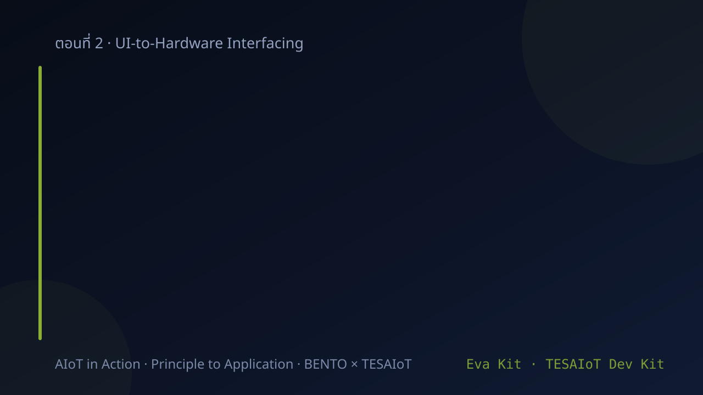
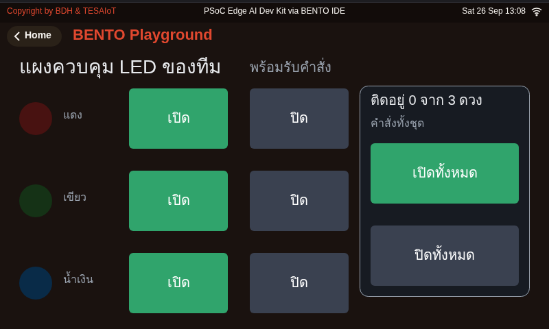
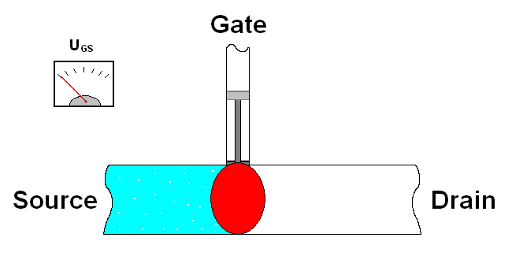
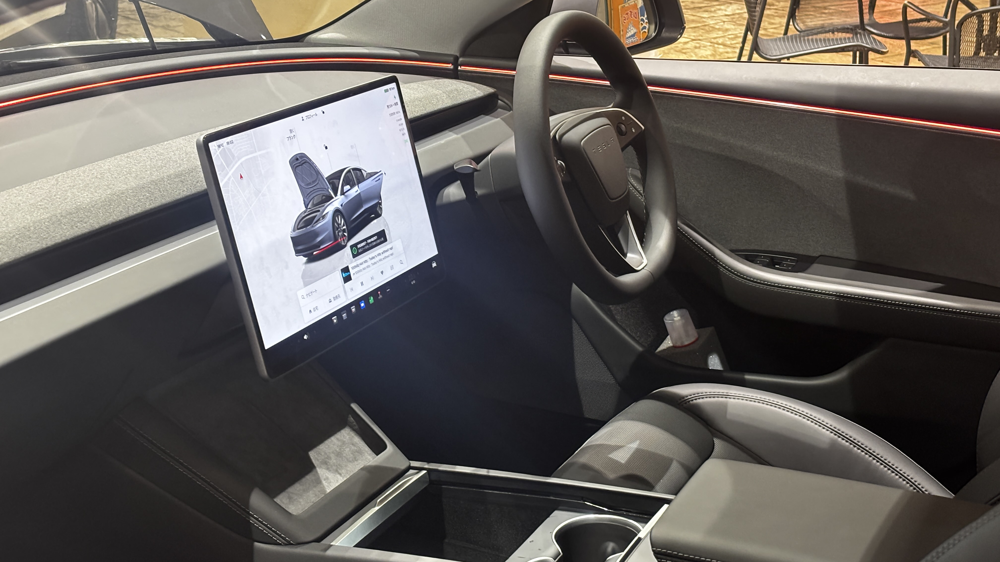
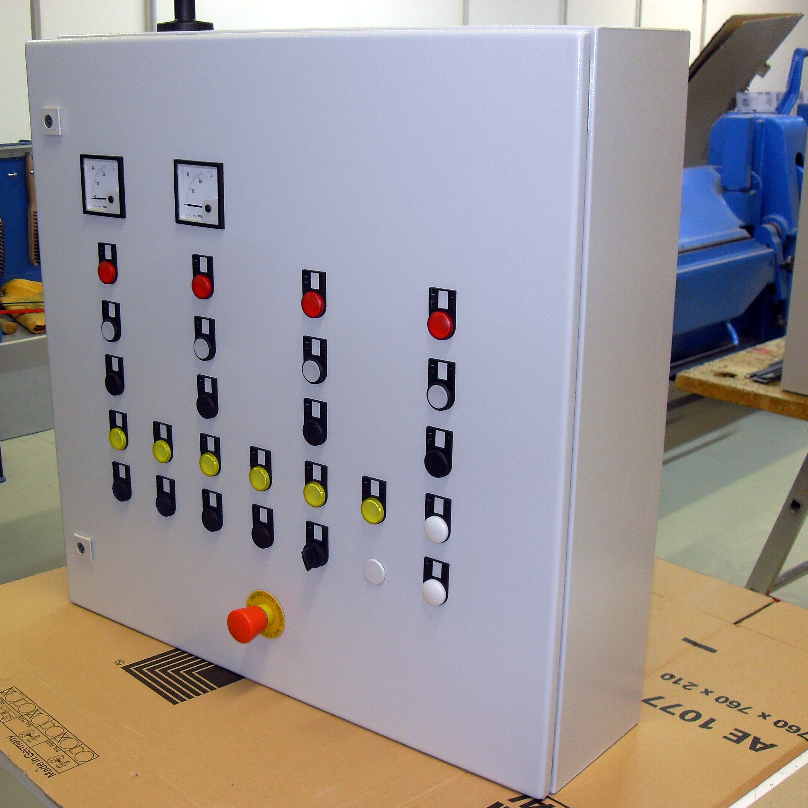
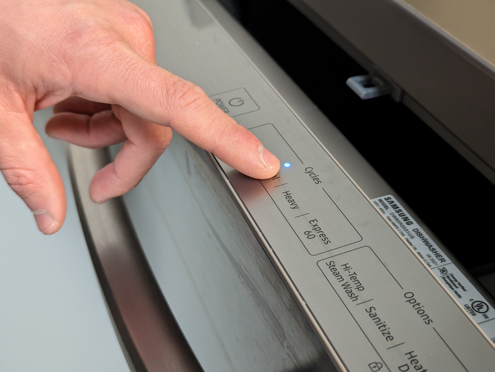

<style>
section { font-size: 24px; padding: 40px 52px; justify-content: flex-start; }
section h1 { font-size: 1.45em; line-height: 1.12; margin: 0 0 .22em; }
section h2 { font-size: 1.12em; margin: .15em 0; }
section h3 { font-size: 1.0em; margin: .12em 0; }
section p, section li { margin: .16em 0; line-height: 1.32; }
section img { max-width: 100%; height: auto; }
section svg { max-height: 330px; width: 100%; }
section table { font-size: .78em; }
section pre { font-size: .70em; line-height: 1.32; background:#0d1117; color:#e6edf3; border:1px solid #30363d; border-radius:8px; padding:12px 16px; box-shadow:0 2px 8px rgba(0,0,0,.25); }
section pre code { white-space: pre-wrap; background:transparent; color:inherit; } section pre .hljs-comment{color:#8b949e;font-style:italic} section pre .hljs-keyword,section pre .hljs-built_in,section pre .hljs-literal{color:#ff7b72} section pre .hljs-string{color:#a5d6ff} section pre .hljs-number{color:#79c0ff} section pre .hljs-title,section pre .hljs-title.function_,section pre .hljs-section{color:#d2a8ff} section pre .hljs-meta{color:#ffa657} section pre .hljs-attr,section pre .hljs-attribute,section pre .hljs-name{color:#7ee787}
section blockquote { margin: .25em 0; font-size: .92em; }
/* two images on a line (parity / 2x2 grids) stay side-by-side and small */
section p > img + img { margin-left: 10px; }
/* scroll-within-slide: dense slides scroll instead of clipping */
section { overflow-y: auto; overflow-x: hidden; }
section::-webkit-scrollbar { width: 11px; }
section::-webkit-scrollbar-thumb { background:#4a90d9; border-radius:6px; }
section::-webkit-scrollbar-track { background:rgba(0,0,0,.06); }
/* image drop-shadow + cover-slide readability (auto) */
section img{filter:drop-shadow(0 3px 12px rgba(0,0,0,.5))}
/* พื้นสำรองของสไลด์ปก: ถ้า img/cover_sNN.svg โหลดไม่ขึ้น ธีมจะคืนพื้นขาว
   แล้วตัวอักษรสีขาวของปกจะหายไปทั้งแผ่น — ปักสีเข้มไว้ให้ภาพเป็นแค่ของประดับ */
section.cover{background-color:#0b1426}
section.cover *{color:#fff !important}
section.cover h1,section.cover h2,section.cover h3,section.cover p,section.cover li,section.cover strong,section.cover em,section.cover blockquote,section.cover div{text-shadow:0 2px 9px rgba(0,0,0,.92),0 0 3px rgba(0,0,0,.8)}
section.cover div[style*="background:#"],section.cover div[style*="background: #"]{background:rgba(10,14,20,.66) !important;border-color:rgba(120,200,255,.45) !important;max-width:62%}
section.cover blockquote{border-left:4px solid rgba(120,200,255,.6) !important;background:rgba(13,17,23,.55) !important;border-radius:6px;padding:.3em .6em}
section.cover h1,section.cover h2,section.cover h3,section.cover p,section.cover blockquote{max-width:60%}
section.cover div:not(:has(img)){max-width:62%}
section.cover img{filter:none}
</style>



<!-- _class: cover -->

# บทเรียน 2.4 — จอสัมผัสและ widget ตัวแรก

## แผงควบคุมของทีมเราเอง: แตะบนจอแล้วไฟจริงติด

**โมดูล 2 — จากจอสู่ฮาร์ดแวร์**

> คาถาประจำบทเรียน: **จอไม่ใช่ของจริง จอคือรายงานของจริง — สองอย่างนี้ต้องตรงกันเสมอ**

---

## ย้อนกลับไปที่เมนู Controls อีกครั้ง (Eva Kit)


<svg viewBox="0 0 940 290" xmlns="http://www.w3.org/2000/svg">
  <text x="210" y="28" text-anchor="middle" font-size="20" font-weight="700" fill="#37474f">จอบอร์ด Eva Kit · เมนู Controls</text>
  <rect x="20" y="42" width="380" height="228" rx="12" fill="#101820" stroke="#4a90d9" stroke-width="2"/>
  <g fill="#7f1d1d"><animate attributeName="fill" values="#37474f;#37474f;#e53935;#e53935;#37474f" dur="4s" repeatCount="indefinite"/><rect x="42" y="90" width="104" height="76" rx="8" stroke="#e53935" stroke-width="3"/></g>
  <rect x="158" y="90" width="104" height="76" rx="8" fill="#37474f" stroke="#43a047" stroke-width="3"/>
  <rect x="274" y="90" width="104" height="76" rx="8" fill="#37474f" stroke="#1e88e5" stroke-width="3"/>
  <text x="94" y="136" text-anchor="middle" font-size="20" fill="#ffffff">แดง</text>
  <text x="210" y="136" text-anchor="middle" font-size="20" fill="#ffffff">เขียว</text>
  <text x="326" y="136" text-anchor="middle" font-size="20" fill="#ffffff">น้ำเงิน</text>
  <text x="210" y="210" text-anchor="middle" font-size="19" fill="#8fb8e0">แตะวงกลมบนจอ = สั่งไฟจริง</text>
  <text x="210" y="242" text-anchor="middle" font-size="18" fill="#607d8b">สถานะบนจอต้องตรงกับหลอดเสมอ</text>
  <line x1="412" y1="150" x2="548" y2="150" stroke="#455a64" stroke-width="3"/>
  <g><animateTransform attributeName="transform" type="translate" values="0,0;136,0" dur="4s" begin="1s" repeatCount="indefinite"/><circle cx="412" cy="150" r="9" fill="#455a64"/></g>
  <text x="480" y="132" text-anchor="middle" font-size="18" fill="#455a64">IPC</text>
  <rect x="560" y="70" width="360" height="190" rx="12" fill="#eceff1" stroke="#455a64" stroke-width="2"/>
  <text x="740" y="100" text-anchor="middle" font-size="20" font-weight="700" fill="#455a64">หลอดจริงบน Eva Kit</text>
  <g fill="#5d4037"><animate attributeName="fill" values="#5d4037;#5d4037;#ff5252;#ff5252;#5d4037" dur="4s" repeatCount="indefinite"/><circle cx="645" cy="158" r="26"/></g>
  <circle cx="740" cy="158" r="26" fill="#33691e" opacity="0.35"/>
  <circle cx="835" cy="158" r="26" fill="#0d47a1" opacity="0.35"/>
  <text x="645" y="210" text-anchor="middle" font-size="19" fill="#37474f">D3</text>
  <text x="740" y="210" text-anchor="middle" font-size="19" fill="#37474f">D4</text>
  <text x="835" y="210" text-anchor="middle" font-size="19" fill="#37474f">D5</text>
  <text x="740" y="242" text-anchor="middle" font-size="18" fill="#78909c">ชุดบทเรียนนี้เราสร้างฝั่งซ้ายเอง</text>
</svg>

บทเรียน 1.1–1.3 เราแตะหน้านี้เล่น (บน Eva Kit — Dev Kit ไม่มีการ์ด Controls จึงไม่เคยเห็นหน้านี้ และนั่นยิ่งเป็นเหตุผลให้สร้างเอง) บทเรียน 2.1–2.3 เราสั่งไฟด้วยโค้ด `gpio.led(i).on()` ที่ไม่มีหน้าจอเลย

**ชุดบทเรียนนี้เราจะสร้างหน้าจอแบบนี้เอง** — ปุ่มบนจอที่ทีมเราวางเอง แตะแล้วหลอดไฟจริงบนบอร์ดติดจริง และรันได้ทั้งสองบอร์ด

สังเกตสามอย่างที่เดี๋ยวเราต้องทำให้ได้เอง: ปุ่มรู้ว่าถูกแตะ · ไฟจริงเปลี่ยนสถานะ · ตัวหนังสือบนจอเปลี่ยนตาม

> หน้านี้ที่ดูธรรมดา ข้างในคือวงจรรับเหตุการณ์ที่เราจะเขียนเองในชุดบทเรียนนี้

---

## ทำไม · คืออะไร · ทำยังไง — แผนที่ของชุดบทเรียนนี้

<style scoped>
section table { font-size: .62em; }
section table td, section table th { padding: .16em .55em; }
</style>

| | คำถาม | คำตอบของชุดบทเรียนนี้ | อยู่ช่วงไหน |
|---|---|---|---|
| **Why** | บทเรียน 2.1–2.3 กดปุ่มจริงก็สั่งไฟได้แล้ว ทำไมต้องมีปุ่มบนจออีก | เพราะเครื่องที่ส่งมอบไปแล้ว **คนอื่นเป็นคนใช้ และเขาเห็นแค่จอ** · ทั้งสองบอร์ดมีปุ่มจริงให้ Python แตะได้ปุ่มเดียว แต่คำสั่งของเครื่องหนึ่งเครื่องมีมากกว่าหนึ่งคำสั่ง · และแผงที่รายงานไม่ตรงกับของจริง คือแผงที่หลอกคนคุมเครื่อง | ครึ่งแรก · สไลด์ "สถานะบนจอ กับ สถานะจริง" และ "ใช้จริงที่ไหน" |
| **What** | มีอะไรให้ใช้บ้าง | โมดูล `ui` **ทั้ง 132 ชื่อ** (นับบน Eva Kit — Dev Kit มี `Sprite` เพิ่ม) — ตัวสร้าง widget 33 · ฟังก์ชันระดับโมดูล 8 · เสียง 2 กับค่าคงที่ของเสียงอีก 25 · ค่าคงที่อื่นอีก 63 · ชนิด `Widget` 1 · บวกเมธอดของ `Widget` อีก 38 ตัว | สไลด์ฝั่งอินพุต + สไลด์บัญชี 132 ชื่อ |
| **How** | ประกอบยังไงให้ใช้งานได้จริง | event loop ที่เรียก `ui.poll()` ทุกรอบ แยกว่าเหตุการณ์มาจากใครด้วย `handle` แล้วสั่ง `gpio.led()` พร้อมเขียนบรรทัดสถานะกลับในจังหวะเดียวกัน | 17 ไฟล์ตัวอย่าง (01–06 ในบทเรียน 2.5 · 07–17 ในบทเรียน 2.6) + ไฟล์ฝึกสองไฟล์ |

**ปลายทางที่จับต้องได้** — แผงควบคุม LED สามสี แถวละ ไฟสถานะ + ปุ่มเปิด + ปุ่มปิด พร้อม "เปิดทั้งหมด" และ "ปิดทั้งหมด" ที่ถามยืนยันก่อน แตะแล้วหลอดจริงบนบอร์ดเปลี่ยนตาม พร้อมตัวเลขสรุปและบรรทัดสถานะที่ไม่เคยโกหก

> บทเรียน 2.1–2.3 เราเป็นคนสั่งไฟเอง · ชุดบทเรียนนี้เราเปิดให้คนอื่นสั่งได้ โดยที่เรายังรับผิดชอบว่าจอพูดความจริง

---

## เป้าหมายของชุดบทเรียนนี้

1. สร้าง `ui.Button`, `ui.Led`, `ui.Label`, `ui.MsgBox` วางตำแหน่งเองได้ และรู้ว่าเมื่อไรควรปล่อยให้จอจัดวางให้
2. เข้าใจว่า **handle** คืออะไร และทำไมต้องเก็บ `.id()` ไว้
3. เขียน **event loop** ด้วย `ui.poll()` ที่แยกได้ว่าเหตุการณ์ไหนมาจาก widget ตัวไหน
4. ต่อเหตุการณ์บนจอเข้ากับ `gpio.led()` แล้วทำให้ **สถานะบนจอตรงกับหลอดไฟจริงตลอดเวลา**

ปลายทางของวันนี้: แผงควบคุม LED สามสี แถวละ ไฟสถานะ + เปิด + ปิด และคำสั่งทั้งชุดที่ยืนยันก่อน ใช้งานได้จริง และมีตัวเลขสรุปกับบรรทัดสถานะที่ไม่เคยโกหก

> ชุดบทเรียนนี้ยากกว่าบทเรียน 2.1–2.3 ตรงที่ของสองฝั่ง (จอกับหลอด) ต้องพูดตรงกัน ไม่ใช่แค่ทำงานได้

---

## ปลายทางของชุดบทเรียนนี้ — แผงควบคุมที่เรากดเองได้



<div style="font-size:.58em;color:#78909c;margin-top:-.3em">หน้าจอจริงจากการรันโค้ดเฉลยบน BENTO Emulator ที่ 800x480 เท่าจอของทั้งสองบอร์ด — ไม่ใช่ภาพวาด ไม่ใช่ mock-up และไม่ใช่ภาพถ่ายจากบอร์ด</div>

- ปุ่มบนจอ แดง / เขียว / น้ำเงิน ตรงกับ LED สามสีบนบอร์ดหนึ่งต่อหนึ่ง — แผงนี้คุม "สามสี" ไม่ใช่ "ทุกดวง" (Dev Kit มีห้าดวง ดวง LED1/LED2 บนโมดูลไม่อยู่ในแผงนี้) ดัชนีดวงของแต่ละสีถามจากชื่อที่บอร์ดรายงาน
- สีละหนึ่งแถว: ไฟสถานะ + **ปุ่มเปิด** + **ปุ่มปิด** แยกกันคนละปุ่ม · การ์ดขวามี "เปิดทั้งหมด" กับ "ปิดทั้งหมด" และ "ปิดทั้งหมด" เปิดกล่องยืนยันก่อน — เหตุผลอยู่ในสไลด์เฉลยส่วนที่สอง
- บนการ์ดขวาคือตัวเลข "ติดอยู่ n จาก 3 ดวง" ที่เขียนทับใหม่ทุกครั้งที่ `set_led()` ทำงาน ไม่ใช่ข้อความที่พิมพ์ต่อท้ายไปเรื่อย ๆ

> ตั้งแต่ชุดบทเรียนนี้ไป จอไม่ใช่แค่ที่พิมพ์ข้อความออก แต่เป็นทางที่คนสั่งงานเข้ามา

---

## จากชุดบทเรียนก่อนหน้า — ปุ่มจริงออกไปถึงหน้าเว็บแล้ว

บทเรียน 2.1–2.3 จบที่ [`07_button_to_broker.py`](https://github.com/tesaiot/tesa-qualification-program/blob/main/courses/aiot-micropython/m02-ui-to-hardware/l03-led-button-lab/examples/07_button_to_broker.py) กดปุ่มผู้ใช้บนบอร์ดหนึ่งครั้ง ได้ `event` หนึ่งใบที่ `bento-aiot/team03/event` · สถานะไฟเดินทางไปกับ `telemetry` เป็นจังหวะ · และหน้าเว็บ [`mqtt_dashboard.html`](https://github.com/tesaiot/tesa-qualification-program/blob/main/courses/aiot-micropython/shared/web/mqtt_dashboard.html) ส่ง `cmd` กลับมาจุดไฟบนโต๊ะเราได้

| บทเรียน 2.1–2.3 | บทเรียน 2.4–2.6 วันนี้ |
|---|---|
| ปุ่มจริงปุ่มเดียว อ่านด้วยการวนถาม และต้องกันเด้งเอง | ปุ่มบนจอกี่ปุ่มก็ได้ มาเป็นเหตุการณ์ทีละรายการจาก `ui.poll()` |
| ไฟจริงเปลี่ยนเพราะปุ่มจริง | ไฟจริงเปลี่ยนเพราะนิ้วแตะจอ และจอต้องบอกสถานะ **ตรงกับ** หลอดเสมอ |
| กดปุ่มจริงแล้วเว็บเห็น | ส่วนขยายท้ายบทเรียน: แตะบนจอแล้วเว็บเห็น และเว็บสั่งให้แถบบนจอขยับ |

โครงลูปยังเป็นตัวเดิม **อ่าน → ตัดสินใจ → สั่ง → หน่วง → วนใหม่** เปลี่ยนแค่ว่าอินพุตมาจากนิ้วบนกระจก

> ทีมที่ยังไม่ได้ลองไฟล์ 07 ของบทเรียน 2.1–2.3 ไม่เสียอะไร เนื้อหาหลักของวันนี้ไม่พึ่งมัน มันกลับมาอีกครั้งเฉพาะในส่วนขยายท้ายบทเรียน

---

## ทบทวนชุดบทเรียนก่อนหน้า — ของที่เราจะเอามาใช้ต่อ

<style scoped>
section pre { font-size: .50em; line-height: 1.22; }
section p { margin: .04em 0; font-size: .86em; line-height: 1.26; }
section blockquote { font-size: .78em; margin: .06em 0; }
</style>

บทเรียน 2.1–2.3 เราคุมฮาร์ดแวร์ด้วยโค้ดล้วน ๆ — บรรทัดที่ยังใช้ต่อทั้งหมดในชุดบทเรียนนี้ ตัดจาก [`s03_led_button.py`](https://github.com/tesaiot/tesa-qualification-program/blob/main/courses/aiot-micropython/m02-ui-to-hardware/l03-led-button-lab/solution/s03_led_button.py) ตรง ๆ

```python
NUM_LEDS = gpio.num_leds()
...
btn = gpio.button(0)
...
for i in range(NUM_LEDS):
    gpio.led(i).off()
...
        gpio.led(led_index).off()              # ดับดวงเดิมก่อน
        led_index = (led_index + 1) % NUM_LEDS # เลื่อนไปดวงถัดไป วนกลับที่ 0 เอง
        gpio.led(led_index).on()               # จุดดวงใหม่
...
    raw = btn.is_pressed()
```

ดัชนีดวงของแต่ละ **สี** เป็นค่าที่ถามบอร์ด ไม่ใช่เลขที่จำมา — Eva: ดวง 0 แดง 1 เขียว 2 น้ำเงิน (ดวง 2 ชื่อ `RGB_RED` แต่ส่องน้ำเงิน) · Dev Kit: หาจากชื่อ `RGB_RED / RGB_GREEN / RGB_BLUE` ใน `led_names` (เฉลยส่วนที่หนึ่งทำให้ดู) · ปุ่มผู้ใช้มีตัวเดียว `.name()` คืน `"USER Button 1"` ไม่ใช่ป้ายบนแผ่นวงจร

<div style="display:flex;gap:12px;align-items:flex-start">
<div style="flex:0 0 470px"><div style="font-size:.54em;color:#78909c;margin-top:-.2em;line-height:1.2">ภาพ: KIT_PSE84_EVAL PSOC™ Edge E84 Evaluation Kit guide, Infineon 002-39007 Rev.*B, รูปที่ 78 (หน้า 89) — ใช้เพื่อการเรียนการสอน</div></div>
<div style="flex:0 0 150px"><div style="font-size:.52em;color:#78909c;margin-top:-.2em;line-height:1.2">ภาพ: Stefan Riepl (Quark48), Wikimedia Commons, สาธารณสมบัติ — ช่องนำกระแส drain-source ก่อตัวตามแรงดันที่ gate ดูตอนมันเคลื่อน</div></div>
<div style="flex:1 1 auto;font-size:.84em;line-height:1.26">ปลายทางของทุกคำสั่ง <code>gpio.led()</code> วันนี้ คือขา <code>USER_LED1-3</code> ที่มุมซ้ายของวงจรนี้ (วงจรของ Eva Kit — Dev Kit ยังไม่ได้เปิดคู่มือตรวจ แต่ฝั่งโค้ดสั่งเหมือนกัน) — ขา MCU ขับที่ <b>gate ของ MOSFET</b> ไม่ได้จ่ายกระแสให้หลอดเอง แพทเทิร์นลูปเดิมยังอยู่ครบ: <b>อ่าน input → ตัดสินใจ → สั่ง output → หน่วงเวลา → วนใหม่</b> ชุดบทเรียนนี้เปลี่ยนแค่แหล่ง input จาก "ปุ่มจริง" เป็น "นิ้วบนกระจก"</div>
</div>

> โครงลูปเดิม แต่ input มาจากคนละโลก — ตรงนี้แหละที่ทำให้ต้องมีกลไกใหม่ชื่อ event

---

## เข้าใจฮาร์ดแวร์ · ปุ่มบนจอไม่ใช่ปุ่มบนบอร์ด

ปุ่มจริงบนบอร์ดต่อสายตรงเข้าขาชิป โค้ดของเราอ่านค่าขาได้ทันทีเมื่อไรก็ได้ — นั่นคือ **polling**

ปุ่มบนจอไม่มีสาย มันเป็นภาพที่ CM55 วาด และนิ้วเราไปโดนตัวตรวจจับสัมผัสของจอ ซึ่งอยู่ฝั่ง CM55 ทั้งหมด ส่วนโค้ด Python ของเรารันอยู่ที่ CM33 คนละคอร์กัน

CM55 จึงต้อง **จดเหตุการณ์ใส่คิวไว้** แล้วรอให้ CM33 มาถามว่า "มีอะไรใหม่ไหม" คำถามนั้นคือ `ui.poll()`

<svg viewBox="0 0 940 230" xmlns="http://www.w3.org/2000/svg">
  <defs><marker id="s4a" markerWidth="10" markerHeight="8" refX="9" refY="4" orient="auto">
    <path d="M0,0 L10,4 L0,8 z" fill="#00838f"/></marker></defs>
  <rect x="15" y="60" width="175" height="95" rx="10" fill="#e0f7fa" stroke="#00838f" stroke-width="2"/>
  <text x="102" y="95" text-anchor="middle" font-size="19" font-weight="700" fill="#00838f">นิ้วแตะกระจก</text>
  <text x="102" y="124" text-anchor="middle" font-size="17" fill="#006064">ตัวตรวจจับสัมผัส</text>
  <rect x="225" y="60" width="200" height="95" rx="10" fill="#e8f5e9" stroke="#2e7d32" stroke-width="2"/>
  <text x="325" y="88" text-anchor="middle" font-size="19" font-weight="700" fill="#2e7d32">CM55 · LVGL</text>
  <text x="325" y="116" text-anchor="middle" font-size="17" fill="#1b5e20">รู้ว่าโดน widget ไหน</text>
  <text x="325" y="140" text-anchor="middle" font-size="17" fill="#1b5e20">เขียนลงคิวเหตุการณ์</text>
  <rect x="460" y="60" width="185" height="95" rx="10" fill="#fff3e0" stroke="#ef6c00" stroke-width="2"/>
  <text x="552" y="95" text-anchor="middle" font-size="19" font-weight="700" fill="#ef6c00">คิวเหตุการณ์</text>
  <text x="552" y="124" text-anchor="middle" font-size="17" fill="#e65100">รอ ไม่หายไปไหน</text>
  <rect x="680" y="60" width="245" height="95" rx="10" fill="#e3f2fd" stroke="#1565c0" stroke-width="2"/>
  <text x="802" y="88" text-anchor="middle" font-size="19" font-weight="700" fill="#1565c0">CM33 · โค้ดของเรา</text>
  <text x="802" y="116" text-anchor="middle" font-size="17" fill="#0d47a1">ui.poll() มาถามเป็นรอบ ๆ</text>
  <text x="802" y="140" text-anchor="middle" font-size="17" fill="#0d47a1">แล้วสั่ง gpio.led()</text>
  <line x1="192" y1="107" x2="221" y2="107" stroke="#00838f" stroke-width="3" marker-end="url(#s4a)"/>
  <line x1="427" y1="107" x2="456" y2="107" stroke="#00838f" stroke-width="3" marker-end="url(#s4a)"/>
  <line x1="647" y1="107" x2="676" y2="107" stroke="#00838f" stroke-width="3" marker-end="url(#s4a)"/>
  <g><animateTransform attributeName="transform" type="translate" values="0,0;223,0;450,0;700,0" dur="4.5s" repeatCount="indefinite"/><circle cx="102" cy="180" r="10" fill="#ff7043"/></g>
  <text x="470" y="34" text-anchor="middle" font-size="19" font-weight="700" fill="#37474f">นิ้วเราไปถึงโค้ด Python ผ่านสี่ทอด ไม่ใช่ทอดเดียว</text>
  <text x="470" y="212" text-anchor="middle" font-size="18" fill="#78909c">ถ้าเราไม่ถาม คิวก็ค้าง — เหตุการณ์ไม่หาย แต่ก็ไม่มีอะไรเกิดขึ้น</text>
</svg>

> ปุ่มบนบอร์ดเราไป "อ่าน" เอง ส่วนปุ่มบนจอเราต้องไป "รับของที่ฝากไว้"

---

## เข้าใจฮาร์ดแวร์ · ปุ่มบนจอไม่ใช่ปุ่มบนบอร์ด (ต่อ)

 

<div style="font-size:.62em;color:#78909c;margin-top:-.35em">ซ้าย: ห้องโดยสารที่เหลือแต่จอสัมผัส — ของจริงที่แลกปุ่มกดทิ้งไปหมด ดูแล้วเถียงกันก่อนว่าได้อะไรและเสียอะไร — ภาพ: Oq10pass / Wikimedia Commons — CC0 1.0 &nbsp;|&nbsp; ขวา: แผงปุ่มกดจริงของเครื่องจักร นิ้วรู้ตำแหน่งได้โดยไม่ต้องมอง นี่คือสิ่งที่ปุ่มบนจอไม่มี และเป็นเหตุผลที่บอร์ดยังเหลือปุ่มจริงไว้ — ภาพ: Elmschrat / Wikimedia Commons — CC BY-SA 3.0</div>

---

## ดูเพิ่ม · กระจกแผ่นนั้นรู้ได้อย่างไรว่านิ้วมาแตะ

<div style="display:flex;gap:20px;align-items:flex-start">
<div style="flex:0 0 46%;border:2px solid #90a4ae;border-radius:8px;padding:8px 10px;background:#eceff1">
<div style="font-size:.72em;font-weight:700;color:#37474f">How do touchscreens work? · Khan Academy India</div>
<iframe width="100%" height="200" src="https://www.youtube.com/embed/P70YQuP4-og" title="How do touchscreens work? | Khan Academy India" loading="lazy" frameborder="0" allowfullscreen></iframe>
<div style="font-size:.66em;color:#546e7a">นิ้วคนคือตัวนำ พอเข้าใกล้กระจกมันเพิ่มความจุไฟฟ้าให้จุดนั้น วงจรจึงรู้ว่ามีคนแตะโดยไม่ต้องมีสวิตช์กล</div>
</div>
<div style="flex:0 0 46%;border:2px solid #90a4ae;border-radius:8px;padding:8px 10px;background:#eceff1">
<div style="font-size:.72em;font-weight:700;color:#37474f">Projected Capacitive Touch · Zytronic Displays</div>
<iframe width="100%" height="200" src="https://www.youtube.com/embed/6BS6aQBaMhU" title="Projected Capacitive Touch Technology - How It Works | Zytronic" loading="lazy" frameborder="0" allowfullscreen></iframe>
<div style="font-size:.66em;color:#546e7a">แอนิเมชันที่เห็นชัดที่สุดว่านิ้ว "ขโมย" เส้นสนามไฟฟ้าระหว่างอิเล็กโทรดสองชุดไปอย่างไร</div>
</div>
</div>

<div style="display:flex;gap:16px;align-items:flex-start">
<div style="flex:0 0 260px">



</div>
<div style="flex:1;min-width:0">

<div style="font-size:.62em;color:#78909c">แผงปุ่มสัมผัสหลังกระจกจริง — ไม่มีชิ้นส่วนขยับเลยสักชิ้น มองแล้วเห็นว่าสิ่งที่อยู่ใต้กระจกคือลายทองแดง ไม่ใช่สวิตช์ — ภาพ: Zeroping / Wikimedia Commons — CC BY 4.0</div>

ทั้งสองคลิปเป็นของนอกเวลา (ต้องมีอินเทอร์เน็ต) ไม่ต้องเปิดในบทเรียน — เนื้อหาวันนี้เข้าใจได้ครบโดยไม่ต้องดู หลักการเดียวกันนี้กลับมาอีกครั้งในบทเรียน 2.7–2.9 ตอนที่เราอ่านปุ่ม CapSense บนบอร์ดโดยตรง

</div>
</div>

> จอสัมผัสไม่ได้วัด "แรงกด" มันวัด **ความใกล้ของตัวนำ** — จำประโยคนี้ไว้ ชุดบทเรียนถัดไปใช้ซ้ำ

---

## ห้าขั้นของการสร้าง widget หนึ่งตัว

แพทเทิร์นนี้ยกมาจากคอร์สภาษา C ที่เราเคยสอน — บน MicroPython โค้ดสั้นลงมาก แต่ **ลำดับความคิดเหมือนเดิมทุกขั้น**

<svg viewBox="0 0 940 175" xmlns="http://www.w3.org/2000/svg">
  <g fill="#ffffff"><animate attributeName="fill" values="#ffffff;#f3e5f5;#ffffff" dur="5s" begin="0s" repeatCount="indefinite"/><rect x="20" y="42" width="170" height="82" rx="10" stroke="#6a1b9a" stroke-width="2.5"/></g>
  <text x="105" y="72" text-anchor="middle" font-size="20" font-weight="700" fill="#6a1b9a">1 · สร้าง</text>
  <text x="105" y="102" text-anchor="middle" font-size="18" fill="#4a148c">ui.Button(...)</text>
  <g fill="#ffffff"><animate attributeName="fill" values="#ffffff;#e3f2fd;#ffffff" dur="5s" begin="1s" repeatCount="indefinite"/><rect x="205" y="42" width="170" height="82" rx="10" stroke="#1565c0" stroke-width="2.5"/></g>
  <text x="290" y="72" text-anchor="middle" font-size="20" font-weight="700" fill="#1565c0">2 · วางที่</text>
  <text x="290" y="102" text-anchor="middle" font-size="18" fill="#0d47a1">x, y, w, h</text>
  <g fill="#ffffff"><animate attributeName="fill" values="#ffffff;#e8f5e9;#ffffff" dur="5s" begin="2s" repeatCount="indefinite"/><rect x="390" y="42" width="170" height="82" rx="10" stroke="#2e7d32" stroke-width="2.5"/></g>
  <text x="475" y="72" text-anchor="middle" font-size="20" font-weight="700" fill="#2e7d32">3 · หน้าตา</text>
  <text x="475" y="102" text-anchor="middle" font-size="18" fill="#1b5e20">text, color</text>
  <g fill="#ffffff"><animate attributeName="fill" values="#ffffff;#fff3e0;#ffffff" dur="5s" begin="3s" repeatCount="indefinite"/><rect x="575" y="42" width="170" height="82" rx="10" stroke="#ef6c00" stroke-width="2.5"/></g>
  <text x="660" y="72" text-anchor="middle" font-size="20" font-weight="700" fill="#ef6c00">4 · จำเบอร์</text>
  <text x="660" y="102" text-anchor="middle" font-size="18" fill="#e65100">btn.id()</text>
  <g fill="#ffffff"><animate attributeName="fill" values="#ffffff;#ffebee;#ffffff" dur="5s" begin="4s" repeatCount="indefinite"/><rect x="760" y="42" width="170" height="82" rx="10" stroke="#c62828" stroke-width="2.5"/></g>
  <text x="845" y="72" text-anchor="middle" font-size="20" font-weight="700" fill="#c62828">5 · กรอง</text>
  <text x="845" y="102" text-anchor="middle" font-size="18" fill="#8e0000">type == 'clicked'</text>
  <text x="470" y="28" text-anchor="middle" font-size="19" font-weight="700" fill="#37474f">ห้าขั้นนี้เรียงตายตัว ข้ามขั้นไหนก็พังคนละแบบ</text>
  <text x="470" y="152" text-anchor="middle" font-size="18" fill="#78909c">ขั้น 1-3 คือ "ของที่เห็น" · ขั้น 4-5 คือ "ของที่ตอบสนอง"</text>
</svg>

| ขั้น | ในภาษา C (LVGL ดิบ) | ในโค้ดของเรา |
|---|---|---|
| 1 สร้างตัว widget | `lv_button_create(parent)` | `btn = ui.Button("แดง")` |
| 2 กำหนดตำแหน่ง | `lv_obj_align(...)` | `x=20, y=110` ตอนสร้าง หรือ `.pos(x, y)` |
| 3 ใส่ข้อความ/หน้าตา | สร้าง label ลูกแล้ว `lv_label_set_text` | `text="แดง"`, `color=0xE53935` |
| 4 ผูกเหตุการณ์ | `lv_obj_add_event_cb(btn, cb, ...)` | เก็บ `btn.id()` ไว้เทียบใน `ui.poll()` |
| 5 กรองชนิดเหตุการณ์ | `if(code == LV_EVENT_CLICKED)` | `if ev['type'] == 'clicked'` |

ขั้น 4 ต่างกันที่สุด: C ฝาก callback ไว้ให้ระบบเรียก ส่วนเราเก็บ **หมายเลขประจำตัว** ไว้เช็กเองในลูป

> จำห้าขั้นนี้ให้ขึ้นใจ ทุก widget ที่เหลือในคอร์ส (Slider, Arc, Chart) ใช้ลำดับเดียวกันหมด

---

## สร้าง widget: พารามิเตอร์ที่ใช้บ่อย

<style scoped>
section svg { max-height: 258px; }
section li { margin: .08em 0; }
</style>

```python
import ui
ui.screen()                                    # ล้างของเก่าทั้งหน้าก่อนเริ่มเสมอ

title = ui.Label("แผงควบคุมของทีม", x=20, y=20, color=0xFFFFFF, value=24)
btn   = ui.Button("แดง", x=20, y=110, w=170, h=80, color=0xE53935)
sw    = ui.Switch(x=620, y=120)
```

<svg viewBox="0 0 940 226" xmlns="http://www.w3.org/2000/svg">
  <rect x="70" y="42" width="470" height="158" rx="8" fill="#101820" stroke="#4a90d9" stroke-width="2"/>
  <circle cx="70" cy="42" r="7" fill="#ffd54f"/>
  <text x="86" y="34" font-size="18" fill="#455a64">(0,0) มุมซ้ายบนของ Playground</text>
  <line x1="70" y1="60" x2="190" y2="60" stroke="#ffd54f" stroke-width="2.5"/>
  <text x="200" y="66" font-size="18" fill="#b28900">x = 20 → ขวา</text>
  <line x1="88" y1="42" x2="88" y2="96" stroke="#ffd54f" stroke-width="2.5"/>
  <text x="98" y="112" font-size="18" fill="#b28900">y = 110 → ลง</text>
  <rect x="88" y="96" width="150" height="62" rx="7" fill="#e53935"/>
  <text x="163" y="134" text-anchor="middle" font-size="20" fill="#ffffff">แดง</text>
  <line x1="88" y1="172" x2="238" y2="172" stroke="#8fb8e0" stroke-width="2"/>
  <text x="163" y="192" text-anchor="middle" font-size="18" fill="#607d8b">w = 170</text>
  <line x1="248" y1="96" x2="248" y2="158" stroke="#8fb8e0" stroke-width="2"/>
  <text x="258" y="134" font-size="18" fill="#607d8b">h = 80</text>
  <text x="430" y="134" text-anchor="middle" font-size="19" fill="#8fb8e0">กำหนดเอง = ออกแบบไว้</text>
  <rect x="600" y="42" width="320" height="158" rx="8" fill="#101820" stroke="#607d8b" stroke-width="2"/>
  <text x="760" y="30" text-anchor="middle" font-size="19" font-weight="700" fill="#607d8b">x = -1 · ปล่อยให้จอเรียงให้</text>
  <g fill="#101820"><animate attributeName="fill" values="#101820;#37474f;#37474f;#37474f;#101820" dur="4s" repeatCount="indefinite"/><rect x="625" y="62" width="270" height="34" rx="6"/></g>
  <g fill="#101820"><animate attributeName="fill" values="#101820;#101820;#37474f;#37474f;#101820" dur="4s" repeatCount="indefinite"/><rect x="625" y="106" width="270" height="34" rx="6"/></g>
  <g fill="#101820"><animate attributeName="fill" values="#101820;#101820;#101820;#37474f;#101820" dur="4s" repeatCount="indefinite"/><rect x="625" y="150" width="270" height="34" rx="6"/></g>
  <text x="760" y="218" text-anchor="middle" font-size="18" fill="#78909c">เรียงตามลำดับที่สร้าง คุมตำแหน่งไม่ได้</text>
</svg>

- `x, y` มุมซ้ายบนเป็นพิกเซล · `w, h` ถ้าไม่ใส่ จอเลือกขนาดพอดีข้อความให้เอง
- `color` สีเป็นเลขฐานสิบหก `0xRRGGBB` แบบเดียวกับ CSS
- **`x=-1` (ค่าเริ่มต้น) = auto-layout** — ปล่อยให้จอเรียงให้ เหมาะกับตอนลองของเร็ว ๆ ไม่เหมาะกับแผงควบคุม

> แผงควบคุมจริงต้องกำหนด x, y เอง เพราะ "ปุ่มอยู่ตรงไหน" เป็นส่วนหนึ่งของการออกแบบ ไม่ใช่เรื่องบังเอิญ

---

## กับดักที่คนพลาดกันทุกรุ่น: `value=` คือขนาดฟอนต์

```python
ui.Label("อุณหภูมิ", value=24)      # 24 = ตัวอักษรสูง 24 พิกเซล ไม่ใช่ค่า 24 องศา
ui.Button("แดง", value=20)          # ตัวหนังสือบนปุ่มขนาด 20
```

<svg viewBox="0 0 940 215" xmlns="http://www.w3.org/2000/svg">
  <rect x="14" y="18" width="500" height="188" rx="9" fill="#fafafa" stroke="#90a4ae" stroke-width="2"/>
  <text x="264" y="42" text-anchor="middle" font-size="19" font-weight="700" fill="#37474f">Label · Button · Dropdown · Textarea</text>
  <text x="40" y="72" font-size="18" fill="#78909c">value=14</text>
  <text x="180" y="72" font-size="19" fill="#263238">ข้อความตัวอย่าง</text>
  <text x="40" y="104" font-size="18" fill="#78909c">value=16</text>
  <text x="180" y="104" font-size="21" fill="#263238">ข้อความตัวอย่าง</text>
  <text x="40" y="138" font-size="18" fill="#78909c">value=20</text>
  <text x="180" y="138" font-size="24" fill="#263238">ข้อความตัวอย่าง</text>
  <text x="40" y="174" font-size="18" fill="#78909c">value=24</text>
  <text x="180" y="174" font-size="28" fill="#263238">ข้อความตัวอย่าง</text>
  <text x="40" y="202" font-size="18" fill="#c62828">value=28 · เกินห้าค่านี้ไม่รับ</text>
  <rect x="536" y="18" width="390" height="188" rx="9" fill="#fafafa" stroke="#1565c0" stroke-width="2"/>
  <text x="731" y="42" text-anchor="middle" font-size="19" font-weight="700" fill="#1565c0">Slider · Arc · Bar</text>
  <text x="731" y="70" text-anchor="middle" font-size="18" fill="#0d47a1">value คือ "ค่าจริง" ตามชื่อ</text>
  <rect x="576" y="96" width="310" height="14" rx="7" fill="#cfd8dc"/>
  <g stroke-dashoffset="176"><animate attributeName="stroke-dashoffset" values="276;16;176" dur="6s" repeatCount="indefinite"/><line x1="583" y1="103" x2="879" y2="103" stroke="#1565c0" stroke-width="14" stroke-linecap="round" stroke-dasharray="296"/></g>
  <g><animateTransform attributeName="transform" type="translate" values="-100,0;160,0;0,0" dur="6s" repeatCount="indefinite"/><circle cx="696" cy="103" r="15" fill="#1565c0" stroke="#ffffff" stroke-width="3"/></g>
  <text x="731" y="152" text-anchor="middle" font-size="18" fill="#37474f">min=0  max=100  value=45</text>
  <text x="731" y="184" text-anchor="middle" font-size="18" fill="#78909c">ตัวนี้เท่านั้นที่ value = ตัวเลขที่วัดได้</text>
</svg>

สำหรับ **Label, Button, Dropdown, Textarea** พารามิเตอร์ `value=` หมายถึง **ขนาดฟอนต์** และรับได้แค่ห้าค่า: **14 / 16 / 20 / 24 / 28**

ส่วน `min`, `max`, `value` ที่เป็น "ค่าจริง" ตามชื่อ ใช้กับ **Slider, Arc, Bar** เท่านั้น (บทเรียน 2.7–2.9 กับ 3.1–3.3 เราจะได้ใช้)

อยากเปลี่ยนข้อความของ Label ให้ใช้เมธอด `.text("ข้อความใหม่")` เสมอ ไม่ใช่ `value=`

> เห็น `value=` ที่ Label เมื่อไร ให้อ่านในใจว่า "ขนาดตัวอักษร" ทันที จะไม่พลาดอีกเลย

---

## handle — บัตรประจำตัวของ widget

ตอนสร้าง widget สิ่งที่เราได้กลับมาคือ **ตัวจัดการ (handle)** ที่ผูกกับ widget จริงบน CM55 อีกฝั่งหนึ่ง

```python
btn_red = ui.Button("แดง", x=20, y=110, w=170, h=80)
red_id  = btn_red.id()          # หมายเลขประจำตัว ใช้เทียบตอนรับเหตุการณ์
```

<svg viewBox="0 0 940 190" xmlns="http://www.w3.org/2000/svg">
  <defs><marker id="s4h" markerWidth="10" markerHeight="8" refX="9" refY="4" orient="auto">
    <path d="M0,0 L10,4 L0,8 z" fill="#ef6c00"/></marker></defs>
  <rect x="20" y="40" width="430" height="130" rx="9" fill="#101820" stroke="#4a90d9" stroke-width="2"/>
  <rect x="45" y="62" width="120" height="58" rx="7" fill="#37474f" stroke="#e53935" stroke-width="2"/>
  <g stroke-width="2"><animate attributeName="stroke-width" values="2;6;2" dur="2.4s" repeatCount="indefinite"/><rect x="180" y="62" width="120" height="58" rx="7" fill="#37474f" stroke="#43a047"/></g>
  <rect x="315" y="62" width="120" height="58" rx="7" fill="#37474f" stroke="#1e88e5" stroke-width="2"/>
  <text x="105" y="98" text-anchor="middle" font-size="19" fill="#ffffff">แดง</text>
  <text x="240" y="98" text-anchor="middle" font-size="19" fill="#ffffff">เขียว</text>
  <text x="375" y="98" text-anchor="middle" font-size="19" fill="#ffffff">น้ำเงิน</text>
  <text x="105" y="148" text-anchor="middle" font-size="18" fill="#90a4ae">.id() = 3</text>
  <text x="240" y="148" text-anchor="middle" font-size="18" fill="#a3c93a">.id() = 4</text>
  <text x="375" y="148" text-anchor="middle" font-size="18" fill="#90a4ae">.id() = 5</text>
  <rect x="580" y="52" width="345" height="86" rx="9" fill="#fff3e0" stroke="#ef6c00" stroke-width="2.5"/>
  <text x="752" y="84" text-anchor="middle" font-size="19" font-weight="700" fill="#ef6c00">สิ่งที่ ui.poll() คืนมา</text>
  <text x="752" y="116" text-anchor="middle" font-size="18" fill="#e65100">{'handle': 4, 'type': 'clicked'}</text>
  <line x1="576" y1="95" x2="452" y2="95" stroke="#ef6c00" stroke-width="3" marker-end="url(#s4h)"/>
  <text x="470" y="30" text-anchor="middle" font-size="19" font-weight="700" fill="#37474f">เหตุการณ์ไม่ได้บอกชื่อปุ่ม มันบอกแค่เบอร์</text>
  <text x="752" y="166" text-anchor="middle" font-size="18" fill="#78909c">ไม่มีชื่อ ไม่มีสี ไม่มีข้อความ — มีแต่เบอร์</text>
</svg>

เหตุการณ์ที่ `ui.poll()` คืนมาไม่ได้บอกว่า "ปุ่มแดงถูกกด" มันบอกแค่ **หมายเลข** ว่า widget เบอร์นี้ถูกกด งานของเราคือจำไว้ว่าเบอร์ไหนคือใคร

วิธีที่สะอาดที่สุดเมื่อมีปุ่มหลายตัวคือเก็บเป็น list แล้วใช้ `.index()` หาลำดับ

```python
on_ids = [b.id() for b in btn_on]
i = on_ids.index(ev['handle'])     # ได้ 0, 1 หรือ 2 = แถวไหน (แดง เขียว น้ำเงิน)
```

> ถ้าไม่เก็บ `.id()` ไว้ ตอนเหตุการณ์เข้ามาเราจะแยกไม่ออกเลยว่าใครเป็นคนส่ง
