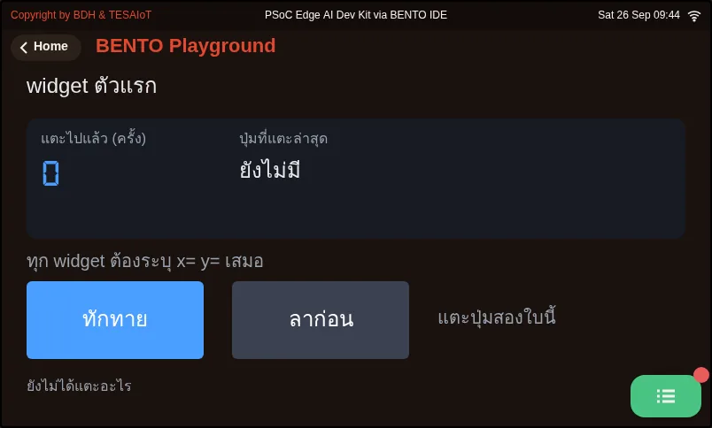
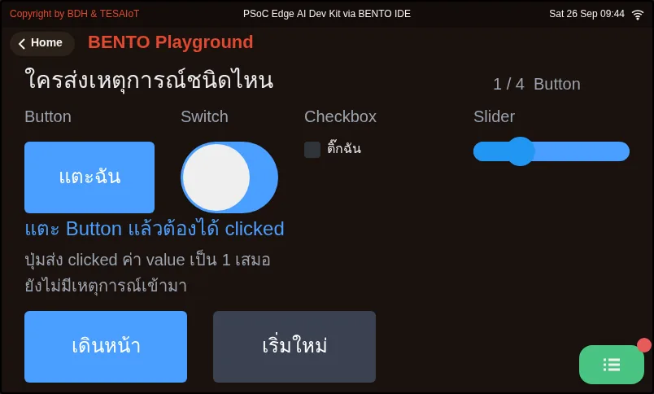
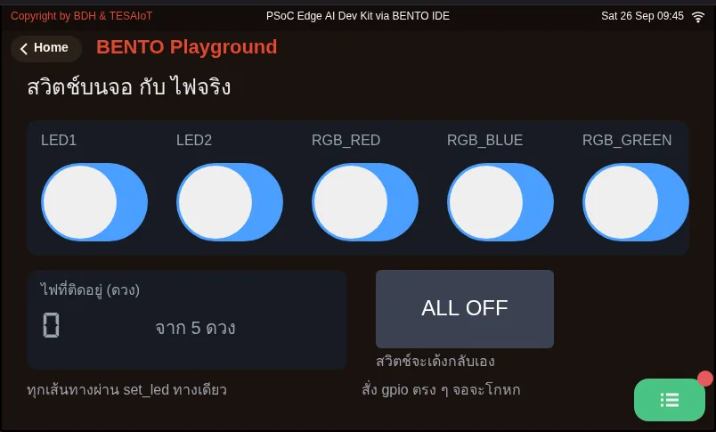
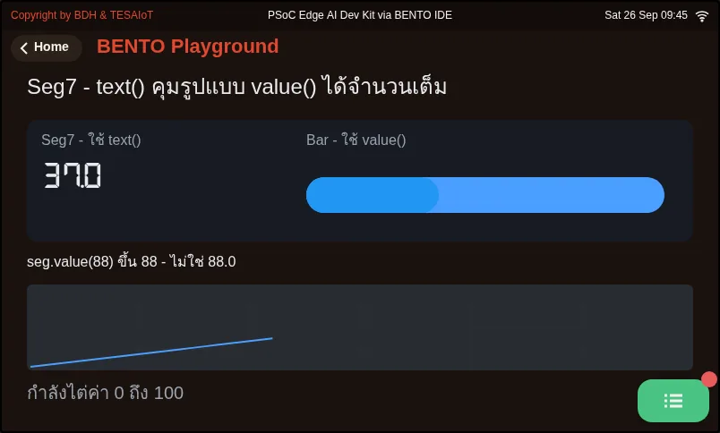
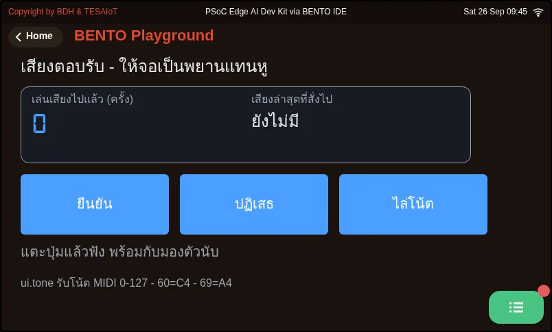
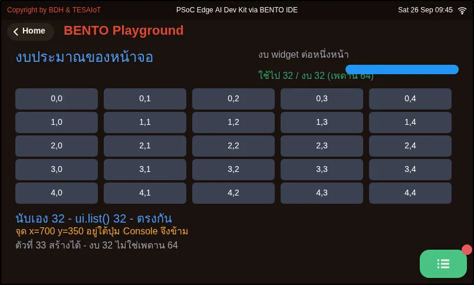

# Lesson 2.5 — The event loop: touch the screen, light the real LED

> Module 2 — From Screen to Hardware · Slides: [slides.md](slides.md) · [Module overview](../README.md) · [Course page](../../README.md)

Write an event loop that takes events from ui.poll() every round, tell which widget sent what, follow the five iron rules of the ui module, and route every change through one gate so the screen and the real LEDs always agree.

## Objectives

By the end of this lesson you will be able to:

1. Write a four-step event loop (poll, dispatch, act, sleep) that checks handle together with type in an elif chain covering every known type, with a last branch that prints 'unknown' to the Console, and predict the event type and value meaning for Button, Switch, Checkbox, Slider, Dropdown and Textarea
2. Explain the five iron rules of the ui module and the event queue (15 usable slots, at most 8 per poll, new events dropped when full), and trace a blank screen, lost taps and a RuntimeError back to the rule behind each
3. Route every LED change through one set_led()-style function that records the state in a variable first, drives the real LED, pulls the on-screen widget into line and reports only from that variable, so screen and LEDs agree in every tested case, including after ALL OFF
4. Fill the blanks in practice/s04b_layout_widgets.py with .add_tab(), .content(), .add_tile() and ui.poll() until all three tabs show their contents inside their own tab, and explain why the returned handle must always be passed back as parent=

## Before you start

Review the five steps of a widget from lesson 2.4, especially step 4 (keeping `.id()` to compare against) and the fact that a Label's `value=` is a font size.
On the board's screen, keep the BENTO Playground card open — every widget only exists on this page. Swipe away to another menu and all the widgets are destroyed;
coming back gives a blank screen, and you must send the code again. This is not a bug, it is how the board reclaims memory.

- **Equipment:** an Eva Kit or TESAIoT Dev Kit board with the BENTO MicroPython firmware installed, or the BENTO Emulator in [BENTO IDE](https://ide.tesaiot.dev/)
- **Before this:** [Lesson 2.4 — The touch screen and your first widgets](../l04-touch-widgets/README.md)

## See it work first

Run `01_first_widgets.py` and tap the two buttons alternately. The "taps so far" counter climbs immediately, and the name of the last-tapped button changes to match.
Every tap travels from the CM55, through the queue, into our loop on CM33, and back to change the screen, all within one round. This lesson opens up that circle step by step.

## Concepts

**A UI program is not code that flows top to bottom — it is a circle that keeps turning.** Every round has four beats: 1 poll, `ui.poll()` asks what is new
· 2 dispatch, compare `handle` with `type` to see who sent what · 3 act, command `gpio.led()` and update a Label · 4 sleep, `time.sleep_ms(50)`
returns time to the system to draw the screen. It loops about 20 times a second — the same idea as JavaScript's `addEventListener` and LVGL's `lv_obj_add_event_cb` in C.

**What an event looks like.** `ui.poll()` returns a list of dicts (it can be empty, never `None`). Every dict always has three fields: `handle`, `type`, `value`.
A Button sends `'clicked'` · Switch and Checkbox send `'toggled'` (1 = on or checked) · Slider, Arc and Dropdown send `'value_changed'`
with the new value (Dropdown gives the option's index, starting at 0) · Textarea sends `'value_changed'` where `value` is always 0 — you must ask `.text()` yourself for the text
· Label, Bar, Seg7, Panel and Chart send nothing at all, and there is a fourth type, `'unknown'`, for a code the firmware cannot decode.
Code written as `if t == 'clicked': … else: …` sweeps this silently into `else`, so you must write a complete `elif` chain and leave a last branch that prints the odd one to the Console.
And because two visually different widgets can send the same type, always check `type` together with `handle`.
The queue on the CM55 side is a 16-slot ring buffer with 15 usable slots, drained at most 8 at a time, and when full, the firmware drops the newest incoming event.
A finger tapping rapidly while the loop sleeps too long simply loses those taps, with no error to catch. Bugs like this are found by counting, not by print.

**The five iron rules of the ui module.** 1 Call `ui.poll()` every round, because the CM55 hides the whole widget container until the first `ui.poll()` arrives —
skip it and the screen stays blank for about 2 seconds until a safety mechanism releases it on its own · 2 `time.sleep_ms(50)` is the minimum for a light UI (the heavier dashboards in lessons 3.7–3.9 use 200)
· 3 the course budget is 32 widgets per page; the firmware ceiling is 64, and going over raises `RuntimeError: ui: max 64 widgets` — widgets that are `.hide()`d and widgets in a tab you have not opened
still count against the quota; only `.delete()` or `ui.clear()` gives it back · 4 the first `ui.*` call stops automatic sensor polling, because the I2C bus must never collide with itself;
from then on we read sensors ourselves inside the loop · 5 a loop that runs too fast drops frames silently, with no exception — only a stuttering screen and values that never fully update.

**On-screen state and real state are not the same thing.** `gpio.led(n).value()` only reports the pin level at the instant you ask, so the truth must live in our own variable,
and every change must pass through **one gate**, `set_led(i, on)`: record it in `led_on[i]` → command `gpio.led(LED_IDX[i])` → make the on-screen light match
→ report only by reading `show_status()` from `led_on`. If any line calls `gpio.led().on()` directly and skips this gate, the LED still lights, but the screen lies with no way to trace why.
The text on a Label is the result of the truth, not the truth itself — in real work this is called a single source of truth.
The "on" button calls `set_led(on_ids.index(h), True)`, which commands "on", not "toggle" — pressing it ten times in a row gives the same result as pressing it once.

**Widgets that hold other things inside them.** `Tabview.add_tab()`, `Tileview.add_tile(col, row)`, `Win.content()` and `Menu.add_page()`
return a handle for the space inside, which must be passed back as `parent=` when creating whatever goes inside it. Forget it once, and the thing shows up on the main screen instead, with nothing to warn you.
A Tabview is 336 tall, not 398, because the bottom-right corner is reserved for the Console button, and tabs help with visual space, not with the quota.
For sound output, `ui.sfx(ui.SFX_...)` and `ui.tone(note, wave, velocity, dur_ms)` are fire-and-forget; `note` is a MIDI note number 0–127,
not hertz, and takes positional arguments only. Guard it with `hasattr(ui, "tone")`, and let the on-screen counter be your witness instead of your ears.

## Worked example

Predict before running every file, then record the results in your learning log.

1. **`02_event_types.py`** — before tapping, write your guess for what `type` the Button, Switch, Checkbox and Slider will each send, then work through move by move as the screen tells you.
   Move 3 is the file's trap. Build a three-column table in your learning log: widget · type · value.
2. **`03_switch_matches_led.py`** — tap each switch and watch the screen and the LED together, then press ALL OFF; the switches must snap back at the same moment the Seg7 drops to 0.
   Try commenting out the `switches[i].value(...)` line inside `set_led()` and run it again to see exactly when the screen starts to lie, then restore that line.
3. **`04_seg7_takes_text.py`** — the Seg7 climbs by 0.5 at a time and turns red past 60. Notice that `.value(n)` can only display an integer;
   for a decimal you must decide the rounding yourself and send it as `.text()`.
4. **`05_sound_feedback.py`** — tap three buttons; the on-screen counter advances every time a sound is commanded. If the counter advances but there is no sound, the problem is the speaker or the sound chip.
   If the counter does not advance, the problem is the code.
5. **`06_layout_budget.py`** — watch the bar showing how much of the 32 budget is used and the result of trying to create a 33rd widget, then find why a button placed past x=690 and y=340 at the same time cannot be tapped.

| File | What this file teaches |
|---|---|
| [examples/01_first_widgets.py](examples/01_first_widgets.py) | Your first widget, and why x and y must always be given |
| [examples/02_event_types.py](examples/02_event_types.py) | What an event looks like, and who sends what |
| [examples/03_switch_matches_led.py](examples/03_switch_matches_led.py) | The screen and the real light must always agree |
| [examples/04_seg7_takes_text.py](examples/04_seg7_takes_text.py) | Seg7 accepts both, but with different results |
| [examples/05_sound_feedback.py](examples/05_sound_feedback.py) | Sound feedback on a tap |
| [examples/06_layout_budget.py](examples/06_layout_budget.py) | The 792x398 area against the widget budget: the course budget is 32 (the firmware ceiling is 64) |

The slides for this lesson also refer to a file that lives in another lesson:

- [m02-ui-to-hardware/l06-touch-panel-lab/practice/s04_touch_panel.py](../l06-touch-panel-lab/practice/s04_touch_panel.py) — an LED control panel on the touch screen (fill-in version)

**Screens from the BENTO Emulator** for this lesson's examples (click a file name to open the code)

<figure><figcaption><a href="examples/01_first_widgets.py"><code>01_first_widgets.py</code></a> Your first widget, and why x and y must always be given</figcaption></figure>
<figure><figcaption><a href="examples/02_event_types.py"><code>02_event_types.py</code></a> What an event looks like, and who sends what</figcaption></figure>
<figure><figcaption><a href="examples/03_switch_matches_led.py"><code>03_switch_matches_led.py</code></a> The screen and the real light must always agree</figcaption></figure>
<figure><figcaption><a href="examples/04_seg7_takes_text.py"><code>04_seg7_takes_text.py</code></a> Seg7 accepts both, but with different results</figcaption></figure>
<figure><figcaption><a href="examples/05_sound_feedback.py"><code>05_sound_feedback.py</code></a> Sound feedback on a tap</figcaption></figure>
<figure><figcaption><a href="examples/06_layout_budget.py"><code>06_layout_budget.py</code></a> The 792x398 area against the widget budget: the course budget is 32 (the firmware ceiling is 64)</figcaption></figure>

## Practice

The practice file has seven `____` blanks across four moves. Fill in one move at a time and send it to the board to see the result each time.

- Move 1: create three tabs with `tabs.add_tab("tab name")`, keeping the returned values in `tab_win`, `tab_dots`, `tab_tile`
- Move 2: `body = win.content()`, the space under a Win's header bar (not `.add_tab()`)
- Move 3: two tiles in the same column but different rows with `tiles.add_tile(col, row)`, so you can swipe between them
- Move 4: `for _ev in ui.poll():` in the event loop, following rule 1

You know it works when the three tabs at the top can be tapped between; the first tab has a window with three lines of labels inside it (not spilling onto the main screen);
the second tab has a dot display with a running light and a spinning circle; the third tab can be swiped up to see its second tile. The file ends itself after 30 seconds and prints the number of taps to the Console.

| Practice file | Topic |
|---|---|
| [practice/s04b_layout_widgets.py](practice/s04b_layout_widgets.py) | A widget that can "hold other things inside it" (fill-in version) |

## Solution

Open the solution after trying on your own at least once, and read [how to use the solutions](../../README.md#วิธีใช้เฉลย) first.

| Solution | Goes with |
|---|---|
| [solution/s04b_layout_widgets.py](solution/s04b_layout_widgets.py) | [practice/s04b_layout_widgets.py](practice/s04b_layout_widgets.py) |

## Check your understanding

The same questions are in [quiz.yaml](quiz.yaml) for automatic marking.

1. Which statements about events returned by ui.poll() are correct? Choose every correct one. *(choose all that apply · objective 1)*
   - A) Checkbox sends 'toggled', not 'clicked', even though it looks like something you press
   - B) Switch sends 'toggled' with value 1 when on and 0 when off
   - C) Textarea sends 'value_changed' with the typed text in the value field
   - D) ui.poll() returns None when there are no events, so you must check before looping
   - E) Label sends 'clicked' when tapped

   

Solution

   **A, B** — Checkbox and Switch send toggled; waiting for clicked from a Checkbox would wait forever. Textarea always gives value as 0; you must ask .text() yourself. ui.poll() can return an empty list, never None, and Label is a display-only widget that sends nothing at all.

   

2. Your team's loop sleeps 500 ms at a time. The user taps a button rapidly twenty times while the loop sleeps. What happens? *(choose one · objective 2)*
   - A) All twenty arrive, just half a second late
   - B) The queue fills at 15 slots and the firmware drops the newest incoming events; the extra taps are lost with no error at all
   - C) The queue fills and the firmware drops the oldest events, keeping the newest ones instead
   - D) The program stops with RuntimeError because the queue overflowed

   

Solution

   **B** — The queue is a 16-slot ring buffer with 15 usable slots; when full, the firmware drops new events, not old ones, and does not make anyone wait. A finger tapping while the loop sleeps too long simply loses those taps silently — this is exactly why rule 2 says sleep 50 ms, not 500.

   

3. Which statements match the iron rules of the ui module? Choose every correct one. *(choose all that apply · objective 2)*
   - A) If ui.poll() is never called, the screen stays blank for about 2 seconds, because the CM55 hides widgets until the first poll arrives
   - B) Creating more than 64 widgets on one page raises RuntimeError immediately
   - C) A widget that has been .hide()d still counts against the quota; only .delete() gives it back
   - D) Widgets in a tab that is not currently open do not count against the quota
   - E) The faster the loop, the better — sleeping 5 ms gives the smoothest screen

   

Solution

   **A, B, C** — Things inside a tab that is not open still count the same against the quota; tabs only help visual space. A loop that runs too fast drops frames silently with no exception, which is why a light UI sleeps at least 50 ms.

   

4. A team writes the ALL OFF button to loop over `gpio.led(i).off()` directly, instead of calling `set_led(i, False)`. What do they see after pressing it? *(choose one · objective 3)*
   - A) Everything is correct, because the LEDs really are off
   - B) The LEDs really turn off, but the switches on screen and the number counted from led_on still say they are on — the screen lies immediately
   - C) The LEDs do not turn off, because gpio.led() stops working once a screen exists
   - D) The program stops with an error, because gpio was called outside set_led()

   

Solution

   **B** — set_led() is the one gate that records state, commands the LED, pulls the on-screen widget into line, and reports. Calling gpio.led() directly skips this gate; the LED still changes as commanded, but led_on and the screen never find out. The user trusts the screen, not the LED itself.

   

5. In the practice file s04b, if you forget to pass `parent=body` when creating a label meant to sit inside the first tab's window, what happens? *(choose one · objective 4)*
   - A) The program stops immediately with ValueError
   - B) The label shows up on the main screen instead of inside the window, with nothing to warn you
   - C) The label is not created at all, but it also does not count against the quota
   - D) The label ends up in whichever tab happens to be open at that moment

   

Solution

   **B** — .add_tab(), .content(), .add_tile() and .add_page() return a handle for the space inside, which must always be passed back as parent=. Forget it, and the thing ends up in the wrong place with no exception or warning at all.

   

## Lab

**Check before moving to lesson 2.6.** Record the results in your learning log.

- [ ] The widget · type · value table from `02_event_types.py` covers all four widgets, and your Checkbox guess was right or wrong, with a reason
- [ ] In every tested case of `03_switch_matches_led.py`, including after ALL OFF, the on-screen switch, the Seg7 number and the real LED all agree
- [ ] All four moves of the practice file `s04b_layout_widgets.py` are complete, every widget sits in its own tab, and the Console prints the number of taps at the end
- [ ] Write one sentence per rule, saying what symptom you would see on screen if that iron rule were broken

## Going further

Lesson 2.6 assembles all of this into your team's own three-colour LED control panel in `s04_touch_panel.py`, walked through in this lesson's slides:
one row per light — a status light, an on button, an off button — all through the single `set_led()` gate, with a confirmation box before "turn everything off".

Next lesson: [Lesson 2.6 — Hands-on: your touch control panel and the next widgets](../l06-touch-panel-lab/README.md)

## Reflect

- If a factory control panel's screen says the machine has stopped but it is still spinning, which line in your code prevents this from happening?
- Your loop sleeps 50 ms. If one day you had to change it to 200 ms for a heavier dashboard, what would you be trading against what, and how would you know if a tap got lost?
