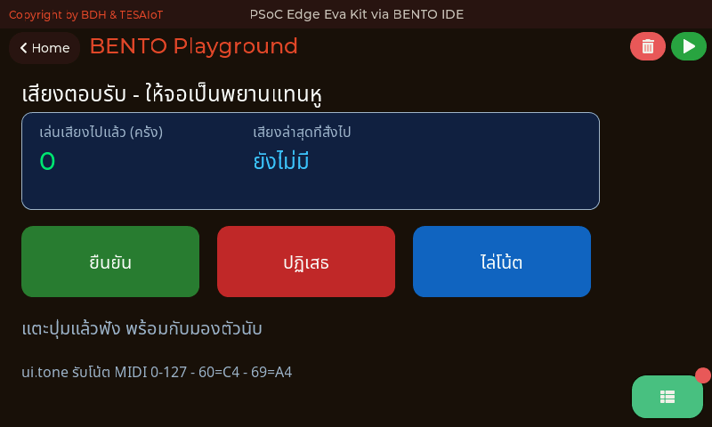
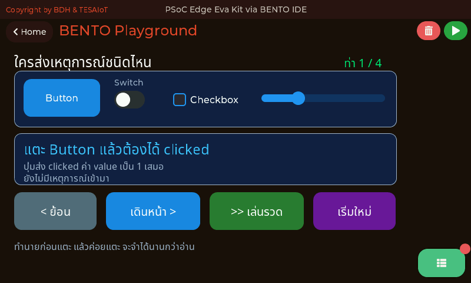
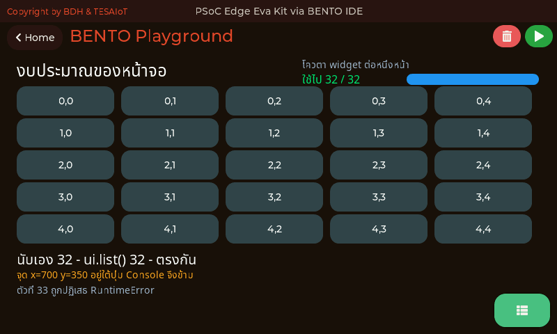
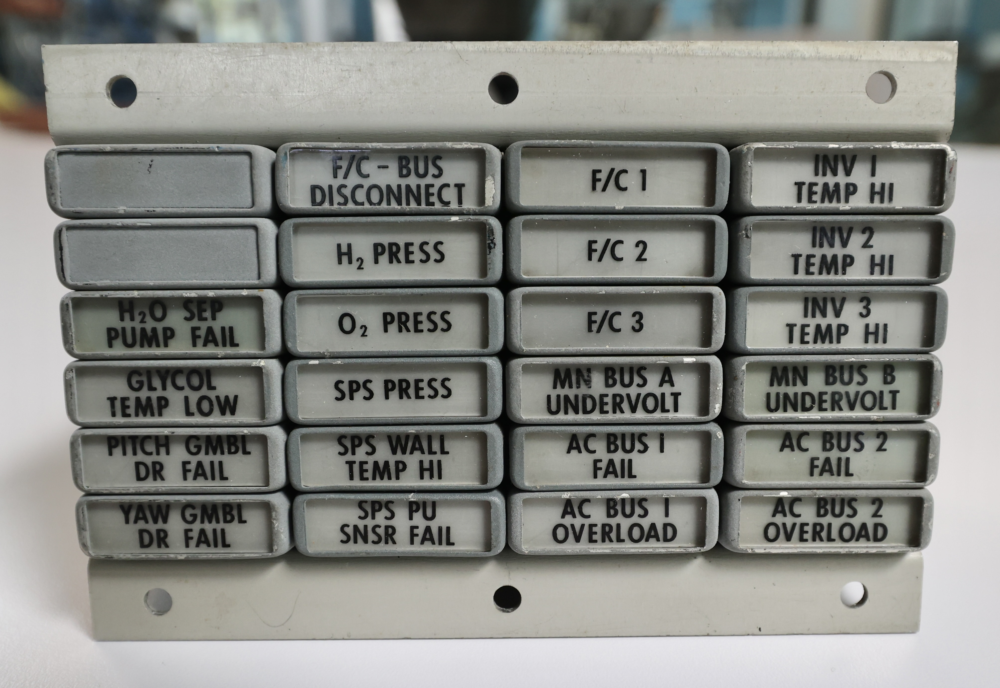
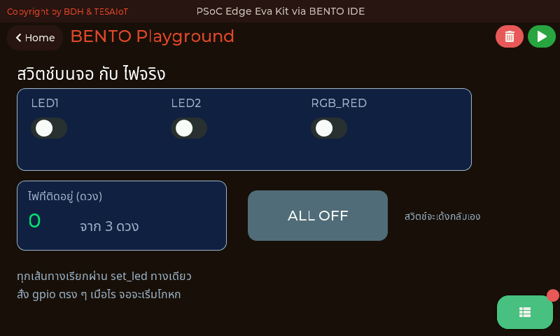
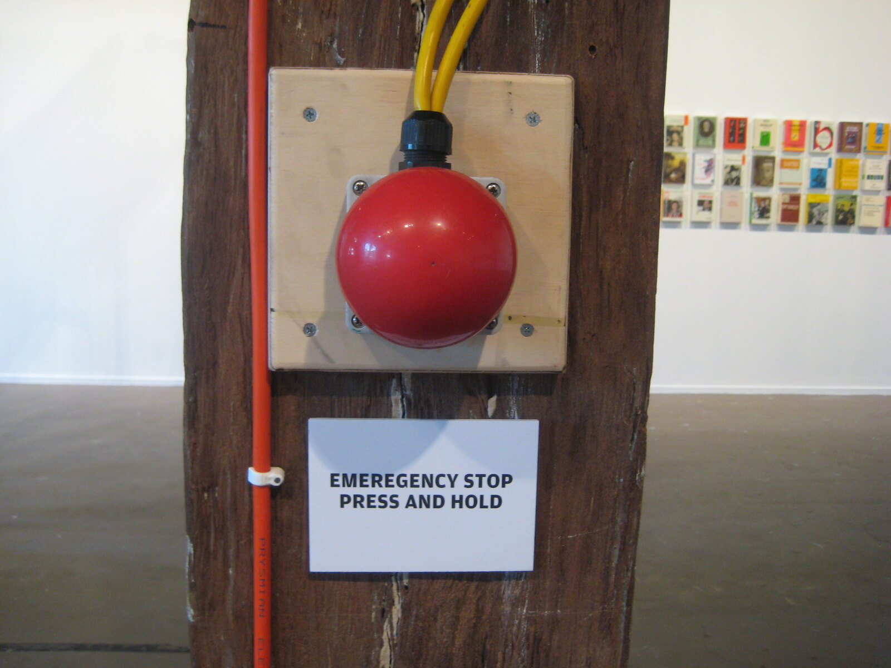
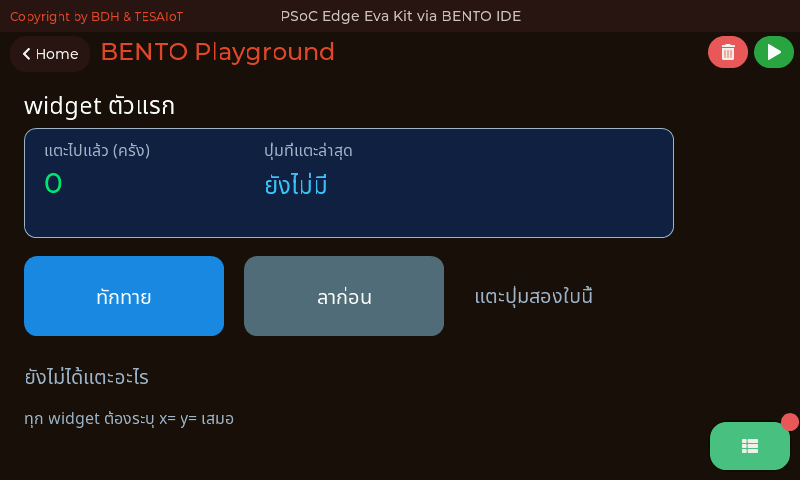

<style>
section { font-size: 24px; padding: 40px 52px; justify-content: flex-start; }
section h1 { font-size: 1.45em; line-height: 1.12; margin: 0 0 .22em; }
section h2 { font-size: 1.12em; margin: .15em 0; }
section h3 { font-size: 1.0em; margin: .12em 0; }
section p, section li { margin: .16em 0; line-height: 1.32; }
section img { max-width: 100%; height: auto; }
section svg { max-height: 330px; width: 100%; }
section table { font-size: .78em; }
section pre { font-size: .70em; line-height: 1.32; background:#0d1117; color:#e6edf3; border:1px solid #30363d; border-radius:8px; padding:12px 16px; box-shadow:0 2px 8px rgba(0,0,0,.25); }
section pre code { white-space: pre-wrap; background:transparent; color:inherit; } section pre .hljs-comment{color:#8b949e;font-style:italic} section pre .hljs-keyword,section pre .hljs-built_in,section pre .hljs-literal{color:#ff7b72} section pre .hljs-string{color:#a5d6ff} section pre .hljs-number{color:#79c0ff} section pre .hljs-title,section pre .hljs-title.function_,section pre .hljs-section{color:#d2a8ff} section pre .hljs-meta{color:#ffa657} section pre .hljs-attr,section pre .hljs-attribute,section pre .hljs-name{color:#7ee787}
section blockquote { margin: .25em 0; font-size: .92em; }
/* two images on a line (parity / 2x2 grids) stay side-by-side and small */
section p > img + img { margin-left: 10px; }
/* scroll-within-slide: dense slides scroll instead of clipping */
section { overflow-y: auto; overflow-x: hidden; }
section::-webkit-scrollbar { width: 11px; }
section::-webkit-scrollbar-thumb { background:#4a90d9; border-radius:6px; }
section::-webkit-scrollbar-track { background:rgba(0,0,0,.06); }
/* image drop-shadow + cover-slide readability (auto) */
section img{filter:drop-shadow(0 3px 12px rgba(0,0,0,.5))}
/* พื้นสำรองของสไลด์ปก: ถ้า img/cover_sNN.svg โหลดไม่ขึ้น ธีมจะคืนพื้นขาว
   แล้วตัวอักษรสีขาวของปกจะหายไปทั้งแผ่น — ปักสีเข้มไว้ให้ภาพเป็นแค่ของประดับ */
section.cover{background-color:#0b1426}
section.cover *{color:#fff !important}
section.cover h1,section.cover h2,section.cover h3,section.cover p,section.cover li,section.cover strong,section.cover em,section.cover blockquote,section.cover div{text-shadow:0 2px 9px rgba(0,0,0,.92),0 0 3px rgba(0,0,0,.8)}
section.cover div[style*="background:#"],section.cover div[style*="background: #"]{background:rgba(10,14,20,.66) !important;border-color:rgba(120,200,255,.45) !important;max-width:62%}
section.cover blockquote{border-left:4px solid rgba(120,200,255,.6) !important;background:rgba(13,17,23,.55) !important;border-radius:6px;padding:.3em .6em}
section.cover h1,section.cover h2,section.cover h3,section.cover p,section.cover blockquote{max-width:60%}
section.cover div:not(:has(img)){max-width:62%}
section.cover img{filter:none}
</style>


<!-- _class: cover -->

# บทเรียน 2.5 — event loop: แตะจอแล้วไฟจริงติด

## สร้าง Touch UI ควบคุมฮาร์ดแวร์ · แผงควบคุมของทีมเราเอง: แตะบนจอแล้วไฟจริงติด

**โมดูล 2 — จากจอสู่ฮาร์ดแวร์**

> ต่อจากบทเรียน 2.4 — จอสัมผัสและ widget ตัวแรก

---

## วงจรของ event loop

<style scoped>
section svg { max-height: 290px; }
</style>

<svg viewBox="0 0 940 270" xmlns="http://www.w3.org/2000/svg">
  <defs><marker id="s4b" markerWidth="10" markerHeight="8" refX="9" refY="4" orient="auto">
    <path d="M0,0 L10,4 L0,8 z" fill="#6a1b9a"/></marker></defs>
  <rect x="20" y="55" width="195" height="100" rx="12" fill="#f3e5f5" stroke="#6a1b9a" stroke-width="2"/>
  <text x="117" y="86" text-anchor="middle" font-size="20" font-weight="700" fill="#6a1b9a">1 · poll</text>
  <text x="117" y="114" text-anchor="middle" font-size="17" fill="#4a148c">ui.poll()</text>
  <text x="117" y="138" text-anchor="middle" font-size="17" fill="#4a148c">ถามว่ามีอะไรใหม่</text>
  <rect x="255" y="55" width="195" height="100" rx="12" fill="#e3f2fd" stroke="#1565c0" stroke-width="2"/>
  <text x="352" y="86" text-anchor="middle" font-size="20" font-weight="700" fill="#1565c0">2 · dispatch</text>
  <text x="352" y="114" text-anchor="middle" font-size="17" fill="#0d47a1">เทียบ handle + type</text>
  <text x="352" y="138" text-anchor="middle" font-size="17" fill="#0d47a1">ว่าใครส่งอะไรมา</text>
  <rect x="490" y="55" width="195" height="100" rx="12" fill="#e8f5e9" stroke="#2e7d32" stroke-width="2"/>
  <text x="587" y="86" text-anchor="middle" font-size="20" font-weight="700" fill="#2e7d32">3 · act</text>
  <text x="587" y="114" text-anchor="middle" font-size="17" fill="#1b5e20">gpio.led().on()</text>
  <text x="587" y="138" text-anchor="middle" font-size="17" fill="#1b5e20">+ อัปเดต Label</text>
  <rect x="725" y="55" width="195" height="100" rx="12" fill="#fff3e0" stroke="#ef6c00" stroke-width="2"/>
  <text x="822" y="86" text-anchor="middle" font-size="20" font-weight="700" fill="#ef6c00">4 · sleep</text>
  <text x="822" y="114" text-anchor="middle" font-size="17" fill="#e65100">time.sleep_ms(50)</text>
  <text x="822" y="138" text-anchor="middle" font-size="17" fill="#e65100">คืนเวลาให้ระบบ</text>
  <g><animateTransform attributeName="transform" type="translate" values="0,0;705,0;705,36;0,36;0,0" dur="5s" repeatCount="indefinite"/><circle cx="117" cy="174" r="11" fill="#7b1fa2"/></g>
  <line x1="217" y1="105" x2="251" y2="105" stroke="#6a1b9a" stroke-width="3" marker-end="url(#s4b)"/>
  <line x1="452" y1="105" x2="486" y2="105" stroke="#6a1b9a" stroke-width="3" marker-end="url(#s4b)"/>
  <line x1="687" y1="105" x2="721" y2="105" stroke="#6a1b9a" stroke-width="3" marker-end="url(#s4b)"/>
  <path d="M822 158 L822 210 L117 210 L117 160" fill="none" stroke="#6a1b9a" stroke-width="3" stroke-dasharray="7 5" marker-end="url(#s4b)"/>
  <text x="470" y="234" text-anchor="middle" font-size="16" font-weight="700" fill="#6a1b9a">วนแบบนี้ประมาณ 20 รอบต่อวินาที ตลอดเวลาที่โปรแกรมยังอยู่</text>
  <text x="470" y="34" text-anchor="middle" font-size="16" font-weight="700" fill="#37474f">โปรแกรม UI ไม่ใช่โค้ดที่ไหลจากบนลงล่าง แต่เป็นวงกลมที่หมุนไม่หยุด</text>
</svg>



<div style="font-size:.62em;color:#78909c;margin-top:-.35em">หน้าจอจริงตอนรัน <a href="https://github.com/tesaiot/tesa-qualification-program/blob/main/courses/aiot-micropython/m02-ui-to-hardware/l05-event-loop/examples/05_sound_feedback.py"><code>05_sound_feedback.py</code></a> — ทุกครั้งที่แตะ จอเปลี่ยนและมีเสียงตอบกลับในรอบเดียวกัน คือหลักฐานว่าวงกลมสี่ขั้นนี้ปิดวงครบ · ภาพหน้าจอจริงจากบอร์ด Eva Kit บันทึกโดยผู้สอน</div>

> ขั้นที่ 4 ไม่ใช่ของฟุ่มเฟือย ถ้าไม่มี ระบบจะไม่มีเวลาไปวาดจอให้เราเลย

---

## หน้าตาของเหตุการณ์ และชนิดของมัน

```python
for ev in ui.poll():
    print(ev)     # {'handle': 3, 'type': 'clicked', 'value': 0}
```

<svg viewBox="0 0 940 175" xmlns="http://www.w3.org/2000/svg">
  <defs><marker id="s4e" markerWidth="10" markerHeight="8" refX="9" refY="4" orient="auto">
    <path d="M0,0 L10,4 L0,8 z" fill="#455a64"/></marker></defs>
  <rect x="24" y="50" width="48" height="46" rx="6" fill="#c62828"/>
  <rect x="80" y="50" width="48" height="46" rx="6" fill="#1565c0"/>
  <rect x="136" y="50" width="48" height="46" rx="6" fill="#2e7d32"/>
  <rect x="192" y="50" width="48" height="46" rx="6" fill="#eceff1" stroke="#b0bec5" stroke-width="2"/>
  <rect x="248" y="50" width="48" height="46" rx="6" fill="#eceff1" stroke="#b0bec5" stroke-width="2"/>
  <rect x="304" y="50" width="48" height="46" rx="6" fill="#eceff1" stroke="#b0bec5" stroke-width="2"/>
  <rect x="360" y="50" width="48" height="46" rx="6" fill="#eceff1" stroke="#b0bec5" stroke-width="2"/>
  <rect x="416" y="50" width="48" height="46" rx="6" fill="#eceff1" stroke="#b0bec5" stroke-width="2"/>
  <text x="244" y="30" text-anchor="middle" font-size="19" font-weight="700" fill="#37474f">คิวเหตุการณ์ที่ CM55 จดไว้ให้</text>
  <text x="244" y="126" text-anchor="middle" font-size="18" fill="#78909c">คิวลึก 16 ช่อง · หยิบได้ครั้งละไม่เกิน 8</text>
  <line x1="478" y1="73" x2="524" y2="73" stroke="#455a64" stroke-width="3" marker-end="url(#s4e)"/>
  <rect x="534" y="44" width="160" height="58" rx="9" fill="#f3e5f5" stroke="#6a1b9a" stroke-width="2.5"/>
  <text x="614" y="80" text-anchor="middle" font-size="20" font-weight="700" fill="#6a1b9a">ui.poll()</text>
  <line x1="700" y1="73" x2="740" y2="73" stroke="#455a64" stroke-width="3" marker-end="url(#s4e)"/>
  <rect x="750" y="34" width="180" height="78" rx="9" fill="#e3f2fd" stroke="#1565c0" stroke-width="2.5"/>
  <text x="840" y="62" text-anchor="middle" font-size="18" fill="#0d47a1">list ของ dict</text>
  <text x="840" y="90" text-anchor="middle" font-size="18" fill="#0d47a1">ว่างได้ ไม่ใช่ None</text>
  <g><animateTransform attributeName="transform" type="translate" values="0,0;566,0" dur="3s" repeatCount="indefinite"/><circle cx="48" cy="73" r="10" fill="#c62828"/></g>
  <text x="840" y="140" text-anchor="middle" font-size="18" fill="#78909c">หยิบออกแล้วคิวว่างลง</text>
</svg>

ทุก dict มีสามช่องเสมอ ไม่มีช่องไหนหายไปบางครั้ง จึงเขียน `ev['value']` ได้เลยโดยไม่ต้องเช็กก่อน

**คิวเป็นวงแหวน 16 ช่อง ใส่ได้จริง 15 และหยิบได้ครั้งละไม่เกิน 8** — ที่ใส่ได้ 15 ไม่ใช่ 16 เพราะวงแหวนต้องเว้นหนึ่งช่องไว้แยกว่า "เต็ม" กับ "ว่าง" · และถ้าเต็มจริง เฟิร์มแวร์ **ทิ้งเหตุการณ์ใหม่ที่เพิ่งเข้ามา** ไม่ได้ทิ้งของเก่า และไม่ได้ให้รอ (`ui_widget_mgr.c:2687-2690`)

แปลว่านิ้วที่แตะรัว ๆ ตอนลูปเราหลับยาว คือการแตะที่ **หายไปเลย** ไม่ใช่แตะที่มาถึงช้า และไม่มี error ให้จับสักตัว · นี่คือเหตุผลจริง ๆ ที่กฎข้อ 2 บอกให้หลับ 50 ms ไม่ใช่ 500

> เหตุการณ์ที่หายไปเงียบ ๆ คือบั๊กที่หาไม่เจอด้วย print — หาเจอด้วยการนับ

---

## ชนิดของเหตุการณ์ — widget ไหนส่งอะไร และ `value` แปลว่าอะไร

<style scoped>
section table { font-size: .54em; }
section table td, section table th { padding: .08em .45em; line-height: 1.22; }
section p { margin: .05em 0; font-size: .9em; }
section blockquote { font-size: .8em; margin: .08em 0; }
</style>

| widget | ชนิดเหตุการณ์ที่ส่ง | ความหมายของ `ev['value']` |
|---|---|---|
| `ui.Button` | `'clicked'` | ไม่ใช้ |
| `ui.Switch` | `'toggled'` | 1 = เปิด, 0 = ปิด |
| `ui.Checkbox` | `'toggled'` | 1 = ติ๊ก, 0 = ไม่ติ๊ก |
| `ui.Slider` / `ui.Arc` / `ui.Dropdown` | `'value_changed'` | ค่าใหม่ · Dropdown ให้ **ลำดับของตัวเลือก** เริ่มที่ 0 |
| `ui.Textarea` | `'value_changed'` | **เป็น 0 เสมอ** event ไม่พาข้อความมาด้วย · รู้ว่า "มีการพิมพ์" แล้วค่อยถาม `.text()` เอาข้อความ (อ่านกลับได้แล้ว `modui.c:352-383`) |
| ชนิดที่สี่ | `'unknown'` | เฟิร์มแวร์แปลรหัสที่ได้มาไม่ออก **อย่าละเลย ให้เขียนลง Console ไว้** |
| `ui.Label` / `ui.Bar` / `ui.Seg7` / `ui.Panel` / `ui.Chart` | ไม่ส่งอะไรเลย | เป็นตัวแสดงผลอย่างเดียว |

**`'unknown'` มีจริงและต้องเผื่อไว้** — โค้ดที่เขียน `if t == 'clicked': ... else: ...` จะกวาด `unknown` เข้าไปอยู่ใน `else` เงียบ ๆ เขียนเป็น `elif` ให้ครบทุกชนิดที่เรารู้จัก แล้วเหลือกิ่งสุดท้ายไว้พิมพ์ของแปลกลง Console ดีกว่าเดาแทนมัน



<div style="font-size:.6em;color:#78909c">ขวา: หน้าจอจริงตอนรัน <a href="https://github.com/tesaiot/tesa-qualification-program/blob/main/courses/aiot-micropython/m02-ui-to-hardware/l05-event-loop/examples/02_event_types.py"><code>02_event_types.py</code></a> — ตารางข้างบนเอามาแตะจริงได้ ไฟล์นี้วาง Button Switch Checkbox และ Slider ไว้บนแถวเดียวกัน แล้วเดินทีละท่า ท่าละหนึ่ง widget (ในภาพคือท่า 1/4 ของ Button) บอกล่วงหน้าว่าต้องได้ชนิดไหน แล้วรอให้เราแตะพิสูจน์ · ท่าที่ 3 คือกับดักของไฟล์ — Checkbox ส่ง <code>toggled</code> ไม่ใช่ <code>clicked</code> ทั้งที่หน้าตาเหมือนของกด · ภาพหน้าจอจริงจากบอร์ด Eva Kit บันทึกโดยผู้สอน</div>

> สอง widget ที่หน้าตาต่างกันมาก อาจส่งเหตุการณ์ชนิดเดียวกัน — เช็ก `type` คู่กับ `handle` เสมอ

---

## กฎเหล็ก 5 ข้อของโมดูล ui

<style scoped>
section svg { max-height: 130px; }
section p { margin: .05em 0; font-size: .9em; line-height: 1.28; }
section blockquote { font-size: .8em; margin: .08em 0; }
</style>

<svg viewBox="0 0 940 165" xmlns="http://www.w3.org/2000/svg">
  <g stroke-width="3"><animate attributeName="stroke-width" values="3;7;3" dur="2.2s" repeatCount="indefinite"/><rect x="20" y="38" width="172" height="88" rx="10" fill="#ffebee" stroke="#c62828"/></g>
  <text x="106" y="70" text-anchor="middle" font-size="20" font-weight="700" fill="#c62828">ข้อ 1</text>
  <text x="106" y="98" text-anchor="middle" font-size="18" fill="#8e0000">poll ทุกรอบ</text>
  <rect x="205" y="38" width="172" height="88" rx="10" fill="#fff3e0" stroke="#ef6c00" stroke-width="2.5"/>
  <text x="291" y="70" text-anchor="middle" font-size="20" font-weight="700" fill="#ef6c00">ข้อ 2</text>
  <text x="291" y="98" text-anchor="middle" font-size="18" fill="#e65100">sleep ≥ 50 ms</text>
  <rect x="390" y="38" width="172" height="88" rx="10" fill="#e3f2fd" stroke="#1565c0" stroke-width="2.5"/>
  <text x="476" y="70" text-anchor="middle" font-size="20" font-weight="700" fill="#1565c0">ข้อ 3</text>
  <text x="476" y="98" text-anchor="middle" font-size="18" fill="#0d47a1">งบ 32 · เพดาน 64</text>
  <rect x="575" y="38" width="172" height="88" rx="10" fill="#e8f5e9" stroke="#2e7d32" stroke-width="2.5"/>
  <text x="661" y="70" text-anchor="middle" font-size="20" font-weight="700" fill="#2e7d32">ข้อ 4</text>
  <text x="661" y="98" text-anchor="middle" font-size="18" fill="#1b5e20">ui หยุด auto-task</text>
  <rect x="760" y="38" width="172" height="88" rx="10" fill="#f3e5f5" stroke="#6a1b9a" stroke-width="2.5"/>
  <text x="846" y="70" text-anchor="middle" font-size="20" font-weight="700" fill="#6a1b9a">ข้อ 5</text>
  <text x="846" y="98" text-anchor="middle" font-size="18" fill="#4a148c">เร็วไป เฟรมหาย</text>
  <text x="470" y="26" text-anchor="middle" font-size="19" font-weight="700" fill="#37474f">ห้าข้อนี้คือกติกาของบอร์ด ไม่ใช่คำแนะนำ</text>
  <text x="470" y="152" text-anchor="middle" font-size="18" fill="#78909c">ข้อ 1 กับ 2 คือสองข้อที่ทำให้ทีมส่วนใหญ่เสียเวลาไปครึ่งบทเรียน</text>
</svg>

**ข้อ 1 · เรียก `ui.poll()` ทุกรอบ** — ตอนสร้าง widget ตัวแรก CM55 จะ **ซ่อนกล่องบรรจุทั้งใบไว้ก่อน** แล้วเปิดออกเมื่อ `ui.poll()` ครั้งแรกมาถึง ถ้าไม่เรียกเลย จอจะว่างอยู่ราว **2 วินาที** จนกลไกกันเหนียวปลดล็อกเอง หลายทีมสรุปว่า "โค้ดพัง" ทั้งที่แค่ยังไม่ได้ถาม

**ข้อ 2 · `time.sleep_ms(50)` เป็นอย่างต่ำ** สำหรับ UI เบา ๆ แบบวันนี้ · แดชบอร์ดหนัก (บทเรียน 3.7–3.9) ใช้ 200 ms

**ข้อ 3 · งบของคอร์ส 32 widget ต่อหน้า (เพดานเฟิร์มแวร์ 64)** เกิน 64 เมื่อไรได้ `RuntimeError: ui: max 64 widgets` ทันที ส่วน 32 คือเส้นที่คอร์สขีดให้ตัวเอง เพื่อให้จอยังอ่านออกและเหลือที่ให้ดีบัก — นับก่อนสร้างเสมอ

**ข้อ 4 · `ui.*` ครั้งแรกหยุดงานอ่านเซนเซอร์อัตโนมัติ** เพราะบัส I2C ต้องไม่ชนกัน ตั้งแต่จุดนั้นเราอ่านเซนเซอร์เองในลูป

**ข้อ 5 · ลูปเร็วเกินไป เฟรมหายเงียบ ๆ** ไม่มี exception มีแต่จอที่กระตุกและค่าที่อัปเดตไม่ครบ



<div style="font-size:.6em;color:#78909c">ขวา: หน้าจอจริงตอนรัน <a href="https://github.com/tesaiot/tesa-qualification-program/blob/main/courses/aiot-micropython/m02-ui-to-hardware/l05-event-loop/examples/06_layout_budget.py"><code>06_layout_budget.py</code></a> — งบ widget ที่ใช้ไปแล้วเท่าไรจากงบของคอร์ส 32 (เพดานเฟิร์มแวร์ 64) แสดงบนจอของมันเอง คือข้อ 3 ที่มองเห็นได้ · ภาพหน้าจอจริงจากบอร์ด Eva Kit บันทึกโดยผู้สอน · <b>ภาพนี้เก่า</b> ถ่ายก่อนไฟล์เปลี่ยนป้ายเป็น "งบ 32 (เพดาน 64)" รอถ่ายใหม่</div>

> ห้าข้อนี้ไม่ใช่คำแนะนำ มันคือกติกาของบอร์ดนี้ ทุกบทเรียนที่เหลือใช้ชุดเดียวกันหมด

---

## ฝั่งอินพุตของโมดูล ui มีอะไรบ้าง — ทั้งหมด ไม่ใช่แค่ที่วันนี้ใช้

<style scoped>
section table { font-size: .48em; }
section table td, section table th { padding: .06em .4em; line-height: 1.22; }
section p { margin: .04em 0; font-size: .84em; line-height: 1.24; }
section blockquote { font-size: .76em; margin: .05em 0; }
</style>

บทเรียน 1.1–1.6 ใช้ `ui` เป็นฝั่ง **แสดงผล** วันนี้เปิดอีกฝั่ง สไลด์นี้คือรายการทั้งหมดของฝั่งนั้น — **สี่ฟังก์ชันระดับโมดูลที่เกี่ยวกับอินพุตและการจัดการ widget**

| เรียกอย่างไร | คืนอะไร | ใช้ตอนไหน · กับดัก |
|---|---|---|
| `ui.poll()` | `list` ของ `dict` คีย์ `handle` `type` `value` · ว่างได้ ไม่ใช่ `None` | หัวใจของชุดบทเรียนนี้ · **ต้องเรียกทุกรอบ** ตามกฎข้อ 1 |
| `ui.list()` | `list` ของ `dict` คีย์ **`id`** กับ `type` (ชื่อชนิดเป็นสตริง เช่น `"Button"`) | ตรวจว่าบนจอมีอะไรอยู่จริงกี่ตัว · **คีย์ชื่อ `id` ไม่ใช่ `handle`** คนละคำ ค่าเดียวกัน |
| `ui.get(id)` | อ็อบเจกต์ `Widget` ตัวใหม่ที่ชี้ไปที่ widget เดิม | เอา widget กลับคืนมาจากเลขอย่างเดียว · `id` นอกช่วง **0-63** โยน `ValueError` (`modui.c:1541`) · มีเลขแต่ไม่มีตัว ก็ `ValueError` เหมือนกัน · ถ้าคุยกับ CM55 ไม่ได้เลย จะเป็น `RuntimeError` คนละชนิด อย่าดัก `except ValueError` แล้วคิดว่าครอบคลุมหมด |
| `ui.clear()` | ไม่คืนอะไร | ลบ widget ทุกตัวทิ้ง คืนโควตาให้ครบ (งบคอร์ส 32 · เพดานเฟิร์มแวร์ 64) · ต่างจาก `ui.screen()` ตรงที่ไม่ได้ตั้งขนาดจอใหม่ |

`ui.screen(w, h)` ที่เราใช้เปิดหัวสคริปต์ทุกครั้ง จริง ๆ แล้วมันสั่ง `clear` ให้ก่อนแล้วค่อยตั้งขนาด ปริยายคือ **792 × 398** — เท่ากับพื้นที่จริงของ Playground · **เมธอดของ `Widget` ที่ใช้ในฝั่งอินพุต — เก้าตัว**

| เมธอด | ทำอะไร | กับดัก |
|---|---|---|
| `.id()` | เลขประจำตัว 0-63 ที่ตรงกับ `ev['handle']` | ไม่เก็บไว้ = แยกไม่ออกว่าใครส่ง |
| `.text("...")` | เขียนข้อความใหม่ทับของเดิม | เรียกแบบ **ไม่ใส่อาร์กิวเมนต์คือ "อ่าน"** — คืนสตริงจริงสำหรับ `Label` `Textarea` `Dropdown` `Roller` ชนิดอื่นได้ `""` (`modui.c:352-383`) |
| `.value()` / `.value(n)` | ถามค่าปัจจุบัน / สั่งค่าใหม่ | มี **สิบเอ็ดชนิด** ที่ตอบ `.value()` ได้จริง: `Slider` `Arc` `Bar` `Switch` `Checkbox` `Dropdown` `Roller` `Spinbox` `Tabview` `ButtonMatrix` `Calendar` (`ui_widget_mgr.c:2568-2607`) · ที่เหลือคืน `0` และ **`0` ยังแปลว่า "ถามไม่สำเร็จ" ได้ด้วย** แยกไม่ออก · `Seg7` รับ `.value(n)` แต่ได้จำนวนเต็ม ทศนิยมต้อง `.text()` |
| `.pos(x, y)` | ย้ายตำแหน่งหลังสร้างแล้ว | ยังนับเป็น widget ตัวเดิม ไม่กินโควตาเพิ่ม |
| `.size(w, h)` | เปลี่ยนขนาดหลังสร้างแล้ว | ปุ่มที่เล็กกว่า ~45 px นิ้วกดพลาด |
| `.color(0xRRGGBB)` | เปลี่ยนสี | ใช้เป็น "ช่องรายงานสถานะ" ได้ ตาอ่านสีเร็วกว่าตัวอักษร |
| `.show()` / `.hide()` | ซ่อน-แสดงโดยไม่ต้องลบ | ของที่ซ่อนอยู่ **ยังกินโควตา** อยู่ (งบคอร์ส 32 · เพดาน 64) · และแตะไม่ได้ ไม่ส่ง event |
| `.delete()` | ลบทิ้งจริง คืนโควตาหนึ่งช่อง | อ็อบเจกต์ฝั่ง Python ยังอยู่ แต่ชี้ไปที่ของที่ไม่มีแล้ว อย่าเอามาใช้ต่อ |

เมธอดที่เหลือของ `Widget` (`icon` `set_image` `set_pixels` `add_series` `set_next`) เป็นเรื่องของฝั่งแสดงผล — `add_series` กับ `set_next` จะได้ใช้จริงตอนวาดกราฟในบทเรียน 3.4–3.6 · **หกชนิดที่รับอินพุตได้** — `Button` `Switch` `Slider` `Checkbox` `Dropdown` `Textarea` · วันนี้ลงมือกับ `Button` ตัวเดียวในโครงหลัก ที่เหลืออยู่ใน [`02_event_types.py`](https://github.com/tesaiot/tesa-qualification-program/blob/main/courses/aiot-micropython/m02-ui-to-hardware/l05-event-loop/examples/02_event_types.py) `03_switch_matches_led.py` และ `08_dropdown_textarea.py` ให้เปิดเล่นเอง


> `hide()` ไม่ใช่ `delete()` — ตัวหนึ่งแค่ปิดไฟ อีกตัวรื้อออกจากห้อง ถ้างบ 32 ของคอร์ส (หรือเพดาน 64 ของเฟิร์มแวร์) ใกล้เต็ม มีแค่ตัวหลังที่ช่วยได้

---

## widget ที่ "ใส่ของอื่นไว้ข้างใน" ได้ — อีกกลุ่มหนึ่งที่ยังไม่ได้พูดถึง

<style scoped>
section table { font-size: .50em; }
section table td, section table th { padding: .06em .4em; line-height: 1.22; }
section p { margin: .04em 0; font-size: .84em; line-height: 1.24; }
section pre { font-size: .46em; line-height: 1.2; }
section blockquote { font-size: .76em; margin: .05em 0; }
</style>

ทุกตัวข้างบนเป็น **ของชิ้นเดียว** วางเรียงกันบนจอ พอของเกินสิบชิ้น จอ 792×398 ก็เต็ม — กลุ่มนี้แก้ปัญหานั้น มันไม่วาดอะไรของตัวเองมากนัก หน้าที่ของมันคือ **เป็นที่ใส่ของอื่น**

| widget | ขอช่องข้างในด้วย | คืนอะไร | ใช้ตอนไหน |
|---|---|---|---|
| `ui.Tabview` | `.add_tab("ชื่อ")` | แฮนเดิลของหน้าในแท็บนั้น | หลายหน้าจอที่ไม่เกี่ยวกัน สลับด้วยการแตะ · `value=` คือความสูงแถบแท็บ |
| `ui.Tileview` | `.add_tile(col, row)` | แฮนเดิลของไทล์ | หน้าจอที่ **ปัดนิ้วเลื่อน** คอลัมน์เดียวกันแถวต่างกัน = ปัดขึ้นลง |
| `ui.Win` | `.content()` | แฮนเดิลของพื้นที่ใต้แถบหัว | กล่องที่มีชื่อเรื่องติดมาด้วย ต่างจาก `Panel` ที่เป็นสี่เหลี่ยมเปล่า · ถามซ้ำได้ค่าเดิม |
| `ui.Menu` | `.add_page("ชื่อ")` | แฮนเดิลของหน้า | เมนูซ้าย-เนื้อหาขวา · **หน้าแรกที่สร้าง คือหน้าที่เมนูเปิดให้ตอนแรก** |

**กฎข้อเดียวที่ต้องจำ: ค่าที่คืนมาต้องส่งกลับเป็น `parent=`**

```python
tabs = ui.Tabview(x=0, y=0, w=792, h=336, value=44)   # สูง 336 ไม่ใช่ 398 - มุมขวาล่างเป็นปุ่ม Console
tab_win = tabs.add_tab("หน้าต่าง")                    # <- เก็บไว้
...
win = ui.Win(text="บันทึกเหตุการณ์", x=16, y=12, w=740, h=280,
             value=40, parent=tab_win)                # <- ส่งกลับเข้าไป
body = win.content()
ui.Label("ระบบเริ่มทำงาน", x=16, y=16, color=COL_DIM, value=20, parent=body)
```

ลืมส่ง `parent=` แล้วป้ายจะไปโผล่บนจอหลัก ไม่ได้อยู่ในแท็บ — และ **ไม่มีอะไรฟ้อง** ไม่มี exception ไม่มีคำเตือน มีแค่ของที่ไปอยู่ผิดที่ · **อีกสามตัวที่ยังไม่ได้พูดถึง**

| widget | ทำอะไร | กับดัก |
|---|---|---|
| `ui.Spinner` | วงกลมหมุนเอง บอกว่า "กำลังทำงานอยู่" | **ไม่มีค่าให้อ่านและไม่ต้องสั่ง** ห้ามใช้บอกความคืบหน้า อันนั้นคือ `ui.Bar` |
| `ui.DotMatrix` | จอจุดเป็นตาราง `cols`/`rows` คือ **จำนวนจุด ไม่ใช่พิกเซล** | ส่งค่าด้วย `.set_pixels(list)` ยาวเท่าจำนวนคอลัมน์ |
| `ui.Image` | ไอคอนที่คอมไพล์มากับเฟิร์มแวร์ | เปลี่ยนภาพด้วย `.icon(n)` ไม่ใช่ `.text()` แม้เบื้องหลังจะส่งเป็น SET_TEXT ก็ตาม |

> ของที่อยู่ในแท็บที่ไม่ได้เปิดอยู่ **ยังกินโควตาเท่าเดิม** — แท็บช่วยเรื่องพื้นที่สายตา ไม่ได้ช่วยเรื่องโควตา · ลงมือกับกลุ่มนี้ที่ [`s04b_layout_widgets.py`](https://github.com/tesaiot/tesa-qualification-program/blob/main/courses/aiot-micropython/m02-ui-to-hardware/l05-event-loop/practice/s04b_layout_widgets.py) เฉลยอยู่ใน `solution/` ชื่อเดียวกัน

---

## ทั้งโมดูล ui มีอยู่เท่านี้ (1/3) — หนึ่งร้อยสามสิบสองชื่อบน Eva Kit (Dev Kit มี Sprite เพิ่ม)

<style scoped>
section table { font-size: .52em; }
section table td, section table th { padding: .08em .45em; line-height: 1.22; }
section p { margin: .05em 0; font-size: .9em; }
</style>

สไลด์ก่อนหน้าเปิดเฉพาะฝั่งอินพุต สไลด์นี้เปิดทั้งใบ — พิมพ์ `dir(ui)` บน Eva Kit แล้วได้ชื่อพวกนี้ ไม่มากกว่านี้ (Dev Kit ได้ชุดเดียวกันบวก `Sprite` กับค่าคงที่ `SPR_*`) ไม่ได้ให้ท่อง แต่ให้ **รู้ว่าอะไรมีอยู่** จะได้ไม่ไปเขียนของที่ไม่มี

**ตัวสร้าง widget — สามสิบสามตัว** ทุกตัวคืนอ็อบเจกต์ `Widget` ชนิดเดียวกันหมด ต่างกันที่ชนิดข้างในและ event ที่มันส่ง

| ตัวสร้าง | ชุดบทเรียนนี้ใช้ไหม | ใช้ที่ไหน |
|---|---|---|
| `Button` `Label` `Led` `Panel` `MsgBox` | **ใช้ในโครงหลัก** | ห้าตัวนี้ประกอบเป็นแผงควบคุมของชุดบทเรียนนี้ทั้งใบ (`Panel` ได้เป็นตัวเอกจริงตอนจัดการ์ดในบทเรียน 3.7–3.9) |
| `Switch` `Slider` `Checkbox` `Dropdown` `Textarea` | ใช้ในตัวอย่าง | อีกห้าชนิดที่ **รับอินพุตได้** — `02_event_types.py` `03_switch_matches_led.py` และ `08_dropdown_textarea.py` |
| `Seg7` `Bar` `Chart` | ใช้ในตัวอย่าง | `04_seg7_takes_text.py` และ `06_layout_budget.py` · `Chart` ได้เป็นตัวเอกเต็มบทเรียนใน**บทเรียน 3.4–3.6** |
| `Scale` `Spinbox` | ใช้ในตัวอย่าง | `09_scale_led_spinbox.py` — สเกลมีขีด · ช่องตัวเลขที่กดเพิ่มลดได้ (คู่กับ `Led` อีกครั้ง) |
| `Tabview` | ใช้ในตัวอย่าง | `10_tabview_second_screen.py` และ `14_container_coordinates.py` — จอที่สองโดยไม่ต้องล้างจอ |
| `Menu` | ใช้ในตัวอย่าง | `11_menu_settings_tree.py` — ต้นไม้หน้าตั้งค่าที่ย้อนกลับเองได้ |
| `Table` `List` `Line` `Picture` | ใช้ในตัวอย่าง | `12_table_and_list.py` — สี่ตัวนี้คือฝั่ง**แสดงข้อมูลเป็นชุด** |
| `ButtonMatrix` | ใช้ในตัวอย่าง | `13_confirm_before_acting.py` — คู่กับ `MsgBox` ถามยืนยันก่อนสั่งงานที่ย้อนไม่ได้ |
| `Arc` | ยังไม่ใช้ | เข็มโค้งของบทเรียน 2.7–2.9 และหน้าปัดของบทเรียน 3.1–3.3 (`s01/05`, `s01/12`, `s01/15`) |
| `Compass` | ยังไม่ใช้ | การ์ดเข็มทิศในบทเรียน 3.7–3.9 (`s08/06`) |
| `DotMatrix` | ยังไม่ใช้ | เคยโผล่ที่ `s01/14` และกลับมาอีกทีที่ `s07/02` |
| `Image` `Spinner` | ยังไม่ใช้ | ทั้งคู่อยู่ในตัวอย่างบทเรียน 1.1–1.6 (`s01/15`, `s02/06`) และคอร์สนี้ไม่ได้กลับมาใช้อีก |
| `Roller` | ยังไม่ใช้ | ตัวเลือกแบบวงล้อ — ได้ใช้จริงที่ `s05/10` · **ไม่ใช่**ของที่เลื่อนตัวเองได้ ดูสไลด์ปัดนิ้ว |
| `Keyboard` | ยังไม่ใช้ | แป้นพิมพ์บนจอ คู่กับ `Textarea` — บทเรียน 4.1–4.3 (`s09/10`, `s09/11`) |
| `Tileview` `Win` `SpanGroup` `Calendar` | ยังไม่ใช้ | สี่ตัวท้ายของชุด — `s12/09`, `s08/08`, `s12/07`, `s12/08` |

---

## ทั้งโมดูล ui มีอยู่เท่านี้ (2/3) — ฟังก์ชัน เสียง และค่าคงที่

<style scoped>
section table { font-size: .54em; }
section table td, section table th { padding: .08em .45em; line-height: 1.22; }
section p { margin: .05em 0; font-size: .9em; }
</style>

**ฟังก์ชันระดับโมดูล — แปดตัว** สี่ตัวแรกอยู่ในสไลด์ฝั่งอินพุตครบแล้ว

| ชื่อ | ทำอะไร | ชุดบทเรียนนี้ใช้ไหม |
|---|---|---|
| `poll()` `list()` `get(id)` `clear()` | อ่านเหตุการณ์ · สำรวจของบนจอ · ดึง widget กลับจากเลข · ล้างทั้งจอ | **`poll()` คือหัวใจของชุดบทเรียนนี้** อีกสามตัวอยู่ใน `07_find_move_hide_delete.py` |
| `screen(w, h)` | ล้างจอแล้วตั้งขนาด ปริยาย 792 × 398 | ใช้ทุกไฟล์ เปิดหัวสคริปต์ |
| `program(code)` | เขียน/อ่าน/ลบ `/main.py` เพื่อให้โค้ดรันเองหลังบอร์ดรีเซ็ต | **ไม่ใช้ในคอร์สนี้เลย** เป็นของเครื่องมือฝั่ง IDE |
| `_ide_status(on)` · `_deploy()` | โชว์สถานะ IDE และหน้าจอ "กำลังอัปโหลด" | **ไม่ใช่ของเรา** ขึ้นต้นด้วยขีดล่างเพราะ IDE เรียกเอง อย่าเรียกเอง |

**เสียง — สองฟังก์ชัน กับค่าคงที่ยี่สิบห้าตัว** `sfx()` `tone()` · `SFX_*` 21 ชื่อ · `WAVE_*` 4 ชื่อ — กางไว้แล้วในสไลด์ "เอาต์พุตอีกทางที่ ui มีให้"

**ค่าคงที่ที่เหลือ — หกสิบสามตัว** ไม่ใช่ของที่ต้องท่อง แต่ต้องรู้ว่ามันมี เพราะเวลาต้องใช้ **ให้เรียกด้วยชื่อ ไม่ใช่ตัวเลขดิบ**

| กลุ่ม | กี่ตัว | ใช้ตอนไหน |
|---|---|---|
| `PROP_*` | 25 | ค่าที่ตั้งผ่าน `.prop(id, value)` — ของ `Scale` `Spinbox` `Led` `Textarea` `Menu` `Calendar` และอื่น ๆ |
| `ICON_*` | 21 | ไอคอนหน้ารายการของ `List` — `lst.add_item("ตั้งค่า", ui.ICON_SETTINGS)` |
| `DIR_*` | 6 | ทิศที่ `gesture` พกมาใน `value` และทิศที่ `.add_tile()` ยอมให้ปัด |
| `SCALE_*` | 6 | รูปแบบการวางสเกล — บน ล่าง ซ้าย ขวา และแบบวงกลมสองแบบ |
| `SPAN_*` | 5 | เส้นใต้ ขีดฆ่า และโหมดตัดบรรทัดของ `SpanGroup` |

**ชนิด — หนึ่งตัว** `ui.Widget` เป็น **ชนิด** ไม่ใช่ฟังก์ชัน สร้างเองไม่ได้ ใช้กับ `isinstance()` เท่านั้น

---

## ทั้งโมดูล ui มีอยู่เท่านี้ (3/3) — เมธอดของ Widget สามสิบแปดตัว

<style scoped>
section table { font-size: .54em; }
section table td, section table th { padding: .08em .45em; line-height: 1.22; }
section p { margin: .05em 0; font-size: .9em; }
section blockquote { font-size: .8em; margin: .08em 0; }
</style>

**เมธอดของ `Widget` — สามสิบแปดตัว** นับแยกจาก 132 ชื่อบนโมดูล เพราะมันอยู่บนอ็อบเจกต์ ไม่ได้อยู่บนโมดูล

| กลุ่ม | เมธอด |
|---|---|
| **ใช้แล้วในชุดบทเรียนนี้ (เก้า)** | `.id()` `.text()` `.value()` `.pos()` `.size()` `.color()` `.show()` `.hide()` `.delete()` |
| **ขอรับเหตุการณ์ (หนึ่ง)** | `.listen()` — หัวใจของครึ่งหลังชุดบทเรียนนี้ |
| ของที่มีสมาชิกเป็นชุด (เจ็ด) | `.add_item()` `.add_row()` `.cell()` `.add_option()` `.add_button()` `.add_point()` `.clear_items()` |
| กรอบที่มีของอยู่ข้างใน (สาม) | `.add_tab()` `.add_tile()` `.content()` |
| ปุ่มปรับเฉพาะชนิด (ห้า) | `.prop()` `.ticks()` `.digits()` `.col_width()` `.bind()` |
| `Menu` (ห้า) | `.add_page()` `.row()` `.section()` `.separator()` `.opens()` |
| ฝั่งภาพ (สาม) | `.icon()` `.set_image()` `.set_pixels()` |
| `Chart` (สอง) · `SpanGroup` (สอง) · `Calendar` (หนึ่ง) | `.add_series()` `.set_next()` · `.add_span()` `.pen()` · `.month()` |

**และของที่ Eva Kit ไม่มี** — `ui.Sprite` กับค่าคงที่ `SPR_*` ทั้งชุด รวมถึงเมธอด `.frame()` มีอยู่จริงในซอร์สเดียวกัน แต่ถูกกันไว้ด้วยธงคอมไพล์ของเครื่องเกม ซึ่งเฟิร์มแวร์ Eva ไม่ได้เปิด พิมพ์ไปได้ `AttributeError` · **Dev Kit เปิดไว้** จึงมี `ui.Sprite` ให้เรียก — คอร์สนี้ไม่ใช้ เพราะโค้ดต้องรันได้ทั้งสองบอร์ด

> นับให้ครบก่อนออกแบบหน้าจอ: 33 + 8 + 2 + 25 + 63 + 1 = 132 ชื่อบนโมดูล และ 38 เมธอดบน widget — เท่านี้คือทั้งหมดที่จอตัวนี้ทำได้จาก Python บน Eva Kit (Dev Kit บวก `Sprite` และ `SPR_*`)
>
> <span style="font-size:.8em">`dir(ui)` บน Eva Kit จะขึ้น 133 บรรทัด เพราะมี `__name__` ติดมาด้วยอีกหนึ่ง ซึ่งไม่ใช่ของที่เราเรียกใช้ — บน Dev Kit นับเองแล้วจดลงบันทึกการเรียน</span>

---

## เกร็ด: ทำไม UI สมัยใหม่ถึงเป็น event loop กันหมด

<style scoped>
section svg { max-height: 220px; }
</style>

<svg viewBox="0 0 940 205" xmlns="http://www.w3.org/2000/svg">
  <text x="20" y="34" font-size="19" font-weight="700" fill="#c62828">แบบเก่า · โปรแกรมไปนั่งรอที่จุดเดียว</text>
  <rect x="150" y="46" width="760" height="42" rx="6" fill="#ffcdd2" stroke="#c62828" stroke-width="2"/>
  <text x="530" y="74" text-anchor="middle" font-size="19" fill="#8e0000">บล็อกอยู่ที่ input() — ทำอย่างอื่นไม่ได้เลย</text>
  <text x="20" y="74" font-size="18" fill="#8e0000">เวลา →</text>
  <text x="300" y="112" font-size="19" fill="#c62828">แตะปุ่มอื่น · ไม่มีใครฟัง
    <animate attributeName="fill" values="#f5cccc;#c62828;#f5cccc" dur="2.4s" repeatCount="indefinite"/></text>
  <text x="20" y="150" font-size="19" font-weight="700" fill="#2e7d32">แบบ event loop · เก็บใส่คิวแล้ววนมาหยิบ</text>
  <rect x="150" y="160" width="120" height="34" rx="5" fill="#c8e6c9" stroke="#2e7d32" stroke-width="2"/>
  <rect x="290" y="160" width="120" height="34" rx="5" fill="#c8e6c9" stroke="#2e7d32" stroke-width="2"/>
  <rect x="430" y="160" width="120" height="34" rx="5" fill="#c8e6c9" stroke="#2e7d32" stroke-width="2"/>
  <rect x="570" y="160" width="120" height="34" rx="5" fill="#c8e6c9" stroke="#2e7d32" stroke-width="2"/>
  <rect x="710" y="160" width="120" height="34" rx="5" fill="#c8e6c9" stroke="#2e7d32" stroke-width="2"/>
  <text x="210" y="184" text-anchor="middle" font-size="17" fill="#1b5e20">poll</text>
  <text x="350" y="184" text-anchor="middle" font-size="17" fill="#1b5e20">poll</text>
  <text x="490" y="184" text-anchor="middle" font-size="17" fill="#1b5e20">poll</text>
  <text x="630" y="184" text-anchor="middle" font-size="17" fill="#1b5e20">poll</text>
  <text x="770" y="184" text-anchor="middle" font-size="17" fill="#1b5e20">poll</text>
  <g><animateTransform attributeName="transform" type="translate" values="0,0;0,34" dur="2.4s" repeatCount="indefinite"/><circle cx="560" cy="126" r="9" fill="#2e7d32"/></g>
  <g><animateTransform attributeName="transform" type="translate" values="0,0;0,34" dur="2.4s" begin="0.8s" repeatCount="indefinite"/><circle cx="700" cy="126" r="9" fill="#2e7d32"/></g>
  <g><animateTransform attributeName="transform" type="translate" values="0,0;0,34" dur="2.4s" begin="1.6s" repeatCount="indefinite"/><circle cx="840" cy="126" r="9" fill="#2e7d32"/></g>
  <text x="930" y="106" text-anchor="end" font-size="18" fill="#78909c">เหตุการณ์ตกลงมาได้ทุกจังหวะ</text>
</svg>

<div style="display:flex;gap:16px;align-items:flex-start">
<div style="flex:1;min-width:0">

ยุคแรกของโปรแกรมมีหน้าจอ โค้ดจะนั่ง "รอ" อยู่ตรงจุดเดียว เช่นรอให้คนพิมพ์คำตอบ ระหว่างนั้นทำอย่างอื่นไม่ได้เลย พอ UI มีปุ่มหลายตัวพร้อมกัน วิธีนี้ก็ตัน เพราะโปรแกรมไม่รู้ว่าจะไปรอที่ปุ่มไหน

ทางออกที่วงการเลือกใช้ตั้งแต่ยุค 1980 จนถึงเว็บและมือถือทุกวันนี้เหมือนกันหมด: ให้ระบบ **เก็บเหตุการณ์ใส่คิว** แล้วให้โปรแกรมวนลูปมาหยิบไปจัดการ — `addEventListener` ของ JavaScript, `lv_obj_add_event_cb` ของ LVGL และ `ui.poll()` ของเรา คือความคิดเดียวกันในสามภาษา

**เชื่อมกับวันนี้:** ลูป `while True` สั้น ๆ ที่เราจะเขียนกันในอีกไม่กี่นาที คือกลไกเดียวกับที่ทำให้เว็บเบราว์เซอร์ตอบสนองการคลิกได้ ต่างกันแค่ของเราเห็นวงกลมทั้งวงด้วยตาตัวเอง ไม่มีอะไรถูกซ่อนไว้ใต้เฟรมเวิร์ก

</div>
<div style="flex:0 0 240px">



<div style="font-size:.62em;color:#78909c;margin-top:-.35em">แผงไฟเตือนของยานอะพอลโล — เหตุการณ์เข้ามาเมื่อไรก็ติดเมื่อนั้น ไม่มีใครนั่งวนถามทีละดวง นี่คือ event loop ก่อนจะมีคำนี้ — ภาพ: Steve Jurvetson / Wikimedia Commons — CC BY 2.0</div>

</div>
</div>

---

## สถานะบนจอ กับ สถานะจริง — สองอย่างนี้ไม่ใช่อันเดียวกัน

<style scoped>
section pre { font-size: .46em; line-height: 1.2; }
section svg { max-height: 150px; }
section p { margin: .04em 0; font-size: .84em; line-height: 1.24; }
section blockquote { font-size: .76em; margin: .05em 0; }
</style>

หัวใจของ MVP วันนี้คือ **สถานะบนจอต้องตรงกับ LED เสมอ** ไปถามหลอดไฟแล้วเชื่อคำตอบไม่ได้ — `gpio.led(2).value()` **อ่านกลับได้จริง** แต่สิ่งที่มันตอบคือระดับของขา ณ วินาทีที่ถาม และ `hold()` จบด้วยขาต่ำเสมอ (`brightness()` ค่ากลางก็เช่นกันบนดวงที่ไม่มีเส้น PWM) อ่านตามหลังไปจึงได้ 0 ทั้งที่ผู้ใช้เพิ่งเห็นหลอดสว่างอยู่ วิธีที่ถูกคือเก็บความจริงไว้ในตัวแปรของเราเอง แล้วให้ **ทุกการเปลี่ยนแปลงผ่านฟังก์ชันเดียว**

<svg viewBox="0 0 940 210" xmlns="http://www.w3.org/2000/svg">
  <defs><marker id="s4t" markerWidth="10" markerHeight="8" refX="9" refY="4" orient="auto">
    <path d="M0,0 L10,4 L0,8 z" fill="#455a64"/></marker></defs>
  <rect x="14" y="46" width="215" height="86" rx="10" fill="#e0f7fa" stroke="#00838f" stroke-width="2.5"/>
  <text x="121" y="78" text-anchor="middle" font-size="19" font-weight="700" fill="#00838f">คำสั่งเข้ามาสามทาง</text>
  <text x="121" y="108" text-anchor="middle" font-size="17" fill="#006064">เปิด/ปิด รายสี · เปิด/ปิดทั้งหมด</text>
  <rect x="290" y="40" width="250" height="98" rx="10" fill="#f3e5f5" stroke="#6a1b9a" stroke-width="3"/>
  <text x="415" y="72" text-anchor="middle" font-size="20" font-weight="700" fill="#6a1b9a">set_led(i, on)</text>
  <text x="415" y="100" text-anchor="middle" font-size="15" fill="#4a148c">จำ → สั่ง → ไฟบนจอ → รายงาน</text>
  <text x="415" y="126" text-anchor="middle" font-size="18" fill="#4a148c">ประตูเดียวที่เปลี่ยนสถานะได้</text>
  <rect x="620" y="24" width="300" height="46" rx="8" fill="#ffebee" stroke="#c62828" stroke-width="2"/>
  <text x="770" y="54" text-anchor="middle" font-size="18" fill="#8e0000">หลอด LED จริงบนบอร์ด</text>
  <rect x="620" y="82" width="300" height="46" rx="8" fill="#e8f5e9" stroke="#2e7d32" stroke-width="2"/>
  <text x="770" y="112" text-anchor="middle" font-size="18" fill="#1b5e20">ไฟสถานะบนจอ (lamps)</text>
  <rect x="620" y="140" width="300" height="46" rx="8" fill="#e3f2fd" stroke="#1565c0" stroke-width="2"/>
  <text x="770" y="170" text-anchor="middle" font-size="18" fill="#0d47a1">ตัวเลข "ติดอยู่ n จาก 3"</text>
  <line x1="233" y1="89" x2="286" y2="89" stroke="#455a64" stroke-width="3" marker-end="url(#s4t)"/>
  <line x1="544" y1="80" x2="616" y2="52" stroke="#455a64" stroke-width="3" marker-end="url(#s4t)"/>
  <line x1="544" y1="98" x2="616" y2="105" stroke="#455a64" stroke-width="3" marker-end="url(#s4t)"/>
  <line x1="544" y1="116" x2="616" y2="158" stroke="#455a64" stroke-width="3" marker-end="url(#s4t)"/>
  <g><animateTransform attributeName="transform" type="translate" values="0,0;294,0;294,0" dur="2.6s" repeatCount="indefinite"/><circle cx="121" cy="152" r="10" fill="#6a1b9a"/></g>
  <text x="215" y="200" font-size="18" fill="#c62828">เรียก gpio.led() ตรง ๆ ที่อื่น = ข้ามประตูนี้ แล้วจอจะโกหกทันที
    <animate attributeName="fill" values="#f2d0d0;#c62828;#f2d0d0" dur="2.6s" repeatCount="indefinite"/></text>
</svg>

<div style="display:flex;gap:14px;align-items:flex-start">
<div style="flex:1 1 auto">

```python
def set_led(i, on):
    led_on[i] = on                                 # 1) จำไว้ก่อน (led_on = ความจริง ที่เดียว)
    if on:
        gpio.led(LED_IDX[i]).on()                  # 2) สั่งของจริง (LED_IDX = ดวงจริงของสี)
        lamps[i].value(1)                          # 3) ไฟบนจอสะท้อนของจริง
    else:
        gpio.led(LED_IDX[i]).off()
        lamps[i].value(0)
    show_status()                                  # 4) รายงานขึ้นจอทุกครั้ง ไม่มีข้อยกเว้น
```

</div>
<div style="flex:0 0 400px;display:flex;gap:8px;align-items:flex-start"></div>
</div>

<div style="font-size:.58em;color:#78909c;margin-top:-.2em;line-height:1.2">ขวา-ซ้าย: หน้าจอจริงตอนรัน <a href="https://github.com/tesaiot/tesa-qualification-program/blob/main/courses/aiot-micropython/m02-ui-to-hardware/l05-event-loop/examples/03_switch_matches_led.py"><code>03_switch_matches_led.py</code></a> — สวิตช์บนจอกับไฟบนบอร์ดตรงกัน หลักฐานว่าโค้ดซิงก์สองสถานะได้จริง · ภาพหน้าจอจริงจากบอร์ด Eva Kit บันทึกโดยผู้สอน &nbsp;|&nbsp; ขวาสุด: ปุ่มหยุดฉุกเฉินจริง — กรณีที่สถานะจริงต้องชนะสถานะบนจอเสมอ ถ้าจอบอกว่าเครื่องหยุดแล้วแต่เครื่องยังหมุน คนเจ็บ — ภาพ: Angus Fraser / Wikimedia Commons — CC BY 2.0</div>

> มีทางเดียวที่ไฟจะเปลี่ยนสถานะได้ — จอจึงตามไม่ทันไม่ได้ นี่คือวิธีออกแบบ ไม่ใช่ความระมัดระวัง

---

## เรื่องที่เราให้ 70% ผู้เรียนเขียน 30%

<svg viewBox="0 0 940 168" xmlns="http://www.w3.org/2000/svg">
  <rect x="20" y="44" width="630" height="56" rx="8" fill="#bbdefb" stroke="#1565c0" stroke-width="2"/>
  <g stroke-width="3"><animate attributeName="stroke-width" values="3;7;3" dur="2.6s" repeatCount="indefinite"/><rect x="650" y="44" width="270" height="56" rx="8" fill="#ffe0b2" stroke="#ef6c00"/></g>
  <text x="335" y="80" text-anchor="middle" font-size="21" font-weight="700" fill="#0d47a1">เฟิร์มแวร์ทำให้แล้ว 70%</text>
  <text x="785" y="80" text-anchor="middle" font-size="21" font-weight="700" fill="#bf360c">งานของเรา 30%</text>
  <text x="335" y="30" text-anchor="middle" font-size="18" fill="#607d8b">วาด · ตรวจจับนิ้ว · ทำ event · ข้าม IPC · คุมขา GPIO</text>
  <text x="785" y="30" text-anchor="middle" font-size="18" fill="#bf360c">ออกแบบปฏิสัมพันธ์</text>
  <text x="335" y="130" text-anchor="middle" font-size="18" fill="#78909c">ส่วนนี้เราแตะไม่ได้ และไม่ต้องแตะ</text>
  <text x="785" y="130" text-anchor="middle" font-size="18" fill="#78909c">ส่วนนี้เครื่องมือช่วยแทนไม่ได้</text>
</svg>

**สิ่งที่เฟิร์มแวร์ทำให้แล้ว (70%)**
วาดปุ่มและสวิตช์ให้สวยตามธีม · ตรวจจับนิ้วบนกระจก · แปลงการแตะเป็นเหตุการณ์พร้อม handle · ส่งข้ามคอร์ผ่าน IPC · จัดการหน่วยความจำของ widget ทั้ง 64 ช่องของเฟิร์มแวร์ (คอร์สใช้ไม่เกิน 32) · ควบคุมขา GPIO ของหลอดไฟ

**สิ่งที่เป็นงานของเรา (30%)**
ตัดสินใจว่า **จอควรมีอะไรบ้าง** วางตรงไหน แตะแล้วต้องเกิดอะไร และ **จะรักษาความจริงให้ตรงกันสองฝั่งอย่างไร**

30% ก้อนนี้คือ "การออกแบบปฏิสัมพันธ์" ซึ่งเป็นงานที่เครื่องมือช่วยแทนไม่ได้

> เฟิร์มแวร์วาดปุ่มให้ได้ แต่ไม่มีทางรู้ว่าปุ่มนั้นควรทำอะไรกับโรงงานของเรา

---

## แกะโค้ดจริง — ท่าที่ 1 เตรียมหน้าจอและหัวเรื่อง

<style scoped>
section pre { font-size: .48em; line-height: 1.22; }
section p { margin: .04em 0; font-size: .9em; }
section blockquote { font-size: .8em; margin: .06em 0; }
</style>

<div style="display:flex;gap:20px;align-items:flex-start">
<div style="flex:1 1 58%">

```python
import ui
import gpio
import time
...
COL_TEXT, COL_DIM, COL_CARD = 0xE8EAED, 0x9AA3AF, 0x171B22
...
ui.screen()
time.sleep_ms(200)                                 # ให้ CM55 ล้างเสร็จก่อนยิงคำสั่งชุดใหม่
...
ui.Label("แผงควบคุม LED ของทีม", x=24, y=8, color=COL_TEXT, value=28)
status = ui.Label("พร้อมรับคำสั่ง", x=360, y=12, color=COL_DIM, value=20)
```

ทุกบล็อกในห้าสไลด์นี้ตัดจาก [`s04_touch_panel.py`](https://github.com/tesaiot/tesa-qualification-program/blob/main/courses/aiot-micropython/m02-ui-to-hardware/l06-touch-panel-lab/practice/s04_touch_panel.py) ตรง ๆ — บรรทัด `# เติม:` คือช่องว่างที่ทีมต้องเติมเอง

</div>
<div style="flex:0 0 38%">
<svg viewBox="0 0 400 300" xmlns="http://www.w3.org/2000/svg" style="max-height:200px">
  <text x="200" y="26" text-anchor="middle" font-size="19" font-weight="700" fill="#37474f">ผลบนจอหลังท่านี้</text>
  <rect x="20" y="40" width="360" height="230" rx="10" fill="#101820" stroke="#4a90d9" stroke-width="2"/>
  <text x="44" y="86" font-size="24" fill="#ffffff">แผงควบคุม LED ของทีม
    <animate attributeName="fill" values="#101820;#101820;#ffffff;#ffffff" dur="3.5s" repeatCount="indefinite"/></text>
  <line x1="44" y1="100" x2="356" y2="100" stroke="#37474f" stroke-width="2"/>
  <text x="200" y="170" text-anchor="middle" font-size="19" fill="#607d8b">ที่เหลือยังว่าง</text>
  <text x="200" y="200" text-anchor="middle" font-size="19" fill="#607d8b">และเรารู้ว่าว่างจริง</text>
  <text x="200" y="248" text-anchor="middle" font-size="17" fill="#78909c">widget ที่ใช้: 2 จากงบคอร์ส 32 (เพดาน 64)</text>
</svg>


<div style="font-size:.56em;color:#78909c;line-height:1.2">หน้าจอจริงตอนรัน <a href="https://github.com/tesaiot/tesa-qualification-program/blob/main/courses/aiot-micropython/m02-ui-to-hardware/l05-event-loop/examples/01_first_widgets.py"><code>01_first_widgets.py</code></a> — widget ชุดแรกวางจริงตรงไหน และ <code>value=</code> ให้ฟอนต์ขนาดเท่าไร · ภาพหน้าจอจริงจากบอร์ด Eva Kit บันทึกโดยผู้สอน</div>
</div>
</div>

`ui.screen()` สำคัญกว่าที่คิด — โปรแกรมของกลุ่มก่อนหน้าอาจทิ้ง widget ค้างไว้ ถ้าไม่ล้าง เราจะนับงบ 32 ช่องของคอร์ส (เพดานเฟิร์มแวร์ 64) ผิด แล้วเจอ `RuntimeError` โดยไม่รู้สาเหตุ · หน่วง 200 ms หลังล้าง เป็นการให้เวลาอีกคอร์ทำงานให้เสร็จ ก่อนที่เราจะยิงคำสั่งสร้างชุดใหม่ตามไป

`value=` ของ Label คือ **ขนาดฟอนต์** — 28 หัวเรื่อง · 20 ค่าที่ต้องอ่าน · 16 ป้ายกำกับ สามชั้นนี้คือลำดับสายตา · สีทั้งสามมาจากจานสีของหลักสูตร ไม่ใช่ `0xFFFFFF` ลอย ๆ · `status` วางไว้ข้างหัวเรื่องตั้งแต่ท่าแรก เพราะบรรทัดสถานะต้องอยู่ที่เดิมตลอดโปรแกรม

> เริ่มจากหน้าว่างที่เรารู้แน่ เป็นนิสัยเดียวกับ `lcd.clear()` ในบทเรียน 1.1–1.3

---

<style scoped>section :is(pre, marp-pre) { font-size:.44em;line-height:1.2 } section p { margin:.04em 0;font-size:.84em;line-height:1.26 } section blockquote { font-size:.76em;margin:.06em 0 }</style>

## แกะโค้ดจริง — ท่าที่ 2 สามแถว แถวละหนึ่งสี และ `LED_IDX` ที่ถามจากบอร์ด

```python
BTN_TEXT = ["แดง", "เขียว", "น้ำเงิน"]              # สามสีของแผง เรียงตรงกับ LED_IDX ข้างล่าง
COL_ON = [0xE53935, 0x43A047, 0x1E88E5]           # สีไฟสถานะตอนติด เรียงตรงกับ BTN_TEXT
...
LED_NAMES = gpio.board_info()["led_names"]
RGB_NAMES = ("RGB_RED", "RGB_GREEN", "RGB_BLUE")
if all(n in LED_NAMES for n in RGB_NAMES):
    LED_IDX = [LED_NAMES.index(n) for n in RGB_NAMES]
else:
    LED_IDX = [0, 1, 2]
...
ROW_TOP = 52           # ขอบบนของแถวแรก
ROW_PITCH = 120        # ปุ่มสูง 88 + ระยะระหว่างเป้าสัมผัส 32 = 120
lamps = []
btn_on = []
btn_off = []
for i in range(len(LED_IDX)):
    y = ROW_TOP + i * ROW_PITCH
    lamps.append(ui.Led(x=24, y=y + 20, w=48, h=48, color=COL_ON[i], value=0))
    ui.Label(BTN_TEXT[i], x=88, y=y + 32, color=COL_DIM, value=16)
    # เติม: btn_on.append(ui.Button("เปิด", x=184, y=y, w=144, h=88, color=0x30A46C, value=20))
    pass
    btn_off.append(ui.Button("ปิด", x=360, y=y, w=144, h=88, color=0x3A4150, value=20))
...
on_ids = [b.id() for b in btn_on]
off_ids = [b.id() for b in btn_off]
```

<div style="display:flex;gap:16px;align-items:flex-start">

<div style="flex:0 0 330px">

<svg viewBox="0 0 400 300" xmlns="http://www.w3.org/2000/svg">
  <text x="200" y="24" text-anchor="middle" font-size="19" font-weight="700" fill="#37474f">i = 0, 1, 2 กลายเป็นแถว y = 52 + i·120</text>
  <rect x="14" y="36" width="372" height="222" rx="10" fill="#101820" stroke="#4a90d9" stroke-width="2" />
  <circle cx="44" cy="76" r="13" fill="#4a1a1a" stroke="#8e3b3b" stroke-width="2" />
  <circle cx="44" cy="146" r="13" fill="#1a3a22" stroke="#3b7a4a" stroke-width="2" />
  <circle cx="44" cy="216" r="13" fill="#16304a" stroke="#3b5f8e" stroke-width="2" />
  <text x="70" y="82" font-size="17" fill="#9aa3af">แดง</text>
  <text x="70" y="152" font-size="17" fill="#9aa3af">เขียว</text>
  <text x="70" y="222" font-size="17" fill="#9aa3af">น้ำเงิน</text>
  <g fill="#30a46c"><rect x="136" y="52" width="110" height="48" rx="7" /><rect x="136" y="122" width="110" height="48" rx="7" /><rect x="136" y="192" width="110" height="48" rx="7" /></g>
  <g fill="#3a4150"><rect x="260" y="52" width="110" height="48" rx="7" /><rect x="260" y="122" width="110" height="48" rx="7" /><rect x="260" y="192" width="110" height="48" rx="7" /></g>
  <g fill="#ffffff" font-size="17" text-anchor="middle"><text x="191" y="82">เปิด</text><text x="315" y="82">ปิด</text><text x="191" y="152">เปิด</text><text x="315" y="152">ปิด</text><text x="191" y="222">เปิด</text><text x="315" y="222">ปิด</text></g>
  <text x="200" y="280" text-anchor="middle" font-size="15" fill="#455a64">ไฟหรี่ = ยังไม่ติด กดตอนนี้ยังไม่เกิดอะไร ถูกแล้ว</text>
</svg>

</div>

<div style="flex:1 1 auto">

แถวละ 120 px = ปุ่มสูง 88 (เป้าสัมผัสตามระบบออกแบบ) + ช่องว่าง 32 · **ปุ่มเปิดกับปุ่มปิดแยกกันคนละปุ่ม** เพราะปุ่มสลับปุ่มเดียวบอกไม่ได้ว่าตอนนี้อยู่สถานะไหน คนกดต้องเดา · ไฟสถานะ `lamps` แยกจากปุ่ม — ไฟตอบว่า "ตอนนี้เป็นยังไง" ปุ่มตอบว่า "สั่งอะไรได้"

`LED_IDX` คือดวงจริงของแต่ละสี **ถามจากชื่อที่บอร์ดรายงาน** — บอร์ดที่รายงาน `RGB_RED/GREEN/BLUE` ครบ (Dev Kit) ใช้ชื่อ · ที่ไม่ครบ (Eva Kit: ดวง 0 1 2 คือ แดง เขียว น้ำเงิน แม้ดวง 2 จะชื่อ `RGB_RED`) ใช้เลขตรง ๆ · แผงนี้คุม "สามสี" ไม่ใช่ "ทุกดวงบนบอร์ด"

> เขียนเป็นลูปตั้งแต่แรก พอต้องเพิ่มสีที่สี่ในการบ้าน จะแก้แค่สาม list บนสุด (`BTN_TEXT` `COL_ON` `RGB_NAMES`)

</div>

</div>

---

## แกะโค้ดจริง — ท่าที่ 4 ฟังก์ชันเดียวที่เปลี่ยนสถานะได้

<style scoped>
section pre { font-size: .48em; line-height: 1.22; }
section p { margin: .04em 0; font-size: .9em; }
section blockquote { font-size: .8em; margin: .06em 0; }
</style>

<div style="display:flex;gap:20px;align-items:flex-start">
<div style="flex:1 1 58%">

```python
led_on = [False] * len(LED_IDX)
...
def set_led(i, on):
    # i คือแถวของแผง (0 แดง 1 เขียว 2 น้ำเงิน) ส่วนเลขดวงจริงอยู่ที่ LED_IDX[i]
    led_on[i] = on                                 # 1) จำไว้ก่อน
    if on:
        # 2) สั่งของจริง แล้วให้ไฟบนจอรายงานตรงกัน
        # เติม: gpio.led(LED_IDX[i]).on()
        pass
        lamps[i].value(1)
    else:
        # เติม: gpio.led(LED_IDX[i]).off()
        pass
        lamps[i].value(0)
    show_status()                                  # 3) รายงานขึ้นจอทุกครั้ง ไม่มีข้อยกเว้น
```

</div>
<div style="flex:0 0 40%">
<svg viewBox="0 0 400 300" xmlns="http://www.w3.org/2000/svg">
  <defs><marker id="s4s" markerWidth="9" markerHeight="7" refX="8" refY="3.5" orient="auto">
    <path d="M0,0 L9,3.5 L0,7 z" fill="#6a1b9a"/></marker></defs>
  <rect x="90" y="22" width="220" height="52" rx="9" fill="#f3e5f5" stroke="#6a1b9a" stroke-width="3"/>
  <text x="200" y="55" text-anchor="middle" font-size="20" font-weight="700" fill="#6a1b9a">set_led(i, on)</text>
  <line x1="200" y1="76" x2="200" y2="100" stroke="#6a1b9a" stroke-width="3" marker-end="url(#s4s)"/>
  <rect x="30" y="106" width="340" height="46" rx="8" fill="#eceff1" stroke="#455a64" stroke-width="2"/>
  <text x="200" y="136" text-anchor="middle" font-size="19" fill="#37474f">1 · จำ — led_on[i] = on</text>
  <rect x="30" y="162" width="340" height="46" rx="8" fill="#ffebee" stroke="#c62828" stroke-width="2"/>
  <text x="200" y="192" text-anchor="middle" font-size="19" fill="#8e0000">2 · สั่ง — หลอดจริง + ไฟบนจอ</text>
  <rect x="30" y="218" width="340" height="46" rx="8" fill="#e3f2fd" stroke="#1565c0" stroke-width="2"/>
  <text x="200" y="248" text-anchor="middle" font-size="19" fill="#0d47a1">3 · รายงาน — show_status()</text>
  <g><animateTransform attributeName="transform" type="translate" values="0,0;0,56;0,112;0,0" dur="3s" repeatCount="indefinite"/><circle r="8" fill="#6a1b9a" cx="18" cy="129"/></g>
  <text x="200" y="288" text-anchor="middle" font-size="18" fill="#78909c">สามอย่างนี้เกิดพร้อมกันเสมอ หรือไม่เกิดเลย</text>
</svg>
</div>
</div>

ทุกคำสั่งที่ทำให้ไฟเปลี่ยนต้องผ่านประตูนี้ประตูเดียว ไม่ว่าจะมาจากปุ่มเปิด/ปิดรายสี จากปุ่ม "เปิดทั้งหมด" หรือจากกล่องยืนยันของ "ปิดทั้งหมด" · `lamps[i].value(0)` ทำให้ไฟบนจอ **หรี่ ไม่ใช่หาย** — ดวงที่หายไปตอนดับ ทำให้คนดูแยกไม่ออกว่าดับจริงหรือจอเสีย

ทำไมถึงคุ้ม — ถ้าเราเรียก `gpio.led(LED_IDX[1]).on()` ตรง ๆ ที่ไหนสักแห่ง โค้ดจะยังทำงาน ไฟยังติด แต่ `led_on[1]` กับไฟสถานะบนจอจะไม่รู้เรื่องด้วย แล้ววันหนึ่งจอจะโกหกโดยที่เราหาสาเหตุไม่เจอ

> ในงานจริงเราเรียกวิธีนี้ว่า single source of truth — ความจริงต้องมีที่อยู่ที่เดียว

---

## แกะโค้ดจริง — ท่าที่ 4 (ต่อ) ตัวเลขสรุปที่ไม่โกหก

<style scoped>
section pre { font-size: .48em; line-height: 1.22; }
section p { margin: .04em 0; font-size: .9em; }
section blockquote { font-size: .8em; margin: .06em 0; }
</style>

<div style="display:flex;gap:20px;align-items:flex-start">
<div style="flex:1 1 58%">

```python
lbl_count = ui.Label("ติดอยู่ 0 จาก " + str(len(LED_IDX)) + " ดวง", x=536, y=60,
                     color=COL_TEXT, value=20)
...
def show_status():
    # อ่านจาก led_on อย่างเดียว ไม่ถามฮาร์ดแวร์ จึงเชื่อถือได้เสมอ
    n = 0
    for i in range(len(LED_IDX)):
        if led_on[i]:
            n += 1
    # ตัวเลขมาพร้อมพิสัยของมันเสมอ "ติดอยู่ 2" ไม่บอกอะไร "2 จาก 3" บอกทันที
    lbl_count.text("ติดอยู่ " + str(n) + " จาก " + str(len(LED_IDX)) + " ดวง")
```

</div>
<div style="flex:0 0 40%">
<svg viewBox="0 0 400 300" xmlns="http://www.w3.org/2000/svg">
  <defs><marker id="s4r" markerWidth="9" markerHeight="7" refX="8" refY="3.5" orient="auto">
    <path d="M0,0 L9,3.5 L0,7 z" fill="#455a64"/></marker></defs>
  <text x="200" y="26" text-anchor="middle" font-size="19" font-weight="700" fill="#37474f">ความจริงอยู่ที่ list เท่านั้น</text>
  <rect x="60" y="42" width="90" height="46" rx="7" fill="#c8e6c9" stroke="#2e7d32" stroke-width="2"/>
  <rect x="155" y="42" width="90" height="46" rx="7" fill="#eceff1" stroke="#90a4ae" stroke-width="2"/>
  <rect x="250" y="42" width="90" height="46" rx="7" fill="#eceff1" stroke="#90a4ae" stroke-width="2"/>
  <text x="105" y="72" text-anchor="middle" font-size="18" fill="#1b5e20">True</text>
  <text x="200" y="72" text-anchor="middle" font-size="18" fill="#546e7a">False</text>
  <text x="295" y="72" text-anchor="middle" font-size="18" fill="#546e7a">False</text>
  <text x="200" y="110" text-anchor="middle" font-size="18" fill="#607d8b">led_on[0..2]</text>
  <line x1="200" y1="122" x2="200" y2="150" stroke="#455a64" stroke-width="3" marker-end="url(#s4r)"/>
  <rect x="20" y="158" width="360" height="56" rx="8" fill="#101820" stroke="#4a90d9" stroke-width="2"/>
  <text x="200" y="193" text-anchor="middle" font-size="19" fill="#a0b4cc">ติดอยู่ 1 จาก 3 ดวง</text>
  <text x="200" y="242" text-anchor="middle" font-size="18" fill="#c62828">ไม่เคยไปถาม gpio.led(2).value()</text>
  <text x="200" y="272" text-anchor="middle" font-size="18" fill="#78909c">เพราะขาตอบระดับ ไม่ตอบความตั้งใจ</text>
</svg>
</div>
</div>

`show_status()` อ่านจาก `led_on` อย่างเดียว ไม่เคยไปถามฮาร์ดแวร์ — และนั่นคือเหตุผลที่มันเชื่อถือได้ เพราะค่าที่อ่านกลับจากขาบอกแค่ระดับของขา ณ วินาทีที่ถาม ไม่ได้บอกความตั้งใจของโปรแกรม ตามที่คุยกันไปแล้ว · ตัวเลขมาพร้อมพิสัยเสมอ "2 จาก 3" บอกทันทีว่าเหลืออีกดวง

สังเกตว่าเราไม่เคย "อ่านข้อความเดิมบน Label" กลับมาคำนวณต่อ แม้ `.text()` แบบไม่ใส่อาร์กิวเมนต์จะอ่านสตริงคืนได้แล้ว (`modui.c:352-383`) — ข้อความบนจอคือ **ผลลัพธ์** ของความจริง ไม่ใช่ตัวความจริง ความจริงอยู่ที่ `led_on` ที่เดียว

> Label เป็นกระดาษให้เราเขียนทับ ไม่ใช่สมุดบัญชีที่โปรแกรมควรไปเปิดอ่านย้อนหลัง

---

<style scoped>section :is(pre, marp-pre) { font-size:.44em;line-height:1.2 } section p { margin:.04em 0;font-size:.88em;line-height:1.26 } section blockquote { font-size:.78em;margin:.06em 0 }</style>

## แกะโค้ดจริง — ท่าที่ 6 event loop ตัวจริง

<div style="display:flex;gap:20px;align-items:flex-start">

<div style="flex:1 1 58%">

```python
while True:
    for ev in ui.poll():
        h = ev['handle']
        t = ev['type']
        if t != 'clicked':
            continue
        if h in on_ids:
            # เติม: set_led(on_ids.index(h), True)
            pass
            status.text("สั่งเปิด " + BTN_TEXT[on_ids.index(h)])
        elif h in off_ids:
            # เติม: set_led(off_ids.index(h), False)
            pass
            status.text("สั่งปิด " + BTN_TEXT[off_ids.index(h)])
        elif h == btn_all_on.id():
            for i in range(len(LED_IDX)):
                set_led(i, True)
            status.text("เปิดครบทุกสี")
        elif h == btn_all_off.id() and not asking:
            asking = True
            box.show()
            btn_yes.show()
            btn_no.show()
            status.hide()
...
    # เติม: time.sleep_ms(50)
    pass
```

</div>

<div style="flex:0 0 40%">

<svg viewBox="0 0 400 300" xmlns="http://www.w3.org/2000/svg">
  <defs><marker id="s4d" markerWidth="9" markerHeight="7" refX="8" refY="3.5" orient="auto">
    <path d="M0,0 L9,3.5 L0,7 z" fill="#455a64" /></marker></defs>
  <rect x="110" y="20" width="180" height="48" rx="9" fill="#f3e5f5" stroke="#6a1b9a" stroke-width="2.5" />
  <text x="200" y="50" text-anchor="middle" font-size="19" font-weight="700" fill="#6a1b9a">ev หนึ่งรายการ</text>
  <line x1="200" y1="70" x2="200" y2="92" stroke="#455a64" stroke-width="3" marker-end="url(#s4d)" />
  <rect x="16" y="98" width="368" height="44" rx="8" fill="#ffebee" stroke="#c62828" stroke-width="2" />
  <text x="200" y="126" text-anchor="middle" font-size="18" fill="#8e0000">handle อยู่ใน on_ids → set_led(แถว, True)</text>
  <rect x="16" y="150" width="368" height="44" rx="8" fill="#e8f5e9" stroke="#2e7d32" stroke-width="2" />
  <text x="200" y="178" text-anchor="middle" font-size="18" fill="#1b5e20">handle อยู่ใน off_ids → set_led(แถว, False)</text>
  <rect x="16" y="202" width="368" height="44" rx="8" fill="#e3f2fd" stroke="#1565c0" stroke-width="2" />
  <text x="200" y="230" text-anchor="middle" font-size="18" fill="#0d47a1">btn_all_off → เปิดกล่องยืนยันก่อน ไม่ดับทันที</text>
  <g><animateTransform attributeName="transform" type="translate" values="0,0;0,52;0,104;0,0" dur="3.6s" repeatCount="indefinite" /><circle r="8" fill="#455a64" cx="6" cy="120" /></g>
  <text x="200" y="272" text-anchor="middle" font-size="18" fill="#c62828">กรอง type ครั้งเดียว แล้วแยกด้วย handle</text>
  <text x="200" y="294" text-anchor="middle" font-size="18" fill="#78909c">เพราะทุกปุ่มส่ง clicked เหมือนกันหมด</text>
</svg>

</div>

</div>

`set_led(on_ids.index(h), True)` **สั่งเปิด ไม่ใช่สั่งสลับ** — กดซ้ำสิบครั้งได้ผลเท่ากดครั้งเดียว · `asking` คือธงกันกดซ้ำ: ระหว่างกล่องยืนยันเปิดอยู่ "ปิดทั้งหมด" จะไม่เปิดกล่องซ้อน และคำตอบมาจาก `btn_yes` / `btn_no` ซึ่งเป็น `ui.Button` จริง (กิ่งของสองปุ่มนี้อยู่ในไฟล์ต่อจากตรง `...`) · `status.hide()` ตอนกล่องเปิด แล้ว `status.show()` ทุกกิ่งที่ปิดกล่อง — ลืมข้างใดข้างหนึ่ง จอโกหกทันที

> ทุกครั้งที่สถานะถูกเปลี่ยนจากทางอื่น อย่าลืมดึง widget ที่ค้างอยู่ให้กลับมาตรงด้วย — และ `while True` ที่ไม่มี `time.sleep_ms()` คือช่องว่างข้อสุดท้ายที่ห้ามลืม

---

## ข้อมูลไหลไปทางไหน — จากปลายนิ้วถึงหลอดไฟ

<svg viewBox="0 0 940 250" xmlns="http://www.w3.org/2000/svg">
  <defs><marker id="s4c" markerWidth="10" markerHeight="8" refX="9" refY="4" orient="auto">
    <path d="M0,0 L10,4 L0,8 z" fill="#455a64"/></marker></defs>
  <rect x="10" y="80" width="130" height="78" rx="10" fill="#e0f7fa" stroke="#00838f" stroke-width="2"/>
  <text x="75" y="110" text-anchor="middle" font-size="18" font-weight="700" fill="#00838f">นิ้วแตะ</text>
  <text x="75" y="138" text-anchor="middle" font-size="17" fill="#006064">ปุ่ม "แดง"</text>
  <rect x="165" y="80" width="150" height="78" rx="10" fill="#e8f5e9" stroke="#2e7d32" stroke-width="2"/>
  <text x="240" y="104" text-anchor="middle" font-size="18" font-weight="700" fill="#2e7d32">CM55</text>
  <text x="240" y="128" text-anchor="middle" font-size="17" fill="#1b5e20">คิว: handle 3</text>
  <text x="240" y="150" text-anchor="middle" font-size="17" fill="#1b5e20">type clicked</text>
  <rect x="340" y="80" width="150" height="78" rx="10" fill="#fff3e0" stroke="#ef6c00" stroke-width="2"/>
  <text x="415" y="110" text-anchor="middle" font-size="18" font-weight="700" fill="#ef6c00">ui.poll()</text>
  <text x="415" y="138" text-anchor="middle" font-size="17" fill="#e65100">CM33 มารับของ</text>
  <rect x="515" y="80" width="160" height="78" rx="10" fill="#e3f2fd" stroke="#1565c0" stroke-width="2"/>
  <text x="595" y="110" text-anchor="middle" font-size="18" font-weight="700" fill="#1565c0">set_led(0, True)</text>
  <text x="595" y="138" text-anchor="middle" font-size="17" fill="#0d47a1">จำ · สั่ง · รายงาน</text>
  <rect x="700" y="30" width="230" height="70" rx="10" fill="#ffebee" stroke="#c62828" stroke-width="2"/>
  <text x="815" y="58" text-anchor="middle" font-size="18" font-weight="700" fill="#c62828">หลอด LED จริงติด</text>
  <text x="815" y="84" text-anchor="middle" font-size="17" fill="#8e0000">gpio.led(LED_IDX[0]).on()</text>
  <rect x="700" y="135" width="230" height="70" rx="10" fill="#f3e5f5" stroke="#6a1b9a" stroke-width="2"/>
  <text x="815" y="163" text-anchor="middle" font-size="18" font-weight="700" fill="#6a1b9a">ปุ่มเปลี่ยนสี + สถานะ</text>
  <text x="815" y="189" text-anchor="middle" font-size="17" fill="#4a148c">.color() · .text()</text>
  <g><animateTransform attributeName="transform" type="translate" values="0,0;165,0;340,0;520,0" dur="3.2s" repeatCount="indefinite"/><circle cx="75" cy="178" r="9" fill="#455a64"/></g>
  <line x1="142" y1="119" x2="161" y2="119" stroke="#455a64" stroke-width="3" marker-end="url(#s4c)"/>
  <line x1="317" y1="119" x2="336" y2="119" stroke="#455a64" stroke-width="3" marker-end="url(#s4c)"/>
  <line x1="492" y1="119" x2="511" y2="119" stroke="#455a64" stroke-width="3" marker-end="url(#s4c)"/>
  <line x1="677" y1="110" x2="696" y2="80" stroke="#455a64" stroke-width="3" marker-end="url(#s4c)"/>
  <line x1="677" y1="128" x2="696" y2="158" stroke="#455a64" stroke-width="3" marker-end="url(#s4c)"/>
  <text x="470" y="26" text-anchor="middle" font-size="19" font-weight="700" fill="#37474f">การแตะหนึ่งครั้ง แตกออกเป็นผลลัพธ์สองทางที่ต้องเกิดพร้อมกัน</text>
  <text x="470" y="234" text-anchor="middle" font-size="18" fill="#78909c">ถ้าไฟติดแต่จอไม่เปลี่ยน แปลว่าขาดขา "รายงาน" — ไม่ใช่ฮาร์ดแวร์เสีย</text>
</svg>

> เวลาไล่บั๊ก ให้ถามว่าขาดตอนที่ทอดไหน อย่าเดาว่าทั้งเส้นพัง

---

## เอาต์พุตอีกทางที่ ui มีให้ — เสียง

<style scoped>
section table { font-size: .58em; }
section p { margin: .05em 0; }
section pre { font-size: .58em; }
</style>

แผงควบคุมที่ตอบกลับเฉพาะทางตา บังคับให้คนต้องจ้องจอ · `ui` มีอีกสองฟังก์ชันไว้ตอบทางหู

```python
ui.sfx(ui.SFX_UI_SELECT)                     # เสียงสำเร็จรูป เลือกจากรายการข้างล่าง
ui.tone(60, ui.WAVE_TRIANGLE, 90, 120)       # โน้ต, รูปคลื่น, ความแรง, ความยาว ms
ui.tone(72)                                  # ใส่แค่โน้ตก็ได้ ที่เหลือใช้ค่าปริยาย
```

| | `ui.sfx(id)` | `ui.tone(note, wave, velocity, dur_ms)` |
|---|---|---|
| อาร์กิวเมนต์ | หนึ่งตัว คือค่าคงที่ `ui.SFX_*` | หนึ่งถึงสี่ตัว **เรียงตามตำแหน่งเท่านั้น** |
| กับดักใหญ่ | — | เขียน `ui.tone(note=60)` แล้ว **error** ทันที ใส่ชื่อพารามิเตอร์ไม่ได้ |
| `note` | — | **เลขโน้ต MIDI 0-127 ไม่ใช่เฮิรตซ์** · 60 = C4 · 69 = A4 (ที่เรารู้จักกันว่า 440 Hz) · ส่ง 440 ไปจะถูกตัดเหลือ 184 แล้วเพี้ยน |
| ค่าปริยาย | — | `wave` = `WAVE_SQUARE` · `velocity` = 100 · `dur_ms` = 150 |
| คืนค่า | ไม่คืนอะไร | ไม่คืนอะไร |
| รู้ได้ไหมว่าเล่นสำเร็จ | **ไม่** ยิงแล้วลืม | **ไม่** ยิงแล้วลืม |

**รูปคลื่นมีสี่แบบ** — `ui.WAVE_SINE` นุ่มที่สุด · `ui.WAVE_SQUARE` แข็งแบบเกมยุค 8 บิต (ค่าปริยาย) · `ui.WAVE_TRIANGLE` อยู่กลาง ๆ · `ui.WAVE_SAW` คมและแสบหูที่สุด

> ลงมือกับเรื่องนี้ที่ [`05_sound_feedback.py`](https://github.com/tesaiot/tesa-qualification-program/blob/main/courses/aiot-micropython/m02-ui-to-hardware/l05-event-loop/examples/05_sound_feedback.py) — ปุ่มสามใบ สองใบเรียก `ui.sfx()` อีกใบไล่โน้ตสี่ตัวด้วย `ui.tone()`

---

## เอาต์พุตอีกทางที่ ui มีให้ — เสียง (ต่อ)

<style scoped>
section table { font-size: .58em; }
section p { margin: .05em 0; }
</style>

**เสียงสำเร็จรูปมี 21 เสียง** ชื่อมาจากเกมที่เฟิร์มแวร์มีอยู่แล้ว แต่หยิบมาใช้กับงานอะไรก็ได้

| กลุ่ม | ค่าคงที่ | เอามาใช้กับแผงควบคุมอย่างไร |
|---|---|---|
| อินเทอร์เฟซ (5) | `SFX_UI_MOVE` `SFX_UI_SELECT` `SFX_UI_BACK` `SFX_UI_DENY` `SFX_UI_START` | ห้าตัวนี้คือชุดที่ตรงงานที่สุด · `SFX_UI_DENY` ใช้ตอนปุ่มถูกล็อก |
| Snake (3) | `SFX_SNAKE_EAT` `SFX_SNAKE_TURN` `SFX_SNAKE_DIE` | เสียงสั้นแหลม ใช้เป็นเสียง "รับค่าแล้ว" ได้ |
| Flappy (3) | `SFX_FLAPPY_FLAP` `SFX_FLAPPY_SCORE` `SFX_FLAPPY_DIE` | `FLAPPY_SCORE` เหมาะกับ "ผ่านเกณฑ์" |
| Pong (5) | `SFX_PONG_WALL` `SFX_PONG_PADDLE` `SFX_PONG_SCORE` `SFX_PONG_WIN` `SFX_PONG_LOSE` | คู่ `WIN`/`LOSE` ใช้ปิดท้ายงานที่มีผลได้-ตก |
| ยิง (4) | `SFX_SHOOT_FIRE` `SFX_SHOOT_HIT` `SFX_SHOOT_EXPLODE` `SFX_SHOOT_LOSE_LIFE` | `SHOOT_EXPLODE` หนักพอจะใช้เป็นเสียงเตือนร้ายแรง |
| ปิดท้าย (1) | `SFX_GAME_OVER` | จบรอบการทดสอบ |

**เช็กก่อนใช้เสมอ** — สองฟังก์ชันนี้ถูกคอมไพล์เข้ามาก็ต่อเมื่อบอร์ดประกาศว่ามีชิปเสียง บอร์ดที่ไม่มีเลย จะไม่มีชื่อ `ui.tone` อยู่ด้วยซ้ำ เขียน `if hasattr(ui, "tone"):` คร่อมไว้ แล้ว `AttributeError` จะไม่โผล่กลางบทเรียน

**แต่ `hasattr` ตอบได้แค่ว่า "ชื่อนี้มีอยู่ไหม" ไม่ได้ตอบว่า "เสียงจะออกไหม"** — มีโหมดที่เฟิร์มแวร์เก็บชื่อไว้ให้สคริปต์เก่ายังรันได้ ทั้งที่บอร์ดไม่มีชิปเสียงจริง กรณีนั้น `hasattr` คืน `True` คำสั่งถูกส่งออกไปตามปกติ แล้วเงียบหายไปที่ปลายทาง ไม่มีใครฟ้อง

**และเพราะมันยิงแล้วลืม จอต้องเป็นพยานแทนหู** — ทุกครั้งที่สั่งเสียง ให้ตัวนับบนจอเดินขึ้นด้วย ถ้าตัวนับเดินแต่เงียบ ปัญหาอยู่ที่ลำโพงหรือชิปเสียง ถ้าตัวนับไม่เดิน ปัญหาอยู่ที่โค้ดเรา — สองอย่างนี้แก้คนละที่ และแยกออกได้ก็เพราะมีตัวนับ

---

## วิธีรันบนบอร์ด

<svg viewBox="0 0 940 185" xmlns="http://www.w3.org/2000/svg">
  <defs><marker id="s4run" markerWidth="9" markerHeight="7" refX="8" refY="3.5" orient="auto">
    <path d="M0,0 L9,3.5 L0,7 z" fill="#455a64"/></marker></defs>
  <rect x="16" y="50" width="200" height="80" rx="10" fill="#101820" stroke="#4a90d9" stroke-width="2.5"/>
  <text x="116" y="82" text-anchor="middle" font-size="19" font-weight="700" fill="#8fb8e0">จอบอร์ด</text>
  <text x="116" y="110" text-anchor="middle" font-size="18" fill="#ffffff">เปิด Playground ค้างไว้</text>
  <rect x="262" y="50" width="200" height="80" rx="10" fill="#e3f2fd" stroke="#1565c0" stroke-width="2.5"/>
  <text x="362" y="82" text-anchor="middle" font-size="19" font-weight="700" fill="#1565c0">BENTO IDE</text>
  <text x="362" y="110" text-anchor="middle" font-size="18" fill="#0d47a1">เติม pass ทีละจุด</text>
  <rect x="508" y="50" width="200" height="80" rx="10" fill="#e8f5e9" stroke="#2e7d32" stroke-width="2.5"/>
  <text x="608" y="82" text-anchor="middle" font-size="19" font-weight="700" fill="#2e7d32">Program to Device</text>
  <text x="608" y="110" text-anchor="middle" font-size="18" fill="#1b5e20">ปุ่มโผล่พร้อมกันทั้งชุด</text>
  <rect x="754" y="50" width="170" height="80" rx="10" fill="#fff3e0" stroke="#ef6c00" stroke-width="2.5"/>
  <text x="839" y="82" text-anchor="middle" font-size="19" font-weight="700" fill="#ef6c00">มองสองที่</text>
  <text x="839" y="110" text-anchor="middle" font-size="18" fill="#e65100">จอ + หลอดจริง</text>
  <line x1="220" y1="90" x2="256" y2="90" stroke="#455a64" stroke-width="3" marker-end="url(#s4run)"/>
  <line x1="466" y1="90" x2="502" y2="90" stroke="#455a64" stroke-width="3" marker-end="url(#s4run)"/>
  <line x1="712" y1="90" x2="748" y2="90" stroke="#455a64" stroke-width="3" marker-end="url(#s4run)"/>
  <text x="470" y="30" text-anchor="middle" font-size="19" font-weight="700" fill="#37474f">ลำดับการรัน — ข้ามขั้นแรกแล้วจะไม่เห็นอะไรเลย</text>
  <text x="470" y="166" text-anchor="middle" font-size="18" fill="#c62828">ปัดออกจาก Playground เมื่อไร widget ทั้งหมดถูกทำลาย ต้องส่งโค้ดใหม่</text>
</svg>

1. **บนจอบอร์ด** แตะการ์ด **BENTO Playground** ค้างหน้านี้ไว้ — widget ทุกตัวเกิดบนหน้านี้เท่านั้น
2. **บนคอม** เปิด BENTO IDE เชื่อมต่อบอร์ด
3. เปิด [`s04_touch_panel.py`](https://github.com/tesaiot/tesa-qualification-program/blob/main/courses/aiot-micropython/m02-ui-to-hardware/l06-touch-panel-lab/practice/s04_touch_panel.py) เติมช่องว่าง `pass` ให้ครบตามคำใบ้ `# เติม:`
4. กด **Program to Device** แล้วมองจอบอร์ด รอให้ปุ่มทั้งชุดโผล่พร้อมกัน (ไม่ใช่ทีละตัว)
5. แตะปุ่มแต่ละดวง แล้ว **มองหลอดไฟจริงบนบอร์ดควบคู่กับจอเสมอ**

**ข้อควรรู้:** ถ้าผู้เรียนปัดออกจากหน้า Playground ไปเมนูอื่น widget ทั้งหมดจะถูกทำลาย กลับเข้ามาแล้วจอจะว่าง ต้องส่งโค้ดใหม่ — ไม่ใช่ความผิดพลาด แต่เป็นวิธีที่บอร์ดคืนหน่วยความจำ

> ทดสอบทุกครั้งโดยมองสองที่พร้อมกัน จอกับหลอด ถ้าดูแค่จอ จะไม่มีวันรู้ว่ามันโกหกหรือเปล่า
