# Lesson 2.6 — Hands-on: your touch control panel and the next widgets

> Module 2 — From Screen to Hardware · Slides: [slides.md](slides.md) · [Module overview](../README.md) · [Course page](../../README.md)

Build a three-colour LED touch panel whose on-screen lamps always match the real LEDs, using separate On and Off buttons, a single set_led() gate and a confirmation box before "all off", then meet the next widgets and events that real control screens use.

## Objectives

By the end of this lesson you will be able to:

1. Fill the six blanks in practice/s04_touch_panel.py so the three-colour LED panel runs on the board or the Emulator, with the on-screen lamps, the "n of 3 on" count and the status line matching the real LEDs in every tested case, including after "all off"
2. Explain why real panels separate On and Off buttons (commands that give the same result when repeated), why every path that changes a light must go through the single set_led(), and why the state lives in led_on[] instead of being read back from gpio.led(n).value()
3. Pick the widget or event type that fits the screen's question, such as a ui.Bar over a ui.Scale for range, ui.Led for state, ui.Tabview when one page is not enough, and pressed / long_pressed_repeat / released requested with .listen() when you must know a finger is still down

## Before you start

Following on from lesson 2.5, keep that lesson's `03_switch_matches_led.py` open next to you, because `set_led()` in this lesson is the same pattern:
"a single function holding the right to change state". Before writing code, read the "common traps" table in the slides —
its first five rows are the five iron rules of `ui` shown as symptoms you will actually meet.
On the board's screen, keep the BENTO Playground card open, and have your phone camera ready to fit both the screen and the real LEDs in one frame.

- **Equipment:** an Eva Kit or TESAIoT Dev Kit board with the BENTO MicroPython firmware installed, or the BENTO Emulator in [BENTO IDE](https://ide.tesaiot.dev/) (the extension `17_panel_to_broker.py` can now reach the real broker from the Emulator over WebSocket)
- **Before this:** [Lesson 2.5 — The event loop: touch the screen, light the real LED](../l05-event-loop/README.md)

## Concepts

The question in this lesson is not "does pressing light the LED", but **the screen and the real LED must always agree**. The program's truth lives in one place: the list `led_on[]`.
The screen is only the reporter. We never read state back from `gpio.led(n).value()`, because it reports the pin level, not what we commanded,
and after `hold()` or `brightness()` the value it gives is 0 even though the LED might still be lit.

A real control panel always separates an **On button** from an **Off button**. A toggle button cannot tell you which state you are in now, so the person pressing it must guess.
`set_led(i, True)` is therefore the command "on", not "toggle" — pressing it ten times in a row gives the same result as pressing it once (idempotent).
The status light `ui.Led` is separate from the button, because the light answers "what is the state now", while the button answers "what can be commanded", and `.value(0)` dims the light,
it does not make it vanish — so a viewer can tell the light is off from the screen being broken.

Every path that changes a light must go through `set_led()`, which does four things in order: record it into `led_on[i]`, command the real LED with
`gpio.led(LED_IDX[i])`, make the on-screen light reflect the real one, then call `show_status()`. At program start, we actively command every LED off —
never assume they are already off. The LED indices in `LED_IDX` are looked up by name from `gpio.board_info()["led_names"]`, because the Eva Kit and the Dev Kit
order their LEDs differently (on the Dev Kit, blue is LED 3, and LEDs 0–1 are on the module).

"All off" changes three real things in a single tap, so it must open a confirmation box first. The box and its two answer buttons are created along with the screen
and then hidden — not created at the moment someone presses — and the confirmation text states what will happen ("every light will go off at once"), not a vague "are you sure".
The whole page uses 22 widgets, under the course budget of 32 (the firmware ceiling is 64) — count on paper before typing code, every time.

The second half of the slides introduces the next widgets:

- `ui.Scale` is a ruler — it does not accept `.value()`. What moves is a `ui.Bar` placed over it. `ui.Spinbox` is for entering a value a slider cannot, such as 23.75
- `ui.Table` arranges columns for you. To change a value in an existing row, use `.cell()`, not `.add_row()`. A widget you `.hide()`d still counts against the quota; only `.delete()` gives it back
- `ui.Tabview` splits the area into several pages; three tabs use 4 handles. Its `value=` is the height of the tab bar, and anything that must always be visible must not live inside a tab. `parent=` makes `x=0, y=0` of a child mean the corner of the container, not the corner of the screen
- `clicked` arrives only after the finger is released. If you need to know a finger is still down, use `pressed`, `long_pressed_repeat`, `released`, which must be requested with `.listen()` first, because the event queue has only 16 slots, and when full, the new event is the one dropped

## Worked example

You do not need to open files 07–17 all in this lesson. Get the panel passing first, then open files as you meet their symptoms. Before running each file, predict what the screen will show first,
then run it and compare.

- To move, shrink, hide or delete a widget you already created: 07 (`ui.list()` uses the key `id`; `ui.poll()` uses the key `handle`)
- When you need a picker or a text box: 08 (`Dropdown` returns only the option's index, starting at 0 — never the text)
- When the screen must show a range, a state, and take a user-entered value: 09, which lessons 2.7–2.9 use right away
- For things that need more than one page: 10 (tabs) and 11 (a layered menu), followed by 14 on the container's coordinate system
- For several values at once, or a command that must be asked before it runs: 12 and 13
- When you must know a finger is still down, swiping, or which item is scrolling: 15 and 16

File 17 is an extension outside the passing criteria. You must change `TEAM = "teamXX"` to a code unique to you, such as `nok4821` (the default is deliberately set to refuse to run),
and you need WiFi that can reach port 1883. This port is unencrypted and the broker is public — never send anything secret.

| File | What this file teaches |
|---|---|
| [examples/07_find_move_hide_delete.py](examples/07_find_move_hide_delete.py) | Managing a widget you already created |
| [examples/08_dropdown_textarea.py](examples/08_dropdown_textarea.py) | Three more types that take input, and the values you can actually ask back |
| [examples/09_scale_led_spinbox.py](examples/09_scale_led_spinbox.py) | Three widgets that separate an HMI screen from a toy screen |
| [examples/10_tabview_second_screen.py](examples/10_tabview_second_screen.py) | A second screen without writing a second program |
| [examples/11_menu_settings_tree.py](examples/11_menu_settings_tree.py) | A second kind of second screen, when items are not all equal |
| [examples/12_table_and_list.py](examples/12_table_and_list.py) | Several values at once need a table, not a row of labels |
| [examples/13_confirm_before_acting.py](examples/13_confirm_before_acting.py) | A command that moves something real must ask once first |
| [examples/14_container_coordinates.py](examples/14_container_coordinates.py) | The handle a container returns, and its coordinate system |
| [examples/15_press_and_hold.py](examples/15_press_and_hold.py) | A button that must be held down, and the event clicked cannot tell you |
| [examples/16_swipe_scroll_focus.py](examples/16_swipe_scroll_focus.py) | Swiping, scrolling a list, and which field is currently selected |
| [examples/17_panel_to_broker.py](examples/17_panel_to_broker.py) | Tap the board's screen and a friend's web page sees it; command from the web and the bar on screen moves |

The slides for this lesson also refer to files that live in other lessons:

- [m02-ui-to-hardware/l05-event-loop/examples/01_first_widgets.py](../l05-event-loop/examples/01_first_widgets.py) — your first widget, and why x and y must always be given
- [m02-ui-to-hardware/l05-event-loop/examples/02_event_types.py](../l05-event-loop/examples/02_event_types.py) — what an event looks like, and who sends what
- [m02-ui-to-hardware/l05-event-loop/examples/03_switch_matches_led.py](../l05-event-loop/examples/03_switch_matches_led.py) — the screen and the real light must always agree
- [m02-ui-to-hardware/l05-event-loop/examples/04_seg7_takes_text.py](../l05-event-loop/examples/04_seg7_takes_text.py) — Seg7 accepts both, but with different results
- [m02-ui-to-hardware/l05-event-loop/examples/05_sound_feedback.py](../l05-event-loop/examples/05_sound_feedback.py) — sound feedback on a tap
- [m02-ui-to-hardware/l05-event-loop/examples/06_layout_budget.py](../l05-event-loop/examples/06_layout_budget.py) — the 792x398 area against the widget budget: the course budget is 32 (the firmware ceiling is 64)
- [shared/usecase/07_hold_to_confirm.py](../../shared/usecase/07_hold_to_confirm.py) — holding down to confirm a command that cannot be undone

**Screens from the BENTO Emulator** for this lesson's examples (click a file name to open the code)

<figure>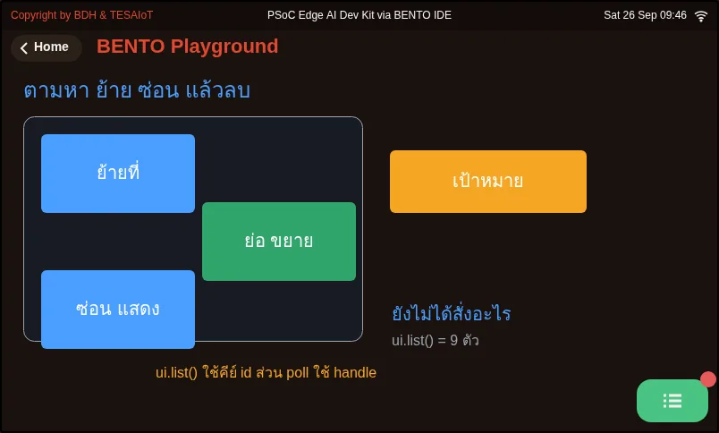<figcaption><a href="examples/07_find_move_hide_delete.py"><code>07_find_move_hide_delete.py</code></a> Managing a widget you already created</figcaption></figure>
<figure>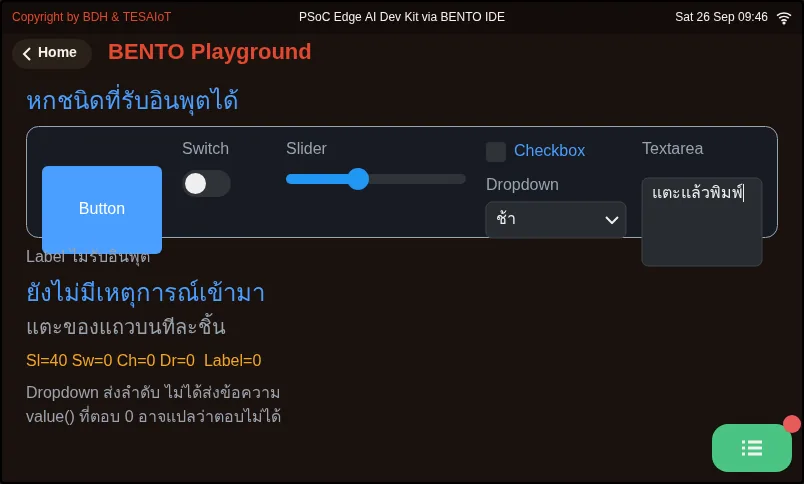<figcaption><a href="examples/08_dropdown_textarea.py"><code>08_dropdown_textarea.py</code></a> Three more types that take input, and the values you can actually ask back</figcaption></figure>
<figure>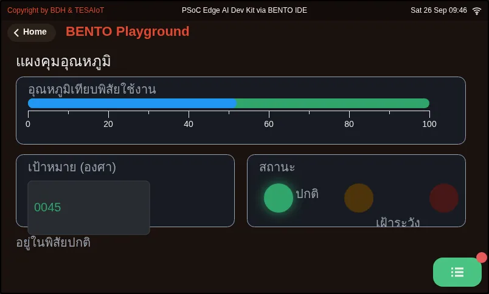<figcaption><a href="examples/09_scale_led_spinbox.py"><code>09_scale_led_spinbox.py</code></a> Three widgets that separate an HMI screen from a toy screen</figcaption></figure>
<figure>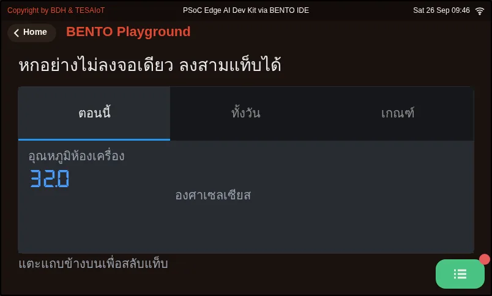<figcaption><a href="examples/10_tabview_second_screen.py"><code>10_tabview_second_screen.py</code></a> A second screen without writing a second program</figcaption></figure>
<figure>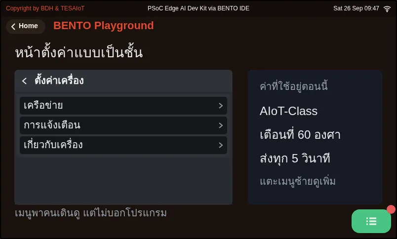<figcaption><a href="examples/11_menu_settings_tree.py"><code>11_menu_settings_tree.py</code></a> A second kind of second screen, when items are not all equal</figcaption></figure>
<figure>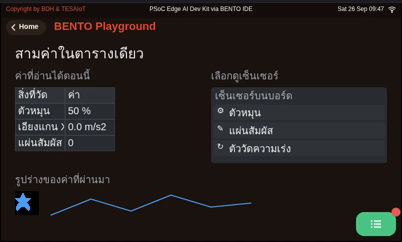<figcaption><a href="examples/12_table_and_list.py"><code>12_table_and_list.py</code></a> Several values at once need a table, not a row of labels</figcaption></figure>
<figure>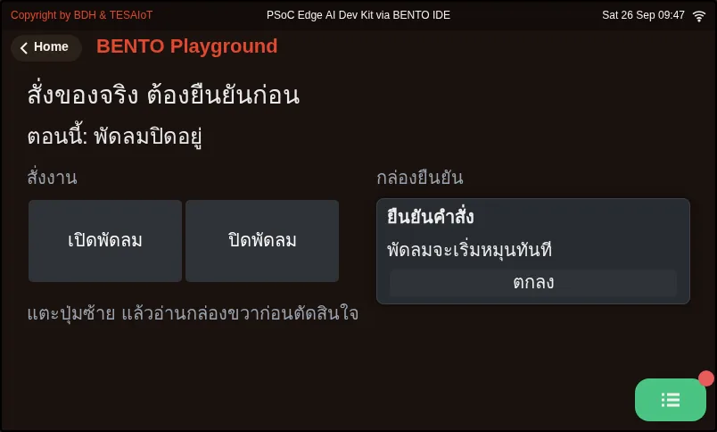<figcaption><a href="examples/13_confirm_before_acting.py"><code>13_confirm_before_acting.py</code></a> A command that moves something real must ask once first</figcaption></figure>
<figure>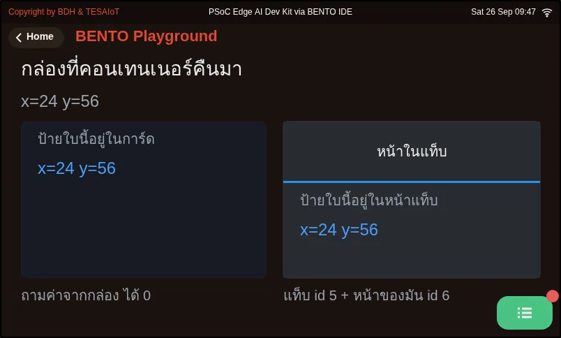<figcaption><a href="examples/14_container_coordinates.py"><code>14_container_coordinates.py</code></a> The handle a container returns, and its coordinate system</figcaption></figure>
<figure>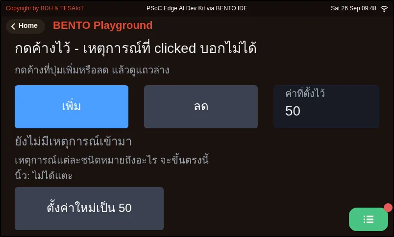<figcaption><a href="examples/15_press_and_hold.py"><code>15_press_and_hold.py</code></a> A button that must be held down, and the event clicked cannot tell you</figcaption></figure>
<figure>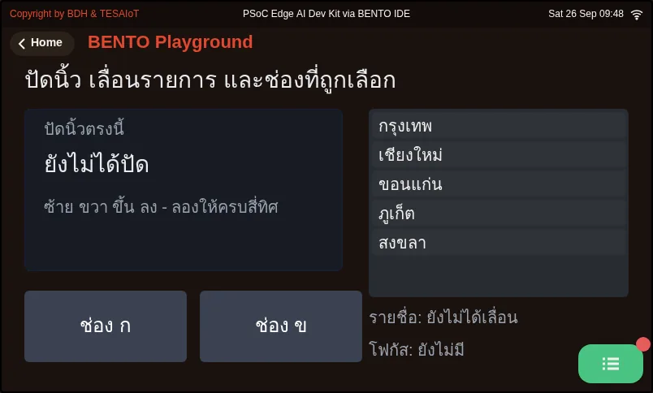<figcaption><a href="examples/16_swipe_scroll_focus.py"><code>16_swipe_scroll_focus.py</code></a> Swiping, scrolling a list, and which field is currently selected</figcaption></figure>
<figure>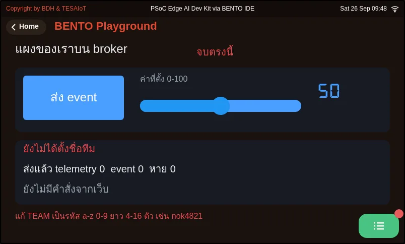<figcaption><a href="examples/17_panel_to_broker.py"><code>17_panel_to_broker.py</code></a> Tap the board&#x27;s screen and a friend&#x27;s web page sees it; command from the web and the bar on screen moves</figcaption></figure>

## Practice

The practice file has six `# เติม:` (fill in) blanks, ordered the way the program actually runs.

- Blank 1: create the "On" button for each row with `btn_on.append(ui.Button("เปิด", ...))`
- Blanks 2–3: inside `set_led()`, command the real LED with `gpio.led(LED_IDX[i]).on()` and `.off()`
- Blanks 4–5: in the event loop, turn `handle` back into a row with `set_led(on_ids.index(h), True)` and `set_led(off_ids.index(h), False)`
- Blank 6: `time.sleep_ms(50)` at the end of the loop

Fill them in one at a time and send to the board each time — never fill in all six and run only once, or you will not know whether it broke at the screen, the LED, or the logic.
After filling in blanks 2–3, try calling `set_led(0, True)` as a single line before the loop; if the LED lights, the hardware side is already correct.

| Practice file | Topic |
|---|---|
| [practice/s04_touch_panel.py](practice/s04_touch_panel.py) | An LED control panel on the touch screen (fill-in version) |

## Solution

Open the solution after trying on your own at least once, and read [how to use the solutions](../../README.md#วิธีใช้เฉลย) first.

| Solution | Goes with |
|---|---|
| [solution/s04_touch_panel.py](solution/s04_touch_panel.py) | [practice/s04_touch_panel.py](practice/s04_touch_panel.py) |

## Check your understanding

The same questions are in [quiz.yaml](quiz.yaml) for automatic marking.

1. In the solution, the "On" button on the red row calls set_led(0, True) instead of a command that toggles the light. What is the main benefit of this design? *(choose one · objective 2)*
   - A) Pressing it any number of times gives the same result; a person who presses again out of uncertainty never gets the opposite of what they intended
   - B) It uses fewer widgets than a toggle button
   - C) You no longer need to call ui.poll() in the loop
   - D) The LED lights faster because it skips the event queue

   

Solution

   **A** — A command that names its destination (idempotent) gives the same result no matter how many times it is pressed, unlike a toggle whose result depends on a previous state the person pressing it cannot see. As for widget count, separate buttons actually use more, not fewer.

   

2. A team has show_status() count lit LEDs by reading gpio.led(n).value(), and finds that the third LED is lit but the screen says it is off. What is the correct fix? *(choose one · objective 2)*
   - A) Keep the commanded state in our own led_on[], and have the screen report from there instead
   - B) Read gpio.led(n).value() twice in a row and use the second reading
   - C) Add time.sleep_ms(200) before reading the value
   - D) Read the state from the colour of the on-screen button instead

   

Solution

   **A** — gpio.led(n).value() reports the pin level, not what we commanded, and returns 0 after hold() or brightness(). The program's truth must therefore live in one place, led_on[], with the screen only reporting from it.

   

3. Put what set_led(i, on) does in the solution into the correct order. *(order · objective 1)*
   - A) Command the real LED with gpio.led(LED_IDX[i])
   - B) Call show_status() so the "n of 3 on" number is correct
   - C) Record the value into led_on[i]
   - D) Make the on-screen status light lamps[i] reflect the real one

   

Solution

   **C → A → D → B** — record first, command the real thing, make the screen reflect it, then report in full. When every path that changes a light passes through this single gate, the screen has no way to disagree with the LEDs.

   

4. A team with a Dev Kit hardcodes LED_IDX = [0, 1, 2], taps "On" on the blue row, and sees no blue LED light. What is the cause? *(choose one · objective 1)*
   - A) The two boards order their LEDs differently; on the Dev Kit blue is LED 3 and LEDs 0-1 are on the module — the index must be looked up by name from gpio.board_info()["led_names"]
   - B) The Dev Kit has no blue LED at all
   - C) The real LED only lights once the on-screen ui.Led has been set to value=1 first
   - D) The third row's button sends a toggled event instead of clicked

   

Solution

   **A** — The Eva Kit and Dev Kit order their LEDs differently, so the solution derives LED_IDX from the names RGB_RED / RGB_GREEN / RGB_BLUE that the board reports, instead of a memorised index number. Every button on this panel sends clicked, with no exception.

   

5. Which statements about the next widgets and events in this lesson are correct? Choose every correct one. *(choose all that apply · objective 3)*
   - A) ui.Scale does not accept .value(); what moves is a ui.Bar placed over it
   - B) value= on ui.Tabview is the height of the tab bar
   - C) .hide() gives the widget's quota back immediately
   - D) clicked arrives from the moment the finger touches down, so it can be used for an accelerating button while held
   - E) long_pressed_repeat must be requested with .listen() first, or the button never sends it at all

   

Solution

   **A, B, E** — Scale is a ruler; Tabview uses value= as the tab bar's height, and a held-down event stays silent until requested with .listen(). .hide() still counts against the quota (only .delete() gives it back), and clicked arrives only after the finger is released.

   

## Lab

**The MVP for lessons 2.4–2.6.** Do this on a real board or the Emulator, and record the results in your learning log.

- [ ] The screen has three rows, each with a status light, an "On" button and an "Off" button. The right-side card shows "n of 3 on", "turn all on" and "turn all off" buttons, and a status line beside the heading
- [ ] Tapping "On" on any row lights the real LED that colour on the board; tapping "Off" turns it off, and pressing "On" ten times in a row gives the same result as pressing it once
- [ ] "Turn all on" lights all three colours; "Turn all off" opens a confirmation box first — confirming turns everything off, and pressing "no" leaves the lights unchanged
- [ ] The on-screen lights, the "n of 3 on" count and the status line all match the real LEDs in every tested case, including after "turn all off" (this is the item most teams miss, so always test it last)
- [ ] Attach a photo or a clip that shows both the screen and the LEDs in the same frame

## Going further

Team homework: pick one of the four extensions in the slides — a START/STOP button for a chase using a flag variable, a press counter with a RESET button,
a LOCK switch that disables every button, or the real button `gpio.button(0)` working alongside the on-screen buttons with debounce taken care of.
All four run on the same event loop — never sleep-wait long enough to make other buttons untappable, and on the Dev Kit, never flip a switch on the base, since several of them are power-cutoff switches.
Lesson 2.7 reverses direction, from "the screen commands hardware" to a knob and a touch pad commanding the screen.

Next lesson: [Lesson 2.7 — Analog and touch: the ADC, the potentiometer and CapSense](../l07-adc-capsense/README.md)

## Reflect

- If the command to turn on a light came from the internet instead of a finger, which part of the code would need to change, which part would not need to change at all, and how would we know the command really arrived?
- In your team's own work, what data must always be visible, and if the screen has tabs, is that data already living outside all of them?
