<style>
section { font-size: 24px; padding: 40px 52px; justify-content: flex-start; }
section h1 { font-size: 1.45em; line-height: 1.12; margin: 0 0 .22em; }
section h2 { font-size: 1.12em; margin: .15em 0; }
section h3 { font-size: 1.0em; margin: .12em 0; }
section p, section li { margin: .16em 0; line-height: 1.32; }
section img { max-width: 100%; height: auto; }
section svg { max-height: 330px; width: 100%; }
section table { font-size: .78em; }
section pre { font-size: .70em; line-height: 1.32; background:#0d1117; color:#e6edf3; border:1px solid #30363d; border-radius:8px; padding:12px 16px; box-shadow:0 2px 8px rgba(0,0,0,.25); }
section pre code { white-space: pre-wrap; background:transparent; color:inherit; } section pre .hljs-comment{color:#8b949e;font-style:italic} section pre .hljs-keyword,section pre .hljs-built_in,section pre .hljs-literal{color:#ff7b72} section pre .hljs-string{color:#a5d6ff} section pre .hljs-number{color:#79c0ff} section pre .hljs-title,section pre .hljs-title.function_,section pre .hljs-section{color:#d2a8ff} section pre .hljs-meta{color:#ffa657} section pre .hljs-attr,section pre .hljs-attribute,section pre .hljs-name{color:#7ee787}
section blockquote { margin: .25em 0; font-size: .92em; }
/* two images on a line (parity / 2x2 grids) stay side-by-side and small */
section p > img + img { margin-left: 10px; }
/* scroll-within-slide: dense slides scroll instead of clipping */
section { overflow-y: auto; overflow-x: hidden; }
section::-webkit-scrollbar { width: 11px; }
section::-webkit-scrollbar-thumb { background:#4a90d9; border-radius:6px; }
section::-webkit-scrollbar-track { background:rgba(0,0,0,.06); }
/* image drop-shadow + cover-slide readability (auto) */
section img{filter:drop-shadow(0 3px 12px rgba(0,0,0,.5))}
/* พื้นสำรองของสไลด์ปก: ถ้า img/cover_sNN.svg โหลดไม่ขึ้น ธีมจะคืนพื้นขาว
   แล้วตัวอักษรสีขาวของปกจะหายไปทั้งแผ่น — ปักสีเข้มไว้ให้ภาพเป็นแค่ของประดับ */
section.cover{background-color:#0b1426}
section.cover *{color:#fff !important}
section.cover h1,section.cover h2,section.cover h3,section.cover p,section.cover li,section.cover strong,section.cover em,section.cover blockquote,section.cover div{text-shadow:0 2px 9px rgba(0,0,0,.92),0 0 3px rgba(0,0,0,.8)}
section.cover div[style*="background:#"],section.cover div[style*="background: #"]{background:rgba(10,14,20,.66) !important;border-color:rgba(120,200,255,.45) !important;max-width:62%}
section.cover blockquote{border-left:4px solid rgba(120,200,255,.6) !important;background:rgba(13,17,23,.55) !important;border-radius:6px;padding:.3em .6em}
section.cover h1,section.cover h2,section.cover h3,section.cover p,section.cover blockquote{max-width:60%}
section.cover div:not(:has(img)){max-width:62%}
section.cover img{filter:none}
</style>


<!-- _class: cover -->

# บทเรียน 2.6 — ลงมือทำ: แผงควบคุมสัมผัสของเรา และ widget ขั้นต่อไป

## สร้าง Touch UI ควบคุมฮาร์ดแวร์ · แผงควบคุมของทีมเราเอง: แตะบนจอแล้วไฟจริงติด

**โมดูล 2 — จากจอสู่ฮาร์ดแวร์**

> ต่อจากบทเรียน 2.5 — event loop: แตะจอแล้วไฟจริงติด

---

## MVP checkpoint — ผ่านชุดบทเรียนนี้เมื่อ


**แผงควบคุม LED สามสี (แดง เขียว น้ำเงิน — ดัชนีดวงถามจากชื่อที่บอร์ดรายงาน) แถวละ ไฟสถานะ + ปุ่มเปิด + ปุ่มปิด พร้อมปุ่มเปิดทั้งหมด / ปิดทั้งหมด โดยสถานะบนจอตรงกับ LED เสมอ**

แปลเป็นสิ่งที่ตรวจได้จริง (ตรงกับหกช่องว่างใน [`s04_touch_panel.py`](https://github.com/tesaiot/tesa-qualification-program/blob/main/courses/aiot-micropython/m02-ui-to-hardware/l06-touch-panel-lab/practice/s04_touch_panel.py)):

- [ ] จอมีสามแถว แถวละ ไฟสถานะ + ปุ่ม "เปิด" + ปุ่ม "ปิด" · การ์ดขวามีตัวเลข "ติดอยู่ n จาก 3 ดวง" + ปุ่ม "เปิดทั้งหมด" + "ปิดทั้งหมด" · บรรทัดสถานะข้างหัวเรื่อง
- [ ] แตะ "เปิด" แถวไหน **หลอดไฟจริงบนบอร์ด** ติดสีนั้น แตะ "ปิด" แล้วดับ — กด "เปิด" ซ้ำสิบครั้ง ผลเท่ากดครั้งเดียว
- [ ] "เปิดทั้งหมด" ติดครบสามสี · "ปิดทั้งหมด" **เปิดกล่องยืนยันก่อน** ยืนยันแล้วดับหมด · "ไม่ปิด" แล้วไฟไม่เปลี่ยน
- [ ] ไฟสถานะบนจอ ตัวเลข "ติดอยู่ n จาก 3" และบรรทัดสถานะ ตรงกับหลอดจริงในทุกกรณีที่ทดสอบ รวมทั้งหลัง "ปิดทั้งหมด"
- [ ] ถ่ายรูปหรือคลิปที่เห็นทั้งจอและหลอดไฟในเฟรมเดียวกัน

> เกณฑ์ข้อที่สี่คือข้อที่ตกกันมากที่สุด ทดสอบมันเป็นข้อสุดท้ายเสมอ

---

## กับดักที่เจอบ่อย

<style scoped>
section table { font-size: .50em; }
section table td, section table th { padding: .06em .4em; line-height: 1.22; }
section blockquote { font-size: .78em; margin: .1em 0; }
</style>

| อาการ | สาเหตุที่แท้จริง | วิธีแก้ |
|---|---|---|
| จอว่างราว 2 วินาทีหลังส่งโค้ด | ไม่ได้เรียก `ui.poll()` (กฎข้อ 1) | เรียก `ui.poll()` ทุกรอบ |
| จอกระตุก อัปเดตไม่ครบ | ลูปเร็วเกินไป เฟรมถูกทิ้ง (กฎข้อ 5) | ใส่ `time.sleep_ms(50)` ท้ายลูป |
| CPU ร้อน จอหน่วง | ลูปไม่มี sleep เลย (กฎข้อ 2) | 50 ms สำหรับ UI เบา · 200 ms แดชบอร์ด |
| `RuntimeError: ui: max 64 widgets` | สร้าง widget เกินเพดานเฟิร์มแวร์ 64 หรือของเก่าค้าง (กฎข้อ 3 — งบของคอร์สคือ 32) | `ui.screen()` ต้นสคริปต์ แล้วนับ widget ใหม่ |
| ค่าเซนเซอร์ค้างหลังเริ่มใช้ `ui` | auto-task ถูกหยุดตั้งแต่ `ui.*` ครั้งแรก (กฎข้อ 4) | อ่านเซนเซอร์เองในลูป |
| ตัวหนังสือบน Label ผิดขนาด | `value=` คือขนาดฟอนต์ ไม่ใช่ค่า | ใช้เฉพาะ 14/16/20/24/28 |
| กดปุ่มแล้วไม่มีอะไรเกิดขึ้น | ลืมเก็บ `.id()` หรือเทียบ `handle` ผิด | `on_ids = [b.id() for b in btn_on]` แล้วเทียบ `h in on_ids` |
| กล่องยืนยันปิดแล้ว แต่บรรทัดสถานะหายไป | `status.hide()` ตอนกล่องเปิด แล้วลืม `show()` ในกิ่งที่ปิดกล่อง | ทุกกิ่งที่ปิดกล่อง (ยืนยัน และ ไม่ปิด) ต้อง `status.show()` |
| ไฟดวงที่สามติดแต่สถานะบอกว่าดับ | ไปอ่าน `gpio.led(n).value()` ซึ่งคืน 0 หลัง `hold()` (และหลัง `brightness()` ค่ากลางบนดวงที่ไม่มี PWM) | เก็บสถานะไว้ใน `led_on[]` ของเราเอง |
| ปุ่มบนจอทำงาน แต่ไฟที่ติดเป็นคนละสีกับปุ่ม หรือมองไม่เห็นดวงไหนติดเลย | ใช้เลขดวงที่จำมาแทนที่จะถามบอร์ด — สองบอร์ดเรียงดวงไม่เหมือนกัน และ Dev Kit ดวง 0-1 อยู่บนโมดูล | ให้ `LED_IDX` มาจากชื่อใน `gpio.board_info()["led_names"]` แบบในเฉลย |
| กลับจากเมนูอื่นแล้วจอว่าง | ออกจากหน้า Playground = widget ถูกทำลาย | ส่งโค้ดใหม่ และอยู่หน้า Playground ตลอด |

> ห้าแถวแรกคือกฎเหล็กห้าข้อในรูปของอาการจริงที่จะเจอ อ่านซ้ำก่อนเริ่มเขียน

---

## ลงมือทำ — เติมช่องว่างในไฟล์ฝึก

เปิด [`s04_touch_panel.py`](https://github.com/tesaiot/tesa-qualification-program/blob/main/courses/aiot-micropython/m02-ui-to-hardware/l06-touch-panel-lab/practice/s04_touch_panel.py) มีช่องว่างให้เติม 6 จุด

<div style="display:flex;gap:20px;align-items:flex-start">
<div style="flex:1 1 56%">

```python
for i in range(len(LED_IDX)):
    # เติม: btn_on.append(ui.Button("เปิด", x=184, y=y, w=144, h=88, color=0x30A46C, value=20))
    pass
    btn_off.append(ui.Button("ปิด", x=360, y=y, w=144, h=88, color=0x3A4150, value=20))

def set_led(i, on):
    led_on[i] = on
    if on:
        # เติม: gpio.led(LED_IDX[i]).on()
        pass
        lamps[i].value(1)
    else:
        # เติม: gpio.led(LED_IDX[i]).off()
        pass
        lamps[i].value(0)

if h in on_ids:
    # เติม: set_led(on_ids.index(h), True)
    pass
elif h in off_ids:
    # เติม: set_led(off_ids.index(h), False)
    pass
```

</div>
<div style="flex:0 0 40%">
<svg viewBox="0 0 400 300" xmlns="http://www.w3.org/2000/svg">
  <text x="200" y="24" text-anchor="middle" font-size="19" font-weight="700" fill="#37474f">เติมแล้วต้องเห็นอะไร</text>
  <line x1="40" y1="60" x2="40" y2="250" stroke="#cfd8dc" stroke-width="7" stroke-linecap="round"/>
  <g stroke-dashoffset="190"><animate attributeName="stroke-dashoffset" values="190;0;0" dur="6s" repeatCount="indefinite"/><line x1="40" y1="60" x2="40" y2="250" stroke="#2e7d32" stroke-width="7" stroke-linecap="round" stroke-dasharray="190"/></g>
  <circle cx="40" cy="60" r="13" fill="#2e7d32"/>
  <circle cx="40" cy="155" r="13" fill="#2e7d32"/>
  <circle cx="40" cy="250" r="13" fill="#2e7d32"/>
  <text x="70" y="56" font-size="19" fill="#1b5e20">ท่า 2 เสร็จ</text>
  <text x="70" y="82" font-size="18" fill="#455a64">เห็นปุ่มเปิดครบสามแถว กดยังไม่ทำงาน</text>
  <text x="70" y="151" font-size="19" fill="#1b5e20">ท่า 4 เสร็จ</text>
  <text x="70" y="177" font-size="18" fill="#455a64">เรียก set_led(0, True) แล้วไฟติด</text>
  <text x="70" y="246" font-size="19" fill="#1b5e20">ท่า 6 เสร็จ</text>
  <text x="70" y="272" font-size="18" fill="#455a64">แตะจอแล้วทั้งแผงมีชีวิต</text>
</svg>
</div>
</div>

หกจุดนี้เรียงตามลำดับที่โปรแกรมทำงานจริง เติมจากบนลงล่างแล้วส่งขึ้นบอร์ดทุกครั้ง

> อย่าเติมครบหกจุดแล้วค่อยรันทีเดียว เติมทีละจุดแล้วรัน จะรู้ทันทีว่าจุดไหนพัง

---

## ตัวอย่างของบทเรียน 2.4–2.6 — สามไฟล์แรกทำในบทเรียนให้จบ ที่เหลือเปิดตามอาการ

<style scoped>
section table { font-size: .50em; }
section table td, section table th { padding: .06em .4em; line-height: 1.22; }
section p { margin: .05em 0; font-size: .86em; line-height: 1.26; }
section blockquote { font-size: .78em; margin: .06em 0; }
</style>

**ต้องทำในบทเรียน** · เปิดตามลำดับนี้ ทั้งชุดราว 40 นาที

| ลำดับ · เรื่อง · เวลา | ไฟล์ | ลงมือทำอะไร แล้วจะเข้าใจอะไร |
|---|---|---|
| **1 · วาง widget ตัวแรก** · 10 นาที | [`01_first_widgets.py`](https://github.com/tesaiot/tesa-qualification-program/blob/main/courses/aiot-micropython/m02-ui-to-hardware/l05-event-loop/examples/01_first_widgets.py) | ลองสร้างปุ่มโดยไม่ใส่ `x` กับ `y` ดูสักครั้ง แล้วใส่พิกัดเอง · จะเห็นว่าจอจัดวางให้เองจนข้อความทับกัน และ widget อยู่ค้างจนกว่าจะล้าง |
| **2 · ใครส่ง event อะไร** · 15 นาที | [`02_event_types.py`](https://github.com/tesaiot/tesa-qualification-program/blob/main/courses/aiot-micropython/m02-ui-to-hardware/l05-event-loop/examples/02_event_types.py) | แตะของจริงสี่ตัวแล้วเทียบกับ `type` ที่ไฟล์บอกไว้ล่วงหน้า · จะไม่เสียเวลาทั้งบทเรียนกับ `ui.Checkbox` ที่ส่ง `toggled` ไม่ใช่ `clicked` |
| **3 · จอกับหลอดต้องพูดตรงกัน** · 15 นาที | [`03_switch_matches_led.py`](https://github.com/tesaiot/tesa-qualification-program/blob/main/courses/aiot-micropython/m02-ui-to-hardware/l05-event-loop/examples/03_switch_matches_led.py) | กด ALL OFF แล้วดูว่าสวิตช์บนจอเด้งกลับเองไหม · จะได้แบบแผน "ฟังก์ชันเดียวที่มีสิทธิ์เปลี่ยนสถานะ" ซึ่งคือเกณฑ์ MVP ข้อที่ตกกันมากที่สุด |

**ติดตรงไหน เปิดอันนี้**

| อาการที่เจอ | ไฟล์ที่ตอบอาการนั้น |
|---|---|
| ร่างผังจอไว้แล้ว แต่ไม่รู้ว่าวางได้อีกกี่ตัวก่อนจะชนงบ | [`06_layout_budget.py`](https://github.com/tesaiot/tesa-qualification-program/blob/main/courses/aiot-micropython/m02-ui-to-hardware/l05-event-loop/examples/06_layout_budget.py) — ดูแถบโควตาที่ใช้ไปกี่ในงบคอร์ส 32 (เพดานเฟิร์มแวร์ 64) แล้วลองสร้างตัวที่ 33 ให้เห็นว่าเส้นไหนคือของคอร์ส เส้นไหนคือของบอร์ด แล้วกลับไปนับผังของทีมบนกระดาษก่อนพิมพ์โค้ดบรรทัดแรก |
| อยากได้ทศนิยมแต่จอขึ้นจำนวนเต็ม | [`04_seg7_takes_text.py`](https://github.com/tesaiot/tesa-qualification-program/blob/main/courses/aiot-micropython/m02-ui-to-hardware/l05-event-loop/examples/04_seg7_takes_text.py) — `.value(50)` ได้ `50` ทศนิยมต้องส่งเป็นข้อความ |
| แตะปุ่มแล้วไม่แน่ใจว่าบอร์ดรับไปหรือยัง | [`05_sound_feedback.py`](https://github.com/tesaiot/tesa-qualification-program/blob/main/courses/aiot-micropython/m02-ui-to-hardware/l05-event-loop/examples/05_sound_feedback.py) — เสียงเป็นแบบยิงแล้วลืม จอจึงต้องเป็นพยานแทนหูเสมอ และ `ui.tone()` รับโน้ต MIDI ไม่ใช่เฮิรตซ์ |
| สร้าง widget ไปแล้วแต่อยากย้าย ย่อ ซ่อน หรือลบทิ้งเพื่อคืนโควตา | [`07_find_move_hide_delete.py`](https://github.com/tesaiot/tesa-qualification-program/blob/main/courses/aiot-micropython/m02-ui-to-hardware/l06-touch-panel-lab/examples/07_find_move_hide_delete.py) — `ui.list()` บอกว่ามีอะไรอยู่ `ui.get(id)` เอากลับคืนมาจากเลข แล้ว `.pos()` `.size()` `.show()` `.hide()` `.delete()` ทำงานต่อได้ทันที · `.hide()` ไม่คืนโควตา มีแต่ `.delete()` ที่คืน |
| ต้องใช้ช่องเลือกหรือช่องพิมพ์ แต่ไม่รู้ว่ามันส่ง event แบบไหน | [`08_dropdown_textarea.py`](https://github.com/tesaiot/tesa-qualification-program/blob/main/courses/aiot-micropython/m02-ui-to-hardware/l06-touch-panel-lab/examples/08_dropdown_textarea.py) — `Checkbox` `Dropdown` `Textarea` ครบทั้งสามตัวที่ชุดบทเรียนนี้ไม่ได้ใช้ · `Dropdown` ส่งกลับมาแค่ **ลำดับ** ของตัวเลือก ไม่ได้ส่งข้อความ |

**อ่านเสริมนอกเวลา** — เรื่องนี้อยู่นอกเกณฑ์ผ่านของบทเรียน 2.4–2.6 แต่เป็นแบบแผนที่ทุกแผงควบคุมในโรงงานใช้: [`07_hold_to_confirm.py`](https://github.com/tesaiot/tesa-qualification-program/blob/main/courses/aiot-micropython/shared/usecase/07_hold_to_confirm.py) คำสั่งที่ย้อนกลับไม่ได้ ต้องกดค้างเพื่อยืนยัน พร้อมตัวบอกความคืบหน้าที่ปล่อยมือแล้วยกเลิกได้ และห้ามนับถอยหลังด้วย `sleep` เพราะจะทำให้แตะอย่างอื่นไม่ได้ทั้งช่วง

> สามไฟล์แรกคือของที่ต้องเปิดจริงในบทเรียน ตารางล่างเปิดเฉพาะตอนเจออาการนั้น

---

## เชื่อมโยงรากฐาน — วันนี้เราแตะอะไรไปบ้าง

<svg viewBox="0 0 940 165" xmlns="http://www.w3.org/2000/svg">
  <rect x="16" y="34" width="290" height="106" rx="10" fill="#e0f7fa" stroke="#00838f" stroke-width="2.5"/>
  <text x="161" y="66" text-anchor="middle" font-size="20" font-weight="700" fill="#00838f">สมองกลฝังตัว</text>
  <text x="161" y="96" text-anchor="middle" font-size="18" fill="#006064">event-driven สองคอร์</text>
  <text x="161" y="122" text-anchor="middle" font-size="18" fill="#006064">ทรัพยากรมีเพดานตายตัว</text>
  <rect x="325" y="34" width="290" height="106" rx="10" fill="#e8f5e9" stroke="#2e7d32" stroke-width="2.5"/>
  <text x="470" y="66" text-anchor="middle" font-size="20" font-weight="700" fill="#2e7d32">Python และ CS</text>
  <text x="470" y="96" text-anchor="middle" font-size="18" fill="#1b5e20">list · dict · comprehension</text>
  <text x="470" y="122" text-anchor="middle" font-size="18" fill="#1b5e20">ลูปที่คืนเวลาให้ระบบ</text>
  <rect x="634" y="34" width="290" height="106" rx="10" fill="#f3e5f5" stroke="#6a1b9a" stroke-width="2.5"/>
  <text x="779" y="66" text-anchor="middle" font-size="20" font-weight="700" fill="#6a1b9a">ออกแบบระบบ</text>
  <text x="779" y="96" text-anchor="middle" font-size="18" fill="#4a148c">single source of truth</text>
  <text x="779" y="122" text-anchor="middle" font-size="18" fill="#4a148c">แยกสถานะออกจากการแสดงผล</text>
  <text x="470" y="22" text-anchor="middle" font-size="19" font-weight="700" fill="#37474f">สามเสาที่วันนี้แตะพร้อมกัน</text>
  <text x="470" y="158" text-anchor="middle" font-size="18" fill="#78909c">เสาที่สามคือเสาที่จะยังใช้ได้แม้เปลี่ยนภาษาและเปลี่ยนบอร์ด</text>
</svg>

**ฝั่งระบบสมองกลฝังตัว**
สถาปัตยกรรม event-driven บนระบบสองคอร์ · คิวเหตุการณ์และการ poll ข้ามคอร์ · ข้อจำกัดของทรัพยากรที่มีเพดานตายตัว (64 widgets) · ขา GPIO ที่เขียนได้แต่อ่านไม่ได้

**ฝั่ง Python และวิทยาการคอมพิวเตอร์**
list ของอ็อบเจกต์และ list comprehension · `dict` กับการเข้าถึงด้วยคีย์ · การนิยามฟังก์ชันเพื่อรวมงานที่ต้องทำพร้อมกัน · `.index()` เพื่อ map จาก handle กลับเป็นลำดับ · ลูปที่ไม่มีวันจบกับการคืนเวลาให้ระบบ

**ฝั่งการออกแบบระบบ**
single source of truth · การแยก "สถานะ" ออกจาก "การแสดงผล" · การออกแบบให้ทุกเส้นทางการเปลี่ยนแปลงผ่านประตูเดียว · การทดสอบด้วยการมองสองฝั่งพร้อมกัน

> แนวคิด single source of truth จะกลับมาอีกในบทเรียน 4.4–4.6 ตอนที่คำสั่งมาจาก MQTT แทนที่จะมาจากนิ้ว

---

## งานทำเอง 30% + สรุปบทเรียน

<svg viewBox="0 0 940 160" xmlns="http://www.w3.org/2000/svg">
  <defs><marker id="s4n" markerWidth="9" markerHeight="7" refX="8" refY="3.5" orient="auto">
    <path d="M0,0 L9,3.5 L0,7 z" fill="#455a64" /></marker></defs>
  <rect x="16" y="40" width="170" height="72" rx="9" fill="#e3f2fd" stroke="#1565c0" stroke-width="2" />
  <text x="101" y="72" text-anchor="middle" font-size="19" fill="#0d47a1">สร้าง widget</text>
  <text x="101" y="98" text-anchor="middle" font-size="18" fill="#5472a3">วางตำแหน่งเอง</text>
  <rect x="200" y="40" width="170" height="72" rx="9" fill="#e3f2fd" stroke="#1565c0" stroke-width="2" />
  <text x="285" y="72" text-anchor="middle" font-size="19" fill="#0d47a1">handle</text>
  <text x="285" y="98" text-anchor="middle" font-size="18" fill="#5472a3">.id() เก็บไว้เทียบ</text>
  <rect x="384" y="40" width="170" height="72" rx="9" fill="#e3f2fd" stroke="#1565c0" stroke-width="2" />
  <text x="469" y="72" text-anchor="middle" font-size="19" fill="#0d47a1">event loop</text>
  <text x="469" y="98" text-anchor="middle" font-size="18" fill="#5472a3">poll · dispatch · act</text>
  <rect x="568" y="40" width="170" height="72" rx="9" fill="#e8f5e9" stroke="#2e7d32" stroke-width="2.5" />
  <text x="653" y="72" text-anchor="middle" font-size="19" fill="#1b5e20">จอตรงกับของจริง</text>
  <text x="653" y="98" text-anchor="middle" font-size="18" fill="#4a7c4e">ประตูเดียว</text>
  <rect x="770" y="40" width="154" height="72" rx="9" fill="#fff3e0" stroke="#ef6c00" stroke-width="2.5" />
  <text x="847" y="72" text-anchor="middle" font-size="19" fill="#bf360c">ชุดบทเรียนถัดไป</text>
  <text x="847" y="98" text-anchor="middle" font-size="18" fill="#a1683a">pot + CapSense</text>
  <line x1="742" y1="76" x2="766" y2="76" stroke="#455a64" stroke-width="3" marker-end="url(#s4n)" />
  <text x="470" y="26" text-anchor="middle" font-size="19" font-weight="700" fill="#37474f">สี่อย่างที่ติดมือไปชุดบทเรียนถัดไป</text>
  <text x="470" y="146" text-anchor="middle" font-size="18" fill="#78909c">ชุดบทเรียนถัดไปเปลี่ยนแค่ต้นทางของข้อมูล โครงลูปยังเป็นตัวเดิม</text>
</svg>

**วันนี้เราได้:**<br> สร้าง widget เป็น วางตำแหน่งเป็น และรู้ว่า `value=` คือขนาดฟอนต์ · เข้าใจ handle กับ `.id()` · เขียน event loop ครบวงจร poll → dispatch → act → sleep · ต่อเหตุการณ์บนจอเข้ากับ `gpio.led()` · และที่สำคัญที่สุด รักษาให้จอกับของจริงตรงกันเสมอ

**การบ้านของทีม:** เลือกทำ 1 ข้อจากสี่ข้อในสไลด์ "ต่อยอด" จดลงบันทึกการเรียน

**ชุดบทเรียนถัดไป:** เราจะเพิ่ม input แบบอนาล็อกเข้ามา — หมุนลูกบิด pot และเลื่อนนิ้วบนแถบ CapSense แล้วเอาค่ามาขับ `ui.Bar` บนไม้บรรทัด `ui.Scale` พร้อมรู้จักการกรองสัญญาณรบกวนด้วย `dsp.EMA` · ส่วนขยาย 17 ของวันนี้ทำให้เห็นแล้วว่าค่าหนึ่งค่าบนจอออกไปถึงหน้าเว็บได้อย่างไร ค่าลูกบิดกับแผ่นสัมผัสของชุดบทเรียนหน้าก็เป็นค่าแบบเดียวกัน

> event loop ที่เขียนวันนี้ จะเป็นโครงเดิมของทุกโปรแกรมที่เหลือในคอร์สนี้

---

## เฉลย [`s04_touch_panel.py`](https://github.com/tesaiot/tesa-qualification-program/blob/main/courses/aiot-micropython/m02-ui-to-hardware/l06-touch-panel-lab/solution/s04_touch_panel.py) — ส่วนที่หนึ่ง: เตรียมของ

<style scoped>
section pre { font-size: .44em; line-height: 1.2; }
section p { margin: .04em 0; font-size: .86em; line-height: 1.26; }
section blockquote { font-size: .78em; margin: .06em 0; }
</style>

อ่านให้เข้าใจ **แล้วพิมพ์เอง** อย่าคัดลอกวาง

<div style="display:flex;gap:20px;align-items:flex-start">
<div style="flex:1 1 60%">

```python
import ui
import gpio
import time

BTN_TEXT = ["แดง", "เขียว", "น้ำเงิน"]              # สามสีของแผง เรียงตรงกับ LED_IDX ข้างล่าง
COL_ON = [0xE53935, 0x43A047, 0x1E88E5]           # สีไฟสถานะตอนติด เรียงตรงกับ BTN_TEXT
COL_OFF = 0x171B22                                 # สีเทาของปุ่มที่ไม่ได้กำลังทำงาน
COL_TEXT, COL_DIM, COL_CARD = 0xE8EAED, 0x9AA3AF, 0x171B22

# ดวงจริงของแต่ละสี ถามจากชื่อที่บอร์ดรายงาน
# Dev Kit รายงาน RGB_RED/GREEN/BLUE ครบ -> ใช้ชื่อ
# Eva Kit ไม่ครบ -> ดวง 0 1 2 คือ แดง เขียว น้ำเงิน
LED_NAMES = gpio.board_info()["led_names"]
RGB_NAMES = ("RGB_RED", "RGB_GREEN", "RGB_BLUE")
if all(n in LED_NAMES for n in RGB_NAMES):
    LED_IDX = [LED_NAMES.index(n) for n in RGB_NAMES]
else:
    LED_IDX = [0, 1, 2]

led_on = [False] * len(LED_IDX)   # ความจริงอยู่ที่นี่

ui.screen()
time.sleep_ms(200)
```

</div>
<div style="flex:0 0 38%">
<svg viewBox="0 0 400 300" xmlns="http://www.w3.org/2000/svg">
  <text x="200" y="22" text-anchor="middle" font-size="19" font-weight="700" fill="#37474f">สี่ list ที่เดินด้วยดัชนีเดียว</text>
  <rect x="30" y="34" width="100" height="36" rx="7" fill="#ffebee" stroke="#c62828" stroke-width="2"/>
  <rect x="150" y="34" width="100" height="36" rx="7" fill="#e8f5e9" stroke="#2e7d32" stroke-width="2"/>
  <rect x="270" y="34" width="100" height="36" rx="7" fill="#e3f2fd" stroke="#1565c0" stroke-width="2"/>
  <text x="80" y="59" text-anchor="middle" font-size="17" fill="#8e0000">"แดง"</text>
  <text x="200" y="59" text-anchor="middle" font-size="17" fill="#1b5e20">"เขียว"</text>
  <text x="320" y="59" text-anchor="middle" font-size="17" fill="#0d47a1">"น้ำเงิน"</text>
  <text x="200" y="90" text-anchor="middle" font-size="16" fill="#607d8b">BTN_TEXT</text>
  <rect x="30" y="100" width="100" height="36" rx="7" fill="#e53935"/>
  <rect x="150" y="100" width="100" height="36" rx="7" fill="#43a047"/>
  <rect x="270" y="100" width="100" height="36" rx="7" fill="#1e88e5"/>
  <text x="200" y="156" text-anchor="middle" font-size="16" fill="#607d8b">COL_ON</text>
  <rect x="30" y="166" width="100" height="36" rx="7" fill="#fff8e1" stroke="#f57f17" stroke-width="2"/>
  <rect x="150" y="166" width="100" height="36" rx="7" fill="#fff8e1" stroke="#f57f17" stroke-width="2"/>
  <rect x="270" y="166" width="100" height="36" rx="7" fill="#fff8e1" stroke="#f57f17" stroke-width="2"/>
  <text x="80" y="190" text-anchor="middle" font-size="15" fill="#e65100">Eva 0 · Dev 2</text>
  <text x="200" y="190" text-anchor="middle" font-size="15" fill="#e65100">Eva 1 · Dev 4</text>
  <text x="320" y="190" text-anchor="middle" font-size="15" fill="#e65100">Eva 2 · Dev 3</text>
  <text x="200" y="222" text-anchor="middle" font-size="16" fill="#607d8b">LED_IDX · ถามจากบอร์ด</text>
  <rect x="30" y="232" width="100" height="36" rx="7" fill="#eceff1" stroke="#90a4ae" stroke-width="2"/>
  <rect x="150" y="232" width="100" height="36" rx="7" fill="#eceff1" stroke="#90a4ae" stroke-width="2"/>
  <rect x="270" y="232" width="100" height="36" rx="7" fill="#eceff1" stroke="#90a4ae" stroke-width="2"/>
  <text x="80" y="256" text-anchor="middle" font-size="17" fill="#546e7a">False</text>
  <text x="200" y="256" text-anchor="middle" font-size="17" fill="#546e7a">False</text>
  <text x="320" y="256" text-anchor="middle" font-size="17" fill="#546e7a">False</text>
  <text x="200" y="290" text-anchor="middle" font-size="16" fill="#607d8b">led_on · i เดียวใช้ได้ทั้งสามแถว</text>
</svg>
</div>
</div>

`led_on` ถูกประกาศ **ก่อน** สร้าง widget ใด ๆ เพราะมันคือแกนกลางของโปรแกรม ส่วนจอเป็นแค่ผู้รายงาน · สี่สีบรรทัดที่สี่คือจานสีของหลักสูตร — `COL_OFF` เท่ากับ `COL_CARD` โดยตั้งใจ ปุ่มที่ไม่ได้กำลังทำงานต้องกลืนไปกับพื้น

การเก็บสี ON ของแต่ละสีเป็น list คู่ขนานกับ `BTN_TEXT` ทำให้ทุกอย่างอ้างด้วยดัชนี `i` ตัวเดียวได้ตลอดทั้งไฟล์ — แถวที่ 0 คือแดงทั้งข้อความ ทั้งสี ทั้ง `gpio.led(LED_IDX[0])` · `LED_IDX` คือ list ที่สี่ที่เดินด้วยดัชนีเดียวกัน แต่ค่าข้างในถามจากบอร์ด เพราะ Eva Kit กับ Dev Kit เรียงดวงไม่เหมือนกัน (บน Dev Kit สีน้ำเงินคือดวง 3 ไม่ใช่ 2 และดวง 0-1 อยู่บนโมดูล)

> ข้อมูลที่คู่กันให้เรียงให้ตรงกัน แล้วดัชนีเดียวจะพาเราไปได้ทั้งโปรแกรม

---

## เฉลย — ส่วนที่สอง (1/2): สามแถวของแผง

<style scoped>
section pre { font-size: .44em; line-height: 1.2; }
section p { margin: .04em 0; font-size: .84em; line-height: 1.26; }
section blockquote { font-size: .76em; margin: .06em 0; }
</style>

```python
ui.Label("แผงควบคุม LED ของทีม", x=24, y=8, color=COL_TEXT, value=28)
status = ui.Label("พร้อมรับคำสั่ง", x=360, y=12, color=COL_DIM, value=20)
...
ROW_TOP = 52           # ขอบบนของแถวแรก
ROW_PITCH = 120        # ปุ่มสูง 88 + ระยะระหว่างเป้าสัมผัส 32 = 120
lamps = []
btn_on = []
btn_off = []
for i in range(len(LED_IDX)):
    y = ROW_TOP + i * ROW_PITCH
    lamps.append(ui.Led(x=24, y=y + 20, w=48, h=48, color=COL_ON[i], value=0))
    ui.Label(BTN_TEXT[i], x=88, y=y + 32, color=COL_DIM, value=16)
    btn_on.append(ui.Button("เปิด", x=184, y=y, w=144, h=88, color=0x30A46C, value=20))
    btn_off.append(ui.Button("ปิด", x=360, y=y, w=144, h=88, color=0x3A4150, value=20))
...
on_ids = [b.id() for b in btn_on]
off_ids = [b.id() for b in btn_off]
```

<div style="display:flex;gap:16px;align-items:flex-start">
<div style="flex:0 0 330px">
<svg viewBox="0 0 400 300" xmlns="http://www.w3.org/2000/svg">
  <text x="200" y="26" text-anchor="middle" font-size="19" font-weight="700" fill="#37474f">หน้าตาจริงหลังท่านี้</text>
  <rect x="14" y="38" width="372" height="212" rx="10" fill="#101820" stroke="#4a90d9" stroke-width="2"/>
  <text x="30" y="62" font-size="18" fill="#ffffff">แผงควบคุม LED ของทีม</text>
  <text x="250" y="62" font-size="14" fill="#9aa3af">พร้อมรับคำสั่ง</text>
  <circle cx="42" cy="88" r="10" fill="#4a1a1a" stroke="#8e3b3b"/>
  <circle cx="42" cy="130" r="10" fill="#1a3a22" stroke="#3b7a4a"/>
  <circle cx="42" cy="172" r="10" fill="#16304a" stroke="#3b5f8e"/>
  <text x="62" y="94" font-size="16" fill="#a0b4cc">แดง</text>
  <text x="62" y="136" font-size="16" fill="#a0b4cc">เขียว</text>
  <text x="62" y="178" font-size="16" fill="#a0b4cc">น้ำเงิน</text>
  <g fill="#30a46c"><rect x="126" y="74" width="70" height="30" rx="6"/><rect x="126" y="116" width="70" height="30" rx="6"/><rect x="126" y="158" width="70" height="30" rx="6"/></g>
  <g fill="#3a4150"><rect x="204" y="74" width="70" height="30" rx="6"/><rect x="204" y="116" width="70" height="30" rx="6"/><rect x="204" y="158" width="70" height="30" rx="6"/></g>
  <text x="161" y="95" text-anchor="middle" font-size="16" fill="#ffffff">เปิด</text>
  <text x="239" y="95" text-anchor="middle" font-size="16" fill="#ffffff">ปิด</text>
  <text x="161" y="137" text-anchor="middle" font-size="16" fill="#ffffff">เปิด</text>
  <text x="239" y="137" text-anchor="middle" font-size="16" fill="#ffffff">ปิด</text>
  <text x="161" y="179" text-anchor="middle" font-size="16" fill="#ffffff">เปิด</text>
  <text x="239" y="179" text-anchor="middle" font-size="16" fill="#ffffff">ปิด</text>
  <rect x="288" y="74" width="84" height="112" rx="6" fill="#171b22" stroke="#3a4150" stroke-dasharray="4 3"/>
  <text x="330" y="134" text-anchor="middle" font-size="13" fill="#78909c">การ์ดขวา (2/2)</text>
  <text x="200" y="272" text-anchor="middle" font-size="18" fill="#607d8b">หัวเรื่อง 2 + ไฟสถานะ 3 + ป้าย 3 + ปุ่มสีละคู่ 6</text>
  <text x="200" y="294" text-anchor="middle" font-size="18" fill="#78909c">= 14 widget หลังท่านี้</text>
</svg>
</div>
<div style="flex:1 1 auto">

**ทำไมเลิกใช้ `ui.Switch` ตัวเดียวคุมสามสี** — สวิตช์คือปุ่มสลับ และปุ่มสลับบอกไม่ได้ว่าตอนนี้อยู่สถานะไหน คนกดต้องอ่านจากที่อื่นแล้วเดา แผงควบคุมจริงจึงแยก **ปุ่มเปิด** กับ **ปุ่มปิด** เสมอ ปุ่ม "เปิด" ที่กดซ้ำสิบครั้งได้ผลเดียวกับกดครั้งเดียว ซึ่งสำคัญมากตอนคนกดซ้ำเพราะไม่แน่ใจ

**ไฟสถานะแยกจากปุ่ม** ไม่ใช่ให้ปุ่มเปลี่ยนสีเอง เพราะสองอย่างนี้คนละหน้าที่ — ไฟตอบว่า "ตอนนี้เป็นยังไง" ปุ่มตอบว่า "สั่งอะไรได้" และไฟผ่านการทดสอบขาวดำ ส่วนปุ่มที่เปลี่ยนสีไม่ผ่าน · ปุ่มสูง 88 และห่างกัน 32 ตามระยะนิ้วจริง ปุ่มเปิดใช้สีสถานะ ok `0x30A46C` ปุ่มปิดใช้สีปุ่มรอง `0x3A4150`

> ทุกอย่างในแถวอ้างด้วย `i` ตัวเดียว — ข้อความ สี ไฟ ปุ่ม และดวงจริง `LED_IDX[i]`

</div>
</div>

---

## เฉลย — ส่วนที่สอง (2/2): การ์ดคำสั่งทั้งชุด และกล่องยืนยันที่สร้างแล้วซ่อน

<style scoped>
section pre { font-size: .48em; line-height: 1.22; }
section p { margin: .05em 0; font-size: .88em; line-height: 1.28; }
section blockquote { font-size: .78em; margin: .06em 0; }
</style>

```python
ui.Panel(x=520, y=48, w=248, h=308, color=COL_CARD, min=COL_DIM, max=12, value=1)
lbl_count = ui.Label("ติดอยู่ 0 จาก " + str(len(LED_IDX)) + " ดวง", x=536, y=60,
                     color=COL_TEXT, value=20)
ui.Label("คำสั่งทั้งชุด", x=536, y=96, color=COL_DIM, value=16)
btn_all_on = ui.Button("เปิดทั้งหมด", x=536, y=132, w=216, h=88, color=0x30A46C, value=20)
btn_all_off = ui.Button("ปิดทั้งหมด", x=536, y=252, w=216, h=88, color=0x3A4150, value=20)
...
box = ui.MsgBox("ปิดทั้งหมด\nไฟทุกสีจะดับพร้อมกัน", x=48, y=88, w=496, h=160,
                color=COL_CARD)
btn_yes = ui.Button("ปิดทั้งหมด", x=568, y=88, w=152, h=88, color=0x3A4150, value=20)
btn_no = ui.Button("ไม่ปิด", x=568, y=208, w=152, h=88, color=0x3A4150, value=20)
box.hide()
btn_yes.hide()
btn_no.hide()
```

นับ widget กันชัด ๆ ทั้งหน้า: หัวเรื่อง 1 + บรรทัดสถานะ 1 + ไฟสถานะ 3 + ป้ายชื่อสี 3 + ปุ่มเปิด 3 + ปุ่มปิด 3 + การ์ดขวา 1 + ป้ายบนการ์ด 2 + คำสั่งชุด 2 + กล่องยืนยันกับปุ่มคำตอบ 3 = **22 ตัว** — ต่ำกว่างบของคอร์ส 32 (เพดานเฟิร์มแวร์ 64) เหลือที่ให้การบ้านต่อยอด

ปุ่มล่างของการ์ดจบที่ y=340 พอดี ต่ำกว่านั้นคือมุมที่ปุ่ม Console จองไว้ · กล่องยืนยันกับปุ่มคำตอบสองปุ่ม **สร้างพร้อมหน้าจอแล้วซ่อนไว้** ไม่ใช่สร้างตอนกด — การสร้างของตอนคนกำลังรอคำตอบ คือการเพิ่มความหน่วงในจังหวะที่แย่ที่สุด · คำในกล่องบอก **สิ่งที่จะเกิด** ไม่ใช่ถามลอย ๆ ว่า "แน่ใจไหม" · ปุ่มคำตอบเป็น `ui.Button` จริงสองปุ่ม เพราะ `MsgBox` ของเฟิร์มแวร์นี้มีแค่หัวเรื่องกับเนื้อความ (บรรทัดแรกของ `text` คือหัวเรื่อง) ไม่มีปุ่มคำตอบในตัว (`ui_widget_mgr.c:1849-1880`)

> ทุกครั้งที่ออกแบบหน้าใหม่ ให้นับ widget บนกระดาษก่อนพิมพ์ ไม่ใช่ไปเจอ RuntimeError ตอนรัน

---

## เฉลย — ส่วนที่สาม: หัวใจของความตรงกัน

<div style="display:flex;gap:20px;align-items:flex-start">
<div style="flex:1 1 58%">

```python
def show_status():
    n = 0
    for i in range(len(LED_IDX)):
        if led_on[i]:
            n += 1
    lbl_count.text("ติดอยู่ " + str(n) + " จาก " + str(len(LED_IDX)) + " ดวง")

def set_led(i, on):
    # i คือแถวของแผง (0 แดง 1 เขียว 2 น้ำเงิน) ดวงจริงอยู่ที่ LED_IDX[i]
    led_on[i] = on              # 1) จำไว้ก่อน
    if on:
        gpio.led(LED_IDX[i]).on()   # 2) สั่งของจริง
        lamps[i].value(1)       # 3) ไฟบนจอสะท้อนของจริง
    else:
        gpio.led(LED_IDX[i]).off()
        lamps[i].value(0)       # หรี่ ไม่ใช่หาย
    show_status()               # 4) รายงานให้ครบ

for i in range(len(LED_IDX)):
    set_led(i, False)           # เริ่มจากที่รู้แน่
```

</div>
<div style="flex:0 0 38%">
<svg viewBox="0 0 380 300" xmlns="http://www.w3.org/2000/svg">
  <text x="190" y="26" text-anchor="middle" font-size="19" font-weight="700" fill="#37474f">ทำไมต้องสั่งดับตอนเริ่ม</text>
  <rect x="20" y="44" width="340" height="94" rx="9" fill="#fff3e0" stroke="#ef6c00" stroke-width="2.5"/>
  <text x="190" y="74" text-anchor="middle" font-size="18" fill="#bf360c">สภาพที่เจอตอนโปรแกรมเริ่ม</text>
  <circle cx="120" cy="108" r="17" fill="#ff5252"/>
  <circle cx="190" cy="108" r="17" fill="#5d4037"/>
  <circle cx="260" cy="108" r="17" fill="#ff5252"/>
  <text x="190" y="158" text-anchor="middle" font-size="18" fill="#78909c">ทีมก่อนหน้าทิ้งไฟติดค้างไว้</text>
  <text x="190" y="184" text-anchor="middle" font-size="20" font-weight="700" fill="#2e7d32">set_led(i, False) ทุกแถว</text>
  <rect x="20" y="198" width="340" height="80" rx="9" fill="#e8f5e9" stroke="#2e7d32" stroke-width="2.5"/>
  <circle cx="120" cy="238" r="17" fill="#5d4037"/>
  <circle cx="190" cy="238" r="17" fill="#5d4037"/>
  <circle cx="260" cy="238" r="17" fill="#5d4037"/>
  <text x="190" y="296" text-anchor="middle" font-size="18" fill="#1b5e20">ดับจริง และจอรายงานว่าดับ</text>
</svg>
</div>
</div>

ลูปสามบรรทัดสุดท้ายมีความหมายมากกว่าที่เห็น — เราไม่ได้ *สมมติ* ว่าไฟดับตอนเริ่ม แต่เรา **สั่งให้มันดับ** แล้วให้จอรายงานตามนั้น ถ้าโปรแกรมก่อนหน้าทิ้งไฟติดค้างไว้ บรรทัดนี้จะเก็บกวาดให้เอง

> โปรแกรมที่ดีไม่เชื่อสภาพเริ่มต้นที่ตัวเองไม่ได้เป็นคนกำหนด

---

## เฉลย — ส่วนที่สี่: ลูปเหตุการณ์

<style scoped>
section pre { font-size: .46em; line-height: 1.2; }
section p { margin: .04em 0; font-size: .86em; line-height: 1.26; }
section blockquote { font-size: .78em; margin: .06em 0; }
</style>

<div style="display:flex;gap:20px;align-items:flex-start">
<div style="flex:1 1 56%">

```python
while True:
    for ev in ui.poll():
        h = ev['handle']
        t = ev['type']
        if t != 'clicked':
            continue
        if h in on_ids:
            set_led(on_ids.index(h), True)
        elif h in off_ids:
            set_led(off_ids.index(h), False)
        elif h == btn_all_on.id():
            for i in range(len(LED_IDX)):
                set_led(i, True)
        elif h == btn_all_off.id() and not asking:
            asking = True
            box.show()
            btn_yes.show()
            btn_no.show()
        elif h == btn_yes.id() and asking:
            asking = False
            for i in range(len(LED_IDX)):
                set_led(i, False)
            box.hide()
            btn_yes.hide()
            btn_no.hide()
    time.sleep_ms(50)
```

</div>
<div style="flex:0 0 40%">
<svg viewBox="0 0 400 300" xmlns="http://www.w3.org/2000/svg">
  <text x="200" y="26" text-anchor="middle" font-size="19" font-weight="700" fill="#37474f">ทำไมไม่ใช้ปุ่มเดียวสลับ</text>
  <rect x="24" y="44" width="352" height="76" rx="8" fill="#ffebee" stroke="#c62828" stroke-width="2"/>
  <text x="200" y="70" text-anchor="middle" font-size="18" fill="#8e0000">ปุ่มเดียวเขียนว่า "สลับ"</text>
  <text x="200" y="94" text-anchor="middle" font-size="18" fill="#8e0000">คนกดต้องรู้ก่อนว่าตอนนี้เปิดหรือปิด</text>
  <text x="200" y="114" text-anchor="middle" font-size="17" fill="#8e0000">เดาผิดเมื่อไร ก็สั่งตรงข้ามกับที่ตั้งใจ</text>
  <rect x="24" y="134" width="352" height="76" rx="8" fill="#e8f5e9" stroke="#2e7d32" stroke-width="2"/>
  <text x="200" y="160" text-anchor="middle" font-size="18" fill="#1b5e20">สองปุ่มแยกกัน เปิด กับ ปิด</text>
  <text x="200" y="184" text-anchor="middle" font-size="18" fill="#1b5e20">กดซ้ำสิบครั้ง ได้ผลเท่ากดครั้งเดียว</text>
  <text x="200" y="204" text-anchor="middle" font-size="17" fill="#1b5e20">ไม่ต้องรู้สถานะก่อนกด</text>
  <text x="200" y="240" text-anchor="middle" font-size="18" fill="#455a64">ทุกปุ่มส่ง 'clicked' เหมือนกันหมด</text>
  <text x="200" y="266" text-anchor="middle" font-size="18" fill="#455a64">จึงต้องเทียบ handle ควบไปด้วยเสมอ</text>
</svg>
</div>
</div>

`set_led(on_ids.index(h), True)` **สั่งเปิด ไม่ใช่สั่งสลับ** — คำสั่งที่ระบุปลายทางแบบนี้เรียกว่า idempotent กดซ้ำกี่ครั้งก็ได้ผลเดิม ต่างจากคำสั่งสลับที่ผลขึ้นกับสถานะก่อนหน้า ซึ่งเป็นสิ่งที่คนกดมองไม่เห็น · ทุกปุ่มส่ง `'clicked'` เหมือนกันหมด จึงกรอง `type` ทิ้งรอบเดียวข้างบน แล้วแยกด้วย **`handle`** อย่างเดียว — สั้นกว่าและพลาดยากกว่าการเช็กควบสองอย่างทุกกิ่ง

`ปิดทั้งหมด` เป็นกิ่งเดียวที่ไม่ลงมือทันที มันเปิดกล่องยืนยันก่อน เพราะแตะทีเดียวเปลี่ยนของจริงสามชิ้นพร้อมกัน และคำยืนยันบอก **สิ่งที่จะเกิด** ว่า "ไฟทุกสีจะดับพร้อมกัน" ไม่ใช่ถามลอย ๆ ว่า "แน่ใจไหม"

> `while True` ที่ไม่มี `time.sleep_ms()` คือบั๊กที่ไม่แสดงตัวเป็น error แต่ทำให้ทั้งระบบช้าลง

---

## เฉลย · ทำไมเรียงหกท่าแบบนี้ ไม่ใช่สุ่มเรียง

<svg viewBox="0 0 940 180" xmlns="http://www.w3.org/2000/svg">
  <g fill="#e3f2fd"><animate attributeName="fill" values="#e3f2fd;#90caf9;#e3f2fd" dur="5s" begin="0s" repeatCount="indefinite"/><rect x="20" y="102" width="170" height="48" rx="7" stroke="#1565c0" stroke-width="2"/></g>
  <g fill="#e3f2fd"><animate attributeName="fill" values="#e3f2fd;#90caf9;#e3f2fd" dur="5s" begin="1s" repeatCount="indefinite"/><rect x="202" y="82" width="170" height="68" rx="7" stroke="#1565c0" stroke-width="2"/></g>
  <g fill="#e8f5e9"><animate attributeName="fill" values="#e8f5e9;#a5d6a7;#e8f5e9" dur="5s" begin="2s" repeatCount="indefinite"/><rect x="384" y="62" width="170" height="88" rx="7" stroke="#2e7d32" stroke-width="2"/></g>
  <g fill="#e8f5e9"><animate attributeName="fill" values="#e8f5e9;#a5d6a7;#e8f5e9" dur="5s" begin="3s" repeatCount="indefinite"/><rect x="566" y="42" width="170" height="108" rx="7" stroke="#2e7d32" stroke-width="2"/></g>
  <g fill="#f3e5f5"><animate attributeName="fill" values="#f3e5f5;#ce93d8;#f3e5f5" dur="5s" begin="4s" repeatCount="indefinite"/><rect x="748" y="22" width="170" height="128" rx="7" stroke="#6a1b9a" stroke-width="2"/></g>
  <text x="105" y="132" text-anchor="middle" font-size="18" fill="#0d47a1">1 ล้างจอ</text>
  <text x="287" y="132" text-anchor="middle" font-size="18" fill="#0d47a1">2-3 แผงกับปุ่ม</text>
  <text x="469" y="132" text-anchor="middle" font-size="18" fill="#1b5e20">4 set_led()</text>
  <text x="651" y="132" text-anchor="middle" font-size="18" fill="#1b5e20">5 ตั้งต้นให้ดับ</text>
  <text x="833" y="132" text-anchor="middle" font-size="18" fill="#4a148c">6 event loop</text>
  <text x="196" y="60" text-anchor="middle" font-size="18" font-weight="700" fill="#1565c0">สิ่งที่มองเห็น</text>
  <text x="560" y="34" text-anchor="middle" font-size="18" font-weight="700" fill="#2e7d32">สิ่งที่ควบคุมได้</text>
  <text x="833" y="16" text-anchor="middle" font-size="18" font-weight="700" fill="#6a1b9a">สิ่งที่ตอบสนอง</text>
  <text x="470" y="172" text-anchor="middle" font-size="18" fill="#78909c">ลำดับดีบักมาตรฐานของงาน UI ทุกแพลตฟอร์ม — ล้มตรงไหนก็รู้ทันทีว่าตรงไหน</text>
</svg>

**ท่า 1 ล้างจอ + หัวเรื่อง** พิสูจน์ว่าช่องทางถึงจอใช้ได้ ถ้าหัวเรื่องยังไม่ขึ้น อย่าเพิ่งเขียนอะไรต่อ

**ท่า 2 แถวของแต่ละดวง** มาก่อนตรรกะ เพราะ "มองเห็น" ง่ายที่สุด ตอนนี้กดยังไม่มีอะไรเกิด — และนั่นถูกต้องแล้ว

**ท่า 3 คำสั่งทั้งชุดกับกล่องยืนยัน** สร้างพร้อมกันตรงนี้แล้วซ่อนไว้ ไม่ใช่ไปสร้างตอนคนกด การสร้างของตอนคนกำลังรอคำตอบ คือการเพิ่มความหน่วงในจังหวะที่แย่ที่สุด

**ท่า 4 `set_led()`** มาก่อนลูป เพื่อให้ทดสอบตรง ๆ ได้ด้วย `set_led(0, True)` บรรทัดเดียว ไฟติดแปลว่าฝั่งฮาร์ดแวร์เรียบร้อย

**ท่า 5 ตั้งต้นให้ดับ** มาก่อนลูป เพราะ `set_led()` ต้องเรียกได้ตั้งแต่บรรทัดแรกที่ทำงาน และทุกการรันต้องเริ่มจากจุดเดียวกัน

**ท่า 6 event loop** มาสุดท้าย เพราะมันเป็นแค่ "คนเดินสาร" ถ้าห้าท่าบนถูกหมด ท่านี้จะสั้นและตรงไปตรงมา

> ถ้าเขียน event loop ตั้งแต่แรกแล้วมันเงียบ เราจะไม่รู้เลยว่าพังที่จอ ที่ไฟ หรือที่ตรรกะ

---

## เชื่อมจุดให้เห็นภาพ — วันนี้อยู่ตรงไหนของเส้นทาง

<svg viewBox="0 0 940 215" xmlns="http://www.w3.org/2000/svg">
  <line x1="40" y1="120" x2="900" y2="120" stroke="#b0bec5" stroke-width="4"/>
  <circle cx="150" cy="120" r="15" fill="#22d3ee"/>
  <g fill="#ffffff"><animate attributeName="fill" values="#ffffff;#c5e086;#ffffff" dur="2.4s" repeatCount="indefinite"/><circle cx="400" cy="120" r="31"/></g>
  <circle cx="400" cy="120" r="19" fill="#a3c93a"/>
  <circle cx="650" cy="120" r="15" fill="#6cb2f5"/>
  <circle cx="860" cy="120" r="15" fill="#ffb066"/>
  <text x="150" y="86" text-anchor="middle" font-size="19" font-weight="700" fill="#0e7490">บทเรียน 2.1–2.3 · ที่ผ่านมา</text>
  <text x="150" y="160" text-anchor="middle" font-size="17" fill="#455a64">สั่งไฟด้วยโค้ดล้วน</text>
  <text x="150" y="184" text-anchor="middle" font-size="17" fill="#455a64">ยังไม่มีคนมาสั่ง</text>
  <text x="400" y="86" text-anchor="middle" font-size="19" font-weight="700" fill="#5b7c14">บทเรียน 2.4–2.6 · วันนี้</text>
  <text x="400" y="160" text-anchor="middle" font-size="17" fill="#455a64">คนแตะจอ → ไฟจริงเปลี่ยน</text>
  <text x="400" y="184" text-anchor="middle" font-size="17" fill="#455a64">จอกับของจริงตรงกัน</text>
  <text x="650" y="86" text-anchor="middle" font-size="19" font-weight="700" fill="#1565c0">บทเรียน 2.7–3.9 · ถัดไป</text>
  <text x="650" y="160" text-anchor="middle" font-size="17" fill="#455a64">เซนเซอร์ขับหน้าจอ</text>
  <text x="650" y="184" text-anchor="middle" font-size="17" fill="#455a64">Arc · Chart · Dashboard</text>
  <text x="860" y="86" text-anchor="middle" font-size="19" font-weight="700" fill="#b45309">บทเรียน 4.1–5.3</text>
  <text x="860" y="160" text-anchor="middle" font-size="17" fill="#455a64">คำสั่งมาจากเน็ต</text>
  <text x="860" y="184" text-anchor="middle" font-size="17" fill="#455a64">แทนที่จะมาจากนิ้ว</text>
  <text x="470" y="32" text-anchor="middle" font-size="19" font-weight="700" fill="#37474f">event loop วันนี้ คือโครงเดียวกับที่รับคำสั่ง MQTT ในบทเรียน 4.4–4.6</text>
</svg>

**คำถามคิดต่อ:** ถ้าคำสั่งเปิดไฟมาจากอินเทอร์เน็ตแทนนิ้ว โค้ดส่วนไหนต้องเปลี่ยน · ส่วนไหนไม่ต้องเปลี่ยนเลย · แล้วเราจะรู้ได้อย่างไรว่าคำสั่งจากเน็ตมาถึงจริง

---

## ใช้จริงที่ไหน — สี่มุมของแผงควบคุมสัมผัสในสนามจริง

<style scoped>
section svg { max-height: 240px; }
section p { margin: .04em 0; font-size: .88em; line-height: 1.26; }
section blockquote { font-size: .78em; margin: .06em 0; }
</style>

<svg viewBox="0 0 900 300" xmlns="http://www.w3.org/2000/svg">
  <rect x="20" y="20" width="420" height="125" rx="10" fill="#e3f2fd" stroke="#1565c0" stroke-width="2"/>
  <text x="40" y="52" font-size="20" font-weight="700" fill="#1565c0">โรงงาน · HMI หน้าเครื่องจักร</text>
  <text x="40" y="84" font-size="18" fill="#0d47a1">จอสัมผัสสั่งเดินเครื่อง หยุด และรีเซ็ตความผิดพลาด</text>
  <text x="40" y="110" font-size="18" fill="#0d47a1">จอต้องสะท้อนสถานะรีเลย์จริง ไม่ใช่คำสั่งล่าสุด</text>
  <text x="40" y="134" font-size="17" fill="#5472a3">แพทเทิร์นเดียวกับ set_led() ของเราวันนี้</text>
  <rect x="460" y="20" width="420" height="125" rx="10" fill="#e8f5e9" stroke="#2e7d32" stroke-width="2"/>
  <text x="480" y="52" font-size="20" font-weight="700" fill="#2e7d32">อาคาร · แผงคุมไฟและแอร์</text>
  <text x="480" y="84" font-size="18" fill="#1b5e20">แผงที่ผนังห้องประชุม เปิด-ปิดเป็นโซน</text>
  <text x="480" y="110" font-size="18" fill="#1b5e20">"ปิดทั้งหมด" คือปุ่มที่คนใช้บ่อยที่สุดตอนออกจากห้อง</text>
  <text x="480" y="134" font-size="17" fill="#4a7c4e">ไฟสถานะต้องกลับมาตรงเมื่อโซนถูกปิดจากทางอื่น</text>
  <rect x="20" y="160" width="420" height="125" rx="10" fill="#fff3e0" stroke="#ef6c00" stroke-width="2"/>
  <text x="40" y="192" font-size="20" font-weight="700" fill="#ef6c00">การแพทย์ · แผงคุมเตียงและปั๊ม</text>
  <text x="40" y="224" font-size="18" fill="#e65100">ปุ่มบนจอที่สั่งของจริงซึ่งพลาดไม่ได้</text>
  <text x="40" y="250" font-size="18" fill="#e65100">ต้องยืนยันจากอุปกรณ์ก่อนจึงเปลี่ยนสถานะบนจอ</text>
  <text x="40" y="274" font-size="17" fill="#a1683a">อย่าให้จอรายงานสิ่งที่ยังไม่เกิดขึ้นจริง</text>
  <rect x="460" y="160" width="420" height="125" rx="10" fill="#f3e5f5" stroke="#6a1b9a" stroke-width="2"/>
  <text x="480" y="192" font-size="20" font-weight="700" fill="#6a1b9a">เกษตร · ตู้คุมปั๊มน้ำและวาล์ว</text>
  <text x="480" y="224" font-size="18" fill="#4a148c">แผงหน้าตู้ควบคุมโซนรดน้ำทีละแปลง</text>
  <text x="480" y="250" font-size="18" fill="#4a148c">คำสั่งเข้ามาได้สองทาง: หน้าตู้ และจากมือถือ</text>
  <text x="480" y="274" font-size="17" fill="#7e5a94">สองทางเข้าหนึ่งความจริง — เหมือน set_led() วันนี้</text>
</svg>

<div style="display:flex;gap:10px;align-items:flex-start">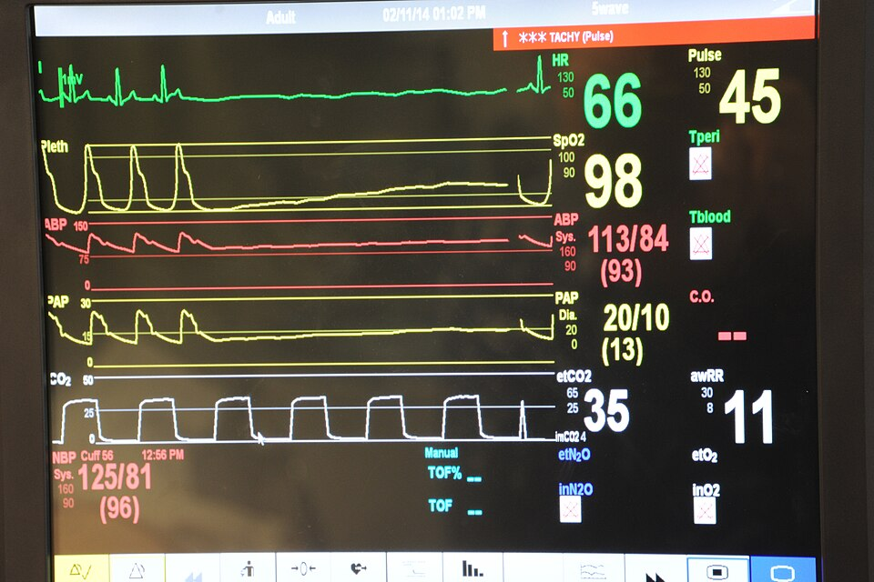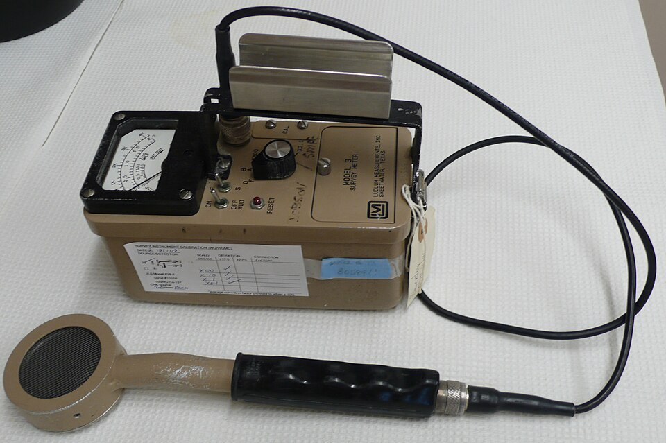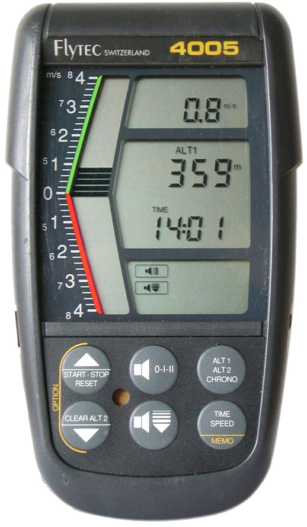<div style="flex:1 1 auto;font-size:.6em;color:#78909c;line-height:1.25">ซ้าย: หน้าจอมอนิเตอร์ผู้ป่วยจริงขณะมีสัญญาณเตือน TACHY แถบสีแดงพาดบนสุด — เมื่อของสำคัญ ระบบจะยกมันขึ้นเหนือทุกอย่างบนจอ — ภาพ: US Navy / Wikimedia Commons — สาธารณสมบัติ &nbsp;|&nbsp; กลาง: เครื่องนับรังสีที่รายงานด้วยเสียงคลิก ส่วนติดต่อผู้ใช้ที่ไม่มีจอเลย — ภาพ: TimVickers / Wikimedia Commons — สาธารณสมบัติ &nbsp;|&nbsp; ขวา: เครื่องวัดอัตราไต่ของนักร่มร่อน มือทั้งสองข้างไม่ว่าง จอจึงไม่ใช่ทางออก ระบบนี้พูดออกมาเป็นเสียงแทน — ภาพ: Flyout / Wikimedia Commons — CC BY-SA 3.0</div></div>

สามภาพนี้ตอบคำถามเดียวกับที่แผงของเราต้องตอบ: **การตอบกลับผู้ใช้ไม่จำเป็นต้องเกิดบนหน้าจอเสมอไป** และเมื่อของสำคัญเข้ามา มันต้องแซงทุกอย่างที่แสดงอยู่

> ทั้งสี่มุมเจอโจทย์เดียวกันหมด: มีคนสั่งได้หลายทาง แต่ความจริงต้องมีชุดเดียว

---

## ดูเพิ่มเติมนอกเวลา + อ่านต่อ

<div style="display:flex;gap:20px;align-items:flex-start">
<div style="flex:0 0 40%;border:2px solid #90a4ae;border-radius:8px;padding:8px 10px;background:#eceff1">
<div style="font-size:.72em;font-weight:700;color:#37474f">What is Switch Bounce and How to Debounce · DigiKey</div>
<iframe width="100%" height="190" src="https://www.youtube.com/embed/IvU8m_30iK0" title="What is Switch Bounce and How to Debounce - Another Teaching Moment | DigiKey" loading="lazy" frameborder="0" allowfullscreen></iframe>
<div style="font-size:.64em;color:#546e7a">ของนอกเวลา ต้องมีอินเทอร์เน็ต</div>
</div>
<div style="flex:1 1 56%">

**ทำไมคลิปนี้เกี่ยวกับการบ้านข้อ 4**

ข้อ 4 ให้เอาปุ่ม**ผู้ใช้จริงบนบอร์ด** (`gpio.button(0)` — เรียกด้วยชื่อจาก `.name()` ไม่ใช่ป้ายบนแผ่นวงจร) มาทำงานร่วมกับปุ่มบนจอในลูปเดียวกัน คลิปนี้ทบทวนว่าทำไมปุ่มกลไกกดครั้งเดียวถึงกลายเป็นหลายเหตุการณ์

ปุ่มบนจอไม่มีปัญหานี้เพราะ CM55 จัดการให้แล้ว — ปุ่มจริงต้องทำเอง

</div>
</div>

**อ่านต่อสำหรับคนอยากรู้ลึก**

- `time.ticks_ms()` / `ticks_diff()` ที่ใช้จับจังหวะลูป — MicroPython docs: <https://docs.micropython.org/en/latest/library/time.html>
- จอ MIPI-DSI และ backlight ของ Eva Kit — KIT_PSE84_EVAL user guide §3.2.2.8 (หน้า 75–81)

> ปุ่มบนจอไม่ต้อง debounce เพราะมีคนทำให้แล้ว ปุ่มจริงต้องทำเอง — จำความต่างนี้ไว้ตอนทำข้อ 4

---

<style scoped>section p, section li { margin:.05em 0;font-size:.86em;line-height:1.28 } section blockquote { font-size:.78em;margin:.06em 0 }</style>

## ส่วนขยาย (ไม่บังคับ) — แผงของเราบน broker

<div style="display:flex;gap:16px;align-items:flex-start">

<div style="flex:0 0 440px">

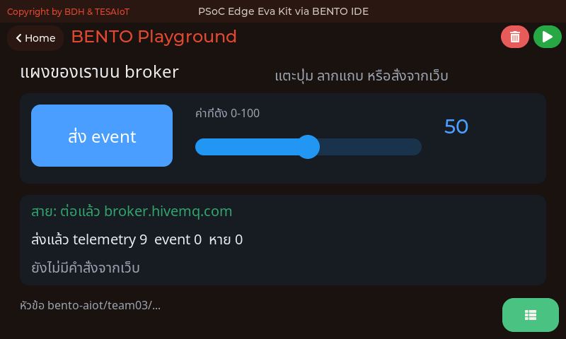

<div style="font-size:.54em;color:#78909c;margin-top:-.3em">ภาพจากตัวจำลอง bento\_sim — โค้ด CM55 ชุดเดียวกับที่รันบนบอร์ด ที่ 800x480 เท่าจอของทั้งสองบอร์ด · แสดงหน้าจอที่ <a href="https://github.com/tesaiot/tesa-qualification-program/blob/main/courses/aiot-micropython/m02-ui-to-hardware/l06-touch-panel-lab/examples/17_panel_to_broker.py"><code>17_panel_to_broker.py</code></a> สร้างหลังแก้ `TEAM` เป็นเลขทีมแล้ว · สายและตัวนับบนภาพเป็นค่าแทนบนเครื่องโฮสต์ ไฟล์นี้ยังไม่เคยรันบนบอร์ด</div>

</div>

<div style="flex:1;min-width:0">

[`17_panel_to_broker.py`](https://github.com/tesaiot/tesa-qualification-program/blob/main/courses/aiot-micropython/m02-ui-to-hardware/l06-touch-panel-lab/examples/17_panel_to_broker.py) เอาปุ่มกับแถบเลื่อนของวันนี้ไปต่อกับ `mqtt` ของบทเรียน 1.4–1.6 ชื่อ broker ทีม และหัวข้อเหมือนบทเรียน 1.4–1.6 และ 2.1–2.3 ทุกตัวอักษร · ค่าตั้งต้น `TEAM = "teamXX"` จงใจให้ไม่ยอมรัน แก้เป็นเลขทีมของเราก่อน

| ของบนจอ | ไปที่ไหน | เพราะ |
|---|---|---|
| แตะปุ่ม "ส่ง event" | `event` ทันที | เรื่องที่เกิดครั้งหนึ่ง |
| ลากแถบเลื่อน | `telemetry` ทุก 2 วินาที | ค่าที่เป็นอยู่ แถบยิง `value_changed` ถี่มากระหว่างลาก |
| `{"cmd":"set","v":80}` จากเว็บ | แถบกับตัวเลขบนจอขยับ | ผ่านฟังก์ชันเดียว `set_value()` แบบ `set_led()` ของไฟล์ 03 |

</div>

</div>

คำสั่ง `set` เป็นคำสั่งใหม่ของไฟล์นี้ พิมพ์ในช่อง "พิมพ์ JSON เอง" ของหน้าเว็บ · `say` กับ `beep` ใช้ปุ่มที่มีอยู่แล้ว · ข้อความ `say` ถูกกรองให้เหลือแค่ ASCII กับไทยก่อนขึ้นจอ และ `v` ที่แปลงเป็นเลขไม่ได้ (เช่น `1e999`) ถูกทิ้ง ไม่ทำให้โปรแกรมล้ม เพราะใครก็ส่งเข้าหัวข้อนี้ได้ · เฟิร์มแวร์นี้ส่ง retain ไม่ได้ ไฟล์จึงส่ง `telemetry` ซ้ำเอง หน้าเว็บที่เปิดทีหลังเห็นภายในสองวินาที

> ไม่อยู่ในเกณฑ์ผ่านของชุดบทเรียนนี้ · ต้องมี WiFi ที่ออกพอร์ต 1883 ได้ ซึ่งเครือข่ายขององค์กรยังไม่ได้ทดสอบ · Emulator ใน ide.tesaiot.dev ส่งถึง broker จริงได้แล้วผ่าน WebSocket

---

## ต่อยอด — คิดต่อเอง (เลือกทำ 1 ข้อ)

<style scoped>
section svg { max-height: 112px; }
section p { margin: .05em 0; font-size: .88em; line-height: 1.28; }
section blockquote { font-size: .76em; margin: .06em 0; }
</style>

<svg viewBox="0 0 900 160" xmlns="http://www.w3.org/2000/svg">
  <rect x="14" y="26" width="205" height="112" rx="9" fill="#e3f2fd" stroke="#1565c0" stroke-width="2"/>
  <text x="116" y="60" text-anchor="middle" font-size="20" font-weight="700" fill="#1565c0">1 · ไฟวิ่ง</text>
  <text x="116" y="92" text-anchor="middle" font-size="18" fill="#5472a3">START / STOP</text>
  <text x="116" y="118" text-anchor="middle" font-size="18" fill="#5472a3">ใช้ flag ในลูปเดียว</text>
  <rect x="237" y="26" width="205" height="112" rx="9" fill="#e8f5e9" stroke="#2e7d32" stroke-width="2"/>
  <text x="339" y="60" text-anchor="middle" font-size="20" font-weight="700" fill="#2e7d32">2 · ตัวนับ</text>
  <text x="339" y="92" text-anchor="middle" font-size="18" fill="#4a7c4e">นับครั้งที่กด</text>
  <text x="339" y="118" text-anchor="middle" font-size="18" fill="#4a7c4e">+ ปุ่ม RESET</text>
  <rect x="460" y="26" width="205" height="112" rx="9" fill="#fff3e0" stroke="#ef6c00" stroke-width="2"/>
  <text x="562" y="60" text-anchor="middle" font-size="20" font-weight="700" fill="#ef6c00">3 · ล็อกแผง</text>
  <text x="562" y="92" text-anchor="middle" font-size="18" fill="#a1683a">Switch LOCK</text>
  <text x="562" y="118" text-anchor="middle" font-size="18" fill="#a1683a">บอกให้รู้ว่าปิดอยู่</text>
  <rect x="683" y="26" width="205" height="112" rx="9" fill="#f3e5f5" stroke="#6a1b9a" stroke-width="2"/>
  <text x="785" y="60" text-anchor="middle" font-size="20" font-weight="700" fill="#6a1b9a">4 · ปุ่มจริง</text>
  <text x="785" y="92" text-anchor="middle" font-size="18" fill="#7e5a94">ปุ่มบนบอร์ดร่วมกับจอ</text>
  <text x="785" y="118" text-anchor="middle" font-size="18" fill="#7e5a94">ระวัง debounce</text>
  <text x="450" y="18" text-anchor="middle" font-size="18" fill="#78909c">ทั้งสี่ข้อใช้ event loop เดิม ไม่ต้องเขียนลูปใหม่</text>
</svg>

**ข้อ 1 · โหมดไฟวิ่งสั่งจากจอ** — เพิ่มปุ่ม START/STOP ที่เปิด-ปิดโหมดไฟวิ่ง (chaser) ของบทเรียน 2.1–2.3 ใช้ตัวแปร flag ในลูปเดียวกับ `ui.poll()` ห้ามใช้ลูปซ้อนที่ทำให้แตะปุ่มอื่นไม่ได้ระหว่างไฟวิ่ง

**ข้อ 2 · ตัวนับการกดและปุ่มรีเซ็ต** — เก็บจำนวนครั้งที่แต่ละสีถูกสั่งเปิด แสดงบน Label เพิ่มอีกบรรทัด และมีปุ่ม RESET ที่ล้างตัวนับกลับเป็นศูนย์ทั้งสามสี

**ข้อ 3 · ล็อกแผงควบคุม** — เพิ่ม `ui.Switch` ชื่อ LOCK เมื่อล็อกอยู่ ปุ่มทั้งหมดต้องกดไม่ได้ และบรรทัดสถานะต้องบอกให้รู้ — ทำอย่างไรให้ผู้ใช้เข้าใจว่าปุ่มถูกปิดการใช้งาน ไม่ใช่ค้าง

**ข้อ 4 · ปุ่มจริงกับปุ่มบนจอทำงานร่วมกัน** — อ่าน `gpio.button(0).is_pressed()` ในลูปเดียวกัน ให้ปุ่มผู้ใช้บนบอร์ด (ชื่อจาก `btn.name()` — บน Dev Kit **ห้ามโยกสวิตช์บนฐาน หลายตัวคือสวิตช์ตัดไฟ**) สลับไฟสีแดงได้ด้วย โดยสถานะบนจอยังตรงเสมอ (ระวัง debounce แบบที่ทำในบทเรียน 2.1–2.3)

**ทั้งสี่ข้อเดินบน event loop เดิม ไม่ต้องเขียนลูปใหม่** — กติกาเดียวที่ใช้ได้กับทุกข้อคือ ห้ามให้จังหวะของงานหนึ่งไปหยุดการแตะปุ่มของอีกงานหนึ่ง ทุกอย่างที่ต้องรอ ให้จำเวลาไว้ในตัวแปรแล้วกลับมาดูรอบหน้า ไม่ใช่หลับรอด้วย `sleep` · ทีมที่ทำข้อ 2 ให้กลับไปดูแบบแผน "ฟังก์ชันเดียวที่มีสิทธิ์เปลี่ยนสถานะ" ใน [`03_switch_matches_led.py`](https://github.com/tesaiot/tesa-qualification-program/blob/main/courses/aiot-micropython/m02-ui-to-hardware/l05-event-loop/examples/03_switch_matches_led.py) เพราะตัวนับกับปุ่ม RESET คือสถานะชุดเดียวกันที่ถูกแตะจากสองทาง · ทีมที่อยากเพิ่มเสียงตอบรับตอนแตะ เปิด [`05_sound_feedback.py`](https://github.com/tesaiot/tesa-qualification-program/blob/main/courses/aiot-micropython/m02-ui-to-hardware/l05-event-loop/examples/05_sound_feedback.py)

> เขียนคำตอบลงบันทึกการเรียน แล้วเอามาเล่าให้เพื่อนฟังต้นชุดบทเรียนถัดไป

---

## สาม widget ที่แยกหน้าจอ HMI ออกจากหน้าจอเล่น ๆ

<div style="display:flex;gap:16px;align-items:flex-start">
<div style="flex:0 0 480px">

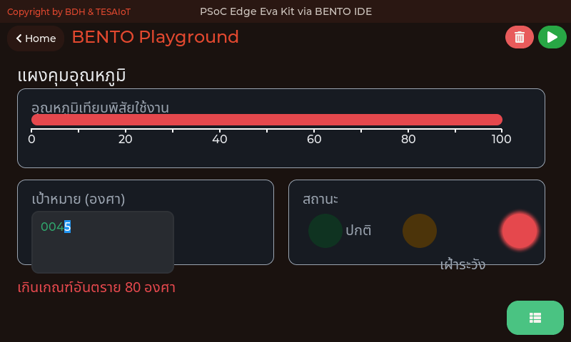

<div style="font-size:.54em;color:#78909c;margin-top:-.3em">ภาพจากตัวจำลอง bento_sim — โค้ด CM55 ชุดเดียวกับที่รันบนบอร์ด ที่ 800x480 เท่าจอของทั้งสองบอร์ด · แสดงหน้าจอที่ <a href="https://github.com/tesaiot/tesa-qualification-program/blob/main/courses/aiot-micropython/m02-ui-to-hardware/l06-touch-panel-lab/examples/09_scale_led_spinbox.py"><code>09_scale_led_spinbox.py</code></a> สร้าง</div>

</div>
<div style="flex:1;min-width:0">

| widget | ตอบคำถามอะไร | ทำไมหน้าจอควบคุมจริงต้องมี |
|---|---|---|
| **`ui.Scale`** | ค่านี้**สูงไหม**เมื่อเทียบกับพิสัย | เลข 72 ลอย ๆ ไม่บอกอะไร · 72 บนไม้บรรทัด 0–100 บอกทันที |
| **`ui.Led`** | **ตอนนี้สถานะอะไร** | ไฟแผงควบคุมที่คนมองปราดเดียวรู้ ไม่ต้องอ่านตัวหนังสือ |
| **`ui.Spinbox`** | ผู้ใช้**ป้อนค่าที่ต้องการ**ยังไง | แถบเลื่อนป้อน 23.75 ไม่ได้ ช่องนี้ได้ |

</div>
</div>

**`ui.Scale` ไม่รับ `.value()`** — มันคือ**ไม้บรรทัด** ไม่ใช่หน้าปัด ตัวที่ขยับคือสิ่งที่เราวางทับลงไปเอง ในไฟล์นี้คือ `ui.Bar` ที่วางเหนือมัน · นี่คือเรื่องที่คนเข้าใจผิดบ่อยที่สุดใน LVGL และโค้ด C ของเฟิร์มแวร์เราเองก็ทำแบบนี้ (ยกเว้นแบบวงกลม ที่มีเข็มจริงผ่าน `PROP_SCALE_NEEDLE` — fw 2026-08-20 ขึ้นไป บทเรียน 3.1–3.3 สอน)

**`ui.Led` สั่ง `.value(0)` แล้วหรี่ ไม่ใช่หาย** — ตั้งใจให้เป็นแบบนั้น ไฟแผงควบคุมที่หายไปตอนดับ แย่กว่าไฟที่หรี่ลง เพราะคนดูแยกไม่ออกว่า**ดับ**หรือ**จอเสีย**

> กติกาที่แผงจริงใช้ — ให้ติดทีละดวง ถ้าติดพร้อมกันสองดวงตอนคาบเกี่ยว คนอ่านไม่ออกว่าตกลงสถานะอะไร

---

## ตารางกับรายการ แทนป้ายที่จัดคอลัมน์เอง

<div style="display:flex;gap:16px;align-items:flex-start">
<div style="flex:0 0 480px">

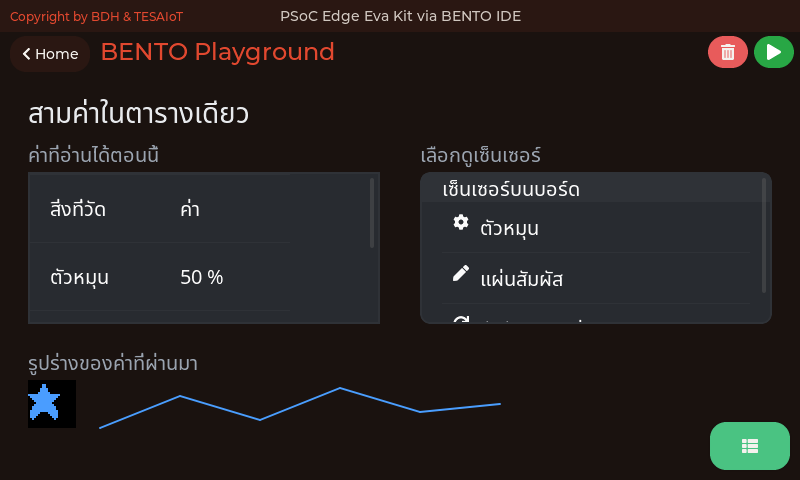

<div style="font-size:.54em;color:#78909c;margin-top:-.3em">ภาพจาก Emulator ของหลักสูตร (<code>BENTO_IDE/bento-emulator</code>) ซึ่งรันโค้ด MicroPython ชุดเดียวกับที่ลงบอร์ด บนพื้นที่วาด 792x398 เท่ากับจอของทั้งสองบอร์ด · แสดง<b>หน้าจอที่ตัวอย่างสร้าง</b> — หน้าจอของ <a href="https://github.com/tesaiot/tesa-qualification-program/blob/main/courses/aiot-micropython/m02-ui-to-hardware/l06-touch-panel-lab/examples/12_table_and_list.py"><code>12_table_and_list.py</code></a> · ค่าที่เห็นในภาพมาจากเซนเซอร์จำลองบนเครื่องโฮสต์ ไม่ใช่ผลการวัดของบอร์ด</div>

</div>
<div style="flex:1;min-width:0">

| widget | ตอบคำถามอะไร |
|---|---|
| **`ui.Table`** | หลายค่าพร้อมกัน โดยคอลัมน์ไม่ขยับตามความยาวของค่า |
| **`ui.List`** | รายการที่แตะเลือกได้ มีไอคอนนำสายตา และเลื่อนเองเมื่อยาวเกินกรอบ |
| **`ui.Line`** | รูปร่างของค่าที่ผ่านมา วาดจากจุดที่เราป้อนเอง |
| **`ui.Picture`** | ไอคอนหนึ่งใบ กำหนดสีได้จากโค้ด |

</div>
</div>

**`.add_row()` เขียนลงแถวถัดจากแถวที่ตัวมันเองเขียนล่าสุด** ไม่ใช่แถวที่ยังว่าง — จะแก้ค่าในแถวเดิมต้องใช้ `.cell(แถว, คอลัมน์, ข้อความ)` ถ้าเผลอใช้ `.add_row()` ในลูป ตารางจะยาวลงไปเรื่อย ๆ จนเลยกรอบ

> ป้ายหลายบรรทัดที่จัดเป็นตารางด้วยการนับพิกเซลเอง จะเลื่อนทันทีที่ค่าเปลี่ยนความยาว — `"27.4"` กับ `"8.0"` กว้างไม่เท่ากัน ตารางจริงจัดคอลัมน์ให้

---

## สั่งของจริง ต้องถามก่อนหนึ่งครั้ง

<div style="display:flex;gap:16px;align-items:flex-start">
<div style="flex:0 0 480px">

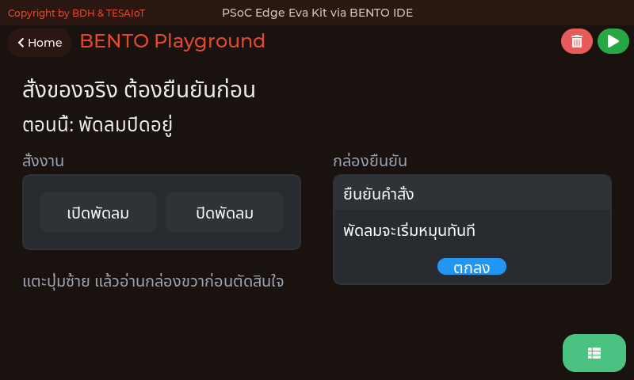

<div style="font-size:.54em;color:#78909c;margin-top:-.3em">ภาพจาก Emulator ของหลักสูตร (<code>BENTO_IDE/bento-emulator</code>) ซึ่งรันโค้ด MicroPython ชุดเดียวกับที่ลงบอร์ด บนพื้นที่วาด 792x398 เท่ากับจอของทั้งสองบอร์ด · แสดง<b>หน้าจอที่ตัวอย่างสร้าง</b> — หน้าจอของ <a href="https://github.com/tesaiot/tesa-qualification-program/blob/main/courses/aiot-micropython/m02-ui-to-hardware/l06-touch-panel-lab/examples/13_confirm_before_acting.py"><code>13_confirm_before_acting.py</code></a> · ค่าที่เห็นในภาพมาจากเซนเซอร์จำลองบนเครื่องโฮสต์ ไม่ใช่ผลการวัดของบอร์ด</div>

</div>
<div style="flex:1;min-width:0">

| widget | ตอบคำถามอะไร |
|---|---|
| **`ui.ButtonMatrix`** | ปุ่มหลายใบเป็นตาราง ด้วย widget เดียวและโควตาเดียว |
| **`ui.MsgBox`** | กล่องยืนยันที่มีหัวเรื่อง เนื้อความ และปุ่มเป็นของตัวเอง |

</div>
</div>

**ปุ่มเปิดกับปุ่มปิดต้องแยกกันคนละใบ** — ปุ่มเดียวที่สลับสองสถานะดูประหยัดที่ แต่คนที่เพิ่งเดินมาถึงแผงไม่รู้ว่าตอนนี้อยู่สถานะไหน กดแล้วจะได้ผลตรงข้ามกับที่ตั้งใจ

**คำยืนยันต้องบอกสิ่งที่จะเกิดขึ้น** ไม่ใช่คำว่า "ยืนยันไหม" ซึ่งไม่ได้เพิ่มข้อมูลให้คนตัดสินใจเลยสักอย่าง

> ทั้ง [`12_table_and_list.py`](https://github.com/tesaiot/tesa-qualification-program/blob/main/courses/aiot-micropython/m02-ui-to-hardware/l06-touch-panel-lab/examples/12_table_and_list.py) และ [`13_confirm_before_acting.py`](https://github.com/tesaiot/tesa-qualification-program/blob/main/courses/aiot-micropython/m02-ui-to-hardware/l06-touch-panel-lab/examples/13_confirm_before_acting.py) ถูกรันจริงในชุดทดสอบของ Emulator ทุกครั้งที่ไลบรารีเปลี่ยน — ถ้าวันไหน widget ตัวใดวาดไม่ออก ชุดทดสอบล้มก่อนที่ห้องเรียนจะเจอ

---

## หน้าจอเดียวไม่พอเมื่อไร และจอที่สองราคาเท่าไร

<div style="display:flex;gap:16px;align-items:flex-start">
<div style="flex:0 0 430px">

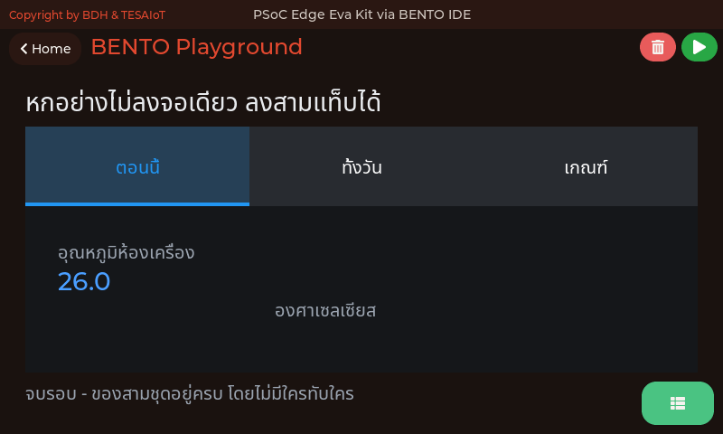

<div style="font-size:.54em;color:#78909c;margin-top:-.3em">ภาพจากตัวจำลอง bento_sim ซึ่งเรนเดอร์ด้วยโค้ด CM55 ชุดเดียวกับที่รันบนบอร์ด ที่ 800x480 เท่าจอของทั้งสองบอร์ด — แสดง<b>หน้าจอที่ <a href="https://github.com/tesaiot/tesa-qualification-program/blob/main/courses/aiot-micropython/m02-ui-to-hardware/l06-touch-panel-lab/examples/10_tabview_second_screen.py"><code>10_tabview_second_screen.py</code></a> สร้าง</b> ตัวเลขอุณหภูมิบนจอเป็นค่าที่ไฟล์นั้นคำนวณขึ้นเอง ไม่ใช่ผลการวัดจากเซนเซอร์</div>

</div>
<div style="flex:1;min-width:0">

**ในงานจริง หน้าจอเครื่องหนึ่งเครื่องมีของต้องโชว์มากกว่าที่ตาคนรับไหวเสมอ** — ค่าปัจจุบัน ค่าย้อนหลัง เกณฑ์ที่ตั้งไว้ สถานะเครือข่าย ประวัติการแจ้งเตือน ทีมที่ยัดทุกอย่างลงหน้าเดียวจะได้จอที่ "มีข้อมูลครบและอ่านไม่ได้เลย" ซึ่งแย่กว่าจอที่มีของน้อยกว่า

| ทำอะไรได้ | ทำไมมันสำคัญกับหน้าจอควบคุม |
|---|---|
| แบ่งพื้นที่เดิมเป็นหลายหน้า สลับด้วยการแตะ | ของที่อยู่คนละแท็บไม่แย่งที่กัน เพราะไม่เคยอยู่บนจอพร้อมกัน |
| แถบแท็บบอกล่วงหน้าว่ามีอะไรอยู่บ้าง | ต่างจากปุ่ม "หน้าถัดไป" ที่ซ่อนรายการไว้ในหัวคนเขียน |
| `.add_tab("ชื่อ")` คืน**หน้า** มาให้ใส่ใน `parent=` | พิกัดของลูกนับจากมุมซ้ายบนของหน้า ไม่ใช่ของจอ |

</div>
</div>

**ราคาที่ต้องจ่าย** — แท็บสามใบกินโควตาไป **4 แฮนเดิล** ตั้งแต่ยังไม่มีอะไรอยู่ในนั้น คือตัว `Tabview` เองหนึ่ง บวกหน้าที่ `add_tab()` คืนมาอีกใบละหนึ่ง เอาเลขนี้ไปบวกกับงบใน [`06_layout_budget.py`](https://github.com/tesaiot/tesa-qualification-program/blob/main/courses/aiot-micropython/m02-ui-to-hardware/l05-event-loop/examples/06_layout_budget.py) ก่อนวางผัง

**`value=` ของ Tabview คือความสูงของแถบแท็บ ไม่ใช่แท็บที่เปิดอยู่** — ตั้ง `value=88` เพราะแถบแท็บคือของที่ต้องแตะ และ 88 พิกเซลคือขั้นต่ำของเป้าสัมผัส ค่าปริยายคือ 40 ซึ่งเตี้ยเกินไป

> กติกาข้อเดียวที่ห้ามลืม — **สิ่งที่ต้องเห็นตลอดเวลาห้ามอยู่ในแท็บ** สถานะเครือข่าย สัญญาณเตือน และปุ่มหยุดฉุกเฉิน ต้องอยู่นอกแท็บเสมอ ไม่งั้นมันจะหายไปตอนที่ผู้ใช้กำลังดูแท็บอื่น ซึ่งคือตอนที่มันสำคัญที่สุดพอดี

---

## เมื่อของไม่ได้เท่ากันทุกหัวข้อ — เมนูแบบเป็นชั้น

<div style="display:flex;gap:16px;align-items:flex-start">
<div style="flex:0 0 480px">

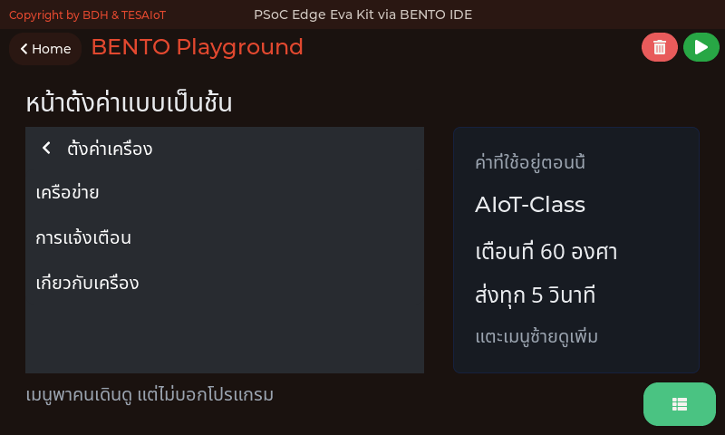

<div style="font-size:.54em;color:#78909c;margin-top:-.3em">ภาพจากตัวจำลอง bento_sim ซึ่งเรนเดอร์ด้วยโค้ด CM55 ชุดเดียวกับที่รันบนบอร์ด — แสดง<b>หน้าจอที่ <a href="https://github.com/tesaiot/tesa-qualification-program/blob/main/courses/aiot-micropython/m02-ui-to-hardware/l06-touch-panel-lab/examples/11_menu_settings_tree.py"><code>11_menu_settings_tree.py</code></a> สร้าง</b> ค่าที่เห็นในเมนูมาจาก dict ในไฟล์ตัวอย่างเอง</div>

</div>
<div style="flex:1;min-width:0">

**แท็บเหมาะกับของที่เท่ากัน เมนูเหมาะกับของที่เป็นชั้น** — "ตอนนี้ ทั้งวัน เกณฑ์" คือสามหัวข้อที่ใครมาก่อนมาหลังก็ได้ ส่วน "ตั้งค่า > เครือข่าย > วงที่ใช้" ไม่ใช่ ยัดโครงแบบหลังลงแท็บจะได้แท็บสิบใบที่ไม่มีใครหาของเจอ

| ชิ้นส่วน | ได้มาจาก | ทำหน้าที่ |
|---|---|---|
| หน้า | `menu.add_page("ชื่อ")` | หน้าแรกที่สร้างคือหน้าที่เมนูเปิดให้เอง |
| กลุ่ม | `page.section()` | กล่องจัดกลุ่มแถว — **ไม่ใช่หน้า** |
| แถว | `section.row("ข้อความ")` | บรรทัดที่แตะได้ |
| เส้นเชื่อม | `row.opens(page)` | หัวใจของ widget ตัวนี้ ขาดบรรทัดนี้เมนูจะแตะได้แต่ไม่ไปไหน |

</div>
</div>

**ข้อจำกัดที่ต้องออกแบบรอบมัน — เมนูไม่ส่ง event กลับมาเลยสักตัว** ทั้งตัวเมนูและแถวของมันไม่ได้ลงทะเบียน callback ไว้ใน `ui_widget_mgr.c` การแตะแถวถูกจัดการจบภายใน LVGL แปลว่า **โปรแกรมเราไม่มีทางรู้ว่าผู้ใช้เปิดหน้าไหนอยู่**

เมนูจึงเป็น "ที่ให้คนเดินดู" ไม่ใช่ "ที่ให้โปรแกรมรับคำสั่ง" — ของที่ต้องรับคำสั่งยังต้องเป็น `Button` `Switch` หรือ `Spinbox` ที่วางไว้ต่างหาก นี่คือเหตุผลที่หน้าจอในตัวอย่างมีการ์ดสรุปอยู่ข้าง ๆ เมนูเสมอ

> **product ต่างจาก demo ตรงนี้เอง** — demo ฝังค่าไว้ในโค้ดแล้วแฟลชใหม่เมื่อต้องเปลี่ยน ส่วน product มีหน้าตั้งค่าให้คนหน้างานเปิดดูได้ว่าตอนนี้เครื่องใช้ค่าอะไรอยู่ โดยไม่ต้องมีใครเปิดซอร์สให้ดู

---

## หน้าจอของทุกไฟล์ในชุดบทเรียนนี้ (1/3)

<style scoped>
section img { margin: 0 .3em; }
section p { margin: .2em 0; }
</style>

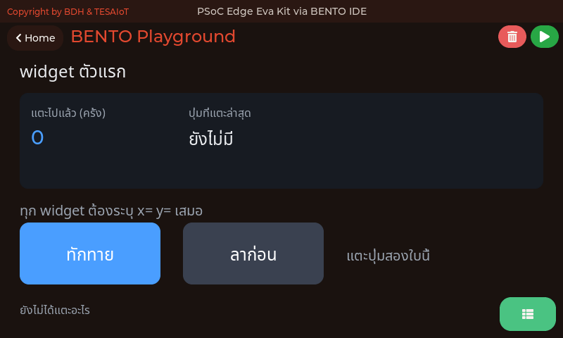 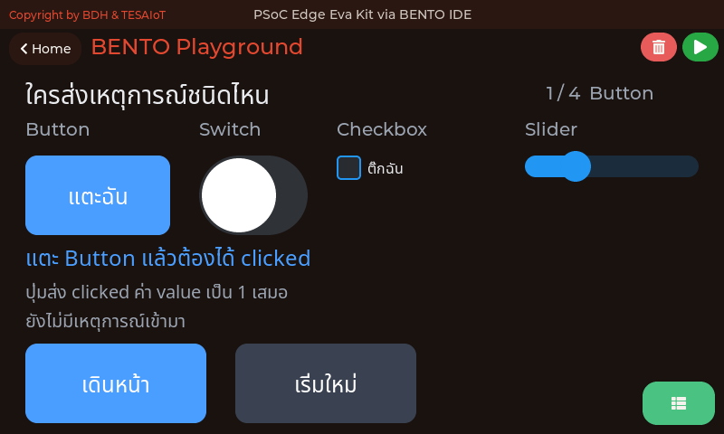 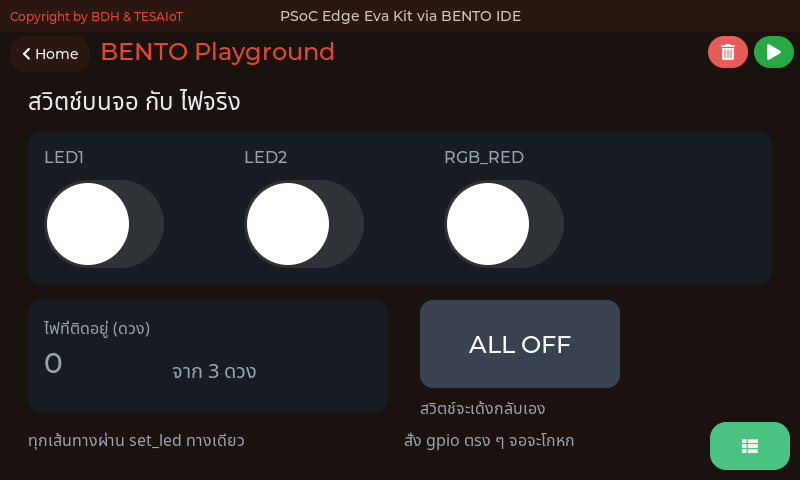

<div style="font-size:.56em;color:#90a4ae"><b>01</b> widget ตัวแรก และเหตุผลที่ต้องใส่ x กับ y ทุกครั้ง · <b>02</b> เหตุการณ์หน้าตาเป็นอย่างไร และใครส่งอะไร · <b>03</b> จอกับไฟจริงต้องพูดตรงกันเสมอ</div>

<div style="font-size:.52em;color:#78909c;margin-top:.4em">ภาพจากตัวจำลอง bento_sim ซึ่งเรนเดอร์ด้วยโค้ด CM55 ชุดเดียวกับที่รันบนบอร์ด ที่ 800x480 เท่าจอของทั้งสองบอร์ด — แสดง<b>หน้าจอที่ตัวอย่างสร้าง</b> ค่าจากเซนเซอร์ WiFi และไมค์เป็นค่าแทนบนเครื่องโฮสต์ ไม่ใช่ผลการวัดของบอร์ด</div>

---

## หน้าจอของทุกไฟล์ในชุดบทเรียนนี้ (2/3)

<style scoped>
section img { margin: 0 .3em; }
section p { margin: .2em 0; }
</style>

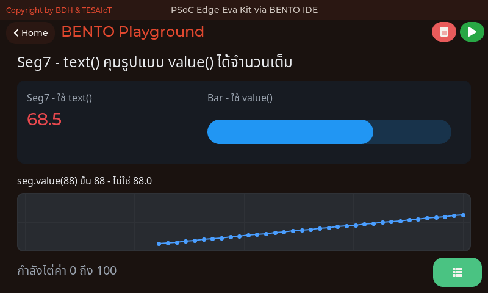 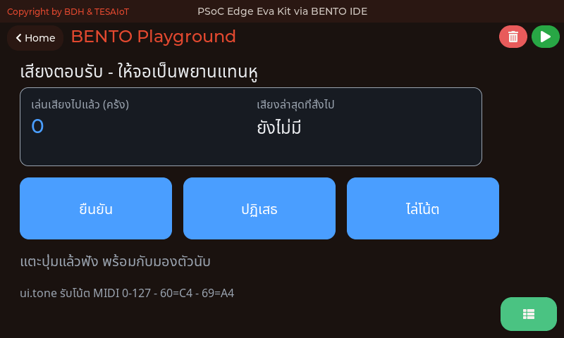 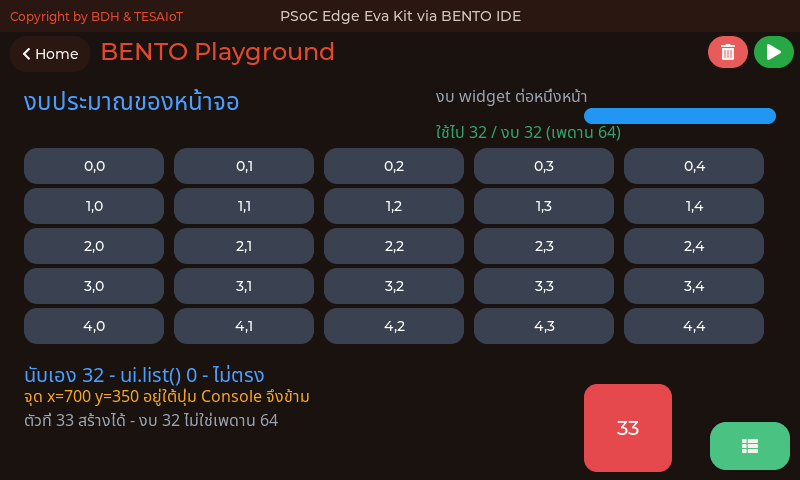

<div style="font-size:.56em;color:#90a4ae"><b>04</b> Seg7 กินข้อความ ไม่ใช่กินตัวเลข · <b>05</b> เสียงตอบรับตอนแตะปุ่ม · <b>06</b> พื้นที่ 792x398 และงบของคอร์ส 32 ตัว (เพดานเฟิร์มแวร์ 64) · <b>ภาพ 06 เก่า</b> ถ่ายตอนไฟล์ยังพิมพ์ "เหลือโควตา 32 ตัว" และตารางยังไม่เต็ม — ปัจจุบันไฟล์ใช้พอดี 32 พิมพ์ "งบ 32 (เพดาน 64)" และลองสร้างตัวที่ 33 ให้ดู รอถ่ายใหม่</div>

<div style="font-size:.52em;color:#78909c;margin-top:.4em">ภาพจากตัวจำลอง bento_sim ซึ่งเรนเดอร์ด้วยโค้ด CM55 ชุดเดียวกับที่รันบนบอร์ด ที่ 800x480 เท่าจอของทั้งสองบอร์ด — แสดง<b>หน้าจอที่ตัวอย่างสร้าง</b> ค่าจากเซนเซอร์ WiFi และไมค์เป็นค่าแทนบนเครื่องโฮสต์ ไม่ใช่ผลการวัดของบอร์ด</div>

---

## หน้าจอของทุกไฟล์ในชุดบทเรียนนี้ (3/3)

<style scoped>
section img { margin: 0 .3em; }
section p { margin: .2em 0; }
</style>

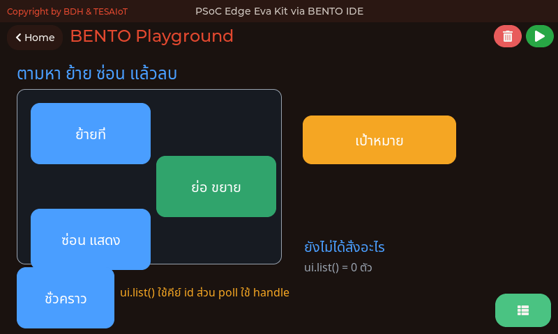 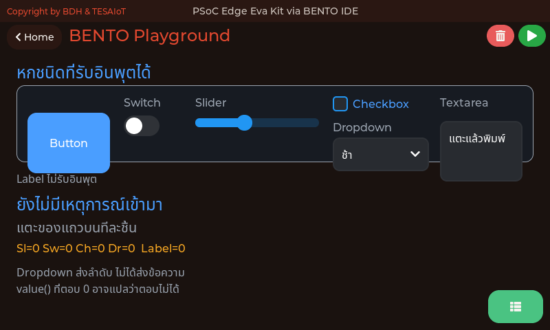

<div style="font-size:.56em;color:#90a4ae"><b>07</b> จัดการ widget ที่สร้างไปแล้ว · <b>08</b> อีกสามชนิดที่รับอินพุตได้ และค่าที่ถามกลับได้จริง</div>

<div style="font-size:.52em;color:#78909c;margin-top:.4em">ภาพจากตัวจำลอง bento_sim ซึ่งเรนเดอร์ด้วยโค้ด CM55 ชุดเดียวกับที่รันบนบอร์ด ที่ 800x480 เท่าจอของทั้งสองบอร์ด — แสดง<b>หน้าจอที่ตัวอย่างสร้าง</b> ค่าจากเซนเซอร์ WiFi และไมค์เป็นค่าแทนบนเครื่องโฮสต์ ไม่ใช่ผลการวัดของบอร์ด</div>

---

## อ้างอิงและเครดิต

<style scoped>
section p, section li { margin: .04em 0; font-size: .78em; line-height: 1.28; }
section ul { margin: .05em 0; }
section blockquote { font-size: .74em; margin: .06em 0; }
</style>

**เอกสารของผู้ผลิตและซอฟต์แวร์**

- KIT_PSE84_EVAL PSOC™ Edge E84 Evaluation Kit guide (Eva Kit) — Infineon, 002-39007 Rev. *B (2025-09-10) — §3.2.2.8 MIPI-DSI (หน้า 75–81) · §3.2.2.15 User LEDs รูปที่ 78 (หน้า 88–89) · §3.2.2.16 ปุ่ม (หน้า 89–90) · ฉบับเว็บ: <https://documentation.infineon.com/psocedge/docs/lne1762692969598>
- MicroPython `time` (`ticks_ms` / `ticks_diff`): <https://docs.micropython.org/en/latest/library/time.html> — เอกสาร upstream มี `machine.PWM/ADC/Timer` ที่ **พอร์ตของเรายังไม่มี**

**วิดีโอ**

- How do touchscreens work? — Khan Academy India: <https://www.youtube.com/watch?v=P70YQuP4-og>
- Projected Capacitive Touch Technology - How It Works — Zytronic: <https://www.youtube.com/watch?v=6BS6aQBaMhU>
- What is Switch Bounce and How to Debounce — DigiKey: <https://www.youtube.com/watch?v=IvU8m_30iK0>

**ภาพ** — วงจร User LEDs มาจากคู่มือคิต รูปที่ 78 (หน้า 89) ใช้เพื่อการเรียนการสอน · ภาพถ่ายจากภายนอกทั้งเจ็ดภาพเป็น Wikimedia Commons ภายใต้ CC0 / CC BY / CC BY-SA / สาธารณสมบัติ เครดิตอยู่ใต้ภาพแต่ละใบบนสไลด์ · ภาพหน้าจอบอร์ดสี่ภาพเป็นของผู้สอนเอง ถ่ายจาก Eva Kit ขณะรันไฟล์ใน โฟลเดอร์ `examples/` ของบทเรียน 2.4–2.6 · ไดอะแกรมอื่นทุกภาพวาดใหม่เป็น inline SVG ไม่ได้คัดลอกจากเอกสารผู้ผลิต

**ตัวอย่างโค้ด** — ชุดประจำบทเรียนอยู่ที่ โฟลเดอร์ `examples/` ของบทเรียน 2.4–2.6 (แปดไฟล์ · หมายเลข 07 กับ 08 เพิ่มเข้ามาเพื่อให้ทุกฟังก์ชันของ `ui` ฝั่งอินพุตมีที่ให้ลงมือจริง) · ตัวอย่างต่อยอดหนึ่งไฟล์คือ [`07_hold_to_confirm.py`](https://github.com/tesaiot/tesa-qualification-program/blob/main/courses/aiot-micropython/shared/usecase/07_hold_to_confirm.py) · ชุดเสียงสี่ไฟล์ที่เคยอยู่ใน `examples/usecase/` หมายเลข 08 ถึง 11 ถูกถอดออกจากคลังเมื่อ 14 ส.ค.

**ตัวเลขที่สืบกลับได้** — คิววงแหวน 16 ช่อง ใส่ได้จริง 15 และทิ้งของใหม่เมื่อเต็ม (`ui_widget_mgr.c:2687-2690`, `UI_EVENT_RING_SIZE` ใน `ipc_ui_protocol.h:77`) · หยิบได้ครั้งละ 8 (`UI_MAX_EVENTS_PER_POLL`) · เพดานเฟิร์มแวร์ 64 widget (`UI_MAX_WIDGETS`, `ipc_ui_protocol.h:675`; งบของคอร์ส 32) · พื้นที่ปริยาย 792 × 398 (`ui_widget_defaults.h`) · เพดานข้อความ 126 ไบต์ทั้งตอนสร้างและตอน `.text()` (`IPC_DATA_MAX_LEN` ลบสอง) · `ui.tone` รับตำแหน่ง 1-4 ตัว ปริยาย `WAVE_SQUARE` / 100 / 150 ms (`modui.c:1741-1760`) · เสียงสำเร็จรูป 21 ตัว รูปคลื่น 4 แบบ (ตารางค่าคงที่ `modui.c:1928-1953`)

พฤติกรรมของ `ui`, `gpio` และกฎเหล็กห้าข้อ ตรวจจากซอร์สโค้ด `KIT_PSE84_EVAL_EPC2-MicroPython-BentoClaw` และ `BENTO-TESAIoT-libraries` โดยตรง แล้วให้ทีมตรวจอิสระอีกชุดไล่หักล้างทีละข้อ

> ทุกตัวเลขบนสไลด์ชุดนี้สืบกลับไปที่เอกสารต้นทางหรือซอร์สโค้ดได้ ถ้าเจอที่ไม่ตรง บอกผู้สอนได้เลย

---

## กล่องคือที่อยู่ ไม่ใช่ของที่ตอบได้

<style scoped>
section table { font-size: .6em; }
section table td, section table th { padding: .1em .5em; }
section p { margin: .05em 0; font-size: .9em; line-height: 1.28; }
section blockquote { font-size: .78em; margin: .08em 0; }
</style>

<div style="display:flex;gap:16px;align-items:flex-start">
<div style="flex:0 0 440px">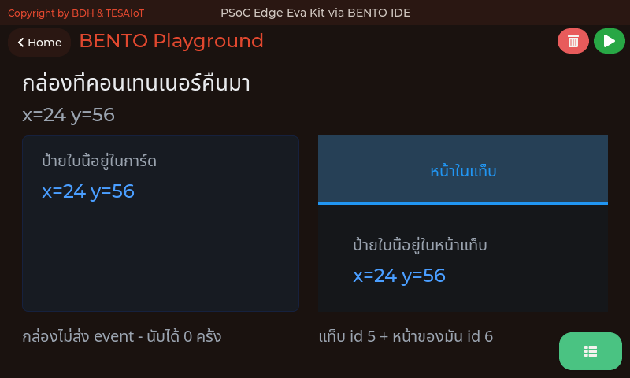<div style="font-size:.54em;color:#78909c;line-height:1.2">ภาพจากตัวจำลอง Eva Kit (<code>KIT_PSE84_EVAL_EPC2-MicroPython-BentoClaw/sim</code>) ซึ่งรัน <code>ipc_ui.c</code> กับ <code>ui_widget_mgr.c</code> ตัวจริงเดียวกับบอร์ด บนพื้นที่วาด 800x398 · แสดง<b>หน้าจอที่ตัวอย่างสร้าง</b> — หน้าจอของ <a href="https://github.com/tesaiot/tesa-qualification-program/blob/main/courses/aiot-micropython/m02-ui-to-hardware/l06-touch-panel-lab/examples/14_container_coordinates.py"><code>14_container_coordinates.py</code></a> · ค่าที่เห็นในภาพมาจากเซนเซอร์จำลองบนเครื่องโฮสต์ ไม่ใช่ผลการวัดของบอร์ด</div></div>
<div style="flex:1 1 auto">

`parent=` ทำสองอย่างพร้อมกัน และข้อที่สองคือข้อที่ทำให้คนงง

| | ผลที่ได้ |
|---|---|
| **จัดกลุ่ม** | ย้ายกล่อง ลูกย้ายตาม ลบกล่อง ลูกหายไปด้วย |
| **เปลี่ยนระบบพิกัด** | `x=0, y=0` ของลูก คือมุมซ้ายบน**ของกล่อง** ไม่ใช่ของจอ |

ป้ายสามใบในภาพเขียนข้อความเดียวกันและสั่งพิกัดเดียวกันทั้งสามใบ แต่ไปโผล่คนละที่ เพราะอยู่คนละกล่อง

**กล่องกินแฮนเดิลของตัวเอง** จากโควตา (งบคอร์ส 32 · เพดานเฟิร์มแวร์ 64) — กล่องเปล่าที่ทำหน้าที่แค่จัดกลุ่ม ยังต้องจ่ายหนึ่งใบ

</div>
</div>

> `tools/check_overlap.py` **ข้าม** widget ที่มี `parent=` แล้วนับให้เห็นว่าข้ามไปกี่ตัว เพราะมันอ่านพิกัดจากซอร์สและไม่รู้ว่าลูกอยู่คนละระบบพิกัด — จอที่ทำด้วยกล่อง ต้องเปิดภาพดูเอง

---

## กดค้าง — สิ่งที่ clicked บอกไม่ได้

<div style="display:flex;gap:16px;align-items:flex-start">
<div style="flex:0 0 480px">

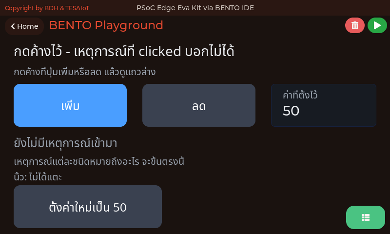

<div style="font-size:.54em;color:#78909c;margin-top:-.3em">ภาพจากตัวจำลอง Eva Kit (<code>KIT_PSE84_EVAL_EPC2-MicroPython-BentoClaw/sim</code>) ซึ่งรัน <code>ipc_ui.c</code> กับ <code>ui_widget_mgr.c</code> ตัวจริงเดียวกับบอร์ด บนพื้นที่วาด 800x398 · แสดง<b>หน้าจอที่ตัวอย่างสร้าง</b> — หน้าจอของ <a href="https://github.com/tesaiot/tesa-qualification-program/blob/main/courses/aiot-micropython/m02-ui-to-hardware/l06-touch-panel-lab/examples/15_press_and_hold.py"><code>15_press_and_hold.py</code></a> · ค่าที่เห็นในภาพมาจากเซนเซอร์จำลองบนเครื่องโฮสต์ ไม่ใช่ผลการวัดของบอร์ด</div>

</div>
<div style="flex:1;min-width:0">

`clicked` มาถึงตอน **ปล่อยนิ้วแล้ว** ปุ่มเร่งที่ต้องเดินขึ้นเรื่อย ๆ ระหว่างกดค้าง จึงทำด้วย `clicked` ไม่ได้เลย

| ชนิด | มาถึงเมื่อไร |
|---|---|
| **`pressed`** | นิ้วแตะลง — เริ่มทำงานได้ตรงนี้ |
| **`long_pressed`** | กดค้างเกิน **400 มิลลิวินาที** — มาครั้งเดียว |
| **`long_pressed_repeat`** | ยังกดอยู่ ย้ำทุก **100 มิลลิวินาที** · `value` คือ**จำนวนครั้งที่ย้ำมาตั้งแต่ `poll()` รอบที่แล้ว** |
| **`press_lost`** | ยังกดอยู่ แต่เลื่อนนิ้วออกนอกปุ่มแล้ว |
| **`released`** | ปล่อยแล้ว มาถึงเสมอ แม้ปล่อยนอกปุ่ม |

</div>
</div>

**ทั้งห้าชนิดต้องขอก่อนด้วย `.listen()`** ค่าตั้งต้นคือเงียบ — ปุ่มที่ไม่มีใครขอรับ จะไม่ส่งอะไรลงคิวเลยแม้แต่ใบเดียว

**`value` ของ `long_pressed_repeat` ให้อ่านว่า "ไปไกลแค่ไหน" ไม่ใช่ "มากี่ข้อความ"** — ปุ่มที่กดค้างยาวแค่ไหนก็กินคิวแค่ **ช่องเดียว** เพราะการย้ำที่ติดกันจะถูกรวมเข้ากับใบเดิมแล้วบวกเลขใน `value` ขึ้นไป ที่ทำแบบนี้เพราะถ้าปล่อยให้ย้ำกินช่องละใบ คิวจะเต็มไปด้วยการย้ำ แล้วใบที่ตกคิวจะกลายเป็น `released` — ซึ่งคือใบที่สั่งให้**หยุด**

> ถามตัวเองว่า "ต้องรู้ตอนไหน" ก่อนเลือกชนิด — ตอนเริ่ม ตอนกำลังทำ หรือตอนจบ

---

## ปัดนิ้ว เลื่อนรายการ และช่องที่ถูกเลือก

<div style="display:flex;gap:16px;align-items:flex-start">
<div style="flex:0 0 480px">

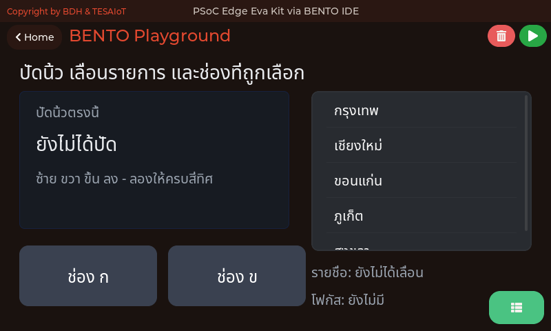

<div style="font-size:.54em;color:#78909c;margin-top:-.3em">ภาพจากตัวจำลอง Eva Kit (<code>KIT_PSE84_EVAL_EPC2-MicroPython-BentoClaw/sim</code>) ซึ่งรัน <code>ipc_ui.c</code> กับ <code>ui_widget_mgr.c</code> ตัวจริงเดียวกับบอร์ด บนพื้นที่วาด 800x398 · แสดง<b>หน้าจอที่ตัวอย่างสร้าง</b> — หน้าจอของ <a href="https://github.com/tesaiot/tesa-qualification-program/blob/main/courses/aiot-micropython/m02-ui-to-hardware/l06-touch-panel-lab/examples/16_swipe_scroll_focus.py"><code>16_swipe_scroll_focus.py</code></a> · ค่าที่เห็นในภาพมาจากเซนเซอร์จำลองบนเครื่องโฮสต์ ไม่ใช่ผลการวัดของบอร์ด</div>

</div>
<div style="flex:1;min-width:0">

| ชนิด | ใครส่ง | `value` บอกอะไร |
|---|---|---|
| **`gesture`** | ของที่**ไม่**เลื่อนตัวเอง เช่น `ui.Panel` | ทิศที่ปัด `ui.DIR_LEFT` และพวกเดียวกัน |
| **`scroll_begin` / `scroll_end`** | ของที่เลื่อนตัวเองได้จริง เช่น `ui.List` | — |
| **`focused` / `defocused`** | widget ที่รับสัมผัส | — |

</div>
</div>

**`gesture` จะไม่ถูกส่งระหว่างที่มีการเลื่อนเกิดขึ้น** — พอ LVGL ตัดสินใจว่านิ้วนี้กำลังเลื่อนเนื้อหาของ widget ตัวใดตัวหนึ่ง มันจะถือว่านิ้วนั้น "ถูกจองแล้ว" และไม่แปลงเป็นการปัดสั่งงาน **แผ่นสำหรับปัดจึงต้องเป็นของที่ไม่เลื่อนตัวเอง** อย่าง `ui.Panel` ส่วน `scroll_begin` / `scroll_end` ต้องขอจากของที่เลื่อนได้จริง — ในตัวอย่างนี้คือ `ui.List` ที่มีรายชื่อยาวกว่ากรอบ

---

## ปัดนิ้ว เลื่อนรายการ และช่องที่ถูกเลือก (ต่อ)

**ข้อยกเว้นที่ต้องรู้ — `ui.Roller` ไม่ส่ง `scroll_*` เลย** วงล้อดู "เลื่อนได้" แต่ในสายตา LVGL มันไม่ใช่ของที่เลื่อนได้ ตอนสร้างมันสั่ง `lv_obj_remove_flag(obj, LV_OBJ_FLAG_SCROLLABLE)` ใส่ตัวเอง แล้วขยับป้ายข้างในด้วยมือ `scroll_begin` / `scroll_end` จึงไม่มีวันมาถึงมัน สิ่งที่วงล้อรายงานคือ `value_changed` ตอนตัวเลือกเปลี่ยน

**`focused` ใช้ตอบว่า "ตอนนี้ผู้ใช้อยู่ที่ช่องไหน"** — ฟอร์มหลายช่องผูกแป้นพิมพ์ตามช่องที่ถูกแตะได้ด้วยเหตุการณ์นี้ตัวเดียว โดยไม่ต้องมี `lv_group` และไม่ต้องมีคีย์บอร์ดจริง

---

## เหตุการณ์เดินทางมาถึงเรายังไง

```
LVGL เห็นนิ้ว  →  CM55 เรียก callback  →  คิว 16 ช่อง  →  ui.poll() ตักได้ 8  →  ลูปของเรา
```

สี่ขั้นนี้อธิบายเกือบทุกอาการที่ผู้เรียนจะเจอในชุดบทเรียนนี้

| อาการ | ขั้นที่เป็นเหตุ |
|---|---|
| **กดปุ่มแล้วไม่มีอะไรเกิดขึ้น** | ลูปไม่ได้เรียก `ui.poll()` — คิวเต็มแล้วของใหม่ถูกทิ้ง |
| **ปุ่มหน่วง ๆ กดไม่ค่อยติด** | `time.sleep_ms()` นาน ระหว่างหลับไม่มีใครตักคิว |
| **แตะรัว ๆ แล้วบางครั้งหาย** | ตักได้ครั้งละ 8 ที่เหลือรอรอบหน้า ถ้าลูปช้าก็ไล่ไม่ทัน |

**คิวมี 16 ช่อง และของใหม่คือตัวที่ถูกทิ้งเมื่อเต็ม** ไม่ใช่ของเก่า — เพราะของเก่าอาจเป็นเหตุการณ์ที่โปรแกรมกำลังจะประมวลผลอยู่พอดี

> `ui.poll()` ไม่ใช่การ "ถามว่ามีอะไรไหม" แต่เป็นการ **"ตักออกจากคิว"** — ไม่ตัก คิวก็เต็ม

---

## ทำไมต้องขอก่อน — `.listen()`

เหตุการณ์สามชนิดมาถึงเสมอโดยไม่ต้องขอ ส่วนอีกสิบสองชนิด **เงียบจนกว่าจะขอ**

| | ชนิด | ต้องขอไหม |
|---|---|---|
| **มาเอง** | `clicked` `value_changed` `toggled` | ไม่ต้อง |
| **ต้องขอ** | `pressed` `released` `press_lost` `long_pressed` `long_pressed_repeat` `ready` `cancel` `focused` `defocused` `scroll_begin` `scroll_end` `gesture` | `.listen("...")` |

```python
btn.listen("pressed", "long_pressed_repeat", "released")
```

**เหตุผลคือคิว 16 ช่องนั้นเอง** — นิ้วที่แตะจอหนึ่งครั้ง ทำให้เกิดได้ทั้ง `pressed` `focused` `defocused` `released` และถ้ามีการเลื่อนด้วยก็ `scroll_begin` `scroll_end` ตามมาอีก **นิ้วเดียว หลายใบ** ถ้าทุก widget บนจอส่งทุกชนิดตลอดเวลาโดยไม่มีใครอ่าน คิวสิบหกช่องเต็มได้ในไม่กี่การแตะ แล้ว**เหตุการณ์ที่เราสนใจจริงจะถูกทิ้งตั้งแต่ยังไม่ถึงมือเรา**

ค่าตั้งต้นจึงเป็นเงียบ แล้วให้เราบอกว่าจะอ่านอะไร — widget ที่ไม่เคยเรียก `.listen()` เลย จะไม่ถูกติดตัวดักเหตุการณ์ให้ด้วยซ้ำ

> ขอเท่าที่จะอ่านจริง ไม่ขอเผื่อไว้ — ทุกชนิดที่ขอเพิ่มคือช่องในคิวที่ถูกใช้จริง

---

## ถามให้ถูกจังหวะ

`clicked` มาถึงตอน **ปล่อยนิ้วแล้ว** ปุ่มเร่งที่ต้องเดินขึ้นระหว่างกดค้าง จึงทำด้วย `clicked` ไม่ได้เลย

| อยากรู้ว่า | ใช้ชนิด |
|---|---|
| เริ่มแตะแล้ว | `pressed` |
| ยังกดค้างอยู่ | `long_pressed_repeat` — `value` คือจำนวนครั้งที่ย้ำมาตั้งแต่ `poll()` รอบที่แล้ว |
| นิ้วเลื่อนออกนอกปุ่มแล้ว | `press_lost` — สั่งหยุดตรงนี้ |
| จบแล้ว | `released` — มาถึงเสมอ แม้ปล่อยนอกปุ่ม |
| ผู้ใช้พิมพ์เสร็จ | `ready` |
| ตอนนี้อยู่ที่ช่องไหน | `focused` |

**ถามตัวเองว่า "ต้องรู้ตอนไหน" ก่อนเลือกชนิด** — ตอนเริ่ม ตอนกำลังทำ หรือตอนจบ

> `gesture` ไม่ถูกส่งระหว่างที่มีการเลื่อนเกิดขึ้น และ `ui.Roller` ไม่ส่ง `scroll_*` เลยเพราะ LVGL ไม่ถือว่ามันเป็นของที่เลื่อนได้ — สองข้อนี้เจอจากการปัดจอจริงก่อน แล้วจึงไปอ่าน `lv_roller.c` เพื่อยืนยันว่าทำไม
