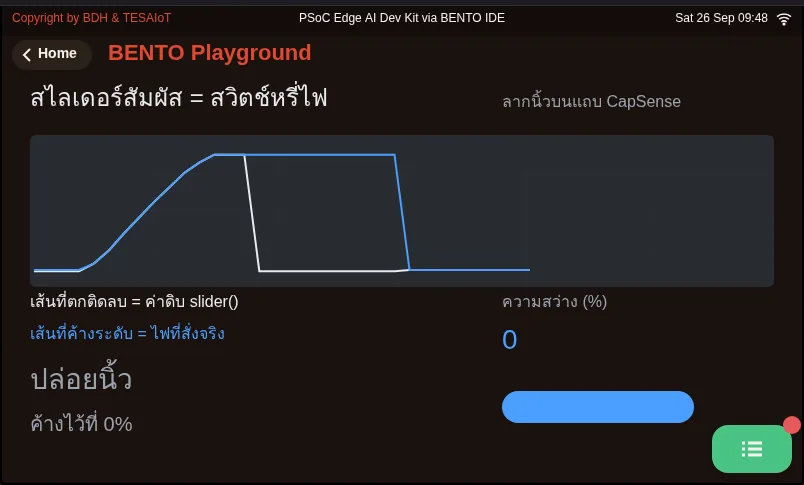
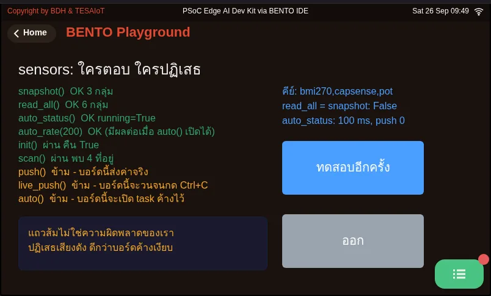

# Lesson 2.7 — Analog and touch: the ADC, the potentiometer and CapSense

> Module 2 — From Screen to Hardware · Slides: [slides.md](slides.md) · [Module overview](../README.md) · [Course page](../../README.md)

Read the knob through the ADC and the touch buttons and slider through CapSense, tell which numbers you can trust and which you still have to measure yourself, and understand why the value keeps shaking even when your hand is still.

## Objectives

By the end of this lesson you will be able to:

1. Choose sensors.pot.read() / .percent() / .voltage() to suit the reader, convert a raw value to percent with the 2^n − 1 denominator (for example 40915 to 62.43%), and state why the voltage figure cannot be trusted until the real board V_ref is measured
2. Explain that 0-65535 is the API scale, not the ADC resolution, and find the real resolution from the step size of read() on the real board (steps of k mean 65536/k levels), recorded in your learning log
3. Explain how CapSense works (a finger adds capacitance to a copper pad and the PSoC 4000T decides from the difference against a baseline), and fix buttons that report inverted the right way, without touching the code
4. Choose sensors.snapshot() over asking for values one by one, use the sequence field to check whether the loop is re-reading the same sample, and name the five functions the Eva Kit rejects with OSError and why

## Before you start

Following on from lessons 2.4–2.6, the things reused today are `ui.Label`, `ui.Bar`, `ui.Panel`, calling `ui.poll()` every loop round, and `time.sleep_ms()`
to control timing. The direction of data flow is now reversed: lessons 2.7–2.9 have the hardware command the screen.
Keep your learning log open, because this lesson has several numbers the documentation has not yet measured, which you must record from your team's own board.
If you have a multimeter, have it ready, and when plugging in the board's USB cable, do not rest a finger on the touch pad (the reason is in the concepts section, under baseline).

- **Equipment:** an Eva Kit or TESAIoT Dev Kit board with the BENTO MicroPython firmware installed, or the BENTO Emulator in [BENTO IDE](https://ide.tesaiot.dev/)
- **Before this:** [Lesson 2.6 — Hands-on: your touch control panel and the next widgets](../l06-touch-panel-lab/README.md)

## See it work first

On the Eva Kit, open the **Controls** menu and turn the knob slowly — the curved needle on screen sweeps along with your hand at once. The Dev Kit has no such menu;
open the **GPIO & RGB Matrix** page instead and turn **VR1** on the base, watching the VR1-4 bars. For the touch slider, run `01_capsense_dimmer.py`
and drag your finger, then stop your hand completely still and stare at the percentage number for ten more seconds — it is still moving even though nobody is touching it.
This is not a broken board and not a bug in the program; it is the nature of reading an analogue value, and it is the question this set of lessons will answer.

## Concepts

A knob does not send a number. It is a **hand-adjusted voltage divider**: the wiper splits a resistor track into two parts, so turning it halfway gives half the voltage
(on the Eva Kit this is R34, a 10 kΩ linear resistor, which shares its path with thermistor TH1, so the two cannot be used at the same time — the default is the pot).
The **SAR ADC** circuit inside the chip holds the voltage steady, then guesses one bit at a time through a binary search, rounding down to the nearest step. One conversion therefore takes time,
it is not instant, and the value Python reads is the result of a guess that has already finished, not the voltage at the exact instant you read the variable.

One knob has three faces from the same single measurement. `read()` returns 0-65535, for looking at raw resolution and jitter; `percent()` returns 0-100,
which fits `ui.Arc` / `ui.Bar`; and `voltage()` is for comparing against a multimeter. You never need to call `sensors.init()` (on the Eva Kit, calling it raises `OSError`).
On the Eva Kit, the display core (CM55) reads the knob and Python picks up the value from a snapshot; on the Dev Kit, CM33 reads VR1 on the QWA309 base directly.
The conversion formula is p = raw / (2^n − 1) × 100%, while the size of one step uses 2^n — do not mix up the denominator — and 65535 is only the **API's scale**.
The firmware reads the ADC at 12 bits (0-4095) and then scales it up to 0-65535, so a large number and a fine-grained number are two separate things.
Be careful with the voltage figure: both boards' schematics specify a 1.8 V reference voltage, but `voltage()` multiplies by an assumed 3.3 V, and nobody has yet confirmed it with a meter,
so the voltage number cannot yet be spoken of as true.

**CapSense** has no switches at all — only copper pads under plastic. A finger is a conductor connected to ground through the body; as it approaches, the pad's capacitance rises.
The chip charges it and times a slightly longer discharge, concluding a finger is present. It measures the closeness of a conductor, not pressure, which is why a thick rubber glove does not register.
On the Eva Kit, buttons CSB1 / CSB2 are CSX type (mutual-capacitance) with separate Tx and Rx pins; the slider is five electrodes averaged into a position from 0-100.
This work is done by a separate **PSoC 4000T** chip; the display core reads it over I2C (address 0x08), three bytes at a time — button 0, button 1, and the slider position —
and Python asks the display core in turn. In code we only ever see `btn0`, `btn1`, `slider`, identically on both boards.

The chip does not decide from the raw value, but from **the difference against a baseline** — the value when no finger is present. The baseline slowly tracks changes like humidity and temperature,
but cannot keep up with a touch, and on our board it is captured only once, **at boot**, not when you press Program to Device. If a finger rests on the pad at boot,
the button reports inverted for the whole lesson. The fix is to lift every finger completely and unplug and replug the USB cable — running the script again does not capture a new baseline —
and on the Dev Kit, never flip a switch on the base, because those switches are power switches.

The `sensors` module on the Eva Kit has fifteen names: nine functions plus six sub-sensors and a diagnostic. Five functions — `init()`, `scan()`, `push()`,
`live_push()`, `auto()` — are rejected by the Eva with `OSError`, because all five need to drive the SCB0 bus, which the display core holds. On the Dev Kit these five do work,
but that does not mean you should call them (`live_push()` loops until Ctrl+C, and `auto()` leaves a background task running after the script ends). This course uses `sensors.snapshot()`,
which returns a dict with three groups — `pot`, `capsense`, `bmi270` — read at the same instant, in the identical shape on both boards, unlike `read_all()`,
which on the Dev Kit returns `pot` as a float. Every group has a `sequence` field; if this number has not moved between two rounds, we are reading the same sample again.
The display core reads pot and capsense every 200 ms, so a loop faster than that will certainly meet the same value.

## Worked example

- `01_capsense_dimmer.py` — before running, predict what the raw value from `slider()` will do when you release your finger, and whether the LED will turn off. The file first plays a demo pattern
  (the numbers it prints are not real values yet), then lets you drag for real. Watch the two lines on the chart, told apart by shape, and work out that the code decides "finger released"
  from the value not moving for `IDLE_ROUNDS` rounds in a row, not from `slider() == 0`, which could just mean a touch at the far-left end. Try changing `IDLE_ROUNDS`
  and see how sooner or later the "released" label appears, and notice that the light can hold a level because `hold()` is called again every round.
- `09_sensors_api_tour.py` — before running, predict which rows on your team's board will be green (callable) and which will be orange (rejected or skipped),
  then run and compare. Every row is the result of a real call made in that round; the board's full reply text is in the console. On the Dev Kit this file deliberately skips
  `push()`, `live_push()`, `auto()`, because they really run. It ends with `print(dir(sensors))` — the list on the actual board is the truth, and the table in the slides is only a map.

| File | What this file teaches |
|---|---|
| [examples/01_capsense_dimmer.py](examples/01_capsense_dimmer.py) | A touch slider as a dimmer switch |
| [examples/09_sensors_api_tour.py](examples/09_sensors_api_tour.py) | Call every name in the sensors module, and see who answers and who refuses |

The slides for this lesson also refer to a file that lives in another lesson:

- [m02-ui-to-hardware/l06-touch-panel-lab/examples/09_scale_led_spinbox.py](../l06-touch-panel-lab/examples/09_scale_led_spinbox.py) — three widgets that separate an HMI screen from a toy screen

**Screens from the BENTO Emulator** for this lesson's examples (click a file name to open the code)

<figure><figcaption><a href="examples/01_capsense_dimmer.py"><code>01_capsense_dimmer.py</code></a> A touch slider as a dimmer switch</figcaption></figure>
<figure><figcaption><a href="examples/09_sensors_api_tour.py"><code>09_sensors_api_tour.py</code></a> Call every name in the sensors module, and see who answers and who refuses</figcaption></figure>

## Check your understanding

The same questions are in [quiz.yaml](quiz.yaml) for automatic marking.

1. sensors.pot.read() returns 40915. Which statement is most correct? *(choose one · objective 1)*
   - A) That is 62.43% of full scale, but it still cannot be stated in volts until the real board's V_ref is known
   - B) That is definitely 2.06 V, because voltage() multiplies by 3.3 V, which is the knob's real voltage
   - C) That means the board's ADC really has 65536 levels of resolution
   - D) That value only appears because sensors.init() was called first

   

Solution

   **A** — 40915 / 65535 × 100 gives 62.43%, but voltage() multiplies by an assumed 3.3 V, while the schematic specifies 1.8 V and nobody has confirmed it by measurement. 65535 is the API's scale, and init() never needs to be called at all.

   

2. You turn the knob slowly and see values from read() step by exactly 16 every time. What is the real measurement resolution? *(choose one · objective 2)*
   - A) 4096 levels
   - B) 65536 levels, following the scale read() returns
   - C) 16 levels
   - D) Cannot be told until V_ref is known

   

Solution

   **A** — A step of k means 65536/k levels, that is 65536/16 = 4096, matching the firmware reading a 12-bit ADC and scaling it to 0-65535. The number of levels can be counted from the raw value's step size, with no need to know the reference voltage.

   

3. A touch button has reported True when nobody is touching it and False when touched, from the start of the lesson. What is the correct fix? *(choose one · objective 3)*
   - A) Lift every finger off the touch pad completely, then unplug the USB cable and plug it back in
   - B) Press Program to Device to run the script again
   - C) Invert True/False in our own code
   - D) On the Dev Kit, flip a switch on the base to reset it

   

Solution

   **A** — The baseline is captured at boot by the driver on the display core. If a finger rests on the pad at that moment, the chip remembers "finger present" as the normal state. Running the script again does not capture a new baseline, and the switches on the Dev Kit's base are power switches, not a reset button.

   

4. Your loop rests 50 ms and reads sensors.snapshot() every round, and you notice d['pot']['sequence'] does not move for several rounds in a row. What does that mean? *(choose one · objective 4)*
   - A) We are reading the same value again, because the display core reads the knob every 200 ms and our loop is faster than that
   - B) The knob is broken and the board must be replaced
   - C) The ADC is stuck and sensors.init() must be called again
   - D) The value has been filtered until it is steady — a good sign

   

Solution

   **A** — sequence is that group's sample counter; if it has not moved, it is still the same sample, not that the world has gone still. It is a tool that tells you whether your loop's tempo has outrun the data's real rate.

   

5. Which statements about the sensors module on the Eva Kit are correct? Choose every correct one. *(choose all that apply · objective 4)*
   - A) init(), scan(), push(), live_push(), auto() are rejected with OSError because the SCB0 bus belongs to the display core
   - B) auto() is the most dangerous, because it starts a background task that drives the bus instead; the hang continues after that line finishes, and try/except cannot help
   - C) read_all() reads more than snapshot(), so it should be used instead
   - D) sensors.sht40 works the same as on the Dev Kit
   - E) This course uses snapshot(), because it gives an identically shaped dict on both boards

   

Solution

   **A, B, E** — All five functions end up driving the bus the display core holds, so the Eva rejects them. read_all() on the Eva is just one line that calls snapshot() in turn, and sht40 does not exist in the Eva's module at all (printing it raises AttributeError).

   

## Lab

**Measure the real numbers on your team's board.** Record every item in your learning log.

- [ ] Hold your hand still on the knob for ten seconds, then record the range the percentage shakes up and down within
- [ ] Print `sensors.pot.read()` to the console in a short loop, turn the knob slowly, and see how much the value steps by. If it steps by a constant k, the real resolution is 65536/k levels
- [ ] Turn the knob to its limit and read `pot.read()` and `pot.voltage()`; if you have a multimeter, measure at the knob's pin (Eva Kit pin P15[1], Dev Kit VR1's middle pin) and note whether the numbers agree
- [ ] Dev Kit teams: record which way VR1 turns to increase the value, since the documentation has not yet measured it — do not reuse the number for R34
- [ ] Run `09_sensors_api_tour.py` and record which of the nine rows on your team's board answer and which refuse, compared with the table in the slides

## Going further

Lesson 2.8 settles the shaking numbers without cheating the value, using `dsp.EMA` and `dsp.Median`, then walks through the gauge code that puts the raw value next to the filtered one.

Next lesson: [Lesson 2.8 — Filtering a signal: EMA and Median, then walking through a gauge](../l08-filters/README.md)

## Reflect

- In your team's own work, what values are measured as analogue, and what unit should that number display for the person reading the screen?
- If your team's device sits somewhere humid, or the user wears gloves, is a touch button still a good choice, and why or why not?
