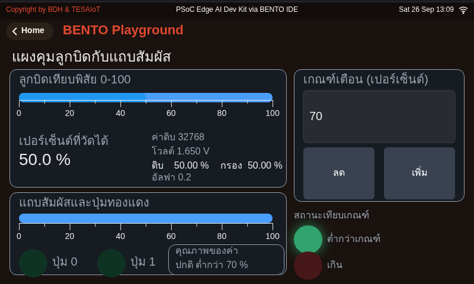
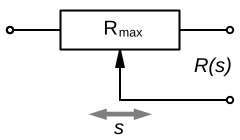
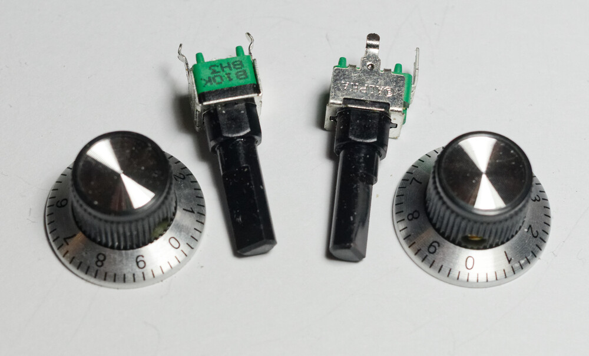
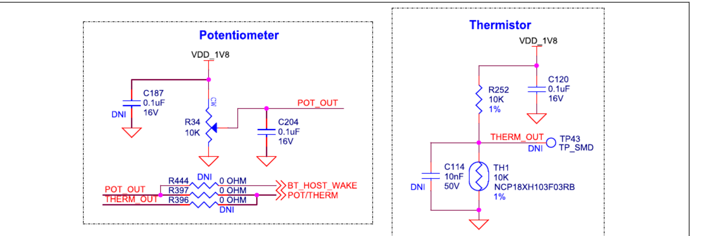
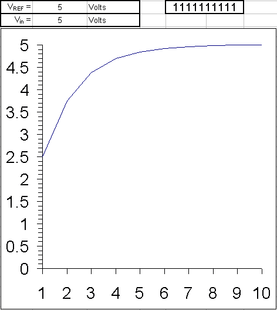
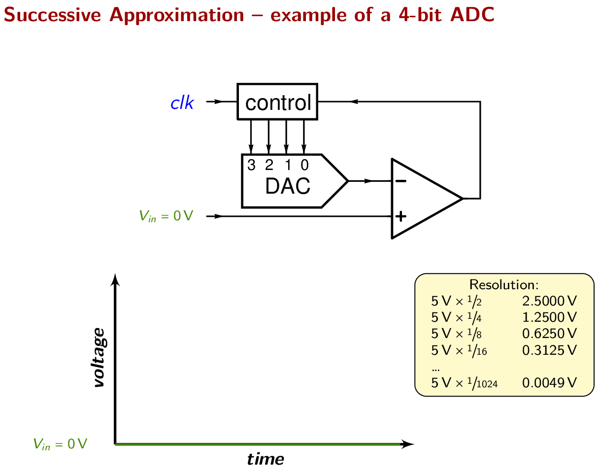
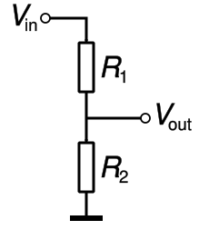
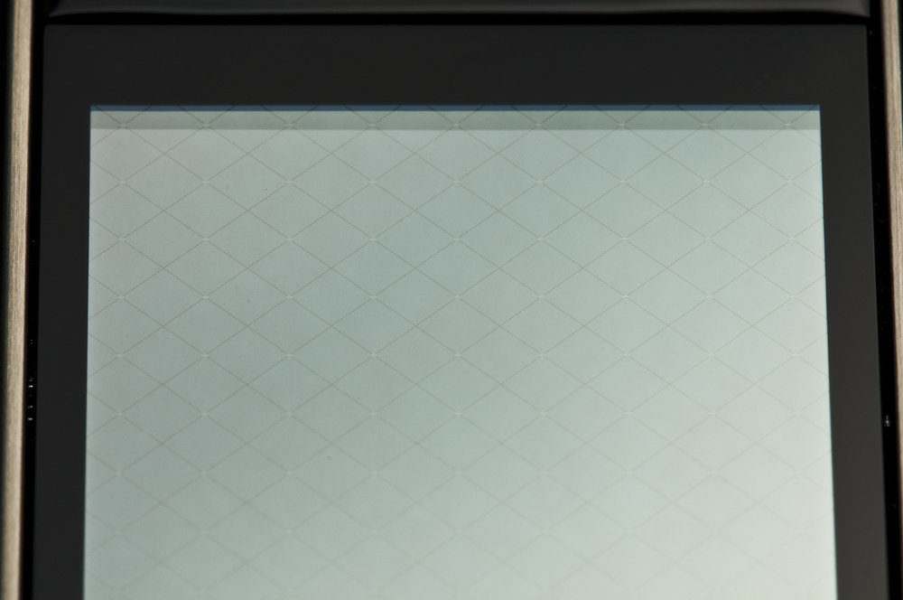
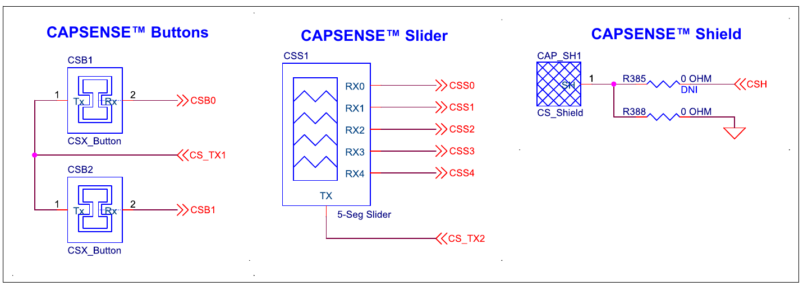

<style>
section { font-size: 24px; padding: 40px 52px; justify-content: flex-start; }
section h1 { font-size: 1.45em; line-height: 1.12; margin: 0 0 .22em; }
section h2 { font-size: 1.12em; margin: .15em 0; }
section h3 { font-size: 1.0em; margin: .12em 0; }
section p, section li { margin: .16em 0; line-height: 1.32; }
section img { max-width: 100%; height: auto; }
section svg { max-height: 330px; width: 100%; }
section table { font-size: .78em; }
section pre { font-size: .70em; line-height: 1.32; background:#0d1117; color:#e6edf3; border:1px solid #30363d; border-radius:8px; padding:12px 16px; box-shadow:0 2px 8px rgba(0,0,0,.25); }
section pre code { white-space: pre-wrap; background:transparent; color:inherit; } section pre .hljs-comment{color:#8b949e;font-style:italic} section pre .hljs-keyword,section pre .hljs-built_in,section pre .hljs-literal{color:#ff7b72} section pre .hljs-string{color:#a5d6ff} section pre .hljs-number{color:#79c0ff} section pre .hljs-title,section pre .hljs-title.function_,section pre .hljs-section{color:#d2a8ff} section pre .hljs-meta{color:#ffa657} section pre .hljs-attr,section pre .hljs-attribute,section pre .hljs-name{color:#7ee787}
section blockquote { margin: .25em 0; font-size: .92em; }
/* two images on a line (parity / 2x2 grids) stay side-by-side and small */
section p > img + img { margin-left: 10px; }
/* scroll-within-slide: dense slides scroll instead of clipping */
section { overflow-y: auto; overflow-x: hidden; }
section::-webkit-scrollbar { width: 11px; }
section::-webkit-scrollbar-thumb { background:#4a90d9; border-radius:6px; }
section::-webkit-scrollbar-track { background:rgba(0,0,0,.06); }
/* image drop-shadow + cover-slide readability (auto) */
section img{filter:drop-shadow(0 3px 12px rgba(0,0,0,.5))}
/* พื้นสำรองของสไลด์ปก: ถ้า img/cover_sNN.svg โหลดไม่ขึ้น ธีมจะคืนพื้นขาว
   แล้วตัวอักษรสีขาวของปกจะหายไปทั้งแผ่น — ปักสีเข้มไว้ให้ภาพเป็นแค่ของประดับ */
section.cover{background-color:#0b1426}
section.cover *{color:#fff !important}
section.cover h1,section.cover h2,section.cover h3,section.cover p,section.cover li,section.cover strong,section.cover em,section.cover blockquote,section.cover div{text-shadow:0 2px 9px rgba(0,0,0,.92),0 0 3px rgba(0,0,0,.8)}
section.cover div[style*="background:#"],section.cover div[style*="background: #"]{background:rgba(10,14,20,.66) !important;border-color:rgba(120,200,255,.45) !important;max-width:62%}
section.cover blockquote{border-left:4px solid rgba(120,200,255,.6) !important;background:rgba(13,17,23,.55) !important;border-radius:6px;padding:.3em .6em}
section.cover h1,section.cover h2,section.cover h3,section.cover p,section.cover blockquote{max-width:60%}
section.cover div:not(:has(img)){max-width:62%}
section.cover img{filter:none}
</style>


<!-- _class: cover -->

# บทเรียน 2.7 — อนาล็อกและสัมผัส: ADC ลูกบิด และ CapSense

## Potentiometer + CapSense + กรองสัญญาณให้อ่านรู้เรื่อง

**โมดูล 2 — จากจอสู่ฮาร์ดแวร์**

> คาถาประจำบทเรียน: **โลกจริงไม่ได้มีแค่ 0 กับ 1 — งานของเราคือแปลงมันให้เป็นตัวเลขที่เชื่อถือได้**

---

## ดูของจริงก่อน — เกจวัดของลูกบิด


<svg viewBox="0 0 940 250" xmlns="http://www.w3.org/2000/svg">
  <text x="187" y="28" text-anchor="middle" font-size="20" font-weight="700" fill="#37474f">เกจของลูกบิด (Eva: หน้า Controls)</text>
  <rect x="20" y="40" width="334" height="200" rx="12" fill="#101820" stroke="#4a90d9" stroke-width="2"/>
  <path d="M42,172 A58,58 0 0 1 158,172" fill="none" stroke="#263238" stroke-width="15" stroke-linecap="round"/>
  <g stroke-dashoffset="182"><animate attributeName="stroke-dashoffset" values="182;26;116;40;182" dur="7s" repeatCount="indefinite"/><path d="M42,172 A58,58 0 0 1 158,172" fill="none" stroke="#00bcd4" stroke-width="15" stroke-linecap="round" stroke-dasharray="182"/></g>
  <text x="100" y="164" text-anchor="middle" font-size="26" fill="#ffffff">62.4 %</text>
  <text x="100" y="212" text-anchor="middle" font-size="17" fill="#8fb8e0">ui.Arc ตามลูกบิด</text>
  <text x="186" y="92" font-size="18" fill="#00e676">Raw: 40915</text>
  <text x="186" y="124" font-size="18" fill="#00bcd4">Percent: 62.4</text>
  <text x="186" y="156" font-size="18" fill="#ffd54f">หลักสุดท้ายสั่นเอง
    <animate attributeName="fill" values="#3a3520;#ffd54f;#3a3520" dur="1.1s" repeatCount="indefinite"/></text>
  <circle cx="480" cy="140" r="52" fill="#37474f" stroke="#90a4ae" stroke-width="4"/>
  <g stroke="#ffffff"><animate attributeName="stroke" values="#ffffff;#37474f;#37474f;#ffffff" dur="2.8s" calcMode="discrete" repeatCount="indefinite"/><line x1="480" y1="140" x2="480" y2="96" stroke-width="5" stroke-linecap="round"/></g>
  <g stroke="#37474f"><animate attributeName="stroke" values="#37474f;#ffffff;#37474f;#37474f" dur="2.8s" calcMode="discrete" repeatCount="indefinite"/><line x1="480" y1="140" x2="518" y2="118" stroke-width="5" stroke-linecap="round"/></g>
  <g stroke="#37474f"><animate attributeName="stroke" values="#37474f;#37474f;#ffffff;#37474f" dur="2.8s" calcMode="discrete" repeatCount="indefinite"/><line x1="480" y1="140" x2="520" y2="162" stroke-width="5" stroke-linecap="round"/></g>
  <text x="480" y="216" text-anchor="middle" font-size="19" fill="#37474f">ลูกบิดจริงบนบอร์ด</text>
  <text x="480" y="70" text-anchor="middle" font-size="19" fill="#78909c">มือหมุน</text>
  <rect x="600" y="60" width="324" height="160" rx="10" fill="#fff8e1" stroke="#f9a825" stroke-width="2.5"/>
  <text x="762" y="96" text-anchor="middle" font-size="20" font-weight="700" fill="#f57f17">คำถามของวันนี้</text>
  <text x="762" y="132" text-anchor="middle" font-size="19" fill="#8d6e00">หยุดมือแล้ว</text>
  <text x="762" y="160" text-anchor="middle" font-size="19" fill="#8d6e00">ทำไมตัวเลขยังขยับ</text>
  <text x="762" y="196" text-anchor="middle" font-size="18" fill="#a1683a">ไม่ใช่บอร์ดเสีย</text>
</svg>

**Eva Kit** เปิดเมนู **Controls** บนบอร์ด แล้วหมุนลูกบิดช้า ๆ เข็มโค้งบนจอกวาดตามมือเราทันที · **TESAIoT Dev Kit** ไม่มีเมนู Controls (เฟิร์มแวร์ปิดหน้านี้ไว้) แต่หน้า **GPIO & RGB Matrix** บนบอร์ดมีแถบ VR1-4 ให้หมุน **VR1** บนฐานดูได้ทันที — แถบทำหน้าที่เดียวกับเข็ม · ส่วนแถบสัมผัสให้รัน [`01_capsense_dimmer.py`](https://github.com/tesaiot/tesa-qualification-program/blob/main/courses/aiot-micropython/m02-ui-to-hardware/l07-adc-capsense/examples/01_capsense_dimmer.py) (ไฟล์แรกของชุดบทเรียนนี้ตามโครงหลักสูตร) แล้วลากนิ้ว

ทีนี้ **หยุดมือนิ่งสนิท** แล้วจ้องตัวเลขเปอร์เซ็นต์ต่ออีกสิบวินาที — มันยังขยับอยู่ ทั้งที่ไม่มีใครแตะลูกบิดเลย

นั่นไม่ใช่บอร์ดเสีย และไม่ใช่โปรแกรมผิด มันคือธรรมชาติของการอ่านค่าอนาล็อก ชุดบทเรียนนี้เราจะทำสามอย่าง: อ่านค่าให้เป็น, เข้าใจว่าทำไมมันสั่น, แล้วทำให้มันนิ่งลงโดยไม่โกงค่า

> เข็มที่กวาดตามมือคือของง่าย ตัวเลขที่สั่นตอนมือหยุดต่างหากคือบทเรียนจริงของวันนี้

---

## ทำไม · คืออะไร · ทำยังไง — แผนที่ของชุดบทเรียนนี้

<style scoped>
section table { font-size: .62em; }
section table td, section table th { padding: .16em .55em; }
</style>

| | คำถาม | คำตอบของชุดบทเรียนนี้ | อยู่ช่วงไหน |
|---|---|---|---|
| **Why** | ปุ่มกับสวิตช์ก็สั่งงานได้แล้ว ทำไมต้องมาอ่านลูกบิดกับแผ่นสัมผัสอีก | เพราะของที่ IoT ต้องวัดจริง ๆ — อุณหภูมิ ระดับน้ำ แรงดัน ความชื้น ตำแหน่งวาล์ว — **ไม่มีตัวไหนตอบมาเป็น 0 กับ 1** มันตอบมาเป็นค่าต่อเนื่องที่สั่นตลอดเวลา และงานของวิศวกรไม่ใช่กำจัดการสั่น แต่คือ **เลือกฟิลเตอร์แล้วปกป้องตัวเลือกนั้นได้** | ครึ่งแรก · ADC และ CapSense · สไลด์ "ทำไมค่าดิบถึงสั่น" |
| **What** | มีอะไรให้ใช้บ้าง | โมดูล `sensors` **สิบห้าชื่อบน Eva Kit** — เก้าฟังก์ชัน (บน Eva สี่ตอบ ห้าปฏิเสธด้วย `OSError` · บน Dev Kit ห้าตัวนั้นทำงานจริง) กับหกเซนเซอร์ย่อย (Dev Kit มีเพิ่ม `dps368` `sht40` `radar`) · และโมดูล `dsp` **ทั้งสิบหกชื่อ** คือ 8 คลาสกับ 8 ฟังก์ชัน (สองตัวสเปกตรัมเพิ่ม 2026-08-20) ใช้ได้ครบทุกตัวทั้งสองบอร์ด | สองสไลด์แผนที่โมดูล |
| **How** | ประกอบยังไงให้ใช้งานได้จริง | อ่านจาก `sensors.pot` กับ `sensors.capsense` ป้อนเข้า `dsp.EMA` และ `dsp.Median` แล้ววางค่าดิบกับค่ากรองแล้วไว้ข้างกันบนจอเดียว | สิบไฟล์ตัวอย่าง + ไฟล์ฝึก |

**ปลายทางที่จับต้องได้** — เข็มโค้งหมุนตามลูกบิด แถบเลื่อนวิ่งตามนิ้ว และสองบรรทัดล่างที่ฟ้องด้วยตาว่าฟิลเตอร์กำลังทำงานอยู่จริง

> บทเรียน 2.4–2.6 คือ "จอสั่งฮาร์ดแวร์" · ชุดบทเรียนนี้กลับด้าน ฮาร์ดแวร์เป็นฝ่ายสั่งจอ

---

## เป้าหมายของชุดบทเรียนนี้

1. อธิบายได้ว่า **ADC** ทำอะไร และเลขที่ได้มาแปลว่าอะไรเมื่อเทียบกับแรงดันจริง
2. อ่านลูกบิดด้วย `sensors.pot.read()` / `.percent()` / `.voltage()` แล้วแสดงสามแถวสามสีบนจอ
3. อ่านปุ่มสัมผัสและแถบเลื่อนด้วย `sensors.capsense` และเข้าใจว่าแผ่นทองแดงรู้ได้อย่างไรว่านิ้วมาแตะ
4. ใช้ `dsp.EMA` และ `dsp.Median` ลดการสั่น แล้ว **เทียบค่าดิบกับค่ากรองแล้วบนจอพร้อมกัน**

ปลายทางของวันนี้: หน้าจอเดียวที่มีเข็มโค้งตามลูกบิด แถบเลื่อนตามนิ้ว และสองบรรทัดล่างที่ฟ้องให้เห็นว่าฟิลเตอร์ทำงานอยู่จริง

> วัดกันที่ "อ่านค่าได้และอธิบายค่าที่ได้เป็น" ไม่ใช่แค่ทำให้เข็มขยับ

---

## ปลายทางของชุดบทเรียนนี้ — จอที่ค่าจากลูกบิดวิ่งอยู่



<div style="font-size:.58em;color:#78909c;margin-top:-.3em">หน้าจอจริงจากการรันโค้ดเฉลยบน BENTO Emulator ที่ 800x480 เท่าจอของ Eva Kit และ Dev Kit — ไม่ใช่ภาพวาด ไม่ใช่ mock-up และไม่ใช่ภาพถ่ายจากบอร์ด · <b>ภาพนี้ยังเป็นหน้าจอของเฉลยรุ่นก่อนหน้า</b> รอถ่ายใหม่ให้ตรงกับโค้ดปัจจุบันที่อธิบายไว้ข้างล่าง</div>

หน้าจอของเฉลยปัจจุบันแบ่งเป็นสี่การ์ด และทุกการ์ดตอบคำถามคนละข้อ

- **บนซ้าย** ค่าจากลูกบิดเป็น `ui.Bar` วางทับ `ui.Scale` ที่มีขีดและตัวเลข 0-100 — ตัวเลขเปอร์เซ็นต์จึงไม่ได้ลอยอยู่เฉย ๆ มันมีพิสัยของตัวเองอยู่ข้าง ๆ พร้อมค่าดิบกับโวลต์กำกับ
- **บนขวา** เกณฑ์เตือนเป็น `ui.Spinbox` ที่ผู้ใช้ตั้งเองด้วยปุ่มเพิ่ม/ลด และ `ui.Led` สองดวงบอกว่าตอนนี้ต่ำกว่าเกณฑ์หรือเกิน
- **ล่างซ้าย** แถบสัมผัสวางบนไม้บรรทัดชุดเดียวกัน กับไฟสองดวงแทนสถานะปุ่มทองแดง และบรรทัดคุณภาพของค่า
- **ล่างขวา** ค่าดิบเทียบค่าที่กรองแล้ว (alpha 0.2, คาบ 200 ms) ซึ่งเป็นบทเรียนหลักของครึ่งหลังของชุดบทเรียน

> ค่าเดียวกันแสดงได้หลายแบบ — เลือกให้ตรงกับคำถามที่คนดูจออยากรู้ และค่าที่วัดได้ต้องมาพร้อมเกณฑ์ของมันเสมอ

---

## ทบทวนบทเรียน 2.4–2.6 — ของที่ต้องหยิบมาใช้ต่อวันนี้

<svg viewBox="0 0 940 170" xmlns="http://www.w3.org/2000/svg" style="width:76%;display:block;margin:0 auto">
  <defs><marker id="s5r" markerWidth="10" markerHeight="8" refX="9" refY="4" orient="auto">
    <path d="M0,0 L10,4 L0,8 z" fill="#455a64"/></marker></defs>
  <text x="16" y="34" font-size="19" font-weight="700" fill="#1565c0">บทเรียน 2.4–2.6 · จอสั่งฮาร์ดแวร์</text>
  <rect x="300" y="14" width="170" height="46" rx="8" fill="#e3f2fd" stroke="#1565c0" stroke-width="2"/>
  <text x="385" y="44" text-anchor="middle" font-size="18" fill="#0d47a1">นิ้วบนกระจก</text>
  <rect x="520" y="14" width="150" height="46" rx="8" fill="#eceff1" stroke="#455a64" stroke-width="2"/>
  <text x="595" y="44" text-anchor="middle" font-size="18" fill="#37474f">โค้ดของเรา</text>
  <rect x="720" y="14" width="200" height="46" rx="8" fill="#ffebee" stroke="#c62828" stroke-width="2"/>
  <text x="820" y="44" text-anchor="middle" font-size="18" fill="#8e0000">หลอด LED จริง</text>
  <line x1="474" y1="37" x2="514" y2="37" stroke="#455a64" stroke-width="3" marker-end="url(#s5r)"/>
  <line x1="674" y1="37" x2="714" y2="37" stroke="#455a64" stroke-width="3" marker-end="url(#s5r)"/>
  <g><animateTransform attributeName="transform" type="translate" values="0,0;300,0;0,0" dur="4s" repeatCount="indefinite"/><circle cx="490" cy="74" r="8" fill="#1565c0"/></g>
  <text x="16" y="122" font-size="19" font-weight="700" fill="#00838f">บทเรียน 2.7–2.9 · ฮาร์ดแวร์สั่งจอ</text>
  <rect x="300" y="102" width="170" height="46" rx="8" fill="#fff3e0" stroke="#ef6c00" stroke-width="2"/>
  <text x="385" y="132" text-anchor="middle" font-size="18" fill="#bf360c">จอแสดงผล</text>
  <rect x="520" y="102" width="150" height="46" rx="8" fill="#eceff1" stroke="#455a64" stroke-width="2"/>
  <text x="595" y="132" text-anchor="middle" font-size="18" fill="#37474f">โค้ดของเรา</text>
  <rect x="720" y="102" width="200" height="46" rx="8" fill="#e0f7fa" stroke="#00838f" stroke-width="2"/>
  <text x="820" y="132" text-anchor="middle" font-size="18" fill="#006064">ลูกบิด · นิ้วสัมผัส</text>
  <line x1="514" y1="125" x2="474" y2="125" stroke="#455a64" stroke-width="3" marker-end="url(#s5r)"/>
  <line x1="714" y1="125" x2="674" y2="125" stroke="#455a64" stroke-width="3" marker-end="url(#s5r)"/>
  <g><animateTransform attributeName="transform" type="translate" values="0,0;-300,0;0,0" dur="4s" repeatCount="indefinite"/><circle cx="790" cy="86" r="8" fill="#00838f"/></g>
  <text x="16" y="76" font-size="18" fill="#78909c">ทิศทางข้อมูล</text>
  <text x="16" y="160" font-size="18" fill="#78909c">กลับด้านกัน</text>
</svg>

ชุดบทเรียนก่อนหน้าเราสร้างแผงควบคุมของทีมเอง จากบทเรียนนั้นมีสี่อย่างที่วันนี้ใช้ซ้ำทั้งหมด

| ของจากบทเรียน 2.4–2.6 | วันนี้ใช้ตรงไหน |
|---|---|
| `ui.Label` / `ui.Bar` / `ui.Panel` และ `x, y, w, h, color` | สร้างการ์ด แถบค่า และบรรทัดตัวเลข |
| `ui.poll()` ทุกลูป | ยังบังคับเหมือนเดิม ไม่เรียกแล้ว widget หายไปได้ถึง 2 วินาที และปุ่มบนจอกดไม่ติด |
| `time.sleep_ms()` คุมจังหวะ | ชุดบทเรียนนี้ใช้ 200 ms เพราะจอมีของหลายชิ้น |
| งบของคอร์ส 32 widget (เพดานเฟิร์มแวร์ 64) | เฉลยวันนี้ใช้ 33 ชิ้น เกินงบของคอร์สไปหนึ่งชิ้น ต่อยอดเมื่อไรต้องเอาชิ้นเดิมออกก่อน |

**ของใหม่ที่เพิ่มเข้ามา:** โมดูล `sensors` (ลูกบิด + สัมผัส) · โมดูล `dsp` (ฟิลเตอร์) · widget สามตัวของหน้าจอ HMI คือ `ui.Scale` (ไม้บรรทัด) `ui.Led` (ไฟสถานะ) `ui.Spinbox` (ช่องป้อนเลข) — ตัวอย่างประกอบที่ [`09_scale_led_spinbox.py`](https://github.com/tesaiot/tesa-qualification-program/blob/main/courses/aiot-micropython/m02-ui-to-hardware/l06-touch-panel-lab/examples/09_scale_led_spinbox.py)

<!-- บทเรียน 2.4–2.6 คือ "จอสั่งฮาร์ดแวร์" บทเรียน 2.7–2.9 คือ "ฮาร์ดแวร์สั่งจอ" — ทิศทางข้อมูลกลับด้านกัน -->

---

## เข้าใจฮาร์ดแวร์ · ADC หั่นแรงดันต่อเนื่องเป็นขั้นบันได

ลูกบิดบนบอร์ดไม่ได้ส่งตัวเลขออกมา มันส่ง **แรงดันไฟ** ที่ไล่ต่อเนื่องจาก 0 V ขึ้นไปถึงแรงดันอ้างอิงของวงจร (ตัวเลขจริงของบอร์ดนี้ยังไม่ลงตัว — สองสไลด์ถัดไปว่าด้วยเรื่องนี้โดยเฉพาะ) วงจร **SAR ADC** ในชิปมีหน้าที่วัดแรงดันนั้นเป็นจังหวะ ๆ แล้วปัดลงขั้นบันไดที่ใกล้ที่สุด

<svg viewBox="0 0 900 270" xmlns="http://www.w3.org/2000/svg">
  <line x1="60" y1="230" x2="860" y2="230" stroke="#90a4ae" stroke-width="2"/>
  <line x1="60" y1="230" x2="60" y2="30" stroke="#90a4ae" stroke-width="2"/>
  <text x="18" y="40" font-size="18" fill="#546e7a">V_ref</text>
  <text x="30" y="248" font-size="18" fill="#546e7a">0 V</text>
  <g><animateTransform attributeName="transform" type="translate" values="0,0;760,0;0,0" dur="8s" repeatCount="indefinite"/><line x1="80" y1="30" x2="80" y2="230" stroke="#c62828" stroke-width="3"/></g>
  <text x="460" y="264" text-anchor="middle" font-size="18" fill="#546e7a">เวลา — ADC สุ่มวัดทุก ๆ จังหวะ (จุดวงกลม) · เส้นแดงคือหัวอ่านที่กวาดไปตามเวลา</text>
  <path d="M60,200 C160,60 240,210 340,120 C440,40 540,190 640,90 C720,20 800,150 860,70" fill="none" stroke="#ef6c00" stroke-width="3"/>
  <g fill="#1565c0" opacity="0.9">
    <rect x="60" y="180" width="80" height="50"/>
    <rect x="140" y="120" width="80" height="110"/>
    <rect x="220" y="170" width="80" height="60"/>
    <rect x="300" y="130" width="80" height="100"/>
    <rect x="380" y="70" width="80" height="160"/>
    <rect x="460" y="120" width="80" height="110"/>
    <rect x="540" y="160" width="80" height="70"/>
    <rect x="620" y="90" width="80" height="140"/>
    <rect x="700" y="50" width="80" height="180"/>
    <rect x="780" y="80" width="80" height="150"/>
  </g>
  <g fill="#0d47a1">
    <circle cx="100" cy="180" r="5"/><circle cx="180" cy="120" r="5"/><circle cx="260" cy="170" r="5"/>
    <circle cx="340" cy="130" r="5"/><circle cx="420" cy="70" r="5"/><circle cx="500" cy="120" r="5"/>
    <circle cx="580" cy="160" r="5"/><circle cx="660" cy="90" r="5"/><circle cx="740" cy="50" r="5"/><circle cx="820" cy="80" r="5"/>
  </g>
  <text x="470" y="22" text-anchor="middle" font-size="17" font-weight="700" fill="#37474f">เส้นส้ม = แรงดันจริงต่อเนื่อง · แท่งน้ำเงิน = ตัวเลขที่โปรแกรมเราได้เห็น</text>
</svg>

> ตัวเลขที่ Python อ่านได้ ไม่ใช่แรงดันจริง แต่เป็น **ค่าที่ถูกปัดเข้าขั้นบันไดที่ใกล้ที่สุด ณ วินาทีที่วัด**

---

## หนึ่งลูกบิด สามหน้าตา — เลือกใช้ให้ถูกงาน

```python
import sensors
# ไม่ต้องเรียก sensors.init() ทั้งสองบอร์ด - บน Eva Kit เรียกแล้วขึ้น OSError
# ทันที (คอร์จอเป็นเจ้าของบัส) ส่วนบน Dev Kit ผ่าน แต่ก็ไม่จำเป็นอยู่ดี

raw   = sensors.pot.read()      # 0 - 65535   จำนวนเต็ม ทั้งสองบอร์ด (Dev Kit = VR1)
pct   = sensors.pot.percent()   # 0.0 - 100.0 เปอร์เซ็นต์ของช่วงเต็มสเกล
volts = sensors.pot.voltage()   # ทศนิยม หน่วยโวลต์ (ดูสไลด์ถัดไปก่อนเชื่อตัวเลข)
```

 

<div style="font-size:.6em;color:#78909c;margin-top:-.35em">ซ้าย: สัญลักษณ์ในผังวงจร ปลายสองข้างคือปลายแทร็กตัวต้านทาน ลูกศรตรงกลางคือ wiper ที่เลื่อนไปตามแทร็ก — ภาพ: “Potentiometer linear” · สาธารณสมบัติ · Wikimedia Commons &nbsp;|&nbsp; ขวา: ของจริงที่มือเราหมุน — ภาพ: “23mm knob with numbered dials with potentiometers 01(DXO)” โดย Retired electrician · CC0 1.0 · Wikimedia Commons</div>

ทั้งสามค่ามาจากการวัดครั้งเดียวกัน ต่างกันแค่หน่วยที่เอามาเสิร์ฟ — `read()` ดูความละเอียดดิบและความสั่น · `percent()` เข้ากับ `ui.Arc` / `ui.Bar` ที่คิดเป็น 0-100 อยู่แล้ว · `voltage()` ไว้เทียบกับมัลติมิเตอร์

**เปลี่ยนจากที่เคยสอน:** สามคำสั่งข้างบน **ไม่ได้ตั้งค่า ADC เอง** — บน Eva Kit คอร์จอ (CM55) อ่านลูกบิดแล้ว Python หยิบค่าจาก snapshot · บน Dev Kit CM33 อ่าน **VR1** บนฐาน QWA309 ตรง (อีกสามตัวอยู่ที่ `pots.read(1..3)` คืน 0-4095 คนละสเกล) · ทั้งสองทางคืน 0-65535 หน้าตาเดียวกัน — ไม่ต้องมี `init()` ไม่ต้องหน่วง 500 ms

> เลือกหน่วยตาม *คนอ่าน* ไม่ใช่ตามความสะดวกของโปรแกรม — เกจเป็นเปอร์เซ็นต์ รายงานวิศวกรรมเป็นโวลต์

---

## เข้าใจฮาร์ดแวร์ · ลูกบิดของ Eva Kit ต่ออยู่กับอะไรจริง ๆ



<div style="font-size:.62em;color:#78909c;margin-top:-.35em">ภาพ: KIT_PSE84_EVAL PSOC™ Edge E84 Evaluation Kit guide, Infineon 002-39007 Rev.*B, รูปที่ 77 (หน้า 88) — ใช้เพื่อการเรียนการสอน · ผังนี้เป็นของ Eva Kit เท่านั้น</div>

R34 คือ pot **10 kΩ แบบ linear** ต่อคร่อมระหว่างรางไฟกับกราวด์ ขากลาง (wiper) ออกมาเป็น `POT_OUT` — **ตัวแบ่งแรงดันที่ปรับได้ด้วยมือ** ตรงตามสัญลักษณ์ในสไลด์ที่แล้ว · กล่องขวา: **thermistor TH1** ใช้เส้นทางเดียวกันผ่านตัวต้านทาน 0 Ω ที่ mark ว่า DNI — Eva Kit ใช้ **pot กับ thermistor พร้อมกันไม่ได้** ค่าเริ่มต้นคือ pot

**บน TESAIoT Dev Kit** ลูกบิดที่ `sensors.pot` อ่านคือ **VR1** บนฐาน QWA309 — ผัง QWA309 ระบุแรงดันอ้างอิงของ VR1-4 ไว้ **0-1.8 V** (SAR 12 บิต) ขณะที่ `voltage()` คูณด้วย 3.3 V — **ขัดกันแบบเดียวกับ Eva** · ส่วนค่าความต้านทาน ทิศหมุน และ taper ของ VR1 ยังไม่ได้วัด ให้ทีมจดจากบอร์ดจริงลงบันทึกการเรียน อย่าเอาตัวเลขของ R34 ไปใช้

> **หมายเหตุผู้สอน (ต้องเคลียร์ก่อนสอน):** ผัง Eva ต่อ R34 กับ **VDD_1V8** และผัง QWA309 ก็ระบุ **0-1.8 V** แต่ `sensors.pot.voltage()` คูณด้วย **3.3 V ที่สมมติไว้ ทั้งสองบอร์ด** — **ยังไม่มีใครเอามิเตอร์ไปยืนยันบนบอร์ดไหนเลย** ห้ามพูดตัวเลขใดตัวเลขหนึ่งเป็นความจริงบนกระดาน ให้หมุนสุดแล้วอ่าน `pot.read()` / `pot.voltage()` เทียบกับมัลติมิเตอร์ที่ขาลูกบิดของบอร์ดจริงก่อน (**Eva: ขา P15[1] · Dev Kit: ขากลางของ VR1**) แล้วค่อยเขียนตัวเลขลงสไลด์

---

## จากเลขดิบเป็นเปอร์เซ็นต์และเป็นโวลต์ — สูตรที่ไม่ผูกกับตัวเลขใดตัวเลขหนึ่ง

<div style="display:flex;gap:20px;align-items:flex-start">
<div style="flex:1 1 54%">

`read()` คืนจำนวนเต็ม **0 - 65535** นั่นคือ "สเกลของ API" ($n = 16$) ไม่ได้แปลว่าฮาร์ดแวร์ละเอียด 65536 ขั้นจริง

$$p = \frac{\text{raw}}{2^{n}-1}\times 100\% \qquad V = \frac{\text{raw}}{2^{n}-1}\cdot V_{\text{ref}}$$

$$V_{\text{LSB}} = \frac{V_{\text{FS}}}{2^{n}} \qquad \varepsilon_q \le \frac{V_{\text{LSB}}}{2}$$

ไทย: ค่าที่อ่านได้ไม่ต่อเนื่อง มันกระโดดทีละขั้น ขั้นหนึ่งใหญ่แค่ไหนขึ้นกับจำนวนบิต และความคลาดเคลื่อนจากการปัดไม่เกินครึ่งขั้น

**คิดให้ดูจริง ๆ** สมมติ `read()` คืน 40915

$$p = \frac{40915}{65535}\times 100 = 62.43\%$$

ส่วน $V$ ตอบเป็นโวลต์ไม่ได้จนกว่าจะรู้ $V_{\text{ref}}$ ของบอร์ดจริง

**ตัวส่วนมีสองแบบ อย่าสลับ:** แปลงเป็นค่าอ่านใช้ $2^{n}-1$ (ratiometric) · ขนาดหนึ่งขั้นใช้ $2^{n}$

</div>
<div style="flex:0 0 42%">


<div style="font-size:.6em;color:#78909c;margin-top:-.4em">ภาพ: “Quantization error” โดย Gregory Maxwell — CC BY 3.0 · Wikimedia Commons</div>

<div style="font-size:.86em;margin-top:.5em">

**สิ่งที่ต้องวัดเอง:** เลื่อนลูกบิดช้า ๆ แล้วดูว่า `read()` เดินทีละเท่าไร ถ้ากระโดดเป็นก้อนละ $k$ เท่ากันทุกก้อน ความละเอียดจริงคือ $65536/k$ ขั้น — ก้อนละ 16 ก็คือ 4096 ขั้น จดลงบันทึกการเรียน **อย่าเดาจากสเปกที่ยังไม่ได้อ่าน**

สิ่งที่รู้จากซอร์สเฟิร์มแวร์: ADC ของทั้งสองบอร์ดอ่านได้ **12 บิต (0-4095)** แล้วเฟิร์มแวร์คูณขยายเป็น 0-65535 ก่อนส่งให้เรา — 65535 จึงเป็นสเกลของ API ไม่ใช่ความละเอียดของ ADC

</div>

</div>
</div>

> "เลขใหญ่" กับ "เลขละเอียด" เป็นคนละเรื่องกัน สเกลขยายได้ แต่ความจริงที่วัดมามีอยู่เท่าเดิม

---

## เกร็ด: ข้างใน SAR ADC คือการ "ทายเลข" แบบไบนารีเสิร์ช

<div style="display:flex;gap:20px;align-items:flex-start">
<div style="flex:0 0 40%">



<div style="font-size:.6em;color:#78909c;margin-top:-.4em">ภาพ: “ADC animation 20” โดย Russ Puskarcik — CC BY 3.0 · Wikimedia Commons</div>

</div>
<div style="flex:1 1 56%">

SAR ย่อมาจาก **Successive Approximation Register** — แปลตรงตัวคือ "ทะเบียนของการประมาณทีละขั้น"

วิธีทำงานเหมือนเกมทายเลข 1-100 ที่เราเล่นกันตอนเด็ก: เดาครึ่งทางก่อน ถ้าสูงไปก็ตัดครึ่งบนทิ้ง แล้วเดาครึ่งของที่เหลือต่อไป

1. ตรึงค่าแรงดันไว้ก่อนด้วยวงจร sample-and-hold (ถ้าไม่ตรึง ค่าจะเปลี่ยนระหว่างที่กำลังทาย)
2. ทายบิตบนสุด: แรงดันมากกว่าครึ่งของเต็มสเกลไหม → ได้ 1 บิต
3. ทำซ้ำลงมาทีละบิตจนครบ n บิต

**ทำไมต้องรู้:** เพราะการแปลงหนึ่งครั้ง **กินเวลา n รอบนาฬิกา** ไม่ใช่ทันที นี่คือเหตุผลที่ ADC ทุกตัวมีเพดานอัตราการสุ่ม และเป็นที่มาของกฎ Nyquist ที่เราจะเจอเต็ม ๆ ในบทเรียน 3.4–3.6

</div>
</div>



<div style="font-size:.6em;color:#78909c;margin-top:-.4em">DAC ภายในที่ไล่ทายทีละบิตจริง ๆ ขั้นบันไดที่ขยับทีละครั้งคือหัวใจของคำว่าไบนารีเสิร์ช ภาพนิ่งเห็นแค่ผลลัพธ์ — ภาพ: “4-bit Successive Approximation DAC” โดย Uwezi — CC BY-SA 4.0 — Wikimedia Commons</div>

**เชื่อมกับวันนี้:** ตัวเลขที่ `sensors.pot.read()` คืนมา คือผลของการทายแบบนี้ที่จบไปแล้วเมื่อเสี้ยววินาทีก่อน ไม่ใช่แรงดัน ณ วินาทีที่เราอ่านตัวแปร

---

## ดูเพิ่ม · ลูกบิดกับตัวแบ่งแรงดันทำงานอย่างไร

<div style="display:flex;gap:16px;align-items:flex-start">
<div style="flex:0 0 22%">



<div style="font-size:.58em;color:#78909c">วงจรที่อยู่ข้างในลูกบิด — ภาพ: “Voltage divider” · สาธารณสมบัติ · Wikimedia Commons</div>

</div>
<div style="flex:0 0 36%;border:2px solid #90a4ae;border-radius:8px;padding:8px 10px;background:#eceff1">
<div style="font-size:.72em;font-weight:700;color:#37474f">How Potentiometers Work · CircuitBread</div>
<iframe width="100%" height="170" src="https://www.youtube.com/embed/LBRM9lARNN8" title="How Potentiometers Work - With Real-Life Examples | CircuitBread" loading="lazy" frameborder="0" allowfullscreen></iframe>
<div style="font-size:.66em;color:#546e7a">ทำไมต้องต่อครบสามขาถึงจะได้ "แรงดันที่ปรับได้" ต่อสองขาได้แค่ความต้านทานที่ปรับได้เฉย ๆ</div>
</div>
<div style="flex:0 0 36%;border:2px solid #90a4ae;border-radius:8px;padding:8px 10px;background:#eceff1">
<div style="font-size:.72em;font-weight:700;color:#37474f">Voltage divider · Khan Academy</div>
<iframe width="100%" height="170" src="https://www.youtube.com/embed/t_hPrz7rs34" title="Voltage divider | Circuit analysis | Khan Academy" loading="lazy" frameborder="0" allowfullscreen></iframe>
<div style="font-size:.66em;color:#546e7a">อนุมานสูตร Vout = Vin × R2 / (R1 + R2) จากกฎของโอห์มทีละขั้น</div>
</div>
</div>

**สูตรที่ทั้งสองคลิปพาไปถึง** $V_{out} = V_{in}\cdot\dfrac{R_2}{R_1+R_2}$ — ในลูกบิด $R_1$ กับ $R_2$ คือแทร็กสองท่อนที่ wiper แบ่งเอาไว้ หมุนไปครึ่งทางจึงได้แรงดันครึ่งหนึ่ง · ทั้งสองคลิปเป็นของนอกเวลา (ต้องมีอินเทอร์เน็ต) เนื้อหาในบทเรียนเข้าใจได้ครบโดยไม่ต้องเปิดดู

> ลูกบิดคือตัวแบ่งแรงดันที่เราหมุนเปลี่ยนอัตราส่วนได้ด้วยมือ ทุกอย่างที่เหลือในชุดบทเรียนนี้ต่อยอดจากประโยคนี้

---

## CapSense — รู้ได้อย่างไรว่านิ้วมาแตะ ทั้งที่ไม่มีสวิตช์

ใต้แผ่นพลาสติกของปุ่มสัมผัส (บน Eva Kit คือตรงที่เขียนว่า BTN0 / BTN1 · บน Dev Kit ตำแหน่งและป้ายของแผ่นสัมผัสยังไม่ได้บันทึกในเอกสารชุดนี้ ให้หาบนบอร์ดของทีม — ในโค้ดชื่อ `btn0` `btn1` `slider` เหมือนกันทั้งสองบอร์ด) ไม่มีปุ่มกดอยู่เลย มีแค่ **แผ่นทองแดงบนแผ่นวงจร** ที่เก็บประจุได้จำนวนหนึ่ง เรียกว่า capacitance ชิปจะอัดประจุเข้าไปแล้วจับเวลาว่ามันเต็มเร็วแค่ไหน

<svg viewBox="0 0 940 250" xmlns="http://www.w3.org/2000/svg">
  <rect x="14" y="30" width="440" height="196" rx="10" fill="#fafafa" stroke="#90a4ae" stroke-width="2"/>
  <text x="234" y="56" text-anchor="middle" font-size="20" font-weight="700" fill="#37474f">ไม่มีนิ้ว</text>
  <path d="M130,150 Q234,66 338,150" fill="none" stroke="#7e57c2" stroke-width="2.5"/>
  <path d="M152,150 Q234,88 316,150" fill="none" stroke="#7e57c2" stroke-width="2.5"/>
  <path d="M174,150 Q234,110 294,150" fill="none" stroke="#7e57c2" stroke-width="2.5"/>
  <rect x="120" y="150" width="228" height="16" fill="#ef6c00"/>
  <rect x="120" y="140" width="228" height="8" fill="#b3e5fc"/>
  <text x="234" y="190" text-anchor="middle" font-size="18" fill="#546e7a">แผ่นทองแดงใต้กระจก</text>
  <text x="234" y="216" text-anchor="middle" font-size="19" font-weight="700" fill="#5e35b1">ความจุ = C₀</text>
  <rect x="486" y="30" width="440" height="196" rx="10" fill="#fafafa" stroke="#c62828" stroke-width="2"/>
  <text x="706" y="56" text-anchor="middle" font-size="20" font-weight="700" fill="#c62828">มีนิ้วเข้ามาใกล้</text>
  <g><animateTransform attributeName="transform" type="translate" values="0,-26;0,0;0,-26" dur="3.2s" repeatCount="indefinite"/><rect x="676" y="70" width="60" height="54" rx="26" fill="#ffcc9a" stroke="#c98a58" stroke-width="2"/></g>
  <path d="M602,150 Q640,96 690,102" fill="none" stroke="#7e57c2" stroke-width="2.5"/>
  <path d="M810,150 Q772,96 722,102" fill="none" stroke="#7e57c2" stroke-width="2.5"/>
  <path d="M646,150 Q706,116 766,150" fill="none" stroke="#7e57c2" stroke-width="2.5"/>
  <rect x="592" y="150" width="228" height="16" fill="#ef6c00"/>
  <rect x="592" y="140" width="228" height="8" fill="#b3e5fc"/>
  <text x="706" y="190" text-anchor="middle" font-size="18" fill="#546e7a">นิ้วดึงเส้นสนามส่วนหนึ่งไป</text>
  <text x="706" y="216" text-anchor="middle" font-size="19" font-weight="700" fill="#c62828">ความจุ = C₀ + ΔC
    <animate attributeName="fill" values="#f2d0d0;#c62828;#f2d0d0" dur="3.2s" repeatCount="indefinite"/></text>
  <text x="470" y="22" text-anchor="middle" font-size="19" font-weight="700" fill="#37474f">นิ้วคือตัวนำที่ต่อลงกราวด์ผ่านร่างกาย — มันเพิ่มความจุให้แผ่น</text>
</svg>

นิ้วคนเป็นตัวนำที่ต่อลงกราวด์ผ่านร่างกาย พอนิ้วเข้ามาใกล้ ค่า capacitance ของแผ่นนั้น **เพิ่มขึ้น** เวลาที่ใช้อัดประจุจึงนานขึ้นเล็กน้อย ชิปวัดความต่างนั้นได้ และสรุปว่า "มีนิ้ว"

แถบเลื่อนใช้หลักการเดียวกัน แต่วางแผ่นทองแดงเรียงกันหลายแผ่น แล้วดูว่านิ้วทำให้แผ่นไหนเปลี่ยนมากที่สุด เอามาถัวเฉลี่ยเป็นตำแหน่ง 0-100

---

## CapSense (ต่อ) — ผิวสัมผัสของจริง ไม่มีสวิตช์ ไม่มีชิ้นส่วนขยับ



<div style="font-size:.6em;color:#78909c;margin-top:-.4em">ภาพถ่ายผิวสัมผัสแบบ capacitive ของจริง ไม่มีสวิตช์ ไม่มีชิ้นส่วนขยับ มีแต่แผ่นตัวนำ นี่คือสิ่งที่นิ้วไปเปลี่ยนค่าของมัน — ภาพ: “Capacitive touchscreen” โดย Medvedev — CC BY 3.0 — Wikimedia Commons</div>

> ปุ่มสัมผัสไม่ได้วัด "แรงกด" มันวัด **ความใกล้ของตัวนำ** — นี่คือเหตุผลที่ใส่ถุงมือยางหนา ๆ แล้วมันไม่ติด

---

## อิเล็กโทรดจริงบน Eva Kit — และวิดีโอจากผู้ผลิตชิป

<div style="display:flex;gap:18px;align-items:flex-start">
<div style="flex:1 1 62%">



<div style="font-size:.6em;color:#78909c;margin-top:-.4em">ภาพ: KIT_PSE84_EVAL PSOC™ Edge E84 Evaluation Kit guide, Infineon 002-39007 Rev.*B, รูปที่ 52 (หน้า 65) — ใช้เพื่อการเรียนการสอน</div>

</div>
<div style="flex:0 0 34%;border:2px solid #90a4ae;border-radius:8px;padding:8px 10px;background:#eceff1">
<div style="font-size:.7em;font-weight:700;color:#37474f">PSoC 101 Lesson 13: CapSense</div>
<iframe width="100%" height="190" src="https://www.youtube.com/embed/fsxwYpacrCA" title="PSoC 101: Lesson 13 CapSense | Cypress Semiconductor" loading="lazy" frameborder="0" allowfullscreen></iframe>
<div style="font-size:.64em;color:#546e7a">วิดีโอสอนจากผู้ผลิตชิปเดิม (ของนอกเวลา ต้องมีเน็ต)</div>
</div>
</div>

บน Eva Kit ปุ่มสองปุ่ม **CSB1 / CSB2** เป็นแบบ **CSX (mutual-capacitance)** — สังเกตว่าแต่ละปุ่มมีขา **Tx** กับ **Rx** แยกกัน ไม่ใช่ขาเดียว ประจุถูกส่งจาก Tx ไป Rx และนิ้วเข้ามา "ขโมย" ส่วนหนึ่งไป · แถบเลื่อนคือ **5 อิเล็กโทรด (RX0-RX4)** ที่ชิปถัวเฉลี่ยออกมาเป็นตำแหน่งเดียว 0-100 · ผังอิเล็กโทรดของ Dev Kit ยังไม่มีในเอกสารชุดนี้ — แต่ค่าที่โค้ดได้รับคือชุดเดียวกัน

> ในโค้ดเราเห็นแค่ `btn0 / btn1 / slider` สามค่า เหมือนกันทั้งสองบอร์ด — ข้างใต้มันคืออิเล็กโทรดหลายแผ่นกับชิปอีกตัวหนึ่งที่ทำงานให้ตลอดเวลา

---

## เข้าใจฮาร์ดแวร์ · ชิปคนละตัว คุยกันผ่าน I2C สามไบต์

งานสัมผัสไม่ได้ทำโดยชิปหลัก แต่ทำโดย **PSoC 4000T** อีกตัวหนึ่งบนบอร์ด ทำหน้าที่นี้อย่างเดียวตลอดเวลา — ทั้ง Eva Kit และ Dev Kit ใช้ทางเดียวกัน คือชิปตัวนี้ส่งค่าให้คอร์จอ (CM55) แล้ว Python ขอต่อจากคอร์จอ

<svg viewBox="0 0 900 250" xmlns="http://www.w3.org/2000/svg">
  <defs><marker id="c1" markerWidth="10" markerHeight="8" refX="9" refY="4" orient="auto">
    <path d="M0,0 L10,4 L0,8 z" fill="#00838f"/></marker></defs>
  <rect x="20" y="60" width="190" height="120" rx="10" fill="#e0f7fa" stroke="#00838f" stroke-width="2"/>
  <text x="115" y="95" text-anchor="middle" font-size="17" font-weight="700" fill="#00838f">แผ่นทองแดง</text>
  <text x="115" y="122" text-anchor="middle" font-size="17" fill="#006064">BTN0 · BTN1</text>
  <text x="115" y="146" text-anchor="middle" font-size="17" fill="#006064">แถบเลื่อนหลายช่อง</text>
  <rect x="270" y="45" width="230" height="150" rx="10" fill="#e8f5e9" stroke="#2e7d32" stroke-width="2"/>
  <text x="385" y="80" text-anchor="middle" font-size="18" font-weight="700" fill="#2e7d32">PSoC 4000T</text>
  <text x="385" y="108" text-anchor="middle" font-size="17" fill="#1b5e20">อัดประจุ จับเวลา</text>
  <text x="385" y="132" text-anchor="middle" font-size="17" fill="#1b5e20">เทียบกับ baseline</text>
  <text x="385" y="156" text-anchor="middle" font-size="17" fill="#1b5e20">สรุปเป็นแตะ/ไม่แตะ</text>
  <text x="385" y="180" text-anchor="middle" font-size="17" fill="#4a7c4e">ต้องถูก flash เฟิร์มแวร์มาก่อน</text>
  <rect x="620" y="60" width="250" height="120" rx="10" fill="#e3f2fd" stroke="#1565c0" stroke-width="2"/>
  <text x="745" y="95" text-anchor="middle" font-size="17" font-weight="700" fill="#1565c0">คอร์จอ CM55 → CM33 Python</text>
  <text x="745" y="122" text-anchor="middle" font-size="17" fill="#0d47a1">sensors.capsense.read()</text>
  <text x="745" y="148" text-anchor="middle" font-size="17" fill="#0d47a1">ขอ dict สามช่องต่อจากคอร์จอ</text>
  <line x1="212" y1="120" x2="266" y2="120" stroke="#00838f" stroke-width="3" marker-end="url(#c1)"/>
  <line x1="503" y1="120" x2="616" y2="120" stroke="#00838f" stroke-width="3" marker-end="url(#c1)"/>
  <text x="560" y="105" text-anchor="middle" font-size="17" font-weight="700" fill="#00838f">I2C แอดเดรส 0x08</text>
  <text x="560" y="142" text-anchor="middle" font-size="17" fill="#00695c">คอร์จออ่านรวด 3 ไบต์</text>
  <text x="450" y="228" text-anchor="middle" font-size="17" fill="#455a64">ไบต์ 0 = ปุ่ม 0 · ไบต์ 1 = ปุ่ม 1 · ไบต์ 2 = ตำแหน่งแถบเลื่อน 0-100</text>
</svg>

> **หมายเหตุผู้สอน:** ถ้าชิป 4000T ยังไม่ถูก flash ทุกค่าที่อ่านได้จะเป็น 255 หรือโยน `OSError` — ต้องตรวจให้ครบทุกบอร์ดก่อนเข้าชุดบทเรียนนี้

---

## baseline — เหตุผลที่ต้อง "ปล่อยมือ" ตอนโปรแกรมเริ่ม

ค่าความจุของแผ่นทองแดงไม่ได้คงที่ตายตัว มันเปลี่ยนตามความชื้น อุณหภูมิ และแม้แต่ฝุ่นบนหน้าจอ ชิปจึงไม่ตัดสินจากค่าดิบ แต่ตัดสินจาก **ส่วนต่างเทียบกับค่าตอนไม่มีนิ้ว** ค่านั้นเรียกว่า baseline

<svg viewBox="0 0 940 215" style="max-height:200px" xmlns="http://www.w3.org/2000/svg">
  <line x1="70" y1="180" x2="910" y2="180" stroke="#90a4ae" stroke-width="2"/>
  <line x1="70" y1="180" x2="70" y2="24" stroke="#90a4ae" stroke-width="2"/>
  <text x="16" y="40" font-size="18" fill="#546e7a">raw</text>
  <text x="16" y="62" font-size="18" fill="#546e7a">count</text>
  <path d="M70,150 L200,146 L330,141 L460,137 L590,133 L720,128 L910,122" fill="none" stroke="#1565c0" stroke-width="3" stroke-dasharray="9 6"/>
  <path d="M70,152 L140,148 L210,150 L280,145 L350,147 L420,143 L470,142 L500,66 L560,60 L620,64 L660,138 L720,132 L800,130 L910,124" fill="none" stroke="#c62828" stroke-width="3"/>
  <line x1="500" y1="60" x2="500" y2="139" stroke="#2e7d32" stroke-width="10" opacity="0.35"/>
  <text x="520" y="46" font-size="18" fill="#2e7d32">difference count = ระยะนี้</text>
  <line x1="70" y1="100" x2="910" y2="100" stroke="#ef6c00" stroke-width="2" stroke-dasharray="5 5"/>
  <text x="80" y="94" font-size="18" fill="#ef6c00">finger threshold</text>
  <text x="150" y="176" font-size="18" fill="#1565c0">baseline ไล่ตามช้า ๆ (อุณหภูมิ/ความชื้น)</text>
  <text x="700" y="176" font-size="18" fill="#c62828">ค่าดิบจริง</text>
  <g><animateTransform attributeName="transform" type="translate" values="0,0;840,0;0,0" dur="9s" repeatCount="indefinite"/><line x1="70" y1="24" x2="70" y2="180" stroke="#455a64" stroke-width="2"/></g>
  <text x="470" y="206" text-anchor="middle" font-size="18" fill="#78909c">baseline ไล่ทันการเปลี่ยนช้า ๆ แต่ไล่ไม่ทันการแตะ — นั่นคือวิธีแยกสองอย่างออกจากกัน</text>
  <text x="470" y="18" text-anchor="middle" font-size="19" font-weight="700" fill="#37474f">สิ่งที่ซอฟต์แวร์เห็นจริง ๆ ไม่ใช่ "แตะ/ไม่แตะ" แต่เป็นตัวเลขที่ค่อย ๆ เลื่อน</text>
</svg>

บนบอร์ดของเรา baseline ถูกเก็บ **ครั้งแรกที่ไดรเวอร์อ่านชิปตัวนี้** และไดรเวอร์นั้นอยู่บนคอร์จอ ไม่ใช่ในสคริปต์ของเรา — แปลว่า baseline ถูกเก็บ **ตอนบอร์ดบูต** ไม่ใช่ตอนเรากด Program to Device · เผลอวางนิ้วค้างบนปุ่มตอนบูต ชิปจะจำ "สภาพมีนิ้ว" ว่าเป็นสภาพปกติ แล้วรายงานกลับด้านทั้งบทเรียน

```python
b0, b1 = sensors.capsense.buttons()   # (True/False, True/False) เทียบกับ baseline แล้ว
pos    = sensors.capsense.slider()    # 0 - 100
d      = sensors.capsense.read()      # {'btn0': bool, 'btn1': bool, 'slider': int}
```

> เจอปุ่มรายงานกลับด้านเมื่อไร อย่าไปแก้โค้ด ให้ยกนิ้วออกให้หมดแล้ว **ถอดสาย USB แล้วเสียบกลับ** — บน Dev Kit **ห้ามโยกสวิตช์บนฐาน** สวิตช์พวกนั้นคือสวิตช์ไฟ ไม่ใช่ปุ่มรีเซ็ต · รันสคริปต์ใหม่เฉย ๆ ไม่ได้เก็บ baseline ใหม่

---

## แผนที่โมดูล `sensors` (1/2) — สิบห้าชื่อบน Eva Kit และสองบอร์ดตอบไม่เหมือนกัน

<style scoped>
section table { font-size: .6em; }
section table td, section table th { padding: .14em .5em; }
</style>

สิบห้าชื่อแบ่งเป็นสองพวก — **เก้าตัวเป็นฟังก์ชันที่เรียกตรงได้** และ**อีกหกตัวเป็นเซนเซอร์ย่อยกับตัววินิจฉัย** ซึ่งมีเมธอดของตัวเองอีกชั้น · หน้านี้คือหกแถวที่ **สองบอร์ดตอบเหมือนกัน** ห้าตัวที่ตอบต่างกันอยู่หน้าถัดไป

| ชื่อ | ทำอะไร | บน Eva Kit | บน Dev Kit |
|---|---|---|---|
| `snapshot()` | ขอค่าทั้งชุดครั้งเดียว คืน dict สามกลุ่ม `bmi270` `capsense` `pot` | **ทางหลัก** — ค่าทั้งชุดมาจากคอร์จอ | **ทางหลักเหมือนกัน** dict หน้าตาเดียวกัน — IMU อ่านสดจาก CM33 · `pot` กับ `capsense` ใน snapshot มาจากคอร์จอที่อ่านทุก 200 ms (`sensors.pot.read()` ต่างหากที่อ่านตรง) |
| `read_all()` | อ่านทุกเซนเซอร์ที่มี | เรียก `snapshot()` ต่อให้ตรง ๆ คืนของเหมือนกันเป๊ะ | คืน `pot` เป็น **float** ไม่ใช่ dict — คนละหน้าตากับ `snapshot()` |
| `auto_status()` | สถานะงานเบื้องหลัง คืน `running` `rate_ms` `push_count` `mask` | เรียกได้ ใช้ดูว่ามีใครถูกเปิดไว้ | เรียกได้ |
| `auto_rate(ms)` | ตั้งจังหวะงานเบื้องหลัง หนีบไว้ 20-5000 ms เงียบ ๆ | เรียกได้ แต่ไม่มีผล เพราะ `auto()` เปิดไม่ได้ | เรียกได้ และมีผลเมื่อ `auto()` เปิดอยู่ |
| `bmi270` `bmm350` `capsense` `pot` | สี่กลุ่มเซนเซอร์ที่มีทั้งสองบอร์ด — แต่ละตัวมีเมธอดของตัวเอง | ใช้ได้ทุกตัว | ใช้ได้ทุกตัว + มี `dps368` `sht40` `radar` เพิ่ม |
| `bmm350_diag` `bmm350_debug` | ตัววินิจฉัยเข็มทิศ ใช้ตอนหาสาเหตุว่าทำไมค่าเพี้ยน | เรียกได้ | เรียกได้ |

`dps368` `sht40` และ `radar` **ไม่มีอยู่ในโมดูลเลยบน Eva Kit** — พิมพ์ `sensors.sht40` จะได้ `AttributeError` เพราะธง BSP ตั้งไว้ 0 ตั้งแต่คอมไพล์ (Eva ไม่มีชิปพวกนั้น) · **บน Dev Kit สามชื่อนี้มีจริง** จึงเป็นสามชื่อที่ `print(dir(sensors))` บนสองบอร์ดให้ผลต่างกัน — รายชื่อบนบอร์ดคือความจริง ตารางนี้คือแผนที่

---

## แผนที่โมดูล `sensors` (2/2) — ห้าตัวที่ Eva ปฏิเสธ และทำไม

<style scoped>
section table { font-size: .68em; }
</style>

**ห้าในเก้าฟังก์ชันตอบต่างกันตามบอร์ด** — บน Eva Kit ปฏิเสธด้วย `OSError` บน Dev Kit ทำงานจริง

| ชื่อ | ทำอะไร | บน Eva Kit | บน Dev Kit |
|---|---|---|---|
| `init()` | ปลุกเซนเซอร์และตั้งค่าบัส | **OSError** | ผ่าน (ไฟล์ทัวร์พิมพ์ค่าที่คืนให้ดู) — แต่ไม่ต้องเรียก เฟิร์มแวร์ปลุกให้ตั้งแต่บูต |
| `scan()` | ไล่หาอุปกรณ์บนบัส I2C ทีละแอดเดรส | **OSError** | ผ่าน คืนรายการที่อยู่ที่พบ |
| `push()` | ยัดค่าที่อ่านได้ข้ามไปให้คอร์จอ | **OSError** | ส่งค่าจริงหนึ่งครั้ง |
| `live_push()` | ทำแบบ `push()` วนไปเรื่อย ๆ | **OSError** | **วนไม่รู้จบจนกด Ctrl+C** — อย่าเรียกเล่น |
| `auto()` | เปิดงานเบื้องหลังให้อ่านเซนเซอร์เอง | **OSError** | เปิด background task ค้างไว้ |

**ห้าตัวที่ Eva ปฏิเสธ ปฏิเสธด้วยเหตุผลเดียวกันหมด** ทั้งห้าจบลงที่การขับบัส SCB0 ซึ่งบน Eva คอร์จอถือไว้ ตัวที่อันตรายที่สุดคือ `auto()` เพราะมันไม่ได้ขับบัสเอง มันไปเปิดงานเบื้องหลังที่ขับบัสแทน อาการค้างจึงอยู่ต่อหลังบรรทัดนั้นจบไปแล้ว และไม่มี `try/except` ไหนช่วยได้ เพราะการค้างไม่ใช่ exception · บน Dev Kit บัส I2C ของ IMU เป็นของ CM33 เอง ห้าตัวนี้จึง "ทำงาน" — ซึ่งไม่ได้แปลว่าควรเรียก: `live_push()` วนจนกด Ctrl+C และ `auto()` เปิดงานค้างไว้หลังสคริปต์จบ

> ลองเรียกเก้าตัวที่เรียกตรงได้ด้วยตัวเองที่ [`09_sensors_api_tour.py`](https://github.com/tesaiot/tesa-qualification-program/blob/main/courses/aiot-micropython/m02-ui-to-hardware/l07-adc-capsense/examples/09_sensors_api_tour.py) — มันเรียกจริงแล้ว **ให้บอร์ดเป็นคนบอก** ว่าใครตอบ ใครปฏิเสธ ไม่ใช่ตารางที่พิมพ์ค้างไว้ (บน Dev Kit ไฟล์นี้ตั้งใจข้าม `push()` `live_push()` `auto()` ด้วยเหตุผลข้างบน)

---

## `snapshot()` คืนอะไรมาบ้าง — และคำว่า `sequence` มีไว้ทำไม

```python
d = sensors.snapshot()          # dict หน้าตาเดียวกันทั้งสองบอร์ด
d['pot']       # {'raw': 0-65535, 'percent': 0.0-100.0, 'voltage': float, 'sequence': int}
d['capsense']  # {'btn0': bool, 'btn1': bool, 'slider': 0-100, 'sequence': int}
d['bmi270']    # {'ax','ay','az' m/s2, 'gx','gy','gz' deg/s, 'sequence': int}
```

การเรียกครั้งเดียวได้ครบทั้งสามกลุ่ม **จากการอ่านจังหวะเดียวกัน** ต่างจากเรียก `pot.percent()` แล้ว `capsense.slider()` ซึ่งเป็นการถามแยกสองรอบ ได้ค่าคนละจังหวะ และช้ากว่าเท่าตัว · `read_all()` บน Eva Kit คืนของเดียวกับ `snapshot()` เป๊ะ แต่บน Dev Kit มันคืน `pot` เป็น float — ในคอร์สนี้ใช้ `snapshot()` ให้ตรงกันทั้งสองบอร์ด

ช่อง `sequence` คือเลขนับตัวอย่างของเซนเซอร์กลุ่มนั้น **ถ้าเลขนี้ไม่ขยับระหว่างสองรอบ แปลว่าเราอ่านค่าเดิมซ้ำ** ไม่ใช่ว่าโลกหยุดนิ่ง — บน Eva Kit คอร์จออ่านทุก 200 ms ถ้าลูปของเราเร็วกว่านั้น เราจะเจอค่าเดิมแน่นอน (บน Dev Kit ค่า IMU ใน snapshot อ่านสดจาก CM33 ส่วน `pot` กับ `capsense` ยังมาจากคอร์จอทุก 200 ms ตัวเลขจึงเดินคนละจังหวะกัน) นี่คือเครื่องมือที่บอกได้ว่าจังหวะลูปเราเร็วเกินความจริงของข้อมูลหรือยัง

**ยังมีอีกสองชื่อสำหรับงานซ่อม** `sensors.bmm350_diag()` คืน dict สิบสองช่องสำหรับไล่ปัญหาเข็มทิศ และ `sensors.bmm350_debug()` พิมพ์ค่ารีจิสเตอร์ออกคอนโซล ทั้งคู่เป็นเครื่องมือของผู้สอนตอนบอร์ดมีปัญหา ไม่ใช่ของที่ใช้ในงานปกติ — และทั้งคู่ **หยุดงานเบื้องหลังแล้ว re-init ชิป** จึงกินเวลาและกวนค่าที่กำลังอ่านอยู่

> `read_all()` **บน Eva Kit** เป็นบทเรียนเงียบ ๆ อีกข้อ: ชื่อที่ฟังดูทรงพลังกว่า ไม่ได้แปลว่าทำมากกว่า — เปิดซอร์สดูจึงรู้ว่ามันคือบรรทัดเดียวที่เรียก `snapshot()` ต่อ (บน Dev Kit มันเป็นคนละฟังก์ชันและคืน `pot` เป็น float)
