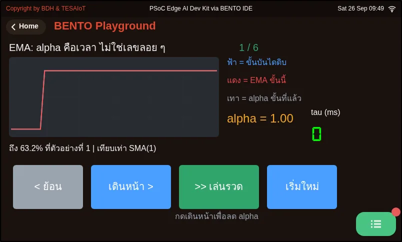
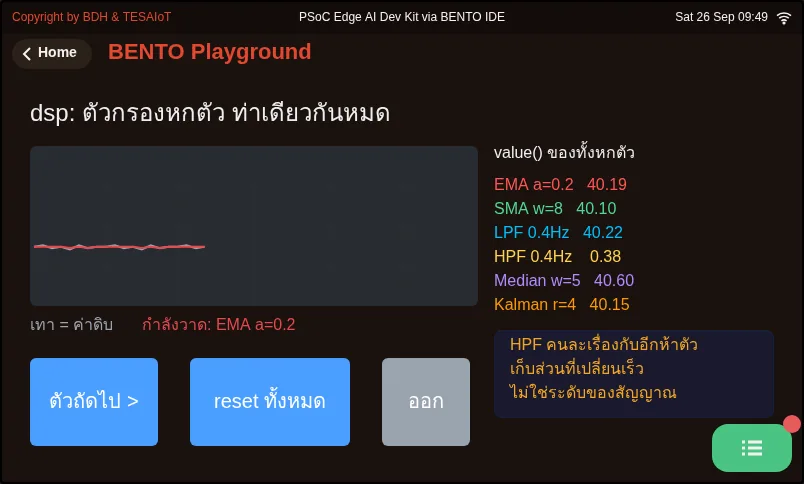

# Lesson 2.8 — Filtering: EMA vs Median, then the gauge code

> Module 2 — From Screen to Hardware · Slides: [slides.md](slides.md) · [Module overview](../README.md) · [Course page](../../README.md)

Calm a shaking value without cheating using dsp.EMA and dsp.Median, pick the filter from the shape of the noise and state its cost in seconds, then take apart the five moves of the gauge code that shows raw and filtered values on one screen.

## Objectives

By the end of this lesson you will be able to:

1. Create dsp.EMA(alpha=0.2) and dsp.Median(window=5) once outside the loop, feed them one value at a time with .update(), and compute one round of each by hand (EMA from 62.00 meeting 63.00 gives 62.20; the median of 41 42 95 43 42 is 42)
2. Choose the filter from the shape of the noise (EMA for small continuous shaking, Median for isolated spikes, or Median before EMA) and state its price in time, using tau = dt × (1 − alpha) / alpha and the roughly half-window lag of the Median at a 200 ms loop period
3. Point out which problem each of the five moves of the gauge code solves, namely ui.screen() with a try/except warm-up, a ui.Bar over a ui.Scale with a user-set threshold, the max(0, min(100, ...)) clamp, the value-quality line, and the 200 ms loop that rewrites numbers at most once per second

## Before you start

Following on from lesson 2.7, you have already seen that the knob's percentage keeps moving even when your hand is still. This lesson answers why, and how to settle it without cheating the value.
Review that `ui.poll()` must be called every round, and that `value=` on `ui.Label` is a font size, while `ui.Bar` / `ui.Scale` use `min` / `max` as the real range.
If you have already opened `13_raw_and_filtered.py` from lesson 1.3, you have already called `dsp.EMA` and `dsp.Median` once each — today we learn why those two were chosen.

- **Equipment:** an Eva Kit or TESAIoT Dev Kit board with the BENTO MicroPython firmware installed, or the BENTO Emulator in [BENTO IDE](https://ide.tesaiot.dev/)
- **Before this:** [Lesson 2.7 — Analog and touch: the ADC, the potentiometer and CapSense](../l07-adc-capsense/README.md)

## Concepts

A raw value shakes because of three layers stacked together. **The electrical layer**: a refreshing screen, WiFi transmitting, and nearby circuits throwing millivolt-level jitter into the reading. **The device layer**: the wiper's
contact rubs against its own track, so it is never 100% still. **The rounding layer**: if the real voltage sits exactly between two steps, the ADC rounds up sometimes and down other times. Jitter at the lowest bits is therefore normal for every measuring system;
an engineer's job is not to eliminate it, but to choose a filter and be able to defend that choice.

`dsp.EMA(alpha=0.2)` computes y[n] = alpha · x[n] + (1 − alpha) · y[n−1]. The new value carries a weight of alpha; the past never disappears, it just fades a little every round. From 62.00 meeting 63.00
gives 62.20 — a move of only 0.20 even though the input jumped 1.00. That is the steadiness bought at the price of lag. alpha 0.05 is very steady but slow to follow, suited to a slowly changing value like temperature;
0.2 is fairly steady and still keeps up, used for the knob; 0.8 is almost the raw value, filtering almost nothing. alpha converts to time with tau = dt × (1 − alpha) / alpha, the time for a value to climb to 63.2% of a step.
At a 200 ms loop period, alpha 0.2 gives a tau of about 0.8 seconds. Worth knowing: alpha is keyword-only (`dsp.EMA(0.2)` raises `TypeError`); leaving it out defaults to 0.1, not 0.5,
and the first sample is used directly as the starting value, not multiplied by alpha, so the filter does not have to climb up from zero. EMA remembers only a single number, which is why small embedded systems choose it most often,
and it is an RC low-pass filter in digital form, where alpha = Δt / (RC + Δt).

`dsp.Median(window=5)` keeps the five most recent values, sorts them, and returns the middle one. A lone outlier gets pushed to the edge of the row and nobody picks it up. From 41 42 95 43 42, Median returns 42,
as if the spike never happened, while EMA(0.2) from 42 meeting 95 gives 52.6 — it jumps along with it. The price of Median is memory equal to window and a lag of roughly half the window.
At a 200 ms loop, a five-value window spans 1.0 second, lagging by about 0.4 seconds. window is silently clamped with no error (ask for 4, get 5; ask for 99, get 15; the floor is 3), because it must be an odd number,
and the buffer is a fixed-size array in C. `print(med)` tells you the actual value you got. In short, choose from **the shape of the noise**, not from the name, and the two can be combined by having Median catch spikes before handing off to EMA.

The `dsp` module has 8 classes and 8 functions, all usable on both boards. Every class has memory, so it must be created once, outside the loop, and every one takes one value at a time — anyone coming from numpy must rethink this
(the exceptions are `fft_mag` and `s16`, which take a whole batch, used in lessons 3.4–3.6). Four more filters worth knowing: `SMA` (a plain average, window clamped to 2-64), `LPF` (an EMA set with
`cutoff=` and `fs=` — if you tell it `fs=100` while the loop really runs at 5 Hz, the cutoff number is not true), `HPF` (keeps only the fast-changing part, always returns 0.0 on the first round), and
`Kalman1D` (a high `r` means trusting the sensor less, so it is steady but slow to follow; a high `q` means believing the world changes fast, so it is more responsive).

The second half takes apart lesson 2.9's gauge code into five moves. The firmware already does about 70% of the work (setting up the ADC, scaling values, talking I2C, subtracting the baseline, the filters written in C, and drawing).
Our job is the remaining 30%: choosing the widget, setting alpha, arranging the loop's timing, and deciding whether a value can be trusted yet.

- **Move 1** `ui.screen()` always comes first, because the first use of `ui.*` stops the firmware's automatic sensor task — after that we must read values ourselves every round — then warm up with `sensors.pot.read()` inside `try/except`, because the first round after a reset may need to wait a while for the display core to answer. Neither board needs `sensors.init()`
- **Move 2** A bare number like 55.4% cannot answer "is that high", so a `ui.Bar` is placed over a `ui.Scale` (a ruler that does not accept `.value()`). Use `.ticks(11, 2)` to get 0 20 40 ... 100. The warning threshold is a `ui.Spinbox` set by the user through +/- buttons, because an empty spinbox cannot be changed by a finger. Two `ui.Led` lamps dim with `.value(0)`, they do not vanish
- **Move 3** The touch slider uses the same ruler set; two lamps replace the text `BTN0 ON`, which does not survive black-and-white testing; and the value is clamped with `max(0, min(100, ...))`, because if the 4000T chip is not ready, the byte received could be 255
- **Move 4** Show the raw and filtered values side by side to two decimal places (round to an integer and the jitter is hidden), with a value-quality line that reports "stale" when this round could not be read, setting colour before writing text. The most common mistake is creating the filter inside the loop, which makes the result exactly equal to the raw value
- **Move 5** A 200 ms loop, because a loop that runs too fast fires drawing commands across the cores faster than the CM55 can draw, and the excess frames are dropped silently. The bar and the lamps update every round, but the numbers are rewritten at most once per second through the gate `if sec != last_sec:`, and `lbl_health.text()` is deliberately sent every round outside that gate, so the screen still stays responsive

## Worked example

- `06_ema_time_constant.py` — needs no sensor; feeds a pure step input to EMA at one alpha at a time, from 1.00 down to 0.02, before you press to advance each step. Try computing tau by hand with the formula at the top of the file
  (`DT_MS = 200`) and compare it with the number on screen. The faint grey line is the previous step's alpha, so you can see whether it got steeper or slower. The first step, alpha 1.00, filters nothing at all, so the red line sits exactly on top of the blue one.
- `08_six_filters_one_signal.py` — feeds one self-generated signal (a base of 40, a step up to 60, small continuous shaking, and two spikes) into all six filters at once, and it gives the same result every run,
  so you can argue with numbers. Predict first which one will swallow the spikes, which one follows the step immediately, and which one returns 0.0 on the first round, then step through them one at a time.
  Try setting `FS` to disagree with `DT_MS` and see how LPF and HPF change.

| File | What this file teaches |
|---|---|
| [examples/06_ema_time_constant.py](examples/06_ema_time_constant.py) | What EMA's alpha means in real units of time |
| [examples/08_six_filters_one_signal.py](examples/08_six_filters_one_signal.py) | dsp's six filters on the same one signal |

The slides for this lesson also refer to files that live in other lessons:

- [m01-ui-application/l03-inside-the-box/examples/13_raw_and_filtered.py](../../m01-ui-application/l03-inside-the-box/examples/13_raw_and_filtered.py) — a raw line that shakes and the same line held steady, on one chart
- [m02-ui-to-hardware/l06-touch-panel-lab/examples/09_scale_led_spinbox.py](../l06-touch-panel-lab/examples/09_scale_led_spinbox.py) — three widgets that separate an HMI screen from a toy screen
- [m02-ui-to-hardware/l09-pot-capsense-lab/practice/s05_pot_capsense.py](../l09-pot-capsense-lab/practice/s05_pot_capsense.py) — the knob + the touch slider + an EMA filter (fill-in version)

**Screens from the BENTO Emulator** for this lesson's examples (click a file name to open the code)

<figure><figcaption><a href="examples/06_ema_time_constant.py"><code>06_ema_time_constant.py</code></a> What EMA&#x27;s alpha means in real units of time</figcaption></figure>
<figure><figcaption><a href="examples/08_six_filters_one_signal.py"><code>08_six_filters_one_signal.py</code></a> dsp&#x27;s six filters on the same one signal</figcaption></figure>

## Check your understanding

The same questions are in [quiz.yaml](quiz.yaml) for automatic marking.

1. A team writes ema = dsp.EMA(alpha=0.2) inside a while loop, and finds the filtered value equals the raw value exactly every round. What is the cause? *(choose one · objective 1)*
   - A) Every round gets a brand-new filter with empty memory, and the first sample is used directly as the starting value, so the output equals the raw value
   - B) alpha 0.2 is too low to filter anything at all
   - C) It must be written as dsp.EMA(0.2), without the keyword name
   - D) EMA cannot be used with a percentage value; it must be fed the raw 0-65535 value

   

Solution

   **A** — A filter must remember its previous value across rounds, so it must be created once, outside the loop. alpha is keyword-only; writing dsp.EMA(0.2) raises TypeError.

   

2. dsp.EMA(alpha=0.2) currently holds 42 and meets a new value of 95, which is a spike; meanwhile dsp.Median(window=5) sees 41 42 95 43 42 sitting in its window. What do the two return? *(choose one · objective 1)*
   - A) EMA gives 52.6, Median gives 42
   - B) EMA gives 42, Median gives 52.6
   - C) EMA gives 95, Median gives 43
   - D) EMA gives 52.6, Median gives 52.6

   

Solution

   **A** — EMA gives 0.2 × 95 + 0.8 × 42 = 52.6, jumping along with the spike. Median sorts to 41 42 42 43 95 and takes the middle value, 42 — the spike is pushed to the edge of the row and nobody picks it up.

   

3. Your loop runs at 200 ms (5 Hz), but you set dsp.LPF(cutoff=2.0, fs=100), copied from an example. Which statement is correct? *(choose one · objective 2)*
   - A) The cutoff you set will not be true, because LPF computes alpha from the fs you told it, not from the loop's real period
   - B) It has no effect at all, because LPF measures the loop period itself
   - C) LPF will always return 0.0 like HPF does on its first round
   - D) The board will speed the loop up to 100 Hz on its own

   

Solution

   **A** — LPF and EMA are the same equation; LPF just computes alpha from cutoff and fs for you. If the fs you give does not match the real loop period, fs is a lie, and the cutoff you see is not real either.

   

4. Which statements about choosing a filter are correct? Choose every correct one. *(choose all that apply · objective 2)*
   - A) For a signal with occasional lone spikes, Median catches them whole
   - B) Median can catch spikes first, then hand off to EMA
   - C) Asking for dsp.Median(window=4) raises ValueError, because it is an even number
   - D) At a 200 ms loop period, alpha 0.2 gives a tau of about 0.8 seconds
   - E) The higher alpha is, the steadier the value but the slower it follows

   

Solution

   **A, B, D** — Median throws spikes away and can be chained with EMA; tau = 200 × 0.8 / 0.2 = 800 ms. window is silently clamped — asking for 4 gives 5, with no error — and it is actually a low alpha, not a high one, that is steady but slow to follow.

   

5. In the gauge code, the percentage number is rewritten only inside the block if sec != last_sec, while the bar and the lamp update every 200 ms round. Why? *(choose one · objective 3)*
   - A) The eye can read a bar's position without stopping to read it, but a number changing five times a second cannot be read — people would stop reading it — so it is rewritten at most once per second
   - B) ui.Label can only be written once per second; writing it more often raises an error
   - C) To save widget quota
   - D) Because the sensor only gives a new value once per second

   

Solution

   **A** — The bar and lamp communicate through position and brightness, which update fine every round; a number must be read as a number, so the one-second gate is a design choice for the viewer, not a limit of the widget.

   

## Lab

**Let the numbers give the answer.** Record the results in your learning log.

- [ ] Run `06_ema_time_constant.py`, record the tau and "reached 63.2% at sample" for every alpha, and compare with what the formula gives
- [ ] Run `08_six_filters_one_signal.py` and build a six-row table: filter · does it swallow the spike · does it follow the step in time; then pick one for the knob with a one-sentence reason
- [ ] Try creating `dsp.Median(window=4)` and `print()` the actual window you get, and try `dsp.EMA(0.2)` to see the `TypeError` with your own eyes
- [ ] Read the five-move code in the slides and write one line per move saying what would go wrong on screen if that move were removed

## Going further

Lesson 2.9 fills in today's gauge code for real on the board until it passes the MVP criteria for lessons 2.7–2.9.
Before you go, do not forget the running order: keep BENTO Playground open, and when plugging in the USB cable, lift every finger off the touch pad completely.

Next lesson: [Lesson 2.9 — Hands-on: the potentiometer gauge and touch slider](../l09-pot-capsense-lab/README.md)

## Reflect

- What shape does the sensor noise in your team's own work take: small continuous shaking, occasional spikes, or both, and which filter would you choose?
- How many seconds of lag can your team's work tolerate, and how much time does the alpha or window you chose actually spend?
