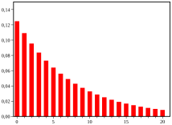
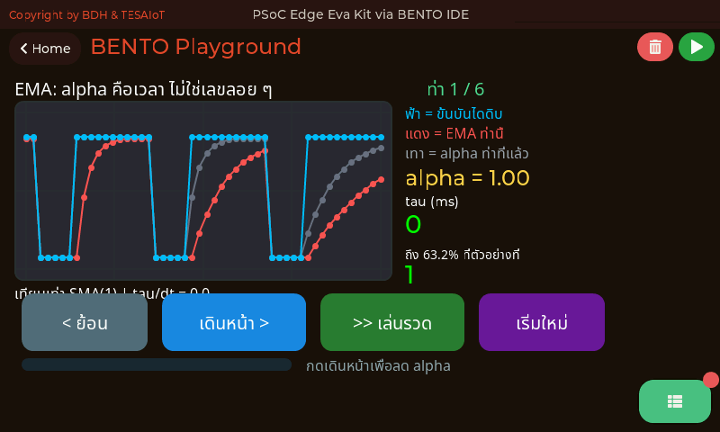
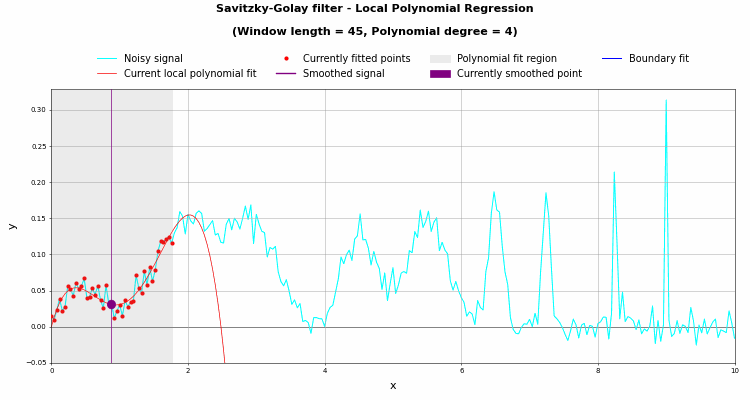
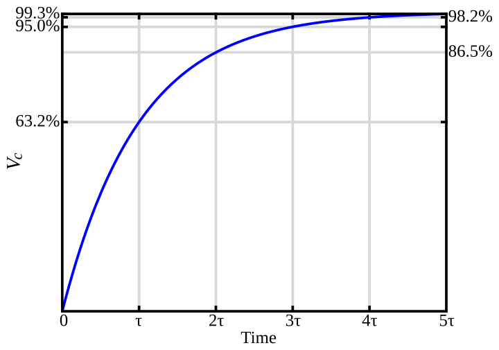

<style>
section { font-size: 24px; padding: 40px 52px; justify-content: flex-start; }
section h1 { font-size: 1.45em; line-height: 1.12; margin: 0 0 .22em; }
section h2 { font-size: 1.12em; margin: .15em 0; }
section h3 { font-size: 1.0em; margin: .12em 0; }
section p, section li { margin: .16em 0; line-height: 1.32; }
section img { max-width: 100%; height: auto; }
section svg { max-height: 330px; width: 100%; }
section table { font-size: .78em; }
section pre { font-size: .70em; line-height: 1.32; background:#0d1117; color:#e6edf3; border:1px solid #30363d; border-radius:8px; padding:12px 16px; box-shadow:0 2px 8px rgba(0,0,0,.25); }
section pre code { white-space: pre-wrap; background:transparent; color:inherit; } section pre .hljs-comment{color:#8b949e;font-style:italic} section pre .hljs-keyword,section pre .hljs-built_in,section pre .hljs-literal{color:#ff7b72} section pre .hljs-string{color:#a5d6ff} section pre .hljs-number{color:#79c0ff} section pre .hljs-title,section pre .hljs-title.function_,section pre .hljs-section{color:#d2a8ff} section pre .hljs-meta{color:#ffa657} section pre .hljs-attr,section pre .hljs-attribute,section pre .hljs-name{color:#7ee787}
section blockquote { margin: .25em 0; font-size: .92em; }
/* two images on a line (parity / 2x2 grids) stay side-by-side and small */
section p > img + img { margin-left: 10px; }
/* scroll-within-slide: dense slides scroll instead of clipping */
section { overflow-y: auto; overflow-x: hidden; }
section::-webkit-scrollbar { width: 11px; }
section::-webkit-scrollbar-thumb { background:#4a90d9; border-radius:6px; }
section::-webkit-scrollbar-track { background:rgba(0,0,0,.06); }
/* image drop-shadow + cover-slide readability (auto) */
section img{filter:drop-shadow(0 3px 12px rgba(0,0,0,.5))}
/* พื้นสำรองของสไลด์ปก: ถ้า img/cover_sNN.svg โหลดไม่ขึ้น ธีมจะคืนพื้นขาว
   แล้วตัวอักษรสีขาวของปกจะหายไปทั้งแผ่น — ปักสีเข้มไว้ให้ภาพเป็นแค่ของประดับ */
section.cover{background-color:#0b1426}
section.cover *{color:#fff !important}
section.cover h1,section.cover h2,section.cover h3,section.cover p,section.cover li,section.cover strong,section.cover em,section.cover blockquote,section.cover div{text-shadow:0 2px 9px rgba(0,0,0,.92),0 0 3px rgba(0,0,0,.8)}
section.cover div[style*="background:#"],section.cover div[style*="background: #"]{background:rgba(10,14,20,.66) !important;border-color:rgba(120,200,255,.45) !important;max-width:62%}
section.cover blockquote{border-left:4px solid rgba(120,200,255,.6) !important;background:rgba(13,17,23,.55) !important;border-radius:6px;padding:.3em .6em}
section.cover h1,section.cover h2,section.cover h3,section.cover p,section.cover blockquote{max-width:60%}
section.cover div:not(:has(img)){max-width:62%}
section.cover img{filter:none}
</style>


<!-- _class: cover -->

# บทเรียน 2.8 — กรองสัญญาณ: EMA กับ Median แล้วแกะโค้ดเกจ

## อนาล็อกและสัมผัส · Potentiometer + CapSense + กรองสัญญาณให้อ่านรู้เรื่อง

**โมดูล 2 — จากจอสู่ฮาร์ดแวร์**

> ต่อจากบทเรียน 2.7 — อนาล็อกและสัมผัส: ADC ลูกบิด และ CapSense

---

## ทำไมค่าดิบถึงสั่น ทั้งที่ไม่มีใครแตะ

<svg viewBox="0 0 940 205" xmlns="http://www.w3.org/2000/svg">
  <rect x="14" y="30" width="292" height="140" rx="9" fill="#e3f2fd" stroke="#1565c0" stroke-width="2"/>
  <text x="160" y="56" text-anchor="middle" font-size="19" font-weight="700" fill="#1565c0">ชั้นไฟฟ้า</text>
  <path d="M40,120 L58,104 L74,126 L92,100 L108,122 L126,102 L144,124 L162,106 L180,126 L198,104 L216,122 L234,108 L252,124 L270,110 L286,120" fill="none" stroke="#0d47a1" stroke-width="2.5"/>
  <text x="160" y="152" text-anchor="middle" font-size="18" fill="#5472a3">จอ · WiFi · วงจรข้างเคียง</text>
  <rect x="324" y="30" width="292" height="140" rx="9" fill="#e8f5e9" stroke="#2e7d32" stroke-width="2"/>
  <text x="470" y="56" text-anchor="middle" font-size="19" font-weight="700" fill="#2e7d32">ชั้นตัวอุปกรณ์</text>
  <rect x="360" y="96" width="220" height="14" rx="7" fill="#a5d6a7"/>
  <g><animateTransform attributeName="transform" type="translate" values="-6,0;6,0;-6,0" dur="1.3s" repeatCount="indefinite"/><path d="M470,88 L458,74 L482,74 z" fill="#1b5e20"/></g>
  <text x="470" y="140" text-anchor="middle" font-size="18" fill="#4a7c4e">หน้าสัมผัสของ wiper ถูตัวเอง</text>
  <rect x="634" y="30" width="292" height="140" rx="9" fill="#fff3e0" stroke="#ef6c00" stroke-width="2"/>
  <text x="780" y="56" text-anchor="middle" font-size="19" font-weight="700" fill="#ef6c00">ชั้นการปัดขั้น</text>
  <line x1="668" y1="122" x2="892" y2="122" stroke="#bf360c" stroke-width="2" stroke-dasharray="5 4"/>
  <line x1="668" y1="90" x2="892" y2="90" stroke="#bf360c" stroke-width="2" stroke-dasharray="5 4"/>
  <g><animateTransform attributeName="transform" type="translate" values="0,0;0,-32;0,0" dur="1.1s" repeatCount="indefinite"/><circle cx="780" cy="122" r="9" fill="#bf360c"/></g>
  <text x="780" y="152" text-anchor="middle" font-size="18" fill="#a1683a">ค่าจริงอยู่กึ่งกลางสองขั้นพอดี</text>
  <text x="470" y="196" text-anchor="middle" font-size="19" font-weight="700" fill="#37474f">สามชั้นนี้บวกกันแล้วโผล่ออกมาเป็นหลักสุดท้ายที่กระพริบบนจอ</text>
</svg>

สาเหตุมีจริงและซ้อนกันหลายชั้น ไม่ใช่เรื่องลึกลับ

**ชั้นไฟฟ้า** — สายทุกเส้นรับสัญญาณรบกวนจากวงจรข้างเคียง จอที่กำลังรีเฟรช และ WiFi ที่กำลังส่ง ล้วนเหวี่ยงแรงดันระดับมิลลิโวลต์เข้ามาได้

**ชั้นตัวอุปกรณ์เอง** — ลูกบิดคือแผ่นตัวต้านทานที่มีหน้าสัมผัสถูตัวมันเอง ความต้านทานตรงจุดสัมผัสไม่ได้นิ่ง 100%

**ชั้นการปัดขั้น** — ถ้าแรงดันจริงตกอยู่ *กึ่งกลาง* ระหว่างสองขั้นบันได ADC จะปัดขึ้นบ้างลงบ้างสลับกันไป บิตล่างสุดจึงกระพริบตลอดเวลา

> การสั่นระดับบิตล่างเป็น **ปกติของทุกระบบวัด** สิ่งที่วิศวกรทำไม่ใช่กำจัดมัน แต่คือตัดสินใจว่ายอมรับได้แค่ไหน

---

## dsp.EMA — ค่าเฉลี่ยที่จำอดีตแบบจาง ๆ

<div style="display:flex;gap:20px;align-items:flex-start">
<div style="flex:1 1 56%">

```python
import dsp
ema = dsp.EMA(alpha=0.2)   # keyword-only — dsp.EMA(0.2) ขึ้น TypeError
smooth = ema.update(pct)   # ป้อนค่าใหม่ ได้ค่ากรองแล้ว
ema.value()                # ขอค่าล่าสุดซ้ำ ไม่ป้อนอะไรเข้าไป
ema.reset()                # ล้างความจำ รอบหน้าเริ่มนับหนึ่งใหม่
dsp.EMA()                  # ไม่ใส่ alpha ได้ ค่าตั้งต้นคือ 0.1 ไม่ใช่ 0.5
```

$$y[n] = \alpha \cdot x[n] + (1-\alpha)\cdot y[n-1]$$

ค่าใหม่มีน้ำหนัก $\alpha$ ที่เหลือคือค่าเดิมทั้งก้อน อดีตไม่ได้หายไปไหน แต่ **จางลงเรื่อย ๆ ทุกรอบ**

**คิดให้ดูจริง ๆ** ค่าเดิม $y=62.00$ ค่าใหม่เข้ามา $x=63.00$ ที่ $\alpha=0.2$ → $y = 0.2(63.00)+0.8(62.00) = 62.20$ ขยับแค่ 0.20 ทั้งที่อินพุตกระโดดไป 1.00 นั่นคือความนิ่งที่เราซื้อมาด้วยความหน่วง

**ตัวอย่างแรกไม่ได้ถูกคูณ $\alpha$** ค่าที่ป้อนเข้าไปครั้งแรกถูกใช้เป็นค่าตั้งต้นตรง ๆ ไม่งั้นทุกฟิลเตอร์จะเริ่มจากศูนย์แล้วต้องไต่ขึ้นมาก่อนหลายวินาที ทั้งที่ค่าจริงอยู่ตรงนั้นตั้งแต่แรก · `.value()` กับ `.reset()` มีเหมือนกันทุกตัวในตระกูลนี้

</div>
<div style="flex:0 0 40%">



<div style="font-size:.6em;color:#78909c;margin-top:-.4em">น้ำหนักของค่าย้อนหลังแต่ละตัวใน EMA — ตัวล่าสุดหนักสุด แล้วลดแบบเอกซ์โพเนนเชียล ไม่มีตัวไหนถูกตัดทิ้งสนิท · ภาพ: “Exponential moving average weights N=15” โดย Д.Ильин — CC0 1.0 · Wikimedia Commons</div>

</div>
</div>

---

## dsp.EMA — alpha คือ "ความรู้สึก" และไฟล์ที่แปลงมันเป็นวินาที

| alpha | ผลที่เห็นบนจอ | เหมาะกับ |
|---|---|---|
| 0.05 | นิ่งมาก แต่ตามมือช้าจนรู้สึกหน่วง | ค่าที่เปลี่ยนช้า เช่น อุณหภูมิ |
| 0.2 | นิ่งพอควรและยังตามทัน (ค่าที่เราใช้วันนี้) | ลูกบิด เกจทั่วไป |
| 0.8 | เกือบเท่าค่าดิบ กรองได้นิดเดียว | สัญญาณที่ต้องการความไวสูง |



<div style="font-size:.6em;color:#78909c;margin-top:-.35em">หน้าจอจริงตอนรัน <a href="https://github.com/tesaiot/tesa-qualification-program/blob/main/courses/aiot-micropython/m02-ui-to-hardware/l08-filters/examples/06_ema_time_constant.py"><code>06_ema_time_constant.py</code></a> — ตารางข้างบนบอกว่า alpha ให้ "ความรู้สึก" แบบไหน ไฟล์นี้เปลี่ยนความรู้สึกนั้นให้เป็นวินาที · ภาพจับที่ขั้นแรกซึ่ง <b>alpha = 1.00</b> คือไม่กรองเลย เส้นแดงจึงทับเส้นฟ้าสนิท และตัวเลขที่ตามมาคือ <b>tau = 0 ms</b> กับ "ถึง 63.2% ที่ตัวอย่างที่ 1" — ไล่กดเดินหน้าแล้ว alpha จะลดลง ทั้งสองค่านั้นจะโตขึ้นให้เห็นเป็นตัวเลข ไม่ใช่ความรู้สึก · ภาพหน้าจอจริงจากบอร์ด Eva Kit บันทึกโดยผู้สอน</div>

> EMA ใช้หน่วยความจำแค่ตัวเลขเดียว จึงเป็นฟิลเตอร์ที่ระบบฝังตัวเล็ก ๆ เลือกใช้บ่อยที่สุด

---

## dsp.Median — คนละหน้าที่กับ EMA อย่าสับสน

```python
med = dsp.Median(window=5)    # window เป็น keyword-only เช่นเดียวกัน
clean = med.update(raw)       # เก็บ 5 ค่าล่าสุด เรียงลำดับ แล้วคืนค่าตรงกลาง
dsp.Median(window=4)          # ขอ 4 ได้ 5 — มันบังคับเป็นเลขคี่ให้เงียบ ๆ
dsp.Median(window=99)         # ขอ 99 ได้ 15 — เพดานคือ 15 พื้นคือ 3
```

**หนีบค่าเงียบ ๆ ไม่มี error** เพราะบัฟเฟอร์ข้างในเป็นอาเรย์ขนาดคงที่ในภาษา C · ต้องเป็นเลขคี่เพราะ "ตัวกลาง" ของจำนวนคู่ไม่มีตัวเดียว · พิมพ์ `print(med)` แล้วมันบอกค่าที่ได้จริงมาให้ ไม่ต้องเดา


<svg viewBox="0 0 940 170" xmlns="http://www.w3.org/2000/svg">
  <text x="16" y="26" font-size="19" font-weight="700" fill="#37474f">ค่าที่ไหลเข้ามาตามเวลา — หน้าต่างกว้าง 5 เลื่อนตามไปเรื่อย ๆ</text>
  <rect x="20" y="46" width="76" height="52" rx="6" fill="#eceff1" stroke="#90a4ae" stroke-width="2"/>
  <rect x="104" y="46" width="76" height="52" rx="6" fill="#eceff1" stroke="#90a4ae" stroke-width="2"/>
  <rect x="188" y="46" width="76" height="52" rx="6" fill="#ffcdd2" stroke="#c62828" stroke-width="2"/>
  <rect x="272" y="46" width="76" height="52" rx="6" fill="#eceff1" stroke="#90a4ae" stroke-width="2"/>
  <rect x="356" y="46" width="76" height="52" rx="6" fill="#eceff1" stroke="#90a4ae" stroke-width="2"/>
  <rect x="440" y="46" width="76" height="52" rx="6" fill="#eceff1" stroke="#90a4ae" stroke-width="2"/>
  <rect x="524" y="46" width="76" height="52" rx="6" fill="#eceff1" stroke="#90a4ae" stroke-width="2"/>
  <text x="58" y="80" text-anchor="middle" font-size="19" fill="#37474f">41</text>
  <text x="142" y="80" text-anchor="middle" font-size="19" fill="#37474f">42</text>
  <text x="226" y="80" text-anchor="middle" font-size="19" fill="#c62828">95</text>
  <text x="310" y="80" text-anchor="middle" font-size="19" fill="#37474f">43</text>
  <text x="394" y="80" text-anchor="middle" font-size="19" fill="#37474f">42</text>
  <text x="478" y="80" text-anchor="middle" font-size="19" fill="#37474f">44</text>
  <text x="562" y="80" text-anchor="middle" font-size="19" fill="#37474f">43</text>
  <rect x="14" y="38" width="424" height="68" rx="8" fill="none" stroke="#1565c0" stroke-width="4"/>
  <circle cx="226" cy="118" r="6" fill="#c62828">
    <animate attributeName="r" values="5;10;5" dur="1.6s" repeatCount="indefinite"/></circle>
  <text x="248" y="128" font-size="18" fill="#1565c0">หน้าต่างปัจจุบัน 5 ค่า</text>
  <rect x="626" y="38" width="300" height="68" rx="8" fill="#e8f5e9" stroke="#2e7d32" stroke-width="2.5"/>
  <text x="776" y="66" text-anchor="middle" font-size="19" fill="#1b5e20">เรียง: 41 42 42 43 95</text>
  <text x="776" y="94" text-anchor="middle" font-size="19" font-weight="700" fill="#1b5e20">ตัวกลาง = 42</text>
  <text x="776" y="132" text-anchor="middle" font-size="18" fill="#c62828">spike 95 ถูกโยนทิ้งทั้งก้อน</text>
  <text x="470" y="162" text-anchor="middle" font-size="18" fill="#78909c">ถ้าใช้ค่าเฉลี่ยธรรมดา 95 จะถูกหารเฉลี่ยเข้าไปในคำตอบเสมอ</text>
</svg>

<div style="display:flex;gap:16px;align-items:center">
<div style="flex:0 0 300px">



</div>
<div style="flex:1;font-size:.58em;color:#78909c">ภาพ: MothNik, Wikimedia Commons, CC0 1.0 — หน้าต่างในภาพบนวาดไว้นิ่ง ๆ ได้ตำแหน่งเดียว แต่ของจริงมันเลื่อนไปทีละค่าตามข้อมูลที่ไหลเข้ามา · คำว่า <code>window=5</code> ในบรรทัดโค้ดบนสุดของสไลด์นี้คือความกว้างของกรอบที่กำลังเลื่อนอยู่นี้ และเหตุผลที่มันหน่วง ก็เพราะคำตอบของแต่ละรอบต้องรอให้กรอบเต็มก่อน</div>
</div>

---

## dsp.Median — คิดให้ดูจริง ๆ แล้วเทียบกับ EMA

<div style="display:flex;gap:20px;align-items:flex-start">
<div style="flex:1 1 52%">

$$y_t = \operatorname{median}\bigl(x_{t-N+1},\,\dots,\,x_{t}\bigr)$$

ไทย: เรียงค่าล่าสุด N ตัวแล้วหยิบตัวกลาง — ค่าที่กระโดดโดดเดี่ยวถูกดันไปอยู่ริมสุด ไม่มีใครหยิบมันขึ้นมา

**คิดให้ดูจริง ๆ** จากชุดตัวเลขในสไลด์ก่อน Median คืน **42** เหมือน spike ไม่เคยเกิด · ส่วน EMA($\alpha=0.2$) ที่ค่าเดิม 42 เจอ 95 ได้ $0.2(95)+0.8(42) = 52.6$ คือกระเด็นตาม · ที่ลูป 200 ms หน้าต่าง 5 ค่า = **1.0 วินาที** หน่วงราว **0.4 วินาที**

</div>
<div style="flex:0 0 44%">

| | `dsp.EMA` | `dsp.Median` |
|---|---|---|
| เก่งเรื่อง | สั่นเล็ก ๆ ต่อเนื่อง | spike กระโดดเดี่ยว |
| วิธีคิด | ถ่วงน้ำหนักเก่า/ใหม่ | เรียงแล้วเลือกตัวกลาง |
| spike เดี่ยว | ถูกเฉลี่ยเข้าไปบางส่วน | หายไปทั้งก้อน |
| ความหน่วง | จางลงต่อเนื่อง | ราวครึ่งหนึ่งของ window |
| หน่วยความจำ | 1 ค่า | เท่ากับ window |

</div>
</div>

> ใช้ร่วมกันได้: Median เก็บกวาด spike ก่อน แล้วส่งต่อให้ EMA · เลือกฟิลเตอร์จาก **หน้าตาของ noise** ไม่ใช่จากชื่อ

---

## แผนที่โมดูล `dsp` ทั้งโมดูล (1/3) — 8 คลาส 8 ฟังก์ชัน ใช้ได้ครบทุกตัวทั้งสองบอร์ด

บทเรียน 1.1–1.3 เราเรียก `dsp.EMA` `dsp.Median` และ `dsp.tilt` ไปแล้วอย่างละครั้ง ที่ [`13_raw_and_filtered.py`](https://github.com/tesaiot/tesa-qualification-program/blob/main/courses/aiot-micropython/m01-ui-application/l03-inside-the-box/examples/13_raw_and_filtered.py) — สามชื่อจากสิบหก นี่คืออีกสิบสามชื่อที่เหลือ

**คลาส — สร้างครั้งเดียวนอกลูป เพราะทุกตัวมีความจำ** ทุกตัวมี `.update()` และ `.reset()`

| คลาส | อาร์กิวเมนต์ (keyword-only) | ค่าตั้งต้น | มีเมธอดอะไรอีก |
|---|---|---|---|
| `EMA` | `alpha=` | 0.1 | `.value()` |
| `SMA` | `window=` (หนีบ 2-64) | 10 | `.value()` |
| `LPF` | `cutoff=` `fs=` | 5.0 Hz, 100 Hz | `.value()` |
| `HPF` | `cutoff=` `fs=` | 0.5 Hz, 100 Hz | `.value()` |
| `Median` | `window=` (หนีบ 3-15 บังคับคี่) | 5 | `.value()` |
| `Kalman1D` | `q=` `r=` | 0.01, 0.1 | `.value()` |
| `Madgwick` | `beta=` `fs=` | 0.1, 100 Hz | `.quaternion()` — **ไม่มี** `.value()` |
| `Pedometer` | `threshold=` `min_interval=` | 1.5, 300 ms | **ไม่มี** `.value()` |

---

## แผนที่โมดูล `dsp` ทั้งโมดูล (2/3) — 8 ฟังก์ชัน ไม่มีความจำ เรียกตรงได้เลย

| ฟังก์ชัน | รับ | คืน | บทเรียนไหน |
|---|---|---|---|
| `tilt(ax,ay,az)` | ความเร่ง 3 แกน | `(roll, pitch)` องศา | บทเรียน 3.1–3.3 |
| `compass(mx,my,mz)` | สนามแม่เหล็ก 3 แกน | ทิศ 0-360 องศา | บทเรียน 3.1–3.3 |
| `altitude(hpa, sea=1013.25)` | ความดัน hPa (**อาร์กิวเมนต์เรียงตำแหน่ง ไม่ใช่ keyword**) | ความสูงเป็นเมตร | อ้างอิง |
| `dew_point(t, rh)` | องศา C, %RH | จุดน้ำค้าง องศา C | อ้างอิง |
| `heat_index(t, rh)` | องศา C, %RH | อุณหภูมิที่รู้สึก องศา C | อ้างอิง |
| `comfort_zone(t, rh)` | องศา C, %RH | สตริง: `cold` `hot` `dry` `humid` `comfortable` `acceptable` | อ้างอิง |
| `fft_mag(ชุด, n=256, window=True, demean=True)` | list หรือ buffer int16 ทั้งชุด | ขนาดสเปกตรัม n/2 ค่า สเกล 2/N | บทเรียน 3.4–3.6 |
| `s16(บัฟเฟอร์, step=1)` | buffer int16 LE (เช่น `mic.raw()`) | list ของจำนวนเต็ม | บทเรียน 3.4–3.6 |

สองแถวล่างเพิ่มเข้าโมดูลเมื่อ 2026-08-20 — **firmware รุ่นก่อนหน้ายังไม่มี** ใช้ในห้องต้องแฟลชรุ่นนั้นขึ้นไป

---

## แผนที่โมดูล `dsp` ทั้งโมดูล (3/3) — สี่ฟังก์ชันอ้างอิง และกฎ "ป้อนทีละค่า"

**สี่ฟังก์ชันอ้างอิง (`altitude` `dew_point` `heat_index` `comfort_zone`) เป็นคณิตศาสตร์ล้วน เรียกได้ปกติทุกเมื่อ** แต่ Eva Kit ไม่มี DPS368 (ความดัน) และไม่มี SHT40 (อุณหภูมิ/ความชื้น) จึง **ไม่มีแหล่งข้อมูลบนบอร์ดให้ป้อน** ป้อนตัวเลขที่พิมพ์เองหรือรับมาจากเครือข่ายได้ · Dev Kit มีชิปทั้งสองตัว (`sensors.dps368` / `sensors.sht40`) จึงป้อนค่าจริงเข้าสี่ฟังก์ชันนี้ได้ — แต่ทั้งสี่ตัวยังอยู่ในตารางในฐานะแถวอ้างอิง ไม่ใช่งานลงมือของชุดบทเรียนนี้ ไม่ว่าบอร์ดไหน

> **ตัวกรองทุกตัวรับทีละค่า ป้อนทีละตัวอย่าง** — ใครมาจาก numpy ต้องเปลี่ยนวิธีคิดตรงนี้ก่อน · ข้อยกเว้นเดียวของโมดูลคือคู่ `fft_mag` กับ `s16` ในตารางก่อนหน้า ที่รับทั้งชุด เพราะสเปกตรัมคำนวณจากตัวอย่างทั้งก้อนพร้อมกัน — บทเรียน 3.4–3.6 ได้ใช้จริง

---

## อีกสี่ตัวกรองที่ยังไม่ได้ลอง — และแต่ละตัวเก่งคนละเรื่อง

| ตัวกรอง | วิธีคิด | เก่งเรื่อง | ราคาที่จ่าย |
|---|---|---|---|
| `SMA(window=8)` | เฉลี่ยตรง ๆ ของ N ค่าล่าสุด | เข้าใจง่าย อธิบายให้ใครก็ได้ฟัง | จำ N ค่า และหน่วงราวครึ่ง window |
| `LPF(cutoff=, fs=)` | EMA ที่ตั้งด้วย **ความถี่** แทนน้ำหนัก | บอกเป็น Hz ได้ว่าตัดอะไรทิ้ง | ต้องรู้คาบลูปจริง ไม่งั้น `fs` โกหก |
| `HPF(cutoff=, fs=)` | เก็บเฉพาะส่วนที่ **เปลี่ยนเร็ว** | จับการสั่น การเคาะ การกระแทก | ทิ้งระดับของสัญญาณไปหมด |
| `Kalman1D(q=, r=)` | ชั่งน้ำหนักระหว่าง "เชื่อการวัด" กับ "เชื่อค่าเดิม" ทุกรอบ | ปรับตัวเองได้ นิ่งกว่า EMA ที่ความไวเท่ากัน | ต้องจูนสองตัวเลข ไม่ใช่ตัวเดียว |

**`LPF` กับ `EMA` เป็นสมการเดียวกัน** ต่างแค่ทางเข้า — `LPF` คำนวณ $\alpha = \dfrac{\Delta t}{RC+\Delta t}$ ให้จากค่า `cutoff` และ `fs` ที่เราบอก ส่วน `EMA` ให้เราใส่ $\alpha$ เอง เลือกทางไหนก็ได้ แต่ **ถ้าบอก `fs=100` ทั้งที่ลูปเดินจริงที่ 5 Hz ตัวเลข cutoff ที่ตั้งไว้จะไม่เป็นความจริงเลย**

**`HPF` คืน 0.0 เสมอในรอบแรก** ไม่ใช่บั๊ก — มันตอบว่า "เปลี่ยนไปเท่าไร" และรอบแรกยังไม่มีค่าก่อนหน้าให้ลบ · **`Kalman1D` ที่ `r` สูงแปลว่าไม่ค่อยเชื่อเซนเซอร์** จึงนิ่งมากแต่ตามช้า ส่วน `q` สูงแปลว่าคิดว่าโลกเปลี่ยนเร็ว จึงไวขึ้น

> ลงมือ: [`08_six_filters_one_signal.py`](https://github.com/tesaiot/tesa-qualification-program/blob/main/courses/aiot-micropython/m02-ui-to-hardware/l08-filters/examples/08_six_filters_one_signal.py) ป้อนสัญญาณเส้นเดียวกันเข้าทั้งหกตัวพร้อมกัน แล้วโชว์ `.value()` ของทุกตัวเรียงกัน — สัญญาณสร้างเองในไฟล์ จึงรันซ้ำได้ผลเดิมทุกครั้ง เถียงกันด้วยตัวเลขได้

---

## เกร็ด: ฟิลเตอร์ตัวนี้เคยเป็นตัวต้านทานกับตัวเก็บประจุ

<div style="display:flex;gap:20px;align-items:flex-start">
<div style="flex:1 1 56%">

ก่อนจะมีไมโครคอนโทรลเลอร์ราคาถูก การทำสัญญาณให้เรียบทำด้วยของจริงสองชิ้น คือตัวต้านทานต่อกับตัวเก็บประจุ เรียกว่าวงจร **RC low-pass filter** ความถี่สูง ๆ ถูกกลืนหายไปกับตัวเก็บประจุ เหลือแต่ส่วนที่เปลี่ยนช้า ๆ ออกมา

ถ้าเขียนสมการของวงจร RC ออกมาในรูปดิจิทัล จะได้หน้าตาเหมือน EMA ทุกประการ โดยที่

$$\alpha = \frac{\Delta t}{RC + \Delta t}$$

</div>
<div style="flex:0 0 40%">



<div style="font-size:.6em;color:#78909c;margin-top:-.4em">แรงดันคร่อมตัวเก็บประจุเมื่อป้อนสัญญาณขั้นบันได — ไต่ถึงราว 63% ที่เวลา τ = RC เหมือนกับที่ EMA ไต่ตามค่าใหม่ · ภาพ: “Series RC capacitor voltage” — สาธารณสมบัติ · Wikimedia Commons</div>

</div>
</div>

โมดูล `dsp` บนบอร์ดนี้มี `dsp.LPF(cutoff=, fs=)` ที่คำนวณ $\alpha$ จากสูตรนี้ให้เลย — พูดง่าย ๆ คือ LPF กับ EMA เป็นตัวเดียวกัน ต่างกันแค่เราตั้งค่าด้วยความถี่ตัดหรือด้วยน้ำหนักโดยตรง

**เชื่อมกับวันนี้:** ตอนที่ผู้เรียนปรับ `alpha` แล้วรู้สึกว่า "หน่วงขึ้น" นั่นคือการหมุนลูกบิดเสมือนของตัวเก็บประจุที่ไม่มีอยู่จริง วิศวกรรุ่นก่อนต้องบัดกรีเปลี่ยนตัว C เพื่อทำสิ่งเดียวกับที่เราแก้ตัวเลขบรรทัดเดียว

---

## เรื่องที่เราให้ 70% ผู้เรียนเขียน 30%

<svg viewBox="0 0 940 168" xmlns="http://www.w3.org/2000/svg">
  <rect x="20" y="44" width="630" height="56" rx="8" fill="#bbdefb" stroke="#1565c0" stroke-width="2"/>
  <g stroke-width="3"><animate attributeName="stroke-width" values="3;7;3" dur="2.6s" repeatCount="indefinite"/><rect x="650" y="44" width="270" height="56" rx="8" fill="#ffe0b2" stroke="#ef6c00"/></g>
  <text x="335" y="80" text-anchor="middle" font-size="21" font-weight="700" fill="#0d47a1">เฟิร์มแวร์ทำให้แล้ว 70%</text>
  <text x="785" y="80" text-anchor="middle" font-size="21" font-weight="700" fill="#bf360c">งานของเรา 30%</text>
  <text x="335" y="30" text-anchor="middle" font-size="18" fill="#607d8b">ตั้งค่า ADC · แปลงหน่วย · คุย I2C · หัก baseline · ฟิลเตอร์เขียนด้วย C</text>
  <text x="785" y="30" text-anchor="middle" font-size="18" fill="#bf360c">ตัดสินใจว่าจะเชื่อค่าไหน</text>
  <text x="335" y="130" text-anchor="middle" font-size="18" fill="#78909c">คณิตศาสตร์ทั้งหมดถูกทำไว้ให้แล้ว</text>
  <text x="785" y="130" text-anchor="middle" font-size="18" fill="#78909c">เลือก widget · alpha · จังหวะลูป</text>
</svg>

**สิ่งที่เฟิร์มแวร์ทำให้แล้ว (70%)**
ตั้งค่า SAR ADC และอ่านค่าจากขาลูกบิด (Eva: P15[1] · Dev Kit: VR1 บนฐาน) · สเกลค่า 12 บิตที่วัดได้ให้เป็นช่วง 0-65535 และคิดเปอร์เซ็นต์/โวลต์ให้ · คุย I2C กับชิป 4000T และหักลบ baseline ให้เรียบร้อย · ฟิลเตอร์ทั้งชุดใน `dsp` เขียนเป็นภาษา C มาแล้ว · การวาดทุกอย่างบนจอ

**สิ่งที่เป็นงานของเรา (30%)**
เลือกว่าจะแสดงค่าไหนด้วย widget อะไร · ตั้งค่า `alpha` ให้เหมาะกับงาน · จัดจังหวะลูปให้จอตามทันและเซนเซอร์ไม่ถูกอ่านถี่เกินจำเป็น · ตัดสินใจว่าค่าที่เห็นเชื่อถือได้หรือยัง

> โจทย์ของวิศวกรวันนี้ไม่ใช่ "เขียนฟิลเตอร์" แต่คือ **เลือกฟิลเตอร์และปกป้องตัวเลือกนั้นได้**

---

## แกะโค้ดจริง — ท่าที่ 1 ตั้งจอ แล้วรอให้เซนเซอร์ตอบ

<div style="display:flex;gap:20px;align-items:flex-start">
<div style="flex:1 1 56%">

```python
import ui
ui.screen()          # ล้าง widget เดิมทั้งหมด เริ่มจากจอว่างที่รู้แน่
import time
import sensors
import dsp

ui.clear()
time.sleep_ms(200)
...
# ไม่มี sensors.init() ทั้งสองบอร์ด (Eva: ขึ้น OSError / Dev Kit: ไม่จำเป็น)
try:
    sensors.pot.read()       # อุ่นเครื่อง รอบแรกหลังรีเซ็ตอาจต้องรอคอร์จอตอบ
except OSError:
    print("อ่านเซนเซอร์รอบแรกยังไม่ได้ - ลองใหม่ในลูป")
```

</div>
<div style="flex:0 0 40%">
<svg viewBox="0 0 400 300" style="max-height:240px" xmlns="http://www.w3.org/2000/svg">
  <text x="200" y="26" text-anchor="middle" font-size="19" font-weight="700" fill="#37474f">ใครเป็นคนอ่านเซนเซอร์ให้เรา</text>
  <line x1="40" y1="60" x2="40" y2="256" stroke="#90a4ae" stroke-width="3"/>
  <circle cx="40" cy="70" r="9" fill="#6a1b9a"/>
  <text x="62" y="76" font-size="18" fill="#4a148c">ui.screen()</text>
  <rect x="26" y="86" width="28" height="46" rx="6" fill="#e1bee7"/>
  <text x="62" y="116" font-size="18" fill="#78909c">200 ms — ให้ CM55 ล้างจบ</text>
  <circle cx="40" cy="146" r="9" fill="#2e7d32"/>
  <text x="62" y="152" font-size="18" fill="#1b5e20">sensors.pot.read() ใน try</text>
  <rect x="26" y="162" width="28" height="70" rx="6" fill="#c8e6c9"/>
  <text x="62" y="196" font-size="18" fill="#78909c">ครั้งแรกหลังรีเซ็ตอาจต้องรอ</text>
  <text x="62" y="220" font-size="18" fill="#78909c">(Eva วัดได้ถึง ~16 s)</text>
  <circle cx="40" cy="248" r="9" fill="#1565c0"/>
  <text x="62" y="254" font-size="18" fill="#0d47a1">อ่านค่าแรกได้</text>
  <text x="200" y="288" text-anchor="middle" font-size="16" fill="#c62828">Eva: init() = OSError · Dev Kit: ผ่าน ไม่ต้องเรียก</text>
</svg>
</div>
</div>

`ui.screen()` มาก่อนเสมอ เพราะการใช้ `ui.*` ครั้งแรกจะสั่งหยุด sensor auto-task ของเฟิร์มแวร์ หลังจากนี้ **เราต้องอ่านค่าเองทุกรอบในลูป** · อุ่นเครื่องใน `try/except` เพราะรอบแรกหลังรีเซ็ตอาจต้องรอ (Eva วัดได้ถึง 16 วินาที) ยังไม่ตอบก็พิมพ์บอกแล้วลองใหม่ในลูป

**บน Eva Kit บัส I2C ของเซนเซอร์เป็นของคอร์จอ (CM55)** `sensors.init()`/`scan()` จึงถูก **ปฏิเสธด้วย `OSError`** (ขับบัสจากสองคอร์เคยทำให้บอร์ดค้างถาวร) · **บน Dev Kit** สองคำสั่งนั้นผ่าน เพราะบัส I2C ของ IMU เป็นของ CM33 เอง แต่เฟิร์มแวร์ปลุกให้ตั้งแต่บูต โค้ดของคอร์สจึง **ไม่เรียกทั้งสองบอร์ด**

เส้นทางของค่า — Eva: ทุกตัวมาจาก snapshot ของ CM55 · Dev Kit: `pot.read()` อ่าน SAR ตรง (ลูกบิดไม่อยู่บนบัส) IMU อ่านสดจาก CM33 ส่วนแถบสัมผัส 4000T และช่อง `pot` ใน `snapshot()` มาจากคอร์จอทุก 200 ms

<!-- โน้ตผู้สอน: การอ่านครั้งแรกหลังรีเซ็ตอาจรอคอร์จอนาน (Eva วัดได้ถึง 16 วินาที · Dev Kit ยังไม่ได้วัด) ไฟล์จึงห่ออุ่นเครื่องใน try/except — ยังไม่ตอบก็พิมพ์บอกแล้วไปลองใหม่ในลูป ไม่หยุดทั้งสคริปต์ -->

---

## แกะโค้ดจริง — ท่าที่ 2 ค่าที่วัดได้ ต้องมาพร้อมพิสัยและเกณฑ์

<div style="display:flex;gap:20px;align-items:flex-start">
<div style="flex:1 1 54%">

```python
pot_bar = ui.Bar(x=28, y=80, w=428, h=16, color=0x4A9EFF, min=0, max=100, value=0)
pot_scale = ui.Scale(x=28, y=92, w=428, h=44, color=COL_TEXT, min=0, max=100)
pot_scale.ticks(11, 2)      # 11 ขีด ใส่เลขทุกขีดที่สอง
...
lbl_pct = ui.Label("0.0 %", x=28, y=180, color=COL_TEXT, value=28)
...
sp_th = ui.Spinbox(x=508, y=76, w=256, h=88, color=COL_TEXT,
                   min=TH_MIN, max=TH_MAX, value=th)
sp_th.digits(2, 0)          # ไม่บอกจะเห็น 0070
btn_up = ui.Button("เพิ่ม", x=644, y=172, w=120, h=88, color=0x3A4150, value=16)
btn_dn = ui.Button("ลด", x=508, y=172, w=120, h=88, color=0x3A4150, value=16)
...
led_ok = ui.Led(x=492, y=304, w=48, h=48, color=COL_OK, value=1)
...
led_bad = ui.Led(x=492, y=348, w=48, h=48, color=COL_BAD, value=0)
```

</div>
<div style="flex:0 0 42%">
<svg viewBox="0 0 400 300" xmlns="http://www.w3.org/2000/svg">
  <rect x="10" y="20" width="380" height="230" rx="10" fill="#101820" stroke="#4a90d9" stroke-width="2"/>
  <rect x="34" y="52" width="330" height="14" rx="7" fill="#263238"/>
  <g><animate attributeName="width" values="60;250;140;60" dur="6s" repeatCount="indefinite"/><rect x="34" y="52" width="60" height="14" rx="7" fill="#4a90d9"/></g>
  <line x1="34" y1="74" x2="364" y2="74" stroke="#90a4ae" stroke-width="2"/>
  <g stroke="#90a4ae" stroke-width="2">
    <line x1="34" y1="74" x2="34" y2="86"/><line x1="100" y1="74" x2="100" y2="86"/>
    <line x1="166" y1="74" x2="166" y2="86"/><line x1="232" y1="74" x2="232" y2="86"/>
    <line x1="298" y1="74" x2="298" y2="86"/><line x1="364" y1="74" x2="364" y2="86"/>
  </g>
  <text x="34" y="104" text-anchor="middle" font-size="15" fill="#90a4ae">0</text>
  <text x="166" y="104" text-anchor="middle" font-size="15" fill="#90a4ae">40</text>
  <text x="298" y="104" text-anchor="middle" font-size="15" fill="#90a4ae">80</text>
  <text x="34" y="146" font-size="26" fill="#ffffff">55.4 %</text>
  <text x="34" y="176" font-size="15" fill="#90a4ae">ตัวเลขเดียวกัน แต่ตอบได้แล้วว่าสูงไหม</text>
  <rect x="34" y="192" width="96" height="40" rx="6" fill="#0d1a30" stroke="#4a90d9"/>
  <text x="82" y="219" text-anchor="middle" font-size="20" fill="#ffffff">70</text>
  <text x="34" y="248" font-size="15" fill="#90a4ae">เกณฑ์ที่ผู้ใช้ตั้งเอง</text>
  <circle cx="180" cy="212" r="15" fill="#00e676"><animate attributeName="fill" values="#00e676;#0d3b22;#00e676" dur="5s" repeatCount="indefinite"/></circle>
  <circle cx="250" cy="212" r="15" fill="#3a1414"><animate attributeName="fill" values="#3a1414;#ff5252;#3a1414" dur="5s" repeatCount="indefinite"/></circle>
  <text x="180" y="248" text-anchor="middle" font-size="15" fill="#90a4ae">ต่ำกว่า</text>
  <text x="250" y="248" text-anchor="middle" font-size="15" fill="#90a4ae">เกิน</text>
  <text x="200" y="278" text-anchor="middle" font-size="18" fill="#455a64">ค่า · พิสัย · เกณฑ์ อยู่ในสายตาเดียว</text>
</svg>
</div>
</div>

ตัวเลข `55.4 %` ลอย ๆ ตอบไม่ได้ว่าสูงหรือต่ำ **`ui.Scale` คือไม้บรรทัดที่พาพิสัยมาอยู่บนจอด้วยกัน** และเพราะเป็นไม้บรรทัด มันจึง **ไม่รับ `.value()`** ตัวที่ขยับคือ `ui.Bar` ที่วางทับ (หน้าปัดวงกลมมีเข็มจริง — บทเรียน 3.1–3.3) · `.ticks(ทั้งหมด, ใส่เลขทุกกี่ขีด)` คุมความหนาแน่น ที่นี่ 11 ขีดใส่เลขทุกขีดที่สอง ได้ 0 20 40 60 80 100 พอดี

---

## แกะโค้ดจริง — ท่าที่ 2 (ต่อ) เกณฑ์ที่ผู้ใช้ตั้งเอง และไฟที่หรี่ ไม่ใช่หาย

เกณฑ์เตือนไม่ควรเป็นค่าคงที่ในโค้ด คนหน้างานคือคนรู้ว่างานนี้ยอมได้แค่ไหน `ui.Spinbox` หนีบค่าในพิสัยให้เอง **แต่บนจอสัมผัส spinbox เปล่า ๆ นิ้วเปลี่ยนค่าไม่ได้** ตัวที่เพิ่มลดค่าจริงคือ `ui.Button` สองปุ่มข้าง ๆ (สูง 88 px ตามขนาดเป้าสัมผัสของหลักสูตร)

ไฟสองดวงแทนสถานะด้วยสีตัวอักษร เพราะไฟมี **รูปทรงและความสว่าง** ถ่ายจอขาวดำแล้วยังแยกออก และ `.value(0)` คือ **หรี่ ไม่ใช่หาย** โดยตั้งใจ · จำกฎบทเรียน 2.4–2.6: `value=` ของ `ui.Label` คือ **ขนาดฟอนต์** ส่วน `Bar`/`Scale` ใช้ `min/max` เป็นพิสัยจริง — ตัวอย่างประกอบที่ [`09_scale_led_spinbox.py`](https://github.com/tesaiot/tesa-qualification-program/blob/main/courses/aiot-micropython/m02-ui-to-hardware/l06-touch-panel-lab/examples/09_scale_led_spinbox.py)

> ค่าดิบกับโวลต์ยังอยู่ครบ แต่ลดเป็นบรรทัดกำกับ เพราะคนเดินมาดูจอถามคำถามเดียวก่อน: ตอนนี้สูงเกินหรือยัง

---

## แกะโค้ดจริง — ท่าที่ 3 แถบเลื่อนสัมผัสและไฟสองดวง

<div style="display:flex;gap:20px;align-items:flex-start">
<div style="flex:1 1 56%">

```python
touch_bar = ui.Bar(x=28, y=284, w=428, h=16, color=0x4A9EFF, min=0, max=100, value=0)
touch_scale = ui.Scale(x=28, y=300, w=428, h=40, color=COL_TEXT, min=0, max=100)
touch_scale.ticks(11, 2)
...
led_b0 = ui.Led(x=28, y=344, w=48, h=48, color=COL_OK, value=0)
...
led_b1 = ui.Led(x=160, y=344, w=48, h=48, color=COL_OK, value=0)
...
        slider = sensors.capsense.slider()    # 0 - 100 อยู่แล้ว ไม่ต้องแปลงหน่วย
        b0, b1 = sensors.capsense.buttons()   # คืน tuple สองช่อง แกะพร้อมกันได้เลย
...
    touch_bar.value(max(0, min(100, slider)))
...
    led_b0.value(1 if b0 else 0)
    led_b1.value(1 if b1 else 0)
```

</div>
<div style="flex:0 0 40%">
<svg viewBox="0 0 400 300" xmlns="http://www.w3.org/2000/svg">
  <text x="200" y="26" text-anchor="middle" font-size="19" font-weight="700" fill="#37474f">นิ้วอยู่ตรงไหน แถบไปตรงนั้น</text>
  <rect x="30" y="50" width="340" height="52" rx="10" fill="#eceff1" stroke="#90a4ae" stroke-width="2"/>
  <line x1="98" y1="50" x2="98" y2="102" stroke="#b0bec5" stroke-width="2"/>
  <line x1="166" y1="50" x2="166" y2="102" stroke="#b0bec5" stroke-width="2"/>
  <line x1="234" y1="50" x2="234" y2="102" stroke="#b0bec5" stroke-width="2"/>
  <line x1="302" y1="50" x2="302" y2="102" stroke="#b0bec5" stroke-width="2"/>
  <text x="200" y="122" text-anchor="middle" font-size="18" fill="#546e7a">แถบทองแดง 5 ช่องบนบอร์ด</text>
  <g><animateTransform attributeName="transform" type="translate" values="-120,0;120,0;-120,0" dur="5s" repeatCount="indefinite"/><rect x="176" y="34" width="48" height="42" rx="20" fill="#ffcc9a" stroke="#c98a58" stroke-width="2"/></g>
  <rect x="30" y="164" width="280" height="20" rx="10" fill="#263238"/>
  <g><animateTransform attributeName="transform" type="translate" values="-100,0;100,0;-100,0" dur="5s" repeatCount="indefinite"/><rect x="30" y="164" width="140" height="20" rx="10" fill="#4a90d9"/></g>
  <line x1="30" y1="190" x2="310" y2="190" stroke="#90a4ae" stroke-width="2"/>
  <g stroke="#90a4ae" stroke-width="2"><line x1="30" y1="190" x2="30" y2="200"/><line x1="86" y1="190" x2="86" y2="200"/><line x1="142" y1="190" x2="142" y2="200"/><line x1="198" y1="190" x2="198" y2="200"/><line x1="254" y1="190" x2="254" y2="200"/><line x1="310" y1="190" x2="310" y2="200"/></g>
  <text x="30" y="216" text-anchor="middle" font-size="15" fill="#78909c">0</text>
  <text x="170" y="216" text-anchor="middle" font-size="15" fill="#78909c">50</text>
  <text x="310" y="216" text-anchor="middle" font-size="15" fill="#78909c">100</text>
  <circle cx="345" cy="164" r="13" fill="#cfd8dc" stroke="#90a4ae" stroke-width="2"><animate attributeName="fill" values="#cfd8dc;#00c853;#cfd8dc" dur="3s" repeatCount="indefinite"/></circle>
  <circle cx="345" cy="196" r="13" fill="#cfd8dc" stroke="#90a4ae" stroke-width="2"/>
  <text x="200" y="252" text-anchor="middle" font-size="18" fill="#546e7a">ไฟแทนคำว่า ON กับขีด</text>
  <text x="200" y="278" text-anchor="middle" font-size="18" fill="#c62828">ครอบ max(0, min(100, ...)) เสมอ</text>
</svg>
</div>
</div>

`ui.Bar` ไม่รับการแตะและไม่ส่ง event มันเป็น **จอแสดงผลอย่างเดียว** ซึ่งตรงกับที่ต้องการพอดี เพราะตัวสั่งงานคือนิ้วบนแถบทองแดง ไม่ใช่นิ้วบนกระจก และไม้บรรทัดชุดเดิมถูกใช้ซ้ำด้วยเหตุผลเดียวกับการ์ดบน: 62 ไม่มีความหมายจนกว่าจะรู้ว่าเต็มสเกลคือเท่าไร

สถานะปุ่มทองแดงเคยเขียนเป็นข้อความ `BTN0 ON  BTN1 -` ซึ่ง **ไม่ผ่านการทดสอบขาวดำ** — เป็นเกรย์สเกลแล้ว ON สีม่วงกับขีดสีเทาแยกกันไม่ออก ไฟสองดวงแยกออกทันทีเพราะดวงที่ติดสว่างกว่าดวงที่หรี่

ครอบด้วย `max(0, min(100, ...))` ไม่ใช่เพราะไม่เชื่อไดรเวอร์ แต่ถ้าชิป 4000T ไม่พร้อม ไบต์ที่ได้อาจเป็น 255 การครอบทำให้จอยังแสดงผลได้แทนที่จะพังทั้งหน้า

> ค่าที่มาจากภายนอกโปรแกรมเราเสมอ ๆ ควรถูก **ตรวจขอบเขตก่อนใช้** นี่คือนิสัยที่ติดตัวไปทุกภาษา

---

## แกะโค้ดจริง — ท่าที่ 4 เทียบค่าดิบกับค่ากรองแล้ว และบอกคุณภาพของค่า

<div style="display:flex;gap:20px;align-items:flex-start">
<div style="flex:1 1 52%">

```python
lbl_health = ui.Label("อ่านค่าปกติ", x=292, y=364, color=COL_TEXT, value=16)
...
ema = dsp.EMA(alpha=0.2)   # สร้างครั้งเดียว นอกลูป
...
    ema_pct = ema.update(pct)         # ป้อนค่าใหม่ ได้ค่าที่กรองแล้วกลับมาทันที
...
        raw_line.text("ดิบ    {:.2f} %".format(pct))
        ema_line.text("กรอง  {:.2f} %".format(ema_pct))
...
        if not fresh:                 # รอบนี้อ่านเซนเซอร์ไม่ได้
            lbl_health.color(COL_WARN)
            health = "ค่าค้าง - เลขคือค่าล่าสุด"
...
    lbl_health.text(health)           # นอกประตูหนึ่งวินาที - ส่งซ้ำทุกรอบโดยตั้งใจ
```

</div>
<div style="flex:0 0 44%">
<svg viewBox="0 0 420 300" xmlns="http://www.w3.org/2000/svg">
  <text x="210" y="24" text-anchor="middle" font-size="19" font-weight="700" fill="#37474f">สองเส้นบนจอเดียว</text>
  <line x1="30" y1="250" x2="404" y2="250" stroke="#90a4ae" stroke-width="2"/>
  <path d="M30,150 L60,120 L90,160 L120,116 L150,158 L180,120 L210,60 L240,120 L270,155 L300,118 L330,156 L360,122 L400,146" fill="none" stroke="#00e676" stroke-width="2.5"/>
  <path d="M30,150 L60,142 L90,146 L120,138 L150,144 L180,138 L210,120 L240,122 L270,132 L300,128 L330,136 L360,132 L400,138" fill="none" stroke="#00bcd4" stroke-width="4"/>
  <text x="40" y="96" font-size="18" fill="#00a152">RAW — สั่นทุกรอบ</text>
  <text x="40" y="196" font-size="18" fill="#0097a7">EMA — นิ่งกว่า แต่ตามช้ากว่า</text>
  <text x="210" y="42" text-anchor="middle" font-size="18" fill="#c62828">spike เดี่ยว ๆ ตรงนี้</text>
  <text x="210" y="276" text-anchor="middle" font-size="18" fill="#78909c">ไม่มีของฟรี — นิ่งขึ้นแลกกับหน่วงขึ้น</text>
</svg>
</div>
</div>

จุดที่พลาดบ่อยที่สุดคือ **เผลอสร้างฟิลเตอร์ไว้ในลูป** — ทุกรอบได้ฟิลเตอร์ใหม่ที่ความจำว่าง ค่าที่ออกมาเท่าค่าดิบเป๊ะ แล้วสรุปผิดว่า "ฟิลเตอร์ไม่ทำงาน" · ทศนิยมสองตำแหน่งทั้งสองบรรทัดเป็นเรื่องจงใจ ปัดเหลือจำนวนเต็มเมื่อไร ความสั่นถูกซ่อน บทเรียนทั้งบทเรียนหายไปด้วย

---

## แกะโค้ดจริง — ท่าที่ 4 (ต่อ) บรรทัดคุณภาพของค่า และประตูหนึ่งวินาที

บรรทัด **คุณภาพของค่า** แก้ปัญหาที่ไม่มีใครเห็นจนกว่าจะเกิด: อ่านรอบนี้ขึ้น `OSError` โปรแกรมใช้ค่าเดิมต่อ **จอจึงยังโชว์ตัวเลขสวยงามทั้งที่ไม่มีค่าใหม่แล้ว** ค่าที่ค้างจึงต้องเขียนกำกับว่าไม่ใช่ค่าปัจจุบัน · สังเกตลำดับ **ตั้งสีก่อน แล้วค่อยเขียนข้อความ** — สองคำสั่งข้ามคอร์คนละครั้ง สลับกันจะมีเสี้ยววินาทีที่ข้อความใหม่ใส่สีของสถานะเก่า

`lbl_health.text(health)` อยู่ **นอก** ประตูหนึ่งวินาทีโดยตั้งใจ — ฝั่งจออยู่ **โหมดเร็ว** ต่อไปอีก 500 ms ทุกครั้งที่ได้คำสั่งเขียนข้อความ แต่ `.value()` ของแถบกับไฟ **ไม่ปลุก** โหมดนั้น ลูปที่มีแต่แถบกับไฟจึงถอยไปโหมดช้า ภาพกระตุก · ข้อความเท่าเดิมเฟิร์มแวร์ไม่วาดซ้ำ เราจ่ายแค่ค่าส่ง

> อยากเห็นฟิลเตอร์ทำงาน ต้อง **แสดงคู่กันบนจอเดียว** ถ้าดูทีละอันจะไม่มีวันรู้ว่ามันช่วยจริงหรือแค่รู้สึกไปเอง

---

## แกะโค้ดจริง — ท่าที่ 5 ลูปหลักและจังหวะที่ปลอดภัย

<div style="display:flex;gap:20px;align-items:flex-start">
<div style="flex:1 1 52%">

```python
while True:
    fresh = True
    try:
        raw   = sensors.pot.read()
        volts = sensors.pot.voltage()
        pct   = sensors.pot.percent()
        slider = sensors.capsense.slider()
        b0, b1 = sensors.capsense.buttons()
    except OSError:
        fresh = False        # ใช้ค่าเดิมต่อ แต่ต้องบอกคนดู
        b0, b1 = 0, 0

    pot_bar.value(int(max(0, min(100, pct))))
    # ... ไฟกับแถบอัปเดตทุกรอบ ...

    for ev in ui.poll():     # ต้องมีทุกรอบ ปุ่มถึงจะกดติด
        ...

    sec = time.ticks_ms() // 1000
    if sec != last_sec:      # ตัวเลขเปลี่ยนวินาทีละครั้ง
        last_sec = sec
        lbl_pct.text("{:.1f} %".format(pct))

    time.sleep_ms(200)   # จังหวะที่ผ่านการทดสอบ
```

</div>
<div style="flex:0 0 44%">
<svg viewBox="0 0 420 300" xmlns="http://www.w3.org/2000/svg">
  <text x="210" y="24" text-anchor="middle" font-size="19" font-weight="700" fill="#37474f">หนึ่งรอบลูป = 200 ms</text>
  <rect x="24" y="46" width="372" height="46" rx="8" fill="#e8f5e9" stroke="#2e7d32" stroke-width="2"/>
  <text x="210" y="76" text-anchor="middle" font-size="18" fill="#1b5e20">อ่านเซนเซอร์ → อัปเดต widget → poll</text>
  <rect x="24" y="102" width="372" height="34" rx="8" fill="#eceff1" stroke="#90a4ae" stroke-width="2"/>
  <text x="210" y="126" text-anchor="middle" font-size="18" fill="#546e7a">sleep 200 ms — คืนเวลาให้ CM55 วาด</text>
  <g><animateTransform attributeName="transform" type="translate" values="0,0;0,90;0,0" dur="3s" repeatCount="indefinite"/><circle cx="12" cy="70" r="8" fill="#2e7d32"/></g>
  <text x="210" y="176" text-anchor="middle" font-size="18" fill="#455a64">5 ครั้งต่อวินาที — เร็วกว่าตาคนแยกออก</text>
  <rect x="24" y="196" width="372" height="60" rx="8" fill="#ffebee" stroke="#c62828" stroke-width="2"/>
  <text x="210" y="222" text-anchor="middle" font-size="18" fill="#8e0000">ถ้าลูปเร็วเกิน เช่น 20 ms</text>
  <text x="210" y="246" text-anchor="middle" font-size="18" fill="#8e0000">เฟรมส่วนเกินถูกทิ้งเงียบ ๆ ไม่มี error</text>
  <text x="210" y="284" text-anchor="middle" font-size="18" fill="#78909c">จอกระตุกทั้งที่โค้ดดูถูกทุกบรรทัด</text>
</svg>
</div>
</div>

---

## แกะโค้ดจริง — ท่าที่ 5 (ต่อ) ทำไม 200 ms และทำไมตัวเลขเดินช้ากว่าแถบ

`ui.poll()` มีหน้าที่มากกว่ารับ event จากการแตะจอ มันคือจังหวะที่ฝั่ง Python เปิดโอกาสให้ระบบ UI จัดการคิวของตัวเอง ถ้าไม่เรียก widget บางตัวจะถูกซ่อนไว้นานถึงสองวินาที ชุดบทเรียนนี้ใช้ event แค่ปุ่มเพิ่ม/ลดเกณฑ์ แต่ต่อให้ไม่มี event เลยก็ยังต้องเรียกทุกรอบอยู่ดี

ทำไม 200 ms ไม่ใช่ 20 ms — เพราะลูปที่เร็วเกินไปจะยิงคำสั่งวาดข้ามคอร์ถี่กว่าที่ CM55 วาดทัน เฟรมส่วนเกินจะถูกทิ้งเงียบ ๆ ไม่มี error ให้เห็น ผลคือจอกระตุกโดยที่โค้ดดู "ถูกต้อง" ทุกบรรทัด

อีกมุมหนึ่ง 200 ms = อ่านเซนเซอร์ 5 ครั้งต่อวินาที ซึ่งเร็วกว่าที่ตาคนแยกออกอยู่แล้วสำหรับการหมุนลูกบิดด้วยมือ

**แต่แถบกับตัวเลขไม่ได้เดินจังหวะเดียวกัน** และนี่คือรายละเอียดที่แยกหน้าจอควบคุมออกจากหน้าจอสาธิต แถบและไฟอัปเดตทุกรอบ คือ 5 ครั้งต่อวินาที เพราะตาคนอ่าน "ตำแหน่ง" ได้โดยไม่ต้องหยุดอ่าน ส่วน **ตัวเลขที่ต้องอ่านเป็นตัวเลข เขียนใหม่ไม่เกินวินาทีละครั้ง** ตัวเลขทศนิยมที่วิ่งห้าครั้งต่อวินาทีคือตัวเลขที่อ่านไม่ทัน แล้วคนจะเลิกอ่านมันไปเลย ประตูที่ใช้กั้นคือบรรทัด `if sec != last_sec:` ซึ่งเทียบแค่ว่า "วินาทีเปลี่ยนแล้วหรือยัง"

`for ev in ui.poll():` ทำสองอย่างพร้อมกันในบรรทัดเดียว คือเรียก `poll` ตามกฎ และรับ event ของปุ่มเพิ่ม/ลดเกณฑ์ ถ้าลืมบรรทัดนี้ อาการที่เห็นจะเป็น "จอกระตุกและปุ่มกดไม่ติด" ซึ่งดูเหมือนของสองเรื่องแต่มีสาเหตุเดียว

> เร็วกว่าที่จำเป็นไม่ได้แปลว่าดีกว่า ในระบบฝังตัวมันมักแปลว่า **เปลืองพลังงานและได้ภาพที่แย่ลง**

---

## ข้อมูลไหลไปทางไหน — จากมือถึงจอ

<svg viewBox="0 0 940 250" xmlns="http://www.w3.org/2000/svg">
  <defs><marker id="a5" markerWidth="10" markerHeight="8" refX="9" refY="4" orient="auto">
    <path d="M0,0 L10,4 L0,8 z" fill="#6a1b9a"/></marker></defs>
  <rect x="10" y="30" width="150" height="70" rx="10" fill="#fff3e0" stroke="#ef6c00" stroke-width="2"/>
  <text x="85" y="58" text-anchor="middle" font-size="17" font-weight="700" fill="#ef6c00">ลูกบิด</text>
  <text x="85" y="82" text-anchor="middle" font-size="17" fill="#e65100">แรงดัน 0 ถึง Vref</text>
  <rect x="10" y="140" width="150" height="70" rx="10" fill="#e0f7fa" stroke="#00838f" stroke-width="2"/>
  <text x="85" y="168" text-anchor="middle" font-size="17" font-weight="700" fill="#00838f">นิ้วบนแผ่นทองแดง</text>
  <text x="85" y="192" text-anchor="middle" font-size="17" fill="#006064">ความจุเปลี่ยน</text>
  <rect x="195" y="30" width="160" height="70" rx="10" fill="#fff8e1" stroke="#f9a825" stroke-width="2"/>
  <text x="275" y="58" text-anchor="middle" font-size="17" font-weight="700" fill="#f57f17">SAR ADC</text>
  <text x="275" y="82" text-anchor="middle" font-size="17" fill="#f57f17">12 บิต → 0-65535</text>
  <rect x="195" y="140" width="160" height="70" rx="10" fill="#e8f5e9" stroke="#2e7d32" stroke-width="2"/>
  <text x="275" y="168" text-anchor="middle" font-size="17" font-weight="700" fill="#2e7d32">PSoC 4000T</text>
  <text x="275" y="192" text-anchor="middle" font-size="17" fill="#1b5e20">I2C → คอร์จอ CM55</text>
  <rect x="395" y="80" width="180" height="90" rx="10" fill="#e3f2fd" stroke="#1565c0" stroke-width="2"/>
  <text x="485" y="112" text-anchor="middle" font-size="17" font-weight="700" fill="#1565c0">CM33 · Python</text>
  <text x="485" y="136" text-anchor="middle" font-size="17" fill="#0d47a1">ขอค่าจากคอร์จอ</text>
  <text x="485" y="158" text-anchor="middle" font-size="17" fill="#0d47a1">dsp.EMA กรอง</text>
  <rect x="615" y="80" width="130" height="90" rx="10" fill="#f3e5f5" stroke="#6a1b9a" stroke-width="2"/>
  <text x="680" y="118" text-anchor="middle" font-size="17" font-weight="700" fill="#6a1b9a">IPC</text>
  <text x="680" y="142" text-anchor="middle" font-size="17" fill="#4a148c">คำสั่งวาด</text>
  <rect x="785" y="80" width="145" height="90" rx="10" fill="#eceff1" stroke="#455a64" stroke-width="2"/>
  <text x="857" y="112" text-anchor="middle" font-size="17" font-weight="700" fill="#455a64">CM55 · LVGL</text>
  <text x="857" y="140" text-anchor="middle" font-size="17" fill="#37474f">Bar · Scale · Led</text>
  <line x1="162" y1="65" x2="191" y2="65" stroke="#6a1b9a" stroke-width="3" marker-end="url(#a5)"/>
  <line x1="162" y1="175" x2="191" y2="175" stroke="#6a1b9a" stroke-width="3" marker-end="url(#a5)"/>
  <line x1="357" y1="65" x2="391" y2="100" stroke="#6a1b9a" stroke-width="3" marker-end="url(#a5)"/>
  <line x1="357" y1="175" x2="391" y2="150" stroke="#6a1b9a" stroke-width="3" marker-end="url(#a5)"/>
  <line x1="577" y1="125" x2="611" y2="125" stroke="#6a1b9a" stroke-width="3" marker-end="url(#a5)"/>
  <line x1="747" y1="125" x2="781" y2="125" stroke="#6a1b9a" stroke-width="3" marker-end="url(#a5)"/>
  <text x="470" y="238" text-anchor="middle" font-size="18" fill="#78909c">ค่าดิบสั่นตั้งแต่ต้นทาง — เราจึงเลือกกรองที่ CM33 ก่อนส่งภาพข้ามไปให้ CM55 วาด</text>
  <g><animateTransform attributeName="transform" type="translate" values="0,0;315,60;510,60;690,60" dur="4s" repeatCount="indefinite"/><circle cx="170" cy="65" r="9" fill="#ef6c00"/></g>
  <g><animateTransform attributeName="transform" type="translate" values="0,0;315,-50;510,-50;690,-50" dur="4s" begin="1s" repeatCount="indefinite"/><circle cx="170" cy="175" r="9" fill="#00838f"/></g>
</svg>

> สังเกตว่าสองเส้นทางต้นทางต่างกันคนละแบบ (ADC กับ I2C) แต่มาบรรจบเป็นโค้ด Python บรรทัดเดียวกันที่ CM33

---

## วิธีรันบนบอร์ด

<svg viewBox="0 0 940 180" style="max-height:170px" xmlns="http://www.w3.org/2000/svg">
  <defs><marker id="s5run" markerWidth="9" markerHeight="7" refX="8" refY="3.5" orient="auto">
    <path d="M0,0 L9,3.5 L0,7 z" fill="#455a64"/></marker></defs>
  <rect x="16" y="48" width="200" height="80" rx="10" fill="#101820" stroke="#4a90d9" stroke-width="2.5"/>
  <text x="116" y="80" text-anchor="middle" font-size="19" font-weight="700" fill="#8fb8e0">จอบอร์ด</text>
  <text x="116" y="108" text-anchor="middle" font-size="18" fill="#ffffff">เปิด Playground ค้างไว้</text>
  <rect x="262" y="48" width="200" height="80" rx="10" fill="#ffebee" stroke="#c62828" stroke-width="3"/>
  <text x="362" y="80" text-anchor="middle" font-size="19" font-weight="700" fill="#c62828">ยกนิ้วออกให้หมด</text>
  <text x="362" y="108" text-anchor="middle" font-size="18" fill="#8e0000">ตอนบอร์ดบูต — baseline</text>
  <rect x="508" y="48" width="200" height="80" rx="10" fill="#e3f2fd" stroke="#1565c0" stroke-width="2.5"/>
  <text x="608" y="80" text-anchor="middle" font-size="19" font-weight="700" fill="#1565c0">เติม pass ทีละจุด</text>
  <text x="608" y="108" text-anchor="middle" font-size="18" fill="#0d47a1">แล้ว Program to Device</text>
  <rect x="754" y="48" width="170" height="80" rx="10" fill="#e8f5e9" stroke="#2e7d32" stroke-width="2.5"/>
  <text x="839" y="80" text-anchor="middle" font-size="19" font-weight="700" fill="#2e7d32">หมุน · ลาก · แตะ</text>
  <text x="839" y="108" text-anchor="middle" font-size="18" fill="#1b5e20">ครบทั้งสามอย่าง</text>
  <line x1="220" y1="88" x2="256" y2="88" stroke="#455a64" stroke-width="3" marker-end="url(#s5run)"/>
  <line x1="466" y1="88" x2="502" y2="88" stroke="#455a64" stroke-width="3" marker-end="url(#s5run)"/>
  <line x1="712" y1="88" x2="748" y2="88" stroke="#455a64" stroke-width="3" marker-end="url(#s5run)"/>
  <text x="470" y="28" text-anchor="middle" font-size="19" font-weight="700" fill="#37474f">ลำดับการรัน — ขั้นที่สองคือขั้นที่ทีมส่วนใหญ่ลืม</text>
  <text x="470" y="164" text-anchor="middle" font-size="18" fill="#c62828">วางนิ้วค้างตอนบอร์ดบูต = ปุ่มรายงานกลับด้านไปทั้งบทเรียน</text>
</svg>

1. **บนจอบอร์ด** แตะการ์ด **BENTO Playground** บนหน้า Home ค้างหน้านี้ไว้
2. **ตอนเสียบสาย USB (หรือถอดแล้วเสียบกลับ) ยกนิ้วออกจากปุ่มสัมผัสให้หมด** เพราะ baseline ถูกเก็บตอนคอร์จอเริ่มอ่านชิป ไม่ใช่ตอนสคริปต์เริ่ม · "รีเซ็ต" ในคอร์สนี้แปลว่าถอด USB แล้วเสียบกลับเท่านั้น — **บน Dev Kit ห้ามโยกสวิตช์บนฐาน นั่นคือสวิตช์ไฟ**
3. เปิด [`s05_pot_capsense.py`](https://github.com/tesaiot/tesa-qualification-program/blob/main/courses/aiot-micropython/m02-ui-to-hardware/l09-pot-capsense-lab/practice/s05_pot_capsense.py) ใน BENTO IDE
4. เติมช่องว่าง `pass` ให้ครบทั้ง 6 จุดตามคำใบ้ `# เติม:` — เติมทีละจุด รันดูทีละครั้ง
5. กด **Program to Device** แล้วหมุนลูกบิด ลากนิ้วบนแถบเลื่อน และแตะปุ่มสัมผัสทั้งสองปุ่ม

**หมายเหตุผู้สอน:** ขึ้น `OSError: CapSense: CM55 did not answer...` ในไม่กี่บรรทัดแรก ให้รอสักครู่แล้วรันซ้ำก่อน (หลังรีเซ็ต คอร์จอต้องใช้เวลาก่อนตอบสายเซนเซอร์ — Eva วัดได้ถึง 16 วินาที) ยังขึ้นซ้ำค่อยตรวจว่าชิป PSoC 4000T ถูก flash แล้วหรือยัง · ขึ้น `OSError` ที่ `sensors.init()` = ลอกโค้ดรุ่นเก่ามา ให้ลบบรรทัดนั้นทิ้ง (บน Dev Kit ผ่านเงียบ ๆ ก็ลบเหมือนกัน) · ลูกบิดและ CapSense **มีทั้ง Eva Kit และ Dev Kit** — AI Kit เปล่า ๆ ที่ไม่มีฐาน QWA309 ไม่มีทั้งสองอย่าง · เจอ error ตอนอ่าน CapSense ให้เรียกผู้สอนก่อน อย่าเสียเวลาทั้งบทเรียนแก้โค้ดที่ไม่ได้ผิด
