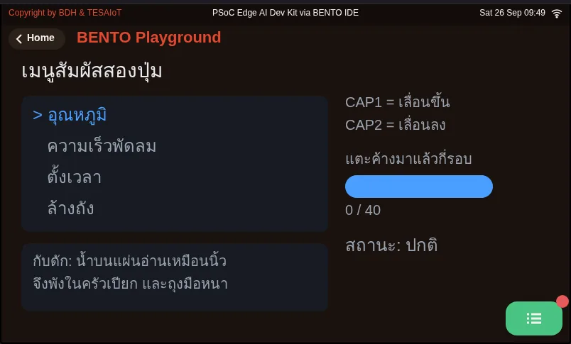
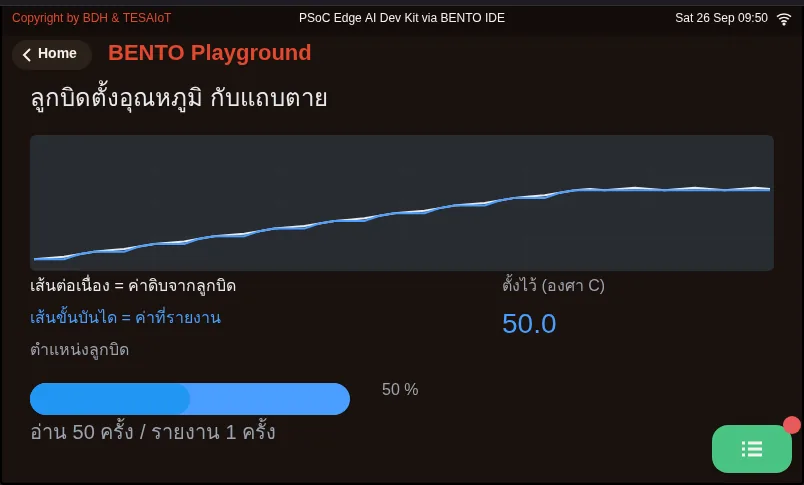
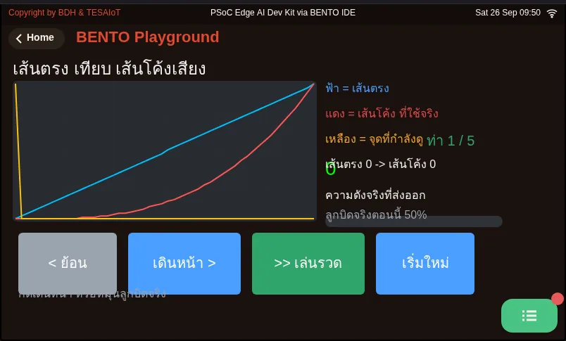
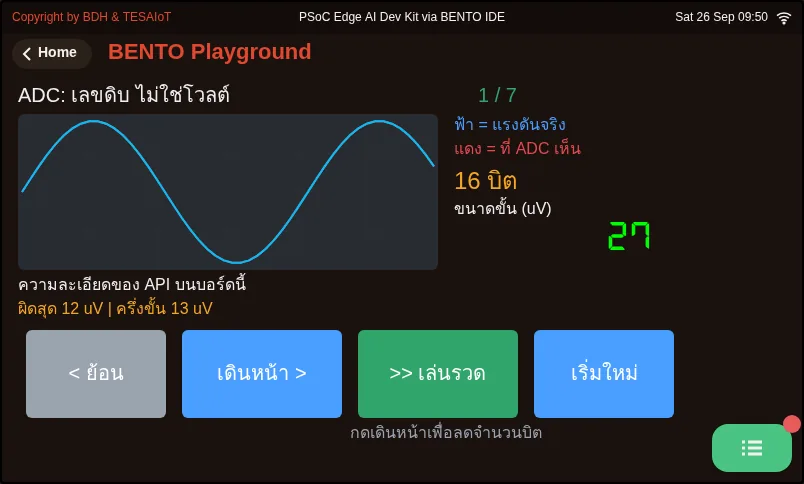
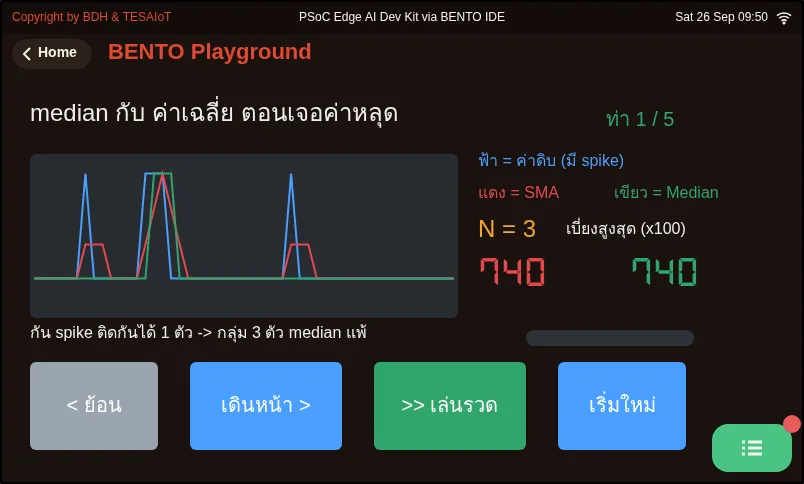
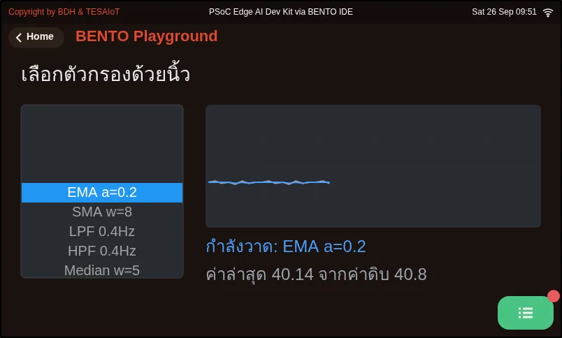

# บทเรียน 2.9 — ลงมือทำ: เกจลูกบิดกับแถบสัมผัส

> โมดูล 2 — จากจอสู่ฮาร์ดแวร์ · สไลด์: [slides.md](slides.md) · [ภาพรวมโมดูล](../README.md) · [หน้าหลักสูตร](../../README.md)

เติมหกช่องว่างในไฟล์ฝึกจนเกจลูกบิดกับแถบสัมผัสทำงานครบบนบอร์ด วางค่าดิบเทียบค่ากรองแล้วบนจอเดียว แล้วอธิบายได้ว่าทำไมเฉลยจึงตัดสินเกณฑ์จากค่าที่กรองแล้ว และแก้อาการที่ไม่มี error ให้เห็นได้เอง

## เป้าหมาย

เมื่อจบบทเรียนนี้ คุณจะ:

1. เติมหกช่องว่างใน practice/s05_pot_capsense.py ทีละจุด รันทีละครั้ง จนเกจผ่านเกณฑ์ MVP บนบอร์ด: แถบเดินตามลูกบิดตลอดช่วง 0-100 เกณฑ์หยุดเองที่ 10 และ 95 ไฟเตือนติดทีละดวงเมื่อข้ามเกณฑ์ แถบสัมผัสเดินตามนิ้ว ไฟปุ่มทองแดงติดถูกดวง และตัวเลขบนจอเปลี่ยนวินาทีละครั้ง
2. อธิบายพฤติกรรมของเฉลยได้ว่าทำไมการอ่านห้าบรรทัดอยู่ใน try เดียวพร้อมธง fresh ทำไมไฟเตือนตัดสินจาก ema_pct ไม่ใช่ค่าดิบ (กัน alarm chattering) และถ้าเปลี่ยน alpha เป็น 0.05 กับ 0.8 สองบรรทัดขวาล่างจะต่างกันอย่างไร
3. วินิจฉัยอาการที่ไม่มี error ให้เห็นจากตารางกับดักได้ถูกสาเหตุ (เช่น ค่ากรองเท่าค่าดิบ ui.Scale ไม่ขยับ ช่องเกณฑ์ขึ้น 0070 ปุ่มสัมผัสกลับด้าน) และเลือกไฟล์ตัวอย่างที่ตอบอาการนั้นได้

## ก่อนเริ่ม

ต่อจากบทเรียน 2.8 ที่แกะโค้ดเกจเป็นห้าท่า วันนี้ลงมือให้ค่าไหลเข้าหน้าจอนั้นเอง ก่อนเขียนโค้ดอ่านตาราง "กับดักที่เจอบ่อย" ทั้งสามหน้าในสไลด์
บนจอบอร์ดแตะการ์ด BENTO Playground ค้างไว้ และตอนเสียบสาย USB ยกนิ้วออกจากแผ่นสัมผัสให้หมด (baseline ถูกเก็บตอนบอร์ดบูต)
บน Dev Kit ห้ามโยกสวิตช์บนฐาน เพราะคือสวิตช์ไฟ ไม่ใช่ปุ่มรีเซ็ต เตรียมบันทึกการเรียนไว้จดค่าโวลต์และถ่ายรูปหน้าจอ

- **อุปกรณ์:** บอร์ด Eva Kit หรือ TESAIoT Dev Kit ที่ลงเฟิร์มแวร์ MicroPython ของ BENTO แล้ว หรือ BENTO Emulator ใน [BENTO IDE](https://ide.tesaiot.dev/)
- **เรียนมาก่อน:** [บทเรียน 2.8 — กรองสัญญาณ: EMA กับ Median แล้วแกะโค้ดเกจ](../l08-filters/README.md)

## แนวคิด

ไฟล์ฝึกเขียนหน้าจอสี่การ์ดครบ 33 ชิ้นไว้แล้ว (เกินงบของคอร์ส 32 ไปหนึ่งชิ้น ดูข้อเสนอเรื่องชิ้นที่ตัดได้ในสไลด์) ไม่ต้องแตะ งานของเราคือทำให้ค่าไหลเข้าไปในนั้น ไฟล์ตั้งค่าเริ่มต้นไว้ให้
(`pct = 0.0` `slider = 0` `events = []`) จึงรันได้ตั้งแต่ยังไม่เติมอะไร ใช้ข้อนี้เป็นเครื่องมือ: เติมทีละจุด รันทีละครั้ง แล้วดูว่าจอ "ตื่น" ทีละส่วน
ถ้าพัง เราจะรู้ทันทีว่าพังที่ของที่เพิ่งเพิ่ม

เฉลยมีการตัดสินใจสามข้อที่ต้องอธิบายได้ ข้อแรก การอ่านทั้งห้าบรรทัดอยู่ใน `try` เดียวกัน ถ้ารอบนี้คอร์จอไม่ตอบ ค่าทั้งหน้าจะยังเป็นชุดเดียวกัน
ไม่ปนครึ่งเก่าครึ่งใหม่ และธง `fresh` ไปบอกบรรทัดคุณภาพของค่าว่าตัวเลขที่เห็นเป็นของรอบก่อน ข้อสอง `over = ema_pct >= th` ใช้ค่าที่ **กรองแล้ว**
ถ้าใช้ค่าดิบ ไฟจะกระพริบสลับดวงตอนค่าอยู่ใกล้เกณฑ์พอดี อาการนี้แผงควบคุมจริงเรียกว่า alarm chattering และเป็นเหตุผลหนึ่งที่คนหน้างานปิดเสียงเตือนทิ้ง
ข้อสาม แถบกับไฟอัปเดตทุกรอบ 200 ms แต่ตัวเลขเขียนใหม่วินาทีละครั้ง เพราะตาอ่านตำแหน่งได้ทันที แต่อ่านตัวเลขที่วิ่งห้าครั้งต่อวินาทีไม่ทัน

ตารางกับดักมียี่สิบสามแถว และหลายแถวไม่มี error ให้เห็นเลย บางแถวเกิดจากลำดับการทำงานกับฮาร์ดแวร์ (วางนิ้วค้างตอนบูต เพิ่งรีเซ็ตแล้วคอร์จอยังไม่ตอบ)
บางแถวเกิดจากค่าที่ถูกหนีบเงียบ ๆ (`Median(window=4)` ได้ 5, `SMA(window=200)` ได้ 64) และบางแถวเกิดจากเข้าใจ widget ผิดตัว (`ui.Scale` ไม่รับ `.value()`,
spinbox แตะแล้วค่าไม่เปลี่ยนจึงต้องมีปุ่มเพิ่ม/ลด, `.color()` ของ `ui.Bar` ไปลงที่ราง ไม่ใช่แถบค่า) เวลาติดให้เริ่มจากอาการในตาราง ไม่ใช่เริ่มแก้โค้ดที่ไม่ได้ผิด

เมื่อมีตัวเลือกจำกัดที่รู้ล่วงหน้า เช่นตัวกรองหกตัว ปุ่ม "ตัวถัดไป" ซ่อนรายการทั้งชุด `ui.Roller` กางตัวเลือกค้างไว้และไฮไลต์ตัวที่เลือกตลอดเวลา
ข้อควรรู้ที่วัดมาแล้วสองข้อ: `value=` ตอนสร้างเป็นทั้งบรรทัดที่เลือกและขนาดฟอนต์ไทย จึงไม่ตั้งตอนสร้างแต่สั่ง `.value(n)` ทีหลัง
และ `.prop(ui.PROP_VISIBLE_ROWS, n)` เขียนทับความสูงจาก `h=` ให้เลือกทางใดทางหนึ่ง

## ตัวอย่างสมบูรณ์

**ต้องทำให้จบในบทเรียน** (รวมราว 40 นาที ถ้าทำ 01 กับ 06 ในบทเรียน 2.7 และ 2.8 มาแล้ว ทำเฉพาะ 05)

- `05_adc_counts_to_volts.py` (10 นาที) ก่อนกดเดินหน้า ทายว่าบันไดจะหยาบขึ้นแค่ไหนเมื่อบิตลดลง แล้วดูขั้นสุดท้ายที่ตัวเลขอ้างบิตมากกว่าที่จับขั้นจริง ตัวเลขสวยขึ้นได้โดยไม่ละเอียดขึ้น
- `01_capsense_dimmer.py` ของบทเรียน 2.7 (15 นาที) ลากนิ้วแล้วปล่อย ดูว่า `slider()` เท่ากับ 0 ไม่ได้แปลว่าปล่อยนิ้ว
- `06_ema_time_constant.py` ของบทเรียน 2.8 (15 นาที) อ่าน tau ของแต่ละ alpha แล้วเลือก alpha ของ MVP จากตัวเลข

**ติดตรงไหนเปิดอันนั้น**

- แตะแผ่นสัมผัสแล้วไม่แน่ใจว่าบอร์ดรับหรือยัง หรือมือเปียก: `02_capsense_menu_wet_hand.py` แผ่นสัมผัสไม่มีแรงต้าน จึงต้องตอบกลับด้วยจอ ไฟ และเสียงทุกครั้ง และน้ำบนแผ่นทำให้เครื่องอ่านว่ามีนิ้วแตะค้าง
- ค่าที่กรองแล้วยังกระโดดตามค่าหลุดค่าเดียว: `07_median_beats_mean.py` กดเดินหน้าจนหน้าต่างถึง 7 แล้วดูว่าเส้น median รับ spike สามตัวติดได้ เพราะหน้าต่าง N ทน spike ติดกันได้ไม่เกิน (N-1)//2 ตัว
- ปล่อยมือแล้วค่ายังกระดิก: `03_pot_setpoint_deadband.py` เพิ่มกติกาว่าขยับไม่ถึงเท่านี้ถือว่าไม่ขยับ และยึดปลายสเกลที่ 0 กับ 100

อ่านเสริมนอกเกณฑ์ผ่าน: `04_pot_taper_volume.py` (ครึ่งทางของลูกบิดไม่ใช่ครึ่งหนึ่งของความดังที่หูได้ยิน) และ `10_roller_picks_the_filter.py`
(เลือกตัวกรองด้วยการปัดนิ้ว ไม่ต้องใช้เซนเซอร์ ลองวางเทียบกับปุ่มวนของ `08_six_filters_one_signal.py`)

| ไฟล์ | ไฟล์นี้สอน |
|---|---|
| [examples/02_capsense_menu_wet_hand.py](examples/02_capsense_menu_wet_hand.py) | เมนูสัมผัสสองปุ่ม และเรื่องมือเปียก |
| [examples/03_pot_setpoint_deadband.py](examples/03_pot_setpoint_deadband.py) | ลูกบิดตั้งค่า พร้อมแถบตาย |
| [examples/04_pot_taper_volume.py](examples/04_pot_taper_volume.py) | ทำไมลูกบิดเสียงต้องเป็นเส้นโค้ง |
| [examples/05_adc_counts_to_volts.py](examples/05_adc_counts_to_volts.py) | เลขดิบจาก ADC ไม่ใช่แรงดัน มันคือจำนวนขั้น |
| [examples/07_median_beats_mean.py](examples/07_median_beats_mean.py) | ค่าหลุดหนึ่งค่า ทำลายค่าเฉลี่ย แต่ทำอะไร median ไม่ได้ |
| [examples/10_roller_picks_the_filter.py](examples/10_roller_picks_the_filter.py) | เลือกด้วยการปัดนิ้ว ไม่ใช่กดวนทีละครั้ง |

สไลด์ของบทเรียนนี้อ้างถึงไฟล์ที่อยู่ในบทเรียนอื่นด้วย:

- [m02-ui-to-hardware/l07-adc-capsense/examples/01_capsense_dimmer.py](../l07-adc-capsense/examples/01_capsense_dimmer.py) — สไลเดอร์สัมผัสเป็นสวิตช์หรี่ไฟ
- [m02-ui-to-hardware/l08-filters/examples/06_ema_time_constant.py](../l08-filters/examples/06_ema_time_constant.py) — alpha ของ EMA แปลว่าอะไรในหน่วยเวลาจริง
- [m03-sensor-hmi/l06-accel-chart-lab/examples/01_imu_vibration_monitor.py](../../m03-sensor-hmi/l06-accel-chart-lab/examples/01_imu_vibration_monitor.py) — เฝ้าการสั่นของเครื่องจักร

**ภาพจอจาก BENTO Emulator** ของตัวอย่างในบทนี้ (คลิกชื่อไฟล์เพื่อเปิดโค้ด)

<figure><figcaption><a href="examples/02_capsense_menu_wet_hand.py"><code>02_capsense_menu_wet_hand.py</code></a> เมนูสัมผัสสองปุ่ม และเรื่องมือเปียก</figcaption></figure>
<figure><figcaption><a href="examples/03_pot_setpoint_deadband.py"><code>03_pot_setpoint_deadband.py</code></a> ลูกบิดตั้งค่า พร้อมแถบตาย</figcaption></figure>
<figure><figcaption><a href="examples/04_pot_taper_volume.py"><code>04_pot_taper_volume.py</code></a> ทำไมลูกบิดเสียงต้องเป็นเส้นโค้ง</figcaption></figure>
<figure><figcaption><a href="examples/05_adc_counts_to_volts.py"><code>05_adc_counts_to_volts.py</code></a> เลขดิบจาก ADC ไม่ใช่แรงดัน มันคือจำนวนขั้น</figcaption></figure>
<figure><figcaption><a href="examples/07_median_beats_mean.py"><code>07_median_beats_mean.py</code></a> ค่าหลุดหนึ่งค่า ทำลายค่าเฉลี่ย แต่ทำอะไร median ไม่ได้</figcaption></figure>
<figure><figcaption><a href="examples/10_roller_picks_the_filter.py"><code>10_roller_picks_the_filter.py</code></a> เลือกด้วยการปัดนิ้ว ไม่ใช่กดวนทีละครั้ง</figcaption></figure>

## ฝึกเติม

ไฟล์ฝึกมีช่อง `# เติม:` หกจุดเรียงตามลำดับที่โปรแกรมทำงาน ค่าดิบกับโวลต์ขยับได้ตั้งแต่ก่อนเติม เพราะไฟล์อ่านไว้ให้แล้ว ที่เหลือจะตื่นทีละส่วน

- จุด 1: `ema = dsp.EMA(alpha=0.2)` นอกลูป จอยังไม่เปลี่ยน แต่ต้องมีก่อนจุด 5 และต้องเขียนชื่อ `alpha=` เสมอ
- จุด 2: `pct = sensors.pot.percent()` ตัวเลขเปอร์เซ็นต์และบรรทัด "ดิบ" เริ่มขยับ
- จุด 3: `slider = sensors.capsense.slider()` แถบสัมผัสล่างซ้ายเดินตามนิ้ว
- จุด 4: `pot_bar.value(int(max(0, min(100, pct))))` แถบบนไม้บรรทัดการ์ดบนซ้ายเดินตามลูกบิด
- จุด 5: `ema_pct = ema.update(pct)` บรรทัด "กรอง" ขยับ และไฟเตือนสองดวงเริ่มสลับตามเกณฑ์ เพราะ `over` คิดจาก `ema_pct`
- จุด 6: `events = ui.poll()` ปุ่มเพิ่ม/ลดเกณฑ์กดติด จุดนี้ถูกข้ามบ่อยที่สุด เพราะไฟล์รันได้โดยไม่มีมัน อาการคือปุ่มกดไม่ติดโดยไม่มี error สักบรรทัด

ทุกจุดส่งขึ้นบอร์ดแล้วดูจอก่อนไปจุดถัดไป ถ้าเปิดเฉลย อ่านให้เข้าใจแล้วพิมพ์เอง อย่าคัดลอกวาง

| ไฟล์ฝึก | เรื่อง |
|---|---|
| [practice/s05_pot_capsense.py](practice/s05_pot_capsense.py) | ลูกบิด + แถบสัมผัส + ฟิลเตอร์ EMA (ฉบับฝึกเติมโค้ด) |

## เฉลย

เปิดเฉลยหลังจากลองเองแล้วอย่างน้อยหนึ่งรอบ แล้วอ่าน [วิธีใช้เฉลย](../../README.md#วิธีใช้เฉลย) ก่อน

| เฉลย | คู่กับ |
|---|---|
| [solution/s05_pot_capsense.py](solution/s05_pot_capsense.py) | [practice/s05_pot_capsense.py](practice/s05_pot_capsense.py) |

## เช็กความเข้าใจ

คำถามชุดเดียวกันอยู่ใน [quiz.yaml](quiz.yaml) สำหรับระบบที่ตรวจอัตโนมัติ

1. คุณเติมครบห้าจุดแรก จอขึ้นครบและตัวเลขขยับ แต่กดปุ่มเพิ่ม/ลดเกณฑ์แล้วไม่มีอะไรเกิดขึ้น และไม่มี error เลย สาเหตุที่น่าจะเป็นที่สุดคืออะไร *(เลือกหนึ่งข้อ · เป้าหมายข้อ 1)*
   - ก) ยังไม่ได้เติมจุด 6 events ยังเป็น [] และไม่มีการเรียก ui.poll() เหตุการณ์จึงไม่มีทางกลับมาถึงลูป
   - ข) ui.Spinbox ต้องแตะที่ตัวเลขโดยตรงจึงจะเปลี่ยนค่า
   - ค) ต้องเรียก sensors.init() ก่อนปุ่มจึงจะทำงาน
   - ง) ปุ่มบนจอใช้พร้อมกับแผ่น CapSense ไม่ได้

   

เฉลย

   **ก** — ไฟล์ฝึกตั้ง events = [] ไว้ให้รันได้ก่อนเติม จุด 6 จึงถูกข้ามบ่อยที่สุด ถ้าไม่เรียก ui.poll() ปุ่มกดไม่ติดและ widget บางตัวถูกซ่อนนานถึงสองวินาที ส่วน spinbox เปล่า ๆ นิ้วเปลี่ยนค่าไม่ได้อยู่แล้ว จึงต้องมีปุ่มข้าง ๆ

   

2. หลังเติมจุด 1–4 แถบบนเดินตามลูกบิดแล้ว แต่หมุนข้ามเกณฑ์ 70 เท่าไรไฟ "เกิน" ก็ไม่ติด ข้อใดอธิบายได้ถูก *(เลือกหนึ่งข้อ · เป้าหมายข้อ 1)*
   - ก) over คิดจาก ema_pct ซึ่งยังเป็น 0.0 จนกว่าจะเติมจุด 5 ema_pct = ema.update(pct)
   - ข) ui.Led ต้องสั่ง .color() ก่อนจึงจะติด
   - ค) ไฟเตือนต้องรอให้ตัวเลขเปลี่ยนวินาทีละครั้งก่อน
   - ง) เกณฑ์ 70 สูงเกินกว่าที่ลูกบิดจะหมุนถึง

   

เฉลย

   **ก** — ในเฉลย over = ema_pct >= th ไฟเตือนจึงตัดสินจากค่าที่กรองแล้ว ก่อนเติมจุด 5 ema_pct ยังเป็นค่าเริ่มต้น 0.0 ไฟ "ต่ำกว่าเกณฑ์" จึงติดค้างอยู่ดวงเดียว

   

3. เพื่อนเสนอให้เปลี่ยนเป็น over = pct >= th เพื่อให้ไฟเตือนไวขึ้น ผลที่ควรคาดคืออะไร *(เลือกหนึ่งข้อ · เป้าหมายข้อ 2)*
   - ก) ตอนค่าอยู่ใกล้เกณฑ์ ไฟจะกระพริบสลับดวงตามการสั่นของค่าดิบ (alarm chattering) จนคนหน้างานเลิกสนใจเสียงเตือน
   - ข) ไฟจะนิ่งกว่าเดิม เพราะค่าดิบไม่มีความหน่วง
   - ค) ไม่ต่างกัน เพราะค่าดิบกับค่ากรองเท่ากันเสมอ
   - ง) โปรแกรมจะขึ้น TypeError

   

เฉลย

   **ก** — ค่าดิบสั่นที่บิตล่างตลอดเวลา พอค่าอยู่ใกล้เกณฑ์พอดี ไฟจะสลับไปมา เฉลยจึงตัดสินจากค่าที่กรองแล้ว แลกความหน่วงเล็กน้อยกับไฟที่เชื่อถือได้

   

4. ถ้าเปลี่ยน dsp.EMA(alpha=0.2) เป็น alpha=0.05 แล้วเป็น alpha=0.8 บรรทัด "กรอง" ขวาล่างจะเป็นอย่างไร *(เลือกหนึ่งข้อ · เป้าหมายข้อ 2)*
   - ก) 0.05 นิ่งมากแต่ตามมือช้าจนรู้สึกหน่วง ส่วน 0.8 เกือบเท่าค่าดิบ กรองได้นิดเดียว
   - ข) 0.05 เกือบเท่าค่าดิบ ส่วน 0.8 นิ่งมากแต่ตามช้า
   - ค) ทั้งสองค่าได้ผลเท่ากัน เพราะ EMA หนีบ alpha ไว้ที่ 0.2
   - ง) 0.05 ทำให้ค่ากรองเริ่มจากศูนย์แล้วไต่ขึ้นหลายวินาทีทุกครั้งที่รัน

   

เฉลย

   **ก** — alpha คือน้ำหนักของค่าใหม่ ยิ่งต่ำยิ่งเชื่ออดีต จึงนิ่งแต่หน่วง ยิ่งสูงยิ่งใกล้ค่าดิบ และตัวอย่างแรกถูกใช้เป็นค่าตั้งต้นตรง ๆ ค่ากรองจึงไม่ต้องไต่ขึ้นจากศูนย์

   

5. คู่อาการกับวิธีแก้ข้อใดถูกตามตารางกับดัก เลือกทุกข้อที่ถูก *(เลือกได้หลายข้อ · เป้าหมายข้อ 3)*
   - ก) บรรทัด EMA เท่ากับ RAW ทุกรอบ → ย้ายการสร้าง dsp.EMA ไปไว้ครั้งเดียวนอกลูป
   - ข) ui.Scale ไม่ขยับเลย → ตัวที่ต้องขยับคือ ui.Bar ที่วางทับ
   - ค) ช่องเกณฑ์ขึ้น 0070 → เรียก sp_th.digits(2, 0)
   - ง) ปุ่มสัมผัสรายงานกลับด้าน → กด Program to Device เพื่อรันสคริปต์ใหม่
   - จ) อยากให้แถบเปลี่ยนเป็นสีแดงตอนเกินเกณฑ์ → เรียก .color() ของ ui.Bar

   

เฉลย

   **ก, ข, ค** — ปุ่มกลับด้านเพราะ baseline ถูกเก็บตอนบูต ต้องยกนิ้วออกแล้วถอด USB เสียบกลับ การรันสคริปต์ใหม่ไม่ช่วย และ .color() ของ ui.Bar ไปลงที่ราง ไม่ใช่แถบค่า เฉลยจึงบอกสถานะด้วยไฟกับตัวหนังสือแทน

   

## แล็บ

**MVP ของชุดบทเรียน 2.7–2.9** ทำบนบอร์ดจริงแล้วจดผลลงบันทึกการเรียน

- [ ] หมุนลูกบิดแล้วแถบเดินตามได้ตลอดช่วง 0 ถึง 100 และตัวเลขบนไม้บรรทัดใต้แถบอ่านออกทุกขีด
- [ ] ค่าดิบ / เปอร์เซ็นต์ / โวลต์ ขึ้นครบและตรงกันเชิงตรรกะ (สุดขวาราว 65535 และ 100%) ส่วนโวลต์ให้จดค่าที่อ่านได้จริงไว้เทียบกับมัลติมิเตอร์
- [ ] กดปุ่มเพิ่ม/ลด แล้วเลขในช่องเกณฑ์เปลี่ยนตาม และหยุดที่ขอบพิสัย 10 กับ 95 เอง
- [ ] หมุนลูกบิดข้ามเกณฑ์แล้วไฟสลับกันติด ทีละดวงเท่านั้น ไม่ติดพร้อมกันสองดวง
- [ ] ลากนิ้วบนแถบสัมผัสแล้วแถบล่างเดินตามตำแหน่งนิ้ว และแตะปุ่มทองแดงแล้วไฟสองดวงติดถูกดวง (ไม่กลับด้าน)
- [ ] สองบรรทัดขวาล่างแสดงค่าดิบกับค่ากรองพร้อมกัน และเห็นชัดว่าบรรทัดค่ากรองนิ่งกว่า
- [ ] ตัวเลขบนจอเปลี่ยนวินาทีละครั้ง ไม่ใช่ห้าครั้งต่อวินาที (จ้องดูสิบวินาทีแล้วนับ)
- [ ] ทีมตอบได้ว่าถ้าเปลี่ยน `alpha` เป็น 0.05 กับ 0.8 ผลต่างกันอย่างไร (ลองจริงแล้วจ้องสองบรรทัดขวาล่างสิบวินาที)
- [ ] ถ่ายรูปหน้าจอตอนหมุนลูกบิดค้างไว้ แนบในบันทึกการเรียน

## ไปต่อ

การบ้านของทีม: เลือกหนึ่งในสี่ข้อต่อยอดในสไลด์ คือสนามทดลอง alpha (RAW, EMA 0.05, EMA 0.5 บนจอเดียว), Median ปะทะ spike จากการเคาะบอร์ด,
ลูกบิดสั่งไฟจริงโดยแบ่งช่วงตาม `gpio.num_leds()` และกันกะพริบด้วยช่วงเผื่อ หรือปุ่มสัมผัสสลับหน้าที่จอด้วยการตรวจขอบขาขึ้น ทั้งสี่ข้อต่อจากไฟล์เฉลยเดิม
โมดูล 3 เริ่มที่บทเรียน 3.1 เปลี่ยนจากลูกบิดที่มีคนหมุนเป็นเซนเซอร์ที่วัดโลกจริงด้วย `sensors.bmi270.motion()` กับ `dsp.tilt()` เก็บค่า alpha ที่ทีมเลือกไว้ใช้ต่อ

บทเรียนถัดไป: [บทเรียน 3.1 — accelerometer กับมุมเอียง: roll และ pitch](../../m03-sensor-hmi/l01-accelerometer-tilt/README.md)

## สะท้อนคิด

- ถ้าต้องส่งค่าลูกบิดขึ้นคลาวด์ทุก 5 วินาที คุณจะส่งค่าดิบหรือค่าที่กรองแล้ว และการส่งค่าที่กรองแล้วทำให้เสียข้อมูลอะไรไปบ้าง
- ถ้าปลายทางเป็นระบบแจ้งเตือน ความหน่วงจากฟิลเตอร์ที่ทีมเลือกมีราคาเท่าไร
