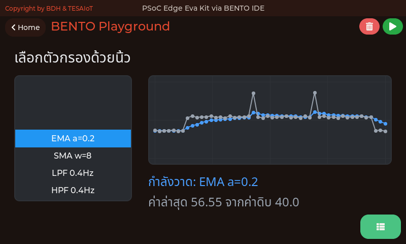
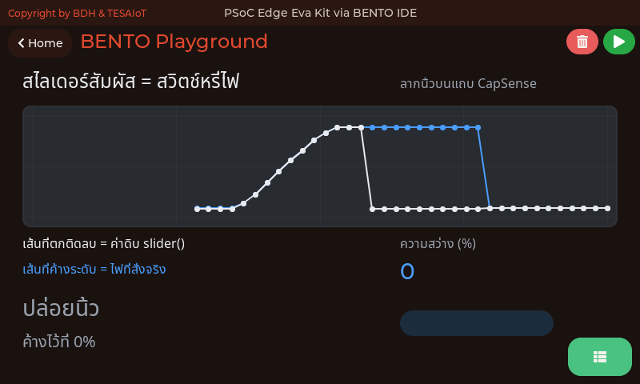
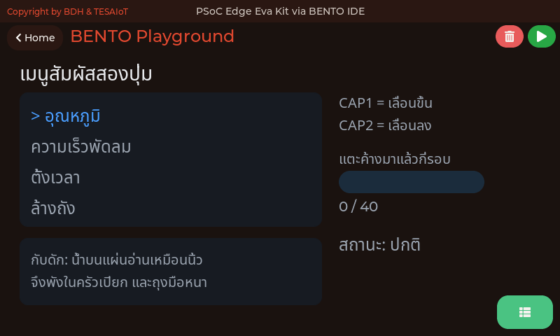
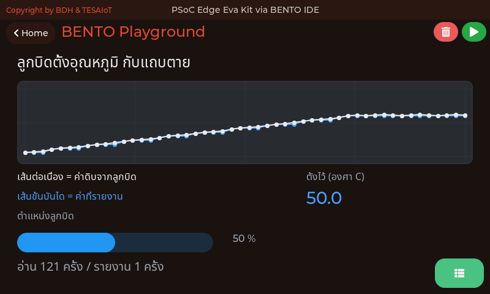
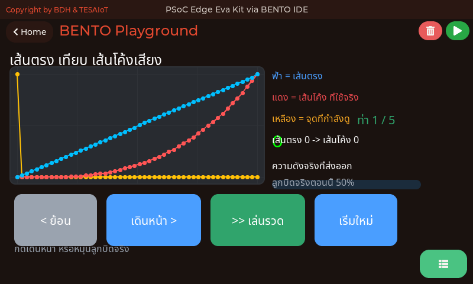
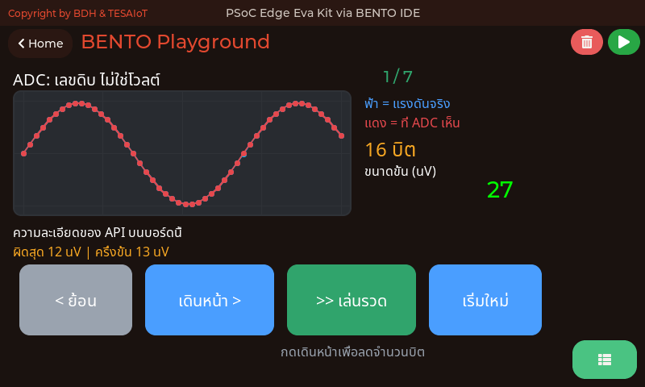
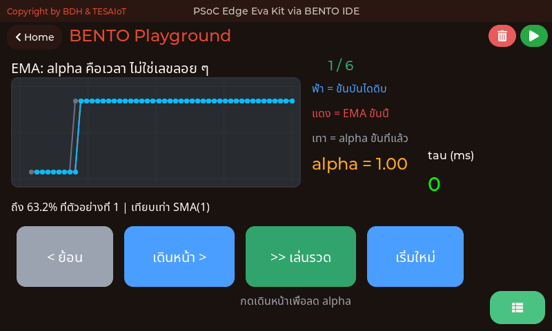
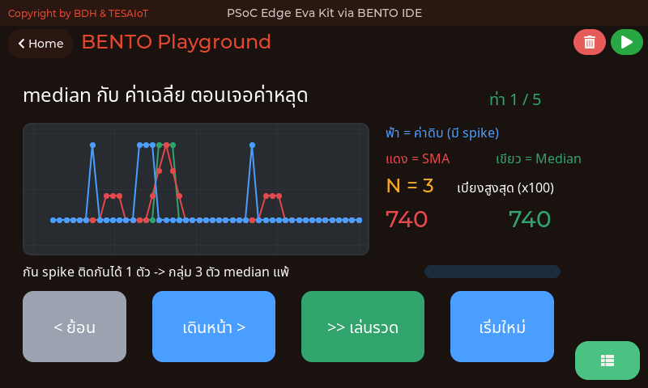
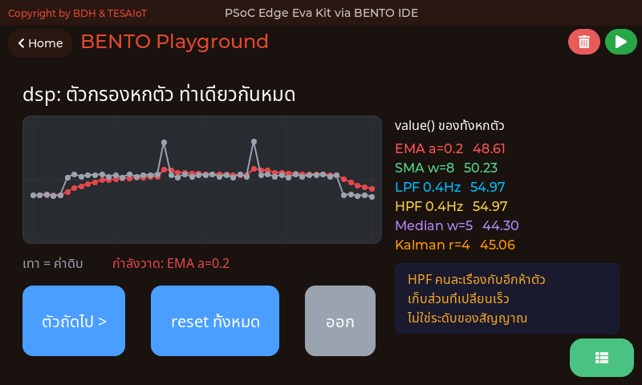
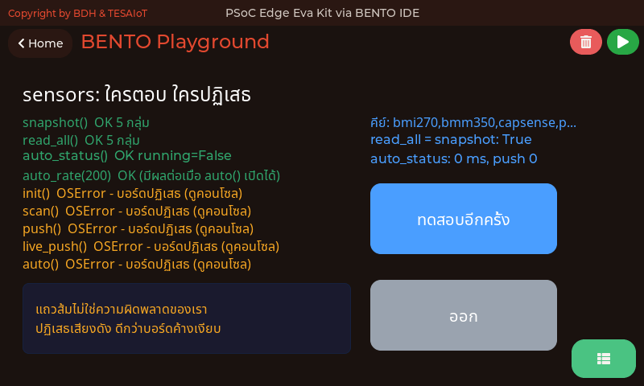

<style>
section { font-size: 24px; padding: 40px 52px; justify-content: flex-start; }
section h1 { font-size: 1.45em; line-height: 1.12; margin: 0 0 .22em; }
section h2 { font-size: 1.12em; margin: .15em 0; }
section h3 { font-size: 1.0em; margin: .12em 0; }
section p, section li { margin: .16em 0; line-height: 1.32; }
section img { max-width: 100%; height: auto; }
section svg { max-height: 330px; width: 100%; }
section table { font-size: .78em; }
section pre { font-size: .70em; line-height: 1.32; background:#0d1117; color:#e6edf3; border:1px solid #30363d; border-radius:8px; padding:12px 16px; box-shadow:0 2px 8px rgba(0,0,0,.25); }
section pre code { white-space: pre-wrap; background:transparent; color:inherit; } section pre .hljs-comment{color:#8b949e;font-style:italic} section pre .hljs-keyword,section pre .hljs-built_in,section pre .hljs-literal{color:#ff7b72} section pre .hljs-string{color:#a5d6ff} section pre .hljs-number{color:#79c0ff} section pre .hljs-title,section pre .hljs-title.function_,section pre .hljs-section{color:#d2a8ff} section pre .hljs-meta{color:#ffa657} section pre .hljs-attr,section pre .hljs-attribute,section pre .hljs-name{color:#7ee787}
section blockquote { margin: .25em 0; font-size: .92em; }
/* two images on a line (parity / 2x2 grids) stay side-by-side and small */
section p > img + img { margin-left: 10px; }
/* scroll-within-slide: dense slides scroll instead of clipping */
section { overflow-y: auto; overflow-x: hidden; }
section::-webkit-scrollbar { width: 11px; }
section::-webkit-scrollbar-thumb { background:#4a90d9; border-radius:6px; }
section::-webkit-scrollbar-track { background:rgba(0,0,0,.06); }
/* image drop-shadow + cover-slide readability (auto) */
section img{filter:drop-shadow(0 3px 12px rgba(0,0,0,.5))}
/* พื้นสำรองของสไลด์ปก: ถ้า img/cover_sNN.svg โหลดไม่ขึ้น ธีมจะคืนพื้นขาว
   แล้วตัวอักษรสีขาวของปกจะหายไปทั้งแผ่น — ปักสีเข้มไว้ให้ภาพเป็นแค่ของประดับ */
section.cover{background-color:#0b1426}
section.cover *{color:#fff !important}
section.cover h1,section.cover h2,section.cover h3,section.cover p,section.cover li,section.cover strong,section.cover em,section.cover blockquote,section.cover div{text-shadow:0 2px 9px rgba(0,0,0,.92),0 0 3px rgba(0,0,0,.8)}
section.cover div[style*="background:#"],section.cover div[style*="background: #"]{background:rgba(10,14,20,.66) !important;border-color:rgba(120,200,255,.45) !important;max-width:62%}
section.cover blockquote{border-left:4px solid rgba(120,200,255,.6) !important;background:rgba(13,17,23,.55) !important;border-radius:6px;padding:.3em .6em}
section.cover h1,section.cover h2,section.cover h3,section.cover p,section.cover blockquote{max-width:60%}
section.cover div:not(:has(img)){max-width:62%}
section.cover img{filter:none}
</style>


<!-- _class: cover -->

# บทเรียน 2.9 — ลงมือทำ: เกจลูกบิดกับแถบสัมผัส

## อนาล็อกและสัมผัส · Potentiometer + CapSense + กรองสัญญาณให้อ่านรู้เรื่อง

**โมดูล 2 — จากจอสู่ฮาร์ดแวร์**

> ต่อจากบทเรียน 2.8 — กรองสัญญาณ: EMA กับ Median แล้วแกะโค้ดเกจ

---

## MVP checkpoint — ผ่านชุดบทเรียนนี้เมื่อ


**หมุน pot คุม `ui.Bar` บน `ui.Scale` + ตั้งเกณฑ์ด้วย `ui.Spinbox` + `ui.Led` บอกสถานะ + นิ้วเลื่อน CapSense คุม `ui.Bar` + แสดง raw/filtered สองเส้นเทียบกัน**

<div style="float:right;width:27%;margin:0 0 8px 20px">
<svg viewBox="0 0 380 280" xmlns="http://www.w3.org/2000/svg">
  <text x="190" y="24" text-anchor="middle" font-size="19" font-weight="700" fill="#37474f">หน้าตาของคำว่า "ผ่าน"</text>
  <rect x="10" y="36" width="360" height="200" rx="10" fill="#101820" stroke="#4a90d9" stroke-width="2"/>
  <rect x="26" y="52" width="200" height="12" rx="6" fill="#263238"/>
  <g><animate attributeName="width" values="70;150;96;70" dur="6s" repeatCount="indefinite"/><rect x="26" y="52" width="70" height="12" rx="6" fill="#4a90d9"/></g>
  <line x1="26" y1="70" x2="226" y2="70" stroke="#90a4ae" stroke-width="1.5"/>
  <g stroke="#90a4ae" stroke-width="1.5"><line x1="26" y1="70" x2="26" y2="78"/><line x1="76" y1="70" x2="76" y2="78"/><line x1="126" y1="70" x2="126" y2="78"/><line x1="176" y1="70" x2="176" y2="78"/><line x1="226" y1="70" x2="226" y2="78"/></g>
  <text x="26" y="92" text-anchor="middle" font-size="14" fill="#78909c">0</text>
  <text x="126" y="92" text-anchor="middle" font-size="14" fill="#78909c">50</text>
  <text x="226" y="92" text-anchor="middle" font-size="14" fill="#78909c">100</text>
  <text x="26" y="122" font-size="22" fill="#ffffff">62.4 %</text>
  <text x="120" y="122" font-size="15" fill="#90a4ae">ค่าดิบ 40915</text>
  <text x="120" y="140" font-size="15" fill="#90a4ae">โวลต์ ?.??? V</text>
  <rect x="248" y="48" width="60" height="30" rx="5" fill="#0d1a30" stroke="#4a90d9"/>
  <text x="278" y="70" text-anchor="middle" font-size="17" fill="#ffffff">70</text>
  <text x="278" y="96" text-anchor="middle" font-size="14" fill="#78909c">เกณฑ์</text>
  <circle cx="258" cy="124" r="11" fill="#00e676"/>
  <circle cx="300" cy="124" r="11" fill="#3a1414"/>
  <text x="26" y="172" font-size="15" fill="#90a4ae">แถบสัมผัส</text>
  <rect x="120" y="158" width="160" height="16" rx="5" fill="#263238"/>
  <g><animateTransform attributeName="transform" type="translate" values="0,0;76,0;0,0" dur="6s" repeatCount="indefinite"/><rect x="122" y="160" width="80" height="12" rx="4" fill="#29b6f6"/></g>
  <circle cx="300" cy="166" r="10" fill="#00e676"/>
  <text x="26" y="204" font-size="17" fill="#ffffff">ดิบ    62.43 %</text>
  <text x="26" y="228" font-size="17" fill="#ffffff">กรอง  62.21 %</text>
  <text x="220" y="204" font-size="15" fill="#90a4ae">คุณภาพของค่า</text>
  <text x="220" y="228" font-size="15" fill="#78909c">อ่านค่าปกติ</text>
  <text x="190" y="266" text-anchor="middle" font-size="18" fill="#455a64">ทั้ง 33 ชิ้นทำงานพร้อมกัน</text>
</svg>
</div>

แปลเป็นสิ่งที่ตรวจได้จริง

- [ ] หมุนลูกบิดแล้วแถบเดินตามได้ตลอดช่วง 0 ถึง 100 และตัวเลขบนไม้บรรทัดใต้แถบอ่านออกทุกขีด
- [ ] ค่าดิบ / เปอร์เซ็นต์ / โวลต์ ขึ้นครบและตรงกันเชิงตรรกะ (สุดขวา ≈ 65535 และ 100% ส่วนโวลต์ให้จดค่าที่อ่านได้จริงไว้เทียบกับมัลติมิเตอร์)
- [ ] กดปุ่มเพิ่ม/ลด แล้วเลขในช่องเกณฑ์เปลี่ยนตาม และหยุดที่ขอบพิสัย 10 กับ 95 เอง
- [ ] หมุนลูกบิดข้ามเกณฑ์แล้วไฟสลับกันติด **ทีละดวงเท่านั้น** ไม่ติดพร้อมกันสองดวง
- [ ] ลากนิ้วบนแถบสัมผัสแล้วแถบล่างเดินตามตำแหน่งนิ้ว และแตะปุ่มทองแดงแล้วไฟสองดวงติดถูกดวง (ไม่กลับด้าน)
- [ ] สองบรรทัดขวาล่างแสดงค่าดิบกับค่ากรองพร้อมกัน และเห็นชัดว่าบรรทัดค่ากรองนิ่งกว่า
- [ ] ตัวเลขบนจอเปลี่ยนวินาทีละครั้ง ไม่ใช่ห้าครั้งต่อวินาที (จ้องดูสิบวินาทีแล้วนับ)
- [ ] ทีมตอบได้ว่า ถ้าเปลี่ยน `alpha` เป็น 0.05 กับ 0.8 ผลต่างกันอย่างไร
- [ ] ถ่ายรูปหน้าจอตอนหมุนลูกบิดค้างไว้ แนบในบันทึกการเรียน

<div style="clear:both"></div>

> ข้อที่ยากที่สุดไม่ใช่ข้อที่โค้ดยาวที่สุด แต่คือข้อสุดท้ายที่ต้อง **อธิบายพฤติกรรมได้**

---

## กับดักที่เจอบ่อย (1/3)

| อาการ | สาเหตุที่แท้จริง | วิธีแก้ |
|---|---|---|
| จอขึ้นครบแต่ทุกค่าค้างที่ 0 | ยังไม่ได้เติมจุดอ่านค่าในลูป | เติม `sensors.pot.percent()` / `capsense.slider()` |
| `TypeError` ตอนสร้างฟิลเตอร์ | เขียน `dsp.EMA(0.2)` | keyword-only: `dsp.EMA(alpha=0.2)` |
| บรรทัด EMA เท่ากับ RAW ทุกรอบ | สร้าง `dsp.EMA()` ไว้ในลูป ความจำถูกล้าง | ย้ายไปสร้างครั้งเดียวนอกลูป |
| ปุ่มสัมผัสรายงานกลับด้าน | วางนิ้วค้างตอน **บอร์ดบูต** | ยกนิ้วออกให้หมดแล้ว **ถอด USB เสียบกลับ** (Dev Kit: ห้ามโยกสวิตช์บนฐาน นั่นคือสวิตช์ไฟ) |
| `OSError` ที่บรรทัด `sensors.init()` | บน Eva Kit เฟิร์มแวร์ปฏิเสธคำสั่งนี้ (บน Dev Kit ผ่านเงียบ ๆ แต่ไม่จำเป็น) | ลบบรรทัดนั้นทิ้ง ไม่ต้องมี init เลย ทั้งสองบอร์ด |
| `OSError: ... CM55 did not answer` ที่บรรทัดแรก ๆ | เพิ่งรีเซ็ต คอร์จอยังไม่ตอบสายเซนเซอร์ | รอสักครู่แล้วรันซ้ำ ถ้ายังซ้ำค่อยแจ้งผู้สอน |
| widget หายไปเป็นวินาที จอกระตุก | ลืม `ui.poll()` ในลูป | ใส่ `ui.poll()` ทุกรอบก่อน `sleep_ms` |
| `ui.Bar` ไม่ขยับทั้งที่ค่าเปลี่ยน | ส่งค่าทศนิยมเข้าไป | ครอบด้วย `int()` และคุมช่วง 0-100 |

---

## กับดักที่เจอบ่อย (2/3)

| อาการ | สาเหตุที่แท้จริง | วิธีแก้ |
|---|---|---|
| `ui.Scale` ไม่ขยับเลยสักครั้ง | มันคือไม้บรรทัด ไม่รับ `.value()` | ตัวที่ต้องขยับคือ `ui.Bar` ที่วางทับ (แบบวงกลมมีเข็มจริงผ่าน `.prop(ui.PROP_SCALE_NEEDLE, ...)` — fw 2026-08-20 ขึ้นไป ดูบทเรียน 3.1–3.3) |
| ตัวเลขบนไม้บรรทัดเบียดกันจนอ่านไม่ออก | ขีดเยอะเกินไปสำหรับความกว้างที่มี | `.ticks(ทั้งหมด, ใส่เลขทุกกี่ขีด)` เช่น `(11, 2)` |
| `ui.Spinbox` แตะแล้วค่าไม่เปลี่ยน | จอสัมผัสไม่มีลูกบิดหมุน การแตะแค่เลือกตำแหน่งหลัก | ต้องมี `ui.Button` เพิ่ม/ลดข้าง ๆ เสมอ |
| ช่องเกณฑ์ขึ้น `0070` ทั้งที่ตั้ง 70 | ค่าตั้งต้นของ spinbox คือสี่หลัก | `sp.digits(2, 0)` = สองหลัก ไม่มีจุดทศนิยม |
| ไฟดับแล้วยังเห็นเป็นวงจาง ๆ | ตั้งใจ `.value(0)` คือหรี่ ไม่ใช่หาย | ไฟที่หายไปทำให้แยกไม่ออกว่าดับหรือจอเสีย |
| เปลี่ยนสีแถบตอนเกินเกณฑ์แล้วไม่ได้ผล | `.color()` ของ `ui.Bar` ไปลงที่ "ราง" ไม่ใช่แถบค่า | บอกสถานะด้วยไฟกับตัวหนังสือแทน |
| ค่าเซนเซอร์ค้างเป็นค่าเดียวตลอด | ใช้ `ui.*` แล้ว sensor auto-task หยุด | อ่านเซนเซอร์เองในลูปทุกรอบ |
| `OSError` ที่บรรทัด `sensors.scan()` | บน Eva Kit เฟิร์มแวร์ปฏิเสธเพื่อกันบัสชนกัน (บน Dev Kit ผ่าน) | ห้ามใช้คำสั่งนี้ในคอร์สนี้ทั้งสองบอร์ด ใช้ `sensors.snapshot()` แทน |

---

## กับดักที่เจอบ่อย (3/3)

| อาการ | สาเหตุที่แท้จริง | วิธีแก้ |
|---|---|---|
| `AttributeError` ตอนอ่าน pot | รันบน AI Kit เปล่า ๆ ที่ไม่มีฐาน | ลูกบิดและ CapSense มีบน Eva Kit และ Dev Kit |
| `AttributeError: sht40` / `dps368` | สองชิปนี้ไม่มีบน Eva Kit ธง BSP ตั้งไว้ 0 (Dev Kit มี) | บน Eva ไม่มีทางแก้ด้วยโค้ด ใช้ตัวเลขที่พิมพ์เองป้อน `dsp.dew_point()` แทน |
| `Median(window=4)` แล้วได้ 5 | หนีบ 3-15 และบังคับเป็นเลขคี่ **เงียบ ๆ** | ไม่ใช่บั๊ก · `print(med)` บอกค่าที่ได้จริง |
| `SMA(window=200)` แล้วนิ่งน้อยกว่าที่คิด | หนีบเพดานไว้ 64 เงียบ ๆ เหมือนกัน | ขอเกินได้ แต่ไม่ได้ตามขอ ตรวจด้วย `print()` |
| `HPF` บรรทัดแรกได้ 0.0 ทุกครั้ง | ยังไม่มีค่าก่อนหน้าให้ลบ | ปกติ ทิ้งค่าแรกไปหนึ่งรอบ |
| `LPF(cutoff=2, fs=100)` แต่กรองไม่เหมือนที่คำนวณ | ลูปจริงเดิน 5 Hz ไม่ใช่ 100 Hz | `fs` ต้องเท่ากับคาบลูปจริง ไม่ใช่ค่าตั้งต้น |
| `sensors.auto_rate(5)` แล้วไม่มีอะไรเปลี่ยน | หนีบไว้ 20 ms และบน Eva Kit งานเบื้องหลังก็ไม่ได้เดินอยู่แล้ว | "เรียกได้" ไม่ได้แปลว่า "มีผล" |

> เจ็ดในยี่สิบสามข้อนี้ไม่ได้เกิดจากโค้ดผิด แต่เกิดจาก **ลำดับการทำงานกับฮาร์ดแวร์** อีกสี่ข้อเกิดจาก **ค่าที่ถูกหนีบเงียบ ๆ** และแถวส่วนใหญ่ของตารางที่ 2 เกิดจาก **การเข้าใจ widget ผิดตัว** — ทั้งสามกลุ่มไม่มี error ให้เห็นสักบรรทัด

---

## ลงมือทำ — เติมช่องว่างในไฟล์ฝึก

เปิด [`s05_pot_capsense.py`](https://github.com/tesaiot/tesa-qualification-program/blob/main/courses/aiot-micropython/m02-ui-to-hardware/l09-pot-capsense-lab/practice/s05_pot_capsense.py) มีช่องว่างให้เติม 6 จุด

<div style="display:flex;gap:20px;align-items:flex-start">
<div style="flex:1 1 54%">

```python
# เติม: ema = dsp.EMA(alpha=0.2)
pass

while True:
    try:
        # เติม: pct = sensors.pot.percent()
        pass

        # เติม: slider = sensors.capsense.slider()
        pass
    except OSError:
        fresh = False

    # เติม: pot_bar.value(int(max(0, min(100, pct))))
    pass

    # เติม: ema_pct = ema.update(pct)
    pass

    # เติม: events = ui.poll()
    events = []
    pass
```

</div>
<div style="flex:0 0 42%">
<svg viewBox="0 0 400 300" xmlns="http://www.w3.org/2000/svg">
  <text x="200" y="24" text-anchor="middle" font-size="19" font-weight="700" fill="#37474f">เติมแล้วจอ "ตื่น" ทีละส่วน</text>
  <line x1="40" y1="56" x2="40" y2="256" stroke="#cfd8dc" stroke-width="7" stroke-linecap="round"/>
  <g stroke-dashoffset="200"><animate attributeName="stroke-dashoffset" values="200;0;0" dur="6s" repeatCount="indefinite"/><line x1="40" y1="56" x2="40" y2="256" stroke="#2e7d32" stroke-width="7" stroke-linecap="round" stroke-dasharray="200"/></g>
  <circle cx="40" cy="60" r="12" fill="#2e7d32"/>
  <circle cx="40" cy="126" r="12" fill="#2e7d32"/>
  <circle cx="40" cy="192" r="12" fill="#2e7d32"/>
  <circle cx="40" cy="252" r="12" fill="#2e7d32"/>
  <text x="68" y="56" font-size="19" fill="#1b5e20">จุดที่ 2 เสร็จ</text>
  <text x="68" y="80" font-size="18" fill="#455a64">ตัวเลขเปอร์เซ็นต์เริ่มขยับ</text>
  <text x="68" y="122" font-size="19" fill="#1b5e20">จุดที่ 3 เสร็จ</text>
  <text x="68" y="146" font-size="18" fill="#455a64">แถบเดินไปตามไม้บรรทัด</text>
  <text x="68" y="188" font-size="19" fill="#1b5e20">จุดที่ 5 เสร็จ</text>
  <text x="68" y="212" font-size="18" fill="#455a64">ไฟสองดวงเริ่มสลับกันติด</text>
  <text x="68" y="248" font-size="19" fill="#1b5e20">จุดที่ 6 เสร็จ</text>
  <text x="68" y="272" font-size="18" fill="#455a64">ปุ่มเกณฑ์กดติด จอไม่กระตุก</text>
</svg>
</div>
</div>

---

## ลงมือทำ (ต่อ) — เติมทีละจุด รันทีละครั้ง แล้วดูจอ "ตื่น" ทีละส่วน

ไฟล์ฝึกตั้งค่าเริ่มต้นไว้ให้แล้ว (`pct = 0.0`, `slider = 0`, `events = []`) โปรแกรมจึง **รันได้ตั้งแต่ยังไม่เติมอะไรเลย** แต่ตัวเลขเปอร์เซ็นต์ แถบ และค่ากรองจะนิ่งสนิท (ค่าดิบกับโวลต์ขยับตั้งแต่แรก เพราะสองบรรทัดนั้นไม่มีช่องว่าง) ใช้ตรงนี้เป็นเครื่องมือ: เติมทีละจุด รันทีละครั้ง แล้วดูว่าจอ "ตื่น" ขึ้นทีละส่วน

**หน้าจอทั้ง 33 ชิ้นเขียนไว้ให้ครบแล้ว ไม่ต้องแตะ** งานของเราคือทำให้ค่าไหลเข้าไปในนั้น จุดที่ 6 คือจุดที่คนข้ามบ่อยที่สุด เพราะไฟล์รันได้อยู่แล้วโดยไม่มีมัน อาการที่ตามมาคือปุ่มเพิ่ม/ลดเกณฑ์กดไม่ติด ซึ่งไม่มี error ให้เห็นเลยสักบรรทัด

### ตัวอย่างของบทเรียน 2.7–2.9 — สามไฟล์แรกทำในบทเรียนให้จบ ที่เหลือเปิดตามอาการ

**ต้องทำในบทเรียน** · เปิดตามลำดับนี้ ทั้งชุดราว 40 นาที

| ลำดับ · เรื่อง · เวลา | ไฟล์ | ลงมือทำอะไร แล้วจะเข้าใจอะไร |
|---|---|---|
| **1 · เลขจาก ADC ไม่ใช่โวลต์** · 10 นาที | [`05_adc_counts_to_volts.py`](https://github.com/tesaiot/tesa-qualification-program/blob/main/courses/aiot-micropython/m02-ui-to-hardware/l09-pot-capsense-lab/examples/05_adc_counts_to_volts.py) | ลดจำนวนบิตทีละท่าแล้วดูบันไดหยาบขึ้น · จะแปลงเลขดิบเป็นโวลต์ได้เอง เพราะรู้แล้วว่าต้องรู้แรงดันเต็มสเกลกับจำนวนบิตเสมอ |
| **2 · แถบสัมผัสคุมความสว่าง** · 15 นาที | [`01_capsense_dimmer.py`](https://github.com/tesaiot/tesa-qualification-program/blob/main/courses/aiot-micropython/m02-ui-to-hardware/l07-adc-capsense/examples/01_capsense_dimmer.py) | ลากนิ้วแล้วปล่อย แล้วดูว่าเส้นแดงค้างอยู่ตอนไม่มีนิ้ว · จะรู้ว่า `slider()` เท่ากับ 0 ไม่ได้แปลว่าปล่อยนิ้ว ต้องดูว่าค่าหยุดเปลี่ยนแทน |
| **3 · alpha แปลเป็นวินาทีได้** · 15 นาที | [`06_ema_time_constant.py`](https://github.com/tesaiot/tesa-qualification-program/blob/main/courses/aiot-micropython/m02-ui-to-hardware/l08-filters/examples/06_ema_time_constant.py) | เดินทีละท่าเปลี่ยน alpha แล้วอ่านค่า tau ที่ไฟล์คำนวณให้ · จะเลือก alpha ของ MVP จากตัวเลข ไม่ใช่จากการเดา |

---

## ตัวอย่างของบทเรียน 2.7–2.9 (ต่อ) — เปิดตามอาการ และอ่านเสริมนอกเวลา

**ติดตรงไหน เปิดอันนี้**

| อาการที่เจอ | ไฟล์ที่ตอบอาการนั้น |
|---|---|
| แตะแถบสัมผัสแล้วไม่แน่ใจว่าบอร์ดรับไปหรือยัง โดยเฉพาะตอนมือเปียก | [`02_capsense_menu_wet_hand.py`](https://github.com/tesaiot/tesa-qualification-program/blob/main/courses/aiot-micropython/m02-ui-to-hardware/l09-pot-capsense-lab/examples/02_capsense_menu_wet_hand.py) — ปุ่มสัมผัสไม่มีแรงต้านให้นิ้วรู้สึก จึงต้องตอบกลับด้วยจอ ไฟ หรือเสียงทุกครั้ง |
| กราฟที่กรองแล้วยังกระโดดตามค่าหลุดค่าเดียวอยู่ดี | [`07_median_beats_mean.py`](https://github.com/tesaiot/tesa-qualification-program/blob/main/courses/aiot-micropython/m02-ui-to-hardware/l09-pot-capsense-lab/examples/07_median_beats_mean.py) — ค่าเฉลี่ยเอาค่าที่หลุดมาบวกด้วย ส่วน median เรียงแล้วหยิบตัวกลาง ค่าหลุดจึงไม่มีสิทธิ์ถูกหยิบ · หน้าต่าง N ทน spike ที่ติดกันได้ไม่เกิน (N-1)//2 ตัว |
| ปล่อยมือจากลูกบิดแล้ว ค่าที่รายงานยังกระดิกไม่หยุด | [`03_pot_setpoint_deadband.py`](https://github.com/tesaiot/tesa-qualification-program/blob/main/courses/aiot-micropython/m02-ui-to-hardware/l09-pot-capsense-lab/examples/03_pot_setpoint_deadband.py) — dead-band ตัดการกระดิกทิ้งโดยผู้ใช้ไม่รู้สึกว่าเสียอะไร นิสัยนี้ใช้ยาวไปถึงบทเรียน 4.4–4.6 ตอนต้องลดจำนวนข้อความที่ส่งออก |

**อ่านเสริมนอกเวลา** — เรื่องนี้อยู่นอกเกณฑ์ผ่านของบทเรียน 2.7–2.9 แต่ตอบคำถามที่ทีมเสียงมักติด: [`04_pot_taper_volume.py`](https://github.com/tesaiot/tesa-qualification-program/blob/main/courses/aiot-micropython/m02-ui-to-hardware/l09-pot-capsense-lab/examples/04_pot_taper_volume.py) ครึ่งทางของลูกบิดไม่ใช่ครึ่งหนึ่งของความดังที่หูได้ยิน หูตอบสนองเป็นลอการิทึม การแมปตรง ๆ จึงรู้สึกว่าดังพรวดตั้งแต่ยังหมุนไม่ถึงไหน

> โปรแกรมที่รันได้แต่ยังไม่ถูกต้อง ดีบักง่ายกว่าโปรแกรมที่รันไม่ขึ้นเสมอ

---

## เชื่อมโยงรากฐาน — วันนี้เราแตะอะไรไปบ้าง

<svg viewBox="0 0 940 165" xmlns="http://www.w3.org/2000/svg">
  <rect x="16" y="34" width="290" height="106" rx="10" fill="#fff3e0" stroke="#ef6c00" stroke-width="2.5"/>
  <text x="161" y="66" text-anchor="middle" font-size="20" font-weight="700" fill="#ef6c00">อิเล็กทรอนิกส์และการวัด</text>
  <text x="161" y="96" text-anchor="middle" font-size="18" fill="#a1683a">อนาล็อก → ดิจิทัล · ความละเอียด</text>
  <text x="161" y="122" text-anchor="middle" font-size="18" fill="#a1683a">แรงดันอ้างอิง · baseline</text>
  <rect x="325" y="34" width="290" height="106" rx="10" fill="#e8f5e9" stroke="#2e7d32" stroke-width="2.5"/>
  <text x="470" y="66" text-anchor="middle" font-size="20" font-weight="700" fill="#2e7d32">ประมวลผลสัญญาณ</text>
  <text x="470" y="96" text-anchor="middle" font-size="18" fill="#4a7c4e">noise มาจากไหน · EMA · Median</text>
  <text x="470" y="122" text-anchor="middle" font-size="18" fill="#4a7c4e">แลกความนิ่งกับความหน่วง</text>
  <rect x="634" y="34" width="290" height="106" rx="10" fill="#e3f2fd" stroke="#1565c0" stroke-width="2.5"/>
  <text x="779" y="66" text-anchor="middle" font-size="20" font-weight="700" fill="#1565c0">Python และการออกแบบ</text>
  <text x="779" y="96" text-anchor="middle" font-size="18" fill="#5472a3">ออบเจกต์ที่จำสถานะข้ามรอบ</text>
  <text x="779" y="122" text-anchor="middle" font-size="18" fill="#5472a3">ตรวจขอบเขตค่าจากภายนอก</text>
  <text x="470" y="22" text-anchor="middle" font-size="19" font-weight="700" fill="#37474f">สามเสาที่วันนี้แตะพร้อมกัน</text>
  <text x="470" y="158" text-anchor="middle" font-size="18" fill="#78909c">เสาแรกคือเสาที่ทำให้เราตอบได้ว่า "ตัวเลขนี้เชื่อได้แค่ไหน" ไม่ใช่แค่ "ตัวเลขนี้คืออะไร"</text>
</svg>

**ฝั่งอิเล็กทรอนิกส์และการวัด**
การแปลงอนาล็อกเป็นดิจิทัล · ความละเอียด (บิต) กับช่วงการวัด · แรงดันอ้างอิงและผลของมันต่อค่าที่อ่านได้ · การตรวจจับแบบ capacitive · แนวคิด baseline และการวัดแบบส่วนต่าง

**ฝั่งการประมวลผลสัญญาณ**
noise มาจากไหนและมีกี่ชั้น · ค่าเฉลี่ยถ่วงน้ำหนักแบบมีความจำ (EMA) · ตัวกลางแบบหน้าต่างเลื่อน (Median) · การแลกกันระหว่างความนิ่งกับความหน่วง

**ฝั่ง Python และการออกแบบระบบ**
ออบเจกต์ที่เก็บสถานะข้ามรอบลูป · keyword-only arguments · การตรวจขอบเขตค่าจากภายนอก · การออกแบบหน้าจอให้หนึ่งค่าเล่าได้หลายหน่วย

> เรื่อง trade-off ระหว่าง "นิ่ง" กับ "ไว" จะกลับมาหาผู้เรียนอีกในบทเรียน 3.1–3.3 และ 3.4–3.6 แต่คราวนั้นข้อมูลจะมาจาก IMU

---

## งานทำเอง 30% + สรุปบทเรียน

<svg viewBox="0 0 940 160" xmlns="http://www.w3.org/2000/svg">
  <defs><marker id="s5n" markerWidth="9" markerHeight="7" refX="8" refY="3.5" orient="auto">
    <path d="M0,0 L9,3.5 L0,7 z" fill="#455a64"/></marker></defs>
  <rect x="16" y="40" width="170" height="72" rx="9" fill="#e3f2fd" stroke="#1565c0" stroke-width="2"/>
  <text x="101" y="72" text-anchor="middle" font-size="19" fill="#0d47a1">อ่านลูกบิด</text>
  <text x="101" y="98" text-anchor="middle" font-size="18" fill="#5472a3">raw · % · โวลต์</text>
  <rect x="200" y="40" width="170" height="72" rx="9" fill="#e3f2fd" stroke="#1565c0" stroke-width="2"/>
  <text x="285" y="72" text-anchor="middle" font-size="19" fill="#0d47a1">อ่านสัมผัส</text>
  <text x="285" y="98" text-anchor="middle" font-size="18" fill="#5472a3">ปุ่ม + แถบเลื่อน</text>
  <rect x="384" y="40" width="170" height="72" rx="9" fill="#e3f2fd" stroke="#1565c0" stroke-width="2"/>
  <text x="469" y="72" text-anchor="middle" font-size="19" fill="#0d47a1">รู้ที่มาของ noise</text>
  <text x="469" y="98" text-anchor="middle" font-size="18" fill="#5472a3">สามชั้นซ้อนกัน</text>
  <rect x="568" y="40" width="170" height="72" rx="9" fill="#e8f5e9" stroke="#2e7d32" stroke-width="2.5"/>
  <text x="653" y="72" text-anchor="middle" font-size="19" fill="#1b5e20">กรองแล้วอธิบายได้</text>
  <text x="653" y="98" text-anchor="middle" font-size="18" fill="#4a7c4e">EMA เทียบ RAW</text>
  <rect x="770" y="40" width="154" height="72" rx="9" fill="#fff3e0" stroke="#ef6c00" stroke-width="2.5"/>
  <text x="847" y="72" text-anchor="middle" font-size="19" fill="#bf360c">ชุดบทเรียนถัดไป</text>
  <text x="847" y="98" text-anchor="middle" font-size="18" fill="#a1683a">IMU + dsp.tilt</text>
  <line x1="742" y1="76" x2="766" y2="76" stroke="#455a64" stroke-width="3" marker-end="url(#s5n)"/>
  <text x="470" y="26" text-anchor="middle" font-size="19" font-weight="700" fill="#37474f">สี่อย่างที่ติดมือไปชุดบทเรียนถัดไป</text>
  <text x="470" y="146" text-anchor="middle" font-size="18" fill="#78909c">ฟิลเตอร์ตัวเดิมจะได้ใช้ทันทีกับข้อมูลจาก IMU ที่สั่นกว่านี้อีก</text>
</svg>

**วันนี้เราได้:**
อ่านค่าอนาล็อกจากลูกบิดครบสามหน่วยและอธิบายที่มาของแต่ละหน่วยได้ · เข้าใจว่า ADC ปัดค่าอย่างไรและทำไมบิตล่างถึงกระพริบ · อ่านปุ่มสัมผัสและแถบเลื่อนพร้อมรู้เรื่อง baseline · ใช้ `dsp.EMA` และ `dsp.Median` แล้วเห็นผลเทียบกันบนจอเดียว

**การบ้านของทีม:** เลือกทำ 1 ข้อจากสี่ข้อในสไลด์ถัดไป จดลงบันทึกการเรียน

**ชุดบทเรียนถัดไป:** เราจะเปลี่ยนจากลูกบิดที่มีคนหมุน ไปเป็นเซนเซอร์ที่วัดโลกจริง — `sensors.bmi270.motion()` กับ `dsp.tilt()` แล้วสร้างเครื่องวัดระดับดิจิทัลที่บอกองศาการเอียงของบอร์ดได้จริง ฟิลเตอร์ที่เรียนวันนี้จะได้ใช้ทันทีในชุดบทเรียนถัดไป

> เก็บค่า `alpha` ที่ทีมชอบไว้ให้ดี ชุดบทเรียนถัดไปจะได้ไม่ต้องลองใหม่ตั้งแต่ศูนย์

---

## เฉลย [`s05_pot_capsense.py`](https://github.com/tesaiot/tesa-qualification-program/blob/main/courses/aiot-micropython/m02-ui-to-hardware/l09-pot-capsense-lab/solution/s05_pot_capsense.py) — ส่วนที่หนึ่ง: ตั้งเวที

อ่านให้เข้าใจ **แล้วพิมพ์เอง** อย่าคัดลอกวาง

<div style="display:flex;gap:20px;align-items:flex-start">
<div style="flex:1 1 58%">

```python
import ui
ui.screen()
import time
import sensors
import dsp

ui.clear()
time.sleep_ms(200)

COL_TEXT, COL_DIM = 0xE8EAED, 0x9AA3AF
COL_CARD = 0x171B22
COL_OK, COL_WARN, COL_BAD = 0x30A46C, 0xF5A623, 0xE5484D

TH_MIN, TH_MAX, TH_STEP = 10, 95, 5
th = 70              # เกณฑ์ตั้งต้น หน่วยเปอร์เซ็นต์

# ไม่มี sensors.init() ในไฟล์นี้ และไม่ควรมี (ทั้งสองบอร์ด)
try:
    sensors.pot.read()   # อุ่นเครื่อง รอบแรกหลังรีเซ็ตอาจต้องรอคอร์จอตอบ
except OSError:
    print("อ่านเซนเซอร์รอบแรกยังไม่ได้ - ลองใหม่ในลูป")
```

</div>
<div style="flex:0 0 38%">
<svg viewBox="0 0 380 300" xmlns="http://www.w3.org/2000/svg">
  <text x="190" y="26" text-anchor="middle" font-size="19" font-weight="700" fill="#37474f">สีคือ "สถานะ" ไม่ใช่การตกแต่ง</text>
  <rect x="20" y="46" width="340" height="60" rx="8" fill="#0e1116"/>
  <circle cx="52" cy="76" r="13" fill="#e8eaed"/>
  <text x="82" y="83" font-size="18" fill="#e8eaed">ขาว - ค่าที่ต้องอ่าน</text>
  <rect x="20" y="114" width="340" height="60" rx="8" fill="#0e1116"/>
  <circle cx="52" cy="144" r="13" fill="#9aa3af"/>
  <text x="82" y="151" font-size="18" fill="#9aa3af">เทา - ป้ายกำกับ อ่านทีหลังได้</text>
  <rect x="20" y="182" width="340" height="60" rx="8" fill="#0e1116"/>
  <circle cx="52" cy="212" r="13" fill="#30a46c"/>
  <circle cx="90" cy="212" r="13" fill="#f5a623"/>
  <circle cx="128" cy="212" r="13" fill="#e5484d"/>
  <text x="152" y="219" font-size="18" fill="#e5484d">สงวนให้สถานะเท่านั้น</text>
  <text x="190" y="270" text-anchor="middle" font-size="18" fill="#455a64">สถานะปกติต้องเงียบ</text>
  <text x="190" y="292" text-anchor="middle" font-size="18" fill="#78909c">สีจัดที่ใช้กับของธรรมดา ทำให้สีเตือนหมดความหมาย</text>
</svg>
</div>
</div>

---

## เฉลย — ส่วนที่หนึ่ง (ต่อ): ทำไมจานสีถึงเปลี่ยน

เฉลยรุ่นนี้เปลี่ยนจานสีทั้งชุด จากเดิมที่ให้ **สีบอกหน่วย** (เขียว = ค่าดิบ, ฟ้า = เปอร์เซ็นต์, เหลือง = โวลต์) มาเป็นจานสีของแผงควบคุมจริง ที่ **สีบอกสถานะ** เท่านั้น

เหตุผลไม่ใช่ความชอบ: สีเหลืองในหน้าจออุตสาหกรรมแปลว่า "เฝ้าระวัง" ตายตัว การเอาไปใช้กับบรรทัดโวลต์ที่ปกติดีทุกอย่าง คือการสอนให้ตาคนชินกับสีเตือน แล้ววันที่มันเตือนจริง จะไม่มีใครเห็น หน่วยของแต่ละบรรทัดบอกด้วย **คำ** ได้อยู่แล้ว ไม่ต้องยืมสีมาบอก

ค่าสีถูกตั้งเป็นค่าคงที่ชื่ออ่านรู้เรื่องไว้บนสุด ไม่ได้ใส่เลข `0x30A46C` ลงไปกลางโค้ดตรง ๆ เพราะวันหนึ่งที่อยากเปลี่ยนธีมทั้งจอ เราจะแก้ที่เดียวจบ — ค่าทั้งชุดคือจานสีของหลักสูตร (พื้น `0x0E1116` · การ์ด `0x171B22` · ปุ่มรอง `0x3A4150` · ตัวหนังสือ `0xE8EAED` · จาง `0x9AA3AF` · ปกติ/เตือน/เสีย `0x30A46C` `0xF5A623` `0xE5484D`) · การอุ่นเครื่องอยู่ใน `try/except` เพราะ `OSError` รอบแรกหลังรีเซ็ตเป็นเรื่องปกติทั้งสองบอร์ด ไม่ใช่ความผิดพลาด

> เลขฐานสิบหกที่โผล่กลางโค้ดโดยไม่มีชื่อ คือหนี้ที่คนอ่านคนถัดไปต้องมาจ่าย

---

## เฉลย — ส่วนที่สอง: วางหน้าจอสี่การ์ด รวม 33 ชิ้น

<div style="display:flex;gap:18px;align-items:flex-start">
<div style="flex:1 1 60%">

```python
ui.Label("แผงคุมลูกบิดกับแถบสัมผัส", x=16, y=8, color=COL_TEXT, value=24)

# การ์ดบนซ้าย - ค่าที่วัดได้ พร้อมพิสัยของมันเอง
ui.Panel(x=12, y=40, w=468, h=200, color=COL_CARD, min=COL_DIM, max=12, value=1)
ui.Label("ลูกบิดเทียบพิสัย 0-100", x=28, y=48, color=COL_DIM, value=20)
pot_bar = ui.Bar(x=28, y=80, w=428, h=16, color=0x4A9EFF, min=0, max=100, value=0)
pot_scale = ui.Scale(x=28, y=92, w=428, h=44, color=COL_TEXT, min=0, max=100)
pot_scale.ticks(11, 2)
...
lbl_pct = ui.Label("0.0 %", x=28, y=180, color=COL_TEXT, value=28)
lbl_raw = ui.Label("ค่าดิบ 0", x=252, y=148, color=COL_DIM, value=16)
lbl_volt = ui.Label("โวลต์ 0.000 V", x=252, y=172, color=COL_DIM, value=16)

# การ์ดบนขวา - เกณฑ์ที่ผู้ใช้ตั้งเอง กับไฟสองดวง
ui.Panel(x=492, y=40, w=288, h=224, color=COL_CARD, min=COL_DIM, max=12, value=1)
...
sp_th = ui.Spinbox(x=508, y=76, w=256, h=88, color=COL_TEXT,
                   min=TH_MIN, max=TH_MAX, value=th)
sp_th.digits(2, 0)
btn_up = ui.Button("เพิ่ม", x=644, y=172, w=120, h=88, color=0x3A4150, value=16)
btn_dn = ui.Button("ลด", x=508, y=172, w=120, h=88, color=0x3A4150, value=16)
...
led_ok = ui.Led(x=492, y=304, w=48, h=48, color=COL_OK, value=1)
...
led_bad = ui.Led(x=492, y=348, w=48, h=48, color=COL_BAD, value=0)
```

</div>
<div style="flex:0 0 36%">
<svg viewBox="0 0 360 300" xmlns="http://www.w3.org/2000/svg">
  <text x="180" y="24" text-anchor="middle" font-size="19" font-weight="700" fill="#37474f">ผังหน้าจอ สี่การ์ด</text>
  <rect x="12" y="36" width="336" height="222" rx="10" fill="#0a1020" stroke="#4a90d9" stroke-width="2"/>
  <text x="26" y="56" font-size="15" fill="#ffffff">แผงคุมลูกบิดกับแถบสัมผัส</text>
  <rect x="22" y="64" width="190" height="86" rx="6" fill="#142240" stroke="#37507a"/>
  <text x="32" y="82" font-size="13" fill="#90a4ae">ค่า + พิสัย</text>
  <rect x="32" y="90" width="168" height="8" rx="4" fill="#263238"/>
  <rect x="32" y="90" width="96" height="8" rx="4" fill="#4a90d9"/>
  <line x1="32" y1="104" x2="200" y2="104" stroke="#78909c"/>
  <text x="32" y="134" font-size="18" fill="#ffffff">55.4 %</text>
  <rect x="220" y="64" width="118" height="86" rx="6" fill="#142240" stroke="#37507a"/>
  <text x="230" y="82" font-size="13" fill="#90a4ae">เกณฑ์ + ไฟ</text>
  <rect x="230" y="90" width="44" height="22" rx="4" fill="#0d1a30" stroke="#4a90d9"/>
  <text x="252" y="106" text-anchor="middle" font-size="14" fill="#ffffff">70</text>
  <circle cx="242" cy="132" r="9" fill="#00e676"/>
  <circle cx="272" cy="132" r="9" fill="#3a1414"/>
  <rect x="22" y="158" width="190" height="52" rx="6" fill="#142240" stroke="#37507a"/>
  <text x="32" y="174" font-size="13" fill="#90a4ae">แถบสัมผัส + ไฟปุ่ม</text>
  <rect x="32" y="182" width="130" height="8" rx="4" fill="#263238"/>
  <circle cx="180" cy="186" r="8" fill="#0d3b22"/>
  <rect x="22" y="216" width="190" height="34" rx="6" fill="#142240" stroke="#37507a"/>
  <text x="32" y="238" font-size="13" fill="#a0b4cc">คุณภาพของค่า</text>
  <rect x="220" y="158" width="118" height="92" rx="6" fill="#142240" stroke="#37507a"/>
  <text x="230" y="176" font-size="13" fill="#90a4ae">ดิบ เทียบ กรอง</text>
  <text x="230" y="200" font-size="14" fill="#ffffff">ดิบ 55.43</text>
  <text x="230" y="222" font-size="14" fill="#ffffff">กรอง 54.99</text>
  <text x="180" y="284" text-anchor="middle" font-size="18" fill="#455a64">33 ชิ้น - เกินงบคอร์ส 32 ไปหนึ่ง</text>
</svg>
</div>
</div>

---

## เฉลย — ส่วนที่สอง (ต่อ): นับ widget และจองความกว้างไว้ตั้งแต่แรก

นับ widget ให้ครบทุกครั้งก่อนรัน: **33 ชิ้น** เกินงบของคอร์ส 32 ไปหนึ่งชิ้น (ยังต่ำกว่าเพดานเฟิร์มแวร์ 64) งานต่อยอดจึงต้องเอาชิ้นเดิมออกก่อนเพิ่มชิ้นใหม่ · `ui.Panel` สี่ใบไม่ได้มีไว้ให้สวย มันคือเส้นที่บอกตาว่า "ของกลุ่มนี้เกี่ยวกันนะ" หน้าจอที่ของทุกชิ้นลอยอยู่บนพื้นเดียวกันหมด คนดูต้องจัดกลุ่มเองด้วยสายตาทุกครั้งที่มอง

ทุกตัวถูกสร้างด้วยข้อความตั้งต้นที่มีรูปแบบเหมือนตอนมีค่าจริง เช่น `"โวลต์ 0.000 V"` ไม่ใช่ `"..."` เพราะการจองความกว้างไว้ตั้งแต่แรกทำให้ข้อความไม่กระตุกเวลาความยาวเปลี่ยน

**ข้อควรรู้เรื่องความยาวข้อความ:** คำสั่งสร้าง widget มีท่อกว้าง 95 ไบต์ ส่วน `.text()` กว้าง 126 ไบต์ เฟิร์มแวร์ 2026-08-20 ขึ้นไปส่งส่วนที่เกิน 95 ไบต์ซ้ำทาง `.text()` ให้เอง (`modui.c`) ป้ายจึงพาได้ 126 ไบต์ทั้งตอนสร้างและตอน `.text()` ตรงกับบทเรียน 1.2 ภาษาไทยตัวละ 3 ไบต์ แปลว่าราว 42 ตัวอักษร ยาวกว่านั้น **ถูกตัดเงียบ ๆ** ไม่มี error ให้เห็น · เฟิร์มแวร์รุ่นก่อนตัดที่ 95 ไบต์ (ราว 31 ตัวอักษรไทย) ตั้งแต่ตอนสร้าง ถ้าป้ายยาวขาดกลางคำ ให้ตั้งสั้นตอนสร้างแล้วเขียนเต็มด้วย `.text()`

> ออกแบบหน้าจอโดยคิดถึง "ตอนมีค่าจริง" เสมอ ไม่ใช่ตอนที่ยังว่างเปล่า

---

## เฉลย — ส่วนที่สาม: ลูปที่ทำงานจริง

<div style="display:flex;gap:18px;align-items:flex-start">
<div style="flex:1 1 62%">

```python
ema = dsp.EMA(alpha=0.2)        # สร้างนอกลูป
last_sec = -1
while True:
    fresh = True
    try:
        raw = sensors.pot.read()
        volts = sensors.pot.voltage()
        pct = sensors.pot.percent()
        slider = sensors.capsense.slider()
        b0, b1 = sensors.capsense.buttons()
    except OSError:
        fresh = False
        b0, b1 = 0, 0

    pot_bar.value(int(max(0, min(100, pct))))
    touch_bar.value(max(0, min(100, slider)))
    ema_pct = ema.update(pct)

    over = ema_pct >= th            # หนึ่งดวงติดเท่านั้น
    led_ok.value(0 if over else 1)
    led_bad.value(1 if over else 0)
    led_b0.value(1 if b0 else 0)
    led_b1.value(1 if b1 else 0)

    for ev in ui.poll():
        if ev.get("type") != "clicked":
            continue
        if ev.get("handle") == btn_up.id():
            th = min(TH_MAX, th + TH_STEP)
            sp_th.value(th)
        elif ev.get("handle") == btn_dn.id():
            th = max(TH_MIN, th - TH_STEP)
            sp_th.value(th)

    sec = time.ticks_ms() // 1000   # ตัวเลขเปลี่ยนวินาทีละครั้ง
    if sec != last_sec:
        last_sec = sec
        lbl_pct.text("{:.1f} %".format(pct))
        lbl_raw.text("ค่าดิบ {}".format(raw))
        lbl_volt.text("โวลต์ {:.3f} V".format(volts))
        raw_line.text("ดิบ    {:.2f} %".format(pct))
        ema_line.text("กรอง  {:.2f} %".format(ema_pct))

    time.sleep_ms(200)
```

</div>
<div style="flex:0 0 34%">
<svg viewBox="0 0 340 300" xmlns="http://www.w3.org/2000/svg">
  <text x="170" y="24" text-anchor="middle" font-size="19" font-weight="700" fill="#37474f">สองจังหวะในลูปเดียว</text>
  <rect x="20" y="40" width="300" height="42" rx="8" fill="#fff3e0" stroke="#ef6c00" stroke-width="2"/>
  <text x="170" y="66" text-anchor="middle" font-size="18" fill="#bf360c">1 - อ่านทั้งชุดใน try เดียว</text>
  <rect x="20" y="90" width="300" height="58" rx="8" fill="#e3f2fd" stroke="#1565c0" stroke-width="2"/>
  <text x="170" y="114" text-anchor="middle" font-size="18" fill="#0d47a1">2 - แถบ + ไฟ ทุกรอบ</text>
  <text x="170" y="136" text-anchor="middle" font-size="17" fill="#5472a3">5 ครั้งต่อวินาที</text>
  <rect x="20" y="156" width="300" height="42" rx="8" fill="#f3e5f5" stroke="#6a1b9a" stroke-width="2"/>
  <text x="170" y="182" text-anchor="middle" font-size="18" fill="#4a148c">3 - poll แล้วรับปุ่มเกณฑ์</text>
  <rect x="20" y="206" width="300" height="58" rx="8" fill="#e8f5e9" stroke="#2e7d32" stroke-width="2"/>
  <text x="170" y="230" text-anchor="middle" font-size="18" fill="#1b5e20">4 - ตัวเลข วินาทีละครั้ง</text>
  <text x="170" y="252" text-anchor="middle" font-size="17" fill="#4a7c4e">if sec != last_sec</text>
  <g><animateTransform attributeName="transform" type="translate" values="0,0;0,50;0,116;0,166;0,0" dur="5s" repeatCount="indefinite"/><circle cx="8" cy="61" r="7" fill="#455a64"/></g>
  <text x="170" y="288" text-anchor="middle" font-size="18" fill="#78909c">ของที่ตาอ่านเป็นตำแหน่ง เดินเร็วได้</text>
</svg>
</div>
</div>

---

## เฉลย — ส่วนที่สาม (ต่อ): `try` เดียว และเกณฑ์จากค่าที่กรองแล้ว

การอ่านทั้งห้าบรรทัดอยู่ใน `try` เดียวกันโดยตั้งใจ: ถ้ารอบนี้คอร์จอไม่ตอบ เราไม่อยากได้ครึ่งชุดเก่าครึ่งชุดใหม่ปนกันบนจอ **ค่าทั้งหน้าจะเป็นชุดเดียวกันเสมอ** และธง `fresh` จะไปบอกบรรทัดคุณภาพของค่าว่าตัวเลขที่เห็นตอนนี้เป็นของรอบก่อน

`over = ema_pct >= th` ใช้ค่าที่ **กรองแล้ว** ไม่ใช่ค่าดิบ ถ้าใช้ค่าดิบ ไฟจะกระพริบสลับดวงตอนค่าอยู่คาบเกี่ยวกับเกณฑ์พอดี ซึ่งเป็นอาการที่แผงควบคุมจริงเรียกว่า alarm chattering และเป็นเหตุผลหนึ่งที่คนหน้างานปิดเสียงเตือนทิ้ง

> ลองแก้ `alpha` เป็น 0.05 แล้ว 0.8 ดู แล้วจ้องสองบรรทัดขวาล่างสิบวินาที — บทเรียนทั้งบทเรียนอยู่ในความต่างนั้น

---

## เฉลย · ทำไมเรียงห้าท่าแบบนี้ ไม่ใช่สุ่มเรียง

<svg viewBox="0 0 940 180" xmlns="http://www.w3.org/2000/svg" style="width:76%;display:block;margin:0 auto">
  <g fill="#e3f2fd"><animate attributeName="fill" values="#e3f2fd;#90caf9;#e3f2fd" dur="5s" begin="0s" repeatCount="indefinite"/><rect x="20" y="102" width="170" height="48" rx="7" stroke="#1565c0" stroke-width="2"/></g>
  <g fill="#e3f2fd"><animate attributeName="fill" values="#e3f2fd;#90caf9;#e3f2fd" dur="5s" begin="1s" repeatCount="indefinite"/><rect x="202" y="82" width="170" height="68" rx="7" stroke="#1565c0" stroke-width="2"/></g>
  <g fill="#e8f5e9"><animate attributeName="fill" values="#e8f5e9;#a5d6a7;#e8f5e9" dur="5s" begin="2s" repeatCount="indefinite"/><rect x="384" y="62" width="170" height="88" rx="7" stroke="#2e7d32" stroke-width="2"/></g>
  <g fill="#e8f5e9"><animate attributeName="fill" values="#e8f5e9;#a5d6a7;#e8f5e9" dur="5s" begin="3s" repeatCount="indefinite"/><rect x="566" y="42" width="170" height="108" rx="7" stroke="#2e7d32" stroke-width="2"/></g>
  <g fill="#f3e5f5"><animate attributeName="fill" values="#f3e5f5;#ce93d8;#f3e5f5" dur="5s" begin="4s" repeatCount="indefinite"/><rect x="748" y="22" width="170" height="128" rx="7" stroke="#6a1b9a" stroke-width="2"/></g>
  <text x="105" y="132" text-anchor="middle" font-size="18" fill="#0d47a1">1 ตั้งจอ + อุ่นเครื่อง</text>
  <text x="287" y="132" text-anchor="middle" font-size="18" fill="#0d47a1">2 ลูกบิด + เกณฑ์</text>
  <text x="469" y="132" text-anchor="middle" font-size="18" fill="#1b5e20">3 CapSense</text>
  <text x="651" y="132" text-anchor="middle" font-size="18" fill="#1b5e20">4 ฟิลเตอร์</text>
  <text x="833" y="132" text-anchor="middle" font-size="18" fill="#4a148c">5 จังหวะลูป</text>
  <text x="196" y="60" text-anchor="middle" font-size="18" font-weight="700" fill="#1565c0">ของที่ไม่ต้องพึ่งใคร</text>
  <text x="560" y="34" text-anchor="middle" font-size="18" font-weight="700" fill="#2e7d32">เพิ่มตัวแปรใหม่ทีละหนึ่ง</text>
  <text x="833" y="16" text-anchor="middle" font-size="18" font-weight="700" fill="#6a1b9a">ทำให้อยู่ได้นาน</text>
  <text x="470" y="172" text-anchor="middle" font-size="18" fill="#78909c">พังตอนไหนก็รู้ทันทีว่าพังที่ของที่เพิ่งเพิ่ม ไม่ใช่ที่ของเดิม</text>
</svg>

**ท่า 1 ตั้งจอ แล้วรอให้คอร์จอตอบ** มาก่อน เพราะถ้าจอไม่ขึ้นหรือ `sensors.pot.read()` รอบอุ่นเครื่องยังขึ้น `OSError` ท่าที่เหลือไม่มีทางถูกต้องได้เลย

**ท่า 2 ลูกบิดกับเกณฑ์** มาก่อน CapSense เพราะลูกบิดต่ออยู่กับ ADC ในชิปหลักโดยตรง ไม่ต้องพึ่งชิปตัวที่สองและไม่ต้องพึ่งบัส I2C — ถ้าท่านี้ผ่าน แปลว่าเส้นทาง sensor → Python → จอ ใช้ได้แล้วทั้งเส้น

ท่านี้พ่วง **พิสัย** (`ui.Scale` ใต้แถบ) กับ **เกณฑ์** (`ui.Spinbox` และไฟสองดวง) ไว้ด้วยกัน เพราะมันคือคำถามเดียวกัน: ค่านี้เทียบกับอะไร — แยกไปคนละท่า ผู้เรียนจะจำได้แค่ว่า "มี widget อีกตัว" ไม่ใช่ว่า "ค่าที่วัดได้ห้ามอยู่ลำพัง"

**ท่า 3 CapSense** มาทีหลัง เพราะมันเพิ่มตัวแปรใหม่เข้ามาสองอย่าง (ชิป 4000T และบัส I2C) ถ้าพังตอนนี้ เรารู้ทันทีว่าพังที่ของใหม่ ไม่ใช่ที่ของเก่า

**ท่า 4 ฟิลเตอร์กับบรรทัดคุณภาพของค่า** ต้องมาหลังจากเห็นค่าดิบสั่นด้วยตาตัวเองแล้ว ไม่งั้นจะไม่มีวันรู้ว่ามันแก้ปัญหาอะไรให้ · สองอย่างนี้อยู่ท่าเดียวกันเพราะตอบคำถามเดียวกัน: "ตัวเลขที่เห็นเชื่อได้แค่ไหน"

**ท่า 5 จังหวะลูป** ปิดท้าย เพราะมันคือสิ่งที่ทำให้ทุกท่าข้างบนอยู่ร่วมกันได้อย่างเสถียรตลอดสิบนาที ไม่ใช่แค่สิบวินาทีแรก

<!-- หลักเดิมจากชุดบทเรียนก่อน ๆ ยังใช้ได้: เพิ่มตัวแปรใหม่ทีละหนึ่ง แล้วทุกความผิดพลาดจะชี้กลับไปที่สิ่งที่เราเพิ่งเพิ่มเสมอ -->

---

## เชื่อมจุดให้เห็นภาพ — วันนี้อยู่ตรงไหนของเส้นทาง

<svg viewBox="0 0 940 210" xmlns="http://www.w3.org/2000/svg">
  <line x1="40" y1="120" x2="900" y2="120" stroke="#b0bec5" stroke-width="4"/>
  <circle cx="150" cy="120" r="16" fill="#a3c93a"/>
  <circle cx="390" cy="120" r="18" fill="#22d3ee"/>
  <circle cx="630" cy="120" r="16" fill="#6cb2f5"/>
  <circle cx="850" cy="120" r="16" fill="#ffb066"/>
  <text x="150" y="88" text-anchor="middle" font-size="18" font-weight="700" fill="#5b7c14">บทเรียน 2.1–2.6</text>
  <text x="150" y="160" text-anchor="middle" font-size="17" fill="#455a64">อินพุตแบบมี/ไม่มี</text>
  <text x="150" y="182" text-anchor="middle" font-size="17" fill="#455a64">ปุ่มกด สวิตช์บนจอ</text>
  <text x="390" y="88" text-anchor="middle" font-size="18" font-weight="700" fill="#0e7490">วันนี้ · บทเรียน 2.7–2.9</text>
  <text x="390" y="160" text-anchor="middle" font-size="17" fill="#455a64">อินพุตแบบมีระดับ</text>
  <text x="390" y="182" text-anchor="middle" font-size="17" fill="#455a64">และการทำให้มันเชื่อถือได้</text>
  <text x="630" y="88" text-anchor="middle" font-size="18" font-weight="700" fill="#1565c0">บทเรียน 3.1–3.9</text>
  <text x="630" y="160" text-anchor="middle" font-size="17" fill="#455a64">เซนเซอร์วัดโลกจริง</text>
  <text x="630" y="182" text-anchor="middle" font-size="17" fill="#455a64">ฟิลเตอร์ตัวเดิมได้ใช้ต่อ</text>
  <text x="850" y="88" text-anchor="middle" font-size="18" font-weight="700" fill="#b45309">บทเรียน 4.1–5.3</text>
  <text x="850" y="160" text-anchor="middle" font-size="17" fill="#455a64">ส่งค่าที่กรองแล้ว</text>
  <text x="850" y="182" text-anchor="middle" font-size="17" fill="#455a64">ขึ้นเครือข่าย</text>
  <text x="470" y="36" text-anchor="middle" font-size="17" font-weight="700" fill="#37474f">จาก 0/1 → มีระดับ → มาจากโลกจริง → ส่งออกไปให้คนอื่นใช้ต่อ</text>
</svg>

**คำถามคิดต่อ:** ถ้าต้องส่งค่าลูกบิดขึ้นคลาวด์ทุก 5 วินาที จะส่งค่าดิบหรือค่าที่กรองแล้ว · การส่งค่าที่กรองแล้วทำให้เราสูญเสียข้อมูลอะไรไปบ้าง · ถ้าปลายทางเป็นระบบแจ้งเตือน ความหน่วงจากฟิลเตอร์มีราคาเท่าไร

---

## ใช้จริงที่ไหน — สี่มุมของงานอนาล็อกในสนามจริง

<svg viewBox="0 0 900 300" xmlns="http://www.w3.org/2000/svg">
  <rect x="20" y="20" width="420" height="125" rx="10" fill="#e3f2fd" stroke="#1565c0" stroke-width="2"/>
  <text x="40" y="52" font-size="19" font-weight="700" fill="#1565c0">โรงงาน · วาล์วและตัวปรับความเร็ว</text>
  <text x="40" y="82" font-size="17" fill="#0d47a1">ลูกบิดหน้าตู้คุมความเร็วมอเตอร์ผ่าน ADC เดียวกันนี้</text>
  <text x="40" y="106" font-size="17" fill="#0d47a1">ถ้าไม่กรอง มอเตอร์จะกระตุกตามบิตล่างที่กระพริบ</text>
  <text x="40" y="130" font-size="17" fill="#5472a3">ฟิลเตอร์ที่ใช้: EMA alpha ต่ำ เพราะยอมให้หน่วงได้</text>
  <rect x="460" y="20" width="420" height="125" rx="10" fill="#e8f5e9" stroke="#2e7d32" stroke-width="2"/>
  <text x="480" y="52" font-size="19" font-weight="700" fill="#2e7d32">เครื่องมือแพทย์ · หัววัดชีพจร</text>
  <text x="480" y="82" font-size="17" fill="#1b5e20">สัญญาณระดับมิลลิโวลต์ปนกับ noise จากไฟ 50 Hz</text>
  <text x="480" y="106" font-size="17" fill="#1b5e20">ต้องนิ่งพอให้อ่าน แต่ห้ามหน่วงจนแจ้งเตือนช้า</text>
  <text x="480" y="130" font-size="17" fill="#4a7c4e">ฟิลเตอร์ที่ใช้: Median กัน spike + EMA ปรับให้ลื่น</text>
  <rect x="20" y="160" width="420" height="125" rx="10" fill="#fff3e0" stroke="#ef6c00" stroke-width="2"/>
  <text x="40" y="192" font-size="19" font-weight="700" fill="#ef6c00">เครื่องใช้ไฟฟ้า · แผงสัมผัสไร้ปุ่ม</text>
  <text x="40" y="222" font-size="17" fill="#e65100">เตาไฟฟ้า ลิฟต์ ตู้เย็น ใช้ CapSense แบบเดียวกับบอร์ดนี้</text>
  <text x="40" y="246" font-size="17" fill="#e65100">ไม่มีรูให้ฝุ่นและน้ำเข้า ทำความสะอาดง่าย อายุยาว</text>
  <text x="40" y="270" font-size="17" fill="#a1683a">โจทย์จริง: baseline ต้องขยับตามความชื้นและอุณหภูมิ</text>
  <rect x="460" y="160" width="420" height="125" rx="10" fill="#f3e5f5" stroke="#6a1b9a" stroke-width="2"/>
  <text x="480" y="192" font-size="19" font-weight="700" fill="#6a1b9a">เกษตร · วัดความชื้นดิน</text>
  <text x="480" y="222" font-size="17" fill="#4a148c">หัววัดในดินให้แรงดันอนาล็อกที่แกว่งตลอดเวลา</text>
  <text x="480" y="246" font-size="17" fill="#4a148c">กรองแล้วค่อยตัดสินใจเปิดปั๊ม ไม่งั้นปั๊มจะเปิด-ปิดรัว</text>
  <text x="480" y="270" font-size="17" fill="#7e5a94">โจทย์จริง: ค่าที่กรองแล้วยังต้องมี hysteresis อีกชั้น</text>
</svg>

> ทั้งสี่มุมนี้ใช้ความรู้ชุดเดียวกับที่เพิ่งเขียนไป ต่างกันแค่ว่าค่าที่ผิดพลาดไปหนึ่งเปอร์เซ็นต์ ราคาของมันแพงแค่ไหน

---

## ต่อยอด — คิดต่อเอง (เลือกทำ 1 ข้อ)

<svg viewBox="0 0 900 160" style="max-height:150px" xmlns="http://www.w3.org/2000/svg">
  <rect x="14" y="26" width="205" height="112" rx="9" fill="#e3f2fd" stroke="#1565c0" stroke-width="2"/>
  <text x="116" y="60" text-anchor="middle" font-size="20" font-weight="700" fill="#1565c0">1 · สนาม alpha</text>
  <text x="116" y="92" text-anchor="middle" font-size="18" fill="#5472a3">RAW · 0.05 · 0.5</text>
  <text x="116" y="118" text-anchor="middle" font-size="18" fill="#5472a3">จับเวลาที่ตามทัน</text>
  <rect x="237" y="26" width="205" height="112" rx="9" fill="#e8f5e9" stroke="#2e7d32" stroke-width="2"/>
  <text x="339" y="60" text-anchor="middle" font-size="20" font-weight="700" fill="#2e7d32">2 · Median ปะทะ spike</text>
  <text x="339" y="92" text-anchor="middle" font-size="18" fill="#4a7c4e">เคาะบอร์ดสร้าง spike</text>
  <text x="339" y="118" text-anchor="middle" font-size="18" fill="#4a7c4e">บันทึกว่าใครกันได้</text>
  <rect x="460" y="26" width="205" height="112" rx="9" fill="#fff3e0" stroke="#ef6c00" stroke-width="2"/>
  <text x="562" y="60" text-anchor="middle" font-size="20" font-weight="700" fill="#ef6c00">3 · ลูกบิดสั่งไฟ</text>
  <text x="562" y="92" text-anchor="middle" font-size="17" fill="#a1683a">ช่วงเท่ากันตาม num_leds()</text>
  <text x="562" y="118" text-anchor="middle" font-size="18" fill="#a1683a">กันกะพริบด้วยช่วงเผื่อ</text>
  <rect x="683" y="26" width="205" height="112" rx="9" fill="#f3e5f5" stroke="#6a1b9a" stroke-width="2"/>
  <text x="785" y="60" text-anchor="middle" font-size="20" font-weight="700" fill="#6a1b9a">4 · ปุ่มสลับหน้าที่</text>
  <text x="785" y="92" text-anchor="middle" font-size="18" fill="#7e5a94">BTN0 สลับหน่วย</text>
  <text x="785" y="118" text-anchor="middle" font-size="18" fill="#7e5a94">BTN1 เปิด-ปิดฟิลเตอร์</text>
  <text x="450" y="18" text-anchor="middle" font-size="18" fill="#78909c">ทั้งสี่ข้อต่อยอดจากไฟล์เฉลยเดิม ไม่ต้องเขียนใหม่ทั้งไฟล์</text>
</svg>

**ข้อ 1 · สนามทดลองค่า alpha** — ทำสามบรรทัดเทียบกัน: RAW, EMA(0.05), EMA(0.5) บนจอเดียว หมุนเร็ว ๆ แล้วปล่อยนิ่ง จดว่าแต่ละเส้นตามทันต่างกันกี่วินาที

**ข้อ 2 · Median ปะทะ spike** — ใส่ `dsp.Median(window=5)` เพิ่มอีกบรรทัด แล้วจงใจสร้าง spike ด้วยการเคาะบอร์ด บันทึกว่า EMA กับ Median รับมือต่างกันอย่างไร

**ข้อ 3 · ลูกบิดสั่งไฟจริง** — ใช้ `gpio.led()` จากบทเรียน 2.1–2.3 คู่กับค่าเปอร์เซ็นต์: ยิ่งหมุนมากยิ่งติดหลายดวง — แบ่ง 0-100 % เป็นช่วงเท่ากันตาม `gpio.num_leds()` (Eva 3 ดวง = ดวงละ 33 % · Dev Kit 5 ดวง = ดวงละ 20 %) ไม่พิมพ์ 3 ตายตัว · กันกะพริบตรงรอยต่อด้วยช่วงเผื่อ ไม่ใช่จุดเดียว · ดวงที่ต้องเป็นสีให้หาตามชื่อใน `gpio.board_info()["led_names"]` แบบ `led_named()` ใน [`01_imu_vibration_monitor.py`](https://github.com/tesaiot/tesa-qualification-program/blob/main/courses/aiot-micropython/m03-sensor-hmi/l06-accel-chart-lab/examples/01_imu_vibration_monitor.py)

**ข้อ 4 · ปุ่มสัมผัสสลับหน้าที่จอ** — BTN0 สลับหน่วยของเกจ · BTN1 เปิด-ปิดฟิลเตอร์ · ตรวจขอบขาขึ้นแบบบทเรียน 2.1–2.3 กันแตะครั้งเดียวสลับหลายรอบ

> เขียนคำตอบลงบันทึกการเรียน แล้วเอามาเล่าให้เพื่อนฟังต้นชุดบทเรียนถัดไป

---

## เลือกด้วยนิ้ว ไม่ใช่กดวน — `ui.Roller`



<div style="font-size:.54em;color:#78909c;margin-top:-.3em">ภาพจากตัวจำลอง bento_sim ซึ่งเรนเดอร์ด้วยโค้ด CM55 ชุดเดียวกับที่รันบนบอร์ด ที่ 800x480 เท่าจอของ Eva Kit และ Dev Kit — แสดง<b>หน้าจอที่ <a href="https://github.com/tesaiot/tesa-qualification-program/blob/main/courses/aiot-micropython/m02-ui-to-hardware/l09-pot-capsense-lab/examples/10_roller_picks_the_filter.py"><code>10_roller_picks_the_filter.py</code></a> สร้าง</b> สัญญาณบนกราฟไฟล์นั้นสร้างขึ้นเอง ไม่ได้มาจากลูกบิดหรือแผ่นสัมผัส</div>

**ชุดบทเรียนนี้มีตัวกรองหกตัวให้เลือก และวิธีเลือกก็เป็นบทเรียนของมันเอง** — `08_six_filters_one_signal.py` ใช้ปุ่ม "ตัวถัดไป" ซึ่งแปลว่าจะไปดู Kalman ต้องกดห้าครั้ง และตลอดเวลานั้นไม่มีใครเห็นว่ามีอะไรให้เลือกบ้าง

| ตัวเลือกยาว ๆ ทำด้วยอะไรได้บ้าง | ข้อเสียบนจอสัมผัส 4.3 นิ้ว |
|---|---|
| ปุ่ม "ตัวถัดไป" ที่กดวน | ซ่อนรายการทั้งชุด และไปตัวที่ห้าต้องกดห้าครั้ง |
| `ui.Dropdown` | ต้องแตะเปิดก่อนถึงจะเห็นตัวเลือก และรายการไปทับของอื่น |
| **`ui.Roller`** | **กางตัวเลือกค้างไว้ เลื่อนด้วยนิ้วรวดเดียว ตัวที่เลือกอยู่ไฮไลต์ตลอดเวลา** |

---

## `ui.Roller` (ต่อ) — ใช้ที่ไหน และสองเรื่องที่วัดมาแล้ว

**ในงานจริงมันคือ widget ของ "ทางเลือกที่มีจำกัดและรู้ล่วงหน้า"** — โหมดเครื่อง ช่วงพิสัยของหัววัด กะการทำงาน ปลายทางที่จะส่งข้อมูล ทั้งหมดนี้เป็นชุดที่ปิดแล้ว ไม่ใช่ของที่ผู้ใช้พิมพ์เอง

**สองเรื่องที่วัดมาแล้วและต้องรู้ก่อนใช้**

- `value=` ตอนสร้างทำสองหน้าที่พร้อมกัน คือ **บรรทัดที่เลือก** และ **ขนาดฟอนต์ไทย** (`ui_widget_mgr.c` ส่ง `cfg->init_val` เข้า `ui_apply_content_font()` ตัวเดียวกัน) ตั้ง `value=24` เพราะอยากได้ตัวหนังสือขนาด 24 จะได้บรรทัดที่ 24 แถมมาด้วย — ไฟล์ตัวอย่างจึงไม่ตั้ง `value=` เลย แล้วสั่งเลือกด้วย `.value(n)` ทีหลัง
- `.prop(ui.PROP_VISIBLE_ROWS, n)` **เขียนทับความสูงที่ตั้งไว้ด้วย `h=`** และคำนวณจากฟอนต์ธีม ไม่ใช่ฟอนต์ไทยที่วงล้อใช้จริง วัดบนตัวจำลอง: ขอ 5 บรรทัด ได้กล่องเตี้ยลงจนเห็นจริง 3 บรรทัด — เลือกอย่างใดอย่างหนึ่ง อย่าสั่งทั้งสองทาง

> **จุดที่ต้องมองตอนตรวจภาษาไทย** — ดูที่**แถบสีเน้น** ไม่ใช่ที่บรรทัดอื่น เพราะ LVGL วาดบรรทัดที่เลือกจากส่วน `LV_PART_SELECTED` คนละส่วนกับบรรทัดที่เหลือ ตั้งฟอนต์ไทยที่ `MAIN` อย่างเดียวจะได้ตัวอักษรทุกบรรทัดยกเว้นบรรทัดที่เลือก

---

## หน้าจอของทุกไฟล์ในชุดบทเรียนนี้ (1/3)

<style scoped>
section img { margin: 0 .3em; }
section p { margin: .2em 0; }
</style>

  

<div style="font-size:.56em;color:#90a4ae"><b>01</b> สไลเดอร์สัมผัสเป็นสวิตช์หรี่ไฟ · <b>02</b> เมนูสัมผัสสองปุ่ม และเรื่องมือเปียก · <b>03</b> ลูกบิดตั้งค่า พร้อมแถบตาย</div>

<div style="font-size:.52em;color:#78909c;margin-top:.4em">ภาพจากตัวจำลอง bento_sim ซึ่งเรนเดอร์ด้วยโค้ด CM55 ชุดเดียวกับที่รันบนบอร์ด ที่ 800x480 เท่าจอของ Eva Kit และ Dev Kit — แสดง<b>หน้าจอที่ตัวอย่างสร้าง</b> ค่าจากเซนเซอร์ WiFi และไมค์เป็นค่าแทนบนเครื่องโฮสต์ ไม่ใช่ผลการวัดของบอร์ด</div>

---

## หน้าจอของทุกไฟล์ในชุดบทเรียนนี้ (2/3)

<style scoped>
section img { margin: 0 .3em; }
section p { margin: .2em 0; }
</style>

  

<div style="font-size:.56em;color:#90a4ae"><b>04</b> ทำไมลูกบิดเสียงต้องเป็นเส้นโค้ง · <b>05</b> เลขดิบจาก ADC ไม่ใช่แรงดัน มันคือจำนวนขั้น · <b>06</b> alpha ของ EMA แปลว่าอะไรในหน่วยเวลาจริง</div>

<div style="font-size:.52em;color:#78909c;margin-top:.4em">ภาพจากตัวจำลอง bento_sim ซึ่งเรนเดอร์ด้วยโค้ด CM55 ชุดเดียวกับที่รันบนบอร์ด ที่ 800x480 เท่าจอของ Eva Kit และ Dev Kit — แสดง<b>หน้าจอที่ตัวอย่างสร้าง</b> ค่าจากเซนเซอร์ WiFi และไมค์เป็นค่าแทนบนเครื่องโฮสต์ ไม่ใช่ผลการวัดของบอร์ด</div>

---

## หน้าจอของทุกไฟล์ในชุดบทเรียนนี้ (3/3)

<style scoped>
section img { margin: 0 .3em; }
section p { margin: .2em 0; }
</style>

  

<div style="font-size:.56em;color:#90a4ae"><b>07</b> ค่าหลุดหนึ่งค่า ทำลายค่าเฉลี่ย แต่ทำอะไร median ไม่ได้ · <b>08</b> ตัวกรองทั้งหกตัวของ dsp บนสัญญาณเส้นเดียวกัน · <b>09</b> เรียกทุกชื่อในโมดูล sensors แล้วดูว่าใครตอบ ใครปฏิเสธ</div>

<div style="font-size:.52em;color:#78909c;margin-top:.4em">ภาพจากตัวจำลอง bento_sim ซึ่งเรนเดอร์ด้วยโค้ด CM55 ชุดเดียวกับที่รันบนบอร์ด ที่ 800x480 เท่าจอของ Eva Kit และ Dev Kit — แสดง<b>หน้าจอที่ตัวอย่างสร้าง</b> ค่าจากเซนเซอร์ WiFi และไมค์เป็นค่าแทนบนเครื่องโฮสต์ ไม่ใช่ผลการวัดของบอร์ด</div>

---

## อ้างอิงและเครดิต

<div style="display:flex;gap:24px;align-items:flex-start;font-size:.8em">
<div style="flex:1 1 52%">

**เอกสารและตำรา**

- KIT_PSE84_EVAL user guide — Infineon 002-39007 Rev.*B — §3.2.2.5 รูปที่ 52 + Table 14 (หน้า 64–65) · §3.2.2.14 รูปที่ 77 (หน้า 88)
- AN85951 CAPSENSE™ design guide: <https://documentation.infineon.com/psoc6/docs/epf1667481159393> — หลักการตรงกัน แต่ภาพ configurator ไม่ตรงกับ PSoC 4000T
- ADI University Wiki Ch.20 ADC: <https://wiki.analog.com/university/courses/electronics/text/chapter-20>
- Voltage Dividers — SparkFun (CC BY-SA 4.0): <https://learn.sparkfun.com/tutorials/voltage-dividers/all>
- Scherz & Monk, *Practical Electronics for Inventors* 4th ed. — §2.12.5 · §3.5.6–3.5.7 · §6.1.1 · §6.3.4 · §12.9.6
- วงจรแบ่งแรงดันบนเบรดบอร์ด — KMUTNB (CC BY-SA 4.0): <https://iot-kmutnb.github.io/blogs/electronics/voltage_divider_lab/>
- **วิดีโอ:** CircuitBread <https://www.youtube.com/watch?v=LBRM9lARNN8> · Khan Academy <https://www.youtube.com/watch?v=t_hPrz7rs34> · Cypress PSoC 101 #13 <https://www.youtube.com/watch?v=fsxwYpacrCA>

</div>
<div style="flex:1 1 44%">

**ภาพ**

- วงจร Pot/Thermistor + ผัง CAPSENSE™ — คู่มือคิต รูปที่ 77 และรูปที่ 52 ใช้เพื่อการเรียนการสอน
- สาธารณสมบัติ: “Potentiometer linear” · “Series RC capacitor voltage”
- CC0 1.0: “23mm knob…01(DXO)” (Retired electrician) · “EMA weights N=15” (Д.Ильин)
- CC BY 3.0: “Quantization error” (G. Maxwell) · “ADC animation 20” (R. Puskarcik) · “Capacitive touchscreen” (Medvedev)
- CC BY-SA 4.0: “4-bit Successive Approximation DAC” (Uwezi)
- ที่เหลือวาดใหม่เป็น inline SVG ทั้งหมด

</div>
</div>

> ทุกตัวเลขบนสไลด์ชุดนี้สืบกลับไปที่เอกสารต้นทางหรือซอร์สโค้ดได้ ยกเว้นข้อที่เขียนกำกับไว้ว่ายังต้องวัด

---

## หมายเหตุผู้สอน — ตัวอย่างโค้ด และข้อที่ยังไม่ลงตัว

<div style="font-size:.86em">

**ตัวอย่างโค้ด** — โฟลเดอร์ `examples/` ของบทเรียน 2.7–2.9 สิบไฟล์ (ใบล่าสุดคือ `10_roller_picks_the_filter.py`) · `07_median_beats_mean.py` ย้ายมาจาก โฟลเดอร์ `examples/` ของบทเรียน 3.1–3.3 เมื่อ 14 ส.ค. เพราะเรื่องที่มันสอนคือการกรองสัญญาณ ซึ่งเป็นเนื้อหาของชุดบทเรียนนี้ · **เพิ่มใหม่ 15 ส.ค.** `08_six_filters_one_signal.py` ครอบ `SMA` `LPF` `HPF` `Kalman1D` ที่เดิมไม่มีตัวอย่างเลยสักไฟล์ และ `09_sensors_api_tour.py` เรียกเก้าฟังก์ชันของโมดูล `sensors` จริง ๆ เพื่อพิสูจน์ว่าใครตอบใครปฏิเสธ · ตัวอย่าง SMA ที่เคยอยู่ใน `examples/dsp/` ถูกถอดออกจากคลังเมื่อ 14 ส.ค. โฟลเดอร์นั้นจึงว่างอยู่

**ข้อที่ยังไม่ลงตัว — ต้องวัดก่อนสอน**

แรงดันอ้างอิงของ pot: ผังวงจร Eva แสดง **VDD_1V8** แต่ `sensors.pot.voltage()` ของเฟิร์มแวร์คูณด้วย **3.3 V ที่สมมติไว้ ทั้งสองบอร์ด** — ห้ามใช้ตัวเลขใดตัวเลขหนึ่งเป็นข้อเท็จจริงจนกว่าจะวัดที่ขาลูกบิดของบอร์ดจริง (Eva: P15[1] · Dev Kit: VR1) · ทิศหมุนและ taper ของ VR1 บน Dev Kit ก็ยังไม่ได้วัด

**เปลี่ยนจากเฟิร์มแวร์รุ่นก่อน** — บน Eva Kit ถูกปฏิเสธด้วย `OSError` ทั้งหมด **ห้าตัว** ไม่ใช่สองตัว: `init()` `scan()` `push()` `live_push()` `auto()` · `read_all()` ไม่ถูกปฏิเสธ แต่บน Eva มันคืนผลของ `snapshot()` ตัวเดียวกัน · `auto_rate()` และ `auto_status()` เรียกได้ตามปกติ · `sensors.pot.*` / `sensors.capsense.*` / `sensors.bmi270.*` อ่านผ่าน snapshot ของคอร์จอ ส่วน `sensors.bmm350.*` อ่านตรงจากชิปได้ เพราะมันอยู่คนละบัส (I3C ขา P3[0]/P3[1]) ที่คอร์จอไม่ได้ถือไว้ · **บน TESAIoT Dev Kit** ห้าตัวนั้นทำงานจริง (`live_push()` วนจนกด Ctrl+C) · `read_all()` คืน `pot` เป็น float · `snapshot()` มีแล้วและคืน dict หน้าตาเดียวกับ Eva — IMU ในนั้นอ่านสดจาก CM33 ส่วนช่อง `pot` กับ `capsense` มาจากคอร์จอที่อ่านทุก 200 ms · `sensors.pot.read()` ต่างหากที่อ่าน SAR ตรง · มี `dps368` `sht40` `radar` เพิ่ม · ตรวจจากซอร์ส `BENTO-TESAIoT-libraries/claw/common/mpy/modsensors.c` และ `moddsp*.c` โดยตรง

</div>

> ข้อที่เขียนกำกับว่ายังต้องวัด ให้วัดก่อนขึ้นสอน แล้วค่อยเขียนตัวเลขลงสไลด์
