<style>
section { font-size: 24px; padding: 40px 52px; justify-content: flex-start; }
section h1 { font-size: 1.45em; line-height: 1.12; margin: 0 0 .22em; }
section h2 { font-size: 1.12em; margin: .15em 0; }
section h3 { font-size: 1.0em; margin: .12em 0; }
section p, section li { margin: .16em 0; line-height: 1.32; }
section img { max-width: 100%; height: auto; }
section svg { max-height: 330px; width: 100%; }
section table { font-size: .78em; }
section pre { font-size: .70em; line-height: 1.32; background:#0d1117; color:#e6edf3; border:1px solid #30363d; border-radius:8px; padding:12px 16px; box-shadow:0 2px 8px rgba(0,0,0,.25); }
section pre code { white-space: pre-wrap; background:transparent; color:inherit; } section pre .hljs-comment{color:#8b949e;font-style:italic} section pre .hljs-keyword,section pre .hljs-built_in,section pre .hljs-literal{color:#ff7b72} section pre .hljs-string{color:#a5d6ff} section pre .hljs-number{color:#79c0ff} section pre .hljs-title,section pre .hljs-title.function_,section pre .hljs-section{color:#d2a8ff} section pre .hljs-meta{color:#ffa657} section pre .hljs-attr,section pre .hljs-attribute,section pre .hljs-name{color:#7ee787}
section blockquote { margin: .25em 0; font-size: .92em; }
/* two images on a line (parity / 2x2 grids) stay side-by-side and small */
section p > img + img { margin-left: 10px; }
/* scroll-within-slide: dense slides scroll instead of clipping */
section { overflow-y: auto; overflow-x: hidden; }
section::-webkit-scrollbar { width: 11px; }
section::-webkit-scrollbar-thumb { background:#4a90d9; border-radius:6px; }
section::-webkit-scrollbar-track { background:rgba(0,0,0,.06); }
/* image drop-shadow + cover-slide readability (auto) */
section img{filter:drop-shadow(0 3px 12px rgba(0,0,0,.5))}
section iframe{border:0;border-radius:8px;box-shadow:0 2px 10px rgba(0,0,0,.3)}
/* พื้นสำรองของสไลด์ปก: ถ้า img/cover_sNN.svg โหลดไม่ขึ้น ธีมจะคืนพื้นขาว
   แล้วตัวอักษรสีขาวของปกจะหายไปทั้งแผ่น — ปักสีเข้มไว้ให้ภาพเป็นแค่ของประดับ */
section.cover{background-color:#0b1426}
section.cover *{color:#fff !important}
section.cover h1,section.cover h2,section.cover h3,section.cover p,section.cover li,section.cover strong,section.cover em,section.cover blockquote,section.cover div{text-shadow:0 2px 9px rgba(0,0,0,.92),0 0 3px rgba(0,0,0,.8)}
section.cover div[style*="background:#"],section.cover div[style*="background: #"]{background:rgba(10,14,20,.66) !important;border-color:rgba(120,200,255,.45) !important;max-width:62%}
section.cover blockquote{border-left:4px solid rgba(120,200,255,.6) !important;background:rgba(13,17,23,.55) !important;border-radius:6px;padding:.3em .6em}
section.cover h1,section.cover h2,section.cover h3,section.cover p,section.cover blockquote{max-width:60%}
section.cover div:not(:has(img)){max-width:62%}
section.cover img{filter:none}
</style>


<!-- _class: cover -->

# บทเรียน 3.1 — accelerometer กับมุมเอียง: roll และ pitch

## เครื่องวัดระดับดิจิทัล: จากความเร่งดิบ สู่องศาที่คนอ่านรู้เรื่อง

**โมดูล 3 — แสดงผลเซนเซอร์บน HMI**

> คาถาประจำบทเรียน: **เซนเซอร์ไม่ได้บอกมุมมาให้ เราต่างหากที่เป็นคนคิดมันขึ้นมาจากตัวเลขดิบ**

---

## ดูของจริงก่อน — เมนู Sensor Dashboard


<svg viewBox="0 0 920 288" xmlns="http://www.w3.org/2000/svg">
  <rect x="20" y="18" width="420" height="252" rx="8" fill="#101a28" stroke="#4a90d9" stroke-width="2"/>
  <text x="40" y="46" font-size="19" font-weight="700" fill="#8fb8e0">Sensor Dashboard — กราฟ accel</text>
  <line x1="44" y1="234" x2="416" y2="234" stroke="#37474f" stroke-width="2"/>
  <line x1="44" y1="66" x2="44" y2="234" stroke="#37474f" stroke-width="2"/>
  <text x="60" y="88" font-size="18" fill="#448AFF">AZ ค้างสูง = แรงโน้มถ่วง</text>
  <polyline points="44,110 90,108 136,111 182,109 228,110 274,108 320,111 366,109 412,110" fill="none" stroke="#448AFF" stroke-width="3">
    <animate attributeName="points" dur="6s" repeatCount="indefinite" values="44,110 90,108 136,111 182,109 228,110 274,108 320,111 366,109 412,110;44,110 90,116 136,128 182,140 228,150 274,156 320,160 366,160 412,160;44,110 90,108 136,111 182,109 228,110 274,108 320,111 366,109 412,110"/>
  </polyline>
  <text x="60" y="200" font-size="18" fill="#FF5252">AY ไต่ขึ้นมาแทนตอนเอียง</text>
  <polyline points="44,222 90,222 136,221 182,222 228,223 274,222 320,221 366,222 412,222" fill="none" stroke="#FF5252" stroke-width="3">
    <animate attributeName="points" dur="6s" repeatCount="indefinite" values="44,222 90,222 136,221 182,222 228,223 274,222 320,221 366,222 412,222;44,222 90,214 136,206 182,198 228,192 274,188 320,186 366,186 412,186;44,222 90,222 136,221 182,222 228,223 274,222 320,221 366,222 412,222"/>
  </polyline>
  <text x="480" y="72" font-size="21" font-weight="700" fill="#37474f">สามอย่างที่ต้องลองก่อนเข้าเนื้อหา</text>
  <circle cx="498" cy="112" r="12" fill="#448AFF"/>
  <text x="524" y="119" font-size="19" fill="#37474f">วางนิ่ง — มีเส้นหนึ่งค้างสูง ไม่ลงศูนย์</text>
  <circle cx="498" cy="160" r="12" fill="#FF5252"/>
  <text x="524" y="167" font-size="19" fill="#37474f">ยกขอบด้านหนึ่ง — เส้นนั้นลด อีกเส้นไต่ขึ้น</text>
  <circle cx="498" cy="208" r="12" fill="#00E676"/>
  <text x="524" y="215" font-size="19" fill="#37474f">เขย่าแล้ววาง — gyro พุ่งแล้วนิ่งทันที</text>
</svg>

เส้นที่ค้างอยู่คือ **แรงโน้มถ่วง** และมันคือกุญแจของเครื่องวัดระดับ สามข้อนี้คือทั้งบทเรียนวันนี้ ย่อไว้ในหนึ่งนาที

> เข็มทิศทางขวาของหน้านั้นก็มาจากเซนเซอร์อีกตัว บทเรียน 3.7–3.9 เราจะไปหยิบมันมาใช้

---

## ทำไม · คืออะไร · ทำยังไง — แผนที่ของชุดบทเรียนนี้

<style scoped>
section table { font-size: .62em; }
section table td, section table th { padding: .16em .55em; }
</style>

| | คำถาม | คำตอบของชุดบทเรียนนี้ | อยู่ช่วงไหน |
|---|---|---|---|
| **Why** | ในเมื่อบอร์ดมี IMU อยู่แล้ว ทำไมยังต้องมานั่งคำนวณมุมเอง | เพราะ **ไม่มีชิปตัวไหนวัด "องศา" มาให้** มันวัดความเร่งกับความเร็วเชิงมุม ส่วนมุมเป็นปริมาณที่เราคิดขึ้นมาจากตัวเลขดิบ · และคำนวณผิดลำดับหรือผิดหน่วย โปรแกรมไม่พัง มันแค่ **ตอบผิดอย่างเงียบ ๆ** ซึ่งเป็นบั๊กที่แพงที่สุด | ครึ่งแรก · จากความเร่งสู่องศา · สไลด์ลำดับค่าที่คืนกลับมา |
| **What** | มีอะไรให้ใช้บ้าง | ตระกูล IMU **ทั้งสิบสี่ชื่อ** — `sensors.bmi270` 5 · `sensors.bmm350` 5 · ฝั่ง IMU ของ `dsp` อีก 4 คือ `tilt()` `compass()` `Madgwick` `Pedometer` | สไลด์บัญชี 14 ชื่อ |
| **How** | ประกอบยังไงให้ใช้งานได้จริง | อ่านหกแกนจากการอ่านครั้งเดียวด้วย `motion()` → `dsp.tilt()` → กรองด้วย `dsp.EMA` → หักค่าอ้างอิงที่ปุ่ม "ตั้งศูนย์" เก็บไว้ → ขึ้นแถบสองแกนบนไม้บรรทัด + Seg7 | ห้าไฟล์ตัวอย่าง + ไฟล์ฝึก |

**ปลายทางที่จับต้องได้** — เครื่องวัดระดับสองแกน วางราบอ่านได้ราว 0° เอียงแล้วแถบทั้งสองแกนวิ่งถูกทิศ ไฟบอกได้ว่าเกินเกณฑ์ที่ตั้งไว้หรือยัง และกดปุ่มตั้งศูนย์เมื่อไรก็ประกาศจุดอ้างอิงใหม่ได้ทันที

> บทเรียน 2.7–2.9 คือค่าดิบหนึ่งตัว แปลงเป็นหน่วยที่คนอ่านออก · ชุดบทเรียนนี้คือค่าดิบสามตัว แปลงเป็นปริมาณที่ไม่มีเซนเซอร์ตัวไหนวัดตรง ๆ

---

## เป้าหมายของชุดบทเรียนนี้ · และสิ่งที่ยกมาจากบทเรียน 2.7–2.9

1. อธิบายได้ว่า **accelerometer วัดอะไรกันแน่** และทำไมวางนิ่ง ๆ ค่ายังไม่เป็นศูนย์
2. อ่านหกแกนพร้อมกันด้วย `sensors.bmi270.motion()` และบอกได้ว่าทำไมต้องอ่านทีเดียว
3. แปลงความเร่งเป็นองศาด้วย `dsp.tilt()` โดยจำลำดับค่าที่มันคืนได้ถูก
4. รู้ว่า gyro กับ accel เสียคนละแบบ และฟิลเตอร์เข้ามาช่วยตรงไหน
5. สร้าง **เครื่องวัดระดับ** สองแกนที่มีปุ่ม "ตั้งศูนย์" ใช้งานได้จริง — วางราบอ่าน ~0° เอียงแล้วแถบทั้งสองแกนวิ่งถูกทิศ และมีเกณฑ์ยอมรับที่ผู้ใช้ตั้งเองได้

**เกินเกณฑ์ผ่าน แต่อยู่ในชุดบทเรียนนี้** เพราะเป็นของกลุ่มเดียวกันและถ้าไม่พูดที่นี่ก็ไม่มีที่ไหนพูด: `sensors.bmm350` (เข็มทิศ ห้าคำสั่ง) · `dsp.compass()` · `dsp.Madgwick` · `dsp.Pedometer` — สี่หัวข้อนี้มีสไลด์ของตัวเองและมีไฟล์ตัวอย่างให้ลอง ไม่ได้อยู่ในเกณฑ์ผ่านของชุดบทเรียนนี้

<svg viewBox="0 0 920 210" xmlns="http://www.w3.org/2000/svg" style="width:70%;display:block;margin:0 auto">
  <defs><marker id="r5" markerWidth="10" markerHeight="8" refX="9" refY="4" orient="auto"><path d="M0,0 L10,4 L0,8 z" fill="#546e7a"/></marker></defs>
  <text x="20" y="34" font-size="20" font-weight="700" fill="#78909c">บทเรียน 2.7–2.9 — ค่าดิบหนึ่งตัว แปลงเป็นหน่วยที่คนอ่านออก</text>
  <rect x="20" y="48" width="180" height="52" rx="8" fill="#eceff1" stroke="#607d8b" stroke-width="2"/>
  <text x="110" y="80" text-anchor="middle" font-size="19" fill="#37474f">pot.read() 0-65535</text>
  <line x1="206" y1="74" x2="252" y2="74" stroke="#546e7a" stroke-width="3" marker-end="url(#r5)"/>
  <rect x="258" y="48" width="150" height="52" rx="8" fill="#eceff1" stroke="#607d8b" stroke-width="2"/>
  <text x="333" y="80" text-anchor="middle" font-size="19" fill="#37474f">เปอร์เซ็นต์ · โวลต์</text>
  <line x1="414" y1="74" x2="460" y2="74" stroke="#546e7a" stroke-width="3" marker-end="url(#r5)"/>
  <rect x="466" y="48" width="150" height="52" rx="8" fill="#eceff1" stroke="#607d8b" stroke-width="2"/>
  <text x="541" y="80" text-anchor="middle" font-size="19" fill="#37474f">Bar + Scale + Seg7</text>
  <text x="20" y="140" font-size="20" font-weight="700" fill="#0e7490">บทเรียน 3.1–3.3 — ค่าดิบสามตัว แปลงเป็นปริมาณที่ไม่มีเซนเซอร์ตัวไหนวัดตรง ๆ</text>
  <rect x="20" y="152" width="180" height="52" rx="8" fill="#e0f7fa" stroke="#0e7490" stroke-width="2"/>
  <text x="110" y="184" text-anchor="middle" font-size="19" fill="#0e7490">ax, ay, az (m/s²)</text>
  <line x1="206" y1="178" x2="252" y2="178" stroke="#0e7490" stroke-width="3" marker-end="url(#r5)"/>
  <rect x="258" y="152" width="150" height="52" rx="8" fill="#e0f7fa" stroke="#0e7490" stroke-width="2"/>
  <text x="333" y="184" text-anchor="middle" font-size="19" fill="#0e7490">roll · pitch (องศา)</text>
  <line x1="414" y1="178" x2="460" y2="178" stroke="#0e7490" stroke-width="3" marker-end="url(#r5)"/>
  <rect x="466" y="152" width="150" height="52" rx="8" fill="#e0f7fa" stroke="#0e7490" stroke-width="2"/>
  <text x="541" y="184" text-anchor="middle" font-size="19" fill="#0e7490">Bar + Scale + Seg7</text>
  <rect x="646" y="48" width="254" height="156" rx="10" fill="#fff8e1" stroke="#ef6c00" stroke-width="2"/>
  <text x="773" y="78" text-anchor="middle" font-size="19" font-weight="700" fill="#ef6c00">โครง UI เหมือนเดิม</text>
  <text x="773" y="108" text-anchor="middle" font-size="18" fill="#a1683a">เปลี่ยนแค่แหล่งข้อมูล</text>
  <text x="773" y="136" text-anchor="middle" font-size="18" fill="#a1683a">และสูตรที่อยู่ตรงกลาง</text>
  <text x="773" y="172" text-anchor="middle" font-size="18" fill="#a1683a">dsp.EMA กลับมาอีกครั้ง</text>
</svg>

**กฎเหล็ก 5 ข้อของ `ui` ยังบังคับใช้เหมือนเดิม** — `ui.poll()` ทุกลูป, `time.sleep_ms(200)` สำหรับงานหนัก, งบ 32 widget ต่อหน้า (เพดานเฟิร์มแวร์ 64), ใช้ `ui.*` ครั้งแรกแล้ว sensor auto-task หยุด จึงต้องอ่านเซนเซอร์เองในลูป, ลูปเร็วเกินเฟรมจะหายเงียบ ๆ

<!-- จากชุดบทเรียนนี้ไป เราไม่ได้แค่ "แสดงค่าที่เซนเซอร์ให้มา" แต่เริ่มคำนวณปริมาณใหม่ขึ้นมาเอง -->

---

## ปลายทางของชุดบทเรียนนี้ — เครื่องวัดระดับสองแกน

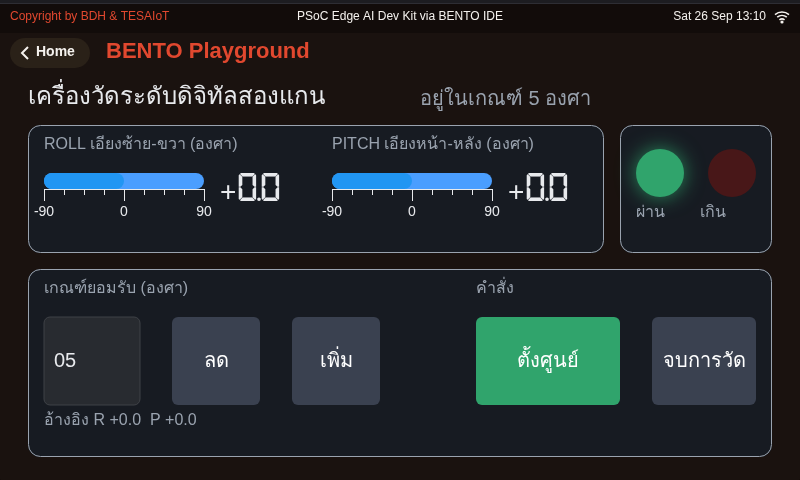

<div style="font-size:.58em;color:#78909c;margin-top:-.3em">หน้าจอจริงจากการรันโค้ดเฉลยบน BENTO Emulator ที่ 800x480 เท่าจอของ Eva Kit และ Dev Kit — ไม่ใช่ภาพวาด ไม่ใช่ mock-up และไม่ใช่ภาพถ่ายจากบอร์ด</div>

หน้าจอของเฉลยปัจจุบัน (`s06_digital_level.py` ของบทเรียน 3.3) แบ่งเป็นสามการ์ด

- **การ์ดบนซ้าย** คือสองแกนวางเคียงกัน ROLL ซ้าย-ขวา และ PITCH หน้า-หลัง เรียงตามลำดับที่ `dsp.tilt()` คืนค่ามาพอดี แต่ละแกนเป็น `ui.Bar` วางทับ `ui.Scale` ที่มีขีดและตัวเลข -90 ถึง 90 พร้อม `ui.Seg7` อ่านค่าละเอียดอยู่ข้าง ๆ
- **การ์ดบนขวา** `ui.Led` สองดวง บอกว่าตอนนี้อยู่ในเกณฑ์หรือเกิน
- **การ์ดล่าง** ซ้ายคือเกณฑ์ยอมรับหน่วยองศา เป็น `ui.Spinbox` ที่ตั้งเองได้ด้วยปุ่มเพิ่ม/ลด เพราะงานวางกล้องกับงานวางตู้เย็นยอมได้ไม่เท่ากัน · ขวาคือปุ่ม "ตั้งศูนย์" กับ "จบการวัด" · ใต้สุดคือบรรทัดอ้างอิง R +0.0 P +0.0 ที่เก็บค่าศูนย์ล่าสุดไว้
- **ข้างหัวเรื่องบนสุด** คุณภาพของค่าเขียนเป็นคำ ขึ้น "ค่าค้าง" สีส้มเมื่อรอบนั้นอ่านเซนเซอร์ไม่ได้

> ค่าที่อ่านได้ต้องเทียบกับอะไรสักอย่างเสมอ ปุ่มตั้งศูนย์คือการประกาศว่า "ตรงนี้คือศูนย์" และไม้บรรทัดใต้แถบคือการประกาศว่า "เต็มสเกลคือเท่านี้"

---

## accelerometer วัดอะไร — คำตอบที่คนส่วนใหญ่ตอบผิด

<div style="display:flex;gap:18px;align-items:flex-start">
<div style="flex:1;min-width:0">

คำตอบยอดนิยมคือ "วัดความเร่ง" ซึ่งถูกครึ่งเดียว วางบอร์ดนิ่งสนิทบนโต๊ะ **มันไม่ได้เร่งไปไหนเลย** แต่ค่าที่อ่านได้คือ

$$a_x \approx 0 \qquad a_y \approx 0 \qquad a_z \approx +9.81\ \mathrm{m/s^2}$$

**อ่านเป็นภาษาคน:** เซนเซอร์ไม่ได้วัดว่าเราเคลื่อนที่เร็วขึ้นแค่ไหน มันวัด **แรงที่ตัวเรือนดันมวลเล็ก ๆ ข้างในไว้ไม่ให้ตกอิสระ** — โต๊ะดันบอร์ดขึ้น บอร์ดดันมวลขึ้น จึงอ่านได้ +1 g ในทิศขึ้น ปริมาณนี้มีชื่อว่า **proper acceleration**

**ตัวเลขจากบอร์ดจริง:** ปล่อยบอร์ดตกอิสระ (อย่าทำ) ทั้งสามแกนจะอ่านได้ ~0 เพราะไม่มีใครดันมวลนั้นแล้ว

</div>
<div style="flex:0 0 300px">

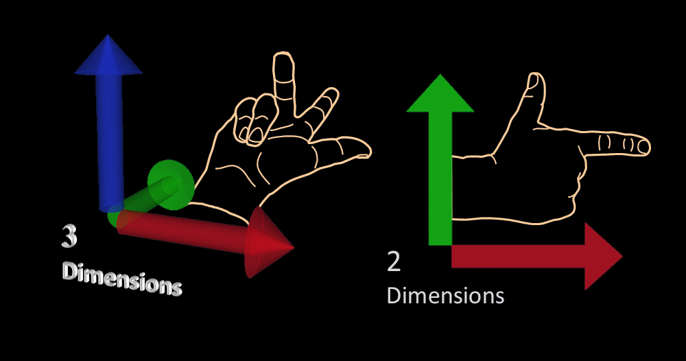

<div style="font-size:.62em;color:#78909c">ภาพ: Gregors, Wikimedia Commons, CC BY-SA 3.0 — ข้อตกลงแกนขวามือที่ใช้ทั้งบทเรียน: x ไปทางขวาของบอร์ด, y ออกไปด้านบน, z ตั้งฉากออกจากหน้าบอร์ด · ทิศ x/y เทียบขอบบอร์ดจริง <b>ต้องยืนยันบนโต๊ะก่อนขึ้นสอน ทั้ง Eva Kit และ Dev Kit</b> — ยังไม่มีบันทึกการวัดของบอร์ดไหน (กล่องเตือนในสไลด์สูตร)</div>

<iframe width="300" height="170" src="https://www.youtube.com/embed/XRr1kaXKBsU" loading="lazy" title="What Everyone Gets Wrong About Gravity"></iframe>

<div style="font-size:.60em;color:#546e7a">Veritasium · 17:33 · EN — ดูเพื่อเข้าใจว่า "ตัวที่วางนิ่งต่างหากที่กำลังถูกเร่ง" · แนะนำเริ่มที่ 2:30 หรือให้เป็นการบ้าน</div>

</div>
</div>

> แรงโน้มถ่วงอยู่ในค่าที่อ่านได้ **ตลอดเวลา** — คนอื่นเรียกมันว่าสัญญาณรบกวน วันนี้เราจะเรียกมันว่าสัญญาณ

---

## ข้างในชิปมีของที่ขยับได้จริง — มวลพิสูจน์บนสปริง

<div style="display:flex;gap:12px;align-items:flex-start">
<div style="flex:0 0 200px">

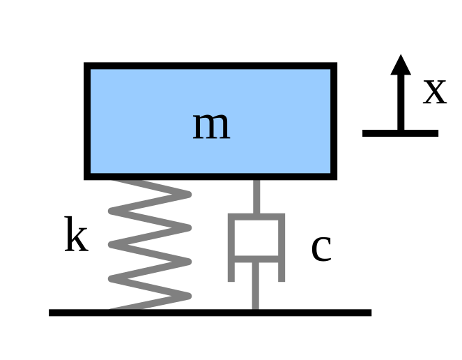

<div style="font-size:.58em;color:#78909c">ภาพ: pbroks13, Wikimedia Commons, สาธารณสมบัติ</div>

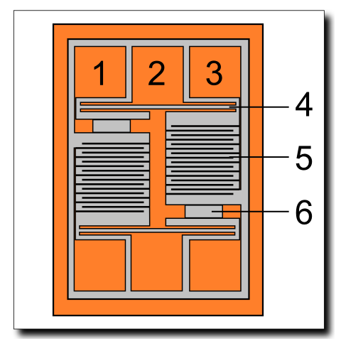

<div style="font-size:.58em;color:#78909c">ภาพ: Tosaka, Wikimedia Commons, CC BY 3.0</div>

</div>
<div style="flex:0 0 210px">

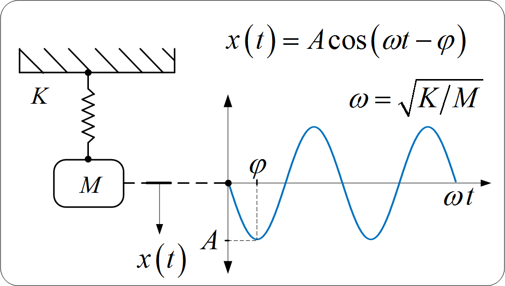

<div style="font-size:.58em;color:#78909c">ภาพ: Guillermo Bossio, Wikimedia Commons, CC BY-SA 4.0</div>

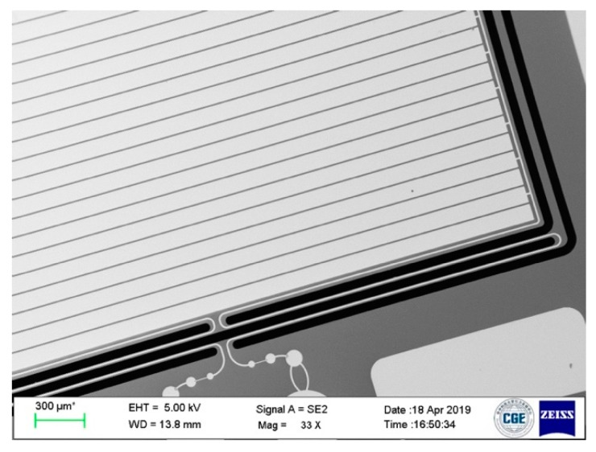

<div style="font-size:.58em;color:#78909c">ภาพถ่าย SEM ของโครงสร้างจริง — Zhang H. et al., Micromachines 10(6):380 (2019), CC BY 4.0</div>

</div>
<div style="flex:1;min-width:0">

โครงสร้างข้างใน BMI270 คือ **มวลพิสูจน์ (proof mass)** เล็กกว่าเม็ดฝุ่น แขวนบนสปริงซิลิคอนคดเคี้ยว พอบอร์ดถูกเร่ง มวลตามไม่ทันเพราะความเฉื่อย มันจึงเลื่อนไปในทางตรงข้าม

**แล้ววงจรอ่าน "ระยะที่มวลเลื่อน" ได้ยังไง** — มวลมีซี่หวียื่นออกมา สอดสลับกับซี่หวีที่ยึดกับตัวเรือน แต่ละคู่ซี่คือ **ตัวเก็บประจุ** หนึ่งตัว

- มวลอยู่ตรงกลาง → $d_1 = d_2$ → $C_1 = C_2$
- มวลเลื่อนไปซ้าย → $d_1 < d_2$ → $C_1 > C_2$

วงจรวัด **ผลต่างของความจุ** ส่งเข้า ADC ในชิป ออกมาเป็นตัวเลขบน I2C

<div style="display:flex;gap:14px;align-items:flex-start">
<div style="flex:0 0 350px">

<iframe width="320" height="180" src="https://www.youtube.com/embed/RLQGZl0lpjQ" loading="lazy" title="Bosch: Working principle of an accelerometer"></iframe>

<div style="font-size:.58em;color:#546e7a">Bosch Sensortec · 1:01 · แทบไม่มีคำพูด — ดูเพื่อเชื่อว่า "ในชิปมีของที่ขยับได้จริง" · Bosch คือผู้ผลิต BMI270 บนบอร์ดเรา</div>

</div>
<div style="flex:1;min-width:0">

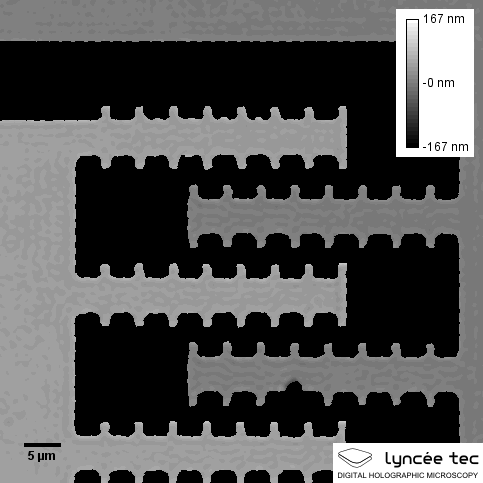

<div style="font-size:.58em;color:#78909c">ภาพ: Jejmule, Wikimedia Commons, CC BY-SA 4.0 — ซี่หวีที่ย่อหน้าบนพูดถึง ตอนมันขยับจริง ซี่ชุดหนึ่งยึดกับตัวเรือน อีกชุดยื่นออกมาจากมวลที่เลื่อนได้ ระยะระหว่างซี่ที่เปลี่ยนไปคือความจุที่วงจรอ่าน</div>

</div>
</div>

</div>
</div>

> การวัดความเร่งจริง ๆ แล้วคือ **การวัดอัตราส่วนความจุ** — นี่คือเหตุผลที่มันเล็กและกินไฟน้อยได้ขนาดนี้

---

## เข้าใจฮาร์ดแวร์ · แรงโน้มถ่วงทอดเงาลงบนแกนที่เอียง

<svg viewBox="0 0 920 300" xmlns="http://www.w3.org/2000/svg">
  <defs><marker id="g1" markerWidth="10" markerHeight="8" refX="9" refY="4" orient="auto"><path d="M0,0 L10,4 L0,8 z" fill="#c62828"/></marker></defs>
  <text x="230" y="28" text-anchor="middle" font-size="20" font-weight="700" fill="#37474f">บอร์ดเอียงไปเรื่อย ๆ · เวกเตอร์ g ชี้ลงเสมอ</text>
  <line x1="230" y1="70" x2="230" y2="250" stroke="#c62828" stroke-width="5" marker-end="url(#g1)"/>
  <text x="248" y="240" font-size="19" fill="#c62828">g = 9.81 ชี้ลงเสมอ</text>
  <g><rect x="140" y="126" width="180" height="20" rx="4" fill="#cfd8dc" stroke="#455a64" stroke-width="2"><animate attributeName="fill" values="#cfd8dc;#cfd8dc;none;none;none;none;none;none" dur="8s" calcMode="discrete" repeatCount="indefinite"/><animate attributeName="stroke" values="#455a64;#455a64;none;none;none;none;none;none" dur="8s" calcMode="discrete" repeatCount="indefinite"/></rect></g>
  <g transform="rotate(-30 230 136)"><rect x="140" y="126" width="180" height="20" rx="4" fill="none" stroke="none" stroke-width="2"><animate attributeName="fill" values="none;none;#b3e5fc;#b3e5fc;none;none;none;none" dur="8s" calcMode="discrete" repeatCount="indefinite"/><animate attributeName="stroke" values="none;none;#0277bd;#0277bd;none;none;none;none" dur="8s" calcMode="discrete" repeatCount="indefinite"/></rect></g>
  <g transform="rotate(-60 230 136)"><rect x="140" y="126" width="180" height="20" rx="4" fill="none" stroke="none" stroke-width="2"><animate attributeName="fill" values="none;none;none;none;#c8e6c9;#c8e6c9;none;none" dur="8s" calcMode="discrete" repeatCount="indefinite"/><animate attributeName="stroke" values="none;none;none;none;#2e7d32;#2e7d32;none;none" dur="8s" calcMode="discrete" repeatCount="indefinite"/></rect></g>
  <g transform="rotate(-90 230 136)"><rect x="140" y="126" width="180" height="20" rx="4" fill="none" stroke="none" stroke-width="2"><animate attributeName="fill" values="none;none;none;none;none;none;#ffe0b2;#ffe0b2" dur="8s" calcMode="discrete" repeatCount="indefinite"/><animate attributeName="stroke" values="none;none;none;none;none;none;#ef6c00;#ef6c00" dur="8s" calcMode="discrete" repeatCount="indefinite"/></rect></g>
  <text x="700" y="28" text-anchor="middle" font-size="20" font-weight="700" fill="#37474f">เงาที่ตกบนแกนของบอร์ด</text>
  <text x="530" y="72" font-size="19" font-weight="700" fill="#448AFF">az</text>
  <rect x="560" y="52" width="300" height="26" rx="4" fill="#e3f2fd" stroke="#448AFF" stroke-width="2"/>
  <rect x="562" y="54" width="296" height="22" rx="3" fill="#448AFF"><animate attributeName="fill" values="#448AFF;#448AFF;none;none;none;none;none;none" dur="8s" calcMode="discrete" repeatCount="indefinite"/></rect>
  <rect x="562" y="54" width="256" height="22" rx="3" fill="none"><animate attributeName="fill" values="none;none;#448AFF;#448AFF;none;none;none;none" dur="8s" calcMode="discrete" repeatCount="indefinite"/></rect>
  <rect x="562" y="54" width="148" height="22" rx="3" fill="none"><animate attributeName="fill" values="none;none;none;none;#448AFF;#448AFF;none;none" dur="8s" calcMode="discrete" repeatCount="indefinite"/></rect>
  <rect x="562" y="54" width="6" height="22" rx="3" fill="none"><animate attributeName="fill" values="none;none;none;none;none;none;#448AFF;#448AFF" dur="8s" calcMode="discrete" repeatCount="indefinite"/></rect>
  <text x="530" y="126" font-size="19" font-weight="700" fill="#FF5252">ay</text>
  <rect x="560" y="106" width="300" height="26" rx="4" fill="#ffebee" stroke="#FF5252" stroke-width="2"/>
  <rect x="562" y="108" width="296" height="22" rx="3" fill="none"><animate attributeName="fill" values="none;none;none;none;none;none;#FF5252;#FF5252" dur="8s" calcMode="discrete" repeatCount="indefinite"/></rect>
  <rect x="562" y="108" width="256" height="22" rx="3" fill="none"><animate attributeName="fill" values="none;none;none;none;#FF5252;#FF5252;none;none" dur="8s" calcMode="discrete" repeatCount="indefinite"/></rect>
  <rect x="562" y="108" width="148" height="22" rx="3" fill="none"><animate attributeName="fill" values="none;none;#FF5252;#FF5252;none;none;none;none" dur="8s" calcMode="discrete" repeatCount="indefinite"/></rect>
  <rect x="562" y="108" width="6" height="22" rx="3" fill="#FF5252"><animate attributeName="fill" values="#FF5252;#FF5252;none;none;none;none;none;none" dur="8s" calcMode="discrete" repeatCount="indefinite"/></rect>
  <text x="530" y="162" font-size="19" font-weight="700" fill="#37474f">0° → az 9.81 · ay 0.00</text>
  <text x="530" y="186" font-size="19" font-weight="700" fill="#0277bd">30° → az 8.50 · ay 4.91</text>
  <text x="530" y="210" font-size="19" font-weight="700" fill="#2e7d32">60° → az 4.91 · ay 8.50</text>
  <text x="530" y="234" font-size="19" font-weight="700" fill="#ef6c00">90° → az 0.00 · ay 9.81</text>
  <text x="530" y="268" font-size="20" font-weight="700" fill="#455a64">√(ay² + az²) = 9.81 ทุกมุม</text>
  <text x="530" y="292" font-size="18" fill="#78909c">รู้เงาสองอัน จึงเดามุมกลับได้</text>
</svg>

<div style="font-size:.62em;color:#78909c">แผนภาพวาดเอง (บันทึกการค้น: ค้น Commons หมวด Accelerometers / Inclined planes ด้วยคำ "accelerometer gravity projection axes animation", "tilt sensing gravity vector components" — พบแต่ภาพนิ่งของระนาบเอียงเชิงกลศาสตร์ ไม่มีภาพที่ผูกกับแกนของเซนเซอร์ จึงวาดเอง · ภาพนิ่งที่ใกล้ที่สุดอยู่สไลด์ถัดไป)</div>

> เพราะขนาดรวมคงที่ เรารู้ค่าสองแกนก็เดามุมได้ นี่คือเหตุผลที่ **สามตัวเลขกลายเป็นสององศา** ได้

---

## เรียกมุมพวกนี้ว่าอะไร — roll กับ pitch มาจากวงการการบิน

<div style="display:flex;gap:14px;align-items:flex-start">
<div style="flex:0 0 260px">

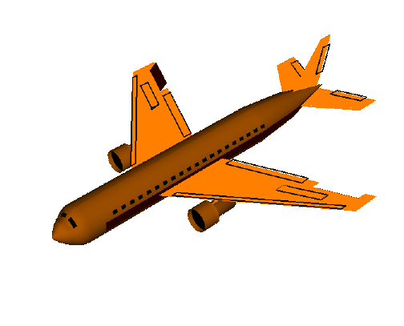

<div style="font-size:.62em;color:#78909c">ภาพ: NASA Glenn Research Center, สาธารณสมบัติ — **roll** หมุนรอบแกนยาวของลำตัว</div>

</div>
<div style="flex:0 0 260px">

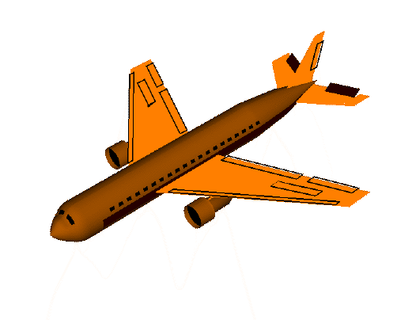

<div style="font-size:.62em;color:#78909c">ภาพ: NASA Glenn Research Center, สาธารณสมบัติ — **pitch** ก้ม-เงย</div>

</div>
<div style="flex:1;min-width:0">

| ชื่อ | คือการเอียงแบบไหน | ทดสอบด้วยการ | มาจากแกน |
|---|---|---|---|
| roll | ซ้าย-ขวา | ยกขอบ**ด้านที่ทำให้ roll เพิ่ม** — ดูว่าขอบไหนของบอร์ดทีม (Eva Kit: ขอบซ้าย · Dev Kit: ยังไม่ได้วัด จดลงบันทึกการเรียน) | ay กับ az |
| pitch | หน้า-หลัง | ยกขอบ**ด้านที่ทำให้ pitch เพิ่ม** — ขอบที่ตั้งฉากกับขอบของ roll (Eva Kit: ขอบบน) | ax เทียบ y-z |
| yaw | หันซ้าย-ขวา | หมุนบอร์ดบนโต๊ะ | **หาจาก accel ไม่ได้** |

**ทำไม yaw หาไม่ได้จาก accel** — การหันบอร์ดบนโต๊ะไม่ทำให้เงาของแรงโน้มถ่วงบนแกนใดเปลี่ยนเลย accel จึงมองไม่เห็นมัน ต้องใช้ magnetometer (บทเรียน 3.7–3.9) หรือ gyro

</div>
</div>

> `dsp.tilt()` ให้เราสองแกน ไม่ใช่สาม — และนั่นเป็นข้อจำกัดทางฟิสิกส์ ไม่ใช่ข้อจำกัดของเฟิร์มแวร์

---

## จากความเร่ง สู่องศา — สูตรจริงที่อยู่ข้างใน `dsp.tilt()`

<div style="display:flex;gap:16px;align-items:flex-start">
<div style="flex:1;min-width:0">

**ตรวจสุขภาพเซนเซอร์ก่อนเชื่อค่าอะไรทั้งนั้น**

$$\lVert \vec{a} \rVert = \sqrt{a_x^{2} + a_y^{2} + a_z^{2}}$$

ไทย: ไม่ว่าเอียงบอร์ดยังไง ถ้าวางนิ่งค่านี้ต้องได้ราว 9.81 m/s² เสมอ · **ตัวเลขจาก Eva Kit (บอร์ดที่ใช้เขียนสไลด์):** ax 0.02, ay −0.05, az 9.79 → $\lVert \vec{a} \rVert = 9.79$ ผ่าน

**สูตรที่แปลงเงาเป็นองศา**

$$\phi_{\text{roll}} = \operatorname{atan2}\bigl(a_y,\; a_z\bigr) \qquad
\theta_{\text{pitch}} = \operatorname{atan2}\Bigl(-a_x,\; \sqrt{a_y^{2} + a_z^{2}}\Bigr) \qquad
\phi_{\deg} = \phi \cdot \frac{180}{\pi}$$

ไทย: เวกเตอร์แรงโน้มถ่วงชี้ลงคงที่เสมอ พอบอร์ดเอียง เงาของมันบนแกนก็เปลี่ยน · **ตัวเลขจาก Eva Kit ตอนยกขอบซ้าย:** ay 4.90, az 8.49 → $\operatorname{atan2}(4.90, 8.49) = 0.524\ \mathrm{rad} = 30.0^\circ$

**ทำไมต้อง `atan2` ไม่ใช่ `atan`** — `atan2` รับตัวตั้งกับตัวหารแยกกัน จึงแยกควอดรันต์ได้ครบสี่ และไม่ระเบิดเมื่อตัวหารเป็นศูนย์ตอนบอร์ดตั้งฉาก 90°

<div style="background:#fff8e1;border-left:5px solid #ef6c00;padding:.3em .7em;font-size:.80em">
<b>ต้องยืนยันข้อตกลงแกนกับบอร์ดจริงก่อนขึ้นสอน — แยกบอร์ด</b> — Eva Kit: เอียงบอร์ดไปทางขวาแล้วดูว่าแกนไหนเปลี่ยนเครื่องหมาย ถ้าไม่ตรง ให้สลับเครื่องหมายในสไลด์ ไม่ใช่ไปแก้ที่ผู้เรียน · <b>TESAIoT Dev Kit: ยังไม่มีใครวัดว่าขอบไหนของฐาน QWA309 ทำให้ roll เพิ่ม</b> IMU ตัวเดียวกันแต่ประกอบบนบอร์ดคนละแบบ ห้ามยกคำว่า "ขอบซ้าย" ของ Eva ไปบอกทีม Dev Kit — ให้ทีมยกทีละขอบแล้วจดลงบันทึกการเรียน ว่าขอบไหนขยับ roll
</div>

</div>
<div style="flex:0 0 280px">

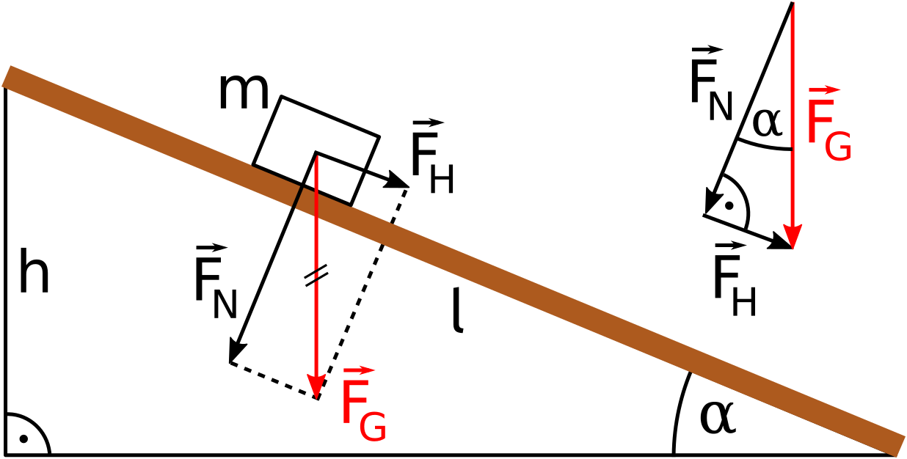

<div style="font-size:.62em;color:#78909c">ภาพ: Klaus-Dieter Keller, Wikimedia Commons, CC0 — แยกเวกเตอร์ g เป็นองค์ประกอบตามมุมของระนาบเอียง</div>

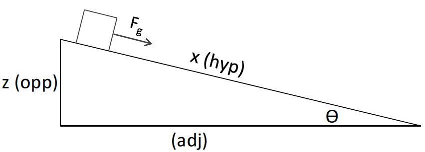

<div style="font-size:.62em;color:#78909c">ภาพ: VT DLA, Wikimedia Commons, CC BY-SA 3.0 — ตรีโกณของมุมเดียวกันที่ `atan2` ใช้</div>

</div>
</div>

> รู้สูตรไว้ไม่ใช่เพื่อพิมพ์เอง แต่เพื่อ **เดาถูกว่าจะพังตรงไหน** เมื่อค่าออกมาแปลก

---

## กับดักที่ตั้งใจดักทั้งบทเรียน — ลำดับค่าที่คืนกลับมา

<svg viewBox="0 0 920 240" xmlns="http://www.w3.org/2000/svg">
  <rect x="20" y="20" width="430" height="200" rx="10" fill="#e8f5e9" stroke="#2e7d32" stroke-width="3"/>
  <text x="235" y="52" text-anchor="middle" font-size="21" font-weight="700" fill="#2e7d32">ถูก · roll, pitch = dsp.tilt(...)</text>
  <text x="86" y="92" text-anchor="middle" font-size="19" fill="#1b5e20">เอียงซ้าย-ขวา</text>
  <circle cx="180" cy="140" r="44" fill="none" stroke="#c8e6c9" stroke-width="10"/>
  <path d="M180,96 A44,44 0 0,1 218,162" fill="none" stroke="#FF5252" stroke-width="10"><animate attributeName="d" values="M180,96 A44,44 0 0,1 180,96;M180,96 A44,44 0 0,1 218,162;M180,96 A44,44 0 0,1 180,96" dur="3s" repeatCount="indefinite"/></path>
  <text x="180" y="204" text-anchor="middle" font-size="19" font-weight="700" fill="#c62828">ROLL วิ่ง</text>
  <circle cx="340" cy="140" r="44" fill="none" stroke="#c8e6c9" stroke-width="10"/>
  <text x="340" y="204" text-anchor="middle" font-size="19" fill="#4a7c4e">PITCH นิ่ง</text>
  <rect x="470" y="20" width="430" height="200" rx="10" fill="#ffebee" stroke="#c62828" stroke-width="3"/>
  <text x="685" y="52" text-anchor="middle" font-size="21" font-weight="700" fill="#c62828">ผิด · pitch, roll = dsp.tilt(...)</text>
  <text x="536" y="92" text-anchor="middle" font-size="19" fill="#8e1b1b">เอียงซ้าย-ขวา</text>
  <circle cx="630" cy="140" r="44" fill="none" stroke="#ffcdd2" stroke-width="10"/>
  <text x="630" y="204" text-anchor="middle" font-size="19" fill="#8e1b1b">ROLL นิ่ง</text>
  <circle cx="790" cy="140" r="44" fill="none" stroke="#ffcdd2" stroke-width="10"/>
  <path d="M790,96 A44,44 0 0,1 828,162" fill="none" stroke="#4CAF50" stroke-width="10"><animate attributeName="d" values="M790,96 A44,44 0 0,1 790,96;M790,96 A44,44 0 0,1 828,162;M790,96 A44,44 0 0,1 790,96" dur="3s" repeatCount="indefinite"/></path>
  <text x="790" y="204" text-anchor="middle" font-size="19" font-weight="700" fill="#2e7d32">PITCH วิ่ง</text>
</svg>

**`dsp.tilt()` คืน `(roll, pitch)` — roll มาก่อน pitch เสมอ** ตำราและไลบรารีจำนวนมากเขียนเรียงว่า "pitch, roll" จนติดปาก

ถ้าเผลอเขียนสลับ โปรแกรมจะ **ไม่ error** เลย จอขึ้นตัวเลขสวยงามครบทั้งสองแกน แต่เอียงซ้าย-ขวาแล้วแถบ PITCH ดันวิ่ง ส่วนแถบ ROLL นิ่ง — เหมือนภาพขวา

> บั๊กที่ไม่ทำให้โปรแกรมพัง คือบั๊กที่แพงที่สุด เพราะไม่มีใครรู้ว่ามันอยู่ตรงนั้น

---

## `motion()` — หกแกนจากการอ่านครั้งเดียว และหน่วยที่ต้องอ่านให้ถูก

<div style="display:flex;gap:16px;align-items:flex-start">
<div style="flex:1;min-width:0">

```python
ax, ay, az, gx, gy, gz = sensors.bmi270.motion()
```

หกค่านี้มาจาก **การอ่านครั้งเดียวกัน** — กลไกต่างกันตามบอร์ด: **บน Eva Kit** `motion()` หยิบจาก snapshot ชุดเดียวที่คอร์จออ่านค้างไว้ (ไม่มีการจองบัสฝั่ง Python) · **บน Dev Kit** CM33 จองบัส I2C ของตัวเอง (lock) อ่านหกแกนแล้วปล่อย · ถ้าเรียก `acceleration()` แล้ว `gyroscope()` แยกสองครั้ง ระหว่างสองครั้งนั้น snapshot อาจถูกเปลี่ยนชุด (Eva) หรือบัสถูกปล่อยว่าง (Dev Kit) และถ้าตอนนั้นบอร์ดกำลังขยับ ค่า accel กับ gyro ที่ได้จะมาจาก **คนละท่าของบอร์ด**

| ค่า | หน่วย | จุดอ้างอิงที่ควรจำ |
|---|---|---|
| `ax, ay, az` | m/s² | 1 g = 9.81 · วางราบ az ≈ +9.81 · ตกอิสระ = 0 |
| `gx, gy, gz` | deg/s | วางนิ่ง ≈ 0 · หมุนด้วยมือ 30-90 · สะบัดข้อมือ > 500 |

**อย่าสับสน** — accel บอก *ตำแหน่งเชิงมุมเทียบกับแนวดิ่ง* ส่วน gyro บอก *อัตราการเปลี่ยนมุม* ไม่ใช่ตัวมุมเอง

</div>
<div style="flex:0 0 340px">

<svg viewBox="0 0 340 250" xmlns="http://www.w3.org/2000/svg">
  <text x="170" y="26" text-anchor="middle" font-size="19" font-weight="700" fill="#c62828">อ่านแยกสองครั้ง</text>
  <rect x="20" y="40" width="120" height="30" rx="5" fill="#ffcdd2" stroke="#c62828" stroke-width="2"/>
  <text x="80" y="61" text-anchor="middle" font-size="18" fill="#8e1b1b">accel</text>
  <rect x="200" y="40" width="120" height="30" rx="5" fill="#ffcdd2" stroke="#c62828" stroke-width="2"/>
  <text x="260" y="61" text-anchor="middle" font-size="18" fill="#8e1b1b">gyro</text>
  <rect x="146" y="40" width="48" height="30" rx="5" fill="#fff" stroke="#c62828" stroke-width="2" stroke-dasharray="4 3"/>
  <circle cx="170" cy="55" r="7" fill="#ef6c00"><animate attributeName="r" values="6;11;6" dur="2s" repeatCount="indefinite"/></circle>
  <text x="170" y="94" text-anchor="middle" font-size="18" fill="#c62828">ช่องว่าง — ค่าเปลี่ยนชุดได้</text>
  <text x="170" y="118" text-anchor="middle" font-size="18" fill="#c62828">บอร์ดขยับไปแล้ว</text>
  <text x="170" y="160" text-anchor="middle" font-size="19" font-weight="700" fill="#2e7d32">motion() — อ่านครั้งเดียว</text>
  <rect x="20" y="174" width="300" height="30" rx="5" fill="#c8e6c9" stroke="#2e7d32" stroke-width="2"/>
  <text x="170" y="195" text-anchor="middle" font-size="18" fill="#1b5e20">accel + gyro พร้อมกัน</text>
  <text x="170" y="232" text-anchor="middle" font-size="18" fill="#2e7d32">ได้ภาพนิ่งของบอร์ด ณ เวลาเดียวกัน</text>
</svg>

</div>
</div>

> ข้อมูลที่จะเอาไปรวมกัน (fuse) ต้องมาจากเวลาเดียวกัน ไม่งั้นเราไม่ได้รวมข้อมูล เรากำลังรวมความมั่ว
