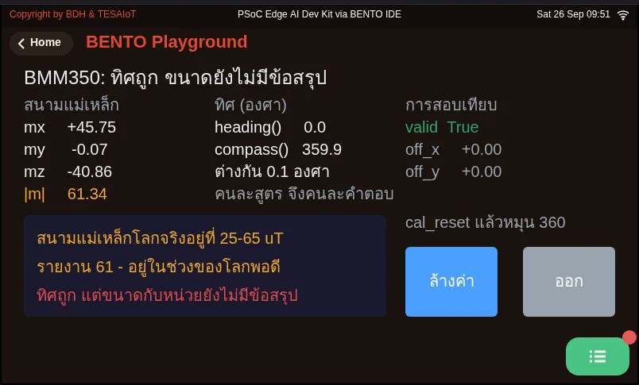
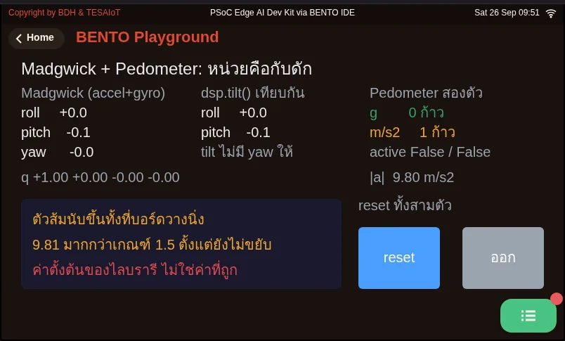

# Lesson 3.2 — Gyro, the complementary filter and the level code

> Module 3 — Sensor Visualization on HMI · Slides: [slides.md](slides.md) · [Module overview](../README.md) · [Course page](../../README.md)

See how the gyro and the accelerometer fail in different ways (drift versus jitter), where a complementary filter and dsp.EMA help, then read the digital-level code pose by pose from sensor warm-up to the zero button.

## Objectives

By the end of this lesson you will be able to:

1. Compute the angle drift caused by a gyro bias (e.g. 0.05 deg/s for 60 s gives 3°) and explain how a complementary filter trusts the gyro short-term and the accelerometer long-term
2. Compute time constants from loop values for dsp.EMA (τ ≈ Ts/α: 0.2 s with α 0.2 gives about 1 s) and for the complementary filter (τ = aΔt/(1−a): a 0.98 gives 9.8 s), and state that a high alpha does opposite things in the two formulas
3. Explain the reasons behind the digital-level code: no sensors.init() but a warm-up inside try/except, ui.Bar set to min=-90 max=90, filter before subtracting the zero, and ui.poll() on every loop
4. Run 05_madgwick_and_pedometer.py and point out which units must be converted before feeding dsp.Madgwick and dsp.Pedometer (gyro in rad/s, acceleration in g, fs equal to the real loop rate)

## Before you start

Following on from lesson 3.1: you must remember that `dsp.tilt()` returns `(roll, pitch)`, and that all six axes come from a single call to `motion()`.
Review `dsp.EMA` from lessons 2.7–2.9 (the new value carries weight α, and the rest is memory of the old value), because today it comes back as the level's filter.
Keep lesson 3.3's practice file `s06_digital_level.py` open next to you; the "code walk-through" slides go through that file pose by pose.

- **Equipment:** an Eva Kit or TESAIoT Dev Kit board with the BENTO MicroPython firmware installed, or the BENTO Emulator in [BENTO IDE](https://ide.tesaiot.dev/)
- **Before this:** [Lesson 3.1 — The accelerometer and tilt: roll and pitch](../l01-accelerometer-tilt/README.md)

## Concepts

**A gyro only knows how fast it is spinning right now — it does not know what angle it is at.** A structure inside the chip is driven to vibrate constantly along one direction.
When the chip rotates, Coriolis force pushes the vibrating mass sideways, at a right angle; a circuit measures that deflection and converts it to deg/s.
To get an angle, you must add up ω·Δt yourself — and this is exactly where the trouble begins.

The two sensors fail in different ways. **The accelerometer is right in the long run but jittery in the short run**, because it measures all the force at once and cannot tell gravity apart from
a shaking hand, a fan, or a knock on the table. **The gyro is steady and responsive short-term but drifts long-term.** On the Eva Kit, lying still, `gz` still reads 0.03–0.05 deg/s.
With a bias of 0.05 deg/s, the accumulated angle is wrong by 3° after 60 seconds and 30° after 600 seconds. This phenomenon is called **drift**.

A complementary filter joins the strengths of both: θ = a(θ + ωΔt) + (1−a)θ_accel. The first half is a high-pass on the gyro,
the second half a low-pass on the accelerometer, and the two halves add up to exactly one. The dividing line is τ = aΔt/(1−a), which at a = 0.98, Δt = 0.2 s gives 9.8 s.
But this set of lessons uses **only one half**: `dsp.tilt()` (accelerometer alone) followed by `dsp.EMA(alpha=0.2)`, giving τ ≈ Ts/α = 1.0 s —
a steady line with no drift at all, since nothing is being integrated, at the price of about one second of lag. And do not trust parameter names by their shape: a high alpha in `dsp.EMA`
means trusting the new value a lot (more responsive, more jittery), while a high a in a complementary filter means trusting the old value plus the gyro a lot (steadier).

The IMU family has fourteen names: `sensors.bmi270` has five (`temperature()` and `chip_id()` raise `OSError` on the Eva Kit but work on the Dev Kit),
`sensors.bmm350` has five that work on both boards, and `dsp` has four more. If you want full fusion and yaw, there is `dsp.Madgwick(beta=, fs=)`,
which must be fed gyro in **radians per second** (`math.radians(gx)`), and `fs` must equal the real loop rate (a 200 ms loop is `fs=5.0`, not the default of 100).
`dsp.Pedometer` has a default `threshold=1.5` in units of **g**. Neither class has `.value()`. The compass has `bmm350.heading()`, which uses atan2(x, y),
and `dsp.compass()`, which uses atan2(y, x), so they return different angles, and `dsp.compass()` discards `mz`, so it does not yet compensate for tilt.
The field-strength number the board reads (about 1532) has no confirmed conclusion yet, whether it is a constant or a wrongly labelled µT unit — do not record it as fact.

**The zero button** exists because lying flat almost never gives exactly 0.0° (the table is not perfectly flat, the chip is not mounted perfectly straight, and there is a factory zero-g offset).
We remember the angle at the moment you press it and subtract it every round afterward — for example, press at 1.8°, and 4.3° afterward shows as 2.5°. The level code has six moves:

1. **Warm-up** — no `sensors.init()` on either board (the Eva rejects it with `OSError`; the Dev Kit does not need it). Read `motion()` once inside `try/except` and discard it, because the first read after a reset on the Eva can take up to 16 seconds
2. **The screen** — `ui.Bar(..., min=-90, max=90)`, because the default 0–100 range would round −30 to 0 and freeze the bar; `ui.Scale` laid horizontally is a ruler that does not accept `.value()`; `ui.Spinbox` needs +/- buttons beside it, because a touch only picks a digit
3. **Read and convert** — `motion()` then `dsp.tilt()`, wrapped in `try/except OSError`, because a failed read is a normal event
4. **Filter, then subtract zero** — `roll_f = ema_roll.update(roll)` first, then `roll_f - roll_zero`
5. **Take events** — `ui.poll()` every round, because about two seconds of silence hides every widget on the page; then compare `ev['handle']` against the stored `.id()`. When zeroing, store the filtered `roll_f`, never the raw value
6. **Display** — `int(clamp90(...))` before feeding the bar. The bar and lamp move every round (5 times a second), while the Seg7 is rewritten at most once per second

## Worked example

These two files sit outside this set of lessons' passing criteria, but they are the only place you get to try the rest of the IMU family.

- `05_madgwick_and_pedometer.py` — **predict before running**: there are two step counters, one fed g, the other using the default and fed m/s² directly — which one will start counting on its own while the board sits still? ·
  **run** it and set the board down still, watching the orange one · **explore** by comparing the Madgwick column with `dsp.tilt()` while still and while jerked, and notice that yaw exists only on the Madgwick side ·
  **modify** by removing the three `math.radians()` lines temporarily and see how wildly the angle spins (this file loops every 100 ms, so it sets `fs=10.0`)
- `04_compass_and_magnetometer.py` — compare `heading()` with `dsp.compass()`, which are not equal, and that is correct. Press the clear button and rotate the board slowly through a full turn
  to see the calibration status, then tilt the board and watch the heading from `dsp.compass()` go wrong immediately

| File | What this file teaches |
|---|---|
| [examples/04_compass_and_magnetometer.py](examples/04_compass_and_magnetometer.py) | A compass on the board, and one number nobody has answered yet |
| [examples/05_madgwick_and_pedometer.py](examples/05_madgwick_and_pedometer.py) | dsp's two remaining IMU classes, and the units that trap them both |

The slides for this lesson also refer to files that live in other lessons:

- [m03-sensor-hmi/l03-digital-level-lab/practice/s06_digital_level.py](../l03-digital-level-lab/practice/s06_digital_level.py) — a two-axis digital level (fill-in version)
- [shared/lvgl_ports/sec3_sensor_viz/eva/ex10_scale_pitch.py](../../shared/lvgl_ports/sec3_sensor_viz/eva/ex10_scale_pitch.py)

**Screens from the BENTO Emulator** for this lesson's examples (click a file name to open the code)

<figure><figcaption><a href="examples/04_compass_and_magnetometer.py"><code>04_compass_and_magnetometer.py</code></a> A compass on the board, and one number nobody has answered yet</figcaption></figure>
<figure><figcaption><a href="examples/05_madgwick_and_pedometer.py"><code>05_madgwick_and_pedometer.py</code></a> dsp&#x27;s two remaining IMU classes, and the units that trap them both</figcaption></figure>

## Check your understanding

The same questions are in [quiz.yaml](quiz.yaml) for automatic marking.

1. A board lies still and its gyro reads gz of 0.05 deg/s (bias). If ω·Δt is accumulated into an angle continuously, after 10 minutes about how far off will the angle be? *(choose one · objective 1)*
   - A) 30°
   - B) 3°
   - C) 0.05°
   - D) 0°, because the board is not rotating

   

Solution

   **A** — 0.05 deg/s × 600 s = 30°. A tiny error accumulates every round with nothing pulling it back — this is drift, and it is why the accelerometer must keep pulling it back over the long run.

   

2. A loop runs every 200 ms and uses dsp.EMA(alpha=0.2). About how far does the filtered value lag the raw value in tilting? *(choose one · objective 2)*
   - A) About 1 second
   - B) About 0.04 seconds
   - C) About 9.8 seconds
   - D) No lag at all, because EMA integrates nothing

   

Solution

   **A** — τ ≈ Ts/α = 0.2/0.2 = 1.0 second. 9.8 seconds is the complementary filter's dividing line at a = 0.98. Not integrating removes drift, but lag remains.

   

3. A friend says "set alpha=0.98 and the line will always get steadier." Which statement is correct? *(choose one · objective 2)*
   - A) True only for the complementary filter, where a high a means trusting the old value plus the gyro a lot; in dsp.EMA, alpha 0.98 means trusting the new value a lot, so it gets faster and more jittery
   - B) True for both formulas, because the parameter names are the same
   - C) False for both formulas — a high alpha always makes it more jittery
   - D) alpha has no effect on steadiness, only on drift

   

Solution

   **A** — In dsp.EMA, the new value carries weight α; in the complementary filter, the old value plus the gyro carry weight a. The same number gives opposite effects, so check the equation itself and never trust a parameter name.

   

4. Which are correct reasons behind the digital-level code? Choose every correct one. *(choose all that apply · objective 3)*
   - A) ui.Bar must be set to min=-90, max=90, or the default 0–100 range would round −30 degrees to 0 and freeze the bar even though the calculation is correct
   - B) When zeroing, you must store the filtered roll_f, not the raw roll, which might be jittering right at that instant
   - C) sensors.init() must be called before motion() on the Eva Kit, or values cannot be read
   - D) ui.poll() only needs to be called on the round someone actually presses a button

   

Solution

   **A, B** — On the Eva Kit, sensors.init() is rejected with OSError, and the Dev Kit does not need it either. ui.poll() must be called every round, because the CM55 side uses it as a signal the program is still alive; about two seconds of silence hides every widget on the page.

   

5. From 05_madgwick_and_pedometer.py, which are unit traps you must handle yourself? Choose every correct one. *(choose all that apply · objective 4)*
   - A) Madgwick.update() needs gyro in radians per second, but motion() returns degrees per second, so you must call math.radians() yourself
   - B) Pedometer's default threshold=1.5 is in units of g; feeding it m/s² would make it count steps continuously even while the board sits still
   - C) Madgwick's fs must equal the real loop rate; a 200 ms loop is fs=5.0
   - D) Madgwick and Pedometer both have .value() to read the result, like the six filters in lessons 2.7–2.9

   

Solution

   **A, B, C** — Forgetting to convert gyro means feeding it a value about 57 times too large, spinning the angle wildly with no error, and 9.81 m/s² crosses the 1.5 threshold before anything even moves. Neither class has .value(); you must store the value .update() returns yourself.

   

## Going further

Lesson 3.3 is the lab: fill six blanks in `s06_digital_level.py` following the six moves just walked through, then check against the MVP checkpoint.
While testing, lay the board flat, press zero, and tilt slowly — never hold the board in the air and wave it around, because the acceleration from swinging mixes with gravity.

Next lesson: [Lesson 3.3 — Hands-on: the digital level](../l03-digital-level-lab/README.md)

## Reflect

- A kitchen scale has the same kind of button as the zero button. What else around you lets the user set its own reference point?
- If you had to change the loop period from 200 ms to 50 ms, which numbers would you have to rethink?
