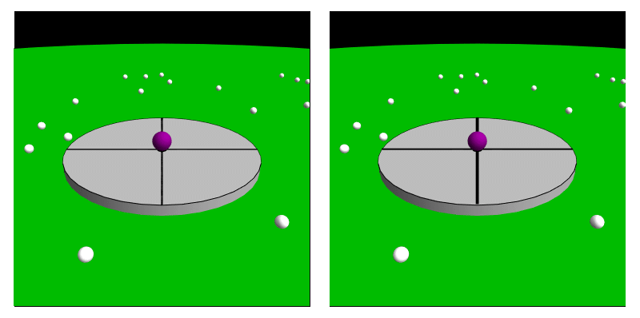
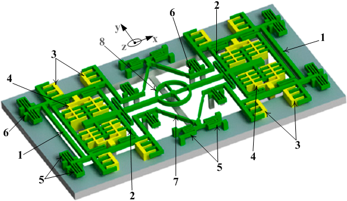
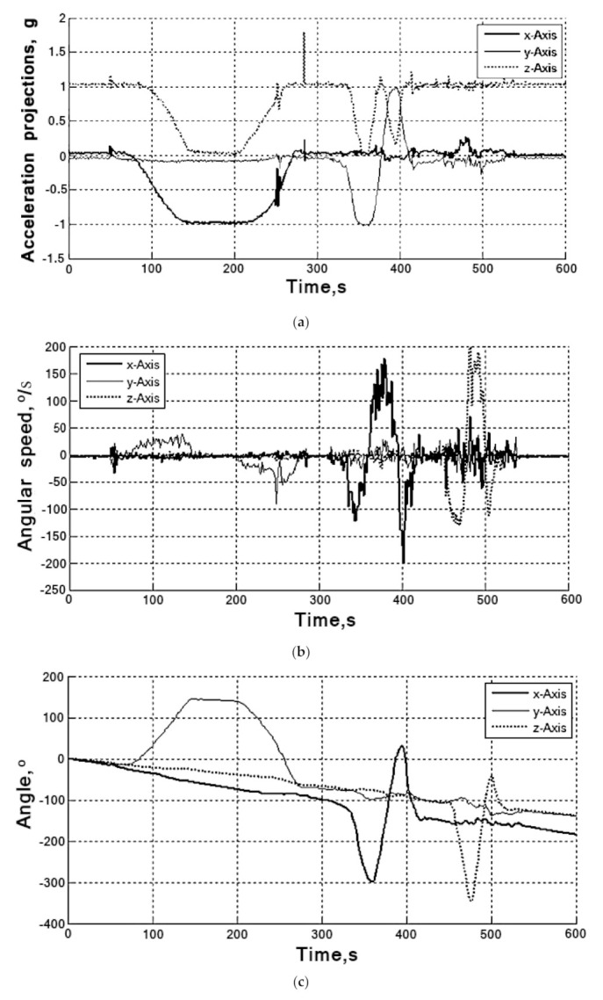
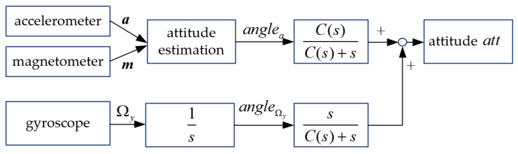
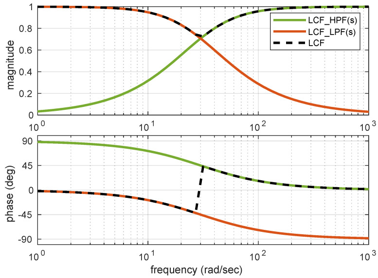
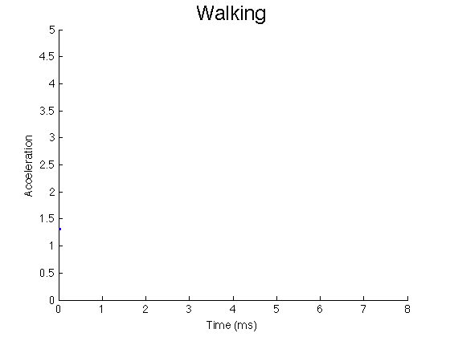
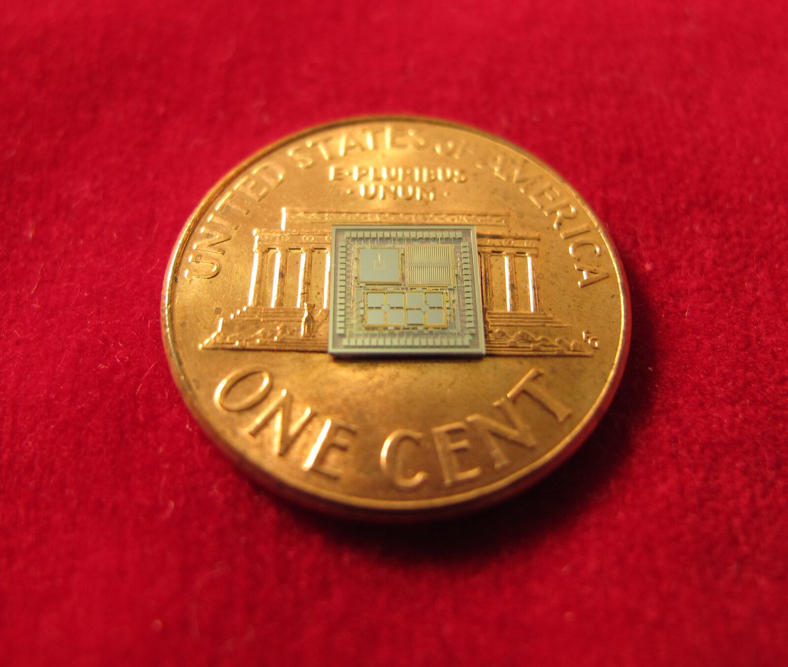
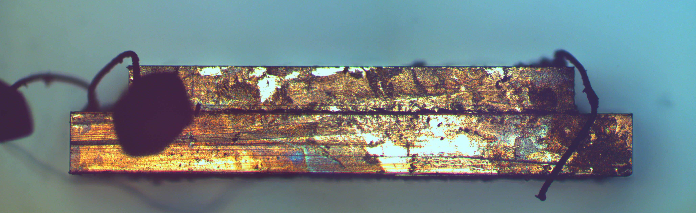
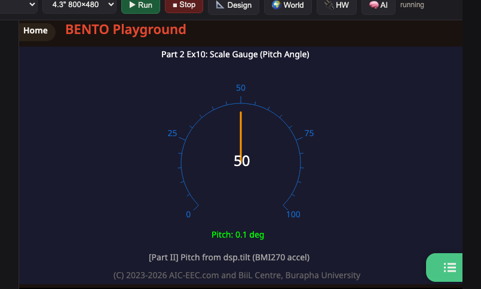

<style>
section { font-size: 24px; padding: 40px 52px; justify-content: flex-start; }
section h1 { font-size: 1.45em; line-height: 1.12; margin: 0 0 .22em; }
section h2 { font-size: 1.12em; margin: .15em 0; }
section h3 { font-size: 1.0em; margin: .12em 0; }
section p, section li { margin: .16em 0; line-height: 1.32; }
section img { max-width: 100%; height: auto; }
section svg { max-height: 330px; width: 100%; }
section table { font-size: .78em; }
section pre { font-size: .70em; line-height: 1.32; background:#0d1117; color:#e6edf3; border:1px solid #30363d; border-radius:8px; padding:12px 16px; box-shadow:0 2px 8px rgba(0,0,0,.25); }
section pre code { white-space: pre-wrap; background:transparent; color:inherit; } section pre .hljs-comment{color:#8b949e;font-style:italic} section pre .hljs-keyword,section pre .hljs-built_in,section pre .hljs-literal{color:#ff7b72} section pre .hljs-string{color:#a5d6ff} section pre .hljs-number{color:#79c0ff} section pre .hljs-title,section pre .hljs-title.function_,section pre .hljs-section{color:#d2a8ff} section pre .hljs-meta{color:#ffa657} section pre .hljs-attr,section pre .hljs-attribute,section pre .hljs-name{color:#7ee787}
section blockquote { margin: .25em 0; font-size: .92em; }
/* two images on a line (parity / 2x2 grids) stay side-by-side and small */
section p > img + img { margin-left: 10px; }
/* scroll-within-slide: dense slides scroll instead of clipping */
section { overflow-y: auto; overflow-x: hidden; }
section::-webkit-scrollbar { width: 11px; }
section::-webkit-scrollbar-thumb { background:#4a90d9; border-radius:6px; }
section::-webkit-scrollbar-track { background:rgba(0,0,0,.06); }
/* image drop-shadow + cover-slide readability (auto) */
section img{filter:drop-shadow(0 3px 12px rgba(0,0,0,.5))}
section iframe{border:0;border-radius:8px;box-shadow:0 2px 10px rgba(0,0,0,.3)}
/* พื้นสำรองของสไลด์ปก: ถ้า img/cover_sNN.svg โหลดไม่ขึ้น ธีมจะคืนพื้นขาว
   แล้วตัวอักษรสีขาวของปกจะหายไปทั้งแผ่น — ปักสีเข้มไว้ให้ภาพเป็นแค่ของประดับ */
section.cover{background-color:#0b1426}
section.cover *{color:#fff !important}
section.cover h1,section.cover h2,section.cover h3,section.cover p,section.cover li,section.cover strong,section.cover em,section.cover blockquote,section.cover div{text-shadow:0 2px 9px rgba(0,0,0,.92),0 0 3px rgba(0,0,0,.8)}
section.cover div[style*="background:#"],section.cover div[style*="background: #"]{background:rgba(10,14,20,.66) !important;border-color:rgba(120,200,255,.45) !important;max-width:62%}
section.cover blockquote{border-left:4px solid rgba(120,200,255,.6) !important;background:rgba(13,17,23,.55) !important;border-radius:6px;padding:.3em .6em}
section.cover h1,section.cover h2,section.cover h3,section.cover p,section.cover blockquote{max-width:60%}
section.cover div:not(:has(img)){max-width:62%}
section.cover img{filter:none}
</style>


<!-- _class: cover -->

# บทเรียน 3.2 — gyro ฟิลเตอร์ complementary และโค้ดเครื่องวัดระดับ

## IMU กับมุมเอียง · เครื่องวัดระดับดิจิทัล: จากความเร่งดิบ สู่องศาที่คนอ่านรู้เรื่อง

**โมดูล 3 — แสดงผลเซนเซอร์บน HMI**

> ต่อจากบทเรียน 3.1 — accelerometer กับมุมเอียง: roll และ pitch

---

## gyro ทำงานยังไง — แรง Coriolis กับส้อมเสียงจิ๋ว

<div style="display:flex;gap:14px;align-items:flex-start">
<div style="flex:0 0 250px">



<div style="font-size:.62em;color:#78909c">ภาพ: Jacopo Bertolotti, Wikimedia Commons, CC0</div>

</div>
<div style="flex:0 0 250px">



<div style="font-size:.62em;color:#78909c">ภาพ: Minh Ngoc Nguyen et al., Wikimedia Commons, CC BY 4.0</div>

</div>
<div style="flex:1;min-width:0">

โครงสร้างในชิปถูกขับให้ **สั่นในแนวหนึ่ง** ตลอดเวลา ถ้าชิปไม่หมุน มันก็สั่นอยู่แนวเดิม

พอชิปเริ่มหมุน แรง Coriolis ผลักมวลที่กำลังสั่นให้เบนออกไปใน **แนวตั้งฉาก** — วงจรวัดการเบนนั้นแล้วแปลงเป็น deg/s

ภาพซ้ายคือ Coriolis ในกรอบหมุน (มุมมองนิ่ง เทียบกับ มุมมองหมุน) ภาพกลางคือโครงสร้าง tuning fork ที่ใช้จริง

<iframe width="330" height="186" src="https://www.youtube.com/embed/PK05u9c3yWI" loading="lazy" title="How do MEMS gyroscopes work?"></iframe>

<div style="font-size:.60em;color:#546e7a">nanolearning · 13:44 · EN — ดูเพื่อเห็นโหมดขับกับโหมดรับที่ตั้งฉากกัน · แนะนำเริ่มที่ 4:00</div>

</div>
</div>

> gyro ไม่ได้ "รู้ว่าอยู่ที่กี่องศา" มันรู้แค่ว่า **ตอนนี้กำลังหมุนเร็วแค่ไหน** ที่เหลือเราต้องบวกเอาเอง

---

## ทำไม accel ถึงสั่น และทำไม gyro ถึงหนี

<div style="display:flex;gap:16px;align-items:flex-start">
<div style="flex:1;min-width:0">

**accel — ถูกในระยะยาว แต่กระตุกในระยะสั้น**
อ้างอิงแรงโน้มถ่วงซึ่งไม่มีวันเปลี่ยน วางทิ้งสามชั่วโมงค่าก็ยังถูก แต่มันวัด "แรงทั้งหมด" ไม่ได้แยกว่าอันไหนคือแรงโน้มถ่วง อันไหนคือมือที่เขย่า พัดลม เคาะโต๊ะ หรือ noise ทางไฟฟ้า

**gyro — นิ่งและไวในระยะสั้น แต่หนีในระยะยาว**
วัดอัตราการหมุนโดยตรง แรงสั่นภายนอกรบกวนได้น้อย ตอบสนองทันที แต่การจะได้ *มุม* ต้องเอาอัตรามาบวกสะสม

$$\theta_{\text{gyro}} = \sum_{k} \omega_k\,\Delta t$$

**ตัวเลขจาก Eva Kit (บอร์ดที่ใช้เขียนสไลด์):** วางนิ่งแล้ว `gz` ไม่เคยเป็น 0.00 เป๊ะ มันเป็น 0.03-0.05 deg/s สมมติ bias = 0.05 deg/s

$$\text{ผิดหลัง 60 s} = 0.05 \times 60 = 3.0^\circ \qquad \text{ผิดหลัง 600 s} = 30^\circ$$

ไทย: ความผิดพลาดจิ๋วที่ถูกบวกสะสมทุกรอบ ไม่มีอะไรดึงกลับ ปรากฏการณ์นี้ชื่อ **drift**

</div>
<div style="flex:0 0 300px">



<div style="font-size:.62em;color:#78909c">ภาพ: Rudyk A.V. et al., Sensors 20(17):4841 (2020), CC BY 4.0 — ข้อมูล gyro จริง อินทิเกรตแล้วมุมไหลออกใน 600 วินาที</div>

</div>
</div>

> จุดอ่อนของสองตัวนี้อยู่คนละย่านความถี่กันพอดี — และนั่นคือช่องว่างที่วิศวกรใช้ประโยชน์

---

## ฟิลเตอร์ complementary — เอาจุดแข็งของทั้งคู่มาต่อกัน

<div style="display:flex;gap:16px;align-items:flex-start">
<div style="flex:1;min-width:0">

$$\theta_t = a\bigl(\theta_{t-1} + \omega_t\,\Delta t\bigr) + (1-a)\,\theta_{\text{accel}}$$

ไทย: เชื่อ gyro ในช่วงสั้น ๆ เพราะมันนิ่งไม่สั่น แล้วให้ accel คอยดึงกลับในระยะยาวเพราะ gyro ไหลไปเรื่อย ๆ

- ส่วน $a(\theta + \omega \Delta t)$ ทำหน้าที่ **high-pass** ต่อ gyro — ปล่อยการเปลี่ยนแปลงเร็วผ่าน ตัด drift ช้าทิ้ง
- ส่วน $(1-a)\theta_{\text{accel}}$ ทำหน้าที่ **low-pass** ต่อ accel — เก็บทิศระยะยาว ตัดการกระตุกทิ้ง

สองครึ่งนี้บวกกันได้พอดีหนึ่งเสมอ จึงเรียกว่า complementary

**ความถี่ตัดของการผสม**

$$\tau = \frac{a\,\Delta t}{1-a}$$

ไทย: τ คือเส้นแบ่ง — เร็วกว่านี้ฟังจาก gyro ช้ากว่านี้ฟังจาก accel
**ตัวเลขของลูปเรา:** $a = 0.98,\ \Delta t = 0.2$ s $\Rightarrow \tau = \dfrac{0.98 \times 0.2}{0.02} = 9.8$ s

</div>
<div style="flex:0 0 320px">



<div style="font-size:.62em;color:#78909c">ภาพ: Liu et al., Micromachines 12(11):1373 (2021), CC BY 4.0</div>



<div style="font-size:.62em;color:#78909c">ภาพ: Narkhede P. et al., Sensors 21(6):1937 (2021), CC BY 4.0 — ตอบว่าทำไม LPF + HPF รวมกันได้ 1 พอดี</div>

</div>
</div>

> นี่คือ sensor fusion ฉบับย่อที่สุด: **เซนเซอร์สองตัวที่ต่างก็ไม่สมบูรณ์ รวมกันแล้วดีกว่าตัวใดตัวหนึ่ง**

---

## วันนี้เราใช้ครึ่งเดียว — และ alpha สองตัวนี้อ่านคนละทางกัน

<div style="display:flex;gap:16px;align-items:flex-start">
<div style="flex:1;min-width:0">

บน MicroPython ชุดบทเรียนนี้เราใช้ `dsp.tilt()` ซึ่งคำนวณจาก **accel อย่างเดียว** แล้วต่อท้ายด้วย `dsp.EMA` เพื่อไล่การกระตุกออก พูดให้ตรงคือเราทำแค่ **ครึ่ง low-pass** ไม่ได้ทำครึ่ง gyro

$$y_t = \alpha x_t + (1-\alpha)\,y_{t-1} \qquad \tau \approx \frac{T_s}{\alpha}$$

ไทย: ค่าใหม่มีน้ำหนัก α ที่เหลือคือความจำของค่าเก่า · **ตัวเลขของลูปเรา:** $T_s = 0.2$ s, $\alpha = 0.2 \Rightarrow \tau \approx 1.0$ s

| | สมการ | alpha สูง แปลว่า |
|---|---|---|
| `dsp.EMA(alpha=)` | $y = \alpha x + (1-\alpha)y_{prev}$ | เชื่อ **ค่าใหม่** มาก → ไวขึ้น สั่นขึ้น |
| complementary | $\theta = a(\theta + \omega\Delta t) + (1-a)\theta_{acc}$ | เชื่อ **ค่าเดิม + gyro** มาก → นิ่งขึ้น |

**ได้อะไร** เส้นนิ่ง ไม่มี drift สะสมเลยแม้เปิดทิ้งทั้งวัน เพราะไม่ได้อินทิเกรตอะไร · **เสียอะไร** มี lag ราวหนึ่งวินาที
ถ้าอยากได้ fusion เต็มรูป เฟิร์มแวร์มี `dsp.Madgwick` ให้ต่อยอด — สไลด์ถัดไปว่าด้วยเรื่องนั้นโดยตรง

</div>
<div style="flex:0 0 300px">


<div style="font-size:.62em;color:#78909c">ภาพ: Д.Ильин, Wikimedia Commons, CC0 1.0 — น้ำหนักของ EMA ลดลงแบบเอกซ์โพเนนเชียลย้อนหลัง</div>

</div>
</div>

> อย่าเชื่อชื่อพารามิเตอร์ ให้เปิดดูสมการ — `alpha=0.98` ในสองสูตรนี้ให้ผลตรงข้ามกันสุดขั้ว

---

## `dsp.Madgwick` และ `dsp.Pedometer` — สองคลาสที่เหลือของตระกูล IMU

บทเรียน 2.7–2.9 ตัวกรองหกตัวรับค่าทีละตัวคืนทีละตัว สองคลาสนี้รับ **หลายแกนพร้อมกัน** และคืน **หลายค่า** — `Madgwick` ให้สิ่งที่ `tilt()` ไม่ให้คือ **yaw** และความนิ่งตอนบอร์ดขยับ · `Pedometer` นับก้าวเสร็จในตัว · ค่าตั้งต้น `beta=0.1` `fs=100.0` / `threshold=1.5` `min_interval=300` · ทั้งคู่ **ไม่มี** `.value()`

```python
ahrs = dsp.Madgwick(beta=0.15, fs=10.0)          # beta และ fs เป็น keyword-only
roll, pitch, yaw = ahrs.update(ax, ay, az, rx, ry, rz)   # rx = math.radians(gx) ... คืนสามมุม (องศา)
w, x, y, z = ahrs.quaternion()                   # สถานะจริงที่มันเก็บไว้
ahrs.reset()                                     # กลับไปท่าอ้างอิง (1,0,0,0)
ped = dsp.Pedometer(threshold=1.25, min_interval=300)
steps, active = ped.update(ax / G, ay / G, az / G)   # หน่วย g · คืน (จำนวนก้าว, เพิ่งนับรอบนี้ไหม)
ped.reset()
```

<div style="display:flex;gap:18px;align-items:flex-start">
<div style="flex:1;min-width:0">

**กับดักที่หนึ่ง — หน่วยของ gyro** `update()` ต้องการ gyro หน่วย **เรเดียนต่อวินาที** แต่ `motion()` คืน **องศาต่อวินาที** ลืมแปลง = ป้อนใหญ่เกินจริงราว 57 เท่า มุมหมุนติ้ว และ **ไม่มี error ให้เห็น** — ต้องเขียน `math.radians(gx)` เอง

**กับดักที่สอง — หน่วยของ threshold** ค่าตั้งต้น `1.5` คือหน่วย **g** ถ้าป้อน m/s² (วางนิ่งก็ 9.81 แล้ว) มันจะข้ามเกณฑ์ค้างตั้งแต่รอบแรกและนับก้าวเรื่อย ๆ ทั้งที่บอร์ดไม่ขยับ · เกณฑ์ปล่อยตรึงไว้ที่ **80% ของ threshold** ตั้งเองไม่ได้ · **`fs` ต้องเท่าคาบลูปจริง** — ลูป 200 ms คือ `fs=5.0` ไม่ใช่ค่าตั้งต้น 100

</div>
<div style="flex:0 0 250px">



<div style="font-size:.52em;color:#78909c;margin-top:-.3em">ภาพ: Yian chen / Wikimedia Commons — CC BY-SA 3.0 — ความเร่งของคนเดินจริง ยอดที่โผล่ซ้ำคือก้าว · threshold คือเส้นแนวนอนที่ตั้งให้มันตัด</div>

</div>
</div>

> ลงมือ: [`05_madgwick_and_pedometer.py`](https://github.com/tesaiot/tesa-qualification-program/blob/main/courses/aiot-micropython/m03-sensor-hmi/l02-gyro-fusion/examples/05_madgwick_and_pedometer.py) — ตัวนับสองตัว ตัวที่ป้อน m/s² นับขึ้นเรื่อย ๆ ทั้งที่บอร์ดวางนิ่ง

---

## เข็มทิศบนบอร์ด — `sensors.bmm350` ห้าคำสั่ง และตัวเลขหนึ่งตัวที่ยังไม่มีข้อสรุป

ทั้งสองบอร์ดมีแมกนีโตมิเตอร์ BMM350 (ชิปตัวเดียวกัน) · บน Eva มันเป็นเซนเซอร์ **ตัวเดียวในชุดบทเรียนนี้ที่ Python คุยกับชิปตรง ๆ ได้** เพราะอยู่บนบัส I3C ขา P3[0]/P3[1] ไม่ใช่ SCB0 ที่คอร์จอถือไว้ — จึงไม่ถูกปฏิเสธเหมือน `sensors.init()` · บน Dev Kit ทั้ง BMM350 และ BMI270 อ่านตรงจาก CM33 ห้าคำสั่งข้างล่างจึงใช้ได้เหมือนกันทั้งสองบอร์ด

| คำสั่ง | คืนอะไร |
|---|---|
| `bmm350.magnetic()` | `(mx, my, mz)` ป้ายหน่วยในซอร์สเขียนว่า µT |
| `bmm350.heading()` | ทิศ 0-360 องศา · 0 = เหนือ · หักค่า offset แล้วเฉลี่ยแบบวงกลมย้อนหลัง 10 ค่า |
| `bmm350.chip_id()` | เลขประจำรุ่นของชิป ใช้เช็กว่ามันยังมีชีวิต |
| `bmm350.cal_reset()` | ล้างค่าสอบเทียบ แล้วต้องหมุนบอร์ดครบรอบใหม่ |
| `bmm350.cal_status()` | `{'valid': bool, 'offset_x': float, 'offset_y': float}` |

**`dsp.compass()` ไม่ใช่ตัวเดียวกับ `bmm350.heading()`** — `heading()` ใช้ `atan2(x, y)` ส่วน `compass()` ใช้ `atan2(y, x)` จึงคืนคนละมุมจากสนามเดียวกัน ไม่ใช่ตัวใดพัง · **`dsp.compass(mx, my, mz)` รับ `mz` แล้วทิ้ง** (ซอร์สเขียนว่า *reserved for tilt compensation*) แปลว่า **ยังไม่ชดเชยการเอียง** เอียงบอร์ดเมื่อไรทิศเพี้ยนทันที

**`cal_status()['valid']` เปลี่ยนเป็น `True` ได้เองโดยเราไม่ได้สั่ง** เพราะงานเบื้องหลังของบอร์ดป้อนตัวอย่างให้ตัวสะสมอยู่ตลอด ต้องครบ 50 ตัวอย่าง **และ** ช่วงกว้างเกิน 15 หน่วย **ทั้งสองแกน** จึงจะผ่าน

> **ตัวเลขที่ยังไม่มีข้อสรุป:** บอร์ดจริงอ่านขนาดสนามราว **1532** แต่สนามแม่เหล็กโลกคือ **25-65 µT** — ทิศถูก (วัดได้ 215.8°) แต่ตัวเลขขนาดกับป้ายหน่วย µT ถูกพร้อมกันไม่ได้ **อย่าสอนตัวเลขขนาดเป็นข้อเท็จจริง**

<!-- โน้ตผู้สอน (รายละเอียดของข้อบกพร่องที่ยังค้าง): ลงมือดูเองที่ 04_compass_and_magnetometer.py · ทิศถูกแปลว่าอัตราส่วนระหว่างแกนและระบบแกนถูก · ซอร์สหารค่าดิบด้วยค่าคงที่ 14.55 (แกน X,Y) และ 9.0 (แกน Z) โดยคอมเมนต์เขียนเองว่า approximate, without OTP calibration และ "สำหรับ atan2 แค่นี้พอ" — ยังไม่มีใครตัดสินว่าตัวคงที่ผิดหรือป้ายหน่วยผิด -->

---

## ทั้งตระกูล IMU มีอยู่เท่านี้ — สิบสี่ชื่อ ไม่มีมากกว่านี้

<style scoped>
section table { font-size: .56em; }
section table td, section table th { padding: .12em .45em; }
section p { margin: .05em 0; }
</style>

สามสไลด์ที่ผ่านมาเปิดทีละกลุ่ม สไลด์นี้วางทั้งตระกูลไว้ข้างกัน — สองโมดูลย่อยของ `sensors` กับอีกสี่ชื่อของ `dsp` ที่เป็นเรื่อง IMU ล้วน ๆ ไม่ได้ให้ท่อง แต่ให้รู้ว่าอะไรมีอยู่

**`sensors.bmi270` — ห้าชื่อ** ทั้งโมดูลย่อยมีเท่านี้ ไม่มีคำสั่งตั้งย่านวัด ไม่มี FIFO ไม่มี interrupt ให้เรียกจาก Python

| ชื่อ | คืนอะไร | ชุดบทเรียนนี้ใช้ไหม |
|---|---|---|
| `motion()` | หกแกนจากการอ่านครั้งเดียว `(ax, ay, az, gx, gy, gz)` | **หัวใจของโครงหลัก** — เหตุผลอยู่ในสไลด์ "หกแกนจากการอ่านครั้งเดียว" |
| `acceleration()` | `(ax, ay, az)` หน่วย m/s² | ใช้ในตัวอย่าง `03_tilt_from_gravity.py` |
| `gyroscope()` | `(gx, gy, gz)` หน่วย **องศา/วินาที** | ใช้ตอนเทียบว่า accel กับ gyro เสียคนละแบบ |
| `temperature()` | อุณหภูมิของชิป | **`OSError` บน Eva Kit** — ค่ามาทางคอร์จอ ไม่มีช่องนี้ใน snapshot · **ใช้ได้บน Dev Kit** ที่ CM33 อ่านชิปตรง |
| `chip_id()` | เลขประจำรุ่น | **`OSError` บน Eva Kit** ด้วยเหตุผลเดียวกัน · **ใช้ได้บน Dev Kit** |

**`sensors.bmm350` — ห้าชื่อ** ทั้งห้าเรียกได้จริงทั้งสองบอร์ด เพราะอยู่คนละบัสกับที่คอร์จอ Eva ถือไว้ · กางรายละเอียดไว้แล้วในสไลด์ "เข็มทิศบนบอร์ด"

| `magnetic()` | `heading()` | `chip_id()` | `cal_reset()` | `cal_status()` |
|---|---|---|---|---|
| `(mx, my, mz)` | ทิศ 0-360° | เลขรุ่น | ล้างค่าสอบเทียบ | `valid` + offset สองแกน |

ทั้งห้าตัว **เกินเกณฑ์ผ่านของชุดบทเรียนนี้** อยู่ในชุดบทเรียนนี้เพราะเป็นของตระกูลเดียวกัน ไม่ได้อยู่ในสิ่งที่วัดผล

**ฝั่ง IMU ของ `dsp` — สี่ชื่อ** สองฟังก์ชัน สองคลาส · อีกสิบชื่อที่เหลือของ `dsp` (ตัวกรองหกตัวกับฟังก์ชันสิ่งแวดล้อมสี่ตัว) อยู่ในแผนที่โมดูลของบทเรียน 2.7–2.9

| ชื่อ | ชนิด | รับ / คืน | ชุดบทเรียนนี้ใช้ไหม |
|---|---|---|---|
| `tilt(ax, ay, az)` | ฟังก์ชัน | ความเร่ง 3 แกน → `(roll, pitch)` องศา | **ใช้ในโครงหลัก** · ลำดับที่คืนกลับมาคือกับดักที่ตั้งใจดักทั้งบทเรียน |
| `compass(mx, my, mz)` | ฟังก์ชัน | สนามแม่เหล็ก 3 แกน → 0-360° | ไม่อยู่ในโครงหลัก · **ทิ้ง `mz` ทั้งดุ้น** ยังไม่ชดเชยการเอียง |
| `Madgwick(beta=, fs=)` | คลาส | สามเมธอด `.update()` `.quaternion()` `.reset()` | ไม่อยู่ในโครงหลัก · ให้ **yaw** ที่ `tilt()` ให้ไม่ได้ · gyro ต้องเป็นเรเดียน/วินาที |
| `Pedometer(threshold=, min_interval=)` | คลาส | สองเมธอด `.update()` `.reset()` | ไม่อยู่ในโครงหลัก · `.update()` คืน `(steps, active)` · **ไม่มี `.value()`** |

**นับรวม: 5 + 5 + 4 = 14 ชื่อ** และบนสองคลาสนั้นมีอีก 5 เมธอด ซึ่งนับแยก เพราะอยู่บนอ็อบเจกต์ ไม่ได้อยู่บนโมดูล

> สองชื่อของ `bmi270` ใช้ไม่ได้บน Eva Kit (ใช้ได้บน Dev Kit) และแปดในสิบสี่ชื่ออยู่นอกเกณฑ์ผ่าน — รู้ว่ามีอะไรอยู่ก่อน แล้วค่อยเลือกว่าจะหยิบตัวไหนไปใช้กับงานของทีม

---

## ทำไมต้องมีปุ่ม "ตั้งศูนย์"

<div style="display:flex;gap:16px;align-items:flex-start">
<div style="flex:1;min-width:0">

วางบอร์ดบนโต๊ะที่คิดว่าราบแล้วอ่านค่า จะเจอ 1.5° บ้าง 2.3° บ้าง แทบไม่มีทางได้ 0.0 เป๊ะ สาเหตุมีสามชั้นซ้อนกัน

1. **โต๊ะไม่ราบจริง** พื้นห้องเรียนแทบทุกที่เอียงเล็กน้อย
2. **ชิปไม่ได้ติดตั้งตรงเป๊ะบน PCB** คลาดเคลื่อนเศษหนึ่งส่วนสิบองศาเป็นเรื่องปกติของงานประกอบ
3. **ตัวชิปมี zero-g offset** ติดมาจากโรงงาน เป็นสเปกที่ผู้ผลิตประกาศไว้ ไม่ใช่ของเสีย

$$\phi_{\text{แสดงผล}} = \phi - \phi_{0} \qquad \theta_{\text{แสดงผล}} = \theta - \theta_{0}$$

ไทย: จำมุมตอนกดปุ่ม "ตั้งศูนย์" ไว้ แล้วลบออกทุกครั้ง
**ตัวเลขจาก Eva Kit (บอร์ดที่ใช้เขียนสไลด์):** กดตั้งศูนย์ตอน $\phi = 1.8^\circ$ → ต่อจากนั้น 1.8° กลายเป็น 0.0° และ 4.3° กลายเป็น 2.5°

```python
roll_zero = roll_f          # จำท่าปัจจุบันไว้เป็นจุดอ้างอิง
roll_show = roll_f - roll_zero
```

</div>
<div style="flex:0 0 320px">

<svg viewBox="0 0 320 250" xmlns="http://www.w3.org/2000/svg">
  <text x="160" y="26" text-anchor="middle" font-size="19" font-weight="700" fill="#37474f">กดตั้งศูนย์แล้วเกิดอะไร</text>
  <line x1="30" y1="60" x2="30" y2="200" stroke="#90a4ae" stroke-width="2"/>
  <line x1="30" y1="130" x2="300" y2="130" stroke="#90a4ae" stroke-width="2" stroke-dasharray="5 4"/>
  <text x="300" y="152" text-anchor="end" font-size="18" fill="#78909c">0°</text>
  <polyline points="30,104 70,102 110,106 150,103 190,105 230,102 270,106 300,104" fill="none" stroke="#c62828" stroke-width="3">
    <animate attributeName="points" values="30,104 70,102 110,106 150,103 190,105 230,102 270,106 300,104;30,104 70,102 110,106 150,103 190,131 230,128 270,132 300,130;30,104 70,102 110,106 150,103 190,105 230,102 270,106 300,104" dur="5s" repeatCount="indefinite"/>
  </polyline>
  <text x="40" y="90" font-size="18" fill="#c62828">ค่าดิบค้างที่ 1.8°</text>
  <line x1="180" y1="60" x2="180" y2="200" stroke="#2e7d32" stroke-width="3" stroke-dasharray="6 4"/>
  <text x="188" y="76" font-size="18" font-weight="700" fill="#2e7d32">กดปุ่ม</text>
  <text x="188" y="186" font-size="18" fill="#2e7d32">จากนี้อ่าน 0.0°</text>
  <text x="160" y="232" text-anchor="middle" font-size="18" fill="#546e7a">เครื่องชั่งในครัวใช้ปุ่มเดียวกันนี้</text>
</svg>

</div>
</div>

> เครื่องมือวัดที่ดีไม่ได้แปลว่าค่าดิบแม่นเป๊ะ แต่แปลว่า **ผู้ใช้กำหนดจุดอ้างอิงเองได้**

---

## เกร็ด: จากฟองอากาศในหลอดแก้ว สู่ก้อนซิลิคอนจิ๋ว

<div style="display:flex;gap:14px;align-items:flex-start">
<div style="flex:1;min-width:0">

ราวปี 1661 Melchisédech Thévenot ทำเครื่องวัดระดับแบบหลอดแก้วใส่ของเหลวที่มีฟองอากาศ — ฟองเบากว่าของเหลว มันจึงลอยไปอยู่จุดสูงสุดของหลอดเสมอ ช่างไม้ทั่วโลกใช้มันมาสามร้อยกว่าปีโดยไม่ต้องมีแบตเตอรี่

ปี 1991 Analog Devices ออก ADXL50 ซึ่งเป็น accelerometer แบบ MEMS ตัวแรกที่ผลิตขายจำนวนมาก เป้าหมายแรกคือถุงลมนิรภัย — ต้องแยก "ชนจริง" ออกจาก "ตกหลุมถนน" ให้ได้ในไม่กี่มิลลิวินาที

ภาพขวาบนคือ IMU ทั้งชุดวางเทียบกับเหรียญเพนนี ภาพขวาล่างคือภาพถ่ายไดจริงของ IMU ที่เปิดฝาออก

<iframe width="330" height="186" src="https://www.youtube.com/embed/KuekQ-m9xpw" loading="lazy" title="How does an Accelerometer work? 3D Animation"></iframe>

<div style="font-size:.60em;color:#546e7a">CircuitBread · 6:10 · EN — ดูเพื่อเห็นโซ่เต็มเส้น: proof mass → ความจุต่าง → เลขดิจิทัล</div>

**เชื่อมกับวันนี้:** โปรแกรมที่เราจะเขียนอีกครู่คือหลอดแก้วของ Thévenot ที่ถูกเขียนใหม่ด้วย Python สิบกว่าบรรทัด และมันทำสิ่งที่หลอดแก้วทำไม่ได้ — บอกเป็นตัวเลของศา จำค่าอ้างอิงได้ และส่งค่าขึ้นเครือข่ายได้ในบทเรียนที่ 10

</div>
<div style="flex:0 0 290px">



<div style="font-size:.62em;color:#78909c">ภาพ: University of Michigan / DARPA, สาธารณสมบัติ</div>



<div style="font-size:.62em;color:#78909c">ภาพ: ZeptoBars, Wikimedia Commons, CC BY 3.0</div>

</div>
</div>

---

## เรื่องที่เราให้ 70% ผู้เรียนเขียน 30%

<svg viewBox="0 0 920 170" xmlns="http://www.w3.org/2000/svg">
  <rect x="20" y="28" width="600" height="62" rx="8" fill="#e3f2fd" stroke="#1565c0" stroke-width="2"/>
  <text x="320" y="68" text-anchor="middle" font-size="26" font-weight="700" fill="#1565c0">70% — เฟิร์มแวร์ทำให้แล้ว</text>
  <rect x="632" y="28" width="268" height="62" rx="8" fill="#fff3e0" stroke="#ef6c00" stroke-width="2"/>
  <text x="766" y="68" text-anchor="middle" font-size="26" font-weight="700" fill="#ef6c00">30% — งานของเรา</text>
  <text x="320" y="128" text-anchor="middle" font-size="20" fill="#5472a3">I2C · หน่วย m/s² · atan2 · dsp.EMA · วาด Bar/Scale/Seg7</text>
  <text x="766" y="128" text-anchor="middle" font-size="20" fill="#a1683a">เลือก alpha · นิยาม "ศูนย์"</text>
  <text x="766" y="154" text-anchor="middle" font-size="20" fill="#a1683a">จัดหน้าจอให้อ่านได้ใน 2 วินาที</text>
</svg>

**สิ่งที่เฟิร์มแวร์ทำให้แล้ว (70%)**
ตั้งค่าและปลุก BMI270 ผ่าน I2C, จัดการบัสให้ (Eva: คอร์จออ่านแล้วส่ง snapshot มาให้ · Dev Kit: CM33 อ่านตรงใต้ล็อกบัส), แปลงข้อมูลดิบเป็น m/s² และ deg/s, สูตร `atan2` ใน `dsp.tilt()`, คลาสฟิลเตอร์ `dsp.EMA`, วาด Bar, Scale, Led และ Seg7 บนจอผ่าน IPC

**สิ่งที่เป็นงานของเรา (30%)**
เลือกว่าจะอ่านด้วย `motion()` หรืออ่านแยก · เลือก alpha ของฟิลเตอร์ · ออกแบบว่า "ศูนย์" ของเครื่องนี้หมายถึงอะไรและให้ผู้ใช้ตั้งเมื่อไร · ตัดสินใจว่าจะแสดงกี่ตำแหน่งทศนิยม · จัดวางหน้าจอให้คนอ่านเข้าใจใน 2 วินาที

> คนที่เขียน `atan2` เองได้แต่เลือก alpha ไม่เป็น จะได้เครื่องมือที่ใช้งานจริงไม่ได้

---

## แกะโค้ดจริง — ท่าที่ 1 เช็กว่าเซนเซอร์ตอบแล้ว

<div style="display:flex;gap:16px;align-items:flex-start">
<div style="flex:1;min-width:0">

```python
import ui
ui.screen()
import time
import sensors
import dsp
ui.clear()
time.sleep_ms(200)
...
try:                                 # ไม่มี sensors.init() ทั้งสองบอร์ด
    sensors.bmi270.motion()          # อุ่นเครื่อง ครั้งแรกหลังรีเซ็ตอาจต้องรอ
except OSError:
    print("อ่านเซนเซอร์รอบแรกยังไม่ได้ - ลองใหม่ในลูป")
```

</div>
<div style="flex:0 0 340px">

<svg viewBox="0 0 340 250" xmlns="http://www.w3.org/2000/svg">
  <text x="170" y="26" text-anchor="middle" font-size="19" font-weight="700" fill="#37474f">ไทม์ไลน์ตอนเริ่มโปรแกรม</text>
  <line x1="30" y1="70" x2="310" y2="70" stroke="#90a4ae" stroke-width="3"/>
  <circle cx="60" cy="70" r="10" fill="#6a1b9a"/>
  <text x="60" y="106" text-anchor="middle" font-size="18" fill="#6a1b9a">ui.screen()</text>
  <text x="60" y="128" text-anchor="middle" font-size="17" fill="#78909c">ล้างจอ</text>
  <circle cx="160" cy="70" r="10" fill="#1565c0"/>
  <text x="170" y="106" text-anchor="middle" font-size="18" fill="#1565c0">motion()</text>
  <text x="170" y="128" text-anchor="middle" font-size="17" fill="#78909c">ใน try</text>
  <rect x="170" y="56" width="90" height="28" rx="5" fill="#fff3e0" stroke="#ef6c00" stroke-width="2"/>
  <text x="215" y="76" text-anchor="middle" font-size="18" fill="#ef6c00">รอเซนเซอร์</text>
  <circle cx="290" cy="70" r="10" fill="#2e7d32"><animate attributeName="r" values="8;13;8" dur="1.6s" repeatCount="indefinite"/></circle>
  <text x="290" y="106" text-anchor="middle" font-size="18" fill="#2e7d32">อ่านได้</text>
  <rect x="30" y="160" width="280" height="66" rx="8" fill="#ffebee" stroke="#c62828" stroke-width="2"/>
  <text x="170" y="186" text-anchor="middle" font-size="18" font-weight="700" fill="#c62828">เรียกทันทีหลังรีเซ็ต = ต้องรอ</text>
  <text x="170" y="212" text-anchor="middle" font-size="18" fill="#8e1b1b">(Eva วัดได้ถึง 16 วินาที)</text>
</svg>

</div>
</div>

**บน Eva Kit ไม่มี `sensors.init()` ให้เรียกแล้ว** บัส I2C ของ BMI270 เป็นของคอร์จอ (CM55) ขับจากสคริปต์แล้วบอร์ดค้างถาวร เฟิร์มแวร์จึง **ปฏิเสธด้วย `OSError`** · **บน Dev Kit** ผ่านแต่ไม่ต้องเรียกเช่นกัน — เฟิร์มแวร์ปลุก BMI270 ไว้ตั้งแต่บูต CM33 อ่านมันตรงจาก I2C · อุ่นเครื่องใน `try/except` เพราะรอบแรกหลังรีเซ็ตอาจต้องรอ (Eva วัดได้ถึง 16 วินาที) ยังไม่ตอบก็พิมพ์บอกแล้วลองใหม่ในลูป

`motion()` `.acceleration()` `.gyroscope()` **คืนค่าหน้าตาเดียวกันทั้งสองบอร์ด** ต่างกันแค่ต้นทาง (Eva: snapshot ของคอร์จอ · Dev Kit: อ่านสดจากชิป) · กฎเหล็กข้อ 4 — **แตะ `ui.*` ครั้งแรก sensor auto-task จะหยุด** จากนั้นเราต้องอ่านค่าเองทุกรอบ · `ui.screen()` วางผิดที่เมื่อไร widget หายทั้งหน้าทันที

> `bmi270.temperature()` / `.chip_id()` **ขึ้น `OSError` บน Eva Kit** (Dev Kit ใช้ได้) — โค้ดของคอร์สจึงไม่พึ่งสองคำสั่งนี้

---

## แกะโค้ดจริง — ท่าที่ 2 สองแกน สองแถบ และไม้บรรทัดที่บอกพิสัยของมันเอง

<div style="display:flex;gap:16px;align-items:flex-start">
<div style="flex:1;min-width:0">

```python
ui.Label("ROLL เอียงซ้าย-ขวา (องศา)", x=40, y=60, color=COL_DIM, value=16)
roll_bar = ui.Bar(x=40, y=96, w=160, h=16, color=0x4A9EFF, min=-90, max=90, value=0)
roll_scale = ui.Scale(x=40, y=112, w=160, h=44, color=COL_TEXT, min=-90, max=90)
roll_scale.ticks(9, 4)           # -90 0 90
roll_seg = ui.Seg7("+00.0", x=216, y=96, w=96, h=56, color=COL_TEXT)
# pitch ชุดเดียวกัน เลื่อนไปขวา 288 พิกเซล
...
led_in = ui.Led(x=632, y=72, w=48, h=48, color=COL_OK, value=1)
led_out = ui.Led(x=704, y=72, w=48, h=48, color=COL_BAD, value=0)
```

**`min=-90, max=90` คือหัวใจของแถบตัวนี้** ค่าเริ่มต้นของ `ui.Bar` คือ 0-100 ถ้าไม่กำหนดช่วงเอง พอส่ง −30 องศาเข้าไปมันจะถูกปัดเป็น 0 แล้วแถบนิ่งสนิททั้งที่โค้ดคำนวณถูก

**`ui.Scale` แนวนอนคือไม้บรรทัด ไม่ใช่หน้าปัด** ไม่รับ `.value()` ตัวที่ขยับคือ `ui.Bar` ที่วางทับ ประโยชน์คือพา **พิสัย** มาอยู่บนจอ (แบบวงกลมมีเข็มจริง — อีกสองสไลด์) · `.ticks(9, 4)` คือ 9 ขีด ใส่ตัวเลขทุกขีดที่สี่ ได้ -90 0 90 — สองแกนวางเคียงกัน ไม้บรรทัดกว้างแค่ 160 พิกเซล ใส่ถี่กว่านี้ตัวเลขจะเบียดกัน

`ui.Seg7` รับสตริง จึงใส่ `+` `−` และทศนิยมได้ · ไฟสองดวงแทนตัวหนังสือสี ถ่ายจอเป็นขาวดำแล้วยังแยกออกว่าดวงไหนติด

</div>
<div style="flex:0 0 340px">

<svg viewBox="0 0 340 300" xmlns="http://www.w3.org/2000/svg">
  <rect x="10" y="10" width="320" height="232" rx="8" fill="#0a1020" stroke="#4a90d9" stroke-width="2"/>
  <text x="170" y="32" text-anchor="middle" font-size="18" font-weight="700" fill="#eef2fb">เครื่องวัดระดับสองแกน</text>
  <rect x="20" y="42" width="200" height="66" rx="6" fill="#142240" stroke="#37507a"/>
  <text x="30" y="58" font-size="13" fill="#a0b4cc">ROLL เอียงซ้าย-ขวา</text>
  <rect x="30" y="64" width="150" height="9" rx="4" fill="#263238"/>
  <g><animate attributeName="width" values="75;110;60;75" dur="4s" repeatCount="indefinite"/><rect x="30" y="64" width="75" height="9" rx="4" fill="#4a90d9"/></g>
  <line x1="30" y1="80" x2="180" y2="80" stroke="#78909c"/>
  <g stroke="#78909c"><line x1="30" y1="80" x2="30" y2="87"/><line x1="67" y1="80" x2="67" y2="87"/><line x1="105" y1="80" x2="105" y2="87"/><line x1="142" y1="80" x2="142" y2="87"/><line x1="180" y1="80" x2="180" y2="87"/></g>
  <text x="30" y="100" text-anchor="middle" font-size="12" fill="#78909c">-90</text>
  <text x="105" y="100" text-anchor="middle" font-size="12" fill="#78909c">0</text>
  <text x="180" y="100" text-anchor="middle" font-size="12" fill="#78909c">90</text>
  <text x="192" y="82" font-size="20" fill="#ffffff">+12.4</text>
  <rect x="20" y="116" width="200" height="66" rx="6" fill="#142240" stroke="#37507a"/>
  <text x="30" y="132" font-size="13" fill="#a0b4cc">PITCH เอียงหน้า-หลัง</text>
  <rect x="30" y="138" width="150" height="9" rx="4" fill="#263238"/>
  <g><animate attributeName="width" values="70;55;90;70" dur="4s" begin="1s" repeatCount="indefinite"/><rect x="30" y="138" width="70" height="9" rx="4" fill="#4a90d9"/></g>
  <line x1="30" y1="154" x2="180" y2="154" stroke="#78909c"/>
  <text x="192" y="156" font-size="20" fill="#ffffff">-03.1</text>
  <rect x="228" y="42" width="94" height="66" rx="6" fill="#142240" stroke="#37507a"/>
  <text x="238" y="58" font-size="12" fill="#a0b4cc">เกณฑ์ (องศา)</text>
  <rect x="238" y="66" width="40" height="26" rx="4" fill="#0d1a30" stroke="#4a90d9"/>
  <text x="258" y="85" text-anchor="middle" font-size="16" fill="#ffffff">05</text>
  <rect x="286" y="66" width="28" height="26" rx="4" fill="#37474f"/>
  <text x="300" y="85" text-anchor="middle" font-size="12" fill="#eceff1">+</text>
  <rect x="228" y="116" width="94" height="66" rx="6" fill="#142240" stroke="#37507a"/>
  <text x="238" y="132" font-size="12" fill="#a0b4cc">สถานะ</text>
  <circle cx="250" cy="156" r="12" fill="#00e676"><animate attributeName="fill" values="#00e676;#0d3b22;#00e676" dur="4s" repeatCount="indefinite"/></circle>
  <circle cx="292" cy="156" r="12" fill="#3a1414"><animate attributeName="fill" values="#3a1414;#ff5252;#3a1414" dur="4s" repeatCount="indefinite"/></circle>
  <rect x="20" y="190" width="130" height="34" rx="6" fill="#1b5e20" stroke="#4caf50"/>
  <text x="85" y="212" text-anchor="middle" font-size="16" fill="#e8f5e9">ตั้งศูนย์</text>
  <rect x="160" y="190" width="162" height="34" rx="6" fill="#37474f" stroke="#78909c"/>
  <text x="241" y="212" text-anchor="middle" font-size="16" fill="#eceff1">จบการวัด</text>
  <text x="170" y="266" text-anchor="middle" font-size="17" fill="#78909c">min=-90 max=90 เท่านั้นที่ทำให้แถบขยับ</text>
  <text x="170" y="288" text-anchor="middle" font-size="17" fill="#78909c">และไม้บรรทัดคือตัวที่ทำให้เลขมีความหมาย</text>
</svg>

</div>
</div>

> ตั้งช่วง min/max ให้ตรงกับปริมาณจริงเสมอ ไม่งั้นเราจะไปไล่หาบั๊กผิดที่ทั้งวัน — และค่าที่วัดได้ห้ามอยู่ลำพัง ต้องมีพิสัยหรือเกณฑ์อยู่ข้าง ๆ

---

## แกะโค้ดจริง — ท่าที่ 2 (ต่อ) เกณฑ์ที่ผู้ใช้ตั้งเอง และปุ่มสั่งงาน

```python
sp_tol = ui.Spinbox(x=40, y=240, w=96, h=88, color=COL_TEXT,
                    min=TOL_MIN, max=TOL_MAX, value=tol)
sp_tol.digits(2, 0)
btn_dn = ui.Button("ลด", x=168, y=240, w=88, h=88, color=0x3A4150, value=20)
btn_up = ui.Button("เพิ่ม", x=288, y=240, w=88, h=88, color=0x3A4150, value=20)
...
zero_btn = ui.Button("ตั้งศูนย์", x=472, y=240, w=144, h=88, color=0x30A46C, value=20)
zero_id = zero_btn.id()
exit_btn = ui.Button("จบการวัด", x=648, y=240, w=104, h=88, color=0x3A4150, value=20)
exit_id = exit_btn.id()
```

**`ui.Spinbox` ทำให้เกณฑ์เป็นของผู้ใช้ ไม่ใช่ของโปรแกรมเมอร์** งานวางกล้องยอมได้ 1 องศา งานวางตู้เย็นยอมได้ 10 คนที่รู้คือคนหน้างาน `TOL_MIN, TOL_MAX = 1, 30` หนีบให้ตั้งเกินพิสัยไม่ได้ และ `.digits(2, 0)` ทำให้เห็น `05` แทน `0005`

**บนจอสัมผัส spinbox เปล่า ๆ นิ้วเปลี่ยนค่าไม่ได้** การแตะแค่เลือกตำแหน่งหลัก จึงต้องมี `ui.Button` เพิ่ม/ลดข้าง ๆ เสมอ — ทั้งห้าเป้าสัมผัสสูง **88 px** ตามขนาดเป้าสัมผัสของหลักสูตร เรียงแถวเดียวเว้น 32 px และปุ่มขวาสุดจบเหนือมุมที่ปุ่ม Console จองไว้ (x>690 และ y>340) พอดี

`zero_btn.id()` / `exit_btn.id()` เก็บไว้ตั้งแต่สร้าง เพราะในลูปเราจะเทียบ `ev['handle']` กับเลขนี้ · ปุ่มสั่งงานสองปุ่มแยกหน้าที่กันคนละปุ่ม ไม่มีปุ่มไหนสลับสองความหมายในตัวเดียว · widget ทั้งหน้า 25 ตัว — อยู่ในงบ 32 ที่ตั้งเอง (เพดานเฟิร์มแวร์ 64)

> เกณฑ์ที่ฝังในโค้ดคือเกณฑ์ของคนเขียนโปรแกรมเมื่อสามเดือนก่อน — เกณฑ์ที่ตั้งได้บนจอคือเกณฑ์ของคนหน้างานวันนี้

---

## หน้าปัดแบบมีเข็มจริง — Scale วงกลมเพิ่งได้เข็มของตัวเอง

<div style="display:flex;gap:16px;align-items:flex-start">
<div style="flex:1;min-width:0">

```python
SC_X, SC_Y, SC_W = CX - 100, 95, 200
sc = ui.Scale(x=SC_X, y=SC_Y, w=SC_W, h=SC_W, color=0x1565C0, min=0, max=100)
sc.prop(ui.PROP_SCALE_MODE, ui.SCALE_ROUND_OUT)
sc.ticks(21, 5)
...
NEEDLE = 85
sc.prop(ui.PROP_SCALE_NEEDLE_COLOR, 0xFF9800)   # ครั้งเดียว
...
def draw_needle(v):
    # ทุกครั้งที่ค่าเปลี่ยน: เขียน prop เดียว เข็มหมุนเอง
    sc.prop(ui.PROP_SCALE_NEEDLE, (NEEDLE << 16) | (int(v) & 0xFFFF))
```

ค่าที่ส่งแพ็กสองเรื่องในเลขเดียว — **สูง 16 บิตคือความยาวเข็มเป็นพิกเซล** (`NEEDLE` = 85) ต่ำ 16 บิตคือค่าบนสเกล · `CX` = 396 คือกึ่งกลางจอ

เข็มของ `lv_scale` **หมุนอยู่กับที่** จอวาดซ้ำเฉพาะบริเวณเข็ม — วิธีเก่าที่ลบ `ui.Line` แล้วสร้างใหม่ทุกค่า ทำให้ทั้งหน้าปัดวาบทุกจังหวะ (เจอจริงบนบอร์ด 2026-08-20)

ต้องใช้ **firmware 2026-08-20 ขึ้นไป** — รุ่นก่อนหน้าใช้ `ui.Bar` ทับแบบหน้าที่แล้วไปก่อน

ของจริงทั้งไฟล์: [`ex10_scale_pitch.py`](https://github.com/tesaiot/tesa-qualification-program/blob/main/courses/aiot-micropython/shared/lvgl_ports/sec3_sensor_viz/eva/ex10_scale_pitch.py) — pitch จาก `dsp.tilt` ขับเข็มสด

</div>
<div style="flex:0 0 330px">



<div style="font-size:.6em;color:#78909c">หน้าจอที่ตัวอย่างสร้างบน Emulator (โปรไฟล์ Eva) — เข็มส้มชี้ 50 ขณะบอร์ดวางราบ (pitch 0.1°) · รันบนบอร์ดจริงแล้วภาพเดียวกัน ตรวจ 2026-08-20</div>

</div>
</div>

---

## แกะโค้ดจริง — ท่าที่ 3 อ่านหกแกนแล้วแปลงเป็นมุม

<div style="display:flex;gap:16px;align-items:flex-start">
<div style="flex:1;min-width:0">

```python
# --- ท่าที่ 3: อ่านหกแกนใน lock เดียว แล้วแปลงเป็นองศา ---
ax, ay, az, gx, gy, gz = sensors.bmi270.motion()
roll, pitch = dsp.tilt(ax, ay, az)
```

สองบรรทัดนี้คือแก่นของทั้งบทเรียน บรรทัดบนได้ภาพนิ่งของบอร์ด บรรทัดล่างเปลี่ยนมันเป็นองศา

`dsp.tilt()` รับแค่ **สามค่าแรก** เท่านั้น มันไม่ต้องการ gyro เพราะคำนวณจากแรงโน้มถ่วงล้วน ๆ ส่วน `gx, gy, gz` ที่รับมาด้วยเราจะเอาไปแสดงเป็นข้อมูลอ้างอิงท้ายจอ

การอ่าน I2C พลาดได้เป็นครั้งคราวโดยเฉพาะตอนบัสหนาแน่น ในโค้ดจริงเราจึงห่อบรรทัดนี้ด้วย `try / except OSError` แล้วข้ามรอบนั้นไป

</div>
<div style="flex:0 0 330px">

<svg viewBox="0 0 330 250" xmlns="http://www.w3.org/2000/svg">
  <defs><marker id="t3" markerWidth="10" markerHeight="8" refX="9" refY="4" orient="auto"><path d="M0,0 L10,4 L0,8 z" fill="#2e7d32"/></marker></defs>
  <rect x="20" y="20" width="290" height="72" rx="8" fill="#e3f2fd" stroke="#1565c0" stroke-width="2"/>
  <text x="165" y="46" text-anchor="middle" font-size="19" font-weight="700" fill="#1565c0">หกค่าที่ได้มา</text>
  <text x="165" y="72" text-anchor="middle" font-size="19" fill="#0d47a1">ax ay az | gx gy gz</text>
  <line x1="110" y1="96" x2="110" y2="128" stroke="#2e7d32" stroke-width="3" marker-end="url(#t3)"/>
  <text x="128" y="118" font-size="18" fill="#2e7d32">สามตัวแรก</text>
  <line x1="250" y1="96" x2="250" y2="180" stroke="#90a4ae" stroke-width="3" stroke-dasharray="5 4" marker-end="url(#t3)"/>
  <rect x="20" y="134" width="180" height="56" rx="8" fill="#e8f5e9" stroke="#2e7d32" stroke-width="2"/>
  <text x="110" y="158" text-anchor="middle" font-size="19" font-weight="700" fill="#2e7d32">dsp.tilt()</text>
  <text x="110" y="180" text-anchor="middle" font-size="18" fill="#1b5e20">(roll, pitch)</text>
  <text x="272" y="204" text-anchor="middle" font-size="18" fill="#78909c">gyro</text>
  <text x="272" y="226" text-anchor="middle" font-size="18" fill="#78909c">แสดงเฉย ๆ</text>
  <text x="110" y="222" text-anchor="middle" font-size="18" font-weight="700" fill="#c62828">roll มาก่อน pitch</text>
</svg>

</div>
</div>

> การอ่านเซนเซอร์ล้มเหลวเป็นเรื่อง **ปกติ** ที่ต้องออกแบบรองรับ ไม่ใช่เรื่องผิดปกติที่รอให้เกิดแล้วค่อยแก้

---

## แกะโค้ดจริง — ท่าที่ 4 กรองและหักค่าอ้างอิง

<div style="display:flex;gap:16px;align-items:flex-start">
<div style="flex:1;min-width:0">

```python
# --- ท่าที่ 4: กรองความสั่น แล้วหักค่าอ้างอิงที่ตั้งศูนย์ไว้ ---
roll_f  = ema_roll.update(roll)
pitch_f = ema_pitch.update(pitch)

roll_show  = roll_f  - roll_zero
pitch_show = pitch_f - pitch_zero
```

`.update()` ทำสองอย่างพร้อมกัน: จำสถานะใหม่ไว้ในตัวมันเอง และคืนค่าที่กรองแล้วออกมาทันที

**ลำดับสำคัญมาก** ต้องกรองก่อน แล้วค่อยหักค่าศูนย์ เพราะตอนกดปุ่มตั้งศูนย์เราต้องเก็บ `roll_f` (ค่าที่กรองแล้ว) ไม่ใช่ค่าดิบ — ถ้าเก็บค่าดิบที่กำลังสั่นอยู่พอดี จุดอ้างอิงจะเพี้ยนตามความบังเอิญของเสี้ยววินาทีนั้น

</div>
<div style="flex:0 0 340px">

<svg viewBox="0 0 340 250" xmlns="http://www.w3.org/2000/svg">
  <text x="170" y="26" text-anchor="middle" font-size="19" font-weight="700" fill="#37474f">ค่าดิบ เทียบ ค่าที่ผ่าน EMA</text>
  <line x1="24" y1="180" x2="320" y2="180" stroke="#90a4ae" stroke-width="2"/>
  <polyline points="24,150 48,120 72,158 96,116 120,152 144,122 168,148 192,84 216,120 240,88 264,116 288,86 312,112" fill="none" stroke="#c62828" stroke-width="2.5" opacity="0.8"/>
  <text x="40" y="112" font-size="18" fill="#c62828">ดิบ</text>
  <polyline points="24,146 48,142 72,142 96,138 120,138 144,134 168,132 192,120 216,116 240,110 264,106 288,102 312,100" fill="none" stroke="#1565c0" stroke-width="4"/>
  <text x="240" y="146" font-size="18" fill="#1565c0">EMA α=0.2</text>
  <circle cx="24" cy="146" r="6" fill="#1565c0"><animateMotion path="M0,0 L288,-46" dur="3s" repeatCount="indefinite"/></circle>
  <text x="170" y="212" text-anchor="middle" font-size="18" fill="#455a64">นิ่งขึ้น แลกกับตามช้าลงราว 1 วินาที</text>
  <text x="170" y="238" text-anchor="middle" font-size="18" font-weight="700" fill="#2e7d32">ตั้งศูนย์จากเส้นน้ำเงินเสมอ</text>
</svg>

</div>
</div>

> ตั้งศูนย์จาก **ค่าที่กรองแล้ว** เสมอ — จุดอ้างอิงที่สั่น แย่กว่าไม่มีจุดอ้างอิง

---

## แกะโค้ดจริง — ท่าที่ 5 ปุ่มตั้งศูนย์ผ่าน `ui.poll()`

<div style="display:flex;gap:16px;align-items:flex-start">
<div style="flex:1;min-width:0">

```python
# --- ท่าที่ 5: รับเหตุการณ์จากจอ ---
for ev in ui.poll():
    h = ev['handle']
    if h == zero_id:
        roll_zero  = roll_f
        pitch_zero = pitch_f
        ref.text("อ้างอิง R {:+.1f}  P {:+.1f}".format(roll_zero, pitch_zero))
    elif h == exit_id:
        running = False
    elif h == btn_up.id():
        tol = min(TOL_MAX, tol + TOL_STEP)
        sp_tol.value(tol)
    elif h == btn_dn.id():
        tol = max(TOL_MIN, tol - TOL_STEP)
        sp_tol.value(tol)
```

</div>
<div style="flex:0 0 340px">

<svg viewBox="0 0 340 250" xmlns="http://www.w3.org/2000/svg">
  <text x="170" y="26" text-anchor="middle" font-size="19" font-weight="700" fill="#2e7d32">ลูปที่เรียก poll ทุกรอบ</text>
  <line x1="24" y1="60" x2="316" y2="60" stroke="#a5d6a7" stroke-width="4"/>
  <circle cx="60" cy="60" r="8" fill="#2e7d32"/><circle cx="124" cy="60" r="8" fill="#2e7d32"/>
  <circle cx="188" cy="60" r="8" fill="#2e7d32"/><circle cx="252" cy="60" r="8" fill="#2e7d32"/>
  <circle cx="60" cy="60" r="9" fill="#00E676"><animateMotion path="M0,0 L192,0" dur="2.4s" repeatCount="indefinite"/></circle>
  <text x="170" y="92" text-anchor="middle" font-size="18" fill="#2e7d32">heartbeat ถึง CM55 ทุก 200 ms</text>
  <rect x="24" y="106" width="292" height="34" rx="6" fill="#e8f5e9" stroke="#2e7d32" stroke-width="2"/>
  <text x="170" y="129" text-anchor="middle" font-size="18" fill="#1b5e20">widget ครบทั้งหน้า</text>
  <text x="170" y="170" text-anchor="middle" font-size="19" font-weight="700" fill="#c62828">ลูปที่ลืม poll</text>
  <line x1="24" y1="196" x2="316" y2="196" stroke="#ef9a9a" stroke-width="4"/>
  <line x1="216" y1="176" x2="216" y2="216" stroke="#c62828" stroke-width="4"/>
  <text x="228" y="192" font-size="18" fill="#c62828">~2 วินาที</text>
  <rect x="24" y="224" width="292" height="20" rx="4" fill="#ffebee" stroke="#c62828" stroke-width="2"/>
  <text x="170" y="240" text-anchor="middle" font-size="17" fill="#c62828">จอซ่อน widget ทั้งหน้า</text>
</svg>

`ui.poll()` คืน list ของ dict แต่ละใบมีคีย์ `handle`, `type`, `value` (สูงสุด 8 event ต่อครั้ง)

</div>
</div>

**ต้องเรียกทุกรอบลูป แม้รู้อยู่แล้วว่าไม่มีใครกด** เพราะฝั่ง CM55 ใช้การ poll เป็นสัญญาณว่าโปรแกรมยังมีชีวิต เงียบไปราวสองวินาที widget จะถูกซ่อนทั้งหน้า

**ปุ่มเพิ่มกับปุ่มลดเป็นคนละปุ่มกันโดยตั้งใจ** ปุ่มเดียวที่สลับสองทิศบอกไม่ได้ว่าตอนนี้กดแล้วจะขึ้นหรือจะลง คนกดจึงต้องเดา และเดาผิดได้เสมอ กฎเดียวกันนี้ใช้กับปุ่มเปิด-ปิดอุปกรณ์จริงทุกชนิด · `sp_tol.value(tol)` คือการเขียนค่ากลับลงช่อง ไม่ใช่การอ่าน — ตัวแปร `tol` ฝั่ง Python คือความจริง ช่องบนจอคือการแสดงผลของมัน

> `ui.poll()` ไม่ใช่แค่ "อ่านปุ่ม" มันคือ **ชีพจรที่เราส่งให้อีกคอร์รู้ว่าเรายังอยู่**

---

## แกะโค้ดจริง — ท่าที่ 6 อัปเดตหน้าปัดและคุมจังหวะ

<div style="display:flex;gap:16px;align-items:flex-start">
<div style="flex:1;min-width:0">

```python
# --- ท่าที่ 6: ส่งค่าขึ้นหน้าปัด แล้วเว้นจังหวะ ---
roll_bar.value(int(clamp90(roll_show)))       # แถบขยับทุกรอบ
pitch_bar.value(int(clamp90(pitch_show)))
in_tol = abs(roll_show) <= tol and abs(pitch_show) <= tol
led_in.value(1 if in_tol else 0)              # ติดทีละดวงเท่านั้น
led_out.value(0 if in_tol else 1)
sec = time.ticks_ms() // 1000                 # ตัวเลขวินาทีละครั้ง
if sec != last_sec:
    last_sec = sec
    roll_seg.text("{:+.1f}".format(roll_show))
    pitch_seg.text("{:+.1f}".format(pitch_show))
    if not ok_read:                           # รอบนี้อ่านไม่ได้ - บอกเป็นคำ
        lbl_health.color(COL_WARN)
        health = "ค่าค้าง นี่คือค่าล่าสุด"
lbl_health.text(health)      # ชีพจร - ส่งข้อความเดิมซ้ำทุกรอบ
time.sleep_ms(200)
```

</div>
<div style="flex:0 0 330px">

<svg viewBox="0 0 330 250" style="max-height:180px" xmlns="http://www.w3.org/2000/svg">
  <text x="165" y="26" text-anchor="middle" font-size="19" font-weight="700" fill="#37474f">clamp90 กันแถบค้างเงียบ ๆ</text>
  <rect x="24" y="52" width="282" height="30" rx="6" fill="#eceff1" stroke="#607d8b" stroke-width="2"/>
  <text x="165" y="73" text-anchor="middle" font-size="18" fill="#37474f">ช่วงของแถบ: -90 ถึง +90</text>
  <line x1="24" y1="118" x2="306" y2="118" stroke="#90a4ae" stroke-width="3"/>
  <text x="24" y="146" font-size="18" fill="#78909c">-90</text>
  <text x="165" y="146" text-anchor="middle" font-size="18" fill="#78909c">0</text>
  <text x="306" y="146" text-anchor="end" font-size="18" fill="#78909c">+90</text>
  <circle cx="40" cy="118" r="9" fill="#2e7d32"><animateMotion path="M0,0 L250,0" dur="3s" repeatCount="indefinite"/></circle>
  <rect x="24" y="170" width="282" height="66" rx="8" fill="#ffebee" stroke="#c62828" stroke-width="2"/>
  <text x="165" y="196" text-anchor="middle" font-size="18" font-weight="700" fill="#c62828">คว่ำบอร์ด → roll ถึง 180°</text>
  <text x="165" y="222" text-anchor="middle" font-size="18" fill="#8e1b1b">แถบค้างปลายสุด ไม่มี error</text>
</svg>

<div style="font-size:.62em;color:#455a64;margin-top:.2em">บรรทัด <b>คุณภาพของค่า</b> (<code>lbl_health</code>) เขียนคำว่า "ค่าค้าง" ด้วยสีเตือนเมื่อ <code>motion()</code> ขึ้น <code>OSError</code> แล้วเราใช้ค่าเดิมต่อ — <b>ตั้งสีก่อน แล้วค่อยเขียนข้อความ</b> · <code>lbl_health.text(health)</code> ส่งซ้ำทุกรอบ <b>นอก</b> ประตูหนึ่งวินาทีโดยตั้งใจ เพราะคำสั่งเขียนข้อความคือตัวปลุกจอให้อยู่โหมดเร็ว ส่วน <code>.value()</code> ของแถบกับไฟไม่ปลุก (กลไกเดียวกับบทเรียน 2.7–2.9) · <code>sleep_ms(200)</code>: 5 ครั้ง/วินาที IPC ไม่ล้น และ EMA α=0.2 ให้ τ ≈ 1 วินาทีพอดี</div>

</div>
</div>

**`int()` ก่อนส่งให้ `ui.Bar` ทุกครั้ง** แถบรับจำนวนเต็ม ส่วน `ui.Seg7` รับสตริงจึงโชว์ทศนิยมได้ · `clamp90()` บีบค่าไว้ใน −90..+90 เพราะคว่ำบอร์ดจนเกือบกลับหัว roll วิ่งถึง 180° เกินช่วงแถบแล้วค้างปลายสุดโดยไม่บอกอะไร · **แถบกับไฟขยับทุกรอบ (5 ครั้ง/วินาที)** เพราะตาอ่าน "ตำแหน่ง" ได้ ส่วนตัวเลขบน `Seg7` เขียนใหม่ **ไม่เกินวินาทีละครั้ง** — เลขที่วิ่งห้าครั้งต่อวินาทีคือเลขที่อ่านไม่ทัน ประตูคือ `if sec != last_sec:`

<!-- โน้ตผู้สอน: ฝั่งจอมีตัวจับเวลาสองจังหวะ โหมดเร็ว 5 ms กับโหมดปกติ 200 ms และอยู่โหมดเร็วต่ออีก 500 ms ทุกครั้งที่ได้รับคำสั่งเขียนข้อความ/ย้าย/เปลี่ยนสี ลูปที่อัปเดตเฉพาะแถบกับไฟจึงเงียบเกินครึ่งวินาทีแล้วจอถอยไปโหมดช้า ภาพกระตุกทั้งที่โค้ดไม่ได้เปลี่ยน · ข้อความเท่าเดิมเฟิร์มแวร์ไม่วาดซ้ำ เราจ่ายแค่ค่าส่งข้ามคอร์ -->

> ทุกตัวเลขในสองบรรทัดสุดท้ายนี้ผูกกันหมด — เปลี่ยน cadence เมื่อไร ต้องกลับไปคิดเรื่อง alpha ใหม่ด้วย

---

## ข้อมูลไหลไปทางไหน — จากแรงโน้มถ่วงถึงแถบบนจอ

<svg viewBox="0 0 940 240" xmlns="http://www.w3.org/2000/svg">
  <defs><marker id="a6" markerWidth="10" markerHeight="8" refX="9" refY="4" orient="auto"><path d="M0,0 L10,4 L0,8 z" fill="#6a1b9a"/></marker></defs>
  <text x="470" y="32" text-anchor="middle" font-size="20" font-weight="700" fill="#37474f">ห้าขั้นตอน ในหนึ่งรอบลูป ทุก 200 มิลลิวินาที</text>
  <rect x="8" y="62" width="150" height="92" rx="10" fill="#ffebee" stroke="#c62828" stroke-width="2"/>
  <text x="83" y="92" text-anchor="middle" font-size="18" font-weight="700" fill="#c62828">แรงโน้มถ่วง</text>
  <text x="83" y="118" text-anchor="middle" font-size="17" fill="#8e1b1b">มวลจิ๋วใน MEMS</text>
  <text x="83" y="140" text-anchor="middle" font-size="17" fill="#8e1b1b">ถูกดันเอียงไป</text>
  <rect x="186" y="62" width="152" height="92" rx="10" fill="#e3f2fd" stroke="#1565c0" stroke-width="2"/>
  <text x="262" y="92" text-anchor="middle" font-size="18" font-weight="700" fill="#1565c0">motion()</text>
  <text x="262" y="118" text-anchor="middle" font-size="15" fill="#0d47a1">6 แกน · อ่านครั้งเดียว</text>
  <text x="262" y="140" text-anchor="middle" font-size="17" fill="#0d47a1">m/s² และ deg/s</text>
  <rect x="366" y="62" width="152" height="92" rx="10" fill="#e8f5e9" stroke="#2e7d32" stroke-width="2"/>
  <text x="442" y="92" text-anchor="middle" font-size="18" font-weight="700" fill="#2e7d32">dsp.tilt()</text>
  <text x="442" y="118" text-anchor="middle" font-size="17" fill="#1b5e20">atan2 สองสูตร</text>
  <text x="442" y="140" text-anchor="middle" font-size="17" fill="#1b5e20">คืน (roll, pitch)</text>
  <rect x="546" y="62" width="152" height="92" rx="10" fill="#fff3e0" stroke="#ef6c00" stroke-width="2"/>
  <text x="622" y="92" text-anchor="middle" font-size="18" font-weight="700" fill="#ef6c00">EMA + tare</text>
  <text x="622" y="118" text-anchor="middle" font-size="17" fill="#e65100">กรองความสั่น</text>
  <text x="622" y="140" text-anchor="middle" font-size="17" fill="#e65100">ลบจุดอ้างอิง</text>
  <rect x="726" y="62" width="152" height="92" rx="10" fill="#f3e5f5" stroke="#6a1b9a" stroke-width="2"/>
  <text x="802" y="92" text-anchor="middle" font-size="18" font-weight="700" fill="#6a1b9a">Bar + Seg7 + Led</text>
  <text x="802" y="118" text-anchor="middle" font-size="17" fill="#4a148c">IPC ไป CM55</text>
  <text x="802" y="140" text-anchor="middle" font-size="17" fill="#4a148c">คนอ่านออก</text>
  <line x1="160" y1="108" x2="182" y2="108" stroke="#6a1b9a" stroke-width="3" marker-end="url(#a6)"/>
  <line x1="340" y1="108" x2="362" y2="108" stroke="#6a1b9a" stroke-width="3" marker-end="url(#a6)"/>
  <line x1="520" y1="108" x2="542" y2="108" stroke="#6a1b9a" stroke-width="3" marker-end="url(#a6)"/>
  <line x1="700" y1="108" x2="722" y2="108" stroke="#6a1b9a" stroke-width="3" marker-end="url(#a6)"/>
  <circle cx="83" cy="172" r="8" fill="#6a1b9a"><animateMotion path="M0,0 L719,0" dur="3.4s" repeatCount="indefinite"/></circle>
  <text x="470" y="212" text-anchor="middle" font-size="18" fill="#78909c">แถบไม่ขยับ ให้ไล่หาว่าขาดที่ขั้นไหน — พิมพ์ค่าออกคอนโซลทีละจุดจนเจอจุดที่ค่าหยุดเปลี่ยน</text>
</svg>

> ทุกกล่องในภาพนี้แทนได้ด้วยหนึ่งบรรทัด Python ยกเว้นกล่องแรกกล่องเดียว

---

## วิธีรันบนบอร์ด

<svg viewBox="0 0 920 190" xmlns="http://www.w3.org/2000/svg">
  <defs><marker id="rn" markerWidth="10" markerHeight="8" refX="9" refY="4" orient="auto"><path d="M0,0 L10,4 L0,8 z" fill="#455a64"/></marker></defs>
  <rect x="16" y="40" width="160" height="76" rx="8" fill="#ede7f6" stroke="#4527a0" stroke-width="2"/>
  <text x="96" y="70" text-anchor="middle" font-size="19" font-weight="700" fill="#4527a0">1 · Playground</text>
  <text x="96" y="98" text-anchor="middle" font-size="18" fill="#4527a0">ค้างหน้านี้ไว้</text>
  <line x1="182" y1="78" x2="212" y2="78" stroke="#455a64" stroke-width="3" marker-end="url(#rn)"/>
  <rect x="218" y="40" width="160" height="76" rx="8" fill="#e3f2fd" stroke="#1565c0" stroke-width="2"/>
  <text x="298" y="70" text-anchor="middle" font-size="19" font-weight="700" fill="#1565c0">2 · เติม pass</text>
  <text x="298" y="98" text-anchor="middle" font-size="18" fill="#0d47a1">6 จุด ทีละจุด</text>
  <line x1="384" y1="78" x2="414" y2="78" stroke="#455a64" stroke-width="3" marker-end="url(#rn)"/>
  <rect x="420" y="40" width="160" height="76" rx="8" fill="#e8f5e9" stroke="#2e7d32" stroke-width="2"/>
  <text x="500" y="70" text-anchor="middle" font-size="19" font-weight="700" fill="#2e7d32">3 · Program</text>
  <text x="500" y="98" text-anchor="middle" font-size="18" fill="#1b5e20">แล้วมองจอบอร์ด</text>
  <line x1="586" y1="78" x2="616" y2="78" stroke="#455a64" stroke-width="3" marker-end="url(#rn)"/>
  <rect x="622" y="40" width="160" height="76" rx="8" fill="#fff3e0" stroke="#ef6c00" stroke-width="2"/>
  <text x="702" y="70" text-anchor="middle" font-size="19" font-weight="700" fill="#ef6c00">4 · วางราบ</text>
  <text x="702" y="98" text-anchor="middle" font-size="18" fill="#e65100">แล้วกดตั้งศูนย์</text>
  <line x1="788" y1="78" x2="818" y2="78" stroke="#455a64" stroke-width="3" marker-end="url(#rn)"/>
  <rect x="824" y="40" width="86" height="76" rx="8" fill="#e0f7fa" stroke="#0e7490" stroke-width="2"/>
  <text x="867" y="70" text-anchor="middle" font-size="19" font-weight="700" fill="#0e7490">5 · เอียง</text>
  <text x="867" y="98" text-anchor="middle" font-size="18" fill="#0e7490">ช้า ๆ</text>
  <text x="470" y="164" text-anchor="middle" font-size="19" fill="#c62828">อย่าถือบอร์ดลอยกลางอากาศแล้วโบก — ความเร่งจากการเหวี่ยงจะปนเข้ากับแรงโน้มถ่วง</text>
</svg>

1. **บนจอบอร์ด** แตะการ์ด **BENTO Playground** ค้างหน้านี้ไว้ตลอดบทเรียน
2. เปิดไฟล์ [`s06_digital_level.py`](https://github.com/tesaiot/tesa-qualification-program/blob/main/courses/aiot-micropython/m03-sensor-hmi/l03-digital-level-lab/practice/s06_digital_level.py) ใน BENTO IDE แล้วเติมช่องว่าง `pass` ให้ครบ 6 จุด
3. กด **Program to Device** แล้วหันไปมองจอบอร์ด
4. **วางบอร์ดราบบนโต๊ะ** ให้นิ่งสนิท แล้วแตะปุ่ม **ตั้งศูนย์** หนึ่งครั้ง
5. เอียงบอร์ดซ้าย-ขวาช้า ๆ ดูวง ROLL จากนั้นเอียงหน้า-หลัง ดูวง PITCH
6. กดปุ่ม **จบการวัด** เพื่อออกอย่างเรียบร้อยก่อนส่งโค้ดรอบใหม่

> เอียงช้าคือการทดสอบที่ถูกต้อง เอียงเร็วคือการทดสอบ *ข้อจำกัด* ของฟิลเตอร์ ทำทั้งสองอย่างแต่ให้รู้ว่ากำลังทำอะไร
