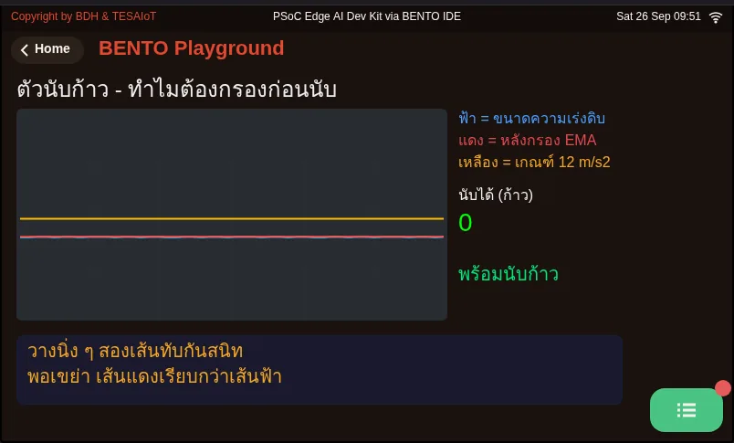
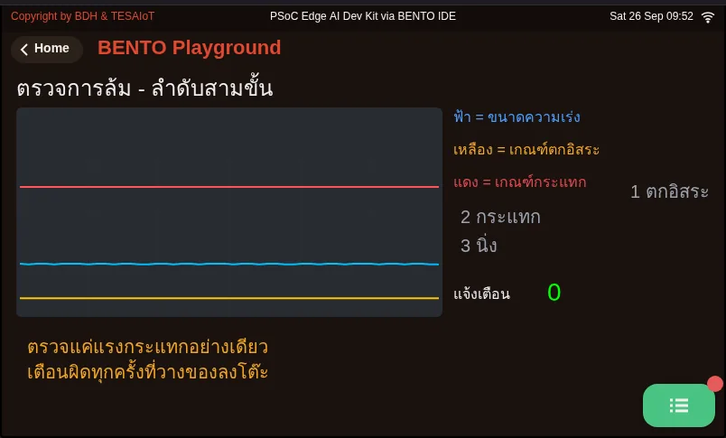
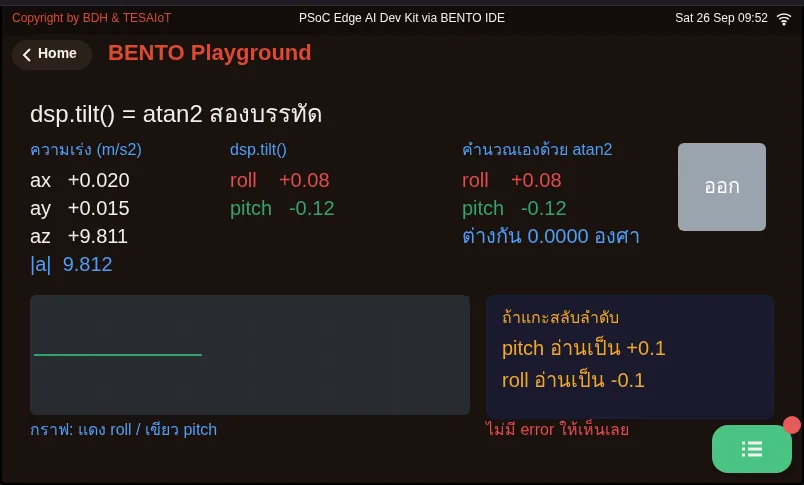

# Lesson 3.3 — Hands-on: the digital level

> Module 3 — Sensor Visualization on HMI · Slides: [slides.md](slides.md) · [Module overview](../README.md) · [Course page](../../README.md)

Fill six blanks in the practice file so IMU values flow into a dashboard that is already built, until you have a two-axis level that reads about 0° when flat, moves the right bar when tilted, and lights up when it goes past the tolerance.

## Objectives

By the end of this lesson you will be able to:

1. Fill the six blanks in s06_digital_level.py one at a time, running after each, until both axes read between −1.0° and +1.0° after zeroing on a flat desk, and raising the edge that increases roll moves the ROLL bar without flipping its sign
2. Explain the order of the solution's main loop: read and convert inside try/except OSError, filter with EMA before subtracting the zero, store the filtered roll_f when zeroing, and draw the screen and call ui.poll() outside if ok_read
3. Match at least three silent symptoms from the trap tables (such as a bar frozen while the number changes, a tolerance box showing 0005, or the PITCH bar moving on a left-right tilt) to their cause and fix
4. Explain from 01_imu_step_counter.py and 02_imu_fall_detection.py why you filter before counting and need a 300 ms refractory time, and why a fall is judged as a three-stage sequence (free fall, impact within 800 ms, then 1500 ms still) rather than impact alone

## Before you start

Following on from lesson 3.2: you must remember the six moves of the level code, and that `dsp.tilt()` returns `(roll, pitch)`, with roll always first.
If you still do not know which edge of your team's board increases roll, open your learning log from lesson 3.1 — Dev Kit teams must have found and recorded it themselves.
Keep the BENTO Playground card open on the board's screen, and lay the board flat on the desk. On a freshly reset Eva Kit, the first read can sit still for up to 16 seconds — that is waiting, not hanging.

- **Equipment:** an Eva Kit or TESAIoT Dev Kit board with the BENTO MicroPython firmware installed, or the BENTO Emulator in [BENTO IDE](https://ide.tesaiot.dev/)
- **Before this:** [Lesson 3.2 — Gyro, the complementary filter and the level code](../l02-gyro-fusion/README.md)

## Concepts

**Lessons 3.1–3.3 are passed when the level, laid flat, reads about 0°, both axes' bars move the right way when tilted, and the lamps can tell you whether you have crossed the tolerance.**
All 25 pieces of the screen in the practice file are already written: the ruler, the tolerance box, the +/- buttons, two lamps, and the value-quality line.
Our job is to make values flow into it through six blanks, matching the six moves walked through in lesson 3.2.
Fill in one at a time and run — you know right away where it broke. Filling all six and running once is guessing.

The order in the solution's main loop is the whole reason for this lesson:

- Read `motion()` and convert with `dsp.tilt()` inside `try/except OSError`. On a round that fails to read, set `ok_read = False` and use the previous value for now
- Filter with `ema_roll.update(roll)` first, then subtract `roll_zero`. When zeroing, store the filtered `roll_f`, never the raw `roll`, which might be jittering right at that instant
- **All the drawing sits outside `if ok_read`.** A round that cannot read still draws the screen with the previous value, and the quality line shows "stale" in a warning colour.
  If the drawing sat inside the `if`, the screen would freeze on the old picture with nothing telling the viewer, and `for ev in ui.poll()` also sits outside `if ok_read` deliberately.
  A dead sensor does not mean the whole machine must die with it
- `in_tol` uses the filtered, zeroed value, never the raw one, or the lamps would flicker back and forth whenever the value straddles the threshold (alarm chattering)

This dashboard is designed to be readable even photographed in black and white. The axes are labelled with words (ROLL, PITCH), not red and green, because those two colours are reserved for
broken versus normal. Passing or over is shown by two lamps that light one at a time only, and a `ui.Led` commanded `.value(0)` dims, it does not vanish, so you can tell "off" apart from "the screen is broken".
The bar and lamp move every round (5 times a second), because the eye can read a position instantly, while the Seg7 is rewritten once per second.
At the end of the loop, `lbl_health.text(health)` is still sent every round deliberately, because `.value()` on the bar and lamp does not wake the screen side's fast mode.
A loop that only updates the bar and lamp would go quiet for over half a second and then stutter. Text that has not changed is not redrawn, so all we pay for is the value sent across the cores.

The two pages of the trap table in the slides are the main tool for this lab. Most symptoms show no error at all — they just give a wrong answer quietly.
For example: a bar frozen solid because `ui.Bar` was not set to `min=-90, max=90` · `ui.Scale` never moving because it is a ruler and does not accept `.value()` ·
a tolerance box showing `0005` because a spinbox defaults to four digits, needing `sp_tol.digits(2, 0)` · every widget missing from the screen because `ui.poll()` was forgotten in the loop

## Worked example

Do these three files in this lesson, in order, in about 35 minutes total.

1. **03_tilt_from_gravity.py** (about 10 minutes) — **predict** before running whether the `dsp.tilt()` column and the column you compute yourself with `atan2` will differ ·
   **run** it and tilt the board; the two right-hand columns must always be equal · **explore** the bottom row, which shows what you would read if the same value were unpacked in the swapped order
2. **01_imu_step_counter.py** (about 10 minutes) — walk ten steps holding the board and compare the counted number with the real steps. Watch the "waiting out the refractory period" label
   to see why some peaks are not counted, then **modify** as the file dares: set `REFRACT_MS = 0` and walk the same number of steps — the number will overshoot reality
3. **02_imu_fall_detection.py** (about 15 minutes) — set the board down on the desk hard enough to trick it into thinking it fell, and see which of the three stages does not light up.
   A fall is a sequence of events: acceleration magnitude below 3.0 m/s² (free fall), then above 25.0 m/s² within 800 ms (impact), then staying still for 1500 ms

If you get stuck: choosing the wrong `alpha` for `dsp.EMA` — open 06_ema_time_constant.py from lesson 2.8, which converts alpha into tau in seconds ·
lying still and the bar still jitters even with a filter applied — open 07_median_beats_mean.py from lesson 2.9. The compass and `dsp.Madgwick`
are in lesson 3.2's worked examples, outside this lesson's passing criteria.

| File | What this file teaches |
|---|---|
| [examples/01_imu_step_counter.py](examples/01_imu_step_counter.py) | Counting steps from acceleration |
| [examples/02_imu_fall_detection.py](examples/02_imu_fall_detection.py) | Detecting a fall from a sequence of two events |
| [examples/03_tilt_from_gravity.py](examples/03_tilt_from_gravity.py) | What dsp.tilt() does with three numbers, and why the order matters |

The slides for this lesson also refer to files that live in other lessons:

- [m02-ui-to-hardware/l08-filters/examples/06_ema_time_constant.py](../../m02-ui-to-hardware/l08-filters/examples/06_ema_time_constant.py) — what EMA's alpha means in real units of time
- [m02-ui-to-hardware/l08-filters/examples/08_six_filters_one_signal.py](../../m02-ui-to-hardware/l08-filters/examples/08_six_filters_one_signal.py) — dsp's six filters on the same one signal
- [m02-ui-to-hardware/l09-pot-capsense-lab/examples/07_median_beats_mean.py](../../m02-ui-to-hardware/l09-pot-capsense-lab/examples/07_median_beats_mean.py) — one outlier destroys an average, but cannot touch a median
- [m03-sensor-hmi/l02-gyro-fusion/examples/04_compass_and_magnetometer.py](../l02-gyro-fusion/examples/04_compass_and_magnetometer.py) — a compass on the board, and one number nobody has answered yet
- [m03-sensor-hmi/l02-gyro-fusion/examples/05_madgwick_and_pedometer.py](../l02-gyro-fusion/examples/05_madgwick_and_pedometer.py) — dsp's two remaining IMU classes, and the units that trap them both
- [m03-sensor-hmi/l06-accel-chart-lab/examples/01_imu_vibration_monitor.py](../l06-accel-chart-lab/examples/01_imu_vibration_monitor.py) — watching a machine's vibration

**Screens from the BENTO Emulator** for this lesson's examples (click a file name to open the code)

<figure><figcaption><a href="examples/01_imu_step_counter.py"><code>01_imu_step_counter.py</code></a> Counting steps from acceleration</figcaption></figure>
<figure><figcaption><a href="examples/02_imu_fall_detection.py"><code>02_imu_fall_detection.py</code></a> Detecting a fall from a sequence of two events</figcaption></figure>
<figure><figcaption><a href="examples/03_tilt_from_gravity.py"><code>03_tilt_from_gravity.py</code></a> What dsp.tilt() does with three numbers, and why the order matters</figcaption></figure>

## Practice

The practice file has 6 blanks; each one already has its answer written in the `# เติม:` (fill in) comment line — delete the `pass` under that line and put the code there instead.
Fill in one blank at a time, in order, and press Program to Device each time.

1. **Blank 1 (move 1):** `sensors.bmi270.motion()` once inside the `try` block to warm up. Never add `sensors.init()`
2. **Blanks 2–3 (move 3):** `ax, ay, az, gx, gy, gz = sensors.bmi270.motion()` then `roll, pitch = dsp.tilt(ax, ay, az)`.
   The PITCH bar and its number should already move now, because the filter and display lines for pitch have been written for you; ROLL is still frozen at 0
3. **Blank 4 (move 4):** `roll_f = ema_roll.update(roll)`. The ROLL Seg7 number should now start changing, but the ROLL bar is still frozen
4. **Blank 5 (move 5):** `roll_zero = roll_f`, then the next line `pitch_zero = pitch_f`. Press zero and the "reference" line must change
5. **Blank 6 (move 6):** `roll_bar.value(int(clamp90(roll_show)))`. The ROLL bar moves; then check against the MVP checkpoint item by item

If tilting left-right moves the PITCH bar instead, check blank 3 to see whether it was unpacked as `roll, pitch` or not.

| Practice file | Topic |
|---|---|
| [practice/s06_digital_level.py](practice/s06_digital_level.py) | A two-axis digital level (fill-in version) |

## Solution

Open the solution after trying on your own at least once, and read [how to use the solutions](../../README.md#วิธีใช้เฉลย) first.

| Solution | Goes with |
|---|---|
| [solution/s06_digital_level.py](solution/s06_digital_level.py) | [practice/s06_digital_level.py](practice/s06_digital_level.py) |

## Check your understanding

The same questions are in [quiz.yaml](quiz.yaml) for automatic marking.

1. What should blank 1 of the practice file (move 1, before building the dashboard) be filled with? *(choose one · objective 1)*
   - A) sensors.bmi270.motion() once inside a try block to warm up, so the first wait happens before the dashboard is built
   - B) sensors.init() to wake the IMU before reading
   - C) time.sleep_ms(16000) to wait for the sensor to be ready every time it runs
   - D) Nothing needs to be filled in, since the main loop already reads the sensor

   

Solution

   **A** — On the Eva Kit, sensors.init() is rejected with OSError, and the Dev Kit does not need it either. The first read after a reset on the Eva can sit still for up to 16 seconds; warming up once here makes that wait happen before the dashboard is built, not right when the bar should already be moving.

   

2. Item 8 of the MVP checkpoint has you set the board still for 30 seconds and check the number does not drift off in one direction. Why does our level pass this item? *(choose one · objective 1)*
   - A) We integrate nothing at all; the angle comes purely from the accelerometer's dsp.tilt(), so there is no drift
   - B) Because dsp.EMA subtracts the gyro's bias for you
   - C) Because the zero button resets the value every 30 seconds
   - D) Because motion() on the Eva Kit compensates for drift from the factory

   

Solution

   **A** — Drift comes from accumulating ω·Δt from the gyro. This level uses no gyro at all, only gravity's shadow through dsp.tilt(), filtered with EMA. Item 8 is exactly what proves we have no drift problem.

   

3. Which statements about the order in the solution's main loop of s06_digital_level.py are correct? Choose every correct one. *(choose all that apply · objective 2)*
   - A) Drawing the bar, lamp and number sits outside if ok_read, so a round that fails to read still draws with the previous value, and the quality line reports stale
   - B) in_tol uses the filtered, zeroed value, to prevent the lamps flickering back and forth when the value straddles the threshold
   - C) for ev in ui.poll() sits outside if ok_read, because a dead sensor does not mean the whole machine must die with it
   - D) When zeroing, you should store the raw roll, since it is the freshest value
   - E) You should subtract the zero first, then feed the result into EMA

   

Solution

   **A, B, C** — The solution filters first, then subtracts the zero, and when zeroing it stores the filtered roll_f, because a reference point taken from a still-jittering value would mean the bar never truly returns to zero. Drawing and ui.poll() sit outside if ok_read so the screen tells the truth and the buttons still work even on a round when reading the sensor fails.

   

4. The ROLL Seg7 number changes with tilt, but the ROLL bar sits completely frozen in place, with no error. What is the most likely cause? *(choose one · objective 3)*
   - A) ui.Bar was created without setting min=-90, max=90; the default 0–100 range rounds a negative angle to 0
   - B) dsp.EMA was forgotten, so the value jitters too fast for the bar to keep up
   - C) dsp.tilt() was unpacked in swapped order, as pitch, roll
   - D) sensors.init() was placed before the loop

   

Solution

   **A** — The calculation is correct, so the number changes, but a bar stuck at the 0–100 range rounds a negative angle to 0. Fix it by adding min/max when creating the bar. Swapping the unpacking order would make the PITCH bar move instead, and sensors.init() on the Eva Kit raises OSError immediately, not silently.

   

5. You run 02_imu_fall_detection.py and set the board down on the desk hard, with the acceleration magnitude spiking past 25 m/s², but the device does not alert. Why? *(choose one · objective 4)*
   - A) There was no free-fall stage first (the magnitude never dropped below 3.0 m/s²), so the device stays in the IDLE state and does not count that impact
   - B) The impact threshold is too high; it should be lowered until setting an object down also counts
   - C) The sensor misread and returned 9.8 instead
   - D) It forgot to filter with dsp.EMA before deciding

   

Solution

   **A** — A fall is a three-stage sequence: free fall, then impact within 800 ms, then staying still for 1500 ms. Setting an object down hard has only the impact stage. Checking impact force alone would false-alarm every time something is set down on the desk, and a system that false-alarms often gets its battery pulled by the user.

   

## Lab

**MVP checkpoint.** Lessons 3.1–3.3 pass when every item below is true.

- [ ] Lay the board flat on the desk, press zero, and both axes read between −1.0° and +1.0°
- [ ] Raise the edge that increases roll (Eva: the left edge; Dev Kit: whichever edge your team found and recorded), the ROLL bar moves, and the sign does not flip
- [ ] Raise the edge at right angles to that one (Eva: the top edge), the PITCH bar moves, while ROLL barely moves at all
- [ ] The Seg7 number follows the bar, readable from arm's length, and changes once per second, not five times a second
- [ ] Tilting past the tolerance switches the lamps, one at a time only — never both lit at once
- [ ] Pressing +/- on the tolerance changes the number in the box, stops on its own at the range edges of 1 and 30, and the lamps follow the new tolerance without the board needing to move
- [ ] Pressing zero while tilted brings the value back to about 0° in that pose
- [ ] The board sits still for 30 seconds and the number does not drift off continuously in one direction
- [ ] Attach photos of the screen taken lying flat and tilted until the red lamp lights, to your learning log

Item 8 is the item that proves we have no drift problem, because we integrate nothing at all.

## Going further

Lessons 3.4–3.6 take this same three-axis acceleration and draw it as a real-time chart with a table of extremes and start/stop recording buttons, beginning with lesson 3.4 on how often you must sample the signal.
If you want to go further, pick one item from the "going further" slides: bubble-level mode with `ui.Panel` and `.pos(x, y)` · a warning past ±3° with a real light chosen by name from `gpio.board_info()["led_names"]` · racing `dsp.EMA` alpha 0.05 against 0.5 · proving gyro drift with `gyro_roll = gyro_roll + gx * 0.2`, held still for three minutes.

Next lesson: [Lesson 3.4 — Sampling right: Nyquist, aliasing and the ring buffer](../l04-sampling/README.md)

## Reflect

- Which symptom in the trap table have you actually met, and what on screen told you, given that there was no error to see?
- If you moved every drawing line inside `if ok_read`, what would someone watching the screen come to believe wrongly?
- How many degrees of tolerance does your own levelling work need, and why let the user set that themselves instead of hardcoding it as a constant?
