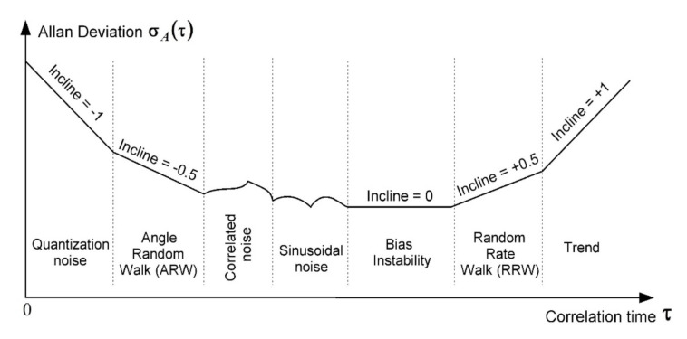
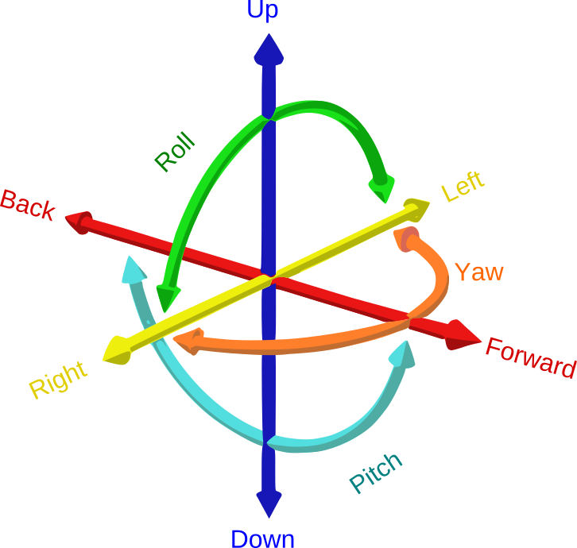
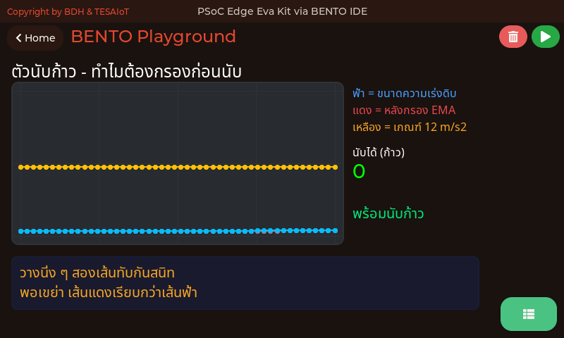
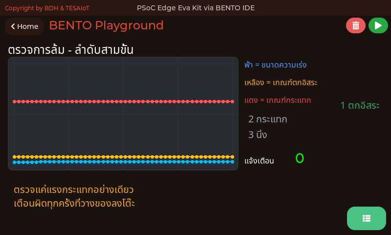
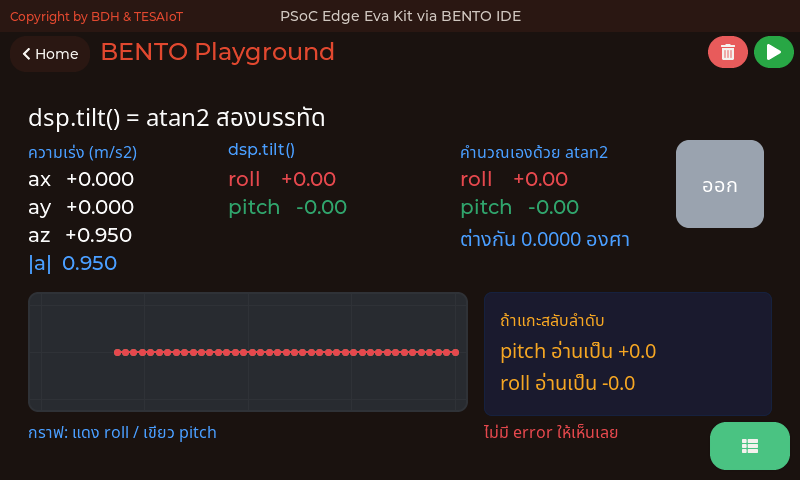
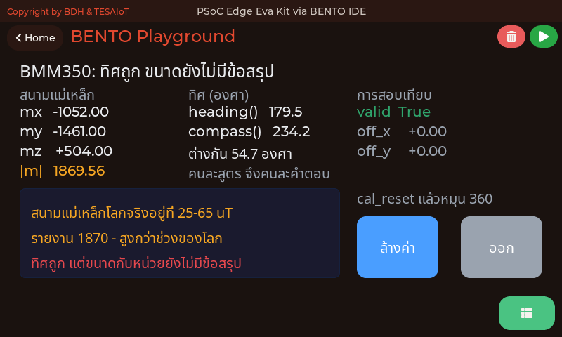
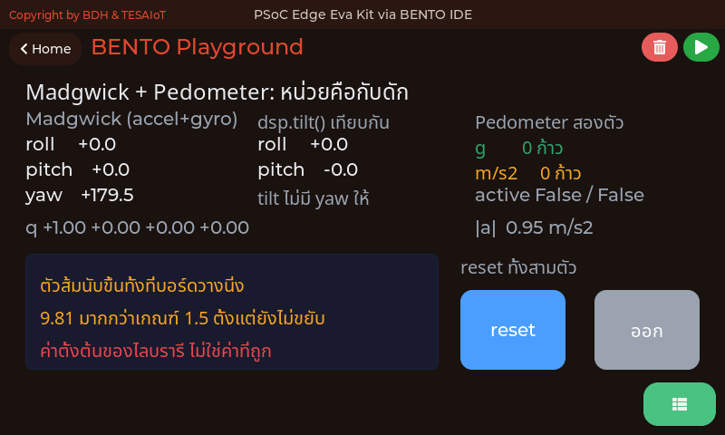

<style>
section { font-size: 24px; padding: 40px 52px; justify-content: flex-start; }
section h1 { font-size: 1.45em; line-height: 1.12; margin: 0 0 .22em; }
section h2 { font-size: 1.12em; margin: .15em 0; }
section h3 { font-size: 1.0em; margin: .12em 0; }
section p, section li { margin: .16em 0; line-height: 1.32; }
section img { max-width: 100%; height: auto; }
section svg { max-height: 330px; width: 100%; }
section table { font-size: .78em; }
section pre { font-size: .70em; line-height: 1.32; background:#0d1117; color:#e6edf3; border:1px solid #30363d; border-radius:8px; padding:12px 16px; box-shadow:0 2px 8px rgba(0,0,0,.25); }
section pre code { white-space: pre-wrap; background:transparent; color:inherit; } section pre .hljs-comment{color:#8b949e;font-style:italic} section pre .hljs-keyword,section pre .hljs-built_in,section pre .hljs-literal{color:#ff7b72} section pre .hljs-string{color:#a5d6ff} section pre .hljs-number{color:#79c0ff} section pre .hljs-title,section pre .hljs-title.function_,section pre .hljs-section{color:#d2a8ff} section pre .hljs-meta{color:#ffa657} section pre .hljs-attr,section pre .hljs-attribute,section pre .hljs-name{color:#7ee787}
section blockquote { margin: .25em 0; font-size: .92em; }
/* two images on a line (parity / 2x2 grids) stay side-by-side and small */
section p > img + img { margin-left: 10px; }
/* scroll-within-slide: dense slides scroll instead of clipping */
section { overflow-y: auto; overflow-x: hidden; }
section::-webkit-scrollbar { width: 11px; }
section::-webkit-scrollbar-thumb { background:#4a90d9; border-radius:6px; }
section::-webkit-scrollbar-track { background:rgba(0,0,0,.06); }
/* image drop-shadow + cover-slide readability (auto) */
section img{filter:drop-shadow(0 3px 12px rgba(0,0,0,.5))}
section iframe{border:0;border-radius:8px;box-shadow:0 2px 10px rgba(0,0,0,.3)}
/* พื้นสำรองของสไลด์ปก: ถ้า img/cover_sNN.svg โหลดไม่ขึ้น ธีมจะคืนพื้นขาว
   แล้วตัวอักษรสีขาวของปกจะหายไปทั้งแผ่น — ปักสีเข้มไว้ให้ภาพเป็นแค่ของประดับ */
section.cover{background-color:#0b1426}
section.cover *{color:#fff !important}
section.cover h1,section.cover h2,section.cover h3,section.cover p,section.cover li,section.cover strong,section.cover em,section.cover blockquote,section.cover div{text-shadow:0 2px 9px rgba(0,0,0,.92),0 0 3px rgba(0,0,0,.8)}
section.cover div[style*="background:#"],section.cover div[style*="background: #"]{background:rgba(10,14,20,.66) !important;border-color:rgba(120,200,255,.45) !important;max-width:62%}
section.cover blockquote{border-left:4px solid rgba(120,200,255,.6) !important;background:rgba(13,17,23,.55) !important;border-radius:6px;padding:.3em .6em}
section.cover h1,section.cover h2,section.cover h3,section.cover p,section.cover blockquote{max-width:60%}
section.cover div:not(:has(img)){max-width:62%}
section.cover img{filter:none}
</style>


<!-- _class: cover -->

# บทเรียน 3.3 — ลงมือทำ: เครื่องวัดระดับดิจิทัล

## IMU กับมุมเอียง · เครื่องวัดระดับดิจิทัล: จากความเร่งดิบ สู่องศาที่คนอ่านรู้เรื่อง

**โมดูล 3 — แสดงผลเซนเซอร์บน HMI**

> ต่อจากบทเรียน 3.2 — gyro ฟิลเตอร์ complementary และโค้ดเครื่องวัดระดับ

---

## MVP checkpoint — ผ่านชุดบทเรียนนี้เมื่อ


**เครื่องวัดระดับ — วางราบอ่าน ~0°, เอียงแล้วแถบทั้งสองแกนวิ่งถูกทิศ และไฟบอกได้ว่าเกินเกณฑ์หรือยัง**

แปลเป็นสิ่งที่ตรวจได้จริง:

- [ ] วางบอร์ดราบบนโต๊ะ กดตั้งศูนย์ แล้วทั้งสองแกนอ่านได้ในช่วง **−1.0° ถึง +1.0°**
- [ ] ยกขอบ**ด้านที่ทำให้ roll เพิ่ม**ขึ้น (Eva: ขอบซ้าย · Dev Kit: ทีมหาเองแล้วจดว่าขอบไหน) แถบ **ROLL** ขยับ และเครื่องหมายไม่กลับด้าน
- [ ] ยกขอบ**ด้านที่ตั้งฉากกัน**ขึ้น (Eva: ขอบบน) แถบ **PITCH** ขยับ ส่วน ROLL แทบไม่ขยับ
- [ ] ตัวเลข Seg7 เปลี่ยนตามแถบ อ่านออกจากระยะห่างหนึ่งช่วงแขน และเปลี่ยน **วินาทีละครั้ง** ไม่ใช่ห้าครั้งต่อวินาที
- [ ] เอียงเกินเกณฑ์แล้วไฟสลับกันติด **ทีละดวงเท่านั้น** ไม่ติดพร้อมกันสองดวง
- [ ] กดปุ่มเพิ่ม/ลดเกณฑ์ แล้วเลขในช่องเปลี่ยนตาม หยุดเองที่ขอบพิสัย 1 กับ 30 และไฟเปลี่ยนตามเกณฑ์ใหม่โดยบอร์ดไม่ต้องขยับ
- [ ] กดปุ่มตั้งศูนย์ในท่าเอียง แล้วค่ากลับไปเป็น ~0° ในท่านั้น
- [ ] วางบอร์ดนิ่ง 30 วินาที ตัวเลขไม่ไหลหนีไปทางเดียวเรื่อย ๆ
- [ ] ถ่ายรูปหน้าจอตอนวางราบ และตอนเอียงจนไฟแดงติด แนบในบันทึกการเรียน

> ข้อที่แปดคือข้อที่พิสูจน์ว่าเรา **ไม่ได้** มีปัญหา drift เพราะเราไม่ได้อินทิเกรตอะไรเลย

---

## กับดักที่เจอบ่อย (1/2) — หน้าจอและตัวกรอง

<style scoped>
section table { font-size: .72em; }
</style>

| อาการ | สาเหตุที่แท้จริง | วิธีแก้ |
|---|---|---|
| เอียงซ้าย-ขวา แต่แถบ PITCH วิ่งแทน | เขียน `pitch, roll = dsp.tilt(...)` สลับลำดับ | สลับเป็น `roll, pitch = ...` |
| แถบนิ่งสนิททั้งที่ตัวเลขเปลี่ยน | `ui.Bar` ไม่ได้ตั้ง `min=-90, max=90` (ค้างที่ 0-100) | เติม min/max ตอนสร้างแถบ |
| `ui.Scale` ไม่ขยับเลยสักครั้ง | แนวนอนคือไม้บรรทัด ไม่รับ `.value()` | ตัวที่ต้องขยับคือ `ui.Bar` ที่วางทับ · แบบวงกลมใช้ `.prop(ui.PROP_SCALE_NEEDLE, ...)` (fw 2026-08-20 ขึ้นไป) |
| ตัวเลขบนไม้บรรทัดเบียดกันจนอ่านไม่ออก | ขีดเยอะเกินไปสำหรับความกว้างที่มี | `.ticks(9, 4)` บนความกว้าง 160 พิกเซล — ได้ -90 0 90 |
| `ui.Spinbox` แตะแล้วค่าไม่เปลี่ยน | จอสัมผัสไม่มีลูกบิดหมุน การแตะแค่เลือกตำแหน่งหลัก | ต้องมี `ui.Button` เพิ่ม/ลดข้าง ๆ เสมอ |
| ช่องเกณฑ์ขึ้น `0005` ทั้งที่ตั้ง 5 | ค่าตั้งต้นของ spinbox คือสี่หลัก | `sp_tol.digits(2, 0)` |
| ไฟดับแล้วยังเห็นเป็นวงจาง ๆ | ตั้งใจ `.value(0)` คือหรี่ ไม่ใช่หาย | ไฟที่หายไปทำให้แยกไม่ออกว่าดับหรือจอเสีย |
| แถบกระตุกเป็นช่วง ๆ อ่านยาก | ยังไม่ได้ต่อ EMA หรือ alpha สูงเกินไป | ใช้ `dsp.EMA(alpha=0.2)` แล้วป้อน `.update()` |
| แถบตามมือช้ามาก | alpha ต่ำเกินไป (เช่น 0.02) | ขยับขึ้นเป็น 0.2-0.3 แล้วลองใหม่ |
| วางราบแล้วไม่ได้ 0.0 สักที | โต๊ะเอียง + offset ของชิป | วางนิ่งแล้วกดปุ่ม **ตั้งศูนย์** |
| widget หายทั้งจอหลังรันไปพักหนึ่ง | ลืม `ui.poll()` ในลูป | เรียก `ui.poll()` ทุกรอบเสมอ |

---

## กับดักที่เจอบ่อย (2/2) — เซนเซอร์ หน่วย และเข็มทิศ

<style scoped>
section table { font-size: .64em; }
</style>

| อาการ | สาเหตุที่แท้จริง | วิธีแก้ |
|---|---|---|
| ค่าเพี้ยนหนักตอนถือเดินไปมา | ความเร่งจากการเคลื่อนที่ปนกับแรงโน้มถ่วง | วางนิ่งแล้วเอียงช้า ๆ หรือรอ fusion เต็มรูป |
| `OSError` เด้งกลางคัน | เซนเซอร์ไม่ตอบทันในรอบนั้น (Eva: คอร์จอยังไม่ตอบ · Dev Kit: บัส I2C ยังไม่ว่าง) | ห่อด้วย `try / except OSError` แล้วข้ามรอบนั้น |
| `OSError` ที่บรรทัด `sensors.init()` | บน Eva Kit เฟิร์มแวร์ปฏิเสธคำสั่งนี้ (บน Dev Kit ผ่านเงียบ ๆ แต่ไม่จำเป็น) | ลบบรรทัดนั้นทิ้ง ไม่ต้องมี init เลย ทั้งสองบอร์ด |
| `OSError` ที่ `bmi270.temperature()` / `chip_id()` | บน Eva Kit สองค่านี้ไม่อยู่ใน snapshot (Dev Kit ใช้ได้) | อย่าพึ่งสองคำสั่งนี้ · IMU ยังมีชีวิตไหม ดู `snapshot()['bmi270']['sequence']` เดินขึ้นหรือเปล่า |
| `Madgwick` มุมหมุนติ้วจนอ่านไม่ได้ | ป้อน gyro เป็น deg/s ทั้งที่มันต้องการ rad/s | ครอบด้วย `math.radians()` ทั้งสามแกน |
| `Madgwick` มุมเดินเร็ว/ช้ากว่าความจริง | `fs=` ไม่ตรงกับคาบลูปจริง | ลูป 200 ms คือ `fs=5.0` ไม่ใช่ค่าตั้งต้น 100 |
| `AttributeError: value` ตอนเรียก `ahrs.value()` | `Madgwick` กับ `Pedometer` ไม่มี `.value()` | ใช้ `.quaternion()` หรือเก็บค่าที่ `.update()` คืนมาเอง |
| `Pedometer` นับก้าวขึ้นทั้งที่บอร์ดวางนิ่ง | ค่าตั้งต้น `threshold=1.5` เป็นหน่วย g แต่ป้อน m/s² เข้าไป | หารด้วย 9.81 ก่อนป้อน หรือตั้ง `threshold=12.0` ให้ตรงหน่วย |
| `dsp.compass()` กับ `bmm350.heading()` ไม่ตรงกัน | คนละสูตร — `atan2(y,x)` กับ `atan2(x,y)` | ไม่ใช่บั๊ก เลือกใช้ตัวใดตัวหนึ่งให้ตลอดทั้งโปรแกรม |
| เอียงบอร์ดแล้วทิศเปลี่ยนทั้งที่ไม่ได้หมุน | `dsp.compass()` ทิ้ง `mz` จึงยังไม่ชดเชยการเอียง | ถือบอร์ดให้ราบตอนอ่านทิศ |

<!-- โน้ตผู้สอน: สิบสองในยี่สิบสามข้อนี้ไม่ทำให้โปรแกรม crash — มันแค่ให้คำตอบผิดอย่างเงียบ ๆ ซึ่งอันตรายกว่า · ห้าข้อล่างสุดเป็นเรื่อง **หน่วย** ล้วน ๆ และหกข้อกลางเป็นเรื่อง **เข้าใจ widget ผิดตัว** ทั้งสามกลุ่มไม่มี error ให้เห็น -->

---

## ลงมือทำ — เติมช่องว่างในไฟล์ฝึก

<div style="display:flex;gap:16px;align-items:flex-start">
<div style="flex:1;min-width:0">

เปิด [`s06_digital_level.py`](https://github.com/tesaiot/tesa-qualification-program/blob/main/courses/aiot-micropython/m03-sensor-hmi/l03-digital-level-lab/practice/s06_digital_level.py) มีช่องว่างให้เติม 6 จุด

```python
# เติม: sensors.bmi270.motion()   (ห้ามใส่ sensors.init())
pass

# เติม: ax, ay, az, gx, gy, gz = sensors.bmi270.motion()
pass

# เติม: roll, pitch = dsp.tilt(ax, ay, az)
pass

# เติม: roll_f = ema_roll.update(roll)
pass

# เติม: roll_zero = roll_f  แล้วบรรทัดถัดไป pitch_zero = pitch_f
pass

# เติม: roll_bar.value(int(clamp90(roll_show)))
pass
```

**หน้าจอทั้ง 25 ชิ้นเขียนไว้ให้ครบแล้ว ไม่ต้องแตะ** ทั้งไม้บรรทัด ช่องเกณฑ์ ปุ่มเพิ่ม/ลด ไฟสองดวง และบรรทัดคุณภาพของค่า งานของเราคือทำให้ค่าไหลเข้าไปในนั้น

</div>
<div style="flex:0 0 320px">

<svg viewBox="0 0 320 260" xmlns="http://www.w3.org/2000/svg">
  <text x="160" y="26" text-anchor="middle" font-size="19" font-weight="700" fill="#37474f">เติมเป็นสามขั้น แล้วรันทุกขั้น</text>
  <rect x="20" y="44" width="280" height="60" rx="8" fill="#e3f2fd" stroke="#1565c0" stroke-width="2"/>
  <text x="160" y="70" text-anchor="middle" font-size="19" font-weight="700" fill="#1565c0">ขั้น 1 · จุดที่ 1-3</text>
  <text x="160" y="94" text-anchor="middle" font-size="18" fill="#0d47a1">ตัวเลขวิ่งไหม (กระตุกได้)</text>
  <rect x="20" y="114" width="280" height="60" rx="8" fill="#fff3e0" stroke="#ef6c00" stroke-width="2"/>
  <text x="160" y="140" text-anchor="middle" font-size="19" font-weight="700" fill="#ef6c00">ขั้น 2 · จุดที่ 4</text>
  <text x="160" y="164" text-anchor="middle" font-size="18" fill="#e65100">เทียบก่อน-หลังกรอง</text>
  <rect x="20" y="184" width="280" height="60" rx="8" fill="#e8f5e9" stroke="#2e7d32" stroke-width="2"/>
  <text x="160" y="210" text-anchor="middle" font-size="19" font-weight="700" fill="#2e7d32">ขั้น 3 · จุดที่ 5-6</text>
  <text x="160" y="234" text-anchor="middle" font-size="18" fill="#1b5e20">ทดสอบปุ่มตั้งศูนย์</text>
  <circle cx="308" cy="74" r="7" fill="#1565c0"><animate attributeName="r" values="6;11;6" dur="1.5s" repeatCount="indefinite"/></circle>
  <circle cx="308" cy="144" r="7" fill="#ef6c00"><animate attributeName="r" values="6;11;6" dur="1.5s" begin="0.5s" repeatCount="indefinite"/></circle>
  <circle cx="308" cy="214" r="7" fill="#2e7d32"><animate attributeName="r" values="6;11;6" dur="1.5s" begin="1s" repeatCount="indefinite"/></circle>
</svg>

</div>
</div>

> เติมทีละจุดแล้วรัน จะรู้ทันทีว่าพังที่จุดไหน — เติมครบหกจุดแล้วรันทีเดียวคือการเดา

---

## ตัวอย่างของบทเรียน 3.1–3.3 — สามไฟล์แรกทำในบทเรียนให้จบ ที่เหลือเปิดตามอาการ

<style scoped>
section table { font-size: .6em; }
section p, section blockquote { font-size: .76em; }
section h2 { font-size: 1.3em; }
</style>

**ต้องทำในบทเรียน** · เปิดตามลำดับนี้ ทั้งชุดราว 35 นาที

| ลำดับ · เรื่อง · เวลา | ไฟล์ | ลงมือทำอะไร แล้วจะเข้าใจอะไร |
|---|---|---|
| **1 · ข้างในของ `dsp.tilt()`** · 10 นาที | [`03_tilt_from_gravity.py`](https://github.com/tesaiot/tesa-qualification-program/blob/main/courses/aiot-micropython/m03-sensor-hmi/l03-digital-level-lab/examples/03_tilt_from_gravity.py) | เอียงบอร์ดแล้วดูสามคอลัมน์: ค่าดิบ · คำตอบของ `dsp.tilt()` · คำตอบที่ไฟล์นี้คำนวณเองด้วย `atan2` · สองคอลัมน์ขวาตรงกันเสมอ และแถวล่างแสดงให้เห็นว่าถ้าแกะสลับลำดับจะอ่านได้เป็นอะไร |
| **2 · กรองก่อนค่อยตัดสิน** · 10 นาที | [`01_imu_step_counter.py`](https://github.com/tesaiot/tesa-qualification-program/blob/main/courses/aiot-micropython/m03-sensor-hmi/l03-digital-level-lab/examples/01_imu_step_counter.py) | เดินถือบอร์ดสิบก้าวแล้วเทียบเลขที่นับได้กับที่เดินจริง · จะเห็นว่าถ้าไม่กรองก่อนและไม่มีเวลาห้ามนับซ้ำ สั่นครั้งเดียวจะถูกนับหลายก้าว |
| **3 · เหตุการณ์เดียวไม่พอ** · 15 นาที | [`02_imu_fall_detection.py`](https://github.com/tesaiot/tesa-qualification-program/blob/main/courses/aiot-micropython/m03-sensor-hmi/l03-digital-level-lab/examples/02_imu_fall_detection.py) | ลองวางบอร์ดลงแรง ๆ ให้มันเข้าใจผิดว่าล้ม แล้วดูว่าขั้นไหนไม่ผ่าน · การล้มคือลำดับของเหตุการณ์ ไม่ใช่ความแรงอย่างเดียว |

**เปิดตามความสนใจ** · นอกเกณฑ์ผ่านของชุดบทเรียนนี้ แต่ปิดช่องว่างของโมดูล

| เรื่อง | ไฟล์ | ทำไมถึงมี |
|---|---|---|
| เข็มทิศ และข้อบกพร่องที่ยังค้าง | [`04_compass_and_magnetometer.py`](https://github.com/tesaiot/tesa-qualification-program/blob/main/courses/aiot-micropython/m03-sensor-hmi/l02-gyro-fusion/examples/04_compass_and_magnetometer.py) | ครบทั้งห้าคำสั่งของ `bmm350` และแสดง `dsp.compass()` เทียบกับ `heading()` ให้เห็นว่าคนละสูตร |
| fusion เต็มรูป และตัวนับก้าวสำเร็จรูป | [`05_madgwick_and_pedometer.py`](https://github.com/tesaiot/tesa-qualification-program/blob/main/courses/aiot-micropython/m03-sensor-hmi/l02-gyro-fusion/examples/05_madgwick_and_pedometer.py) | `dsp.Madgwick` กับ `dsp.Pedometer` สองคลาสสุดท้ายของโมดูล พร้อมกับดักเรื่องหน่วยทั้งสองข้อ |

<!-- โน้ตผู้สอน: เปลี่ยนจากรุ่นก่อน (15 ส.ค.): เดิมสไลด์นี้เขียนว่า "ยังไม่มีไฟล์ตัวอย่างไหนในคลังที่คำนวณ roll/pitch" ซึ่งเป็นจริงจนถึงวันนั้น · ตอนนี้ 03_tilt_from_gravity.py ทำหน้าที่นั้นแล้ว และเปิดให้เห็น atan2 สองบรรทัดที่อยู่ข้างในด้วย — งาน Build ใน s06_digital_level.py ยังเป็นการเขียนเองเหมือนเดิม ไฟล์ตัวอย่างอธิบาย *ทำไม* ไม่ได้ยกคำตอบมาให้ -->

**ติดตรงไหน เปิดอันนี้**

| อาการที่เจอ | ไฟล์ที่ตอบอาการนั้น |
|---|---|
| กรอกช่อง `dsp.EMA(alpha=` ในบันทึกการเรียน ไม่ถูก ไม่รู้จะใส่เท่าไร | [`06_ema_time_constant.py`](https://github.com/tesaiot/tesa-qualification-program/blob/main/courses/aiot-micropython/m02-ui-to-hardware/l08-filters/examples/06_ema_time_constant.py) — แปลง alpha เป็นเวลา tau เป็นวินาที เลือกจากตัวเลขได้เลย ไม่ต้องเดา |
| วางบอร์ดนิ่งแล้วแถบยังกระตุก ทั้งที่ใส่ตัวกรองไปแล้ว | [`07_median_beats_mean.py`](https://github.com/tesaiot/tesa-qualification-program/blob/main/courses/aiot-micropython/m02-ui-to-hardware/l09-pot-capsense-lab/examples/07_median_beats_mean.py) — ค่าหลุดค่าเดียวลากค่าเฉลี่ยไปด้วย แต่ทำอะไร median ไม่ได้ เพราะ median เรียงแล้วหยิบตัวกลาง |

<!-- โน้ตผู้สอน: อ่านเสริมนอกเวลา — เรื่องนี้เป็นของบทเรียน 3.4–3.6 ไม่ใช่เกณฑ์ผ่านของวันนี้ แต่เป็นปลายทางที่ IMU ตัวเดียวกันนี้ไปได้ไกลที่สุดในงานอุตสาหกรรม: 01_imu_vibration_monitor.py วางบอร์ดบนของที่สั่นแล้วดูค่า RMS เทียบเส้นฐานที่โปรแกรมเก็บเอง · การสั่นวัดด้วยค่าเฉลี่ยไม่ได้ เพราะบวกลบหักล้างกันจนเหลือศูนย์ -->

---

## เฉลย [`s06_digital_level.py`](https://github.com/tesaiot/tesa-qualification-program/blob/main/courses/aiot-micropython/m03-sensor-hmi/l03-digital-level-lab/solution/s06_digital_level.py) — ตั้งต้นและหน้าจอ

<div style="display:flex;gap:16px;align-items:flex-start">
<div style="flex:1;min-width:0">

```python
import ui
ui.screen()
import time
import sensors
import dsp
ui.clear()
time.sleep_ms(200)
COL_TEXT, COL_DIM = 0xE8EAED, 0x9AA3AF
COL_CARD = 0x171B22
COL_OK, COL_WARN, COL_BAD = 0x30A46C, 0xF5A623, 0xE5484D
TOL_MIN, TOL_MAX, TOL_STEP = 1, 30, 1
tol = 5                        # เกณฑ์ยอมรับ หน่วยองศา
...                            # ท่า 1-2 ดูสไลด์ "แกะโค้ดจริง"
ema_roll = dsp.EMA(alpha=0.2)
ema_pitch = dsp.EMA(alpha=0.2)
roll_zero = 0.0
pitch_zero = 0.0
...
last_sec = -1                  # วินาทีที่เพิ่งเขียนตัวเลขลงจอ
def clamp90(v):
    return 90.0 if v > 90.0 else (-90.0 if v < -90.0 else v)
```

</div>
<div style="flex:0 0 300px">

<svg viewBox="0 0 300 260" xmlns="http://www.w3.org/2000/svg">
  <text x="150" y="26" text-anchor="middle" font-size="19" font-weight="700" fill="#c62828">สอง EMA ไม่ใช่หนึ่ง</text>
  <rect x="16" y="44" width="268" height="86" rx="8" fill="#e8f5e9" stroke="#2e7d32" stroke-width="2"/>
  <text x="150" y="70" text-anchor="middle" font-size="18" font-weight="700" fill="#2e7d32">ถูก</text>
  <text x="150" y="96" text-anchor="middle" font-size="18" fill="#1b5e20">roll → ema_roll</text>
  <text x="150" y="120" text-anchor="middle" font-size="18" fill="#1b5e20">pitch → ema_pitch</text>
  <rect x="16" y="146" width="268" height="98" rx="8" fill="#ffebee" stroke="#c62828" stroke-width="2"/>
  <text x="150" y="172" text-anchor="middle" font-size="18" font-weight="700" fill="#c62828">ผิด</text>
  <text x="150" y="198" text-anchor="middle" font-size="18" fill="#8e1b1b">roll และ pitch → ema เดียว</text>
  <text x="150" y="224" text-anchor="middle" font-size="18" fill="#8e1b1b">ค่าปนกัน แถบวิ่งมั่วทั้งคู่</text>
</svg>

<div style="font-size:.72em;color:#455a64;margin-top:.4em">เฉลยรุ่นนี้เลิกใช้ <b>สีบอกแกน</b> (แดง = roll, เขียว = pitch) แล้วใช้ <b>คำบอกแกน</b> แทน — สีแดงกับเขียวในหน้าจอควบคุมจองไว้แล้วสำหรับ เสีย/ปกติ เอาไปบอกแกน วันที่ต้องเตือนจริงจะไม่มีใครแยกออก · แถบใช้สีเน้น <code>0x4A9EFF</code> ปุ่มรอง <code>0x3A4150</code> ปุ่มหลัก <code>0x30A46C</code> ตามจานสีของหลักสูตร · ตัวกรองสองตัวเพราะสองสัญญาณ ตัวกรองมี <b>ความจำ</b></div>

</div>
</div>

---

## เฉลย — ลูปหลัก และทำไมเรียงหกท่าแบบนี้

<div style="display:flex;gap:16px;align-items:flex-start">
<div style="flex:1;min-width:0">

```python
running = True
while running:
    ok_read = True
    try:
        ax, ay, az, gx, gy, gz = sensors.bmi270.motion()
        roll, pitch = dsp.tilt(ax, ay, az)
    except OSError:
        ok_read = False
    if ok_read:
        roll_f = ema_roll.update(roll)
        pitch_f = ema_pitch.update(pitch)
    roll_show = roll_f - roll_zero
    pitch_show = pitch_f - pitch_zero
    for ev in ui.poll():
        h = ev['handle']
        if h == zero_id:
            roll_zero = roll_f
            pitch_zero = pitch_f
        elif h == exit_id:
            running = False
        # ปุ่มเพิ่ม/ลด tol - ท่าที่ 5
        ...
    roll_bar.value(int(clamp90(roll_show)))     # แถบ ไฟ ตัวเลข - ท่าที่ 6
    ...
    lbl_health.text(health)
    time.sleep_ms(200)
```

</div>
<div style="flex:0 0 330px">

<svg viewBox="0 0 330 300" xmlns="http://www.w3.org/2000/svg">
  <text x="165" y="24" text-anchor="middle" font-size="19" font-weight="700" fill="#37474f">ลำดับหกท่า ถูกบังคับด้วยตรรกะ</text>
  <rect x="16" y="38" width="298" height="34" rx="6" fill="#e3f2fd" stroke="#1565c0" stroke-width="2"/>
  <text x="165" y="61" text-anchor="middle" font-size="18" fill="#0d47a1">1 เช็กคอร์จอตอบ — ฐานของทุกอย่าง</text>
  <rect x="16" y="80" width="298" height="34" rx="6" fill="#e3f2fd" stroke="#1565c0" stroke-width="2"/>
  <text x="165" y="103" text-anchor="middle" font-size="18" fill="#0d47a1">2 สร้าง UI ครั้งเดียว นอกลูป</text>
  <rect x="16" y="122" width="298" height="34" rx="6" fill="#e8f5e9" stroke="#2e7d32" stroke-width="2"/>
  <text x="165" y="145" text-anchor="middle" font-size="18" fill="#1b5e20">3 อ่านและแปลง — ตัวเลขมีความหมาย</text>
  <rect x="16" y="164" width="298" height="34" rx="6" fill="#fff3e0" stroke="#ef6c00" stroke-width="2"/>
  <text x="165" y="187" text-anchor="middle" font-size="18" fill="#e65100">4 กรอง — หลังพิสูจน์ว่าค่าดิบถูก</text>
  <rect x="16" y="206" width="298" height="34" rx="6" fill="#fff3e0" stroke="#ef6c00" stroke-width="2"/>
  <text x="165" y="229" text-anchor="middle" font-size="18" fill="#e65100">5 ตั้งศูนย์ — ต้องเก็บค่าที่กรองแล้ว</text>
  <rect x="16" y="248" width="298" height="34" rx="6" fill="#f3e5f5" stroke="#6a1b9a" stroke-width="2"/>
  <text x="165" y="271" text-anchor="middle" font-size="18" fill="#4a148c">6 แสดงผล — ปลายทาง ไม่ใช่ต้นทาง</text>
  <circle cx="322" cy="55" r="6" fill="#1565c0"><animate attributeName="r" values="6;11;6" dur="3s" repeatCount="indefinite"/></circle>
  <circle cx="322" cy="139" r="6" fill="#2e7d32"><animate attributeName="r" values="6;11;6" dur="3s" begin="1s" repeatCount="indefinite"/></circle>
  <circle cx="322" cy="265" r="6" fill="#6a1b9a"><animate attributeName="r" values="6;11;6" dur="3s" begin="2s" repeatCount="indefinite"/></circle>
</svg>

<div style="font-size:.7em;color:#455a64;margin-top:.4em"><b>การแสดงผลทั้งหมดอยู่นอก <code>if ok_read</code></b> — รอบที่อ่านไม่ได้ก็ยังต้องวาดจอด้วยค่าเดิม แล้วเขียนบรรทัดคุณภาพ <code>lbl_health</code> ว่า "ค่าค้าง" ด้วยสีเตือน ถ้าปล่อยให้การวาดอยู่ใน <code>if</code> จอจะแช่ภาพเดิมโดยไม่มีอะไรบอกคนดู · <code>in_tol</code> ใช้ค่าที่ <b>กรองแล้วและหักศูนย์แล้ว</b> ไม่ใช่ค่าดิบ ไม่งั้นไฟจะกระพริบสลับดวงตอนค่าคาบเกี่ยวเกณฑ์ (alarm chattering) · <code>for ev in ui.poll()</code> อยู่ <b>นอก</b> <code>if ok_read</code> โดยตั้งใจ — เซนเซอร์ตายไม่ได้แปลว่าทั้งเครื่องต้องตายตาม</div>

</div>
</div>

---

## สรุปบทเรียน · รากฐานที่แตะ · และวันนี้อยู่ตรงไหนของเส้นทาง

<svg viewBox="0 0 940 200" xmlns="http://www.w3.org/2000/svg">
  <text x="470" y="30" text-anchor="middle" font-size="19" font-weight="700" fill="#37474f">ชุดบทเรียนนี้คือจุดที่เราเลิกเป็นผู้อ่านค่า แล้วเริ่มเป็นผู้คำนวณ</text>
  <line x1="40" y1="112" x2="900" y2="112" stroke="#b0bec5" stroke-width="4"/>
  <circle cx="150" cy="112" r="14" fill="#a3c93a"/>
  <circle cx="400" cy="112" r="19" fill="#22d3ee"><animate attributeName="r" values="16;22;16" dur="2.4s" repeatCount="indefinite"/></circle>
  <circle cx="650" cy="112" r="14" fill="#6cb2f5"/>
  <circle cx="860" cy="112" r="14" fill="#ffb066"/>
  <text x="150" y="82" text-anchor="middle" font-size="19" font-weight="700" fill="#5b7c14">บทเรียน 2.1–2.9</text>
  <text x="150" y="150" text-anchor="middle" font-size="18" fill="#455a64">อ่านค่าดิบจากขา</text>
  <text x="150" y="174" text-anchor="middle" font-size="18" fill="#455a64">แล้วแปลงหน่วย</text>
  <text x="400" y="80" text-anchor="middle" font-size="20" font-weight="700" fill="#0e7490">วันนี้ · บทเรียน 3.1–3.3</text>
  <text x="400" y="150" text-anchor="middle" font-size="18" fill="#455a64">สร้างปริมาณใหม่</text>
  <text x="400" y="174" text-anchor="middle" font-size="18" fill="#455a64">ที่เซนเซอร์ไม่ได้ให้มา</text>
  <text x="650" y="82" text-anchor="middle" font-size="19" font-weight="700" fill="#1565c0">บทเรียน 3.4–3.9</text>
  <text x="650" y="150" text-anchor="middle" font-size="18" fill="#455a64">เก็บประวัติเป็นกราฟ</text>
  <text x="650" y="174" text-anchor="middle" font-size="18" fill="#455a64">รวมเป็นแดชบอร์ด</text>
  <text x="860" y="82" text-anchor="middle" font-size="19" font-weight="700" fill="#b45309">บทเรียน 4.1–5.3</text>
  <text x="860" y="150" text-anchor="middle" font-size="18" fill="#455a64">ส่งมุมขึ้นคลาวด์</text>
  <text x="860" y="174" text-anchor="middle" font-size="18" fill="#455a64">เฝ้าระวังจากไกล</text>
</svg>

**วันนี้เราได้:** เข้าใจว่า accelerometer วัดแรงที่ดันมวลไว้ (proper acceleration) · อ่านหกแกนจากการอ่านครั้งเดียวและรู้ว่าทำไม (Eva: snapshot ชุดเดียว · Dev Kit: lock บัสครั้งเดียว) · แปลงเวกเตอร์แรงโน้มถ่วงเป็นสององศาด้วย `dsp.tilt()` โดยจำลำดับ **(roll, pitch)** ได้ · รู้ว่า gyro drift กับ accel jitter คนละปัญหากัน · สร้างเครื่องมือวัดที่มีปุ่มตั้งศูนย์แบบเดียวกับเครื่องมือจริง

**รากฐานที่แตะไป:** เซนเซอร์ MEMS และความหมายทางฟิสิกส์ของค่าที่คืน · atomic read บนบัสร่วม · ตรีโกณมิติกับ `atan2` · low-pass แบบ recursive และแนวคิด time constant · การอินทิเกรตกับการสะสมความผิดพลาด · calibration และ tare · การเลือกช่วงสเกลให้ตรงกับปริมาณจริง

**ชุดบทเรียนถัดไป:** เอา accel สามแกนเดียวกันนี้ไปวาดเป็น **กราฟ real-time** พร้อมตารางค่าสุดขีดและปุ่มเริ่ม/หยุดบันทึก

> `atan2` กับ EMA จะตามผู้เรียนไปทุกงานที่มีเซนเซอร์ ไม่ว่าจะเปลี่ยนภาษา เปลี่ยนบอร์ด หรือเปลี่ยนบริษัท

---

## ใช้จริงที่ไหน — สี่มุมของการวัดมุมเอียงในสนามจริง

<svg viewBox="0 0 920 300" xmlns="http://www.w3.org/2000/svg">
  <rect x="16" y="16" width="436" height="128" rx="10" fill="#e3f2fd" stroke="#1565c0" stroke-width="2"/>
  <text x="38" y="48" font-size="20" font-weight="700" fill="#1565c0">โครงสร้าง · สะพานและปั้นจั่น</text>
  <text x="38" y="78" font-size="18" fill="#0d47a1">เซนเซอร์เอียงติดบนตอม่อสะพานและเสาเครน</text>
  <text x="38" y="104" font-size="18" fill="#0d47a1">การทรุดตัว 0.1° ที่ค่อย ๆ เพิ่ม คือสัญญาณอันตราย</text>
  <text x="38" y="130" font-size="18" fill="#5472a3">ต้องการ: ค่าไม่ drift เพราะเฝ้าดูกันเป็นปี</text>
  <rect x="468" y="16" width="436" height="128" rx="10" fill="#e8f5e9" stroke="#2e7d32" stroke-width="2"/>
  <text x="490" y="48" font-size="20" font-weight="700" fill="#2e7d32">โรงงาน · ตั้งระดับเครื่องจักร</text>
  <text x="490" y="78" font-size="18" fill="#1b5e20">เครื่องกลึงและ CNC ต้องได้ระดับก่อนเดินเครื่อง</text>
  <text x="490" y="104" font-size="18" fill="#1b5e20">ช่างใช้ปุ่ม tare เทียบกับฐานอ้างอิงหน้างาน</text>
  <text x="490" y="130" font-size="18" fill="#4a7c4e">ต้องการ: ปุ่มตั้งศูนย์แบบที่เราทำวันนี้</text>
  <rect x="16" y="160" width="436" height="128" rx="10" fill="#fff3e0" stroke="#ef6c00" stroke-width="2"/>
  <text x="38" y="192" font-size="20" font-weight="700" fill="#ef6c00">สุขภาพ · ตรวจจับการล้ม</text>
  <text x="38" y="222" font-size="18" fill="#e65100">มุมลำตัวเปลี่ยนเร็วผิดปกติ + ความเร่งพุ่งแล้วนิ่ง</text>
  <text x="38" y="248" font-size="18" fill="#e65100">"นั่งลงเร็ว" กับ "ล้ม" ต่างกันที่มุมหลังพุ่ง</text>
  <text x="38" y="274" font-size="18" fill="#a1683a">ต้องการ: ยืนยันหลายรอบก่อนเตือน แบบบทเรียน 5.1–5.3</text>
  <rect x="468" y="160" width="436" height="128" rx="10" fill="#f3e5f5" stroke="#6a1b9a" stroke-width="2"/>
  <text x="490" y="192" font-size="20" font-weight="700" fill="#6a1b9a">ยานพาหนะ · ท่าทางของตัวรถ</text>
  <text x="490" y="222" font-size="18" fill="#4a148c">รถบรรทุกเตือนเสี่ยงพลิกคว่ำจาก roll ขณะเข้าโค้ง</text>
  <text x="490" y="248" font-size="18" fill="#4a148c">โดรนและหุ่นยนต์ป้อนมุมนี้กลับเข้าตัวควบคุม</text>
  <text x="490" y="274" font-size="18" fill="#7e5a94">ต้องการ: fusion เต็มรูป เพราะเร่งและเลี้ยวตลอด</text>
</svg>

> สังเกตช่อง "ต้องการ" ของทั้งสี่มุม — โจทย์ต่างกัน จึงเลือกฟิลเตอร์และ cadence ต่างกัน ไม่มีสูตรเดียวใช้ได้หมด

---

## ต่อยอด — คิดต่อเอง (เลือกทำ 1 ข้อ)

<div style="display:flex;gap:16px;align-items:flex-start">
<div style="flex:1;min-width:0">

**ข้อ 1 · โหมดฟองอากาศ**
ทำระดับน้ำแบบฟองอากาศด้วย `ui.Panel` วงเล็กหนึ่งใบ แล้วขยับด้วย `.pos(x, y)` ตามค่า roll และ pitch ให้เหมือนฟองในหลอดแก้ว วางราบแล้วฟองต้องอยู่กลางวงกลมอ้างอิง

**ข้อ 2 · เตือนเมื่อไม่ได้ระดับ**
ถ้ามุมแกนใดเกิน ±3° ให้เปลี่ยนสี Seg7 เป็นแดงด้วย `.color()` และจุดไฟจริงหนึ่งดวงพร้อมกัน — เลือกดวงตามชื่อใน `gpio.board_info()["led_names"]` (ดู `led_named()` ใน [`01_imu_vibration_monitor.py`](https://github.com/tesaiot/tesa-qualification-program/blob/main/courses/aiot-micropython/m03-sensor-hmi/l06-accel-chart-lab/examples/01_imu_vibration_monitor.py)) ไม่ใช่ `gpio.led(0)` ตายตัว เพราะเลข 0 เป็นคนละดวง (ชื่อต่างกัน) บนสองบอร์ด · คิดต่อว่าจะกัน "กะพริบถี่" ตอนค่าแกว่งอยู่ที่ขอบพอดีได้อย่างไร

**ข้อ 3 · แข่ง alpha**
สร้าง `dsp.EMA` สองตัวด้วย alpha ต่างกัน (0.05 กับ 0.5) ป้อน roll ตัวเดียวกันเข้าทั้งคู่ จับเวลาด้วย `time.ticks_ms()` ว่าแต่ละตัวใช้กี่มิลลิวินาทีกว่าจะไล่ตามการเอียงทัน แล้วสรุปเป็นตัวเลขว่าแลกอะไรกับอะไร

**ข้อ 4 · พิสูจน์ว่า gyro drift จริงไหม**
เขียนมุมจาก gyro ล้วน ๆ ด้วย `gyro_roll = gyro_roll + gx * 0.2` ทุกรอบ แสดงคู่กับ roll จาก `dsp.tilt()` วางนิ่งสามนาที บันทึกว่าเส้นไหนหนีกี่องศา

</div>
<div style="flex:0 0 250px">



<div style="font-size:.62em;color:#78909c">ภาพ: Rudyk A.V. et al., Sensors 20(17):4841 (2020), CC BY 4.0 — Allan deviation แยกชนิดของ noise ที่ทำให้ gyro หนี · ใช้ประกอบข้อ 4</div>



<div style="font-size:.62em;color:#78909c">ภาพ: GregorDS, Wikimedia Commons, CC BY-SA 4.0 — 6 องศาอิสระ: เลื่อนสามแกน หมุนสามแกน</div>

</div>
</div>

> เขียนคำตอบลงบันทึกการเรียน แล้วเอามาเล่าให้เพื่อนฟังต้นชุดบทเรียนถัดไป

---

## หน้าจอของทุกไฟล์ในชุดบทเรียนนี้ (1/2)

<style scoped>
section img { margin: 0 .3em; }
section p { margin: .2em 0; }
</style>

  

<div style="font-size:.56em;color:#90a4ae"><b>01</b> นับก้าวจากความเร่ง · <b>02</b> ตรวจการล้มด้วยลำดับสองเหตุการณ์ · <b>03</b> dsp.tilt() ทำอะไรกับสามตัวเลข และทำไมลำดับถึงสำคัญ</div>

<div style="font-size:.52em;color:#78909c;margin-top:.4em">ภาพจากตัวจำลอง bento_sim ซึ่งเรนเดอร์ด้วยโค้ด CM55 ชุดเดียวกับที่รันบนบอร์ด ที่ 800x480 เท่าจอของ Eva Kit และ Dev Kit — แสดง<b>หน้าจอที่ตัวอย่างสร้าง</b> ค่าจากเซนเซอร์ WiFi และไมค์เป็นค่าแทนบนเครื่องโฮสต์ ไม่ใช่ผลการวัดของบอร์ด</div>

---

## หน้าจอของทุกไฟล์ในชุดบทเรียนนี้ (2/2)

<style scoped>
section img { margin: 0 .3em; }
section p { margin: .2em 0; }
</style>

 

<div style="font-size:.56em;color:#90a4ae"><b>04</b> เข็มทิศบนบอร์ด และตัวเลขหนึ่งตัวที่ยังไม่มีใครตอบได้ · <b>05</b> สองคลาส IMU ที่เหลือใน dsp และหน่วยที่ดักไว้ทั้งคู่</div>

<div style="font-size:.52em;color:#78909c;margin-top:.4em">ภาพจากตัวจำลอง bento_sim ซึ่งเรนเดอร์ด้วยโค้ด CM55 ชุดเดียวกับที่รันบนบอร์ด ที่ 800x480 เท่าจอของ Eva Kit และ Dev Kit — แสดง<b>หน้าจอที่ตัวอย่างสร้าง</b> ค่าจากเซนเซอร์ WiFi และไมค์เป็นค่าแทนบนเครื่องโฮสต์ ไม่ใช่ผลการวัดของบอร์ด</div>

---

## อ้างอิงและเครดิต

**แหล่งปฐมภูมิ**

- KIT_PSE84_EVAL PSOC™ Edge E84 Evaluation Kit guide, Infineon 002-39007 Rev.\*B — §3.2.2.12 6-axis IMU BMI270 (หน้า 86-87)
- Practical Electronics for Inventors, 4th ed. (Scherz & Monk) — §6.4.2 Acceleration (Fig. 6.18 Mass and spring accelerometer), §6.4.6 Tilt
- BMI270 datasheet BST-BMI270-DS000-08 rev 1.6 — Bosch Sensortec · Accelerometer — Wikipedia — https://en.wikipedia.org/wiki/Accelerometer
- Inertial Sensor Noise Analysis Using Allan Variance — MathWorks — https://www.mathworks.com/help/fusion/ug/inertial-sensor-noise-analysis-using-allan-variance.html

**วิดีโอที่ฝังไว้ในชุดบทเรียนนี้ (ตรวจแล้วว่าเปิดได้)**

`RLQGZl0lpjQ` Working principle of an accelerometer — Bosch Sensortec · 1:01 · `KuekQ-m9xpw` How does an Accelerometer work? — CircuitBread · 6:10 · `XRr1kaXKBsU` What Everyone Gets Wrong About Gravity — Veritasium · 17:33 (เริ่ม 2:30) · `PK05u9c3yWI` How do MEMS gyroscopes work? — nanolearning · 13:44 (เริ่ม 4:00) — คำอธิบายว่าดูเพื่ออะไร อยู่ใต้คลิปในสไลด์ที่ฝังไว้แล้ว

**เครดิตภาพ** — ทุกภาพมาจาก Wikimedia Commons หรือบทความ open-access ใน PMC (CC0 / CC BY / CC BY-SA / สาธารณสมบัติ) รายละเอียดที่ [CREDITS.md](../../credits.yaml) · **ห้ามใช้** บทความไทยที่ติดอันดับสูงสุดเรื่อง gyro/accel เพราะอธิบายผิดหลักการ

---

## อ้างอิงและเครดิต (ต่อ) — ตัวอย่างโค้ด และสิ่งที่เปลี่ยนจากเฟิร์มแวร์รุ่นก่อน

**ตัวอย่างโค้ด** — โฟลเดอร์ `examples/` ของบทเรียน 3.1–3.3 ห้าไฟล์ · คลังชุดบทเรียนนี้ถูกคัดจากหกไฟล์เหลือสองเมื่อ 14 ส.ค. (ไฟล์ที่ถอดออกเป็นเรื่องบิตกับเรื่องตัวกรอง ซึ่งเป็นของชุดบทเรียนอื่น) แล้ว **เพิ่มกลับสามไฟล์เมื่อ 15 ส.ค.** เพื่อปิดช่องว่างของ API ที่ชุดบทเรียนนี้เป็นเจ้าของ: `03_tilt_from_gravity.py` (`dsp.tilt` ซึ่งเป็นแกนกลางของชุดบทเรียนและเดิมไม่มีตัวอย่างเลย) · `04_compass_and_magnetometer.py` (`sensors.bmm350` ทั้งห้าคำสั่ง + `dsp.compass`) · `05_madgwick_and_pedometer.py` (`dsp.Madgwick` + `dsp.Pedometer`) · ตัวกรองที่ชุดบทเรียนนี้ยืมมาใช้อยู่ที่ [`06_ema_time_constant.py`](https://github.com/tesaiot/tesa-qualification-program/blob/main/courses/aiot-micropython/m02-ui-to-hardware/l08-filters/examples/06_ema_time_constant.py) และ [`07_median_beats_mean.py`](https://github.com/tesaiot/tesa-qualification-program/blob/main/courses/aiot-micropython/m02-ui-to-hardware/l09-pot-capsense-lab/examples/07_median_beats_mean.py) ส่วนตระกูลเต็มอยู่ที่ [`08_six_filters_one_signal.py`](https://github.com/tesaiot/tesa-qualification-program/blob/main/courses/aiot-micropython/m02-ui-to-hardware/l08-filters/examples/08_six_filters_one_signal.py) · ปลายทางเรื่องการสั่นอยู่ที่ [`01_imu_vibration_monitor.py`](https://github.com/tesaiot/tesa-qualification-program/blob/main/courses/aiot-micropython/m03-sensor-hmi/l06-accel-chart-lab/examples/01_imu_vibration_monitor.py)

**เปลี่ยนจากเฟิร์มแวร์รุ่นก่อน** — บน Eva Kit `sensors.init()` `scan()` `push()` `live_push()` `auto()` ถูกปฏิเสธด้วย `OSError` ทั้งห้าตัว · `sensors.bmi270.motion()` / `.acceleration()` / `.gyroscope()` อ่านผ่าน snapshot ของคอร์จอ ส่วน `.temperature()` / `.chip_id()` ใช้ไม่ได้ · `sensors.bmm350.*` ทั้งห้าคำสั่งอ่านตรงจากชิปได้ เพราะอยู่คนละบัส (I3C) · **บน TESAIoT Dev Kit** CM33 อ่าน BMI270 ตรงจาก I2C: ห้าตัวข้างต้นไม่ถูกปฏิเสธ (แต่คอร์สนี้ไม่เรียก) และ `.temperature()` / `.chip_id()` ใช้ได้ · `snapshot()` มีทั้งสองบอร์ด dict หน้าตาเดียวกัน · ทิศแกน x/y เทียบขอบฐาน QWA309 ยังไม่ได้วัด · ความเร่งเป็นช่วง +/-8g (4096 LSB/g) และ gyro เป็น +/-2000 dps (16.4 LSB/dps) · ตรวจจากซอร์ส `BENTO-TESAIoT-libraries/claw/common/mpy/modsensors.c`, `modsensors_bmm350.c`, `sensor_bmm350.c` และ `moddsp_imu.c` โดยตรง
