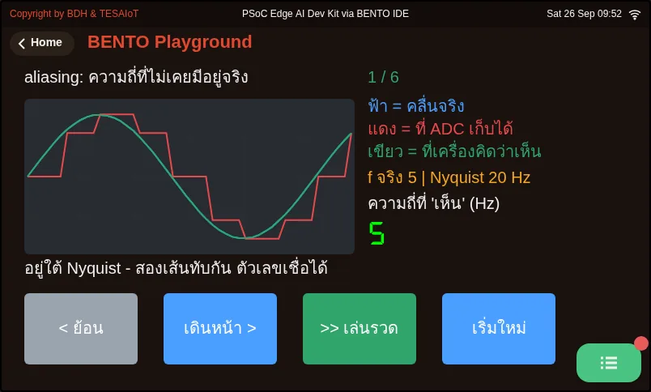

# Lesson 3.4 — Sampling right: Nyquist, aliasing and the ring buffer

> Module 3 — Sensor Visualization on HMI · Slides: [slides.md](slides.md) · [Module overview](../README.md) · [Course page](../../README.md)

Understand that an on-screen chart is the samples you chose joined by straight lines, that sampling too slowly produces a convincing fake wave (aliasing), that ui.Chart is a 50-slot ring buffer that only takes integers, and why a chart alone on the screen draws the slowest.

## Objectives

By the end of this lesson you will be able to:

1. Compute the Nyquist limit and the alias frequency correctly (a 200 ms loop gives fs 5 Hz and shows at most 2.5 Hz; shaking at 6 Hz shows |6 − 5| = 1 Hz; in 03_aliasing_nyquist.py a 30 Hz wave sampled at 40 Hz shows as 10 Hz) and explain why aliasing cannot be filtered out afterwards
2. Feed float values from motion() into ui.Chart through int() correctly, state that int() truncates rather than rounds (0.9 and −0.9 both become 0), and choose a multiplier and Y range for the resolution you need, such as ×100 with ±2000 for 0.01 m/s²
3. Compute the chart's time window from its slot count and loop period (50 × 0.2 s = 10 s) and name the two ways to see further back, a longer loop period or more points, and which one is cheaper
4. Explain why a loop with only set_next() draws about 40 times slower than one that also calls .text() (80 commands per second on the normal timer versus 3,200 in fast mode), and fix it by sending the same .text() message every loop

## Before you start

Review lessons 3.1–3.3: we read `sensors.bmi270.motion()` and converted it into an angle, put on screen with `ui.Bar` on a `ui.Scale` and `ui.Seg7`, which answers well "what is it now".
Also review quantization from lessons 2.7–2.9, because today we create it ourselves when feeding a chart.
Lessons 3.4–3.6 end with the three-axis acceleration chart lab in lesson 3.6; this lesson lays the ground for how far that chart can be trusted.

- **Equipment:** an Eva Kit or TESAIoT Dev Kit board with the BENTO MicroPython firmware installed, or the BENTO Emulator in [BENTO IDE](https://ide.tesaiot.dev/)
- **Before this:** [Lesson 3.3 — Hands-on: the digital level](../l03-digital-level-lab/README.md)

## See it work first

Open the Sensor Dashboard menu on the board — the running three-axis accel chart there has been there since the first lesson. Try three things in order:
lying still, the Z line floats higher than the others · shaking gently, the ripple shifts left · tilting and holding, the line lifts and settles at a new level.
In this set of lessons we build a page like this ourselves. Lessons 3.1–3.3 measured "how many degrees is it tilted right now"; this set keeps "what happened over the last ten seconds".

## Concepts

**A number tells you what it is now; a chart tells you where it is heading.** The bar and Seg7 answer "how many degrees is it tilted right now" instantly,
but cannot answer at all whether it shook 5 seconds ago, whether the shaking got faster or calmer, or whether there was a brief spike. Data with a timestamp on each value, ordered by time, is called a **time series**. A computer cannot store a continuous signal;
it peeks at it periodically and records the value (sampling), with fs = 1/Ts. Our loop sleeps 200 ms, giving about 5 Hz, so an on-screen chart is not the real signal — it is the points we recorded, joined by straight lines.
What happened between two points, we have no way of knowing from this chart.

The Nyquist condition says that to see a wave at frequency f, you must sample faster than twice it (fs > 2f). At fs 5 Hz, we can see at most 2.5 Hz.
And our sample rate is not set by hardware — it comes from how fast the Python loop runs (T_loop = T_sleep + T_work). The heavier the work in the loop gets,
the sample rate silently drops, so you must measure the real loop period. A signal that is too fast does not disappear — it disguises itself as a slower wave, f_alias = |f − k·fs|.
Shake the board at about 6 Hz while sampling at 5 Hz, and the chart shows a slow 1 Hz wave that does not really exist — no error, no warning, and it looks entirely convincing.
The same reason a car wheel in a film seems to spin backwards, because the camera samples at 24 frames a second.

`ui.Chart` stores values as integers only. `chart.set_next(0, ax)` where ax is 9.78 raises `TypeError`; you must write `int(ax)`,
and `int()` truncates, it does not round — 0.9 and −0.9 both become 0. A chart with a ±20 range is therefore coarse, at steps of 1 m/s².
The real-world fix is to map the real value range onto the axis range first, for example `ui.Chart(..., min=-2000, max=2000)` with `set_next(0, int(ax * 100))`,
giving a resolution of 0.01 m/s² without touching the sensor at all. The numbers on the axis need not be true units, as long as you and the reader agree on what was multiplied.

`set_next()` does not "draw the chart". A Chart is a **ring buffer**: new values push in from the right, and the oldest value falls off the left with nobody keeping it.
The default is 50 slots per series, and one chart can have up to 4 series, so the time window is 50 × 0.2 s = 10 seconds.
If you want to see further back, there are two knobs: stretch the loop period, or add more points with `ch.prop(ui.PROP_CHART_POINTS, n)`, settable from 10–400
(firmware 2026-08-20 onward; earlier versions fix it at 50). But every added point is another message across the cores and more drawing time, so stretching the loop period is always cheaper.

Finally, the reason the chart is slow even though the loop is fast: Python runs on CM33, but CM55 does the drawing; `set_next()` only leaves a command in the IPC queue.
On the CM55 side, there are two timer speeds: the normal one, 200 ms, drains 16 commands at a time, giving 80 commands a second; fast mode, 5 ms, gives 3,200 commands a second.
Commands that wake fast mode are: creating a widget, `.text()`, `.pos()`, `.size()`, `.color()`, and collection commands like `.cell()`, `.add_row()`, `.prop()`.
Every `.value()`, `set_next()`, and `.show()`/`.hide()` do not wake it. A chart running alone on screen is exactly the slowest case.
Fast mode stays awake for 500 ms after the last command, so a 200 ms loop that calls `lbl_rec.text(rec_msg)` every round never falls out of fast mode.
Sending the same message repeatedly is fine, because the firmware does not redraw text that has not changed. Fast mode does not speed up the sensor or Python —
it only makes commands already sent draw onto the screen faster.

## Worked example

**03_aliasing_nyquist.py** (about 15 minutes) — this file pins the sample rate at 40 Hz (Nyquist 20 Hz), and steps only the real wave's frequency through
5, 18, 20, 30, 39 and 41 Hz.

- **Predict** before pressing forward: write in your learning log what frequency the device will "see" at each step, using |f − k·fs|
- **Run**, then press "forward >" one step at a time. On the first step, the blue line (the real wave) and green line (what the device thinks it sees) sit exactly on top of each other.
  The red line is what the ADC actually caught — touch both lines at every sample point. Past 20 Hz the two lines separate; compare the Seg7 number with your prediction
- **Explore** the 20 Hz step, sitting exactly on Nyquist — the rule is fs > 2f, not fs ≥ 2f; at exact equality, sampling could hit the zero-crossing every time and give a flat line.
  Then open serial to see the nine-row table the file prints: at every sample point, sin 30 Hz and sin 10 Hz have the same magnitude, differing only in sign.
  The information needed to tell the two waves apart was never recorded in the first place, so aliasing is not noise and cannot be filtered out afterward.
  The only fix is an anti-aliasing low-pass filter before the ADC, which on this board is C204 at the pot's wiper (fc about 637 Hz)
- **Modify** by adding your own frequency into `FREQS` and predicting the result before running

| File | What this file teaches |
|---|---|
| [examples/03_aliasing_nyquist.py](examples/03_aliasing_nyquist.py) | Sampling too slowly, and getting a frequency that never really existed |

The slides for this lesson also refer to a file that lives in another lesson:

- [shared/lvgl_ports/sec3_sensor_viz/eva/ex16_spectrum_analyzer.py](../../shared/lvgl_ports/sec3_sensor_viz/eva/ex16_spectrum_analyzer.py)

**Screens from the BENTO Emulator** for this lesson's examples (click a file name to open the code)

<figure><figcaption><a href="examples/03_aliasing_nyquist.py"><code>03_aliasing_nyquist.py</code></a> Sampling too slowly, and getting a frequency that never really existed</figcaption></figure>

## Check your understanding

The same questions are in [quiz.yaml](quiz.yaml) for automatic marking.

1. A loop reads accel every 200 ms (fs = 5 Hz), and you shake the board at about 6 times a second. What will the chart show? *(choose one · objective 1)*
   - A) A slow wave of about 1 Hz that does not really exist, with no error or warning at all
   - B) The correct 6 Hz wave, just with a coarser line than usual
   - C) A flat line, because a signal that is too fast simply disappears
   - D) An error saying the sample rate is not sufficient

   

Solution

   **A** — f_alias = |6 − 1×5| = 1 Hz. A signal faster than fs/2 does not disappear — it disguises itself as a slower wave, and it looks entirely convincing, which is more dangerous than simply being invisible.

   

2. Which statements about sampling and aliasing are correct? Choose every correct one. *(choose all that apply · objective 1)*
   - A) The rule is fs > 2f, not fs ≥ 2f; at exact equality, sampling could hit the zero-crossing every time and give a flat line
   - B) Heavier work in the loop makes our sample rate drop silently, because fs comes from the Python loop's speed, not from hardware
   - C) If aliasing occurs, adding dsp.EMA after reading can filter the fake wave out
   - D) The fix for aliasing is an anti-aliasing low-pass filter before the ADC, such as C204 at the pot's wiper on this board

   

Solution

   **A, B, D** — Aliasing is a real frequency folded down onto the range we care about, already at the moment of sampling. At every sample point, the fake wave and the real wave give information that cannot be told apart, so a filter applied after reading cannot help — you must filter before the ADC.

   

3. An acceleration chart is set to a ±20 range and fed int(ax), giving a coarse line at steps of 1 m/s². For 0.01 m/s² resolution, what should you do? *(choose one · objective 2)*
   - A) Create the chart with min=-2000, max=2000, and feed chart.set_next(0, int(ax * 100))
   - B) Feed chart.set_next(0, ax) directly, to keep the decimal
   - C) Feed chart.set_next(0, round(ax, 2))
   - D) Keep the ±20 range and feed int(ax * 100)

   

Solution

   **A** — Chart stores integers only; sending a float raises TypeError, and int() truncates. You must multiply the value and expand the axis range to match — if you multiply by 100 but keep the ±20 range, the line will run off the edge.

   

4. A chart uses the default 50 slots, and the loop runs every 200 ms. How many seconds back does the screen show, and which way to see further back is cheaper? *(choose one · objective 3)*
   - A) 10 seconds; stretching the loop period further apart is cheaper than adding more points
   - B) 10 seconds; adding points up to 400 with PROP_CHART_POINTS is always cheaper
   - C) 50 seconds; nothing extra needs to be done
   - D) Unlimited, because the chart keeps every value ever fed in

   

Solution

   **A** — T_window = 50 × 0.2 s = 10 s. Older values fall off the ring buffer. Adding points is possible (10–400 on firmware 2026-08-20 onward), but every point is another message across the cores and more drawing time.

   

5. Your loop has only three set_next() calls and led.value(), and the chart stutters as if it cannot keep up drawing. What is the correct fix? *(choose one · objective 4)*
   - A) Add lbl_rec.text(rec_msg) every round — sending the same message again is fine — to wake fast mode on the CM55 side's timer
   - B) Call led.value() more often, to wake the screen side
   - C) Reduce sleep_ms so the Python loop spins faster
   - D) Read the sensor faster, because the chart is waiting on sensor values

   

Solution

   **A** — set_next() and .value() do not wake fast mode, so the CM55 side only drains 80 commands a second. .text() wakes fast mode (3,200 a second) and holds it for 500 ms, so a 200 ms loop never falls out of it at all. Text that has not changed is not redrawn by the firmware.

   

## Going further

Lesson 3.5 works hands-on with `ui.Chart`'s multiple series and measures the loop's real period with `time.ticks_ms()` and `time.ticks_diff()`, to prove whether our loop really samples at 5 Hz as we think.

Next lesson: [Lesson 3.5 — ui.Chart: multi-series plots and the real loop period](../l05-realtime-chart/README.md)

## Reflect

- How fast is the signal in your own work, and is a 200 ms loop fast enough for it?
- If a chart shows a slow wave that looks plausible, how would you prove it is not a fake?
- If you had to see 30 seconds back, which knob would you turn, and what would it cost you?
