<style>
section { font-size: 24px; padding: 40px 52px; justify-content: flex-start; }
section h1 { font-size: 1.45em; line-height: 1.12; margin: 0 0 .22em; }
section h2 { font-size: 1.12em; margin: .15em 0; }
section h3 { font-size: 1.0em; margin: .12em 0; }
section p, section li { margin: .16em 0; line-height: 1.32; }
section img { max-width: 100%; height: auto; }
section svg { max-height: 330px; width: 100%; }
section table { font-size: .78em; }
section pre { font-size: .70em; line-height: 1.32; background:#0d1117; color:#e6edf3; border:1px solid #30363d; border-radius:8px; padding:12px 16px; box-shadow:0 2px 8px rgba(0,0,0,.25); }
section pre code { white-space: pre-wrap; background:transparent; color:inherit; } section pre .hljs-comment{color:#8b949e;font-style:italic} section pre .hljs-keyword,section pre .hljs-built_in,section pre .hljs-literal{color:#ff7b72} section pre .hljs-string{color:#a5d6ff} section pre .hljs-number{color:#79c0ff} section pre .hljs-title,section pre .hljs-title.function_,section pre .hljs-section{color:#d2a8ff} section pre .hljs-meta{color:#ffa657} section pre .hljs-attr,section pre .hljs-attribute,section pre .hljs-name{color:#7ee787}
section blockquote { margin: .25em 0; font-size: .92em; }
/* two images on a line (parity / 2x2 grids) stay side-by-side and small */
section p > img + img { margin-left: 10px; }
/* scroll-within-slide: dense slides scroll instead of clipping */
section { overflow-y: auto; overflow-x: hidden; }
section::-webkit-scrollbar { width: 11px; }
section::-webkit-scrollbar-thumb { background:#4a90d9; border-radius:6px; }
section::-webkit-scrollbar-track { background:rgba(0,0,0,.06); }
/* image drop-shadow + cover-slide readability (auto) */
section img{filter:drop-shadow(0 3px 12px rgba(0,0,0,.5))}
section iframe{border:0;border-radius:8px;box-shadow:0 2px 10px rgba(0,0,0,.3)}
/* พื้นสำรองของสไลด์ปก: ถ้า img/cover_sNN.svg โหลดไม่ขึ้น ธีมจะคืนพื้นขาว
   แล้วตัวอักษรสีขาวของปกจะหายไปทั้งแผ่น — ปักสีเข้มไว้ให้ภาพเป็นแค่ของประดับ */
section.cover{background-color:#0b1426}
section.cover *{color:#fff !important}
section.cover h1,section.cover h2,section.cover h3,section.cover p,section.cover li,section.cover strong,section.cover em,section.cover blockquote,section.cover div{text-shadow:0 2px 9px rgba(0,0,0,.92),0 0 3px rgba(0,0,0,.8)}
section.cover div[style*="background:#"],section.cover div[style*="background: #"]{background:rgba(10,14,20,.66) !important;border-color:rgba(120,200,255,.45) !important;max-width:62%}
section.cover blockquote{border-left:4px solid rgba(120,200,255,.6) !important;background:rgba(13,17,23,.55) !important;border-radius:6px;padding:.3em .6em}
section.cover h1,section.cover h2,section.cover h3,section.cover p,section.cover blockquote{max-width:60%}
section.cover div:not(:has(img)){max-width:62%}
section.cover img{filter:none}
</style>

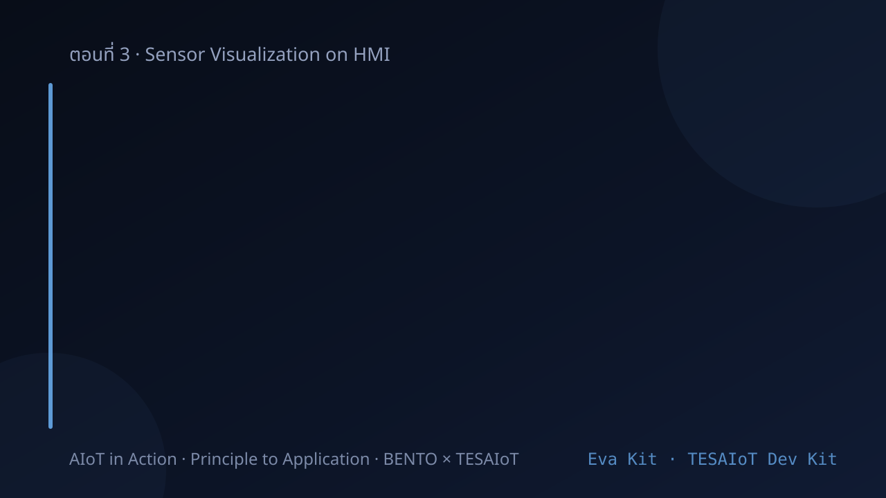

<!-- _class: cover -->

# บทเรียน 3.4 — สุ่มสัญญาณให้ถูก: Nyquist aliasing และ ring buffer

## ui.Chart หลาย Series: เห็นสัญญาณเป็นเส้นเวลา ไม่ใช่ตัวเลขกระพริบ

**โมดูล 3 — แสดงผลเซนเซอร์บน HMI**

> คาถาประจำบทเรียน: **ตัวเลขบอกว่าตอนนี้เท่าไร กราฟบอกว่ามันกำลังจะไปทางไหน**

---

## ดูของจริงก่อน — กราฟที่วิ่งอยู่บนบอร์ดตั้งแต่บทเรียนแรก


<svg viewBox="0 0 920 250" xmlns="http://www.w3.org/2000/svg">
  <rect x="20" y="16" width="363" height="218" rx="8" fill="#101a28" stroke="#4a90d9" stroke-width="2"/>
  <text x="42" y="44" font-size="18" font-weight="700" fill="#8fb8e0">Sensor Dashboard — accel 3 แกน</text>
  <line x1="44" y1="212" x2="360" y2="212" stroke="#37474f" stroke-width="2"/>
  <line x1="44" y1="58" x2="44" y2="212" stroke="#37474f" stroke-width="2"/>
  <polyline points="44,88 83,86 122,90 161,87 200,89 239,86 278,90 317,87 356,89" fill="none" stroke="#448AFF" stroke-width="3">
    <animate attributeName="points" dur="5s" repeatCount="indefinite" values="44,88 83,86 122,90 161,87 200,89 239,86 278,90 317,87 356,89;44,88 83,72 122,104 161,70 200,100 239,80 278,96 317,86 356,89;44,88 83,86 122,90 161,87 200,89 239,86 278,90 317,87 356,89"/>
  </polyline>
  <polyline points="44,168 83,166 122,170 161,167 200,169 239,166 278,170 317,167 356,169" fill="none" stroke="#00E676" stroke-width="3">
    <animate attributeName="points" dur="5s" begin="0.3s" repeatCount="indefinite" values="44,168 83,166 122,170 161,167 200,169 239,166 278,170 317,167 356,169;44,168 83,152 122,184 161,150 200,180 239,160 278,176 317,166 356,169;44,168 83,166 122,170 161,167 200,169 239,166 278,170 317,167 356,169"/>
  </polyline>
  <polyline points="44,190 83,188 122,192 161,189 200,191 239,188 278,192 317,189 356,191" fill="none" stroke="#FF5252" stroke-width="3"/>
  <text x="374" y="90" font-size="18" fill="#448AFF" text-anchor="end">Z</text>
  <text x="374" y="172" font-size="18" fill="#00E676" text-anchor="end">Y</text>
  <text x="374" y="194" font-size="18" fill="#FF5252" text-anchor="end">X</text>
  <text x="430" y="52" font-size="21" font-weight="700" fill="#37474f">ลองสามอย่างตามลำดับ</text>
  <circle cx="448" cy="92" r="12" fill="#448AFF"/>
  <text x="474" y="99" font-size="19" fill="#37474f">วางนิ่ง — เส้น Z ลอยสูงกว่าเพื่อน</text>
  <circle cx="448" cy="140" r="12" fill="#00E676"/>
  <text x="474" y="147" font-size="19" fill="#37474f">เขย่าเบา ๆ — รอยกระเพื่อมเลื่อนซ้าย</text>
  <circle cx="448" cy="188" r="12" fill="#FF5252"/>
  <text x="474" y="195" font-size="19" fill="#37474f">เอียงค้าง — เส้นยกตัวแล้วค้างระดับใหม่</text>
</svg>

วันนี้เราจะสร้างหน้านี้ขึ้นมาเอง ด้วยโค้ดไม่ถึงเจ็ดสิบบรรทัด

> บทเรียน 3.1–3.3 เราวัด "ตอนนี้เอียงกี่องศา" — ชุดบทเรียนนี้เราจะเก็บ "สิบวินาทีที่ผ่านมาเป็นยังไง"

---

## ทำไม · คืออะไร · ทำยังไง — แผนที่ของชุดบทเรียนนี้

<style scoped>
section table { font-size: .62em; }
section table td, section table th { padding: .16em .55em; }
</style>

| | คำถาม | คำตอบของชุดบทเรียนนี้ | อยู่ช่วงไหน |
|---|---|---|---|
| **Why** | ตัวเลขบนจอก็อ่านค่าได้อยู่แล้ว ทำไมต้องมีกราฟ | เพราะตัวเลขตอบได้คำถามเดียวคือ "ตอนนี้เท่าไร" ส่วนคำถามที่งานจริงถามคือ **"เมื่อกี้มันเป็นยังไง"** และ "มันกำลังจะไปทางไหน" · และการสุ่มไม่ทันไม่ส่งเสียงเตือน มันให้คำตอบที่ผิดและ**ดูน่าเชื่อถือ** ต้องรู้ล่วงหน้าว่าสัญญาณของเราเร็วแค่ไหน | ครึ่งแรก · Nyquist และ aliasing |
| **What** | มีอะไรให้ใช้บ้าง | `ui.Chart` กับเมธอดของ `Widget` **14 ตัวที่ต้องรู้** — สองตัวเป็นของกราฟล้วน ๆ · บวกตัวสร้าง widget **16 ตัว** ที่กางในตารางอ้างอิงของชุดบทเรียนนี้ (บัญชีเต็มของโมดูล `ui` อยู่ในบทเรียน 2.4) | สไลด์บัญชี 14 เมธอด + ตารางอ้างอิง widget |
| **How** | ประกอบยังไงให้ใช้งานได้จริง | สร้างกราฟหนึ่งใบสามเส้น ป้อนด้วย `int()` ทุกรอบ · ปุ่มเริ่ม/หยุดบันทึกที่เป็น **flag ในลูป** ไม่ใช่การหยุดลูป · ตารางเก็บค่าสุดขีดที่กราฟจำไม่ได้ · และนาฬิกาที่จับคาบลูปจริงมาโชว์ | สามไฟล์ตัวอย่าง + ไฟล์ฝึก |

**ปลายทางที่จับต้องได้** — กราฟสามสีของแกน X Y Z วิ่งตามการเขย่ามือ มีปุ่มหยุด-เดินต่อที่ทำงานจริง และบรรทัดที่บอกว่าลูปของเราหมุนอยู่ที่กี่มิลลิวินาที

> บทเรียน 3.1–3.3 เราวัด "ตอนนี้เอียงกี่องศา" · ชุดบทเรียนนี้เราเก็บ "สิบวินาทีที่ผ่านมาเป็นยังไง"

---

## เป้าหมายของชุดบทเรียนนี้

1. อธิบายได้ว่า **time series** คืออะไร และ **อัตราสุ่ม (sampling rate)** มีผลกับสิ่งที่เราเห็นอย่างไร
2. ใช้ `ui.Chart` กับ `.add_series()` และ `.set_next()` ได้ถูกต้อง รวมถึงรู้ว่าทำไมต้อง `int()`
3. เลือกช่วงแกน Y เองเป็น และรู้ว่าค่าที่เกินช่วงจะหายไปไหน
4. ทำปุ่มเริ่ม/หยุดบันทึกที่แยกกันด้วย **flag ในลูป** ที่ทำงานได้จริง ไม่ใช่ปุ่มที่กดแล้วเงียบ — ให้ไฟกับป้ายเป็นคนบอกสถานะ
5. วัด **คาบลูปจริง** ด้วย `time.ticks_ms()` / `time.ticks_diff()` แล้วเอาขึ้นจอ
6. รู้ว่าทำไม **ลูปที่มีแต่ `set_next()` ถึงวาดช้ากว่าลูปที่มี `.text()` อยู่ด้วยถึง 40 เท่า**

ปลายทางของวันนี้: จอบอร์ดมีกราฟสามสีวิ่งตามการเขย่า ตารางค่าสุดขีดสามแกน ปุ่มเริ่ม/หยุดบันทึก และตัวเลขบอกว่าลูปของเราหมุนจริงที่กี่มิลลิวินาที

> ชุดบทเรียนนี้เราไม่ได้แค่ทำให้กราฟขึ้น เราต้องรู้ด้วยว่ากราฟนั้น **เชื่อถือได้แค่ไหน**

---

## ปลายทางของชุดบทเรียนนี้ — กราฟที่วิ่งตามมือเรา

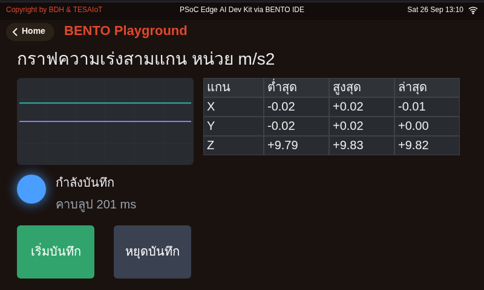

<div style="font-size:.58em;color:#78909c;margin-top:-.3em">หน้าจอจริงจากการรันโค้ดเฉลยบน BENTO Emulator ที่ 800x480 เท่าจอของ Eva Kit และ Dev Kit — ไม่ใช่ภาพวาด ไม่ใช่ mock-up และไม่ใช่ภาพถ่ายจากบอร์ด</div>

หน้าจอของเฉลยปัจจุบันแบ่งเป็นสามส่วน และสองส่วนแรกตอบคนละคำถามกัน

- **ซ้าย** `ui.Chart` เส้นสามสีของแกน X Y Z ตอบคำถามว่า "เมื่อกี้มันเป็นยังไง" (ตอนบอร์ดวางนิ่ง เส้นจึงราบ)
- **ขวา** `ui.Table` สี่คอลัมน์ แกน · ต่ำสุด · สูงสุด · ล่าสุด ตอบคำถามที่กราฟตอบไม่ได้ คือ **ค่าสุดขีดที่ผ่านไปแล้ว** เพราะกราฟเก็บได้เท่าจำนวนช่องของมัน (ปริยาย 50) จุดที่เก่ากว่านั้นถูกเขี่ยทิ้งไปแล้ว
- **ซ้ายล่าง ใต้กราฟ** `ui.Led` บอกว่ากำลังบันทึกอยู่หรือหยุดแล้ว บรรทัดคาบลูปจริง และ **ปุ่มเริ่มกับปุ่มหยุดที่แยกกันคนละปุ่ม** (สูง 88 px ตามขนาดเป้าสัมผัส)

> กราฟตอบ "เมื่อกี้มันเป็นยังไง" ส่วนตารางตอบ "ที่ผ่านมาแรงสุดเท่าไร" — คนละคำถาม จึงต้องมีทั้งคู่

---

## ทบทวนบทเรียน 3.1–3.3 — แถบกับตัวเลขตอบคำถามหนึ่งแบบ กราฟตอบอีกแบบ

<div style="display:flex;gap:16px;align-items:flex-start">
<div style="flex:1;min-width:0">

บทเรียน 3.1–3.3 เราอ่าน `sensors.bmi270.motion()` → `dsp.tilt(ax, ay, az)` → `(roll, pitch)` → `ui.Bar` บน `ui.Scale` สองแกน + `ui.Seg7`

สิ่งที่แถบกับ Seg7 ทำได้ดี: บอก **ค่าปัจจุบัน** ชัดเจน · สิ่งที่ทำไม่ได้เลย: บอกว่า **เมื่อกี้เป็นยังไง**

| คำถามที่ทีมอยากรู้ | Bar / Seg7 | Chart |
|---|---|---|
| ตอนนี้เอียงกี่องศา | ตอบได้ทันที | ต้องเพ่งที่ปลายเส้น |
| เมื่อ 5 วินาทีที่แล้วสั่นไหม | ตอบไม่ได้ | ตอบได้ |
| การสั่นถี่ขึ้นหรือเบาลง | ตอบไม่ได้ | เห็นเป็นรูปร่างทันที |
| มีค่ากระโดดผิดปกติแวบเดียวไหม | พลาดแน่นอน | เห็นเป็นหนามบนเส้น |

ภาพขวาคือสัญญาณ accel จริงตอนคนเดิน 10 ก้าว — **ยอดที่ทำเครื่องหมายสีแดงคือก้าว** ข้อมูลชุดนี้อ่านจากแถบหรือตัวเลขไม่ได้เลย ต้องเห็นเป็นเส้นเวลาเท่านั้น

</div>
<div style="flex:0 0 330px">

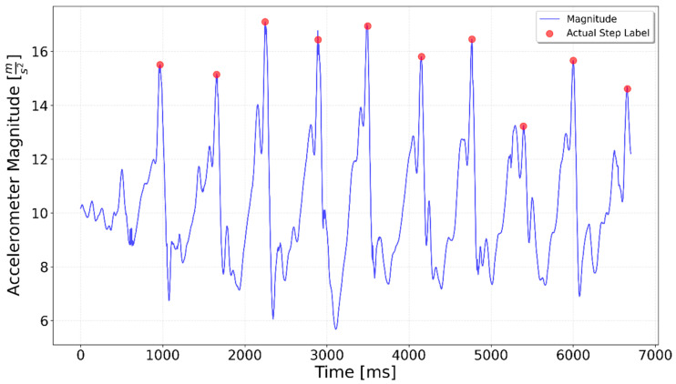

<div style="font-size:.62em;color:#78909c">ภาพ: Zieliński M. et al., Sensors 25(20):6358 (2025), CC BY 4.0</div>

</div>
</div>

> เลือก widget ตาม **คำถามที่ต้องการคำตอบ** ไม่ใช่ตามความสวย

---

## Time series คืออะไร — และ sample-and-hold ที่อยู่เบื้องหลัง

<div style="display:flex;gap:16px;align-items:flex-start">
<div style="flex:1;min-width:0">

Time series คือข้อมูลชุดหนึ่งที่ **แต่ละค่ามีเวลากำกับ และเรียงตามเวลา**

เซนเซอร์ให้สัญญาณต่อเนื่องซึ่งมีค่าอยู่ทุกเสี้ยววินาที แต่คอมพิวเตอร์เก็บค่าต่อเนื่องไม่ได้ มันทำได้อย่างเดียวคือ **แอบมองเป็นระยะ ๆ** แล้วจดค่าไว้ — เรียกว่า **การสุ่มตัวอย่าง (sampling)**

$$f_s=\frac{1}{T_s}$$

ไทย: อัตราสุ่มคือส่วนกลับของระยะห่างระหว่างการมองสองครั้ง
**ตัวเลขของลูปเรา:** $T_s = 200$ ms $\Rightarrow f_s = 5$ Hz

วงจร **sample-and-hold** (ภาพขวาบน) คือฮาร์ดแวร์ที่ทำเรื่องนี้จริง ๆ ในชิป: ปิดสวิตช์ชั่วขณะเพื่อชาร์จตัวเก็บประจุ แล้วเปิดสวิตช์ค้างค่านั้นไว้ให้ ADC อ่านทัน — เอาต์พุตจึงเป็นขั้นบันได ไม่ใช่เส้นโค้ง

กราฟบนจอไม่ใช่สัญญาณจริง มันคือ **จุดที่เราจดไว้ แล้วลากเส้นตรงเชื่อมกัน** ระหว่างจุดสองจุดเกิดอะไรขึ้นบ้าง เราไม่มีทางรู้จากกราฟนี้เลย

</div>
<div style="flex:0 0 330px">


<div style="font-size:.62em;color:#78909c">ภาพ: Giacomo Alessandroni, Wikimedia Commons, CC BY-SA 4.0</div>

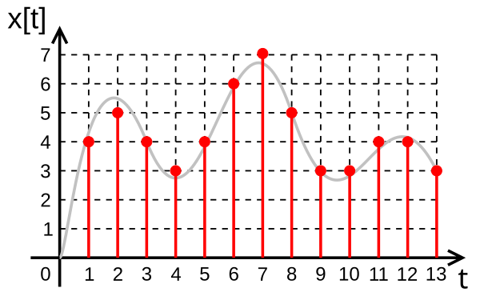

<div style="font-size:.62em;color:#78909c">ภาพ: Rbj / wdwd, Wikimedia Commons, สาธารณสมบัติ — ต่อเนื่อง → ไม่ต่อเนื่อง</div>

</div>
</div>

> กราฟทุกกราฟในโลก embedded คือ "ค่าที่เราเลือกจะมอง" ไม่ใช่ "ทุกอย่างที่เกิดขึ้น"

---

## สุ่มเร็วพอไหม — เงื่อนไข Nyquist

<div style="display:flex;gap:16px;align-items:flex-start">
<div style="flex:0 0 340px">

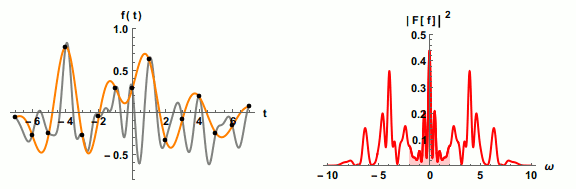

<div style="font-size:.62em;color:#78909c">ภาพ: Jacopo Bertolotti, Wikimedia Commons, CC0 1.0 — สุ่มถี่พอ สร้างสัญญาณเดิมกลับมาได้</div>

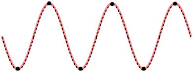 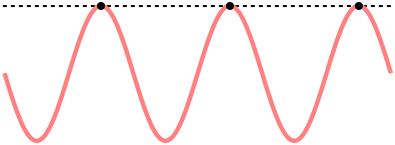

<div style="font-size:.60em;color:#78909c">ภาพ: Pluke, Wikimedia Commons, CC0 1.0 — ซ้าย 2 จุดต่อคาบเวลา (พอดีขีดจำกัด) · ขวา 1 จุดต่อคาบเวลา (ต่ำกว่า Nyquist)</div>

<iframe width="250" height="141" src="https://www.youtube.com/embed/nac9qyJT-sY" loading="lazy" title="An intuitive introduction to oversampling and noise shaping"></iframe>

<div style="font-size:.56em;color:#546e7a">Analog Snippets · 12:08 · EN — "สุ่มเร็วกว่าที่จำเป็น" ซื้ออะไรกลับมา</div>

</div>
<div style="flex:1;min-width:0">

ปี 1928 แฮร์รี ไนควิสต์ พิสูจน์ไว้ว่า ถ้าจะเก็บสัญญาณที่มีความถี่สูงสุด $f_{\max}$ ให้ครบ ต้องสุ่มเร็วกว่าสองเท่าของมัน

$$f_s > 2 f_{\max}\qquad\Longleftrightarrow\qquad f_{\max} < \frac{f_s}{2}$$

ไทย: จะเห็นคลื่นความถี่หนึ่งได้ ต้องสุ่มเร็วกว่าสองเท่าของคลื่นนั้น
**ตัวเลขของลูปเรา:** $f_s = 5$ Hz $\Rightarrow$ เห็นการสั่นได้ไม่เกิน **2.5 Hz**

การเขย่ามือของคนอยู่ราว 2-5 Hz เราจึงเห็นเฉพาะส่วนที่ช้ากว่า 2.5 Hz ส่วนที่เร็วกว่านั้นจะปลอมตัวเป็นคลื่นช้า (สไลด์ถัดไป) · **อัตราสุ่มของเราไม่ได้ตั้งด้วยฮาร์ดแวร์** แต่เกิดจากความเร็วลูป Python

$$f_s = \frac{1}{T_{\text{loop}}},\qquad T_{\text{loop}} = T_{\text{sleep}} + T_{\text{work}}$$

ไทย: งานในลูปหนักขึ้น อัตราสุ่มตกลงเงียบ ๆ — จึงต้องวัดคาบลูปจริง (ท่าที่ 5)

</div>
</div>

> สุ่มไม่ทันไม่ได้แปลว่า "มองไม่เห็น" มันแปลว่า "เห็นผิด" — สไลด์ถัดไปคือเหตุผล

---

## Aliasing — สัญญาณที่เร็วเกินไปไม่ได้หายไป มันปลอมตัว

<div style="display:flex;gap:14px;align-items:flex-start">
<div style="flex:0 0 300px">

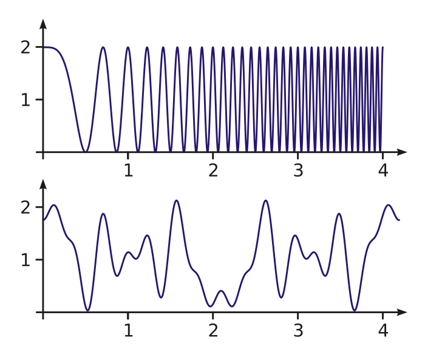

<div style="font-size:.62em;color:#78909c">ภาพ: Vierge Marie, Wikimedia Commons, สาธารณสมบัติ</div>

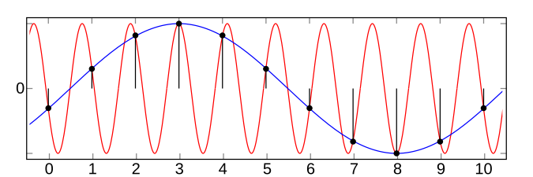

<div style="font-size:.62em;color:#78909c">ภาพ: Moxfyre, Wikimedia Commons, CC BY-SA 3.0 — สองความถี่ให้จุดสุ่มชุดเดียวกันเป๊ะ</div>

</div>
<div style="flex:1;min-width:0">

$$f_{\text{alias}} = \bigl|\,f - k f_s\,\bigr|,\qquad k = \text{จำนวนเต็มที่ทำให้ } f_{\text{alias}} \le \tfrac{f_s}{2}$$

ไทย: ถ้าสัญญาณเร็วเกินไป มันจะไม่หายไปเฉย ๆ แต่จะ **ปลอมตัว** มาเป็นคลื่นช้ากว่าความจริง ซึ่งอันตรายกว่าการมองไม่เห็น

**ตัวเลขจากบอร์ดนี้ — เดโมที่ทำได้ในบทเรียน:** เขย่าบอร์ดที่ราว 6 Hz ขณะลูปสุ่มที่ $f_s = 5$ Hz

$$f_{\text{alias}} = |6 - 1\times 5| = 1\ \text{Hz}$$

กราฟจะโชว์คลื่นช้า ๆ 1 Hz ที่ **ไม่มีอยู่จริง** ทั้งที่มือเราเขย่าอยู่ 6 ครั้งต่อวินาที

นี่คือเหตุผลเดียวกับที่ล้อรถในหนังบางทีดูเหมือนหมุนถอยหลัง — กล้องคือ ADC ที่สุ่มที่ 24 เฟรมต่อวินาที

**เจอตอนไหน** ค่าที่เร็วเกินอัตราสุ่มไม่มี error ไม่มีคำเตือน มันแค่ให้คำตอบที่ผิด และดูน่าเชื่อถือด้วย

</div>
<div style="flex:0 0 320px">

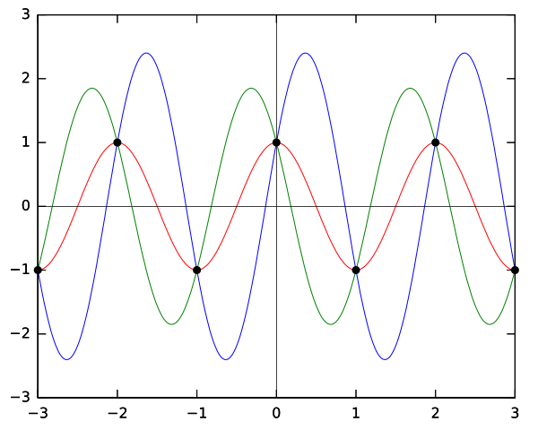

<div style="font-size:.62em;color:#78909c">ภาพ: Qef, Wikimedia Commons, สาธารณสมบัติ — ที่ความถี่วิกฤต: จุดสุ่มตกที่เดิมทุกคาบเวลา กราฟจึงกลายเป็นเส้นตรง</div>


<div style="font-size:.62em;color:#78909c">ภาพ: “Nyquist Shannon theorem sine visualisation animation” โดย Enormator — CC0 1.0 · Wikimedia Commons — สามภาพนิ่งเห็นแค่ผลลัพธ์ · ภาพนี้ค่อย ๆ ลดอัตราสุ่มลงให้ดู จังหวะที่คลื่นเริ่ม "ปลอมตัว" คือสิ่งที่ต้องเห็นตอนมันเคลื่อน</div>

</div>
</div>

---

## Aliasing บนบอร์ดจริง — สูตรจากสไลด์ก่อน เดินให้ดูทีละขั้น

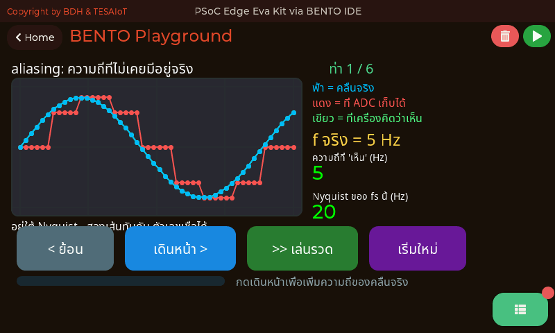

<div style="font-size:.6em;color:#78909c;margin-top:-.35em">หน้าจอจริงตอนรัน <a href="https://github.com/tesaiot/tesa-qualification-program/blob/main/courses/aiot-micropython/m03-sensor-hmi/l04-sampling/examples/03_aliasing_nyquist.py"><code>03_aliasing_nyquist.py</code></a> — สูตรในสไลด์ก่อนเดินให้ดูบนบอร์ดจริงทีละขั้น อัตราสุ่มถูกตรึงไว้ที่ 40 Hz ตลอด เปลี่ยนเฉพาะความถี่ของคลื่นจริง · ภาพนี้คือขั้นแรกซึ่งเป็นตัวคุม <b>f จริง = 5 Hz</b> ยังต่ำกว่า Nyquist ที่ 20 Hz อยู่มาก ความถี่ที่เครื่อง "เห็น" จึงเป็น 5 เท่ากัน และเส้นทับกันสนิท — ผีจะโผล่ก็ต่อเมื่อกดเดินหน้าจนความถี่จริงเกิน 20 Hz · ภาพหน้าจอจริงจากบอร์ด Eva Kit บันทึกโดยผู้สอน · ส่วน <a href="https://github.com/tesaiot/tesa-qualification-program/blob/main/courses/aiot-micropython/shared/lvgl_ports/sec3_sensor_viz/eva/ex16_spectrum_analyzer.py"><code>ex16_spectrum_analyzer.py</code></a> (ไม่มีภาพในสไลด์นี้) สร้างบน Emulator (โปรไฟล์ Eva): สเปกตรัมจาก <code>dsp.fft_mag</code> ของจริงใน C — sine 1 kHz ยอดเดี่ยวที่ bin 5 อ่าน Dominant 937 Hz เพราะความละเอียดต่อ bin คือ 48000/256 = 187.5 Hz (firmware 2026-08-20 ขึ้นไป)</div>

> การสุ่มไม่ทันคือความผิดพลาดที่ **ไม่ส่งเสียง** — ต้องรู้ล่วงหน้าว่าสัญญาณของเราเร็วแค่ไหน

---

## `int()` ก่อน `set_next` — และราคาที่ต้องจ่าย

<div style="display:flex;gap:16px;align-items:flex-start">
<div style="flex:1;min-width:0">

Chart เก็บค่าเป็น **จำนวนเต็ม** เท่านั้น แต่ `motion()` คืนทศนิยม เช่น `9.78`

```python
chart.set_next(0, int(ax))       # ถูก
chart.set_next(0, ax)            # TypeError: can't convert float to int
```

ราคาที่ต้องจ่ายคือ **`int()` ตัดทศนิยมทิ้ง ไม่ใช่ปัดเศษ** — 0.9 เป็น 0 และ −0.9 ก็เป็น 0 กราฟจึงหยาบเป็นขั้นละ 1 m/s² นี่คือ **quantization** ตัวเดียวกับบทเรียน 2.7–2.9 แค่คราวนี้เราเป็นคนสร้างเอง

**สูตร map ช่วงจริงลงช่วงแกน — วิธีแก้ที่ใช้ในงานจริง**

$$v_{\text{plot}} = \operatorname{round}\!\left(\frac{a - a_{\min}}{a_{\max} - a_{\min}}\times\bigl(y_{\max} - y_{\min}\bigr) + y_{\min}\right)$$

ไทย: แกน Y ของ Chart เป็นจำนวนเต็ม ต้อง map ช่วงค่าจริงลงช่วงแกนก่อน ไม่งั้นกราฟแบนหรือทะลุขอบ

```python
chart = ui.Chart(..., min=-2000, max=2000)   # หน่วยกลายเป็น 0.01 m/s²
chart.set_next(0, int(ax * 100))             # 9.78 -> 978
```

**ตัวเลขจากบอร์ดนี้:** ช่วง ±20 กับ `int()` ตรง ๆ ได้ความละเอียด 1 m/s² · คูณ 100 แล้วขยายช่วงเป็น ±2000 ได้ 0.01 m/s² — ละเอียดขึ้น 100 เท่าโดยไม่แตะเซนเซอร์เลย

</div>
<div style="flex:0 0 300px">

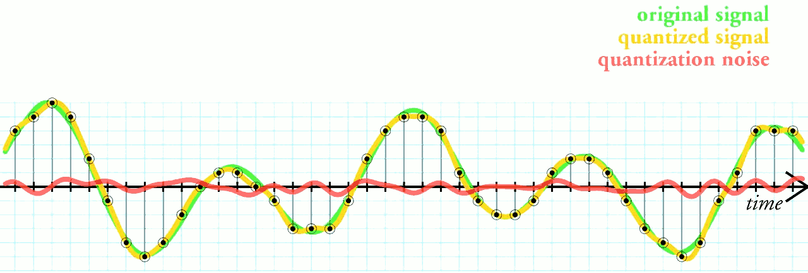

<div style="font-size:.58em;color:#78909c">ภาพ: Gregory Maxwell, Wikimedia Commons, CC BY 3.0 — ความคลาดเคลื่อนจากการปัดเข้าขั้น</div>

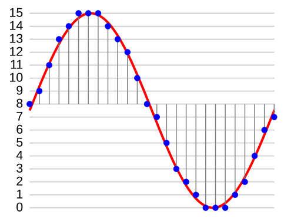

<div style="font-size:.60em;color:#78909c">ภาพ: Wikimedia Commons, CC BY-SA 3.0 — สุ่มตามเวลา + ปัดตามระดับ เป็นคนละเรื่องกัน</div>

<iframe width="250" height="141" src="https://www.youtube.com/embed/plq_Nmud5CM" loading="lazy" title="ADC Quantization and Resolution"></iframe>

<div style="font-size:.56em;color:#546e7a">Microchip Developer Help · ยาว: ยังไม่ยืนยัน · EN — quantization กับ resolution (คลิปเดียวกับบทเรียน 2.7–2.9)</div>

</div>
</div>

> ตัวเลขบนแกน Y ไม่จำเป็นต้องเป็นหน่วยจริง ขอแค่ **เรากับคนอ่านกราฟรู้ตรงกัน** ว่ามันคูณอะไรไว้

---

## Chart คือ ring buffer 50 ช่อง — `set_next()` ไม่ได้ "วาดกราฟ"

<svg viewBox="0 0 920 300" xmlns="http://www.w3.org/2000/svg">
  <defs><marker id="rb" markerWidth="10" markerHeight="8" refX="9" refY="4" orient="auto"><path d="M0,0 L10,4 L0,8 z" fill="#2e7d32"/></marker></defs>
  <text x="20" y="30" font-size="20" font-weight="700" fill="#37474f">ค่าใหม่ดันเข้าทางขวา ค่าเก่าที่สุดหล่นออกทางซ้าย</text>
  <g stroke="#2e7d32" stroke-width="2" fill="#e8f5e9">
    <rect x="60" y="48" width="44" height="44" rx="4"/><rect x="108" y="48" width="44" height="44" rx="4"/>
    <rect x="156" y="48" width="44" height="44" rx="4"/><rect x="204" y="48" width="44" height="44" rx="4"/>
    <rect x="252" y="48" width="44" height="44" rx="4"/><rect x="300" y="48" width="44" height="44" rx="4"/>
    <rect x="420" y="48" width="44" height="44" rx="4"/><rect x="468" y="48" width="44" height="44" rx="4"/>
    <rect x="516" y="48" width="44" height="44" rx="4"/><rect x="564" y="48" width="44" height="44" rx="4"/>
    <rect x="612" y="48" width="44" height="44" rx="4"/><rect x="660" y="48" width="44" height="44" rx="4"/>
  </g>
  <text x="382" y="78" text-anchor="middle" font-size="22" font-weight="700" fill="#2e7d32">…</text>
  <text x="120" y="122" text-anchor="middle" font-size="18" fill="#78909c">ช่องที่ 1</text>
  <text x="660" y="122" text-anchor="middle" font-size="18" fill="#78909c">ช่องที่ 50</text>
  <line x1="820" y1="70" x2="712" y2="70" stroke="#2e7d32" stroke-width="4" marker-end="url(#rb)"/>
  <text x="916" y="60" text-anchor="end" font-size="19" font-weight="700" fill="#2e7d32">set_next()</text>
  <text x="916" y="84" text-anchor="end" font-size="18" fill="#2e7d32">ดันเข้าท้ายแถว</text>
  <line x1="56" y1="70" x2="16" y2="70" stroke="#c62828" stroke-width="4"/>
  <text x="20" y="150" font-size="18" fill="#c62828">ค่าเก่าสุดหล่นหาย — ไม่มีใครเก็บให้</text>
  <circle cx="780" cy="70" r="10" fill="#ef6c00"><animateMotion path="M0,0 L-680,0" dur="4s" repeatCount="indefinite"/></circle>
  <polyline points="60,214 108,206 156,222 204,200 252,218 300,204 348,220 396,208 444,214 492,198 540,216 588,202 636,218 684,206" fill="none" stroke="#448AFF" stroke-width="3"/>
  <text x="20" y="192" font-size="19" font-weight="700" fill="#448AFF">ช่อง ↔ จุดบนกราฟ คือของสิ่งเดียวกัน</text>
  <rect x="720" y="176" width="184" height="106" rx="10" fill="#eceff1" stroke="#455a64" stroke-width="2"/>
  <text x="812" y="204" text-anchor="middle" font-size="19" font-weight="700" fill="#37474f">หน้าต่างเวลา</text>
  <text x="812" y="234" text-anchor="middle" font-size="20" font-weight="700" fill="#1565c0">50 × 200 ms</text>
  <text x="812" y="264" text-anchor="middle" font-size="22" font-weight="700" fill="#2e7d32">= 10 วินาที</text>
  <text x="20" y="286" font-size="19" fill="#455a64">สูงสุด 4 series ต่อกราฟหนึ่งใบ · แต่ละ series มีบัฟเฟอร์ 50 ช่องของตัวเอง</text>
</svg>

$$T_{\text{window}} = N_{\text{points}} \times T_{\text{loop}} = 50 \times 0.2\ \text{s} = 10\ \text{s}$$

ไทย: หน้าจอเรากว้าง 10 วินาที ของเก่ากว่านั้นถูกดันตกขอบไปแล้ว · อยากเห็นย้อนหลังนานขึ้นมีสองปุ่มให้หมุน — **ยืดคาบให้ห่างขึ้น** หรือ **เพิ่มจำนวนจุด** ด้วย `ch.prop(ui.PROP_CHART_POINTS, n)` ตั้งได้ 10-400 (firmware 2026-08-20 ขึ้นไป · รุ่นก่อนหน้า 50 ตายตัว) แต่ทุกจุดที่เพิ่มคือข้อความ IPC ที่ต้องส่งเพิ่มเวลาวาดทั้งเส้น คาบที่ห่างขึ้นจึงยังเป็นปุ่มที่ถูกกว่าเสมอ

> จอเรามี 50 ช่องตามค่าปริยาย — **คาบการสุ่มคือตัวกำหนดว่าเราเห็นอดีตย้อนหลังได้กี่วินาที**

---

## เข้าใจฮาร์ดแวร์ · ทำไมกราฟช้า ทั้งที่ลูปเราเร็ว

<div style="display:flex;gap:16px;align-items:flex-start">
<div style="flex:1;min-width:0">

โค้ด Python อยู่บน CM33 กราฟถูกวาดโดย CM55 `chart.set_next()` ไม่ได้วาดทันที มันแค่ **ฝากคำสั่งลงคิว IPC** แล้วกลับมาทำงานต่อ

ฝั่ง CM55 มีตัวจับเวลาคอยหยิบคำสั่งจากคิวมาทำ และมันมี **สองความเร็ว**

| โหมด | คาบของตัวจับเวลา | หยิบได้ต่อครั้ง | อัตราการระบายจริง |
|---|---|---|---|
| ปกติ (idle) | 200 ms | 16 คำสั่ง | **80 คำสั่ง/วินาที** |
| เร่ง (fast) | 5 ms | 16 คำสั่ง | **3,200 คำสั่ง/วินาที** |

$$\text{อัตราระบาย} = \frac{N_{\text{ต่อครั้ง}}}{T_{\text{timer}}} = \frac{16}{0.2} = 80 \quad\text{เทียบกับ}\quad \frac{16}{0.005} = 3{,}200$$

**และนี่คือกับดัก** — คำสั่งที่ **ปลุกโหมดเร่ง** มีอยู่ชุดหนึ่ง คำสั่งที่ **ไม่ปลุก** ก็มีอีกชุด

| ปลุกโหมดเร่ง | ไม่ปลุกโหมดเร่ง |
|---|---|
| สร้าง widget · `.text()` · `.pos()` · `.size()` · `.color()` | **`.value()`** · **`.set_next()`** · `.show()` / `.hide()` |

โหมดเร่งจะกลับเป็นปกติเองหลังเงียบไป **500 ms**

</div>
<div style="flex:0 0 290px">

<svg viewBox="0 0 330 300" xmlns="http://www.w3.org/2000/svg">
  <text x="165" y="24" text-anchor="middle" font-size="19" font-weight="700" fill="#c62828">ลูปที่มีแต่ set_next()</text>
  <rect x="16" y="38" width="298" height="52" rx="8" fill="#ffebee" stroke="#c62828" stroke-width="2"/>
  <text x="165" y="62" text-anchor="middle" font-size="18" fill="#8e1b1b">ตัวจับเวลาเดินที่ 200 ms</text>
  <text x="165" y="84" text-anchor="middle" font-size="19" font-weight="700" fill="#c62828">80 จุด/วินาที</text>
  <line x1="24" y1="112" x2="306" y2="112" stroke="#ef9a9a" stroke-width="4"/>
  <circle cx="60" cy="112" r="7" fill="#c62828"/><circle cx="156" cy="112" r="7" fill="#c62828"/><circle cx="252" cy="112" r="7" fill="#c62828"/>
  <circle cx="60" cy="112" r="8" fill="#ef6c00"><animateMotion path="M0,0 L192,0" dur="3.6s" repeatCount="indefinite"/></circle>
  <text x="165" y="140" text-anchor="middle" font-size="18" fill="#c62828">เต็มจอ 50 จุด ใช้ 0.63 วินาที</text>
  <text x="165" y="162" text-anchor="middle" font-size="18" font-weight="700" fill="#c62828">≈ 1.6 เฟรม/วินาที — กระตุก</text>
  <text x="165" y="200" text-anchor="middle" font-size="19" font-weight="700" fill="#2e7d32">ลูปที่มี .text() อยู่ด้วย</text>
  <rect x="16" y="214" width="298" height="52" rx="8" fill="#e8f5e9" stroke="#2e7d32" stroke-width="2"/>
  <text x="165" y="238" text-anchor="middle" font-size="18" fill="#1b5e20">ตัวจับเวลาเร่งเป็น 5 ms</text>
  <text x="165" y="260" text-anchor="middle" font-size="19" font-weight="700" fill="#2e7d32">3,200 จุด/วินาที</text>
  <line x1="24" y1="284" x2="306" y2="284" stroke="#a5d6a7" stroke-width="4"/>
  <circle cx="40" cy="284" r="8" fill="#00E676"><animateMotion path="M0,0 L250,0" dur="0.5s" repeatCount="indefinite"/></circle>
</svg>

</div>
</div>

<div style="font-size:.62em;color:#78909c">ที่มาของตัวเลขทั้งหมดบนสไลด์นี้: ซอร์สเฟิร์มแวร์ <code>BENTO-TESAIoT-libraries/claw/common/modules/ipc_ui/ipc_ui.c</code> — <code>IPC_UI_TIMER_MS=200</code>, <code>IPC_UI_FAST_TIMER_MS=5</code>, <code>IPC_UI_MAX_PER_TICK=16</code>, <code>IPC_UI_FAST_TIMEOUT_MS=500</code> และรายการ opcode ที่เรียก <code>ui_arm_fast_mode()</code></div>

> `set_next()` เป็นคำสั่งที่ **ไม่ปลุก** โหมดเร่ง — กราฟที่วิ่งอยู่ตัวเดียวบนจอ จึงเป็นกรณีที่ช้าที่สุดพอดี

---

## กฎปฏิบัติ: มี Label สถานะอยู่ในลูปเสมอ

<div style="display:flex;gap:16px;align-items:flex-start">
<div style="flex:1;min-width:0">

รู้กลไกแล้ว ทางแก้เหลือบรรทัดเดียว — **ให้ทุกลูปมีคำสั่งที่ปลุกโหมดเร่งอย่างน้อยหนึ่งคำสั่ง** และตัวที่เป็นธรรมชาติที่สุดคือป้ายสถานะที่เราอยากเห็นอยู่แล้ว

```python
rec_msg = "กำลังบันทึก"     # เปลี่ยนเฉพาะตอนกดปุ่ม
while True:
    ax, ay, az, gx, gy, gz = sensors.bmi270.motion()
    chart.set_next(0, int(ax))          # ไม่ปลุกโหมดเร่ง
    chart.set_next(s_ay, int(ay))       # ไม่ปลุก
    chart.set_next(s_az, int(az))       # ไม่ปลุก
    led_rec.value(1)                    # ไม่ปลุก - .value() ทุกตัวไม่ปลุก
    lbl_rec.text(rec_msg)               # ← ปลุก และค้างไว้อีก 500 ms
    ui.poll()
    time.sleep_ms(PERIOD_MS)
```

**ทำไมมันได้ผลกับลูป 200 ms ของเรา** — โหมดเร่งค้างอยู่ 500 ms หลังคำสั่งสุดท้าย ลูปเราหมุนทุก 200 ms ซึ่งสั้นกว่า 500 ms ตัวจับเวลาจึงไม่มีโอกาสกลับเป็นโหมดปกติเลยตลอดการรัน

**กฎนี้ชนกับกฎ "ตัวเลขเปลี่ยนไม่เกินวินาทีละครั้ง" พอดี** และทางออกอยู่ตรงกลาง: ส่ง `.text()` ทุกรอบ แต่ส่ง **ข้อความเดิม** เฉลยของชุดบทเรียนนี้จึงเก็บข้อความสถานะไว้ในตัวแปร `rec_msg` ซึ่งเปลี่ยนเฉพาะตอนกดปุ่ม แล้วส่งซ้ำทุกรอบ · เฟิร์มแวร์เทียบข้อความเก่ากับใหม่ก่อนวาด ถ้าเท่าเดิมมันไม่วาดซ้ำ เราจึงจ่ายแค่ค่าส่งข้ามคอร์ ไม่ได้จ่ายค่าวาด และไม่มีตัวเลขไหนบนจอวิ่งเร็วกว่าที่คนอ่านทัน

**คำสั่งที่ปลุกโหมดเร่งได้มีสี่กลุ่ม** คือสร้าง widget · `.text()` · `.pos()` / `.size()` / `.color()` · และคำสั่งของ collection อย่าง `.cell()` `.add_row()` `.prop()` — ส่วน `.value()` ทั้งหมด ไม่ว่าจะเป็นแถบ ไฟ หรือ `set_next()` ของกราฟ **ไม่ปลุก** (ตรวจจาก `ipc_ui.c` โดยตรง)

**อย่าตีความเกินกว่านี้** — โหมดเร่งไม่ได้ทำให้เซนเซอร์อ่านเร็วขึ้น และไม่ได้ทำให้ลูป Python เร็วขึ้น มันแค่ทำให้ **คำสั่งที่เราส่งไปแล้ว ถูกวาดออกจอเร็วขึ้น**

</div>
<div style="flex:0 0 290px">

<svg viewBox="0 0 330 280" xmlns="http://www.w3.org/2000/svg">
  <text x="165" y="24" text-anchor="middle" font-size="19" font-weight="700" fill="#37474f">โหมดเร่งค้าง 500 ms</text>
  <line x1="24" y1="90" x2="306" y2="90" stroke="#90a4ae" stroke-width="3"/>
  <text x="24" y="118" font-size="18" fill="#78909c">0</text>
  <text x="306" y="118" text-anchor="end" font-size="18" fill="#78909c">600 ms</text>
  <rect x="24" y="52" width="94" height="26" rx="4" fill="#c8e6c9" stroke="#2e7d32" stroke-width="2"/>
  <text x="71" y="72" text-anchor="middle" font-size="18" fill="#1b5e20">.text()</text>
  <rect x="118" y="52" width="94" height="26" rx="4" fill="#c8e6c9" stroke="#2e7d32" stroke-width="2"/>
  <text x="165" y="72" text-anchor="middle" font-size="18" fill="#1b5e20">.text()</text>
  <rect x="212" y="52" width="94" height="26" rx="4" fill="#c8e6c9" stroke="#2e7d32" stroke-width="2"/>
  <text x="259" y="72" text-anchor="middle" font-size="18" fill="#1b5e20">.text()</text>
  <text x="165" y="138" text-anchor="middle" font-size="18" fill="#2e7d32">ทุก 200 ms &lt; 500 ms</text>
  <text x="165" y="158" text-anchor="middle" font-size="18" fill="#2e7d32">→ ไม่มีวันหลุดโหมดเร่ง</text>
  <rect x="24" y="166" width="282" height="34" rx="6" fill="#e8f5e9" stroke="#2e7d32" stroke-width="2"/>
  <text x="165" y="189" text-anchor="middle" font-size="19" font-weight="700" fill="#2e7d32">กราฟลื่น ปุ่มตอบไว</text>
  <rect x="24" y="216" width="282" height="48" rx="6" fill="#fff8e1" stroke="#ef6c00" stroke-width="2"/>
  <text x="165" y="238" text-anchor="middle" font-size="18" fill="#e65100">ตัดบรรทัด .text() ออกเมื่อไร</text>
  <text x="165" y="258" text-anchor="middle" font-size="18" font-weight="700" fill="#c62828">กราฟกลับไปกระตุกทันที</text>
  <circle cx="71" cy="90" r="6" fill="#2e7d32"><animate attributeName="r" values="6;11;6" dur="1.2s" repeatCount="indefinite"/></circle>
  <circle cx="165" cy="90" r="6" fill="#2e7d32"><animate attributeName="r" values="6;11;6" dur="1.2s" begin="0.4s" repeatCount="indefinite"/></circle>
  <circle cx="259" cy="90" r="6" fill="#2e7d32"><animate attributeName="r" values="6;11;6" dur="1.2s" begin="0.8s" repeatCount="indefinite"/></circle>
</svg>

</div>
</div>

> **ลูปที่อัปเดตกราฟอย่างเดียวคือลูปที่ช้าที่สุด** — ใส่ป้ายสถานะไว้ในลูปเดียวกันเสมอ ได้ทั้งความลื่นและได้ตัวเลขให้คนอ่าน
