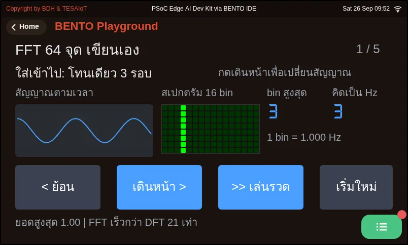

# Lesson 3.5 — ui.Chart: multi-series plots and the real loop period

> Module 3 — Sensor Visualization on HMI · Slides: [slides.md](slides.md) · [Module overview](../README.md) · [Course page](../../README.md)

Build a three-line ui.Chart correctly starting from the free series 0, choose the Y range and line colours yourself, make the stop button a flag while the loop keeps running, and measure the real loop period with ticks_diff() to know how far the chart can be trusted.

## Objectives

By the end of this lesson you will be able to:

1. Build a three-line ui.Chart correctly: use series 0 that comes from color= at creation, store the numbers add_series() returns (1, 2, 3) in variables, and state that set_next() with a wrong idx is silently dropped while a float raises TypeError
2. Choose a Y range that fits the board's acceleration (Z about 9.8 m/s² at rest, 15–20 when shaken hard, so −20 to +20) and pick line colours from the data palette instead of status colours, with reasons
3. Write separate start and stop buttons that control a running flag declared outside the loop, keeping ui.poll() called every loop outside if running, and let a ui.Led show the current state
4. Measure the real loop period with time.ticks_ms() and time.ticks_diff() and show it on screen, explain why you do not compute now − last_ms yourself, and read the value (about 205–215 ms is normal on the Eva Kit; at 300 ms the sample rate drops to 3.3 Hz)

## Before you start

Following on from lesson 3.4: you must remember that ui.Chart only takes integers, is a 50-slot ring buffer that a 200 ms loop shows 10 seconds back through,
and that a loop with only `set_next()` draws slowly, because it never wakes the screen side's fast mode.
Keep lesson 3.6's practice file `s07_accel_chart.py` open next to you; the "code walk-through" slides go through that structure pose by pose.

- **Equipment:** an Eva Kit or TESAIoT Dev Kit board with the BENTO MicroPython firmware installed, or the BENTO Emulator in [BENTO IDE](https://ide.tesaiot.dev/)
- **Before this:** [Lesson 3.4 — Sampling right: Nyquist, aliasing and the ring buffer](../l04-sampling/README.md)

## Concepts

**ui.Chart has four rules to remember.** First, at creation it already comes with series 0, coloured from `color=`, so the first line never needs `add_series`.
Add one for it by mistake and you get four lines, with series 0 empty forever. Second, `.add_series(colour)` returns 1, then 2, then 3, in the order called;
always store it in a variable, and never type the numbers 1 and 2 yourself — reorder the creation and a hand-typed number will point to the wrong line.
A fourth call raises `RuntimeError`, because the ceiling is 4 series per chart. Third, `min=` and `max=` are set once at creation — **there is no autoscale**.
Fourth, `set_next()` is fire-and-forget: sending an idx that does not exist raises no error at all, the data simply vanishes, unlike a float value, which raises `TypeError` on the Python side.

**The Y range and line colours are jobs nobody else will do for you.** A value past the range is clamped to the edge, which at a glance looks like a saturated signal.
On this board, lying still Z is about 9.8 m/s², shaking hard spikes to 15–20, and hitting the desk goes past 30. A ±2 range would keep Z stuck at the top edge forever; a ±100 range would let nothing fall off the edge but flatten the line.
±20 is the best balance, and clamping before sending (`max(-20, min(20, ax))`) makes us aware we are cutting data. The three lines use the data palette:
X blue `0x4A9EFF` · Y purple `0x8E7BFF` · Z sea-green `0x2FB6A8` — not red/green/blue, because this screen also has status lamps.
A red line meaning only "the X axis" would steal the meaning red already carries, "check this now". If a viewer has to ask which line is which axis, the chart is not finished.

**Stop the data, not the loop.** If the loop stops, `ui.poll()` stops with it, and the screen hides its widgets within about two seconds — the start button disappears too, becoming permanently stuck.
So the stop button only sets `running = False`, and only `set_next()` sits under `if running:`; `ui.poll()` and `sleep_ms` always sit outside.
`running = True` must be declared outside the loop — inside it, it is reset every round, and pressing stop never actually stops it, even though every line looks correct.
The start and stop buttons are two separate buttons, each with one job, because a single PAUSE button can only say what pressing it will do, never what state it is in right now.
The thing that reports state is `ui.Led` and the label beside it, and `.value(0)` deliberately dims the light rather than making it vanish.

**Measure the real loop period, because sleep_ms is not the whole truth.** T_loop = T_sleep + T_work — there is still time spent reading the sensor, sending across IPC, and updating a label.
The pattern is `now = time.ticks_ms()` · `dt = time.ticks_diff(now, last_ms)` · `last_ms = now`, with `last_ms` set before entering the loop.
You must use `ticks_diff`, because `ticks_ms()` wraps around to the start when it hits its ceiling; subtracting yourself right at that wrap gives a huge negative number.
On the Eva Kit, the value you should read is about 205–215 ms (fs about 4.8 Hz); on the Dev Kit it has not been measured — record your team's own.
If it spikes to 300 ms, the sample rate drops to 3.3 Hz with the code saying not a word — reduce how many labels are updated every round, but never all the way to zero, or fast mode falls out and the chart stutters instead.

The code walked through in the slides is the structure for lesson 3.6's lab, in five moves:

1. **Prepare** — read `motion()` once inside `try` and discard it before creating the chart, so the first, still-unsettled value does not sit in the chart buffer for 10 seconds, then `ui.clear()`.
   Remember the first `ui.*` call stops the sensor auto-task — we must read the sensor ourselves in the loop
2. **Chart and table** — the chart answers "what just happened", while `ui.Table` answers "what was the highest force over time", which the chart cannot remember. `value=` on Table is the font size in the cell,
   and a column narrower than the text wraps it — every row doubles in height, and the Z row disappears below the edge with no error
3. **Buttons and flag** — buttons 88 px tall keep `.id()` to compare with `ev.get('handle')`, and a button only ever sends event type `'clicked'`
4. **Read then feed** — send `int(ax)` into the chart, but send the full `ax` to `note()` to remember the extreme, which starts as `None`, meaning "never measured yet"
5. **A clock that watches itself** — the chart line moves every round, while the numbers in the table are written with `.cell()` at most once a second

Every point on the chart passes through five stages: BMI270 → Python on CM33 (`int()` + `set_next()`) → the 64-slot IPC queue, which drops silently when full
→ CM55 draining 80 or 3,200 commands a second into a 50-point buffer → the 4.3-inch screen. When the chart stutters or points go missing, suspect stages three and four before blaming the sensor.

## Worked example

**Warm up with a signal generator** (about 10 minutes, no sensor needed). Type the ten lines of code from the "warm up before touching the sensor" slide into BENTO IDE.
A signal whose answer we already know helps tell apart whether a glitch belongs to the chart or the sensor.

- **Predict** the waveform before switching the commented line one at a time: sine, square, sawtooth, then **run** and see whether it matches what you thought
- **Modify** by changing `0.15` to `0.6` — the sine will stop looking like a sine, because sampling can no longer keep up. That is aliasing, in ten lines
- **Explore** by removing the `lbl.text(...)` line and running again — the chart will visibly slow down, even though `sleep_ms` is unchanged

**02_fft64_two_tones.py** (about 10 minutes, extra material for the "aside" slide on the frequency domain). This file feeds five kinds of signal and shows both the time-domain chart
and a 16-bin spectrum on `ui.DotMatrix`. **Predict** before pressing forward how many bars a two-tone mix of 3 + 10 will produce, and how tall the second bar will be
(the file sets the second tone at half amplitude), then notice two traps: a bin is not Hz — you must multiply by fs/N yourself — and the upper half of the spectrum is a mirror of the lower half, so only plot up to N/2.
Real work has `dsp.fft_mag(data, n=256)` built in on firmware 2026-08-20 onward; this file is written by hand so you can see inside it.

| File | What this file teaches |
|---|---|
| [examples/02_fft64_two_tones.py](examples/02_fft64_two_tones.py) | A hand-written 64-point radix-2 FFT, from scratch |

The slides for this lesson also refer to files that live in other lessons:

- [m01-ui-application/l03-inside-the-box/examples/14_the_board_hears_you.py](../../m01-ui-application/l03-inside-the-box/examples/14_the_board_hears_you.py) — talk to the board and watch it move along
- [m01-ui-application/l03-inside-the-box/examples/15_one_number_many_faces.py](../../m01-ui-application/l03-inside-the-box/examples/15_one_number_many_faces.py) — a single number, and ten ways the screen can tell it
- [m02-ui-to-hardware/l06-touch-panel-lab/examples/07_find_move_hide_delete.py](../../m02-ui-to-hardware/l06-touch-panel-lab/examples/07_find_move_hide_delete.py) — managing a widget you already created
- [m02-ui-to-hardware/l06-touch-panel-lab/examples/08_dropdown_textarea.py](../../m02-ui-to-hardware/l06-touch-panel-lab/examples/08_dropdown_textarea.py) — three more types that take input, and the values you can actually ask back
- [m03-sensor-hmi/l06-accel-chart-lab/practice/s07_accel_chart.py](../l06-accel-chart-lab/practice/s07_accel_chart.py) — a live three-axis acceleration chart + a three-axis summary table (fill-in version)
- [m03-sensor-hmi/l06-accel-chart-lab/solution/s07_accel_chart.py](../l06-accel-chart-lab/solution/s07_accel_chart.py) — a live three-axis acceleration chart + a three-axis summary table
- [m03-sensor-hmi/l09-dashboard-lab/examples/05_door_open_switch.py](../l09-dashboard-lab/examples/05_door_open_switch.py) — a magnetic switch reporting whether a door is open or closed

**Screens from the BENTO Emulator** for this lesson's examples (click a file name to open the code)

<figure><figcaption><a href="examples/02_fft64_two_tones.py"><code>02_fft64_two_tones.py</code></a> A hand-written 64-point radix-2 FFT, from scratch</figcaption></figure>

## Check your understanding

The same questions are in [quiz.yaml](quiz.yaml) for automatic marking.

1. Which statements about ui.Chart are correct? Choose every correct one. *(choose all that apply · objective 1)*
   - A) At creation, Chart already has series 0 with colour from color=, so the first line never needs add_series
   - B) add_series() returns 1, 2, 3 in the order called; you must store it in a variable instead of typing the number yourself
   - C) With only three lines, calling set_next(3, v) makes that data simply vanish with no error
   - D) set_next(0, 9.78) is fine — Chart rounds it for you
   - E) Chart adjusts the Y range to the data automatically

   

Solution

   **A, B, C** — set_next() is fire-and-forget; a wrong idx is silently dropped, but a float value raises TypeError on the Python side. min=/max= are set once at creation, with no autoscale.

   

2. For a three-axis acceleration chart on this board (Z about 9.8 m/s² at rest, spiking 15–20 when shaken hard), what Y range should be set? *(choose one · objective 2)*
   - A) −20 to +20, to see both gravity and shaking
   - B) −2 to +2, to see small shaking as clearly as possible
   - C) −100 to +100, so nothing ever falls off the edge
   - D) No need to set it, since Chart scales itself

   

Solution

   **A** — A ±2 range would keep Z stuck at the top edge forever; a ±100 range would let nothing fall off the edge but flatten the line in the middle of the screen. Chart has no autoscale; a value past the range is clamped to the edge, looking like a saturated signal.

   

3. If `for ev in ui.poll()` is moved inside `if running:`, and you press the stop button, what happens? *(choose one · objective 3)*
   - A) Nobody calls ui.poll() any more; the screen hides its widgets within about two seconds, the start button disappears too, and it becomes permanently stuck with no way to recover
   - B) The chart stops as intended, and pressing start resumes it normally
   - C) The program immediately errors, saying poll must sit outside if
   - D) The chart keeps running, because set_next() does not depend on poll

   

Solution

   **A** — Stop the data, not the loop. running only controls set_next(); ui.poll() must be called every round regardless of whether it is stopped, because a loop that still turns and still takes events is the only thing keeping the screen alive.

   

4. Why measure the loop period with time.ticks_diff(now, last_ms) instead of now - last_ms? *(choose one · objective 4)*
   - A) ticks_ms() wraps back to the start when it hits its ceiling; subtracting yourself right at that moment gives a huge negative number, while ticks_diff knows about this wrap
   - B) ticks_diff returns units of seconds, while subtraction returns milliseconds
   - C) ticks_diff is faster than subtraction, because it is written in C
   - D) There is no difference — either way works

   

Solution

   **A** — The ticks_ms() counter has a ceiling and wraps around. Subtracting directly right at the wrap gives a huge negative number out of nowhere, while ticks_diff always returns the correct difference.

   

5. The loop commands sleep_ms(200), but the loop-period label on the Eva Kit reads 300 ms. What does that mean, and what should you do? *(choose one · objective 4)*
   - A) The work in the loop is heavier than thought; the sample rate has dropped to about 3.3 Hz — reduce how many labels update every round, but do not cut .text() out entirely
   - B) It's normal, because sleep_ms is already inaccurate
   - C) Remove every label from the loop; the chart will be fastest that way
   - D) The sensor is broken; sensors.init() must be called again

   

Solution

   **A** — T_loop = T_sleep + T_work. On the Eva Kit, normal is about 205–215 ms; hitting 300 ms means fs dropped from 5 Hz to 3.3 Hz with the code saying nothing. But cutting every .text() call would drop fast mode entirely and make the chart stutter instead.

   

## Going further

Lesson 3.6 is the lab: fill six blanks in `s07_accel_chart.py` following the five moves just walked through, then check against the MVP checkpoint for lessons 3.4–3.6.
While running, keep the BENTO Playground card open, fill in from top to bottom one blank at a time, and if the board was just reset, the first read on the Eva can wait up to 16 seconds.

Next lesson: [Lesson 3.6 — Hands-on: a three-axis acceleration chart](../l06-accel-chart-lab/README.md)

## Reflect

- If you press stop and then shake the board, but the chart keeps running, which line would you check first?
- What question does the on-screen loop-period number answer that reading the code alone cannot?
- In your own work, of the five things a library cannot decide for you (how often to sample, what the Y range is, what colour, whether it can be paused to view, whether the loop still keeps up), what would you choose?
