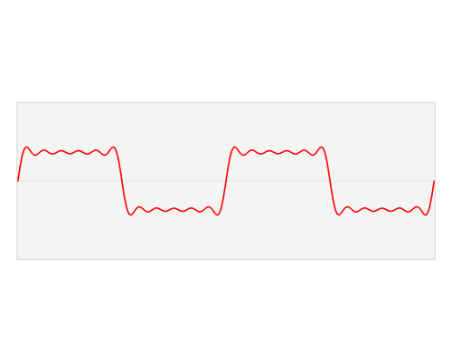
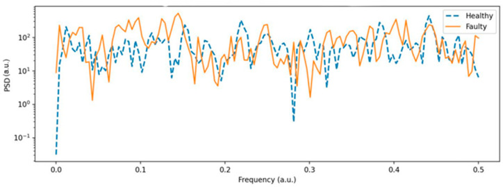

<style>
section { font-size: 24px; padding: 40px 52px; justify-content: flex-start; }
section h1 { font-size: 1.45em; line-height: 1.12; margin: 0 0 .22em; }
section h2 { font-size: 1.12em; margin: .15em 0; }
section h3 { font-size: 1.0em; margin: .12em 0; }
section p, section li { margin: .16em 0; line-height: 1.32; }
section img { max-width: 100%; height: auto; }
section svg { max-height: 330px; width: 100%; }
section table { font-size: .78em; }
section pre { font-size: .70em; line-height: 1.32; background:#0d1117; color:#e6edf3; border:1px solid #30363d; border-radius:8px; padding:12px 16px; box-shadow:0 2px 8px rgba(0,0,0,.25); }
section pre code { white-space: pre-wrap; background:transparent; color:inherit; } section pre .hljs-comment{color:#8b949e;font-style:italic} section pre .hljs-keyword,section pre .hljs-built_in,section pre .hljs-literal{color:#ff7b72} section pre .hljs-string{color:#a5d6ff} section pre .hljs-number{color:#79c0ff} section pre .hljs-title,section pre .hljs-title.function_,section pre .hljs-section{color:#d2a8ff} section pre .hljs-meta{color:#ffa657} section pre .hljs-attr,section pre .hljs-attribute,section pre .hljs-name{color:#7ee787}
section blockquote { margin: .25em 0; font-size: .92em; }
/* two images on a line (parity / 2x2 grids) stay side-by-side and small */
section p > img + img { margin-left: 10px; }
/* scroll-within-slide: dense slides scroll instead of clipping */
section { overflow-y: auto; overflow-x: hidden; }
section::-webkit-scrollbar { width: 11px; }
section::-webkit-scrollbar-thumb { background:#4a90d9; border-radius:6px; }
section::-webkit-scrollbar-track { background:rgba(0,0,0,.06); }
/* image drop-shadow + cover-slide readability (auto) */
section img{filter:drop-shadow(0 3px 12px rgba(0,0,0,.5))}
section iframe{border:0;border-radius:8px;box-shadow:0 2px 10px rgba(0,0,0,.3)}
/* พื้นสำรองของสไลด์ปก: ถ้า img/cover_sNN.svg โหลดไม่ขึ้น ธีมจะคืนพื้นขาว
   แล้วตัวอักษรสีขาวของปกจะหายไปทั้งแผ่น — ปักสีเข้มไว้ให้ภาพเป็นแค่ของประดับ */
section.cover{background-color:#0b1426}
section.cover *{color:#fff !important}
section.cover h1,section.cover h2,section.cover h3,section.cover p,section.cover li,section.cover strong,section.cover em,section.cover blockquote,section.cover div{text-shadow:0 2px 9px rgba(0,0,0,.92),0 0 3px rgba(0,0,0,.8)}
section.cover div[style*="background:#"],section.cover div[style*="background: #"]{background:rgba(10,14,20,.66) !important;border-color:rgba(120,200,255,.45) !important;max-width:62%}
section.cover blockquote{border-left:4px solid rgba(120,200,255,.6) !important;background:rgba(13,17,23,.55) !important;border-radius:6px;padding:.3em .6em}
section.cover h1,section.cover h2,section.cover h3,section.cover p,section.cover blockquote{max-width:60%}
section.cover div:not(:has(img)){max-width:62%}
section.cover img{filter:none}
</style>


<!-- _class: cover -->

# บทเรียน 3.5 — ui.Chart: กราฟหลาย series และคาบเวลาของลูปจริง

## กราฟ Real-time · ui.Chart หลาย Series: เห็นสัญญาณเป็นเส้นเวลา ไม่ใช่ตัวเลขกระพริบ

**โมดูล 3 — แสดงผลเซนเซอร์บน HMI**

> ต่อจากบทเรียน 3.4 — สุ่มสัญญาณให้ถูก: Nyquist aliasing และ ring buffer

---

## รู้จัก ui.Chart — สามคำสั่งที่ต้องจำ

<div style="display:flex;gap:16px;align-items:flex-start">
<div style="flex:1;min-width:0">

```python
chart = ui.Chart(x=24, y=52, w=292, h=144, min=-20, max=20, color=COL_AX)
s_ay = chart.add_series(COL_AY)      # คืนค่าเป็น "หมายเลข series"
s_az = chart.add_series(COL_AZ)
...
chart.set_next(0, int(ax))           # เติมจุดใหม่ให้ series 0
chart.set_next(s_ay, int(ay))        # เติมจุดใหม่ให้ series ที่เพิ่งเพิ่ม
```

**ข้อที่หนึ่ง** ตอนสร้าง `ui.Chart` มันสร้าง **series 0 ให้อัตโนมัติ** โดยใช้สีจาก `color=` เราจึงไม่ต้องเรียก `add_series` สำหรับเส้นแรก (`COL_AX` `COL_AY` `COL_AZ` คือ 0x4A9EFF 0x8E7BFF 0x2FB6A8 จากจานสีเส้นข้อมูล — บรรทัดจริงจาก [`s07_accel_chart.py`](https://github.com/tesaiot/tesa-qualification-program/blob/main/courses/aiot-micropython/m03-sensor-hmi/l06-accel-chart-lab/solution/s07_accel_chart.py))

**ข้อที่สอง** `.add_series(color)` **คืนค่าเป็นตัวเลข** ให้เก็บใส่ตัวแปรไว้เสมอ ถ้าไม่เก็บ ก็ไม่มีทางเติมข้อมูลให้เส้นนั้นได้อีกเลย ค่าที่คืนมาคือ **1 แล้ว 2 แล้ว 3** ตามลำดับที่เรียก เพราะ 0 ถูกจองไปแล้วตั้งแต่ตอนสร้าง เรียกครั้งที่สี่จะได้ `RuntimeError: ui: add_series failed (max 4)`

**ข้อที่สาม** `min=` กับ `max=` คือช่วงแกน Y ตั้งครั้งเดียวตอนสร้าง **ไม่มี autoscale**

**ข้อที่สี่** `set_next()` เป็นคำสั่งแบบยิงแล้วลืม ส่ง `idx` ที่ไม่มีอยู่จริง เช่น `set_next(3, ...)` ทั้งที่มีแค่สามเส้น จะไม่มี error อะไรทั้งสิ้น ข้อมูลนั้นหายไปเฉย ๆ — ต่างจากค่าที่เป็นทศนิยม ซึ่งได้ `TypeError` ตั้งแต่ฝั่ง Python

</div>
<div style="flex:0 0 340px">

<svg viewBox="0 0 340 270" xmlns="http://www.w3.org/2000/svg">
  <rect x="14" y="14" width="312" height="164" rx="8" fill="#101a28" stroke="#4a90d9" stroke-width="2"/>
  <text x="34" y="42" font-size="18" fill="#94a1bf">max = +20</text>
  <text x="34" y="164" font-size="18" fill="#94a1bf">min = -20</text>
  <line x1="30" y1="96" x2="310" y2="96" stroke="#37474f" stroke-width="2" stroke-dasharray="5 4"/>
  <polyline points="30,60 70,62 110,58 150,63 190,59 230,62 270,58 310,61" fill="none" stroke="#2FB6A8" stroke-width="3"/>
  <text x="316" y="66" text-anchor="end" font-size="17" fill="#2FB6A8">series 2</text>
  <polyline points="30,120 70,116 110,124 150,114 190,122 230,117 270,123 310,118" fill="none" stroke="#8E7BFF" stroke-width="3"/>
  <text x="316" y="140" text-anchor="end" font-size="17" fill="#8E7BFF">series 1</text>
  <polyline points="30,140 70,138 110,143 150,137 190,142 230,139 270,144 310,140" fill="none" stroke="#4A9EFF" stroke-width="3"/>
  <text x="120" y="158" font-size="17" fill="#4A9EFF">series 0 (มาฟรีตอนสร้าง)</text>
  <circle cx="310" cy="61" r="6" fill="#2FB6A8"><animate attributeName="r" values="6;11;6" dur="1.6s" repeatCount="indefinite"/></circle>
  <text x="170" y="208" text-anchor="middle" font-size="19" font-weight="700" fill="#c62828">เผลอ add_series ให้แกน X ด้วย</text>
  <text x="170" y="234" text-anchor="middle" font-size="18" fill="#8e1b1b">= มีสี่เส้น และ series 0 ว่างตลอดกาล</text>
  <text x="170" y="260" text-anchor="middle" font-size="18" fill="#455a64">เพดาน 4 series ต่อกราฟหนึ่งใบ</text>
</svg>

</div>
</div>

> `add_series` คืน "ชื่อเรียก" ของเส้น — ไม่เก็บไว้ เท่ากับสร้างเส้นที่เราส่งข้อมูลไปหาไม่ได้

---

## เลือกช่วงแกน Y และสีของเส้น — งานที่ไม่มีใครทำแทนเรา

<div style="display:flex;gap:16px;align-items:flex-start">
<div style="flex:1;min-width:0">

`ui.Chart` ไม่มี autoscale ค่าที่เกินช่วงจะถูกกดให้ติดขอบ ดูเผิน ๆ เหมือนสัญญาณอิ่มตัว ทั้งที่จริงคือเราตั้งกรอบไว้แคบไป

ความเร่งบนบอร์ดนี้: วางนิ่ง Z ราว **9.8 m/s²** · X, Y ราว 0 · เขย่าแรงพุ่ง 15-20 · กระแทกโต๊ะทะลุ 30

| ช่วงที่ตั้ง | ผลที่ได้ |
|---|---|
| −2 ถึง +2 | เห็นการสั่นเล็ก ๆ ชัด แต่แกน Z ติดขอบบนตลอด ใช้ไม่ได้ |
| **−20 ถึง +20** | เห็นทั้งแรงโน้มถ่วงและการเขย่า สมดุลที่สุดสำหรับชุดบทเรียนนี้ |
| −100 ถึง +100 | ไม่มีอะไรตกขอบ แต่เส้นแบนติดกลางจอ |

**สีคือภาษาที่คนอ่านกราฟใช้ร่วมกัน** — สามเส้นนี้หยิบจาก "จานสีเส้นข้อมูล" ของหลักสูตร ไม่ใช่ แดง/เขียว/น้ำเงิน ตามธรรมเนียมเดิม

| แกน | สีที่เห็นบนจอ | ค่าคงที่ในโค้ด |
|---|---|---|
| X | ฟ้า | `0x4A9EFF` — เส้นที่ 1 |
| Y | ม่วง | `0x8E7BFF` — เส้นที่ 2 |
| Z | เขียวน้ำทะเล | `0x2FB6A8` — เส้นที่ 3 |

> **ทำไมไม่ใช้ แดง/เขียว/น้ำเงิน** — จานสีชุดนี้ไม่มีสีสถานะปนอยู่เลยสักตัว โดยตั้งใจ หน้าจอนี้มีไฟเตือนอยู่ด้วย และ เกณฑ์หน้าจอของหลักสูตร ห้ามใช้สีของการแจ้งเตือนกับอย่างอื่นในหน้าจอเดียวกัน เส้น X สีแดงที่แปลว่า "แกน X" เฉย ๆ จะแย่งความหมายของแดงที่แปลว่า "ต้องรีบดู" ไปจนหมด

หน้า **Sensor Dashboard ของเฟิร์มแวร์** ที่เห็นในสไลด์แรกยังใช้ แดง/เขียว/น้ำเงิน อยู่ ของเราจึงไม่เหมือนของมัน — **ตั้งใจให้ไม่เหมือน** นี่คือตัวอย่างจริงของหน้าจอที่เขียนก่อนจะมีกฎข้อนี้

</div>
<div style="flex:0 0 320px">

<svg viewBox="0 0 320 290" xmlns="http://www.w3.org/2000/svg">
  <text x="160" y="24" text-anchor="middle" font-size="19" font-weight="700" fill="#c62828">ช่วงแคบไป — Z ติดขอบ</text>
  <rect x="16" y="36" width="288" height="76" rx="6" fill="#101a28" stroke="#c62828" stroke-width="2"/>
  <line x1="24" y1="46" x2="296" y2="46" stroke="#c62828" stroke-width="3"/>
  <text x="160" y="86" text-anchor="middle" font-size="18" fill="#94a1bf">อ่านไม่ได้ว่าจริง ๆ เท่าไร</text>
  <text x="160" y="142" text-anchor="middle" font-size="19" font-weight="700" fill="#2e7d32">±20 — สมดุล</text>
  <rect x="16" y="154" width="288" height="76" rx="6" fill="#101a28" stroke="#2e7d32" stroke-width="2"/>
  <polyline points="24,178 58,176 92,180 126,166 160,184 194,172 228,182 262,174 296,178" fill="none" stroke="#4A9EFF" stroke-width="3">
    <animate attributeName="points" dur="4s" repeatCount="indefinite" values="24,178 58,176 92,180 126,166 160,184 194,172 228,182 262,174 296,178;24,178 58,166 92,190 126,162 160,192 194,168 228,188 262,172 296,180;24,178 58,176 92,180 126,166 160,184 194,172 228,182 262,174 296,178"/>
  </polyline>
  <polyline points="24,216 58,214 92,218 126,213 160,217 194,214 228,218 262,215 296,217" fill="none" stroke="#8E7BFF" stroke-width="2.5"/>
  <text x="160" y="262" text-anchor="middle" font-size="18" fill="#455a64">ช่วงแคบ = ละเอียด แต่เสี่ยงตกขอบ</text>
  <text x="160" y="284" text-anchor="middle" font-size="18" fill="#455a64">ช่วงกว้าง = ปลอดภัย แต่ไม่ชัด</text>
</svg>

</div>
</div>

> clamp ก่อนส่ง (`max(-20, min(20, ax))`) ทำให้เรา **รู้ตัว** ว่ากำลังตัดข้อมูล · ถ้าคนดูต้องถามว่า "เส้นไหนคือแกนอะไร" กราฟยังไม่เสร็จ

---

## ปุ่มหยุดบันทึกคือ flag ไม่ใช่การหยุดโปรแกรม

<div style="display:flex;gap:16px;align-items:flex-start">
<div style="flex:1;min-width:0">

เวลาเห็นอะไรน่าสนใจวิ่งผ่านกราฟ เราอยากหยุดดู แต่ **ห้ามหยุดลูป** เด็ดขาด

เพราะถ้าลูปหยุด `ui.poll()` ก็หยุดตาม กฎเหล็กข้อแรกเล่นงานทันที — จอซ่อน widget ภายในราวสองวินาที ปุ่มเริ่มบันทึกที่จะกดก็หายไปด้วย กลายเป็นหยุดถาวรที่กู้ไม่ได้

```python
running = True
while True:
    for ev in ui.poll():             # ต้องเรียกทุกลูป ไม่ว่าจะหยุดหรือไม่
        h = ev.get('handle')
        if h == start_id:
            running = True           # ปุ่มเริ่ม มีหน้าที่เดียว
            led_rec.value(1)
        elif h == stop_id:
            running = False          # ปุ่มหยุด มีหน้าที่เดียว
            led_rec.value(0)
    if running:
        chart.set_next(0, int(ax))   # เติมข้อมูลเฉพาะตอนเดิน
    time.sleep_ms(200)               # หน่วงเท่าเดิมเสมอ
```


</div>
<div style="flex:0 0 340px">

<svg viewBox="0 0 340 270" xmlns="http://www.w3.org/2000/svg">
  <text x="170" y="24" text-anchor="middle" font-size="19" font-weight="700" fill="#2e7d32">หยุดข้อมูล — ลูปยังหมุน</text>
  <rect x="16" y="38" width="308" height="72" rx="8" fill="#e8f5e9" stroke="#2e7d32" stroke-width="2"/>
  <text x="170" y="64" text-anchor="middle" font-size="18" fill="#1b5e20">ui.poll() ยังถูกเรียกทุกรอบ</text>
  <text x="170" y="90" text-anchor="middle" font-size="18" fill="#1b5e20">กราฟนิ่ง · ปุ่มเริ่มบันทึกยังกดได้</text>
  <line x1="24" y1="128" x2="316" y2="128" stroke="#a5d6a7" stroke-width="4"/>
  <circle cx="40" cy="128" r="8" fill="#00E676"><animateMotion path="M0,0 L260,0" dur="2.6s" repeatCount="indefinite"/></circle>
  <text x="170" y="176" text-anchor="middle" font-size="19" font-weight="700" fill="#c62828">หยุดลูป — จอตายถาวร</text>
  <rect x="16" y="190" width="308" height="72" rx="8" fill="#ffebee" stroke="#c62828" stroke-width="2"/>
  <text x="170" y="216" text-anchor="middle" font-size="18" fill="#8e1b1b">ไม่มี ui.poll() → 2 วินาที</text>
  <text x="170" y="242" text-anchor="middle" font-size="18" font-weight="700" fill="#c62828">widget หายทั้งจอ กู้ไม่ได้</text>
</svg>

<div style="font-size:.66em;color:#455a64;margin-top:.3em"><b>ปุ่มเดียวที่สลับไปกลับ เขียนง่ายกว่า แต่ใช้งานแย่กว่า</b> เพราะปุ่มที่เขียนว่า PAUSE บอกได้แค่ว่ากดแล้วจะเกิดอะไร ไม่ได้บอกว่า <b>ตอนนี้อยู่สถานะไหน</b> คนที่เดินมาเห็นจอกลางคันต้องตีความเอาเอง และตีความผิดได้เสมอ โดยเฉพาะตอนที่ป้ายบนปุ่มยังไม่ทันอัปเดต · แผงควบคุมจริงจึงแยกเป็น <b>ปุ่มเริ่มกับปุ่มหยุดคนละใบ</b> แต่ละใบมีหน้าที่เดียว กดซ้ำได้โดยไม่มีผลข้างเคียง แล้วให้ <b><code>ui.Led</code> เป็นคนบอกสถานะปัจจุบัน</b> ไม่ใช่ให้ปุ่มบอก · กฎเดียวกันนี้ใช้กับปุ่มเปิด-ปิดของอุปกรณ์จริงทุกชนิด</div>

</div>
</div>

> **หยุดข้อมูล ไม่ใช่หยุดลูป** — ลูปที่ยังหมุนอยู่คือสิ่งเดียวที่ทำให้จอยังมีชีวิต

---

## วัดคาบลูปจริง — เพราะ sleep_ms ไม่ใช่ความจริงทั้งหมด

<div style="display:flex;gap:16px;align-items:flex-start">
<div style="flex:1;min-width:0">

เราสั่ง `time.sleep_ms(200)` แต่ลูปหนึ่งรอบไม่ได้ใช้เวลา 200 ms พอดี เพราะยังมีเวลาอ่านเซนเซอร์ ส่งข้าม IPC และอัปเดตป้ายอีกหลายใบ

$$T_{\text{loop}} = T_{\text{sleep}} + T_{\text{work}} \qquad f_s = \frac{1}{T_{\text{loop}}}$$

ไทย: คาบจริง = เวลาที่หน่วง + เวลาที่ทำงาน · **ตัวเลขที่ควรอ่านได้ (วัดบน Eva Kit · Dev Kit อ่าน IMU คนละเส้นทาง ตัวเลขอาจต่าง ให้จดของทีมเอง):** 205-215 ms ถ้าพุ่งถึง 300 ms แปลว่างานในลูปหนักกว่าที่คิด และ $f_s$ ตกจาก 5 Hz เหลือ 3.3 Hz โดยที่โค้ดไม่บอกเราสักคำ

```python
now = time.ticks_ms()                  # นาฬิกามิลลิวินาทีของระบบ
dt  = time.ticks_diff(now, last_ms)    # ผลต่างจากรอบที่แล้ว
last_ms = now
```

**ทำไมต้อง `ticks_diff` แทน `now - last_ms`** — `ticks_ms()` เป็นตัวนับที่ **วนกลับไปเริ่มใหม่** เมื่อชนเพดาน ถ้าลบเองในจังหวะที่มันวนพอดี จะได้ค่าติดลบมหาศาลแบบไม่มีปี่มีขลุ่ย ส่วน `ticks_diff` รู้เรื่องการวนนี้และคืนค่าที่ถูกต้องเสมอ

</div>
<div style="flex:0 0 330px">

<svg viewBox="0 0 330 260" xmlns="http://www.w3.org/2000/svg">
  <text x="165" y="24" text-anchor="middle" font-size="19" font-weight="700" fill="#37474f">หนึ่งรอบลูปประกอบด้วยอะไร</text>
  <rect x="20" y="40" width="66" height="40" rx="5" fill="#e3f2fd" stroke="#1565c0" stroke-width="2"/>
  <text x="53" y="65" text-anchor="middle" font-size="17" fill="#0d47a1">อ่าน</text>
  <rect x="88" y="40" width="66" height="40" rx="5" fill="#f3e5f5" stroke="#6a1b9a" stroke-width="2"/>
  <text x="121" y="65" text-anchor="middle" font-size="17" fill="#4a148c">IPC</text>
  <rect x="156" y="40" width="52" height="40" rx="5" fill="#fff3e0" stroke="#ef6c00" stroke-width="2"/>
  <text x="182" y="65" text-anchor="middle" font-size="17" fill="#e65100">ป้าย</text>
  <rect x="210" y="40" width="100" height="40" rx="5" fill="#eceff1" stroke="#607d8b" stroke-width="2"/>
  <text x="260" y="65" text-anchor="middle" font-size="17" fill="#37474f">sleep 200</text>
  <line x1="20" y1="98" x2="310" y2="98" stroke="#455a64" stroke-width="3"/>
  <text x="165" y="124" text-anchor="middle" font-size="19" font-weight="700" fill="#455a64">T_loop จริง ≈ 208 ms</text>
  <text x="165" y="164" text-anchor="middle" font-size="19" font-weight="700" fill="#c62828">ตัวนับวนกลับ</text>
  <line x1="20" y1="196" x2="230" y2="196" stroke="#c62828" stroke-width="3"/>
  <line x1="230" y1="182" x2="230" y2="210" stroke="#c62828" stroke-width="3"/>
  <line x1="230" y1="196" x2="310" y2="196" stroke="#c62828" stroke-width="3" stroke-dasharray="5 4"/>
  <circle cx="30" cy="196" r="7" fill="#c62828"><animateMotion path="M0,0 L198,0" dur="2.4s" repeatCount="indefinite"/></circle>
  <text x="165" y="234" text-anchor="middle" font-size="18" fill="#8e1b1b">ลบเองตรงนี้ = ได้ค่าติดลบมหาศาล</text>
  <text x="165" y="256" text-anchor="middle" font-size="18" font-weight="700" fill="#2e7d32">ticks_diff รู้เรื่องนี้ให้แล้ว</text>
</svg>

</div>
</div>

> โปรแกรมที่วัดตัวเองได้ ดีบักง่ายกว่าโปรแกรมที่ต้องเดาเสมอ

---

## ย้าย ย่อ ซ่อน — สี่เมธอดจากบทเรียน 2.4–2.6 ที่กราฟก็ใช้ได้เหมือนกัน

<div style="display:flex;gap:16px;align-items:flex-start">
<div style="flex:1;min-width:0">

บทเรียน 2.4–2.6 เราเจอสี่เมธอดนี้กับกล่องสี่เหลี่ยมใบเดียว วันนี้ขอย้ำอีกครั้ง เพราะ **Chart ก็รับคำสั่งชุดเดียวกันนี้** และคนส่วนใหญ่ไม่คิดถึงมันตอนออกแบบหน้าจอที่มีกราฟ

```python
w.pos(x, y)      # ย้ายไปพิกัดใหม่ - สองอาร์กิวเมนต์ ขาดไม่ได้
w.size(cw, ch)   # เปลี่ยนขนาด - สองอาร์กิวเมนต์เหมือนกัน
w.hide()         # ยังอยู่ แต่ไม่วาด
w.show()         # กลับมาวาด
```

ทั้งสี่ตัวใช้ได้กับ **widget ทุกชนิด** ไม่เว้นแม้แต่ Chart, Panel หรือ Compass เพราะมันอยู่ในตารางเมธอดชุดเดียวกันหมด

**สามข้อที่ต้องรู้ก่อนใช้**

1. **รับจำนวนเต็มเท่านั้น และต้องครบสองตัว** — `w.pos(10)` ได้ `TypeError` เรื่องจำนวนอาร์กิวเมนต์ ส่วน `w.pos(10.5, 20)` ได้ `TypeError: can't convert float to int` เหมือน `set_next()`
2. **ไม่มีตัวอ่านกลับ** — ไม่มี `.x()` ไม่มี `.y()` ไม่มีอะไรถามตำแหน่งปัจจุบันได้เลย ย้ายไปไหนแล้ว **เราต้องจำเอง** ในตัวแปรฝั่ง Python
3. **`.hide()` ไม่ใช่ `.delete()`** — ของที่ซ่อนยัง **กินช่องในตาราง 64 ตัวอยู่เต็ม ๆ** ส่วน `.delete()` คืนช่องให้ แต่ตัวแปร Python ยังชี้ไปที่ handle เดิมที่ตายแล้ว สั่งอะไรต่อก็เงียบ

</div>
<div style="flex:0 0 320px">

<svg viewBox="0 0 320 300" style="max-height:230px" xmlns="http://www.w3.org/2000/svg">
  <text x="160" y="24" text-anchor="middle" font-size="19" font-weight="700" fill="#37474f">ซ่อน กับ ลบ ไม่เหมือนกัน</text>
  <rect x="16" y="38" width="288" height="104" rx="8" fill="#e8f5e9" stroke="#2e7d32" stroke-width="2"/>
  <text x="160" y="64" text-anchor="middle" font-size="19" font-weight="700" fill="#1b5e20">.hide()</text>
  <text x="160" y="90" text-anchor="middle" font-size="18" fill="#1b5e20">หายจากจอ · ช่องยังถูกจอง</text>
  <text x="160" y="114" text-anchor="middle" font-size="18" fill="#1b5e20">.show() เรียกกลับมาได้ทันที</text>
  <text x="160" y="136" text-anchor="middle" font-size="18" font-weight="700" fill="#2e7d32">งบยังเท่าเดิม</text>
  <rect x="16" y="156" width="288" height="136" rx="8" fill="#ffebee" stroke="#c62828" stroke-width="2"/>
  <text x="160" y="182" text-anchor="middle" font-size="19" font-weight="700" fill="#8e1b1b">.delete()</text>
  <text x="160" y="208" text-anchor="middle" font-size="18" fill="#8e1b1b">ช่องถูกคืน งบว่างขึ้นหนึ่ง</text>
  <text x="160" y="232" text-anchor="middle" font-size="18" fill="#8e1b1b">ตัวแปรเดิมชี้ไปที่ของที่ตายแล้ว</text>
  <text x="160" y="258" text-anchor="middle" font-size="18" font-weight="700" fill="#c62828">สั่งต่อ = ไม่มีอะไรเกิดขึ้น</text>
  <text x="160" y="282" text-anchor="middle" font-size="17" fill="#8e1b1b">และไม่มี error ให้เห็นด้วย</text>
  <circle cx="296" cy="60" r="7" fill="#2e7d32"><animate attributeName="r" values="5;10;5" dur="1.8s" repeatCount="indefinite"/></circle>
</svg>

<div style="font-size:.62em;color:#455a64;margin-top:.3em"><b>เรื่องความเร็วซ่อนอยู่ตรงนี้ด้วย</b> — <code>.pos()</code> กับ <code>.size()</code> <b>ปลุก</b> โหมดเร่ง ส่วน <code>.show()</code>/<code>.hide()</code> <b>ไม่ปลุก</b> หน้าที่สลับการ์ดด้วย <code>.hide()</code> ล้วน ๆ จึงตอบช้าแบบเดียวกับกราฟที่มีแต่ <code>set_next()</code> วิธีแก้เดียวกัน: มีป้ายสถานะ "ตอนนี้อยู่หน้าไหน" อัปเดตไปด้วย · ของจริง: <a href="https://github.com/tesaiot/tesa-qualification-program/blob/main/courses/aiot-micropython/m02-ui-to-hardware/l06-touch-panel-lab/examples/07_find_move_hide_delete.py"><code>07_find_move_hide_delete.py</code></a> นับ <code>ui.list()</code> ให้ดูว่าซ่อนแล้วตัวเลขไม่ลด แต่ลบแล้วลด</div>

</div>
</div>

> ย้ายของที่มีอยู่แล้วถูกกว่าสร้างใหม่เสมอ — ทั้งเรื่องงบ 64 ช่อง และเรื่องเวลาที่ CM55 ต้องใช้วาด

---

## widget อื่นของ `ui` — ตารางอ้างอิง กับกับดักประจำตัวของแต่ละตัว

บทเรียน 1.1–3.3 เราใช้ไปแล้วห้าหกตัว วันนี้เพิ่ม Chart ส่วนที่เหลือมีอยู่จริงและเรียกได้ทันที ตารางนี้ไม่ต้องท่อง แต่ต้องรู้ว่ามีอะไรอยู่ จะได้ไม่ไปเขียนเองในสิ่งที่เฟิร์มแวร์มีให้แล้ว

| widget | สร้างด้วยอะไร | สั่งงานด้วยอะไร | กับดักที่ต้องรู้ |
|---|---|---|---|
| `Chart` | `min=` `max=` `color=` | `.add_series(สี)` → 1,2,3 · `.set_next(idx, ค่า)` | series 0 มาฟรี · เพดาน 4 เส้น · เส้นละ 50 จุดปริยาย ตั้ง 10-400 ผ่าน `.prop(ui.PROP_CHART_POINTS, n)` (fw 2026-08-20 ขึ้นไป) · `idx` เกินถูกทิ้งเงียบ |
| `DotMatrix` | **`cols=` `rows=`** (ไม่ใช่ `min`/`max` — สองตัวนั้นถูกเขียนทับ) | `.set_pixels(บัฟเฟอร์)` | 1 บิตต่อหนึ่งดอก MSB ก่อน **ไหลต่อกันข้ามไบต์** ไม่มีการเติมให้ครบไบต์ท้ายแถว · เพดาน 16×16 ดอก และ 126 ไบต์ต่อครั้ง เกินกว่านั้นถูกตัดเงียบ · สีดอกตายตัว `color=` ไม่มีผล |
| `Image` | `text=` คือ **ชื่อไอคอน** ไม่ใช่ข้อความ | `.icon(ชื่อ)` · `.set_image(RGB565)` | ชื่อผิดตอนสร้าง = `RuntimeError` แต่ชื่อผิดใน `.icon()` = **เงียบสนิท** · ผืนว่างถูกบีบไว้ที่ 48×48 |
| `Arc` | `min=` `max=` `value=` | `.value(n)` ตั้ง · `.value()` อ่านกลับได้จริง | เป็นของที่ **คนลากได้** ส่ง `value_changed` เข้า `poll()` ด้วย ถ้าไม่อยากให้ลาก ใช้ `Bar` |
| `Spinner` | มีแค่ `x` `y` `w` `h` | ไม่มีอะไรให้สั่ง นอกจาก `.show()` / `.hide()` | `min` `max` `value` `text` ถูกเมินหมด · ไม่ส่ง `w` มาจะกลายเป็น 80×80 |
| `Dropdown` | `text="แดง\nเขียว\nน้ำเงิน"` — ขึ้นบรรทัดใหม่คั่นตัวเลือก | `.value()` คืน **หมายเลขที่เลือก** · `poll()` ส่ง `value_changed` | `value=` คือ **ขนาดฟอนต์** ไม่ใช่ตัวที่เลือก · ตัวเลือกทั้งชุดรวมกันต้องไม่เกิน 126 ไบต์ |
| `Textarea` | `text=` ข้อความตั้งต้น · `value=` ขนาดฟอนต์ | `.text("...")` เขียนทับได้ | **อ่านกลับไม่ได้** `.text()` แบบไม่ใส่อาร์กิวเมนต์คืน `None` เสมอ และมันไม่ส่ง event เลยสักชนิด — เป็นช่องแสดงผล ไม่ใช่ช่องกรอก |
| `Compass` | `w=` คือ **เส้นผ่านศูนย์กลาง** `h` ถูกเมิน | `.value(องศา)` 0 คือทิศเหนือ | รับจำนวนเต็ม · `.value()` อ่านกลับได้ 0 เสมอ จำองศาไว้เองฝั่ง Python |
| `Panel` | `color`=พื้น `min`=สีขอบ `max`=รัศมี `value`=ความหนา | — | ไม่ได้เป็น "พ่อ" ของ widget ที่วางทับ ต้องสร้างก่อนเสมอ ไม่งั้นมันบังของอื่นหมด |
| `Seg7` | `w` `h` `color` | `.text("123")` | `.value(n)` ได้จำนวนเต็ม ถ้าต้องการทศนิยมต้อง `.text()` |

**ชื่อไอคอนที่มีให้ใช้ มีอยู่ 16 ชื่อพอดี** ผิดจากนี้ไม่ขึ้น: `heart` `star` `flag` `trophy` `skull` `arrow_up` `arrow_down` `arrow_left` `arrow_right` `check` `cross` `smiley` `car` `boat` `plane` `home`

**`.set_image()` มีจริงแต่เราจะไม่ใช้ในบทเรียน** — ภาพ 48×48 แบบ RGB565 คือ 4,608 ไบต์ ซึ่งต้องหั่นส่งข้าม IPC ถึง 38 ครั้ง โดยมีการหน่วง 200 ไมโครวินาทีคั่นทุกครั้ง ราคานั้นแพงเกินสำหรับของที่อัปเดตในลูป ใช้ `.icon()` แทนถ้าต้องการรูปสัญลักษณ์

**ของที่สองบอร์ดมีไม่เท่ากัน** — `ui.Sprite` และค่าคงที่ `SPR_*` ทั้งชุด **ไม่ถูกคอมไพล์เข้ามาในเฟิร์มแวร์ของ Eva Kit** (ธง `ENABLE_GAME_SPRITES` ปิด) เขียนถึงมันบน Eva จะได้ `AttributeError` · **บน TESAIoT Dev Kit ธงนี้เปิดอยู่** (`Makefile.micropython` ของโปรเจกต์นั้น ตั้งแต่ 2026-08-20) `ui.Sprite` จึงมีจริง — โค้ดที่ต้องรันได้ทั้งสองบอร์ดจึงห้ามพึ่งมัน หรือต้องตรวจ `hasattr(ui, "Sprite")` ก่อน · ส่วน `ui.tone()` กับ `ui.sfx()` **มีทั้งสองบอร์ด** เพราะมีชิปเสียงเหมือนกัน — [`05_door_open_switch.py`](https://github.com/tesaiot/tesa-qualification-program/blob/main/courses/aiot-micropython/m03-sensor-hmi/l09-dashboard-lab/examples/05_door_open_switch.py) ใช้ `ui.tone()` อยู่จริง

**ตัวไหนมีของให้ลองอยู่ที่ไหน** — `DotMatrix` + `.set_pixels()` ที่ [`02_fft64_two_tones.py`](https://github.com/tesaiot/tesa-qualification-program/blob/main/courses/aiot-micropython/m03-sensor-hmi/l05-realtime-chart/examples/02_fft64_two_tones.py) (สเปกตรัมเป็นตารางไฟ) และ [`14_the_board_hears_you.py`](https://github.com/tesaiot/tesa-qualification-program/blob/main/courses/aiot-micropython/m01-ui-application/l03-inside-the-box/examples/14_the_board_hears_you.py) · `Image` `.icon()` และ `Spinner` ที่ [`15_one_number_many_faces.py`](https://github.com/tesaiot/tesa-qualification-program/blob/main/courses/aiot-micropython/m01-ui-application/l03-inside-the-box/examples/15_one_number_many_faces.py) · `Dropdown` กับ `Textarea` ที่ [`08_dropdown_textarea.py`](https://github.com/tesaiot/tesa-qualification-program/blob/main/courses/aiot-micropython/m02-ui-to-hardware/l06-touch-panel-lab/examples/08_dropdown_textarea.py) · เหลือ `.set_image()` ตัวเดียวที่ไม่มีไฟล์ไหนใช้ ด้วยเหตุผลย่อหน้าบน

> รู้ว่ามีอะไรอยู่ในกล่องเครื่องมือ สำคัญกว่าท่องวิธีใช้ทุกตัว — เปิดตารางนี้ตอนคิดไม่ออกว่าจะแสดงค่านี้ด้วยอะไรดี

---

## เมธอดของ Widget ที่ชุดบทเรียนนี้ต้องรู้ — สิบสี่ตัว

<style scoped>
section table { font-size: .56em; }
section table td, section table th { padding: .12em .45em; }
section p { margin: .05em 0; }
</style>

สไลด์ "ย้าย ย่อ ซ่อน" หยิบมาสี่ตัว สไลด์นี้กางสิบสี่ชื่อที่กราฟกับการจัดหน้าต้องใช้ — บัญชีเต็มของเฟิร์มแวร์มีมากกว่านี้ (เช่น `.cell()` `.add_row()` `.col_width()` `.prop()` `.ticks()` `.digits()` ที่ตาราง ไม้บรรทัด และช่องตัวเลขใช้) ดูบัญชีทั้งโมดูลในบทเรียน 2.4

**เก้าตัวที่ใช้ได้กับ widget ทุกชนิด** รวมทั้ง `Chart` เพราะทุกชนิดใช้ตารางเมธอดชุดเดียวกัน

| เมธอด | ทำอะไร | ชุดบทเรียนนี้ใช้ตรงไหน |
|---|---|---|
| `.id()` | เลขประจำตัว 0-63 ที่ตรงกับ `ev['handle']` | **ใช้** — แยกว่าปุ่มเริ่มหรือปุ่มหยุดถูกกด |
| `.text()` / `.text("...")` | อ่านคืน `None` เสมอ / เขียนข้อความทับ | **ใช้ทุกรอบ** — ป้ายค่าและป้ายสถานะ · และเป็นตัวที่ทำให้กราฟลื่นขึ้นตามสไลด์ "ทำไมกราฟช้า" |
| `.value()` / `.value(n)` | อ่าน / สั่งค่า มีสิบเอ็ดชนิดที่ตอบได้จริง (บัญชีอยู่ในบทเรียน 2.5) | ไม่ใช้ในชุดบทเรียนนี้ · `Chart` ไม่ใช่หนึ่งในสิบเอ็ดชนิดนั้น |
| `.pos(x, y)` `.size(w, h)` | ย้าย / เปลี่ยนขนาดหลังสร้างแล้ว | ใช้ตอนจัดหน้า · สองตัวนี้ **ปลุกโหมดเร่ง** ส่วน show/hide ไม่ปลุก |
| `.color(0xRRGGBB)` | เปลี่ยนสี | ใช้เป็นช่องรายงานสถานะได้ ตาอ่านสีเร็วกว่าตัวอักษร |
| `.show()` / `.hide()` | ซ่อน-แสดงโดยไม่ลบ | ของที่ซ่อนอยู่ **ยังกินโควตา 64 เต็ม ๆ** |
| `.delete()` | ลบจริง คืนโควตาหนึ่งช่อง | ตัวแปร Python ยังชี้ไปที่ handle ที่ตายแล้ว สั่งต่อก็เงียบ |

**สองตัวที่เป็นของ `Chart` ล้วน ๆ — หัวใจของชุดบทเรียนนี้**

| เมธอด | ทำอะไร · กับดัก |
|---|---|
| `.add_series(สี)` | คืนหมายเลขเส้น 1, 2, 3 ตามลำดับที่เรียก · เพดานสี่เส้น เรียกเกินได้ `RuntimeError` |
| `.set_next(idx, ค่า)` | **ยิงแล้วลืม** · `idx` ผิดถูกทิ้งเงียบ · ค่าทศนิยมได้ `TypeError` ตั้งแต่ฝั่ง Python |

**สามตัวที่เป็นของฝั่งภาพ** — ชุดบทเรียนนี้ไม่ได้ใช้ในโครงหลัก

`.icon(ชื่อ)` เปลี่ยนไอคอนจาก 16 ชื่อที่มี · `.set_image(RGB565)` วางภาพ 48×48 · `.set_pixels(บัฟเฟอร์)` ของ `DotMatrix` — ตัวหลังโผล่จริงในตัวอย่างเสริม [`02_fft64_two_tones.py`](https://github.com/tesaiot/tesa-qualification-program/blob/main/courses/aiot-micropython/m03-sensor-hmi/l05-realtime-chart/examples/02_fft64_two_tones.py)

**ฝั่งตัวสร้างที่ชุดบทเรียนนี้กางให้ดูมีสิบหกตัว** ตารางอ้างอิงข้างบนกางไว้สิบชนิด อีกหกตัวคือของที่เราใช้มาตั้งแต่บทเรียน 1.1–3.3 อยู่แล้ว: `Label` `Button` `Switch` `Slider` `Checkbox` `Bar` — บัญชีเต็มของทั้งโมดูล `ui` อยู่ในบทเรียน 2.4–2.6

<!-- .set_next() ไม่เคยฟ้อง และ .value() ของ Chart ก็ไม่เคยตอบ — กราฟจึงเป็น widget ที่จอเป็นพยานคนเดียว ถ้าไม่มีป้ายตัวเลขคู่กันไว้ ก็ไม่มีทางรู้ว่าข้อมูลเข้าไปจริงไหม -->

---

## เกร็ด: กราฟเวลาบอกได้ไม่หมด — โดเมนความถี่บอกส่วนที่เหลือ

<div style="display:flex;gap:14px;align-items:flex-start">
<div style="flex:0 0 260px">



<div style="font-size:.60em;color:#78909c">ภาพ: Lucas Vieira, Wikimedia Commons, สาธารณสมบัติ — สัญญาณเดียวกัน มองจากสองโดเมน</div>

<iframe width="260" height="146" src="https://www.youtube.com/embed/yYHHuhDwhec" loading="lazy" title="Sigma-Delta ADC Explained: Oversampling, Noise Shaping and Decimation"></iframe>

<div style="font-size:.58em;color:#546e7a">Byte-Sized Learning · 5:01 · EN — decimation: สุ่มเร็วมากแล้วค่อยลดอัตราลงทีหลัง</div>

</div>
<div style="flex:1;min-width:0">

กราฟเวลาที่เราทำวันนี้ตอบได้ว่า "ค่าเปลี่ยนไปยังไงตามเวลา" แต่ตอบไม่ได้ว่า "การสั่นนี้ประกอบด้วยความถี่อะไรบ้าง"

ภาพขวาคือข้อมูลจริงจากงานเฝ้าระวังตลับลูกปืน แถวบนเป็นโดเมนเวลา แถวล่างเป็นสเปกตรัมของข้อมูล **ชุดเดียวกันเป๊ะ** — กราฟเวลาของตัวปกติกับตัวเสียดูคล้ายกันมาก แต่สเปกตรัมแยกออกทันที

นี่คือสาเหตุที่งาน predictive maintenance ในโรงงานทำ FFT ก่อนตัดสินใจ ไม่ได้ดูกราฟเวลาอย่างเดียว สเปกตรัมคือที่ที่ความต่างซ่อนอยู่ ทั้งที่กราฟเวลาบอกไม่ได้

**เชื่อมกับวันนี้:** ที่ $f_s = 5$ Hz เราทำ FFT ที่มีประโยชน์ไม่ได้ เพราะเห็นได้แค่ถึง 2.5 Hz ส่วนความสั่นของเครื่องจักรจริงอยู่หลักกิโลเฮิรตซ์ — อัตราแบบนั้นลูป Python เอื้อมไม่ถึง ต้องให้ **เฟิร์มแวร์เป็นคนสุ่มตัวอย่าง** แล้วส่งค่าที่ยุบแล้วขึ้นมาให้ เหมือนที่โมดูล `mic` ทำในบทเรียน 3.7–3.9

**โมดูล `dsp` มี FFT ในตัวแล้ว:** `dsp.fft_mag(ชุด, n=256)` คืนสเปกตรัม n/2 ช่อง จบใน C ราวหนึ่งมิลลิวินาที (เพิ่ม 2026-08-20 — firmware รุ่นก่อนหน้ายังไม่มี · `ulab` ยังไม่มีเช่นเดิม) — ข้างในของมันคือ radix-2 ที่สไลด์อ่านเสริมท้ายเด็คแกะให้ดูทั้งตัว

</div>
<div style="flex:0 0 250px">


<div style="font-size:.62em;color:#78909c">ภาพ: Kolok P. et al., Sensors 25(21):6610 (2025), CC BY 4.0 — โดเมนเวลา</div>



<div style="font-size:.62em;color:#78909c">ภาพ: Kolok P. et al., Sensors 25(21):6610 (2025), CC BY 4.0 — โดเมนความถี่ของข้อมูลชุดเดียวกัน</div>

</div>
</div>

---

## เรื่องที่เราให้ 70% ผู้เรียนเขียน 30%

<svg viewBox="0 0 920 170" xmlns="http://www.w3.org/2000/svg">
  <rect x="20" y="28" width="600" height="62" rx="8" fill="#e3f2fd" stroke="#1565c0" stroke-width="2"/>
  <text x="320" y="68" text-anchor="middle" font-size="26" font-weight="700" fill="#1565c0">70% — เฟิร์มแวร์ทำให้แล้ว</text>
  <rect x="632" y="28" width="268" height="62" rx="8" fill="#fff3e0" stroke="#ef6c00" stroke-width="2"/>
  <text x="766" y="68" text-anchor="middle" font-size="26" font-weight="700" fill="#ef6c00">30% — งานของเรา</text>
  <text x="320" y="128" text-anchor="middle" font-size="20" fill="#5472a3">ไดรเวอร์ BMI270 · วาดเส้น/กริด · ring buffer · IPC · นาฬิกา</text>
  <text x="766" y="128" text-anchor="middle" font-size="20" fill="#a1683a">สุ่มถี่แค่ไหน · แกน Y เท่าไร</text>
  <text x="766" y="154" text-anchor="middle" font-size="20" fill="#a1683a">สีอะไร · หยุดดูได้ไหม · ทันไหม</text>
</svg>

**สิ่งที่เฟิร์มแวร์ทำให้แล้ว (70%)**
ไดรเวอร์ BMI270 และการอ่านหกแกนจากการอ่านครั้งเดียว (Eva: snapshot ของคอร์จอ · Dev Kit: ล็อกบัสของ CM33) · การวาดกราฟ เส้น กริด และการเลื่อนบัฟเฟอร์บน CM55 · การส่งคำสั่งข้าม IPC พร้อมโหมดเร่ง · การรับสัมผัสจากจอแล้วแปลงเป็น event · นาฬิกาของระบบ

**สิ่งที่เป็นงานของเรา (30%)**
ตัดสินใจว่า **สุ่มถี่แค่ไหน** · **ช่วงแกน Y เท่าไร** · **เส้นไหนสีอะไร** · **ให้ผู้ใช้หยุดดูได้ไหม** · และ **จะรู้ได้ยังไงว่าลูปเรายังทันจริง**

ห้าข้อนี้ไม่มีใน API เล่มไหน มันคือการออกแบบระบบวัด ซึ่งเป็นงานของวิศวกร ไม่ใช่งานของไลบรารี

> ไลบรารีวาดเส้นให้เราได้ แต่ตัดสินใจแทนเราไม่ได้สักข้อ

---

## อุ่นเครื่องก่อนจับเซนเซอร์ — เครื่องกำเนิดสัญญาณ

<div style="display:flex;gap:16px;align-items:flex-start">
<div style="flex:1;min-width:0">

ก่อนต่อเซนเซอร์จริง ลองป้อนสัญญาณที่เรารู้คำตอบล่วงหน้าเข้ากราฟดูก่อน วิธีนี้แยกได้ชัดว่า ถ้ากราฟเพี้ยน มันเพี้ยนที่กราฟหรือเพี้ยนที่เซนเซอร์

```python
import ui, time, math
ui.screen()
ch = ui.Chart(x=40, y=60, w=700, h=250, min=-100, max=100, color=0x4A9EFF)
lbl = ui.Label("i = 0", x=40, y=330)          # ปลุกโหมดเร่งทุกรอบ

for i in range(200):
    val = int(90 * math.sin(i * 0.15))               # ไซน์
    # val = 80 if (i // 8) % 2 == 0 else -80         # สี่เหลี่ยม
    # val = (i % 20) * 9 - 90                        # ฟันเลื่อย
    ch.set_next(0, val)
    lbl.text("i = {}".format(i))
    ui.poll()
    time.sleep_ms(100)
```

ลองสลับบรรทัดที่คอมเมนต์ไว้ทีละแบบ แล้วดูว่ารูปคลื่นบนจอตรงกับที่คิดไหม จากนั้นเปลี่ยน `0.15` เป็น `0.6` — ไซน์จะเริ่มดูไม่เหมือนไซน์ เพราะเราสุ่มไม่ทันมันแล้ว **นั่นคือ aliasing ในสิบบรรทัด**

สังเกตบรรทัด `lbl.text(...)` ที่เพิ่มเข้ามา — นั่นคือกฎจากสไลด์ก่อนหน้า ลองลบมันออกแล้วรันใหม่ กราฟจะเดินช้าลงอย่างเห็นได้ชัดทั้งที่ `sleep_ms` เท่าเดิม

</div>
<div style="flex:0 0 300px">

<svg viewBox="0 0 300 280" xmlns="http://www.w3.org/2000/svg">
  <text x="150" y="24" text-anchor="middle" font-size="19" font-weight="700" fill="#37474f">รูปคลื่นสามแบบ</text>
  <text x="20" y="52" font-size="18" fill="#4A9EFF">ไซน์</text>
  <path d="M20,80 Q45,52 70,80 T120,80 T170,80 T220,80 T270,80" fill="none" stroke="#4A9EFF" stroke-width="3"/>
  <text x="20" y="132" font-size="18" fill="#8E7BFF">สี่เหลี่ยม</text>
  <polyline points="20,180 20,148 70,148 70,180 120,180 120,148 170,148 170,180 220,180 220,148 270,148" fill="none" stroke="#8E7BFF" stroke-width="3"/>
  <text x="20" y="212" font-size="18" fill="#2FB6A8">ฟันเลื่อย</text>
  <polyline points="20,258 70,228 70,258 120,228 120,258 170,228 170,258 220,228 220,258 270,228" fill="none" stroke="#2FB6A8" stroke-width="3"/>
  <circle cx="20" cy="80" r="6" fill="#4A9EFF"><animateMotion path="M0,0 Q25,-28 50,0 T100,0 T150,0 T200,0 T250,0" dur="3s" repeatCount="indefinite"/></circle>
</svg>


<div style="font-size:.58em;color:#78909c">ภาพ: Russ Puskarcik, Wikimedia Commons, CC BY 3.0 — ADC ไล่หาค่าทีละบิต</div>

</div>
</div>

> ทดสอบด้วยสัญญาณที่เรารู้คำตอบก่อนเสมอ แล้วค่อยเอาของจริงเข้าไป

---

## แกะโค้ดจริง — ท่าที่ 1 รอให้เซนเซอร์พร้อม แล้วเคลียร์จอ

<div style="display:flex;gap:16px;align-items:flex-start">
<div style="flex:1;min-width:0">

```python
# --- ท่าที่ 1: เตรียมเซนเซอร์และหน้าจอให้พร้อม ---
# ไม่มี sensors.init() ทั้งสองบอร์ด (Eva: ได้ OSError / Dev Kit: ไม่จำเป็น)
try:
    sensors.bmi270.motion()          # อ่านทิ้งหนึ่งครั้ง ให้การรอไปเกิดตรงนี้
except OSError:
    print("อ่านเซนเซอร์รอบแรกยังไม่ได้ - ลองใหม่ในลูป")

ui.clear()
time.sleep_ms(200)
```

</div>
<div style="flex:0 0 340px">

<svg viewBox="0 0 340 240" xmlns="http://www.w3.org/2000/svg">
  <text x="170" y="26" text-anchor="middle" font-size="19" font-weight="700" fill="#37474f">ค่าขยะอยู่บนกราฟนาน 10 วินาที</text>
  <rect x="16" y="44" width="308" height="106" rx="8" fill="#101a28" stroke="#4a90d9" stroke-width="2"/>
  <polyline points="26,72 46,132 66,66 86,126 106,110 126,108 146,112 166,106 186,110 206,108 226,112 246,106 266,110 286,108 310,110" fill="none" stroke="#448AFF" stroke-width="3"/>
  <rect x="22" y="56" width="70" height="88" rx="4" fill="none" stroke="#c62828" stroke-width="3" stroke-dasharray="5 4"/>
  <text x="57" y="170" text-anchor="middle" font-size="18" font-weight="700" fill="#c62828">ค่าขยะ</text>
  <text x="210" y="170" text-anchor="middle" font-size="18" fill="#2e7d32">ค่าที่เชื่อถือได้</text>
  <line x1="26" y1="190" x2="310" y2="190" stroke="#90a4ae" stroke-width="3"/>
  <circle cx="300" cy="190" r="7" fill="#c62828"><animateMotion path="M0,0 L-270,0" dur="5s" repeatCount="indefinite"/></circle>
  <text x="170" y="222" text-anchor="middle" font-size="18" fill="#455a64">อ่านทิ้งหนึ่งครั้งก่อนเข้าลูป ตัดปัญหานี้ทิ้งเลย</text>
</svg>

</div>
</div>

**ไม่ต้องเรียก `sensors.init()` ทั้งสองบอร์ด** — บน Eva Kit เรียกแล้วได้ `OSError` ทันที เพราะคอร์จอ (CM55) เป็นเจ้าของบัส I2C ตัวนั้น ค่าเซนเซอร์มาจากภาพสแกนที่ CM55 เก็บไว้ให้ · บน Dev Kit CM33 อ่าน IMU ตรงจาก I2C เอง และเฟิร์มแวร์ปลุกมันไว้ตั้งแต่บูต · ทั้งสองทางจึงเรียก `sensors.bmi270.motion()` ได้ตรง ๆ โค้ดชุดเดียวกันรันได้ทั้งคู่

**การอ่านครั้งแรกทำหน้าที่แทนการหน่วงเวลา** — หลังรีเซ็ต การอ่านครั้งแรกอาจต้องรอเซนเซอร์ตอบ (Eva วัดได้: CM55 เริ่มตอบที่ราว 13 วินาที การอ่านแรกรอได้ถึง 16 วินาที · Dev Kit ยังไม่ได้วัด) ครั้งต่อ ๆ ไปไม่เกิน 1 วินาที เราอ่านทิ้งหนึ่งครั้ง **ก่อนสร้างกราฟ** เพื่อไม่ให้ค่าชุดแรกที่ยังไม่นิ่งไปค้างในบัฟเฟอร์กราฟนาน 10 วินาที · `ui.clear()` ล้าง widget ของโปรแกรมก่อนหน้าออกให้หมด เริ่มจากสถานะที่รู้แน่

> จำกฎเหล็กข้อที่สี่: **การใช้ `ui.*` ครั้งแรกจะหยุด sensor auto-task** — เลือกใช้ `ui` เมื่อไร ก็ต้องรับหน้าที่อ่านเซนเซอร์เองในลูปเมื่อนั้น

---

## แกะโค้ดจริง — ท่าที่ 2 สร้างกราฟและเส้นทั้งสาม

<div style="display:flex;gap:16px;align-items:flex-start">
<div style="flex:1;min-width:0">

```python
# --- ท่าที่ 2: กราฟหนึ่งใบ สามเส้น และตารางสรุปข้าง ๆ ---
chart = ui.Chart(x=24, y=52, w=292, h=144, min=-20, max=20, color=COL_AX)
s_ay = chart.add_series(COL_AY)
s_az = chart.add_series(COL_AZ)
tbl = ui.Table(x=332, y=52, w=436, h=280, cols=4, value=16)
tbl.col_width(0, 100)          # กว้างพอสำหรับข้อความที่ยาวที่สุด
tbl.col_width(1, 108)
tbl.col_width(2, 108)
tbl.col_width(3, 108)
tbl.add_row("แกน", "ต่ำสุด", "สูงสุด", "ล่าสุด")
tbl.add_row("X", "-", "-", "-")
tbl.add_row("Y", "-", "-", "-")
tbl.add_row("Z", "-", "-", "-")
```

</div>
<div style="flex:0 0 330px">

<svg viewBox="0 0 330 250" xmlns="http://www.w3.org/2000/svg">
  <rect x="10" y="16" width="310" height="160" rx="6" fill="#0d1117" stroke="#30363d" stroke-width="2"/>
  <text x="165" y="40" text-anchor="middle" font-size="18" fill="#94a1bf">จอ Playground 792 × 398</text>
  <rect x="24" y="52" width="126" height="46" rx="4" fill="#101a28" stroke="#448AFF" stroke-width="2"/>
  <text x="87" y="72" text-anchor="middle" font-size="17" fill="#8fb8e0">Chart</text>
  <text x="87" y="90" text-anchor="middle" font-size="14" fill="#5f89bd">292 × 144</text>
  <rect x="24" y="104" width="126" height="64" rx="4" fill="#1b3a5c" stroke="#6cb2f5" stroke-width="2"/>
  <text x="87" y="128" text-anchor="middle" font-size="13" fill="#cfe4ff">ไฟ + คาบลูป</text>
  <text x="87" y="150" text-anchor="middle" font-size="13" fill="#cfe4ff">ปุ่มสองใบ สูง 88</text>
  <rect x="158" y="52" width="152" height="116" rx="4" fill="#101a28" stroke="#7ee787" stroke-width="2"/>
  <text x="234" y="104" text-anchor="middle" font-size="17" fill="#c8f7d0">Table</text>
  <text x="234" y="126" text-anchor="middle" font-size="15" fill="#7aa87e">436 × 280</text>
  <text x="165" y="206" text-anchor="middle" font-size="19" font-weight="700" fill="#c62828">อย่า add_series ให้แกน X</text>
  <text x="165" y="232" text-anchor="middle" font-size="18" fill="#8e1b1b">series 0 มาฟรีแล้วตอนสร้าง Chart</text>
</svg>

</div>
</div>

บรรทัดแรกได้กราฟ **พร้อม series 0 สีฟ้า** (`COL_AX`) มาเลย — จุดที่พลาดบ่อยที่สุดคือเผลอเรียก `add_series` ให้แกน X อีกครั้ง กลายเป็นสี่เส้นแล้วเส้นแรกไม่มีข้อมูลตลอดกาล · `s_ay` กับ `s_az` ได้ 1 และ 2 แต่ **ไม่ควรพิมพ์ 1 กับ 2 ลงไปตรง ๆ** สลับลำดับการสร้างเมื่อไร เลข hardcode จะชี้ผิดเส้นทันที

**`ui.Table` ไม่ใช่ของซ้ำซ้อนกับกราฟ** กราฟเก็บได้เท่าจำนวนช่อง (ปริยาย 50) ถาม "เมื่อครู่แรงสุดเท่าไร" จึงไม่มีคำตอบ ตารางเก็บค่าต่ำสุด-สูงสุดในตัวแปรฝั่ง Python · **ระวังความกว้างคอลัมน์** แคบกว่าข้อความที่ยาวที่สุดเมื่อไร ข้อความขึ้นบรรทัดใหม่ แล้ว **ทุกแถวสูงเป็นสองเท่า** แถว Z หายใต้ขอบโดยไม่มี error · `value=` ของ `ui.Table` คือ **ขนาดฟอนต์ในช่อง** ไม่บอกจะได้ 20 · กราฟเตี้ยลงเหลือ 144 px เพื่อเหลือคอลัมน์ซ้ายใต้กราฟให้ไฟ คาบลูป และปุ่มสูง 88 px สองใบ

> `add_series` คืนเลขอะไรมา ให้เก็บไว้ใช้ อย่าเดาเอง อย่าพิมพ์เอง

---

## แกะโค้ดจริง — ท่าที่ 3 ปุ่มกับ flag

<div style="display:flex;gap:16px;align-items:flex-start">
<div style="flex:1;min-width:0">

```python
# --- ท่าที่ 3: ไฟบอกสถานะ และปุ่มเริ่มกับปุ่มหยุดที่แยกกัน ---
led_rec = ui.Led(x=24, y=212, w=48, h=48, color=COL_RUN, value=1)
lbl_rec = ui.Label("กำลังบันทึก", x=88, y=216, color=COL_TEXT, value=20)
rec_msg = "กำลังบันทึก"       # ข้อความสถานะล่าสุด เปลี่ยนเฉพาะตอนกดปุ่ม
lbl_dt = ui.Label("คาบลูป -- ms", x=88, y=252, color=COL_DIM, value=20)
btn_start = ui.Button("เริ่มบันทึก", x=24, y=296, w=128, h=88,
                      color=0x30A46C, value=20)
btn_stop = ui.Button("หยุดบันทึก", x=184, y=296, w=128, h=88,
                     color=0x3A4150, value=20)
start_id = btn_start.id()
stop_id = btn_stop.id()
ui.poll()
running = True                # ตัวแปรที่ต้องจำสถานะข้ามรอบ ต้องเกิดนอกลูป
```

</div>
<div style="flex:0 0 340px">

<svg viewBox="0 0 340 250" xmlns="http://www.w3.org/2000/svg">
  <text x="170" y="24" text-anchor="middle" font-size="19" font-weight="700" fill="#2e7d32">ประกาศนอกลูป</text>
  <rect x="16" y="38" width="308" height="30" rx="5" fill="#e8f5e9" stroke="#2e7d32" stroke-width="2"/>
  <text x="170" y="59" text-anchor="middle" font-size="18" fill="#1b5e20">running = True</text>
  <rect x="40" y="76" width="284" height="52" rx="5" fill="#f1f8e9" stroke="#7cb342" stroke-width="2" stroke-dasharray="6 4"/>
  <text x="182" y="98" text-anchor="middle" font-size="18" fill="#4a7c4e">while True:</text>
  <text x="182" y="120" text-anchor="middle" font-size="18" fill="#4a7c4e">ค่าคงอยู่ข้ามรอบ</text>
  <text x="170" y="158" text-anchor="middle" font-size="19" font-weight="700" fill="#c62828">ประกาศในลูป</text>
  <rect x="40" y="172" width="284" height="62" rx="5" fill="#ffebee" stroke="#c62828" stroke-width="2" stroke-dasharray="6 4"/>
  <text x="182" y="194" text-anchor="middle" font-size="18" fill="#8e1b1b">while True:</text>
  <text x="182" y="216" text-anchor="middle" font-size="18" fill="#8e1b1b">running = True  ← รีเซ็ตทุกรอบ</text>
  <circle cx="330" cy="200" r="7" fill="#c62828"><animate attributeName="r" values="6;11;6" dur="1.2s" repeatCount="indefinite"/></circle>
</svg>

</div>
</div>

ปุ่มสูง **88 px** ตามขนาดเป้าสัมผัสของหลักสูตร — เดิมอยู่ในการ์ดสูง 64 px แล้วยื่นพ้นจอ กดไม่ได้ ตอนนี้วางเป็นสามชั้นในคอลัมน์ซ้ายใต้กราฟแทน · `.id()` คือหมายเลขประจำตัวของปุ่ม เก็บไว้เทียบกับ `ev.get('handle')` ตอนรับ event เพราะบนจอมีสองปุ่ม เราต้องรู้ว่าใครถูกกด · ปุ่มบนจอส่ง event ชนิด `'clicked'` เท่านั้น (Switch ส่ง `'toggled'` Slider ส่ง `'value_changed'` — บทเรียน 2.4–2.6)

**ปุ่มเริ่มกับปุ่มหยุดแยกกันคนละใบ ไม่ใช่ปุ่มเดียวสลับ** ปุ่มที่เขียนว่า PAUSE บอกได้แค่ว่ากดแล้วจะเกิดอะไร ไม่ได้บอกว่าตอนนี้อยู่สถานะไหน คนที่เดินมาเห็นจอกลางคันจึงต้องเดา · ตัวที่บอกสถานะคือ `ui.Led` กับป้ายข้าง ๆ และ `.value(0)` ทำให้ไฟ **หรี่ ไม่ใช่หาย** โดยตั้งใจ · `running = True` ประกาศไว้ **นอกลูป** — ประกาศในลูปเมื่อไร มันถูกตั้งเป็น True ใหม่ทุกรอบ กดหยุดยังไงก็ไม่หยุด เป็นบั๊กที่หาไม่เจอง่าย ๆ เพราะโค้ดดูถูกทุกบรรทัด

---

## แกะโค้ดจริง — ท่าที่ 4 อ่านเซนเซอร์แล้วป้อนกราฟ

<div style="display:flex;gap:16px;align-items:flex-start">
<div style="flex:1;min-width:0">

```python
# --- ท่าที่ 4: อ่านหกแกนจาก snapshot ชุดเดียว แล้วป้อนสามเส้น ---
if running:
    try:
        ax, ay, az, gx, gy, gz = sensors.bmi270.motion()
    except OSError:
        pass                  # อ่านพลาดหนึ่งรอบ ใช้ค่าเดิมไปก่อน
    chart.set_next(0, int(ax))
    chart.set_next(s_ay, int(ay))
    chart.set_next(s_az, int(az))
    note(0, ax)               # จำต่ำสุด-สูงสุดไว้ให้ตาราง
    note(1, ay)
    note(2, az)
```

`motion()` คืนหกค่าในการอ่านครั้งเดียว เราใช้แค่สามค่าแรก แต่ยังต้องรับให้ครบหกตัวแปร ไม่งั้น Python จะฟ้อง ValueError · ห่อ `try` ไว้เพราะอ่านพลาดหนึ่งรอบไม่ควรทำให้กราฟดับทั้งหน้า

</div>
<div style="flex:0 0 300px">

<svg viewBox="0 0 300 260" style="max-height:190px" xmlns="http://www.w3.org/2000/svg">
  <defs><marker id="t4" markerWidth="10" markerHeight="8" refX="9" refY="4" orient="auto"><path d="M0,0 L10,4 L0,8 z" fill="#455a64"/></marker></defs>
  <text x="150" y="24" text-anchor="middle" font-size="19" font-weight="700" fill="#37474f">ค่าเดียว สองปลายทาง</text>
  <rect x="70" y="40" width="160" height="42" rx="6" fill="#e3f2fd" stroke="#1565c0" stroke-width="2"/>
  <text x="150" y="67" text-anchor="middle" font-size="19" fill="#0d47a1">ax = 9.78</text>
  <line x1="110" y1="88" x2="70" y2="126" stroke="#455a64" stroke-width="3" marker-end="url(#t4)"/>
  <line x1="190" y1="88" x2="230" y2="126" stroke="#455a64" stroke-width="3" marker-end="url(#t4)"/>
  <rect x="10" y="134" width="124" height="72" rx="6" fill="#101a28" stroke="#448AFF" stroke-width="2"/>
  <text x="72" y="160" text-anchor="middle" font-size="18" fill="#8fb8e0">กราฟ</text>
  <text x="72" y="186" text-anchor="middle" font-size="19" font-weight="700" fill="#448AFF">int() → 9</text>
  <rect x="166" y="134" width="124" height="72" rx="6" fill="#101a28" stroke="#00E676" stroke-width="2"/>
  <text x="228" y="160" text-anchor="middle" font-size="18" fill="#8fb8e0">ป้าย</text>
  <text x="228" y="186" text-anchor="middle" font-size="19" font-weight="700" fill="#00E676">+9.78</text>
  <text x="150" y="236" text-anchor="middle" font-size="18" fill="#455a64">ปลายทางเครื่อง กับ ปลายทางคน</text>
  <text x="150" y="258" text-anchor="middle" font-size="18" font-weight="700" fill="#2e7d32">คนละรูปแบบ ข้อมูลเดียวกัน</text>
</svg>

<iframe width="300" height="150" src="https://www.youtube.com/embed/RLQGZl0lpjQ" loading="lazy" title="Bosch: Working principle of an accelerometer"></iframe>

<div style="font-size:.58em;color:#546e7a">Bosch Sensortec · 1:01 — ทบทวนว่าตัวเลขสามตัวที่วิ่งเข้ากราฟนี้เกิดขึ้นได้อย่างไรในชิป (คลิปเดียวกับบทเรียน 3.1–3.3)</div>

</div>
</div>

ทำไมไม่เรียก `acceleration()` ที่คืนสามค่าพอดี — เพราะ `motion()` ให้หกแกน **จากการอ่านครั้งเดียวกัน** (Eva: snapshot ชุดเดียวจากคอร์จอ · Dev Kit: CM33 ล็อกบัส I2C ของตัวเองครั้งเดียว) ค่าจึงสอดคล้องกันและถามแค่รอบเดียว — เหตุผลเดียวกับบทเรียน 3.1–3.3 · เราส่ง `int(ax)` เข้ากราฟ แต่ส่ง `ax` ตัวเต็มให้ `note()` — **กราฟรับได้แค่จำนวนเต็ม แต่คนอ่านอยากเห็นทศนิยม** ค่าสุดขีดจึงเก็บด้วยความละเอียดเต็มไว้ฝั่ง Python แล้วค่อยจัดรูปตอนเขียนลงตาราง · `note()` ตั้งต้นด้วย `None` ไม่ใช่ `9999` เพราะ `None` แปลว่า "ยังไม่เคยวัด" ตรง ๆ — ค่าเดียวกันแปลงคนละแบบตามว่าปลายทางเป็นเครื่องหรือคน

---

## แกะโค้ดจริง — ท่าที่ 5 นาฬิกาจับตัวเอง

<div style="display:flex;gap:16px;align-items:flex-start">
<div style="flex:1;min-width:0">

```python
# --- ท่าที่ 5: วัดคาบลูปจริงแล้วรายงาน ---
now = time.ticks_ms()
dt = time.ticks_diff(now, last_ms)
last_ms = now

sec = time.ticks_ms() // 1000        # ตัวเลขเปลี่ยนวินาทีละครั้ง
if sec != last_sec:
    last_sec = sec
    for i, v in enumerate((ax, ay, az)):
        tbl.cell(i + 1, 1, cell(lo[i]))    # แถว 0 คือหัวตาราง
        tbl.cell(i + 1, 2, cell(hi[i]))
        tbl.cell(i + 1, 3, "{:+.2f}".format(v))
    lbl_dt.text("คาบลูป {} ms".format(dt))

time.sleep_ms(PERIOD_MS)
```

</div>
<div style="flex:0 0 330px">

<svg viewBox="0 0 330 250" xmlns="http://www.w3.org/2000/svg">
  <text x="165" y="24" text-anchor="middle" font-size="19" font-weight="700" fill="#37474f">อ่าน dt แล้วแปลว่าอะไร</text>
  <rect x="16" y="38" width="298" height="46" rx="6" fill="#e8f5e9" stroke="#2e7d32" stroke-width="2"/>
  <text x="165" y="58" text-anchor="middle" font-size="19" font-weight="700" fill="#2e7d32">205-215 ms</text>
  <text x="165" y="78" text-anchor="middle" font-size="18" fill="#1b5e20">ปกติ · fs ≈ 4.8 Hz</text>
  <rect x="16" y="94" width="298" height="46" rx="6" fill="#fff3e0" stroke="#ef6c00" stroke-width="2"/>
  <text x="165" y="114" text-anchor="middle" font-size="19" font-weight="700" fill="#ef6c00">240-280 ms</text>
  <text x="165" y="134" text-anchor="middle" font-size="18" fill="#e65100">งานในลูปเริ่มหนัก · fs ตก</text>
  <rect x="16" y="150" width="298" height="46" rx="6" fill="#ffebee" stroke="#c62828" stroke-width="2"/>
  <text x="165" y="170" text-anchor="middle" font-size="19" font-weight="700" fill="#c62828">&gt; 300 ms</text>
  <text x="165" y="190" text-anchor="middle" font-size="18" fill="#8e1b1b">fs 3.3 Hz — Nyquist เหลือ 1.6 Hz</text>
  <text x="165" y="222" text-anchor="middle" font-size="18" fill="#455a64">ตัวเลขนี้คือหลักฐาน</text>
  <text x="165" y="244" text-anchor="middle" font-size="18" font-weight="700" fill="#455a64">ไม่ใช่ของประดับ</text>
</svg>

สามบรรทัดแรกคือแพตเทิร์นมาตรฐานของการวัดคาบ: จับเวลาตอนนี้ ลบด้วยเวลารอบที่แล้ว แล้วจำเวลาตอนนี้ไว้ใช้รอบหน้า

ค่า `dt` รอบแรกจะแปลก ๆ เพราะยังไม่มีรอบก่อนหน้าให้เทียบ เราจึงตั้งค่าตั้งต้นให้มันไว้ก่อนเข้าลูป

</div>
</div>

---

## แกะโค้ดจริง — ท่าที่ 5 (ต่อ) กราฟกับตัวเลขเดินคนละจังหวะ และตัวเลขที่ควรอ่านได้

**เส้นกราฟกับตัวเลขในตารางเดินคนละจังหวะโดยตั้งใจ** เส้นกราฟถูกป้อนทุกรอบ คือ 5 ครั้งต่อวินาที เพราะตาคนอ่าน "รูปร่าง" ได้โดยไม่ต้องหยุดอ่าน ส่วนตัวเลขทศนิยมในตารางเขียนใหม่ **ไม่เกินวินาทีละครั้ง** — เลขที่วิ่งห้าครั้งต่อวินาทีคือเลขที่อ่านไม่ทัน · `.cell(แถว, คอลัมน์, ข้อความ)` เขียนทับช่องเดิม ไม่ได้เพิ่มแถวใหม่ ต่างจาก `.add_row()` ที่ใช้ตอนสร้าง

**ตัวเลขที่ควรอ่านได้** (วัดบน Eva Kit · บน Dev Kit ยังไม่ได้วัด จดของทีมเอง) ราว 205-215 ms ถือว่าปกติดี ถ้าพุ่งถึง 300 ms ให้สงสัยว่าอัปเดตป้ายมากเกินจำเป็น ลองลดจำนวนป้ายที่อัปเดตทุกรอบลงแล้ววัดใหม่ — แต่ **อย่าลดจนเหลือศูนย์** ไม่งั้นโหมดเร่งจะหลุด แล้วกราฟจะกระตุกแทน

> ตัวเลขนี้คือ **หลักฐาน** ไม่ใช่ของประดับ — เอาไว้ตอบคำถามว่าลูปเรายังทันไหม

---

## ข้อมูลไหลไปทางไหน — จากการเขย่ามือถึงเส้นบนจอ

<svg viewBox="0 0 940 250" xmlns="http://www.w3.org/2000/svg">
  <defs><marker id="s7b" markerWidth="10" markerHeight="8" refX="9" refY="4" orient="auto"><path d="M0,0 L10,4 L0,8 z" fill="#6a1b9a"/></marker></defs>
  <text x="470" y="30" text-anchor="middle" font-size="20" font-weight="700" fill="#37474f">ทุกจุดบนกราฟ เดินทางผ่านห้าด่านนี้</text>
  <rect x="8" y="62" width="150" height="92" rx="10" fill="#fff3e0" stroke="#ef6c00" stroke-width="2"/>
  <text x="83" y="92" text-anchor="middle" font-size="18" font-weight="700" fill="#ef6c00">BMI270</text>
  <text x="83" y="118" text-anchor="middle" font-size="17" fill="#e65100">ความเร่งจริง</text>
  <text x="83" y="140" text-anchor="middle" font-size="17" fill="#e65100">ต่อเนื่อง</text>
  <rect x="196" y="62" width="168" height="92" rx="10" fill="#e3f2fd" stroke="#1565c0" stroke-width="2"/>
  <text x="280" y="90" text-anchor="middle" font-size="18" font-weight="700" fill="#1565c0">CM33 · Python</text>
  <text x="280" y="116" text-anchor="middle" font-size="17" fill="#0d47a1">motion() ทุก 200 ms</text>
  <text x="280" y="138" text-anchor="middle" font-size="17" fill="#0d47a1">int() + set_next()</text>
  <rect x="402" y="62" width="140" height="92" rx="10" fill="#ede7f6" stroke="#6a1b9a" stroke-width="2"/>
  <text x="472" y="92" text-anchor="middle" font-size="18" font-weight="700" fill="#6a1b9a">คิว IPC</text>
  <text x="472" y="118" text-anchor="middle" font-size="17" fill="#4a148c">64 ช่อง</text>
  <text x="472" y="140" text-anchor="middle" font-size="17" fill="#4a148c">ล้นแล้วทิ้งเงียบ</text>
  <rect x="570" y="62" width="190" height="92" rx="10" fill="#e8f5e9" stroke="#2e7d32" stroke-width="2"/>
  <text x="665" y="90" text-anchor="middle" font-size="18" font-weight="700" fill="#2e7d32">CM55 · LVGL</text>
  <text x="665" y="116" text-anchor="middle" font-size="17" fill="#1b5e20">ระบาย 80 หรือ 3,200/s</text>
  <text x="665" y="138" text-anchor="middle" font-size="17" fill="#1b5e20">บัฟเฟอร์ 50 จุด</text>
  <rect x="788" y="62" width="144" height="92" rx="10" fill="#eceff1" stroke="#455a64" stroke-width="2"/>
  <text x="860" y="92" text-anchor="middle" font-size="18" font-weight="700" fill="#455a64">จอ 4.3"</text>
  <text x="860" y="118" text-anchor="middle" font-size="17" fill="#37474f">เส้นสามสี</text>
  <line x1="160" y1="108" x2="192" y2="108" stroke="#6a1b9a" stroke-width="3" marker-end="url(#s7b)"/>
  <line x1="366" y1="108" x2="398" y2="108" stroke="#6a1b9a" stroke-width="3" marker-end="url(#s7b)"/>
  <line x1="544" y1="108" x2="566" y2="108" stroke="#6a1b9a" stroke-width="3" marker-end="url(#s7b)"/>
  <line x1="762" y1="108" x2="784" y2="108" stroke="#6a1b9a" stroke-width="3" marker-end="url(#s7b)"/>
  <circle cx="83" cy="180" r="8" fill="#6a1b9a"><animateMotion path="M0,0 L777,0" dur="3.2s" repeatCount="indefinite"/></circle>
  <text x="280" y="220" text-anchor="middle" font-size="18" fill="#c62828">เราคุมได้ตรงนี้: ความถี่ · แกน Y · int() · มี .text() ไหม</text>
  <text x="740" y="220" text-anchor="middle" font-size="18" fill="#546e7a">ตรงนี้ เฟิร์มแวร์จัดการให้แล้ว</text>
  <text x="470" y="244" text-anchor="middle" font-size="18" fill="#78909c">กราฟกระตุกหรือจุดหาย ให้สงสัยด่านที่สามกับสี่ก่อนเสมอ</text>
</svg>

> เห็นเส้นทางนี้แล้ว จะรู้ว่าเวลากราฟผิดปกติ ควรไปดูที่ **จังหวะการส่ง** ก่อนไปโทษเซนเซอร์

---

## วิธีรันบนบอร์ด

<svg viewBox="0 0 920 190" xmlns="http://www.w3.org/2000/svg">
  <defs><marker id="rn7" markerWidth="10" markerHeight="8" refX="9" refY="4" orient="auto"><path d="M0,0 L10,4 L0,8 z" fill="#455a64"/></marker></defs>
  <rect x="16" y="40" width="164" height="76" rx="8" fill="#ede7f6" stroke="#4527a0" stroke-width="2"/>
  <text x="98" y="70" text-anchor="middle" font-size="19" font-weight="700" fill="#4527a0">1 · Playground</text>
  <text x="98" y="98" text-anchor="middle" font-size="18" fill="#4527a0">ค้างหน้านี้ไว้</text>
  <line x1="186" y1="78" x2="216" y2="78" stroke="#455a64" stroke-width="3" marker-end="url(#rn7)"/>
  <rect x="222" y="40" width="164" height="76" rx="8" fill="#e3f2fd" stroke="#1565c0" stroke-width="2"/>
  <text x="304" y="70" text-anchor="middle" font-size="19" font-weight="700" fill="#1565c0">2 · เติม pass</text>
  <text x="304" y="98" text-anchor="middle" font-size="18" fill="#0d47a1">บนลงล่าง ทีละจุด</text>
  <line x1="392" y1="78" x2="422" y2="78" stroke="#455a64" stroke-width="3" marker-end="url(#rn7)"/>
  <rect x="428" y="40" width="164" height="76" rx="8" fill="#e8f5e9" stroke="#2e7d32" stroke-width="2"/>
  <text x="510" y="70" text-anchor="middle" font-size="19" font-weight="700" fill="#2e7d32">3 · วางนิ่งก่อน</text>
  <text x="510" y="98" text-anchor="middle" font-size="18" fill="#1b5e20">Z ต้องอยู่แถว 9-10</text>
  <line x1="598" y1="78" x2="628" y2="78" stroke="#455a64" stroke-width="3" marker-end="url(#rn7)"/>
  <rect x="634" y="40" width="164" height="76" rx="8" fill="#fff3e0" stroke="#ef6c00" stroke-width="2"/>
  <text x="716" y="70" text-anchor="middle" font-size="19" font-weight="700" fill="#ef6c00">4 · เขย่าเบา ๆ</text>
  <text x="716" y="98" text-anchor="middle" font-size="18" fill="#e65100">ดูรอยเลื่อนซ้าย</text>
  <line x1="804" y1="78" x2="834" y2="78" stroke="#455a64" stroke-width="3" marker-end="url(#rn7)"/>
  <rect x="840" y="40" width="70" height="76" rx="8" fill="#e0f7fa" stroke="#0e7490" stroke-width="2"/>
  <text x="875" y="70" text-anchor="middle" font-size="19" font-weight="700" fill="#0e7490">5 · กด</text>
  <text x="875" y="98" text-anchor="middle" font-size="19" font-weight="700" fill="#0e7490">หยุด</text>
  <text x="470" y="164" text-anchor="middle" font-size="19" fill="#c62828">เขย่าตอนหยุดบันทึกแล้วกราฟยังวิ่ง = flag ยังไม่ได้ถูกใช้จริงในลูป</text>
</svg>

1. **บนจอบอร์ด** แตะการ์ด **BENTO Playground** แล้วค้างหน้านี้ไว้
2. **บนคอม** เปิด BENTO IDE เชื่อมต่อบอร์ด แล้วเปิดไฟล์ [`s07_accel_chart.py`](https://github.com/tesaiot/tesa-qualification-program/blob/main/courses/aiot-micropython/m03-sensor-hmi/l06-accel-chart-lab/practice/s07_accel_chart.py)
3. เติมช่องว่าง `pass` **ไล่จากบนลงล่างทีละจุด** แล้วส่งขึ้นบอร์ดดูผลทุกจุด อย่าเติมรวดเดียวหกจุด
4. กด **Program to Device** แล้วรอที่บรรทัดอ่านค่าครั้งแรก — ถ้าเพิ่งรีเซ็ตบอร์ด (ถอด USB แล้วเสียบกลับ) บรรทัดนั้นรอได้พักใหญ่ (บน Eva วัดได้ถึง 16 วินาที) ห้ามคิดว่าค้าง
5. วางบอร์ดนิ่ง ๆ ก่อน ดูว่าเส้นเขียวน้ำทะเล (Z) ลอยอยู่แถว 9-10 ส่วนอีกสองเส้นอยู่แถวศูนย์
6. เขย่าเบา ๆ แล้วดูเส้นกระเพื่อม จากนั้นกด **หยุดบันทึก** แล้วเขย่าซ้ำ — กราฟต้องนิ่งสนิท แต่ไฟต้องหรี่ลง ไม่ใช่หายไป
7. กด **เริ่มบันทึก** แล้วดูว่าเส้นกลับมาวิ่งต่อ และตารางล้างค่าสุดขีดของรอบเก่า (ตั้งเป็น `None` ช่องขึ้น `-`) แล้วเริ่มเก็บใหม่จากค่าแรกของรอบนี้

โปรแกรมนี้เป็นลูปไม่รู้จบ หยุดด้วย Ctrl+C ที่คอนโซล หรือกด RESTART บนหน้า Playground

> เขย่าตอนหยุดบันทึกแล้วกราฟยังวิ่ง แปลว่า flag ยังไม่ได้ถูกใช้จริงในลูป
