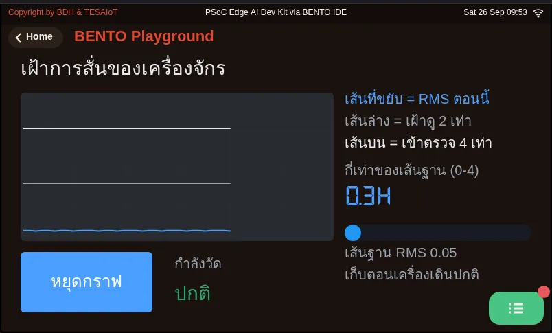

# Lesson 3.6 — Hands-on: a three-axis acceleration chart

> Module 3 — Sensor Visualization on HMI · Slides: [slides.md](slides.md) · [Module overview](../README.md) · [Course page](../../README.md)

Complete the practice file so the screen shows a live three-axis acceleration chart, a min/max table and separate start and stop buttons, then prove with the real loop period on screen that everything runs at the rate you set.

## Objectives

By the end of this lesson you will be able to:

1. Fill the six blanks in s07_accel_chart.py in three stages until the screen shows three separately coloured lines for X, Y and Z, with Z near 9–10 and X and Y near zero when the board lies still
2. Build start and stop buttons around a running flag, keeping ui.poll() outside the if running block, so that after Stop the chart does not move when shaken, the lamp dims, and Start resumes the chart, for at least three toggles
3. Show the real loop period measured with time.ticks_diff() on screen, and explain why a loop that only calls set_next() crawls and how sending .text() at least once per loop fixes it
4. Match at least three silent symptoms from the trap table (such as a missing Z row, a line stuck at the top edge, or a strange slow wave when shaking fast) to their cause and fix

## Before you start

Make sure you are solid on ui.Chart's multiple series, a flag-based stop button, and measuring the loop period from lesson 3.5. Keep the BENTO Playground card
open on the board's screen, and set the board somewhere it can move freely. This file deliberately has no sensors.init(), and on a freshly reset Eva Kit, the first sensor read can sit still for up to 16 seconds — that is waiting, not hanging.

- **Equipment:** an Eva Kit or TESAIoT Dev Kit board with the BENTO MicroPython firmware installed, or the BENTO Emulator in [BENTO IDE](https://ide.tesaiot.dev/)
- **Before this:** [Lesson 3.5 — ui.Chart: multi-series plots and the real loop period](../l05-realtime-chart/README.md)

## Concepts

This lesson is the checkpoint for lessons 3.4–3.6: a live three-axis acceleration chart, an extreme-value summary table, and separate start and stop buttons.
The chart and the table are not repeating each other — the chart tells you "the shape over time" but forgets points older than 50 slots, while the table
remembers the minimum and maximum in `lo` and `hi`, which live outside the loop because they are the program's memory. The table's cells start as "-",
not empty, because an empty cell could mean either "no value yet" or "the screen is broken". The chart line moves five times a second, but the numbers in the
table are rewritten once per second, because the eye can read a shape instantly, but nobody can read a number running five times a second.

A safe "stop" stops feeding data, not the loop. `running` is just a flag: `set_next()` sits under `if running:`,
but `ui.poll()` always sits outside. Move poll inside too, and the stop button kills its own way back — the screen would look hung,
even though the program is still running every line. Start and stop are separate buttons, because one button that toggles cannot tell you which
state you are in right now. What reports state is a lamp and the label beside it, and `led_rec.value(0)` "dims" the lamp, it does not make it vanish.

The thing nobody can guess is the pulse of the cross-core channel. The screen side has two timer speeds, fast at 5 ms and normal at 200 ms, and stays in fast mode
for another 500 ms every time it gets a command that writes text, or moves, shrinks, or recolours something — but `set_next()`
and `.value()` do not wake this mode. A loop with only a chart in it therefore falls back to slow mode, where CM55 can only drain 80 commands a second,
about 40 times slower than a loop that also has a label. The fix is to send `lbl_rec.text(rec_msg)` every round — even the same text is fine,
since the firmware does not redraw it if the text has not changed, so all we pay for is the value sent across the cores.

Three numbers in this file each have a reason behind them: `set_next()` only takes integers; sending a float directly raises TypeError, and
`int()` is what discards the decimal. The Y axis is set to -20 to 20, because gravity sits at 9.81, leaving room for about the same amount of swing again.
`PERIOD_MS = 200` means 5 samples a second, enough to see a hand waving, but shaking faster than 2.5 Hz makes the chart show
a slow wave that never really existed — that is aliasing, not a bug.

The solution is ordered into five moves to cut through the pile of bugs one layer at a time: prepare the sensor and screen (a broken foundation makes everything after it meaningless), build the chart
(see the empty frame appear first), buttons and flag (the emergency exit comes before the data), feed real data (if it goes wrong now, it went wrong at the reading), and measure the loop period (the diagnostic tool for all four moves above). The whole screen uses only 8 widgets, and twelve of the fifteen items
in the trap table show no error message at all — only "the chart looks strange", which we must learn to read as a symptom.

## Worked example

Open these in order, about 20 minutes total.

1. **03_aliasing_nyquist.py** from lesson 3.4 (about 8 minutes) — before touching your own `PERIOD_MS` number, predict whether sampling too slowly will make a line
   simply vanish or show something else instead, then run it and see exactly where the real wave and the wave the device thinks it sees separate
2. **01_imu_vibration_monitor.py** (about 12 minutes) — run it and watch the two threshold lines and the stop-chart button, then look at how it
   names each series' variable and why it multiplies the value before feeding the chart. This file's loop structure, threshold lines and stop button
   can be copied straight into your team's own file

If pressing start or stop does nothing to the screen at all, open 02_event_types.py from lesson 2.5, because a Button sends
`clicked` while a Switch sends `toggled`, and catching the wrong type fails silently. 02_fft64_two_tones.py and ex16_spectrum_analyzer.py
are optional further reading, outside this lesson's passing criteria.

| File | What this file teaches |
|---|---|
| [examples/01_imu_vibration_monitor.py](examples/01_imu_vibration_monitor.py) | Watching a machine's vibration |

The slides for this lesson also refer to files that live in other lessons:

- [m02-ui-to-hardware/l05-event-loop/examples/02_event_types.py](../../m02-ui-to-hardware/l05-event-loop/examples/02_event_types.py) — what an event looks like, and who sends what
- [m03-sensor-hmi/l04-sampling/examples/03_aliasing_nyquist.py](../l04-sampling/examples/03_aliasing_nyquist.py) — sampling too slowly, and getting a frequency that never really existed
- [m03-sensor-hmi/l05-realtime-chart/examples/02_fft64_two_tones.py](../l05-realtime-chart/examples/02_fft64_two_tones.py) — a hand-written 64-point radix-2 FFT, from scratch
- [shared/lvgl_ports/sec3_sensor_viz/eva/ex16_spectrum_analyzer.py](../../shared/lvgl_ports/sec3_sensor_viz/eva/ex16_spectrum_analyzer.py)

**Screens from the BENTO Emulator** for this lesson's examples (click a file name to open the code)

<figure><figcaption><a href="examples/01_imu_vibration_monitor.py"><code>01_imu_vibration_monitor.py</code></a> Watching a machine&#x27;s vibration</figcaption></figure>

## Practice

The practice file has 6 blanks. The screen has already been written for you in full; our job is making values flow into it. Fill it in in three stages,
sending to the board after each. The order matters, because the code below refers to variables created by the blank above it.

1. **Stage 1, blanks 1–2:** `s_az = chart.add_series(COL_AZ)` then `chart.set_next(0, int(ax))`. You should see all three lines running.
   The X axis is series 0, which already comes with the Chart — never `add_series` for it, or you will end up with four lines
2. **Stage 2, blank 3:** `dt = time.ticks_diff(now, last_ms)`. You should see the on-screen loop-period number change in real time
3. **Stage 3, blanks 4–6:** `running = True` · `running = False` · `time.sleep_ms(PERIOD_MS)`, then test toggling the buttons back and forth

Between stages 1 and 2, the loop has no `sleep_ms` yet (that is blank 6). If the chart stutters or drops points intermittently, check the
"loop too fast, commands overflow the queue" row in the trap table, and notice how the loop-period number changes after filling in blank 6.

| Practice file | Topic |
|---|---|
| [practice/s07_accel_chart.py](practice/s07_accel_chart.py) | A live three-axis acceleration chart + a three-axis summary table (fill-in version) |

## Solution

Open the solution after trying on your own at least once, and read [how to use the solutions](../../README.md#วิธีใช้เฉลย) first.

| Solution | Goes with |
|---|---|
| [solution/s07_accel_chart.py](solution/s07_accel_chart.py) | [practice/s07_accel_chart.py](practice/s07_accel_chart.py) |

## Check your understanding

The same questions are in [quiz.yaml](quiz.yaml) for automatic marking.

1. A chart is created with ui.Chart(..., color=COL_AX), then add_series is called twice for Y and Z. How should you feed the X axis's value? *(choose one · objective 1)*
   - A) chart.set_next(0, int(ax))
   - B) s_ax = chart.add_series(COL_AX), then call chart.set_next(s_ax, int(ax))
   - C) chart.set_next(0, ax), because the chart accepts floats
   - D) chart.set_next(s_ay, int(ax))

   

Solution

   **A** — The first line is series 0, which comes with the Chart itself (coloured from color=); it never needs add_series. Adding one more would give four lines, and set_next() only takes integers — sending a float directly raises TypeError.

   

2. Which statements about the stop button in the solution file are correct? Choose every correct one. *(choose all that apply · objective 2)*
   - A) ui.poll() is called every round, even when running is False
   - B) led_rec.value(0) dims the lamp; it does not vanish from the screen
   - C) Pressing stop ends the while loop with break
   - D) time.sleep_ms(PERIOD_MS) still delays by the same amount when stopped
   - E) The extreme values in the table are cleared when stop is pressed

   

Solution

   **A, B, D** — Stop is a flag, not stopping the loop. poll must sit outside if running, or the start button could never be pressed again. The loop still delays the same amount, so as not to flood CM55 with poll commands. The extreme values are cleared when start begins a new round, not when stopped.

   

3. Your loop sets sleep_ms(200), and the loop has only three set_next() lines and led.value(), but the chart crawls and stutters. What should you do? *(choose one · objective 3)*
   - A) Send .text() to a Label at least once per round — the same text is fine
   - B) Lower sleep_ms to 20 to speed up the loop
   - C) Add a fourth series to give the chart more work
   - D) Call ui.poll() twice per round

   

Solution

   **A** — set_next() and .value() do not wake the cross-core channel's 5 ms fast mode, so the screen falls back to the 200 ms mode, draining only 80 commands a second. A text-writing command wakes fast mode for another 500 ms, and the firmware does not redraw unchanged text. Speeding up the loop instead just overflows the queue and drops commands.

   

4. The right-hand table shows only two and a half rows, with the Z row missing below the edge, and no error. What is the real cause? *(choose one · objective 4)*
   - A) The column is narrower than the text, so it wraps, and every row's height doubles as a result
   - B) ui.Table can only take three rows
   - C) add_row was called before col_width
   - D) The Thai font in the table is not yet supported

   

Solution

   **A** — If a column is too narrow, the text wraps onto a new line, and every row's height instantly doubles. Fix it by widening .col_width() until no cell wraps. This symptom is only visible from the on-screen picture.

   

5. At PERIOD_MS = 200, you shake the board very fast, but the chart shows a strange slow wave instead. Which explanation is correct? *(choose one · objective 4)*
   - A) It is aliasing, because sampling at 5 Hz can only handle up to 2.5 Hz — this is not a bug, just record it
   - B) The sensor is broken; you need a new board
   - C) int() was forgotten, so the value rounded until the wave slowed
   - D) The table overwrites the chart every second

   

Solution

   **A** — A 200 ms sample period is 5 samples a second. Shaking faster than half of that rate does not simply disappear — it becomes a frequency on the chart that never really existed, and that cannot be filtered out afterward.

   

## Lab

**MVP checkpoint.** Lessons 3.4–3.6 are passed when every item below is true.

- [ ] The screen has one chart with three clearly distinct coloured lines (X blue, Y purple, Z sea-green)
- [ ] The board lies still, Z sits near 9–10, X and Y sit near zero
- [ ] Shaking the board makes all three lines respond immediately, and the ripple shifts to the left
- [ ] The right-hand table shows all four rows, no cell wraps, and the Z row does not disappear below the edge
- [ ] Shaking moves the maximum value in the table up and it does not drop back down on its own, while the latest value follows the current number
- [ ] The numbers in the table change once per second, while the chart line moves five times a second (stare for ten seconds and count)
- [ ] Pressing stop, then shaking hard, makes the chart not move at all, the lamp dims (not vanishes), and the label changes to "stopped"
- [ ] Pressing start resumes the chart, the extremes reset back to a dash, and it can toggle back and forth at least three times
- [ ] There is an on-screen label reporting the real loop period in milliseconds; record the value and the reason that explains it in your learning log
- [ ] It runs continuously for 3 minutes with no hang and no error

Item 7 is the heart of it: a button that changes the lamp while the data keeps moving is a button that is not actually working.

## Going further

Keep this file well — lessons 3.7–3.9 will open it up again and extend it into a four-card dashboard, not start over.
If you want to go further, pick one item: feed four kinds of waves into the chart without a sensor and compare against what Nyquist predicts ·
change to `int(ax * 100)` with a range of -2000 to 2000 and compare the detail · try `PERIOD_MS` at 500, 200,
100, 50 and 20, both with and without `lbl.text()` · add a fourth series from `dsp.EMA(alpha=0.2)` laid over the raw line

Next lesson: [Lesson 3.7 — HMI design: cards, visual order, colour and the widget budget](../l07-hmi-design/README.md)

## Reflect

- If you had to send this data to the cloud in lessons 4.4–4.6, would you send every point at 5 Hz, or only when something interesting happens, and what value should be summarised before sending?
- If the network drops for three minutes, should that data simply disappear, or should it be kept?
- Which symptom in the trap table have you actually met, and what on screen told you?
