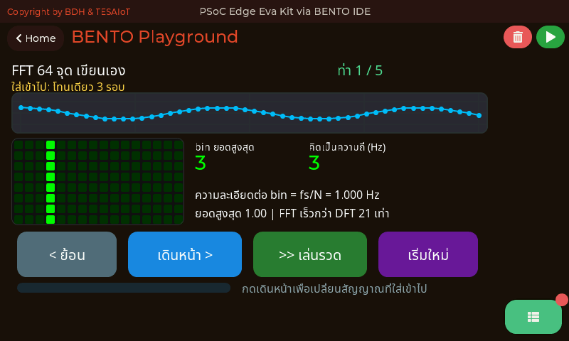
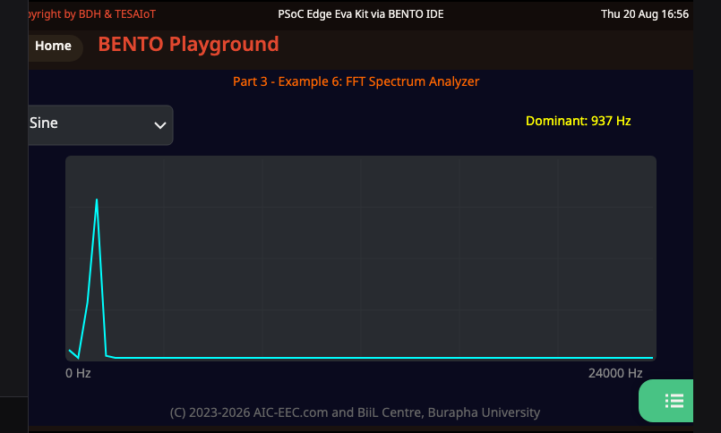
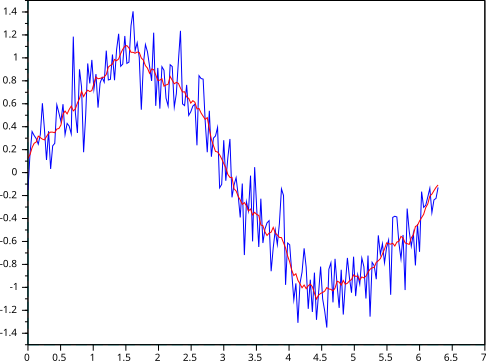
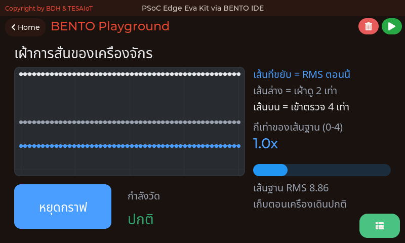
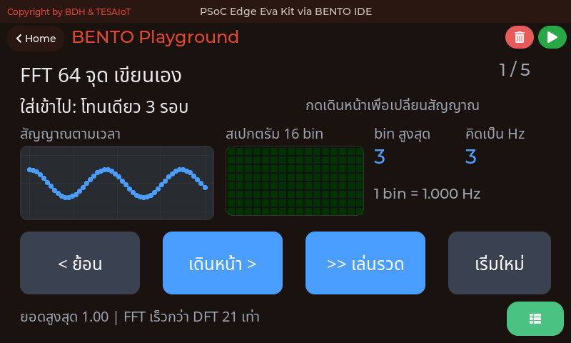
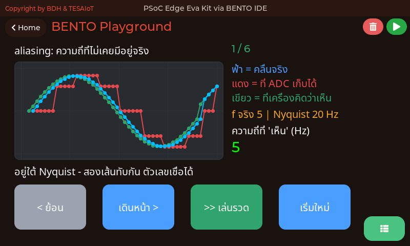

<style>
section { font-size: 24px; padding: 40px 52px; justify-content: flex-start; }
section h1 { font-size: 1.45em; line-height: 1.12; margin: 0 0 .22em; }
section h2 { font-size: 1.12em; margin: .15em 0; }
section h3 { font-size: 1.0em; margin: .12em 0; }
section p, section li { margin: .16em 0; line-height: 1.32; }
section img { max-width: 100%; height: auto; }
section svg { max-height: 330px; width: 100%; }
section table { font-size: .78em; }
section pre { font-size: .70em; line-height: 1.32; background:#0d1117; color:#e6edf3; border:1px solid #30363d; border-radius:8px; padding:12px 16px; box-shadow:0 2px 8px rgba(0,0,0,.25); }
section pre code { white-space: pre-wrap; background:transparent; color:inherit; } section pre .hljs-comment{color:#8b949e;font-style:italic} section pre .hljs-keyword,section pre .hljs-built_in,section pre .hljs-literal{color:#ff7b72} section pre .hljs-string{color:#a5d6ff} section pre .hljs-number{color:#79c0ff} section pre .hljs-title,section pre .hljs-title.function_,section pre .hljs-section{color:#d2a8ff} section pre .hljs-meta{color:#ffa657} section pre .hljs-attr,section pre .hljs-attribute,section pre .hljs-name{color:#7ee787}
section blockquote { margin: .25em 0; font-size: .92em; }
/* two images on a line (parity / 2x2 grids) stay side-by-side and small */
section p > img + img { margin-left: 10px; }
/* scroll-within-slide: dense slides scroll instead of clipping */
section { overflow-y: auto; overflow-x: hidden; }
section::-webkit-scrollbar { width: 11px; }
section::-webkit-scrollbar-thumb { background:#4a90d9; border-radius:6px; }
section::-webkit-scrollbar-track { background:rgba(0,0,0,.06); }
/* image drop-shadow + cover-slide readability (auto) */
section img{filter:drop-shadow(0 3px 12px rgba(0,0,0,.5))}
section iframe{border:0;border-radius:8px;box-shadow:0 2px 10px rgba(0,0,0,.3)}
/* พื้นสำรองของสไลด์ปก: ถ้า img/cover_sNN.svg โหลดไม่ขึ้น ธีมจะคืนพื้นขาว
   แล้วตัวอักษรสีขาวของปกจะหายไปทั้งแผ่น — ปักสีเข้มไว้ให้ภาพเป็นแค่ของประดับ */
section.cover{background-color:#0b1426}
section.cover *{color:#fff !important}
section.cover h1,section.cover h2,section.cover h3,section.cover p,section.cover li,section.cover strong,section.cover em,section.cover blockquote,section.cover div{text-shadow:0 2px 9px rgba(0,0,0,.92),0 0 3px rgba(0,0,0,.8)}
section.cover div[style*="background:#"],section.cover div[style*="background: #"]{background:rgba(10,14,20,.66) !important;border-color:rgba(120,200,255,.45) !important;max-width:62%}
section.cover blockquote{border-left:4px solid rgba(120,200,255,.6) !important;background:rgba(13,17,23,.55) !important;border-radius:6px;padding:.3em .6em}
section.cover h1,section.cover h2,section.cover h3,section.cover p,section.cover blockquote{max-width:60%}
section.cover div:not(:has(img)){max-width:62%}
section.cover img{filter:none}
</style>


<!-- _class: cover -->

# บทเรียน 3.6 — ลงมือทำ: กราฟความเร่งสามแกน

## กราฟ Real-time · ui.Chart หลาย Series: เห็นสัญญาณเป็นเส้นเวลา ไม่ใช่ตัวเลขกระพริบ

**โมดูล 3 — แสดงผลเซนเซอร์บน HMI**

> ต่อจากบทเรียน 3.5 — ui.Chart: กราฟหลาย series และคาบเวลาของลูปจริง

---

## MVP checkpoint — ผ่านชุดบทเรียนนี้เมื่อ


**กราฟ accel 3 แกนวิ่งสด + ตารางสรุปค่าสุดขีด + ปุ่มเริ่มกับปุ่มหยุดที่แยกกัน**

แปลเป็นสิ่งที่ตรวจได้จริง:

- [ ] จอมีกราฟหนึ่งใบ มีเส้น **สามสีแยกกันชัดเจน** (X ฟ้า, Y ม่วง, Z เขียวน้ำทะเล)
- [ ] วางบอร์ดนิ่ง เส้น Z อยู่ราว 9-10 ส่วน X และ Y อยู่ราวศูนย์
- [ ] เขย่าบอร์ดแล้วทั้งสามเส้นตอบสนองทันที และรอยนั้นเลื่อนไปทางซ้าย
- [ ] ตารางขวามือขึ้นครบสี่แถว **ไม่มีช่องไหนตกบรรทัด** และแถว Z ไม่หายไปใต้ขอบ
- [ ] เขย่าแล้วค่าสูงสุดในตารางขยับขึ้นและ **ไม่ลดกลับเอง** ส่วนค่าล่าสุดวิ่งตามตัวเลขปัจจุบัน
- [ ] ตัวเลขในตารางเปลี่ยน **วินาทีละครั้ง** ส่วนเส้นกราฟยังเดินห้าครั้งต่อวินาที (จ้องดูสิบวินาทีแล้วนับ)
- [ ] กดหยุดบันทึกแล้วเขย่าแรง ๆ กราฟต้อง **ไม่ขยับเลย** ไฟหรี่ลง (ไม่ใช่หายไป) และป้ายเปลี่ยนเป็น "หยุดแล้ว"
- [ ] กดเริ่มบันทึกแล้วกราฟกลับมาวิ่งต่อ ค่าสุดขีดในตารางถูกล้างกลับเป็นขีด สลับไปกลับได้อย่างน้อยสามรอบ
- [ ] มีป้ายบนจอบอกคาบลูปจริงเป็นมิลลิวินาที และค่าอยู่ในช่วงที่อธิบายได้
- [ ] รันต่อเนื่อง 3 นาทีโดยไม่ค้างและไม่มี error

> ข้อที่เจ็ดคือหัวใจ — ปุ่มที่กดแล้วไฟเปลี่ยนแต่ข้อมูลยังวิ่ง คือปุ่มที่ยังไม่ทำงาน

---

## กับดักที่เจอบ่อย (1/2)

| อาการ | สาเหตุที่แท้จริง | วิธีแก้ |
|---|---|---|
| `TypeError` ตอนเรียก `set_next` | ส่งทศนิยมเข้าไปตรง ๆ | ครอบด้วย `int()` ทุกครั้ง |
| `NameError: name 's_az'` | ยังไม่ได้เติมช่อง `add_series` แต่โค้ดข้างล่างอ้างถึงแล้ว | เติมไล่จากบนลงล่าง |
| มีสี่เส้นแทนที่จะเป็นสาม | เผลอ `add_series` ให้แกน X ด้วย ทั้งที่ series 0 มีมาแล้ว | ใช้ `set_next(0, ...)` กับแกน X |
| **กราฟเดินอืด ๆ ทั้งที่ลูปตั้ง 200 ms** | **ลูปมีแต่ `set_next()` ซึ่งไม่ปลุกโหมดเร่ง — CM55 ระบายแค่ 80 คำสั่ง/วินาที** | **เพิ่ม `lbl.text(...)` ในลูปเดียวกัน** |
| กราฟกระตุก จุดหายเป็นช่วง | ลูปเร็วเกิน คำสั่งล้นคิว IPC 64 ช่องแล้วถูกทิ้ง | เพิ่ม `sleep_ms` กลับไปที่ 200 |
| เส้นแบนติดขอบบนตลอด | ช่วงแกน Y แคบไป แกน Z ชนเพดาน | ขยายเป็น `min=-20, max=20` |
| กดหยุดบันทึกแล้วกราฟยังวิ่ง | `if running:` ไม่ได้ครอบส่วนที่ป้อนข้อมูล | ย้าย `set_next` เข้าไปใต้ `if running:` |
| กดหยุดบันทึกแล้ว widget หายทั้งจอ | ไปหยุดลูป ทำให้ `ui.poll()` ไม่ถูกเรียก | การหยุดคือ flag ห้ามหยุดลูป |

---

## กับดักที่เจอบ่อย (2/2)

| อาการ | สาเหตุที่แท้จริง | วิธีแก้ |
|---|---|---|
| ตารางขึ้นแค่สองแถวครึ่ง แถว Z หายไป | คอลัมน์แคบกว่าข้อความ ข้อความตกบรรทัด ทุกแถวเลยสูงสองเท่า | ขยาย `.col_width()` จนไม่มีช่องไหนตกบรรทัด |
| ตัวหนังสือไทยในตารางขึ้นเป็นกล่องสี่เหลี่ยม | ช่องของตารางวาดจากคนละส่วนกับ Label | เฟิร์มแวร์ตั้งฟอนต์ไทยที่ส่วน ITEMS ให้แล้ว ถ้ายังเป็นกล่อง ให้แจ้งผู้สอน |
| ไฟดับแล้วยังเห็นเป็นวงจาง ๆ | ตั้งใจ `.value(0)` คือหรี่ ไม่ใช่หาย | ไฟที่หายไปทำให้แยกไม่ออกว่าดับหรือจอเสีย |
| เส้นกราฟกระตุกทั้งที่ลูปยังเดิน | ทั้งลูปมีแต่ `.value()` กับ `set_next()` ซึ่งไม่ปลุกโหมดเร่ง | ส่ง `.text()` อย่างน้อยหนึ่งครั้งต่อรอบ ส่งข้อความเดิมก็ได้ |
| กดปุ่มแล้วไม่มีอะไรเกิดขึ้น | เทียบ `handle` กับ id ผิดตัว หรือลืมเก็บ `btn.id()` | ตรวจว่าเก็บ id ไว้ก่อนเข้าลูป |
| ค่าเซนเซอร์ค้างตัวเลขเดิม | หลังใช้ `ui.*` auto-task หยุด แต่เราไม่ได้อ่านเองในลูป | อ่าน `motion()` ทุกรอบ |
| เขย่าเร็วแล้วกราฟโชว์คลื่นช้าแปลก ๆ | aliasing — เขย่าเกิน 2.5 Hz ที่ $f_s$ 5 Hz รับไหว | ไม่ใช่บั๊ก บันทึกไว้ |

> สิบสามในสิบห้าข้อนี้ไม่มี error message (มีแค่ `TypeError` กับ `NameError`) — มีแต่ "กราฟดูแปลก ๆ" หรือ "ตารางดูแปลก ๆ" ต้องอ่านอาการเป็น

---

## ลงมือทำ — เติมช่องว่างในไฟล์ฝึก

<div style="display:flex;gap:16px;align-items:flex-start">
<div style="flex:1;min-width:0">

เปิด [`s07_accel_chart.py`](https://github.com/tesaiot/tesa-qualification-program/blob/main/courses/aiot-micropython/m03-sensor-hmi/l06-accel-chart-lab/practice/s07_accel_chart.py) มีช่องว่างให้เติม 6 จุด

```python
# เติม: s_az = chart.add_series(COL_AZ)
pass

if running:
    ax, ay, az, gx, gy, gz = sensors.bmi270.motion()
    # เติม: chart.set_next(0, int(ax))
    pass

# เติม: dt = time.ticks_diff(now, last_ms)
pass

for ev in ui.poll():
    h = ev.get('handle')
    if h == start_id:
        # เติม: running = True
        pass
    elif h == stop_id:
        # เติม: running = False
        pass

# เติม: time.sleep_ms(PERIOD_MS)
pass
```

</div>
<div style="flex:0 0 320px">

<svg viewBox="0 0 320 260" xmlns="http://www.w3.org/2000/svg">
  <text x="160" y="26" text-anchor="middle" font-size="19" font-weight="700" fill="#37474f">เติมเป็นสามขั้น แล้วรันทุกขั้น</text>
  <rect x="20" y="44" width="280" height="60" rx="8" fill="#e3f2fd" stroke="#1565c0" stroke-width="2"/>
  <text x="160" y="70" text-anchor="middle" font-size="19" font-weight="700" fill="#1565c0">ขั้น 1 · จุดที่ 1-2</text>
  <text x="160" y="94" text-anchor="middle" font-size="18" fill="#0d47a1">ควรเห็นสามเส้นวิ่ง</text>
  <rect x="20" y="114" width="280" height="60" rx="8" fill="#fff3e0" stroke="#ef6c00" stroke-width="2"/>
  <text x="160" y="140" text-anchor="middle" font-size="19" font-weight="700" fill="#ef6c00">ขั้น 2 · จุดที่ 3</text>
  <text x="160" y="164" text-anchor="middle" font-size="18" fill="#e65100">ควรเห็นตัวเลขคาบลูป</text>
  <rect x="20" y="184" width="280" height="60" rx="8" fill="#e8f5e9" stroke="#2e7d32" stroke-width="2"/>
  <text x="160" y="210" text-anchor="middle" font-size="19" font-weight="700" fill="#2e7d32">ขั้น 3 · จุดที่ 4-6</text>
  <text x="160" y="234" text-anchor="middle" font-size="18" fill="#1b5e20">ทดสอบปุ่มสลับไปกลับ</text>
  <circle cx="308" cy="74" r="7" fill="#1565c0"><animate attributeName="r" values="6;11;6" dur="1.5s" repeatCount="indefinite"/></circle>
  <circle cx="308" cy="144" r="7" fill="#ef6c00"><animate attributeName="r" values="6;11;6" dur="1.5s" begin="0.5s" repeatCount="indefinite"/></circle>
  <circle cx="308" cy="214" r="7" fill="#2e7d32"><animate attributeName="r" values="6;11;6" dur="1.5s" begin="1s" repeatCount="indefinite"/></circle>
</svg>

> ลำดับการเติมสำคัญ — โค้ดข้างล่างอ้างถึงตัวแปรที่เกิดจากช่องว่างข้างบน

</div>
</div>

---

## ตัวอย่างของบทเรียน 3.4–3.6 — สองไฟล์นี้คือชุดที่ทำให้กราฟสดของทีมมีคาบเวลาที่อธิบายได้

**ต้องทำในบทเรียน** · เปิดตามลำดับนี้ ทั้งชุดราว 20 นาที

| ลำดับ · เรื่อง · เวลา | ไฟล์ | ลงมือทำอะไร แล้วจะเข้าใจอะไร |
|---|---|---|
| **1 · สุ่มช้าไปแล้วได้ความถี่ผี** · 8 นาที | [`03_aliasing_nyquist.py`](https://github.com/tesaiot/tesa-qualification-program/blob/main/courses/aiot-micropython/m03-sensor-hmi/l04-sampling/examples/03_aliasing_nyquist.py) | ตั้งค่า `PERIOD_MS` ของทีมโดยมีเหตุผลรองรับ แทนที่จะเดาแล้วมาแก้ทีหลัง · จะเข้าใจว่าสุ่มช้าเกินไป แล้วได้ความถี่ที่ไม่เคยมีอยู่จริงบนกราฟ |
| **2 · เฝ้าการสั่นด้วยเกณฑ์ที่วัดเอง** · 12 นาที | [`01_imu_vibration_monitor.py`](https://github.com/tesaiot/tesa-qualification-program/blob/main/courses/aiot-micropython/m03-sensor-hmi/l06-accel-chart-lab/examples/01_imu_vibration_monitor.py) | ลอกโครงลูปอ่านเซนเซอร์ เส้นเกณฑ์ และปุ่มหยุดกราฟ ไปใส่ไฟล์ของทีมได้ทันที · จะได้รูปร่างของงานเฝ้าการสั่น คือกราฟคู่กับเส้นเกณฑ์ที่วัดมาเอง ไม่ใช่ตัวเลขที่หยิบมาจากที่อื่น |

**ติดตรงไหน เปิดอันนี้**

| อาการที่เจอ | ไฟล์ที่ตอบอาการนั้น |
|---|---|
| กดปุ่มเริ่ม/หยุดแล้วจอไม่เปลี่ยนอะไรเลย | [`02_event_types.py`](https://github.com/tesaiot/tesa-qualification-program/blob/main/courses/aiot-micropython/m02-ui-to-hardware/l05-event-loop/examples/02_event_types.py) — Button ส่ง `clicked` ส่วน Switch ส่ง `toggled` คนละชนิดกัน ดักผิดชนิดคือเงียบ |

---

## ตัวอย่างของบทเรียน 3.4–3.6 (ต่อ) — อ่านเสริมนอกเวลา: FFT ด้วยมือ แล้วของจริงใน C

**อ่านเสริมนอกเวลา** — เรื่องนี้อยู่นอกเกณฑ์ผ่านของบทเรียน 3.4–3.6 เพราะ MVP วันนี้วัดที่กราฟสามเส้น ตาราง และปุ่มเริ่ม/หยุดบันทึก ไม่ได้วัดสเปกตรัม: [`02_fft64_two_tones.py`](https://github.com/tesaiot/tesa-qualification-program/blob/main/courses/aiot-micropython/m03-sensor-hmi/l05-realtime-chart/examples/02_fft64_two_tones.py) เขียน FFT 64 จุดด้วยมือทั้งตัว แล้วชี้ว่าข้อมูลชุดเดิมมองคนละมุมได้คำตอบคนละแบบ · พอเข้าใจข้างในแล้ว ของจริงใช้ `dsp.fft_mag()` ที่คำนวณใน C (firmware 2026-08-20 ขึ้นไป) — [`ex16_spectrum_analyzer.py`](https://github.com/tesaiot/tesa-qualification-program/blob/main/courses/aiot-micropython/shared/lvgl_ports/sec3_sensor_viz/eva/ex16_spectrum_analyzer.py) คือเครื่องวิเคราะห์สเปกตรัมทั้งเครื่องที่ประกอบจากมัน เก็บไว้เปิดตอนอยากต่อยอดไปงาน predictive maintenance จริง

 

<div style="font-size:.6em;color:#78909c;margin-top:-.35em">ซ้าย — หน้าจอจริงตอนรัน <a href="https://github.com/tesaiot/tesa-qualification-program/blob/main/courses/aiot-micropython/m03-sensor-hmi/l05-realtime-chart/examples/02_fft64_two_tones.py"><code>02_fft64_two_tones.py</code></a> — บนคือคลื่นที่ป้อนเข้าไป ล่างซ้ายคือสเปกตรัมที่ออกมา วาดบนตารางไฟ 8x8 ด้วย <code>DotMatrix.set_pixels()</code> · ภาพจับที่ขั้นแรก ป้อนโทนเดียว 3 รอบเข้าไป ยอดจึงขึ้นที่ bin 3 เดี่ยว ๆ และเพราะความละเอียดต่อ bin เท่ากับ fs/N = 1.000 Hz เลข bin กับเลขความถี่จึงบังเอิญตรงกันพอดีที่ 3 · บรรทัดล่างคือราคาที่ประหยัดได้จริง FFT เร็วกว่า DFT ตรง ๆ 21 เท่าที่ N = 64 · ภาพหน้าจอจริงจากบอร์ด Eva Kit บันทึกโดยผู้สอน</div>

ชุดบทเรียนนี้เหลือตัวอย่างสามไฟล์ หลังตัดเรื่องเลข int16 · บิตมาสก์ · การแพ็กฟิลด์ลงไบต์ ออกจากหลักสูตร ทั้งสามเรื่องไม่มีบทเรียนไหนสอนแล้ว และไม่มีไฟล์ไหนต้องแก้ค่าคงที่ก่อนกด Run

---

## เฉลย [`s07_accel_chart.py`](https://github.com/tesaiot/tesa-qualification-program/blob/main/courses/aiot-micropython/m03-sensor-hmi/l06-accel-chart-lab/solution/s07_accel_chart.py) — ตั้งต้น กราฟ ตาราง ไฟ และปุ่มสองปุ่ม

<div style="display:flex;gap:16px;align-items:flex-start">
<div style="flex:1;min-width:0">

```python
import ui
ui.screen()
import time
import sensors

COL_TEXT, COL_DIM = 0xE8EAED, 0x9AA3AF
COL_AX = 0x4A9EFF      # แกน X - เส้นที่ 1 ของจานสีเส้นข้อมูล สีฟ้า
COL_AY = 0x8E7BFF      # แกน Y - เส้นที่ 2 ของจานสีเส้นข้อมูล สีม่วง
COL_AZ = 0x2FB6A8      # แกน Z - เส้นที่ 3 ของจานสีเส้นข้อมูล สีเขียวน้ำทะเล
COL_RUN = 0x4A9EFF     # สีเน้นของจานบทบาท - ใช้กับไฟบอกว่ากำลังบันทึกอยู่
PERIOD_MS = 200        # คาบการสุ่มที่เราเลือก
...
chart = ui.Chart(x=24, y=52, w=292, h=144, min=-20, max=20, color=COL_AX)
s_ay = chart.add_series(COL_AY)
s_az = chart.add_series(COL_AZ)
tbl = ui.Table(x=332, y=52, w=436, h=280, cols=4, value=16)
...                    # col_width + add_row สี่แถว - ท่าที่ 2
led_rec = ui.Led(x=24, y=212, w=48, h=48, color=COL_RUN, value=1)
lbl_rec = ui.Label("กำลังบันทึก", x=88, y=216, color=COL_TEXT, value=20)
lbl_dt = ui.Label("คาบลูป -- ms", x=88, y=252, color=COL_DIM, value=20)
...                    # ปุ่มเริ่ม/หยุด + start_id stop_id - ท่าที่ 3
lo = [None, None, None]
hi = [None, None, None]
```

</div>
<div style="flex:0 0 300px">

<svg viewBox="0 0 300 250" xmlns="http://www.w3.org/2000/svg">
  <text x="150" y="24" text-anchor="middle" font-size="19" font-weight="700" fill="#37474f">นับ widget</text>
  <rect x="20" y="38" width="260" height="34" rx="5" fill="#e3f2fd" stroke="#1565c0" stroke-width="2"/>
  <text x="150" y="61" text-anchor="middle" font-size="18" fill="#0d47a1">Chart 1 + Table 1 + ไฟ 1 + ปุ่ม 2</text>
  <rect x="20" y="80" width="260" height="34" rx="5" fill="#e8f5e9" stroke="#2e7d32" stroke-width="2"/>
  <text x="150" y="103" text-anchor="middle" font-size="17" fill="#1b5e20">หัวเรื่อง + ป้ายสองป้าย อีก 3</text>
  <text x="150" y="146" text-anchor="middle" font-size="22" font-weight="700" fill="#2e7d32">รวม 8 ชิ้น</text>
  <line x1="20" y1="166" x2="280" y2="166" stroke="#cfd8dc" stroke-width="14" stroke-linecap="round"/>
  <line x1="20" y1="166" x2="85" y2="166" stroke="#2e7d32" stroke-width="14" stroke-linecap="round"/>
  <text x="150" y="206" text-anchor="middle" font-size="18" fill="#455a64">ป้ายใช้สีเดียวกับเส้นในกราฟ</text>
  <text x="150" y="232" text-anchor="middle" font-size="18" font-weight="700" fill="#455a64">ตารางหนึ่งใบแทนป้ายสิบสองช่อง</text>
</svg>

<div style="font-size:.68em;color:#455a64;margin-top:.4em">แถวของตารางถูกสร้างด้วย <code>-</code> ไว้ก่อน ไม่ใช่เว้นว่าง เพราะช่องว่างเปล่าอ่านได้สองแบบ คือ "ยังไม่มีค่า" กับ "จอเสีย" ส่วนขีดอ่านได้แบบเดียว · <code>lo</code> กับ <code>hi</code> เกิดนอกลูปเพราะมันคือความจำของโปรแกรม · เส้นในกราฟใช้สามสีแยกแกน ส่วนตารางใช้ <b>ตัวอักษร X Y Z</b> แยกแทน เพื่อให้อ่านออกแม้พิมพ์เป็นขาวดำ · <code>start_id</code> กับ <code>stop_id</code> เก็บครั้งเดียวตอนสร้าง เพราะบนจอมีสองปุ่ม</div>

</div>
</div>

---

## เฉลย — ลูปหลัก และทำไมเรียงห้าท่าแบบนี้

<div style="display:flex;gap:16px;align-items:flex-start">
<div style="flex:1;min-width:0">

```python
running = True
last_ms = time.ticks_ms()
last_sec = -1

while True:
    if running:
        try:
            ax, ay, az, gx, gy, gz = sensors.bmi270.motion()
        except OSError:
            pass
        chart.set_next(0, int(ax))
        chart.set_next(s_ay, int(ay))
        chart.set_next(s_az, int(az))
        note(0, ax)          # กราฟลืมจุดที่เก่ากว่า 50 จุด ตารางไม่ลืม

    now = time.ticks_ms()
    dt = time.ticks_diff(now, last_ms)
    last_ms = now

    for ev in ui.poll():     # poll นอก if running เสมอ ไม่งั้นปุ่มตายตอนหยุด
        h = ev.get('handle')
        if h == start_id:
            running = True
            lo = [None, None, None]
            hi = [None, None, None]
            led_rec.value(1)
        elif h == stop_id:
            running = False
            led_rec.value(0)          # หรี่ ไม่ใช่หาย

    sec = time.ticks_ms() // 1000
    if sec != last_sec:               # ตัวเลขขยับวินาทีละครั้ง กราฟขยับ 5 ครั้ง
        last_sec = sec
        for i, v in enumerate((ax, ay, az)):
            tbl.cell(i + 1, 1, cell(lo[i]))
        lbl_dt.text("คาบลูป {} ms".format(dt))

    lbl_rec.text(rec_msg)     # ชีพจร - ส่งข้อความเดิมซ้ำทุกรอบโดยตั้งใจ
    time.sleep_ms(PERIOD_MS)
```

</div>
<div style="flex:0 0 330px">

<svg viewBox="0 0 330 300" xmlns="http://www.w3.org/2000/svg">
  <text x="165" y="24" text-anchor="middle" font-size="19" font-weight="700" fill="#37474f">ห้าท่า เรียงเพื่อตัดกองบั๊ก</text>
  <rect x="16" y="38" width="298" height="42" rx="6" fill="#e3f2fd" stroke="#1565c0" stroke-width="2"/>
  <text x="165" y="56" text-anchor="middle" font-size="18" font-weight="700" fill="#0d47a1">1 เตรียมเซนเซอร์และจอ</text>
  <text x="165" y="74" text-anchor="middle" font-size="17" fill="#5472a3">ถ้าฐานพัง ที่เหลือไม่มีความหมาย</text>
  <rect x="16" y="88" width="298" height="42" rx="6" fill="#e3f2fd" stroke="#1565c0" stroke-width="2"/>
  <text x="165" y="106" text-anchor="middle" font-size="18" font-weight="700" fill="#0d47a1">2 สร้างกราฟ</text>
  <text x="165" y="124" text-anchor="middle" font-size="17" fill="#5472a3">อยากเห็นกรอบเปล่าขึ้นจอก่อน</text>
  <rect x="16" y="138" width="298" height="42" rx="6" fill="#e8f5e9" stroke="#2e7d32" stroke-width="2"/>
  <text x="165" y="156" text-anchor="middle" font-size="18" font-weight="700" fill="#1b5e20">3 ปุ่มและ flag</text>
  <text x="165" y="174" text-anchor="middle" font-size="17" fill="#4a7c4e">ปุ่มคือทางออกฉุกเฉิน มาก่อนข้อมูล</text>
  <rect x="16" y="188" width="298" height="42" rx="6" fill="#fff3e0" stroke="#ef6c00" stroke-width="2"/>
  <text x="165" y="206" text-anchor="middle" font-size="18" font-weight="700" fill="#e65100">4 ป้อนข้อมูลจริง</text>
  <text x="165" y="224" text-anchor="middle" font-size="17" fill="#a1683a">เพี้ยนตอนนี้ = เพี้ยนที่การอ่าน</text>
  <rect x="16" y="238" width="298" height="42" rx="6" fill="#f3e5f5" stroke="#6a1b9a" stroke-width="2"/>
  <text x="165" y="256" text-anchor="middle" font-size="18" font-weight="700" fill="#4a148c">5 วัดคาบลูป</text>
  <text x="165" y="274" text-anchor="middle" font-size="17" fill="#7e5a94">เครื่องมือตรวจของสี่ท่าข้างบน</text>
  <circle cx="322" cy="59" r="6" fill="#1565c0"><animate attributeName="r" values="6;11;6" dur="2.5s" repeatCount="indefinite"/></circle>
  <circle cx="322" cy="159" r="6" fill="#2e7d32"><animate attributeName="r" values="6;11;6" dur="2.5s" begin="0.8s" repeatCount="indefinite"/></circle>
  <circle cx="322" cy="259" r="6" fill="#6a1b9a"><animate attributeName="r" values="6;11;6" dur="2.5s" begin="1.6s" repeatCount="indefinite"/></circle>
</svg>

> `ui.poll()` อยู่ **นอก** `if running:` — ปุ่มหยุดที่ฆ่าทางกลับของตัวเองคือบั๊กที่เจอบ่อยที่สุดในหน้าที่มีปุ่มหยุด และมันดูเหมือนจอค้าง ทั้งที่โปรแกรมยังวิ่งครบทุกบรรทัด

</div>
</div>

---

## สรุปบทเรียน · รากฐานที่แตะ · และวันนี้อยู่ตรงไหนของเส้นทาง

<svg viewBox="0 0 940 200" xmlns="http://www.w3.org/2000/svg">
  <text x="470" y="30" text-anchor="middle" font-size="19" font-weight="700" fill="#37474f">ค่าเดี่ยว ไปเป็นเส้นเวลา ไปเป็นแดชบอร์ด ไปเป็น telemetry</text>
  <line x1="40" y1="112" x2="900" y2="112" stroke="#b0bec5" stroke-width="4"/>
  <circle cx="150" cy="112" r="15" fill="#a3c93a"/>
  <circle cx="390" cy="112" r="19" fill="#22d3ee"><animate attributeName="r" values="16;22;16" dur="2.4s" repeatCount="indefinite"/></circle>
  <circle cx="630" cy="112" r="15" fill="#6cb2f5"/>
  <circle cx="850" cy="112" r="15" fill="#ffb066"/>
  <text x="150" y="82" text-anchor="middle" font-size="19" font-weight="700" fill="#5b7c14">บทเรียน 2.7–3.3</text>
  <text x="150" y="150" text-anchor="middle" font-size="18" fill="#455a64">อ่านค่าเดี่ยว</text>
  <text x="150" y="174" text-anchor="middle" font-size="18" fill="#455a64">แล้ววาดเป็นแถบกับตัวเลข</text>
  <text x="390" y="80" text-anchor="middle" font-size="20" font-weight="700" fill="#0e7490">วันนี้ · บทเรียน 3.4–3.6</text>
  <text x="390" y="150" text-anchor="middle" font-size="18" fill="#455a64">เก็บเป็นเส้นเวลา</text>
  <text x="390" y="174" text-anchor="middle" font-size="18" fill="#455a64">คุมจังหวะการสุ่ม</text>
  <text x="630" y="82" text-anchor="middle" font-size="19" font-weight="700" fill="#1565c0">บทเรียน 3.7–3.9</text>
  <text x="630" y="150" text-anchor="middle" font-size="18" fill="#455a64">รวมเป็นแดชบอร์ด</text>
  <text x="630" y="174" text-anchor="middle" font-size="18" fill="#455a64">ภายใต้งบ widget</text>
  <text x="850" y="82" text-anchor="middle" font-size="19" font-weight="700" fill="#b45309">บทเรียน 4.1–5.3</text>
  <text x="850" y="150" text-anchor="middle" font-size="18" fill="#455a64">ส่งเส้นเวลานี้</text>
  <text x="850" y="174" text-anchor="middle" font-size="18" fill="#455a64">ขึ้นแพลตฟอร์ม</text>
</svg>

**วันนี้เราได้:** เข้าใจว่า time series คืออะไรและอัตราสุ่มมีผลอย่างไร · รู้จัก Nyquist และ aliasing พร้อมตัวเลขของลูปเราเอง · ใช้ `ui.Chart` กับหลาย series ได้ · รู้ว่าทำไมต้อง `int()` และมันแลกอะไรไป · เลือกช่วงแกน Y ด้วยเหตุผลของตัวเอง · ทำปุ่มเริ่ม/หยุดบันทึกด้วย flag ที่ไม่ฆ่าลูป · วัดคาบลูปจริงและเอาขึ้นจอ · **และรู้ว่าทำไมลูปที่มีแต่กราฟถึงช้ากว่าลูปที่มีป้ายด้วย 40 เท่า**

**รากฐานที่แตะไป:** การสุ่มตัวอย่างและคาบการสุ่ม · ทฤษฎีบทไนควิสต์และ aliasing · การสูญเสียความละเอียดจากการแปลงเป็นจำนวนเต็ม · ring buffer และคิวที่มีขนาดจำกัด · การวัดเวลาด้วยตัวนับที่วนกลับ · สถานะที่ต้องอยู่นอกลูป · การใช้สีเป็นภาษาสื่อความหมาย · การทำให้โปรแกรมรายงานสมรรถนะของตัวเอง

**คำถามคิดต่อ:** ถ้าต้องส่งข้อมูลนี้ขึ้นคลาวด์ในบทเรียน 4.4–4.6 จะส่งทุกจุดที่ 5 Hz หรือส่งเฉพาะตอนที่มีอะไรน่าสนใจ · ค่าอะไรควรสรุปก่อนส่ง · ถ้าเน็ตหลุดสามนาที ข้อมูลช่วงนั้นควรหายไปเลยหรือควรเก็บไว้

> เก็บไฟล์ของวันนี้ไว้ให้ดี บทเรียน 3.7–3.9 เราจะเปิดมันขึ้นมาต่อยอด ไม่ได้เริ่มใหม่

---

## ใช้จริงที่ไหน — สี่มุมของกราฟ real-time ในสนามจริง

<svg viewBox="0 0 920 300" xmlns="http://www.w3.org/2000/svg">
  <rect x="16" y="16" width="436" height="128" rx="10" fill="#e3f2fd" stroke="#1565c0" stroke-width="2"/>
  <text x="38" y="48" font-size="20" font-weight="700" fill="#1565c0">โรงงาน · Vibration Monitoring</text>
  <text x="38" y="78" font-size="18" fill="#0d47a1">กราฟความสั่นของมอเตอร์แบบสด ช่างเห็นทันที</text>
  <text x="38" y="104" font-size="18" fill="#0d47a1">ว่าลูกปืนเริ่มเปลี่ยนรูปแบบการสั่นหรือยัง</text>
  <text x="38" y="130" font-size="18" fill="#5472a3">อัตราสุ่มจริง: หลักกิโลเฮิรตซ์ ไม่ใช่ 5 Hz</text>
  <rect x="468" y="16" width="436" height="128" rx="10" fill="#e8f5e9" stroke="#2e7d32" stroke-width="2"/>
  <text x="490" y="48" font-size="20" font-weight="700" fill="#2e7d32">การแพทย์ · Patient Monitor</text>
  <text x="490" y="78" font-size="18" fill="#1b5e20">คลื่นหัวใจและออกซิเจนวิ่งบนจอข้างเตียง</text>
  <text x="490" y="104" font-size="18" fill="#1b5e20">ปุ่ม freeze ให้หมอหยุดดูจังหวะที่ผิดปกติ</text>
  <text x="490" y="130" font-size="18" fill="#4a7c4e">ปุ่ม freeze คือ flag ตัวเดียวกับที่เราเพิ่งเขียน</text>
  <rect x="16" y="160" width="436" height="128" rx="10" fill="#fff3e0" stroke="#ef6c00" stroke-width="2"/>
  <text x="38" y="192" font-size="20" font-weight="700" fill="#ef6c00">ขนส่ง · Fleet Telematics</text>
  <text x="38" y="222" font-size="18" fill="#e65100">กราฟความเร่งของรถบรรทุก จับการเบรกกะทันหัน</text>
  <text x="38" y="248" font-size="18" fill="#e65100">และการเข้าโค้งแรง เพื่อประเมินพฤติกรรมคนขับ</text>
  <text x="38" y="274" font-size="18" fill="#a1683a">เซนเซอร์ตัวเดียวกับบนบอร์ดเรา ต่างที่โจทย์</text>
  <rect x="468" y="160" width="436" height="128" rx="10" fill="#f3e5f5" stroke="#6a1b9a" stroke-width="2"/>
  <text x="490" y="192" font-size="20" font-weight="700" fill="#6a1b9a">โครงสร้าง · Structural Health</text>
  <text x="490" y="222" font-size="18" fill="#4a148c">เซนเซอร์บนสะพานและอาคารสูง เฝ้าการสั่น</text>
  <text x="490" y="248" font-size="18" fill="#4a148c">ก่อนและหลังแผ่นดินไหว เทียบรูปคลื่นย้อนหลัง</text>
  <text x="490" y="274" font-size="18" fill="#7e5a94">ที่นี่ "หน้าต่างเวลา" ยาวเป็นวัน ไม่ใช่ 10 วินาที</text>
</svg>

> ทั้งสี่มุมใช้แนวคิดเดียวกับวันนี้ทั้งหมด ต่างกันที่ **อัตราสุ่ม ความยาวหน้าต่างเวลา และสิ่งที่ทำต่อกับข้อมูล**

---

## ต่อยอด — คิดต่อเอง (เลือกทำ 1 ข้อ)

<div style="display:flex;gap:16px;align-items:flex-start">
<div style="flex:1;min-width:0">

**ข้อ 1 · เครื่องกำเนิดสัญญาณของทีม**
ต่อยอดจากโค้ดอุ่นเครื่อง ทำหน้าที่ป้อนคลื่นสี่แบบ (สี่เหลี่ยม ไซน์ สามเหลี่ยม ฟันเลื่อย) ลงกราฟโดยไม่ใช้เซนเซอร์เลย แล้วใส่ปุ่มสลับรูปคลื่น บันทึกว่าคลื่นแบบไหนดูผิดเพี้ยนเร็วที่สุดเมื่อเพิ่มความถี่ และเทียบกับที่ Nyquist ทำนายไว้

**ข้อ 2 · กราฟความละเอียดสูง**
เปลี่ยนไปใช้ `int(ax * 100)` พร้อมขยายช่วงเป็น `min=-2000, max=2000` แล้ววางเทียบกับกราฟเดิม บันทึกว่าเห็นรายละเอียดอะไรเพิ่มขึ้น และเสียอะไรไปหรือไม่

**ข้อ 3 · ตารางทดลอง cadence**
ทดลอง `PERIOD_MS` ที่ 500, 200, 100, 50 และ 20 บันทึกคาบลูปจริงที่วัดได้ในแต่ละค่า แล้วหาว่าจุดไหนที่เริ่มเห็นอาการเฟรมหาย · **โจทย์เพิ่ม:** ทำการทดลองซ้ำสองรอบ รอบหนึ่งมีบรรทัด `lbl.text()` รอบหนึ่งไม่มี แล้วเทียบตัวเลข

**ข้อ 4 · เส้นดิบเทียบเส้นกรอง**
เพิ่ม series ที่สี่เป็นค่าที่ผ่าน `dsp.EMA(alpha=0.2)` ของแกนใดแกนหนึ่ง วางทับเส้นดิบของแกนเดียวกัน แล้วอธิบายว่าฟิลเตอร์แลกอะไรกับอะไร (ลองปรับ alpha เป็น 0.05 กับ 0.5 ประกอบ)

</div>
<div style="flex:0 0 300px">



<div style="font-size:.62em;color:#78909c">ภาพ: Christophe Dang Ngoc Chan, Wikimedia Commons, CC BY-SA 4.0 — ค่าเฉลี่ยเคลื่อนที่บนสัญญาณรบกวน · ใช้ประกอบข้อ 4</div>


<div style="font-size:.62em;color:#78909c">ภาพ: Yves-Laurent Allaert, Wikimedia Commons, CC BY-SA 3.0 — สัญญาณสะอาด เทียบ สัญญาณที่มีสัญญาณรบกวน</div>

</div>
</div>

> เขียนคำตอบลงบันทึกการเรียน แล้วเอามาเล่าให้เพื่อนฟังต้นชุดบทเรียนถัดไป

---

## หน้าจอของทุกไฟล์ในชุดบทเรียนนี้

<style scoped>
section img { margin: 0 .3em; }
section p { margin: .2em 0; }
</style>

  

<div style="font-size:.56em;color:#90a4ae"><b>01</b> เฝ้าการสั่นของเครื่องจักร · <b>02</b> FFT radix-2 เขียนเองทั้งตัว 64 จุด · <b>03</b> สุ่มช้าเกินไป แล้วได้ความถี่ที่ไม่เคยมีอยู่จริง</div>

<div style="font-size:.52em;color:#78909c;margin-top:.4em">ภาพจากตัวจำลอง bento_sim ซึ่งเรนเดอร์ด้วยโค้ด CM55 ชุดเดียวกับที่รันบนบอร์ด ที่ 800x480 เท่าจอของ Eva Kit และ Dev Kit — แสดง<b>หน้าจอที่ตัวอย่างสร้าง</b> ค่าจากเซนเซอร์ WiFi และไมค์เป็นค่าแทนบนเครื่องโฮสต์ ไม่ใช่ผลการวัดของบอร์ด</div>

---

## อ้างอิงและเครดิต

**แหล่งปฐมภูมิ**

- Chapter 20: Analog to Digital Conversion — ADI University Wiki — https://wiki.analog.com/university/courses/electronics/text/chapter-20 (มีเงื่อนไข Nyquist อยู่ในบทเดียวกัน)
- Practical Electronics for Inventors, 4th ed. — §6.1.1 Precision/Accuracy/Resolution (หน้า 817) · §12.9.5-6 ADC
- An Intuitive Look at Moving Average and CIC Filters — Tom Verbeure — https://tomverbeure.github.io/2020/09/30/Moving-Average-and-CIC-Filters.html
- BMI270 datasheet BST-BMI270-DS000-08 rev 1.6 — Bosch Sensortec
- **ตัวเลขโหมดเร่งของ IPC** อ่านจากซอร์สเฟิร์มแวร์เอง: `.../ipc_ui/ipc_ui.c` — `IPC_UI_TIMER_MS`, `IPC_UI_FAST_TIMER_MS`, `IPC_UI_MAX_PER_TICK`, `IPC_UI_FAST_TIMEOUT_MS`, `ui_arm_fast_mode()` (สไลด์ผู้สอน)

**วิดีโอที่ฝังไว้ในชุดบทเรียนนี้ (ตรวจแล้วว่าเปิดได้)**

`nac9qyJT-sY` An intuitive introduction to oversampling and noise shaping — Analog Snippets · 12:08 · `plq_Nmud5CM` ADC Quantization and Resolution — Microchip Developer Help · ยาวยังไม่ยืนยัน · `yYHHuhDwhec` Sigma-Delta ADC: Oversampling, Noise Shaping & Decimation — Byte-Sized Learning · 5:01 · `RLQGZl0lpjQ` Working principle of an accelerometer — Bosch Sensortec · 1:01 — คำอธิบายว่าดูเพื่ออะไร อยู่ใต้คลิปในสไลด์ที่ฝังไว้แล้ว

**เครดิตภาพ** — Wikimedia Commons และ PMC open-access (CC0 / CC BY / CC BY-SA / PD) · รายละเอียดที่ [CREDITS.md](../../credits.yaml)
