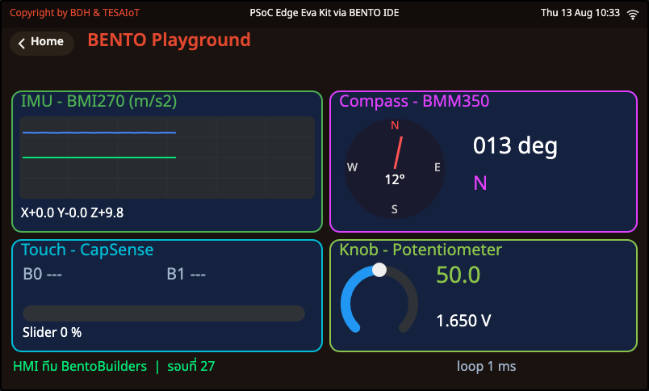
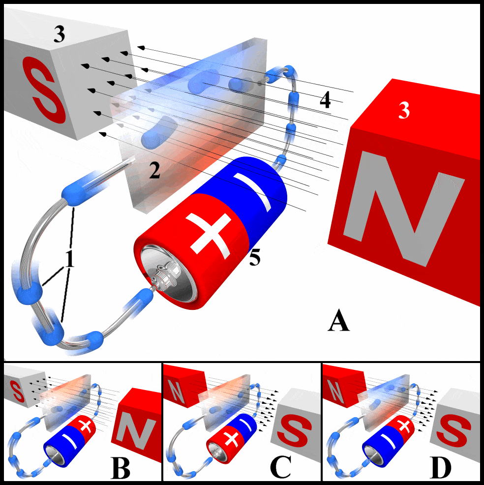
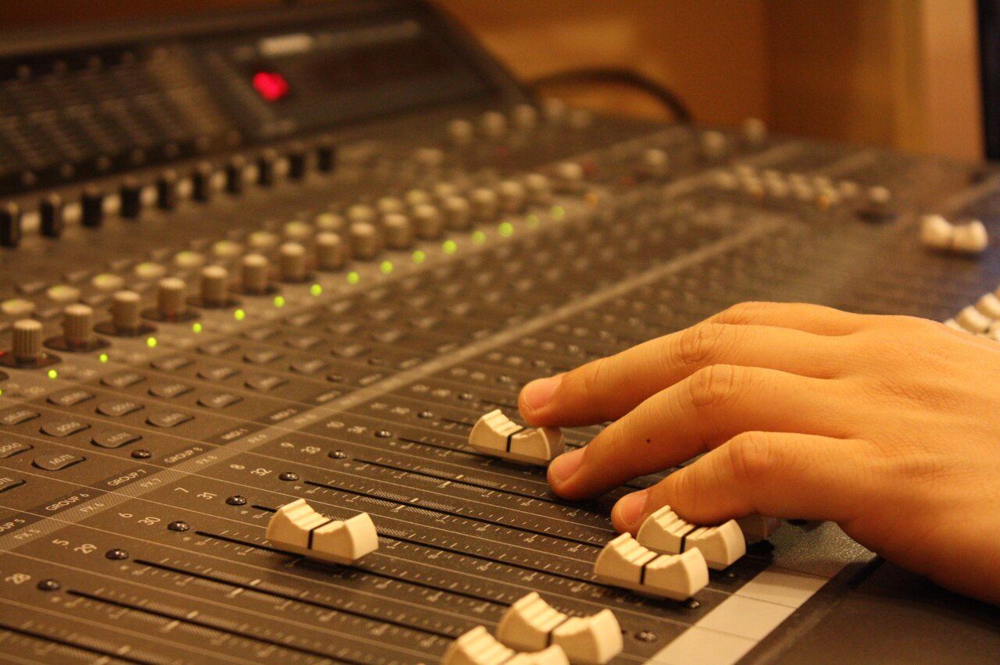
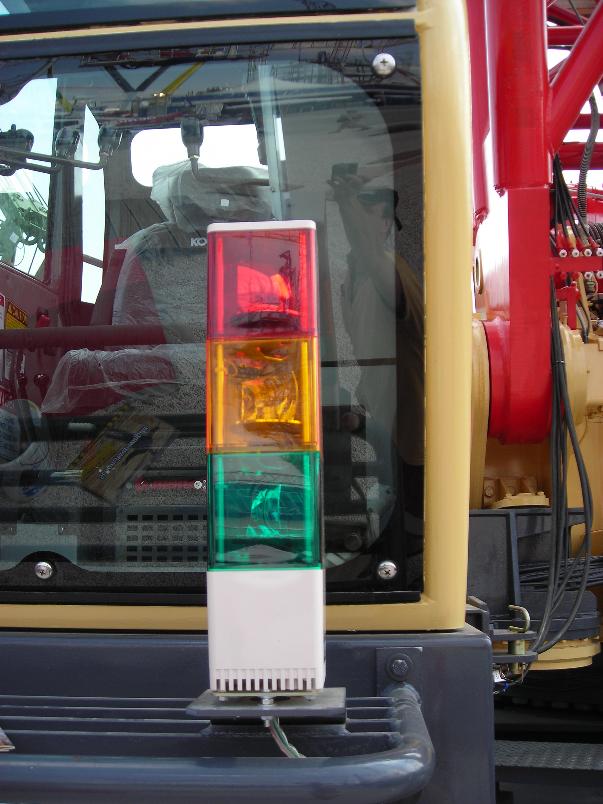
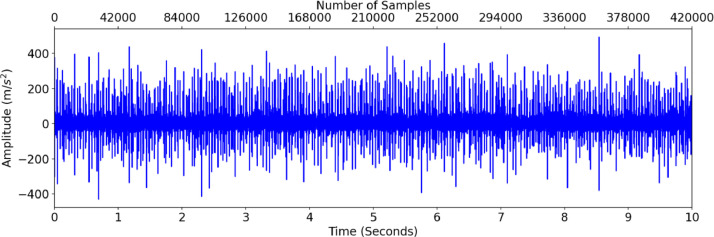
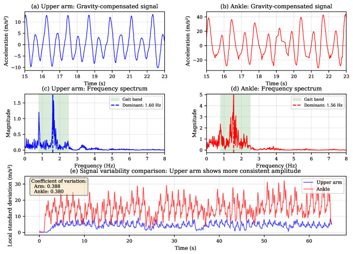
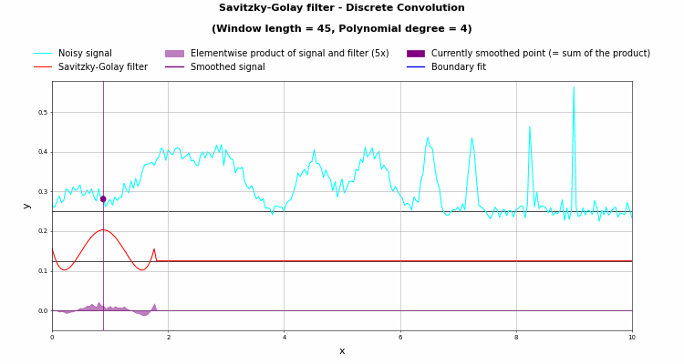

<style>
section { font-size: 23px; padding: 14px 44px; justify-content: flex-start; }
section h1 { font-size: 1.45em; line-height: 1.10; margin: 0 0 .14em; }
section h2 { font-size: 1.10em; margin: .06em 0; }
section h3 { font-size: 1.0em; margin: .12em 0; }
section p, section li { margin: .05em 0; line-height: 1.16; }
section img { max-width: 100%; height: auto; }
section svg { max-height: 205px; width: 100%; }
section table { font-size: .70em; }
section pre { font-size: .50em; line-height: 1.10; background:#0d1117; color:#e6edf3; border:1px solid #30363d; border-radius:8px; padding:12px 16px; box-shadow:0 2px 8px rgba(0,0,0,.25); }
section pre code { white-space: pre-wrap; background:transparent; color:inherit; } section pre .hljs-comment{color:#8b949e;font-style:italic} section pre .hljs-keyword,section pre .hljs-built_in,section pre .hljs-literal{color:#ff7b72} section pre .hljs-string{color:#a5d6ff} section pre .hljs-number{color:#79c0ff} section pre .hljs-title,section pre .hljs-title.function_,section pre .hljs-section{color:#d2a8ff} section pre .hljs-meta{color:#ffa657} section pre .hljs-attr,section pre .hljs-attribute,section pre .hljs-name{color:#7ee787}
section blockquote { margin: .12em 0; font-size: .88em; }
/* two images on a line (parity / 2x2 grids) stay side-by-side and small */
section p > img + img { margin-left: 10px; }
/* scroll-within-slide: dense slides scroll instead of clipping */
section { overflow-y: auto; overflow-x: hidden; }
section::-webkit-scrollbar { width: 11px; }
section::-webkit-scrollbar-thumb { background:#4a90d9; border-radius:6px; }
section::-webkit-scrollbar-track { background:rgba(0,0,0,.06); }
/* image drop-shadow + cover-slide readability (auto) */
section img{filter:drop-shadow(0 3px 12px rgba(0,0,0,.5))}
/* พื้นสำรองของสไลด์ปก: ถ้า img/cover_sNN.svg โหลดไม่ขึ้น ธีมจะคืนพื้นขาว
   แล้วตัวอักษรสีขาวของปกจะหายไปทั้งแผ่น — ปักสีเข้มไว้ให้ภาพเป็นแค่ของประดับ */
section.cover{background-color:#0b1426}
section.cover *{color:#fff !important}
section.cover h1,section.cover h2,section.cover h3,section.cover p,section.cover li,section.cover strong,section.cover em,section.cover blockquote,section.cover div{text-shadow:0 2px 9px rgba(0,0,0,.92),0 0 3px rgba(0,0,0,.8)}
section.cover div[style*="background:#"],section.cover div[style*="background: #"]{background:rgba(10,14,20,.66) !important;border-color:rgba(120,200,255,.45) !important;max-width:62%}
section.cover blockquote{border-left:4px solid rgba(120,200,255,.6) !important;background:rgba(13,17,23,.55) !important;border-radius:6px;padding:.3em .6em}
section.cover h1,section.cover h2,section.cover h3,section.cover p,section.cover blockquote{max-width:60%}
section.cover div:not(:has(img)){max-width:62%}
section.cover img{filter:none}
</style>


<!-- _class: cover -->

# บทเรียน 3.7 — ออกแบบ HMI: การ์ด ลำดับสายตา สี และงบ widget

## ประกอบทุกอย่างที่เรียนมาให้เป็นหน้าจอเดียว ภายใต้งบ 32 widgets ที่ตั้งเอง

**โมดูล 3 — แสดงผลเซนเซอร์บน HMI**

> คาถาประจำบทเรียน: **ออกแบบบนกระดาษก่อน แล้วค่อยพิมพ์ — ข้อจำกัดคือส่วนหนึ่งของโจทย์**

---

## ดูของจริงก่อน — แดชบอร์ดเต็มรูปแบบที่บอร์ดทำได้

<svg viewBox="0 0 640 330" xmlns="http://www.w3.org/2000/svg">
  <rect x="10" y="8" width="620" height="312" rx="10" fill="#0b1224" stroke="#7aa7d9" stroke-width="2"/>
  <text x="24" y="34" font-size="15" fill="#00E676">ผังของ lvgl_dashboards/12_dash_full_eva.py — ไม่ใช่หน้าเฟิร์มแวร์</text>
  <text x="618" y="34" text-anchor="end" font-size="13" fill="#78909c">792 x 398</text>
  <rect x="22" y="46" width="294" height="84" rx="8" fill="#142240" stroke="#4CAF50" stroke-width="2"/>
  <text x="34" y="70" font-size="18" font-weight="700" fill="#4CAF50">IMU · BMI270</text>
  <polyline points="34,112 68,96 102,106 136,88 170,104 204,92 238,110 272,96 306,102" fill="none" stroke="#00E676" stroke-width="2.5">
    <animate attributeName="points" dur="2.2s" repeatCount="indefinite" values="34,112 68,96 102,106 136,88 170,104 204,92 238,110 272,96 306,102;34,96 68,110 102,88 136,106 170,90 204,110 238,92 272,108 306,94;34,112 68,96 102,106 136,88 170,104 204,92 238,110 272,96 306,102"/>
  </polyline>
  <rect x="324" y="46" width="294" height="84" rx="8" fill="#142240" stroke="#E040FB" stroke-width="2"/>
  <text x="336" y="70" font-size="18" font-weight="700" fill="#E040FB">Compass · BMM350</text>
  <circle cx="356" cy="104" r="16" fill="none" stroke="#E040FB" stroke-width="2"/>
  <line x1="356" y1="104" x2="356" y2="90" stroke="#eef2fb" stroke-width="3">
    <animate attributeName="x2" values="356;368;369;356" dur="2.4s" repeatCount="indefinite"/>
    <animate attributeName="y2" values="90;96;112;90" dur="2.4s" repeatCount="indefinite"/></line>
  <text x="386" y="104" font-size="20" fill="#eef2fb">137 deg</text>
  <text x="386" y="124" font-size="16" fill="#E040FB">SE</text>
  <rect x="22" y="138" width="294" height="84" rx="8" fill="#142240" stroke="#00BCD4" stroke-width="2"/>
  <text x="34" y="162" font-size="18" font-weight="700" fill="#00BCD4">CapSense</text>
  <line x1="40" y1="190" x2="300" y2="190" stroke="#0b1a2e" stroke-width="14" stroke-linecap="round"/>
  <line x1="40" y1="190" x2="300" y2="190" stroke="#00BCD4" stroke-width="14" stroke-linecap="round" stroke-dasharray="260" stroke-dashoffset="190">
    <animate attributeName="stroke-dashoffset" values="230;24;180;64;230" dur="4s" repeatCount="indefinite"/></line>
  <text x="34" y="214" font-size="15" fill="#A0B4CC">B0 ---   B1 ---</text>
  <rect x="324" y="138" width="294" height="84" rx="8" fill="#142240" stroke="#8BC34A" stroke-width="2"/>
  <text x="336" y="162" font-size="18" font-weight="700" fill="#8BC34A">Potentiometer</text>
  <path d="M346 208 A24 24 0 0 1 394 208" fill="none" stroke="#26364f" stroke-width="9"/>
  <path d="M346 208 A24 24 0 0 1 394 208" fill="none" stroke="#8BC34A" stroke-width="9" stroke-dasharray="76" stroke-dashoffset="36">
    <animate attributeName="stroke-dashoffset" values="66;13;50;7;66" dur="4s" repeatCount="indefinite"/></path>
  <text x="410" y="204" font-size="22" fill="#eef2fb">48 %</text>
  <rect x="22" y="230" width="294" height="84" rx="8" fill="#142240" stroke="#448AFF" stroke-width="2"/>
  <text x="34" y="254" font-size="18" font-weight="700" fill="#448AFF">Gyro</text>
  <text x="96" y="254" font-size="18" fill="#eef2fb">X +0.4   Y -1.2</text>
  <text x="34" y="284" font-size="15" fill="#A0B4CC">deg/s</text>
  <rect x="324" y="230" width="294" height="84" rx="8" fill="#142240" stroke="#00E676" stroke-width="2"/>
  <text x="336" y="254" font-size="18" font-weight="700" fill="#00E676">สถานะโปรแกรม</text>
  <text x="336" y="284" font-size="17" fill="#eef2fb">รอบที่ 1842</text>
  <text x="470" y="284" font-size="17" fill="#A0B4CC">loop 3 ms</text>
  <circle cx="600" cy="248" r="6" fill="#00E676">
    <animate attributeName="r" values="4;9;4" dur="1.2s" repeatCount="indefinite"/></circle>
</svg>


ผู้สอนเปิดเมนู **Sensor Dashboard** ของเฟิร์มแวร์บนบอร์ดหน้าห้อง แล้วปล่อยให้มันวิ่ง

หน้าจอเดียว การ์ดหลายใบ เซนเซอร์หลายตัวอัปเดตพร้อมกัน ไม่มีเมนูให้เข้า มองแล้วรู้สถานะทั้งระบบภายในสองวินาที — นั่นคือสิ่งที่โรงงานเรียกว่า **HMI** (Human-Machine Interface) หน้าจอที่คนยืนดูแล้วตัดสินใจได้ · วันนี้เราจะสร้างของแบบนี้เอง ด้วยงบ 32 widgets ที่ตั้งเอง (เพดานเฟิร์มแวร์ 64) และไฟล์ Python ไฟล์เดียว

**ภาพจำลองข้างบนคือผังของ `lvgl_dashboards/12_dash_full_eva.py`** (ตัวอย่าง MicroPython ที่มากับเฟิร์มแวร์ หัวไฟล์นับไว้ 23 widgets — ไม่ใช่ไฟล์ในหลักสูตรนี้) **ไม่ใช่หน้า Sensor Dashboard ของเฟิร์มแวร์** — หน้าเฟิร์มแวร์บน Eva Kit มีการ์ด BMI270 · Controls (btn0/btn1/slider) · กราฟการเคลื่อนไหว · เข็มทิศ · จอยสติ๊ก และ **ไม่มีการ์ดลูกบิด** · **บน TESAIoT Dev Kit** หน้าเดียวกันมีการ์ดเพิ่มที่ Eva ไม่มี คือ **DPS368** (ความดัน) **SHT40** (อุณหภูมิ/ความชื้น) และเรดาร์ เพราะเฟิร์มแวร์ประกอบการ์ดตามชิปที่บอร์ดมี (`page_dashboard.c` ครอบด้วยธง `BSP_HAS_*`) ดูของจริงจากบอร์ดของทีม

---

## ทำไม · คืออะไร · ทำยังไง — แผนที่ของชุดบทเรียนนี้

<style scoped>
section table { font-size: .62em; }
section table td, section table th { padding: .16em .55em; }
</style>

| | คำถาม | คำตอบของชุดบทเรียนนี้ | อยู่ช่วงไหน |
|---|---|---|---|
| **Why** | ของทุกชิ้นก็ทำงานได้อยู่แล้วตั้งแต่บทเรียน 2.7–3.6 ทำไมต้องเอามารวมจอเดียว | เพราะแผงควบคุมในโรงงานไม่ได้ออกแบบให้ "สวย" มันออกแบบให้ **คนที่เหนื่อยและรีบ อ่านถูกในครั้งแรก** · และของที่ทำงานได้ทีละชิ้น กับของที่ทำงานพร้อมกันทั้งจอภายใต้เพดาน 64 widgets เป็นคนละโจทย์กัน | ครึ่งแรก · HMI · ลำดับสายตา · สีมีความหมาย |
| **What** | มีอะไรให้ใช้บ้าง | ของใหม่มีสองชนิดคือ `ui.Panel` กับ `ui.Compass` · บวกโมดูล `mic` **ทั้งแปดชื่อ** สำหรับการ์ดใบที่ห้าที่ทีมเลือกได้ และ `sensors.bmm350` **ทั้งห้าชื่อ** ที่ป้อนเข็มทิศ | สไลด์ `bmm350` ห้าชื่อ + สไลด์ `mic` แปดชื่อ |
| **How** | ประกอบยังไงให้ใช้งานได้จริง | นับ widget บนกระดาษให้ครบก่อนพิมพ์ (จองไป **23 จากงบ 32 ที่ตั้งไว้เอง** — เพดานเฟิร์มแวร์คือ 64) → คำนวณพิกัดสี่การ์ดเอง → อ่านเซนเซอร์ทุกตัวในลูปเดียวที่ cadence 200 ms → รันยาวสิบนาทีเพื่อพิสูจน์ | หกไฟล์ตัวอย่าง + ไฟล์ฝึก + soak run |

**ปลายทางที่จับต้องได้** — แดชบอร์ดสี่การ์ดในจอเดียว IMU · เข็มทิศ · CapSense · ลูกบิด ที่รันต่อเนื่องสิบนาทีโดยไม่ค้างและไม่ crash

> บทเรียน 3.4–3.6 เราทำกราฟหนึ่งใบให้ลื่น · ชุดบทเรียนนี้ต้องทำให้ของทั้งจอลื่นพร้อมกัน ภายใต้งบที่นับได้

---

## เป้าหมายของชุดบทเรียนนี้

1. ออกแบบผัง HMI บนกระดาษได้ก่อนเขียนโค้ด — วางการ์ด คำนวณพิกัด และ **นับ widget ให้ครบก่อนพิมพ์**
2. อธิบายหลักการ HMI ที่ใช้ในแผงควบคุมจริงได้: การจัดกลุ่ม ลำดับสายตา และความหมายของสี
3. ประกอบ `ui.Panel` สี่ใบเข้ากับ Chart, Compass, Bar, Arc, Seg7 ให้เป็นหน้าจอเดียวที่อ่านรู้เรื่อง
4. ทดสอบความทนทานด้วยการรันต่อเนื่อง 10 นาที และแยกให้ออกว่า "ค้าง" กับ "ช้า" ต่างกันอย่างไร

ปลายทางของวันนี้: จอบอร์ดขึ้นแดชบอร์ดสี่การ์ดของทีมเรา รันยาวสิบนาทีโดยไม่มีอะไรสะดุด

> ชุดบทเรียนนี้คือ capstone ครึ่งทาง — ไม่มีของใหม่มาก แต่ต้องเอาของเก่าทั้งหมดมาอยู่ร่วมจอเดียวกันให้ได้

---

## ปลายทางของชุดบทเรียนนี้ — สี่การ์ดในจอเดียว



<div style="font-size:.58em;color:#78909c;margin-top:-.3em">หน้าจอจริงจากการรันโค้ดเฉลยบน BENTO Emulator ที่ 800x480 เท่าจอของ Eva Kit และ Dev Kit — ไม่ใช่ภาพวาด ไม่ใช่ mock-up และไม่ใช่ภาพถ่ายจากบอร์ด</div>

- การ์ดสี่ใบเต็มจอ: IMU chart, Compass 013 deg, CapSense และ Potentiometer
- แต่ละใบคือ Panel หนึ่งใบที่ให้สีขอบต่างกัน ใช้แยกกลุ่มข้อมูลด้วยสายตาก่อนอ่านตัวหนังสือ
- แถบล่างบอกชื่อทีมกับ "รอบที่ 17" ส่วนตัวเลข loop ทางขวาถูกปุ่มลอยมุมขวาบังไปบางส่วน — เป็นข้อจำกัดพื้นที่ที่ต้องออกแบบเผื่อ

> งบ widget มีจำกัด การจัดวางจึงเป็นการตัดสินใจ ไม่ใช่การตกแต่ง

---

## ทบทวน — สามชิ้นส่วนที่เราสร้างไว้แล้ว

<svg viewBox="0 0 940 240" xmlns="http://www.w3.org/2000/svg">
  <defs><marker id="r8" markerWidth="10" markerHeight="8" refX="9" refY="4" orient="auto">
    <path d="M0,0 L10,4 L0,8 z" fill="#607d8b"/></marker></defs>
  <rect x="14" y="18" width="256" height="62" rx="9" fill="#f1f8e9" stroke="#558b2f" stroke-width="2"/>
  <text x="30" y="44" font-size="19" font-weight="700" fill="#558b2f">บทเรียน 2.7–2.9 · Arc Seg7 Bar</text>
  <text x="30" y="68" font-size="18" fill="#5b7c14">pot และ CapSense</text>
  <rect x="14" y="90" width="256" height="62" rx="9" fill="#e3f2fd" stroke="#1565c0" stroke-width="2"/>
  <text x="30" y="116" font-size="19" font-weight="700" fill="#1565c0">บทเรียน 3.1–3.3 · motion() 6 แกน</text>
  <text x="30" y="140" font-size="18" fill="#0d47a1">อ่านทีเดียวได้ครบ</text>
  <rect x="14" y="162" width="256" height="62" rx="9" fill="#fff3e0" stroke="#ef6c00" stroke-width="2"/>
  <text x="30" y="188" font-size="19" font-weight="700" fill="#ef6c00">บทเรียน 3.4–3.6 · Chart หลายเส้น</text>
  <text x="30" y="212" font-size="18" fill="#e65100">cadence 200 ms</text>
  <line x1="276" y1="49" x2="452" y2="100" stroke="#607d8b" stroke-width="2.5" marker-end="url(#r8)"/>
  <line x1="276" y1="121" x2="452" y2="118" stroke="#607d8b" stroke-width="2.5" marker-end="url(#r8)"/>
  <line x1="276" y1="193" x2="452" y2="136" stroke="#607d8b" stroke-width="2.5" marker-end="url(#r8)"/>
  <circle cx="276" cy="49" r="6" fill="#558b2f"><animateMotion path="M0,0 L172,51" dur="1.8s" repeatCount="indefinite"/></circle>
  <circle cx="276" cy="121" r="6" fill="#1565c0"><animateMotion path="M0,0 L172,-3" dur="1.8s" begin="0.6s" repeatCount="indefinite"/></circle>
  <circle cx="276" cy="193" r="6" fill="#ef6c00"><animateMotion path="M0,0 L172,-57" dur="1.8s" begin="1.2s" repeatCount="indefinite"/></circle>
  <rect x="462" y="18" width="462" height="206" rx="10" fill="#0b1224" stroke="#7aa7d9" stroke-width="2"/>
  <text x="478" y="42" font-size="18" fill="#00E676">หน้าจอเดียว · การ์ดสี่ใบ · 23 widgets</text>
  <rect x="476" y="52" width="216" height="76" rx="7" fill="#142240" stroke="#4CAF50" stroke-width="2"/>
  <text x="492" y="80" font-size="18" fill="#4CAF50">IMU + Chart</text>
  <text x="492" y="106" font-size="17" fill="#A0B4CC">ของเดิมจากบทเรียน 3.4–3.6</text>
  <rect x="700" y="52" width="212" height="76" rx="7" fill="#142240" stroke="#E040FB" stroke-width="2"/>
  <text x="716" y="80" font-size="18" fill="#E040FB">Compass</text>
  <text x="716" y="106" font-size="17" fill="#A0B4CC">ของใหม่วันนี้</text>
  <rect x="476" y="136" width="216" height="76" rx="7" fill="#142240" stroke="#00BCD4" stroke-width="2"/>
  <text x="492" y="164" font-size="18" fill="#00BCD4">CapSense</text>
  <text x="492" y="190" font-size="17" fill="#A0B4CC">ของเดิมจากบทเรียน 2.7–2.9</text>
  <rect x="700" y="136" width="212" height="76" rx="7" fill="#142240" stroke="#8BC34A" stroke-width="2"/>
  <text x="716" y="164" font-size="18" fill="#8BC34A">Pot</text>
  <text x="716" y="190" font-size="17" fill="#A0B4CC">ของเดิมจากบทเรียน 2.7–2.9</text>
</svg>

| จากบทเรียน | สิ่งที่ทำได้แล้ว | วันนี้กลายเป็น |
|---|---|---|
| บทเรียน 2.7–2.9 | pot → `ui.Arc` + `ui.Seg7`, CapSense slider → `ui.Bar` | การ์ดสองใบล่าง |
| บทเรียน 3.1–3.3 | `sensors.bmi270.motion()` อ่าน 6 แกนใน lock เดียว | แหล่งข้อมูลของกราฟ |
| บทเรียน 3.4–3.6 | `ui.Chart` หลาย series + cadence 200 ms | การ์ด IMU ซ้ายบน |

ของใหม่วันนี้มีสองอย่าง: `ui.Panel` เป็นกรอบการ์ด · `ui.Compass` กินค่าจาก `bmm350.heading()`

ที่เหลือคืองานออกแบบ — จัดของที่มีอยู่แล้วให้อยู่ร่วมจอเดียวกันโดยไม่ทับกัน ไม่เกินงบ และยังอ่านออก

> เนื้อหาใหม่น้อย แต่ความยากขึ้นชัด เพราะครั้งนี้ทุกชิ้นต้องทำงานพร้อมกัน

---

## ทบทวน (ต่อ) — ของสองอย่างที่ต้องเห็นตอนมันเคลื่อน: สนามแม่เหล็ก และนิ้วบนกระจก

<div style="display:flex;gap:24px;align-items:flex-start">
<div style="flex:0 0 300px">



<div style="font-size:.58em;color:#78909c">ที่มา: Peo / Hike395 / Wikimedia Commons — CC BY-SA 3.0 · สนามแม่เหล็กที่เปลี่ยนทิศแล้วแรงดันที่ได้เปลี่ยนตาม — ต้องเห็นทั้งสี่กรณีสลับกันถึงจะเข้าใจว่าทำไมค่าสามแกนถึงพลิกเครื่องหมายเมื่อหมุนบอร์ด</div>

</div>
<div style="flex:1;min-width:0">

**ดูเพิ่ม (7 นาที):** *Projected Capacitive Touch Technology - How It Works* — นิ้ว "ขโมย" เส้นสนามไฟฟ้า คือค่าที่ `capsense.read()` คืนมา

<iframe width="240" height="135" src="https://www.youtube.com/embed/6BS6aQBaMhU" title="Projected Capacitive Touch Technology - How It Works" loading="lazy" frameborder="0" allowfullscreen></iframe>

</div>
</div>

---

## HMI คืออะไร และทำไมต้องจัดของเป็นการ์ด

<svg viewBox="0 0 940 250" xmlns="http://www.w3.org/2000/svg">
  <rect x="14" y="14" width="440" height="222" rx="10" fill="#fdf1f1" stroke="#c62828" stroke-width="2"/>
  <text x="234" y="42" text-anchor="middle" font-size="20" font-weight="700" fill="#c62828">ตัวเลข 15 ตัว ไม่มีกรอบ</text>
  <rect x="24" y="58" width="72" height="34" fill="#c62828" opacity="0.16">
    <animate attributeName="x" values="24;108;192;276;360;24" dur="4s" repeatCount="indefinite"/></rect>
  <text x="60" y="82" text-anchor="middle" font-size="20" fill="#4a2020">12.4</text>
  <text x="144" y="82" text-anchor="middle" font-size="20" fill="#4a2020">0.98</text>
  <text x="228" y="82" text-anchor="middle" font-size="20" fill="#4a2020">137</text>
  <text x="312" y="82" text-anchor="middle" font-size="20" fill="#4a2020">48</text>
  <text x="396" y="82" text-anchor="middle" font-size="20" fill="#4a2020">3.1</text>
  <text x="60" y="128" text-anchor="middle" font-size="20" fill="#4a2020">9.81</text>
  <text x="144" y="128" text-anchor="middle" font-size="20" fill="#4a2020">-1.2</text>
  <text x="228" y="128" text-anchor="middle" font-size="20" fill="#4a2020">0</text>
  <text x="312" y="128" text-anchor="middle" font-size="20" fill="#4a2020">62</text>
  <text x="396" y="128" text-anchor="middle" font-size="20" fill="#4a2020">1.64</text>
  <text x="60" y="174" text-anchor="middle" font-size="20" fill="#4a2020">204</text>
  <text x="144" y="174" text-anchor="middle" font-size="20" fill="#4a2020">0.4</text>
  <text x="228" y="174" text-anchor="middle" font-size="20" fill="#4a2020">17</text>
  <text x="312" y="174" text-anchor="middle" font-size="20" fill="#4a2020">--</text>
  <text x="396" y="174" text-anchor="middle" font-size="20" fill="#4a2020">2.99</text>
  <text x="234" y="216" text-anchor="middle" font-size="18" fill="#8d3b3b">ต้องไล่อ่านป้ายทีละตัว กว่าจะเจอค่าที่ต้องการ</text>
  <rect x="486" y="14" width="440" height="222" rx="10" fill="#f1f8f2" stroke="#2e7d32" stroke-width="2"/>
  <text x="706" y="42" text-anchor="middle" font-size="20" font-weight="700" fill="#2e7d32">การ์ดสี่ใบ หนึ่งใบหนึ่งคำถาม</text>
  <rect x="500" y="56" width="204" height="80" rx="8" fill="#ffffff" stroke="#2e7d32" stroke-width="2"/>
  <text x="602" y="88" text-anchor="middle" font-size="19" fill="#1b5e20">การเคลื่อนไหว</text>
  <text x="602" y="114" text-anchor="middle" font-size="19" fill="#1b5e20">เป็นยังไง</text>
  <rect x="716" y="56" width="204" height="80" rx="8" fill="#ffffff" stroke="#2e7d32" stroke-width="2">
    <animate attributeName="stroke-width" values="2;5;2" dur="2.6s" repeatCount="indefinite"/></rect>
  <text x="818" y="88" text-anchor="middle" font-size="19" fill="#1b5e20">หันหน้า</text>
  <text x="818" y="114" text-anchor="middle" font-size="19" fill="#1b5e20">ไปทางไหน</text>
  <rect x="500" y="146" width="204" height="80" rx="8" fill="#ffffff" stroke="#2e7d32" stroke-width="2"/>
  <text x="602" y="178" text-anchor="middle" font-size="19" fill="#1b5e20">มีใครแตะ</text>
  <text x="602" y="204" text-anchor="middle" font-size="19" fill="#1b5e20">อยู่ไหม</text>
  <rect x="716" y="146" width="204" height="80" rx="8" fill="#ffffff" stroke="#2e7d32" stroke-width="2"/>
  <text x="818" y="178" text-anchor="middle" font-size="19" fill="#1b5e20">ลูกบิดตั้งไว้</text>
  <text x="818" y="204" text-anchor="middle" font-size="19" fill="#1b5e20">เท่าไร</text>
</svg>

แผงควบคุมในโรงงานไม่ได้ออกแบบให้ "สวย" มันออกแบบให้ **คนที่เหนื่อยและรีบ อ่านถูกในครั้งแรก**

หลักข้อแรกคือการจัดกลุ่ม: ค่าที่มาจากแหล่งเดียวกันหรือใช้ตัดสินใจเรื่องเดียวกัน ต้องอยู่ในกรอบเดียวกัน

ลองคิดถึงหน้าจอที่มีตัวเลขสิบห้าตัวเรียงกันเป็นแถวยาวโดยไม่มีกรอบอะไรเลย ต่อให้ตัวเลขถูกทุกตัว คนดูก็ต้องอ่านป้ายกำกับทีละตัวเพื่อหาว่าอันไหนคืออันที่ตัวเองต้องการ นั่นคือเวลาที่เสียไปทุกครั้งที่มีคนมองจอ

การ์ดหนึ่งใบตอบคำถามหนึ่งคำถาม: "การเคลื่อนไหวเป็นยังไง" · "หันหน้าไปทางไหน" · "มีใครแตะอยู่ไหม" · "ลูกบิดตั้งไว้เท่าไร"

> ถ้าตอบไม่ได้ว่าการ์ดใบนี้ตอบคำถามอะไร แสดงว่ายังไม่ควรมีการ์ดใบนี้

---

## ลำดับสายตา — อะไรต้องอ่านออกจากอีกฝั่งห้อง

<svg viewBox="0 0 940 236" xmlns="http://www.w3.org/2000/svg">
  <rect x="14" y="14" width="420" height="208" rx="10" fill="#0b1224" stroke="#7aa7d9" stroke-width="2"/>
  <text x="36" y="52" font-size="20" font-weight="700" fill="#78909c">Compass - BMM350</text>
  <text x="36" y="108" font-size="36" font-weight="700" fill="#eef2fb">137 deg</text>
  <text x="36" y="152" font-size="24" fill="#E040FB">SE</text>
  <text x="36" y="192" font-size="18" fill="#607d8b">อัปเดตล่าสุด 0.2 วินาทีที่แล้ว</text>
  <line x1="438" y1="46" x2="462" y2="46" stroke="#b0bec5" stroke-width="2"/>
  <line x1="438" y1="100" x2="462" y2="100" stroke="#b0bec5" stroke-width="2"/>
  <line x1="438" y1="146" x2="462" y2="146" stroke="#b0bec5" stroke-width="2"/>
  <line x1="438" y1="188" x2="462" y2="188" stroke="#b0bec5" stroke-width="2"/>
  <text x="472" y="52" font-size="19" fill="#78909c">ชั้น 3 · ชื่อการ์ด — font 20 สีจาง</text>
  <text x="472" y="106" font-size="19" font-weight="700" fill="#c62828">ชั้น 1 · ค่าหลัก — font 28 อ่านจาก 3 เมตร</text>
  <text x="472" y="152" font-size="19" fill="#6a1b9a">ชั้น 2 · ค่าประกอบ — font 24 อ่านตอนเดินเข้ามา</text>
  <text x="472" y="194" font-size="19" fill="#78909c">ชั้น 3 · รายละเอียด — font 16-18</text>
  <circle cx="454" cy="100" r="7" fill="#c62828">
    <animate attributeName="r" values="5;10;5" dur="1.8s" repeatCount="indefinite"/></circle>
</svg>

<div style="display:flex;gap:20px;align-items:flex-start">
<div style="flex:1;min-width:0">

บนหน้าจอเดียวกัน ของทุกชิ้นไม่ได้สำคัญเท่ากัน เราต้องตัดสินใจแทนคนดูว่าอะไรควรถูกเห็นก่อน

**สามชั้นที่ใช้จริงในงาน HMI**

1. **ชั้นที่ต้องอ่านจากระยะสองสามเมตร** — ตัวเลขหลักของการ์ด ใช้ฟอนต์ 24–28 สีขาวสว่างบนพื้นเข้ม
2. **ชั้นที่อ่านตอนเดินเข้ามาใกล้** — ค่ารายละเอียด กราฟ แถบ ใช้ฟอนต์ปกติ
3. **ชั้นที่อ่านเฉพาะตอนหา** — ชื่อการ์ด หน่วย ป้ายกำกับ ใช้สีจางลง

ใน `ui` เรามีเครื่องมือคุมสามชั้นนี้อยู่แค่สองอย่าง: `value=` ของ Label (ขนาดฟอนต์ 14/16/20/24/28) และ `color=` เท่านั้น จึงต้องใช้ให้ตรงเป้า อย่าใส่ 28 ให้ทุกตัวเพราะ "ใหญ่แล้วดูดี" — ถ้าทุกอย่างเด่น แปลว่าไม่มีอะไรเด่น

ในโค้ดวันนี้ ตัวเลของศาของเข็มทิศได้ 28 px ส่วนชื่อการ์ดได้ 20 px และหน่วยได้สีเทา นั่นคือการตัดสินใจ ไม่ใช่ความบังเอิญ

</div>
<div style="flex:0 0 330px">



<div style="font-size:.58em;color:#78909c">ภาพ: hanmaili / Wikimedia Commons — CC0 1.0 · แผงเฟดเดอร์ของมิกเซอร์จริง — ค่าหลายสิบค่าที่อ่านได้ในสายตาเดียวเพราะตำแหน่งเรียงกัน ไม่ใช่เพราะตัวเลขใหญ่</div>

</div>
</div>

> ขนาดฟอนต์คือการประกาศว่า "ของชิ้นนี้สำคัญกว่าชิ้นนั้น" — ประกาศให้ตรงกับความจริง

---

## สีมีความหมาย ไม่ใช่ของตกแต่ง

<svg viewBox="0 0 940 228" style="max-height:170px" xmlns="http://www.w3.org/2000/svg">
  <rect x="14" y="16" width="290" height="150" rx="10" fill="#e8f5e9" stroke="#2e7d32" stroke-width="3"/>
  <text x="159" y="52" text-anchor="middle" font-size="23" font-weight="700" fill="#2e7d32">เขียว · ปกติ</text>
  <text x="159" y="90" text-anchor="middle" font-size="30" font-weight="700" fill="#1b5e20">9.8</text>
  <text x="159" y="124" text-anchor="middle" font-size="19" fill="#1b5e20">อยู่ในเกณฑ์</text>
  <text x="159" y="150" text-anchor="middle" font-size="19" fill="#4a7c4e">ไม่ต้องทำอะไร</text>
  <rect x="324" y="16" width="290" height="150" rx="10" fill="#fff8e1" stroke="#f9a825" stroke-width="3"/>
  <text x="469" y="52" text-anchor="middle" font-size="23" font-weight="700" fill="#f57f17">เหลือง · เฝ้าดู</text>
  <text x="469" y="90" text-anchor="middle" font-size="30" font-weight="700" fill="#8d6e00">11.4</text>
  <text x="469" y="124" text-anchor="middle" font-size="19" fill="#8d6e00">เริ่มออกนอกช่วงที่คุ้น</text>
  <text x="469" y="150" text-anchor="middle" font-size="19" fill="#a1683a">กลับมาดูอีกที</text>
  <rect x="634" y="16" width="290" height="150" rx="10" fill="#ffebee" stroke="#c62828" stroke-width="3">
    <animate attributeName="stroke-width" values="3;9;3" dur="1.4s" repeatCount="indefinite"/></rect>
  <text x="779" y="52" text-anchor="middle" font-size="23" font-weight="700" fill="#c62828">แดง · ต้องลงมือ</text>
  <text x="779" y="90" text-anchor="middle" font-size="30" font-weight="700" fill="#b71c1c">14.9</text>
  <text x="779" y="124" text-anchor="middle" font-size="19" fill="#b71c1c">เกินเกณฑ์แล้ว</text>
  <text x="779" y="150" text-anchor="middle" font-size="19" fill="#8d3b3b">หยุดหรือแก้ เดี๋ยวนี้</text>
  <text x="470" y="204" text-anchor="middle" font-size="20" font-weight="700" fill="#37474f">ห้ามใช้แดงกับของที่ปกติ — วันที่เกิดเรื่องจริงจะไม่มีใครสังเกตเห็น</text>
</svg>

<div style="display:flex;gap:20px;align-items:flex-start">
<div style="flex:1;min-width:0">

ในแผงควบคุมจริง สีสามสีนี้ถูกจองไว้แล้ว และคนทั้งอุตสาหกรรมอ่านมันตรงกัน

| สี | ความหมาย | คนดูควรทำอะไร |
|---|---|---|
| เขียว | ปกติ อยู่ในเกณฑ์ | ไม่ต้องทำอะไร |
| เหลือง/อำพัน | เฝ้าดู เริ่มออกนอกช่วงที่คุ้นเคย | กลับมาดูอีกที |
| แดง | ต้องลงมือ | หยุด/แก้ เดี๋ยวนี้ |

กฎที่ตามมาคือ **ห้ามใช้แดงกับของที่ปกติ** ถ้าเราทำกรอบการ์ดเป็นสีแดงเพราะชอบสีแดง วันที่เกิดเรื่องจริงจะไม่มีใครสังเกตเห็น

</div>
<div style="flex:0 0 200px">



<div style="font-size:.52em;color:#78909c">ภาพ: User:Mattes / Wikimedia Commons — สาธารณสมบัติ · เสาไฟสถานะจริงบนเครื่องจักร แดง-เหลือง-เขียวเท่านั้น — ยืนยันว่าชุดสีที่อ่านออกจากระยะไกลมีไม่กี่สี และความหมายถูกล็อกไว้แล้ว</div>

</div>
</div>

---

## จานสีของเฉลย — สีสถานะสามสี กับสีประจำเซนเซอร์สี่สี

สีที่เหลือ (ม่วง · เขียวน้ำทะเล · ม่วงกล้วยไม้ · ฟ้า — จานสีเส้นข้อมูลของหลักสูตร) ใช้เพื่อ **แยกแหล่งข้อมูล** ไม่ใช่บอกสถานะ — พื้นการ์ดกับตัวหนังสือยืมจาก `ui_theme.py` ในชุดตัวอย่างที่มากับเฟิร์มแวร์ หน้าจอของเราจะดูเป็นระบบเดียวกับเมนูอื่น · บรรทัดจริงจาก [`s08_dashboard.py`](https://github.com/tesaiot/tesa-qualification-program/blob/main/courses/aiot-micropython/m03-sensor-hmi/l09-dashboard-lab/solution/s08_dashboard.py):

```python
BG_CARD   = 0x171B22   # พื้นการ์ด เทาเข้มอมน้ำเงิน
COL_WHITE = 0xE8EAED   # ตัวเลขพระเอก
COL_GRAY  = 0x9AA3AF   # ข้อความประกอบ / สถานะเงียบ เทาอ่อน
COL_IMU   = 0x8E7BFF   # BMI270 - เส้นที่ 2 ของจานสีเส้นข้อมูล สีม่วง
COL_COMP  = 0x2FB6A8   # BMM350 - เส้นที่ 3 ของจานสีเส้นข้อมูล สีเขียวน้ำทะเล
COL_TOUCH = 0xC77DFF   # CapSense - เส้นที่ 4 ของจานสีเส้นข้อมูล สีม่วงกล้วยไม้
COL_POT   = 0x4A9EFF   # Potentiometer - เส้นที่ 1 ของจานสีเส้นข้อมูล สีฟ้า
COL_STAT  = 0x30A46C   # เขียว "ปกติ"
COL_WARN  = 0xF5A623   # เหลือง "ค่าเชื่อไม่ได้"
COL_ALERT = 0xE5484D   # แดง "ต้องลงมือ"
```

> ให้คัดค่าสีที่ใช้จริงมาวางไว้ต้นไฟล์ของเราเอง (อย่างที่เห็นข้างบน) แทนการ import — ชื่อในไฟล์ต้นทางไม่ตรงกับของเราทุกตัว เช่นสีเตือนของเราชื่อ `COL_ALERT` ส่วนต้นทางเรียกว่า `COL_AX` และอย่าสุ่มเลขสีเองเด็ดขาด

---

## อัตราอัปเดต กับ ความอ่านออก — สองอย่างนี้ตีกัน

<svg viewBox="0 0 940 238" xmlns="http://www.w3.org/2000/svg">
  <rect x="14" y="14" width="600" height="98" rx="9" fill="#ffebee" stroke="#c62828" stroke-width="2"/>
  <text x="30" y="44" font-size="20" font-weight="700" fill="#c62828">อัปเดตทุก 20 ms · 50 ครั้งต่อวินาที</text>
  <rect x="32" y="66" width="76" height="34" rx="5" fill="#c62828" opacity="0.22">
    <animate attributeName="x" values="32;122;212;302;32" dur="0.8s" repeatCount="indefinite"/></rect>
  <text x="40" y="92" font-size="26" font-weight="700" fill="#b71c1c">47.2</text>
  <text x="130" y="92" font-size="26" font-weight="700" fill="#b71c1c">51.8</text>
  <text x="220" y="92" font-size="26" font-weight="700" fill="#b71c1c">44.6</text>
  <text x="310" y="92" font-size="26" font-weight="700" fill="#b71c1c">49.1</text>
  <text x="404" y="92" font-size="19" fill="#8d3b3b">ตาคนอ่านไม่ทัน</text>
  <rect x="14" y="126" width="600" height="98" rx="9" fill="#e8f5e9" stroke="#2e7d32" stroke-width="2"/>
  <text x="30" y="156" font-size="20" font-weight="700" fill="#2e7d32">อัปเดตทุก 200 ms · 5 ครั้งต่อวินาที</text>
  <rect x="32" y="178" width="76" height="34" rx="5" fill="#2e7d32" opacity="0.22">
    <animate attributeName="x" values="32;122;212;302;32" dur="3.2s" repeatCount="indefinite"/></rect>
  <text x="40" y="204" font-size="26" font-weight="700" fill="#1b5e20">47.2</text>
  <text x="130" y="204" font-size="26" font-weight="700" fill="#1b5e20">48.1</text>
  <text x="220" y="204" font-size="26" font-weight="700" fill="#1b5e20">48.6</text>
  <text x="310" y="204" font-size="26" font-weight="700" fill="#1b5e20">48.4</text>
  <text x="404" y="204" font-size="19" fill="#4a7c4e">อ่านทัน เห็นทิศทาง</text>
  <rect x="630" y="14" width="296" height="210" rx="9" fill="#eceff1" stroke="#455a64" stroke-width="2"/>
  <text x="778" y="44" text-anchor="middle" font-size="19" font-weight="700" fill="#455a64">ฝั่งเครื่อง — คิววาดของ CM55</text>
  <line x1="663" y1="75" x2="893" y2="75" stroke="#cfd8dc" stroke-width="26" stroke-linecap="round"/>
  <line x1="663" y1="75" x2="893" y2="75" stroke="#c62828" stroke-width="26" stroke-linecap="round" stroke-dasharray="230" stroke-dashoffset="180">
    <animate attributeName="stroke-dashoffset" values="200;0;0;200" dur="3s" repeatCount="indefinite"/></line>
  <text x="650" y="112" font-size="18" fill="#37474f">ลูปเร็วเกิน คิวเต็ม</text>
  <text x="650" y="136" font-size="18" fill="#c62828">เฟรมหายเงียบ ๆ ไม่มี error</text>
  <line x1="663" y1="165" x2="893" y2="165" stroke="#cfd8dc" stroke-width="26" stroke-linecap="round"/>
  <line x1="663" y1="165" x2="893" y2="165" stroke="#2e7d32" stroke-width="26" stroke-linecap="round" stroke-dasharray="230" stroke-dashoffset="180">
    <animate attributeName="stroke-dashoffset" values="185;155;175;150;185" dur="3s" repeatCount="indefinite"/></line>
  <text x="650" y="204" font-size="18" fill="#2e7d32">ที่ 200 ms คิวว่างเสมอ</text>
</svg>

สัญชาตญาณบอกว่ายิ่งอัปเดตถี่ยิ่งดี ในงาน HMI มันไม่จริง

ตัวเลขที่เปลี่ยนทุก 20 ms คือตัวเลขที่ **มนุษย์อ่านไม่ทัน** สายตาเห็นเป็นเลขเบลอ ๆ ที่กระพริบ ส่วนกราฟที่เลื่อนเร็วเกินก็ดูไม่ออกว่าแนวโน้มขึ้นหรือลง

ที่ 200 ms คนอ่านตัวเลขทันพอดี (ห้าครั้งต่อวินาที) กราฟเลื่อนแบบเห็นทิศทาง และ CM55 มีเวลาวาดครบทุกเฟรม

**อีกด้านหนึ่ง — ด้านของเครื่อง** ลูปที่เร็วเกินจะส่งงานให้ CM55 ถี่กว่าที่มันวาดทัน คิวเต็ม แล้วเฟรมจะหายไปเงียบ ๆ ไม่มี error ให้เห็น หน้าจอแค่ "รู้สึกกระตุก" ซึ่งเป็นอาการที่ดีบักยากที่สุด

จำง่าย ๆ: แดชบอร์ดหนัก **200 ms** · หน้าเบา ๆ ที่มีไม่กี่ widget อย่างต่ำ **50 ms**

> การจำกัดความถี่ไม่ใช่การยอมแพ้เรื่องประสิทธิภาพ มันคือการออกแบบให้ตรงกับความเร็วของสายตาคน

---

## อัตราอัปเดต กับ ความอ่านออก (ต่อ) — หน้าตาของปัญหา และราคาของการอ่านออก

 

<div style="font-size:.58em;color:#78909c">ซ้าย: Sehri M. et al., Data in Brief (2023) — CC BY 4.0 · ข้อมูลสั่นสะเทือนดิบอัตราสูงจากเครื่องจักรจริง วาดลงจอทุกจุดแล้วคนอ่านไม่ออก นี่คือหน้าตาของปัญหาที่สไลด์นี้กำลังพูดถึง · ขวา: Kisiel M. et al., Sensors 26(3):876 (2026) — CC BY 4.0 · ค่าความเร่งจากการเดินจริง วัดที่แขนเทียบกับที่ข้อเท้าพร้อมสเปกตรัมของทั้งสองจุด จุดติดตั้งเปลี่ยนรูปสัญญาณทั้งชุด ไม่ใช่แค่ขนาด</div>



<div style="font-size:.58em;color:#78909c">ภาพ: b_sliding_window_smoothing_animation.gif / Wikimedia Commons — CC0 1.0 · หน้าต่างเฉลี่ยที่เลื่อนไปบนข้อมูลจริง — ให้เห็นว่าการทำให้อ่านออกคือการยอมช้าลง ไม่ใช่การได้ของฟรี</div>

---

## เข้าใจฮาร์ดแวร์ · จอกว้าง 792 สูง 398 และเลขพิกัดที่เราต้องคำนวณเอง

`ui` ไม่มีระบบ layout อัตโนมัติแบบเว็บ (ไม่มี grid ไม่มี flex) ทุก widget ต้องบอกพิกัดเอง เราจึงต้องบวกลบเลขบนกระดาษก่อน

<svg viewBox="0 0 800 406" style="max-height:400px" xmlns="http://www.w3.org/2000/svg">
  <g transform="translate(4,4)">
  <rect x="0" y="0" width="792" height="398" fill="#0b1224" stroke="#7aa7d9" stroke-width="2"/>
  <text x="10" y="24" font-size="19" fill="#00E676">หัวเรื่อง/แถบบน  y=6</text>
  <rect x="8" y="34" width="386" height="176" rx="12" fill="#142240" stroke="#4CAF50" stroke-width="3"/>
  <text x="24" y="66" font-size="23" font-weight="700" fill="#4CAF50">การ์ด 1 · IMU + Chart</text>
  <text x="24" y="98" font-size="20" fill="#cfe3ff">x=8  y=34</text>
  <text x="24" y="126" font-size="20" fill="#cfe3ff">w=386  h=176</text>
  <text x="24" y="158" font-size="18" fill="#A0B4CC">Chart อยู่ใน x=18 y=66 w=366 h=102</text>
  <text x="24" y="188" font-size="18" fill="#A0B4CC">4 widgets</text>
  <rect x="402" y="34" width="382" height="176" rx="12" fill="#142240" stroke="#E040FB" stroke-width="3"/>
  <text x="418" y="66" font-size="23" font-weight="700" fill="#E040FB">การ์ด 2 · Compass</text>
  <text x="418" y="98" font-size="20" fill="#cfe3ff">x=402  y=34</text>
  <text x="418" y="126" font-size="20" fill="#cfe3ff">w=382  h=176</text>
  <text x="418" y="158" font-size="18" fill="#A0B4CC">Compass x=420 y=68 w=126</text>
  <text x="418" y="188" font-size="18" fill="#A0B4CC">5 widgets</text>
  <rect x="8" y="218" width="386" height="140" rx="12" fill="#142240" stroke="#00BCD4" stroke-width="3"/>
  <text x="24" y="250" font-size="23" font-weight="700" fill="#00BCD4">การ์ด 3 · CapSense</text>
  <text x="24" y="282" font-size="20" fill="#cfe3ff">x=8  y=218  w=386  h=140</text>
  <text x="24" y="312" font-size="18" fill="#A0B4CC">Bar x=22 y=300 w=350 h=20</text>
  <text x="24" y="340" font-size="18" fill="#A0B4CC">6 widgets</text>
  <rect x="402" y="218" width="382" height="140" rx="12" fill="#142240" stroke="#8BC34A" stroke-width="3"/>
  <text x="418" y="250" font-size="23" font-weight="700" fill="#8BC34A">การ์ด 4 · Pot</text>
  <text x="418" y="282" font-size="20" fill="#cfe3ff">x=402  y=218  w=382  h=140</text>
  <text x="418" y="312" font-size="18" fill="#A0B4CC">Arc w=100 · Seg7 w=150</text>
  <text x="418" y="340" font-size="18" fill="#A0B4CC">5 widgets</text>
  <text x="10" y="384" font-size="19" fill="#00E676">แถบสถานะ  y=370  (รอบที่ N | loop ms)</text>
  <text x="470" y="384" font-size="18" fill="#A0B4CC">ช่องไฟ 8 px รอบขอบและระหว่างการ์ด</text>
  </g>
</svg>

เลขที่ต้องตรวจให้ตรงเสมอ: **x + w ต้องไม่เกิน 792** และ **y + h ต้องไม่เกิน 398** (การ์ด 2: 402+382 = 784 เหลือขอบขวา 8 px พอดี)

> วางของทับกันแล้วจอไม่ error มันแค่วาดทับ — เลขที่ผิดจะเงียบจนกว่าเราจะมองเห็นด้วยตา

---

## `ui.Panel` — การ์ดหนึ่งใบ กับพารามิเตอร์ที่ชื่อไม่ตรงความหมาย

<svg viewBox="0 0 940 240" xmlns="http://www.w3.org/2000/svg">
  <rect x="440" y="42" width="280" height="150" rx="16" fill="#142240" stroke="#4CAF50" stroke-width="6">
    <animate attributeName="stroke" values="#4CAF50;#E040FB;#00BCD4;#8BC34A;#4CAF50" dur="4s" repeatCount="indefinite"/></rect>
  <text x="580" y="124" text-anchor="middle" font-size="22" fill="#cfe3ff">ui.Panel</text>
  <text x="20" y="72" font-size="19" font-weight="700" fill="#1565c0">min = สีขอบ (ไม่ใช่ค่าต่ำสุด)</text>
  <line x1="300" y1="66" x2="436" y2="52" stroke="#1565c0" stroke-width="2"/>
  <text x="20" y="152" font-size="19" font-weight="700" fill="#6a1b9a">color = สีพื้นของการ์ด</text>
  <line x1="248" y1="146" x2="436" y2="130" stroke="#6a1b9a" stroke-width="2"/>
  <text x="748" y="72" font-size="19" font-weight="700" fill="#ef6c00">max = รัศมีมุมโค้ง</text>
  <line x1="740" y1="66" x2="716" y2="50" stroke="#ef6c00" stroke-width="2"/>
  <text x="748" y="152" font-size="17" font-weight="700" fill="#2e7d32">value = ความหนาขอบ</text>
  <line x1="740" y1="146" x2="722" y2="140" stroke="#2e7d32" stroke-width="2"/>
  <text x="470" y="222" text-anchor="middle" font-size="19" fill="#455a64">ชื่อ kwarg เดียวกัน เปลี่ยนความหมายไปตามชนิดของ widget</text>
</svg>

`ui.Panel` ใช้ kwargs ชุดเดียวกับ widget อื่น แต่ **ความหมายไม่เหมือนใคร** จุดนี้พลาดกันทุกปี

| kwarg | สำหรับ Panel แปลว่า | ค่าที่เราใช้ |
|---|---|---|
| `color` | สีพื้นของการ์ด | `BG_CARD` = 0x171B22 |
| `min` | **สีขอบ** (ไม่ใช่ค่าต่ำสุด) | สีประจำเซนเซอร์ของการ์ดนั้น |
| `max` | **รัศมีมุมโค้ง** เป็นพิกเซล | 12 |
| `value` | **ความหนาเส้นขอบ** เป็นพิกเซล | 2 |

```python
imu_panel = ui.Panel(x=24, y=100, w=368, h=136,
                     color=BG_CARD, min=COL_IMU, max=12, value=2)
```

เทียบกับ `ui.Slider` ที่ `min/max/value` เป็นตัวเลขค่าจริง ๆ และ `ui.Label` ที่ `value` คือขนาดฟอนต์ — ชื่อ kwarg เดียวกันเปลี่ยนความหมายไปตามชนิด widget

**ลำดับการสร้างสำคัญ:** สร้าง Panel ก่อน แล้วค่อยสร้าง Label/Chart ทับลงไป ของที่สร้างทีหลังอยู่ชั้นบน ถ้าสลับลำดับ การ์ดจะบังตัวหนังสือจนหาย

> เวลาสงสัยว่า kwarg ตัวไหนแปลว่าอะไร ให้เปิดตารางนี้ อย่าเดาจากชื่อ

---

## งบ widget — นับบนกระดาษให้ครบก่อนพิมพ์โค้ดบรรทัดแรก

<svg viewBox="0 0 940 230" xmlns="http://www.w3.org/2000/svg">
  <text x="470" y="36" text-anchor="middle" font-size="21" font-weight="700" fill="#37474f">งบ 32 ช่องที่เราตั้งเอง (เพดานเฟิร์มแวร์ 64) — จองไป 23 เหลือ 9</text>
  <rect x="24" y="66" width="26" height="56" rx="4" fill="#00E676" stroke="#0b1224" stroke-width="1"/>
  <rect x="52" y="66" width="26" height="56" rx="4" fill="#00E676" stroke="#0b1224" stroke-width="1"/>
  <rect x="80" y="66" width="26" height="56" rx="4" fill="#00E676" stroke="#0b1224" stroke-width="1"/>
  <rect x="108" y="66" width="26" height="56" rx="4" fill="#4CAF50" stroke="#0b1224" stroke-width="1"/>
  <rect x="136" y="66" width="26" height="56" rx="4" fill="#4CAF50" stroke="#0b1224" stroke-width="1"/>
  <rect x="164" y="66" width="26" height="56" rx="4" fill="#4CAF50" stroke="#0b1224" stroke-width="1"/>
  <rect x="192" y="66" width="26" height="56" rx="4" fill="#4CAF50" stroke="#0b1224" stroke-width="1"/>
  <rect x="220" y="66" width="26" height="56" rx="4" fill="#E040FB" stroke="#0b1224" stroke-width="1"/>
  <rect x="248" y="66" width="26" height="56" rx="4" fill="#E040FB" stroke="#0b1224" stroke-width="1"/>
  <rect x="276" y="66" width="26" height="56" rx="4" fill="#E040FB" stroke="#0b1224" stroke-width="1"/>
  <rect x="304" y="66" width="26" height="56" rx="4" fill="#E040FB" stroke="#0b1224" stroke-width="1"/>
  <rect x="332" y="66" width="26" height="56" rx="4" fill="#E040FB" stroke="#0b1224" stroke-width="1"/>
  <rect x="360" y="66" width="26" height="56" rx="4" fill="#00BCD4" stroke="#0b1224" stroke-width="1"/>
  <rect x="388" y="66" width="26" height="56" rx="4" fill="#00BCD4" stroke="#0b1224" stroke-width="1"/>
  <rect x="416" y="66" width="26" height="56" rx="4" fill="#00BCD4" stroke="#0b1224" stroke-width="1"/>
  <rect x="444" y="66" width="26" height="56" rx="4" fill="#00BCD4" stroke="#0b1224" stroke-width="1"/>
  <rect x="472" y="66" width="26" height="56" rx="4" fill="#00BCD4" stroke="#0b1224" stroke-width="1"/>
  <rect x="500" y="66" width="26" height="56" rx="4" fill="#00BCD4" stroke="#0b1224" stroke-width="1"/>
  <rect x="528" y="66" width="26" height="56" rx="4" fill="#8BC34A" stroke="#0b1224" stroke-width="1"/>
  <rect x="556" y="66" width="26" height="56" rx="4" fill="#8BC34A" stroke="#0b1224" stroke-width="1"/>
  <rect x="584" y="66" width="26" height="56" rx="4" fill="#8BC34A" stroke="#0b1224" stroke-width="1"/>
  <rect x="612" y="66" width="26" height="56" rx="4" fill="#8BC34A" stroke="#0b1224" stroke-width="1"/>
  <rect x="640" y="66" width="26" height="56" rx="4" fill="#8BC34A" stroke="#0b1224" stroke-width="1"/>
  <rect x="668" y="66" width="26" height="56" rx="4" fill="#2b3b52" stroke="#0b1224" stroke-width="1"/>
  <rect x="696" y="66" width="26" height="56" rx="4" fill="#2b3b52" stroke="#0b1224" stroke-width="1"/>
  <rect x="724" y="66" width="26" height="56" rx="4" fill="#2b3b52" stroke="#0b1224" stroke-width="1"/>
  <rect x="752" y="66" width="26" height="56" rx="4" fill="#2b3b52" stroke="#0b1224" stroke-width="1"/>
  <rect x="780" y="66" width="26" height="56" rx="4" fill="#2b3b52" stroke="#0b1224" stroke-width="1"/>
  <rect x="808" y="66" width="26" height="56" rx="4" fill="#2b3b52" stroke="#0b1224" stroke-width="1"/>
  <rect x="836" y="66" width="26" height="56" rx="4" fill="#2b3b52" stroke="#0b1224" stroke-width="1"/>
  <rect x="864" y="66" width="26" height="56" rx="4" fill="#2b3b52" stroke="#0b1224" stroke-width="1"/>
  <rect x="892" y="66" width="26" height="56" rx="4" fill="#2b3b52" stroke="#0b1224" stroke-width="1"/>
  <rect x="24" y="66" width="26" height="56" fill="#ffffff" opacity="0.4">
    <animate attributeName="x" values="24;640;24" dur="5s" repeatCount="indefinite"/></rect>
  <rect x="30" y="152" width="18" height="18" rx="3" fill="#00E676"/>
  <text x="56" y="167" font-size="18" fill="#37474f">หัวเรื่อง + สถานะ 3</text>
  <rect x="248" y="152" width="18" height="18" rx="3" fill="#4CAF50"/>
  <text x="274" y="167" font-size="18" fill="#37474f">IMU 4</text>
  <rect x="392" y="152" width="18" height="18" rx="3" fill="#E040FB"/>
  <text x="418" y="167" font-size="18" fill="#37474f">Compass 5</text>
  <rect x="580" y="152" width="18" height="18" rx="3" fill="#00BCD4"/>
  <text x="606" y="167" font-size="18" fill="#37474f">CapSense 6</text>
  <rect x="30" y="192" width="18" height="18" rx="3" fill="#8BC34A"/>
  <text x="56" y="207" font-size="18" fill="#37474f">Pot 5</text>
  <rect x="248" y="192" width="18" height="18" rx="3" fill="#2b3b52"/>
  <text x="274" y="207" font-size="18" fill="#37474f">ว่าง 9 ช่อง — เผื่อไว้ให้ทีมต่อยอด</text>
  <text x="916" y="207" text-anchor="end" font-size="24" font-weight="700" fill="#c62828">รวม 23 / 32</text>
</svg>

เฟิร์มแวร์รับได้ **64 widgets** ต่อหนึ่งหน้าจอ (`UI_MAX_WIDGETS` ใน `ipc_ui_protocol.h` เท่ากันทั้งสองบอร์ด) ตัวที่ 65 จะไม่ขึ้น และมันไม่แจ้งเตือนอะไรเลย · ส่วน **32 คืองบที่ชุดบทเรียนนี้ตั้งให้ตัวเอง** เพื่อเหลือที่ไว้ให้บทเรียน 4.1–5.3 ต่อยอดบนหน้าจอใบเดิม

วิธีทำงานที่ถูกคือเขียนตารางนี้ก่อน แล้วรวมเลขให้เห็นก่อนแตะคีย์บอร์ด

<div style="display:flex;gap:24px;align-items:flex-start">
<div style="flex:0 0 58%">

| การ์ด | widget ที่ใช้ | จำนวน |
|---|---|---|
| หัวเรื่อง + แถบสถานะ | Label ชื่อทีม, Label รอบ, Label loop ms | 3 |
| 1 · IMU | Panel, Label หัวข้อ, Chart, Label ค่า 3 แกน | 4 |
| 2 · Compass | Panel, Label หัวข้อ, Compass, Label องศา, Label ทิศ | 5 |
| 3 · CapSense | Panel, Label หัวข้อ, Label ปุ่ม B0, Label ปุ่ม B1, Bar, Label % | 6 |
| 4 · Pot | Panel, Label หัวข้อ, Arc, Seg7, Label โวลต์ | 5 |
| **รวม** | | **23 / 32** |

</div>
<div style="flex:1;min-width:0">

**สังเกตว่าอะไรไม่นับ:** series ของ Chart ไม่ใช่ widget (`add_series()` สามครั้งยังเป็น Chart ตัวเดียว) ส่วน Panel **นับ** ทุกใบ การ์ดสี่ใบจึงกินไปแล้ว 4 ตัวก่อนจะแสดงค่าอะไรเลย

เหลืองบ 9 ตัวไว้ให้ทีมต่อยอด — ใครจะเพิ่มการ์ดที่ห้า ต้องกลับมาแก้ตารางนี้ก่อน

> ตารางนี้อยู่ในหัวไฟล์โค้ดด้วย เพราะคนที่กลับมาแก้ในอีกสองสัปดาห์คือตัวเราเอง

</div>
</div>

---

## เกร็ด: ทำไมเพดานถึงเป็น 64 พอดี

<svg viewBox="0 0 940 244" xmlns="http://www.w3.org/2000/svg">
  <defs><marker id="g8" markerWidth="10" markerHeight="8" refX="9" refY="4" orient="auto">
    <path d="M0,0 L10,4 L0,8 z" fill="#455a64"/></marker></defs>
  <rect x="14" y="66" width="212" height="110" rx="10" fill="#e3f2fd" stroke="#1565c0" stroke-width="2"/>
  <text x="120" y="102" text-anchor="middle" font-size="20" font-weight="700" fill="#1565c0">CM33</text>
  <text x="120" y="130" text-anchor="middle" font-size="18" fill="#0d47a1">MicroPython</text>
  <text x="120" y="156" text-anchor="middle" font-size="18" fill="#0d47a1">ui.Label(...)</text>
  <rect x="272" y="30" width="356" height="182" rx="10" fill="#f5f7fa" stroke="#546e7a" stroke-width="2"/>
  <text x="450" y="54" text-anchor="middle" font-size="17" font-weight="700" fill="#455a64">ตาราง handle 64 ช่อง (วาดเฉพาะ 32 ช่องที่เป็นงบของชุดบทเรียนนี้)</text>
  <rect x="290" y="64" width="34" height="26" rx="4" fill="#90caf9" stroke="#546e7a" stroke-width="1"/>
  <rect x="328" y="64" width="34" height="26" rx="4" fill="#90caf9" stroke="#546e7a" stroke-width="1"/>
  <rect x="366" y="64" width="34" height="26" rx="4" fill="#90caf9" stroke="#546e7a" stroke-width="1"/>
  <rect x="404" y="64" width="34" height="26" rx="4" fill="#90caf9" stroke="#546e7a" stroke-width="1"/>
  <rect x="442" y="64" width="34" height="26" rx="4" fill="#90caf9" stroke="#546e7a" stroke-width="1"/>
  <rect x="480" y="64" width="34" height="26" rx="4" fill="#90caf9" stroke="#546e7a" stroke-width="1"/>
  <rect x="518" y="64" width="34" height="26" rx="4" fill="#90caf9" stroke="#546e7a" stroke-width="1"/>
  <rect x="556" y="64" width="34" height="26" rx="4" fill="#90caf9" stroke="#546e7a" stroke-width="1"/>
  <rect x="290" y="94" width="34" height="26" rx="4" fill="#90caf9" stroke="#546e7a" stroke-width="1"/>
  <rect x="328" y="94" width="34" height="26" rx="4" fill="#90caf9" stroke="#546e7a" stroke-width="1"/>
  <rect x="366" y="94" width="34" height="26" rx="4" fill="#90caf9" stroke="#546e7a" stroke-width="1"/>
  <rect x="404" y="94" width="34" height="26" rx="4" fill="#90caf9" stroke="#546e7a" stroke-width="1"/>
  <rect x="442" y="94" width="34" height="26" rx="4" fill="#90caf9" stroke="#546e7a" stroke-width="1"/>
  <rect x="480" y="94" width="34" height="26" rx="4" fill="#90caf9" stroke="#546e7a" stroke-width="1"/>
  <rect x="518" y="94" width="34" height="26" rx="4" fill="#90caf9" stroke="#546e7a" stroke-width="1"/>
  <rect x="556" y="94" width="34" height="26" rx="4" fill="#90caf9" stroke="#546e7a" stroke-width="1"/>
  <rect x="290" y="124" width="34" height="26" rx="4" fill="#90caf9" stroke="#546e7a" stroke-width="1"/>
  <rect x="328" y="124" width="34" height="26" rx="4" fill="#90caf9" stroke="#546e7a" stroke-width="1"/>
  <rect x="366" y="124" width="34" height="26" rx="4" fill="#90caf9" stroke="#546e7a" stroke-width="1"/>
  <rect x="404" y="124" width="34" height="26" rx="4" fill="#90caf9" stroke="#546e7a" stroke-width="1"/>
  <rect x="442" y="124" width="34" height="26" rx="4" fill="#90caf9" stroke="#546e7a" stroke-width="1"/>
  <rect x="480" y="124" width="34" height="26" rx="4" fill="#90caf9" stroke="#546e7a" stroke-width="1"/>
  <rect x="518" y="124" width="34" height="26" rx="4" fill="#90caf9" stroke="#546e7a" stroke-width="1"/>
  <rect x="556" y="124" width="34" height="26" rx="4" fill="#eceff1" stroke="#546e7a" stroke-width="1"/>
  <rect x="290" y="154" width="34" height="26" rx="4" fill="#eceff1" stroke="#546e7a" stroke-width="1"/>
  <rect x="328" y="154" width="34" height="26" rx="4" fill="#eceff1" stroke="#546e7a" stroke-width="1"/>
  <rect x="366" y="154" width="34" height="26" rx="4" fill="#eceff1" stroke="#546e7a" stroke-width="1"/>
  <rect x="404" y="154" width="34" height="26" rx="4" fill="#eceff1" stroke="#546e7a" stroke-width="1"/>
  <rect x="442" y="154" width="34" height="26" rx="4" fill="#eceff1" stroke="#546e7a" stroke-width="1"/>
  <rect x="480" y="154" width="34" height="26" rx="4" fill="#eceff1" stroke="#546e7a" stroke-width="1"/>
  <rect x="518" y="154" width="34" height="26" rx="4" fill="#eceff1" stroke="#546e7a" stroke-width="1"/>
  <rect x="556" y="154" width="34" height="26" rx="4" fill="#eceff1" stroke="#546e7a" stroke-width="1"/>
  <text x="450" y="200" text-anchor="middle" font-size="18" fill="#78909c">ขนาดคงที่ ไม่ขอหน่วยความจำเพิ่มตอนรัน</text>
  <rect x="676" y="66" width="248" height="110" rx="10" fill="#eceff1" stroke="#455a64" stroke-width="2"/>
  <text x="800" y="102" text-anchor="middle" font-size="20" font-weight="700" fill="#455a64">CM55 + LVGL</text>
  <text x="800" y="130" text-anchor="middle" font-size="18" fill="#37474f">วาดของจริงบนจอ</text>
  <text x="800" y="156" text-anchor="middle" font-size="18" fill="#37474f">อ่านจากตารางนี้</text>
  <line x1="230" y1="110" x2="268" y2="110" stroke="#455a64" stroke-width="3" marker-end="url(#g8)"/>
  <line x1="632" y1="110" x2="672" y2="110" stroke="#455a64" stroke-width="3" marker-end="url(#g8)"/>
  <circle cx="232" cy="110" r="7" fill="#1565c0"><animateMotion path="M0,0 L32,0" dur="1.6s" repeatCount="indefinite"/></circle>
  <circle cx="232" cy="152" r="7" fill="#c62828"><animateMotion path="M0,0 L36,16 L0,44" dur="2.8s" repeatCount="indefinite"/></circle>
  <text x="14" y="228" font-size="19" font-weight="700" fill="#c62828">widget ตัวที่ 65 ไม่มีช่องให้ลง — หายเงียบ ๆ ไม่มี error</text>
  <text x="924" y="228" text-anchor="end" font-size="19" fill="#455a64">จองล่วงหน้าในขนาดที่รู้แน่ ดีกว่ายืดหยุ่นแล้วพังตอนทำงาน</text>
</svg>

ตัวเลข 64 ไม่ได้มาจากความสวยงามของเลขยกกำลังสอง มันมาจากข้อจำกัดจริงของการคุยข้ามคอร์ — และเท่ากันทั้ง Eva Kit และ Dev Kit เพราะสองบอร์ดใช้ `ipc_ui` ชุดเดียวกัน

โค้ด Python ของเราอยู่บน CM33 ส่วน widget จริง ๆ ถูกสร้างและวาดโดย LVGL บน CM55 สองฝั่งนี้คุยกันผ่าน IPC ซึ่งมีพื้นที่หน่วยความจำร่วมขนาดคงที่ ทุก widget ที่สร้างจะกิน "ช่อง" ในตารางอ้างอิงฝั่ง CM55 หนึ่งช่อง และตารางนั้นถูกจองขนาดไว้ตายตัวตั้งแต่ตอนคอมไพล์ — จองแบบไม่ต้องขอหน่วยความจำเพิ่มตอนรัน เพราะการขอหน่วยความจำระหว่างวาดจอคือทางลัดสู่การค้าง

นี่คือแบบแผนที่เจอได้ทั่วไปในงาน embedded: **จองล่วงหน้าในขนาดที่รู้แน่ ดีกว่ายืดหยุ่นแล้วเสี่ยงพังตอนทำงาน** ระบบที่ต้องทำงานยาว ๆ โดยไม่มีคนดูแล เลือกทางแรกเสมอ

**เชื่อมกับวันนี้:** ตอนทีมนั่งเถียงกันว่าจะตัด Label ตัวไหนออกเพื่อให้พองบ 32 ที่ตั้งไว้ — นั่นคือการทำงานภายใต้ข้อจำกัดของหน่วยความจำจริง แบบเดียวกับที่วิศวกรออกแบบ HMI ในเครื่องจักรทำอยู่ทุกวัน และเป็นเหตุผลที่ MVP ของวันนี้วัดกันที่ "รันสิบนาทีไม่ค้าง" ไม่ใช่ "มีของบนจอเยอะที่สุด"
