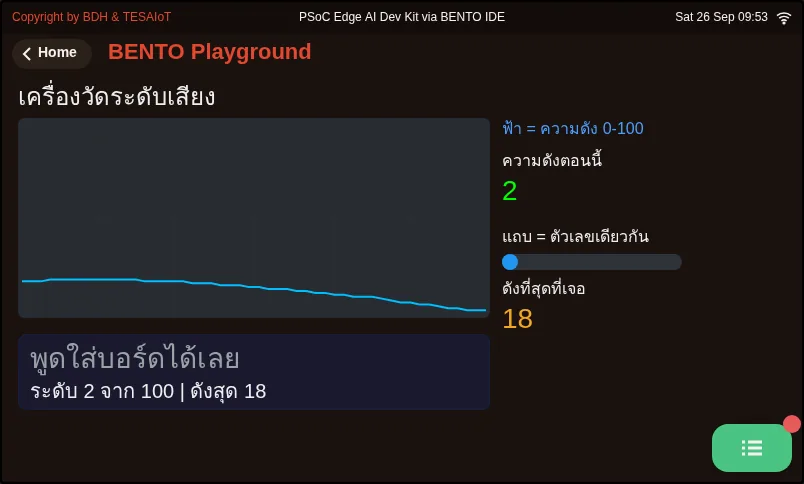
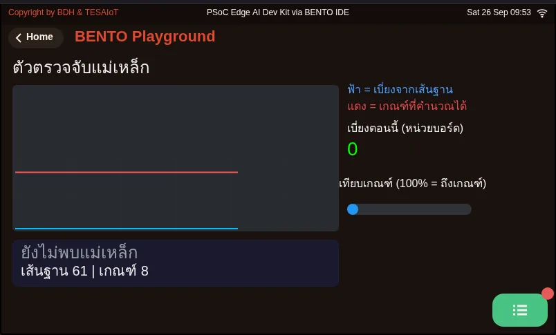

# บทเรียน 3.8 — ประกอบแดชบอร์ด: สี่การ์ดในลูปเดียว

> โมดูล 3 — แสดงผลเซนเซอร์บน HMI · สไลด์: [slides.md](slides.md) · [ภาพรวมโมดูล](../README.md) · [หน้าหลักสูตร](../../README.md)

แกะโค้ดจริงของแดชบอร์ดสี่การ์ดทีละท่า ตั้งแต่การเตรียมจอโดยไม่มี sensors.init() การเลือก widget ตามว่าใครเป็นคนเปลี่ยนค่า ไปจนถึงลูปเดียวที่อ่านเซนเซอร์สี่ตัวแบบ sync ทุก 200 ms พร้อมรู้จัก sensors.bmm350 ห้าชื่อและโมดูล mic แปดชื่อสำหรับการ์ดใบที่ห้า

## เป้าหมาย

เมื่อจบบทเรียนนี้ คุณจะ:

1. อธิบายลำดับสามบรรทัดตอนเริ่มโปรแกรม (ui.screen() แล้ว sleep_ms(200) แล้วอ่าน motion() ทิ้งหนึ่งครั้งใน try) และบอกได้ว่าทำไมไฟล์ไม่มี sensors.init() และทำไมการเงียบสิบกว่าวินาทีตอนอ่านครั้งแรกบน Eva Kit คือการรอ ไม่ใช่การค้าง
2. ให้เหตุผลการเลือก widget ในการ์ดทั้งสี่ได้อย่างน้อยสามข้อ เช่น คูณ 10 ก่อนป้อน Chart, ใช้ Bar ไม่ใช่ Slider กับ CapSense, ใช้ไฟสองดวงแทนป้ายเปลี่ยนสี และใช้ Arc คู่กับ Seg7 และคำนวณชื่อทิศจาก DIRS ด้วยสูตร +22.5 หาร 45 ได้ถูกต้อง
3. อธิบายโครงลูปหลักได้ครบห้าจังหวะ (จับเวลา t0 อ่านสี่เซนเซอร์แบบ sync อัปเดต widget เรียก ui.poll() และ sleep_ms(200)) และบอกได้ว่าทำไม except จึงคงค่าเดิมไว้แทนการเขียนศูนย์ทับ
4. เลือกคำสั่งของ mic และ sensors.bmm350 ให้ถูกงานได้ เช่น ใช้ mic.stats() ครั้งเดียวเมื่อต้องการทั้ง rms และ peak และรายงานค่า magnetic() เป็นค่าเบี่ยงจากเส้นฐานในหน่วยบอร์ด ไม่ใช่ uT

## ก่อนเริ่ม

เอาผังกระดาษและตารางงบ widget จากบทเรียน 3.7 มาวางไว้ข้างตัว บทเรียนนี้แกะโค้ดจริงของเฉลย `s08_dashboard.py`
ในบทเรียน 3.9 ทีละท่า ให้เปิดไฟล์นั้นไว้อีกหน้าต่างหนึ่ง บนจอบอร์ดแตะการ์ด **BENTO Playground** ค้างไว้ และถ้าจะ
ลองการ์ดเสียง ให้อยู่ในที่ที่พูดหรือตบมือใส่บอร์ดได้

- **อุปกรณ์:** บอร์ด Eva Kit หรือ TESAIoT Dev Kit ที่ลงเฟิร์มแวร์ MicroPython ของ BENTO แล้ว หรือ BENTO Emulator ใน [BENTO IDE](https://ide.tesaiot.dev/)
- **เรียนมาก่อน:** [บทเรียน 3.7 — ออกแบบ HMI: การ์ด ลำดับสายตา สี และงบ widget](../l07-hmi-design/README.md)

## แนวคิด

งาน 70% เฟิร์มแวร์ทำให้แล้ว คือวาดทุก widget ด้วย LVGL จัดคิว IPC ข้ามคอร์ อ่านเซนเซอร์สี่ตัว แปลงสนามแม่เหล็ก
เป็นองศา และจัดการ touch อีก 30% เป็นของเรา คือค่าไหนอยู่ด้วยกัน ค่าไหนต้องเด่น สีแปลว่าอะไร อัปเดตถี่แค่ไหน
และงบให้ใคร ห้าข้อนี้ไม่มีข้อไหนเป็นไวยากรณ์ Python มันคืองานออกแบบล้วน ๆ

**ท่าที่ 1 เตรียมจอ** `ui.screen()` ล้าง widget เดิมทั้งหมด ไม่เรียกแล้วของจากสคริปต์ก่อนหน้าจะกินงบตั้งแต่ยังไม่เริ่ม
ตามด้วย `sleep_ms(200)` ให้ CM55 ตามทัน แล้วอ่าน `sensors.bmi270.motion()` ทิ้งหนึ่งครั้งใน try ให้การรอไปเกิด
ตรงนั้นก่อนสร้างการ์ด การอ่านครั้งแรกบน Eva Kit เงียบได้ถึง 16 วินาที (Dev Kit ยังไม่ได้วัด) นั่นคือการรอ
อย่าเพิ่งถอดสาย และบน Dev Kit ห้ามโยกสวิตช์บนฐานเพราะนั่นคือสวิตช์ไฟ ไฟล์ไม่มี `sensors.init()` โดยตั้งใจ
บน Eva Kit เฟิร์มแวร์ปฏิเสธด้วย `OSError` เพราะ CM55 เป็นเจ้าของบัส I2C ของเซนเซอร์ทั้งชุด บน Dev Kit บรรทัดนั้น
ผ่านแต่ไม่จำเป็น โค้ดชุดเดียวจึงรันได้ทั้งสองบอร์ด

**ท่าที่ 2–4 การ์ดสี่ใบ** Chart รับเฉพาะจำนวนเต็ม เราจึงคูณค่าจริงด้วย 10 แล้วตั้งแกน -150 ถึง 150 (คือ -15.0 ถึง
+15.0 m/s²) ป้อน `int(ax)` ตรง ๆ กราฟจะเป็นขั้นบันได series แรกได้สีจาก `color=` ของ Chart อีกสองเส้นได้จาก
`add_series()` ซึ่งคืน index ไว้ใช้กับ `set_next()` กราฟบอกแนวโน้ม ตัวเลขบอกค่าปัจจุบัน จึงใส่คู่กัน `ui.Compass`
ใช้ `w` เป็นเส้นผ่านศูนย์กลาง รับองศาผ่าน `.value()` โดย 0 คือทิศเหนือ ตัวเลของศาได้ฟอนต์ 28 ใหญ่ที่สุดในจอ
และชื่อทิศได้จาก `DIRS[int((heading + 22.5) / 45.0) % 8]` บวก 22.5 คือเลื่อนขอบช่องให้ทิศเหนือกินช่วง 337.5–22.5
องศา การ์ดสัมผัสใช้ **Bar ไม่ใช่ Slider** เพราะ Slider คือของที่คนลาก ส่วน Bar คือของที่เครื่องแสดง ค่ามาจาก
นิ้วบนแถบ CapSense จริง ไม่ใช่จากจอ ปุ่มสองปุ่มใช้ไฟสองดวงแทนป้ายเปลี่ยนสี ถ่ายเป็นขาวดำแล้วยังแยกออก และ
ไฟหรี่ตอนไม่ได้แตะ ไม่ใช่หาย การ์ดลูกบิดใช้ Arc ตอบว่า "อยู่ตรงไหนของช่วง" คู่กับ Seg7 ที่ให้ตัวเลขจดได้
หลักเดียวกันทั้งหมดคือ เลือก widget ตาม "ใครเป็นคนเปลี่ยนค่านี้" ไม่ใช่ตามว่าอันไหนดูดีกว่า

**ท่าที่ 5 ลูปหลัก** เมื่อเรียก `ui.*` ครั้งแรก ระบบอ่านเซนเซอร์อัตโนมัติของเฟิร์มแวร์จะหยุด เราจึงอ่านเองทุกตัว
แบบ synchronous เรียงกันในรอบเดียว และแตะเซนเซอร์ให้น้อยครั้งที่สุด `motion()` ให้หกแกนในครั้งเดียว
`capsense.read()` ให้สองปุ่มกับ slider ในครั้งเดียว ทุกการอ่านห่อ try และ except **ไม่เขียนศูนย์ทับ** แค่ยกธง `ok`
เพราะศูนย์หน้าตาเหมือนค่าที่วัดมาจริง แล้วปล่อยให้ไฟค่าค้างเป็นคนบอก `ui.poll()` ต้องเรียกทุกลูป ไม่งั้นจอจะซ่อน
widget ราวสองวินาทีแล้วกลับมาวน ๆ ส่วน `t0` ต้นลูปคือเครื่องมือวัดเวลาที่ใช้ไปต่อรอบ ที่ 200 ms สิบนาทีคือราว
สามพันรอบ บรรทัดที่แพงจะโผล่ให้เห็นเอง

**ของใหม่สำหรับการ์ดเข็มทิศและการ์ดใบที่ห้า** `sensors.bmm350` มีห้าชื่อ ไม่รับอาร์กิวเมนต์ และโยน `OSError`
เมื่ออ่านไม่ได้ มีแต่ `heading()` ที่ขยับตัวคาลิเบรต และมันคืนค่าเฉลี่ยแบบวงกลมของสิบครั้งหลังสุด ส่วนหน่วยของ
`magnetic()` ยังตอบไม่ได้ ภาพจากบอร์ดวัดขนาดรวมได้ราว 1532 ขณะที่สนามโลกอยู่ที่ 25–65 uT กติกาคือเขียนว่า
"หน่วยของบอร์ด" และเทียบกับเส้นฐานที่ทีมวัดเองเสมอ (ทิศยังถูก เพราะ atan2 สนใจแค่อัตราส่วน) และ `cal_reset()`
กับ `cal_status()` ยังไม่มีใครรันบนบอร์ดจริง โมดูล `mic` ฝังมากับเฟิร์มแวร์ มีแปดชื่อ ต้อง `mic.start()` ก่อน
คิวเสียงยาวราว 625 ms และจ่ายของเก่าก่อน `stats()` ที่ค่าตั้งต้น `fresh=True` ทิ้งของค้างจน `lag()` วัดได้ 0–48 ms
`level()` เป็นสเกลอ็อกเทฟ rms เพิ่มเท่าตัว level ขึ้นราว 9 หน่วย และ `rms()` `peak()` `level()` แต่ละตัวอ่านไมค์ใหม่
หนึ่งครั้ง ราว 32 ms ต่อครั้ง ต้องการหลายค่าให้เรียก `stats()` ครั้งเดียว

## ตัวอย่างสมบูรณ์

ทั้งสองไฟล์ไม่ใช่ส่วนของแดชบอร์ด แต่เป็นชิ้นส่วนของการ์ดใบที่ห้าที่ทีมเลือกได้ ใช้เวลาราว 25 นาที

1. **02_mic_sound_level_meter.py** ก่อนรัน ให้ทายว่าห้องเงียบ เสียงพูด และตบมือจะได้ level ราวเท่าไร แล้วรันเทียบกับ
   ตัวเลขในสไลด์ (7 · 54 · 92) สังเกตว่าแถบ ตัวเลข และกราฟขยับพร้อมกัน แล้วลองแก้ `SENS` เป็น 5 วัดห้องเดิมซ้ำ
   ตัวเลข 0–100 ของ `level()` เป็นสเกลอ็อกเทฟ อย่าอ่านเป็นเปอร์เซ็นต์ของสเกลเต็ม
2. **04_magnet_presence.py** วางบอร์ดนิ่งระหว่างเก็บเส้นฐาน แล้วเอาแม่เหล็กเข้าใกล้ ดูเส้นค่าเบี่ยงพุ่งข้ามเส้นเกณฑ์
   สังเกตว่าเกณฑ์คำนวณจากความผันผวนของห้องนั้น (`spread * THRESH_K` แต่ไม่ต่ำกว่า `FLOOR_DEV`) ไม่ใช่เลขที่ฝังไว้
   ลองย้ายไปวางใกล้โต๊ะเหล็กหรือจอคอมพิวเตอร์แล้วรันใหม่ และจดค่าเป็น "หน่วยบอร์ด" เท่านั้น

ไฟล์เสียงอีกสองไฟล์ (`03_mic_clap_trigger.py` และ `07_mic_window_stats.py`) กับ `05_door_open_switch.py`
อยู่ในบทเรียน 3.9 ถ้าจะทดลองสลับ `fresh` ให้เห็นคิวโตกับตา ให้เปิด `07_mic_window_stats.py`

| ไฟล์ | ไฟล์นี้สอน |
|---|---|
| [examples/02_mic_sound_level_meter.py](examples/02_mic_sound_level_meter.py) | เครื่องวัดระดับเสียงในห้อง |
| [examples/04_magnet_presence.py](examples/04_magnet_presence.py) | ตรวจว่ามีแม่เหล็กอยู่ใกล้หรือไม่ |

สไลด์ของบทเรียนนี้อ้างถึงไฟล์ที่อยู่ในบทเรียนอื่นด้วย:

- [m03-sensor-hmi/l09-dashboard-lab/practice/s08_dashboard.py](../l09-dashboard-lab/practice/s08_dashboard.py) — Mini-HMI แดชบอร์ด 4 การ์ด บน Eva Kit / Dev Kit (ฉบับฝึกเติมโค้ด)
- [shared/usecase/14_hard_iron_calibration.py](../../shared/usecase/14_hard_iron_calibration.py) — การคาลิเบรตเข็มทิศ เป็นสิ่งที่วัดได้

**ภาพจอจาก BENTO Emulator** ของตัวอย่างในบทนี้ (คลิกชื่อไฟล์เพื่อเปิดโค้ด)

<figure><figcaption><a href="examples/02_mic_sound_level_meter.py"><code>02_mic_sound_level_meter.py</code></a> เครื่องวัดระดับเสียงในห้อง</figcaption></figure>
<figure><figcaption><a href="examples/04_magnet_presence.py"><code>04_magnet_presence.py</code></a> ตรวจว่ามีแม่เหล็กอยู่ใกล้หรือไม่</figcaption></figure>

## เช็กความเข้าใจ

คำถามชุดเดียวกันอยู่ใน [quiz.yaml](quiz.yaml) สำหรับระบบที่ตรวจอัตโนมัติ

1. เพื่อนร่วมทีมใส่ sensors.init() กลับเข้าไปที่ต้นไฟล์ แล้วรันบน Eva Kit จะเกิดอะไรขึ้น *(เลือกหนึ่งข้อ · เป้าหมายข้อ 1)*
   - ก) เฟิร์มแวร์ปฏิเสธด้วย OSError เพราะ CM55 เป็นเจ้าของบัส I2C ของเซนเซอร์ทั้งชุด
   - ข) ผ่านไปได้ และทำให้การอ่านครั้งแรกเร็วขึ้น
   - ค) จำเป็นต้องมี ไม่งั้น motion() จะคืนศูนย์ตลอด
   - ง) จอค้าง 16 วินาทีแล้วทำงานต่อตามปกติ

   

เฉลย

   **ก** — บน Eva Kit คอร์จอเป็นเจ้าของบัสเซนเซอร์และอ่านค่าเก็บไว้ให้ ฝั่ง Python จึงอ่านได้เลยโดยไม่ต้อง init และ init() ได้ OSError ทันที ส่วนการเงียบนานตอนอ่านครั้งแรกคือการรอคอร์จอเริ่มตอบ ซึ่งไฟล์ย้ายไปเกิดก่อนสร้างการ์ดด้วยการอ่านทิ้งหนึ่งครั้ง

   

2. ทำไมการ์ด CapSense จึงแสดงตำแหน่งนิ้วด้วย ui.Bar ไม่ใช่ ui.Slider ทั้งที่หน้าตาคล้ายกัน *(เลือกหนึ่งข้อ · เป้าหมายข้อ 2)*
   - ก) ค่ามาจากนิ้วบนแถบ CapSense จริง Slider จะทำให้คนดูเข้าใจผิดว่าลากบนจอได้
   - ข) Bar กินงบน้อยกว่า Slider สองเท่า
   - ค) Slider รับค่าเกิน 50 ไม่ได้
   - ง) Bar วาดเร็วกว่า จึงไม่ทำให้คิวของ CM55 ล้น

   

เฉลย

   **ก** — Slider คือของที่คนลาก ส่วน Bar คือของที่เครื่องแสดง หน้าตาต้องสอดคล้องกับสิ่งที่ทำได้จริง เลือก widget ตามว่าใครเป็นคนเปลี่ยนค่านี้ ไม่ใช่ตามว่าอันไหนดูดีกว่า

   

3. heading เท่ากับ 350.0 องศา บรรทัด DIRS[int((heading + 22.5) / 45.0) % 8] จะได้ชื่อทิศอะไร เมื่อ DIRS = ["N", "NE", "E", "SE", "S", "SW", "W", "NW"] *(เลือกหนึ่งข้อ · เป้าหมายข้อ 2)*
   - ก) N
   - ข) NW
   - ค) W
   - ง) IndexError เพราะได้ index 8

   

เฉลย

   **ก** — (350 + 22.5) / 45 = 8.27 ตัดเหลือ 8 แล้ว % 8 ได้ 0 คือ N การบวก 22.5 เลื่อนขอบช่องให้ทิศเหนือกินช่วง 337.5–22.5 องศา และ % 8 กันไม่ให้ index หลุดขอบ

   

4. ข้อใดถูกต้องเกี่ยวกับลูปหลักของแดชบอร์ด เลือกทุกข้อที่ถูก *(เลือกได้หลายข้อ · เป้าหมายข้อ 3)*
   - ก) ใช้ motion() ครั้งเดียวแทน acceleration() กับ gyroscope() เพื่อแตะเซนเซอร์ให้น้อยครั้งที่สุด
   - ข) ถ้าอ่านพลาด except คงค่าเดิมไว้และยกธง ok ไม่เขียนศูนย์ทับ
   - ค) ui.poll() ต้องเรียกทุกลูป แม้หน้านั้นจะไม่มีปุ่มให้กด
   - ง) เฟิร์มแวร์ยังอ่านเซนเซอร์อัตโนมัติให้ตลอด จึงไม่ต้องอ่านเองในลูป
   - จ) ถ้าอ่านพลาดให้เขียน 0 ลงจอ คนดูจะได้รู้ว่ามีปัญหา

   

เฉลย

   **ก, ข, ค** — เมื่อเรียก ui.* ครั้งแรก การอ่านอัตโนมัติของเฟิร์มแวร์หยุด เราจึงอ่านเองแบบ sync และอ่านให้น้อยครั้งที่สุด ศูนย์หน้าตาเหมือนค่าที่วัดมาจริง จึงคงค่าเดิมแล้วให้ไฟค่าค้างบอก ส่วน poll คือจังหวะที่ CM55 ได้ระบายคิว ไม่เรียกแล้วจอจะซ่อน widget ราวสองวินาที

   

5. ทีมจะทำการ์ดใบที่ห้าด้วย mic และอยากเพิ่มค่าจาก sensors.bmm350 ข้อใดถูกต้อง เลือกทุกข้อที่ถูก *(เลือกได้หลายข้อ · เป้าหมายข้อ 4)*
   - ก) ต้องการทั้ง rms และ peak ให้เรียก mic.stats() ครั้งเดียวแล้วแกะค่าออกมา
   - ข) เรียก mic.peak() แล้ว mic.rms() ติดกันได้ค่าจากหน้าต่างเสียงเดียวกัน
   - ค) ค่าจาก bmm350.magnetic() ให้รายงานเป็นค่าเบี่ยงจากเส้นฐานในหน่วยบอร์ด ไม่ใช่ uT
   - ง) ใส่ sens=9 ใน mic.start() จะได้ ValueError ทันที
   - จ) การเรียกแต่ magnetic() ทำให้ค่าคาลิเบรตลู่เข้าเร็วขึ้น

   

เฉลย

   **ก, ค** — rms() peak() level() แต่ละตัวอ่านไมค์ใหม่หนึ่งครั้ง ราว 32 ms และคนละหน้าต่างเวลา stats() ให้สามค่าจากหน้าต่างเดียว หน่วยของ magnetic() ยังตัดสินไม่ได้จึงเทียบกับเส้นฐานที่วัดเอง sens นอกช่วง 1–5 ตกกลับเป็น 3 เงียบ ๆ และมีแต่ heading() ที่ขยับตัวคาลิเบรต

   

## แล็บ

**แกะเฉลยให้ครบห้าท่า** เปิด `s08_dashboard.py` ในโฟลเดอร์ solution ของบทเรียน 3.9 แล้วตอบลงบันทึกการเรียน

- [ ] ชี้บรรทัดที่ทำให้การรอสิบกว่าวินาทีบน Eva Kit ไปเกิดก่อนสร้างการ์ด และบอกว่าทำไมไม่มี `sensors.init()`
- [ ] เทียบพิกัด Panel ทั้งสี่ใบในไฟล์กับผังกระดาษของทีม ใบไหนต่างกันและเพราะอะไร
- [ ] คำนวณชื่อทิศจาก `DIRS` ด้วยมือสำหรับ heading 10, 100 และ 350 องศา
- [ ] เขียนเหตุผลหนึ่งบรรทัดให้การเลือก Bar แทน Slider และไฟสองดวงแทนป้ายเปลี่ยนสี
- [ ] ชี้ว่าในลูปมีกี่บรรทัดที่ "ถามเซนเซอร์" ต่อรอบ และบรรทัดไหนทำให้จอไม่ซ่อน widget
- [ ] ถ้าจะเพิ่มการ์ดเสียง เขียนแผนว่าจะเรียก `mic` คำสั่งไหนกี่ครั้งต่อรอบ และงบเวลาจะเหลือเท่าไรจาก 200 ms

## ไปต่อ

บทเรียน 3.9 จะให้เราเติมช่องว่างเจ็ดจุดในไฟล์ฝึก `s08_dashboard.py` ทีละจุด แล้วพิสูจน์ด้วยการรันต่อเนื่อง 10 นาที
พร้อมจดเลขรอบทุกสองนาทีเพื่อแยก "ค้าง" ออกจาก "ช้า"

บทเรียนถัดไป: [บทเรียน 3.9 — ลงมือทำ: Mini-HMI Dashboard และการทดสอบ 10 นาที](../l09-dashboard-lab/README.md)

## สะท้อนคิด

- การ์ดใบไหนของเฉลยที่เลือก widget ต่างจากที่คุณวาดไว้ในบทเรียน 3.7 และเหตุผลของใครดีกว่า
- ถ้าเซนเซอร์ตัวหนึ่งอ่านไม่ได้สามวินาที คุณอยากให้คนดูจอรู้ได้อย่างไร โดยไม่ต้องอ่าน error
- ระบบวัดที่ยังบอกไม่ได้ว่าหน่วยของตัวเองคืออะไร ควรเอาตัวเลขไปใช้ตัดสินใจเรื่องไหนได้ และเรื่องไหนไม่ได้
