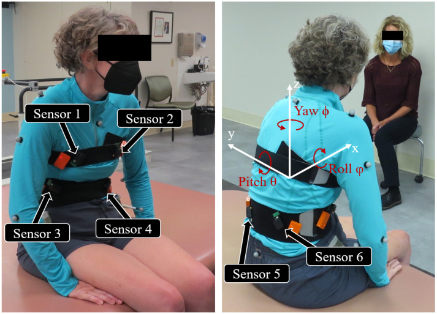
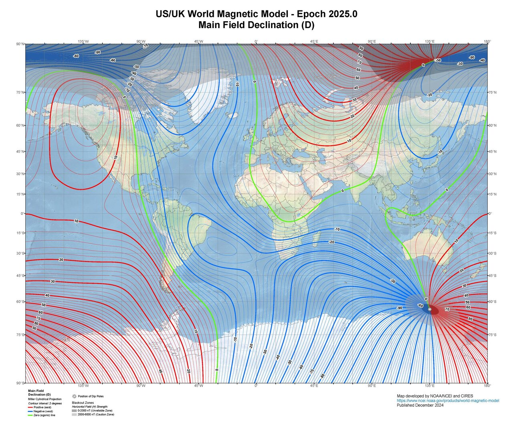
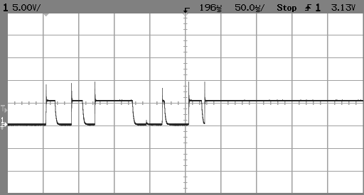

<style>
section { font-size: 23px; padding: 14px 44px; justify-content: flex-start; }
section h1 { font-size: 1.45em; line-height: 1.10; margin: 0 0 .14em; }
section h2 { font-size: 1.10em; margin: .06em 0; }
section h3 { font-size: 1.0em; margin: .12em 0; }
section p, section li { margin: .05em 0; line-height: 1.16; }
section img { max-width: 100%; height: auto; }
section svg { max-height: 205px; width: 100%; }
section table { font-size: .70em; }
section pre { font-size: .50em; line-height: 1.10; background:#0d1117; color:#e6edf3; border:1px solid #30363d; border-radius:8px; padding:12px 16px; box-shadow:0 2px 8px rgba(0,0,0,.25); }
section pre code { white-space: pre-wrap; background:transparent; color:inherit; } section pre .hljs-comment{color:#8b949e;font-style:italic} section pre .hljs-keyword,section pre .hljs-built_in,section pre .hljs-literal{color:#ff7b72} section pre .hljs-string{color:#a5d6ff} section pre .hljs-number{color:#79c0ff} section pre .hljs-title,section pre .hljs-title.function_,section pre .hljs-section{color:#d2a8ff} section pre .hljs-meta{color:#ffa657} section pre .hljs-attr,section pre .hljs-attribute,section pre .hljs-name{color:#7ee787}
section blockquote { margin: .12em 0; font-size: .88em; }
/* two images on a line (parity / 2x2 grids) stay side-by-side and small */
section p > img + img { margin-left: 10px; }
/* scroll-within-slide: dense slides scroll instead of clipping */
section { overflow-y: auto; overflow-x: hidden; }
section::-webkit-scrollbar { width: 11px; }
section::-webkit-scrollbar-thumb { background:#4a90d9; border-radius:6px; }
section::-webkit-scrollbar-track { background:rgba(0,0,0,.06); }
/* image drop-shadow + cover-slide readability (auto) */
section img{filter:drop-shadow(0 3px 12px rgba(0,0,0,.5))}
/* พื้นสำรองของสไลด์ปก: ถ้า img/cover_sNN.svg โหลดไม่ขึ้น ธีมจะคืนพื้นขาว
   แล้วตัวอักษรสีขาวของปกจะหายไปทั้งแผ่น — ปักสีเข้มไว้ให้ภาพเป็นแค่ของประดับ */
section.cover{background-color:#0b1426}
section.cover *{color:#fff !important}
section.cover h1,section.cover h2,section.cover h3,section.cover p,section.cover li,section.cover strong,section.cover em,section.cover blockquote,section.cover div{text-shadow:0 2px 9px rgba(0,0,0,.92),0 0 3px rgba(0,0,0,.8)}
section.cover div[style*="background:#"],section.cover div[style*="background: #"]{background:rgba(10,14,20,.66) !important;border-color:rgba(120,200,255,.45) !important;max-width:62%}
section.cover blockquote{border-left:4px solid rgba(120,200,255,.6) !important;background:rgba(13,17,23,.55) !important;border-radius:6px;padding:.3em .6em}
section.cover h1,section.cover h2,section.cover h3,section.cover p,section.cover blockquote{max-width:60%}
section.cover div:not(:has(img)){max-width:62%}
section.cover img{filter:none}
</style>


<!-- _class: cover -->

# บทเรียน 3.8 — ประกอบแดชบอร์ด: สี่การ์ดในลูปเดียว

## Mini-HMI Dashboard · ประกอบทุกอย่างที่เรียนมาให้เป็นหน้าจอเดียว ภายใต้งบ 32 widgets ที่ตั้งเอง

**โมดูล 3 — แสดงผลเซนเซอร์บน HMI**

> ต่อจากบทเรียน 3.7 — ออกแบบ HMI: การ์ด ลำดับสายตา สี และงบ widget

---

## เรื่องที่เราให้ 70% ผู้เรียนเขียน 30%

<svg viewBox="0 0 940 180" xmlns="http://www.w3.org/2000/svg">
  <rect x="20" y="26" width="620" height="130" rx="10" fill="#e3f2fd" stroke="#1565c0" stroke-width="2"/>
  <text x="330" y="62" text-anchor="middle" font-size="23" font-weight="700" fill="#1565c0">70% — เฟิร์มแวร์ทำให้แล้ว</text>
  <text x="330" y="96" text-anchor="middle" font-size="18" fill="#0d47a1">วาดทุก widget ด้วย LVGL · จัดคิว IPC ข้ามคอร์</text>
  <text x="330" y="126" text-anchor="middle" font-size="18" fill="#0d47a1">อ่านเซนเซอร์สี่ตัว · แปลงสนามแม่เหล็กเป็นองศา</text>
  <rect x="656" y="26" width="264" height="130" rx="10" fill="#fff3e0" stroke="#ef6c00" stroke-width="2">
    <animate attributeName="stroke-width" values="2;5;2" dur="2.6s" repeatCount="indefinite"/></rect>
  <text x="788" y="62" text-anchor="middle" font-size="23" font-weight="700" fill="#ef6c00">30% — งานของเรา</text>
  <text x="788" y="90" text-anchor="middle" font-size="17" fill="#e65100">อะไรอยู่ด้วยกัน</text>
  <text x="788" y="114" text-anchor="middle" font-size="17" fill="#e65100">อะไรต้องเด่น · สีแปลว่าอะไร</text>
  <text x="788" y="138" text-anchor="middle" font-size="17" fill="#e65100">ถี่แค่ไหน · งบให้ใคร</text>
</svg>

**สิ่งที่เฟิร์มแวร์ทำให้แล้ว (70%)**
วาดทุก widget ด้วย LVGL, จัดคิว IPC ข้ามคอร์, อ่านค่าจากเซนเซอร์ทั้งสี่ตัว, แปลงสนามแม่เหล็กเป็นองศา, จัดการ touch

**สิ่งที่เป็นงานของเรา (30%)**
ตัดสินใจว่า **ค่าไหนควรอยู่ด้วยกัน · ค่าไหนต้องเด่น · สีอะไรแปลว่าอะไร · อัปเดตถี่แค่ไหน · และงบที่มีจะแบ่งให้ใคร**

ห้าข้อนี้ไม่มีข้อไหนเป็นเรื่องไวยากรณ์ภาษา Python เลย มันคืองานออกแบบล้วน ๆ ซึ่งเป็นงานที่ยังไงเครื่องก็ทำแทนเราไม่ได้

> โค้ดวันนี้ยาวขึ้นก็จริง แต่ส่วนที่ยากคือตอนตัดสินใจก่อนพิมพ์ ไม่ใช่ตอนพิมพ์

---

## แกะโค้ดจริง — ท่าที่ 1 เตรียมจอ ชุดสี และเซนเซอร์

<svg viewBox="0 0 940 200" style="max-height:130px" xmlns="http://www.w3.org/2000/svg">
  <text x="20" y="34" font-size="20" font-weight="700" fill="#37474f">ลำดับเวลาตอนเปิดโปรแกรม — ไม่มี init ให้เรียก มีแต่การรอ</text>
  <rect x="20" y="52" width="200" height="72" rx="9" fill="#ede7f6" stroke="#4527a0" stroke-width="2"/>
  <text x="120" y="82" text-anchor="middle" font-size="19" font-weight="700" fill="#4527a0">ui.screen()</text>
  <text x="120" y="108" text-anchor="middle" font-size="18" fill="#4527a0">ล้าง widget เดิม</text>
  <rect x="236" y="52" width="200" height="72" rx="9" fill="#eceff1" stroke="#607d8b" stroke-width="2"/>
  <text x="336" y="82" text-anchor="middle" font-size="19" font-weight="700" fill="#455a64">sleep_ms(200)</text>
  <text x="336" y="108" text-anchor="middle" font-size="18" fill="#455a64">ให้ CM55 ตามทัน</text>
  <rect x="452" y="52" width="200" height="72" rx="9" fill="#e8f5e9" stroke="#2e7d32" stroke-width="2"/>
  <text x="552" y="82" text-anchor="middle" font-size="19" font-weight="700" fill="#2e7d32">motion() ใน try</text>
  <text x="552" y="108" text-anchor="middle" font-size="18" fill="#1b5e20">อ่านครั้งแรก = การรอ</text>
  <rect x="668" y="52" width="200" height="72" rx="9" fill="#eceff1" stroke="#607d8b" stroke-width="2"/>
  <text x="768" y="82" text-anchor="middle" font-size="19" font-weight="700" fill="#455a64">เข้าลูปหลัก</text>
  <text x="768" y="108" text-anchor="middle" font-size="18" fill="#455a64">ครั้งต่อไปรอไม่เกิน 1 วิ</text>
  <line x1="20" y1="140" x2="900" y2="140" stroke="#b0bec5" stroke-width="3"/>
  <circle cx="22" cy="140" r="8" fill="#c62828"><animateMotion path="M0,0 L874,0" dur="3.4s" repeatCount="indefinite"/></circle>
  <text x="20" y="180" font-size="19" fill="#c62828">Eva: sensors.init() = OSError · Dev Kit: ผ่านแต่ไม่ต้องเรียก</text>
  <text x="920" y="180" text-anchor="end" font-size="19" fill="#2e7d32">เฟิร์มแวร์ปลุกเซนเซอร์ให้แล้ว</text>
</svg>

<div style="display:flex;gap:18px;align-items:flex-start">
<div style="flex:0 0 55%;min-width:0">

```python
import ui
import sensors
import time

ui.screen()          # เปิดหน้าจอ Playground แบบว่าง (ล้าง widget เดิมทุกตัวให้เอง)
time.sleep_ms(200)   # ให้ CM55 ตามทันก่อนเราเริ่มสร้างของใหม่
...
BG_CARD   = 0x171B22   # พื้นการ์ด เทาเข้มอมน้ำเงิน
COL_WHITE = 0xE8EAED   # ตัวเลขพระเอก
COL_GRAY  = 0x9AA3AF   # ข้อความประกอบ / สถานะเงียบ เทาอ่อน
...
COL_STAT  = 0x30A46C   # เขียว "ปกติ"
...
# ไม่มี sensors.init() ทั้งสองบอร์ด (Eva: ได้ OSError / Dev Kit: ไม่จำเป็น)
try:
    sensors.bmi270.motion()      # อ่านทิ้งหนึ่งครั้ง ให้การรอไปเกิดตรงนี้
except OSError:
    print("อ่านเซนเซอร์รอบแรกยังไม่ได้ - ลองใหม่ในลูป")
```

</div>
<div style="flex:1;min-width:0;font-size:.9em">

> **เรียกอ่านค่าครั้งแรกแล้วเงียบไปสิบกว่าวินาที นั่นคือการรอ ไม่ใช่การค้าง** (Eva วัดได้ถึง 16 วินาที · Dev Kit ยังไม่ได้วัด) — อย่าเพิ่งถอดสาย USB และ**บน Dev Kit ห้ามโยกสวิตช์บนฐาน นั่นคือสวิตช์ไฟ**

**ห้ามเรียก `sensors.init()` บน Eva Kit** — เฟิร์มแวร์ปฏิเสธด้วย `OSError` เพราะคอร์จอ (CM55) เป็นเจ้าของบัส I2C ของเซนเซอร์ทั้งชุด ขับบัสซ้อนแล้วบอร์ดค้างจนต้องถอดไฟ · **บน Dev Kit** บรรทัดนั้นผ่านแต่ไม่จำเป็น เฟิร์มแวร์ปลุกทุกตัวไว้ตั้งแต่บูต — ไฟล์ของคอร์สจึงไม่มี `init()` และรันได้ทั้งสองบอร์ด

ค่ามาจากไหน — **Eva**: CM55 อ่านเซนเซอร์ให้ทุก 200 ms แล้วเก็บเป็นภาพสแกน · **Dev Kit**: CM33 อ่าน IMU และลูกบิดตรงจากบัสของตัวเอง ส่วนแถบสัมผัสถามคอร์จอ · `ui.screen()` ล้าง widget เดิมทั้งหมด ไม่เรียกแล้วของจากสคริปต์ก่อนหน้าจะกินงบตั้งแต่ยังไม่เริ่ม

</div>
</div>

---

## แกะโค้ดจริง — ท่าที่ 2 การ์ด IMU พร้อมกราฟสามแกน

<svg viewBox="0 0 940 230" style="max-height:150px" xmlns="http://www.w3.org/2000/svg">
  <rect x="266" y="16" width="408" height="196" rx="12" fill="#171B22" stroke="#8E7BFF" stroke-width="3"/>
  <text x="284" y="46" font-size="20" font-weight="700" fill="#8E7BFF">ความเร่ง BMI270 (m/s2)</text>
  <rect x="282" y="58" width="376" height="106" rx="6" fill="#0b1a2e" stroke="#26364f" stroke-width="1"/>
  <line x1="282" y1="111" x2="658" y2="111" stroke="#26364f" stroke-width="1"/>
  <polyline points="288,140 335,120 382,132 429,108 476,128 523,114 570,136 617,118 652,126" fill="none" stroke="#8E7BFF" stroke-width="2.5">
    <animate attributeName="points" dur="2.4s" repeatCount="indefinite" values="288,140 335,120 382,132 429,108 476,128 523,114 570,136 617,118 652,126;288,120 335,136 382,110 429,130 476,108 523,134 570,114 617,138 652,112;288,140 335,120 382,132 429,108 476,128 523,114 570,136 617,118 652,126"/></polyline>
  <polyline points="288,96 335,104 382,90 429,100 476,86 523,98 570,88 617,102 652,92" fill="none" stroke="#00E676" stroke-width="2.5">
    <animate attributeName="points" dur="2.4s" begin="0.4s" repeatCount="indefinite" values="288,96 335,104 382,90 429,100 476,86 523,98 570,88 617,102 652,92;288,104 335,88 382,102 429,86 476,100 523,90 570,104 617,88 652,102;288,96 335,104 382,90 429,100 476,86 523,98 570,88 617,102 652,92"/></polyline>
  <polyline points="288,74 335,78 382,72 429,80 476,70 523,78 570,72 617,80 652,74" fill="none" stroke="#448AFF" stroke-width="2.5"/>
  <text x="284" y="192" font-size="19" fill="#eef2fb">X +0.2  Y -0.4  Z +9.8</text>
  <text x="14" y="60" font-size="18" font-weight="700" fill="#1565c0">Chart x=40 y=136</text>
  <text x="14" y="86" font-size="18" fill="#1565c0">w=336 h=56</text>
  <line x1="180" y1="72" x2="262" y2="80" stroke="#1565c0" stroke-width="2"/>
  <text x="14" y="150" font-size="18" font-weight="700" fill="#ef6c00">แกน -150 ถึง 150</text>
  <text x="14" y="176" font-size="18" fill="#ef6c00">คือ -15.0 ถึง +15.0</text>
  <line x1="180" y1="162" x2="262" y2="140" stroke="#ef6c00" stroke-width="2"/>
  <text x="926" y="58" text-anchor="end" font-size="18" font-weight="700" fill="#6a4fd8">ม่วง = series แรก (color=)</text>
  <text x="926" y="84" text-anchor="end" font-size="18" fill="#2e7d32">เขียว = add_series()</text>
  <text x="926" y="110" text-anchor="end" font-size="18" fill="#1565c0">ฟ้า = add_series()</text>
  <line x1="700" y1="76" x2="678" y2="90" stroke="#607d8b" stroke-width="2"/>
  <text x="926" y="148" text-anchor="end" font-size="18" fill="#455a64">คูณ 10 ก่อนป้อน</text>
  <text x="926" y="174" text-anchor="end" font-size="18" fill="#455a64">ไม่งั้นเป็นขั้นบันได</text>
  <text x="926" y="200" text-anchor="end" font-size="18" fill="#455a64">Label ค่า y=200</text>
</svg>

<div style="display:flex;gap:16px;align-items:flex-start">
<div style="flex:1;min-width:0">

```python
imu_panel = ui.Panel(x=24, y=100, w=368, h=136,
                     color=BG_CARD, min=COL_IMU, max=12, value=2)
imu_title = ui.Label("ความเร่ง BMI270 (m/s2)", x=40, y=108, color=COL_IMU, value=16)
# Chart เก็บ 50 จุด รับเฉพาะจำนวนเต็ม เราจึงคูณ 10 ก่อนป้อน (-150..150 = -15.0..+15.0)
imu_chart = ui.Chart(x=40, y=136, w=336, h=56, min=-150, max=150, color=COL_IMU)
sy = imu_chart.add_series(COL_STAT)     # แกน Y เขียว
sz = imu_chart.add_series(0x448AFF)     # แกน Z ฟ้า
imu_val = ui.Label("X+0.0 Y+0.0 Z+9.8", x=40, y=200, color=COL_WHITE, value=20)
```

`ui.Chart` รับเฉพาะ **จำนวนเต็ม** เราจึงคูณค่าจริงด้วย 10 ก่อนป้อน แล้วตั้งแกน −150 ถึง 150 (= −15.0 ถึง +15.0 m/s²) ป้อน `int(ax)` ตรง ๆ ความละเอียดจะเหลือขั้นละ 1 m/s² กราฟเป็นขั้นบันได · series แรกได้สีจาก `color=` ของ Chart (`COL_IMU` สีม่วงประจำการ์ด ไม่ใช่สีเตือน) series ที่สองและสามได้จาก `add_series()` ซึ่งคืน index มาให้เก็บไว้ใช้ตอน `set_next()` · `imu_val` วางที่ y=200 คือใต้กราฟแต่ยังอยู่ในกรอบการ์ด (100 + 136 = 236)

</div>
<div style="flex:0 0 250px">




<div style="font-size:.5em;color:#78909c">ซ้าย: Rodriguez V.H. et al., Sensors 22(20):7690 (2022) — CC BY 4.0 · ภาพถ่ายการติดตั้งเซนเซอร์จริงบนตัวคน พร้อมแกน roll/pitch/yaw กำกับ อธิบายว่าทำไมกราฟสามเส้นถึงเปลี่ยนพร้อมกันเมื่อเอียงบอร์ดเพียงแกนเดียว · ขวา: Vkidambi / Wikimedia Commons — CC BY-SA 4.0 · แรงโน้มถ่วงที่มองจากในลิฟต์ที่กำลังเร่ง เหตุผลที่ accelerometer วางนิ่ง ๆ แล้วยังอ่านได้ 9.8</div>

</div>
</div>

> กราฟบอกแนวโน้ม ตัวเลขบอกค่าปัจจุบัน — ใส่คู่กันเสมอ อย่างละครึ่งไม่พอสำหรับคนตัดสินใจ

---

## แกะโค้ดจริง — ท่าที่ 3 การ์ดเข็มทิศ

<div style="display:flex;gap:16px;align-items:flex-start">
<div style="flex:1;min-width:0">

```python
comp_panel = ui.Panel(x=408, y=100, w=360, h=136,
                      color=BG_CARD, min=COL_COMP, max=12, value=2)
comp_title = ui.Label("เข็มทิศ BMM350", x=424, y=108, color=COL_COMP, value=16)
compass = ui.Compass(x=424, y=132, w=96, h=96, color=COL_COMP)
comp_deg = ui.Label("000 deg", x=544, y=140, color=COL_WHITE, value=28)
comp_dir = ui.Label("N", x=544, y=188, color=COL_COMP, value=24)
...
DIRS = ["N", "NE", "E", "SE", "S", "SW", "W", "NW"]
...
            comp_dir.text(DIRS[int((heading + 22.5) / 45.0) % 8])
```

`ui.Compass` ใช้ `w` เป็น **เส้นผ่านศูนย์กลาง** — ไฟล์ส่ง `h` เท่ากันไว้ด้วย เพื่อให้ด่านตรวจพิกัดอ่านขนาดของมันได้ · รับค่าทิศผ่าน `.value(องศา)` โดย 0 คือทิศเหนือ · สีของเข็มทิศคือ `COL_COMP` สีประจำการ์ด ไม่ใช่สีเตือน

หน้าปัดกินซ้าย ตัวเลขกินขวา ตัวเลของศาได้ฟอนต์ 28 ใหญ่ที่สุดในหน้าจอ เพราะเป็นค่าที่ต้องอ่านจากไกลที่สุด ส่วนตัวอักษรทิศได้ 24 · แปลงองศาเป็นชื่อทิศด้วยเลขคณิตบรรทัดเดียว ไม่ต้องมี if ยาว ๆ — บวก 22.5 ก่อนหารด้วย 45 คือ "เลื่อนขอบช่อง" ให้ทิศเหนือกินช่วง 337.5–22.5 องศา แทนที่จะเป็น 0–45

</div>
<div style="flex:0 0 300px">

 



<div style="font-size:.5em;color:#78909c">บน: NASA/USGS (สาธารณสมบัติ) = สนามแม่เหล็กโลกที่ BMM350 วัด · Brosen (CC BY 2.5) = ช่องทิศ 8 ช่องที่ `DIRS` แบ่ง · ล่าง: NOAA NCEI / BGS, World Magnetic Model 2025.0 (สาธารณสมบัติ) — ค่าเบี่ยงเบนแม่เหล็กทั่วโลก ตัวเลของศาที่การ์ดแสดงยังไม่ใช่ทิศเหนือจริง ต้องบวกค่าจากแผนที่นี้ก่อน</div>

</div>
</div>

> ตัวเลขให้ความแม่นยำ ตัวอักษรทิศให้ความหมาย คนที่ยืนดูใช้อย่างหลังก่อนเสมอ

---

## `sensors.bmm350` มีห้าชื่อ — และหนึ่งในนั้นเรายังตอบเรื่องหน่วยไม่ได้

การ์ดเข็มทิศใช้ `heading()` ตัวเดียว แต่ชิปเปิดให้เราอีกสี่ชื่อ ทุกตัว **ไม่รับอาร์กิวเมนต์เลย** และโยน `OSError` เมื่ออ่านไม่สำเร็จ

| เรียกอะไร | คืนอะไรกลับมา | ใช้ตอนไหน |
|---|---|---|
| `heading()` | `float` 0 ถึง 360 องศา 0 คือทิศเหนือ | ค่าเดียวที่การ์ดเข็มทิศต้องใช้ |
| `magnetic()` | tuple สามค่า `(mx, my, mz)` เป็น `float` | อยากเห็นสามแกนดิบ เช่นตรวจว่ามีแม่เหล็กเข้ามาใกล้ |
| `cal_reset()` | `None` และ **พิมพ์หนึ่งบรรทัดลง REPL** ว่าให้หมุนบอร์ดครบรอบ | เริ่มคาลิเบรต hard-iron ใหม่ |
| `cal_status()` | `dict` สามคีย์ `{'valid': bool, 'offset_x': float, 'offset_y': float}` | ดูว่าค่าชดเชยลู่เข้าหรือยัง |
| `chip_id()` | `int` | ยืนยันว่ากำลังคุยกับชิปถูกตัว ตอนสงสัยว่าสายหลุด |

**สามข้อที่ทำให้เข็มทิศบนการ์ดนิ่งหรือไม่นิ่ง**

1. **มีแต่ `heading()` เท่านั้นที่ขยับตัวคาลิเบรต** — `magnetic()` ไม่ได้ป้อนอะไรให้มันเลย โปรแกรมที่เรียกแต่ `magnetic()` จะรอค่าชดเชยจนวันตายก็ไม่ลู่เข้า
2. **`heading()` คืนค่าเฉลี่ยของสิบครั้งหลังสุด** เฉลี่ยแบบวงกลมเพื่อไม่ให้พังตอนข้ามรอยต่อ 0 กับ 360 องศา สิบครั้งแรกหลังบูตจึงเป็นค่าที่ยังเฉลี่ยไม่เต็มถัง — อย่าเพิ่งตัดสินจากค่าแรก
3. **`cal_status()['valid']` เป็น `True` ก็ต่อเมื่อครบสองเงื่อนไข** คือเก็บครบ 50 ตัวอย่าง **และ** ค่าที่กวาดได้กระจายพอทั้งสองแกน หมุนบอร์ดไม่ครบรอบ เงื่อนไขที่สองไม่ผ่าน · `cal_reset()` **ไม่ได้เขียนอะไรลงชิป** มันล้างตัวแปรฝั่งบอร์ดเท่านั้น ค่าคาลิเบรตจึงหายทุกครั้งที่รีเซ็ต

**ชิปตัวนี้ตั้ง ODR ไว้ที่ 25 Hz** อ่านถี่กว่านั้นจะได้ค่าเดิมซ้ำ ไม่ใช่ค่าใหม่ — ลูป 200 ms ของเราอยู่ห่างจากเพดานนี้มาก จึงไม่ต้องกังวล

---

## `sensors.bmm350` — ข้อบกพร่องที่ยังเปิดอยู่สองข้อ พูดตรง ๆ ดีกว่าให้ทีมไปเจอเอง

**หนึ่ง หน่วยของ `magnetic()` ตอนนี้ตอบไม่ได้ว่าคืออะไร** คอมเมนต์ในไดรเวอร์และป้ายในไฟล์ตัวอย่างเขียนว่า uT (ไมโครเทสลา) แต่ภาพที่จับจากบอร์ดวัดขนาดรวมสามแกนได้ราว **1532** ขณะที่สนามแม่เหล็กโลกทั้งใบอยู่ที่ **25 ถึง 65 uT** — ตัวเลขกับหน่วยเป็นจริงพร้อมกันไม่ได้ อย่างน้อยหนึ่งอย่างผิด และเรายังไม่ได้ตัดสินว่าอันไหน

สิ่งที่ **ไม่** ผิดคือทิศ: `heading()` วัดบนบอร์ดจริงได้ 215.8 เมื่อ 14 ส.ค. 2026 ซึ่งตรงกับความจริง เพราะการหาทิศใช้ `atan2` ซึ่งสนใจแค่ **อัตราส่วน** ระหว่างสองแกน ตัวคูณที่ผิดเท่ากันทั้งคู่จึงหักล้างกันหมด นี่คือเหตุผลที่ข้อบกพร่องนี้อยู่มาได้นานโดยไม่มีใครสังเกต

**กติกาของชุดบทเรียนนี้:** ห้ามเขียนตัวเลขจาก `magnetic()` ลงรายงานพร้อมหน่วย uT ให้เขียนว่า "หน่วยของบอร์ด" และเทียบเป็น **ค่าต่างจากเส้นฐานที่ทีมวัดเอง** เสมอ — ซึ่งบังเอิญเป็นสิ่งที่ [`04_magnet_presence.py`](https://github.com/tesaiot/tesa-qualification-program/blob/main/courses/aiot-micropython/m03-sensor-hmi/l08-dashboard-build/examples/04_magnet_presence.py) กับ `05_door_open_switch.py` ทำอยู่แล้วทั้งคู่ ทั้งสองไฟล์จึงยังใช้ได้ตามปกติ เกณฑ์ของมันเป็น "เบี่ยงไปเท่าไรจากตอนเริ่ม" ไม่ใช่ "กี่ไมโครเทสลา"

**สอง `cal_reset()` กับ `cal_status()` ยังไม่มีใครรันบนบอร์ดจริงแม้แต่ครั้งเดียว ทั้ง Eva Kit และ Dev Kit** ไฟล์ที่ใช้มันคือ [`14_hard_iron_calibration.py`](https://github.com/tesaiot/tesa-qualification-program/blob/main/courses/aiot-micropython/shared/usecase/14_hard_iron_calibration.py) และมันเขียนคำเตือนข้อนี้ไว้ในหัวไฟล์ของตัวเอง เปิดได้ ลองได้ แต่ถ้าได้ `OSError` นั่นคือข้อมูลใหม่ที่ยังไม่มีใครมี ให้บอกผู้สอน

> ตัวเลขที่ถูกกับหน่วยที่ถูกเป็นคนละเรื่องกัน — ระบบวัดที่บอกไม่ได้ว่าหน่วยของตัวเองคืออะไร ยังไม่ใช่ระบบวัดที่เสร็จ

---

## แกะโค้ดจริง — ท่าที่ 4 การ์ดสัมผัสและการ์ดลูกบิด

<svg viewBox="0 0 940 234" style="max-height:150px" xmlns="http://www.w3.org/2000/svg">
  <rect x="14" y="14" width="450" height="108" rx="9" fill="#fdf1f1" stroke="#c62828" stroke-width="2"/>
  <text x="30" y="44" font-size="19" font-weight="700" fill="#c62828">ui.Slider — ของที่ "คนลาก" บนจอ</text>
  <rect x="34" y="70" width="330" height="14" rx="7" fill="#f3c6c6"/>
  <circle cx="130" cy="77" r="14" fill="#c62828">
    <animate attributeName="cx" values="60;330;150;280;60" dur="4s" repeatCount="indefinite"/></circle>
  <text x="380" y="83" font-size="18" fill="#8d3b3b">นิ้วคน</text>
  <text x="30" y="110" font-size="18" fill="#8d3b3b">ใช้ผิดที่ = คนดูเข้าใจว่าลากบนจอได้</text>
  <rect x="476" y="14" width="450" height="108" rx="9" fill="#e0f7fa" stroke="#00838f" stroke-width="2"/>
  <text x="492" y="44" font-size="19" font-weight="700" fill="#00838f">ui.Bar — ของที่ "เครื่องแสดง"</text>
  <line x1="503" y1="77" x2="819" y2="77" stroke="#b2ebf2" stroke-width="14" stroke-linecap="round"/>
  <line x1="503" y1="77" x2="819" y2="77" stroke="#00838f" stroke-width="14" stroke-linecap="round" stroke-dasharray="316" stroke-dashoffset="200">
    <animate attributeName="stroke-dashoffset" values="280;30;200;80;280" dur="4s" repeatCount="indefinite"/></line>
  <text x="842" y="83" font-size="18" fill="#00838f">CapSense</text>
  <text x="492" y="110" font-size="18" fill="#00838f">ค่ามาจากแถบสัมผัสจริงบนบอร์ด ไม่ใช่จากจอ</text>
  <rect x="14" y="134" width="912" height="94" rx="9" fill="#f1f8e9" stroke="#558b2f" stroke-width="2"/>
  <text x="30" y="162" font-size="19" font-weight="700" fill="#558b2f">การ์ดลูกบิด — Arc กับ Seg7 ตอบคนละคำถาม</text>
  <path d="M60 210 A38 38 0 0 1 136 210" fill="none" stroke="#dcedc8" stroke-width="10"/>
  <path d="M60 210 A38 38 0 0 1 136 210" fill="none" stroke="#558b2f" stroke-width="10" stroke-dasharray="120" stroke-dashoffset="60">
    <animate attributeName="stroke-dashoffset" values="100;24;74;14;100" dur="4s" repeatCount="indefinite"/></path>
  <text x="164" y="206" font-size="19" fill="#33691e">Arc = "อยู่ตรงไหนของช่วง" รู้ในพริบตา</text>
  <rect x="540" y="176" width="176" height="42" rx="6" fill="#1b2a17" stroke="#558b2f" stroke-width="2"/>
  <text x="628" y="207" text-anchor="middle" font-size="26" font-weight="700" fill="#8BC34A">48.2</text>
  <text x="730" y="196" font-size="19" fill="#33691e">Seg7 = ตัวเลขที่</text>
  <text x="730" y="220" font-size="19" fill="#33691e">จดลงบันทึกการเรียนได้</text>
</svg>

<div style="display:flex;gap:16px;align-items:flex-start">
<div style="flex:1;min-width:0">

```python
cap_led0 = ui.Led(x=40, y=288, w=48, h=48, color=COL_TOUCH, value=0)
ui.Label("ปุ่ม 0", x=96, y=300, color=COL_GRAY, value=16)
cap_led1 = ui.Led(x=160, y=288, w=48, h=48, color=COL_TOUCH, value=0)
ui.Label("ปุ่ม 1", x=216, y=300, color=COL_GRAY, value=16)
cap_pct = ui.Label("0 %", x=272, y=256, color=COL_WHITE, value=20)
cap_bar = ui.Bar(x=40, y=348, w=288, h=16, min=0, max=100, value=0, color=COL_TOUCH)
...
pot_arc = ui.Arc(x=376, y=288, w=88, h=88, min=0, max=100, value=0)
pot_seg7 = ui.Seg7(x=480, y=288, w=112, h=44, color=COL_POT, min=0, max=100)
pot_volt = ui.Label("0.000 V", x=480, y=340, color=COL_WHITE, value=20)
```

ทำไมการ์ดสัมผัสใช้ **Bar** ไม่ใช่ Slider ทั้งที่หน้าตาคล้ายกัน — เพราะ Slider เป็นของที่ *คนลาก* ส่วน Bar เป็นของที่ *เครื่องแสดง* ค่าที่นิ้วเลื่อนอยู่บนแถบ CapSense จริง ๆ ถ้าใช้ Slider คนดูจะเข้าใจผิดว่าลากบนจอได้ นี่คือหลัก HMI ที่เรียกว่า **ความสอดคล้องระหว่างหน้าตากับสิ่งที่ทำได้จริง** · การ์ด pot ใช้สองตัวคู่กันด้วยเหตุผลเดียวกับกราฟ+ตัวเลข: `Arc` ตอบว่า "อยู่ตรงไหนของช่วง" ในพริบตา ส่วน `Seg7` ให้ตัวเลขที่จดลงบันทึกการเรียนได้

</div>
<div style="flex:0 0 300px">

ปุ่ม CapSense ใช้ **ไฟสองดวง** แทนป้ายที่เปลี่ยนสี — ถ่ายจอเป็นขาวดำแล้วยังแยกออกว่าดวงไหนติด · ไฟหรี่ ไม่ใช่หาย ตอนไม่ได้แตะ:

```python
cap_led0.value(1 if cap['btn0'] else 0)
cap_led1.value(1 if cap['btn1'] else 0)
cap_bar.value(int(cap['slider']))
```



<div style="font-size:.5em;color:#78909c">ภาพ: Arctanx / Wikimedia Commons — สาธารณสมบัติ · สัญญาณเด้งของหน้าสัมผัสจริงราว 250 ไมโครวินาที — ตัวเลขที่ตอบว่าการ์ดสัมผัสต้องรอนานแค่ไหนก่อนเชื่อค่า</div>

</div>
</div>

> เลือก widget ตาม "ใครเป็นคนเปลี่ยนค่านี้" ไม่ใช่ตามว่าอันไหนดูดีกว่า

---

## แกะโค้ดจริง — ท่าที่ 5 ลูปหลัก และการอ่านเซนเซอร์แบบ sync

<svg viewBox="0 0 940 236" style="max-height:130px" xmlns="http://www.w3.org/2000/svg">
  <defs><marker id="l8" markerWidth="10" markerHeight="8" refX="9" refY="4" orient="auto">
    <path d="M0,0 L10,4 L0,8 z" fill="#455a64"/></marker></defs>
  <rect x="20" y="46" width="172" height="80" rx="9" fill="#eceff1" stroke="#607d8b" stroke-width="2"/>
  <text x="106" y="78" text-anchor="middle" font-size="19" font-weight="700" fill="#455a64">t0 = ticks_ms()</text>
  <text x="106" y="104" text-anchor="middle" font-size="18" fill="#455a64">จับเวลาต้นรอบ</text>
  <rect x="202" y="46" width="172" height="80" rx="9" fill="#e8f5e9" stroke="#2e7d32" stroke-width="2"/>
  <text x="288" y="78" text-anchor="middle" font-size="19" font-weight="700" fill="#2e7d32">อ่าน 4 ตัว sync</text>
  <text x="288" y="104" text-anchor="middle" font-size="18" fill="#1b5e20">แตะบัสให้น้อยครั้ง</text>
  <rect x="384" y="46" width="172" height="80" rx="9" fill="#e3f2fd" stroke="#1565c0" stroke-width="2"/>
  <text x="470" y="78" text-anchor="middle" font-size="19" font-weight="700" fill="#1565c0">อัปเดต widget</text>
  <text x="470" y="104" text-anchor="middle" font-size="18" fill="#0d47a1">set_next · text · value</text>
  <rect x="566" y="46" width="172" height="80" rx="9" fill="#ede7f6" stroke="#4527a0" stroke-width="2"/>
  <text x="652" y="78" text-anchor="middle" font-size="19" font-weight="700" fill="#4527a0">ui.poll()</text>
  <text x="652" y="104" text-anchor="middle" font-size="18" fill="#4527a0">ระบายคิวฝั่ง CM55</text>
  <rect x="748" y="46" width="172" height="80" rx="9" fill="#fff3e0" stroke="#ef6c00" stroke-width="2"/>
  <text x="834" y="78" text-anchor="middle" font-size="19" font-weight="700" fill="#ef6c00">sleep_ms(200)</text>
  <text x="834" y="104" text-anchor="middle" font-size="18" fill="#e65100">คืนเวลาให้ระบบ</text>
  <path d="M920 86 L946 86" fill="none" stroke="none"/>
  <path d="M920 126 L920 170 L20 170 L20 126" fill="none" stroke="#455a64" stroke-width="2.5" stroke-dasharray="7 5" marker-end="url(#l8)"/>
  <circle cx="106" cy="86" r="7" fill="#c62828">
    <animateMotion path="M0,0 L182,0 L364,0 L546,0 L728,0 L814,40 L814,84 L-86,84 L-86,40 L0,0" dur="4.2s" repeatCount="indefinite"/></circle>
  <text x="470" y="196" text-anchor="middle" font-size="19" font-weight="700" fill="#c62828">ลืม ui.poll() แล้วจอจะซ่อน widget ประมาณสองวินาที แล้วกลับมาใหม่ วนแบบนั้น</text>
  <text x="470" y="224" text-anchor="middle" font-size="18" fill="#455a64">รันสิบนาทีที่ 200 ms = ประมาณสามพันรอบ บรรทัดที่แพงจะโผล่ให้เห็นเอง</text>
</svg>

<div style="display:flex;gap:16px;align-items:flex-start">
<div style="flex:0 0 56%;min-width:0">

```python
    while True:
        t0 = time.ticks_ms()
        ok = True
        if running:
            try:
                ax, ay, az, gx, gy, gz = sensors.bmi270.motion()
            except OSError:
                ok = False              # คงค่าเดิมไว้ ไม่เขียนศูนย์ทับ
            imu_chart.set_next(0, int(ax * 10))
            ...
        if time.ticks_diff(time.ticks_ms(), last_text) >= UI_TEXT_MS:
            last_text = time.ticks_ms()
            ...
            head.text("รอบที่ {} | loop {} ms".format(
                rounds, time.ticks_diff(time.ticks_ms(), t0)))
        rounds += 1
        for ev in ui.poll():
            ...
        time.sleep_ms(200)
```

</div>
<div style="flex:1;min-width:0;font-size:.86em">

**กฎเหล็กข้อ 4 มีผลเต็ม ๆ ตรงนี้:** พอเรียก `ui.*` ครั้งแรก ระบบอ่านเซนเซอร์อัตโนมัติของเฟิร์มแวร์จะหยุด เราจึงต้องอ่านเองทุกตัวในลูป **แบบ synchronous** เรียกแล้วรอค่าตรงนั้น ทั้งสี่ตัวเรียงกันในรอบเดียว

`motion()` ให้หกแกนจากการอ่านครั้งเดียว เร็วกว่าเรียก `acceleration()` แล้ว `gyroscope()` แยกสองครั้ง เช่นเดียวกับ `capsense.read()` ที่คืนสองปุ่มและ slider ในครั้งเดียว — **หนึ่งรอบลูป แตะเซนเซอร์ให้น้อยครั้งที่สุด**

`ui.poll()` ต้องเรียกทุกลูป — ชุดบทเรียนนี้มีปุ่มเดินหน้า/หยุดภาพและ Spinbox ให้กดจริง แต่ต่อให้หน้าไหนไม่มีปุ่มก็ต้องเรียก เพราะมันคือจังหวะที่ CM55 ได้ระบายคิว ไม่เรียกแล้วจอจะซ่อน widget ราวสองวินาทีแล้วกลับมาใหม่วน ๆ · `except` ไม่เขียนศูนย์ทับค่าเดิม แค่ยกธง `ok` แล้วไฟค่าค้างเป็นคนบอก · `t0` ต้นลูปแล้ววัดเวลาที่ใช้ไป คือเครื่องมือหลักตอน soak test

</div>
</div>

> ทุกบรรทัดในลูปนี้จะถูกรันประมาณสามพันรอบระหว่างการทดสอบสิบนาที บรรทัดที่แพงจะโผล่ให้เห็นเอง

---

## ข้อมูลไหลไปทางไหน — สี่เซนเซอร์ หนึ่งลูป หนึ่งหน้าจอ

<svg viewBox="0 0 940 250" xmlns="http://www.w3.org/2000/svg">
  <defs><marker id="a8" markerWidth="10" markerHeight="8" refX="9" refY="4" orient="auto">
    <path d="M0,0 L10,4 L0,8 z" fill="#455a64"/></marker></defs>
  <rect x="10" y="20" width="150" height="46" rx="8" fill="#e8f5e9" stroke="#2e7d32" stroke-width="2"/>
  <text x="85" y="49" text-anchor="middle" font-size="17" fill="#2e7d32">BMI270</text>
  <rect x="10" y="76" width="150" height="46" rx="8" fill="#f3e5f5" stroke="#6a1b9a" stroke-width="2"/>
  <text x="85" y="105" text-anchor="middle" font-size="17" fill="#6a1b9a">BMM350</text>
  <rect x="10" y="132" width="150" height="46" rx="8" fill="#e0f7fa" stroke="#00838f" stroke-width="2"/>
  <text x="85" y="161" text-anchor="middle" font-size="17" fill="#00838f">CapSense</text>
  <rect x="10" y="188" width="150" height="46" rx="8" fill="#f1f8e9" stroke="#558b2f" stroke-width="2"/>
  <text x="85" y="217" text-anchor="middle" font-size="17" fill="#558b2f">Potentiometer</text>
  <rect x="215" y="70" width="215" height="115" rx="10" fill="#e3f2fd" stroke="#1565c0" stroke-width="2"/>
  <text x="322" y="102" text-anchor="middle" font-size="18" font-weight="700" fill="#1565c0">ลูป Python บน CM33</text>
  <text x="322" y="128" text-anchor="middle" font-size="15" fill="#0d47a1">อ่าน sync ทั้งสี่ตัว</text>
  <text x="322" y="150" text-anchor="middle" font-size="15" fill="#0d47a1">แปลงหน่วย + จัดรูปแบบ</text>
  <text x="322" y="172" text-anchor="middle" font-size="15" fill="#0d47a1">sleep_ms(200)</text>
  <rect x="485" y="70" width="150" height="115" rx="10" fill="#fff3e0" stroke="#ef6c00" stroke-width="2"/>
  <text x="560" y="112" text-anchor="middle" font-size="18" font-weight="700" fill="#ef6c00">IPC</text>
  <text x="560" y="140" text-anchor="middle" font-size="15" fill="#e65100">คิวคำสั่งวาด</text>
  <text x="560" y="162" text-anchor="middle" font-size="15" fill="#e65100">ตาราง 64 ช่อง</text>
  <rect x="690" y="70" width="240" height="115" rx="10" fill="#eceff1" stroke="#455a64" stroke-width="2"/>
  <text x="810" y="104" text-anchor="middle" font-size="18" font-weight="700" fill="#455a64">CM55 + LVGL</text>
  <text x="810" y="132" text-anchor="middle" font-size="15" fill="#37474f">วาดการ์ดสี่ใบ 23 widgets</text>
  <text x="810" y="158" text-anchor="middle" font-size="15" fill="#37474f">จอ 792 x 398</text>
  <line x1="163" y1="43" x2="212" y2="95" stroke="#455a64" stroke-width="2" marker-end="url(#a8)"/>
  <line x1="163" y1="99" x2="212" y2="115" stroke="#455a64" stroke-width="2" marker-end="url(#a8)"/>
  <line x1="163" y1="155" x2="212" y2="135" stroke="#455a64" stroke-width="2" marker-end="url(#a8)"/>
  <line x1="163" y1="211" x2="212" y2="155" stroke="#455a64" stroke-width="2" marker-end="url(#a8)"/>
  <line x1="432" y1="127" x2="481" y2="127" stroke="#455a64" stroke-width="3" marker-end="url(#a8)"/>
  <line x1="637" y1="127" x2="686" y2="127" stroke="#455a64" stroke-width="3" marker-end="url(#a8)"/>
  <circle cx="434" cy="127" r="7" fill="#1565c0"><animateMotion path="M0,0 L43,0" dur="1.6s" repeatCount="indefinite"/></circle>
  <circle cx="639" cy="127" r="7" fill="#ef6c00"><animateMotion path="M0,0 L43,0" dur="1.6s" begin="0.5s" repeatCount="indefinite"/></circle>
  <text x="600" y="230" text-anchor="middle" font-size="18" fill="#78909c">คอขวดอยู่ที่นี่: ถ้าลูปเร็วเกิน คิวฝั่งขวาจะล้นแบบเงียบ ๆ</text>
</svg>

**ดูเพิ่ม (1 นาที):** *Working principle of an accelerometer* — Bosch Sensortec — 1:01 — ผู้ผลิต BMI270 บนบอร์ดเราแสดงให้เห็นว่ามวลพิสูจน์ในชิปขยับจริง ซึ่งคือที่มาของเส้นกราฟสามเส้นนี้

<iframe width="240" height="135" src="https://www.youtube.com/embed/RLQGZl0lpjQ" title="Bosch MEMS sensors: Working principle of an accelerometer" loading="lazy" frameborder="0" allowfullscreen></iframe>

> เซนเซอร์สี่ตัวไม่ได้วิ่งขนานกัน มันต่อคิวกันอยู่ในลูปเดียวของเรา — นี่คือเหตุผลที่ต้องอ่านให้น้อยครั้งที่สุด

---

## การ์ดใบที่ห้าที่ทีมเลือกได้ — โมดูล `mic` ทั้งแปดชื่อ

ไมโครโฟนบนบอร์ดใช้จาก Python ได้แล้ว โมดูล `mic` **ฝังมากับเฟิร์มแวร์** ทั้ง Eva Kit, TESAIoT Dev Kit และ AI Kit `import mic` ได้เลย ไม่ต้องคัดลอกไฟล์ไปไว้บนบอร์ด และมีอยู่แปดชื่อพอดี

| เรียกอะไร | คืนอะไร | หมายเหตุ |
|---|---|---|
| `mic.start(sens=3, rate=16000, samples=256)` | `True` | ต้องเรียกก่อนทุกอย่าง ตัวอื่นจะโยน `OSError` ถ้ายังไม่เปิด |
| `mic.stop()` | `None` | ปิดแล้วคิวหยุดโต |
| `mic.read(n=None)` | **list ของจำนวนเต็ม** หักค่ากลางออกแล้ว ยาวเท่า `samples` (ตั้งต้น 256) | ตัวเดียวที่ให้ **รูปคลื่นดิบ** · **ไม่ทิ้งของค้าง** อ่านของเก่าก่อน |
| `mic.stats(fresh=True)` | **tuple สามค่า `(rms, peak, dc)`** | สามค่ามาจาก **หน้าต่างเดียวกัน** เป็นวิธีเดียวที่จะได้ชุดที่สอดคล้องกัน |
| `mic.rms()` | จำนวนเต็ม 0 ถึง 32768 | ความดังเฉลี่ยแบบยกกำลังสองก่อน |
| `mic.peak()` | จำนวนเต็ม 0 ถึง 32768 | ยอดสูงสุดในหน้าต่าง เห็นเสียงพุ่งสั้น ๆ ที่ `rms()` เฉลี่ยจนหาย |
| `mic.level()` | จำนวนเต็ม 0 ถึง 100 | **สเกลอ็อกเทฟ** ไม่ใช่เศษส่วนของสเกลเต็ม อ่านหัวข้อถัดไปก่อนใช้ |
| `mic.lag()` | จำนวนเต็ม **มิลลิวินาที** ที่ค้างอยู่ในคิว | ตัวเลขนี้ **คือ** ความหน่วงที่ตาเราเห็น ไม่ใช่ตัวประมาณ |

---

## โมดูล `mic` (ต่อ) — คิวเสียงยาว 625 ms และมันเสิร์ฟของเก่าก่อน

ไมค์ผลิตเสียงตลอดเวลา ไม่ว่าโปรแกรมเราจะอ่านหรือไม่ ตัวรับปลายทางคือวงแหวนที่จุได้ **624.9 ms** พอดี (20,000 ไบต์ ที่ 16 kHz แบบสองไบต์ต่อตัวอย่าง) และมันจ่าย **ตัวที่เก่าที่สุดก่อน**

$$T_{\text{ring}}=\frac{19{,}999\ \text{ไบต์}}{2\ \text{ไบต์/ตัวอย่าง}\times 16{,}000\ \text{ตัวอย่าง/วินาที}} = 0.625\ \text{วินาที}$$

ผลคือ **ลูปที่อ่านช้ากว่าที่ไมค์ผลิต จะตามหลังถาวร** และเพดานของการตามหลังคือ 625 ms — สิ่งที่การ์ดแสดงจะเป็นห้องเมื่อครึ่งวินาทีที่แล้ว ไม่ใช่ห้องตอนนี้ ทางแก้มีอยู่แล้วในตัว: `fresh=True` ซึ่งเป็น **ค่าตั้งต้น** ของ `stats()` แปลว่า "ทิ้งของค้างทั้งหมด แล้วเอาเฉพาะหน้าต่างล่าสุด"

| อ่านแบบไหน | `lag()` ที่วัดได้จริงบนบอร์ด 14 ส.ค. 2026 |
|---|---|
| `stats(fresh=True)` (ค่าตั้งต้น) | **0 ถึง 48 ms** |
| `stats(fresh=False)` — เก็บของค้างไว้ | **496 ถึง 624 ms** |

`read()` ใช้ทางที่ **ไม่ทิ้ง** เสมอ อยากได้รูปคลื่นสด ๆ ต้องอ่านให้ทันเอง หรือเรียก `stats()` นำหน้าเพื่อเคลียร์คิวก่อน

### `level()` เป็นสเกลอ็อกเทฟ ไม่ใช่เปอร์เซ็นต์ของสเกลเต็ม

$$\text{level} = \frac{\bigl(\log_2(\text{rms})\times 256 - 1024\bigr)\times 100}{2816},\qquad \text{rms} < 16 \Rightarrow 0$$

ไทย: ทุกครั้งที่ `rms` **เพิ่มเป็นสองเท่า** ตัวเลข `level` ขึ้นราว **9 หน่วย** ไม่ใช่ขึ้นเป็นเท่าตัว สิบเอ็ดอ็อกเทฟถูกยืดลงบนช่วง 0 ถึง 100 พอดี

**ตัวเลขจากบอร์ดนี้** ห้องเงียบ `rms` 30 ได้ **level 7** · พูดปกติ `rms` ราว 1000 ได้ **54** · ตบมือหรือเปิดโทนใส่ไมค์ `rms` 19335 ได้ **92** — ถ้าใช้เศษส่วนของสเกลเต็มแบบตรง ๆ ทั้งห้องเงียบและเสียงพูดจะกลายเป็น 0 เท่ากันหมด นั่นคือเหตุผลที่มันเป็นอ็อกเทฟ

---

## โมดูล `mic` (ต่อ) — ราคาที่ต้องจ่าย และกับดักที่เจอบ่อยที่สุด

**`mic.level()` หนึ่งครั้งกินราว 32 ms** วัดบนบอร์ด ในนั้น **16 ms คือตัวเสียงเอง** (หน้าต่าง 256 ตัวอย่างที่ 16 kHz ก็คือ 16 ms ของเวลาจริง) ส่วนนั้น **ลดไม่ได้** ที่เหลือคือค่าใช้จ่ายของการอ่าน — การ์ดเสียงที่ลูป 200 ms จึงจ่ายค่านี้ไปราวหนึ่งในหก ของงบเวลาทั้งรอบ

**กับดัก:** `rms()` `peak()` `level()` แต่ละตัว **อ่านไมค์ใหม่หนึ่งครั้ง** เรียก `peak()` แล้ว `rms()` ติดกันคือการอ่านสองหน้าต่างคนละช่วงเวลา และจ่ายค่า 32 ms ไปสองรอบ ต้องการทั้งคู่ให้เรียก `stats()` **ครั้งเดียว** แล้วแกะออกมาสามค่า

**อีกสองข้อ:** `sens=` รับ 1 ถึง 5 (ยิ่งมากยิ่งไวต่อเสียงเบา) ใส่ค่านอกช่วงมัน **ตกกลับไปเป็น 3 เงียบ ๆ** ไม่มี error ให้เห็น · `read(n)` **ตัดให้สั้นได้อย่างเดียว** ขอ 1000 จากบัฟเฟอร์ 256 จะได้ 256 ไม่ใช่ 1000 และมันไม่รอเก็บเพิ่มให้

ลองสามไฟล์ตามลำดับ: [`02_mic_sound_level_meter.py`](https://github.com/tesaiot/tesa-qualification-program/blob/main/courses/aiot-micropython/m03-sensor-hmi/l08-dashboard-build/examples/02_mic_sound_level_meter.py) (`level()`) · `03_mic_clap_trigger.py` (`peak()` กับเกณฑ์ที่วัดจากห้องเอง) · `07_mic_window_stats.py` (`read()` `stats()` `lag()` และการทดลองสลับ `fresh` ให้เห็นคิวโตกับตา)

> ตัวเลขความดังที่อ่านมาช้ากว่าความจริงครึ่งวินาที ยังเป็นตัวเลขที่ถูก — แต่มันตอบคนละคำถามกับที่คนดูจอกำลังถาม

---

## วิธีรันบนบอร์ด

<svg viewBox="0 0 940 208" xmlns="http://www.w3.org/2000/svg">
  <rect x="14" y="14" width="290" height="78" rx="9" fill="#ede7f6" stroke="#4527a0" stroke-width="2"/>
  <text x="34" y="44" font-size="19" font-weight="700" fill="#4527a0">1 · เปิด Playground ค้างไว้</text>
  <text x="34" y="72" font-size="18" fill="#4527a0">ห้ามกดกลับระหว่างทดสอบ</text>
  <rect x="324" y="14" width="290" height="78" rx="9" fill="#e3f2fd" stroke="#1565c0" stroke-width="2"/>
  <text x="344" y="44" font-size="19" font-weight="700" fill="#1565c0">2 · เปิดไฟล์ฝึกใน IDE</text>
  <text x="344" y="72" font-size="18" fill="#0d47a1">s08_dashboard.py</text>
  <rect x="634" y="14" width="292" height="78" rx="9" fill="#fff8e1" stroke="#f9a825" stroke-width="2"/>
  <text x="654" y="44" font-size="19" font-weight="700" fill="#f57f17">3 · วาดผังบนกระดาษ</text>
  <text x="654" y="72" font-size="18" fill="#8d6e00">กรอกตารางงบ widget ให้ครบ</text>
  <rect x="14" y="102" width="290" height="78" rx="9" fill="#ffebee" stroke="#c62828" stroke-width="2">
    <animate attributeName="stroke-width" values="2;5;2" dur="2.4s" repeatCount="indefinite"/></rect>
  <text x="34" y="132" font-size="19" font-weight="700" fill="#c62828">4 · เติมทีละจุด แล้วรัน</text>
  <text x="34" y="160" font-size="18" fill="#8d3b3b">เจ็ดจุด เจ็ดครั้ง ห้ามรวบ</text>
  <rect x="324" y="102" width="290" height="78" rx="9" fill="#e8f5e9" stroke="#2e7d32" stroke-width="2"/>
  <text x="344" y="132" font-size="19" font-weight="700" fill="#2e7d32">5 · แก้ชื่อทีมในบรรทัด head</text>
  <text x="344" y="160" font-size="18" fill="#1b5e20">ให้เป็นของทีมเราเอง</text>
  <rect x="634" y="102" width="292" height="78" rx="9" fill="#eceff1" stroke="#455a64" stroke-width="2"/>
  <text x="654" y="132" font-size="19" font-weight="700" fill="#455a64">6 · รันทิ้งไว้ 10 นาที</text>
  <text x="654" y="160" font-size="18" fill="#37474f">จดเลขรอบทุกสองนาที</text>
</svg>

1. **บนจอบอร์ด** แตะการ์ด **BENTO Playground** แล้วค้างหน้านี้ไว้ ห้ามกดกลับระหว่างทดสอบ
2. เปิด [`s08_dashboard.py`](https://github.com/tesaiot/tesa-qualification-program/blob/main/courses/aiot-micropython/m03-sensor-hmi/l09-dashboard-lab/practice/s08_dashboard.py) ใน BENTO IDE
3. **วาดผังบนกระดาษก่อน** — กรอกตารางงบ widget ในบันทึกการเรียน ให้ครบก่อนแตะคีย์บอร์ด
4. เติมช่องว่างทั้ง 7 จุด **ทีละจุด** แล้วกด Program to Device ดูผลทุกครั้ง
5. เมื่อครบทั้งเจ็ดจุดแล้ว แก้ชื่อทีมในบรรทัด `head` ให้เป็นของทีมเรา
6. รันทิ้งไว้ 10 นาที พร้อมจับเวลาและจดเลขรอบตามบันทึกการเรียน

ถ้าจอค้างระหว่างทาง กด RESTART บนหน้า Playground แล้วเริ่มจับเวลาใหม่ตั้งแต่ศูนย์ — ห้ามนับต่อ

> ห้ามเติมครบเจ็ดจุดแล้วค่อยรันทีเดียว ถ้าพังจะไม่รู้เลยว่าพังที่จุดไหนในเจ็ดจุด

---

## วิธีทดสอบ soak run 10 นาที — และแยก "ค้าง" ออกจาก "ช้า"

<svg viewBox="0 0 940 246" xmlns="http://www.w3.org/2000/svg">
  <rect x="14" y="14" width="450" height="186" rx="9" fill="#f1f8f2" stroke="#2e7d32" stroke-width="2"/>
  <text x="239" y="42" text-anchor="middle" font-size="19" font-weight="700" fill="#2e7d32">ปกติ — loop ms คงที่</text>
  <line x1="46" y1="170" x2="440" y2="170" stroke="#a5d6a7" stroke-width="2"/>
  <line x1="46" y1="60" x2="46" y2="170" stroke="#a5d6a7" stroke-width="2"/>
  <polyline points="52,158 108,154 164,158 220,153 276,157 332,154 388,158 434,155" fill="none" stroke="#2e7d32" stroke-width="3"/>
  <circle cx="52" cy="158" r="6" fill="#2e7d32"><animateMotion path="M0,0 L382,-3" dur="4s" repeatCount="indefinite"/></circle>
  <text x="239" y="196" text-anchor="middle" font-size="18" fill="#1b5e20">รอบ 590-600 ต่อสองนาที · loop 3 ms ตลอด</text>
  <rect x="486" y="14" width="440" height="186" rx="9" fill="#fdf1f1" stroke="#c62828" stroke-width="2"/>
  <text x="706" y="42" text-anchor="middle" font-size="19" font-weight="700" fill="#c62828">ช้าลง — ไม่ใช่ค้าง</text>
  <line x1="518" y1="170" x2="912" y2="170" stroke="#ef9a9a" stroke-width="2"/>
  <line x1="518" y1="60" x2="518" y2="170" stroke="#ef9a9a" stroke-width="2"/>
  <polyline points="524,160 580,157 636,150 692,138 748,120 804,98 860,76 906,64" fill="none" stroke="#c62828" stroke-width="3"/>
  <circle cx="524" cy="160" r="6" fill="#c62828"><animateMotion path="M0,0 L56,-3 L112,-10 L168,-22 L224,-40 L280,-62 L336,-84 L382,-96" dur="4s" repeatCount="indefinite"/></circle>
  <text x="706" y="196" text-anchor="middle" font-size="18" fill="#8d3b3b">เลขรอบยังเดิน แต่ loop โตจาก 3 เป็น 40 ms</text>
  <text x="470" y="230" text-anchor="middle" font-size="20" font-weight="700" fill="#37474f">วิธีแยกที่เร็วที่สุด: หมุนลูกบิด แล้วดูสามที่พร้อมกัน — Seg7 · เลขรอบ · loop ms</text>
</svg>

การรันสิบนาทีไม่ใช่การนั่งรอเฉย ๆ เรากำลังเก็บข้อมูลอยู่ **จดเลขรอบทุกสองนาที**

ที่ cadence 200 ms ลูปควรเดินราว 5 รอบต่อวินาที = **ประมาณ 600 รอบต่อสองนาที** ถ้าจดได้ 590–600 ทุกช่วง แปลว่าคงที่ ถ้าช่วงหลังเหลือ 300 แปลว่าเริ่มช้าลงแล้ว

| อาการที่เห็น | เลขรอบ | loop ms | แปลว่า |
|---|---|---|---|
| ทุกอย่างนิ่งสนิท ภาพค้างที่เฟรมสุดท้าย | หยุด | หยุด | **ค้างจริง** — ลูปตายหรือ CM55 หยุดตอบ |
| ตัวเลขยังเดินแต่ช้าลงเรื่อย ๆ | เดินต่อ | โตขึ้น 3 → 40 | **ช้า ไม่ใช่ค้าง** — มีอะไรสะสมในลูป |
| จอนิ่ง แต่คอนโซลขึ้น Traceback | หยุด | หยุด | สคริปต์ตายที่ Python — อ่าน error ได้ตรง ๆ |
| widget หายไปแวบหนึ่งแล้วกลับมา | เดินต่อ | ปกติ | ลืม `ui.poll()` ในลูป |
| ค่าเซนเซอร์ค้างค่าเดิม แต่รอบยังเดิน | เดินต่อ | ปกติ | เซนเซอร์ไม่ตอบ ไม่ใช่จอมีปัญหา |

**วิธีแยกที่เร็วที่สุด**: หมุนลูกบิด แล้วดูสามที่พร้อมกัน — เลข Seg7, เลขรอบ, และ loop ms ถ้าเลขรอบเดินแต่ Seg7 ไม่ขยับ ปัญหาอยู่ฝั่งเซนเซอร์ ถ้าเลขรอบหยุด ปัญหาอยู่ฝั่งลูปหรือจอ

อีกอย่างที่ต้องดูคือ **ความร้อนและการเสียบสาย** — สาย USB ที่หลวมทำให้บอร์ดรีเซ็ตกลางทาง แล้วเราจะไปโทษโค้ดผิด ๆ

> "ค้าง" กับ "ช้า" แก้คนละวิธีกันสิ้นเชิง เสียเวลาห้าวินาทีแยกให้ออกก่อน ประหยัดไปได้ครึ่งชั่วโมง
