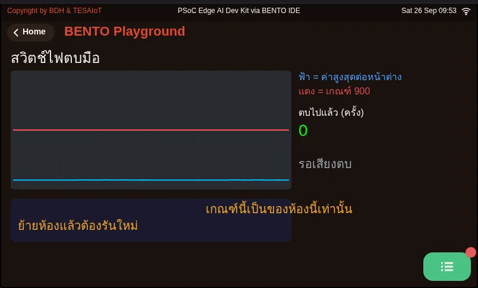
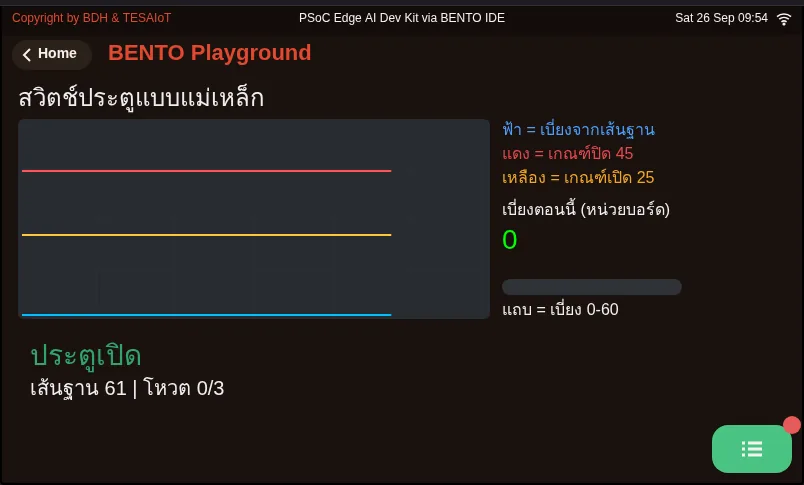
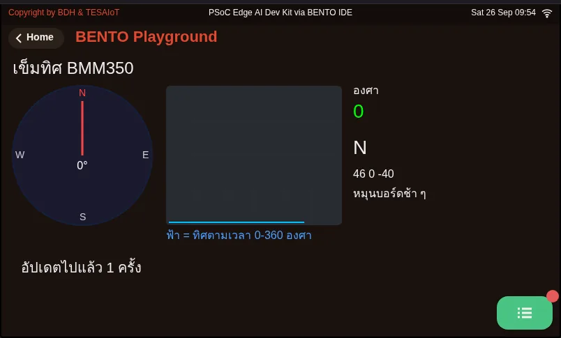
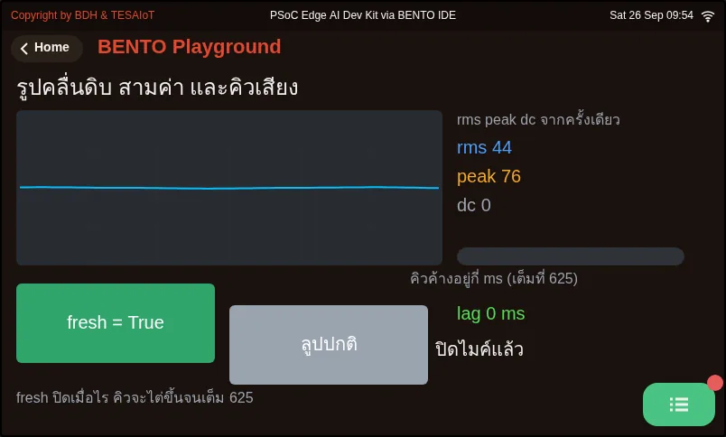
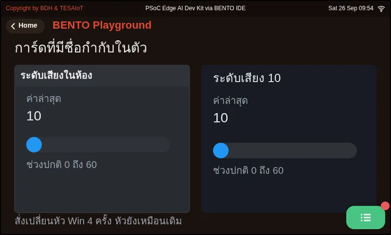

# บทเรียน 3.9 — ลงมือทำ: Mini-HMI Dashboard และการทดสอบ 10 นาที

> โมดูล 3 — แสดงผลเซนเซอร์บน HMI · สไลด์: [slides.md](slides.md) · [ภาพรวมโมดูล](../README.md) · [หน้าหลักสูตร](../../README.md)

เติมช่องว่างในไฟล์ฝึก s08_dashboard.py ทีละจุดจนแดชบอร์ดสี่การ์ดตอบสนองครบ แล้วพิสูจน์ด้วยการรันต่อเนื่อง 10 นาทีที่จดเลขรอบทุกสองนาที เพื่อแยกให้ออกว่าจอ "ค้าง" หรือแค่ "ช้า"

## เป้าหมาย

เมื่อจบบทเรียนนี้ คุณจะ:

1. เติมช่องว่างใน practice/s08_dashboard.py ทีละจุดและรันทุกครั้ง จนกราฟ IMU วิ่งตามการเขย่าครบสามเส้น เข็มทิศหมุนตามการหันบอร์ดและชื่อทิศเปลี่ยน ไฟ CapSense ติดตอนแตะและหรี่ตอนปล่อย Bar กับตัวเลข % ขยับ และ Arc กับ Seg7 เปลี่ยนพร้อมกันเมื่อหมุนลูกบิด
2. รันแดชบอร์ดต่อเนื่อง 10 นาทีโดยจดเลขรอบทุกสองนาทีลงบันทึกการเรียนครบหกช่อง ไม่มี Traceback และ loop ms ไม่โตขึ้นเรื่อย ๆ และแยกได้จากเลขรอบกับ loop ms ว่าอาการที่เห็นคือค้างหรือช้า
3. จับคู่อาการที่ไม่มี error message อย่างน้อยสามอาการจากตารางกับดัก (เช่น widget ตัวท้าย ๆ ไม่ขึ้น การ์ดบังตัวหนังสือ จอซ่อน widget ทุกสองวินาที Seg7 ค้างที่เดิม เข็มทิศกระตุกตอนผ่านทิศเหนือ) กับสาเหตุและวิธีแก้ได้ถูกต้อง
4. อธิบายการตัดสินใจในเฉลยได้อย่างน้อยสามข้อ ได้แก่ try ครอบการอ่านทีละเซนเซอร์ except คงค่าเดิมแล้วให้ไฟค่าค้างบอก ตัวเลขเขียนใหม่วินาทีละครั้งขณะที่กราฟขยับทุก 200 ms และปุ่มหยุดภาพที่ไม่ได้หยุดโปรแกรม

## ก่อนเริ่ม

มีผังกระดาษกับตารางงบจากบทเรียน 3.7 และบันทึกการแกะเฉลยจากบทเรียน 3.8 อยู่ข้างตัว เตรียมตารางหกช่องในบันทึกการเรียน
ไว้จดเลขรอบที่นาที 0, 2, 4, 6, 8 และ 10 และนาฬิกาจับเวลาหนึ่งเรือน บนจอบอร์ดแตะการ์ด **BENTO Playground** ค้างไว้
และห้ามกดกลับระหว่างทดสอบ เสียบสาย USB ให้แน่น เพราะสายหลวมทำให้บอร์ดรีเซ็ตกลางทาง แล้วเราจะไปโทษโค้ดผิด ๆ

- **อุปกรณ์:** บอร์ด Eva Kit หรือ TESAIoT Dev Kit ที่ลงเฟิร์มแวร์ MicroPython ของ BENTO แล้ว หรือ BENTO Emulator ใน [BENTO IDE](https://ide.tesaiot.dev/)
- **เรียนมาก่อน:** [บทเรียน 3.8 — ประกอบแดชบอร์ด: สี่การ์ดในลูปเดียว](../l08-dashboard-build/README.md)

## แนวคิด

เกณฑ์ผ่านของชุดบทเรียน 3.7–3.9 มีประโยคเดียว **แดชบอร์ดสี่การ์ดรันต่อเนื่อง 10 นาทีไม่ค้างไม่ crash** ห้าข้อแรกใน
รายการตรวจใช้เวลาสร้างราวหนึ่งชั่วโมง ส่วนสิบนาทีของการรันยาวห้ามลัด เพราะมันคือข้อที่แยกของเล่นออกจากของใช้งาน
จริง ไฟล์ฝึกมีหน้าจอครบแล้ว การ์ดสามใบเขียนไว้ให้ งานของเราคือเติมจุดที่ขาดทีละจุดแล้วรันทุกครั้ง เพราะเมื่อโค้ดยาว
เกินสามสิบบรรทัด การเติมทีละจุดคือวิธีเดียวที่ทำให้รู้ว่าพังตรงไหน และกับดักส่วนใหญ่ในงาน UI เงียบสนิท ไม่มี error
ตาของเราคือเครื่องมือดีบักหลัก

เฉลยใช้งบครบ 32 พอดี ช่องที่เหลือจากผังกระดาษของบทเรียน 3.7 ถูกใช้ไปกับไฟค่าค้าง ปุ่มเดินหน้ากับหยุดภาพ ไฟสองดวง
ของการ์ดสัมผัส และเกณฑ์เตือนในการ์ดลูกบิด (Spinbox กับไฟเตือน) บล็อกนับ widget อยู่ในหัวไฟล์ ไม่ใช่ในสมุด เพราะเอกสารที่อยู่ไกลจากโค้ด
จะเก่าเสมอ ผังทั้งหน้าใช้สูตรเดียว ขอบซ้าย 24 ช่องไฟ 16 การ์ดสูง 136 ทั้งสองแถว (24 + 368 + 16 + 360 + 24 = 792)
และปุ่มอยู่ในแถบหัว เพราะการ์ดสองแถวกินพื้นที่ 398 จนหมด

ลูปของเฉลยตัดสินใจไว้หลายเรื่อง `try` ครอบการอ่าน **ทีละเซนเซอร์** ไม่ใช่ทั้งลูป เข็มทิศตัวเดียวมีปัญหา อีกสามการ์ด
ยังต้องทำงาน `except` ไม่เขียนศูนย์ทับ มันคงค่าล่าสุดไว้ แล้วถ้าอ่านไม่ได้ติดกันเกิน `STALE_MS` (3000 ms) ไฟค่าค้าง
จะติดเพื่อตอบคำถาม "เลขที่เห็นอยู่ตอนนี้ ใช่ค่าปัจจุบันไหม" ไฟนี้เขียนเฉพาะตอนสถานะเปลี่ยน เพราะคิวคำสั่งของจอมี
ก้นถัง กราฟ แถบ เข็ม และไฟขยับทุก 200 ms ได้เพราะตาอ่านรูปทรง แต่ตัวเลขเขียนใหม่วินาทีละครั้ง (`UI_TEXT_MS`)
เพราะเลขที่กระพริบห้าครั้งต่อวินาทีไม่มีใครอ่านทัน ปุ่มหยุดภาพแค่ตั้ง `running = False` เลขรอบยังเดิน คนดูจึงรู้ว่า
เครื่องไม่ได้ค้าง ส่วน `time.ticks_diff()` ใช้แทนการลบตรง ๆ เพราะ `ticks_ms()` วนกลับเป็นศูนย์ในวันที่รันยาว

กับดักเงียบที่ต้องจำ `Seg7` รับข้อความ ใช้ `.text()` ถ้าเรียก `.value()` ตัวเลขจะค้างที่ 0000 ตลอดกาลทั้งบนบอร์ดและ
ใน Emulator โดยไม่มี error ลืม `ui.poll()` แล้วจอจะซ่อน widget ราวสองวินาทีวนไปเรื่อย ๆ และปุ่มบนจอจะตายสนิท
ส่วนระหว่างรันยาว เลขรอบที่หยุดนิ่งแปลว่าลูปตาย แต่เลขรอบที่ยังเดินขณะ loop ms ค่อย ๆ โตขึ้น แปลว่าช้า ไม่ใช่ค้าง
มีอะไรสะสมอยู่ในลูป สองอาการนี้แก้คนละวิธี แยกให้ออกก่อนลงมือ

## ตัวอย่างสมบูรณ์

ตัวอย่างสามไฟล์ที่ทำให้การ์ดยืนได้ตลอดสิบนาที เปิดเมื่อถึงการ์ดที่เกี่ยวข้อง ไม่ต้องทำก่อนทั้งหมด

1. **06_compass_readout.py** (ราว 10 นาที) ตอนเติมจุดของเข็มทิศ รันแล้ววางบอร์ดนิ่ง กราฟทิศตามเวลาต้องเป็นเส้นตรง
   เส้นที่สั่นคือเข็มที่ยังคาลิเบรตไม่พอ สังเกตว่ามันใช้ `seg.text()` ไม่ใช่ `seg.value()` ไฟล์นี้ยืนยันบน Eva Kit แล้ว
   บน Dev Kit ยังไม่ได้รัน
2. **05_door_open_switch.py** (ราว 10 นาที) ดูเกณฑ์สองระดับ (hysteresis) ที่ทำให้ป้ายสถานะไม่กระพริบตอนค่าแกว่งอยู่ใกล้เกณฑ์
   ทายก่อนว่าถ้าตั้งเกณฑ์เปิดกับปิดใกล้กันจะเกิดอะไร แล้วลองแก้ดู เกณฑ์ 45 กับ 25 เป็นหน่วยบอร์ด ไม่ใช่ uT ถ้าเปิด
   แล้วได้ `OSError` ให้ข้ามไปทำการ์ด IMU ก่อน แล้วจดไว้ เพราะไฟล์นี้ยังไม่มีใครรันบนบอร์ดจริง
3. ถ้าทีมเลือกการ์ดเสียงเป็นใบที่ห้า **03_mic_clap_trigger.py** ใช้ `peak()` จับเสียงตบมือที่ `rms()` เฉลี่ยจนหาย และ
   **07_mic_window_stats.py** ให้กดสลับ `fresh` ดูคิวเสียงโตจนเต็ม 625 ms กับตา

**08_win_titled_card.py** เป็นทางเลือกของกรอบการ์ด `ui.Win` มีแถบหัวเรื่องมาให้ ราคาสอง handle เท่ากับ Panel + Label
แต่แถบหัวกินความสูงไปราว 60 px และ `text=` ใช้ได้ตอนสร้างเท่านั้น ค่าที่เปลี่ยนได้จึงห้ามอยู่บนหัวเรื่อง

| ไฟล์ | ไฟล์นี้สอน |
|---|---|
| [examples/03_mic_clap_trigger.py](examples/03_mic_clap_trigger.py) | ตบมือแล้วไฟสลับ |
| [examples/05_door_open_switch.py](examples/05_door_open_switch.py) | สวิตช์แม่เหล็กบอกว่าประตูเปิดหรือปิด |
| [examples/06_compass_readout.py](examples/06_compass_readout.py) | เข็มทิศที่ใช้งานได้จริง พร้อมตัวเลของศา |
| [examples/07_mic_window_stats.py](examples/07_mic_window_stats.py) | รูปคลื่นดิบ สามค่าจากหน้าต่างเดียว และคิวที่ค้างอยู่ |
| [examples/08_win_titled_card.py](examples/08_win_titled_card.py) | การ์ดที่มีชื่อกำกับมาในตัว และหัวเรื่องที่แก้ไม่ได้ |

สไลด์ของบทเรียนนี้อ้างถึงไฟล์ที่อยู่ในบทเรียนอื่นด้วย:

- [m02-ui-to-hardware/l02-active-low-debounce/examples/05_debounce_count.py](../../m02-ui-to-hardware/l02-active-low-debounce/examples/05_debounce_count.py) — นับการกดให้ตรง ด้วยการรอให้ปุ่มนิ่งก่อน
- [m03-sensor-hmi/l08-dashboard-build/examples/02_mic_sound_level_meter.py](../l08-dashboard-build/examples/02_mic_sound_level_meter.py) — เครื่องวัดระดับเสียงในห้อง
- [m03-sensor-hmi/l08-dashboard-build/examples/04_magnet_presence.py](../l08-dashboard-build/examples/04_magnet_presence.py) — ตรวจว่ามีแม่เหล็กอยู่ใกล้หรือไม่
- [shared/usecase/01_andon_severity_lamp.py](../../shared/usecase/01_andon_severity_lamp.py) — เสาไฟสถานะแบบโรงงาน (andon light)
- [shared/usecase/05_short_long_press.py](../../shared/usecase/05_short_long_press.py) — ปุ่มเดียว สองความหมาย
- [shared/usecase/14_hard_iron_calibration.py](../../shared/usecase/14_hard_iron_calibration.py) — การคาลิเบรตเข็มทิศ เป็นสิ่งที่วัดได้

**ภาพจอจาก BENTO Emulator** ของตัวอย่างในบทนี้ (คลิกชื่อไฟล์เพื่อเปิดโค้ด)

<figure><figcaption><a href="examples/03_mic_clap_trigger.py"><code>03_mic_clap_trigger.py</code></a> ตบมือแล้วไฟสลับ</figcaption></figure>
<figure><figcaption><a href="examples/05_door_open_switch.py"><code>05_door_open_switch.py</code></a> สวิตช์แม่เหล็กบอกว่าประตูเปิดหรือปิด</figcaption></figure>
<figure><figcaption><a href="examples/06_compass_readout.py"><code>06_compass_readout.py</code></a> เข็มทิศที่ใช้งานได้จริง พร้อมตัวเลของศา</figcaption></figure>
<figure><figcaption><a href="examples/07_mic_window_stats.py"><code>07_mic_window_stats.py</code></a> รูปคลื่นดิบ สามค่าจากหน้าต่างเดียว และคิวที่ค้างอยู่</figcaption></figure>
<figure><figcaption><a href="examples/08_win_titled_card.py"><code>08_win_titled_card.py</code></a> การ์ดที่มีชื่อกำกับมาในตัว และหัวเรื่องที่แก้ไม่ได้</figcaption></figure>

## ฝึกเติม

ไฟล์ฝึกมีคำใบ้ `# เติม:` เจ็ดจุด เติมทีละจุดแล้วกด Program to Device ดูผลทุกครั้ง ห้ามเติมครบแล้วรันทีเดียว

1. **จุดที่ 1–2 ก่อน แล้วรัน** `sensors.bmi270.motion()` ในบล็อก try คือการอ่านทิ้งหนึ่งครั้ง ไม่ใช่การเปิดเซนเซอร์
   ห้ามเรียก `sensors.init()` ทั้งสองบอร์ด (Eva Kit ได้ `OSError` เสมอ Dev Kit ผ่านแต่ไม่จำเป็น) จุดที่ 2 คือ
   `imu_panel = ui.Panel(...)` ของการ์ด IMU ลอกรูปทรงจากการ์ดสามใบที่เขียนไว้แล้ว
2. **จุดที่ 3–6 ทีละจุด แล้วรันทุกครั้ง** ค่าจะมาทีละการ์ด `imu_chart.set_next(sy, int(ay * 10))` แล้วเส้นที่สามโผล่ ·
   `compass.value(int(heading))` แล้วเข็มหมุน · `cap_bar.value(int(cap['slider']))` แล้วแถบตามนิ้ว ·
   `pot_seg7.text("{:.1f}".format(pct))` แล้ว Seg7 เปลี่ยน ห้ามใช้ `.value()` กับ Seg7
3. **จุดที่ 7 เป็นอันสุดท้าย และจงใจลองผิดหนึ่งรอบ** รันดูสักครึ่งนาทีโดยที่ลูป `for ev in ui.poll():` ยังไม่ทำงาน
   (ถ้าในไฟล์ของคุณมีลูปนี้อยู่แล้วใต้คำใบ้ ให้ใส่ # ปิดทั้งบล็อกไว้ชั่วคราว) แล้วจดว่าจอมีอาการอะไร นั่นคืออาการของ
   การลืม `ui.poll()` แล้วค่อยเปิดกลับ

ครบแล้วแก้ `TEAM` ให้เป็นชื่อทีม ตรวจว่าบล็อกงบในหัวไฟล์ยังตรงกับ widget ที่มีจริง แล้วเริ่มรันยาว ถ้าจอค้างระหว่างทาง
กด RESTART บนหน้า Playground แล้วเริ่มจับเวลาใหม่ตั้งแต่ศูนย์ ห้ามนับต่อ

| ไฟล์ฝึก | เรื่อง |
|---|---|
| [practice/s08_dashboard.py](practice/s08_dashboard.py) | Mini-HMI แดชบอร์ด 4 การ์ด บน Eva Kit / Dev Kit (ฉบับฝึกเติมโค้ด) |

## เฉลย

เปิดเฉลยหลังจากลองเองแล้วอย่างน้อยหนึ่งรอบ แล้วอ่าน [วิธีใช้เฉลย](../../README.md#วิธีใช้เฉลย) ก่อน

| เฉลย | คู่กับ |
|---|---|
| [solution/s08_dashboard.py](solution/s08_dashboard.py) | [practice/s08_dashboard.py](practice/s08_dashboard.py) |

## เช็กความเข้าใจ

คำถามชุดเดียวกันอยู่ใน [quiz.yaml](quiz.yaml) สำหรับระบบที่ตรวจอัตโนมัติ

1. คุณเติมจุดของการ์ดลูกบิดเป็น pot_seg7.value(int(pct)) รันแล้วไม่มี error แต่ Seg7 ค้างที่ 0000 ตลอด ทั้งที่ Arc ขยับตามลูกบิด ควรแก้อย่างไร *(เลือกหนึ่งข้อ · เป้าหมายข้อ 1)*
   - ก) เปลี่ยนเป็น pot_seg7.text("{:.1f}".format(pct)) เพราะ Seg7 รับข้อความ ไม่ใช่ค่า
   - ข) ใส่ value=28 ตอนสร้าง Seg7 ให้ฟอนต์ใหญ่ขึ้น
   - ค) ย้ายบรรทัดนั้นออกนอกเงื่อนไข UI_TEXT_MS ให้เขียนทุก 200 ms
   - ง) เรียก sensors.init() ก่อนอ่านลูกบิด

   

เฉลย

   **ก** — ฝั่งเฟิร์มแวร์ไม่มีเส้นทาง .value() สำหรับ Seg7 คำสั่งจึงหายเงียบ ๆ และตัวเลขค้างที่ 0000 ทั้งบนบอร์ดและใน Emulator ต้องส่งเป็นข้อความด้วย .text() ส่วน value= ของ Seg7 ก็ถูกโยนทิ้งเพราะฟอนต์ถูกฝังไว้ตายตัว

   

2. ระหว่างรันยาว เลขรอบยังเดินต่อทุกช่วง แต่ loop ms บนแถบหัวค่อย ๆ โตจาก 3 เป็น 40 ms ข้อใดสรุปได้ถูกต้อง *(เลือกหนึ่งข้อ · เป้าหมายข้อ 2)*
   - ก) ช้า ไม่ใช่ค้าง มีอะไรสะสมอยู่ในลูป และยังไม่ผ่านข้อ loop ms ไม่โตขึ้นเรื่อย ๆ
   - ข) ค้างจริง ลูปตายแล้ว ต้องกด RESTART แล้วนับเวลาต่อ
   - ค) ปกติ เพราะเลขรอบยังเดิน ถือว่าผ่านเกณฑ์สิบนาที
   - ง) เซนเซอร์ไม่ตอบ ให้ดูที่ไฟค่าค้าง

   

เฉลย

   **ก** — ค้างจริงคือเลขรอบกับ loop ms หยุดทั้งคู่ แต่ถ้าเลขรอบยังเดินขณะ loop ms โตขึ้นเรื่อย ๆ แปลว่าช้าลงเพราะมีอะไรสะสม ซึ่งเกณฑ์ MVP ห้ามไว้ และถ้าต้องรีสตาร์ต ต้องเริ่มจับเวลาใหม่ตั้งแต่ศูนย์ ห้ามนับต่อ

   

3. การ์ดใบท้าย ๆ ของทีมไม่ขึ้นจอเลย ไม่มี error และสคริปต์ก่อนหน้าก็เพิ่งรันเสร็จ สาเหตุที่น่าจะเป็นที่สุดคืออะไร *(เลือกหนึ่งข้อ · เป้าหมายข้อ 3)*
   - ก) เกินเพดาน 64 widgets เพราะไม่ได้เรียก ui.screen() ต้นสคริปต์ ของเก่าจึงยังกินช่องอยู่
   - ข) สร้าง Panel ก่อน Label
   - ค) sleep_ms(200) นานเกินไป CM55 จึงไม่วาด
   - ง) Emulator รองรับแค่สี่การ์ด

   

เฉลย

   **ก** — ตัวที่เกินเพดาน 64 ไม่ขึ้นและไม่เตือนอะไร ui.screen() ล้าง widget เดิมทั้งหมด ถ้าไม่เรียก ของจากสคริปต์ก่อนหน้าจะกินงบตั้งแต่ยังไม่เริ่ม แก้โดยนับใหม่และเรียก ui.screen() ต้นสคริปต์ ส่วนการสร้าง Panel ก่อน Label คือลำดับที่ถูก

   

4. เข็มทิศบนการ์ดกระตุกกลับทุกครั้งที่หมุนบอร์ดผ่านทิศเหนือ ข้อใดคือวิธีแก้ที่ตรงสาเหตุ *(เลือกหนึ่งข้อ · เป้าหมายข้อ 3)*
   - ก) เขียน heading = sensors.bmm350.heading() % 360.0 กันค่าที่หลุดเกิน 360
   - ข) เปลี่ยน ui.Compass เป็น ui.Arc
   - ค) ลด cadence เหลือ 50 ms ให้เข็มตามทัน
   - ง) เรียก cal_reset() ทุกรอบลูป

   

เฉลย

   **ก** — ถ้า Compass ได้ค่าอย่าง 361 เข็มจะกระตุกกลับ การ % 360.0 ทำให้องศาอยู่ในช่วง 0 ถึงไม่ถึง 360 เสมอ อาการนี้ไม่มี error ต้องเห็นด้วยตาเท่านั้น

   

5. ข้อใดตรงกับการตัดสินใจในไฟล์เฉลย s08_dashboard.py เลือกทุกข้อที่ถูก *(เลือกได้หลายข้อ · เป้าหมายข้อ 4)*
   - ก) try ครอบการอ่านทีละเซนเซอร์ เข็มทิศไม่ตอบ อีกสามการ์ดยังทำงานต่อ
   - ข) อ่านไม่ได้ติดกันเกิน 3 วินาที ไฟค่าค้างจะติด โดยตัวเลขบนจอยังเป็นค่าล่าสุดที่อ่านได้
   - ค) ตัวเลขบนการ์ดเขียนใหม่วินาทีละครั้ง ส่วนกราฟ แถบ เข็ม และไฟขยับทุก 200 ms
   - ง) กดหยุดภาพแล้วลูปหยุด เลขรอบจึงนิ่งเพื่อบอกว่าหยุดแล้ว
   - จ) ไฟค่าค้างถูกเขียนทุกรอบลูปเพื่อให้แน่ใจว่าจอได้รับ

   

เฉลย

   **ก, ข, ค** — การเลือกขอบเขตของ try คือการตัดสินใจว่าอะไรพังได้โดยระบบยังใช้งานได้ except คงค่าเดิมเพราะศูนย์หน้าตาเหมือนค่าจริง หยุดภาพแค่ตั้ง running เป็น False เลขรอบยังเดินเพื่อบอกว่าเครื่องไม่ได้ค้าง และไฟค่าค้างเขียนเฉพาะตอนเปลี่ยน เพราะคิวคำสั่งของจอมีก้นถัง

   

## แล็บ

**MVP checkpoint** ผ่านชุดบทเรียน 3.7–3.9 เมื่อทุกข้อเป็นจริง

- [ ] มีการ์ดครบสี่ใบบนจอเดียว ไม่ทับกัน ไม่ล้นขอบ 792×398
- [ ] การ์ด IMU มีกราฟที่วิ่งตามการเขย่าบอร์ดจริง
- [ ] เข็มทิศหมุนตามการหันบอร์ด และตัวอักษรทิศเปลี่ยนตามองศา
- [ ] แตะปุ่ม CapSense แล้วไฟดวงนั้นติด ปล่อยแล้วหรี่ ไม่ใช่หาย และเลื่อนนิ้วแล้ว Bar กับตัวเลข % ขยับ
- [ ] หมุนลูกบิดแล้ว Arc และ Seg7 เปลี่ยนพร้อมกัน
- [ ] งบ widget ที่นับได้ไม่เกิน 32 (เพดานเฟิร์มแวร์ 64) และตัวเลขในหัวไฟล์ตรงกับของจริง
- [ ] รันต่อเนื่อง 10 นาที เลขรอบเดินตลอด ไม่มี Traceback และ loop ms ไม่โตขึ้นเรื่อย ๆ
- [ ] จดเลขรอบทุกสองนาทีลงบันทึกการเรียนครบหกช่อง

ระหว่างรัน ถ้าเห็นอะไรแปลก ๆ ให้หมุนลูกบิดแล้วดูสามที่พร้อมกัน เลข Seg7 เลขรอบ และ loop ms ถ้าเลขรอบเดินแต่ Seg7
ไม่ขยับ ปัญหาอยู่ฝั่งเซนเซอร์ ถ้าเลขรอบหยุด ปัญหาอยู่ฝั่งลูปหรือจอ

## ไปต่อ

เก็บไฟล์นี้ไว้และอย่าลบ บทเรียน 4.1–4.3 จะต่อบอร์ดเข้า WiFi แล้วเอา SSID, IP และค่า ping ขึ้นแดชบอร์ดใบนี้ ไม่ได้เริ่มใหม่
ถ้าอยากไปต่อ เลือกหนึ่งข้อ: การ์ดใบที่ห้ารายงานสุขภาพของโปรแกรม (เวลารัน จำนวนรอบ loop ms สูงสุด) ภายในงบ 32 ·
โซนสีตามเกณฑ์ของขนาดความเร่งรวม (ต่ำกว่า 11 เขียว 11–12 เหลือง เกิน 12 แดง) · สลับหน้าด้วย `.show()` / `.hide()` ·
รันยาวสองรอบที่ `sleep_ms(200)` กับ `sleep_ms(80)` แล้วสรุปว่าทีมจะเลือก cadence เท่าไร

บทเรียนถัดไป: [บทเรียน 4.1 — WiFi และเครือข่าย: dBm DHCP IP และ DNS](../../m04-iot-connectivity/l01-wifi-networking/README.md)

## สะท้อนคิด

- ถ้าต้องเพิ่มการ์ดสถานะเครือข่ายในบทเรียน 4.1–4.3 คุณจะตัดอะไรออก หรือใช้งบส่วนไหน
- การ์ดใบไหนที่คนดูจริงจะมองบ่อยที่สุด และตอนนี้มันอยู่ตำแหน่งที่ควรอยู่หรือยัง
- ตัวเลขหกช่องที่คุณจดได้บอกอะไรเกี่ยวกับลูปของคุณ และถ้ามีช่องหนึ่งต่ำผิดปกติ คุณจะเริ่มหาสาเหตุจากตรงไหน
