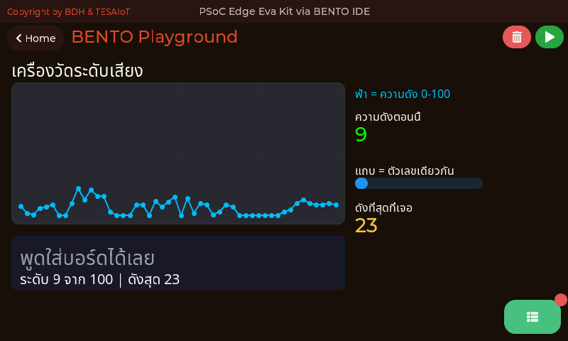
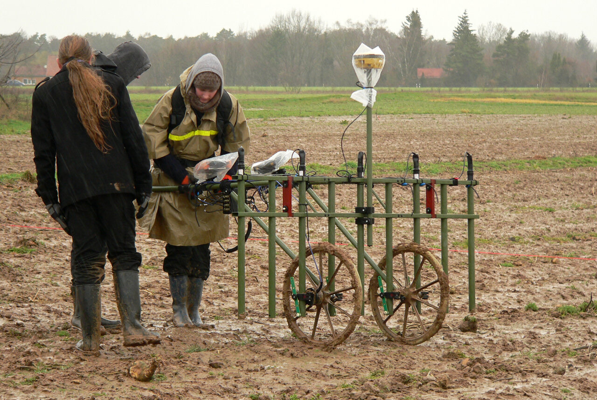
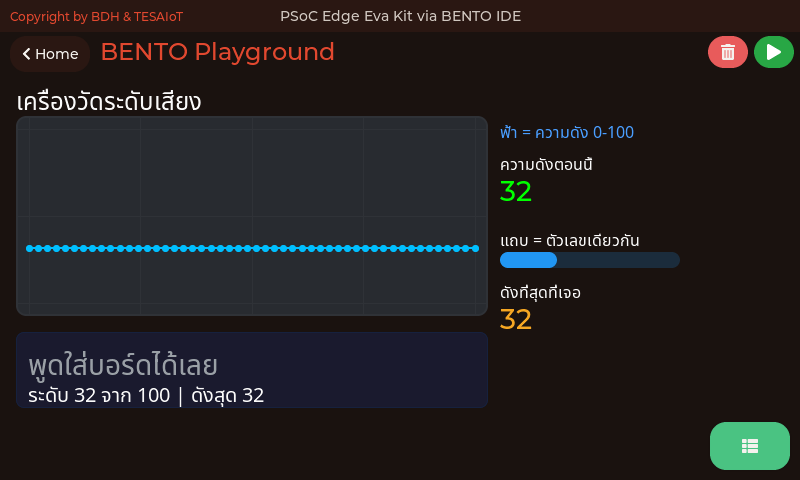
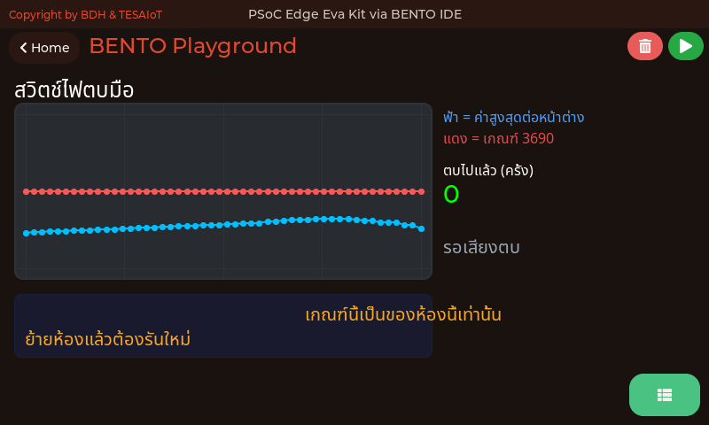
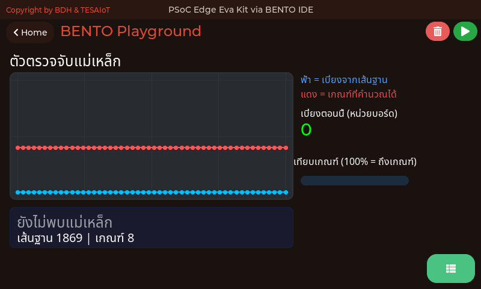
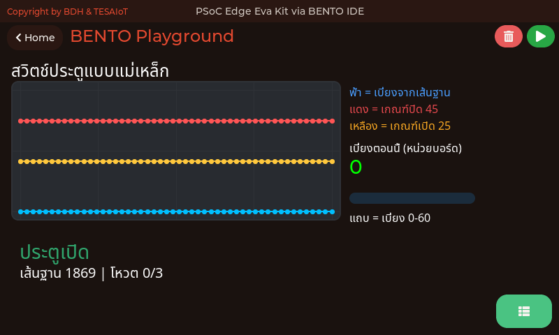
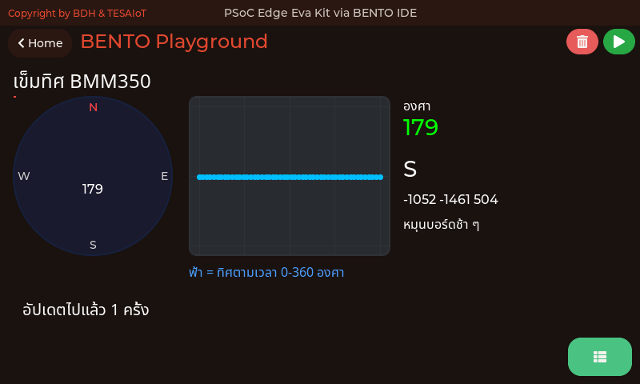
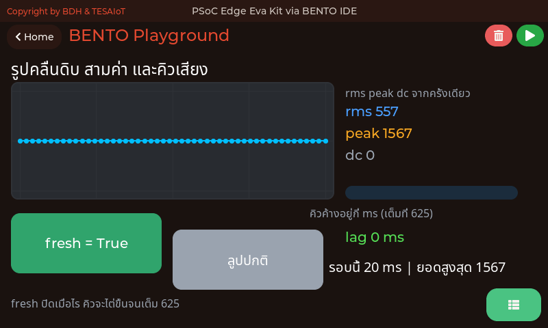
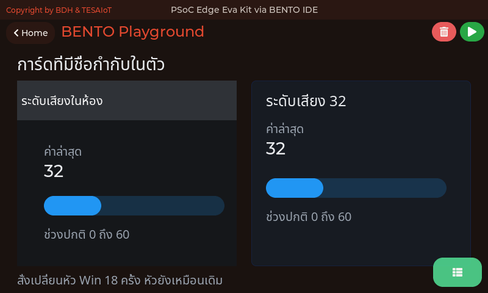

<style>
section { font-size: 23px; padding: 14px 44px; justify-content: flex-start; }
section h1 { font-size: 1.45em; line-height: 1.10; margin: 0 0 .14em; }
section h2 { font-size: 1.10em; margin: .06em 0; }
section h3 { font-size: 1.0em; margin: .12em 0; }
section p, section li { margin: .05em 0; line-height: 1.16; }
section img { max-width: 100%; height: auto; }
section svg { max-height: 205px; width: 100%; }
section table { font-size: .70em; }
section pre { font-size: .50em; line-height: 1.10; background:#0d1117; color:#e6edf3; border:1px solid #30363d; border-radius:8px; padding:12px 16px; box-shadow:0 2px 8px rgba(0,0,0,.25); }
section pre code { white-space: pre-wrap; background:transparent; color:inherit; } section pre .hljs-comment{color:#8b949e;font-style:italic} section pre .hljs-keyword,section pre .hljs-built_in,section pre .hljs-literal{color:#ff7b72} section pre .hljs-string{color:#a5d6ff} section pre .hljs-number{color:#79c0ff} section pre .hljs-title,section pre .hljs-title.function_,section pre .hljs-section{color:#d2a8ff} section pre .hljs-meta{color:#ffa657} section pre .hljs-attr,section pre .hljs-attribute,section pre .hljs-name{color:#7ee787}
section blockquote { margin: .12em 0; font-size: .88em; }
/* two images on a line (parity / 2x2 grids) stay side-by-side and small */
section p > img + img { margin-left: 10px; }
/* scroll-within-slide: dense slides scroll instead of clipping */
section { overflow-y: auto; overflow-x: hidden; }
section::-webkit-scrollbar { width: 11px; }
section::-webkit-scrollbar-thumb { background:#4a90d9; border-radius:6px; }
section::-webkit-scrollbar-track { background:rgba(0,0,0,.06); }
/* image drop-shadow + cover-slide readability (auto) */
section img{filter:drop-shadow(0 3px 12px rgba(0,0,0,.5))}
/* พื้นสำรองของสไลด์ปก: ถ้า img/cover_sNN.svg โหลดไม่ขึ้น ธีมจะคืนพื้นขาว
   แล้วตัวอักษรสีขาวของปกจะหายไปทั้งแผ่น — ปักสีเข้มไว้ให้ภาพเป็นแค่ของประดับ */
section.cover{background-color:#0b1426}
section.cover *{color:#fff !important}
section.cover h1,section.cover h2,section.cover h3,section.cover p,section.cover li,section.cover strong,section.cover em,section.cover blockquote,section.cover div{text-shadow:0 2px 9px rgba(0,0,0,.92),0 0 3px rgba(0,0,0,.8)}
section.cover div[style*="background:#"],section.cover div[style*="background: #"]{background:rgba(10,14,20,.66) !important;border-color:rgba(120,200,255,.45) !important;max-width:62%}
section.cover blockquote{border-left:4px solid rgba(120,200,255,.6) !important;background:rgba(13,17,23,.55) !important;border-radius:6px;padding:.3em .6em}
section.cover h1,section.cover h2,section.cover h3,section.cover p,section.cover blockquote{max-width:60%}
section.cover div:not(:has(img)){max-width:62%}
section.cover img{filter:none}
</style>


<!-- _class: cover -->

# บทเรียน 3.9 — ลงมือทำ: Mini-HMI Dashboard และการทดสอบ 10 นาที

## Mini-HMI Dashboard · ประกอบทุกอย่างที่เรียนมาให้เป็นหน้าจอเดียว ภายใต้งบ 32 widgets ที่ตั้งเอง

**โมดูล 3 — แสดงผลเซนเซอร์บน HMI**

> ต่อจากบทเรียน 3.8 — ประกอบแดชบอร์ด: สี่การ์ดในลูปเดียว

---

## MVP checkpoint — ผ่านชุดบทเรียนนี้เมื่อ


**dashboard 4 การ์ดรันต่อเนื่อง 10 นาทีไม่ค้างไม่ crash**

แปลเป็นสิ่งที่ตรวจได้จริง:

- [ ] มีการ์ดครบสี่ใบบนจอเดียว ไม่ทับกัน ไม่ล้นขอบ 792×398
- [ ] การ์ด IMU มีกราฟที่วิ่งตามการเขย่าบอร์ดจริง
- [ ] เข็มทิศหมุนตามการหันบอร์ด และตัวอักษรทิศเปลี่ยนตามองศา
- [ ] แตะปุ่ม CapSense แล้วไฟ `ui.Led` ดวงนั้นติด (ปล่อยแล้วหรี่ ไม่ใช่หาย) · เลื่อนนิ้วแล้ว Bar กับตัวเลข % ขยับ
- [ ] หมุนลูกบิดแล้ว Arc และ Seg7 เปลี่ยนพร้อมกัน
- [ ] งบ widget ที่นับได้ **ไม่เกิน 32 ที่ตั้งไว้** (เพดานเฟิร์มแวร์ 64) และตัวเลขในหัวไฟล์ตรงกับของจริง
- [ ] รันต่อเนื่อง 10 นาที เลขรอบเดินตลอด ไม่มี Traceback และ loop ms ไม่โตขึ้นเรื่อย ๆ
- [ ] จดเลขรอบทุกสองนาทีลงบันทึกการเรียนครบหกช่อง

> ห้าข้อแรกใช้เวลาสร้างหนึ่งชั่วโมง ข้อที่เจ็ดใช้เวลาสิบนาทีที่ห้ามลัด — และมันคือข้อที่แยกของเล่นออกจากของใช้งานจริง

---

## กับดักที่เจอบ่อย

| อาการ | สาเหตุที่แท้จริง | วิธีแก้ |
|---|---|---|
| widget ตัวท้าย ๆ ไม่ขึ้นเลย | เกินเพดาน 64 (มักเพราะไม่ได้ `ui.screen()` ก่อน) | นับใหม่ + เรียก `ui.screen()` ต้นสคริปต์ |
| การ์ดบังตัวหนังสือจนหาย | สร้าง Panel **หลัง** Label | สร้าง Panel ก่อน Label เสมอ |
| ขอบการ์ดไม่มีสี มุมไม่โค้ง | สับสน kwarg ของ Panel | `min`=สีขอบ `max`=รัศมี `value`=ความหนา |
| กราฟเป็นขั้นบันไดหยาบ ๆ | ป้อน `int(ax)` ตรง ๆ | คูณ 10 ก่อน แล้วตั้งแกน −150..150 |
| จอกระพริบ ซ่อน widget ทุกสองวินาที | ลืม `ui.poll()` ในลูป | เติม `ui.poll()` ก่อน `sleep_ms` |
| `OSError` ที่บรรทัดแรกสุดของสคริปต์ | เรียก `sensors.init()` — Eva Kit ปฏิเสธ (Dev Kit ผ่านเงียบ ๆ แต่ไม่จำเป็น) | ลบบรรทัดนั้นทิ้ง ไม่ต้องมี init ทั้งสองบอร์ด |
| บรรทัดอ่านค่าแรกเงียบไปสิบกว่าวินาที | เพิ่งรีเซ็ตบอร์ด คอร์จอยังไม่ตอบสายเซนเซอร์ | รอให้จบ (บน Eva วัดได้ถึง 16 วินาที) ครั้งต่อไปไม่เกิน 1 |
| เข็มทิศกระตุกกลับตอนผ่านทิศเหนือ | ค่าองศาหลุดเกิน 360 | `heading = ... % 360.0` |
| ค่าทุกอย่างค้าง แต่โปรแกรมไม่ error | ยังใช้ `sensors.auto()` ร่วมกับ ui (เกิดได้เฉพาะ Dev Kit — บน Eva Kit `auto()` ขึ้น `OSError` ตั้งแต่บรรทัดนั้น) | ลบทิ้ง แล้วอ่าน sync ในลูปแทน ทั้งสองบอร์ด |
| `OSError` ตอนเรียก `sensors.scan()` | บน Eva Kit สแกน 112 แอดเดรสบนบัสที่ CM55 ถืออยู่ (Dev Kit ผ่าน) | ห้ามใช้ในคอร์สนี้ทั้งสองบอร์ด เฟิร์มแวร์ Eva กันไว้ให้แล้ว |
| `OSError` ที่ `bmi270.temperature()` หรือ `chip_id()` | บน Eva Kit ภาพสแกนของ CM55 ไม่ได้ขนสองค่านี้มา (Dev Kit ใช้ได้) | ใช้ `sensors.snapshot()['bmi270']['sequence']` ดูว่า IMU ยังมีชีวิตแทน — รันได้ทั้งสองบอร์ด |

> ส่วนใหญ่ของข้อเหล่านี้เงียบสนิท ไม่มี error message — ตาของเราคือเครื่องมือดีบักหลักในงาน UI

---

## ลงมือทำ — เติมช่องว่างในไฟล์ฝึก

<svg viewBox="0 0 940 206" style="max-height:150px" xmlns="http://www.w3.org/2000/svg">
  <rect x="24" y="24" width="248" height="26" rx="6" fill="#e3f2fd" stroke="#1565c0" stroke-width="2"/>
  <text x="148" y="43" text-anchor="middle" font-size="18" fill="#1565c0">เติมแล้วรัน — ควรเห็นการ์ดว่าง</text>
  <rect x="284" y="24" width="504" height="26" rx="6" fill="#e8f5e9" stroke="#2e7d32" stroke-width="2"/>
  <text x="536" y="43" text-anchor="middle" font-size="18" fill="#2e7d32">เติมทีละจุด แล้วรันทุกครั้ง — ค่าจะมาทีละการ์ด</text>
  <rect x="800" y="24" width="116" height="26" rx="6" fill="#ffebee" stroke="#c62828" stroke-width="2"/>
  <text x="858" y="43" text-anchor="middle" font-size="18" fill="#c62828">จุดสุดท้าย</text>
  <rect x="24" y="62" width="118" height="70" rx="8" fill="#e3f2fd" stroke="#1565c0" stroke-width="2"/>
  <text x="83" y="92" text-anchor="middle" font-size="19" font-weight="700" fill="#1565c0">จุด 1</text>
  <text x="83" y="118" text-anchor="middle" font-size="17" fill="#0d47a1">อ่านทิ้ง 1 ครั้ง</text>
  <rect x="152" y="62" width="118" height="70" rx="8" fill="#e3f2fd" stroke="#1565c0" stroke-width="2"/>
  <text x="211" y="92" text-anchor="middle" font-size="19" font-weight="700" fill="#1565c0">จุด 2</text>
  <text x="211" y="118" text-anchor="middle" font-size="17" fill="#0d47a1">Panel</text>
  <rect x="280" y="62" width="118" height="70" rx="8" fill="#e8f5e9" stroke="#2e7d32" stroke-width="2"/>
  <text x="339" y="92" text-anchor="middle" font-size="19" font-weight="700" fill="#2e7d32">จุด 3</text>
  <text x="339" y="118" text-anchor="middle" font-size="17" fill="#1b5e20">chart</text>
  <rect x="408" y="62" width="118" height="70" rx="8" fill="#e8f5e9" stroke="#2e7d32" stroke-width="2"/>
  <text x="467" y="92" text-anchor="middle" font-size="19" font-weight="700" fill="#2e7d32">จุด 4</text>
  <text x="467" y="118" text-anchor="middle" font-size="17" fill="#1b5e20">compass</text>
  <rect x="536" y="62" width="118" height="70" rx="8" fill="#e8f5e9" stroke="#2e7d32" stroke-width="2"/>
  <text x="595" y="92" text-anchor="middle" font-size="19" font-weight="700" fill="#2e7d32">จุด 5</text>
  <text x="595" y="118" text-anchor="middle" font-size="17" fill="#1b5e20">bar</text>
  <rect x="664" y="62" width="118" height="70" rx="8" fill="#e8f5e9" stroke="#2e7d32" stroke-width="2"/>
  <text x="723" y="92" text-anchor="middle" font-size="19" font-weight="700" fill="#2e7d32">จุด 6</text>
  <text x="723" y="118" text-anchor="middle" font-size="17" fill="#1b5e20">seg7</text>
  <rect x="792" y="62" width="124" height="70" rx="8" fill="#ffebee" stroke="#c62828" stroke-width="2">
    <animate attributeName="stroke-width" values="2;5;2" dur="2.2s" repeatCount="indefinite"/></rect>
  <text x="854" y="92" text-anchor="middle" font-size="19" font-weight="700" fill="#c62828">จุด 7</text>
  <text x="854" y="118" text-anchor="middle" font-size="17" fill="#8d3b3b">ui.poll()</text>
  <text x="470" y="170" text-anchor="middle" font-size="19" font-weight="700" fill="#c62828">จงใจลองผิดหนึ่งรอบ: รันครึ่งนาทีก่อนเติมจุดที่ 7 แล้วจดว่าจอมีอาการอะไร</text>
  <text x="470" y="196" text-anchor="middle" font-size="18" fill="#455a64">นั่นคืออาการของการลืม ui.poll() ซึ่งจะเจอได้อีกในโปรเจกต์จริง</text>
</svg>

เปิด [`s08_dashboard.py`](https://github.com/tesaiot/tesa-qualification-program/blob/main/courses/aiot-micropython/m03-sensor-hmi/l09-dashboard-lab/practice/s08_dashboard.py) มีช่องว่างให้เติม 7 จุด

> **ห้ามเรียก `sensors.init()` ทั้งสองบอร์ด** — Eva Kit ได้ `OSError` เสมอ Dev Kit ผ่านแต่ไม่จำเป็น — จุดที่ 1 ที่ต้องเติมคือ **การอ่านทิ้งหนึ่งครั้ง** ไม่ใช่การเปิดเซนเซอร์

```python
try:
    # เติม: sensors.bmi270.motion()
    pass
except OSError:
    pass
# เติม: imu_panel = ui.Panel(x=24, y=100, w=368, h=136, color=BG_CARD, min=COL_IMU, max=12, value=2)
pass
# เติม: imu_chart.set_next(sy, int(ay * 10))
pass
# เติม: compass.value(int(heading))
pass
# เติม: cap_bar.value(int(cap['slider']))
pass
# เติม: pot_seg7.text("{:.1f}".format(pct))
pass
# เติม: for ev in ui.poll():
pass
```

ลำดับที่แนะนำ: เติมจุดที่ 1–2 ก่อนแล้วรัน (ควรเห็นการ์ดครบสี่ใบ เพราะอีกสามใบเขียนไว้ให้แล้ว) · เติม 3–6 ทีละจุดแล้วรัน (ค่าจะมาทีละการ์ด) · เติมจุดที่ 7 เป็นอันสุดท้าย — **จงใจลองผิดหนึ่งรอบ:** ก่อนเติมจุดที่ 7 ให้รันดูสักครึ่งนาที แล้วจดว่าจอมีอาการอะไร นั่นคืออาการของการลืม `ui.poll()`

> เติมทีละจุดแล้วรัน คือวิธีเดียวที่ทำให้รู้ว่าจุดไหนพัง เมื่อโค้ดยาวเกินสามสิบบรรทัด

---

## ตัวอย่างของบทเรียน 3.7–3.9 — สามไฟล์นี้คือชุดที่ทำให้การ์ดบน dashboard ยืนได้ตลอดสิบนาที

<style scoped>
section table { font-size: .62em; }
section p { font-size: .8em; }
section h2 { font-size: 1.25em; }
</style>

**ต้องทำในบทเรียน** · เปิดตามลำดับนี้ ทั้งชุดราว 30 นาที

| ลำดับ · เรื่อง · เวลา | ไฟล์ | ลงมือทำอะไร แล้วจะเข้าใจอะไร |
|---|---|---|
| **1 · เข็มทิศที่อ่านออก** · 10 นาที | [`06_compass_readout.py`](https://github.com/tesaiot/tesa-qualification-program/blob/main/courses/aiot-micropython/m03-sensor-hmi/l09-dashboard-lab/examples/06_compass_readout.py) | ประกอบการ์ด Compass ใบที่ 2 ของ dashboard ได้ครบทั้งเข็ม ตัวเลข และกราฟ · จะเห็นว่าเข็มทิศที่คนอ่านออกต้องมีทั้งเข็มและตัวเลของศาอยู่ด้วยกัน |
| **2 · เกณฑ์สองระดับกันป้ายกระพริบ** · 10 นาที | [`05_door_open_switch.py`](https://github.com/tesaiot/tesa-qualification-program/blob/main/courses/aiot-micropython/m03-sensor-hmi/l09-dashboard-lab/examples/05_door_open_switch.py) | เขียนป้ายสถานะที่ยืนอยู่ได้จริงตลอด soak run 10 นาที ไม่สั่นตอนค่าคาบเส้น · จะเข้าใจว่าเกณฑ์สองระดับคือสิ่งที่ทำให้ป้ายสถานะไม่กระพริบ |
| **3 · การ์ดระดับเสียง** · 10 นาที | [`02_mic_sound_level_meter.py`](https://github.com/tesaiot/tesa-qualification-program/blob/main/courses/aiot-micropython/m03-sensor-hmi/l08-dashboard-build/examples/02_mic_sound_level_meter.py) | ประกอบการ์ดระดับเสียงจากไมโครโฟนได้ครบทั้งแถบ ตัวเลข และกราฟ · จะเห็นว่า `mic.level()` ยุบคลื่นเสียงทั้งชุดเหลือตัวเลขเดียวที่การ์ดใบหนึ่งแสดงได้ |

ไฟล์ที่ 1 ยืนยันบน Eva Kit แล้ว (`heading()` วัดจริงได้ 215.8 เมื่อ 14 ส.ค. 2026 · บน Dev Kit ยังไม่ได้รัน) · ไฟล์ที่ 2 ใช้ `sensors.bmm350.magnetic()` ซึ่ง **ยังไม่มีใครรันบนบอร์ดจริงทั้ง Eva Kit และ Dev Kit** ถ้าเปิดแล้วได้ `OSError` ให้ข้ามไปทำการ์ด IMU ก่อน แล้วแจ้งผู้สอน · ไฟล์ที่ 3 ยืนยันบน Eva Kit แล้วเช่นกัน (14 ส.ค. 2026 ห้องเงียบได้ rms 30 คือระดับ 7 · พูดปกติราว 1000 คือระดับ 54 · เปิดโทนใส่ไมค์ได้ 19335 คือระดับ 92)

<div style="display:flex;gap:16px;align-items:flex-start">
<div style="flex:0 0 360px">



</div>
<div style="flex:1;min-width:0">

ภาพซ้ายคือไฟล์ที่ 3 กำลังรันอยู่บนบอร์ดจริงในหน้า BENTO Playground เส้นกราฟขยับตามเสียงในห้องระหว่างที่ถ่ายภาพ ระดับตอนนั้นคือ 9 และดังสุดที่เจอคือ 23

</div>
</div>

---

## ติดตรงไหน เปิดอันนี้ — และไฟล์ที่เหลือของชุดบทเรียน

<style scoped>
section table { font-size: .6em; }
section p, section blockquote { font-size: .78em; }
section h2 { font-size: 1.25em; }
</style>

| อาการที่เจอ | ไฟล์ที่ตอบอาการนั้น |
|---|---|
| เกณฑ์ที่ตั้งไว้ใช้ได้ที่โต๊ะนี้ แต่ย้ายโต๊ะแล้วเตือนรัว | [`04_magnet_presence.py`](https://github.com/tesaiot/tesa-qualification-program/blob/main/courses/aiot-micropython/m03-sensor-hmi/l08-dashboard-build/examples/04_magnet_presence.py) — วัดเส้นฐานของห้องเองตอนเริ่ม แล้วคิดเกณฑ์จากความผันผวนของห้องนั้น |
| กดปุ่มครั้งเดียว แต่ตัวนับบนการ์ดขึ้นหลายครั้ง | [`05_debounce_count.py`](https://github.com/tesaiot/tesa-qualification-program/blob/main/courses/aiot-micropython/m02-ui-to-hardware/l02-active-low-debounce/examples/05_debounce_count.py) — นับดิบกับนับกันเด้งวิ่งคู่กันให้เห็นความต่าง |
| อยากให้การ์ดใบหนึ่งแสดง "ระดับ" ที่ตัดสินแล้ว ไม่ใช่ตัวเลขดิบ | [`01_andon_severity_lamp.py`](https://github.com/tesaiot/tesa-qualification-program/blob/main/courses/aiot-micropython/shared/usecase/01_andon_severity_lamp.py) — หนึ่งระดับคือไฟหนึ่งดวง ดับให้หมดก่อนจุดดวงใหม่เสมอ และเขียนจอเฉพาะตอนระดับเปลี่ยน |
| อยากให้การ์ดตอบตอนตบมือ แต่ตัวเลขความดังเฉลี่ยแทบไม่ขยับ | [`03_mic_clap_trigger.py`](https://github.com/tesaiot/tesa-qualification-program/blob/main/courses/aiot-micropython/m03-sensor-hmi/l09-dashboard-lab/examples/03_mic_clap_trigger.py) — `peak()` เห็นเสียงพุ่งสั้น ๆ ที่ `rms()` เฉลี่ยจนหายไป และเกณฑ์ต้องวัดจากห้องที่บอร์ดอยู่ตอนนั้น |
| การ์ดเสียงขยับช้ากว่าที่พูดจริงราวครึ่งวินาที | [`07_mic_window_stats.py`](https://github.com/tesaiot/tesa-qualification-program/blob/main/courses/aiot-micropython/m03-sensor-hmi/l09-dashboard-lab/examples/07_mic_window_stats.py) — `lag()` บอกเป็นตัวเลขว่าคิวค้างกี่ ms และปุ่มสลับ `fresh` ให้เห็นคิวโตจนเต็ม 625 กับตา · ไฟล์นี้ยังเป็นที่เดียวที่ใช้ `read()` กับ `stats()` สามค่าจากหน้าต่างเดียว |
| เข็มทิศบนการ์ดใบที่ 2 ชี้ผิดทิศ หรือสั่นทั้งที่วางบอร์ดนิ่ง | [`14_hard_iron_calibration.py`](https://github.com/tesaiot/tesa-qualification-program/blob/main/courses/aiot-micropython/shared/usecase/14_hard_iron_calibration.py) — ล้างค่าชดเชยแล้วหมุนเลขแปด เฝ้าดู `offset_x` `offset_y` ลู่เข้าจนเป็นเส้นแบน คาลิเบรตเป็นตัวเลขที่ดูได้ ไม่ใช่พิธีกรรมที่ทำแล้วหวังผล · แต่ `cal_reset()` กับ `cal_status()` **ยังไม่มีใครรันบนบอร์ดจริง ทั้ง Eva Kit และ Dev Kit** ถ้าเปิดแล้วได้ `OSError` ให้แจ้งผู้สอนแล้วกลับไปทำการ์ดใบอื่นก่อน |
| อยากได้ปุ่มสั่งงานเพิ่ม แต่ไม่อยากจ่ายงบ widget ให้ปุ่มบนจอ | [`05_short_long_press.py`](https://github.com/tesaiot/tesa-qualification-program/blob/main/courses/aiot-micropython/shared/usecase/05_short_long_press.py) — ปุ่มผู้ใช้ที่เฟิร์มแวร์เปิดให้คือ `gpio.button(0)` ตัวเดียว (`.name()` คืน `"USER Button 1"` ทั้งสองบอร์ด) และไม่กินงบเลย · **บน Dev Kit ห้ามโยกสวิตช์บนฐาน** พวกนั้นคือสวิตช์ไฟ ไม่ใช่ปุ่ม · แตะสั้นกับกดค้างเป็นคนละคำสั่ง จับเวลาตอนกดลง แล้วตัดสินตอนปล่อย ไม่ใช่ตอนกด |

<!-- โน้ตผู้สอน: อ่านเสริมนอกเวลา — เรื่องนี้อยู่นอกเกณฑ์ผ่านของบทเรียน 3.7–3.9 เพราะเป็นเอกสารอ้างอิงของตารางงบ widget ในบันทึกการเรียน มากกว่าจะเป็นบทเรียน: 06_layout_budget.py นับ widget ที่สร้างไปแล้วและจับ RuntimeError ตอนชนเพดาน 64 เปิดตอนงบเริ่มตึงแล้วอยากรู้ว่าเหลือเท่าไรจริง ๆ -->

ชุดบทเรียนนี้มีตัวอย่างเจ็ดไฟล์ สามไฟล์เป็นเรื่องไมโครโฟน ซึ่งตอนนี้ใช้จาก Python ได้แล้วผ่านโมดูล `mic` ที่ฝังมากับเฟิร์มแวร์ ทั้งบนบอร์ดและในอีมูเลเตอร์ ดังนั้น **การ์ดระดับเสียงวางในผังสี่การ์ดได้แล้ว** ทีมที่อยากได้การ์ดที่ไม่ซ้ำกับใครเลือกใบนี้ได้ — สามไฟล์นั้นแบ่งกันคนละหน้าที่: `02` ใช้ `level()` · `03` ใช้ `peak()` · `07` ใช้ `read()` `stats()` `lag()` ครบทั้งสามชื่อที่เหลือ

---

## เชื่อมโยงรากฐาน — วันนี้เราแตะอะไรไปบ้าง

<svg viewBox="0 0 940 230" xmlns="http://www.w3.org/2000/svg">
  <rect x="14" y="16" width="290" height="196" rx="10" fill="#e3f2fd" stroke="#1565c0" stroke-width="2"/>
  <text x="159" y="48" text-anchor="middle" font-size="20" font-weight="700" fill="#1565c0">ระบบสมองกลฝังตัว</text>
  <text x="34" y="84" font-size="18" fill="#0d47a1">จองทรัพยากรแบบคงที่</text>
  <text x="34" y="112" font-size="18" fill="#0d47a1">ทำงานภายใต้งบที่นับได้</text>
  <text x="34" y="140" font-size="18" fill="#0d47a1">soak run ทดสอบความทน</text>
  <text x="34" y="168" font-size="18" fill="#0d47a1">อ่านอุปกรณ์แบบ sync</text>
  <text x="34" y="196" font-size="18" fill="#5472a3">ในลูปเดียว</text>
  <rect x="324" y="16" width="290" height="196" rx="10" fill="#f3e5f5" stroke="#6a1b9a" stroke-width="2"/>
  <text x="469" y="48" text-anchor="middle" font-size="20" font-weight="700" fill="#6a1b9a">Python และ CS</text>
  <text x="344" y="84" font-size="18" fill="#4a148c">try/except กันลูปตาย</text>
  <text x="344" y="112" font-size="18" fill="#4a148c">เก็บ handle ไว้สั่งทีหลัง</text>
  <text x="344" y="140" font-size="18" fill="#4a148c">ticks_diff กันเวลาล้น</text>
  <text x="344" y="168" font-size="18" fill="#4a148c">แปลงค่าต่อเนื่องเป็นหมวด</text>
  <text x="344" y="196" font-size="18" fill="#7e5a94">องศา 137 ไปเป็น SE</text>
  <rect x="634" y="16" width="290" height="196" rx="10" fill="#e8f5e9" stroke="#2e7d32" stroke-width="2"/>
  <text x="779" y="48" text-anchor="middle" font-size="20" font-weight="700" fill="#2e7d32">การออกแบบระบบ</text>
  <text x="654" y="84" font-size="18" fill="#1b5e20">จัดกลุ่มตามคำถามที่มันตอบ</text>
  <text x="654" y="112" font-size="18" fill="#1b5e20">ลำดับความสำคัญทางสายตา</text>
  <text x="654" y="140" font-size="18" fill="#1b5e20">สีเป็นภาษา ไม่ใช่การตกแต่ง</text>
  <text x="654" y="168" font-size="18" fill="#1b5e20">เลือก widget ตามผู้เปลี่ยนค่า</text>
  <text x="654" y="196" font-size="18" fill="#4a7c4e">ออกแบบใต้ข้อจำกัดที่แก้ไม่ได้</text>
  <circle cx="900" cy="40" r="8" fill="#2e7d32">
    <animate attributeName="r" values="6;12;6" dur="2.4s" repeatCount="indefinite"/></circle>
</svg>

**ฝั่งระบบสมองกลฝังตัว**
การจองทรัพยากรแบบคงที่ (ตาราง handle 64 ช่อง) และเหตุผลว่าทำไมระบบที่ต้องทำงานยาวถึงเลือกทางนี้ · การทำงานภายใต้งบที่นับได้ · การทดสอบความทนทานด้วย soak run · การอ่านอุปกรณ์แบบ synchronous ในลูปเดียว

**ฝั่ง Python และวิทยาการคอมพิวเตอร์**
`try/except` กันลูปตายเพราะเซนเซอร์ตัวเดียว · การเก็บ handle ของอ็อบเจกต์ไว้ในตัวแปรเพื่อสั่งงานทีหลัง · `time.ticks_ms()` / `ticks_diff()` กับการวัดเวลาแบบไม่ล้น · การแปลงค่าต่อเนื่องเป็นหมวด (องศา → ชื่อทิศ)

**ฝั่งการออกแบบระบบ**
การจัดกลุ่มข้อมูลตามคำถามที่มันตอบ · ลำดับความสำคัญทางสายตา · การใช้สีเป็นภาษาแทนการตกแต่ง · การเลือก widget ตามว่าใครเป็นคนเปลี่ยนค่า · การออกแบบภายใต้ข้อจำกัดที่แก้ไม่ได้

> ข้อสุดท้ายคือของที่ใช้ได้แม้เปลี่ยนภาษา เปลี่ยนบอร์ด และเปลี่ยนอาชีพ

---

## งานทำเอง 30% + สรุปบทเรียน

<svg viewBox="0 0 940 212" xmlns="http://www.w3.org/2000/svg">
  <defs><marker id="n8" markerWidth="10" markerHeight="8" refX="9" refY="4" orient="auto">
    <path d="M0,0 L10,4 L0,8 z" fill="#37474f"/></marker></defs>
  <rect x="14" y="16" width="400" height="180" rx="10" fill="#0b1224" stroke="#7aa7d9" stroke-width="2"/>
  <text x="214" y="44" text-anchor="middle" font-size="19" fill="#00E676">วันนี้ · บทเรียน 3.7–3.9</text>
  <rect x="30" y="56" width="180" height="60" rx="6" fill="#142240" stroke="#4CAF50" stroke-width="2"/>
  <text x="120" y="92" text-anchor="middle" font-size="18" fill="#4CAF50">IMU</text>
  <rect x="220" y="56" width="180" height="60" rx="6" fill="#142240" stroke="#E040FB" stroke-width="2"/>
  <text x="310" y="92" text-anchor="middle" font-size="18" fill="#E040FB">Compass</text>
  <rect x="30" y="124" width="180" height="60" rx="6" fill="#142240" stroke="#00BCD4" stroke-width="2"/>
  <text x="120" y="160" text-anchor="middle" font-size="18" fill="#00BCD4">CapSense</text>
  <rect x="220" y="124" width="180" height="60" rx="6" fill="#142240" stroke="#8BC34A" stroke-width="2"/>
  <text x="310" y="160" text-anchor="middle" font-size="18" fill="#8BC34A">Pot</text>
  <line x1="424" y1="106" x2="502" y2="106" stroke="#37474f" stroke-width="3" marker-end="url(#n8)"/>
  <text x="463" y="88" text-anchor="middle" font-size="18" fill="#37474f">ต่อยอด</text>
  <rect x="516" y="16" width="410" height="180" rx="10" fill="#0b1224" stroke="#7aa7d9" stroke-width="2"/>
  <text x="721" y="44" text-anchor="middle" font-size="19" fill="#00E676">ชุดบทเรียนถัดไป · บทเรียน 4.1–4.3 บนหน้าจอใบเดิม</text>
  <rect x="532" y="56" width="184" height="60" rx="6" fill="#142240" stroke="#4CAF50" stroke-width="2"/>
  <text x="624" y="92" text-anchor="middle" font-size="18" fill="#4CAF50">IMU</text>
  <rect x="726" y="56" width="184" height="60" rx="6" fill="#142240" stroke="#E040FB" stroke-width="2"/>
  <text x="818" y="92" text-anchor="middle" font-size="18" fill="#E040FB">Compass</text>
  <rect x="532" y="124" width="184" height="60" rx="6" fill="#142240" stroke="#00BCD4" stroke-width="2"/>
  <text x="624" y="160" text-anchor="middle" font-size="18" fill="#00BCD4">CapSense</text>
  <rect x="726" y="124" width="184" height="60" rx="6" fill="#0b1224" stroke="#0b1224" stroke-width="3">
    <animate attributeName="stroke" values="#0b1224;#0b1224;#ffb066;#ffb066" dur="3.2s" repeatCount="indefinite"/>
    <animate attributeName="fill" values="#0b1224;#0b1224;#142240;#142240" dur="3.2s" repeatCount="indefinite"/></rect>
  <text x="818" y="152" text-anchor="middle" font-size="18" fill="#0b1224">SSID · IP
    <animate attributeName="fill" values="#0b1224;#0b1224;#ffb066;#ffb066" dur="3.2s" repeatCount="indefinite"/></text>
  <text x="818" y="176" text-anchor="middle" font-size="18" fill="#0b1224">ping
    <animate attributeName="fill" values="#0b1224;#0b1224;#ffb066;#ffb066" dur="3.2s" repeatCount="indefinite"/></text>
</svg>

**วันนี้เราได้:**
ออกแบบผัง HMI บนกระดาษก่อนเขียนโค้ด · ประกอบ `ui.Panel` สี่ใบเข้ากับ Chart, Compass, Bar, Arc, Seg7 · ทำงานภายใต้งบ 32 widgets ที่ตั้งเอง (เพดานเฟิร์มแวร์ 64) โดยรู้ว่าทุกตัวไปอยู่ไหน · อ่านเซนเซอร์สี่ตัวแบบ sync ในลูปเดียวที่ 200 ms · ทดสอบความทนทานสิบนาทีและแยกอาการค้างออกจากอาการช้า

**การบ้านของทีม:** เลือกทำ 1 ข้อจากสี่ข้อในสไลด์ถัดไป จดลงบันทึกการเรียน

**ชุดบทเรียนถัดไป:** เราจะต่อบอร์ดเข้า WiFi แล้วเอา SSID, IP และค่า ping ขึ้นมาแสดงบนแดชบอร์ดที่สร้างวันนี้ — MVP ของบทเรียน 4.1–4.3 ระบุไว้ชัดว่าให้ **ต่อยอดจากหน้าจอของบทเรียน 3.7–3.9** ไม่ใช่เริ่มใหม่

> เก็บไฟล์วันนี้ให้ดีและอย่าลบ บทเรียน 4.1–5.3 จะงอกออกจากไฟล์นี้ทั้งหมด

---

## เฉลย [`s08_dashboard.py`](https://github.com/tesaiot/tesa-qualification-program/blob/main/courses/aiot-micropython/m03-sensor-hmi/l09-dashboard-lab/solution/s08_dashboard.py) — ส่วนที่หนึ่ง: หัวไฟล์กับงบ

<svg viewBox="0 0 940 212" xmlns="http://www.w3.org/2000/svg">
  <rect x="14" y="16" width="540" height="180" rx="9" fill="#0d1117" stroke="#30363d" stroke-width="2"/>
  <text x="34" y="44" font-size="18" font-family="monospace" fill="#8b949e"># งบ widget ของไฟล์นี้ = 32</text>
  <text x="34" y="70" font-size="18" font-family="monospace" fill="#7ee787">#   หัวเรื่อง + ไฟค่าค้าง + สถานะ = 4</text>
  <text x="34" y="94" font-size="18" font-family="monospace" fill="#7ee787">#   การ์ด IMU                     = 4</text>
  <text x="34" y="118" font-size="18" font-family="monospace" fill="#7ee787">#   การ์ดเข็มทิศ                  = 5</text>
  <text x="34" y="142" font-size="18" font-family="monospace" fill="#7ee787">#   การ์ดสัมผัส (ไฟ 2 + Bar)      = 8</text>
  <text x="34" y="166" font-size="18" font-family="monospace" fill="#7ee787">#   การ์ด pot + เกณฑ์ 4 ชิ้น      = 9</text>
  <text x="34" y="190" font-size="18" font-family="monospace" fill="#7ee787">#   ปุ่มสั่งงานในแถบหัว           = 2</text>
  <rect x="580" y="16" width="346" height="180" rx="9" fill="#eceff1" stroke="#455a64" stroke-width="2"/>
  <text x="753" y="46" text-anchor="middle" font-size="19" font-weight="700" fill="#455a64">เอกสารอยู่บรรทัดบนโค้ด</text>
  <line x1="619" y1="77" x2="887" y2="77" stroke="#cfd8dc" stroke-width="30" stroke-linecap="round"/>
  <line x1="619" y1="77" x2="887" y2="77" stroke="#1565c0" stroke-width="30" stroke-linecap="round" stroke-dasharray="268" stroke-dashoffset="76">
    <animate attributeName="stroke-dashoffset" values="268;76" dur="1.6s" fill="freeze"/></line>
  <text x="624" y="84" font-size="18" font-weight="700" fill="#ffffff">ใช้ไป 32</text>
  <text x="918" y="84" text-anchor="end" font-size="18" fill="#37474f">64</text>
  <text x="604" y="128" font-size="18" fill="#37474f">เอกสารที่อยู่ไกลจากโค้ดจะเก่าเสมอ</text>
  <text x="604" y="156" font-size="18" fill="#37474f">เอกสารที่อยู่บรรทัดบนโค้ด</text>
  <text x="604" y="182" font-size="18" fill="#37474f">มีโอกาสถูกแก้ตาม</text>
</svg>

อ่านให้เข้าใจ **แล้วพิมพ์เอง** อย่าคัดลอกวาง

```python
# งบ widget ของไฟล์นี้ = 32   (เพดานของเฟิร์มแวร์คือ 64 ห้ามเกิน)
#   หัวเรื่อง 1 + ไฟค่าค้าง 1 + ป้ายค่าค้าง 1 + แถบสถานะ 1              =  4
#   การ์ด IMU      Panel + หัวข้อ + Chart + Label ค่า                  =  4
#   การ์ดเข็มทิศ   Panel + หัวข้อ + Compass + Label องศา + Label ทิศ   =  5
#   การ์ดสัมผัส    Panel + หัวข้อ + ไฟ 2 ดวง + ป้าย 2 + Bar + %       =  8
#   การ์ด pot      Panel + หัวข้อ + Arc + Seg7 + โวลต์ + เกณฑ์ 4 ชิ้น  =  9
#   ปุ่มสั่งงานในแถบหัว                                              =  2

import ui
import sensors
import time

TEAM = "BentoBuilders"
UI_TEXT_MS = 1000    # ตัวเลขที่คนต้องอ่าน เขียนใหม่ไม่เกินวินาทีละครั้ง
STALE_MS = 3000      # อ่านไม่ได้ติดกันเกินเท่านี้ ถือว่าเลขบนจอเป็นของเก่า

ui.screen()
time.sleep_ms(200)
```

บล็อกนับ widget อยู่ในหัวไฟล์ ไม่ใช่ในสมุด เพราะโค้ดกับงบต้องเดินทางไปด้วยกัน คนที่เปิดไฟล์นี้ในอีกสองสัปดาห์ (ซึ่งมักคือตัวเราเอง) จะเห็นทันทีว่าเหลืองบเท่าไรก่อนจะเผลอเพิ่ม Label ตัวที่ 65

การนำเข้าโมดูลสามตัวนี้ครบพอดีสำหรับงานวันนี้ — ไม่มี `math` เพราะเราไม่ได้คำนวณอะไรที่ต้องใช้

> เอกสารที่อยู่ไกลจากโค้ดจะเก่าเสมอ เอกสารที่อยู่บรรทัดบนโค้ดมีโอกาสถูกแก้ตาม

---

## เฉลย — ส่วนที่สอง: การ์ดสี่ใบ

<svg viewBox="0 0 940 234" style="max-height:120px" xmlns="http://www.w3.org/2000/svg">
  <text x="20" y="34" font-size="20" font-weight="700" fill="#37474f">แนวนอน (แถวบน) — บวกให้ครบ 792</text>
  <rect x="20" y="46" width="24" height="44" fill="#cfd8dc" stroke="#607d8b" stroke-width="2"/>
  <rect x="46" y="46" width="240" height="44" fill="#c8e6c9" stroke="#2e7d32" stroke-width="2"/>
  <rect x="288" y="46" width="16" height="44" fill="#cfd8dc" stroke="#607d8b" stroke-width="2"/>
  <rect x="306" y="46" width="234" height="44" fill="#e1bee7" stroke="#6a1b9a" stroke-width="2"/>
  <rect x="542" y="46" width="24" height="44" fill="#cfd8dc" stroke="#607d8b" stroke-width="2"/>
  <text x="166" y="74" text-anchor="middle" font-size="19" font-weight="700" fill="#1b5e20">การ์ดซ้าย w=368</text>
  <text x="423" y="74" text-anchor="middle" font-size="19" font-weight="700" fill="#4a148c">การ์ดขวา w=360</text>
  <text x="24" y="116" font-size="18" fill="#455a64">24</text>
  <text x="288" y="116" font-size="18" fill="#455a64">16</text>
  <text x="546" y="116" font-size="18" fill="#455a64">24</text>
  <text x="588" y="76" font-size="19" font-weight="700" fill="#c62828">24 + 368 + 16 + 360 + 24 = 792</text>
  <text x="588" y="116" font-size="17" fill="#455a64">แถวล่าง: 24 + 320 + 16 + 408 + 24 = 792</text>
  <text x="20" y="158" font-size="20" font-weight="700" fill="#37474f">แนวตั้ง — บวกให้ครบ 398</text>
  <rect x="20" y="170" width="92" height="16" fill="#ffe0b2" stroke="#ef6c00" stroke-width="2"/>
  <rect x="114" y="170" width="8" height="16" fill="#cfd8dc" stroke="#607d8b" stroke-width="2"/>
  <rect x="124" y="170" width="136" height="16" fill="#c8e6c9" stroke="#2e7d32" stroke-width="2"/>
  <rect x="262" y="170" width="16" height="16" fill="#cfd8dc" stroke="#607d8b" stroke-width="2"/>
  <rect x="280" y="170" width="136" height="16" fill="#b2ebf2" stroke="#00838f" stroke-width="2"/>
  <rect x="418" y="170" width="10" height="16" fill="#cfd8dc" stroke="#607d8b" stroke-width="2"/>
  <text x="20" y="208" font-size="17" fill="#ef6c00">แถบหัว 92</text>
  <text x="150" y="208" font-size="17" fill="#1b5e20">แถวบน 136</text>
  <text x="262" y="208" font-size="17" fill="#455a64">16</text>
  <text x="300" y="208" font-size="17" fill="#00838f">แถวล่าง 136</text>
  <text x="620" y="208" font-size="19" font-weight="700" fill="#c62828">92 + 8 + 136 + 16 + 136 + 10 = 398</text>
  <rect x="20" y="46" width="24" height="44" fill="#ffffff" opacity="0.5">
    <animate attributeName="x" values="20;542;20" dur="5s" repeatCount="indefinite"/></rect>
</svg>

```python
imu_panel = ui.Panel(x=24, y=100, w=368, h=136,
                     color=BG_CARD, min=COL_IMU, max=12, value=2)
imu_chart = ui.Chart(x=40, y=136, w=336, h=56, min=-150, max=150, color=COL_IMU)
sy = imu_chart.add_series(COL_STAT)     # แกน Y เขียว
sz = imu_chart.add_series(0x448AFF)     # แกน Z ฟ้า
...
comp_panel = ui.Panel(x=408, y=100, w=360, h=136,
                      color=BG_CARD, min=COL_COMP, max=12, value=2)
compass = ui.Compass(x=424, y=132, w=96, h=96, color=COL_COMP)
...
cap_panel = ui.Panel(x=24, y=252, w=320, h=136,
                     color=BG_CARD, min=COL_TOUCH, max=12, value=2)
cap_led0 = ui.Led(x=40, y=288, w=48, h=48, color=COL_TOUCH, value=0)
cap_bar = ui.Bar(x=40, y=348, w=288, h=16, min=0, max=100, value=0, color=COL_TOUCH)
...
pot_panel = ui.Panel(x=360, y=252, w=408, h=136,
                     color=BG_CARD, min=COL_POT, max=12, value=2)
pot_arc = ui.Arc(x=376, y=288, w=88, h=88, min=0, max=100, value=0)
spin_thr = ui.Spinbox(x=600, y=288, w=88, h=88, color=COL_WHITE,
                      min=0, max=100, value=80)
led_alarm = ui.Led(x=704, y=288, w=48, h=48, color=COL_ALERT, value=0)
```

สูตรเดียวกันทั้งหน้า: ขอบซ้าย 24 · ช่องไฟระหว่างการ์ด 16 · การ์ดสูง 136 ทั้งสองแถว · ปุ่มสั่งงานอยู่ใน **แถบหัว** (สูง 88 px) ไม่ใช่แถบล่าง เพราะการ์ดสองแถวกินจนหมด 398 แล้ว · **ของที่เปลี่ยนจากรุ่นก่อน** — ป้าย `B0 ON` ที่เปลี่ยนสีถูกแทนด้วย `ui.Led` สองดวง (ป้ายที่บอกสถานะด้วยสีอย่างเดียว **ไม่ผ่านการทดสอบขาวดำ**) · เกณฑ์เตือน `spin_thr` + `led_alarm` อยู่ **ในการ์ดลูกบิด** เพราะเป็นเกณฑ์ของลูกบิด — กลุ่มนี้เคยอยู่ที่ y=404–612 บนจอสูง 398 คือนอกจอทั้งแถบ กดไม่ได้และไม่มีใครเห็นว่าหายไป · `imu_chart` กับ `compass` ไม่ใช้ `COL_ALERT` อีกแล้ว **สีเตือนต้องใช้กับการเตือนเท่านั้น**

> ถ้าต้องขยับการ์ดใบหนึ่ง ต้องขยับเลขทั้งแถว — จดสูตรไว้ในบันทึกการเรียน จะแก้ได้เร็วกว่าเดาทีละตัว

---

## เฉลย — ส่วนที่สาม: ลูปหลัก

<div style="display:flex;gap:16px;align-items:flex-start">
<div style="flex:0 0 56%;min-width:0">

```python
try:
    while True:
        t0 = time.ticks_ms()
        ok = True
        if running:
            try:
                ax, ay, az, gx, gy, gz = sensors.bmi270.motion()
            except OSError:
                ok = False              # คงค่าเดิมไว้ ไม่เขียนศูนย์ทับ
            imu_chart.set_next(0, int(ax * 10))
            ...
            if ok:
                t_good = time.ticks_ms()
        stale = time.ticks_diff(time.ticks_ms(), t_good) >= STALE_MS
        if stale != stale_shown:        # เขียนเฉพาะตอนเปลี่ยน
            stale_shown = stale
            led_stale.value(1 if stale else 0)
        if time.ticks_diff(time.ticks_ms(), last_text) >= UI_TEXT_MS:
            last_text = time.ticks_ms()
            pot_seg7.text("{:.1f}".format(pct))
            head.text("รอบที่ {} | loop {} ms".format(
                rounds, time.ticks_diff(time.ticks_ms(), t0)))
        rounds += 1
        for ev in ui.poll():
            ...                         # ปุ่มเดินหน้า/หยุดภาพ และ Spinbox เกณฑ์
        time.sleep_ms(200)
except KeyboardInterrupt:
    ui.clear()
```

</div>
<div style="flex:1;min-width:0">

<svg viewBox="0 0 940 240" style="max-height:230px" xmlns="http://www.w3.org/2000/svg">
  <rect x="14" y="14" width="450" height="196" rx="9" fill="#f1f8f2" stroke="#2e7d32" stroke-width="2"/>
  <text x="239" y="42" text-anchor="middle" font-size="19" font-weight="700" fill="#2e7d32">try ครอบทีละตัว — ที่เฉลยใช้</text>
  <rect x="34" y="58" width="196" height="60" rx="7" fill="#ffebee" stroke="#c62828" stroke-width="2"/>
  <text x="132" y="84" text-anchor="middle" font-size="18" font-weight="700" fill="#c62828">BMM350 ไม่ตอบ</text>
  <text x="132" y="108" text-anchor="middle" font-size="18" fill="#8d3b3b">คงค่าเดิม จุดไฟค่าค้าง</text>
  <rect x="248" y="58" width="196" height="60" rx="7" fill="#e8f5e9" stroke="#2e7d32" stroke-width="2"/>
  <text x="346" y="84" text-anchor="middle" font-size="18" font-weight="700" fill="#2e7d32">BMI270 ปกติ</text>
  <text x="346" y="108" text-anchor="middle" font-size="18" fill="#1b5e20">กราฟยังวิ่ง</text>
  <rect x="34" y="128" width="196" height="60" rx="7" fill="#e8f5e9" stroke="#2e7d32" stroke-width="2"/>
  <text x="132" y="154" text-anchor="middle" font-size="18" font-weight="700" fill="#2e7d32">CapSense ปกติ</text>
  <text x="132" y="178" text-anchor="middle" font-size="18" fill="#1b5e20">Bar ยังขยับ</text>
  <rect x="248" y="128" width="196" height="60" rx="7" fill="#e8f5e9" stroke="#2e7d32" stroke-width="2"/>
  <text x="346" y="154" text-anchor="middle" font-size="18" font-weight="700" fill="#2e7d32">Pot ปกติ</text>
  <text x="346" y="178" text-anchor="middle" font-size="18" fill="#1b5e20">Seg7 ยังเปลี่ยน</text>
  <rect x="486" y="14" width="440" height="196" rx="9" fill="#fdf1f1" stroke="#c62828" stroke-width="2"/>
  <text x="706" y="42" text-anchor="middle" font-size="19" font-weight="700" fill="#c62828">try ครอบทั้งลูป — สิ่งที่ห้ามทำ</text>
  <rect x="506" y="58" width="196" height="60" rx="7" fill="#ffebee" stroke="#c62828" stroke-width="2"/>
  <text x="604" y="84" text-anchor="middle" font-size="18" font-weight="700" fill="#c62828">BMM350 ไม่ตอบ</text>
  <text x="604" y="108" text-anchor="middle" font-size="18" fill="#8d3b3b">โดดออกจากลูป</text>
  <rect x="720" y="58" width="190" height="60" rx="7" fill="#eceff1" stroke="#cfd8dc" stroke-width="2"/>
  <text x="815" y="92" text-anchor="middle" font-size="18" fill="#90a4ae">ไม่ได้อัปเดต
    <animate attributeName="fill" values="#90a4ae;#eceff1;#90a4ae" dur="2s" repeatCount="indefinite"/></text>
  <rect x="506" y="128" width="196" height="60" rx="7" fill="#eceff1" stroke="#cfd8dc" stroke-width="2"/>
  <text x="604" y="162" text-anchor="middle" font-size="18" fill="#90a4ae">ไม่ได้อัปเดต
    <animate attributeName="fill" values="#90a4ae;#eceff1;#90a4ae" dur="2s" begin="0.3s" repeatCount="indefinite"/></text>
  <rect x="720" y="128" width="190" height="60" rx="7" fill="#eceff1" stroke="#cfd8dc" stroke-width="2"/>
  <text x="815" y="162" text-anchor="middle" font-size="18" fill="#90a4ae">ไม่ได้อัปเดต
    <animate attributeName="fill" values="#90a4ae;#eceff1;#90a4ae" dur="2s" begin="0.6s" repeatCount="indefinite"/></text>
  <text x="470" y="232" text-anchor="middle" font-size="19" font-weight="700" fill="#37474f">การเลือกขอบเขตของ try คือการตัดสินใจว่า "อะไรพังได้ โดยที่ระบบยังใช้งานได้อยู่"</text>
</svg>

<div style="font-size:.66em;color:#455a64;margin-top:.3em"><code>try/except</code> ครอบการอ่านเซนเซอร์ <b>ทีละตัว</b> ไม่ใช่ครอบทั้งลูป — เข็มทิศตัวเดียวมีปัญหา อีกสามการ์ดยังต้องทำงานต่อ · <code>ticks_diff()</code> แทนการลบตรง ๆ เพราะ <code>ticks_ms()</code> วนกลับเป็นศูนย์ในวันที่รันยาว · <b><code>except</code> ไม่เขียนศูนย์ทับค่าเดิม</b> — ศูนย์คือตัวเลขที่หน้าตาเหมือนค่าที่วัดมาจริง รุ่นนี้คงค่าล่าสุดไว้แล้วจุดไฟ "ค่าค้าง" ตอบคำถามที่แดชบอร์ดทุกใบต้องตอบ: <b>เลขที่เห็นอยู่ตอนนี้ ใช่ค่าปัจจุบันไหม</b> · <b>ตัวเลขขยับไม่เกินวินาทีละครั้ง</b> ทั้งที่ลูปเดินทุก 200 ms — กราฟ แถบ เข็ม และไฟขยับที่ 200 ms ได้ เพราะตาอ่านรูปทรง แต่ตัวเลขที่กระพริบห้าครั้งต่อวินาทีไม่มีใครอ่านทัน</div>

</div>
</div>

> การเลือกขอบเขตของ `try` คือการตัดสินใจว่า "อะไรพังได้โดยที่ระบบยังใช้งานได้อยู่"

---

## เฉลย · ทำไมเรียงหกท่าแบบนี้ ไม่ใช่สุ่มเรียง

<svg viewBox="0 0 940 224" xmlns="http://www.w3.org/2000/svg">
  <rect x="14" y="152" width="172" height="56" rx="8" fill="#ede7f6" stroke="#4527a0" stroke-width="2"/>
  <text x="100" y="176" text-anchor="middle" font-size="19" font-weight="700" fill="#4527a0">ท่า 1 · ราก</text>
  <text x="100" y="198" text-anchor="middle" font-size="17" fill="#4527a0">จอ สี เซนเซอร์</text>
  <rect x="198" y="118" width="172" height="56" rx="8" fill="#e8f5e9" stroke="#2e7d32" stroke-width="2"/>
  <text x="284" y="142" text-anchor="middle" font-size="19" font-weight="700" fill="#2e7d32">ท่า 2 · ใบที่ยากสุด</text>
  <text x="284" y="164" text-anchor="middle" font-size="17" fill="#1b5e20">Panel + Chart + series</text>
  <rect x="382" y="84" width="172" height="56" rx="8" fill="#f3e5f5" stroke="#6a1b9a" stroke-width="2"/>
  <text x="468" y="108" text-anchor="middle" font-size="19" font-weight="700" fill="#6a1b9a">ท่า 3 · ทำซ้ำ</text>
  <text x="468" y="130" text-anchor="middle" font-size="17" fill="#4a148c">การ์ดเข็มทิศ</text>
  <rect x="566" y="50" width="172" height="56" rx="8" fill="#e0f7fa" stroke="#00838f" stroke-width="2"/>
  <text x="652" y="74" text-anchor="middle" font-size="19" font-weight="700" fill="#00838f">ท่า 4 · ทำซ้ำ</text>
  <text x="652" y="96" text-anchor="middle" font-size="17" fill="#00838f">สัมผัส + ลูกบิด</text>
  <rect x="750" y="16" width="176" height="56" rx="8" fill="#fff3e0" stroke="#ef6c00" stroke-width="2">
    <animate attributeName="stroke-width" values="2;5;2" dur="2.4s" repeatCount="indefinite"/></rect>
  <text x="838" y="40" text-anchor="middle" font-size="19" font-weight="700" fill="#ef6c00">ท่า 5-6 · คำสั่ง + ลูป</text>
  <text x="838" y="62" text-anchor="middle" font-size="17" fill="#e65100">ทุกอย่างมาเจอกัน</text>
  <text x="14" y="34" font-size="19" font-weight="700" fill="#37474f">สร้างของนิ่งให้ครบก่อน แล้วค่อยใส่ของที่เคลื่อนไหว</text>
  <text x="14" y="60" font-size="18" fill="#455a64">ของนิ่งพังจะเห็นทันทีจากตา</text>
  <text x="14" y="86" font-size="18" fill="#455a64">ของเคลื่อนไหวพังต้องนั่งดูสักพัก</text>
</svg>

**ท่า 1 เตรียมจอ ชุดสี เซนเซอร์** มาก่อน เพราะทั้งสามอย่างคือรากที่ท่าอื่นยืนอยู่บน ถ้า `ui.screen()` ไม่ทำงาน หรือเซนเซอร์ยังไม่ตื่น ที่เหลือไม่มีประโยชน์จะเขียนต่อ

**ท่า 2 การ์ด IMU** มาเป็นใบแรกเพราะมันซับซ้อนที่สุด (Panel + Chart + series สามเส้น) ถ้าใบยากที่สุดผ่านแล้ว ใบที่เหลือคือการทำซ้ำแบบเดียวกัน — ทำของยากตอนที่ยังมีแรงและยังมีเวลาเหลือ

**ท่า 3–4 การ์ดที่เหลือ** เรียงตามผังจากซ้ายไปขวา บนลงล่าง ตรงกับที่ตาคนอ่าน ทำให้เวลากลับมาแก้ หาตำแหน่งในไฟล์ได้จากตำแหน่งบนจอ

**ท่า 5 แถบคำสั่ง** มาก่อนลูป เพราะปุ่มกับ Spinbox ต้องมีตัวตนอยู่ก่อน ลูปถึงจะอ้าง `btn_run.id()` ได้ และเพราะมันคือส่วนที่ทำให้แดชบอร์ดใบนี้ **เป็นแผงควบคุม ไม่ใช่โปสเตอร์ที่ตัวเลขขยับได้** แดชบอร์ดที่ผู้ใช้แตะอะไรไม่ได้เลย ตอบได้แค่ "ตอนนี้เป็นยังไง" แต่ตอบไม่ได้ว่า "แล้วจะให้ทำอะไรต่อ"

**ท่า 6 ลูปหลัก** มาสุดท้ายเสมอ เพราะลูปคือที่ที่ทุกอย่างมาเจอกัน ถ้าเขียนลูปก่อนสร้าง widget โปรแกรมจะพังที่ชื่อตัวแปรที่ยังไม่มี

หลักการเดียวกับที่ใช้มาตั้งแต่บทเรียน 1.1–1.3: **สร้างของนิ่งให้ครบก่อน แล้วค่อยใส่ของที่เคลื่อนไหว** ของนิ่งพังจะเห็นทันทีจากตา ของเคลื่อนไหวพังต้องนั่งดูสักพักถึงจะรู้

> ลำดับที่ดีคือลำดับที่ทำให้ "รู้ว่าพังตรงไหน" ได้เร็วที่สุด ไม่ใช่ลำดับที่พิมพ์แล้วลื่นที่สุด

---

## เชื่อมจุดให้เห็นภาพ — วันนี้อยู่ตรงไหนของเส้นทาง

<svg viewBox="0 0 940 210" xmlns="http://www.w3.org/2000/svg">
  <line x1="40" y1="120" x2="900" y2="120" stroke="#b0bec5" stroke-width="4"/>
  <circle cx="150" cy="120" r="16" fill="#a3c93a"/>
  <circle cx="400" cy="120" r="16" fill="#6cb2f5"/>
  <circle cx="640" cy="120" r="20" fill="#22d3ee" stroke="#0e7490" stroke-width="3">
    <animate attributeName="r" values="16;24;16" dur="2.4s" repeatCount="indefinite"/></circle>
  <circle cx="860" cy="120" r="16" fill="#ffb066"/>
  <text x="150" y="88" text-anchor="middle" font-size="18" font-weight="700" fill="#5b7c14">บทเรียน 2.1–2.9</text>
  <text x="150" y="160" text-anchor="middle" font-size="15" fill="#455a64">คุมฮาร์ดแวร์ทีละชิ้น</text>
  <text x="150" y="182" text-anchor="middle" font-size="15" fill="#455a64">ปุ่ม ไฟ ลูกบิด สัมผัส</text>
  <text x="400" y="88" text-anchor="middle" font-size="18" font-weight="700" fill="#1565c0">บทเรียน 3.1–3.6</text>
  <text x="400" y="160" text-anchor="middle" font-size="15" fill="#455a64">แปลงข้อมูลดิบเป็นความหมาย</text>
  <text x="400" y="182" text-anchor="middle" font-size="15" fill="#455a64">มุมเอียง · กราฟเวลาจริง</text>
  <text x="640" y="84" text-anchor="middle" font-size="19" font-weight="700" fill="#0e7490">วันนี้ · บทเรียน 3.7–3.9</text>
  <text x="640" y="160" text-anchor="middle" font-size="15" fill="#455a64">รวมทุกชิ้นเป็น HMI เดียว</text>
  <text x="640" y="182" text-anchor="middle" font-size="15" fill="#455a64">ภายใต้งบและ cadence จริง</text>
  <text x="860" y="88" text-anchor="middle" font-size="18" font-weight="700" fill="#b45309">บทเรียน 4.1–5.3</text>
  <text x="860" y="160" text-anchor="middle" font-size="15" fill="#455a64">ต่อเน็ต ส่งขึ้นแพลตฟอร์ม</text>
  <text x="860" y="182" text-anchor="middle" font-size="15" fill="#455a64">บนหน้าจอใบเดิมนี้</text>
  <text x="470" y="36" text-anchor="middle" font-size="17" font-weight="700" fill="#37474f">บทเรียน 3.7–3.9 คือจุดที่ของทุกชิ้นมาบรรจบ แล้วกลายเป็นฐานของอีกสี่ชุดบทเรียนข้างหน้า</text>
</svg>

**คำถามคิดต่อ:** ถ้าต้องเพิ่มการ์ดสถานะเครือข่ายในชุดบทเรียนถัดไป จะตัดอะไรออกหรือใช้งบที่เหลือ · การ์ดใบไหนที่คนดูจริงจะมองบ่อยที่สุด และมันควรอยู่ตำแหน่งนั้นไหม

---

## ใช้จริงที่ไหน — HMI สี่แบบในสนามจริง

<svg viewBox="0 0 900 300" xmlns="http://www.w3.org/2000/svg">
  <rect x="20" y="20" width="420" height="125" rx="10" fill="#e8f5e9" stroke="#2e7d32" stroke-width="2"/>
  <text x="40" y="52" font-size="19" font-weight="700" fill="#2e7d32">โรงงาน · แผงข้างเครื่องจักร</text>
  <text x="40" y="82" font-size="15" fill="#1b5e20">การ์ดความสั่น · อุณหภูมิ · รอบมอเตอร์ · สถานะ</text>
  <text x="40" y="106" font-size="15" fill="#1b5e20">ต้องอ่านออกจากระยะ 3 เมตร ขณะใส่ถุงมือ</text>
  <text x="40" y="130" font-size="17" fill="#4a7c4e">ตรงกับวันนี้: ลำดับสายตา + สีสามระดับ</text>
  <rect x="460" y="20" width="420" height="125" rx="10" fill="#e3f2fd" stroke="#1565c0" stroke-width="2"/>
  <text x="480" y="52" font-size="19" font-weight="700" fill="#1565c0">อาคาร · ห้องควบคุมระบบ</text>
  <text x="480" y="82" font-size="15" fill="#0d47a1">การ์ดต่อชั้น: แอร์ ไฟ คุณภาพอากาศ คนในพื้นที่</text>
  <text x="480" y="106" font-size="15" fill="#0d47a1">เปิดค้างไว้ 24 ชั่วโมง ห้ามค้างห้ามหน่วง</text>
  <text x="480" y="130" font-size="17" fill="#5472a3">ตรงกับวันนี้: soak test 10 นาทีคือฉบับย่อ</text>
  <rect x="20" y="160" width="420" height="125" rx="10" fill="#fff3e0" stroke="#ef6c00" stroke-width="2"/>
  <text x="40" y="192" font-size="19" font-weight="700" fill="#ef6c00">ยานพาหนะ · แผงหน้าปัด</text>
  <text x="40" y="222" font-size="15" fill="#e65100">เข็มทิศ ความเร็ว มุมเอียง อยู่บนจอเดียว</text>
  <text x="40" y="246" font-size="15" fill="#e65100">คนขับมองได้ครั้งละไม่เกินครึ่งวินาที</text>
  <text x="40" y="270" font-size="17" fill="#a1683a">ตรงกับวันนี้: เข็มทิศ + ตัวเลขใหญ่ 28 px</text>
  <rect x="460" y="160" width="420" height="125" rx="10" fill="#f3e5f5" stroke="#6a1b9a" stroke-width="2"/>
  <text x="480" y="192" font-size="19" font-weight="700" fill="#6a1b9a">เกษตร · ตู้ควบคุมโรงเรือน</text>
  <text x="480" y="222" font-size="15" fill="#4a148c">การ์ดความชื้น น้ำ พัดลม พร้อมปุ่มสัมผัส</text>
  <text x="480" y="246" font-size="15" fill="#4a148c">ทำงานคนเดียวกลางแดด ไม่มีคีย์บอร์ด</text>
  <text x="480" y="270" font-size="17" fill="#7e5a94">ตรงกับวันนี้: Bar อ่านอย่างเดียว vs Slider ที่ลากได้</text>
</svg>



<div style="font-size:.58em;color:#78909c">ภาพ: Axel Hindemith / Wikimedia Commons — CC BY-SA 3.0 · การสำรวจสนามแม่เหล็กในภาคสนามจริง — งานที่ใช้ค่าจากเข็มทิศเป็นข้อมูลหลัก ไม่ใช่ของประดับหน้าจอ</div>

**เซนเซอร์ที่การ์ดสองใบล่างต้องใช้ — Eva Kit ไม่มีบนบอร์ด ยกมาเทียบให้เห็นว่ามันวัดยังไง · TESAIoT Dev Kit มีทั้งสองตัว (DPS368 ความดัน · SHT40 อุณหภูมิ/ความชื้น เรียกผ่าน `sensors.dps368` / `sensors.sht40`) ทีม Dev Kit จึงทำการ์ดพวกนี้ด้วยค่าจริงได้**

*Barometric pressure sensor: working principle* — Bosch Sensortec — 0:53 · *Understanding Temperature Sensor Technology* — RealPars — 8:59 (ช่วง thermistor เริ่ม 5:26)

<iframe width="240" height="135" src="https://www.youtube.com/embed/0bw5UJQxkhA" title="Barometric pressure sensor: working principle" loading="lazy" frameborder="0" allowfullscreen></iframe> <iframe width="240" height="135" src="https://www.youtube.com/embed/J2ulD-bPTS4" title="Understanding Temperature Sensor Technology" loading="lazy" frameborder="0" allowfullscreen></iframe>

> ทั้งสี่แบบใช้หลักการเดียวกับที่เราทำวันนี้ทุกข้อ ต่างกันแค่ว่าเบื้องหลังการ์ดเป็นเซนเซอร์อะไร

---

## ต่อยอด — คิดต่อเอง (เลือกทำ 1 ข้อ)

<svg viewBox="0 0 940 216" xmlns="http://www.w3.org/2000/svg">
  <rect x="14" y="16" width="450" height="86" rx="9" fill="#e3f2fd" stroke="#1565c0" stroke-width="2"/>
  <text x="34" y="46" font-size="19" font-weight="700" fill="#1565c0">ข้อ 1 · การ์ดใบที่ห้า: สถานะระบบ</text>
  <text x="34" y="74" font-size="18" fill="#0d47a1">เวลารันสะสม · จำนวนรอบ · loop ms สูงสุด</text>
  <text x="34" y="96" font-size="18" fill="#5472a3">ต้องบอกด้วยว่าใช้งบที่เหลือหรือตัดอะไรออก</text>
  <rect x="486" y="16" width="440" height="86" rx="9" fill="#fff8e1" stroke="#f9a825" stroke-width="2"/>
  <text x="506" y="46" font-size="19" font-weight="700" fill="#f57f17">ข้อ 2 · โซนสีตามเกณฑ์</text>
  <text x="506" y="74" font-size="18" fill="#8d6e00">เขียว ต่ำกว่า 11 · เหลือง 11-12 · แดง เกิน 12</text>
  <text x="506" y="96" font-size="18" fill="#a1683a">เขียนด้วยว่าทำไมถึงเลือกเกณฑ์นี้</text>
  <circle cx="900" cy="40" r="9" fill="#c62828">
    <animate attributeName="r" values="6;12;6" dur="1.4s" repeatCount="indefinite"/></circle>
  <rect x="14" y="116" width="450" height="86" rx="9" fill="#f3e5f5" stroke="#6a1b9a" stroke-width="2"/>
  <text x="34" y="146" font-size="19" font-weight="700" fill="#6a1b9a">ข้อ 3 · สลับหน้าด้วย show() / hide()</text>
  <text x="34" y="174" font-size="18" fill="#4a148c">ภาพรวม กับ IMU เต็มจอ — ซ่อนแทนการลบ</text>
  <text x="34" y="196" font-size="18" fill="#7e5a94">ประหยัดงบ widget อย่างไรเมื่อเทียบกับสร้างใหม่</text>
  <rect x="486" y="116" width="440" height="86" rx="9" fill="#e8f5e9" stroke="#2e7d32" stroke-width="2"/>
  <text x="506" y="146" font-size="19" font-weight="700" fill="#2e7d32">ข้อ 4 · รายงานผล soak run</text>
  <text x="506" y="174" font-size="18" fill="#1b5e20">10 นาทีสองรอบ ที่ 200 ms และที่ 80 ms</text>
  <text x="506" y="196" font-size="18" fill="#4a7c4e">สรุปครึ่งหน้าว่าทีมจะเลือก cadence เท่าไร</text>
</svg>

**ข้อ 1 · การ์ดใบที่ห้า: สถานะระบบ**
เพิ่มการ์ดที่รายงานสุขภาพของโปรแกรมเอง — เวลาที่รันมาแล้ว (นาที), จำนวนรอบ, และ loop ms สูงสุดที่เคยเจอ ต้องอยู่ในงบ 32 ที่ตั้งไว้ให้ได้ (ไม่ใช่ขยับไปหาเพดาน 64) บอกมาด้วยว่าตัดอะไรออกหรือใช้งบที่เหลือ

**ข้อ 2 · โซนสีตามเกณฑ์**
ทำให้ค่าบนการ์ดเปลี่ยนสีเองตามเกณฑ์ที่ทีมตั้ง เช่น ขนาดความเร่งรวมเกิน 12 m/s² ให้ตัวเลขเป็นแดง อยู่ระหว่าง 11–12 เป็นเหลือง ต่ำกว่านั้นเป็นเขียว เขียนในบันทึกการเรียนด้วยว่าทำไมถึงเลือกเกณฑ์นี้

**ข้อ 3 · สลับหน้าด้วย `.show()` / `.hide()`**
สลับหน้าเราทำเองได้ (จริง ๆ `ui.Tabview` ก็มี — บทเรียน 2.4–2.6 ใช้ไปแล้ว — แต่ท่าซ่อน/โชว์การ์ดเบากว่าเมื่อการ์ดเดิมอยู่ครบ) — เพิ่มปุ่มสองปุ่มสลับระหว่างหน้า "ภาพรวม" กับหน้า "IMU เต็มจอ" โดยซ่อนการ์ดที่ไม่ได้ใช้แทนการลบทิ้ง วิธีนี้ประหยัดงบ widget อย่างไรเมื่อเทียบกับการสร้างใหม่ทุกครั้ง

**ข้อ 4 · รายงานผล soak run**
รันยาว 10 นาทีสองรอบ รอบแรกที่ `sleep_ms(200)` รอบสองที่ `sleep_ms(80)` จดเลขรอบทุกสองนาทีทั้งสองรอบ แล้วเขียนสรุปครึ่งหน้าว่าอะไรเปลี่ยนไปบ้าง และทีมจะเลือก cadence เท่าไรถ้าต้องส่งงานจริง

> เขียนคำตอบลงบันทึกการเรียน แล้วเอามาเล่าให้เพื่อนฟังต้นชุดบทเรียนถัดไป

---

## หน้าจอของทุกไฟล์ในชุดบทเรียนนี้ (1/2)

<style scoped>
section img { margin: 0 .3em; }
section p { margin: .2em 0; }
</style>

  

<div style="font-size:.56em;color:#90a4ae"><b>02</b> เครื่องวัดระดับเสียงในห้อง · <b>03</b> ตบมือแล้วไฟสลับ · <b>04</b> ตรวจว่ามีแม่เหล็กอยู่ใกล้หรือไม่</div>

<div style="font-size:.52em;color:#78909c;margin-top:.4em">ภาพจากตัวจำลอง bento_sim ซึ่งเรนเดอร์ด้วยโค้ด CM55 ชุดเดียวกับที่รันบนบอร์ด ที่ 800x480 เท่าจอของ Eva Kit และ Dev Kit — แสดง<b>หน้าจอที่ตัวอย่างสร้าง</b> ค่าจากเซนเซอร์ WiFi และไมค์เป็นค่าแทนบนเครื่องโฮสต์ ไม่ใช่ผลการวัดของบอร์ด</div>

---

## หน้าจอของทุกไฟล์ในชุดบทเรียนนี้ (2/2)

<style scoped>
section img { margin: 0 .3em; }
section p { margin: .2em 0; }
</style>

  

<div style="font-size:.56em;color:#90a4ae"><b>05</b> สวิตช์แม่เหล็กบอกว่าประตูเปิดหรือปิด · <b>06</b> เข็มทิศที่ใช้งานได้จริง พร้อมตัวเลของศา · <b>07</b> รูปคลื่นดิบ สามค่าจากหน้าต่างเดียว และคิวที่ค้างอยู่</div>

<div style="font-size:.52em;color:#78909c;margin-top:.4em">ภาพจากตัวจำลอง bento_sim ซึ่งเรนเดอร์ด้วยโค้ด CM55 ชุดเดียวกับที่รันบนบอร์ด ที่ 800x480 เท่าจอของ Eva Kit และ Dev Kit — แสดง<b>หน้าจอที่ตัวอย่างสร้าง</b> ค่าจากเซนเซอร์ WiFi และไมค์เป็นค่าแทนบนเครื่องโฮสต์ ไม่ใช่ผลการวัดของบอร์ด</div>

---

## อ้างอิงและเครดิต

**เอกสารบอร์ดและเซนเซอร์ (แหล่งปฐมภูมิ)**
- KIT_PSE84_EVAL Kit guide, Infineon 002-39007 Rev.*B — §3.2.2.13 (หน้า 87) · §3.2.2.14 (หน้า 88)
- BMM350 datasheet, BST-BMM350-DS001-27 rev 1.27 — Bosch Sensortec — `bst-bmm350-ds001.pdf` บน bosch-sensortec.com
- DPS368 datasheet — Infineon (เซนเซอร์ที่ **ไม่มี** บน Eva Kit · **มี** บน TESAIoT Dev Kit)
- Practical Electronics for Inventors, 4th ed. — §2.31 Decibels · §6.2.1 Thermistors · §6.4.8 Pressure

**ซอฟต์แวร์**
- MicroPython documentation — https://docs.micropython.org/
- LVGL documentation — https://docs.lvgl.io/

**วิดีโอที่ตรวจแล้วว่าเปิดได้**
- `RLQGZl0lpjQ` Working principle of an accelerometer — Bosch Sensortec
- `6BS6aQBaMhU` Projected Capacitive Touch Technology - How It Works — Zytronic Displays
- `0bw5UJQxkhA` Barometric pressure sensor: working principle — Bosch Sensortec
- `J2ulD-bPTS4` Understanding Temperature Sensor Technology — RealPars

> เพดาน 64 widgets · ความหมาย kwarg ของ `ui.Panel` · ขนาดจอ 792x398 — มาจากซอร์สเฟิร์มแวร์เอง ดู path ในสไลด์ผู้สอน

---

## อ้างอิงและเครดิต (ต่อ) — ภาพประกอบ

**ภาพประกอบ**
- สนามแม่เหล็กโลกแบบไดโพล: NASA/USGS / Wikimedia Commons — สาธารณสมบัติ
- กุหลาบทิศ (wind rose): Brosen / Wikimedia Commons — CC BY 2.5
- แผนที่ค่าเบี่ยงเบนแม่เหล็กโลก 2025: NOAA NCEI / BGS, World Magnetic Model 2025.0 — สาธารณสมบัติ
- ปรากฏการณ์ฮอลล์สี่กรณี: Peo / Hike395 / Wikimedia Commons — CC BY-SA 3.0
- แกนลำตัวกับการติดตั้ง accelerometer: Rodriguez V.H. et al., Sensors 22(20):7690 (2022) — CC BY 4.0
- แรงโน้มถ่วงในลิฟต์: Vkidambi / Wikimedia Commons — CC BY-SA 4.0
- สัญญาณสั่นสะเทือนดิบจากตลับลูกปืน: Sehri M. et al., Data in Brief (2023) — CC BY 4.0
- ความเร่งจากการเดิน แขนเทียบข้อเท้า: Kisiel M. et al., Sensors 26(3):876 (2026) — CC BY 4.0
- หน้าต่างเฉลี่ยแบบเลื่อน: `b_sliding_window_smoothing_animation.gif` / Wikimedia Commons — CC0 1.0
- สัญญาณเด้งของหน้าสัมผัส 250 ไมโครวินาที: Arctanx / Wikimedia Commons — สาธารณสมบัติ
- เสาไฟสถานะเครื่องจักร: User:Mattes / Wikimedia Commons — สาธารณสมบัติ
- แผงเฟดเดอร์ของมิกเซอร์: hanmaili / Wikimedia Commons — CC0 1.0
- การสำรวจสนามแม่เหล็กภาคสนาม: Axel Hindemith / Wikimedia Commons — CC BY-SA 3.0
- ไดอะแกรมอื่นทุกภาพวาดขึ้นใหม่สำหรับหลักสูตรนี้ ไม่ได้คัดลอกจากเอกสารผู้ผลิต

---

## การ์ดที่มีชื่อกำกับมาในตัว



<div style="font-size:.54em;color:#78909c;margin-top:-.3em">ภาพจากตัวจำลอง Eva Kit (<code>KIT_PSE84_EVAL_EPC2-MicroPython-BentoClaw/sim</code>) ซึ่งรัน <code>ipc_ui.c</code> กับ <code>ui_widget_mgr.c</code> ตัวจริงเดียวกับบอร์ด บนพื้นที่วาด 800x398 · แสดง<b>หน้าจอที่ตัวอย่างสร้าง</b> — หน้าจอของ <a href="https://github.com/tesaiot/tesa-qualification-program/blob/main/courses/aiot-micropython/m03-sensor-hmi/l09-dashboard-lab/examples/08_win_titled_card.py"><code>08_win_titled_card.py</code></a> · ค่าที่เห็นในภาพมาจากเซนเซอร์จำลองบนเครื่องโฮสต์ ไม่ใช่ผลการวัดของบอร์ด</div>

`ui.Win` คือกรอบที่**มีแถบหัวเรื่องมาให้แล้ว** `.content()` คืนกล่องข้างในที่เราเอา widget ไปใส่ด้วย `parent=`

| | แฮนเดิล | หัวเรื่อง | ราคาที่ซ่อนอยู่ |
|---|---|---|---|
| **`ui.Win` + `.content()`** | 2 | เฟิร์มแวร์จัดให้ | แถบหัวกินความสูงราว 60 px จากกรอบ |
| **`ui.Panel` + `ui.Label`** | 2 | เราจัดเอง | ไม่มี แต่ต้องนับพิกัดเอง |

ราคาเท่ากัน ต่างกันที่ **ใครเป็นคนจัดตำแหน่งหัวเรื่อง** — และที่ Win หักความสูงไปโดยไม่บอก

**`text=` ใช้ได้ตอนสร้างเท่านั้น** ในภาพสั่งเปลี่ยนหัวเรื่องไปแล้ว 18 ครั้ง หัวยังเหมือนเดิม

> ตั้งความสูงเท่าการ์ดธรรมดาแล้วเนื้อในจะถูกตัด พร้อมแถบเลื่อนโผล่มาเงียบ ๆ — เผื่อความสูงให้แถบหัวเสมอ
