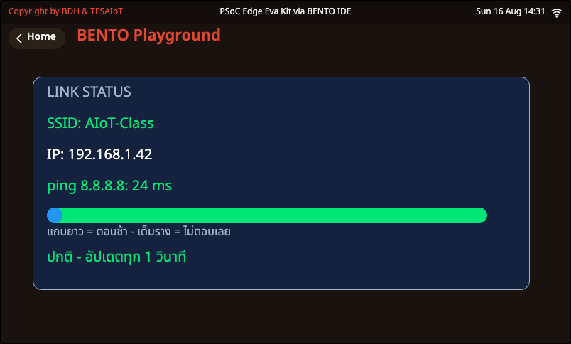
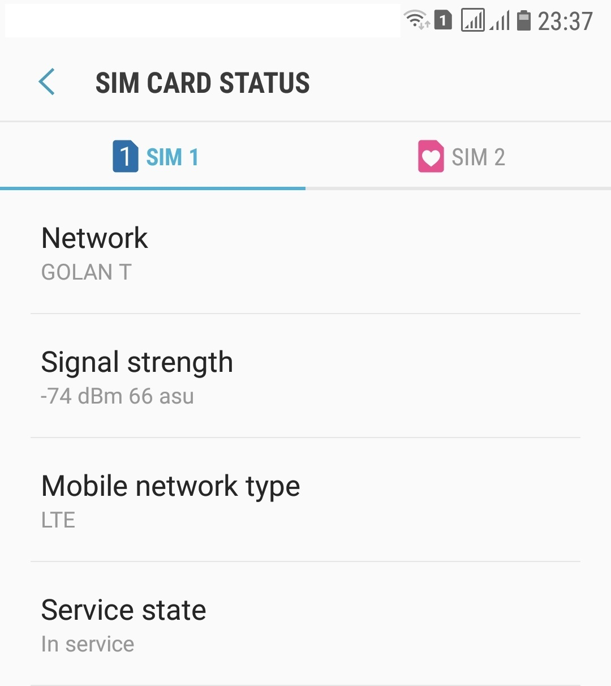
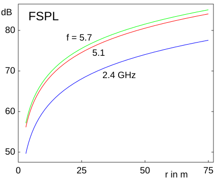
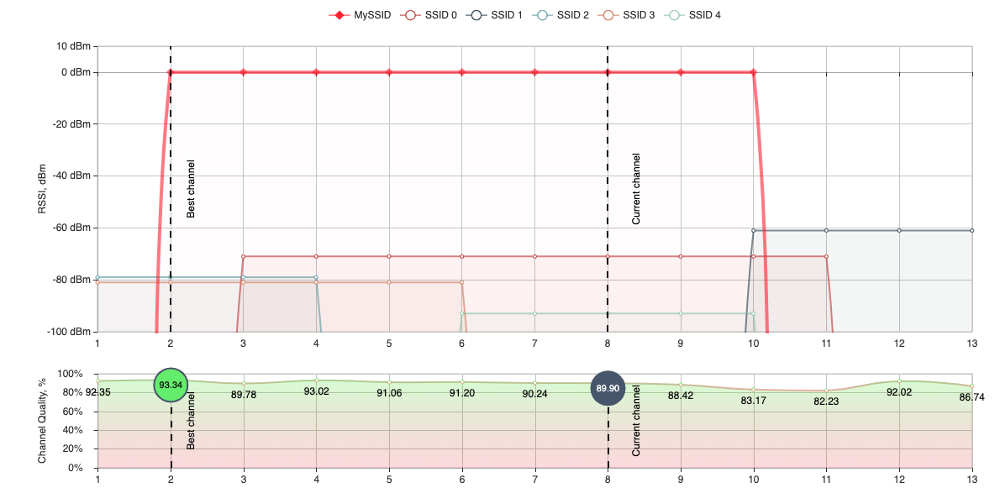
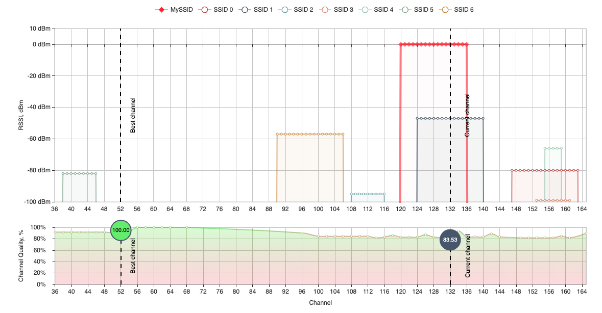
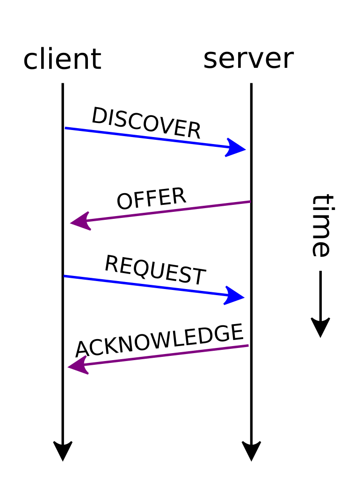
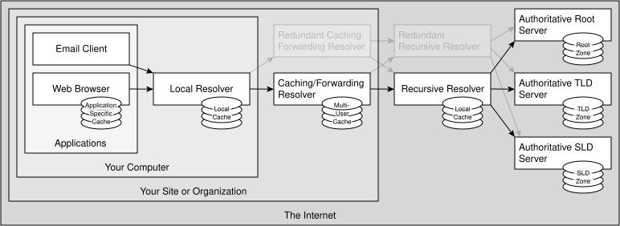
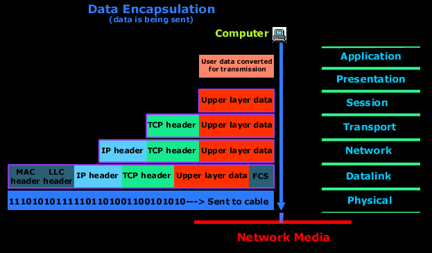

<style>
section { font-size: 24px; padding: 40px 52px; justify-content: flex-start; }
section h1 { font-size: 1.45em; line-height: 1.12; margin: 0 0 .22em; }
section h2 { font-size: 1.12em; margin: .15em 0; }
section h3 { font-size: 1.0em; margin: .12em 0; }
section p, section li { margin: .16em 0; line-height: 1.32; }
section img { max-width: 100%; height: auto; }
section svg { max-height: 330px; width: 100%; }
section table { font-size: .78em; }
section pre { font-size: .70em; line-height: 1.32; background:#0d1117; color:#e6edf3; border:1px solid #30363d; border-radius:8px; padding:12px 16px; box-shadow:0 2px 8px rgba(0,0,0,.25); }
section pre code { white-space: pre-wrap; background:transparent; color:inherit; } section pre .hljs-comment{color:#8b949e;font-style:italic} section pre .hljs-keyword,section pre .hljs-built_in,section pre .hljs-literal{color:#ff7b72} section pre .hljs-string{color:#a5d6ff} section pre .hljs-number{color:#79c0ff} section pre .hljs-title,section pre .hljs-title.function_,section pre .hljs-section{color:#d2a8ff} section pre .hljs-meta{color:#ffa657} section pre .hljs-attr,section pre .hljs-attribute,section pre .hljs-name{color:#7ee787}
section blockquote { margin: .25em 0; font-size: .92em; }
/* two images on a line (parity / 2x2 grids) stay side-by-side and small */
section p > img + img { margin-left: 10px; }
/* scroll-within-slide: dense slides scroll instead of clipping */
section { overflow-y: auto; overflow-x: hidden; }
section::-webkit-scrollbar { width: 11px; }
section::-webkit-scrollbar-thumb { background:#4a90d9; border-radius:6px; }
section::-webkit-scrollbar-track { background:rgba(0,0,0,.06); }
/* image drop-shadow + cover-slide readability (auto) */
section img{filter:drop-shadow(0 3px 12px rgba(0,0,0,.5))}
/* พื้นสำรองของสไลด์ปก: ถ้า img/cover_sNN.svg โหลดไม่ขึ้น ธีมจะคืนพื้นขาว
   แล้วตัวอักษรสีขาวของปกจะหายไปทั้งแผ่น — ปักสีเข้มไว้ให้ภาพเป็นแค่ของประดับ */
section.cover{background-color:#0b1426}
section.cover *{color:#fff !important}
section.cover h1,section.cover h2,section.cover h3,section.cover p,section.cover li,section.cover strong,section.cover em,section.cover blockquote,section.cover div{text-shadow:0 2px 9px rgba(0,0,0,.92),0 0 3px rgba(0,0,0,.8)}
section.cover div[style*="background:#"],section.cover div[style*="background: #"]{background:rgba(10,14,20,.66) !important;border-color:rgba(120,200,255,.45) !important;max-width:62%}
section.cover blockquote{border-left:4px solid rgba(120,200,255,.6) !important;background:rgba(13,17,23,.55) !important;border-radius:6px;padding:.3em .6em}
section.cover h1,section.cover h2,section.cover h3,section.cover p,section.cover blockquote{max-width:60%}
section.cover div:not(:has(img)){max-width:62%}
section.cover img{filter:none}
</style>


<!-- _class: cover -->

# บทเรียน 4.1 — WiFi และเครือข่าย: dBm DHCP IP และ DNS

## บอร์ดของเราออกจากโต๊ะทำงาน แล้วไปมีที่อยู่ในเครือข่าย

**โมดูล 4 — เชื่อมต่อแพลตฟอร์ม IoT**

> คาถาประจำบทเรียน: **ต่อไม่ติดไม่ใช่เรื่องดวง — มันมีลำดับขั้น และทุกขั้นวัดได้**

---

## ดูของจริงก่อน — เมนู Wi-Fi Setting ที่มากับเครื่อง


<svg viewBox="0 0 940 268" xmlns="http://www.w3.org/2000/svg">
  <rect x="16" y="14" width="428" height="240" rx="10" fill="#101a28" stroke="#4a90d9" stroke-width="2"/>
  <text x="36" y="44" font-size="20" font-weight="700" fill="#8fb8e0">Wi-Fi Setting</text>
  <path id="an1" d="M372,36 a26,26 0 0 1 40,0" fill="none" stroke="#50D890" stroke-width="4" opacity="0.35"/>
  <animate attributeName="r" values="6;11;6" dur="2.4s" begin="1.2s" repeatCount="indefinite"/>
  <path id="an2" d="M380,44 a16,16 0 0 1 24,0" fill="none" stroke="#50D890" stroke-width="4" opacity="0.35"/>
  <animate attributeName="r" values="6;11;6" dur="2.4s" begin="0.8s" repeatCount="indefinite"/>
  <circle id="an3" cx="392" cy="52" r="4" fill="#50D890" opacity="0.35"/>
  <animate attributeName="r" values="6;11;6" dur="2.4s" begin="0.4s" repeatCount="indefinite"/>
  <text x="36" y="86" font-size="18" fill="#c9d3e8">AIoT-Class</text>
  <text x="230" y="86" font-size="17" fill="#ffb066">-48 dBm</text>
  <rect x="330" y="76" width="9" height="8" fill="#50D890"/><rect x="344" y="70" width="9" height="14" fill="#50D890"/><rect x="358" y="64" width="9" height="20" fill="#50D890"/><rect x="372" y="58" width="9" height="26" fill="#50D890"/>
  <text x="36" y="124" font-size="18" fill="#c9d3e8">Office-2.4G</text>
  <text x="230" y="124" font-size="17" fill="#ffb066">-63 dBm</text>
  <rect x="330" y="114" width="9" height="8" fill="#ecc14a"/><rect x="344" y="108" width="9" height="14" fill="#ecc14a"/><rect x="358" y="102" width="9" height="20" fill="#ecc14a"/><rect x="372" y="96" width="9" height="26" fill="#2b3a4d"/>
  <text x="36" y="162" font-size="18" fill="#c9d3e8">Lab-Guest</text>
  <text x="230" y="162" font-size="17" fill="#ffb066">-79 dBm</text>
  <rect x="330" y="152" width="9" height="8" fill="#ff8a65"/><rect x="344" y="146" width="9" height="14" fill="#2b3a4d"/><rect x="358" y="140" width="9" height="20" fill="#2b3a4d"/><rect x="372" y="134" width="9" height="26" fill="#2b3a4d"/>
  <text x="36" y="200" font-size="18" fill="#c9d3e8">CAFE_5G</text>
  <text x="230" y="200" font-size="17" fill="#ffb066">-86 dBm</text>
  <rect x="330" y="190" width="9" height="8" fill="#ff5252"/><rect x="344" y="184" width="9" height="14" fill="#2b3a4d"/><rect x="358" y="178" width="9" height="20" fill="#2b3a4d"/><rect x="372" y="172" width="9" height="26" fill="#2b3a4d"/>
  <rect x="36" y="216" width="150" height="28" rx="6" fill="#1c4b7d" stroke="#4a90d9" stroke-width="2"/>
  <text x="111" y="236" text-anchor="middle" font-size="17" fill="#dbe9ff">Scan</text>
  <rect id="an4" x="200" y="216" width="150" height="28" rx="6" fill="#1b5e20" stroke="#50D890" stroke-width="2"/>
  <animate href="#an4" attributeName="stroke-width" values="2;4;2" dur="1.6s" repeatCount="indefinite"/>
  <text x="275" y="236" text-anchor="middle" font-size="17" fill="#c8f0d4">Connect</text>
  <rect x="490" y="40" width="200" height="52" rx="8" fill="#e3f2fd" stroke="#1565c0" stroke-width="2"/>
  <text x="590" y="72" text-anchor="middle" font-size="19" font-weight="700" fill="#1565c0">1 · สแกนหาคลื่น</text>
  <rect x="490" y="108" width="200" height="52" rx="8" fill="#fff3e0" stroke="#ef6c00" stroke-width="2"/>
  <text x="590" y="140" text-anchor="middle" font-size="19" font-weight="700" fill="#ef6c00">2 · เลือก + ใส่รหัส</text>
  <rect x="490" y="176" width="200" height="52" rx="8" fill="#e8f5e9" stroke="#2e7d32" stroke-width="2"/>
  <text x="590" y="208" text-anchor="middle" font-size="19" font-weight="700" fill="#2e7d32">3 · ได้เลข IP</text>
  <text x="716" y="70" font-size="18" fill="#546e7a">เห็นชื่อวง + ความแรง</text>
  <text x="716" y="138" font-size="18" fill="#546e7a">รอ ไม่ใช่ค้าง</text>
  <text x="716" y="200" font-size="18" fill="#546e7a">ไอคอนบนแถบบนติด</text>
  <text x="716" y="226" font-size="18" fill="#546e7a">แปลว่ามีที่อยู่แล้ว</text>
</svg>

เมนูนี้อยู่บนบอร์ดมาตั้งแต่บทเรียน 1.1–1.3 แล้ว วันนี้เราจะ **สร้างมันขึ้นมาเองด้วย Python** และทำให้มันบอกได้มากกว่าที่หน้าจอเดิมบอก

> สามขั้นบนจอนี้คือสามบรรทัดในโค้ดของเรา — `wifi.scan()` · `wifi.connect()` · `wifi.ip()`

---

## ทำไม · คืออะไร · ทำยังไง — แผนที่ของชุดบทเรียนนี้

<style scoped>
section table { font-size: .62em; }
section table td, section table th { padding: .16em .55em; }
</style>

| | คำถาม | คำตอบของชุดบทเรียนนี้ | อยู่ช่วงไหน |
|---|---|---|---|
| **Why** | บทเรียน 1.4–1.6 ก็ต่อ WiFi ติดไปแล้ว ทำไมต้องกลับมาเรียนเรื่องเดิมอีก | เพราะ **"ต่อเน็ตติด" กับ "ต่อเน็ตใช้ได้" เป็นคนละเรื่อง** และวันที่ของจริงไม่ทำงาน คนที่ตอบได้ว่า *ขาดตรงไหนในห้าช่วง* คือคนที่แก้ได้ · ระบบที่บอกได้ว่าพังตรงไหน มีค่ากว่าระบบที่บอกแค่ว่าพัง | ครึ่งแรก · dBm · DHCP · ping สองปลายทาง |
| **What** | มีอะไรให้ใช้บ้าง | โมดูล `wifi` **ทั้งแปดชื่อ** — หกตัวที่โครงหลักเรียกจริง บวก `disconnect()` กับ `softap()` ที่ต้องเคยลองมือ | สไลด์บัญชีแปดชื่อ + สไลด์สองตัวที่โครงหลักไม่ได้เรียก |
| **How** | ประกอบยังไงให้ใช้งานได้จริง | สแกน → เรียงตาม RSSI → ต่อ (บรรทัดเดียวที่บล็อกได้ถึง 85 วินาที ต้องบอกผู้ใช้ก่อน) → ping สองปลายทางแล้วอ่านผลเป็นคู่ | แปดไฟล์ตัวอย่าง + ไฟล์ฝึก |

**ปลายทางที่จับต้องได้** — หน้าสถานะเครือข่ายสองแผงบนจอเดิมของบทเรียน 3.7–3.9: **ตาราง** สี่คอลัมน์ (SSID · dBm · ช่อง · รหัส) เรียงจากแรงไปอ่อน และแผงขวาที่มี **ไฟสถานะลิงก์สองดวง** · SSID · IP · ping สองปลายทาง · **มาตรวัด dBm พร้อมพิสัย** ที่อัปเดตตัวเองทุก 3 วินาที พร้อมปุ่ม **สแกนใหม่** ให้สั่งได้เอง

> บทเรียน 3.7–3.9 จอของเรารายงานสิ่งที่อยู่บนบอร์ด · ชุดบทเรียนนี้จอเริ่มรายงานสิ่งที่อยู่นอกบอร์ด

---

## เป้าหมายของชุดบทเรียนนี้ — ต่อยอดแดชบอร์ดบทเรียน 3.7–3.9

<svg viewBox="0 0 940 178" xmlns="http://www.w3.org/2000/svg">
  <rect x="14" y="20" width="150" height="88" rx="8" fill="#e3f2fd" stroke="#1565c0" stroke-width="2"/>
  <text x="89" y="52" text-anchor="middle" font-size="19" font-weight="700" fill="#1565c0">IMU Chart</text>
  <polyline points="30,86 52,72 74,82 96,64 118,78 148,70" fill="none" stroke="#1565c0" stroke-width="2"/>
  <rect x="176" y="20" width="150" height="88" rx="8" fill="#e8f5e9" stroke="#2e7d32" stroke-width="2"/>
  <text x="251" y="52" text-anchor="middle" font-size="19" font-weight="700" fill="#2e7d32">Compass</text>
  <circle cx="251" cy="80" r="18" fill="none" stroke="#2e7d32" stroke-width="2"/>
  <line x1="251" y1="80" x2="251" y2="66" stroke="#2e7d32" stroke-width="3"/>
  <rect x="338" y="20" width="150" height="88" rx="8" fill="#fff3e0" stroke="#ef6c00" stroke-width="2"/>
  <text x="413" y="52" text-anchor="middle" font-size="19" font-weight="700" fill="#ef6c00">CapSense</text>
  <circle cx="386" cy="80" r="11" fill="#ffcc80"/><circle cx="413" cy="80" r="11" fill="#ef6c00"/><circle cx="440" cy="80" r="11" fill="#ffcc80"/>
  <rect x="500" y="20" width="150" height="88" rx="8" fill="#f3e5f5" stroke="#6a1b9a" stroke-width="2"/>
  <text x="575" y="52" text-anchor="middle" font-size="19" font-weight="700" fill="#6a1b9a">Pot</text>
  <path d="M549,88 a26,26 0 0 1 52,0" fill="none" stroke="#6a1b9a" stroke-width="4"/>
  <rect id="an5" x="662" y="18" width="264" height="98" rx="8" fill="#e1f5fe" stroke="#0277bd" stroke-width="3" stroke-dasharray="7 5"/>
  <animate href="#an5" attributeName="stroke-width" values="3;5;3" dur="1.8s" repeatCount="indefinite"/>
  <text x="794" y="48" text-anchor="middle" font-size="20" font-weight="700" fill="#0277bd">NETWORK STATUS</text>
  <text x="794" y="78" text-anchor="middle" font-size="18" fill="#0277bd">SSID · IP · ping ms</text>
  <text x="794" y="106" text-anchor="middle" font-size="17" fill="#5a8fb0">การ์ดที่เราจะเพิ่มวันนี้</text>
  <text x="470" y="140" text-anchor="middle" font-size="19" font-weight="700" fill="#455a64">บทเรียน 3.7–3.9 = บอร์ดรู้จักตัวเอง · บทเรียน 4.1–4.3 = บอร์ดรู้จักโลกที่มันอยู่</text>
  <text x="470" y="166" text-anchor="middle" font-size="18" fill="#78909c">จากนี้ไปอีกสามชุดบทเรียน ข้อมูลจะเดินออกจากบอร์ดไปหาคนอื่น</text>
</svg>

1. อ่านค่า **RSSI เป็น dBm** ได้ และบอกได้ว่า −45 กับ −85 ต่างกันแค่ไหน (ไม่ใช่ "ต่างกันนิดหน่อย")
2. เรียก `wifi.scan()` แล้ว **แกะข้อมูลจาก tuple** ได้ถูกช่อง
3. รู้ว่า `wifi.connect()` ที่บทเรียน 1.4–1.6 เคยเรียกไปแล้ว **ข้างในมันทำอะไรอยู่** ตอนที่มันเงียบไปเป็นนาที
4. วินิจฉัยการเชื่อมต่อด้วย `wifi.ping()` — แยกให้ออกว่าปัญหาอยู่ในห้องเราหรืออยู่นอกห้อง
5. ประกอบทั้งหมดเป็น **การ์ดสถานะเครือข่ายบนหน้าจอเดิมจากบทเรียน 3.7–3.9**
6. เรียกได้ครบทั้ง **แปดชื่อ** ของโมดูล `wifi` และบอกได้ว่าแต่ละตัวมีไว้ทำอะไร

**บทเรียน 1.4–1.6 ผู้เรียนต่อเน็ตติดไปแล้ว** และเห็น `wifi.connect()` `wifi.ip()` `wifi.is_connected()` `wifi.scan()` `wifi.status()` ผ่านตามาครบ — แต่บทเรียนนั้นคือการพาทัวร์ทั้งเส้น ไม่ได้ลงลึกทีละตัว วันนี้จึงเป็นการ **เปิดฝากล่องเดิมออกดู**: บรรทัดที่เคยรันผ่านนั้นวิ่งผ่านอะไรบ้างกว่าจะได้เลข IP ทำไมบางครั้งช้าจนน่าตกใจ ตัวเลขที่คืนมาแปลว่าอะไร และมันโกหกเราตรงไหนได้บ้าง

<!-- วันนี้ไม่ได้เพิ่มเซนเซอร์ตัวใหม่ แต่เพิ่ม "ความสามารถในการอธิบายว่าทำไมมันไม่ทำงาน" ซึ่งมีค่ากว่าในงานจริง -->

---

## ปลายทางของชุดบทเรียนนี้ — หน้าสถานะเครือข่ายของทีม



<div style="font-size:.56em;color:#78909c;margin-top:-.3em">หน้าจอจากการรันโค้ดเฉลย <b>รุ่นก่อนปรับหน้าจอ</b> บน BENTO Emulator ที่ 800x480 เท่าจอของทั้งสองบอร์ด — ไม่ใช่ภาพวาดและไม่ใช่ mock-up · รุ่นปัจจุบันเปลี่ยนแผงซ้ายเป็น <code>ui.Table</code> และเพิ่มไฟสถานะกับมาตรวัดในแผงขวาแล้ว ภาพชุดใหม่ยังไม่ได้ถ่าย</div>

โครงของหน้าจอรุ่นปัจจุบัน อ่านจากซ้ายไปขวา

- ซ้าย **ตาราง** สี่คอลัมน์ SSID · dBm · ช่อง · รหัส เรียงจากแรงไปอ่อน — หัวตารางบวกสามแถวพอดีความสูง 288
- ขวา **ไฟสถานะสองดวง** (ต่ออยู่ / ยังไม่ต่อ) แล้วต่อด้วย ping สองปลายทาง · SSID กับ IP อยู่แถบบน
- ล่างขวา **มาตรวัด dBm** ของวงที่ทีมต่ออยู่ — แถบที่ขยับวางทับไม้บรรทัดที่บอกพิสัย -90 ถึง -40
- บนขวาคือปุ่ม **สแกนใหม่** — หน้าสถานะที่แตะสั่งอะไรไม่ได้เลย คือจอ ไม่ใช่แผงควบคุม

> ต่อเน็ตติดกับต่อเน็ตใช้ได้เป็นคนละเรื่อง หน้านี้แยกสองเรื่องนั้นให้เห็นในจอเดียว

---

## เข้าใจฮาร์ดแวร์ · ทำไมความแรงสัญญาณถึงเป็นเลขติดลบ

<div style="display:flex;gap:22px;align-items:flex-start">
<div style="flex:0 0 268px">



</div>
<div>

หน้าจอเครื่องนี้ไม่ได้เขียนว่า "สัญญาณ 66%" แต่เขียนว่า **−74 dBm** ซึ่งเป็นหน่วยที่วัดกำลังจริง ๆ ของคลื่นที่เสาอากาศรับได้

$$P_{\text{dBm}} = 10\log_{10}\!\left(\frac{P}{1\ \text{mW}}\right)$$

**อ่านเป็นภาษาคน:** เอากำลังที่รับได้มาเทียบกับ 1 มิลลิวัตต์ แล้วบีบด้วยลอการิทึม เพราะช่วงค่ามันกว้างมากจนเขียนเป็นเลขธรรมดาไม่ไหว

**ตัวเลขจริง:** ที่ −67 dBm กำลังที่เสาอากาศรับได้คือ $10^{-6.7}$ mW ≈ **0.2 นาโนวัตต์** — เล็กกว่ามิลลิวัตต์มหาศาล ลอการิทึมจึงออกมาติดลบเสมอ

**0 dBm = 1 mW** พอดี ซึ่งแรงกว่าที่ WiFi รับได้จริงหลายล้านเท่า เราจึงไม่มีวันเห็นเลขบวกบนบอร์ด

</div>
</div>

<div style="font-size:.62em;color:#78909c">ภาพ: TaBaZzz / Wikimedia Commons — CC BY-SA 4.0 · หน้าจอสถานะสัญญาณที่รายงานเป็น dBm</div>

> เลขติดลบไม่ได้แปลว่าผิดปกติ — มันคือธรรมชาติของหน่วยที่วัดของเล็ก ๆ เทียบกับของใหญ่

---

## สเกล dBm — ทุก 10 dB คือสิบเท่า ไม่ใช่สิบหน่วย

<svg viewBox="0 0 940 250" xmlns="http://www.w3.org/2000/svg">
  <text x="20" y="26" font-size="20" font-weight="700" fill="#37474f">ยิ่งไปทางขวา สัญญาณยิ่งอ่อน — และอ่อนแบบทวีคูณ</text>
  <line x1="70" y1="86" x2="880" y2="86" stroke="#90a4ae" stroke-width="3"/>
  <text x="70" y="68" text-anchor="middle" font-size="18" fill="#37474f">-30</text>
  <text x="205" y="68" text-anchor="middle" font-size="18" fill="#37474f">-40</text>
  <text x="340" y="68" text-anchor="middle" font-size="18" fill="#37474f">-50</text>
  <text x="475" y="68" text-anchor="middle" font-size="18" fill="#37474f">-60</text>
  <text x="610" y="68" text-anchor="middle" font-size="18" fill="#37474f">-70</text>
  <text x="745" y="68" text-anchor="middle" font-size="18" fill="#37474f">-80</text>
  <text x="880" y="68" text-anchor="middle" font-size="18" fill="#37474f">-90</text>
  <rect x="70" y="94" width="270" height="20" fill="#2e7d32"/>
  <rect x="340" y="94" width="135" height="20" fill="#7cb342"/>
  <rect x="475" y="94" width="135" height="20" fill="#ecc14a"/>
  <rect x="610" y="94" width="135" height="20" fill="#ef6c00"/>
  <rect x="745" y="94" width="135" height="20" fill="#c62828"/>
  <text x="205" y="136" text-anchor="middle" font-size="18" fill="#1b5e20">5 ขีด</text>
  <text x="407" y="136" text-anchor="middle" font-size="18" fill="#4a7c1f">4 ขีด</text>
  <text x="542" y="136" text-anchor="middle" font-size="18" fill="#8a6d1a">3 ขีด</text>
  <text x="677" y="136" text-anchor="middle" font-size="18" fill="#a1683a">2 ขีด</text>
  <text x="812" y="136" text-anchor="middle" font-size="18" fill="#8f1f1f">1 ขีด</text>
  <text x="70" y="176" text-anchor="middle" font-size="19" font-weight="700" fill="#455a64">1 µW</text>
  <text x="475" y="176" text-anchor="middle" font-size="19" font-weight="700" fill="#455a64">1 nW</text>
  <text x="880" y="176" text-anchor="middle" font-size="19" font-weight="700" fill="#455a64">1 pW</text>
  <circle id="an6" r="10" fill="#1565c0" cx="120" cy="86"/>
  <animateMotion href="#an6" path="M0,0 L720,0" dur="7s" repeatCount="indefinite"/>
  <animate attributeName="r" values="6;11;6" dur="7s" repeatCount="indefinite"/>
  <text x="470" y="212" text-anchor="middle" font-size="19" font-weight="700" fill="#c62828">−50 แรงกว่า −80 อยู่ 1000 เท่า</text>
  <text x="470" y="238" text-anchor="middle" font-size="18" fill="#607d8b">จุดสีน้ำเงิน = เราเดินออกห่างจากเราเตอร์ทีละก้าว</text>
</svg>

เกณฑ์ห้าขีดข้างบนไม่ได้คิดขึ้นเอง — เป็น **เกณฑ์ชุดเดียวกับที่หน้าจอ Wi-Fi Setting ของบอร์ดใช้จริง** (−50 / −60 / −70 / −80 / −90)

ตัวเลขที่ช่างเครือข่ายใช้กันหน้างาน: **ดีกว่า −60** คือสบายทุกงาน · **−67** คือขีดจำกัดของงานที่ต้องต่อเนื่องอย่างวิดีโอ/เสียง · **ต่ำกว่า −80** อย่าไว้ใจ ต่อติดวันนี้พรุ่งนี้อาจหลุด

ทุก **3 dB คือประมาณ 2 เท่า** และทุก **10 dB คือ 10 เท่า** — จำสองข้อนี้แล้วอ่านเลข dBm ได้ทันทีโดยไม่ต้องกดเครื่องคิดเลข

> เวลาทีมรายงานว่า "สัญญาณอ่อนไปนิดเดียว" ให้ถามกลับว่ากี่ dBm — ต่างกัน 20 dB คือต่างกันร้อยเท่า

---

## 2.4 GHz กับ 5 GHz — เร็วกว่าแต่ไปได้ใกล้กว่า

<div style="display:flex;gap:24px;align-items:flex-start">
<div style="flex:0 0 336px">



</div>
<div>

$$\text{FSPL(dB)} = 20\log_{10}(d) + 20\log_{10}(f) + 32.44$$

เมื่อ $d$ เป็นกิโลเมตร และ $f$ เป็นเมกะเฮิรตซ์

**อ่านเป็นภาษาคน:** คลื่นที่แผ่ออกไปในที่โล่งจะจางลงตามระยะและตามความถี่ — **ระยะเป็นสองเท่า หายไป 6 dB**

**ตัวเลขจริงที่ระยะ 10 เมตร**
· ที่ 2437 MHz (ช่อง 6 ย่าน 2.4 GHz) → **60.2 dB**
· ที่ 5180 MHz (ช่อง 36 ย่าน 5 GHz) → **66.7 dB**
ต่างกัน 6.5 dB คือ **เหลือกำลังราวหนึ่งในสี่** ที่ระยะเท่ากันเป๊ะ

**สูตรนี้เป็นอุดมคติ** — ที่โล่ง ไม่มีผนัง ไม่มีคน ในห้องเรียนจริงตัวเลขจะแย่กว่านี้เสมอ เพราะผนังคอนกรีตกินอีก 10–15 dB และร่างกายคนกินอีกหลาย dB

</div>
</div>

<div style="font-size:.62em;color:#78909c">ภาพ: Sss41 / Wikimedia Commons — CC BY-SA 3.0 · Free-space path loss ของย่านความถี่ 802.11</div>

 

<div style="font-size:.58em;color:#78909c">ทั้งสองภาพ: Kirlf / Wikimedia Commons — CC BY-SA 4.0 · ซ้ายคือสเปกตรัมย่าน 2.4 GHz ที่วัดจริง ให้เห็นว่าช่องสัญญาณทับกันจริงแค่ไหน ไม่ใช่เรียงกันสวย ๆ อย่างในผัง · ขวาคือย่าน 5 GHz ที่วัดจริงในสเกลเดียวกัน เทียบกันแล้วเห็นทันทีว่าทำไมสแกนที่ 5 GHz ถึงเจอเพื่อนบ้านน้อยกว่า</div>

> 5 GHz ไม่ได้ "ดีกว่า" — มันแลกระยะทางกับความเร็ว เลือกให้ตรงกับงาน ไม่ใช่เลือกเลขที่มากกว่า

---

## เกร็ด: ทำไมบางครั้งสแกนแล้วรอนานผิดปกติ

<div style="display:flex;gap:24px;align-items:center">
<div style="flex:0 0 610px">


</div>
<div>

ย่าน 2.4 GHz มี **14 ช่อง** และซ้อนทับกันอย่างที่เห็น — ในทางปฏิบัติใช้ได้จริงแค่ 3 ช่องที่ไม่ทับกันคือ 1, 6, 11

ย่าน 5 GHz มีช่องมากกว่านั้นหลายเท่า และบางช่องต้อง **ฟังเงียบ ๆ ก่อนว่ามีเรดาร์ใช้อยู่ไหม** จึงจะส่งได้

</div>
</div>

<div style="font-size:.62em;color:#78909c">ภาพ: Michael Gauthier, Wireless Networking in the Developing World / Wikimedia Commons — CC BY-SA 3.0</div>

การสแกนหนึ่งครั้งคือการ **ไล่ฟังทีละช่อง** ช่องละไม่กี่สิบมิลลิวินาที ยิ่งมีช่องเยอะ ยิ่งใช้เวลานาน นี่คือเหตุผลที่บอร์ดหยุดนิ่งระหว่างสแกน ไม่ใช่เพราะมันค้าง

**เชื่อมกับวันนี้:** `wifi.scan()` ของเรา **บล็อกได้ถึง 10 วินาที** — โค้ดบรรทัดถัดไปจะไม่ทำงานเลยจนกว่าสแกนจบ ดังนั้นในท่าที่ 2 เราจะขึ้นข้อความ `กำลังสแกน` บนจอ **ก่อน** เรียกมัน ไม่ใช่หลัง ไม่งั้นผู้ใช้จะเห็นจอว่างเปล่าแล้วนึกว่าโปรแกรมพัง

---

## การเข้าร่วมเครือข่าย — สามจังหวะก่อนจะได้คุยกัน

<div style="display:flex;gap:18px;align-items:center">
<div style="flex:0 0 356px">


</div>
<div style="flex:0 0 300px"><div style="border:2px solid #b0bec5;border-radius:8px;line-height:0;overflow:hidden"><iframe width="296" height="167" src="https://www.youtube.com/embed/WoUKXm9iG7k" title="RUCKUS Wireless Client Association Process" loading="lazy" frameborder="0" allowfullscreen></iframe></div><div style="font-size:.58em;color:#607d8b;line-height:1.4;padding-top:6px">RUCKUS Education Services · 16:36 · อังกฤษ<br/>ดูช่วง 2:00–8:00 ก็พอ เห็นทั้งกระบวนการพร้อมเฟรมจริงจาก packet capture</div></div>
<div>

**1 · Scanning** บอร์ดฟังหรือถามหาว่ามี AP ไหนอยู่แถวนี้ — `wifi.scan()` ทำงานอยู่ตรงนี้

**2 · Authentication** ขั้นตอนแนะนำตัว

**3 · Association** AP ตอบรับให้เข้าร่วม แล้วจึงเริ่มส่งข้อมูลได้

</div>
</div>

<div style="font-size:.62em;color:#78909c">ภาพ: Superspritz / Wikimedia Commons — CC BY-SA 4.0 · ลำดับการเชื่อมต่อ 802.11</div>

> ตรงจุดที่ภาพเขียนว่า Data Transfer บอร์ดยัง **ยังไม่มีเลข IP** — ยังคุยกับใครนอกห้องไม่ได้

---

## กลไกเต็ม — จากคลื่นในอากาศ ถึงเลข IP บนจอ

<svg viewBox="0 0 940 300" xmlns="http://www.w3.org/2000/svg">
  <rect x="34" y="14" width="172" height="44" rx="8" fill="#e3f2fd" stroke="#1565c0" stroke-width="2"/>
  <text x="120" y="42" text-anchor="middle" font-size="19" font-weight="700" fill="#1565c0">บอร์ดของเรา</text>
  <rect x="474" y="14" width="172" height="44" rx="8" fill="#fff3e0" stroke="#ef6c00" stroke-width="2"/>
  <text x="560" y="42" text-anchor="middle" font-size="19" font-weight="700" fill="#ef6c00">Access Point</text>
  <rect x="772" y="14" width="160" height="44" rx="8" fill="#e8f5e9" stroke="#2e7d32" stroke-width="2"/>
  <text x="852" y="42" text-anchor="middle" font-size="19" font-weight="700" fill="#2e7d32">เราเตอร์ + DHCP</text>
  <line x1="120" y1="58" x2="120" y2="284" stroke="#b0bec5" stroke-width="2"/>
  <line x1="560" y1="58" x2="560" y2="284" stroke="#b0bec5" stroke-width="2"/>
  <line x1="852" y1="58" x2="852" y2="284" stroke="#b0bec5" stroke-width="2"/>
  <text x="340" y="82" text-anchor="middle" font-size="18" fill="#37474f">1 · ขอดูว่ามีใครอยู่แถวนี้บ้าง</text>
  <line x1="120" y1="94" x2="540" y2="94" stroke="#1565c0" stroke-width="2.5"/>
  <polygon points="554,94 538,86 538,102" fill="#1565c0"/>
  <circle id="an7" r="8" fill="#1565c0" opacity="0" cx="120" cy="94"/>
  <animateMotion href="#an7" path="M0,0 L428,0" dur="7.2s" repeatCount="indefinite" keyPoints="0;0;1;1" keyTimes="0;0;0.13;1" calcMode="linear"/>
  <animate attributeName="r" values="6;11;6" dur="7.2s" repeatCount="indefinite"/>
  <text x="340" y="120" text-anchor="middle" font-size="18" fill="#37474f">2 · ตอบกลับ: ชื่อวง ความแรง ช่องสัญญาณ</text>
  <line x1="560" y1="132" x2="140" y2="132" stroke="#2e7d32" stroke-width="2.5"/>
  <polygon points="126,132 142,124 142,140" fill="#2e7d32"/>
  <circle id="an8" r="8" fill="#2e7d32" opacity="0" cx="560" cy="132"/>
  <animateMotion href="#an8" path="M0,0 L-428,0" dur="7.2s" repeatCount="indefinite" keyPoints="0;0;1;1" keyTimes="0;0.17;0.30;1" calcMode="linear"/>
  <animate attributeName="r" values="6;11;6" dur="7.2s" repeatCount="indefinite"/>
  <text x="340" y="158" text-anchor="middle" font-size="18" fill="#37474f">3 · ขอเข้าร่วม + พิสูจน์รหัสผ่าน</text>
  <line x1="120" y1="170" x2="540" y2="170" stroke="#1565c0" stroke-width="2.5"/>
  <polygon points="554,170 538,162 538,178" fill="#1565c0"/>
  <circle id="an9" r="8" fill="#1565c0" opacity="0" cx="120" cy="170"/>
  <animateMotion href="#an9" path="M0,0 L428,0" dur="7.2s" repeatCount="indefinite" keyPoints="0;0;1;1" keyTimes="0;0.34;0.47;1" calcMode="linear"/>
  <animate attributeName="r" values="6;11;6" dur="7.2s" repeatCount="indefinite"/>
  <text x="470" y="196" text-anchor="middle" font-size="18" fill="#37474f">4 · ขอเลขที่อยู่ (DHCP DISCOVER / REQUEST)</text>
  <line x1="120" y1="208" x2="832" y2="208" stroke="#1565c0" stroke-width="2.5"/>
  <polygon points="846,208 830,200 830,216" fill="#1565c0"/>
  <circle id="an10" r="8" fill="#1565c0" opacity="0" cx="120" cy="208"/>
  <animateMotion href="#an10" path="M0,0 L720,0" dur="7.2s" repeatCount="indefinite" keyPoints="0;0;1;1" keyTimes="0;0.51;0.64;1" calcMode="linear"/>
  <animate attributeName="r" values="6;11;6" dur="7.2s" repeatCount="indefinite"/>
  <text x="470" y="234" text-anchor="middle" font-size="18" fill="#37474f">5 · ให้เลขมา: 192.168.1.42 + gateway + DNS</text>
  <line x1="852" y1="246" x2="140" y2="246" stroke="#2e7d32" stroke-width="2.5"/>
  <polygon points="126,246 142,238 142,254" fill="#2e7d32"/>
  <circle id="an11" r="8" fill="#2e7d32" opacity="0" cx="852" cy="246"/>
  <animateMotion href="#an11" path="M0,0 L-720,0" dur="7.2s" repeatCount="indefinite" keyPoints="0;0;1;1" keyTimes="0;0.68;0.83;1" calcMode="linear"/>
  <animate attributeName="r" values="6;11;6" dur="7.2s" repeatCount="indefinite"/>
  <text x="470" y="286" text-anchor="middle" font-size="19" font-weight="700" fill="#c62828">ขั้นที่ 1-3 คือ WiFi · ขั้นที่ 4-5 คือ IP — คนละเรื่องกัน และพังคนละแบบ</text>
</svg>

> `wifi.connect()` คืน `True` เมื่อผ่านครบทั้งห้าขั้น ถ้าติดขั้นไหนก็ตาม เราได้ `False` เหมือนกันหมด — จึงต้องมี ping ไว้แยกแยะ

---

## DHCP — บอร์ดไม่ได้ตั้งเลข IP ให้ตัวเอง

<div style="display:flex;gap:20px;align-items:center">
<div style="flex:0 0 206px">



</div>
<div style="flex:0 0 322px"><div style="border:2px solid #b0bec5;border-radius:8px;line-height:0;overflow:hidden"><iframe width="318" height="179" src="https://www.youtube.com/embed/oD5nC2NhHWQ" title="DHCP DORA Procedure" loading="lazy" frameborder="0" allowfullscreen></iframe></div><div style="font-size:.58em;color:#607d8b;line-height:1.4;padding-top:6px">CMSystemsBe · 1:11 · อังกฤษ<br/>แอนิเมชันลูปสั้น เปิดคาไว้ได้ตลอดช่วงที่อธิบาย</div></div>
<div>

สี่คำที่ต้องจำ **DORA**

**D**iscover — มีใครแจกเลขบ้าง
**O**ffer — เอาเลขนี้ไปไหม
**R**equest — ขอเลขนี้
**A**cknowledge — เอาไปเลย

</div>
</div>

<div style="font-size:.62em;color:#78909c">ภาพ: Gelmo96 / Wikimedia Commons — CC BY-SA 4.0 · ลำดับข้อความของ DHCP</div>

เลขที่ได้มาเป็นการ **ยืมมาชั่วคราว** (lease) ไม่ใช่ของเราถาวร — ปิดบอร์ดแล้วเปิดใหม่ อาจได้เลขคนละตัว นี่คือเหตุผลที่โค้ดของเราต้องอ่าน `wifi.ip()` ทุกครั้งหลังต่อ ห้ามจำเลขเก่าไว้ใช้

> ถ้า DHCP ในห้องเต็มหรือพัง เราจะ "ต่อ WiFi ติด" แต่ "ไม่มีเลข IP" — อาการนี้ผู้เรียนจะเจอจริง และจะดูเหมือนต่อไม่ติดทั้งที่ไม่ใช่

---

## IP · netmask · gateway — สามค่าที่ต้องอ่านให้เป็น


<div style="font-size:.62em;color:#78909c">ภาพ: Michel Bakni / Wikimedia Commons — CC BY-SA 4.0 · โครงสร้างเลขที่อยู่ IPv4</div>

| ค่า | ตัวอย่าง | มันบอกอะไร |
|---|---|---|
| **IP address** | `192.168.1.42` | เลขประจำตัวของบอร์ดในวงแลนนี้ — `wifi.ip()` คืนค่านี้ |
| **netmask** | `255.255.255.0` | เส้นแบ่งว่าเลขส่วนไหนคือ "วง" ส่วนไหนคือ "ตัวเครื่อง" — ในตัวอย่างนี้คือทุกเครื่องที่ขึ้นต้น `192.168.1.` |
| **gateway** | `192.168.1.1` | ประตูออกจากวง ถ้าจะคุยกับเลขนอกวง ต้องฝากประตูนี้ส่งให้ |

32 บิตแบ่งเป็นสี่ช่อง ช่องละ 8 บิต จึงมีค่าได้ 0–255 ต่อช่อง · **ข้อจำกัดที่ต้องรู้วันนี้:** MicroPython บนบอร์ดนี้ให้แค่ `wifi.ip()` — **ยังไม่มี netmask และ gateway ให้อ่าน** โค้ดของเราจึงต้อง *เดา* gateway จากเลข IP (เอาสามช่องแรกต่อด้วย `.1`)

> การเดาแบบนี้ถูกในวงแลนส่วนใหญ่ แต่ไม่ใช่ทุกวง — ท่าที่ 5 จะสอนวิธีตรวจว่าเราเดาถูกหรือเปล่า

---

## ping ได้เกตเวย์ แต่ 8.8.8.8 เงียบ — แปลว่าอะไร

<svg viewBox="0 0 940 280" xmlns="http://www.w3.org/2000/svg">
  <rect x="18" y="100" width="150" height="70" rx="9" fill="#e3f2fd" stroke="#1565c0" stroke-width="2"/>
  <text x="93" y="130" text-anchor="middle" font-size="19" font-weight="700" fill="#1565c0">บอร์ด</text>
  <text x="93" y="154" text-anchor="middle" font-size="17" fill="#0d47a1">192.168.1.42</text>
  <rect x="330" y="100" width="170" height="70" rx="9" fill="#e8f5e9" stroke="#2e7d32" stroke-width="2"/>
  <text x="415" y="130" text-anchor="middle" font-size="19" font-weight="700" fill="#2e7d32">เกตเวย์</text>
  <text x="415" y="154" text-anchor="middle" font-size="17" fill="#1b5e20">192.168.1.1</text>
  <rect x="738" y="100" width="180" height="70" rx="9" fill="#fff3e0" stroke="#ef6c00" stroke-width="2"/>
  <text x="828" y="130" text-anchor="middle" font-size="19" font-weight="700" fill="#ef6c00">อินเทอร์เน็ต</text>
  <text x="828" y="154" text-anchor="middle" font-size="17" fill="#e65100">8.8.8.8</text>
  <line x1="170" y1="122" x2="322" y2="122" stroke="#2e7d32" stroke-width="3"/>
  <polygon points="328,122 314,115 314,129" fill="#2e7d32"/>
  <circle id="an12" r="8" fill="#2e7d32" cx="176" cy="122"/>
  <animateMotion href="#an12" path="M0,0 L140,0" dur="1.6s" repeatCount="indefinite"/>
  <animate attributeName="r" values="6;11;6" dur="1.6s" repeatCount="indefinite"/>
  <text x="246" y="106" text-anchor="middle" font-size="17" font-weight="700" fill="#2e7d32">3 ms</text>
  <line x1="502" y1="122" x2="730" y2="122" stroke="#c62828" stroke-width="3" stroke-dasharray="7 5"/>
  <circle id="an13" r="8" fill="#c62828" cx="508" cy="122"/>
  <animateMotion href="#an13" path="M0,0 L128,0" dur="1.8s" repeatCount="indefinite"/>
  <animate attributeName="r" values="6;11;6" dur="1.8s" repeatCount="indefinite"/>
  <line x1="648" y1="96" x2="648" y2="148" stroke="#c62828" stroke-width="5"/>
  <text x="596" y="106" text-anchor="middle" font-size="17" font-weight="700" fill="#c62828">timeout</text>
  <text x="20" y="34" font-size="20" font-weight="700" fill="#37474f">ยิงสองปลายทาง แล้วอ่านผลเป็นคู่ — นี่คือการวินิจฉัย ไม่ใช่การเดา</text>
  <rect x="18" y="196" width="288" height="70" rx="8" fill="#e8f5e9" stroke="#2e7d32" stroke-width="2"/>
  <text x="162" y="222" text-anchor="middle" font-size="18" font-weight="700" fill="#2e7d32">เกตเวย์ผ่าน · เน็ตผ่าน</text>
  <text x="162" y="248" text-anchor="middle" font-size="17" fill="#1b5e20">ปกติดี ทำงานต่อได้</text>
  <rect x="326" y="196" width="288" height="70" rx="8" fill="#fff3e0" stroke="#ef6c00" stroke-width="3"/>
  <text x="470" y="222" text-anchor="middle" font-size="18" font-weight="700" fill="#ef6c00">เกตเวย์ผ่าน · เน็ตไม่ผ่าน</text>
  <text x="470" y="248" text-anchor="middle" font-size="17" fill="#e65100">ปัญหาอยู่เหนือเราเตอร์ ไม่ใช่ที่เรา</text>
  <rect x="634" y="196" width="288" height="70" rx="8" fill="#ffebee" stroke="#c62828" stroke-width="2"/>
  <text x="778" y="222" text-anchor="middle" font-size="18" font-weight="700" fill="#c62828">เกตเวย์ไม่ผ่าน</text>
  <text x="778" y="248" text-anchor="middle" font-size="17" fill="#b71c1c">ลิงก์ WiFi หรือเลขเกตเวย์ที่เดาผิด</text>
</svg>

`wifi.ping(ip, timeout_ms)` คืนเวลาไป-กลับเป็นมิลลิวินาที หรือ **−1** ถ้าไม่มีคำตอบภายในเวลาที่ตั้งไว้

การยิงสองปลายทางแล้วอ่านผลเป็น *คู่* ทำให้ตอบได้ทันทีว่าต้องไปแก้ที่ไหน — นี่คือท่าพื้นฐานที่วิศวกรเครือข่ายใช้ทุกวัน และเป็นเหตุผลที่การ์ดของเรามีสองบรรทัด ไม่ใช่บรรทัดเดียว

> ระบบที่บอกได้ว่า "พังตรงไหน" มีค่ากว่าระบบที่บอกแค่ว่า "พัง"

---

## DNS — ทำไม `wifi.ping()` ถึงรับแต่ตัวเลข



<div style="font-size:.62em;color:#78909c">ภาพ: Aaron Filbert / Wikimedia Commons — CC BY-SA 4.0 · สถาปัตยกรรมการค้นชื่อโดเมน</div>

เครื่องคอมพิมพ์ `google.com` ได้เพราะมี **ตัวแปลชื่อ (resolver)** ถามระบบ DNS ต่อเป็นทอด ๆ จนได้เลข IP แล้วค่อยส่งแพ็กเก็ตไปที่เลขนั้น — **ชื่อโดเมนไม่เคยเดินทางในเครือข่าย มีแต่เลขที่เดินทาง** ส่วน MicroPython บนบอร์ดนี้ยังไม่มีตัวแปลชื่อเปิดให้ Python เรียก

```python
wifi.ping("google.com")     # ValueError รับเฉพาะเลข IP
wifi.ping("8.8.8.8", 1500)  # ถูกต้อง
```

`8.8.8.8` คือเซิร์ฟเวอร์ DNS สาธารณะของ Google เราเลือกมันเพราะจำง่ายและแทบไม่เคยล่ม ไม่ใช่เพราะกำลังใช้บริการ DNS ของมัน

> ข้อจำกัดนี้เป็นช่องว่างของโมดูล ไม่ใช่ของฮาร์ดแวร์ — ตัวชิปคุย DNS ได้ แค่ยังไม่มีใครเปิดประตูฝั่ง Python ให้

---

## ข้อมูลของเราถูกห่อกี่ชั้นกว่าจะออกจากบอร์ด



<div style="font-size:.62em;color:#78909c">ภาพเคลื่อนไหว: Moeenrahi / Wikimedia Commons — CC BY-SA 4.0 · การห่อหุ้มข้อมูลตามชั้นโพรโทคอล</div>

`ping` หนึ่งครั้งถูกห่อทีละชั้นก่อนกลายเป็นคลื่นวิทยุ: ข้อมูลของเรา → หัว IP (เลขต้นทาง-ปลายทาง) → หัวชั้นลิงก์ (MAC) → บิตที่ส่งออกอากาศ ปลายทางแกะย้อนกลับตามลำดับเดิม

ที่ต้องรู้วันนี้สองข้อ: **แต่ละชั้นเพิ่มขนาดข้อมูล** (มีค่าใช้จ่ายคงที่ต่อแพ็กเก็ต) และ **แต่ละชั้นพังได้เอกเทศ** — คลื่นแรงดีแต่ไม่มี IP เกิดขึ้นได้จริง · บทเรียน 4.4–4.6 เราจะเพิ่มชั้น MQTT ทับลงบนกองนี้

> `wifi.connect()` จัดการชั้นล่างให้ · `wifi.ping()` วัดชั้นกลาง · ชุดบทเรียนถัดไปเราจะเขียนชั้นบนสุดเอง
