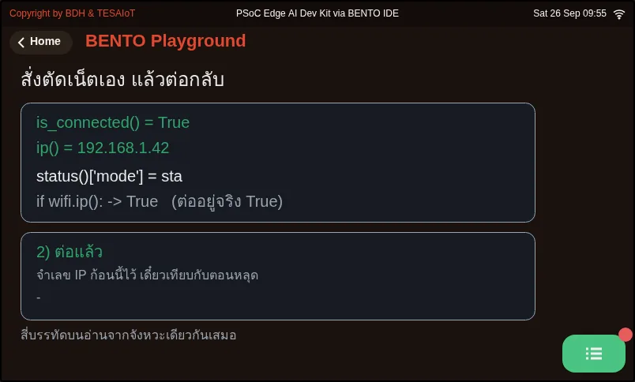
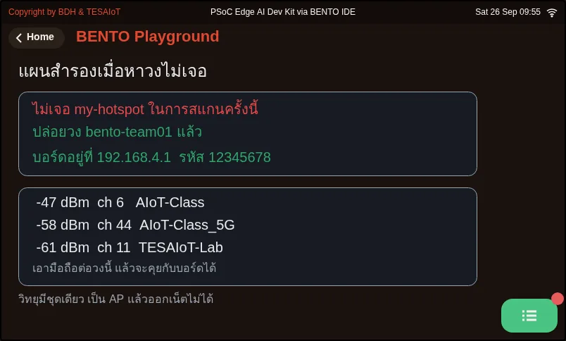

# Lesson 4.2 — The network status screen: reading the wifi code

> Module 4 — IoT Platform Connectivity · Slides: [slides.md](slides.md) · [Module overview](../README.md) · [Course page](../../README.md)

Walk through the network status page one move at a time, with all eight names of the wifi module and the traps in the right-hand column, so you know what each line returns, which lines block and for how long, and whether a number on screen was really measured.

## Objectives

By the end of this lesson you will be able to:

1. State the return value and the trap for at least six of the eight wifi names from the lesson's table, e.g. `wifi.ip()` returns `"0.0.0.0"` when not connected, which is true in an `if`; `wifi.status()` always returns an empty `ssid` and an `rssi` of 0; `wifi.ping()` accepts IP numbers only and raises `OSError` when not connected
2. Explain that `nets.sort(key=lambda net: net[1], reverse=True)` orders the tuples from `wifi.scan()` strongest first, say why `net['ssid']` raises `TypeError`, and convert RSSI to a quality percentage over −90 to −40 dBm correctly (−67 dBm gives 46%)
3. Explain why a status label and `ui.poll()` must come before `wifi.scan()` or `wifi.connect()`, which can block for 3–10 and about 85 seconds, and why the loop calls `ui.poll()` every 200 ms while ping keeps its own 3-second clock with `time.ticks_diff()` instead of one `sleep_ms(3000)`
4. Run `07_disconnect_rejoin.py` and `08_softap_fallback.py` on a real board and record which values change after `wifi.disconnect()`, and at what address the board sits and what it cannot do as a softap

## Before you start

Review lesson 4.1: the five steps from radio wave to IP address, the 10 dB = 10× rule, and reading a gateway ping paired with 8.8.8.8.
Keep lesson 4.3's solution file `s09_network_status.py` open next to you, because this lesson walks through that file move by move.
Before running files `07` and `08`, edit the top two lines `WIFI_SSID` and `WIFI_PASS` to your home WiFi or phone hotspot,
and in file `08`, change `AP_SSID` to something unique among the networks around you, such as adding your own English nickname.

- **Equipment:** an Eva Kit or TESAIoT Dev Kit board with the BENTO MicroPython firmware installed, or the BENTO Emulator in [BENTO IDE](https://ide.tesaiot.dev/) (the Emulator can draw both files' screens, but the network name, strength and link state on the host machine are stand-in values, not the board's real measurements — watching a real disconnect from `disconnect()` and releasing a network with `softap()` need a real board)
- **Before this:** [Lesson 4.1 — WiFi and networking: dBm, DHCP, IP and DNS](../l01-wifi-networking/README.md)

## Concepts

**We do not write a WiFi driver — we learn to use one well.** The driver is thousands of lines heavier than this whole set of lessons. The firmware does 70%;
the remaining 30% is our decision: which network to pick and how to sort it, converting dBm into a picture a reader understands, where and how often to ping,
and turning the result into text that helps someone fix a problem. The `wifi` module has eight names — the main structure calls six
(`scan`, `connect`, `status`, `is_connected`, `ip`, `ping`), and the other two, `disconnect` and `softap`, we try hands-on in files `07` and `08`.

**More than half the traps live in the right-hand column of the table, not in code we wrote wrong.** `wifi.scan()` returns a list of tuples,
`(ssid, rssi, security, channel)`, at most 20 networks per call, and blocks for 3–10 seconds. `wifi.connect(ssid, password)`
takes exactly two positional arguments, can block for about 85 seconds on a wrong password, and locks to WPA3/WPA2 mode,
so it cannot connect to an open network with no password from Python. `wifi.status()` returns a five-key dict, but `ssid` is always an empty string and `rssi`
is always 0 — real strength must come from `scan()`. `wifi.ip()` before connecting gives `"0.0.0.0"`, which is not empty, so it is true in an `if`;
the question "is it connected" must be asked with `wifi.is_connected()`, which asks the driver fresh every time. `wifi.ping()` only accepts an IP number;
give it a hostname and get `ValueError`, and if not yet connected you get `OSError`, not −1. The Wi-Fi Setting page that ships on the device
hardcodes the netmask as 255.255.255.0 and guesses the gateway and DNS as a.b.c.1. Knowing where a number on screen comes from
is part of engineering work — our code guesses the gateway too, but we ping to prove it.

**The real code has five moves.** Move 1 creates every widget before entering the loop, using one `ui.Table` instead of ten Labels,
with `col_width` set to fit the text — a column narrower than the text wraps it, and the last row silently falls off the edge. The `Rescan`
button sits in the title bar, because the firmware reserves the bottom-right corner for the Console button; the whole page uses 16 of 64 widgets.
Move 2: scan results are tuples, so read them by index — `net[1]` is rssi — sorted with `reverse=True`, because −48 is greater than −79.
The example that ships with the firmware (`network/01_wifi_scan_connect.py`, line 33) still writes `net['ssid']` — sample code is not a reference document.
Move 3 pours into the table with `min(TOP_N, len(nets))` to avoid breaking when fewer than three networks are found.
`ui.Bar` accepts the range −90 to −40 directly, while the number a reader sees is converted to a percentage,
$q=\operatorname{clamp}\left(\frac{\text{RSSI}+90}{50}\times100,0,100\right)$, and `signal_of()` returns the percentage and colour together,
because they come from the same number.

**Moves 4 and 5 are about time.** Any line that blocks for more than half a second must always be preceded by a user-facing label, so it writes
`l_tick.text("Connecting, 85s")`, then `ui.poll()`, before `wifi.connect()`. If it fails to connect, `raise SystemExit` — failing fast is better than
letting the loop spin showing a timeout. Link status shows as two lamps, not green/red text, which both turn the same grey viewed in black and white.
In the live-status loop, `ui.poll()` runs every 200 ms (skip it and widgets disappear within about two seconds), but ping keeps its own clock every
3 seconds with `time.ticks_diff(now, t_ping)`. Using a single `sleep_ms(3000)` instead would make a button take up to three seconds to respond.
`try/except OSError` wraps ping, because a temporary network glitch is normal; the gateway is pinged before the internet so the two lines together tell you where it broke, and the countdown number is rewritten only when the second changes.

An RSSI value passes through five points before becoming a bar on screen: the radio wave in the air · the CYW55513 radio chip and driver · Python code on CM33 ·
the IPC mailbox · CM55, which draws the screen. All of WiFi's logic lives on the CM33 side. When debugging, ask which of these five stages broke.

## Worked example

**`07_disconnect_rejoin.py`** — before pressing Run, write in your learning log a guess for what `is_connected()`, `ip()` and
`if wifi.ip():` will report after you disconnect, then run and watch the top four lines change together through four beats (before connecting, connected, disconnect commanded, reconnected).
Notice `disconnect()` returns `None`, and the line `if wifi.ip():` still shows True even though the link has fully dropped. When reconnecting, check whether it gets the same IP,
because DHCP leases a value only temporarily. Try increasing `DOWN_SECONDS` to stay disconnected longer and run again.

**`08_softap_fallback.py`** — this file scans first, then decides. If it finds the network it was told to look for, it connects as a client (station mode);
if not, it opens its own network at 192.168.4.1. Try changing `WIFI_SSID` to a name that does not actually exist around you, to force the fallback path,
then connect a phone to the board's network. The trade-off is that there is only one radio; it cannot be an AP and a client at the same time, so `ping()`
out to the internet does not work. And with no arguments, every board would be named `PSoC-Edge-MPY`, identically, all colliding.
This file is the whole course's backup plan for the day a board cannot find the network it was told to use.

| File | What this file teaches |
|---|---|
| [examples/07_disconnect_rejoin.py](examples/07_disconnect_rejoin.py) | Create a "dropped" state on command, to see it for yourself |
| [examples/08_softap_fallback.py](examples/08_softap_fallback.py) | If it cannot find the network it was told to use, the board can open its own |

**Screens from the BENTO Emulator** for this lesson's examples (click a file name to open the code)

<figure><figcaption><a href="examples/07_disconnect_rejoin.py"><code>07_disconnect_rejoin.py</code></a> Create a &quot;dropped&quot; state on command, to see it for yourself</figcaption></figure>
<figure><figcaption><a href="examples/08_softap_fallback.py"><code>08_softap_fallback.py</code></a> If it cannot find the network it was told to use, the board can open its own</figcaption></figure>

## Check your understanding

The same questions are in [quiz.yaml](quiz.yaml) for automatic marking.

1. After calling wifi.disconnect(), code writes if wifi.ip(): print("connected"). What happens? *(choose one · objective 1)*
   - A) Nothing prints, because ip() returns an empty string when disconnected
   - B) It prints "connected", because ip() returns "0.0.0.0", which is not empty, so Python treats it as true
   - C) It raises OSError, because there is no internet connection
   - D) Nothing prints, because ip() returns None, same as disconnect()

   

Solution

   **B** — When dropped, wifi.ip() returns "0.0.0.0", a non-empty string, so the if is true even though the link is fully down. The question "is it connected" must be asked with wifi.is_connected(), or by comparing the string directly.

   

2. Which statements about the wifi module on this board are correct? Choose every correct one. *(choose all that apply · objective 1)*
   - A) wifi.status()["rssi"] always returns 0; real strength must come from wifi.scan()
   - B) wifi.ping() before connecting returns -1
   - C) wifi.connect() cannot connect to an open network with no password from Python, because it locks to WPA3/WPA2 mode
   - D) wifi.connect(ssid, password, timeout=10000) can set a shorter wait
   - E) wifi.scan() returns at most 20 networks per call; extras vanish silently

   

Solution

   **A, C, E** — ssid and rssi in status() are fixed values in the firmware. ping before connecting raises OSError, not -1, and connect() only takes two positional arguments, with no timeout= to set.

   

3. What does the line nets.sort(key=lambda net: net[1], reverse=True) do to the results of wifi.scan()? *(choose one · objective 2)*
   - A) Sorts by network name from Z to A
   - B) Sorts by rssi from largest to smallest, strongest first, modifying the original list in place
   - C) Sorts by rssi from weakest to strongest, because −79 is greater than −48
   - D) Returns a new sorted list, leaving the original unchanged

   

Solution

   **B** — net[1] is the tuple's second slot (ssid, rssi, security, channel), that is rssi, and reverse=True puts larger values first. A larger RSSI is stronger, because −48 is greater than −79. sort() modifies the original list in place.

   

4. The live-status loop must ping every 3 seconds. Why does the code not write one time.sleep_ms(3000) at the end of the loop? *(choose one · objective 3)*
   - A) Because sleep_ms() cannot accept a value over 1000
   - B) Because ui.poll() must run every 200 ms so buttons respond immediately and widgets never disappear; ping therefore keeps its own clock with ticks_diff
   - C) Because ping returns -1 if the gap is longer than two seconds
   - D) Because wifi.connect() must be called again every 200 ms

   

Solution

   **B** — A single three-second sleep would make a button take up to three seconds to respond, and forgetting ui.poll() for over about two seconds makes the firmware hide widgets. Tasks on different rhythms can share one loop only if each keeps its own clock.

   

5. Which statements from files 07 and 08 are correct? Choose every correct one. *(choose all that apply · objective 4)*
   - A) wifi.disconnect() returns None, so you must never write if wifi.disconnect():
   - B) In softap mode, the board always sits at 192.168.4.1
   - C) In softap mode, the board can still ping 8.8.8.8 out to the internet normally
   - D) Reconnecting after a drop may give a different IP than the first round, because DHCP leases only temporarily

   

Solution

   **A, B, D** — The board has one radio; it cannot be an AP and a client at the same time, so softap mode has no path to the internet at all — it can only talk to devices that join our own network.

   

## Lab

**Read the code alongside the table, then prove it on the board** (about 20 minutes). Record in your learning log.

- [ ] Write the wifi module's eight-row table from memory: name · what it returns · one trap, then compare against the table in the slides
- [ ] In the solution file `s09_network_status.py`, circle moves 1 through 5, and underline every blocking line together with the label that appears before it
- [ ] Compute the quality percentage of −48 · −67 · −86 dBm by hand, and compare with 84 · 46 · 8
- [ ] Run file `07` on a real board; record the value of `is_connected()`, `ip()` and `status()['mode']` both while connected and while dropped
- [ ] Run file `08` on a real board taking the fallback path; record the network name, the board's IP address, and what the phone can and cannot do

## Going further

Lesson 4.3 fills in the blanks in `s09_network_status.py`, giving your team a complete network status page, both panels.

Next lesson: [Lesson 4.3 — Hands-on: your team's network status page](../l03-network-status-lab/README.md)

## Reflect

- The bug `if wifi.ip():` is hard to spot because every line looks correct. What other value in your own work is "non-empty but does not mean there is real data"?
- If you had to explain to a non-engineer why the screen sits still for 85 seconds, what would you write on the on-screen label?
- Some fields on the device's built-in screen are not from a real measurement at all. Has a system you have used before had numbers like this, and how did you find out?
