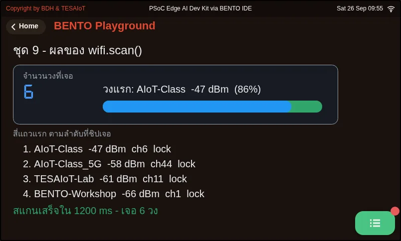
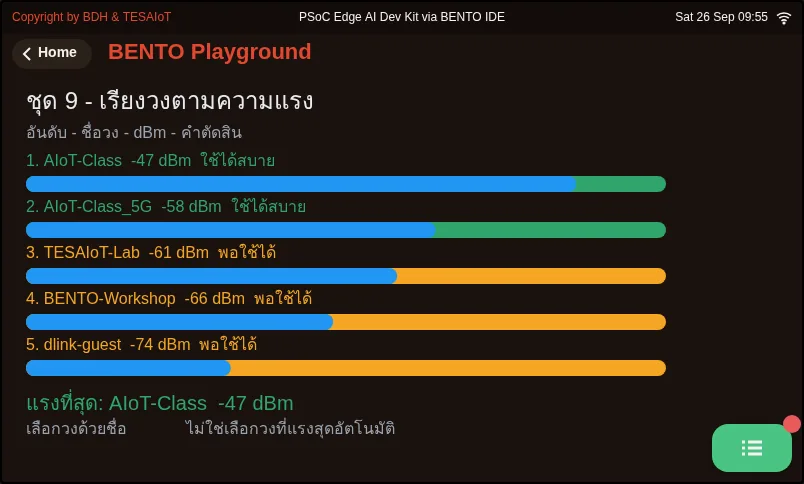
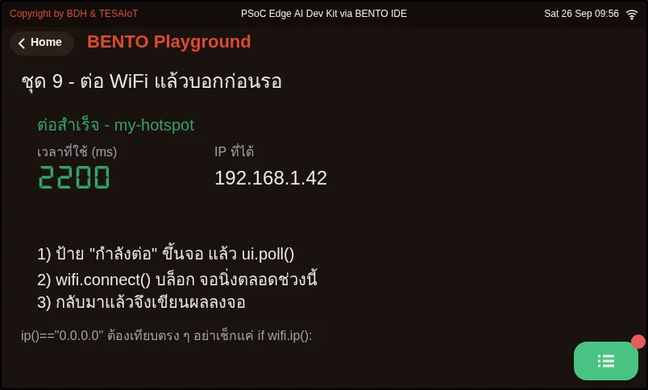
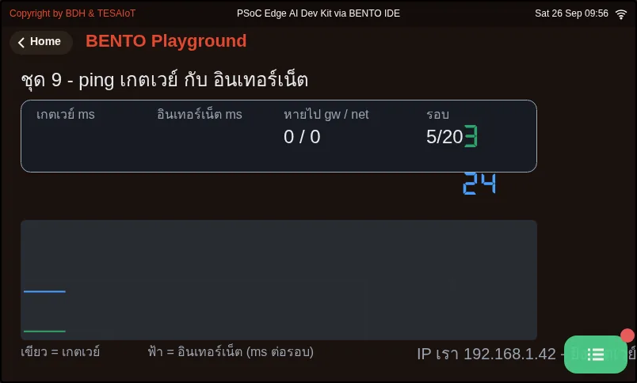
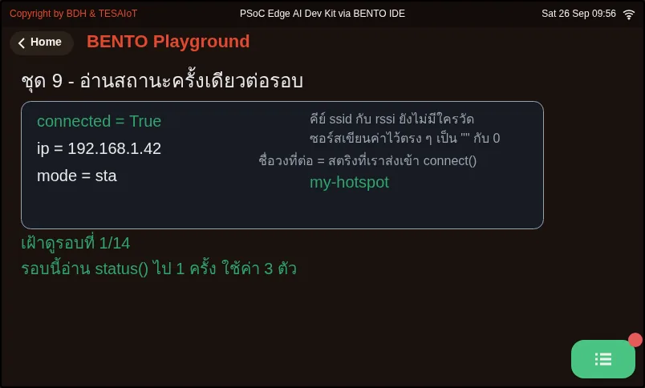
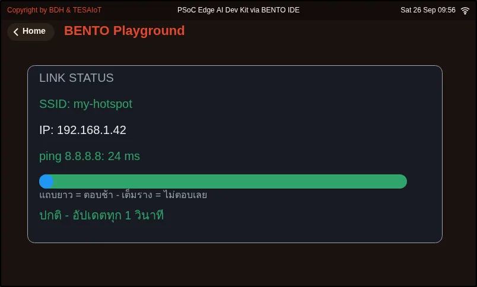
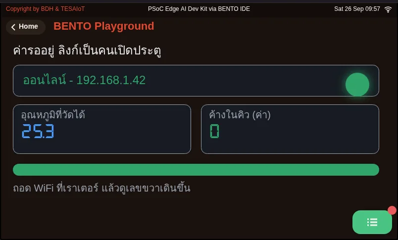
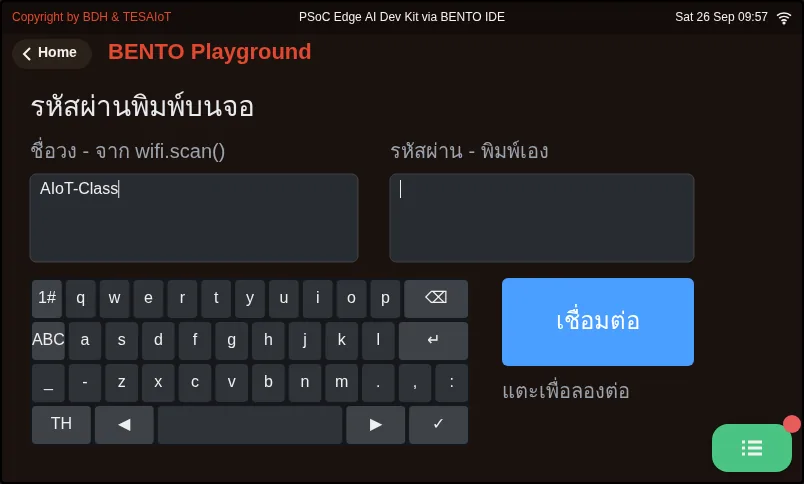
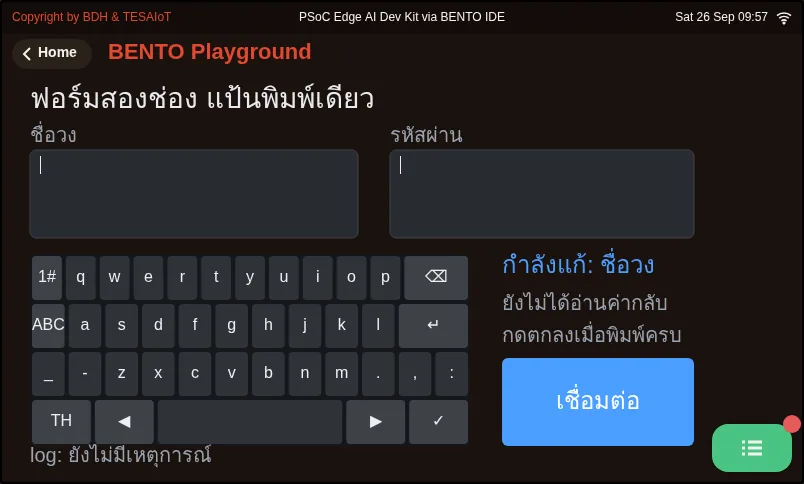

# Lesson 4.3 — Hands-on: your team's network status page

> Module 4 — IoT Platform Connectivity · Slides: [slides.md](slides.md) · [Module overview](../README.md) · [Course page](../../README.md)

Fill the six blanks in the practice file until the team's network status page updates live (a table of networks strongest first, SSID, IP, link lights and a two-target ping every 3 seconds), then use it to diagnose where the link breaks.

## Objectives

By the end of this lesson you will be able to:

1. Fill the six blanks in `s09_network_status.py` in move order 2 to 5 until the left table shows at least 3 networks strongest first in all four columns with no wrapped cell, and the right panel shows the SSID the program passed to `connect()`, the IP address from DHCP and the correct link light
2. Make the gateway and internet lines show times in ms and refresh every 3 seconds for at least 2 minutes, make the Rescan button clear and refill the table instead of stacking rows, and interpret "gateway passes but internet times out" as a location for the problem
3. Use the lesson's pitfalls table to find the cause of at least three symptoms, including the `ui.Table` symptoms that raise no error, and answer aloud why `wifi.scan()` results are read with `net[1]`, not `net['rssi']`
4. Run `09_link_gates_a_real_reading.py` on a real board, cut the link at the router and restore it, and explain the rule "measure every pass, queue it, send one at a time when the link returns" from the queue count rising and draining on screen

## Before you start

Following on from lesson 4.2, where we walked through all five moves of this file, keep BENTO Playground open on the board throughout this lesson.
Edit `WIFI_SSID` and `WIFI_PASS` at the top of the file to your home WiFi or phone hotspot; that network must have a password set, because `connect()`
cannot join an open network. Check beforehand whether that network's gateway is really `.1` — read the real gateway from a laptop on the same network
(`ipconfig` on Windows or `ip route` on Linux). While typing, time yourself and record the numbers you see in your learning log (if learning in a group, take turns typing and recording).

- **Equipment:** an Eva Kit or TESAIoT Dev Kit board with the BENTO MicroPython firmware installed, or the BENTO Emulator in [BENTO IDE](https://ide.tesaiot.dev/) (the Emulator can draw the full practice file and examples' screens, but the network name, WiFi values and link state on the host machine are stand-in values, not the board's real measurements — passing the MVP, which needs a real DHCP-issued IP and a live ping, needs a real board)
- **Before this:** [Lesson 4.2 — The network status screen: reading the wifi code](../l02-network-status-code/README.md)

## See it work first

Before filling in anything, press Program to Device on the practice file right away. It presets `nets = []` and `ok = False`, so you see the full screen structure:
a title bar with a `Rescan` button, an empty table on the left, link lights, a ping label and a dBm gauge on the right, and the screen shows "connection failed" —
which looks exactly like entering a wrong password. The screen has already been laid out in full; our job is to make real data flow into it.

## Concepts

**The MVP for lessons 4.1–4.3** is your team's network status screen (SSID, IP, ping ms) updating live on the HMI, building on top of lessons 3.7–3.9's
dashboard, and what is measured is the diagnosis, not lines of code.

**The five-move order is the debugging order.** Each move proves the one before it: 1 the screen works · 2 the radio works (scanning needs no password;
finding networks means the radio is working) · 3 data is interpreted correctly (the tuple/dict bug shows up here) · 4 we already have an address · 5 we can talk to someone else. If move 3 breaks, we know for certain it has nothing to do with the network, because move 2 already passed.
Working from what depends on the least to what depends on the most, moves 2 and 3 are bundled into one `rescan()`, because a button on screen must be able to call the whole set again —
that is the difference between a script that runs once and a screen an actual user operates. `gateway_of()` guesses the gateway as `.1`, just like the built-in screen, but we do not stop at guessing — we fire a ping to prove it.

**Every decision in the solution has a measurable reason.** Values you edit often sit at the top, logic in the middle, the screen at the bottom. `ui.Table`
replaces stacked Labels because it arranges columns for you. Two `ui.Led` lamps replace green/red text because a black-and-white photo can still tell a lit lamp from a dimmed one apart (`.value(0)` dims,
it does not vanish). `ui.Bar` sits over `ui.Scale` so a value and its range sit together, because `ui.Scale` is a ruler that does not accept `.value()`.
The colour thresholds −60 / −75 are looser than the on-device screen's five bars, because this card has three levels, and the normal level uses blue `COL_RUN`, not green,
because a normal state must stay quiet — colour is reserved for what is abnormal. `security == 0` is written as the word "open" or "secured",
never painted with colour. `ssid[:12]` deliberately truncates the name, and the full name is still on the Console — every truncation on screen must know what it cut.

**Closing the loop: a link exists to carry something out.** File `09` attaches a temperature value onto the link, measuring every pass regardless of the network's state, queuing it every time,
and sending one value at a time once the link returns. If it instead said "measure when the network is there", data from a dropped stretch would vanish forever, with not a single error.
Files `10` and `11` answer a real problem found on 14 Aug 2026: a WiFi password should never be baked into code — type it on screen instead with
`ui.Textarea` and `ui.Keyboard`.

## Worked example

**Must be done in this lesson** (about 29 minutes total, in order). `01_scan_tuples.py` (6 minutes) — see for yourself that `scan()`'s result is a real four-slot tuple before filling in move 3 ·
`03_connect_says_first.py` (8 minutes) — before running, predict whether the "connecting" label should appear before or after the screen goes still, then run and watch ·
`06_link_panel_hmi.py` (15 minutes) — an SSID · IP · ping ms card where every number is really measured. This file deliberately has no signal-strength bar —
the bar on that screen is ping time; a long bar means slow, because `rssi` in `wifi.status()` is always 0.

**Whatever you're stuck on, open the matching file.** Connected and got an IP, but cannot reach anything: use `04_ping_two_targets.py` · calling `status()` several times in one round
and getting a picture that never really happened: use `05_status_dict.py` (reads once per round) · unsure which network is nearest: use `02_rank_by_rssi.py`

**Closing the loop:** `09_link_gates_a_real_reading.py` on the Dev Kit reads the room's real temperature from the SHT40; on the Eva Kit, the knob plays that role instead
(0–100% = 15–45 °C), and the Console says from the very first round where the value came from. Always try it on a real board — the top of the file notes it once passed on the Emulator,
which answers every key but breaks on a real board. `10_keyboard_types_the_password.py` and `11_two_fields_one_keyboard.py` always create the `Textarea` before
the `Keyboard`, and call `kb.listen("ready", "cancel")` first before events arrive. Read what was typed with `ta.text()` with no arguments —
the password field displays stars, but `.text()` returns the real value, so it must never be printed to the Console.

Optional further reading: lesson 5.2's `03_reconnect_backoff.py` answers how to reconnect after a dropped link — this is outside this set of lessons' passing criteria.

| File | What this file teaches |
|---|---|
| [examples/01_scan_tuples.py](examples/01_scan_tuples.py) | What the result of wifi.scan() looks like |
| [examples/02_rank_by_rssi.py](examples/02_rank_by_rssi.py) | Sort networks strongest to weakest, and convert dBm into something readable |
| [examples/03_connect_says_first.py](examples/03_connect_says_first.py) | Say it first, then wait, because connect() blocks |
| [examples/04_ping_two_targets.py](examples/04_ping_two_targets.py) | The gateway answers but the internet does not — what does that mean |
| [examples/05_status_dict.py](examples/05_status_dict.py) | Read status once, then use that same set of values for the whole round |
| [examples/06_link_panel_hmi.py](examples/06_link_panel_hmi.py) | A link-status screen where every number on screen is really measured |
| [examples/09_link_gates_a_real_reading.py](examples/09_link_gates_a_real_reading.py) | A real value is waiting; the link is what decides whether it can go yet |
| [examples/10_keyboard_types_the_password.py](examples/10_keyboard_types_the_password.py) | A password should be typed on screen, never baked into code |
| [examples/11_two_fields_one_keyboard.py](examples/11_two_fields_one_keyboard.py) | A two-field form, one keyboard, and reading the value back |

The slides for this lesson also refer to files that live in other lessons:

- [m02-ui-to-hardware/l06-touch-panel-lab/examples/09_scale_led_spinbox.py](../../m02-ui-to-hardware/l06-touch-panel-lab/examples/09_scale_led_spinbox.py) — three widgets that separate an HMI screen from a toy screen
- [m04-iot-connectivity/l02-network-status-code/examples/08_softap_fallback.py](../l02-network-status-code/examples/08_softap_fallback.py) — if it cannot find the network it was told to use, the board can open its own
- [m05-capstone/l02-capstone-starter/examples/03_reconnect_backoff.py](../../m05-capstone/l02-capstone-starter/examples/03_reconnect_backoff.py) — reconnect with growing backoff, never in a rapid burst

**Screens from the BENTO Emulator** for this lesson's examples (click a file name to open the code)

<figure><figcaption><a href="examples/01_scan_tuples.py"><code>01_scan_tuples.py</code></a> What the result of wifi.scan() looks like</figcaption></figure>
<figure><figcaption><a href="examples/02_rank_by_rssi.py"><code>02_rank_by_rssi.py</code></a> Sort networks strongest to weakest, and convert dBm into something readable</figcaption></figure>
<figure><figcaption><a href="examples/03_connect_says_first.py"><code>03_connect_says_first.py</code></a> Say it first, then wait, because connect() blocks</figcaption></figure>
<figure><figcaption><a href="examples/04_ping_two_targets.py"><code>04_ping_two_targets.py</code></a> The gateway answers but the internet does not — what does that mean</figcaption></figure>
<figure><figcaption><a href="examples/05_status_dict.py"><code>05_status_dict.py</code></a> Read status once, then use that same set of values for the whole round</figcaption></figure>
<figure><figcaption><a href="examples/06_link_panel_hmi.py"><code>06_link_panel_hmi.py</code></a> A link-status screen where every number on screen is really measured</figcaption></figure>
<figure><figcaption><a href="examples/09_link_gates_a_real_reading.py"><code>09_link_gates_a_real_reading.py</code></a> A real value is waiting; the link is what decides whether it can go yet</figcaption></figure>
<figure><figcaption><a href="examples/10_keyboard_types_the_password.py"><code>10_keyboard_types_the_password.py</code></a> A password should be typed on screen, never baked into code</figcaption></figure>
<figure><figcaption><a href="examples/11_two_fields_one_keyboard.py"><code>11_two_fields_one_keyboard.py</code></a> A two-field form, one keyboard, and reading the value back</figcaption></figure>

## Practice

Open `practice/s09_network_status.py`. All six blanks have a `# เติม:` (fill in) hint marking them. The one blank at the outermost indentation level is `wifi.connect()`;
the rest sit nested inside `rescan()`, inside the loop, or inside a `try` — use the indentation itself as a memory aid for which level. Never fill in all six and run only once,
because scanning and connecting break in different ways.

1. Moves 2 and 3 inside `rescan()`: `nets = wifi.scan()` · `nets.sort(key=lambda net: net[1], reverse=True)` ·
   `ssid, rssi, security, channel = nets[i]`. Fill in these three lines before running, because the line `tbl.add_row(ssid[:12], ...)` uses the name move 3 unpacks.
   If you want to see the network count in the Console, add `print("found", len(nets), "networks")` as in the solution. Run it and you must see three rows with dBm numbers descending
2. Move 4 (outermost level): `ok = wifi.connect(WIFI_SSID, WIFI_PASS)`. Notice the "connecting, 85s" label sits before this line.
   Run it and the top lamp lights, the bottom one dims, and an IP number appears. If the screen disappears about two seconds afterward, do not panic —
   that is because the loop does not have move 5's `ui.poll()` yet
3. Move 5 in the loop: `events = ui.poll()` at the top of the loop, and `ms_gw = wifi.ping(gw, PING_TIMEOUT_MS)` inside a `try`.
   Run it and the gateway and internet lines show in ms, with a countdown "measuring again in N s"

You know you are done when you pass every item in the lab's MVP checklist. If the gateway times out even though the IP shows normally, that network is not using `.1` —
read the real gateway number from a laptop on the same network (`ipconfig` on Windows or `ip route` on Linux) and fix the line `gw = ...`.

| Practice file | Topic |
|---|---|
| [practice/s09_network_status.py](practice/s09_network_status.py) | Your team's network status page (fill-in version) |

## Solution

Open the solution after trying on your own at least once, and read [how to use the solutions](../../README.md#วิธีใช้เฉลย) first.

| Solution | Goes with |
|---|---|
| [solution/s09_network_status.py](solution/s09_network_status.py) | [practice/s09_network_status.py](practice/s09_network_status.py) |

## Check your understanding

The same questions are in [quiz.yaml](quiz.yaml) for automatic marking.

1. Order the network status page's five moves by what each one proves, from first to last. *(order · objective 1)*
   - A) We already have an address (connect gets an IP)
   - B) The screen works (every widget is laid out)
   - C) We can talk to someone else (a two-target ping)
   - D) The radio works (scan finds networks)
   - E) Data is interpreted correctly (unpacking the tuple, sorted strongest first)

   

Solution

   **B → D → E → A → C** — Each move proves the one before it. Scanning comes before connecting because it needs no password, and interpreting data comes before connecting to the network because the tuple/dict bug shows up right there. If move 3 breaks, we know for certain it has nothing to do with the network.

   

2. The right panel must show the name of the network the board is connected to. Why does the solution show the value from WIFI_SSID instead of from wifi.status()["ssid"]? *(choose one · objective 1)*
   - A) Because status() is too slow for a 200 ms loop
   - B) Because status()'s ssid field always returns an empty string, so the team must remember the string it passed to connect() itself
   - C) Because status() returns a tuple, not a dict
   - D) Because status() only works in softap mode

   

Solution

   **B** — ssid and rssi in status() are fixed values in the firmware, always giving "" and 0. The board cannot report its own network name back; real strength must be read from wifi.scan().

   

3. Your team's screen shows the gateway at 4 ms, but the internet does not answer, every time, for a full two minutes. What should the team do? *(choose one · objective 2)*
   - A) Fix the gateway number in the code, because .1 is probably wrong
   - B) Hunt for a bug in rescan(), because the table might be sorted wrong
   - C) Record the result in the learning log and keep working, because the problem is the network's own path out to the internet, not our bug
   - D) Change NET_TEST_IP to "google.com"

   

Solution

   **C** — The gateway answering means the WiFi link and the gateway number are both correct. The problem lies beyond the router, perhaps that network's own path out, or it is being filtered. ping only accepts an IP number; giving it a hostname raises ValueError.

   

4. Which of these symptoms have "no error to catch", only a screen that looks wrong? Choose every correct one. *(choose all that apply · objective 3)*
   - A) Text longer than col_width doubles the row height, and the last row falls off the table's edge
   - B) Forgetting tbl.clear_items() means pressing rescan leaves old rows still stuck on screen
   - C) Writing net['rssi'] against the result of wifi.scan()
   - D) Calling bar_rssi.color() makes the bar look completely full along its track
   - E) Calling wifi.ping("google.com")

   

Solution

   **A, B, D** — These three symptoms of ui.Table and ui.Bar raise no error and must be checked by eye. net['rssi'] raises TypeError, because the scan result is a tuple, and pinging with a hostname raises ValueError.

   

5. In file 09, if you change it to "measure only when the network is there", what happens if the link drops for five minutes? *(choose one · objective 4)*
   - A) The program raises OSError and stops
   - B) The data from that five-minute stretch vanishes forever, with not a single error, even though the sensor was working normally the whole time
   - C) The queue fills up and the board resets itself
   - D) Nothing different happens, because once the link returns, the values are sent back retroactively in full

   

Solution

   **B** — Measuring and sending must stay separate: measure every pass regardless of the network's state, queue it, then release one value at a time once the link returns. A value that was never measured has nothing to send retroactively.

   

## Lab

**MVP: your team's network status screen.** Do this on a real board, and keep evidence in your learning log.

- [ ] The left table shows at least 3 networks, strongest first, in all four columns, with no cell wrapping
- [ ] The right panel shows the SSID the program passed to `connect()` itself, and the IP address from DHCP (not a value hardcoded in the code)
- [ ] The link light is correctly lit, and the dBm gauge moves with your team's real network, labelled with the range −90 to −40
- [ ] Pressing **Rescan** clears the table and refills it, not overwriting old rows
- [ ] The gateway and internet lines show times in ms and refresh every 3 seconds continuously for at least 2 minutes
- [ ] The team can explain where the problem lies if the gateway passes but the internet times out (can answer aloud)
- [ ] The team can answer why `wifi.scan()` must be read with `net[1]`, not `net['rssi']` (can answer aloud)
- [ ] Attach a photo of the screen while running to your learning log

## Going further

Keep this code well — lessons 4.4–4.6 layer `mqtt` on top of this working link; the board will start really sending data out and taking commands back.
Extensions (pick one, record it in your learning log): a five-point signal map compared against FSPL · ping the gateway 100 times to find min/avg/max and the percentage lost ·
try pinging `.1`, `.254`, `.100` to hunt for the real gateway · run for ten minutes and count how many times it times out

Next lesson: [Lesson 4.4 — MQTT: pub/sub, topics, QoS and the data budget](../l04-mqtt-concepts/README.md)

## Reflect

- For every number on your team's screen right now, can you say where it was measured from, and which ones are still a guess?
- If you had to install 200 sensors in a factory, what would this screen help you decide before installing, and what else would need to be added?
- The data shortened on your team's screen (such as a 12-character network name) — is there somewhere to see the full version yet?
