<style>
section { font-size: 24px; padding: 40px 52px; justify-content: flex-start; }
section h1 { font-size: 1.45em; line-height: 1.12; margin: 0 0 .22em; }
section h2 { font-size: 1.12em; margin: .15em 0; }
section h3 { font-size: 1.0em; margin: .12em 0; }
section p, section li { margin: .16em 0; line-height: 1.32; }
section img { max-width: 100%; height: auto; }
section svg { max-height: 330px; width: 100%; }
section table { font-size: .78em; }
section pre { font-size: .70em; line-height: 1.32; background:#0d1117; color:#e6edf3; border:1px solid #30363d; border-radius:8px; padding:12px 16px; box-shadow:0 2px 8px rgba(0,0,0,.25); }
section pre code { white-space: pre-wrap; background:transparent; color:inherit; } section pre .hljs-comment{color:#8b949e;font-style:italic} section pre .hljs-keyword,section pre .hljs-built_in,section pre .hljs-literal{color:#ff7b72} section pre .hljs-string{color:#a5d6ff} section pre .hljs-number{color:#79c0ff} section pre .hljs-title,section pre .hljs-title.function_,section pre .hljs-section{color:#d2a8ff} section pre .hljs-meta{color:#ffa657} section pre .hljs-attr,section pre .hljs-attribute,section pre .hljs-name{color:#7ee787}
section blockquote { margin: .25em 0; font-size: .92em; }
/* two images on a line (parity / 2x2 grids) stay side-by-side and small */
section p > img + img { margin-left: 10px; }
/* scroll-within-slide: dense slides scroll instead of clipping */
section { overflow-y: auto; overflow-x: hidden; }
section::-webkit-scrollbar { width: 11px; }
section::-webkit-scrollbar-thumb { background:#4a90d9; border-radius:6px; }
section::-webkit-scrollbar-track { background:rgba(0,0,0,.06); }
/* image drop-shadow + cover-slide readability (auto) */
section img{filter:drop-shadow(0 3px 12px rgba(0,0,0,.5))}
/* พื้นสำรองของสไลด์ปก: ถ้า img/cover_sNN.svg โหลดไม่ขึ้น ธีมจะคืนพื้นขาว
   แล้วตัวอักษรสีขาวของปกจะหายไปทั้งแผ่น — ปักสีเข้มไว้ให้ภาพเป็นแค่ของประดับ */
section.cover{background-color:#0b1426}
section.cover *{color:#fff !important}
section.cover h1,section.cover h2,section.cover h3,section.cover p,section.cover li,section.cover strong,section.cover em,section.cover blockquote,section.cover div{text-shadow:0 2px 9px rgba(0,0,0,.92),0 0 3px rgba(0,0,0,.8)}
section.cover div[style*="background:#"],section.cover div[style*="background: #"]{background:rgba(10,14,20,.66) !important;border-color:rgba(120,200,255,.45) !important;max-width:62%}
section.cover blockquote{border-left:4px solid rgba(120,200,255,.6) !important;background:rgba(13,17,23,.55) !important;border-radius:6px;padding:.3em .6em}
section.cover h1,section.cover h2,section.cover h3,section.cover p,section.cover blockquote{max-width:60%}
section.cover div:not(:has(img)){max-width:62%}
section.cover img{filter:none}
</style>


<!-- _class: cover -->

# บทเรียน 4.3 — ลงมือทำ: หน้าสถานะเครือข่ายของทีม

## WiFi และเครือข่ายพื้นฐาน · บอร์ดของเราออกจากโต๊ะทำงาน แล้วไปมีที่อยู่ในเครือข่าย

**โมดูล 4 — เชื่อมต่อแพลตฟอร์ม IoT**

> ต่อจากบทเรียน 4.2 — จอสถานะเครือข่าย: แกะโค้ดโมดูล wifi

---

## MVP checkpoint — ผ่านชุดบทเรียนนี้เมื่อ


**หน้าจอ network status ของทีม (SSID, IP, ping ms) อัปเดตสดบน HMI ที่ต่อยอดจากบทเรียน 3.7–3.9**

แปลเป็นสิ่งที่ตรวจได้จริง:

- [ ] **ตารางซ้าย** ขึ้นชื่อเครือข่ายอย่างน้อย 3 วง **เรียงจากแรงไปอ่อน** ครบสี่คอลัมน์ และ **ไม่มีช่องไหนตัดบรรทัด** (ช่องที่ตัดบรรทัดทำให้แถวสูงสองเท่า แถวสุดท้ายจะตกขอบจอ)
- [ ] แผงขวาแสดง **SSID ที่โปรแกรมส่งเข้า `connect()` เอง** และ **เลข IP ที่ได้จาก DHCP** — เลข IP ต้องไม่ใช่ค่าที่พิมพ์ไว้ในโค้ด ส่วน SSID บอร์ดตอบเองไม่ได้ (`wifi.status()["ssid"]` เป็นสตริงว่างเสมอ) ทีมจึงต้องจำสตริงที่ตัวเองส่งไป
- [ ] **ไฟสถานะลิงก์** ติดถูกดวง และมาตรวัด dBm ขยับตามวงของทีมจริง พร้อมพิสัย -90 ถึง -40 กำกับ
- [ ] กด **สแกนใหม่** แล้วตารางถูกล้างและเทใหม่ ไม่ใช่เขียนทับซ้อนของเดิม
- [ ] บรรทัดเกตเวย์และอินเทอร์เน็ตแสดงเวลาเป็น ms และ **อัปเดตซ้ำทุก 3 วินาที** ต่อเนื่องอย่างน้อย 2 นาที
- [ ] ทีมอธิบายได้ว่าถ้า gateway ผ่านแต่ internet timeout แปลว่าปัญหาอยู่ที่ไหน
- [ ] ทีมตอบได้ว่าทำไม `wifi.scan()` ต้องอ่านด้วย `net[1]` ไม่ใช่ `net['rssi']`
- [ ] ถ่ายรูปหน้าจอตอนทำงานแนบในบันทึกการเรียน

> เกณฑ์ข้อที่หกกับเจ็ดตอบด้วยปากเปล่าได้ — ชุดบทเรียนนี้วัดการวินิจฉัย ไม่ได้วัดความยาวโค้ด

---

## ลงมือทำ — เติมช่องว่างในไฟล์ฝึก

<style scoped>section svg{max-height:200px}</style>

<svg viewBox="0 0 940 218" xmlns="http://www.w3.org/2000/svg">
  <rect x="120" y="10" width="700" height="200" rx="6" fill="#0d1117" stroke="#30363d" stroke-width="2"/>
  <text x="144" y="36" font-size="17" font-family="monospace" fill="#8b949e">s09_network_status.py</text>
  <rect x="168" y="48" width="58" height="18" rx="3" fill="#ff7b72"/>
  <text x="197" y="62" text-anchor="middle" font-size="16" font-family="monospace" fill="#0d1117">pass</text>
  <text x="244" y="62" font-size="17" font-family="monospace" fill="#8b949e">ท่า 2 — nets = wifi.scan() (ใน rescan)</text>
  <rect x="168" y="74" width="58" height="18" rx="3" fill="#ff7b72"/>
  <text x="197" y="88" text-anchor="middle" font-size="16" font-family="monospace" fill="#0d1117">pass</text>
  <text x="244" y="88" font-size="17" font-family="monospace" fill="#8b949e">ท่า 2 — nets.sort(key=..., reverse=True)</text>
  <rect x="192" y="100" width="58" height="18" rx="3" fill="#ffa657"/>
  <text x="221" y="114" text-anchor="middle" font-size="16" font-family="monospace" fill="#0d1117">pass</text>
  <text x="268" y="114" font-size="17" font-family="monospace" fill="#8b949e">ท่า 3 — แกะ tuple สี่ช่อง (ในลูปของ rescan)</text>
  <rect x="144" y="126" width="58" height="18" rx="3" fill="#79c0ff"/>
  <text x="173" y="140" text-anchor="middle" font-size="16" font-family="monospace" fill="#0d1117">pass</text>
  <text x="220" y="140" font-size="17" font-family="monospace" fill="#8b949e">ท่า 4 — ok = wifi.connect(...) (นอกสุด)</text>
  <rect x="168" y="152" width="58" height="18" rx="3" fill="#7ee787"/>
  <text x="197" y="166" text-anchor="middle" font-size="16" font-family="monospace" fill="#0d1117">pass</text>
  <text x="244" y="166" font-size="17" font-family="monospace" fill="#8b949e">ท่า 5 — events = ui.poll() (ต้นลูป)</text>
  <rect x="216" y="178" width="58" height="18" rx="3" fill="#7ee787"/>
  <text x="245" y="192" text-anchor="middle" font-size="16" font-family="monospace" fill="#0d1117">pass</text>
  <text x="292" y="192" font-size="17" font-family="monospace" fill="#8b949e">ท่า 5 — ms_gw = wifi.ping(...) (ใน try)</text>
  <text x="830" y="90" font-size="19" font-weight="700" fill="#455a64">รวม 6 จุด</text>
  <text x="830" y="114" font-size="17" fill="#78909c">สังเกตระดับ</text>
  <text x="830" y="134" font-size="17" fill="#78909c">การเยื้อง</text>
</svg>

เปิด [`s09_network_status.py`](https://github.com/tesaiot/tesa-qualification-program/blob/main/courses/aiot-micropython/m04-iot-connectivity/l03-network-status-lab/practice/s09_network_status.py) มีช่องว่างให้เติม **6 จุด** — จุดเดียวที่อยู่ระดับนอกสุดคือ `wifi.connect()` ที่เหลือเยื้องเข้าไปอยู่ในฟังก์ชัน `rescan()` ในลูป หรือใน `try` ให้ดูตำแหน่งซ้าย-ขวาของกล่องเป็นตัวช่วยจำระดับ · **หน้าจอถูกวางไว้ให้ครบแล้ว ไม่ต้องแก้** งานของเราคือทำให้ข้อมูลจริงไหลเข้าไปในนั้น

```python
def rescan():
    nets = []
    # เติม: nets = wifi.scan()
    pass
    ...
    for i in range(min(TOP_N, len(nets))):
        # เติม: ssid, rssi, security, channel = nets[i]
        pass
```

ลำดับที่แนะนำ: เติมท่า 2 กับท่า 3 ก่อนรันครั้งแรก (เติมแค่ท่า 2 แล้วรัน ลูปแถวจะพังที่ `ssid` ซึ่งท่า 3 เป็นคนกำหนด) แล้วดูว่า `print("found", len(nets), "networks")` ขึ้นกี่วงและแถวขึ้นจอครบไหม จากนั้นจึงไปต่อท่า 4 และ 5

<!-- อย่าเติมครบหกจุดแล้วค่อยรันทีเดียว — การสแกนกับการต่อเน็ตพังคนละแบบ แยกรันแล้วจะรู้ทันทีว่าใครพัง -->

---

## ตัวอย่างของบทเรียน 4.1–4.3 — สามไฟล์แรกคือชุดที่พาหน้าจอสถานะเครือข่ายขึ้นจนครบ

<style scoped>
section table { font-size: .66em; }
section table td, section table th { padding: .14em .5em; }
</style>

**ต้องทำในบทเรียน** · เปิดตามลำดับนี้ ทั้งชุดราว 29 นาที

| ลำดับ · เรื่อง · เวลา | ไฟล์ | ลงมือทำอะไร แล้วจะเข้าใจอะไร |
|---|---|---|
| **1 · `scan()` คืน tuple ไม่ใช่ dict** · 6 นาที | [`01_scan_tuples.py`](https://github.com/tesaiot/tesa-qualification-program/blob/main/courses/aiot-micropython/m04-iot-connectivity/l03-network-status-lab/examples/01_scan_tuples.py) | แกะสี่ช่องของแต่ละวงได้ถูกตั้งแต่บรรทัดแรก แทนที่จะเสียครึ่งบทเรียนกับ `TypeError` · จะเข้าใจว่าผลของ `scan()` เป็น tuple ไม่ใช่ dict จึงต้องอ่านด้วยลำดับช่อง ไม่ใช่ด้วยชื่อคีย์ |
| **2 · ป้ายสถานะขึ้นก่อนบรรทัดที่บล็อก** · 8 นาที | [`03_connect_says_first.py`](https://github.com/tesaiot/tesa-qualification-program/blob/main/courses/aiot-micropython/m04-iot-connectivity/l03-network-status-lab/examples/03_connect_says_first.py) | เขียนลำดับที่ทำให้จอไม่ดูเหมือนเครื่องค้าง ตอน `connect()` กินเวลาเป็นนาที · จะเข้าใจว่าป้ายสถานะต้องขึ้นก่อนบรรทัดที่บล็อกเสมอ ไม่ใช่หลังจากมันคืนค่า |
| **3 · หน้าจอสถานะลิงก์ที่วัดมาจริง** · 15 นาที | [`06_link_panel_hmi.py`](https://github.com/tesaiot/tesa-qualification-program/blob/main/courses/aiot-micropython/m04-iot-connectivity/l03-network-status-lab/examples/06_link_panel_hmi.py) | ประกอบ MVP ของชุดบทเรียนนี้ได้ครบ — SSID · IP · ping ms พร้อมสามสถานะที่แยกออกจากกัน · จะเห็นว่าหน้าจอสถานะลิงก์ที่เชื่อได้ ทุกตัวเลขบนนั้นต้องวัดมาจริง |

ไฟล์ที่ 3 **ไม่มีแท่งความแรงสัญญาณ** และนั่นตั้งใจ แท่งบนจอนั้นคือเวลา ping — **ยาว = ช้า** ตรงข้ามกับมาตรวัดความแรงในเฉลยที่มาจาก `scan()` ซึ่งเป็นคนละคำถามกัน เหตุผลอยู่ในหัวไฟล์ พร้อม path ของซอร์สที่ hardcode ค่าไว้

**ติดตรงไหน เปิดอันนี้**

| อาการที่เจอ | ไฟล์ที่ตอบอาการนั้น |
|---|---|
| ต่อติดแล้ว ได้ IP แล้ว แต่เปิดอะไรไม่ได้เลย | [`04_ping_two_targets.py`](https://github.com/tesaiot/tesa-qualification-program/blob/main/courses/aiot-micropython/m04-iot-connectivity/l03-network-status-lab/examples/04_ping_two_targets.py) — วัดเกตเวย์กับ 8.8.8.8 พร้อมกัน แล้วบอกได้ว่าขาดตรงไหน |
| เรียก `status()` หลายครั้งในรอบเดียว แล้วได้ภาพที่ไม่เคยเกิดจริง | [`05_status_dict.py`](https://github.com/tesaiot/tesa-qualification-program/blob/main/courses/aiot-micropython/m04-iot-connectivity/l03-network-status-lab/examples/05_status_dict.py) — อ่านครั้งเดียวต่อรอบ แล้วใช้ค่าชุดนั้นทั้งรอบ |
| ไม่รู้ว่าวงไหนคือ AP ของห้อง | [`02_rank_by_rssi.py`](https://github.com/tesaiot/tesa-qualification-program/blob/main/courses/aiot-micropython/m04-iot-connectivity/l03-network-status-lab/examples/02_rank_by_rssi.py) — เรียงจากแรงไปอ่อนด้วย dBm จริงจาก `scan()` |

**อ่านเสริมนอกเวลา** — เรื่องนี้อยู่นอกเกณฑ์ผ่านของบทเรียน 4.1–4.3 เพราะเช็กพอยต์ของชุดบทเรียนนี้วัดแค่ว่าหน้าจอสถานะอัปเดตสดได้ ยังไม่ได้วัดการฟื้นตัว: [`03_reconnect_backoff.py`](https://github.com/tesaiot/tesa-qualification-program/blob/main/courses/aiot-micropython/m05-capstone/l02-capstone-starter/examples/03_reconnect_backoff.py) ตอบคำถามถัดไปว่าลิงก์หลุดแล้วจะต่อใหม่อย่างไร ไม่ให้สามสิบบอร์ดถล่มเราเตอร์พร้อมกัน

---

## กับดักที่เจอบ่อย

| อาการ | สาเหตุที่แท้จริง | วิธีแก้ |
|---|---|---|
| `TypeError: tuple indices` | เขียน `net['ssid']` หรือ `net['rssi']` ตามตัวอย่างที่มากับเครื่อง | ใช้ `net[0]` และ `net[1]` — `scan()` คืน tuple |
| ต่อไม่ติดทั้งที่ SSID ถูกและไม่มีรหัสผ่าน | `connect()` ล็อกโหมดเป็น WPA3/WPA2 ตายตัว **ต่อวงแบบเปิดไม่ได้** | ขอผู้สอนเปิดวงที่ตั้งรหัสผ่านไว้ |
| จอนิ่งไปเป็นนาทีหลังกด Program | `connect()` บล็อกได้ถึง ~85 วินาทีเมื่อรหัสผิด | รอจนขึ้นผล แล้วตรวจรหัสทีละตัวอักษร ไม่ต้องกดซ้ำ |
| `ValueError` ตอนเรียก ping | ใส่ชื่อโฮสต์ เช่น `"google.com"` | `wifi.ping()` รับเฉพาะเลข IP |
| แถวเครือข่ายขึ้นแล้วหายไปใน 2 วิ | ลืม `ui.poll()` ในลูป หรือหน่วงยาวเป็นก้อนเดียว | เรียก `ui.poll()` ทุกรอบ และให้ลูปเดินรอบละ 200 ms |
| ตารางสูงเกินจอ แถวสุดท้ายหาย | ข้อความในช่องยาวเกิน `col_width` แล้วถูกตัดบรรทัด แถวนั้นสูงเป็นสองเท่า | ขยาย `col_width` ของคอลัมน์นั้น หรือย่อข้อความก่อนใส่ (เฉลยตัด SSID ที่ 12 ตัวอักษร) |
| กดสแกนใหม่แล้วแถวเก่ายังค้าง | ลืม `tbl.clear_items()` ก่อนเทแถวชุดใหม่ | ล้างก่อนเสมอ แล้วใส่หัวตารางใหม่ทุกครั้ง เพราะการล้างลบหัวตารางไปด้วย |
| เปลี่ยนสีแท่งแล้วแท่งดูเต็มทั้งราง | `.color()` ของ `ui.Bar` ไปลงที่ราง ไม่ใช่แถบที่เต็ม | อย่าเปลี่ยนสีแท่งตอนรัน ให้เปลี่ยนสีตัวเลขหรือใช้ `ui.Led` บอกสถานะแทน |
| `wifi.status()` คืน ssid ว่าง rssi = 0 | ทั้งสองช่องเป็นค่าตายตัวในเฟิร์มแวร์ | อ่านความแรงจาก `wifi.scan()` และเก็บ SSID ที่เราสั่งต่อไว้เอง |
| gateway timeout ทั้งที่ IP ขึ้นปกติ | เดาเลขเกตเวย์เป็น `.1` แต่วงนี้ไม่ได้ใช้ `.1` | ถามเลขจริงจากผู้สอน แล้วแก้ค่าในโค้ด |
| `IndexError` ตอนวาดแถวท้าย ๆ | สแกนเจอน้อยกว่า `TOP_N` | ใช้ `min(TOP_N, len(nets))` เป็นขอบเขตลูป |
| ping เน็ต timeout ทุกครั้ง แต่ gateway ปกติ | ทางออกอินเทอร์เน็ตของห้องมีปัญหา หรือถูกกรองไว้ | **ไม่ใช่บั๊กของเรา** — จดผลลงบันทึกการเรียนแล้วทำงานต่อได้ |

> เจ็ดในสิบสองข้อนี้คือ *ข้อจำกัดที่รู้ได้ล่วงหน้า* ไม่ใช่ความผิดพลาดของโค้ด — สามข้อกลางตารางเป็นเรื่องของ `ui.Table` โดยเฉพาะ และทั้งสามข้อ **ไม่มี error ให้จับ** มีแต่จอที่ดูผิด

---

## เฉลย [`s09_network_status.py`](https://github.com/tesaiot/tesa-qualification-program/blob/main/courses/aiot-micropython/m04-iot-connectivity/l03-network-status-lab/solution/s09_network_status.py) — ส่วนที่หนึ่ง

<style scoped>section pre{font-size:.58em;line-height:1.25} section svg{max-height:118px} section p{margin:.1em 0}</style>

อ่านให้เข้าใจ **แล้วพิมพ์เอง** อย่าคัดลอกวาง

```python
WIFI_SSID = "AIoT-Class"     # ชื่อเครือข่ายที่ผู้สอนแจกให้ห้องนี้
WIFI_PASS = "changeme"
NET_TEST_IP = "8.8.8.8"      # ปลายทางฝั่งอินเทอร์เน็ต
PING_TIMEOUT_MS = 1500
TOP_N = 3                    # ตารางสูง 288 = หัวตารางบวกสามแถว แถวละ 72 พิกเซล
PING_EVERY_MS = 3000
RSSI_FLOOR, RSSI_CEIL = -90, -40   # พิสัยของมาตรวัด

def signal_of(rssi):
    pct = (rssi - RSSI_FLOOR) * 100 // (RSSI_CEIL - RSSI_FLOOR)
    pct = 0 if pct < 0 else (100 if pct > 100 else pct)
    col = COL_RUN if rssi >= -60 else (COL_WARN if rssi >= -75 else COL_BAD)
    return pct, col
```

<svg viewBox="0 0 940 160" xmlns="http://www.w3.org/2000/svg">
  <text x="470" y="142" text-anchor="middle" font-size="18" fill="#78909c">สามชั้นนี้เรียงจากบนลงล่างในไฟล์เสมอ — ค่าที่แก้บ่อยอยู่บนสุด</text>
  <rect x="20" y="12" width="290" height="94" rx="7" fill="#e8f5e9" stroke="#2e7d32" stroke-width="2"/>
  <text x="165" y="40" text-anchor="middle" font-size="19" font-weight="700" fill="#2e7d32">ค่าที่ทีมต้องแก้</text>
  <text x="165" y="66" text-anchor="middle" font-size="17" fill="#1b5e20">SSID · รหัสผ่าน</text>
  <text x="165" y="92" text-anchor="middle" font-size="17" fill="#4a7c4e">อยู่บนสุด หาเจอทันที</text>
  <rect x="326" y="12" width="290" height="94" rx="7" fill="#e3f2fd" stroke="#1565c0" stroke-width="2"/>
  <text x="471" y="40" text-anchor="middle" font-size="19" font-weight="700" fill="#1565c0">ค่าที่ปรับได้ทีหลัง</text>
  <text x="471" y="66" text-anchor="middle" font-size="17" fill="#0d47a1">timeout · จำนวนแถว</text>
  <text x="471" y="92" text-anchor="middle" font-size="17" fill="#5472a3">ไม่ต้องไล่หาในลูป</text>
  <rect x="632" y="12" width="290" height="94" rx="7" fill="#fff3e0" stroke="#ef6c00" stroke-width="2"/>
  <text x="777" y="40" text-anchor="middle" font-size="19" font-weight="700" fill="#ef6c00">ตรรกะที่ใช้ซ้ำ</text>
  <text x="777" y="66" text-anchor="middle" font-size="17" fill="#e65100">signal_of() · ms_text()</text>
  <text x="777" y="92" text-anchor="middle" font-size="17" fill="#a1683a">แก้ที่เดียว เปลี่ยนทั้งจอ</text>
</svg>

เกณฑ์สี −60 / −75 **หลวมกว่าเกณฑ์ห้าขีดของหน้าจอบอร์ด** เพราะการ์ดของเรามีสามระดับ — เลือกเกณฑ์ให้เข้ากับสิ่งที่จะแสดง ไม่ใช่ลอกมาทั้งชุด · ระดับ "ปกติ" คืนสีฟ้า `COL_RUN` ไม่ใช่เขียว **สถานะปกติต้องเงียบ** สีจัดสงวนไว้ให้เรื่องผิดปกติ — จอที่ระบายเขียวทั้งจอฝึกให้ตามองข้ามสี แล้ววันที่มีเรื่องจริง สีแดงก็กลืนไปกับพื้นหลัง

> ค่าที่ต้องแก้บ่อยอยู่บนสุด ตรรกะอยู่กลาง หน้าจออยู่ล่าง — โครงนี้ใช้ได้กับทุกสคริปต์ตั้งแต่บทเรียน 1.1–1.3

---

## เฉลย — หน้าจอ: ตาราง ไฟสถานะ และมาตรวัด dBm

<style scoped>section pre{font-size:.56em;line-height:1.22} section table{font-size:.7em} section p{margin:.1em 0}</style>

```python
tbl = ui.Table(x=24, y=104, w=480, h=288, cols=4)   # หัวตาราง + 3 แถว แถวละ 72 px
tbl.col_width(0, 144)        # ช่องแคบกว่าข้อความ = ตัดบรรทัด = แถวสูงสองเท่า = แถวท้ายตกจอ
tbl.col_width(1, 96)
tbl.col_width(2, 80)
tbl.col_width(3, 128)
led_up = ui.Led(x=536, y=112, w=48, h=48, color=COL_OK, value=0)     # ต่ออยู่
led_down = ui.Led(x=536, y=168, w=48, h=48, color=COL_BAD, value=1)  # ยังไม่ต่อ
bar_rssi = ui.Bar(x=536, y=320, w=152, h=12, color=COL_RUN,
                  min=RSSI_FLOOR, max=RSSI_CEIL, value=RSSI_FLOOR)
sc_rssi = ui.Scale(x=536, y=340, w=152, h=44, color=COL_TEXT,
                   min=RSSI_FLOOR, max=RSSI_CEIL)
sc_rssi.ticks(11, 5)      # 11 ขีด ป้ายเลขทุกขีดที่ 5 = เหลือสามป้าย ไม่ทับกัน
```

**สามอย่างนี้แทนของเดิมทีละอย่าง และแต่ละอย่างมีเหตุผลที่วัดได้**

| ของเดิม | ของใหม่ | เพราะ |
|---|---|---|
| `ui.Label` เรียงกันห้าบรรทัด | `ui.Table` สี่คอลัมน์ | ตารางจัดคอลัมน์ให้เอง เราไม่ต้องนับพิกเซลทุกครั้งที่ข้อความเปลี่ยนความยาว |
| ตัวอักษรสีเขียว/แดงบอกว่าต่ออยู่ไหม | `ui.Led` สองดวง | แปลงภาพหน้าจอเป็นขาวดำแล้วสีตัวอักษรหายหมด ส่วนไฟติดกับไฟหรี่ยังแยกออก |
| ตัวเลข dBm ลอย ๆ | `ui.Bar` ทับ `ui.Scale` | ค่ากับพิสัยอยู่ด้วยกัน คนอ่านตอบได้ทันทีว่า −67 นี่ดีหรือแย่ |

`ui.Scale` **ไม่รับ `.value()`** มันคือไม้บรรทัด ตัวที่ขยับคือ `ui.Bar` ที่วางทับ (แบบวงกลมมีเข็มจริง — บทเรียน 3.1–3.3) · `ui.Led` สั่ง `.value(0)` แล้ว **หรี่ ไม่ใช่หาย** — ไฟที่หายไปตอนดับ ทำให้คนดูแยกไม่ออกว่าดับหรือจอเสีย

> ทั้งสามตัวเป็นของใหม่ที่เพิ่มเข้าไลบรารีเมื่อ 15 ส.ค. 2026 — [`09_scale_led_spinbox.py`](https://github.com/tesaiot/tesa-qualification-program/blob/main/courses/aiot-micropython/m02-ui-to-hardware/l06-touch-panel-lab/examples/09_scale_led_spinbox.py) สอนทั้งสามตัวแยกกันทีละตัว

---

## เฉลย — ส่วนที่สอง: สแกน เรียง แล้วเทลงตาราง

<style scoped>section pre{font-size:.58em;line-height:1.25} section svg{max-height:135px} section p{margin:.1em 0}</style>

```python
def rescan():                                 # ปุ่ม "สแกนใหม่" เรียกซ้ำได้ทั้งชุด
    nets = wifi.scan()
    nets.sort(key=lambda net: net[1], reverse=True)
    print("found", len(nets), "networks")
    tbl.clear_items()                         # ล้างก่อน ไม่งั้นแถวเก่าค้างใต้แถวใหม่
    tbl.add_row("SSID", "dBm", "ช่อง", "รหัส")
    for i in range(min(TOP_N, len(nets))):
        ssid, rssi, security, channel = nets[i]
        tbl.add_row(ssid[:12], str(rssi), str(channel),
                    "เปิด" if security == 0 else "มีรหัส")
        ui.poll()
```

<svg viewBox="0 0 940 172" xmlns="http://www.w3.org/2000/svg">
  <text x="470" y="164" text-anchor="middle" font-size="18" fill="#78909c">ทั้งสองกล่องต่างกันแค่คำเดียว แต่ผลบนจอกลับด้านกันทั้งแผง</text>
  <rect x="18" y="10" width="430" height="122" rx="7" fill="#e8f5e9" stroke="#2e7d32" stroke-width="2"/>
  <text x="40" y="38" font-size="18" font-weight="700" fill="#2e7d32">ui.poll() อยู่ในลูป (ถูก)</text>
  <text x="40" y="64" font-size="17" font-family="monospace" fill="#1b5e20">for i in range(...):</text>
  <text x="64" y="86" font-size="17" font-family="monospace" fill="#1b5e20">tbl.add_row(...)</text>
  <text x="64" y="108" font-size="17" font-family="monospace" fill="#1b5e20">ui.poll()</text>
  <rect x="464" y="10" width="458" height="122" rx="7" fill="#ffebee" stroke="#c62828" stroke-width="2"/>
  <text x="486" y="38" font-size="18" font-weight="700" fill="#c62828">เรียงกลับด้าน (ผิดที่พบบ่อย)</text>
  <text x="486" y="64" font-size="17" font-family="monospace" fill="#b71c1c">nets.sort(key=lambda n: n[1])</text>
  <text x="486" y="90" font-size="17" fill="#8f1f1f">ไม่ใส่ reverse=True → -86 มาก่อน -48</text>
  <text x="486" y="110" font-size="17" fill="#8f1f1f">สามแถวบนจอกลายเป็นวงที่อ่อนที่สุด</text>
</svg>

`security == 0` คือเครือข่ายแบบเปิด ค่าอื่นคือมีการเข้ารหัส — เขียนแค่ `เปิด` กับ `มีรหัส` เพราะโมดูลยังไม่มีค่าคงที่ให้เทียบ WPA2/WPA3 และเขียนเป็น **คำ** ไม่ใช่ระบายสี ภาพขาวดำก็ยังอ่านออก · `ssid[:12]` ตัดชื่อที่ยาวเกินคอลัมน์โดยตั้งใจ ราคาคือสองวงที่ขึ้นต้นเหมือนกันจะดูเหมือนกัน — ชื่อเต็มยังอยู่ที่ Console **ทุกการตัดข้อมูลบนจอต้องรู้ตัวว่าตัดอะไร และต้องมีที่ให้ดูของเต็ม**

> `reverse=True` คือหนึ่งคำที่เปลี่ยนความหมายของทั้งหน้าจอ — ตรวจผลด้วยตาทุกครั้งหลังเรียงข้อมูล

---

## เฉลย — ส่วนที่สาม และทำไมต้องเรียงห้าท่าแบบนี้

<style scoped>section pre{font-size:.55em;line-height:1.22} section svg{max-height:120px} section p{margin:.1em 0}</style>

```python
nets = rescan()                       # ท่า 2 + 3 จบในบรรทัดเดียว และเรียกซ้ำได้
...
ok = wifi.connect(WIFI_SSID, WIFI_PASS)
...
ip = wifi.ip()
gw = gateway_of(ip)                   # เดาว่าเกตเวย์เป็น .1 ของวงเดียวกัน
led_up.value(1)
led_down.value(0)
...
while True:
    now = time.ticks_ms()
    events = ui.poll()                # ท่า 5 — รับนิ้วทุก 200 ms
    ...
    if wifi.is_connected():
        ...
                ms_gw = wifi.ping(gw, PING_TIMEOUT_MS)      # ยิงทุก 3 วิ ตามนาฬิกาของมันเอง
                ms_net = wifi.ping(NET_TEST_IP, PING_TIMEOUT_MS)
```

<svg viewBox="0 0 940 160" xmlns="http://www.w3.org/2000/svg">
  <text x="470" y="150" text-anchor="middle" font-size="18" fill="#78909c">ถ้าท่าที่ 3 พัง เรารู้แน่ว่าไม่เกี่ยวกับเครือข่าย เพราะท่า 2 ผ่านไปแล้ว</text>
  <rect x="20" y="98" width="168" height="24" rx="4" fill="#c8e6c9" stroke="#2e7d32"/>
  <text x="104" y="115" text-anchor="middle" font-size="17" fill="#1b5e20">1 · จอใช้ได้</text>
  <rect x="200" y="80" width="168" height="24" rx="4" fill="#bbdefb" stroke="#1565c0"/>
  <text x="284" y="97" text-anchor="middle" font-size="17" fill="#0d47a1">2 · วิทยุใช้ได้</text>
  <rect x="380" y="62" width="168" height="24" rx="4" fill="#ffe0b2" stroke="#ef6c00"/>
  <text x="464" y="79" text-anchor="middle" font-size="17" fill="#e65100">3 · แปลข้อมูลถูก</text>
  <rect x="560" y="44" width="168" height="24" rx="4" fill="#e1bee7" stroke="#6a1b9a"/>
  <text x="644" y="61" text-anchor="middle" font-size="17" fill="#4a148c">4 · มีที่อยู่แล้ว</text>
  <rect x="740" y="26" width="182" height="24" rx="4" fill="#ffcdd2" stroke="#c62828"/>
  <text x="831" y="43" text-anchor="middle" font-size="17" fill="#b71c1c">5 · คุยกับคนอื่นได้</text>
  <path d="M192,108 L198,104 M372,90 L378,86 M552,72 L558,68 M732,54 L738,50" stroke="#90a4ae" stroke-width="2"/>
  <text x="470" y="16" text-anchor="middle" font-size="19" font-weight="700" fill="#455a64">แต่ละท่าพิสูจน์ท่าก่อนหน้า — พังตรงไหนรู้ทันที</text>
</svg>

**ท่า 2 สแกน** มาก่อนต่อ เพราะสแกนไม่ต้องใช้รหัสผ่าน — เจอวงแปลว่าวิทยุทำงาน · **ท่า 3 แปลข้อมูล** มาก่อนต่อเน็ต เพราะบั๊ก tuple/dict โผล่ตรงนี้ · **ท่า 2 กับ 3 ถูกมัดเป็นฟังก์ชัน `rescan()` ตัวเดียว** เพราะปุ่มบนจอต้องเรียกทั้งชุดซ้ำได้ — นั่นคือความต่างระหว่าง "สคริปต์ที่รันครั้งเดียว" กับ "หน้าจอที่คนใช้งานได้" · `gateway_of()` เดาเลขเกตเวย์เหมือนหน้าจอ C **แต่เราไม่หยุดแค่เดา** — ยิง ping เพื่อพิสูจน์

> ไล่จากสิ่งที่พึ่งพาคนอื่นน้อยที่สุดไปหามากที่สุด — เป็นลำดับการดีบักมาตรฐานของงานฝังตัว

---

## เชื่อมโยงรากฐาน · สรุปบทเรียน · ชุดบทเรียนถัดไป

<svg viewBox="0 0 940 216" xmlns="http://www.w3.org/2000/svg">
  <rect x="14" y="12" width="292" height="94" rx="8" fill="#e3f2fd" stroke="#1565c0" stroke-width="2"/>
  <text x="160" y="40" text-anchor="middle" font-size="19" font-weight="700" fill="#1565c0">ฝั่งสมองกลฝังตัว</text>
  <text x="160" y="66" text-anchor="middle" font-size="17" fill="#0d47a1">คลื่นวิทยุ · ชั้นโพรโทคอล</text>
  <text x="160" y="90" text-anchor="middle" font-size="17" fill="#0d47a1">บรรทัดที่บล็อกและวิธีรับมือ</text>
  <rect x="322" y="12" width="292" height="94" rx="8" fill="#e8f5e9" stroke="#2e7d32" stroke-width="2"/>
  <text x="468" y="40" text-anchor="middle" font-size="19" font-weight="700" fill="#2e7d32">ฝั่ง Python</text>
  <text x="468" y="66" text-anchor="middle" font-size="17" fill="#1b5e20">tuple unpacking · sort(key=)</text>
  <text x="468" y="90" text-anchor="middle" font-size="17" fill="#1b5e20">try/except · lambda</text>
  <rect x="630" y="12" width="296" height="94" rx="8" fill="#fff3e0" stroke="#ef6c00" stroke-width="2"/>
  <text x="778" y="40" text-anchor="middle" font-size="19" font-weight="700" fill="#ef6c00">ฝั่งออกแบบระบบ</text>
  <text x="778" y="66" text-anchor="middle" font-size="17" fill="#e65100">วัดสองจุดเพื่อระบุตำแหน่งปัญหา</text>
  <text x="778" y="90" text-anchor="middle" font-size="17" fill="#e65100">แยก "เดา" ออกจาก "พิสูจน์แล้ว"</text>
  <line x1="40" y1="150" x2="900" y2="150" stroke="#b0bec5" stroke-width="4"/>
  <circle cx="150" cy="150" r="15" fill="#22d3ee"/>
  <circle cx="390" cy="150" r="15" fill="#a3c93a"/>
  <circle id="an21" cx="630" cy="150" r="17" fill="#6cb2f5"/>
  <animate href="#an21" attributeName="r" values="14;19;14" dur="2.2s" repeatCount="indefinite"/>
  <circle cx="850" cy="150" r="15" fill="#ffb066"/>
  <text x="150" y="184" text-anchor="middle" font-size="18" fill="#455a64">บทเรียน 1.1–1.6 เล่นของจริง</text>
  <text x="390" y="184" text-anchor="middle" font-size="18" fill="#455a64">บทเรียน 2.1–3.9 สั่งฮาร์ดแวร์ + จอ</text>
  <text x="630" y="184" text-anchor="middle" font-size="18" font-weight="700" fill="#1565c0">บทเรียน 4.1–4.3 ออกสู่เครือข่าย</text>
  <text x="836" y="184" text-anchor="middle" font-size="18" fill="#455a64">บทเรียน 4.4–5.3 ขึ้นแพลตฟอร์ม</text>
  <text x="630" y="208" text-anchor="middle" font-size="17" fill="#78909c">วันนี้เราอยู่ตรงนี้ — บอร์ดมีที่อยู่แล้ว แต่ยังไม่ได้ส่งอะไรให้ใคร</text>
</svg>

**วันนี้เราได้:** อ่าน RSSI เป็น dBm และเทียบกำลังได้ · แกะ tuple จาก `wifi.scan()` · ต่อเครือข่ายด้วย `wifi.connect()` โดยรู้ว่ามันบล็อก · วินิจฉัยลิงก์ด้วย ping สองปลายทาง · ประกอบทั้งหมดเป็นการ์ดสถานะบนหน้าจอเดิม

**การบ้านของทีม:** เลือกทำ 1 ข้อจากสี่ข้อในสไลด์ต่อยอด จดลงบันทึกการเรียน

**ชุดบทเรียนถัดไป:** บอร์ดจะเริ่ม **ส่งข้อมูลออกไปจริง ๆ** ด้วย MQTT — เปิดคอมพิวเตอร์อีกเครื่องแล้วเห็นค่าจากบอร์ดวิ่งขึ้นบนหน้าจอนั้น และสั่ง LED กลับมาที่บอร์ดได้

> เก็บโค้ดวันนี้ไว้ให้ดี บทเรียน 4.4–4.6 เริ่มจากไฟล์นี้ต่อโดยตรง — เพิ่ม `mqtt` ทับลงบนลิงก์ที่เราเพิ่งทำให้ทำงาน

---

## ใช้จริงที่ไหน — สี่มุมที่งานนี้ไปโผล่

<svg viewBox="0 0 940 300" xmlns="http://www.w3.org/2000/svg">
  <rect x="16" y="14" width="440" height="128" rx="10" fill="#e3f2fd" stroke="#1565c0" stroke-width="2"/>
  <text x="38" y="46" font-size="22" font-weight="700" fill="#1565c0">โรงงาน · สำรวจสัญญาณก่อนติดตั้ง</text>
  <text x="38" y="76" font-size="18" fill="#0d47a1">ก่อนติดเซนเซอร์ 200 ตัวในโรงงาน ต้องเดินวัด</text>
  <text x="38" y="100" font-size="18" fill="#0d47a1">RSSI ทุกจุดก่อน จุดไหนต่ำกว่า −75 ต้องเพิ่ม AP</text>
  <text x="38" y="128" font-size="17" fill="#5472a3">เครื่องมือที่ใช้ = สิ่งที่เราเพิ่งเขียนวันนี้</text>
  <rect x="472" y="14" width="452" height="128" rx="10" fill="#e8f5e9" stroke="#2e7d32" stroke-width="2"/>
  <text x="494" y="46" font-size="22" font-weight="700" fill="#2e7d32">อาคาร · เฝ้าสุขภาพลิงก์ของอุปกรณ์</text>
  <text x="494" y="76" font-size="18" fill="#1b5e20">อุปกรณ์ในตึกรายงาน RSSI และ ping ของตัวเอง</text>
  <text x="494" y="100" font-size="18" fill="#1b5e20">ทีมช่างเห็นตัวไหนกำลังจะหลุด ก่อนที่มันจะหลุด</text>
  <text x="494" y="128" font-size="17" fill="#4a7c4e">เฝ้าลิงก์ ไม่ใช่เฝ้าแค่ข้อมูล</text>
  <rect x="16" y="158" width="440" height="128" rx="10" fill="#fff3e0" stroke="#ef6c00" stroke-width="2"/>
  <text x="38" y="190" font-size="22" font-weight="700" fill="#ef6c00">เกษตร · งบสัญญาณกลางแจ้ง</text>
  <text x="38" y="220" font-size="18" fill="#e65100">โรงเรือนห่างจากบ้าน 300 เมตร ใช้ 2.4 GHz</text>
  <text x="38" y="244" font-size="18" fill="#e65100">เพราะ 5 GHz ไปไม่ถึง — คำนวณจาก FSPL ได้ก่อนซื้อ</text>
  <text x="38" y="272" font-size="17" fill="#a1683a">เลือกย่านความถี่คือการตัดสินใจทางวิศวกรรม</text>
  <rect x="472" y="158" width="452" height="128" rx="10" fill="#f3e5f5" stroke="#6a1b9a" stroke-width="2"/>
  <text x="494" y="190" font-size="22" font-weight="700" fill="#6a1b9a">ไอที · แยกปัญหาให้ถูกฝ่าย</text>
  <text x="494" y="220" font-size="18" fill="#4a148c">ping เกตเวย์ผ่าน แต่ออกเน็ตไม่ได้</text>
  <text x="494" y="244" font-size="18" fill="#4a148c">= ไม่ใช่ปัญหาของอุปกรณ์ ส่งเรื่องให้ผู้ให้บริการ</text>
  <text x="494" y="272" font-size="17" fill="#7e5a94">ประหยัดเวลาทั้งทีมได้เป็นวัน</text>
</svg>

> ทั้งสี่มุมนี้ใช้ตัวเลขชุดเดียวกับที่ขึ้นบนจอบอร์ดวันนี้ ต่างกันแค่ว่าใครเป็นคนอ่านและตัดสินใจอะไรต่อ

---

## ดูเพิ่มเติมนอกเวลา — คลิปที่ตรวจแล้วว่าเปิดได้

สองคลิปนี้เป็นการบ้านแบบสมัครใจ เนื้อหาในบทเรียนเข้าใจได้ครบโดยไม่ต้องดู

<div style="display:flex;gap:20px;align-items:flex-start">
<div style="flex:0 0 464px"><div style="border:2px solid #b0bec5;border-radius:8px;line-height:0;overflow:hidden"><iframe width="460" height="259" src="https://www.youtube.com/embed/ywkJepIQNIU" title="DHCP DORA Process Explained" loading="lazy" frameborder="0" allowfullscreen></iframe></div><div style="font-size:.6em;color:#455a64;line-height:1.4;padding-top:6px"><b>DHCP DORA Process Explained</b><br/>Sikandar Shaik CCIEx3 · 6:04 · อังกฤษ<br/>ไล่ DORA ทีละขั้น เห็นภาพว่าเลข IP มาจากไหน</div></div>
<div style="flex:0 0 464px"><div style="border:2px solid #b0bec5;border-radius:8px;line-height:0;overflow:hidden"><iframe width="460" height="259" src="https://www.youtube.com/embed/vHIRmG_BzQI" title="Wi-Fi 4-Way Handshake In Depth" loading="lazy" frameborder="0" allowfullscreen></iframe></div><div style="font-size:.6em;color:#455a64;line-height:1.4;padding-top:6px"><b>Wi-Fi 4-Way Handshake In Depth</b><br/>Tall Paul Tech · 6:13 · อังกฤษ<br/>สิ่งที่เกิดขึ้นระหว่างที่บอร์ด "กำลังต่อ" — การแลกกุญแจ</div></div>
</div>

**อ่านต่อสำหรับคนอยากรู้ลึก** — ทำไมเลข dBm ถึงติดลบ <https://dongknows.com/wi-fi-signal-strength-dbm-explained/> · RSSI ต่างจาก dBm อย่างไร <https://www.oscium.com/training/resources/understanding-rssi/> · 2.4 กับ 5 GHz ภาษาไทย <https://www.asus.com/th/support/faq/1044838/>

> คลิปทั้งสองไม่อยู่ในเกณฑ์ผ่าน แต่คนที่ดูจะเข้าใจว่าทำไม `connect()` ถึงใช้เวลาหลายวินาที

---

## ต่อยอด — คิดต่อเอง (เลือกทำ 1 ข้อ)

<svg viewBox="0 0 940 158" xmlns="http://www.w3.org/2000/svg">
  <text x="470" y="132" text-anchor="middle" font-size="18" fill="#78909c">ทั้งสี่ข้อใช้โค้ดวันนี้เป็นฐาน เพิ่มไม่เกินสิบบรรทัดต่อข้อ</text>
  <rect x="14" y="14" width="216" height="80" rx="7" fill="#e3f2fd" stroke="#1565c0" stroke-width="2"/>
  <text x="122" y="44" text-anchor="middle" font-size="19" font-weight="700" fill="#1565c0">1 · แผนที่สัญญาณ</text>
  <text x="122" y="70" text-anchor="middle" font-size="17" fill="#5472a3">เดินวัด 5 จุดในห้อง</text>
  <text x="122" y="90" text-anchor="middle" font-size="17" fill="#5472a3">แล้วเทียบกับ FSPL</text>
  <rect x="246" y="14" width="216" height="80" rx="7" fill="#e8f5e9" stroke="#2e7d32" stroke-width="2"/>
  <text x="354" y="44" text-anchor="middle" font-size="19" font-weight="700" fill="#2e7d32">2 · คุณภาพลิงก์</text>
  <text x="354" y="70" text-anchor="middle" font-size="17" fill="#4a7c4e">ping 100 ครั้ง หา</text>
  <text x="354" y="90" text-anchor="middle" font-size="17" fill="#4a7c4e">min/avg/max + %หาย</text>
  <rect x="478" y="14" width="216" height="80" rx="7" fill="#fff3e0" stroke="#ef6c00" stroke-width="2"/>
  <text x="586" y="44" text-anchor="middle" font-size="19" font-weight="700" fill="#ef6c00">3 · ล่าเกตเวย์ตัวจริง</text>
  <text x="586" y="70" text-anchor="middle" font-size="17" fill="#a1683a">พิสูจน์ว่า .1 ถูกไหม</text>
  <text x="586" y="90" text-anchor="middle" font-size="17" fill="#a1683a">แล้วเสนอวิธีเลิกเดา</text>
  <rect x="710" y="14" width="216" height="80" rx="7" fill="#f3e5f5" stroke="#6a1b9a" stroke-width="2"/>
  <text x="818" y="44" text-anchor="middle" font-size="19" font-weight="700" fill="#6a1b9a">4 · เฝ้าลิงก์ 10 นาที</text>
  <text x="818" y="70" text-anchor="middle" font-size="17" fill="#7e5a94">นับครั้งที่ timeout</text>
  <text x="818" y="90" text-anchor="middle" font-size="17" fill="#7e5a94">แล้วสรุปว่าเสถียรไหม</text>
</svg>

**ข้อ 1 · แผนที่สัญญาณของห้องเรียน** เดินถือบอร์ดไปห้าจุดที่ห่างจากเราเตอร์ต่างกัน จด RSSI ของ SSID เดียวกันพร้อมระยะโดยประมาณ วาดกราฟระยะเทียบ dBm แล้วอธิบายว่าทำไมของจริงแย่กว่าสูตร FSPL

**ข้อ 2 · เครื่องวัดคุณภาพลิงก์** ยิง ping ไปที่เกตเวย์ 100 ครั้ง เก็บใน list แล้วหาค่าต่ำสุด เฉลี่ย สูงสุด และเปอร์เซ็นต์ที่ตอบไม่กลับ แสดงสี่ตัวเลขบนจอ · ทำไม "ค่าเฉลี่ยอย่างเดียว" ถึงหลอกเราได้

**ข้อ 3 · ล่าเกตเวย์ตัวจริง** ทดลอง ping `.1`, `.254`, `.100` ของวงเดียวกันแล้วสรุปว่าอันไหนตอบ · เขียนสั้น ๆ ว่าถ้าเฟิร์มแวร์เปิด `wifi.ifconfig()` ให้ (ตอนนี้ยังไม่มี) โค้ดเราจะเปลี่ยนไปอย่างไร

**ข้อ 4 · เฝ้าลิงก์สิบนาที** ปล่อยโปรแกรมรันสิบนาทีโดยไม่แตะ นับครั้งที่ ping timeout และจดว่า RSSI เปลี่ยนไปกี่ dB แล้วสรุปว่าเครือข่ายห้องนี้เชื่อถือได้แค่ไหน

> เขียนคำตอบลงบันทึกการเรียน แล้วเอามาเล่าให้เพื่อนฟังต้นชุดบทเรียนถัดไป

---

## ปิดวงจร — ลิงก์มีไว้พาของออกไป ไม่ได้มีไว้ดูเล่น

แปดไฟล์ที่ผ่านมาดูแต่ตัวลิงก์ — สแกน ต่อ หลุด ต่อใหม่ [`09_link_gates_a_real_reading.py`](https://github.com/tesaiot/tesa-qualification-program/blob/main/courses/aiot-micropython/m04-iot-connectivity/l03-network-status-lab/examples/09_link_gates_a_real_reading.py) เอาเซนเซอร์จริงมาต่อท้าย ให้เห็นว่าอะไรคือของที่รอส่ง และอะไรคือคนตัดสินว่าส่งได้หรือยัง

ค่าที่รอส่งคือ **อุณหภูมิ** อ่านผ่าน `read_temp()` ในไฟล์ — `sensors.snapshot()` ไม่มีช่องอุณหภูมิบนบอร์ดไหนเลย ไฟล์จึงถามก่อนว่าบอร์ดมี `sensors.sht40` ไหม: **บน Dev Kit ได้อุณหภูมิห้องจริง** ส่วน **บน Eva ไม่มีเซนเซอร์อุณหภูมิ** ลูกบิดจึงเล่นบทแทน (0–100 % = 15–45 °C) และ console บอกไว้ตั้งแต่รอบแรกว่าค่ามาจากไหน — บทเรียนเรื่องคิวกับลิงก์เหมือนกันทั้งสองบอร์ด

**กติกาข้อเดียวที่ต้องจำ — วัดกับส่งต้องแยกขาดจากกัน**

| ทำอะไร | เมื่อไร | เพราะอะไร |
|---|---|---|
| **วัด** | ทุกรอบ ไม่ว่าเน็ตจะเป็นยังไง | เซนเซอร์ไม่ได้พังตอนเน็ตหลุด |
| **เก็บใส่คิว** | ทุกครั้งที่วัดได้ | ค่าที่วัดได้ตอนออฟไลน์ยังมีค่า |
| **ส่ง** | เมื่อลิงก์กลับมา และปล่อยทีละค่า | ปล่อยรวดเดียวคือการยิงรัวใส่ปลายทาง |

> ถ้าเขียนว่า "วัดเมื่อเน็ตมา" ข้อมูลช่วงที่เน็ตหลุดจะ**หายไปตลอดกาล** ทั้งที่เซนเซอร์ยังทำงานปกติ — และไม่มี error ให้จับสักตัว

---

## ปิดวงจร — หน้าจอของ `09_link_gates_a_real_reading.py`

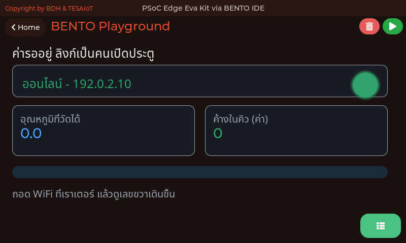

<div style="font-size:.56em;color:#78909c;margin-top:-.3em">ภาพจากตัวจำลอง bento_sim — โค้ด CM55 ชุดเดียวกับที่รันบนบอร์ด ที่ 800x480 เท่าจอของทั้งสองบอร์ด · ค่าอุณหภูมิและสถานะลิงก์เป็นค่าแทนบนเครื่องโฮสต์ ไม่ใช่ผลการวัดของบอร์ด</div>

แถบบนคือลิงก์ (ออนไลน์พร้อม IP หรือหลุด) · การ์ดซ้ายคืออุณหภูมิที่วัดได้รอบล่าสุด · การ์ดขวาคือ **จำนวนค่าที่ค้างอยู่ในคิว** — ตัวเลขที่เดินขึ้นตอนลิงก์หลุด และไหลออกทีละค่าเมื่อลิงก์กลับมา

> ลองบนโต๊ะ: ถอด WiFi ที่เราเตอร์ แล้วดูเลขคิวเดินขึ้น เสียบกลับแล้วดูมันไหลออก

---

## รหัสผ่านของห้องเรียน ไม่ควรอยู่ในโค้ด — `ui.Keyboard`

<style scoped>section table{font-size:.68em} section p{margin:.1em 0}</style>

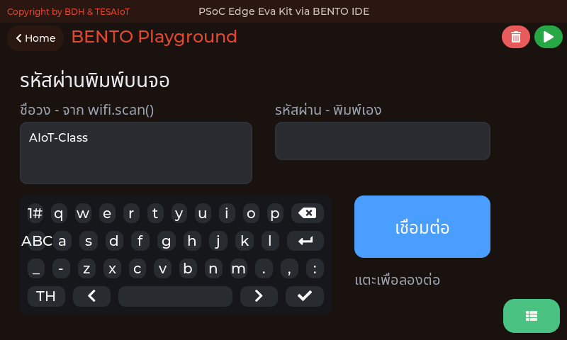

<div style="font-size:.54em;color:#78909c;margin-top:-.3em">ภาพจากตัวจำลอง bento_sim ซึ่งเรนเดอร์ด้วยโค้ด CM55 ชุดเดียวกับที่รันบนบอร์ด ที่ 800x480 เท่าจอของทั้งสองบอร์ด — แสดง<b>หน้าจอที่ <a href="https://github.com/tesaiot/tesa-qualification-program/blob/main/courses/aiot-micropython/m04-iot-connectivity/l03-network-status-lab/examples/10_keyboard_types_the_password.py"><code>10_keyboard_types_the_password.py</code></a> สร้าง</b> ชื่อวงในช่องซ้ายบนเครื่องโฮสต์เป็นค่าแทน บนบอร์ดจริงมันมาจาก <code>wifi.scan()</code></div>

**14 ส.ค. 2026 บอร์ดสแกนเจอ 18 วง และไม่มีวงที่ตัวอย่างใช้อยู่ในนั้นเลย** (`HARDWARE_CHECKLIST.md` ข้อ 6) ทั้งห้องค้างที่ป้าย "กำลังต่อ" พร้อมกัน เพราะ `WIFI_SSID` กับ `WIFI_PASS` เขียนตายอยู่ในไฟล์ทุกไฟล์ของบทเรียน 4.1–5.3 — **ของจริงทุกตัวที่ต่อ WiFi ได้ ถามรหัสผ่านจากคน ไม่ได้ฝังมาจากโรงงาน**

| ชิ้นส่วน | หน้าที่ |
|---|---|
| `ui.Textarea` | ช่องที่ตัวอักษรไปโผล่ |
| `ui.Keyboard` | แป้นพิมพ์เต็มบนจอ |
| `kb.bind(ta)` | บอกแป้นพิมพ์ว่าจะพิมพ์ลงช่องไหน — แป้นหนึ่งอันผูกได้ทีละช่องเดียว |
| `.prop(ui.PROP_PASSWORD, 1)` | โหมดดาว คนที่ยืนข้าง ๆ ไม่ควรอ่านรหัสออก |

> สร้าง `Textarea` ก่อน `Keyboard` เสมอ — `.bind()` ไปยังแฮนเดิลที่ยังไม่ใช่ Textarea ถูก CM55 ปฏิเสธเงียบ ๆ

---

## `ui.Keyboard` — เงียบจนกว่าจะขอ และอ่านกลับได้แล้ว

```python
kb = ui.Keyboard(x=24, y=200, w=440, h=168, color=COL_TEXT)
kb.bind(ta_pass)
kb.listen("ready", "cancel")
...
        pw = ta_pass.text()
```

| กติกา | สิ่งที่เกิดจริง |
|---|---|
| **ไม่ขอ ไม่ส่ง** | แป้นพิมพ์ไม่ส่ง event เองจนกว่าจะ `kb.listen("ready", "cancel")` — ปุ่มตกลงกับปุ่มปิดจึงรายงานกลับมา ค่าตั้งต้นคือเงียบ เพราะคิวเหตุการณ์มี 16 ช่อง |
| **ตัวอักษรทีละตัวไม่ส่ง** | และนั่นถูกแล้ว — สิ่งที่โปรแกรมต้องรู้คือข้อความทั้งช่อง ไม่ใช่ปุ่มทีละใบ |
| **อ่านกลับด้วย `ta.text()`** ไม่ใส่อาร์กิวเมนต์ | คืนสตริงที่อยู่ในช่องเดี๋ยวนั้น (`GET_TEXT`, opcode `0x6B` ใน `ipc_ui_protocol.h`) — ไฟล์นี้จึงต่อด้วยรหัสที่พิมพ์จริง ไม่ใช่ค่าคงที่ |

จนถึง 15 ส.ค. 2026 ตาราง `IPC_CMD_UI_*` มี `SET_TEXT` (0x52) แต่ไม่มีคำสั่งอ่านกลับ หลักสูตรจึงเคยสอนว่า "สิ่งที่พิมพ์ คนอ่านได้ โปรแกรมอ่านไม่ได้" — ตอนนี้ไม่จริงแล้ว · ถ้าต้องประกอบสตริงจากปุ่มทีละใบด้วยเหตุผลอื่น `ui.ButtonMatrix` ยังทำได้ โดยส่ง `value_changed` พร้อม**ลำดับปุ่ม**กลับมา · อีกทางคือ SoftAP แล้วกรอกจากมือถือ ตาม [`08_softap_fallback.py`](https://github.com/tesaiot/tesa-qualification-program/blob/main/courses/aiot-micropython/m04-iot-connectivity/l02-network-status-code/examples/08_softap_fallback.py)

> **เลขที่ทำให้ต้องคิดเรื่องนี้ตั้งแต่ออกแบบ** — เป้าสัมผัสตามเกณฑ์คือ 88 พิกเซล แป้นพิมพ์มีสี่แถว 4 x 88 = **352 พิกเซล** ซึ่งกินพื้นที่วาด 398 ไปเกือบหมด ปุ่มบนแป้นพิมพ์จึงเล็กกว่าเกณฑ์เสมอบนจอ 4.3 นิ้ว นี่เป็นข้อจำกัดของขนาดจอ ไม่ใช่ของ widget

---

## หน้าจอของทุกไฟล์ในชุดบทเรียนนี้ (1/3)

<style scoped>
section img { margin: 0 .3em; }
section p { margin: .2em 0; }
</style>

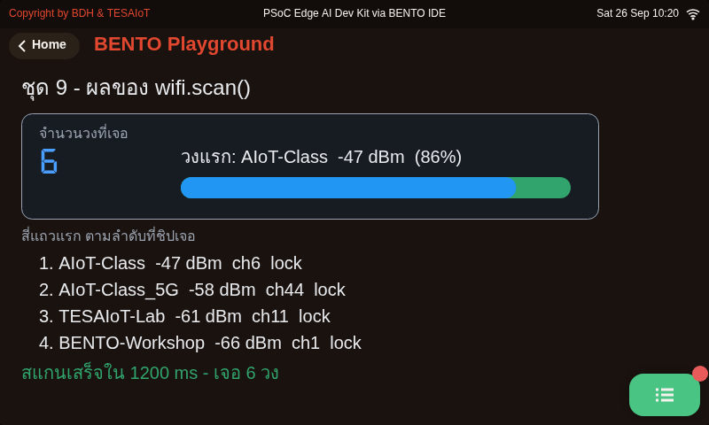 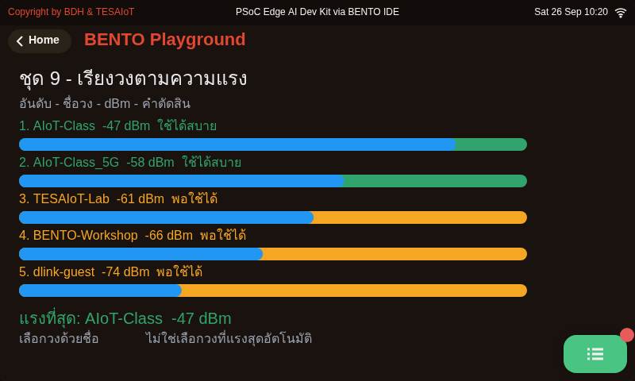 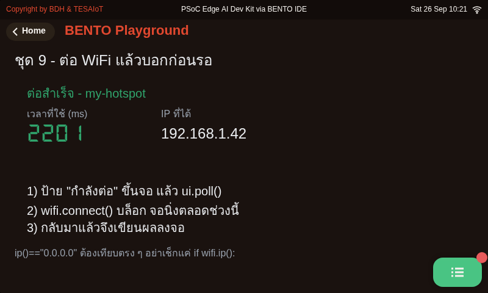

<div style="font-size:.56em;color:#90a4ae"><b>01</b> ผลของ wifi.scan() หน้าตาเป็นอย่างไร · <b>02</b> เรียงวงจากแรงไปอ่อน แล้วแปลง dBm ให้คนอ่านออก · <b>03</b> บอกก่อนแล้วค่อยรอ เพราะ connect() บล็อก</div>

<div style="font-size:.52em;color:#78909c;margin-top:.4em">ภาพจากตัวจำลอง bento_sim ซึ่งเรนเดอร์ด้วยโค้ด CM55 ชุดเดียวกับที่รันบนบอร์ด ที่ 800x480 เท่าจอของทั้งสองบอร์ด — แสดง<b>หน้าจอที่ตัวอย่างสร้าง</b> ค่าจากเซนเซอร์ WiFi และไมค์เป็นค่าแทนบนเครื่องโฮสต์ ไม่ใช่ผลการวัดของบอร์ด</div>

---

## หน้าจอของทุกไฟล์ในชุดบทเรียนนี้ (2/3)

<style scoped>
section img { margin: 0 .3em; }
section p { margin: .2em 0; }
</style>

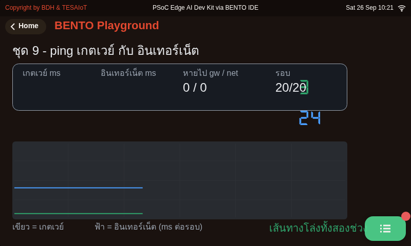 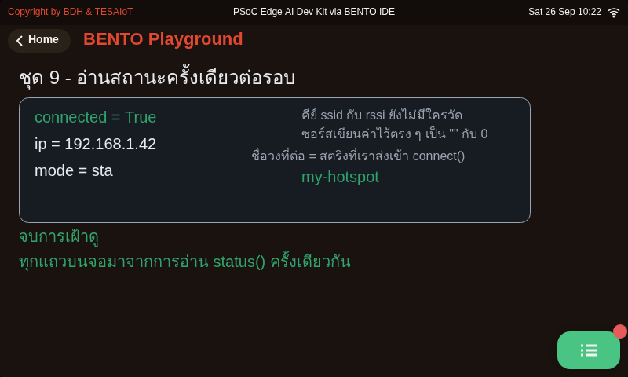 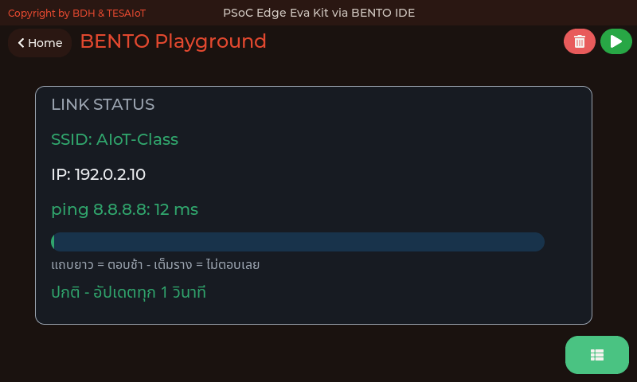

<div style="font-size:.56em;color:#90a4ae"><b>04</b> เกตเวย์ตอบ แต่อินเทอร์เน็ตไม่ตอบ แปลว่าอะไร · <b>05</b> อ่านสถานะครั้งเดียว แล้วใช้ค่าชุดนั้นทั้งรอบ · <b>06</b> หน้าจอสถานะลิงก์ ที่ทุกตัวเลขบนจอวัดมาจริง</div>

<div style="font-size:.52em;color:#78909c;margin-top:.4em">ภาพจากตัวจำลอง bento_sim ซึ่งเรนเดอร์ด้วยโค้ด CM55 ชุดเดียวกับที่รันบนบอร์ด ที่ 800x480 เท่าจอของทั้งสองบอร์ด — แสดง<b>หน้าจอที่ตัวอย่างสร้าง</b> ค่าจากเซนเซอร์ WiFi และไมค์เป็นค่าแทนบนเครื่องโฮสต์ ไม่ใช่ผลการวัดของบอร์ด</div>

---

## หน้าจอของทุกไฟล์ในชุดบทเรียนนี้ (3/3)

<style scoped>
section img { margin: 0 .3em; }
section p { margin: .2em 0; }
</style>

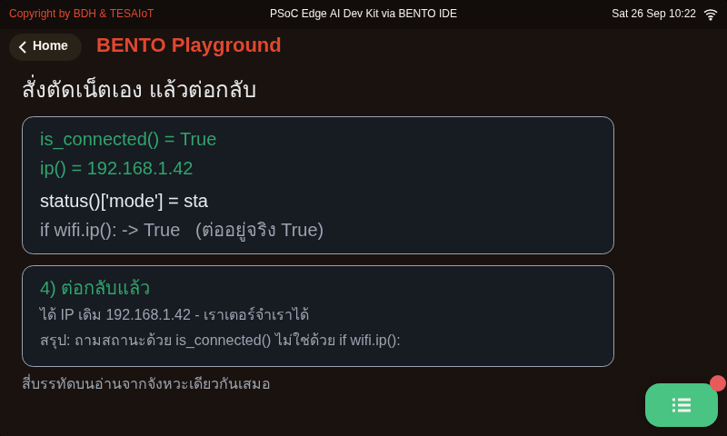 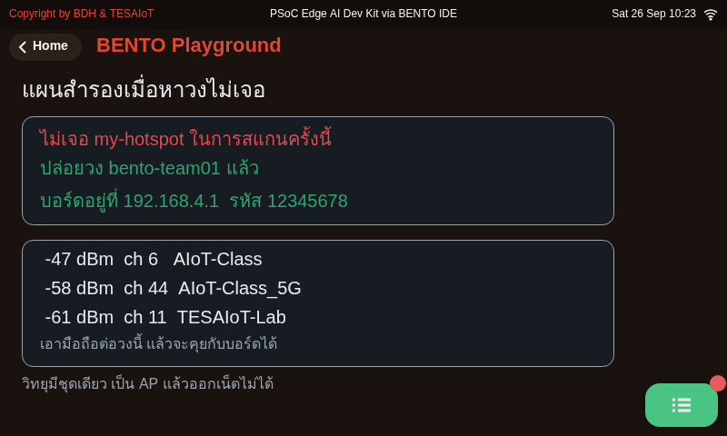

<div style="font-size:.56em;color:#90a4ae"><b>07</b> สร้างสถานะ "เน็ตหลุด" ขึ้นมาดูเองตามสั่ง · <b>08</b> ถ้าในห้องไม่มีวงให้ต่อ บอร์ดปล่อยวงของตัวเองได้</div>

<div style="font-size:.52em;color:#78909c;margin-top:.4em">ภาพจากตัวจำลอง bento_sim ซึ่งเรนเดอร์ด้วยโค้ด CM55 ชุดเดียวกับที่รันบนบอร์ด ที่ 800x480 เท่าจอของทั้งสองบอร์ด — แสดง<b>หน้าจอที่ตัวอย่างสร้าง</b> ค่าจากเซนเซอร์ WiFi และไมค์เป็นค่าแทนบนเครื่องโฮสต์ ไม่ใช่ผลการวัดของบอร์ด</div>

---

## อ้างอิงและเครดิต

<div style="display:flex;gap:30px;font-size:.8em">
<div style="flex:1 1 0">

**เอกสารและมาตรฐาน**

- MicroPython documentation
  <https://docs.micropython.org/en/latest/>
- KIT_PSE84_EVAL PSOC™ Edge E84 Evaluation Kit guide — Infineon, 002-39007 Rev. \*B (2025-09-10) · โมดูล WiFi/BT CYW55513IUBG
- TESAIoT Dev Kit — SoM ของ KIT_PSE84_AI บนฐาน QWA309 · วิทยุเป็นโมดูล Murata ที่ใช้ซิลิคอน CYW55513 ตัวเดียวกัน จึงเห็นย่าน 2.4/5 GHz และพฤติกรรม `scan()` `connect()` เหมือน Eva ทุกประการ (โค้ด `modwifi.c` เป็นชุดเดียวกัน)
- 802.11 Frame Exchanges — How I WI-FI
  <https://howiwifi.com/2020/07/16/802-11-frame-exchanges/>
- Understanding RSSI in Wi-Fi Networks — Oscium
  <https://www.oscium.com/training/resources/understanding-rssi/>
- Wi-Fi Signal Strength: That Cool -70 dBm — Dong Knows Tech
  <https://dongknows.com/wi-fi-signal-strength-dbm-explained/>
- 2.4GHz กับ 5GHz ต่างกันอย่างไร — ASUS ประเทศไทย
  <https://www.asus.com/th/support/faq/1044838/>

</div>
<div style="flex:1 1 0">

**วิดีโอ (ตรวจแล้วว่าเปิดได้)**

- Wireless Client Association Process — RUCKUS Education Services · `youtube.com/watch?v=WoUKXm9iG7k`
- DHCP DORA Procedure — CMSystemsBe · `youtube.com/watch?v=oD5nC2NhHWQ`
- DHCP DORA Process Explained — Sikandar Shaik CCIEx3 · `youtube.com/watch?v=ywkJepIQNIU`
- Wi-Fi 4-Way Handshake In Depth — Tall Paul Tech · `youtube.com/watch?v=vHIRmG_BzQI`

**ภาพจาก Wikimedia Commons** (ตามลำดับที่ปรากฏ) TaBaZzz · Sss41 · Kirlf (สเปกตรัม 2.4 GHz และ 5 GHz ที่วัดจริง, CC BY-SA 4.0) · Michael Gauthier, Wireless Networking in the Developing World · Superspritz · Gelmo96 · Michel Bakni · Aaron Filbert · Moeenrahi — CC BY-SA 3.0/4.0 ทั้งหมด วางทั้งภาพพร้อมเครดิต ไม่ได้ครอปหรือแก้ไข

ไดอะแกรมที่เหลือวาดขึ้นใหม่สำหรับหลักสูตรนี้ · ข้อเท็จจริงของโมดูล `wifi` ตรวจจากซอร์ส `modwifi.c` ใน `BENTO-TESAIoT-libraries` ซึ่งเป็นโค้ดร่วมของทั้ง Eva Kit และ TESAIoT Dev Kit — แปดชื่อ เพดาน 20 วง และกับดักทุกข้อในตารางจึงเหมือนกันสองบอร์ด · หน้า Wi-Fi Setting บนหน้า Home ก็เป็นหน้าเดียวกันทั้งคู่

</div>
</div>

> ทุกตัวเลขบนสไลด์นี้สืบกลับไปที่เอกสารต้นทางหรือซอร์สโค้ดได้ ถ้าเจอที่ไม่ตรง บอกผู้สอนได้เลย

---

## สองช่อง แป้นพิมพ์เดียว

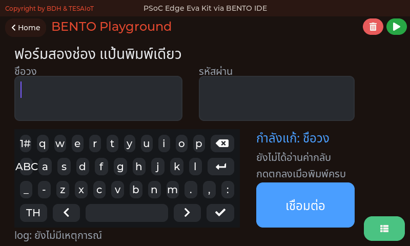

<div style="font-size:.54em;color:#78909c;margin-top:-.3em">ภาพจากตัวจำลอง Eva Kit (<code>KIT_PSE84_EVAL_EPC2-MicroPython-BentoClaw/sim</code>) ซึ่งรัน <code>ipc_ui.c</code> กับ <code>ui_widget_mgr.c</code> ตัวจริงเดียวกับบอร์ด บนพื้นที่วาด 792×398 (ขนาดเดียวกันบน Dev Kit) · แสดง<b>หน้าจอที่ตัวอย่างสร้าง</b> — หน้าจอของ <a href="https://github.com/tesaiot/tesa-qualification-program/blob/main/courses/aiot-micropython/m04-iot-connectivity/l03-network-status-lab/examples/11_two_fields_one_keyboard.py"><code>11_two_fields_one_keyboard.py</code></a> · ค่าที่เห็นในภาพมาจากเซนเซอร์จำลองบนเครื่องโฮสต์ ไม่ใช่ผลการวัดของบอร์ด</div>

ฟอร์มจริงมีมากกว่าหนึ่งช่อง แต่จอนี้ใส่แป้นพิมพ์ได้ใบเดียว — เหตุการณ์สองชนิดพอสำหรับทั้งฟอร์ม

| ชนิด | ใช้ทำอะไร |
|---|---|
| **`focused`** | รู้ว่าผู้ใช้แตะช่องไหน แล้วผูกแป้นพิมพ์ไปที่ช่องนั้น |
| **`ready`** | ผู้ใช้กดปุ่มตกลง — พิมพ์เสร็จแล้ว |

**`ta.text()` ที่ไม่ใส่อาร์กิวเมนต์ อ่านสิ่งที่ผู้ใช้พิมพ์กลับมาได้** (`GET_TEXT`, opcode `0x6B`) · ตัวอักษรแต่ละตัวที่แตะ **ไม่** ส่งเหตุการณ์มาทีละตัว และนั่นถูกแล้ว — สิ่งที่โปรแกรมต้องรู้คือข้อความทั้งช่อง ไม่ใช่ปุ่มทีละใบ

> แป้นพิมพ์ใบเดียวย้ายไปตามช่องที่ถูกแตะ — `focused` คือเหตุการณ์ที่บอกว่าต้อง `bind()` ใหม่
