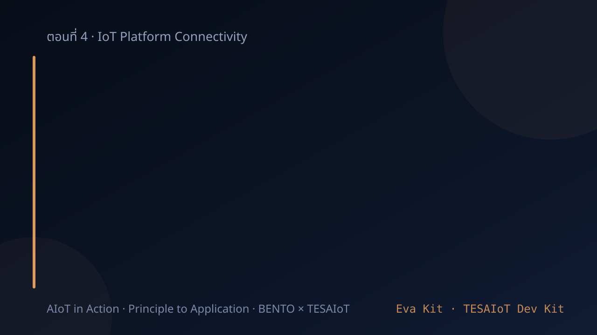
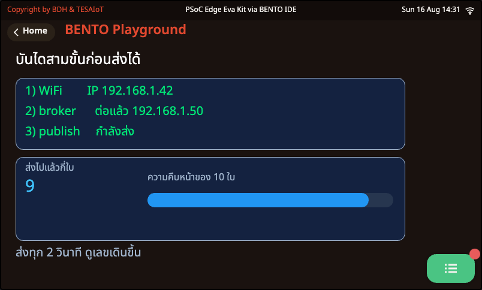
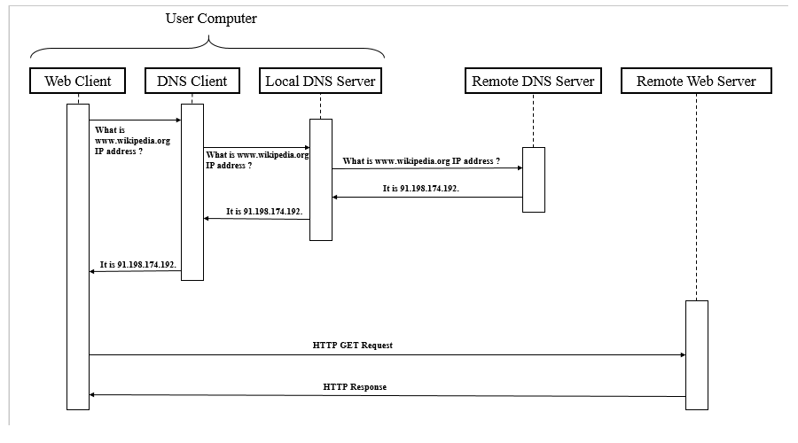
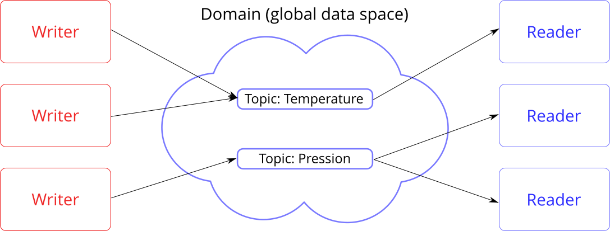
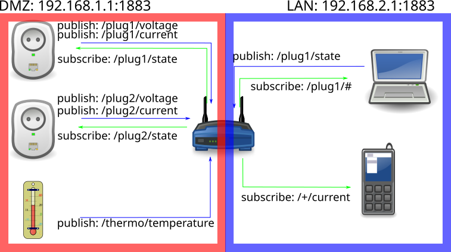
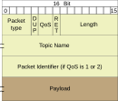

<!-- _class: cover -->

# บทเรียน 4.4 — MQTT: pub/sub topic QoS และงบข้อมูล

## Telemetry ขาออก และ Command ขากลับ บน broker ของเราเอง

**โมดูล 4 — เชื่อมต่อแพลตฟอร์ม IoT**

> คาถาประจำบทเรียน: **ส่งข้อมูลออกไปได้ ยังไม่พอ — ต้องรับคำสั่งกลับมาได้ด้วย ถึงจะเรียกว่าระบบ**

---

## ดูของจริงก่อน — บอร์ดคุยกับคอมพิวเตอร์คนละเครื่อง

<svg viewBox="0 0 940 250" xmlns="http://www.w3.org/2000/svg">
  <rect x="20" y="58" width="190" height="140" rx="10" fill="#132033" stroke="#3d5a80" stroke-width="2"/>
  <text x="115" y="86" text-anchor="middle" font-size="20" font-weight="700" fill="#8fb8e0">บอร์ดของเรา</text>
  <text x="115" y="112" text-anchor="middle" font-size="18" fill="#6b8fb5">อ่านเซนเซอร์</text>
  <text x="115" y="136" text-anchor="middle" font-size="18" fill="#6b8fb5">แล้ว publish</text>
  <circle cx="80" cy="170" r="11" fill="#e53935"><animate attributeName="r" values="6;11;6" dur="2.4s" repeatCount="indefinite"/></circle>
  <text x="102" y="176" font-size="18" fill="#94a1bf">LED ที่ถูกสั่ง</text>
  <rect x="378" y="58" width="184" height="140" rx="10" fill="#e3f2fd" stroke="#1565c0" stroke-width="2.5"/>
  <text x="470" y="92" text-anchor="middle" font-size="22" font-weight="700" fill="#1565c0">Broker</text>
  <text x="470" y="122" text-anchor="middle" font-size="18" fill="#0d47a1">พอร์ต 1883</text>
  <text x="470" y="148" text-anchor="middle" font-size="18" fill="#0d47a1">ตัวกลางเพียงตัวเดียว</text>
  <text x="470" y="176" text-anchor="middle" font-size="17" fill="#5472a3">ไม่เก็บ ไม่ตัดสิน แค่ส่งต่อ</text>
  <rect x="730" y="58" width="190" height="140" rx="10" fill="#f3e5f5" stroke="#6a1b9a" stroke-width="2"/>
  <text x="825" y="86" text-anchor="middle" font-size="20" font-weight="700" fill="#6a1b9a">MQTT Explorer</text>
  <text x="825" y="112" text-anchor="middle" font-size="18" fill="#4a148c">บนคอมของเรา</text>
  <text x="825" y="136" text-anchor="middle" font-size="18" fill="#4a148c">เห็นทุกข้อความ</text>
  <text x="825" y="164" text-anchor="middle" font-size="17" fill="#7e5a94">และพิมพ์คำสั่งกลับได้</text>
  <line x1="214" y1="96" x2="372" y2="96" stroke="#2e7d32" stroke-width="3"/>
  <polygon points="376,96 362,89 362,103" fill="#2e7d32"/>
  <line x1="566" y1="96" x2="724" y2="96" stroke="#2e7d32" stroke-width="3"/>
  <polygon points="728,96 714,89 714,103" fill="#2e7d32"/>
  <circle r="8" fill="#2e7d32" cx="214" cy="96"><animateMotion path="M0,0 L256,0 L510,0" dur="3s" repeatCount="indefinite"/><animate attributeName="r" values="6;11;6" dur="3s" repeatCount="indefinite"/></circle>
  <text x="470" y="42" text-anchor="middle" font-size="19" font-weight="700" fill="#2e7d32">PUBLISH — ค่าเซนเซอร์ JSON ทุก 5 วินาที</text>
  <line x1="724" y1="160" x2="566" y2="160" stroke="#ef6c00" stroke-width="3"/>
  <polygon points="562,160 576,153 576,167" fill="#ef6c00"/>
  <line x1="372" y1="160" x2="214" y2="160" stroke="#ef6c00" stroke-width="3"/>
  <polygon points="210,160 224,153 224,167" fill="#ef6c00"/>
  <circle r="8" fill="#ef6c00" cx="724" cy="160"><animateMotion path="M0,0 L-254,0 L-510,0" dur="3s" begin="1.5s" repeatCount="indefinite"/><animate attributeName="r" values="6;11;6" dur="3s" begin="1.5s" repeatCount="indefinite"/></circle>
  <text x="470" y="232" text-anchor="middle" font-size="19" font-weight="700" fill="#ef6c00">คำสั่ง toggle LED — เดินสวนทางกลับมาที่บอร์ด</text>
</svg>

บทเรียน 4.1–4.3 บอร์ดของเราต่อเน็ตได้แล้ว รู้ IP ของตัวเอง และ ping ออกไปข้างนอกได้ แต่ยังไม่มีใครที่ปลายทาง

วันนี้เราจะเพิ่มปลายทางให้มัน — คอมพิวเตอร์อีกเครื่องที่อยู่คนละมุมห้อง ที่เห็นค่าจากบอร์ดเรา และสั่งงานกลับมาได้ โดยที่ทั้งสองเครื่องไม่เคยรู้จักที่อยู่ของกันและกันเลย

> วันนี้บอร์ดเลิกเป็นเครื่องมือวัดที่อยู่ตัวคนเดียว แล้วกลายเป็นสมาชิกของระบบ

---

## ทำไม · คืออะไร · ทำยังไง — แผนที่ของชุดบทเรียนนี้

| | คำถาม | คำตอบของชุดบทเรียนนี้ | อยู่ช่วงไหน |
|---|---|---|---|
| **Why** | บทเรียน 4.1–4.3 บอร์ดมี IP และ ping ออกไปได้แล้ว ทำไมยังไม่พอ | เพราะ ping พิสูจน์ได้แค่ว่าสายดี **ยังไม่มีใครที่ปลายทางรับข้อมูลของเรา** · และของที่ส่งออกได้อย่างเดียวยังไม่เรียกว่าระบบ ระบบต้องรับคำสั่งกลับมาได้ด้วย · ชื่อ topic กับรูปร่าง payload คือ **สัญญากับทุกคนที่จะใช้ข้อมูลนี้ต่อ** เปลี่ยนทีหลังแปลว่าพังทุกฝั่งพร้อมกัน | ครึ่งแรก · pub/sub · topic และ payload |
| **What** | มีอะไรให้ใช้บ้าง | โมดูล `mqtt` **มีหกชื่อ เท่านี้จริง ๆ** — และเพดานสี่ข้อที่ต้องจำคู่กันไป: ช่องรับ 1 ข้อความ · payload 255 ไบต์ · topic 127 ไบต์ · client_id 31 ตัวอักษร | สไลด์บัญชีหกชื่อ + สไลด์ `get_message()` ช่องเดียว |
| **How** | ประกอบยังไงให้ใช้งานได้จริง | ต่อ WiFi → ต่อ broker → `publish()` ค่าจริงทุก 5 วินาที **โดยที่ลูปเดียวกันยังฟัง `get_message()` อยู่** แล้วเอาคำสั่งที่รับมาสั่ง LED บนบอร์ด | แปดไฟล์ตัวอย่าง + ไฟล์ฝึก + ติดตั้ง CE ด้วย Docker |

**ปลายทางที่จับต้องได้** — MQTT Explorer บนคอมเห็นค่าจากบอร์ดทุก 5 วินาที และเราพิมพ์คำสั่งจากคอมกลับไปให้ LED บนบอร์ดสลับสถานะได้

> บทเรียน 4.1–4.3 เราพิสูจน์ว่าสายดี · ชุดบทเรียนนี้เราหาคนที่ปลายสายเจอ และคุยกันได้สองทาง

---

## เป้าหมายของชุดบทเรียนนี้

1. อธิบายได้ว่า **publish/subscribe ต่างจาก client–server** ตรงไหน และทำไม IoT ถึงเลือกแบบแรก
2. ออกแบบ **topic ของทีม** และ **JSON payload** ที่ขนาดพอเหมาะ พร้อมเหตุผลของทุกฟิลด์
3. ใช้ `mqtt.connect() / publish() / subscribe() / get_message()` ได้ถูกต้องตามข้อจำกัดจริงของเฟิร์มแวร์
4. ติดตั้ง **TESAIoT Community Edition** ด้วย Docker แล้วทำให้ข้อมูลของทีมขึ้นกราฟบนแพลตฟอร์มของตัวเอง

ปลายทางของวันนี้: MQTT Explorer เห็นค่าจากบอร์ดทุก 5 วินาที และเราพิมพ์คำสั่งจากคอมให้ LED บนบอร์ดสลับสถานะได้

> ชุดบทเรียนนี้เป็นบทเรียนแรกที่ข้อมูลของเรา **ออกจากบอร์ด** ไปอยู่ในมือของโปรแกรมอื่น

---

## ปลายทางของชุดบทเรียนนี้ — บอร์ดรายงานตัวขึ้น broker

หน้าจอจากการรัน <a href="https://github.com/tesaiot/tesa-qualification-program/blob/main/courses/aiot-micropython/m04-iot-connectivity/l05-mqtt-platform/examples/03_connect_and_publish.py"><code>03_connect_and_publish.py</code></a> บน BENTO Emulator ที่ 800x480 เท่าจอของทั้งสองบอร์ด — ไม่ใช่ภาพวาด ไม่ใช่ mock-up และไม่ใช่ภาพถ่ายจากบอร์ด · หน้าจอของไฟล์เฉลย (ไฟสี่ดวง · ลูกบิด · สามใบล่าสุด · ปุ่มเริ่ม/หยุดส่ง) ยังไม่ได้ถ่าย

- การ์ดบนคือ **บันไดสามขั้นก่อนส่งได้** — 1) WiFi ได้ IP · 2) broker ต่อแล้ว · 3) publish กำลังส่ง — ขั้นที่ผ่านแล้วต้องเห็นด้วยตา
- การ์ดล่างนับใบที่ส่งไปแล้ว พร้อมแถบความคืบหน้าของ 10 ใบ — ส่งทุก 2 วินาที ดูเลขเดินขึ้น
- ผลลัพธ์จริงของชุดบทเรียนนี้ไปโผล่ที่ **เครื่องอื่น** — จอนี้บอกได้แค่ว่าบอร์ด "สั่งส่ง" แล้ว

> ถ้าจอบอกว่าส่งแล้ว แต่ฝั่งรับไม่เห็นอะไร แปลว่ายังไม่จบ — ชุดบทเรียนนี้ต้องดูสองจอพร้อมกัน

---

## ทบทวนบทเรียน 4.1–4.3 — เราหยุดไว้ตรงไหน

<svg viewBox="0 0 940 200" xmlns="http://www.w3.org/2000/svg">
  <rect x="16" y="52" width="168" height="72" rx="8" fill="#e8f5e9" stroke="#2e7d32" stroke-width="2"/>
  <text x="100" y="82" text-anchor="middle" font-size="20" font-weight="700" fill="#2e7d32">wifi.scan()</text>
  <text x="100" y="108" text-anchor="middle" font-size="17" fill="#1b5e20">รู้ว่ามีใครอยู่แถวนี้</text>
  <rect x="204" y="52" width="168" height="72" rx="8" fill="#e8f5e9" stroke="#2e7d32" stroke-width="2"/>
  <text x="288" y="82" text-anchor="middle" font-size="20" font-weight="700" fill="#2e7d32">wifi.connect()</text>
  <text x="288" y="108" text-anchor="middle" font-size="17" fill="#1b5e20">เข้าเครือข่ายได้</text>
  <rect x="392" y="52" width="168" height="72" rx="8" fill="#e8f5e9" stroke="#2e7d32" stroke-width="2"/>
  <text x="476" y="82" text-anchor="middle" font-size="20" font-weight="700" fill="#2e7d32">wifi.ip()</text>
  <text x="476" y="108" text-anchor="middle" font-size="17" fill="#1b5e20">มีที่อยู่เป็นของตัวเอง</text>
  <rect x="580" y="52" width="168" height="72" rx="8" fill="#e8f5e9" stroke="#2e7d32" stroke-width="2"/>
  <text x="664" y="82" text-anchor="middle" font-size="20" font-weight="700" fill="#2e7d32">wifi.ping()</text>
  <text x="664" y="108" text-anchor="middle" font-size="17" fill="#1b5e20">ออกไปข้างนอกถึง</text>
  <rect x="768" y="44" width="158" height="88" rx="8" fill="#fff3e0" stroke="#ef6c00" stroke-width="3"/>
  <text x="847" y="76" text-anchor="middle" font-size="20" font-weight="700" fill="#ef6c00">วันนี้</text>
  <text x="847" y="100" text-anchor="middle" font-size="17" fill="#e65100">mqtt.publish()</text>
  <text x="847" y="122" text-anchor="middle" font-size="17" fill="#e65100">mqtt.subscribe()</text>
  <line x1="186" y1="88" x2="200" y2="88" stroke="#90a4ae" stroke-width="2"/>
  <line x1="374" y1="88" x2="388" y2="88" stroke="#90a4ae" stroke-width="2"/>
  <line x1="562" y1="88" x2="576" y2="88" stroke="#90a4ae" stroke-width="2"/>
  <line x1="750" y1="88" x2="764" y2="88" stroke="#ef6c00" stroke-width="3"/>
  <circle r="7" fill="#ef6c00" cx="100" cy="144"><animateMotion path="M0,0 L188,0 L376,0 L564,0 L747,0" dur="2.2s" repeatCount="indefinite"/><animate attributeName="r" values="6;11;6" dur="2.2s" repeatCount="indefinite"/></circle>
  <text x="470" y="26" text-anchor="middle" font-size="20" font-weight="700" fill="#455a64">บทเรียน 4.1–4.3 ต่อท่อได้ · บทเรียน 4.4–4.6 เริ่มมีของไหลในท่อ</text>
  <text x="470" y="172" text-anchor="middle" font-size="18" fill="#78909c">ping พิสูจน์แค่ว่า "เส้นทางถึง" — ไม่ได้แปลว่ามีโปรแกรมไหนรอรับข้อมูลของเราอยู่</text>
</svg>

สองอย่างจากชุดบทเรียนก่อนหน้าที่ต้องเอามาใช้วันนี้ทั้งคู่ — **`wifi.connect()` บล็อกได้นานถึงราว 85 วินาทีถ้ารหัสผิด** จึงต้องต่อ WiFi ให้ได้ก่อนเสมอแล้วค่อยเริ่มเรื่อง MQTT และ **`wifi.ping()` รับเฉพาะหมายเลข IP** ไม่รับชื่อโฮสต์ — เดี๋ยวเราจะใช้มันตรวจว่าเครื่องที่รัน broker อยู่ในระยะที่คุยได้จริงก่อนจะเสียเวลาต่อ

> ถ้า `wifi.is_connected()` เป็น False อย่าเพิ่งไปหาสาเหตุที่ MQTT — ปัญหายังไม่เดินทางมาถึงชั้นนั้น

---

## client–server กับ pub/sub ต่างกันตรงไหน

 

ซ้าย — ภาพ: Michel Bakni / Wikimedia Commons — CC BY-SA 4.0 · ขวา — ภาพ: Mathieu.clabaut / Wikimedia Commons — CC BY-SA 4.0

**ซ้าย คือแบบที่เราคุ้น (client–server)** เว็บเบราว์เซอร์ต้องรู้ชื่อเซิร์ฟเวอร์ ต้องถามก่อนถึงจะได้คำตอบ ผู้ถามกับผู้ตอบ **ผูกกันตรง ๆ** ถ้าอีกฝั่งย้ายที่อยู่ ทุกฝั่งต้องแก้ตาม

**ขวา คือ publish/subscribe** ผู้เขียน (writer) โยนข้อมูลใส่ *ชื่อเรื่อง* ผู้อ่าน (reader) ขอรับตาม *ชื่อเรื่อง* — ทั้งสองฝั่งไม่เคยรู้จักกัน รู้จักแค่ชื่อเรื่องเดียวกัน

ผลที่ตามมาสามข้อ ซึ่งเป็นเหตุผลที่ IoT เลือกแบบหลัง

1. **บอร์ดไม่ต้องมี IP ที่คนอื่นเข้าถึงได้** — บอร์ดเป็นฝ่ายวิ่งออกไปหา broker เอง จึงอยู่หลัง NAT หรือหลังไฟร์วอลล์ได้
2. **เพิ่มผู้รับได้โดยไม่แตะโค้ดบนบอร์ด** — พรุ่งนี้อยากให้แดชบอร์ดตัวที่สองดูข้อมูลเดียวกัน แค่ subscribe เพิ่ม
3. **ผู้รับล่มไม่ทำให้ผู้ส่งล่ม** — บอร์ดยิงเข้า broker เหมือนเดิม ไม่มีใครค้างรอใคร

> คำที่ต้องจำ: pub/sub **แยกผู้ส่งออกจากผู้รับ ทั้งในเชิงพื้นที่และเชิงเวลา**

---

## broker อยู่ตรงกลาง — และมีคำสั่งอยู่แค่ไม่กี่คำ

ภาพ: Brivadeneira / Wikimedia Commons — CC BY-SA 4.0

`CONNECT` เข้าไปแนะนำตัว → `SUBSCRIBE` ขอรับ topic ที่สนใจ → `PUBLISH` ส่งข้อมูล → `DISCONNECT` บอกลา
สี่คำนี้คือทั้งหมดที่ผู้เรียนต้องใช้วันนี้ ที่เหลือ broker จัดการให้เอง

**อะไรคือ MQTT ?** — code maow maow | โค้ดแมวแมว · 8 นาที 26 วินาที · ไทย — ดูเพื่อเห็นภาพรวมของ broker/publisher/subscriber เป็นภาษาไทยก่อนลงมือ

<iframe width="300" height="169" src="https://www.youtube.com/embed/qVLOZYzBU-g" title="อะไรคือ MQTT ?" loading="lazy" frameborder="0" allowfullscreen></iframe>

> broker ไม่ใช่ฐานข้อมูล มันคือ **ที่ทำการไปรษณีย์** — รับเข้ามาแล้วส่งต่อทันที ไม่เก็บไว้ให้ (เว้นแต่สั่งให้เก็บ)

---

## topic คือที่อยู่ — และมันเป็นต้นไม้ ไม่ใช่ชื่อแบน ๆ

ภาพ: Ademant / Wikimedia Commons — CC BY-SA 4.0 — ในภาพมีทั้งลำดับชั้น topic และ wildcard ทั้งสองแบบ

ในภาพ ปลั๊กสองตัวส่ง `/plug1/voltage`, `/plug2/current` ส่วนแล็ปท็อป subscribe `/plug1/#` และมือถือ subscribe `/+/current`
`#` = ทุกอย่างที่อยู่ใต้ลงไปกี่ชั้นก็ได้ (ต้องเป็นตัวสุดท้าย) · `+` = แทนที่ **หนึ่งชั้นพอดี**

**MQTT Essentials Part 6 — Topic Best Practices** — HiveMQ · 5 นาที 50 วินาที · อังกฤษ — ดูเพื่อเข้าใจว่าทำไม topic ที่ออกแบบดีทำให้ระบบขยายได้โดยไม่ต้องแก้โค้ดฝั่งอุปกรณ์

<iframe width="290" height="163" src="https://www.youtube.com/embed/juq_l70Vg1w" title="MQTT Essentials Part 6 - MQTT Topic Best Practices" loading="lazy" frameborder="0" allowfullscreen></iframe>

> topic ไม่ต้องประกาศล่วงหน้า — พิมพ์ publish ไปที่ชื่อไหน ชื่อนั้นก็เกิดขึ้นเดี๋ยวนั้น จึงต้องมีวินัยตั้งชื่อเอง

---

## เข้าใจฮาร์ดแวร์ · MQTT วิ่งอยู่ตรงไหนบนบอร์ด

<svg viewBox="0 0 940 306" xmlns="http://www.w3.org/2000/svg">
  <rect x="14" y="30" width="430" height="210" rx="12" fill="#e3f2fd" stroke="#1565c0" stroke-width="2.5"/>
  <text x="229" y="60" text-anchor="middle" font-size="22" font-weight="700" fill="#1565c0">CM33_NS — คอร์ที่รัน MicroPython</text>
  <rect x="36" y="76" width="180" height="52" rx="7" fill="#fff" stroke="#1565c0" stroke-width="1.5"/>
  <text x="126" y="98" text-anchor="middle" font-size="18" fill="#0d47a1">โค้ด Python ของเรา</text>
  <text x="126" y="118" text-anchor="middle" font-size="17" fill="#5472a3">ลูป publish/poll</text>
  <rect x="240" y="76" width="182" height="52" rx="7" fill="#fff" stroke="#1565c0" stroke-width="1.5"/>
  <text x="331" y="98" text-anchor="middle" font-size="18" fill="#0d47a1">งานเครือข่าย TCP</text>
  <text x="331" y="118" text-anchor="middle" font-size="17" fill="#5472a3">บัฟเฟอร์ 2048 ไบต์</text>
  <rect x="36" y="146" width="386" height="46" rx="7" fill="#fff" stroke="#1565c0" stroke-width="1.5"/>
  <text x="229" y="176" text-anchor="middle" font-size="18" fill="#0d47a1">ไดรเวอร์ WiFi — วิทยุตัวเดียวของทั้งบอร์ด</text>
  <text x="229" y="216" text-anchor="middle" font-size="18" fill="#5472a3">MPY heap 64 KB</text>
  <rect x="500" y="30" width="426" height="210" rx="12" fill="#e8f5e9" stroke="#2e7d32" stroke-width="2.5"/>
  <text x="713" y="60" text-anchor="middle" font-size="22" font-weight="700" fill="#2e7d32">CM55 — คอร์ที่วาดจอและอ่านเซนเซอร์</text>
  <text x="713" y="92" text-anchor="middle" font-size="18" fill="#1b5e20">อ่าน CapSense / pot ให้เรา · BMI270 ด้วยบน Eva</text>
  <text x="713" y="118" text-anchor="middle" font-size="18" fill="#1b5e20">วาดผลบนจอผ่าน LVGL</text>
  <text x="713" y="146" text-anchor="middle" font-size="18" fill="#1b5e20">ไม่แตะเครือข่ายเลยแม้แต่นิดเดียว</text>
  <line x1="448" y1="176" x2="496" y2="176" stroke="#455a64" stroke-width="3"/>
  <line x1="496" y1="176" x2="448" y2="176" stroke="#455a64" stroke-width="3"/>
  <circle r="7" fill="#455a64" cx="448" cy="176"><animateMotion path="M0,0 L46,0 L0,0" dur="2s" repeatCount="indefinite"/><animate attributeName="r" values="6;11;6" dur="2s" repeatCount="indefinite"/></circle>
  <text x="713" y="182" text-anchor="middle" font-size="17" fill="#4a7c4e">ค่าเซนเซอร์เดินข้ามมาทาง IPC ก่อนจะถูก publish</text>
  <text x="713" y="208" text-anchor="middle" font-size="18" font-weight="700" fill="#2e7d32">ข้อความขาเข้าถูกวางในช่องรับโดยงานเครือข่าย</text>
  <text x="713" y="230" text-anchor="middle" font-size="17" fill="#4a7c4e">ไม่ว่าโค้ด Python ของเราจะอยู่บรรทัดไหนก็ตาม</text>
  <text x="470" y="272" text-anchor="middle" font-size="19" font-weight="700" fill="#c62828">โมดูล mqtt ต่อได้เฉพาะพอร์ตข้อความเปล่า — ทั้ง Eva และ Dev Kit</text>
  <text x="470" y="296" text-anchor="middle" font-size="18" fill="#8d6e63">นี่คือเหตุผลที่ชุดบทเรียนนี้เป็นพอร์ต 1883 ล้วน ยังไม่ใช่ 8883/8884 — TLS อยู่ชุดบทเรียนถัดไปในโมดูล tesaiot</text>
</svg>

ทั้ง WiFi และ MQTT ทำงานอยู่บน **CM33_NS คอร์เดียวกับที่รันโค้ด Python ของเรา** ส่วน CM55 ที่วาดจอกับอ่านเซนเซอร์ไม่แตะเครือข่ายเลย — ทั้งสองบอร์ดจงใจอย่างนั้น เพราะสองคอร์แย่งอุปกรณ์ตัวเดียวกันเคยทำให้เครื่องล้มมาแล้ว · ภาพนี้จริงทั้ง Eva Kit และ Dev Kit เพราะโค้ด Wi-Fi/MQTT เป็นชุดเดียวกัน ต่างกันแค่ใครอ่าน IMU (Eva: คอร์จออ่านให้ · Dev Kit: CM33 อ่านเองจาก I2C) · เหตุผลที่ชุดบทเรียนนี้ใช้ 1883 ไม่ใช่เรื่องหน่วยความจำ แต่เพราะโมดูล `mqtt` ส่งข้อมูลรับรอง TLS เป็นค่าว่างเสมอ (ดูตารางหกชื่อ) จึงต่อได้เฉพาะพอร์ตข้อความเปล่าบนบอร์ดไหนก็ตาม

ข้อที่ต้องจำให้แม่น: **งานเครือข่ายวางข้อความขาเข้าลงช่องรับ "เมื่อไรก็ได้"** ไม่ได้รอให้โค้ดเราเรียก `get_message()` ก่อน — สไลด์ถัดไปทั้งสไลด์มาจากข้อเท็จจริงข้อนี้

> เครือข่ายกับหน้าจออยู่คนละคอร์ — ถ้าจอค้าง MQTT อาจยังวิ่งอยู่ และในทางกลับกันด้วย

<!-- หน่วยความจำ: บน Eva TLS ต้องการราว 8.8 KB ขณะที่ตอนจับมือมีที่ว่างจริงราว 7 KB ส่วนบน Dev Kit heap ของ MicroPython ถูกย้ายไปอยู่ใน SOCMEM จึงไม่บีบเท่ากัน — แต่นั่นไม่ใช่เหตุผลที่ชุดบทเรียนนี้ใช้ 1883 -->

---

## เกร็ด: หัวข้อความสองไบต์ กับมาตรฐานที่ใช้เวลาสิบห้าปี

ภาพ: Blacktron / Wikimedia Commons — CC BY-SA 4.0 — โครงสร้างแพ็กเก็ต PUBLISH

ดูแถวบนสุดของภาพ: **16 บิต = 2 ไบต์** นั่นคือส่วนหัวคงที่ของ MQTT ทั้งหมด — ชนิดแพ็กเก็ต, ธง DUP, ระดับ QoS, ธง RETAIN และความยาว อัดอยู่ในสองไบต์นั้น

เทียบกับ HTTP ที่ส่วนหัวเป็นข้อความยาวหลายร้อยไบต์ต่อคำขอหนึ่งครั้ง ("GET /… HTTP/1.1", "Host:", "User-Agent:", …) ความต่างนี้ไม่ใช่เรื่องความสวยงาม แต่คือ **ค่าไฟกับค่าเน็ตของอุปกรณ์ที่ต้องส่งข้อมูลทุกห้าวินาที เป็นปี**

มาตรฐานเองก็ไม่ได้เกิดในวันเดียว: MQTT **3.1.1 ถูกอนุมัติเป็นมาตรฐาน OASIS เมื่อ 2014-10-29** และ **5.0 เมื่อ 2019-03-07** เวอร์ชันที่อุปกรณ์ฝังตัวใช้กันแพร่หลายที่สุดจนถึงวันนี้ยังเป็น 3.1.1

**เชื่อมกับวันนี้:** payload ของเราจะยาวราว 80 ไบต์ ส่วนหัว MQTT กินเพิ่มแค่หลักหน่วยไบต์ — ถ้าเราเลือก HTTP แทน ข้อมูลจริงจะกลายเป็นส่วนน้อยของสิ่งที่ส่งออกไป และแบตเตอรี่จะหมดไปกับการส่ง "ชื่อหัวข้อ" ของข้อมูล ไม่ใช่ตัวข้อมูล

---

## กลไกหลักของชุดบทเรียน — `get_message()` มีช่องรับเพียงช่องเดียว

<svg viewBox="0 0 940 270" xmlns="http://www.w3.org/2000/svg">
  <text x="20" y="28" font-size="20" font-weight="700" fill="#c62828">สถานการณ์: สองข้อความมาถึงติด ๆ กัน ก่อนที่เราจะเรียก get_message()</text>
  <rect x="20" y="46" width="200" height="52" rx="8" fill="#fff3e0" stroke="#ef6c00" stroke-width="2"/>
  <text x="120" y="70" text-anchor="middle" font-size="18" font-weight="700" fill="#ef6c00">ข้อความ A</text>
  <text x="120" y="90" text-anchor="middle" font-size="17" fill="#e65100">{"cmd":"on"}</text>
  <rect x="20" y="118" width="200" height="52" rx="8" fill="#fff3e0" stroke="#ef6c00" stroke-width="2"/>
  <text x="120" y="142" text-anchor="middle" font-size="18" font-weight="700" fill="#ef6c00">ข้อความ B</text>
  <text x="120" y="162" text-anchor="middle" font-size="17" fill="#e65100">{"cmd":"off"}</text>
  <rect x="390" y="70" width="210" height="90" rx="10" fill="#eceff1" stroke="#455a64" stroke-width="2.5"/>
  <text x="495" y="98" text-anchor="middle" font-size="20" font-weight="700" fill="#37474f">ช่องรับ 1 ช่อง</text>
  <text x="495" y="126" text-anchor="middle" font-size="18" fill="#546e7a">≤ 255 ไบต์</text>
  <text x="495" y="148" text-anchor="middle" font-size="17" fill="#78909c">เขียนทับเสมอ</text>
  <circle r="9" fill="#ef6c00" cx="228" cy="72"><animateMotion path="M0,0 L158,33" dur="3s" repeatCount="indefinite"/><animate attributeName="r" values="6;11;6" dur="3s" repeatCount="indefinite"/></circle>
  <circle r="9" fill="#c62828" cx="228" cy="144"><animateMotion path="M0,0 L158,-19" dur="3s" begin="0.9s" repeatCount="indefinite"/><animate attributeName="r" values="6;11;6" dur="3s" begin="0.9s" repeatCount="indefinite"/></circle>
  <text x="300" y="196" text-anchor="middle" font-size="18" font-weight="700" fill="#c62828">B ทับ A เงียบ ๆ</text>
  <text x="300" y="218" text-anchor="middle" font-size="17" fill="#8d6e63">ไม่มี error ไม่มีธงบอก</text>
  <rect x="700" y="70" width="222" height="90" rx="10" fill="#e8f5e9" stroke="#2e7d32" stroke-width="2"/>
  <text x="811" y="98" text-anchor="middle" font-size="19" font-weight="700" fill="#2e7d32">get_message()</text>
  <text x="811" y="126" text-anchor="middle" font-size="18" fill="#1b5e20">ได้ B อย่างเดียว</text>
  <text x="811" y="148" text-anchor="middle" font-size="17" fill="#4a7c4e">A หายไปโดยไม่มีใครรู้</text>
  <line x1="604" y1="115" x2="694" y2="115" stroke="#2e7d32" stroke-width="3"/>
  <polygon points="698,115 684,108 684,122" fill="#2e7d32"/>
  <text x="470" y="246" text-anchor="middle" font-size="19" font-weight="700" fill="#455a64">ทางแก้ที่ใช้ได้จริง: poll ให้ถี่กว่าคนพิมพ์คำสั่ง — sleep_ms(100) ในลูป ไม่ใช่ sleep(5)</text>
  <text x="470" y="264" text-anchor="middle" font-size="17" fill="#78909c">เหมาะกับคำสั่งจังหวะคนกด · ไม่เหมาะกับสตรีมข้อมูลที่ไหลตลอด</text>
</svg>

นี่คือข้อจำกัดที่เราต้อง **สอน ไม่ใช่ซ่อน** เพราะมันไม่ส่งเสียงเวลาเกิด

| ค่า | เพดานจริง | เกินแล้วเป็นอย่างไร |
|---|---|---|
| ช่องรับข้อความ | **1 ข้อความ** | ข้อความใหม่ทับของเก่าทันที ไม่มีสัญญาณเตือน |
| payload ขาเข้า | **255 ไบต์** | ถูกตัดเงียบ ๆ — JSON ที่ถูกตัดจะ parse ไม่ผ่าน |
| topic ขาเข้า | 127 ไบต์ | ถูกตัดเงียบ |
| `client_id` / `username` / `password` | **31 ตัวอักษร** | ถูกตัดเงียบ → แพลตฟอร์มหาอุปกรณ์ไม่เจอ → ปฏิเสธการเชื่อมต่อ |

> ความล้มเหลวที่แย่ที่สุดสำหรับผู้เรียนคือความล้มเหลวที่เงียบ — จำสี่แถวนี้ไว้ แล้วจะประหยัดเวลาดีบักไปทั้งบทเรียน

---

## QoS 0/1/2 — ราคาของคำว่า "แน่ใจ"

<svg viewBox="0 0 940 236" xmlns="http://www.w3.org/2000/svg">
  <text x="18" y="26" font-size="19" font-weight="700" fill="#37474f">ผู้ส่ง</text>
  <text x="880" y="26" text-anchor="middle" font-size="19" font-weight="700" fill="#37474f">broker</text>
  <line x1="60" y1="34" x2="60" y2="228" stroke="#b0bec5" stroke-width="3"/>
  <line x1="880" y1="34" x2="880" y2="228" stroke="#b0bec5" stroke-width="3"/>
  <text x="70" y="62" font-size="19" font-weight="700" fill="#2e7d32">QoS 0 — ส่งแล้วแล้วกัน</text>
  <line x1="200" y1="76" x2="874" y2="76" stroke="#2e7d32" stroke-width="2.5"/>
  <polygon points="878,76 864,69 864,83" fill="#2e7d32"/>
  <circle r="7" fill="#2e7d32" cx="200" cy="76"><animateMotion path="M0,0 L670,0" dur="2.4s" repeatCount="indefinite"/><animate attributeName="r" values="6;11;6" dur="2.4s" repeatCount="indefinite"/></circle>
  <text x="540" y="96" text-anchor="middle" font-size="17" fill="#4a7c4e">PUBLISH ครั้งเดียว · เน็ตหลุด = หายไปเลย · ถูกที่สุด</text>
  <text x="70" y="130" font-size="19" font-weight="700" fill="#1565c0">QoS 1 — อย่างน้อยหนึ่งครั้ง</text>
  <line x1="220" y1="144" x2="874" y2="144" stroke="#1565c0" stroke-width="2.5"/>
  <polygon points="878,144 864,137 864,151" fill="#1565c0"/>
  <line x1="874" y1="162" x2="226" y2="162" stroke="#1565c0" stroke-width="2.5" stroke-dasharray="6 5"/>
  <polygon points="222,162 236,155 236,169" fill="#1565c0"/>
  <circle r="7" fill="#1565c0" cx="220" cy="144"><animateMotion path="M0,0 L650,0 L650,18 L6,18" dur="3.2s" repeatCount="indefinite"/><animate attributeName="r" values="6;11;6" dur="3.2s" repeatCount="indefinite"/></circle>
  <text x="548" y="182" text-anchor="middle" font-size="17" fill="#5472a3">PUBLISH + PUBACK · ถ้า ack หาย จะส่งซ้ำ — ผู้รับอาจได้ซ้ำ</text>
  <text x="70" y="214" font-size="19" font-weight="700" fill="#6a1b9a">QoS 2 — ครั้งเดียวเป๊ะ</text>
  <line x1="290" y1="208" x2="874" y2="208" stroke="#6a1b9a" stroke-width="2.5"/>
  <polygon points="878,208 864,201 864,215" fill="#6a1b9a"/>
  <text x="584" y="232" text-anchor="middle" font-size="17" fill="#7e5a94">สี่ขั้นตอนไป-กลับ · ช้าและกินหน่วยความจำที่สุด</text>
</svg>

`mqtt.publish(topic, payload, qos)` และ `mqtt.subscribe(topic, qos)` รับ qos เป็น **อาร์กิวเมนต์ตำแหน่ง** ไม่ใช่คีย์เวิร์ด
ชุดบทเรียนนี้ใช้ **QoS 0** สำหรับ telemetry ทุก 5 วินาที (ค่าถัดไปมาใน 5 วิอยู่แล้ว หายหนึ่งใบไม่เสียหาย) และควรใช้ **QoS 1** สำหรับคำสั่ง เพราะคำสั่งที่หายคือคำสั่งที่ผู้ใช้กดแล้วไม่เกิดอะไรขึ้น

**MQTT Essentials Part 7 — QoS** — HiveMQ · 5 นาที 41 วินาที · อังกฤษ — ดูเพื่อเห็นลำดับแพ็กเก็ตของ QoS 1 และ 2 แบบเต็ม

<iframe width="290" height="163" src="https://www.youtube.com/embed/hvhtJORsE5Y" title="MQTT Essentials Part 7 - Quality of Service" loading="lazy" frameborder="0" allowfullscreen></iframe>

> เลือก QoS จากคำถามเดียว: **"ถ้าข้อความนี้หายไปหนึ่งใบ ใครเดือดร้อน"**

---

## งบข้อมูลต่อรอบ — ทำไมเป็น 5 วินาที ไม่ใช่ 100 มิลลิวินาที

<svg viewBox="0 0 940 200" width="940" height="200" xmlns="http://www.w3.org/2000/svg">
  <rect x="14" y="10" width="912" height="180" rx="10" fill="#fafafa" stroke="#cfd8dc" stroke-width="2"/>
  <text x="32" y="42" font-size="19" font-weight="700" fill="#37474f">งบขาออก — payload ของเราเทียบกับเพดานที่ปลอดภัย 1000 ไบต์</text>
  <rect x="32" y="54" width="876" height="30" rx="6" fill="#eceff1" stroke="#90a4ae"/>
  <rect x="32" y="54" width="70" height="30" rx="6" fill="#2e7d32"/>
  <text x="118" y="76" font-size="18" fill="#1b5e20">80 ไบต์ — เหลือที่ว่างอีกมาก เพิ่มฟิลด์ได้สบาย</text>
  <text x="32" y="118" font-size="19" font-weight="700" fill="#c62828">งบขาเข้า — คำสั่งของเราเทียบกับเพดานแข็ง 255 ไบต์</text>
  <rect x="32" y="130" width="876" height="30" rx="6" fill="#ffebee" stroke="#c62828"/>
  <rect x="32" y="130" width="92" height="30" rx="6" fill="#c62828"/>
  <text x="140" y="152" font-size="18" fill="#b71c1c">26 ไบต์ — เกิน 255 เมื่อไร ถูกตัดกลางคันเงียบ ๆ แล้ว JSON พัง</text>
  <text x="32" y="182" font-size="18" fill="#78909c">ส่งถี่ขึ้นสองเท่า ข้อมูลโตสองเท่า — บนเครือข่ายมือถือหรือแบตเตอรี่ นี่คือค่าใช้จ่ายจริง</text>
</svg>

$$\text{ปริมาณข้อมูล} \approx \frac{\text{ขนาด payload}}{T_{\text{publish}}} \qquad \frac{80\ \text{B}}{5\ \text{s}} = 16\ \text{B/s} \qquad \text{payload ขาเข้า} \le 255\ \text{B}$$

ตัวเลข 5 วินาทีไม่ได้มาจากความรู้สึก แต่มาจากคำถามว่า **ค่าที่เราวัดเปลี่ยนเร็วแค่ไหน** อุณหภูมิห้องเปลี่ยนช้ามาก ส่งทุก 5 วินาทีก็ละเอียดเกินพอ ส่วนความสั่นของมอเตอร์เปลี่ยนใน 10 มิลลิวินาที — ค่าแบบนั้นไม่ควรส่งดิบ ๆ ขึ้น MQTT แต่ควรให้บอร์ดสรุปก่อน (ค่าสูงสุด ค่า RMS หรือจำนวนครั้งที่เกินเกณฑ์ในช่วงนั้น) แล้วค่อยส่ง

> "ส่งให้ถี่ที่สุดเท่าที่ทำได้" เป็นการออกแบบที่แย่เสมอ — ถามก่อนว่าใครจะใช้ค่านี้ทำอะไร

---

## ออกแบบ topic และ payload ของทีม

<svg viewBox="0 0 940 250" xmlns="http://www.w3.org/2000/svg">
  <text x="18" y="26" font-size="19" font-weight="700" fill="#1565c0">แบบที่ 1 — broker สาธารณะ : กันชนด้วยชื่อทีม</text>
  <rect x="18" y="38" width="440" height="96" rx="8" fill="#e3f2fd" stroke="#1565c0" stroke-width="2"/>
  <text x="40" y="64" font-size="19" font-family="monospace" fill="#0d47a1">bento/</text>
  <text x="70" y="88" font-size="19" font-family="monospace" fill="#0d47a1">team03/telemetry</text>
  <text x="70" y="112" font-size="19" font-family="monospace" fill="#0d47a1">team03/cmd/led</text>
  <text x="286" y="88" font-size="17" fill="#5472a3">publish ทุก 5 วิ</text>
  <text x="286" y="112" font-size="17" fill="#5472a3">subscribe รอคำสั่ง</text>
  <text x="482" y="26" font-size="19" font-weight="700" fill="#2e7d32">แบบที่ 2 — TESAIoT CE : แพลตฟอร์มล็อกรูปแบบให้</text>
  <rect x="482" y="38" width="440" height="96" rx="8" fill="#e8f5e9" stroke="#2e7d32" stroke-width="2"/>
  <text x="504" y="64" font-size="19" font-family="monospace" fill="#1b5e20">device/team03/telemetry</text>
  <text x="504" y="88" font-size="19" font-family="monospace" fill="#1b5e20">device/team03/commands</text>
  <text x="504" y="116" font-size="17" fill="#4a7c4e">ช่องที่สองต้องเท่ากับ device_id เป๊ะ ไม่งั้น ACL ปฏิเสธ</text>
  <text x="18" y="164" font-size="20" font-weight="700" fill="#455a64">payload: ส่งแค่ก้อน data ก็พอ — บริดจ์เติม device_id และ timestamp ให้เอง</text>
  <rect x="18" y="176" width="440" height="62" rx="8" fill="#0d1117" stroke="#30363d" stroke-width="2"/>
  <text x="36" y="200" font-size="17" font-family="monospace" fill="#a5d6ff">{"ax": 0.12, "ay": -9.75,</text>
  <text x="36" y="224" font-size="17" font-family="monospace" fill="#a5d6ff">          "az": 0.31, "pot": 48.2}</text>
  <rect x="482" y="176" width="440" height="62" rx="8" fill="#fff3e0" stroke="#ef6c00" stroke-width="2"/>
  <text x="502" y="200" font-size="18" fill="#e65100">ค่าซ้อนกัน {"accel":{"x":1}} ถูกแบนเป็น accel_x</text>
  <text x="502" y="224" font-size="18" fill="#e65100">เฉพาะค่าตัวเลขเท่านั้นที่กลายเป็นเส้นกราฟ</text>
</svg>

กติกาการตั้งชื่อ topic ที่ใช้ได้ทั้งชีวิตการทำงาน: **เรียงจากกว้างไปแคบ** (`bento/team03/telemetry` ไม่ใช่ `telemetry/team03/bento`) · **ห้ามขึ้นต้นด้วย `/`** เพราะจะได้ช่องว่างเปล่าเป็นชั้นแรก · **ห้ามใส่ช่องว่างหรือภาษาไทย** · และ **อย่าใส่ค่าที่เปลี่ยนบ่อยลงในชื่อ topic** (เช่น `.../temp/25.4`) เพราะผู้รับจะ subscribe ไม่ถูก

สตริงที่เป็นข้อความ เช่น `{"status":"ok"}` ส่งขึ้นไปได้และเก็บได้ แต่ **จะไม่กลายเป็นเส้นกราฟ** เพราะกราฟต้องการตัวเลข ถ้าอยากให้เห็นบนกราฟ ให้แปลงเป็นตัวเลขก่อน เช่น `{"ok": 1}`

> ชื่อ topic กับรูปร่าง payload คือ **สัญญาระหว่างทีมเรากับทุกคนที่จะใช้ข้อมูลนี้ต่อ** เปลี่ยนทีหลังแปลว่าพังทุกฝั่งพร้อมกัน
