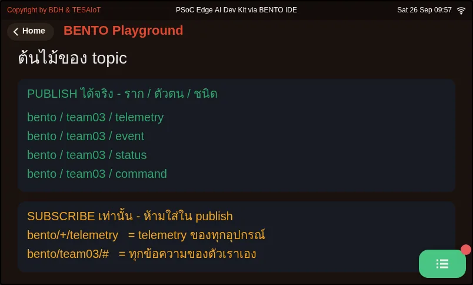
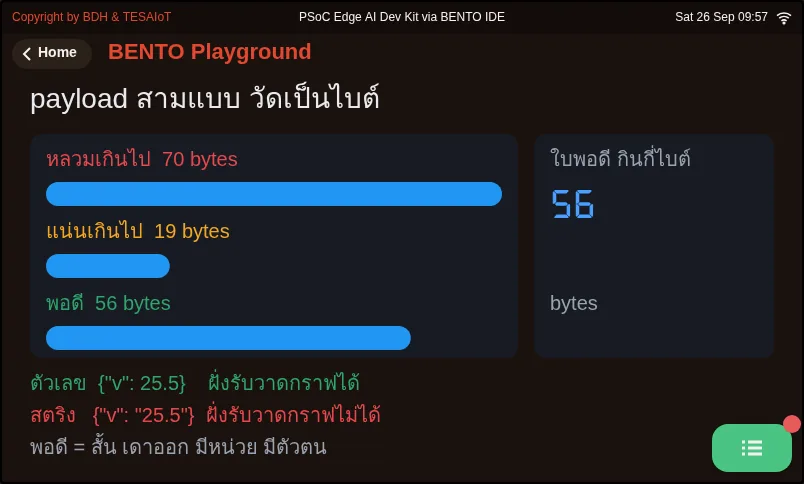
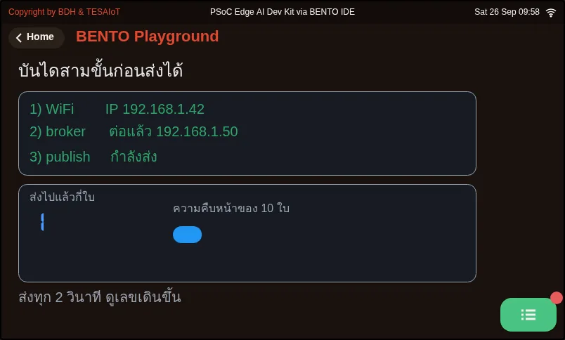
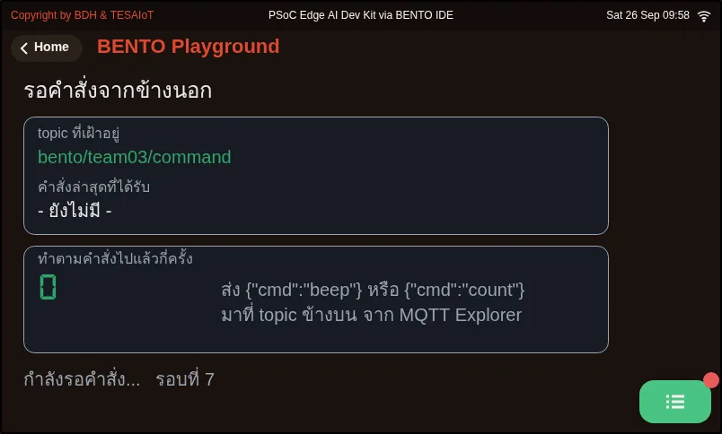
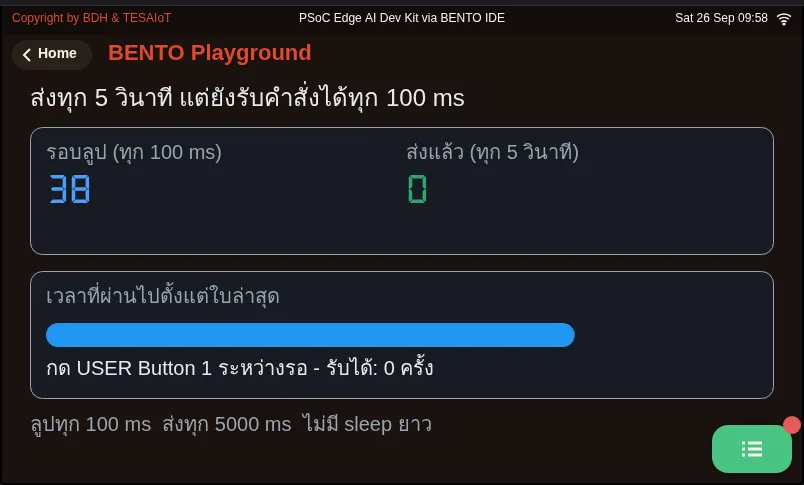
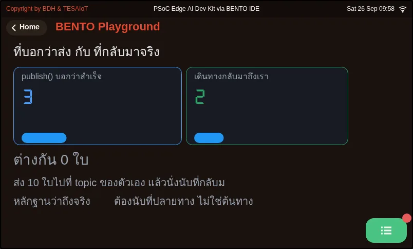
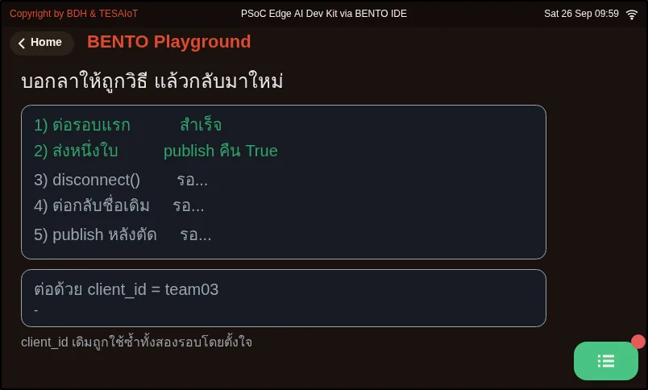

# Lesson 4.5 — MQTT with a self-hosted platform: telemetry and commands

> Module 4 — IoT Platform Connectivity · Slides: [slides.md](slides.md) · [Module overview](../README.md) · [Course page](../../README.md)

Use the six names of the mqtt module to send JSON from the board to your own TESAIoT CE and take commands back, knowing the port-1883 trap, device registration and each function's silent limits.

## Objectives

By the end of this lesson you will be able to:

1. Send the first JSON message to the broker with 03_connect_and_publish.py, checking what mqtt.connect() returns before going on, and state what each of the three outcomes of mqtt.publish() (True, False, OSError) means
2. Make TESAIoT CE reachable from the board on the LAN by changing the port mapping to 0.0.0.0:1883:1883, registering the device with a short device_id of at most 31 characters and setting client_id == username == device_id, until MQTT Explorer subscribed to device/# sees the team's messages
3. Take commands from MQTT Explorer by subscribing once and asking get_message() on every 100 ms loop pass, checking is not None, decoding the bytes with .decode() and wrapping json.loads() in try/except ValueError, so a non-JSON message does not stop the program
4. Explain why port 1883 is only a closed practice ground, and why calling mqtt.disconnect() when you stop on purpose lets you reconnect with the same client_id at once

## Before you start

Review lesson 4.4: the two topic patterns (`bento/<team>/telemetry` on a public broker and `device/<device_id>/telemetry` on TESAIoT CE),
the 31-character ceiling for `client_id` / `username` / `password`, and the single-slot receive box. Have ready a computer with Docker and at least 8 GB RAM
for installing [TESAIoT Community Edition](https://github.com/tesaiot/tesaiot-community-edition); install MQTT Explorer too,
and make sure the board and computer are on the same WiFi network (your home WiFi or phone hotspot). If learning in a group, your organiser may already have CE or a broker prepared.

- **Equipment:** an Eva Kit or TESAIoT Dev Kit board with the BENTO MicroPython firmware installed, or the BENTO Emulator in [BENTO IDE](https://ide.tesaiot.dev/) (code and screens can be rehearsed on the Emulator — file 05 never touches the network at all — but no message reaches TESAIoT CE on your LAN, and while not connected, `publish()` on the Emulator returns False instead of raising OSError; seeing the result in MQTT Explorer needs a real board)
- **Before this:** [Lesson 4.4 — MQTT: pub/sub, topics, QoS and the data budget](../l04-mqtt-concepts/README.md)

## Concepts

This set of lessons' code is much shorter than lessons 3.7–3.9, but the decisions are heavier. What is already done for us: TCP/IP, encoding MQTT packets,
sending keepalives, and the whole platform side (the EMQX broker, a bridge subscribed to `device/+/telemetry` waiting, a time-series database,
and charts built from JSON key names). Our job is four questions: **what to send, what to name it, how often, and what to do with a command taken back.**

The `mqtt` module has only six names, and every one of them can fail silently. `connect()` returns True/False without raising an exception — skip the check
and the program keeps running, then every publish vanishes silently. The keyword is `keepalive`, not `keep_alive`, and `username=`, not `user=`
(a typo raises `TypeError` immediately). `publish()` has three outcomes: not yet connected gives **OSError** · connected but the send fails gives False · handed off to the network layer gives True,
which at QoS 0 does not mean the broker received it. `publish()` only takes three arguments; passing `retain=True` raises `TypeError`.
`subscribe()` rejected by the broker also just returns False. `get_message()` never blocks; it returns `None` or a tuple `(topic, payload)`,
with payload as **bytes**, at most 255 bytes. `disconnect()` returns `None`, so never put it in an `if`. The `port` key can be set,
but this module always sends TLS credentials as empty, so it can only connect to the plain-text port.

The second half of the lesson is the platform you own yourself. Install TESAIoT CE with `make install` (flag `PREBUILT=1`), about 15–30 minutes.
`make up` must come before `make init-pki`. Every document says port 1883, but `docker-compose.yml` actually publishes as
`127.0.0.1:11883:1883` — a board on the LAN can never reach it at all. It must be changed to `0.0.0.0:1883:1883` and brought up with `docker compose up -d emqx`
(`restart` does not re-read the port). **The config file is the truth**, because it is what the machine actually reads. This platform has no automatic registration —
you must add a device at Devices → Add device and set your own short `device_id`, such as `team03`. Leave it to be randomly assigned and you get a 36-character UUID,
silently truncated at 31, then failing to connect with no reason given. Get a password with `POST /api/v1/devices/<id>/reset-mqtt-password`
(not `/reset-password`), check the device is active and in `server_tls` mode, then fill in `client_id == username == device_id`, exactly matching.

The main code has three moves. Move 1 connects WiFi, then `mqtt.connect(..., keepalive=60)`, which means going silent for more than 60 seconds gets you cut off — sending every 5 seconds is safe.
Move 2 reads `sensors.bmi270.motion()` once, getting six values from the same moment, inside a `try`, using `round()` because `0.12` takes 4 bytes
instead of 12, then `json.dumps()` flat. The bridge wraps it and adds `device_id` and `timestamp` itself; wrapping it again gives measurement names starting with `data_`.
Move 3 subscribes once, then asks `get_message()` every 100 ms round. A command from outside is data we did not write ourselves,
so it is `.decode()`d and `json.loads()` is wrapped in `try`, and the LED state is remembered ourselves in a variable. The light is chosen **by name**, with
`led_named("RGB_GREEN", "LED2")`, because the index number differs by board. Move 4, missing from this structure, is `mqtt.disconnect()`.
Pressing Ctrl-C or rerunning without calling the broker still counts as us being there until `keepalive` runs out, and our old `client_id` stays reserved.

Port 1883 has **no encryption**. `username`, `password` and every byte of payload travel over WiFi as readable text; anyone who intercepts it can impersonate our device,
sending fake data into the platform right away. CE's own docs state 1883 is for local/dev only — today is practice on a closed field.
**"Can connect" and "can connect safely" are different questions.** When data does not show on a chart, find the last box that still shows the data:
if MQTT Explorer sees the message, the problem is a wrongly shaped topic or invalid JSON; if it does not, the problem is still on the board's side.

## Worked example

The first three files must be done in this lesson, opened in this order, about 35 minutes total. Predict what the screen will show before running every one.

1. `01_topic_design.py` (8 minutes) — look at the green cards that can be published to and the orange wildcard cards, and answer why `+` and `#` cannot be used in a publish
2. `03_connect_and_publish.py` (15 minutes) — edit the values at the top of the file to your own (the IP of the computer running CE and the device_id and MQTT password from adding the device). Watch the three-step labels (WiFi, broker, publish) turn green in order,
   then count in MQTT Explorer whether all ten messages arrived. Then try a wrong broker IP once, to remember which step fails and what that failure looks like
3. `04_subscribe_command.py` (12 minutes) — send `{"cmd":"beep"}` or `{"cmd":"count"}` from MQTT Explorer, then try sending a non-JSON message
   and watch the program not stop. Toggling the LED with `{"cmd":"toggle"}` is really done in lesson 4.6's practice file

Whatever you're stuck on, open the file that answers it: sending works but a command back gets no response — open `05_send_every_5s_still_listen.py` (needs no network — try changing `LOOP_MS`
and `SEND_EVERY_MS` and running again) · unsure what fields to include — open `02_payload_shape.py` · the code says it sent but MQTT Explorer sees nothing —
open `06_sent_is_not_delivered.py`, which counts at the destination, not the source · want to see `disconnect()` really free the name — open `07_disconnect_frees_id.py`

Files 04, 06, 07 are set up for the public practice broker `broker.hivemq.com` (backup `test.mosquitto.org`), which does not ask for `username=` or `password=`.
Other learners use this same broker, so before running, change `team03` in both `DEVICE_ID` and the topic `bento/team03/...` to a unique code,
such as a lowercase English nickname followed by a random 4-digit number (`nok4821`), or colliding client_ids will kick each other off and messages will mix with others'.
Connect MQTT Explorer to the same broker on port 1883. If you want to run these three files against your own CE instead, you must add `username=` and `password=`
(CE rejects an unknown device right at CONNECT), and use the topic pattern `device/<device_id>/...`.

| File | What this file teaches |
|---|---|
| [examples/01_topic_design.py](examples/01_topic_design.py) | Design a topic name before writing send code |
| [examples/02_payload_shape.py](examples/02_payload_shape.py) | A payload's shape decides whether the receiving side has an easy or hard time |
| [examples/03_connect_and_publish.py](examples/03_connect_and_publish.py) | Connect to the broker and send one set of values up |
| [examples/04_subscribe_command.py](examples/04_subscribe_command.py) | Take a command from outside and act on it |
| [examples/05_send_every_5s_still_listen.py](examples/05_send_every_5s_still_listen.py) | Send every 5 seconds, but still take commands every 100 ms |
| [examples/06_sent_is_not_delivered.py](examples/06_sent_is_not_delivered.py) | What publish() returning True means, and what it does not mean |
| [examples/07_disconnect_frees_id.py](examples/07_disconnect_frees_id.py) | Say goodbye to the broker properly, then reconnect with the same name at once |

The slides for this lesson also refer to files that live in other lessons:

- [m04-iot-connectivity/l06-mqtt-telemetry-lab/practice/s10_mqtt_telemetry.py](../l06-mqtt-telemetry-lab/practice/s10_mqtt_telemetry.py) — send telemetry to the broker and take a command back (fill-in version)
- [m04-iot-connectivity/l08-tesaiot-module/examples/06_secure_publish_loop.py](../l08-tesaiot-module/examples/06_secure_publish_loop.py) — send to the platform over TLS and show the evidence on screen

**Screens from the BENTO Emulator** for this lesson's examples (click a file name to open the code)

<figure><figcaption><a href="examples/01_topic_design.py"><code>01_topic_design.py</code></a> Design a topic name before writing send code</figcaption></figure>
<figure><figcaption><a href="examples/02_payload_shape.py"><code>02_payload_shape.py</code></a> A payload&#x27;s shape decides whether the receiving side has an easy or hard time</figcaption></figure>
<figure><figcaption><a href="examples/03_connect_and_publish.py"><code>03_connect_and_publish.py</code></a> Connect to the broker and send one set of values up</figcaption></figure>
<figure><figcaption><a href="examples/04_subscribe_command.py"><code>04_subscribe_command.py</code></a> Take a command from outside and act on it</figcaption></figure>
<figure><figcaption><a href="examples/05_send_every_5s_still_listen.py"><code>05_send_every_5s_still_listen.py</code></a> Send every 5 seconds, but still take commands every 100 ms</figcaption></figure>
<figure><figcaption><a href="examples/06_sent_is_not_delivered.py"><code>06_sent_is_not_delivered.py</code></a> What publish() returning True means, and what it does not mean</figcaption></figure>
<figure><figcaption><a href="examples/07_disconnect_frees_id.py"><code>07_disconnect_frees_id.py</code></a> Say goodbye to the broker properly, then reconnect with the same name at once</figcaption></figure>

## Check your understanding

The same questions are in [quiz.yaml](quiz.yaml) for automatic marking.

1. Which statements about what `mqtt.publish(topic, payload)` returns are correct? Choose every correct one. *(choose all that apply · objective 1)*
   - A) Calling it before connecting to a broker raises OSError, not False
   - B) Connected but the send fails gives False
   - C) Getting True definitely means the broker has received the message
   - D) Adding `retain=True` is fine if you want the broker to remember the latest message

   

Solution

   **A, B** — publish() has three outcomes: OSError when not connected, False when connected but the send fails, and True which only means it was handed off to the network layer. At QoS 0, there is no confirmation from the broker at all, and retain is not a parameter — passing it raises TypeError.

   

2. A team finishes installing TESAIoT CE. The docs say port 1883, but a board on the same LAN cannot connect to the broker at all. What should they do? *(choose one · objective 2)*
   - A) Change docker-compose.yml from 127.0.0.1:11883:1883 to 0.0.0.0:1883:1883, then run docker compose up -d emqx
   - B) Edit the same file, then just run docker compose restart
   - C) Set BROKER = "localhost" in the board's code
   - D) Switch to connecting on port 8884 with the mqtt module

   

Solution

   **A** — The config file actually publishes as 11883 and binds to loopback, so the board can never reach it. It must be changed to 0.0.0.0:1883 and brought up with up -d, because restart does not re-read the port. localhost points to the board itself, and the mqtt module cannot connect to a TLS port.

   

3. Put the steps of taking a toggle command from the broker to switching the LED in the correct order. *(order · objective 3)*
   - A) Decode `msg[1].decode()` then `json.loads()` inside `try/except ValueError`
   - B) Call `mqtt.subscribe(TOPIC_CMD)` once before entering the loop
   - C) If `cmd.get("cmd") == "toggle"`, flip the `led_on` variable remembered ourselves, then command `lamp.value(...)`
   - D) Call `mqtt.get_message()` every 100 ms loop round
   - E) Check that `msg is not None`

   

Solution

   **B → D → E → A → C** — Subscribe once, then ask get_message() every round, which returns None when there is no message, so you must check first. The payload is bytes, so it must be decoded before json.loads, wrapped in try because a sender can always send garbage. LED state must be remembered ourselves, because the pin's value only tells you the level at the instant you ask.

   

4. A team presses Ctrl-C and immediately reruns the same file. The board connects and drops alternately, though the code is not wrong. What is the exact cause and fix? *(choose one · objective 4)*
   - A) The broker still counts the old session as present until keepalive runs out, and the old client_id stays reserved; call `mqtt.disconnect()` in `except KeyboardInterrupt:`
   - B) keepalive is too short; set `keep_alive=600`
   - C) You must call `if mqtt.disconnect():` before every connect
   - D) The board is broken; reflash the firmware

   

Solution

   **A** — Without saying goodbye to the broker, it waits until keepalive runs out before it agrees we have left. disconnect() frees the name immediately, but returns None so it cannot be put in an if, and the correct keyword is keepalive, not keep_alive.

   

5. Someone intercepting WiFi traffic on the same network as the board — what can they do while our board sends over port 1883? Choose every correct one. *(choose all that apply · objective 4)*
   - A) Read the device's username and password
   - B) Read the sensor values in the payload
   - C) Impersonate our device and send fake data into the platform
   - D) Nothing at all, because the broker asks for a password before connecting

   

Solution

   **A, B, C** — Port 1883 has no encryption; every byte, including the password, travels as readable text. Asking for a password does not help when the password itself can be read. So 1883 is only usable on a practice field — "can connect" and "can connect safely" are different questions.

   

## Lab

**Prepare your own platform.** Do this on your computer and a real board, and record the results in your learning log.

- [ ] Install TESAIoT CE with `make install`, calling `make up` before `make init-pki`
- [ ] Edit `docker-compose.yml` from `127.0.0.1:11883:1883` to `0.0.0.0:1883:1883`, run `docker compose up -d emqx`, and check `docker compose ps` shows the port really as `0.0.0.0:1883`
- [ ] Devices → Add device with your own short `device_id`, get a password with `reset-mqtt-password`, and check it is active and `server_tls`
- [ ] Find the computer's IP on the LAN (not localhost), and get a successful `wifi.ping()` from the board before touching MQTT
- [ ] Connect MQTT Explorer to that same IP, port 1883, with the device's name and password, and subscribe to `device/#`
- [ ] Run `03_connect_and_publish.py` with `client_id == username == device_id` and topic `device/<device_id>/telemetry` until you see the message in MQTT Explorer
- [ ] Write one sentence in your learning log about what someone eavesdropping on the same WiFi network sees while we use port 1883

## Going further

Lesson 4.6 assembles every move into one program, `s10_mqtt_telemetry.py`, sending real values every 5 seconds and taking `{"cmd":"toggle"}` back to switch the LED.
Optional further reading at `06_secure_publish_loop.py` in lesson 4.8, which is the same loop on an encrypted channel — read it to compare the structure, but do not run it yet.

Next lesson: [Lesson 4.6 — Hands-on: two-way telemetry](../l06-mqtt-telemetry-lab/README.md)

## Reflect

- CE's docs and `docker-compose.yml` disagree about the port. What would you check first the next time you meet a new system?
- If someone on the same WiFi network intercepted our device's MQTT password, what could they do to our platform?
- The counter of True from `publish()` — is it proof the message really arrived? If not, what evidence can be trusted?
