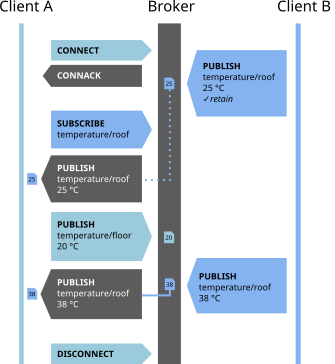

<style>
section { font-size: 24px; padding: 40px 52px; justify-content: flex-start; }
section h1 { font-size: 1.45em; line-height: 1.12; margin: 0 0 .22em; }
section h2 { font-size: 1.12em; margin: .15em 0; }
section h3 { font-size: 1.0em; margin: .12em 0; }
section p, section li { margin: .16em 0; line-height: 1.32; }
section img { max-width: 100%; height: auto; }
section svg { max-height: 330px; width: 100%; }
section table { font-size: .78em; }
section pre { font-size: .70em; line-height: 1.32; background:#0d1117; color:#e6edf3; border:1px solid #30363d; border-radius:8px; padding:12px 16px; box-shadow:0 2px 8px rgba(0,0,0,.25); }
section pre code { white-space: pre-wrap; background:transparent; color:inherit; } section pre .hljs-comment{color:#8b949e;font-style:italic} section pre .hljs-keyword,section pre .hljs-built_in,section pre .hljs-literal{color:#ff7b72} section pre .hljs-string{color:#a5d6ff} section pre .hljs-number{color:#79c0ff} section pre .hljs-title,section pre .hljs-title.function_,section pre .hljs-section{color:#d2a8ff} section pre .hljs-meta{color:#ffa657} section pre .hljs-attr,section pre .hljs-attribute,section pre .hljs-name{color:#7ee787}
section blockquote { margin: .25em 0; font-size: .92em; }
/* two images on a line (parity / 2x2 grids) stay side-by-side and small */
section p > img + img { margin-left: 10px; }
/* scroll-within-slide: dense slides scroll instead of clipping */
section { overflow-y: auto; overflow-x: hidden; }
section::-webkit-scrollbar { width: 11px; }
section::-webkit-scrollbar-thumb { background:#4a90d9; border-radius:6px; }
section::-webkit-scrollbar-track { background:rgba(0,0,0,.06); }
/* image drop-shadow + cover-slide readability (auto) */
section img{filter:drop-shadow(0 3px 12px rgba(0,0,0,.5))}
/* พื้นสำรองของสไลด์ปก: ถ้า img/cover_sNN.svg โหลดไม่ขึ้น ธีมจะคืนพื้นขาว
   แล้วตัวอักษรสีขาวของปกจะหายไปทั้งแผ่น — ปักสีเข้มไว้ให้ภาพเป็นแค่ของประดับ */
section.cover{background-color:#0b1426}
section.cover *{color:#fff !important}
section.cover h1,section.cover h2,section.cover h3,section.cover p,section.cover li,section.cover strong,section.cover em,section.cover blockquote,section.cover div{text-shadow:0 2px 9px rgba(0,0,0,.92),0 0 3px rgba(0,0,0,.8)}
section.cover div[style*="background:#"],section.cover div[style*="background: #"]{background:rgba(10,14,20,.66) !important;border-color:rgba(120,200,255,.45) !important;max-width:62%}
section.cover blockquote{border-left:4px solid rgba(120,200,255,.6) !important;background:rgba(13,17,23,.55) !important;border-radius:6px;padding:.3em .6em}
section.cover h1,section.cover h2,section.cover h3,section.cover p,section.cover blockquote{max-width:60%}
section.cover div:not(:has(img)){max-width:62%}
section.cover img{filter:none}
</style>


<!-- _class: cover -->

# บทเรียน 4.5 — MQTT กับแพลตฟอร์มที่ติดตั้งเอง: telemetry และ command

## MQTT (1883) · Telemetry ขาออก และ Command ขากลับ บน broker ของเราเอง

**โมดูล 4 — เชื่อมต่อแพลตฟอร์ม IoT**

> ต่อจากบทเรียน 4.4 — MQTT: pub/sub topic QoS และงบข้อมูล

---

## เรื่องที่เราให้ 70% ผู้เรียนเขียน 30%

<svg viewBox="0 0 900 164" xmlns="http://www.w3.org/2000/svg">
  <rect x="20" y="24" width="600" height="76" rx="8" fill="#e3f2fd" stroke="#1565c0" stroke-width="2"/>
  <text x="320" y="56" text-anchor="middle" font-size="23" font-weight="700" fill="#1565c0">70% — เฟิร์มแวร์ + แพลตฟอร์มทำให้แล้ว</text>
  <text x="320" y="86" text-anchor="middle" font-size="18" fill="#5472a3">TCP/IP · แพ็กเก็ต MQTT · broker · ฐานข้อมูล · กราฟ</text>
  <rect x="628" y="24" width="252" height="76" rx="8" fill="#fff3e0" stroke="#ef6c00" stroke-width="2"/>
  <text x="754" y="56" text-anchor="middle" font-size="23" font-weight="700" fill="#ef6c00">30% — งานของเรา</text>
  <text x="754" y="86" text-anchor="middle" font-size="18" fill="#a1683a">ส่งอะไร ชื่ออะไร ถี่แค่ไหน</text>
  <text x="450" y="134" text-anchor="middle" font-size="20" font-weight="700" fill="#455a64">โค้ดสั้นลง แต่การตัดสินใจหนักขึ้น — นี่คือหน้าตาของงานวิศวกรรมระบบ</text>
  <text x="450" y="156" text-anchor="middle" font-size="17" fill="#78909c">ไลบรารีตอบแทนไม่ได้ เพราะสี่คำถามนั้นเป็นคำถามเรื่องระบบ ไม่ใช่เรื่องโค้ด</text>
</svg>

**สิ่งที่ทำให้แล้ว (70%)**
สแตก TCP/IP และการต่อ WiFi · การเข้ารหัสแพ็กเก็ต MQTT ตามมาตรฐาน · การส่ง keepalive ให้เองเป็นระยะ · ฝั่งแพลตฟอร์ม: broker EMQX, บริดจ์ที่ subscribe `device/+/telemetry` รออยู่แล้ว, ฐานข้อมูลอนุกรมเวลา และกราฟที่สร้างจากชื่อคีย์ JSON อัตโนมัติ

**สิ่งที่เป็นงานของเรา (30%)**
ตัดสินใจว่า **ส่งอะไร ตั้งชื่อว่าอะไร ถี่แค่ไหน** และ **ทำอะไรกับคำสั่งที่รับกลับมา** — สี่คำถามนี้ไม่มีไลบรารีไหนตอบแทนได้ เพราะมันคือคำถามเรื่องระบบ ไม่ใช่เรื่องโค้ด

สังเกตว่าโค้ดของชุดบทเรียนนี้สั้นกว่าบทเรียน 3.7–3.9 มาก แต่การตัดสินใจหนักกว่า — นี่คือหน้าตาของงานวิศวกรรมระบบจริง

> โค้ดที่สั้นลงไม่ได้แปลว่างานง่ายลง มันแปลว่าน้ำหนักย้ายไปอยู่ที่การออกแบบ

---

## โมดูล `mqtt` มีหกชื่อ เท่านี้จริง ๆ — และเพดานของแต่ละตัว

| เรียกอย่างไร | คืนอะไร | เพดานและกับดัก |
|---|---|---|
| `mqtt.connect(broker, port=1883, client_id="psoc-edge", username=None, password=None, keepalive=60)` | `True` / `False` | `client_id` ใช้ได้ **31 ตัวอักษร** ที่เกินถูกตัดทิ้งเงียบ ๆ แล้ว broker ค่อยปฏิเสธทีหลัง · `broker` ยาวได้ 63 · `username` กับ `password` อย่างละ 31 · เขียน `keep_alive` ไม่ได้ ต้อง `keepalive` |
| `mqtt.disconnect()` | `None` | ตัดการเชื่อมต่อและ **คืน `client_id` ให้ว่าง** ต่อใหม่ด้วยชื่อเดิมได้ทันที · ไม่คืน `True` จึงห้ามใส่ใน `if` |
| `mqtt.publish(topic, payload, qos=0)` | `True` / `False` | ยังไม่ได้ต่อแล้วเรียก ได้ **`OSError`** ไม่ใช่ `False` · ต่ออยู่แต่ส่งไม่ผ่าน ได้ `False` · จึงมีสามทางออก ไม่ใช่สอง |
| `mqtt.subscribe(topic, qos=0)` | `True` / `False` | broker ปฏิเสธ (เช่นติด ACL) ก็คืน `False` เหมือนกัน ไม่โยน error · ยังไม่ได้ต่อจึงจะได้ `OSError` |
| `mqtt.is_connected()` | `True` / `False` | เปลี่ยนเป็น `False` เองเมื่อ broker ตัดเรา ไม่ต้องรอให้ publish พัง |
| `mqtt.get_message()` | `None` หรือ tuple `(topic, payload)` | **ไม่เคยบล็อก** · `topic` เป็น str สูงสุด 127 ไบต์ · `payload` เป็น **bytes** สูงสุด 255 ไบต์ ต้อง `.decode()` ก่อนใช้ · เกินเพดานถูกตัดกลางคันเงียบ ๆ |

**`retain` ไม่ใช่พารามิเตอร์** เอกสารในเครื่องมือบางที่เขียนว่า `mqtt.publish(topic, payload, qos=0, retain=False)` แต่ตัวจริงรับได้แค่สามอาร์กิวเมนต์ ใส่ `retain=True` ไปจะได้ `TypeError` ทันที และในซอร์สค่านั้นถูกตั้งเป็น `false` ตายตัวอยู่แล้ว

> `port` ตั้งได้ก็จริง แต่ตัวจริงส่งข้อมูลรับรอง TLS เป็นค่าว่างเสมอ **จึงต่อได้เฉพาะพอร์ตที่เปิดรับแบบข้อความเปล่า** ชี้ไปพอร์ต TLS จริงแล้วจะล้มตอนจับมือ — ชุดบทเรียนถัดไปเราจะใช้คนละโมดูลกันไปเลยเพราะเหตุนี้

---

## ครึ่งหลังของชุดบทเรียน — แพลตฟอร์มที่เราติดตั้งเอง


<div style="font-size:.58em;color:#78909c;margin-top:-.35em">ภาพหน้าจอ: TESAIoT Community Edition v1.1.8 — เอกสารของ repo (Apache-2.0)</div>

เราจะไม่ยืมแดชบอร์ดของใคร — แต่ละทีมติดตั้ง **TESAIoT Community Edition** บนเครื่องของตัวเองด้วย Docker

- `make install` (ธง `PREBUILT=1` ดึงอิมเมจสำเร็จรูป) ใช้เวลาราว **15–30 นาที**
- **ลำดับสำคัญ:** `make up` ต้องมาก่อน `make init-pki` ถ้าสลับกันจะค้างตั้งแต่บูตแรก
- RAM อย่างน้อย **8 GB** ตามเอกสารไทยของ repo — น้อยกว่านี้ฐานข้อมูลถูกระบบฆ่าทิ้งกลางทาง
- **มีเอกสารภาษาไทยครบ** — `README.th.md` และ `docs/th/` อีก 15 ไฟล์

> นี่คือครั้งแรกที่ทีมได้เป็นเจ้าของ **ทั้งอุปกรณ์และแพลตฟอร์ม** ไม่ใช่แค่ผู้ใช้บริการของใคร

---

## กับดักพอร์ต 1883 — เอกสารบอกอย่าง ไฟล์ตั้งค่าทำอีกอย่าง

<svg viewBox="0 0 940 244" xmlns="http://www.w3.org/2000/svg">
  <rect x="16" y="60" width="196" height="110" rx="10" fill="#132033" stroke="#3d5a80" stroke-width="2"/>
  <text x="114" y="94" text-anchor="middle" font-size="20" font-weight="700" fill="#8fb8e0">บอร์ดใน LAN</text>
  <text x="114" y="122" text-anchor="middle" font-size="18" fill="#6b8fb5">192.168.1.77</text>
  <text x="114" y="148" text-anchor="middle" font-size="17" fill="#6b8fb5">ยิงไปที่พอร์ต 1883</text>
  <rect x="470" y="34" width="452" height="176" rx="12" fill="#eceff1" stroke="#455a64" stroke-width="2.5"/>
  <text x="696" y="62" text-anchor="middle" font-size="21" font-weight="700" fill="#37474f">เครื่องที่รัน TESAIoT CE</text>
  <rect x="500" y="76" width="180" height="60" rx="8" fill="#ffebee" stroke="#c62828" stroke-width="2.5"/>
  <text x="590" y="100" text-anchor="middle" font-size="18" font-weight="700" fill="#c62828">127.0.0.1:11883</text>
  <text x="590" y="122" text-anchor="middle" font-size="17" fill="#b71c1c">เห็นได้เฉพาะในเครื่อง</text>
  <rect x="706" y="76" width="190" height="60" rx="8" fill="#e8f5e9" stroke="#2e7d32" stroke-width="2.5"/>
  <text x="801" y="100" text-anchor="middle" font-size="18" font-weight="700" fill="#2e7d32">0.0.0.0:1883</text>
  <text x="801" y="122" text-anchor="middle" font-size="17" fill="#1b5e20">เห็นได้จากทั้ง LAN</text>
  <text x="696" y="172" text-anchor="middle" font-size="18" fill="#546e7a">broker EMQX ข้างในฟังที่ 0.0.0.0:1883 อยู่แล้ว</text>
  <text x="696" y="196" text-anchor="middle" font-size="18" fill="#546e7a">ปัญหาอยู่ที่ชั้นเผยแพร่พอร์ตของ compose</text>
  <line x1="216" y1="106" x2="464" y2="106" stroke="#c62828" stroke-width="3" stroke-dasharray="7 5"/>
  <circle r="8" fill="#c62828" cx="216" cy="106"><animateMotion path="M0,0 L224,0" dur="2.6s" repeatCount="indefinite"/><animate attributeName="r" values="6;11;6" dur="2.6s" repeatCount="indefinite"/></circle>
  <text x="340" y="90" text-anchor="middle" font-size="19" font-weight="700" fill="#c62828">ต่อไม่ติดเลย</text>
  <text x="340" y="136" text-anchor="middle" font-size="17" fill="#8d6e63">ไม่ใช่รหัสผิด ไม่ใช่ ACL</text>
  <text x="470" y="236" text-anchor="middle" font-size="18" font-weight="700" fill="#ef6c00">แก้บรรทัดเดียวใน docker-compose.yml — และย้อนกลับเมื่อสอนเสร็จ</text>
</svg>

เอกสารของ CE ทุกฉบับเขียนว่าพอร์ต **1883** แต่ `docker-compose.yml` เผยแพร่จริงเป็น `127.0.0.1:11883:1883` คือทั้งเลขพอร์ตต่างจากที่เขียนไว้ และผูกกับ loopback ทำให้ **บอร์ดที่อยู่ใน LAN เดียวกันเข้าไม่ถึงเลย** (คอมเมนต์ในไฟล์บอกว่าทำไว้เลี่ยงชนกับซอฟต์แวร์ตัวอื่นบนเครื่องผู้พัฒนา)

```diff
-      - "127.0.0.1:11883:1883"
+      - "0.0.0.0:1883:1883"     # classroom only - plaintext MQTT บน LAN
```

ใช้ `docker compose up -d emqx` เท่านั้น — `restart` จะไม่อ่านการตั้งค่าพอร์ตใหม่

> เอกสารกับไฟล์ตั้งค่าขัดกันได้เสมอ — **ไฟล์ตั้งค่าคือความจริง** เพราะมันคือสิ่งที่เครื่องอ่าน

---

## 1883 ส่งรหัสผ่านเป็นข้อความเปล่า — พูดให้ตรง


<div style="font-size:.58em;color:#78909c;margin-top:-.35em">ภาพ: Miraceti / Wikimedia Commons — CC BY-SA 3.0</div>

พอร์ต 1883 **ไม่มีการเข้ารหัส** ทั้ง `username`, `password` และ payload ทุกไบต์ เดินทางบน WiFi ในรูปข้อความอ่านออกได้ ใครที่ดักจับสัญญาณวงเดียวกันได้ ก็อ่านรหัสของอุปกรณ์เราได้ และ **ปลอมเป็นอุปกรณ์ของเราส่งข้อมูลปลอมเข้าแพลตฟอร์มได้ทันที**

- CE เองระบุไว้ในไฟล์ตั้งค่าว่าพอร์ต 1883 มีไว้สำหรับ **local/dev เท่านั้น**
- API ของแพลตฟอร์มจะเขียน log เตือนทุกครั้งที่อุปกรณ์โหมด `server_tls` เข้ามาทางพอร์ต 1883
- ดังนั้นสิ่งที่เราทำวันนี้คือ **การฝึกในสนามซ้อมที่ปิดล้อม** ไม่ใช่วิธีที่ใช้กับของจริง

ชุดบทเรียนถัดไป (บทเรียน 4.7–4.9) เราจะเปลี่ยนไปพอร์ต **8884 พร้อม TLS** แล้วเทียบให้เห็นด้วยตาว่าสิ่งที่ดักได้ต่างกันอย่างไร — วันนี้จึงเป็นครึ่งแรกของบทเรียนเรื่องความปลอดภัย ไม่ใช่บทเรียนที่จบในตัว

> จำประโยคนี้ให้ได้: **"ต่อได้" กับ "ต่อได้อย่างปลอดภัย" เป็นคนละคำถาม** และเราเพิ่งตอบข้อแรก

---

## ขึ้นทะเบียนอุปกรณ์ก่อน แล้วค่อยต่อ


<div style="font-size:.58em;color:#78909c;margin-top:-.35em">ภาพหน้าจอ: TESAIoT Community Edition v1.1.8 — เอกสารของ repo (Apache-2.0)</div>

แพลตฟอร์มนี้ **ไม่มีการลงทะเบียนอัตโนมัติ** — อุปกรณ์ที่ไม่รู้จักถูกปฏิเสธตั้งแต่ตอน CONNECT

1. **Devices → Add device** แล้ว **ตั้ง `device_id` เองให้สั้น** เช่น `team03` (ระบบรับ 3–64 ตัว) — ถ้าปล่อยให้สุ่ม จะได้ UUID ยาว 36 ตัว **ยาวเกิน 31 ตัวที่โมดูล `mqtt` รับได้ ถูกตัดเงียบ แล้วต่อไม่ติดโดยไม่บอกสาเหตุ**
2. ขอรหัส: `POST /api/v1/devices/<id>/reset-mqtt-password` คืน `mqtt_username` และรหัสผ่านมาตรง ๆ (อย่าใช้ `/reset-password` ซึ่งคืนคนละอย่าง)
3. ตรวจว่าสถานะอุปกรณ์เป็น **active** และโหมดเป็น `server_tls` (ค่าเริ่มต้นอยู่แล้ว)
4. กรอกลงโค้ดโดยให้ **`client_id == username == device_id`** ตรงกันเป๊ะ

> ที่นี่ไม่ยอมรับ "เกือบตรง" — ผิดตัวเดียวใน `device_id` คือถูกปฏิเสธ และข้อความปฏิเสธไม่ได้บอกว่าผิดตรงไหน

---

## แกะโค้ดจริง — ท่าที่ 1 ต่อ WiFi แล้วต่อ broker

```python
# --- ท่าที่ 1: ต่อเน็ตให้ได้ก่อน แล้วค่อยแนะนำตัวกับ broker ---
wifi.connect(WIFI_SSID, WIFI_PASSWORD)
lcd.print("WiFi:", wifi.ip())

ok = mqtt.connect(BROKER, port=1883, client_id=DEVICE_ID,
                  username=DEVICE_ID, password=MQTT_PASS, keepalive=60)
lcd.print("<span class=ok>MQTT ต่อแล้ว</span>" if ok else "MQTT ต่อไม่ได้")
```

<div style="display:flex;gap:20px;align-items:flex-start">
<div style="flex:1">

ชื่อคีย์เวิร์ดคือ **`keepalive`** ไม่ใช่ `keep_alive` — เอกสารช่วยเหลือใน IDE เขียนผิดจุดนี้ พิมพ์ตามแล้วได้ `TypeError` ทันที

`keepalive=60` แปลว่าถ้าเราเงียบเกิน 60 วินาที broker จะตัดทิ้ง — ส่งทุก 5 วินาทีจึงปลอดภัย แต่ถ้าเปลี่ยนไปส่งทุก 5 นาที ต้องขยับค่านี้ตาม ไม่งั้นจะโดนตัดเป็นรอบ ๆ

`mqtt.connect()` **คืน `True`/`False`** ไม่โยน exception — ถ้าไม่ตรวจค่าที่คืน โปรแกรมจะวิ่งต่อทั้งที่ไม่มีการเชื่อมต่อ แล้ว publish ทุกใบหายเงียบ

</div>
<div style="width:250px">



<div style="font-size:.55em;color:#78909c">ภาพ: Simon A. Eugster / Wikimedia Commons — CC BY-SA 4.0 · ภาพนี้มีธง retain ซึ่งโมดูล mqtt ของเราไม่มี</div>

</div>
</div>

> บรรทัดแรกที่ต้องเขียนหลัง `connect()` คือบรรทัดที่ **บอกให้รู้ว่าต่อติดหรือไม่ติด** ไม่ใช่บรรทัดถัดไปของงาน

---

## แกะโค้ดจริง — ท่าที่ 2 ส่งค่าจริงทุก 5 วินาที

<style scoped>section pre{font-size:.60em;line-height:1.28} section svg{max-height:160px}</style>

```python
    # --- ท่าที่ 2: อ่านเซนเซอร์ → ประกอบ JSON → publish (ใน publish_telemetry) ---
    try:
        ax, ay, az, gx, gy, gz = sensors.bmi270.motion()
        data = {"ax": round(ax, 2), "ay": round(ay, 2), "az": round(az, 2),
                "pot": round(sensors.pot.percent(), 1)}
    except OSError:
        return None                            # อ่านพลาดหนึ่งรอบ ข้ามไปรอบหน้า
    ...
    mqtt.publish(TOPIC_PUB, json.dumps(data))  # แบน ไม่ห่อ แพลตฟอร์มห่อให้เอง
```

<svg viewBox="0 0 940 172" xmlns="http://www.w3.org/2000/svg">
  <rect x="14" y="26" width="200" height="120" rx="8" fill="#e8f5e9" stroke="#2e7d32" stroke-width="2"/>
  <text x="114" y="52" text-anchor="middle" font-size="19" font-weight="700" fill="#2e7d32">ค่าจากเซนเซอร์</text>
  <text x="114" y="78" text-anchor="middle" font-size="18" fill="#1b5e20">ax = 0.1234567</text>
  <text x="114" y="102" text-anchor="middle" font-size="18" fill="#1b5e20">pot = 48.23456</text>
  <text x="114" y="132" text-anchor="middle" font-size="17" fill="#4a7c4e">ทศนิยมยาวไม่มีประโยชน์</text>
  <rect x="272" y="26" width="200" height="120" rx="8" fill="#e3f2fd" stroke="#1565c0" stroke-width="2"/>
  <text x="372" y="52" text-anchor="middle" font-size="19" font-weight="700" fill="#1565c0">round() ก่อน</text>
  <text x="372" y="78" text-anchor="middle" font-size="18" fill="#0d47a1">0.12</text>
  <text x="372" y="102" text-anchor="middle" font-size="18" fill="#0d47a1">48.2</text>
  <text x="372" y="132" text-anchor="middle" font-size="17" fill="#5472a3">payload สั้นลงเกือบครึ่ง</text>
  <rect x="530" y="26" width="200" height="120" rx="8" fill="#0d1117" stroke="#30363d" stroke-width="2"/>
  <text x="630" y="52" text-anchor="middle" font-size="19" font-weight="700" fill="#7ee787">json.dumps()</text>
  <text x="630" y="80" text-anchor="middle" font-size="17" font-family="monospace" fill="#a5d6ff">{"ax":0.12, "ay":-9.75,</text>
  <text x="630" y="102" text-anchor="middle" font-size="17" font-family="monospace" fill="#a5d6ff">"az":0.31, "pot":48.2}</text>
  <text x="630" y="132" text-anchor="middle" font-size="17" fill="#8b949e">สตริงเดียว ~80 ไบต์</text>
  <rect x="788" y="26" width="138" height="120" rx="8" fill="#fff3e0" stroke="#ef6c00" stroke-width="2"/>
  <text x="857" y="60" text-anchor="middle" font-size="19" font-weight="700" fill="#ef6c00">publish</text>
  <text x="857" y="92" text-anchor="middle" font-size="18" fill="#e65100">ขึ้น broker</text>
  <circle cx="857" cy="120" r="9" fill="#ef6c00"><animate attributeName="r" values="6;11;6" dur="1.6s" repeatCount="indefinite"/></circle>
  <line x1="218" y1="86" x2="266" y2="86" stroke="#90a4ae" stroke-width="2"/>
  <line x1="476" y1="86" x2="524" y2="86" stroke="#90a4ae" stroke-width="2"/>
  <line x1="734" y1="86" x2="782" y2="86" stroke="#90a4ae" stroke-width="2"/>
</svg>

`sensors.bmi270.motion()` คืนหกค่าในการอ่านครั้งเดียว — **อ่านทีเดียวดีกว่าเรียกหลายฟังก์ชัน** เพราะค่าทั้งหกมาจากช่วงเวลาเดียวกันจริง · บรรทัดที่อ่านค่าอยู่ใน `try` เพราะอ่านพลาดหนึ่งรอบต้องไม่ทำให้ทั้งโปรแกรมตาย

`round()` ไม่ใช่เรื่องความสวยงาม: `0.1234567890` กิน 12 ไบต์ ส่วน `0.12` กิน 4 ไบต์ — คูณด้วยจำนวนฟิลด์และรอบต่อวันแล้วคือค่าเน็ตที่ประหยัดได้ฟรี · `json.dumps()` แปลง dict เป็นสตริงที่ทุกภาษาอ่านออก คือจุดที่ข้อมูลเลิกเป็นของ Python

> ส่งแบน ไม่ต้องห่อ บริดจ์เป็นคนห่อให้เอง แล้วเติม `device_id` (จาก topic) กับ `timestamp` ให้ด้วย
> ห่อเองซ้ำจะได้ชื่อวัดขึ้นต้น `data_` แล้วตารางหน่วยฝั่งเซิร์ฟเวอร์หาไม่เจอ

---

## แกะโค้ดจริง — ท่าที่ 3 รับคำสั่งกลับมาสั่ง LED

<style scoped>section pre{font-size:.58em;line-height:1.25} section svg{max-height:120px} section p{margin:.1em 0}</style>

```python
mqtt.subscribe(TOPIC_CMD)               # ท่าที่ 3: subscribe ครั้งเดียว แล้ว poll ถี่ ๆ ในลูปเดียวกับ publish
...
    msg = mqtt.get_message()            # ไม่มีข้อความ = None
    if msg is not None:
        try:
            cmd = json.loads(msg[1].decode())   # msg[1] คือ payload เป็น bytes
        except ValueError:
            cmd = {}                    # คนส่งมั่วได้เสมอ โปรแกรมต้องไม่ตาย
        if cmd.get("cmd") == "toggle":
            led_on = not led_on         # จำสถานะเอง
            lamp.value(1 if led_on else 0)      # lamp = led_named("RGB_GREEN", "LED2")
            led_remote.value(1 if led_on else 0)
    ...
    time.sleep_ms(100)
```

<svg viewBox="0 0 940 168" xmlns="http://www.w3.org/2000/svg">
  <text x="18" y="26" font-size="19" font-weight="700" fill="#455a64">ลูปเดียว ทำสองหน้าที่ — จับเวลาเองว่าถึงรอบ publish หรือยัง</text>
  <rect x="18" y="38" width="904" height="52" rx="8" fill="#eceff1" stroke="#90a4ae" stroke-width="2"/>
  <rect x="26" y="46" width="86" height="36" rx="5" fill="#e8f5e9" stroke="#2e7d32"/>
  <text x="69" y="70" text-anchor="middle" font-size="17" fill="#1b5e20">poll</text>
  <rect x="118" y="46" width="86" height="36" rx="5" fill="#e8f5e9" stroke="#2e7d32"/>
  <text x="161" y="70" text-anchor="middle" font-size="17" fill="#1b5e20">poll</text>
  <rect x="210" y="46" width="86" height="36" rx="5" fill="#e8f5e9" stroke="#2e7d32"/>
  <text x="253" y="70" text-anchor="middle" font-size="17" fill="#1b5e20">poll</text>
  <rect x="302" y="46" width="150" height="36" rx="5" fill="#fff3e0" stroke="#ef6c00" stroke-width="2"/>
  <text x="377" y="70" text-anchor="middle" font-size="17" fill="#e65100">publish (ครบ 5 วิ)</text>
  <rect x="458" y="46" width="86" height="36" rx="5" fill="#e8f5e9" stroke="#2e7d32"/>
  <text x="501" y="70" text-anchor="middle" font-size="17" fill="#1b5e20">poll</text>
  <rect x="550" y="46" width="86" height="36" rx="5" fill="#e8f5e9" stroke="#2e7d32"/>
  <text x="593" y="70" text-anchor="middle" font-size="17" fill="#1b5e20">poll</text>
  <rect x="642" y="46" width="86" height="36" rx="5" fill="#e8f5e9" stroke="#2e7d32"/>
  <text x="685" y="70" text-anchor="middle" font-size="17" fill="#1b5e20">poll</text>
  <rect x="734" y="46" width="86" height="36" rx="5" fill="#e8f5e9" stroke="#2e7d32"/>
  <text x="777" y="70" text-anchor="middle" font-size="17" fill="#1b5e20">poll</text>
  <rect x="826" y="46" width="88" height="36" rx="5" fill="#e8f5e9" stroke="#2e7d32"/>
  <text x="870" y="70" text-anchor="middle" font-size="17" fill="#1b5e20">poll</text>
  <circle r="8" fill="#c62828" cx="69" cy="110"><animateMotion path="M0,0 L801,0" dur="5s" repeatCount="indefinite"/><animate attributeName="r" values="6;11;6" dur="5s" repeatCount="indefinite"/></circle>
  <text x="18" y="140" font-size="18" fill="#455a64">ทุก ๆ 100 มิลลิวินาทีเราถามหนึ่งครั้ง — คนกดปุ่มบนคอมไม่มีทางกดเร็วกว่านี้จนข้อความทับกัน</text>
  <text x="18" y="162" font-size="18" fill="#c62828">ถ้าเขียน time.sleep(5) แล้วค่อย poll ครั้งเดียว — คำสั่งที่ส่งมาระหว่างนั้นจะเหลือแค่ใบสุดท้าย</text>
</svg>

`get_message()` คืน **tuple `(topic, payload)` หรือ `None`** ต้องตรวจ `is not None` ก่อนเสมอ · `payload` เป็น **bytes** จึงต้อง `.decode()` ก่อน `json.loads()` · ต้อง **จำสถานะ LED ในตัวแปร Python เอง** เพราะ `gpio.led().value()` ตอบแค่ระดับของขา ณ วินาทีที่ถาม · `lamp` ถูกเลือก**ตามชื่อ** — `led_named("RGB_GREEN", "LED2")` หาดวงสีเขียวจาก `gpio.board_info()["led_names"]`: Dev Kit ได้ `RGB_GREEN` · Eva ได้ `LED2` เพราะเลขดัชนีต่างกันตามบอร์ด และ `led(0)`/`led(1)` บน Dev Kit อยู่บน SoM ซึ่งยังไม่มีใครยืนยันว่ามองเห็นบนบอร์ดประกอบ

> คำสั่งจากภายนอกคือ **ข้อมูลที่เราไม่ได้เขียนเอง** — ตรวจก่อนใช้เสมอ ทั้งว่ามีจริงไหม แปลงได้ไหม และอยู่ในชุดค่าที่เรารู้จักไหม

---

## ท่าที่ 4 ที่ไม่มีในโครง — `mqtt.disconnect()` และเหตุผลที่ควรเรียก

<style scoped>section svg{max-height:230px}</style>

```python
# --- จบงานแล้วบอก broker ให้รู้ ไม่ใช่หายไปเฉย ๆ ---
mqtt.disconnect()                 # คืน None ไม่ใช่ True
print(mqtt.is_connected())        # False ทันที ไม่ต้องรอ keepalive หมดอายุ
```

<svg viewBox="0 0 940 232" xmlns="http://www.w3.org/2000/svg">
  <rect x="16" y="12" width="440" height="204" rx="9" fill="#ffebee" stroke="#c62828" stroke-width="2"/>
  <text x="36" y="42" font-size="20" font-weight="700" fill="#c62828">ไม่เรียก แล้วกดรันใหม่ทันที</text>
  <text x="36" y="76" font-size="18" fill="#8f1f1f">บอร์ดหายไปเฉย ๆ broker ยังไม่รู้</text>
  <text x="36" y="106" font-size="18" fill="#8f1f1f">client_id เดิมยังถูกจองอยู่ราวหนึ่งนาที</text>
  <text x="36" y="136" font-size="18" fill="#8f1f1f">รันใหม่ด้วยชื่อเดิม broker เตะตัวเก่าออก</text>
  <text x="36" y="166" font-size="18" fill="#8f1f1f">เห็นเป็นอาการ "ต่อติดแล้วหลุดสลับกัน"</text>
  <text x="36" y="200" font-size="18" font-weight="700" fill="#8f1f1f">เสียเวลาไล่หาสาเหตุที่ไม่ได้อยู่ในโค้ด</text>
  <rect x="484" y="12" width="440" height="204" rx="9" fill="#e8f5e9" stroke="#2e7d32" stroke-width="2"/>
  <text x="504" y="42" font-size="20" font-weight="700" fill="#2e7d32">เรียกก่อนจบเสมอ</text>
  <text x="504" y="76" font-size="18" fill="#1b5e20">broker รู้ทันทีว่าเราไปแล้ว</text>
  <text x="504" y="106" font-size="18" fill="#1b5e20">client_id ว่างทันที ต่อใหม่ชื่อเดิมได้เลย</text>
  <text x="504" y="136" font-size="18" fill="#1b5e20">is_connected() ตอบ False ตรงกับความจริง</text>
  <text x="504" y="166" font-size="18" fill="#1b5e20">รันซ้ำได้ต่อเนื่องโดยไม่ต้องรอ</text>
  <text x="504" y="200" font-size="18" font-weight="700" fill="#1b5e20">ตอนฝึกที่รันวันละสิบรอบ ต่างกันมาก</text>
</svg>

โค้ดหลักของชุดบทเรียนนี้วนลูปไม่รู้จบ จึงไม่เคยเดินมาถึงบรรทัด `disconnect()` แต่พอทีมกด Ctrl-C หรือกดรันใหม่ **บอร์ดหายไปโดยที่ broker ยังนับว่าเรายังอยู่** เพราะฝั่งนั้นรอจนครบ `keepalive` ก่อนถึงจะยอมรับว่าเราไปแล้ว ระหว่างนั้นชื่อ `client_id` เดิมยังถูกจองอยู่

`disconnect()` จึงมีค่าที่สุดตอน **เลิกใช้งานตามตั้งใจ** ไม่ใช่ตอนพัง เขียนไว้ท้ายไฟล์ หรือใน `except KeyboardInterrupt:` แล้วอาการ "ต่อติดแล้วหลุดสลับกัน" ที่อยู่ในตารางกับดักจะหายไปเองครึ่งหนึ่ง

> ลองไฟล์ [`07_disconnect_frees_id.py`](https://github.com/tesaiot/tesa-qualification-program/blob/main/courses/aiot-micropython/m04-iot-connectivity/l05-mqtt-platform/examples/07_disconnect_frees_id.py) — มันต่อ ส่ง ตัด แล้วต่อใหม่ด้วยชื่อเดิมทันที ให้เห็นว่าทำได้จริงเมื่อบอกลาอย่างถูกวิธี

---

## ข้อมูลไหลไปทางไหน — ตั้งแต่เซนเซอร์ถึงกราฟ

<svg viewBox="0 0 940 250" xmlns="http://www.w3.org/2000/svg">
  <defs><marker id="a10" markerWidth="10" markerHeight="8" refX="9" refY="4" orient="auto"><path d="M0,0 L10,4 L0,8 z" fill="#455a64"/></marker></defs>
  <rect x="10" y="70" width="132" height="72" rx="9" fill="#e8f5e9" stroke="#2e7d32" stroke-width="2"/>
  <text x="76" y="100" text-anchor="middle" font-size="19" font-weight="700" fill="#2e7d32">เซนเซอร์</text>
  <text x="76" y="124" text-anchor="middle" font-size="17" fill="#1b5e20">BMI270 · pot</text>
  <rect x="168" y="70" width="132" height="72" rx="9" fill="#e3f2fd" stroke="#1565c0" stroke-width="2"/>
  <text x="234" y="100" text-anchor="middle" font-size="19" font-weight="700" fill="#1565c0">โค้ดของเรา</text>
  <text x="234" y="124" text-anchor="middle" font-size="17" fill="#0d47a1">json.dumps</text>
  <rect x="326" y="70" width="132" height="72" rx="9" fill="#fff3e0" stroke="#ef6c00" stroke-width="2"/>
  <text x="392" y="100" text-anchor="middle" font-size="19" font-weight="700" fill="#ef6c00">EMQX</text>
  <text x="392" y="124" text-anchor="middle" font-size="17" fill="#e65100">broker 1883</text>
  <rect x="484" y="70" width="146" height="72" rx="9" fill="#f3e5f5" stroke="#6a1b9a" stroke-width="2"/>
  <text x="557" y="100" text-anchor="middle" font-size="19" font-weight="700" fill="#6a1b9a">บริดจ์</text>
  <text x="557" y="124" text-anchor="middle" font-size="17" fill="#4a148c">subscribe ไว้แล้ว</text>
  <rect x="656" y="70" width="132" height="72" rx="9" fill="#e0f7fa" stroke="#00695c" stroke-width="2"/>
  <text x="722" y="100" text-anchor="middle" font-size="19" font-weight="700" fill="#00695c">ฐานข้อมูล</text>
  <text x="722" y="124" text-anchor="middle" font-size="17" fill="#00695c">อนุกรมเวลา</text>
  <rect x="814" y="70" width="116" height="72" rx="9" fill="#eceff1" stroke="#455a64" stroke-width="2"/>
  <text x="872" y="100" text-anchor="middle" font-size="19" font-weight="700" fill="#455a64">กราฟ</text>
  <text x="872" y="124" text-anchor="middle" font-size="17" fill="#37474f">อัปเดตสด</text>
  <line x1="144" y1="106" x2="164" y2="106" stroke="#455a64" stroke-width="2.5" marker-end="url(#a10)"/>
  <line x1="302" y1="106" x2="322" y2="106" stroke="#455a64" stroke-width="2.5" marker-end="url(#a10)"/>
  <line x1="460" y1="106" x2="480" y2="106" stroke="#455a64" stroke-width="2.5" marker-end="url(#a10)"/>
  <line x1="632" y1="106" x2="652" y2="106" stroke="#455a64" stroke-width="2.5" marker-end="url(#a10)"/>
  <line x1="790" y1="106" x2="810" y2="106" stroke="#455a64" stroke-width="2.5" marker-end="url(#a10)"/>
  <circle r="9" fill="#e91e63" cx="76" cy="162"><animateMotion path="M0,0 L158,0 L316,0 L481,0 L646,0 L796,0" dur="4.4s" repeatCount="indefinite"/><animate attributeName="r" values="6;11;6" dur="4.4s" repeatCount="indefinite"/></circle>
  <text x="470" y="34" text-anchor="middle" font-size="20" font-weight="700" fill="#37474f">ขาขึ้น — ผู้เรียนเขียนแค่สองกล่องแรก ที่เหลือแพลตฟอร์มต่อไว้ให้แล้ว</text>
  <text x="470" y="56" text-anchor="middle" font-size="18" fill="#2e7d32">ส่งถูก topic แล้วเห็นกราฟทันที โดยไม่ต้องสร้างแดชบอร์ดเอง</text>
  <line x1="810" y1="196" x2="400" y2="196" stroke="#ef6c00" stroke-width="3"/>
  <polygon points="396,196 410,189 410,203" fill="#ef6c00"/>
  <line x1="380" y1="196" x2="150" y2="196" stroke="#ef6c00" stroke-width="3"/>
  <polygon points="146,196 160,189 160,203" fill="#ef6c00"/>
  <circle r="8" fill="#ef6c00" cx="810" cy="196"><animateMotion path="M0,0 L-418,0 L-660,0" dur="3s" repeatCount="indefinite"/><animate attributeName="r" values="6;11;6" dur="3s" repeatCount="indefinite"/></circle>
  <text x="470" y="182" text-anchor="middle" font-size="19" font-weight="700" fill="#ef6c00">ขาลง — คำสั่งจาก MQTT Explorer เดินย้อนเส้นเดียวกันกลับมาที่ LED</text>
  <text x="470" y="228" text-anchor="middle" font-size="18" fill="#78909c">ถ้าไม่เห็นข้อมูลบนกราฟ ให้ไล่จากซ้ายไปขวาทีละกล่อง อย่าเดาจากปลายทาง</text>
</svg>

จุดตรวจที่ใช้ได้จริงเวลาข้อมูลไม่ขึ้น: **MQTT Explorer เห็นข้อความไหม** ถ้าเห็น แปลว่าสองกล่องแรกและ broker ทำงานครบ ปัญหาอยู่ที่ topic ผิดรูปหรือ JSON ไม่ถูกต้อง (บริดจ์ทิ้ง JSON เสียเงียบ ๆ พร้อมเขียน log) ถ้าไม่เห็น ปัญหายังอยู่ฝั่งบอร์ด

> ระบบยาวหกกล่อง แต่การดีบักไม่เคยยาวกว่า **"หาให้เจอว่ากล่องสุดท้ายที่ยังเห็นข้อมูลคือกล่องไหน"**

---

## วิธีรันบนบอร์ด

<svg viewBox="0 0 940 190" xmlns="http://www.w3.org/2000/svg">
  <rect x="14" y="16" width="290" height="152" rx="8" fill="#e3f2fd" stroke="#1565c0" stroke-width="2"/>
  <text x="159" y="52" text-anchor="middle" font-size="20" font-weight="700" fill="#1565c0">1 · เตรียมฝั่งเครื่อง</text>
  <text x="159" y="86" text-anchor="middle" font-size="18" fill="#0d47a1">CE ขึ้นแล้ว · แก้พอร์ต 1883</text>
  <text x="159" y="116" text-anchor="middle" font-size="18" fill="#0d47a1">ขึ้นทะเบียน device_id สั้น</text>
  <text x="159" y="146" text-anchor="middle" font-size="18" fill="#0d47a1">จด IP ของเครื่องไว้</text>
  <rect x="324" y="16" width="290" height="152" rx="8" fill="#e8f5e9" stroke="#2e7d32" stroke-width="2"/>
  <text x="469" y="52" text-anchor="middle" font-size="20" font-weight="700" fill="#2e7d32">2 · แก้ค่าบนหัวไฟล์</text>
  <text x="469" y="86" text-anchor="middle" font-size="17" fill="#1b5e20">WIFI_SSID / WIFI_PASSWORD</text>
  <text x="469" y="116" text-anchor="middle" font-size="17" fill="#1b5e20">BROKER · DEVICE_ID · MQTT_PASS</text>
  <text x="469" y="146" text-anchor="middle" font-size="17" fill="#1b5e20">TOPIC_PUB · TOPIC_CMD</text>
  <rect x="634" y="16" width="292" height="152" rx="8" fill="#fff3e0" stroke="#ef6c00" stroke-width="2"/>
  <text x="780" y="52" text-anchor="middle" font-size="20" font-weight="700" fill="#ef6c00">3 · รันแล้วดูสองจอ</text>
  <text x="780" y="86" text-anchor="middle" font-size="18" fill="#e65100">จอบอร์ด: สถานะการเชื่อมต่อ</text>
  <text x="780" y="116" text-anchor="middle" font-size="18" fill="#e65100">จอคอม: MQTT Explorer</text>
  <text x="780" y="146" text-anchor="middle" font-size="18" fill="#e65100">แล้วทดสอบขากลับ</text>
  <circle cx="906" cy="140" r="8" fill="#ef6c00"><animate attributeName="r" values="6;11;6" dur="1.5s" repeatCount="indefinite"/></circle>
</svg>

1. **บนเครื่องที่รัน CE** — ตรวจว่า `docker compose ps` เห็น emqx สถานะ up และพอร์ตขึ้นเป็น `0.0.0.0:1883` แล้วจริง
2. **หา IP ของเครื่องนั้นใน LAN** (ไม่ใช่ `localhost` — บอร์ดอยู่คนละเครื่อง) แล้วทดสอบจากบอร์ดด้วย `wifi.ping("192.168.1.50")` ก่อน ถ้า ping ไม่ผ่าน อย่าเพิ่งเสียเวลากับ MQTT
3. **บนคอม** เปิด **MQTT Explorer** ต่อไปที่ IP เดียวกัน พอร์ต 1883 ด้วยชื่อผู้ใช้/รหัสของอุปกรณ์ที่ได้ตอนเพิ่มอุปกรณ์ใน CE แล้ว subscribe `device/#` ไว้ล่วงหน้า
4. **บนบอร์ด** เปิดหน้า **BENTO Playground** ค้างไว้ แล้วเปิด [`s10_mqtt_telemetry.py`](https://github.com/tesaiot/tesa-qualification-program/blob/main/courses/aiot-micropython/m04-iot-connectivity/l06-mqtt-telemetry-lab/practice/s10_mqtt_telemetry.py) แก้ค่าบนหัวไฟล์ให้เป็นของคุณ
5. เติมช่องว่าง `pass` ให้ครบ แล้วกด **Program to Device** — จากนั้นมองสองจอสลับกัน
6. ทดสอบขากลับ: ใน MQTT Explorer พิมพ์ publish ไปที่ `device/<device_id>/commands` ด้วย payload `{"cmd":"toggle"}` แล้วดู LED

<style scoped>section table{font-size:.66em}</style>

### ตัวอย่างของบทเรียน 4.4–4.6 — สามไฟล์แรกคือชุดที่พา JSON ใบแรกขึ้น broker แล้วสั่งกลับมาได้

**ต้องทำในบทเรียน** · เปิดตามลำดับนี้ ทั้งชุดราว 35 นาที

| ลำดับ · เรื่อง · เวลา | ไฟล์ | ลงมือทำอะไร แล้วจะเข้าใจอะไร |
|---|---|---|
| **1 · ตั้งชื่อ topic ก่อนต่อ broker** · 8 นาที | [`01_topic_design.py`](https://github.com/tesaiot/tesa-qualification-program/blob/main/courses/aiot-micropython/m04-iot-connectivity/l05-mqtt-platform/examples/01_topic_design.py) | ตั้ง topic ที่ไม่ชนกับผู้เรียนคนอื่นบน broker เดียวกัน และรู้ว่า wildcard ใส่ใน publish ไม่ได้ · จะเข้าใจว่าชื่อ topic เป็นของที่ออกแบบก่อนต่อ broker ไม่ใช่ค่อยคิดตอนโค้ดพร้อมส่งแล้ว |
| **2 · บันไดสามขั้น WiFi → TCP → MQTT** · 15 นาที | [`03_connect_and_publish.py`](https://github.com/tesaiot/tesa-qualification-program/blob/main/courses/aiot-micropython/m04-iot-connectivity/l05-mqtt-platform/examples/03_connect_and_publish.py) | ส่ง JSON ใบแรกขึ้น broker ได้ และรู้ว่าพังขั้นไหนเมื่อมันพัง · จะเห็นว่าการต่อคือบันไดสามขั้น WiFi → TCP → MQTT ที่ล้มได้คนละแบบ |
| **3 · สั่งกลับจากคอมพิวเตอร์** · 12 นาที | [`04_subscribe_command.py`](https://github.com/tesaiot/tesa-qualification-program/blob/main/courses/aiot-micropython/m04-iot-connectivity/l05-mqtt-platform/examples/04_subscribe_command.py) | ซ้อมครึ่งหลังของ MVP — รับ `{"cmd":"beep"}` กับ `{"cmd":"count"}` แล้วบอร์ดตอบทันที (คำสั่ง `toggle` ที่สลับ LED จริงอยู่ในไฟล์ฝึก `s10_mqtt_telemetry.py` ของบทเรียน 4.6) · จะเข้าใจว่าการสั่งกลับมาที่บอร์ดคือฝั่ง subscribe ไม่ใช่ฝั่ง publish |

**ติดตรงไหน เปิดอันนี้**

| อาการที่เจอ | ไฟล์ที่ตอบอาการนั้น |
|---|---|
| ส่งได้ทุก 5 วินาทีแล้ว แต่กดสั่งจากคอมทีไรบอร์ดไม่ตอบ | [`05_send_every_5s_still_listen.py`](https://github.com/tesaiot/tesa-qualification-program/blob/main/courses/aiot-micropython/m04-iot-connectivity/l05-mqtt-platform/examples/05_send_every_5s_still_listen.py) — นับเวลาถึงกำหนดด้วยนาฬิกา แทนการหลับรอ ไฟล์นี้ไม่ต้องแก้อะไรก่อนกด Run |
| ไม่แน่ใจว่าจะใส่ฟิลด์อะไรลง payload | [`02_payload_shape.py`](https://github.com/tesaiot/tesa-qualification-program/blob/main/courses/aiot-micropython/m04-iot-connectivity/l05-mqtt-platform/examples/02_payload_shape.py) — เทียบสามรูปแบบที่ยาวไม่เท่ากันทั้งที่บอกเรื่องเดียวกัน |
| โค้ดบอกว่าส่งแล้ว แต่ MQTT Explorer ไม่เห็นอะไรเลย | [`06_sent_is_not_delivered.py`](https://github.com/tesaiot/tesa-qualification-program/blob/main/courses/aiot-micropython/m04-iot-connectivity/l05-mqtt-platform/examples/06_sent_is_not_delivered.py) — นับที่ปลายทาง ไม่ใช่นับที่ต้นทาง |

**อ่านเสริมนอกเวลา** — เรื่องนี้เป็นเนื้อหาของบทเรียน 4.7–4.9 ไม่ใช่เกณฑ์ผ่านของวันนี้: [`06_secure_publish_loop.py`](https://github.com/tesaiot/tesa-qualification-program/blob/main/courses/aiot-micropython/m04-iot-connectivity/l08-tesaiot-module/examples/06_secure_publish_loop.py) คือลูปเดียวกันนี้ แต่วิ่งบนช่องที่เข้ารหัสไปยังแพลตฟอร์ม วันนี้ยังรันไม่ได้จนกว่าทีมจะได้ `device_id` ของตัวเอง เปิดอ่านเทียบโครงได้ แต่อย่าเพิ่งพยายามรัน

> หนึ่งบอร์ดหนึ่ง `device_id` — **ห้ามสองบอร์ดใช้ `client_id` เดียวกัน** เพราะ broker จะเตะเครื่องเก่าออกทุกครั้งที่เครื่องใหม่ต่อเข้ามา แล้วทั้งสองเครื่องจะหลุดสลับกันเป็นลูป · ไฟล์ 04 06 07 ต่อ broker ฝึกสาธารณะ `broker.hivemq.com` ที่คนอื่นก็ใช้ ก่อนรันให้แก้ `team03` ทั้งใน `DEVICE_ID` และใน topic เป็นรหัสของคุณ เช่น `nok4821`
